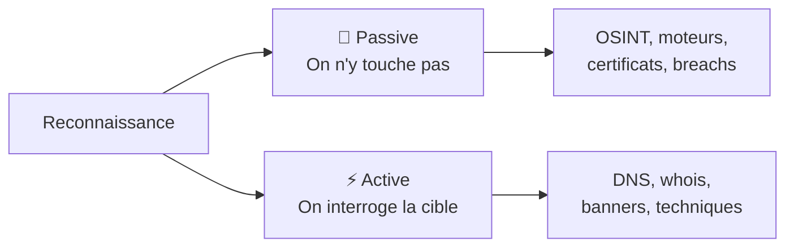
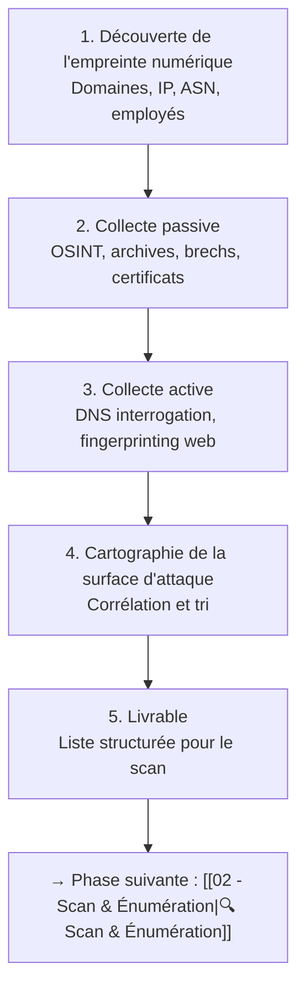
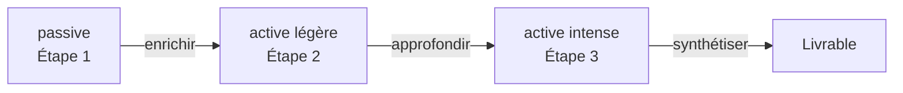
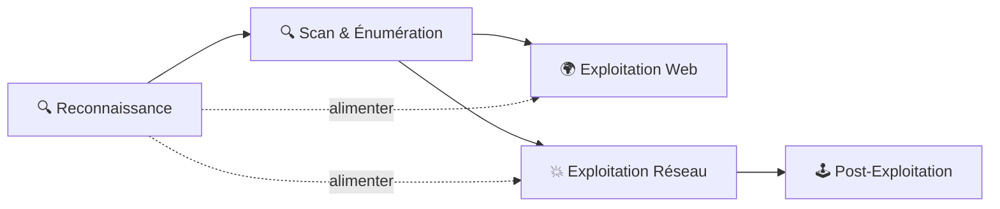
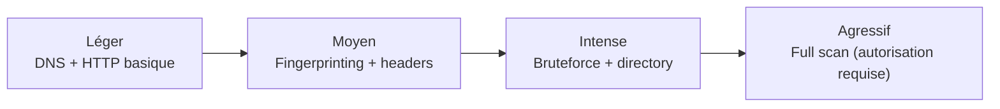
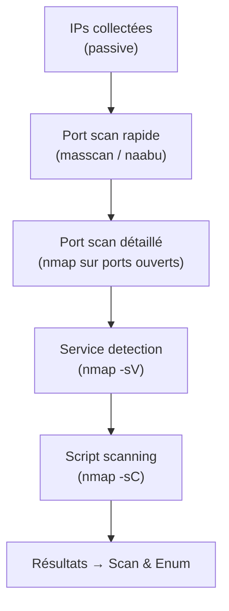
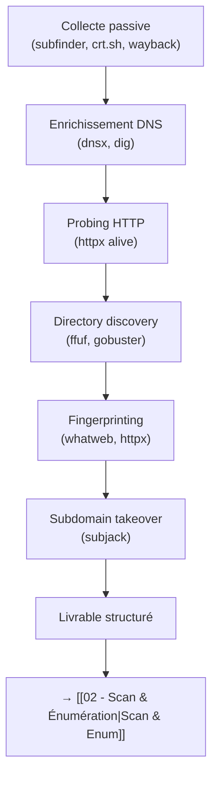

# 🕵️ Reconnaissance

> [!info] **C'est quoi ?**
> La phase où l'on **collecte un maximum d'informations** sur la cible **avant** de la toucher.
> Deux familles : **passive** (jamais de contact direct) et **active** (contact direct).



---

## Vue d'ensemble

La reconnaissance est **la phase la plus critique** d'un pentest. Une bonne recon produit plus de résultats exploitables qu'un scan aveugle. Le principe fondamental : **plus tu en sais avant d'attaquer, moins tu déclenches de défenses**.

### Les phases de la reconnaissance



### Passive vs Active — Arbre de décision

| Question | Réponse | Méthode |
|---|---|---|
| As-tu besoin de contacter la cible ? | Non → | Passive (OSINT) |
| As-tu besoin de contacter la cible ? | Oui → | Active |
| As-tu l'autorisation officielle ? | Non → | Passive **uniquement** |
| La cible est-elle sensible aux alertes ? | Oui → | Passive + active **lente et discrète** |
| As-tu déjà épuisé la passive ? | Oui → | Active (progressive) |
| As-tu besoin de résultats temps réel ? | Oui → | Active |

### Méthodologie recommandée



1. **Commencer toujours par la passive** — zéro risque de détection.
2. **Enrichir avec l'active légère** — DNS basique, fingerprinting, HTTP probes.
3. **Escaloter vers l'active intense** — bruteforce DNS, directory discovery, subdomain takeover.
4. **Synthétiser** — tout regrouper dans un livrable structuré pour la phase de scan.

### Position dans la kill chain



> [!tip] 📖 **Compléments de lecture**
> - [[11 - Glossaire|📖 Glossaire]] pour les termes techniques
> - [[10 - Cheatsheets|📋 Cheatsheets]] pour les commandes rapides
> - [[Tools|🧰 Bibliothèque d'Outils]] pour la liste complète des outils

---

## Reconnaissance Passive — Domaines

> [!warning] 🧊 **Le principe**
> On n'envoie **aucun paquet** à la cible. On exploite ce qui est **déjà public**.

### WhoIs — Deep dive

Le protocole WHOIS permet de retrouver le propriétaire d'un domaine ou d'une adresse IP. Les registres régionaux gèrent l'attribution des blocs IP :

| Registre | Zone | URL Whois |
|---|---|---|
| ARIN | Amérique du Nord | whois.arin.net |
| RIPE NCC | Europe, Moyen-Orient, Asie centrale | whois.ripe.net |
| APAC | Asie-Pacifique | whois.apnic.net |
| LACNIC | Amérique latine, Caraïbes | whois.lacnic.net |
| AFRINIC | Afrique | whois.afrinic.net |

```bash
# Informations domaine complet
whois example.com
whois example.com | grep -iE "registrar|creation|expir|name server|status"

# Historique WHOIS (via whoisds.com ou web.archive.org)
# Certains domaines changent de registrar — un changement récent peut signaler une reprise malveillante

# WHOIS sur IP
whois 203.0.113.50
whois -h whois.arin.net 203.0.113.50

# Registrant email — peut révéler d'autres domaines
# whois example.com | grep -i "registrant email"
# Puis chercher tous les domaines de ce même email sur whoisds.com
```

### DNS — Énumération passive complète

```bash
# Résolution de base — tous les types d'enregistrements
dig example.com ANY
dig example.com A
dig example.com AAAA
dig example.com MX
dig example.com NS
dig example.com TXT
dig example.com SOA
dig example.com CNAME
dig example.com SRV
dig example.com CAA

# Transfert de zone (rarement ouvert, mais toujours tester !)
dig axfr @ns1.example.com example.com
# Si ça marche → tu obtiens TOUS les sous-domaines en un coup
```

### Types d'enregistrements DNS — Référence complète

| Type | Utilité pour la recon | Exemple |
|---|---|---|
| **A** | Adresse IPv4 du serveur | `example.com → 93.184.216.34` |
| **AAAA** | Adresse IPv6 | `example.com → 2606:2800:220:1:248:1893:25c8:1946` |
| **MX** | Serveurs mail — révèle l'infra email | `example.com → mail.example.com (10)` |
| **NS** | Serveurs DNS — révèle l'infra DNS | `example.com → ns1.example.com` |
| **TXT** | SPF, DKIM, DMARC, vérifications | `v=spf1 include:_spf.google.com ~all` |
| **SOA** | Administrateur DNS, TTL, serial | Email de l'admin DNS (root.example.com) |
| **CNAME** | Alias vers un autre domaine | `app.example.com → app.herokuapp.com` |
| **SRV** | Services (Active Directory, XMPP) | `_ldap._tcp.dc._msdcs.example.com` |
| **CAA** | Autorités certificat autorisées | `letsencrypt.org` |
| **PTR** | Reverse DNS — IP vers hostname | `34.216.184.93.in-addr.arpa → example.com` |
| **NSAP** | Adresses réseau (rare) | Utilisé par certains réseaux ISP |

### DNS Over HTTPS (DoH) — contourner les restrictions

Certains environnements bloquent les requêtes DNS classiques. DoH permet de les contourner :

```bash
# Via curl + Google DoH
curl -s -H "accept: application/dns-json" "https://dns.google/resolve?name=example.com&type=A"

# Via curl + Cloudflare DoH
curl -s "https://cloudflare-dns.com/dns-query?name=example.com&type=ANY" -H "accept: application/dns-json"

# Via kdig (dnstools)
kdig +https example.com ANY
```

### DNS History — sous-domaines disparus

```bash
# Web Archive CDX API — tous les sous-domaines jamais crawlé
curl "https://web.archive.org/cdx/search/cdx?url=*.example.com&output=text&fl=original&collapse=urlkey"

# SecurityTrails (API payante mais puissante)
# securitytrails.com/domain/example.com/dns

# DNSHistory via dnsdumpster.com — gratuit et visuel
# dnsdumpster.com → entre le domaine → carte graphique de l'infrastructure
```

### Analyse de registrar et registrant

```bash
# Extraire l'email du registrant (souvent dans le WHOIS)
whois example.com | grep -i "registrant email"

# Chercher d'autres domaines enregistrés par le même email
# → whoisds.com/whois-data/domain-whois-email
# → reversewhois.info

# Enrichir avec des outils
# whoisfreaks.com → historique complet du WHOIS
# viewdns.info/whois → visualisation rapide
```

---

## Reconnaissance Passive — Sous-domaines

La découverte de sous-domaines est **l'étape la plus importante** de la recon passive. Un entreprise typique a des dizaines, voire des centaines de sous-domaines exposés.

### Découverte via Certificate Transparency (crt.sh)

```bash
# crt.sh — base de données publique des certificats TLS
curl -s "https://crt.sh/?q=%25.example.com&output=json" | jq '.[].name_value' | sort -u

# Extraire les uniques
curl -s "https://crt.sh/?q=%25.example.com&output=json" | jq -r '.[].name_value' | sort -u | tee crt_subs.txt

# crt.sh retourne aussi les wildcard mais attention aux doublons
# Le %25 est l'encodage URL du wildcard %
```

### Outils de sous-domaines passifs

| Outil | Méthode | Avantage |
|---|---|---|
| **[[Outil - subfinder]]** | 40+ sources passives | Rapide, fiable, très peu de bruit |
| **[[Outil - Amass]]** | 50+ sources + brute force | Le plus complet en mode passif |
| **[[Outil - chaos]]** | API ProjectDiscovery | Base de données propre |
| **Ouija** | 30+ sources | Léger, bon pour les scripts |
| **assetfinder** | Sources variées | Simple et rapide |
| **Sublist3r** | 10+ sources | Classique mais vieillissant |

```bash
# subfinder — le standard
subfinder -d example.com -all -silent | sort -u

# amass en mode passif (aucun contact direct)
amass enum -passive -d example.com

# chaos via ProjectDiscovery
chaos -d example.com -silent

# Combiner les sources pour plus de complétude
(subfinder -d example.com -silent; amass enum -passive -d example.com; chaos -d example.com -silent) | sort -u
```

### Aliased domains (CNAME analysis)

```bash
# Les CNAME vers des services tiers révèlent l'infrastructure
# ex: app.example.com → app.herokudns.com → révèle l'usage de Heroku
# ex: api.example.com → amazonaws.com → révèle l'usage d'AWS

# Détecter les CNAME dangereux (subdomain takeover potentiel)
dig CNAME app.example.com +short
# Si le CNAME pointe vers un service non configuré → subdomain takeover possible
```

### Reverse WHOIS — Trouver d'autres domaines de la cible

```bash
# Chercher par registrant email
# whoisds.com → entrer l'email du registrant

# Chercher par registrant name
# viewdns.info/whois?domain=example.com → puis chercher le nom du titulaire

# Les entreprises ont souvent des domaines "oubliés"
# → protection-marque.fr, example-staging.com, example-dev.net
# → tous des cibles potentielles avec moins de sécurité
```

---

## Reconnaissance Passive — Web

### Waybackurls & Archive.org

Le Wayback Machine contient des snapshots de millions de sites web. Les URLs archivées révèlent des endpoints oubliés, des paramètres, et des fichiers sensibles.

```bash
# waybackurls — toutes les URLs archivées pour un domaine
echo example.com | waybackurls | sort -u | tee wayback_urls.txt

# gau (Get All Urls) — combine Wayback + Common Crawl + OTX + URLScan
echo example.com | gau --subs | sort -u | tee gau_urls.txt

# Filtrer les endpoints intéressants
cat wayback_urls.txt | grep -iE "\.(php|asp|aspx|jsp|json|xml|txt|bak|sql|log|config)$"
cat wayback_urls.txt | grep -iE "(id|file|page|download|url|redirect|token|session)="
cat wayback_urls.txt | grep -iE "(admin|login|dashboard|api|debug|test|dev|staging)"

# Paramètres uniques — révèlent les champs de formulaires
cat wayback_urls.txt | grep -oP '([?&][a-zA-Z_]+)=\*' | sort -u
```

### JS Endpoint Extraction

Les fichiers JavaScript contiennent souvent des routes et des endpoints API non documentés :

```bash
# Extraire les JS files
cat wayback_urls.txt | grep -iE "\.js$" | sort -u

# Télécharger et analyser
cat js_urls.txt | xargs -I{} curl -s {} | grep -oE '["/][a-zA-Z0-9/._-]+["/]' | sort -u

# Outils spécialisés
# LinkFinder — extrait les endpoints depuis les JS
# python3 LinkFinder.py -i https://example.com/app.js -o cli

# SecretFinder — cherche les secrets dans les JS
# python3 SecretFinder.py -i https://example.com/app.js -e
```

### Param-miner & Hidden Parameters

```bash
# param-miner (extension Burp) — trouve les paramètres cachés
# Utile même en passif car on peut analyser les réponses archivées

# Techniques pour trouver des paramètres cachés depuis les archives :
# 1. Chercher dans les JS archivés
# 2. Croiser les paramètres trouvés sur d'autres sous-domaines
# 3. Analyser les anciens formulaires
```

### Fichiers sensibles exposés — checklist

| Type de fichier | Motif de recherche | Risque |
|---|---|---|
| `.env` | Variables d'environnement | Secrets, API keys, DB credentials |
| `.git/` | Repository git | Code source complet |
| `.svn/` | Repository SVN | Code source complet |
| `backup.sql` | Dump de base de données | Données clients |
| `*.bak` | Sauvegardes | Code, configs |
| `config.php.bak` | Config avec credentials | Accès base de données |
| `debug.log` | Logs de debug | Infos internes, stack traces |
| `.htaccess` | Configuration Apache | Règles de réécriture, restrictions |
| `phpinfo.php` | Info PHP | Version, modules, chemins |

```bash
# Recherche dans les archives
echo example.com | gau | grep -iE "(\.env|\.git|\.svn|backup|\.bak|config|phpinfo|debug\.log)"

# via Google Dorks (voir section dédiée)
```

---

## Reconnaissance Passive — Google Dorks

Les Google Dorks exploitent les opérateurs de recherche avancés de Google pour trouver des informations exposées involontairement.

### Table complète des dorks

| Dork | Description | Exemple |
|---|---|---|
| `site:` | Limiter à un domaine | `site:*.example.com` |
| `inurl:` | Chercher dans les URLs | `inurl:admin` |
| `intitle:` | Chercher dans les titres | `intitle:"index of"` |
| `intext:` | Chercher dans le texte | `intext:"password"` |
| `filetype:` | Type de fichier | `filetype:pdf` |
| `cache:` | Version cachée | `cache:example.com` |
| `ext:` | Extension fichier | `ext:sql` |
| `allinurl:` | Tous les termes dans l'URL | `allinurl:admin login` |
| `allintitle:` | Tous les termes dans le titre | `allintitle:admin dashboard` |
| `link:` | Pages liées | `link:example.com` |

### Dorks pour la reconnaissance — exemples avancés

| Catégorie | Dork | Ce que ça trouve |
|---|---|---|
| **Sous-domaines** | `site:*.example.com -www` | Sous-domaines indexés |
| **Backups** | `intitle:"index of /" + "backup"` | Backups exposés (Apache) |
| **SQL** | `filetype:sql "INSERT INTO"` | Dumps SQL |
| **phpMyAdmin** | `inurl:phpmyadmin` | Interface admin MySQL |
| **Credentials** | `intext:"password" filetype:env` | Fichiers .env avec mots de passe |
| **Clés privées** | `"BEGIN RSA PRIVATE KEY" filetype:pem` | Clés privées exposées |
| **Webcams** | `inurl:8080 "webcam"` | Webcams IP |
| **Cache** | `cache:example.com/login` | Version cachée d'une page |
| **Logs** | `filetype:log "password"` | Fichiers de logs avec mots de passe |
| **Config** | `filetype:conf "password"` | Fichiers de configuration sensibles |
| **XML** | `filetype:xml "password"` | Fichiers XML avec credentials |
| **FTP** | `inurl:ftp://` | Liens FTP exposés |

### GitHub Dorks

```bash
# Rechercher des secrets dans les repos GitHub
# Dorks utiles pour la reconnaissance passive

# API Keys et Tokens
"api_key" site:github.com "example.com"
"apikey" site:github.com "example.com"
"secret_key" site:github.com "example.com"
"access_token" site:github.com "example.com"

# Credentials
"password" site:github.com "example.com"
"passwd" site:github.com "example.com"
"credentials" site:github.com "example.com"

# Configuration
"db_password" site:github.com "example.com"
"mysql_password" site:github.com "example.com"
"AWS_ACCESS_KEY" site:github.com "example.com"

# Outils automatisés
# gitdorker — automatisé les GitHub dorks
gitdorker -q "api_key example.com" -d example.com -t tokens.txt

# trufflehog — scanne les repos pour les secrets
trufflehog filesystem --directory=./cloned-repo
trufflehog github --org=example.com

# gitleaks — similaire à trufflehog
gitleaks detect --source ./cloned-repo --report-format=json
```

### GitLab Dorks

```bash
# GitLab a les mêmes failles que GitHub mais est souvent moins surveillé
# Dorks pour GitLab :
"password" site:gitlab.com "example.com"
"api_key" site:gitlab.com "example.com"
"secret" site:gitlab.com "example.com"

# Les instances GitLab auto-hébergées sont encore plus intéressantes
# → souvent pas de robots.txt qui bloque l'indexation
```

### Jira / Confluence / Atlassian Dorks

```bash
# Ces outils contiennent souvent des informations internes très sensibles

# Jira
site:example.atlassian.net "internal"
intitle:"Dashboard" inurl:"/secure/Dashboard.jspa" site:example.atlassian.net
inurl:"/rest/api/latest/issue" site:example.atlassian.net

# Confluence
intitle:"Confluence" site:example.atlassian.net
inurl:"/pages/viewpage.action" site:example.atlassian.net

# Bitbucket
site:bitbucket.org "example.com"
```

---

## Reconnaissance Passive — Secrets exposés

### Outils de détection de secrets

| Outil | Type | Usage |
|---|---|---|
| **trufflehog** | Généraliste | Scanne Git, filesystem, S3 buckets |
| **gitleaks** | Git-focused | Détection de secrets dans les commits |
| **git-secrets** | Git hook | Empêche les secrets d'être commités |
| **detect-secrets** (Yelp) | Git-focused | Baseline de secrets connus |
| **gh-fake-analyzer** | GitHub | Analyse les forks GitHub |

```bash
# trufflehog — le plus complet
# Scanner un repo local
trufflehog filesystem --directory=/path/to/repo

# Scanner un repo GitHub
trufflehog github --org=example.com --include-forks

# Scanner un repo GitLab
trufflehog gitlab --group=example.com

# gitleaks — plus rapide mais moins complet
gitleaks detect --source /path/to/repo --report-format=json --report-path=gitleaks.json

# Vérifier un baseline existant
gitleaks protect --staged
```

### Fuites de données — BDD publiques

| Plateforme | Contenu | Accès |
|---|---|---|
| **HaveIBeenPwned** | Emails compromis | API gratuite (limitée) |
| **Dehashed** | Emails + mots de passe | Payant |
| **IntelX (Intelligence X)** | Emails, IPs, domaines, fichiers | Freemium |
| **LeakedSite** | Brechs | Payant |
| **Breached.to** | Brechs compilés | Communauté |

```bash
# haveibeenpwned — vérifier un email
# haveibeenpwned.com/api/v3/breachedaccount/{email}

# IntelX — recherche par domaine
# intelligence.xapi.net/api/v1/search?term=example.com

# Dehashed — recherche par email ou domaine
# dehashed.com/search?query=example.com
```

### .env Leaks — extraction et analyse

```bash
# Trouver des .env exposés via Google Dorks
intext:"APP_KEY=" filetype:env
intext:"DB_PASSWORD=" filetype:env

# Via Wayback URLs
echo example.com | waybackurls | grep -i "\.env"

# Analyse d'un .env trouvé
cat .env | grep -iE "(key|secret|password|token|api)"
```

### S3 Buckets & Cloud Storage

```bash
# AWS S3 Bucket naming : {company}-{purpose}.{region}.amazonaws.com
s3scanner scan -f buckets.txt
```

---

## Reconnaissance Passive — OSINT Réseau Social

### LinkedIn — Enumeration d'employés

```bash
# LinkedIn est LA source #1 pour l'OSINT d'entreprise

# Techniques :
# 1. Chercher "Company Name" sur LinkedIn
# 2. Filtrer par département
# 3. Extraire les noms, titres, emails formats

# Format d'email courant pour les entreprises
# {prénom}.{nom}@example.com
# {prénom}.{nom[0]}@example.com
# {prénom[0]}{nom}@example.com
# {prenom}@example.com
# {nom}@example.com
```

### Twitter/X — OSINT

```bash
# Techniques :
# 1. Chercher les tweets de l'entreprise
# 2. Filtrer par employees qui postent sur la tech de l'entreprise
# 3. Les posts de recrutement révèlent la stack technique

# Exemples de tweets intéressants :
# "On recrute un dev Python/Django pour notre plateforme"
# →栈 technique : Python + Django + PostgreSQL probablement
```

### Harvesting d'emails

```bash
# theHarvester — outil classique d'OSINT
# [[Outil - theHarvester]]
theHarvester -d example.com -b google,linkedin,bing

# Recon-ng — module d'OSINT complet
# [[Outil - Recon-ng]]
# Recon-ng > modules > search > harvester_email

# emailfinder — simple et rapide
# emailfinder --domain example.com
```

### Organisation et hiérarchie

```bash
# Techniques pour cartographier l'organisation :
# 1. Site web "Notre équipe" / "About us" → noms + titres
# 2. GitHub → contributeurs
# 3. Rapports annuels → structure organisationnelle
# 4. Conférences → speakers de l'entreprise

# → Organigramme = cibles prioritaires pour l'ingénierie sociale
```

### OSINT pour l'ingénierie sociale préparatoire

```bash
# Avant un engagement avec social engineering :
# 1. Identifier les personnes clés (IT, Dev, Compta)
# 2. Trouver leurs formats d'email
# 3. Vérifier leurs comptes compromis (HIBP)
# 4. Identifier les outils internes (Slack, Teams, Jira)
# 5. Noter les technologies utilisées (LinkedIn posts)
```

---

## Reconnaissance Passive — Shodan & Censys

> [!tip] 🛰️ **Shodan = "Google de l'Internet des objets"**
> Shodan scanne en permanence **tout l'Internet** et indexe les bannières.

### Shodan — Syntaxe et CLI

```
port:22                                # filtre par port
country:FR                             # filtre par pays
hostname:example.com                   # par nom d'hôte
product:apache                         # par produit
http.title:"Admin"                     # par titre de page
http.favicon.hash:116323821            # par favicon hash
ssl.cert.subject.cn:example.com        # par certificat
vuln:CVE-2024-3400                     # machines vulnérables !
os:"Windows Server 2022"               # par OS

# Exemples combinés
port:3389 country:FR city:"Paris" os:"Windows 10"
http.title:"login" country:DE product:apache
ssl.cert.subject.cn:*.example.com port:443
```

```bash
shodan search "product:apache country:FR" --fields ip_str,port,org
shodan host 8.8.8.8
shodan stats --facets port "product:nginx"
shodan init YOUR_API_KEY
```

### Censys, Fofa & ZoomEye

```
# Censys (concurrent de Shodan)
services.service_name: HTTP AND services.port: 443
parsed.subject.common_name: "example.com"
vulnerabilities.cve_id: CVE-2021-44228

# Fofa
domain="example.com" && port="443"

# ZoomEye
port:22 && has_screenshot:true
```

> [!tip] 🔔 **Monitoring Shodan/Censys**
> Configure des alertes sur les IP de l'entreprise pour détecter les changements d'infrastructure, les nouveaux services exposés, et les CVE récentes.

---

## Reconnaissance Passive — Certificats TLS

### Certificate Transparency (CT) — Principe

Les certificats TLS sont enregistrés dans des logs publics (CT logs) conformément aux standards du secteur. Cela permet de découvrir tous les sous-domaines pour lesquels des certificats ont été émis.

```bash
# crt.sh — la meilleure source gratuite
curl -s "https://crt.sh/?q=%25.example.com&output=json" | jq -r '.[] | "\(.name_value) \(.not_after)"' | sort -u

# Filtrer les certificats encore valides
curl -s "https://crt.sh/?q=%25.example.com&output=json" | jq -r 'select(.not_after > now) | .name_value' | sort -u
```

### Censys Certificates — Recherche avancée

```bash
# Rechercher tous les certificats pour un domaine
# censys.io/certificates?q=example.com

# API Censys
curl -u "API_ID:API_SECRET" "https://search.censys.io/api/v2/certificates?q=example.com"

# Les certificats révèlent :
# - Sous-domaines internes
# - Noms de serveurs
# - Adresses IP
# - Organisations
# - Evenements de renouvellement
```

### Découverte de sous-domaines via certificats — workflow complet

```bash
# Méthode 1 : crt.sh
curl -s "https://crt.sh/?q=%25.example.com&output=json" | jq -r '.[].name_value' | sort -u > crt_subs.txt

# Méthode 2 : Censys (plus détaillé mais payant)
# Résultats plus propres, moins de faux positifs

# Méthode 3 : Facebook CT (gratuit et rapide)
curl -s "https://www.facebook.com/certinfo/?domain=example.com"

# Combiner toutes les sources
(cat crt_subs.txt; subfinder -d example.com -silent) | sort -u > all_subs.txt

# Les certificats wildcard (*.example.com) sont un goldmine
# Ils révèlent les sous-domaines même s'ils ne sont pas en DNS actuellement
```

---

## Reconnaissance Passive — BDD de fuites

### Plateformes et données disponibles

| Plateforme | Type de données | Accès |
|---|---|---|
| **HaveIBeenPwned** | Emails compromis | API gratuite |
| **Dehashed** | Emails + passwords + hashes | Payant |
| **IntelX** | Emails, IPs, fichiers, screenshots | Freemium |
| **Leaked.com** | Brechs compilées | Payant |
| **Pwndb (en ligne)** | Credentials | Communauté |

```bash
# HaveIBeenPwned — vérifier un email
# API : haveibeenpwned.com/api/v3/breachedaccount/{email}?truncateResponse=false

# Dehashed — recherche avancée
# dehashed.com → recherche par domaine, email, IP
# Résultats : email:password, email:hash, username:password

# IntelX — recherche par domaine
# intelligence.xapi.net/api/v1/search?term=example.com&type=email
# intelligence.xapi.net/api/v1/search?term=example.com&type=domain
```

### Credential Stuffing Prep

```bash
# Préparer les credentials pour le credential stuffing
cat leaked_data.txt | cut -d: -f1,2 | sort -u > credentials_raw.txt
# Puis mapper vers les formats d'email de l'entreprise
```

> [!warning] ⚖️ **Cadre légal**
> L'utilisation de bases de données de fuites est **légale pour vérifier ses propres comptes** ou avec l'autorisation écrite du client. L'objectif est de démontrer le risque de réutilisation de mots de passe.

---

## Reconnaissance Passive — Social Engineering préparatoire

### Objectif de la phase préparatoire

Avant toute activité de [[07 - Wireless, MITM & Social Engineering]], la recon passive permet de préparer des attaques d'ingénierie sociale ciblées et crédibles.

### OSINT pour la Social Engineering

```bash
# 1. Découvrir le format d'email de l'entreprise
# → Site web, LinkedIn, GitHub, documents publics
# → Format : {prénom}.{nom}@example.com ou {pnom}@example.com

# 2. Identifier les employés cibles
# → LinkedIn : IT team, Security team, Finance team
# → Les comptables sont souvent plus vulnérables aux phishing
# → Les IT ont accès aux systèmes critiques

# 3. Collecter des informations contextuelles
# → Actualités de l'entreprise (Google News)
# → Technologies utilisées (LinkedIn posts)
# → Projets en cours (conférences, publications)

# 4. Vérifier les comptes compromis
# → haveibeenpwned.com
# → Les mots de passe réutilisés = accès immédiat
```

### Tech Stack fingerprinting via moyens passifs

```bash
# Le fingerprinting passif révèle la stack technique sans toucher la cible

# 1. En-têtes HTTP archivés (Wayback)
# Les headers archivés montrent le serveur web utilisé

# 2. Fichiers JavaScript et CSS
# Les patterns dans les JS révèlent les frameworks
# → React : data-reactroot, __NEXT_DATA__
# → Vue.js : data-v-, Vue.js
# → Angular : ng-version, ng-app

# 3. Meta tags et generator
# <meta name="generator" content="WordPress 6.4">
# <meta name="generator" content="Django">

# 4. Technologies dans les certificats TLS
# L'organization du certificat révèle parfois l'infrastructure

# 5. Google Analytics ID, Google Tag Manager ID
# → Peut révéler d'autres sites de la même entreprise
```

---

## Reconnaissance Active — Vue d'ensemble

> [!danger] ⚡ **Attention**
> Là, on **contacte** la cible. Ça peut laisser des traces dans les logs.

### Quand passer en mode actif ?

| Critère | Action |
|---|---|
| La passive est épuisée | → Passer à l'active légère |
| Tu as besoin de données temps réel | → Active nécessaire |
| La cible est protégée par WAF | → Active avec throttling |
| Tu n'as pas d'autorisation | → **Rester en passive** |
| Le client a fourni un scope | → Active dans les limites du scope |

### Risques de la recon active

| Risque | Conséquence |
|---|---|
| Logs DNS | La cible voit tes requêtes |
| Logs serveur web | Les IPs d'origine sont enregistrées |
| Détection WAF | Le scan est bloqué ou escaladé |
| Alertes SOC | Réaction de l'équipe sécurité |
| Déclenchement légal | Si pas d'autorisation, c'est illegal |

### Niveaux d'intensité



---

## Reconnaissance Active — DNS

### Zone Transfer Attack

```bash
# Le transfert de zone DNS est la technique la plus puissante quand elle fonctionne
# Elle retourne TOUS les enregistrements DNS d'une zone

# Test de transfert de zone
dig axfr @ns1.example.com example.com
# Si la zone est mal configurée → tu obtiens tout

# dnsenum — automatisé
dnsenum --enum example.com

# dnsrecon — plus complet
dnsrecon -d example.com -t std
dnsrecon -d example.com -t axfr  # test zone transfer
```

### DNS Bruteforce — sous-domaines discovery

```bash
# Quand la passive ne suffit pas, le bruteforce DNS est la solution
# → Interroger le DNS pour des sous-domaines courants

# dnsx — rapide et efficace
cat wordlists/subdomains.txt | dnsx -d example.com -a -resp-only

# fierce — classique et fiable
fierce --domain example.com

# dnsenum — complète avec zone transfer test
dnsenum --enum example.com --brute -f wordlists/subdomains.txt

# dnsrecon — bruteforce avec wildcard detection
dnsrecon -d example.com -D wordlists/subdomains.txt -t brt
```

### Wildcard Detection

```bash
# Beaucoup de domaines ont un wildcard DNS configuré
# → Tous les sous-domaines fictifs pointent vers la même IP
# → Le bruteforce produit des milliers de faux positifs

# Détecter le wildcard
dig *.example.com
# Si ça retourne une IP → wildcard configuré

# Méthode pour contourner le wildcard
# 1. Générer un sous-domaine aléatoire
# 2. Le résoudre
# 3. Si ça retourne une IP → wildcard
# 4. Exclure cette IP des résultats du bruteforce

# Exemple avec dnsx
dnsx -d example.com -a -resp-only -wd  # wildcard detection
```

### Table complète des enregistrements DNS

| Type | Description | Commande |
|---|---|---|
| **A** | Adresse IPv4 | `dig A example.com` |
| **AAAA** | Adresse IPv6 | `dig AAAA example.com` |
| **MX** | Serveur mail | `dig MX example.com` |
| **NS** | Serveur DNS | `dig NS example.com` |
| **TXT** | Texte (SPF, DKIM, DMARC) | `dig TXT example.com` |
| **SOA** | Autorité DNS | `dig SOA example.com` |
| **CNAME** | Alias | `dig CNAME app.example.com` |
| **SRV** | Service (AD, XMPP) | `dig SRV _ldap._tcp.example.com` |
| **CAA** | Autorité certificat | `dig CAA example.com` |
| **PTR** | Reverse DNS | `dig -x 203.0.113.50` |
| **HINFO** | Info hardware (rare) | `dig HINFO example.com` |
| **RP** | Responsible person | `dig RP example.com` |

---

## Reconnaissance Active — Web fingerprinting

### Outils de fingerprinting

| Outil | Type | Avantage |
|---|---|---|
| **whatweb** | CLI | Riche en plugins, 1800+ technologies |
| **[[Outil - httpx]]** | CLI | Rapide, intégrable au pipeline |
| **Wappalyzer** | Extension | Détaillée, navigateur |
| **BuiltWith** | Web | Analyse complète de la stack |

```bash
# whatweb — le plus complet en CLI
whatweb http://example.com
whatweb -v http://example.com  # verbose
whatweb --color=never -a 3 http://example.com  # aggressivité

# httpx — rapide et intégrable au pipeline
echo "http://example.com" | httpx -title -tech-detect -status-code -follow-redirects
```

### Server Headers Analysis

```bash
# Les en-têtes serveur révèlent des informations critiques
curl -sI http://example.com

# Headers intéressants :
# Server: Apache/2.4.54 (Ubuntu)  → version exacte
# X-Powered-By: PHP/8.1.2         → langage et version
# X-AspNet-Version: 4.0.30319     → framework .NET
# X-Generator: WordPress 6.4      → CMS
```

### Cookie Analysis

```bash
# Les cookies révèlent les technologies utilisées
curl -sI http://example.com | grep -i "set-cookie"
# PHPSESSID→PHP, JSESSIONID→Java, ASP.NET_SessionId→ASP.NET, csrftoken→Django
```

### Security Headers Audit

```bash
# Vérifier les en-têtes de sécurité
curl -sI http://example.com | grep -iE "strict-transport|x-frame|x-content|content-security|x-xss|x-permitted"

# En-têtes attendus :
# Strict-Transport-Security: max-age=31536000; includeSubDomains
# X-Frame-Options: DENY
# X-Content-Type-Options: nosniff
# Content-Security-Policy: default-src 'self'
# X-XSS-Protection: 0 (obsolète mais indicateur)
```

---

## Reconnaissance Active — HTTP probing & alive detection

### httpx — workflow complet

```bash
# httpx est l'outil standard pour le probing HTTP
# Il vérifie quels hôtes sont vivants et retourne des métadonnées

# Basique — trouver les hôtes vivants
cat subdomains.txt | httpx -silent

# Enrichi — titre, statut, technologie
cat subdomains.txt | httpx -title -status-code -tech-detect -follow-redirects

# Avec screenshot
cat subdomains.txt | httpx -screenshot

# Sortie structurée (JSON)
cat subdomains.txt | httpx -json -o alive.json

# Pipeline complet :
subfinder -d example.com -silent | httpx -title -status-code -tech-detect -silent | tee alive.txt
```

### Code de statut HTTP — signification

| Code | Signification | Intérêt pentest |
|---|---|---|
| **200** | OK | Site fonctionnel |
| **301** | Redirect permanent | Redirection à suivre |
| **302** | Redirect temporary | Redirection potentiellement manipulable |
| **401** | Unauthorized | Protection d'authentification |
| **403** | Forbidden | Protection d'accès → potentiel contournable |
| **404** | Not Found | Page inexistante |
| **405** | Method Not Allowed | Méthode HTTP non autorisée → tester PUT/DELETE |
| **500** | Internal Server Error | Erreur serveur → potentiel vulnérable |
| **502** | Bad Gateway | Proxy/Load balancer configuré |
| **503** | Service Unavailable | Surcharge ou maintenance |

---

## Reconnaissance Active — Directory discovery

### Outils de directory bruteforce

| Outil | Caractéristique | Usage |
|---|---|---|
| **[[Outil - ffuf]]** | Le plus rapide et flexible | Directory bruteforce, VHost discovery |
| **[[Outil - gobuster]]** | Plus simple | Directory et DNS bruteforce |
| **[[Outil - Feroxbuster]]** | Recursive automatique | Directory discovery profonde |
| **[[Outil - dirsearch]]** | Classique | Directory et file discovery |
| **wfuzz** | Le plus puissant | Fuzzing généraliste |

```bash
# ffuf — le standard moderne
ffuf -u http://example.com/FUZZ -w /usr/share/wordlists/dirb/common.txt -mc 200,301,302,403

# gobuster — simple et efficace
gobuster dir -u http://example.com -w /usr/share/wordlists/dirb/common.txt

# feroxbuster — récursif automatiquement
feroxbuster -u http://example.com -w /usr/share/wordlists/dirb/common.txt

# wfuzz — puissant mais plus complexe
wfuzz -c -z file,/usr/share/wordlists/dirb/common.txt --hc 404 http://example.com/FUZZ
```

### Wordlists recommandées

| Wordlist | Taille | Usage |
|---|---|---|
| `dirb/common.txt` | ~4.6k | Basique, rapide |
| `dirbuster/directory-list-2.3-medium.txt` | ~220k | Moyen, complet |
| `SecLists/Discovery/Web-Content/raft-large-directories.txt` | ~62k | Large, recommandé |
| `SecLists/Discovery/Web-Content/raft-large-files.txt` | ~54k | Fichiers |
| `raft-large-words.txt` | ~48k | Mots |

### Extensions à tester

```bash
# Ajouter des extensions pertinentes à la wordlist
# PHP, ASP, ASPX, JSP, HTML, TXT, BAK, OLD, LOG, SQL

ffuf -u http://example.com/FUZZ -w /usr/share/wordlists/dirb/common.txt -e .php,.asp,.aspx,.jsp,.html,.txt

# Filtrer les réponses non pertinentes (taille, mot-clé)
ffuf -u http://example.com/FUZZ -w wordlist.txt -fc 404 -fs 0
```

### VHost Discovery

```bash
# Découverte de Virtual Hosts — même IP, plusieurs sites
# Important quand un hébergeur gère plusieurs domaines

# ffuf — VHost bruteforce
ffuf -u http://TARGET_IP -H "Host: FUZZ.example.com" -w subdomains.txt -fc 403

# gobuster — mode vhost
gobuster vhost -u http://TARGET_IP -w subdomains.txt

# Technique : comparer la réponse avec le bon Host et un Host fictif
# La différence de taille/contenu révèle le bon VHost
```

---

## Reconnaissance Active — Subdomain takeover check

### Principe

Un subdomain takeover survient quand un sous-domaine pointe (CNAME) vers un service tiers non configuré. L'attaquant peut then "prendre possession" du sous-domaine.

### Outils de vérification

```bash
# subjack — le plus utilisé
subjack -w subdomains.txt -t 100 -timeout 30 -ssl -c fingerprints.json -v

# subover — moderne et rapide
subover -l subdomains.txt -timeout 60

# can-i-take-over-xyz — base de données des services vulnérables
# https://github.com/EdOverflow/can-i-take-over-xyz
```

### Workflow complet

```bash
# 1. Trouver tous les sous-domaines (passive)
subfinder -d example.com -all -silent > all_subs.txt

# 2. Résoudre les DNS
dnsx -l all_subs.txt -a -resp-only > resolved_ips.txt

# 3. Identifier les CNAME vers des services tiers
cat all_subs.txt | dnsx -cname -resp | grep -E "(heroku|aws|azure|github|fastly|pantheon|shopify|ghost|surge)"

# 4. Tester la prise de contrôle
# Pour chaque CNAME identifié, vérifier si le service est toujours actif
```

### Services couramment vulnérables

| Service | Pattern CNAME | Risque |
|---|---|---|
| **GitHub Pages** | `*.github.io` | Prise de contrôle si repo supprimé |
| **Heroku** | `*.herokudns.com` | Prise de contrôle si app supprimée |
| **AWS S3** | `*.s3.amazonaws.com` | Bucket public non configuré |
| **Azure** | `*.azurewebsites.net` | App supprimée |
| **Fastly** | `*.fastly.net` | CDN non configuré |
| **Pantheon** | `*.pantheonsite.io` | Site supprimé |
| **Shopify** | `*.myshopify.com` | Boutique supprimée |

---

## Reconnaissance Active — SMTP user enum

### Techniques d'énumération SMTP

```bash
# smtp-user-enum — l'outil dédié
# Méthode VRFY — vérifie si un utilisateur existe
smtp-user-enum -M VRFY -U users.txt -t 192.168.1.10

# Méthode RCPT — teste si une adresse email est acceptée
smtp-user-enum -M RCPT -D example.com -U users.txt -t 192.168.1.10

# Méthode EXPN — expande une liste de diffusion (rarement active)
smtp-user-enum -M EXPN -U users.txt -t 192.168.1.10
```

### Swaks — SMTP testing

```bash
# swaks — Swiss Army Knife pour SMTP
# Tester l'authentification
swaks --to admin@example.com --from test@example.com --server 192.168.1.10 --auth-user admin

# Tester sans authentification
swaks --to admin@example.com --from test@example.com --server 192.168.1.10

# Tester avec STARTTLS
swaks --to admin@example.com --from test@example.com --server 192.168.1.10 --tls
```

### VRFY / EXPN / RCPT — explication

| Commande | Description | Utilité |
|---|---|---|
| **VRFY** | Vérifie si un utilisateur existe | Énumération directe |
| **EXPN** | Expand une liste de diffusion | Liste des membres |
| **RCPT TO** | Teste si une adresse est acceptée | Validation d'adresses |
| **MAIL FROM** | Définit l'expéditeur | Spoofing potentiels |

> [!warning] ⚠️ **Limites**
> La plupart des serveurs SMTP modernes désactivent VRFY et EXPN. Le test RCPT est plus fiable mais peut être limité par le rate limiting.

---

## Reconnaissance Active — Banner grabbing

### Techniques de banner grabbing

```bash
# Netcat — le classique
nc -nv 192.168.1.10 80
# → "HTTP/1.1 200 OK\nServer: Apache/2.4.54 (Ubuntu)"
nc -nv 192.168.1.10 22
# → "SSH-2.0-OpenSSH_8.9p1 Ubuntu-3ubuntu0.1"

# cURL — en-têtes HTTP
curl -I http://192.168.1.10
# → Server: nginx/1.24.0

# OpenSSL — banner TLS/SSL
openssl s_client -connect 192.168.1.10:443 2>/dev/null | head -20
# → Révèle le certificat TLS et la version

# Nmap — service detection
nmap -sV -sC 192.168.1.10
# → Version la plus précise
```

### Bannières par service courant

| Port | Service | Bannière typique |
|---|---|---|
| **21** | FTP | `220 Microsoft FTP Service` |
| **22** | SSH | `SSH-2.0-OpenSSH_8.9p1` |
| **23** | Telnet | `Ubuntu 22.04 LTS` |
| **25** | SMTP | `220 mail.example.com ESMTP Postfix` |
| **53** | DNS | (pas de bannière — utiliser DNSversion) |
| **80** | HTTP | `Server: Apache/2.4.54` |
| **110** | POP3 | `+OK Dovecot ready` |
| **143** | IMAP | `* OK [CAPABILITY IMAP4rev1] Dovecot ready` |
| **443** | HTTPS | (certificat TLS) |
| **993** | IMAPS | `* OK [CAPABILITY IMAP4rev1] Dovecot ready` |
| **3306** | MySQL | `5.7.42-0ubuntu0.18.04.1-log` |
| **3389** | RDP | `Cookie: mstshash=...` |
| **5432** | PostgreSQL | (pas de bannière — tenter auth) |

---

## Reconnaissance Active — Headers & security audit

### Checklist des en-têtes de sécurité

| En-tête | Valeur recommandée | Risque si absent |
|---|---|---|
| **Strict-Transport-Security** | `max-age=31536000; includeSubDomains` | Downgrade HTTP → man-in-the-middle |
| **X-Frame-Options** | `DENY` | Clickjacking |
| **X-Content-Type-Options** | `nosniff` | MIME type confusion |
| **Content-Security-Policy** | Détaillé selon le site | XSS, injection de contenu |
| **X-XSS-Protection** | `0` (obsolète mais indicateur) | XSS reflected (anciens navigateurs) |
| **Referrer-Policy** | `no-referrer-when-downgrade` | Fuite d'informations |
| **Permissions-Policy** | `geolocation=(), camera=()` | Accès non autorisé aux APIs |
| **X-Permitted-Cross-Domain** | `none` | Cross-domain leakage |

### Cookie flags audit

```bash
# Vérifier les drapeaux des cookies
curl -sI http://example.com | grep -i "set-cookie"

# Flags importants :
# Secure     → cookie uniquement en HTTPS
# HttpOnly   → cookie inaccessible via JavaScript
# SameSite   → protection CSRF (Strict/Lax/None)
# Path       → portée du cookie
# Domain     → domaine du cookie
```

```bash
# Audit complet des headers de sécurité
curl -sI https://example.com | grep -iE "strict-transport|x-frame|x-content|content-security|x-xss|referrer-policy|permissions-policy"
```

---

## Reconnaissance Active — Fingerprinting réseau

### OS Fingerprinting passif

```bash
# TTL (Time To Live) — indicateur de l'OS distant
# Chaque OS a un TTL par défaut différent

# Linux/Mac : TTL = 64
# Windows : TTL = 128
# Solaris/AIX : TTL = 255

# Méthode basique
ping example.com | grep "ttl="
# → ttl=64 → Linux probablement
# → ttl=128 → Windows probablement

# Méthode avancée avec nmap
nmap -O 192.168.1.10  # OS fingerprinting (requires root)
nmap -O --osscan-guess 192.168.1.10  # deviner l'OS
```

### TCP Window Size

```bash
# La taille de la fenêtre TCP varie selon l'OS
# C'est un indicateur passif complémentaire au TTL

# Nmap utilise cette technique en mode passive
nmap -sS -O 192.168.1.10

# wireshark peut aussi être utilisé
# Filtrer : tcp.window_size
```

### Passive OS Detection — sans toucher la cible

```bash
# Techniques pour deviner l'OS sans envoyer de paquets
# 1. Analyser les certificats TLS
# 2. Analyser les en-têtes HTTP (Server: Apache/2.4.54 (Ubuntu))
# 3. Analyser les bannières archivées (Wayback Machine)
# 4. Analyser les patterns de TTL DNS
```

### Techniques avancées d'OS fingerprinting

| Technique | Type | Fiabilité |
|---|---|---|
| **TTL** | Passive | Moyenne |
| **TCP Window Size** | Passive | Moyenne |
| **TCP Options** | Active | Haute |
| **Nmap -O** | Active | Très haute |
| **HTTP Headers** | Passive | Haute |

---

## Reconnaissance Active — Port Scanning & Service Discovery

Le port scanning est le pont entre la reconnaissance et le scan à proprement parler. Il permet de découvrir quels services sont réellement ouverts sur les IP identifiées en phase passive.

### Ports les plus courants

| Port | Service | Risque typique |
|---|---|---|
| **21** | FTP | Authentification claire, anonymat |
| **22** | SSH | Brute force, clés faibles |
| **23** | Telnet | Tout en clair |
| **25** | SMTP | Relay, énumération d'utilisateurs |
| **53** | DNS | Zone transfer, amplification |
| **80** | HTTP | Web vulnérabilités |
| **110** | POP3 | Authentification claire |
| **135** | MSRPC | Windows, Exploit EternalBlue |
| **139/445** | SMB | Shared folders, pass-the-hash |
| **143** | IMAP | Authentification claire |
| **443** | HTTPS | SSL/TLS vulnérabilités |
| **445** | SMB | EternalBlue, shares |
| **1433** | MSSQL | SQL injection, brute force |
| **3306** | MySQL | SQL injection, brute force |
| **3389** | RDP | Brute force, BlueKeep |
| **5432** | PostgreSQL | SQL injection |
| **5900** | VNC | Authentification faible |
| **8080** | HTTP-alt | Admin panels, proxies |
| **8443** | HTTPS-alt | Admin panels |
| **9200** | Elasticsearch | Exposition de données |

### Outils de port scanning

```bash
# Nmap — le classique
nmap -sS -sV -sC -O TARGET_IP          # TCP SYN + version + scripts + OS
nmap -sU TARGET_IP                       # UDP (lent mais important)
nmap -p- TARGET_IP                       # tous les 65535 ports
nmap -p21,22,25,80,443 TARGET_IP        # ports spécifiques
nmap -T4 -A TARGET_IP                    # agressif + complet

# Masscan — le plus rapide pour les grands scans
masscan 10.0.0.0/8 -p0-65535 --rate=10000 -oJ masscan.json
masscan 192.168.1.0/24 -p22,80,443 --rate=1000

# naabu — rapide et intégrable au pipeline
naabu -l ips.txt -top-ports 1000 -o naabu_results.txt
naabu -host 192.168.1.0/24 -p 80,443,8080,8443 -json
```

### Workflow de scanning combiné



> [!tip] 💡 **Ordre recommandé**
> 1. **Masscan** d'abord sur les /24 → trouver les ports ouverts rapidement
> 2. **Nmap** ensuite sur les ports trouvés → obtenir les versions et bannières
> 3. **Scripts Nmap** sur les services intéressants → premiers indices de vulnérabilités

---

## Cartographie de la surface d'attaque

> [!success] 🏆 **Livrable de la phase**
> Une **liste organisée** :
> - IP/hôtes + services + versions
> - Sous-domaines + sous-réseaux
> - Comptes/emails récupérés
> - Secrets exposés (Git, backups, dorks)

### Workflow complet de cartographie



### Structure du livrable

```bash
# Regrouper tous les sous-domaines
subfinder -d example.com -all -silent | sort -u > subdomains_all.txt

# Résoudre les IP
dnsx -l subdomains_all.txt -a -resp-only | sort -u > ips.txt

# Probing HTTP — trouver les vivants
cat subdomains_all.txt | httpx -title -status-code -tech-detect -follow-redirects -o alive.txt

# Trier par port par la suite avec nmap (→ [[02 - Scan & Énumération|Scan & Enum]])
```

### Mermaid — flux de recon vers surface d'attaque vers exploitation

```mermaid
flowchart LR
    subgraph RECON["🔍 Reconnaissance"]
        R1["Domaines + IPs"]
        R2["Sous-domaines"]
        R3["Services exposés"]
        R4["Stack technique"]
        R5["Secrets"]
    end
    subgraph SURFACE["🎯 Surface d'attaque"]
        S1["Web apps"]
        S2["Mail servers"]
        S3["VPN"]
        S4["API"]
        S5["Cloud"]
    end
    subgraph EXPLOIT["💥 Exploitation"]
        E1["[[03 - Exploitation Web|Web]]"]
        E2["[[04 - Exploitation Réseau|Réseau]]"]
        E3["[[05 - Active Directory|AD]]"]
        E4["[[08 - Password Cracking|Passwords]]"]
    end
    RECON --> SURFACE --> EXPLOIT
```



### Format de sortie recommandé

```
example.com
├── Domaine principal
│   ├── www (93.184.216.34) → Apache 2.4.54, PHP 8.1
│   ├── mail (93.184.216.35) → Postfix 3.7
│   └── vpn (93.184.216.36) → OpenVPN 2.5
├── Sous-domaines
│   ├── app.example.com → Heroku
│   ├── dev.example.com → GitHub Pages
│   ├── api.example.com → AWS Lambda
│   └── staging.example.com → Azure
├── IP
│   ├── 93.184.216.34/28 (netblock)
│   ├── 52.x.x.x (AWS)
│   └── 13.x.x.x (Azure)
├── Emails
│   ├── jean.dupont@example.com (format trouvé)
│   └── Comptes compromis : 3 dans HIBP
└── Secrets
    └── .env exposé sur dev.example.com
```

---

## Outils de Reconnaissance — Références

### Tableau récapitulatif de tous les outils

| Catégorie | Outil | Type | Lien |
|---|---|---|---|
| **Sous-domaines** | [[Outil - subfinder]] | Passif | ProjectDiscovery |
| **Sous-domaines** | [[Outil - Amass]] | Passif + Actif | OWASP |
| **Sous-domaines** | [[Outil - chaos]] | Passif | ProjectDiscovery |
| **DNS** | [[Outil - dnsx]] | Actif | ProjectDiscovery |
| **HTTP probing** | [[Outil - httpx]] | Actif | ProjectDiscovery |
| **Directory** | [[Outil - ffuf]] | Actif | ffuf |
| **Directory** | [[Outil - gobuster]] | Actif | OJ |
| **Directory** | [[Outil - Feroxbuster]] | Actif | Epieos |
| **Directory** | [[Outil - dirsearch]] | Actif | maurosoria |
| **Vuln scanning** | [[Outil - nuclei]] | Actif | ProjectDiscovery |
| **Banner/Service** | [[Outil - Nmap]] | Actif | Nmap |
| **Banner/Service** | [[Outil - Masscan]] | Actif | Robert Graham |
| **Banner/Service** | [[Outil - Netcat]] | Actif | GNU |
| **Banner/Service** | [[Outil - Ncat]] | Actif | Nmap |
| **OSINT** | [[Outil - Recon-ng]] | Passif | Lanmaster53 |
| **OSINT** | [[Outil - Maltego]] | Passif + Actif | Maltego |
| **OSINT** | [[Outil - theHarvester]] | Passif | laramies |
| **OSINT** | [[Outil - Shodan]] | Passif | Shodan |
| **OSINT** | [[Outil - Shodan CLI]] | Passif | Shodan |
| **Archives** | [[Outil - waybackurls]] | Passif | tomnomnom |
| **Archives** | [[Outil - gau]] | Passif | lc |
| **Crawling** | [[Outil - katana]] | Passif + Actif | ProjectDiscovery |
| **Port scanning** | [[Outil - naabu]] | Actif | ProjectDiscovery |
| **Web scanning** | [[Outil - nikto]] | Actif | sullo |
| **Web scanning** | [[Outil - OWASP ZAP]] | Actif | OWASP |
| **Web scanning** | [[Outil - Burp Suite]] | Actif | PortSwigger |
| **Bruteforce** | [[Outil - hashcat]] | Actif | hashcat |
| **Bruteforce** | [[Outil - John the Ripper]] | Actif | openwall |
| **Cloud** | [[Outil - cloudfox]] | Actif | BishopFox |
| **Cloud** | [[Outil - kube-hunter]] | Actif | Aquasecurity |
| **Password** | [[Outil - CUPP]] | Passif | Milan MPC |
| **Password** | [[Outil - CeWL]] | Passif | digininja |

### Wikilinks utiles

- [[02 - Scan & Énumération|🔍 Scan & Énumération]] — étape suivante
- [[03 - Exploitation Web|🌍 Exploitation Web]] — [[04 - Exploitation Réseau|💥 Exploitation Réseau]]
- [[05 - Active Directory|👑 Active Directory]] — [[06 - Post-Exploitation|🕹️ Post-Exploitation]]
- [[07 - Wireless, MITM & Social Engineering]] — [[08 - Password Cracking|🔐 Password Cracking]]
- [[10 - Cheatsheets|📋 Cheatsheets]] — [[11 - Glossaire|📖 Glossaire]]
- [[13 - Hardware & IoT|🔧 Hardware & IoT]] — [[Tools|🧰 Bibliothèque d'Outils]]

### Choix de l'outil selon le contexte

| Scénario | Pipeline recommandé |
|---|---|
| Pentest rapide | subfinder + httpx + nuclei |
| Pentest complet | amass + masscan + nmap |
| Audit web | httpx + ffuf + whatweb |
| OSINT forensique | theHarvester + Recon-ng + Maltego |
| Bug bounty | subfinder + httpx + nuclei + ffuf |
| Cloud | cloudfox + kube-hunter + S3 scanner |
| Active Directory | subfinder + httpx + bloodhound |

---

## Plan d'Engagement & Rules of Engagement

Avant de lancer la moindre phase de reconnaissance, il est **impératif** de formaliser les règles d'engagement (RoE).

### Éléments obligatoires du scope

| Élément | Description | Exemple |
|---|---|---|
| **Domaines autorisés** | Liste exhaustive des cibles | `*.example.com`, `10.0.0.0/24` |
| **Exclusions** | Ce qu'on ne touche PAS | `*.prod.example.com` |
| **Fenêtre horaire** | Plage de dates/heures | Nuits 22h-6h, weekends |
| **Méthodes autorisées** | Types d'attaque | Passive only / Active / Full |
| **Contact d'urgence** | Qui appeler si problème | SOC : +33 1 23 45 67 89 |

### Consentement écrit — indispensable

> [!danger] ⚠️ **Sans consentement écrit, c'est illégal**
> Le consentement doit préciser : périmètre exact, méthodes autorisées, durée, contacts d'urgence, couverture légale (RC pro).

---

## Ressources & Formations

| Ressource | Type | Certification | Focus |
|---|---|---|---|
| **OWASP Testing Guide** | Méthodologie | — | Web security testing |
| **PTES** | Méthodologie | — | Pentest standard |
| **HackTheBox** | Lab pratique | — | Pentest hands-on |
| **TryHackMe** | Formation guidée | — | Débutant à avancé |
| **PortSwigger Academy** | Web security | — | Web vulnérabilités |
| **OSCP** | OffSec | Pentest pratique |
| **CEH** | EC-Council | Pentest + théorie |
| **GPEN** | SANS/GIAC | Pentest avancé |
| **PNPT** | TCM Security | Pentest réaliste |

### Livres recommandés

*Livres :* The Hacker Playbook 3 (Peter Kim), Web Application Hacker's Handbook (Stuttard & Pinto), Penetration Testing (Georgia Weidman), Black Hat Python (Justin Seitz), RTFM (Beau Bullock).

### Communautés

**Hacker News** (thehackernews.com) — **Krebs on Security** — **ProjectDiscovery Blog** — **Reddit r/netsec** — **Twitter/X #infosec**

---

## Checklist de Reconnaissance

### Phase 1 — Passive (aucun contact)
- [ ] Whois domaine + IPs
- [ ] DNS enum passif (subfinder, amass passive)
- [ ] crt.sh / certificate transparency
- [ ] Wayback Machine (waybackurls, gau)
- [ ] Google Dorks (domaine, GitHub, Jira)
- [ ] Shodan / Censys
- [ ] OSINT réseaux sociaux (LinkedIn, Twitter)
- [ ] BDD de fuites (HIBP, Dehashed, IntelX)
- [ ] Harvesting d'emails (theHarvester)

### Phase 2 — Active légère
- [ ] DNS bruteforce (subfinder, dnsx)
- [ ] HTTP probing (httpx) + fingerprinting (whatweb)
- [ ] En-têtes de sécurité (curl)
- [ ] Banner grabbing (netcat, curl)
- [ ] Zone transfer test (dig axfr)

### Phase 3 — Active intense
- [ ] Port scanning (masscan → nmap)
- [ ] Service detection (nmap -sV)
- [ ] Directory discovery (ffuf, gobuster) + VHost
- [ ] Subdomain takeover check (subjack)
- [ ] SMTP user enum (smtp-user-enum)
- [ ] JS endpoint extraction

### Phase 4 — Synthèse
- [ ] Sous-domaines + IP consolidés
- [ ] Services + stack technique documentés
- [ ] Secrets exposés + emails compromis notés
- [ ] Surface d'attaque cartographiée → livrable

---

## 🧠 Tips & Pièges

> [!tip] 🔄 **Pipeline de recon automatisé (le standard pro)**
> ```bash
> subfinder -d example.com -all -silent | tee subs.txt
> # Résoudre + filtrer les hôtes vivants
> dnsx -l subs.txt -a -resp-only -silent | sort -u | tee ips.txt
> # Probing HTTP : trouver les sites vivants (statut, titre, serveur)
> httpx -l subs.txt -title -status-code -tech-detect -o alive.txt
> # Puis lancer nuclei sur les vivants
> nuclei -l alive.txt -t cves/ -t exposures/ -t misconfig/
> ```
> C'est **exactement** le flux que font les outils modernes (ProjectDiscovery).

> [!tip] 📍 **Énumération par ASN / plage IP (au-delà du nom de domaine)**
> ```bash
> # Qui est l'ASN ? amass intel :
> amass intel -org "NomEntreprise"
> # Ou sur bgp.he.net
> # Une fois l'ASN connu (ex : AS16509), résoudre toutes ses IP :
> amass intel -asn 16509 -addr
> ```
> Le domaine n'est qu'une partie de la surface. Les **plages IP** en contiennent souvent plus.

> [!tip] 🖼️ **Shodan : chercher par favicon**
> Les favicons sont uniques par stack. On calcule un hash et on cherche **toutes les apps identiques** :
> ```
> # 1. Télécharger le favicon.ico de la cible
> # 2. hash:
> http.favicon.hash:116323821
> ```
> → toutes les instances du même produit/service sur Internet, y compris les autres domaines de l'entreprise !

> [!tip] 🕰️ **Wayback = mine d'or d'endpoints oubliés**
> ```bash
> echo example.com | gau --subs | sort -u | tee urls.txt
> # Extraire les paramètres / fichiers intéressants
> cat urls.txt | grep -iE "\.(php|asp|jsp|json|bak|sql)$"
> cat urls.txt | grep -iE "(id|file|page|download|url|redirect)="
> # Vieilles versions de configs : souvent encore en ligne !
> ```

> [!warning] ⚠️ **Piège n°1 : les alertes**
> La **recon passive** ne laisse presque aucune trace. Mais dès le **1er paquet envoyé** (dig, curl, nmap),
> tu es dans les logs du DNS/serveur/pare-feu. **Fais toute la passive AVANT toute active.**

> [!warning] ⚠️ **Piège n°2 : bruiter la cible**
> Un `amass enum -active` ou un bruteforce DNS mal throttlé peut **charger/déclencher les WAF**.
> Toujours : wordlists propres, délais, et pas de scans massifs sur une cible de prod sans accord.

> [!success] 🏆 **Le bon réflexe "surface d'attaque"**
> Avant d'exploiter : avoir une **carte claire** = domaines + sous-domaines + IP + services + technologies.
> Cette carte, tu la construis 90% en passive. Elle guide toute la suite.

> [!tip] 🔍 **ASN Discovery — au-delà du domaine**
> ```bash
> # Trouver l'ASN de l'entreprise
> whois example.com | grep -i "originas\|org-name\|netname"
> # Ou via bgp.he.net/AS*
> # Puis chercher tous les blocs IP associés
> ```
> L'ASN révèle souvent des sous-réseaux oubliés, des services internes exposés, et des acquisitions récentes.

> [!tip] 🖼️ **Favicon hash hunting — technique avancée**
> ```bash
> # Calculer le hash d'un favicon
> # Python :
> # import mmh3, requests, codecs
> # resp = requests.get('http://target/favicon.ico')
> # favicon = codecs.encode(resp.content, 'base64')
> # hash = mmh3.hash(favicon)
> # print(hash)
> # Puis chercher sur Shodan : http.favicon.hash:HASH
> ```
> Cette technique trouve des instances identiques sur des IP et domaines complètement différents.

> [!tip] 🕰️ **Wayback mining — extraire les données structurées**
> ```bash
> # Au-delà des URLs, extraire les données archivées
> echo example.com | gau --subs --threads 5 | sort -u | tee urls_full.txt
> # Extraire les fichiers sensibles
> cat urls_full.txt | grep -iE "\.(bak|old|orig|save|swp|tmp)$"
> # Extraire les APIs
> cat urls_full.txt | grep -iE "/api/|/v1/|/v2/|/graphql"
> ```
> Les archives web sont souvent sous-estimées. Des endpoints de debug et de test y traînent pendant des années.

> [!tip] 📌 **Règle d'or : passive first, toujours**
> **Avant d'envoyer le moindre paquet**, épuise TOUTES les sources passives.
> Un pentester qui commence par un scan actif est un pentester qui déclenche des alertes pour rien.
> La passive te donne 80% des infos pour 0% du bruit.

> [!warning] ⚠️ **Piège n°3 : rate limiting et throttling**
> Même en mode actif, respecte les limites :
> - DNS bruteforce : max 50 requêtes/seconde
> - HTTP probing : max 25 requêtes/seconde
> - Directory discovery : adapte le delay au WAF
> Un scan trop agressif = IP bannie + alerte SOC + fin du engagement.

---

> [!warning] ⚖️ **Souviens-toi** : tout ça **reste illégal sans autorisation**. Reste sur les lab ! 🔒

➡️ Suite logique : [[02 - Scan & Énumération|🔍 Scan & Énumération]]
