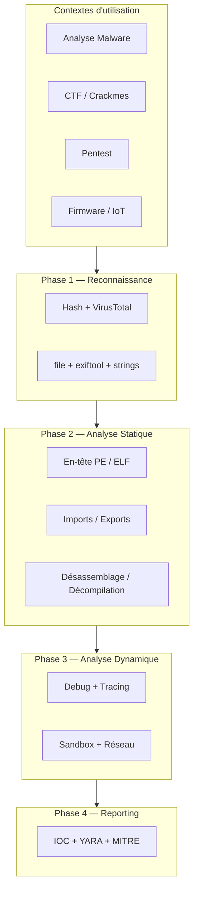
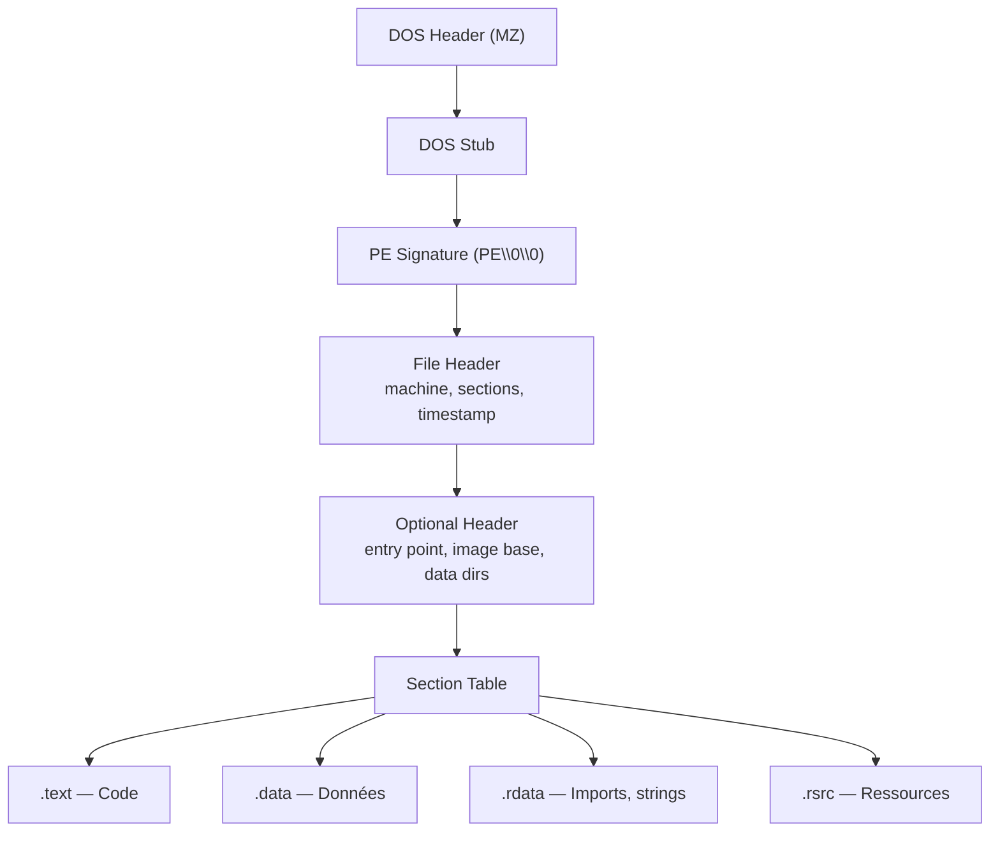
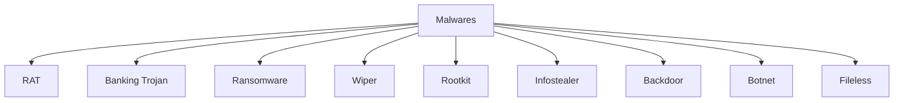
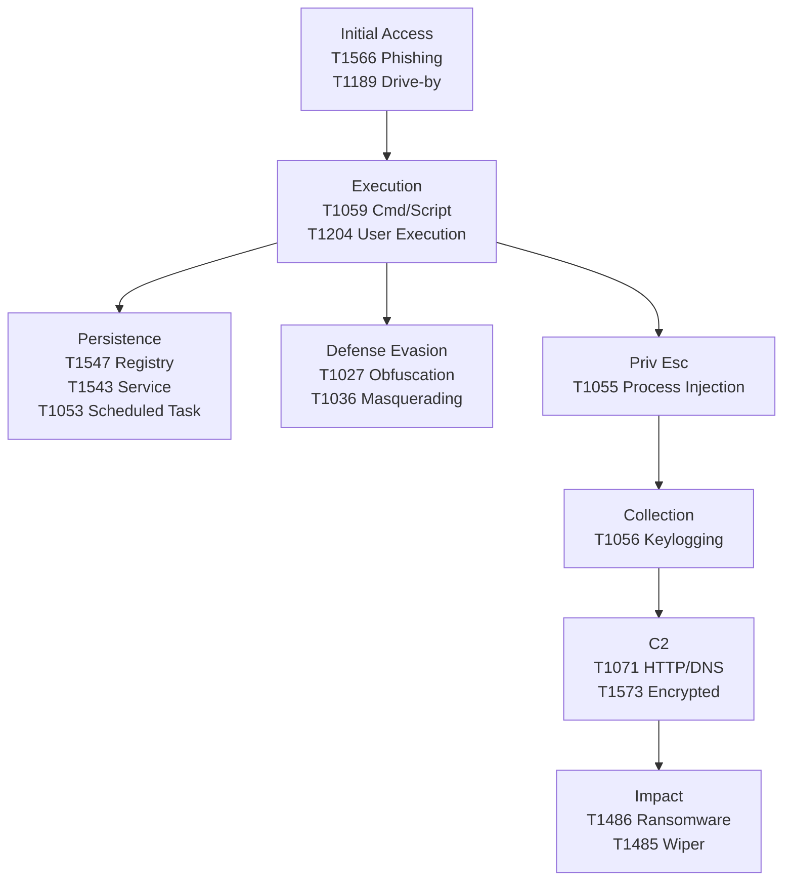
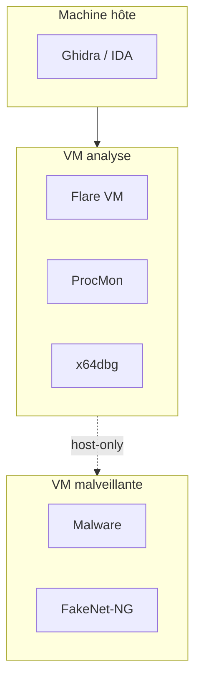
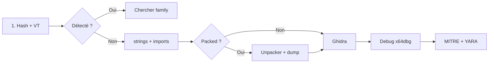

# Reverse Engineering & Malware Analysis

> [!info] **C'est quoi ?**
> Reverse Engineering = comprendre comment un programme fonctionne **sans le code source**.
> Utilisé pour : analyser un malware, trouver des vulnérabilités, retrouver des secrets.

> **Outils associés :** [[Outils/Outil - Ghidra|Ghidra]] · [[Outils/Outil - radare2|radare2]] · [[Outils/Outil - Volatility|Volatility]] · [[Outils/Outil - YARA|YARA]] → voir [[Tools| Bibliothèque d'Outils]]

---

## 1. Approche globale

Le RE se situe au carrefour de l'analyse malware, des CTF, du pentesting et de l'audit firmware. Le contexte détermine la méthodologie.



| Contexte | Objectif | Outils principaux |
|---|---|---|
| **Analyse malware** | Comportement, family, IOCs | Ghidra, x64dbg, CAPE, YARA |
| **CTF / Crackmes** | Trouver le flag | radare2, gdb-peda, [[Outil - pwntools\|pwntools]] |
| **Pentest** | Vuln dans app propriétaire | Ghidra, IDA, [[Outil - Frida\|Frida]] |
| **Firmware / IoT** | Extraire firmware d'un appareil | binwalk, [[Outil - unblob\|unblob]], JTAG |

> [!tip] Commence toujours par la statique
> 90% des infos sont dans les `strings` + l'en-tête du fichier. L'exécution ne vient qu'en complément.

---

## 2. Analyse statique — Fichiers & Formats

### 2.1 Identification du binaire

```bash
file malware.exe                        # identification
md5sum malware.exe                      # hash MD5
sha256sum malware.exe                   # hash SHA256
ssdeep malware.exe                      # fuzzy hash
exiftool malware.exe                    # métadonnées
```

### 2.2 Formats de binaires

| Format | OS | Magic bytes | Outil d'analyse |
|---|---|---|---|
| **PE** | Windows | `MZ` (0x4D5A) | pefile, pestudio, CFF Explorer |
| **ELF** | Linux | `\x7fELF` | readelf, objdump, radare2 |
| **Mach-O** | macOS | `\xFE\xED\xFA\xCE` | otool, jtool2 |
| **MSI/OLE** | Windows | `\xD0\xCF\x11\xE0` | [[Outil - oletools\|oletools]] |

### 2.3 Structure du PE — Vue d'ensemble



### 2.4 Entropie et détection de packing

```bash
binwalk -E malware.bin   # graphique d'entropie
# Entropie > 7.0 → CHIFFRÉ/COMPRIMÉ (suspicion de packing)

python3 -c "
import pefile
pe = pefile.PE('malware.exe')
for s in pe.sections:
    n = s.Name.decode().rstrip('\x00')
    print(f'{n:10s} Size: {s.SizeOfRawData:>8d}  Entropy: {s.get_entropy():.2f}')
"
```

| Indice | Signification |
|---|---|
| Entropie > 7.0 dans `.text` | Code chiffré/compressé |
| Sections `.UPX0`, `.UPX1` | Packer UPX → `upx -d` |
| Imports minimaux (`LoadLibrary` + `GetProcAddress`) | Packer custom → passer au dynamique |
| Petit `.text` grand `.data` | Shellcode caché |

---

## 3. Analyse statique — Strings & Extraction

### 3.1 Extraction avancée

```bash
strings -a -n 8 malware.exe              # ASCII, min 8 chars
strings -el malware.exe                  # UTF-16 (CRITIQUE pour Windows)
strings -a -n 8 malware.exe | grep -iE "http|cmd|key|pass" | sort -u
```

### 3.2 Regex pour extraction d'IOC

```bash
# Adresses IP
strings malware.exe | grep -oE "\b([0-9]{1,3}\.){3}[0-9]{1,3}\b"

# URLs (http/https)
strings malware.exe | grep -oE "https?://[a-zA-Z0-9./?=_-]+"

# Domaines (TLD courantes)
strings malware.exe | grep -oE "\b[a-zA-Z0-9.-]+\.(com|net|org|xyz|top|tk|cc|ru)\b"

# Chemins Windows (UTF-16)
strings -el malware.exe | grep -oE "[A-Z]:\\[^\x00]+"

# Mutex Windows
strings malware.exe | grep -oE "\\\\.\\Global\\[^\x00]+"

# Emails
strings malware.exe | grep -oE "[a-zA-Z0-9._%+-]+@[a-zA-Z0-9.-]+\.[a-zA-Z]{2,}"

# Hashes
strings malware.exe | grep -oE "\b[a-fA-F0-9]{32}\b"    # MD5
strings malware.exe | grep -oE "\b[a-fA-F0-9]{64}\b"    # SHA256
```

### 3.3 Strings encodées

```bash
echo "Q0hFQ1t7ZmxhZ19mMHVuZH0=" | base64 -d    # décoder Base64
# Utiliser [[Outil - CyberChef|CyberChef]] pour décodages complexes (hex, XOR, rot13…)
```

| Outil | Usage | Lien vault |
|---|---|---|
| `strings` | Extraction basique | — |
| `floss` | Strings obfuscées (FLARE-VM) | — |
| `oletools` | Strings dans documents Office | [[Outil - oletools\|oletools]] |
| `binwalk` | Extraction de fichiers embarqués | [[Outil - binwalk\|binwalk]] |
| `unblob` | Extraction hiérarchique | [[Outil - unblob\|unblob]] |
| `CyberChef` | Décodage universel | [[Outil - CyberChef\|CyberChef]] |

---

## 4. Analyse statique — Désassemblage

### 4.1 Jeu d'instructions x86/x64 — Référence rapide

| Instruction | Description | Exemple |
|---|---|---|
| `MOV dst, src` | Copie une valeur | `mov eax, [ebp-8]` |
| `PUSH / POP` | Empile / dépile la pile | `push ebp; mov ebp, esp` |
| `CALL / RET` | Appelle / revient d'une fonction | `call 0x401000` |
| `JMP / JE / JNE` | Sauts inconditionnel / conditionnel | `je short loc_401030` |
| `CMP` / `TEST` | Compare / test bit à bit | `cmp eax, 0` / `test eax, eax` |
| `LEA` | Calcule une adresse effective | `lea eax, [ebp-0x10]` |
| `XOR eax, eax` | Met eax à 0 (très courant) | `xor eax, eax` |
| `INT 0x80` / `SYSCALL` | Appel système | `mov eax, 1; int 0x80` |

### 4.2 Conventions d'appel

| Convention | Arguments | Nettoyage pile | Usage |
|---|---|---|---|
| `cdecl` | droite → gauche | caller | GCC classique |
| `stdcall` | droite → gauche | callee | Win32 API |
| `System V AMD64` | RDI, RSI, RDX, RCX, R8, R9 | caller | Linux x64 |
| `Microsoft x64` | RCX, RDX, R8, R9 | caller | Windows x64 |

### 4.3 radare2 — Commandes avancées

```bash
r2 malware.exe
> aaa                   # analyse auto complète
> afl                   # lister toutes les fonctions
> afl | wc -l           # compter les fonctions
> s sym.imp.CreateFileA # aller à une import
> pdf                   # désassembler la fonction courante
> axt @ sym.imp.GetProcAddress  # XREF (où la fonction est appelée)
> iz                    # strings dans .data
> izz                   # strings dans tout le binaire
> VV                    # mode graphique (visual mode)
> db 0x401234           # breakpoint
> px 64 @ eax           # hexdump à l'adresse dans eax
> dr                    # afficher les registres
> dc                    # continuer l'exécution
> ds                    # step over
> dsi                   # step into
> wao xor               # XOR encode la section courante
> pd 20 @ main          # 20 instructions depuis main
```

### 4.4 Raccourcis IDA

| Raccourci | Action |
|---|---|
| `Space` | Graph / Text view |
| `F5` | Décompiler (Hex-Rays) |
| `X` | Cross-references |
| `N` | Renommer |
| `G` | Aller à adresse |

> Voir aussi : [[Outils/Outil - Ghidra|Ghidra]] · [[Outils/Outil - Cutter|Cutter]] · [[Outils/Outil - radare2|radare2]]

---

## 5. Analyse statique — Décompilation

### 5.1 Workflow Ghidra

1. **Import** → Import Binary → Analyze All
2. **Navigator** → Symbol Tree → Functions → `main`, `WinMain`, `entry`
3. **Decompiler** → panneau de pseudo-C
4. **Renommer** → clic droit → Rename (propagation auto)
5. **XREF** → "cross references to" pour tracer les appels

### 5.2 Lecture du pseudo-C — Exemple annoté

```c
void FUN_00401200(void) {
    char local_48 [64];     // → renommer "shellcode_buf"
    DWORD local_8;
    
    // VirtualAlloc avec PAGE_EXECUTE_READWRITE = 0x40 → TRÈS SUSPECT
    local_8 = VirtualAlloc((LPVOID)0x0, 0x1000, 0x3000, 0x40);
    
    // decode_shellcode(buffer, encoded_data, size)
    FUN_00401050(local_48, &DAT_00403000, 0x200);
    
    // copy_to_exec_mem(dest, src, len)
    FUN_00401080(local_8, local_48, 0x200);
    
    // Création de thread → INJECTION DE CODE
    CreateThread(NULL, 0, (LPTHREAD_START_ROUTINE)local_8, NULL, 0, NULL);
}
```

### 5.3 Patterns suspects dans le pseudo-C

| Pattern | Signification | MITRE |
|---|---|---|
| `VirtualAlloc(..., PAGE_EXECUTE_READWRITE)` | Mémoire exécutable | T1055 |
| `WriteProcessMemory(...)` + `CreateRemoteThread(...)` | Injection de code | T1055 |
| `RegSetValueExA(...)` | Persistance registre | T1547 |
| `InternetOpenA` / `HttpSendRequest` | C2 HTTP | T1071 |
| `SetWindowsHookExA(...)` | Keylogger | T1056 |

### 5.4 Type propagation et struct recovery

| Étape | Action Ghidra | Raison |
|---|---|---|
| Renommer fonctions | Rename (L) | `FUN_00401200` → `decode_and_inject` |
| Renommer variables | Rename Variable | `local_48` → `shellcode_buffer` |
| Changer type | Retype Variable | `int` → `DWORD` / `HANDLE` |
| Créer un struct | Data Type Manager → Add Struct | Pour structures PE/custom |
| Créer un enum | Data Type Manager → Add Enum | Pour constantes (`PAGE_EXECUTE_*`) |

### 5.5 Différences Ghidra vs IDA vs Cutter

| Critère | Ghidra | IDA Free/Pro | Cutter (rizin) |
|---|---|---|---|
| Prix | Gratuit | Free / Pro (>5000$) | Gratuit |
| Décompilateur | Excellent | Payant en Pro | Basique |
| Scripting | Java/Python | IDC/IDAPython | rizin/r2pipe |
| Recommandé pour débuter | **Oui** | Si budget | Fans CLI |

---

## 6. Analyse dynamique — Debugging

### 6.1 Types de breakpoints

| Type | Mécanisme | Utilisation |
|---|---|---|
| **Software BP** | `0xCC` (INT3) dans le code | Points d'intérêt |
| **Hardware BP** | Registres DR0-DR3 | Quand le code vérifie ses propres breakpoints |
| **Memory BP** (Watchpoint) | Surveillance accès mémoire | Variable lue/écrite |
| **Conditional BP** | Condition à chaque hit | Filtrer les hits |

### 6.2 gdb — Commandes avancées

```bash
gdb ./malware
> break *0x401234              # breakpoint adresse
> run / continue               # démarrer / continuer

# Watchpoints (mémoire)
> watch *[0x601000]            # watchpoint écriture
> rwatch *[0x601000]           # watchpoint lecture

# Catchpoints
> catch syscall open           # catch appels système

# Inspection mémoire
> x/20gx $rsp                  # 20 mots en hex depuis RSP
> x/s 0x401000                 # string à l'adresse
> info proc mappings           # mapping mémoire

# Extensions PEDA / GEF
> pattern create 200           # pattern pour buffer overflow
> pattern offset $eip          # trouver l'offset
> checksec                     # protections NX, ASLR, PIE
> heap                         # afficher le heap
```

> Voir aussi : [[Outils/Outil - gdb-peda|gdb-peda]]

### 6.3 x64dbg — Commandes essentielles

| Raccourci | Action |
|---|---|
| `F2` | Toggle breakpoint |
| `F7` / `F8` | Step into / Step over |
| `F9` | Run |
| `Ctrl+F9` | Run until return |
| `Ctrl+G` | Go to adresse |
| `:` | Ajouter un commentaire |

> Voir aussi : [[Outils/Outil - x64dbg|x64dbg]]

### 6.4 Time-travel debugging

| Outil | Plateforme | Principe |
|---|---|---|
| **WinDbg Preview** | Windows | `!record` + `!replay` |
| **rr** | Linux | Enregistrement déterministe |
| **TTD (WinDbg)** | Windows | Time Travel Debugging Microsoft |

```bash
# rr (Linux)
rr record ./malware           # enregistrer
rr replay                     # relecturer dans le debugger
> reverse-continue            # remonter jusqu'au prochain hit
```

---

## 7. Analyse dynamique — Tracing

### 7.1 strace / ltrace (Linux)

```bash
strace -f -e trace=file,network,process ./malware  # appels système
strace -e trace=network ./malware                   # réseau uniquement
strace -T -c ./malware                              # temps par syscall
ltrace -e malloc,free ./malware                     # appels bibliothèques
ltrace -p <pid>                                     # attacher à un PID
```

### 7.2 Process Monitor (Windows)

ProcMon affiche en temps réel tous les accès fichiers, registre et réseau d'un processus.

Filtres ProcMon utiles :

| Colonne | Opération | Valeur |
|---|---|---|
| Process Name | is | `malware.exe` |
| Path | contains | `CurrentVersion\Run` |
| Path | contains | `:443` |
| Result | is | `ACCESS DENIED` |

```powershell
# Lancement ProcMon en CLI (Sysinternals)
# Procmon /RuntimeFilter "malware.exe" /LoadConfig filter.pmc
# Exporter les résultats pour analyse ultérieure
```

> Voir aussi : [[Outils/Outil - Sysinternals Suite|Sysinternals Suite]]

### 7.3 Tracing réseau

```bash
# Wireshark / tshark
tshark -i eth0 -f "port 443" -T fields -e http.host -e http.request.uri
# Filtres Wireshark : http.request.method == "POST", dns.qry.name contains "mal"
```

> Voir aussi : [[Outil - Wireshark|Wireshark]] · [[Outil - tshark|tshark]]

### 7.4 eBPF — Tracing moderne

```bash
sudo bpftrace -e 'tracepoint:syscalls:sys_enter_open { printf("%s %s\n", comm, str(args->filename)); }'
sudo opensnoop          # tracer les open()
sudo execsnoop          # tracer les exec()
```

---

## 8. Analyse dynamique — Sandbox

### 8.1 Sandboxes en ligne

| Service | Type | Limites |
|---|---|---|
| **Any.Run** | Interactive (cloud) | 3/jour (gratuit) |
| **Hybrid Analysis** | Automatique | 100/jour |
| **VirusTotal** | Multi-engine | 4/jour |
| **Triage** | Automatique | Open source |

### 8.2 CAPE Sandbox — Self-hosted

```bash
# Installation
git clone https://github.com/ctxis/CAPE.git && cd CAPE && ./install.sh
# Analyser
./cape malware.exe
# Résultats dans /opt/CAPE/storage/analyses/<ID>/ (reports/, files/, logs/, memory/, PCAP/)
```

> Voir aussi : [[Outils/Outil - CAPE|CAPE]] · [[Outils/Outil - Cuckoo Sandbox|Cuckoo Sandbox]]

### 8.3 Anti-sandbox — Détection et bypass

| Technique malware | Contre-mesure |
|---|---|
| Hostname == "SANDBOX" | Renommer la VM |
| CPU cores < 2 ou RAM < 4 GB | Ajouter des cores / RAM |
| Uptime < 5 min | Laisser tourner la VM |
| Souris à (0,0) | Bouger la souris |
| MAC = 00:0C:29 (VMware) | Spoof la MAC |
| Fichiers `vmwaretray.exe` | Nettoyer la VM |

### 8.4 FakeNet-NG — Réseau simulé

```bash
# Redirige tout le trafic vers localhost (fake DNS, fake HTTP)
fakenet-ng -d
```

> Voir aussi : [[Outil - FakeNet-NG|FakeNet-NG]]

---

## 9. Les appels Windows essentiels

### 9.1 Table des Win32 API utilisées par les malwares

| API | DLL | Usage malware | Détecter via |
|---|---|---|---|
| `VirtualAlloc` | kernel32 | Allocation RWX | protect = 0x40 |
| `VirtualAllocEx` | kernel32 | Allocation dans processus distant | — |
| `WriteProcessMemory` | kernel32 | Écriture shellcode | Cible = processus système |
| `CreateRemoteThread` | kernel32 | Thread dans processus distant | Target = explorer/svchost |
| `CreateProcessA/W` | kernel32 | Lancement processus | Création cmd/powershell |
| `CreateFileA/W` | kernel32 | Création/ouverture fichier | — |
| `LoadLibraryA/W` | kernel32 | Chargement DLL dynamique | Non dans imports statiques |
| `GetProcAddress` | kernel32 | Résolution de fonction | Anti-static |
| `CreateServiceA/W` | advapi32 | Création service | Persistance |
| `RegSetValueExA/W` | advapi32 | Écriture registre | Clés Run/RunOnce |
| `InternetOpenA/W` | wininet | Connexion internet | C2 |
| `HttpSendRequestA/W` | wininet | Requête HTTP | Exfiltration |
| `CryptEncrypt` | crypt32 | Chiffrement données | Ransomware |
| `SetWindowsHookExA` | user32 | Hook clavier/souris | Keylogger |
| `AdjustTokenPrivileges` | advapi32 | Élévation de privilèges | Escalation |

### 9.2 Détection via Python pefile

```python
import pefile

SUSPICIOUS = {
    'VirtualAllocEx': 'Allocation processus distant',
    'WriteProcessMemory': 'Écriture shellcode',
    'CreateRemoteThread': 'Injection de code',
    'InternetOpenA': 'Connexion C2',
    'CryptEncrypt': 'Chiffrement (ransomware)',
    'SetWindowsHookExA': 'Keylogger',
    'RegSetValueExA': 'Persistance registre',
}

pe = pefile.PE('malware.exe')
for entry in pe.DIRECTORY_ENTRY_IMPORT:
    for imp in entry.imports:
        if imp.name and imp.name.decode() in SUSPICIOUS:
            print(f"[!] {entry.dll.decode()}!{imp.name.decode()} → {SUSPICIOUS[imp.name.decode()]}")
```

### 9.3 NTDLL — Contournement des hooks EDR

Les malwares avancés appellent directement `ntdll` via `syscall` pour bypasser les hooks userland :

```nasm
mov rax, 0x55       ; numéro de syscall
syscall              ; bypass hooks
```

```bash
r2 malware.bin
> /ad 0f05           # chercher l'opcode du syscall (0F 05)
```

---

## 10. Anti-analyse & Évasion

### 10.1 Techniques anti-debug et bypass

| Technique | Mécanisme | Contre-mesure |
|---|---|---|
| `IsDebuggerPresent()` | PEB.BeingDebugged | Patch `jz → jnz` |
| `NtQueryInformationProcess` | Info processus | Patch return value |
| Timing `rdtsc` | Mesure CPU (debugger = plus lent) | Patch ou debugger rapide |
| `FindWindow("OllyDbg")` | Cherche fenêtre debugger | Renommer le debugger |
| `NtSetInformationThread` | ThreadHideFromDebugger | — |

```bash
# Patch : remplacer le CALL à IsDebuggerPresent par "return 0"
r2 -w malware.exe
> s 0x401234
> wa xor eax, eax; ret
> wq
```

### 10.2 Anti-VM Detection

```bash
strings malware.exe | grep -iE "vmware|virtualbox|vbox|qemu|sandbox"
# CPUID leaf 0x40000000 → révèle hyperviseur (VMX, VBox, etc.)
```

### 10.3 Code obfuscation

| Méthode | Principe |
|---|---|
| **Opaque predicate** | Conditions toujours vraies/fausses mais complexes |
| **Control flow flattening** | If/else → switch sur dispatcher (machine à états) |
| **String encryption** | Chiffrer strings, décoder au runtime (XOR, AES, RC4) |
| **API hashing** | Hash du nom d'API au lieu de l'appeler directement |
| **Anti-disassembly** | Instructions qui trompent le désassembleur (jmp au milieu d'une instr) |
| **Dead code injection** | Ajouter du code mort pour noyer le vrai |
| **Import obfuscation** | Charger DLLs dynamiquement, résoudre APIs via hash |

### 10.4 Anti-emulation

Certains malwares détectent les environnements d'émulation (QEMU, Bochs) en mesurant les différences de comportement du processeur ou du système d'exploitation.

```bash
# Détecter des patterns anti-emulation dans les strings
strings malware.exe | grep -iE "emulat|qemu|bochs|wine"
```

| Technique | Contournement |
|---|---|
| `cpuid` avec valeurs spécifiques | Mapper les réponses CPU correctement |
| Timing rdtsc après pause | Ajuster la vitesse d'émulation |
| Vérification de registres système | Installer les bons registres |
| Détection d'exceptions | Gérer les exceptions correctement |

---

## 11. Packing & Unpacking

### 11.1 Packer courants

| Packer | Type | Détectable avec | Dépaquetage |
|---|---|---|---|
| **UPX** | Compression open-source | `upx -t malware.exe` | `upx -d malware.exe` |
| **ASPack** | Compression | Sections `.aspack`, `.adata` | Outils dédiés ou mémoire |
| **Themida** | VM-based, anti-debug fort | VMProtect markers | Difficile — dump mémoire |
| **VMProtect** | VM-based | Sections VMProtect | Très difficile — analyse VM custom |
| **Armadillo** | Protection + injection | Sections spécifiques | Dump mémoire + fix relocation |
| **PECompact** | Compression | — | Outils ou mémoire |
| **Custom packer** | XOR, RC4, AES | Entropie haute, peu d'imports | Analyse de l'algo de déchiffrement |

### 11.2 UPX — Dépaquetage

```bash
upx -t malware.exe          # tester si UPX
upx -d malware.exe          # décompresser
# Si UPX modifié → dépaquetage manuel via debugger (OEP + dump mémoire)
```

### 11.3 Dump mémoire — Technique universelle

```bash
# procdump
procdump -ma <PID> dump.dmp

# x64dbg : lancer → attendre dépaquetage → Scylla → IAT Autosearch → Dump

# Volatility (offline)
volatility -f dump.dmp --profile=Win7SP1x64 procdump -D output/
```

> Voir aussi : [[Outils/Outil - Volatility|Volatility]]

### 11.4 Entropie avant/après

```bash
# Avant : plateau à 7.5-8.0 (chiffré)
binwalk -E malware_packed.bin
# Après : graphique variable 3.0-7.0 (normal)
binwalk -E malware_unpacked.bin
```

---

## 12. Le format PE en profondeur

### 12.1 DOS Header

| Offset | Champ | Description |
|---|---|---|
| 0x00 | `e_magic` | Magic `MZ` (0x5A4D) |
| 0x3C | `e_lfanew` | Offset vers PE Signature |

### 12.2 NT Headers

| Offset | Champ | Description |
|---|---|---|
| 0x00 | Signature | `PE\0\0` |
| 0x04 | Machine | `0x14c` = x86, `0x8664` = x64 |
| 0x06 | NumberOfSections | Nombre de sections |
| 0x08 | TimeDateStamp | Timestamp compilation |
| 0x14 | SizeOfOptionalHeader | Taille Optional Header |
| 0x16 | Characteristics | Flags (DLL, EXECUTABLE_IMAGE) |

### 12.3 Optional Header (x64)

| Offset | Champ | Description |
|---|---|---|
| 0x10 | AddressOfEntryPoint | RVA point d'entrée |
| 0x18 | ImageBase | Adresse de base souhaitée |
| 0x20 | SectionAlignment | Alignement mémoire (4096) |
| 0x24 | FileAlignment | Alignement disque (512) |
| 0x38 | SizeOfImage | Taille totale mémoire |
| 0x58 | NumberOfRvaAndSizes | Nombre Data Directories |
| 0x60+ | Data Directories[16] | Import, Export, Resources… |

### 12.4 Data Directories

| Index | Nom | Contenu |
|---|---|---|
| 0 | Export | Fonctions exportées (DLL) |
| 1 | **Import** | Fonctions importées (CRUCIAL) |
| 2 | Resource | Icônes, dialogues, strings |
| 5 | Base Relocation | Fixups d'adresse |
| 6 | Debug | PDB |
| 9 | IAT | Import Address Table |
| 11 | CLR Runtime | .NET metadata |

### 12.5 Section Table

```python
# Afficher les sections
python3 -c "
import pefile
pe = pefile.PE('malware.exe')
for s in pe.sections:
    n = s.Name.decode().rstrip('\x00')
    print(f'{n:10s} VA=0x{s.VirtualAddress:08x} VS=0x{s.Misc_VirtualSize:08x} '
          f'Raw=0x{s.SizeOfRawData:08x} Ent={s.get_entropy():.2f}')
"
```

---

## 13. Familles de malwares



| Famille | Description | Exemples | MITRE |
|---|---|---|---|
| **RAT** | Contrôle à distance | njRAT, Quasar, AsyncRAT | T1219 |
| **Banking Trojan** | Vol credentials bancaires | Emotet, TrickBot, Dridex | T1539 |
| **Ransomware** | Chiffrement + rançon | LockBit, Conti, BlackCat | T1486 |
| **Wiper** | Destruction données | Shamoon, WhisperGate | T1485 |
| **Rootkit** | Masquage kernel | TDL4, ZeroAccess | T1014 |
| **Bootkit** | Infection MBR/VBR/UEFI | Rovnix, LoJax | T1542 |
| **Infostealer** | Vol mots de passe, cookies | RedLine, Raccoon, Vidar | T1555 |
| **Backdoor** | Accès persistant secret | PlugX, HAVOC | T1133 |
| **Botnet** | Réseau machines compromises | Mirai, Emotet | T1583 |
| **Fileless** | Résident en mémoire uniquement | Powersploit, Empire | T1059 |
| **Spyware** | Surveillance | Pegasus, DarkComet | T1056 |

---

## 14. YARA — Règles de détection

### 14.1 Règle avancée

```yara
rule Advanced_Malware_Detection {
    meta:
        author = "Analyst"
        severity = "high"
        mitre = "T1219"
    strings:
        $mz = { 4D 5A }
        $pdb = /C:\\Users\\[a-zA-Z]+\\.*\.pdb/
        $c2 = /https?:\/\/[0-9]{1,3}\.[0-9]{1,3}\.[0-9]{1,3}\.[0-9]{1,3}/
        $api1 = "CreateRemoteThread"
        $api2 = "WriteProcessMemory"
        $ps_enc = /powershell.*(-enc|-e)\s+[A-Za-z0-9+/=]{20,}/
    condition:
        uint16(0) == 0x5A4D and filesize < 5MB and
        (2 of ($api*) or $ps_enc) and 1 of ($c2*)
}

rule Ransomware_Indicators {
    strings:
        $n1 = "YOUR FILES HAVE BEEN ENCRYPTED" ascii nocase
        $n2 = "BITCOIN" ascii nocase
        $ext = { 2E 6C 6F 63 6B 65 64 }   // .locked
        $api = "CryptEncrypt"
    condition:
        uint16(0) == 0x5A4D and
        (1 of ($n*) and (1 of ($ext*) or $api))
}
```

### 14.2 Conditions YARA — Référence

| Opérateur | Signification | Exemple |
|---|---|---|
| `any of them` | Au moins un string | `any of ($a, $b, $c)` |
| `all of them` | Tous | `all of them` |
| `#a` | Nombre d'occurrences | `#a > 5` |
| `@a` | Position du premier hit | `@a < 100` |

### 14.3 Module PE

```yara
import "pe"
rule PE_Suspicious {
    condition:
        pe.number_of_imports > 50 and
        pe.imports("kernel32.dll", "VirtualAlloc") and
        pe.section_by_name(".text").raw_size < 0x1000
}
```

```bash
yara -r rules/ malware_samples/    # exécution en masse
```

> Voir aussi : [[Outils/Outil - YARA|YARA]]

---

## 15. MITRE ATT&CK for Malware

### 15.1 Techniques les plus fréquentes



### 15.2 Mapping complet : Malware → MITRE

| Technique | ID | Exemple concret |
|---|---|---|
| PowerShell | T1059.001 | `powershell -enc <base64>` |
| WMI | T1047 | `wmic process call create` |
| Registry Run Key | T1547.001 | `HKCU\...\Run` |
| Service | T1543.003 | `sc create malware binPath=...` |
| DLL Injection | T1055.001 | `CreateRemoteThread` + `WriteProcessMemory` |
| Obfuscation | T1027 | Base64, XOR, packing |
| Masquerading | T1036 | Renommer en `svchost.exe` |
| Indicator Removal | T1070 | `wevtutil cl Security` |
| LSASS Memory | T1003.001 | Mimikatz |
| HTTP C2 | T1071.001 | `HttpSendRequest` |
| Data Encrypted | T1486 | Ransomware |
| Data Destruction | T1485 | Wiper |

---

## 16. Outils RE détaillés

| Catégorie | Outil | Usage | Lien vault |
|---|---|---|---|
| **Désassemblage** | Ghidra | Désassembleur + Décompilateur | [[Outils/Outil - Ghidra\|Ghidra]] |
| **Désassemblage** | radare2/rizin | CLI, scriptable | [[Outils/Outil - radare2\|radare2]] |
| **Désassemblage** | Cutter | GUI pour rizin | [[Outils/Outil - Cutter\|Cutter]] |
| **Debug** | gdb + GEF/PEDA | Debugger Linux | [[Outils/Outil - gdb-peda\|gdb-peda]] |
| **Debug** | x64dbg | Debugger Windows x64 | [[Outils/Outil - x64dbg\|x64dbg]] |
| **Instrumentation** | Frida | Hook dynamique, injection JS | [[Outils/Outil - Frida\|Frida]] |
| **Sandbox** | CAPE | Extraction de payloads | [[Outils/Outil - CAPE\|CAPE]] |
| **Sandbox** | Cuckoo | Analyse automatique | [[Outils/Outil - Cuckoo Sandbox\|Cuckoo Sandbox]] |
| **Détection** | YARA | Pattern matching | [[Outils/Outil - YARA\|YARA]] |
| **Forensics** | Volatility | Dump mémoire | [[Outils/Outil - Volatility\|Volatility]] |
| **Extraction** | binwalk | Firmware/embedded | [[Outil - binwalk\|binwalk]] |
| **Extraction** | unblob | Extraction hiérarchique | [[Outil - unblob\|unblob]] |
| **Extraction** | oletools | Documents Office | [[Outil - oletools\|oletools]] |
| **Extraction** | CyberChef | Décodage universel | [[Outil - CyberChef\|CyberChef]] |
| **Métadonnées** | exiftool | Métadonnées EXIF | [[Outil - exiftool\|exiftool]] |
| **Réseau** | Wireshark | Capture réseau GUI | [[Outil - Wireshark\|Wireshark]] |
| **Réseau** | tshark | Capture réseau CLI | [[Outil - tshark\|tshark]] |
| **Réseau** | FakeNet-NG | Fake network sandbox | [[Outil - FakeNet-NG\|FakeNet-NG]] |
| **.NET** | dnSpy | Décompilateur .NET | [[Outil - dnSpy\|dnSpy]] |
| **Processus** | Process Hacker | Viewer processus | [[Outil - Process Hacker\|Process Hacker]] |
| **Sysinternals** | Suite complète | ProcMon, etc. | [[Outils/Outil - Sysinternals Suite\|Sysinternals Suite]] |
| **CTF** | pwntools | Framework exploitation | [[Outil - pwntools\|pwntools]] |
| **CTF** | ROPgadget | Gadgets ROP | [[Outil - ROPgadget\|ROPgadget]] |
| **Exploitation** | Metasploit | Framework exploitation | [[Outil - Metasploit\|Metasploit]] |
| **Stégano** | stegsolve | Analyse images | [[Outil - stegsolve\|stegsolve]] |
| **Stégano** | zsteg | Stégano PNG/BMP | [[Outil - zsteg\|zsteg]] |
| **Crypto** | RsaCtfTool | Attaque RSA | [[Outil - RsaCtfTool\|RsaCtfTool]] |

---

## 17. Exemples pratiques

### 17.1 Crackme simple (débutant)

```bash
strings crackme | grep -i "flag\|correct\|wrong"
# → "Enter password: ", "Correct!", "Wrong!"
# Ghidra → if (strcmp(input, "s3cr3t_p4ss") == 0) → password en clair !
echo "s3cr3t_p4ss" | ./crackme   # → Correct!
```

### 17.2 Payload chiffré XOR (intermédiaire)

```python
# Dans Ghidra : key=0x37, encoded=[0x20, 0x0a, 0x30, 0x17, 0x21, 0x32, 0x22, 0x06]
encoded = [0x20, 0x0a, 0x30, 0x17, 0x21, 0x32, 0x22, 0x06]
print(''.join(chr(b ^ 0x37) for b in encoded))   # → le contenu déchiffré
```

### 17.3 Malware packé UPX → RAT (expert)

```bash
# 1. Identification
file malware.exe    # PE32+, 3/70 VT détections
upx -t malware.exe  # "probably packed with UPX"

# 2. Dépaquetage
upx -d malware.exe -o unpacked.exe

# 3. Strings post-unpacking
strings -a -n 6 unpacked.exe | grep -iE "http|cmd|inject|mutex"
# → "http://c2.example.com/api/beacon"
# → "\\BaseNamedObjects\\Mutex_12345"
# → "HKCU\...\Run"

# 4. Imports (pefile)
# → CreateRemoteThread, WriteProcessMemory, VirtualAllocEx
# → InternetOpenA, HttpSendRequestA, RegSetValueExA

# 5. Ghidra → main() : injection dans explorer.exe, C2 toutes les 60s
# → MITRE: T1055 + T1547 + T1071
```

---

## 18. Malware Development Concepts

> [!warning] À des fins de compréhension et de défense uniquement

### 18.1 Shellcode

```python
# Shellcode x64 Linux (execve /bin/sh)
shellcode = "\x48\x31\xf6\x56\x48\xbf\x2f\x62\x69\x6e\x2f\x2f\x73\x68\x57\x54\x5f\x6a\x3b\x58\x99\x0f\x05"
# Encoder en Base64 pour PowerShell
import base64
print(f"powershell -enc {base64.b64encode(shellcode.encode('latin-1')).decode()}")
```

### 18.2 Techniques d'injection

| Technique | Mécanisme | Détection |
|---|---|---|
| **DLL Injection** | `VirtualAllocEx` → `WriteProcessMemory` → `CreateRemoteThread(LoadLibrary)` | Modules du processus |
| **Process Hollowing** | Créer suspendu → hollow → resume | Memory forensics (malfind) |
| **APC Injection** | `QueueUserAPC` vers thread existant | `NtQueueApcThread` monitor |
| **Thread Hijacking** | Suspendre thread → modifier contexte → resume | `SuspendThread` anormal |
| **Module Stomping** | Charger DLL légitime → écraser son code | RWX dans DLL système |
| **Early Bird** | Injecter pendant le démarrage processus | Avant les premiers breakpoints |

### 18.3 Mécanismes de persistance

| Mécanisme | Commande |
|---|---|
| Registry Run Key | `reg add "HKCU\...\Run" /v up /d "C:\mal.exe"` |
| Service | `sc create updater binPath= "C:\svc.exe" start= auto` |
| Scheduled Task | `schtasks /create /tn "Update" /tr "C:\mal.exe" /sc hourly` |
| Startup Folder | Copier dans `%APPDATA%\...\Startup` |
| DLL Hijacking | Placer DLL dans répertoire prioritaire |

> Voir aussi : [[Techniques/DLL Hijacking| DLL Hijacking]]

### 18.4 Patterns de communication C2

| Protocole | Avantage attaquant | Détection |
|---|---|---|
| HTTP/HTTPS | Traverse pare-feu | Beaconing |
| DNS Tunneling | Rarement filtré | Volume DNS, longueur requêtes |
| Domain Fronting | CDN légitime | SNI vs Host header mismatch |
| Steganography | Données dans images | Entropie images |

---

## 19. Détection & Défense

### 19.1 Sigma Rule — Persistence

```yaml
title: Suspicious Registry Run Key
id: a5e1c5a-1234-5678-9abc-def012345678
logsource:
    category: registry_set
    product: windows
detection:
    selection:
        TargetObject|contains: '\CurrentVersion\Run\'
    filter:
        Image|endswith: '\explorer.exe'
    condition: selection and not filter
    level: high
    tags: [attack.persistence, attack.t1547.001]
```

### 19.2 Mémoire forensics — Volatility

```bash
volatility -f memory.dmp --profile=Win10x64 pslist          # processus
volatility -f memory.dmp --profile=Win10x64 pstree          # arbre processus
volatility -f memory.dmp --profile=Win10x64 malfind         # code injecté (RWX)
volatility -f memory.dmp --profile=Win10x64 netscan         # connexions réseau
volatility -f memory.dmp --profile=Win10x64 hashdump        # hash NTLM
```

> Voir aussi : [[Outils/Outil - Volatility|Volatility]]

### 19.3 Extraction d'IOCs automatisée

```python
import pefile, re

def extract_iocs(filepath):
    pe = pefile.PE(filepath)
    iocs = {'ip': set(), 'url': set(), 'domain': set()}
    for section in pe.sections:
        text = section.get_data().decode('latin-1', errors='ignore')
        iocs['ip'].update(re.findall(r'\b(\d{1,3}\.\d{1,3}\.\d{1,3}\.\d{1,3})\b', text))
        iocs['url'].update(re.findall(r'https?://[^\x00\s]{5,100}', text))
        iocs['domain'].update(re.findall(r'\b([a-z0-9.-]+\.(com|net|org|xyz|top))\b', text))
    for k, v in iocs.items():
        if v: print(f"[+] {k.upper()}: {v}")
```

---

## 20. Lab & Environnement

### 20.1 Architecture du lab



### 20.2 Flare VM — Kit Windows

```powershell
Set-ExecutionPolicy Bypass -Scope Process
Invoke-WebRequest -Uri "https://raw.githubusercontent.com/mandiant/flare-vm/main/install.ps1" -OutFile "$env:TEMP\install.ps1"
& "$env:TEMP\install.ps1"
# Inclut : Ghidra, radare2, x64dbg, ProcMon, Wireshark, FakeNet-NG, YARA, PE-bear…
```

> Voir aussi : [[Outils/Outil - Flare VM|Flare VM]]

### 20.3 REMnux — Kit Linux

```bash
wget -q -O - https://REMnux.org/remnux-cli | sudo apt-key add -
sudo add-apt-repository "deb https://packages.remnux.org/ remnux main"
sudo apt update && sudo apt install remnux-cli
# Inclut : yara, oletools, Fakenet-NG, pefile, binwalk, unblob…
```

### 20.4 Bonnes pratiques VM

| Action | Fréquence |
|---|---|
| Snapshot initial (propre) | Avant toute analyse |
| Snapshot pré-exécution | Avant chaque malware |
| Restore | Après chaque analyse |
| Réseau host-only | Toujours |
| Shared folders / clipboard | À éviter |

---

## 21. Ressources & Practice

### 21.1 Plateformes

| Plateforme | Type | Difficulté | Lien |
|---|---|---|---|
| **crackmes.one** | Crackmes communautaires | Débutant → Expert | crackmes.one |
| **malware-chef** | Challenges malwares | Intermédiaire | malware-chef |
| **theZoo** | Banque malwares vivants | Analyste | github.com/ytisf/theZoo |
| **Any.run** | Sandbox interactive | Analyste | any.run |
| **TryHackMe** | Rooms RE dédiées | Débutant → Intermédiaire | tryhackme.com |
| **HackTheBox** | Machines RE | Intermédiaire → Expert | hackthebox.com |
| **pwn.college** | Cours + challenges binaire | Débutant → Expert | pwn.college |
| **flare-on.com** | Challenges FireEye/Mandiant | Expert | flare-on.com |
| **MalwareBazaar** | Banque de malwares | Analyste | bazaar.abuse.ch |
| **Hybrid Analysis** | Sandbox + rapport | Analyste | hybrid-analysis.com |

### 21.2 Resources vault

- [[13 - Hardware & IoT| Hardware & IoT]] — RE firmware/matiérel
- [[10 - Cheatsheets| Cheatsheets]] — mémo rapides
- [[11 - Glossaire| Glossaire]] — termes techniques

### 21.3 Certifications

| Formation | Organisme | Focus |
|---|---|---|
| **GREM** | SANS | RE + Malware (référence) |
| **FOR610** | SANS | Forensics + Malware |
| **OSCE** | OffSec | Exploitation + RE |

---

## 22. Tips & Pièges

> [!tip] **UTF-16 (Windows)**
> ```bash
> strings -el malware.exe   # ne rate PAS les strings Windows
> ```

> [!tip] **Imports PE = comportement**
> ```bash
> python3 -c "
> import pefile
> pe = pefile.PE('malware.exe')
> for e in pe.DIRECTORY_ENTRY_IMPORT:
>     print(e.dll)
>     for i in e.imports: print('   ', i.name)
> "
> ```

> [!tip] **Entropie > 7 = packer**
> ```bash
> binwalk -E malware.bin
> ```

> [!warning] **Piège n°1 : exécuter sans préparation**
> Snapshot AVANT, réseau host-only, jamais sur machine de travail.

> [!warning] **Piège n°2 : sandbox detection**
> Le malware vérifie CPU, RAM, uptime, souris → `strings` pour "sandbox", "vmware".

> [!warning] **Piège n°3 : packed = strings vides**
> Il faut dump mémoire ou dépaqueter avant l'analyse statique.

> [!warning] **Piège n°4 : imports dynamiques**
> Si que `LoadLibrary` + `GetProcAddress` → résolution runtime → passer au dynamique.

> [!warning] **Piège n°5 : faux positifs YARA**
> Tester sur `C:\Windows\System32` avant de déployer.

> [!warning] **Piège n°6 : .NET obfusqué**
> Utiliser [[Outil - dnSpy|dnSpy]] en premier, pas Ghidra.

> [!success] **Méthode mini-flow "malware inconnu"**
> 1. `file` + `sha256` + VirusTotal
> 2. `strings -a -n 8` + `strings -el`
> 3. Imports PE (`pefile`)
> 4. Exécution en VM avec procmon/tcpdump
> 5. Ghidra sur les API suspectes
> 6. YARA + IOC pour détection future

---

## 23. Méthode express

### 23.1 Checklist express — Analyse malware inconnu



### 23.2 Méthode express — CTF RE

```bash
# 1. Identification
file challenge
strings challenge | head -50

# 2. Test basique
strings challenge | grep -i "flag\|correct\|congrat"

# 3. Désassemblage
r2 challenge
> aaa
> afl | grep -i "check\|flag\|main"
> s sym.check_flag
> pdf

# 4. Si protégé → debug
gdb ./challenge
> break main
> run

# 5. Si exploit → pwntools
```

### 23.3 Méthode express — Document Office suspect

```bash
# 1. Détection
file document.doc   # OLE ou ZIP (OOXML)

# 2. Extraction macros
olevba document.doc          # [[Outil - oletools|oletools]]

# 3. Déchiffrer
olevba --decompile document.doc

# 4. Patterns suspects : AutoOpen, Shell, CreateObject, PowerShell
```

---

> [!success] **Le kit du débutant RE**
> 1. `file` + `strings` + `hash`
> 2. Ghidra pour le pseudo-C
> 3. gdb/x64dbg pour le détail
> 4. Une VM isolée pour exécuter
> 5. Pratique : crackmes (crackmes.one), THM "Reversing" rooms, malware-labs

> [!warning] **Rappel** : analyser du malware = lab isolé, jamais le réseau pro.

> [!tip] **RE sur du matériel ?**
> Reverse d'un **objet connecté** (firmware, µC, puces) → c'est le **hardware pentesting** :
> [[13 - Hardware & IoT| Hardware & IoT]] (dump firmware, UART/JTAG, glitch, RFID)
