# 📖 Glossaire

> [!info] **Toutes les abréviations & termes** — à consulter quand tu tombes sur un terme inconnu.

---

## 🔤 Abréviations & Acronymes

| Abréviation | Signification |
|---|---|
| **0day** | Vulnérabilité inconnue du public, non corrigée — pas encore de patch disponible |
| **ACL** | Access Control List — liste de droits d'accès sur un objet (fichier, clé registre, etc.) |
| **AD** | Active Directory — annuaire centralisé de gestion des identités Windows |
| **ADCS** | Active Directory Certificate Services — infrastructure de gestion de certificats |
| **AEAD** | Authenticated Encryption with Associated Data — chiffrement authentifié (ex : AES-GCM) |
| **AF** | Address Family — famille de protocoles (AF_INET = IPv4, AF_INET6 = IPv6) |
| **AMSI** | Antimalware Scan Interface — interface Windows de scan anti-malware en runtime |
| **AP** | Access Point — point d'accès WiFi |
| **API** | Application Programming Interface — interface de programmation |
| **APT** | Advanced Persistent Threat — groupe d'attaquants avancé et persistant |
| **ARP** | Address Resolution Protocol — résolution d'adresses IP vers MAC |
| **AS-REP / AS-REQ** | Authentication Service Request/Reply — premier échange Kerberos (→ voir [[Techniques/Kerberos - Le protocole]]) |
| **AV** | Antivirus — logiciel de détection de malwares |
| **BEC** | Business Email Compromise — fraude au président via compromission d'email |
| **BSSID** | Basic Service Set Identification — MAC address d'un point d'accès WiFi |
| **C2 / C&C** | Command & Control — serveur de contrôle et de commande d'un malware |
| **CA** | Certificate Authority — autorité de certification |
| **CIDR** | Classless Inter-Domain Routing — notation de sous-réseaux (ex : /24) |
| **CMK** | Customer Managed Keys — clés de chiffrement gérées par le client (cloud) |
| **CORS** | Cross-Origin Resource Sharing — politique de partage de ressources cross-origin |
| **CRL** | Certificate Revocation List — liste de certificats révoqués |
| **CRT** | Certificate — fichier de certificat |
| **CSP** | Content Security Policy — politique de sécurité des contenus (anti-XSS) |
| **CSRF** | Cross-Site Request Forgery — attaque par forgery de requête inter-sites |
| **CVE** | Common Vulnerabilities and Exposures — base de données de vulnérabilités |
| **CWE** | Common Weakness Enumeration — catalogue de faiblesses de sécurité |
| **DA** | Domain Admin — compte administrateur de domaine AD |
| **DAC** | Discretionary Access Control — contrôle d'accès discrétionnaire |
| **DC** | Domain Controller — contrôleur de domaine AD |
| **DCSync** | Attaque qui "réplique" les hashes depuis un DC (→ voir [[06 - Post-Exploitation]]) |
| **DEP** | Data Execution Prevention — marque les zones mémoire comme non-exécutables |
| **DLL** | Dynamic Link Library — bibliothèque dynamique Windows |
| **DLL Hijacking** | Détourner le chargement d'une DLL en plaçant un fichier malveillant (→ voir [[06 - Post-Exploitation]]) |
| **DNS** | Domain Name System — résolution de noms de domaine |
| **DNS Rebinding** | Faire résoudre un domaine vers une IP interne pour contourner les pare-feu |
| **EFS** | Encrypting File System — chiffrement de fichiers Windows |
| **EDR** | Endpoint Detection & Response — solution de détection et réponse sur poste |
| **EIP** | Extended Instruction Pointer — registre x86 pointant vers l'instruction suivante |
| **ESC 1-8** | Vulnérabilités spécifiques ADCS (→ voir [[05 - Active Directory]]) |
| **ETW** | Event Tracing for Windows — journalisation d'événements Windows |
| **GPO** | Group Policy Object — objet de stratégie de groupe AD |
| **GPP** | Group Policy Preferences — préférences de GPO (contenaient parfois des mots de passe chiffrés) |
| **GTFOBins** | Binaires Linux légitimes détournables pour privesc → gtfobins.github.io |
| **HACS** | Hardware Access Control System — système de contrôle d'accès matériel |
| **HAL** | Hardware Abstraction Layer — couche d'abstraction matérielle |
| **HIBP** | Have I Been Pwned — base de données de fuites de données |
| **HSTS** | HTTP Strict Transport Security — force HTTPS côté client |
| **ICE** | Intrusion Countermeasures Equipment — ancien terme pour systèmes de détection d'intrusion |
| **IOC** | Indicator of Compromise — indicateur de compromission (hash, IP, domaine…) |
| **KDC** | Key Distribution Centre — serveur Kerberos distribuant les tickets |
| **KRB_AP_ERR_SKEW** | Erreur Kerberos causée par un décalage horaire trop important |
| **LDAP** | Lightweight Directory Access Protocol — protocole d'annuaire (→ voir [[05 - Active Directory]]) |
| **LLMNR** | Link-Local Multicast Name Resolution — résolution de noms local Microsoft |
| **LOLBins** | Living Off the Land Binaries — binaires Windows légitimes détournés pour attaquer |
| **LPE** | Local Privilege Escalation — élévation de privilèges locale |
| **Lateral Movement** | Déplacement horizontal dans le réseau (→ voir [[06 - Post-Exploitation]]) |
| **MAC** | Media Access Control — adresse physique de interface réseau |
| **MBR** | Master Boot Record — secteur de boot principal d'un disque |
| **MITM** | Man In The Middle — attaque de l'homme du milieu (→ voir [[04 - Exploitation Réseau]]) |
| **NTLM** | NT LAN Manager — protocole d'authentification Microsoft |
| **NTLMv2** | Version 2 de NTLM — hash de mot de passe Windows plus sécurisé |
| **NTP** | Network Time Protocol — synchronisation horaire |
| **OEM** | Original Equipment Manufacturer — fabricant d'équipement d'origine |
| **OSINT** | Open Source Intelligence — renseignement en sources ouvertes (→ voir [[01 - Reconnaissance]]) |
| **OT** | Operational Technology — systèmes industriels (SCADA, ICS) |
| **OU** | Organizational Unit — unité organisationnelle dans AD |
| **PE** | Portable Executable — format d'exécutable Windows |
| **PID** | Process ID — identifiant de processus |
| **PKI** | Public Key Infrastructure — infrastructure à clé publique |
| **PLT** | Procedure Linkage Table — table de liaison dynamique (ELF) |
| **POP3** | Post Office Protocol v3 — protocole de récupération d'e-mails |
| **PRT** | Primary Refresh Ticket — ticket Kerberos central pour SSO |
| **Privilege Escalation** | Élévation de privilèges — obtenir des droits supérieurs (→ voir [[Techniques/Privilege Escalation Windows]], [[Techniques/Privilege Escalation Linux]]) |
| **PSK** | Pre-Shared Key — clé pré-partagée |
| **PtH** | Pass-the-Hash — authentification avec le hash NTLM sans connaître le mot de passe (→ voir [[Techniques/Pass-the-Hash]]) |
| **PtT** | Pass-the-Ticket — authentification Kerberos avec un ticket volé (→ voir [[Techniques/Pass-the-Ticket et Overpass-the-Hash]]) |
| **RCE** | Remote Code Execution — exécution de code à distance |
| **RDP** | Remote Desktop Protocol — protocole de bureau à distance Microsoft |
| **RFI** | Remote File Inclusion — inclusion de fichier distant (→ voir [[Techniques/RFI - Remote File Inclusion]]) |
| **ROP** | Return-Oriented Programming — technique d'exploitation chaînant des gadget code |
| **RPC** | Remote Procedure Call — appel de procédure distante |
| **SAM** | Security Account Manager — base de hashes locaux Windows |
| **SCA** | Software Composition Analysis — analyse de composants logiciels tiers |
| **SCADA** | Supervisory Control and Data Acquisition — système de supervision industrielle |
| **SE** | Social Engineering — ingénierie sociale (→ voir [[07 - Wireless, MITM & Social Engineering]]) |
| **SIEM** | Security Information & Event Management — agrégation et corrélation d'événements de sécurité |
| **SID** | Security Identifier — identifiant unique d'un principal de sécurité Windows |
| **SMB** | Server Message Block — protocole de partage de fichiers Windows |
| **SMTP** | Simple Mail Transfer Protocol — protocole d'envoi d'e-mails |
| **SPN** | Service Principal Name — nom de service unique dans AD (→ voir [[05 - Active Directory]]) |
| **SQL** | Structured Query Language — langage de requête de bases de données |
| **SRF** | Server-Side Request Forgery — variante de SSRF |
| **SSRF** | Server-Side Request Forgery — le serveur effectue des requêtes non autorisées (→ voir [[Techniques/SSRF]]) |
| **SSTI** | Server-Side Template Injection — injection dans un template côté serveur (→ voir [[Techniques/SSTI]]) |
| **SYN** | Synchronisation — flag TCP initial dans le handshake à 3 mains |
| **TGT** | Ticket Granting Ticket — ticket principal Kerberos (→ voir [[Techniques/Kerberos - Le protocole]]) |
| **TGS** | Ticket Granting Service — ticket de service Kerberos |
| **TLS** | Transport Layer Security — protocole de chiffrement des communications (successeur de SSL) |
| **TTP** | Tactics, Techniques & Procedures — tactiques, techniques et procédures d'un attaquant |
| **UAC** | User Account Control — contrôle de compte utilisateur Windows |
| **UEFI** | Unified Extensible Firmware Interface — firmware moderne remplaçant le BIOS |
| **UUID** | Universally Unique Identifier — identifiant unique universel |
| **VLAN** | Virtual Local Area Network — réseau local virtuel |
| **VNC** | Virtual Network Computing — bureau à distance multiplateforme |
| **WMI** | Windows Management Instrumentation — gestion et supervision Windows |
| **XXE** | XML External Entity — injection d'entité externe XML (→ voir [[Techniques/XXE]]) |
| **XSS** | Cross-Site Scripting — injection de scripts dans les pages web (→ voir [[Techniques/XSS (Cross-Site Scripting)]]) |
| **XSRF** | Cross-Site Request Forgery — variante du nom de CSRF |

---

## 🌐 Web Security

| Terme | Définition |
|---|---|
| **XSS (Cross-Site Scripting)** | Injection de scripts côté client dans les pages web victimes. Types : reflected, stored, DOM-based. → voir [[Techniques/XSS (Cross-Site Scripting)]], [[03 - Exploitation Web]] |
| **CSRF (Cross-Site Request Forgery)** | Force un utilisateur authentifié à exécuter des actions non vouluées sur une app web. MITRE ATT&CK: T1204 |
| **SSRF (Server-Side Request Forgery)** | Le serveur web est forcé à effectuer des requêtes HTTP vers des ressources internes. → voir [[Techniques/SSRF]] |
| **SSTI (Server-Side Template Injection)** | Injection dans les moteurs de template (Jinja2, Twig, Freemarker, etc.) pouvant mener à du RCE. → voir [[Techniques/SSTI]] |
| **LFI (Local File Inclusion)** | Inclusion de fichiers locaux via des paramètres manipulés (ex : `../../etc/passwd`). → voir [[Techniques/LFI - Local File Inclusion]], [[Techniques/LFI et RFI]] |
| **RFI (Remote File Inclusion)** | Inclusion de fichiers distants via une URL contrôlée par l'attaquant. → voir [[Techniques/RFI - Remote File Inclusion]] |
| **SQL Injection** | Injection de code SQL dans les requêtes de l'application (UNION, blind, time-based). → voir [[Techniques/Injection SQL]], [[03 - Exploitation Web]] |
| **NoSQL Injection** | Injection dans des bases NoSQL (MongoDB `$gt`, `$ne`, `$regex`). → voir [[Techniques/NoSQL]] |
| **Command Injection** | Injection de commandes OS via les paramètres d'une app web. → voir [[Techniques/Injection de commandes]] |
| **LDAP Injection** | Injection dans les requêtes LDAP pour contourner l'authentification. → voir [[Techniques/LDAP Injection]] |
| **XPath Injection** | Injection dans les requêtes XPath pour extraire des données XML. → voir [[Techniques/XPATH Injection]] |
| **XSLT Injection** | Injection dans les transformations XSLT pouvant mener à du RCE. → voir [[Techniques/XSLT Injection]] |
| **XXE (XML External Entity)** | Extraction de données ou RCE via des entités externes XML. → voir [[Techniques/XXE]] |
| **IDOR (Insecure Direct Object Reference)** | Accès non autorisé à un objet en manipulant les identifiants dans l'URL. → voir [[Techniques/IDOR]] |
| **Clickjacking** | Piéger l'utilisateur en superposant des éléments invisibles sur un site légitime |
| **CORS (Cross-Origin Resource Sharing)** | Politique définissant quels domaines externes peuvent accéder aux ressources. Un CORS mal configuré (`Access-Control-Allow-Origin: *`) peut être exploité |
| **CSP (Content Security Policy)** | En-tête HTTP qui restreint les sources de contenu autorisées, protégeant contre XSS |
| **HSTS (HTTP Strict Transport Security)** | Force le navigateur à utiliser HTTPS uniquement pour un domaine |
| **Open Redirect** | Redirection vers un site externe contrôlé par l'attaquant via un paramètre URL. → voir [[Techniques/Open Redirect]] |
| **HTTP Request Smuggling** | Confusion entre le frontend et le backend sur la frontière des requêtes HTTP. → voir [[Techniques/HTTP Request Smuggling]] |
| **HTTP Parameter Pollution** | Injection de paramètres dupliqués pour contourner les filtres. → voir [[Techniques/HTTP Parameter Pollution]] |
| **Web Cache Deception** | Forcer la mise en cache de pages sensibles via des chemins mal interprétés. → voir [[Techniques/Web Cache Deception]] |
| **XS-Leak** | Fuite d'informations via des canaux auxiliaires du navigateur (DNS, cache, CORS). → voir [[Techniques/XS-Leak]] |
| **Tabnabbing** | Détourner un onglet ouvert via `target="_blank"` sans `rel="noopener"`. → voir [[Techniques/Tabnabbing]] |
| **Prototype Pollution** | Injection de propriétés dans le prototype JavaScript pour exécuter du code. → voir [[Techniques/Prototype Pollution]] |
| **Insecure Deserialization** | Sérialisation non sécurisée pouvant mener à du RCE (PHP, Java, Python…). → voir [[Techniques/Insecure Deserialization]] |
| **OAuth** | Protocole d'autorisation ouvert. Les failles incluent : token leak, open redirect, PKCE bypass. → voir [[Techniques/OAuth]] |
| **SAML** | Security Assertion Markup Language — authentification SSO XML. Vulnérable à : signature wrapping, XXE. → voir [[Techniques/SAML]] |
| **JWT (JSON Web Token)** | Token d'authentification signé. Attaques courantes : alg=none, HS256 avec le secret public, key confusion |
| **CORS Misconfiguration** | Reflèter l'Origin de la requête dans `Access-Control-Allow-Origin` avec credentials |
| **WebSocket Hijacking** | Détourner une connexion WebSocket pour injecter des commandes |
| **Path Traversal** | Remonter l'arborescence de fichiers via `../`. → voir [[Techniques/Path Traversal]] |
| **Upload de fichiers** | Techniques pour uploader des webshells ou contenus malveillants. → voir [[Techniques/Upload de fichiers]] |
| **Hidden Parameters** | Paramètres cachés dans le code source ou non affichés dans l'UI. → voir [[Techniques/Hidden Parameters]] |
| **Mass Assignment** | Liaison automatique de paramètres non attendus aux modèles côté serveur. → voir [[Techniques/Mass Assignment]] |
| **Type Juggling** | Exploitation du typage faible (PHP `0e462097431906509019562988736854`). → voir [[Techniques/Type Juggling]] |
| **Insecure Randomness** | Générateur de nombres pseudo-aléatoires prévisible (`rand()`, `Math.random()`). → voir [[Techniques/Insecure Randomness]] |
| **Prompt Injection** | Manipulation d'un LLM pour le forcer à ignorer ses instructions. → voir [[Techniques/Prompt Injection]] |
| **Subdomain Takeover** | Prendre le contrôle d'un sous-domaine pointant vers un service non réclamé |
| **DNS Rebinding** | Faire résoudre un domaine vers `127.0.0.1` puis vers une IP interne pour contourner les pare-feu |
| **Race Condition (Web)** | Exploitation de conditions de concurrence pour contourner les vérifications atomiques. → voir [[Techniques/Race Condition]] |
| **Content-Type Sniffing** | Le navigateur interprète le type de contenu, pouvant transformer du texte en executable |

---

## 🔐 Cryptography

| Terme | Définition |
|---|---|
| **AES (Advanced Encryption Standard)** | Chiffrement symétrique par blocs (128/192/256 bits). Modes : ECB, CBC, CTR, GCM, OFB, CFB |
| **RSA** | Chiffrement asymétrique basé sur la factorisation de grands nombres premiers (≥2048 bits recommandés) |
| **ECC (Elliptic Curve Cryptography)** | Chiffrement asymétrique basé sur les courbes elliptiques, clés plus courtes que RSA pour même sécurité |
| **Diffie-Hellman** | Échange de clés permettant de convenir d'une clé partagée sur un canal non sécurisé |
| **DSA / ECDSA** | Algorithmes de signature numérique (Digital Signature Algorithm) |
| **EdDSA / Ed25519** | Signature par courbe elliptique rapide et sûre (SSH, Signal) |
| **HMAC** | Hash-based Message Authentication Code — authentication par code de hachage |
| **Hash** | Fonction à sens unique transformant une entrée en sortie de taille fixe (SHA-256, SHA-3, BLAKE2) |
| **MD5** | Algorithme de hash 128 bits, **obsolète et vulnérable** aux collisions. Ne pas utiliser pour l'intégrité |
| **SHA-1** | Algorithme de hash 160 bits, **vulnérable** aux collisions (attaque SHAttered). En cours de dépréciation |
| **SHA-256** | Membre de la famille SHA-2, 256 bits. Utilisé dans les signatures Git et les blockchains |
| **bcrypt** | Fonction de hash conçue pour les mots de passe, avec cost factor (→ voir [[08 - Password Cracking]]) |
| **scrypt / Argon2** | Fonctions de dérivation de clés résistantes aux attaques GPU/ASIC |
| **PBKDF2** | Password-Based Key Derivation Function 2 — dérivation de clés par itérations HMAC |
| **ECB (Electronic Codebook)** | Mode de chiffrement par blocs **insecure** : les blocs identiques produisent des chiffrements identiques |
| **CBC (Cipher Block Chaining)** | Mode par blocs avec vecteur d'initialisation. Vulnérable au padding oracle attack |
| **CTR (Counter)** | Mode de chiffrement transformant le bloc en flux. Vulnérable au nonce reuse |
| **GCM (Galois/Counter Mode)** | Mode AEAD recommandé — chiffrement + authentication en un seul passage |
| **OFB (Output Feedback)** | Mode produisant un flux pseudo-aléatoire à partir du chiffrement |
| **CFB (Cipher Feedback)** | Mode permettant un chiffrement de longueur variable |
| **Padding** | Ajout d'octets pour aligner sur la taille de bloc. PKCS#7 est le standard courant |
| **IV (Initialization Vector)** | Vecteur d'initialisation — doit être aléatoire et non réutilisé (en clair dans CBC) |
| **Nonce** | Number used once — valeur unique garantissant que le même message produit un chiffré différent |
| **Salt** | Valeur aléatoire ajoutée avant le hash pour empêcher les rainbow tables |
| **Pepper** | Clé secrète ajoutée au hash, stockée hors de la base de données |
| **Rainbow Table** | Table pré-calculée de hash pour retrouver les mots de passe par lookup inverse |
| **Brute-force cryptographique** | Attaque par essai systématique de toutes les clés possibles |
| **Known-plaintext** | Attaque utilisant des paires clair/chiffré pour retrouver la clé |
| **Chosen-ciphertext** | L'attaquant choisit des textes chiffrés à déchiffrer pour déduire la clé |
| **Padding Oracle Attack** | Exploitation des réponses d'erreur de padding pour déchiffrer sans clé (→ CBC) |
| **Heartbleed** | Vulnérabilité OpenSSL permettant la fuite de mémoire (CVE-2014-0160) |
| **POODLE** | Attaque sur le padding de SSL 3.0 (CVE-2014-3566) |
| **BEAST** | Attaque sur CBC dans TLS 1.0 |
| **CRIME / BREACH** | Attaques sur la compression TLS / HTTP |
| **Kerckhoffs's Principle** | Le système doit rester sécurisé même si tout, sauf la clé, est public |
| **Perfect Forward Secrecy** | Propriété garantissant que la compromise d'une clé ne compromet pas les sessions passées |

---

## 🖥️ Windows & Active Directory

| Terme | Définition |
|---|---|
| **Kerberos** | Protocole d'authentification principal d'AD basé sur les tickets. → voir [[Techniques/Kerberos - Le protocole]], [[05 - Active Directory]] |
| **NTLM** | Protocole d'authentification Microsoft plus ancien, basé sur un challenge-response. Vulnérable au PtH, PtT, relay |
| **NTLM Relay** | Rediriger un hash NTLM vers un autre service pour s'authentifier. → voir [[Techniques/NTLM Relay]] |
| **LLMNR Poisoning** | Interception des requêtes LLMNR pour capturer les hashes NTLM. → voir [[Techniques/LLMNR-NBT-NS Poisoning]] |
| **GPO (Group Policy Object)** | Objet de stratégie de groupe distribuant configurations et scripts aux machines du domaine |
| **OU (Organizational Unit)** | Unité organisationnelle dans AD contenant des utilisateurs/computers, liée aux GPO |
| **Trust** | Relation de confiance entre domaines AD permettant l'authentification cross-domain |
| **Forest** | Ensemble de domaines AD partageant un schéma commun |
| **Kerberoasting** | Extraction des hashes de service accounts via des TGS-REQ avec un SPN. → voir [[Techniques/Kerberoasting]], [[05 - Active Directory]] |
| **AS-REP Roasting** | Attaque sur les comptes avec `DONT_REQUIRE_PREAUTH` pour obtenir un hash AS-REP |
| **Delegation (Kerberos)** | Mechanismes permettant à un service d'agir au nom d'un utilisateur. Types : unconstrained, constrained, RBCD. → voir [[Techniques/Kerberos Delegation]], [[Techniques/Kerberos - Constrained Delegation]], [[Techniques/Kerberos - Unconstrained Delegation]], [[Techniques/Kerberos - RBCD (Resource-Based Constrained Delegation)]] |
| **Bronze Bit** | Exploitation de la constrained delegation en forçant le flag S4U2Self. → voir [[Techniques/Kerberos - Bronze Bit]] |
| **Silver Ticket** | Forger un ticket TGS pour un service spécifique sans passer par le KDC. → voir [[Techniques/Silver Ticket]] |
| **Golden Ticket** | Forger un ticket TGT avec le hash krbtgt pour un contrôle total du domaine |
| **Diamond Ticket** | Modifier un TGT légitime plutôt que le forger complètement |
| **Pass-the-Hash (PtH)** | Utiliser directement le hash NTLM pour s'authentifier. → voir [[Techniques/Pass-the-Hash]] |
| **Pass-the-Ticket (PtT)** | Utiliser un ticket Kerberos volé pour l'authentification. → voir [[Techniques/Pass-the-Ticket et Overpass-the-Hash]] |
| **Overpass-the-Hash** | Utiliser un hash NTLM pour obtenir un ticket Kerberos |
| **DCSync** | Simuler un DC pour répliquer les hashes via DRSR (MS-DRSR). → voir [[06 - Post-Exploitation]] |
| **Mimikatz** | Outil d'extraction de credentials Windows (LSASS, SAM, tickets). → voir [[Outil - Mimikatz]] |
| **Responder** | Outil d'Poisoning LLMNR/NBT-NS/MDNS pour capturer les hashes. → voir [[Outil - Responder]] |
| **Shadow Credentials** | Injection de clés dans le blob d'un objet AD pour obtenir un certificat. → voir [[Techniques/Shadow Credentials]] |
| **ADCS (AD Certificate Services)** | Infrastructure de certificats Microsoft. Vulnérabilités ESC1-ESC8. → voir [[05 - Active Directory]] |
| **ESC1** | Certificat avec template permettant de spécifier SAN pour impersonation |
| **ESC2** | Template avec permission de signature任意 pouvant signer d'autres certificats |
| **ESC3** | Template avec permission `Certificate Request Agent` |
| **ESC4** | Template avec ACL modifiable par un utilisateur standard |
| **ESC7** | Contrôle de la CA via les permissions `Manage CA` |
| **ESC8** | NTLM relay vers l'interface web d'enrollment ADCS |
| **LDAP Relay** | Relayer l'authentification NTLM vers un serveur LDAP pour modifier des objets AD |
| **Token Manipulation** | Vol et réutilisation de tokens d'authentification Windows |
| **DLL Hijacking** | Placer une DLL malveillante dans le path de chargement d'une application. → voir [[06 - Post-Exploitation]] |
| **DLL Sideloading** | Charger une DLL malveillante via une application légitime |
| **Scheduled Tasks** | Tâches planifiées Windows — vecteur de persistence courant |
| **Service Abuse** | Créer/modifier un service Windows pour exécuter du code |
| **Registry Run Keys** | Clés `HKLM\...\Run` — persistence au démarrage de la machine |
| **WMI Persistence** | Utiliser WMI pour créer des consommateurs d'événements persistants |
| **LAPS** | Local Administrator Password Solution — mots de passe locaux uniques par machine. → voir [[Techniques/LAPS et GMSA]] |
| **GMSA** | Group Managed Service Accounts — comptes de service gérés automatiquement |
| **PrintNightmare** | Vulnérabilité RCE dans le spouleur d'impression Windows (CVE-2021-34527) |
| **Zerologon** | Vulnérabilité critique dans Netlogon (CVE-2020-1472) — reset du mot de passe DC |
| **SAM** | Security Account Manager — base locale contenant les hashes NTLM des comptes locaux |
| **LSASS** | Local Security Authority Subsystem Service — processus stockant les credentials en mémoire |
| **dpapi** | Data Protection API — chiffrement des données sensibles utilisateur (certificats, mots de passe) |
| **BloodHound** | Outil de cartographie AD pour trouver les chemins d'attaque. → voir [[Outil - BloodHound]] |
| **CrackMapExec** | Outil d'énumération et d'exploitation réseau multi-protocoles. → voir [[Outil - CrackMapExec]] |
| **Impacket** | Collection de protocoles Python pour l'exploitation (SMB, Kerberos, DCOM…). → voir [[Outil - Impacket]] |
| **Rubeus** | Outil C# d'exploitation Kerberos. → voir [[Outil - Rubeus]] |
| **NetExec (nxc)** | Successeur de CrackMapExec, plus rapide et modulaire |
| **PowerView** | Module PowerShell de reconnaissance AD |
| **SharpHound** | Collecteur C# de BloodHound pour la collecte de données AD |

---

## 🐧 Linux

| Terme | Définition |
|---|---|
| **SUID (Set User ID)** | Bit sur un exécutable lui donnant les permissions du propriétaire (root). → voir [[Techniques/Privilege Escalation Linux]] |
| **SGID (Set Group ID)** | Bit sur un exécutable lui donnant les permissions du groupe |
| **Capabilities** | Subdivision des privilèges root en unités fines (CAP_NET_RAW, CAP_SETUID…) |
| **cgroups** | Control Groups — isolation et limitation des ressources système (containers) |
| **Namespaces** | Isolation des ressources (PID, network, mount, user, utns, ipc). Base des containers |
| **SELinux** | Security Enhanced Linux — MAC (Mandatory Access Control) par étiquettes |
| **AppArmor** | MAC basé sur les chemins de fichiers, plus simple que SELinux |
| **seccomp** | Secure Computing — filtrage des syscalls disponibles pour un processus |
| **PAM (Pluggable Authentication Modules)** | Framework modulaire d'authentification Linux |
| **sudo** | Exécuter des commandes avec les privilèges d'un autre utilisateur (souvent root) |
| **sudo -l** | Lister les commandes autorisées pour l'utilisateur courant — premier check pour la privesc |
| **/etc/passwd** | Fichier contenant la liste des utilisateurs et leurs shells |
| **/etc/shadow** | Fichier contenant les hashes des mots de passe (lecture root uniquement) |
| **/etc/sudoers** | Fichier de configuration des droits sudo |
| **Fstab Injection** | Ajouter des entrées dans /etc/fstab pour monter des systèmes de fichiers malveillants au boot |
| **cron** | Planificateur de tâches Linux — vecteur de persistence et privesc si scripts modifiables |
| **systemd** | Système d'initialisation et de gestion des services Linux |
| **LD_PRELOAD** | Variable d'environnement forçant le chargement d'une bibliothèque — vecteur de privesc |
| **PATH Hijacking** | Placer un binaire malveillant dans un répertoire prioritaire dans $PATH |
| **Fstab** | `/etc/fstab` — configuration des points de montage au démarrage |
| **LXC / LXD** | Containers légers Linux. Élévation via `lxc config` si le groupe lxd est accessible |
| **Docker Escape** | Sortir d'un conteneur Docker pour accéder à l'hôte (mount volumes, capabilities, kernel exploit) |
| **PwnKit** | Exploitation de pkexec (CVE-2021-4034) pour la privesc root |
| **Dirty Pipe** | Vulnérabilité noyau Linux (CVE-2022-0847) — écraser des fichiers en lecture seule |
| **Dirty COW** | Vulnérabilité noyau Linux (CVE-2016-5195) — race condition dans copy-on-write |
| **GTFOBins** | Liste de binaires Linux légitimes détournables pour privesc → gtfobins.github.io |

---

## 🌐 Networking

| Terme | Définition |
|---|---|
| **OSI Model** | Modèle en 7 couches : Physical → Data Link → Network → Transport → Session → Presentation → Application |
| **TCP (Transmission Control Protocol)** | Protocole de transport fiable, orienté connexion (handshake 3-way : SYN → SYN-ACK → ACK) |
| **UDP (User Datagram Protocol)** | Protocole de transport sans connexion, plus rapide mais non fiable |
| **ICMP** | Internet Control Message Protocol — ping, traceroute, messages d'erreur |
| **ARP (Address Resolution Protocol)** | Résolution d'adresses IP vers MAC dans le réseau local |
| **ARP Spoofing / Poisoning** | Falsification des entrées ARP pour intercepter le trafic réseau. → voir [[04 - Exploitation Réseau]] |
| **DNS** | Domain Name System — résolution de noms de domaine (53/udp, 53/tcp) |
| **DNS Tunneling** | Encapsuler des données dans les requêtes/réponses DNS pour contourner les filtres |
| **DHCP** | Dynamic Host Configuration Protocol — attribution automatique d'adresses IP |
| **DHCP Spoofing** | Faux serveur DHCP distribuant des configurations malveillantes (faux DNS, fausse passerelle) |
| **NAT (Network Address Translation)** | Traduction d'adresses IP entre réseau interne et externe |
| **VPN** | Virtual Private Network — tunnel chiffré entre deux points |
| **Proxy** | Serveur intermédiaire relayant les requêtes client. Types : forward, reverse, transparent |
| **Reverse Proxy** | Proxy placé devant des serveurs web, terminates SSL, load balancing. → voir [[Techniques/Reverse Proxy]] |
| **Firewall** | Pare-feu filtrant le trafic réseau selon des règles. Types : stateful, stateless, WAF |
| **WAF** | Web Application Firewall — pare-feu applicatif filtrant le trafic HTTP/HTTPS |
| **VLAN** | Virtual LAN — segmentation logique du réseau en domaines de diffusion |
| **Trunk Port** | Port de switch transportant le trafic de plusieurs VLANs (tagué 802.1Q) |
| **MITM (Man-In-The-Middle)** | Attaque d'interception entre deux parties. → voir [[04 - Exploitation Réseau]] |
| **Pivoting** | Utilisation d'une machine compromise comme pivot vers d'autres réseaux. → voir [[Techniques/Pivoting et Tunneling]] |
| **Tunneling** | Encapsulation du trafic dans un autre protocole (SSH, DNS, ICMP, HTTP) |
| **SOCKS** | Protocole de proxy permettant le tunneling de tout type de trafic |
| **Port Forwarding** | Redirection d'un port local/remote vers une destination via un tunnel |
| **Ligolo-ng** | Outil de pivoting et tunneling inversé sans nécessiter de pare-feu. → voir [[Outil - Ligolo-ng]] |
| **IPv6 Attack** | Attaques via IPv6 (SLLMNRv6, WPADv6) quand IPv6 n'est pas monitoré |
| **Packet Capture** | Capture de paquets réseau pour analyse (→ voir [[Outil - Wireshark]], [[Outil - tcpdump]]) |
| **Netcat** | Outil "couteau suisse" du réseau — nc -lvnp 4444 pour écouter. → voir [[Outil - Netcat]] |
| **Nmap** | Scanner de ports et d'hôtes avec détection d'OS et de services. → voir [[Outil - Nmap]], [[02 - Scan & Énumération]] |
| **Masscan** | Scanner de ports à haute vitesse (millions de ports/seconde). → voir [[Outil - Masscan]] |

---

## 💀 Exploitation & Privesc

| Terme | Définition |
|---|---|
| **Buffer Overflow** | Écriture au-delà d'un buffer en mémoire pour contrôler le flux d'exécution (EIP/RIP) |
| **Stack Overflow** | Overflow dans la pile — overwrite de l'adresse de retour pour détourner l'exécution |
| **Heap Overflow** | Overflow dans le tas — corruption des métadonnées d'allocation pour arbitrary write |
| **Format String Vulnerability** | Vulnérabilité permettant de lire/écrire en mémoire via des format strings (`%x`, `%n`) |
| **ROP (Return-Oriented Programming)** | Chaîner des fragments de code existant (gadgets) terminés par `ret` pour exécuter du code |
| **Gadget** | Séquence d'instructions existante dans le binaire se terminant par `ret`, réutilisable pour le ROP |
| **ROPgadget** | Outil de recherche de gadgets pour construire des chaînes ROP. → voir [[Outil - ROPgadget]] |
| **Shellcode** | Code binaire autonome généralement utilisé pour obtenir un shell (souvent en hex : `\x31\xc0\x50…`) |
| **NOP Sled** | Suite de `NOP` (0x90) servant de "tapis d'atterrissage" pour le shellcode |
| **Bad Characters** | Octets cassant le shellcode ou le transfert : `\x00` (null), `\x0a` (LF), `\x0d` (CR) |
| **Egg Hunter** | Shellcode qui cherche en mémoire un motif (egg) pour localiser le payload principal |
| **DEP/NX (Data Execution Prevention)** | Protections marquant les zones mémoire comme non-exécutables — contournées par ROP |
| **ASLR (Address Space Layout Randomization)** | Randomisation de la mémoire — contournée par information leak |
| **Stack Canary** | Valeur aléatoire placée avant l'adresse de retour — contournée par leak ou brute-force |
| **PIE (Position Independent Executable)** | Binaire chargé à une adresse aléatoire à chaque exécution |
| **RELRO (Relocation Read-Only)** | Protection de la table GOT — partial ou full RELRO |
| **Fork Server** | Serveur forkant un processus par connexion, permettant le brute-force de protections (ex : canary) |
| **One Gadget** | Adresse dans libc contenant un gadget single-instruction donnant un shell |
| **Race Condition** | Exploitation de la concurrence entre threads/processus pour contourner des vérifications. → voir [[Techniques/Race Condition]] |
| **TOCTOU (Time of Check to Time of Use)** | Type de race condition entre la vérification et l'utilisation d'une ressource |
| **Symlink Attack** | Exploitation des liens symboliques pour lire/écrire des fichiers non autorisés |
| **Privilege Escalation (Linux)** | Monter vers root via SUID, capabilities, kernel exploit, cron, sudo… → voir [[Techniques/Privilege Escalation Linux]], [[06 - Post-Exploitation]] |
| **Privilege Escalation (Windows)** | Monter vers SYSTEM/Admin via token, service, DLL, unquoted service path, potato… → voir [[Techniques/Privilege Escalation Windows]] |
| **Potato Attack (Windows)** | Famille d'attaques exploitant les privilèges NT AUTHORITY\SYSTEM via des tickets impersonation (JuicyPotato, PrintSpoofer, GodPotato) |
| **Unquoted Service Path** | Path de service Windows non quoté contenant des espaces — exploitable pour la privesc |
| **Insecure Service Permissions** | Service Windows dont la config est modifiable par un utilisateur non privilégié |
| **Stored XSS → RCE** | Chaîner un XSS stocké avec une exploitation client-side pour obtenir du code |
| **Foothold** | Premier accès obtenu sur une machine — point de stabilisation de l'intrusion |
| **Reverse Shell** | La cible établit une connexion vers l'attaquant (bypass des firewalls sortants). → voir [[Techniques/Reverse Shells]] |
| **Bind Shell** | L'écoute est sur la cible, l'attaquant s'y connecte |
| **Staged Payload** | Payload en 2 étapes : petit stager + stage principal (ex : `windows/meterpreter/reverse_tcp`) |
| **Stageless Payload** | Tout le payload en un seul bloc (plus gros mais plus simple) |
| **Meterpreter** | Payload avancé de Metasploit offrant un shell interactif avec modules intégrés. → voir [[Outil - Metasploit]] |
| **Sliver** | Framework C2 open-source multiplateforme. → voir [[Outil - Sliver]] |
| **Havoc** | Framework C2 moderne et modulaire. → voir [[Outil - Havoc]] |
| **Mythic** | Framework C2 async et multi-opérateur. → voir [[Outil - Mythic]] |

---

## 🔍 Recon & OSINT

| Terme | Définition |
|---|---|
| **Footprinting** | Cartographie de l'infrastructure cible (IPs, domaines, technologies, employés) |
| **Fingerprinting** | Identification précise des technologies, versions et configurations distantes |
| **Google Dorks** | Requêtes Google avancées pour trouver des fichiers exposés (`site:`, `filetype:`, `intitle:`) |
| **Shodan** | Moteur de recherche d'objets connectés (services, banners). → voir [[Outil - Shodan]] |
| **Censys** | Alternative à Shodan pour la découverte d'infrastructure |
| **OSINT** | Renseignement en sources ouvertes : réseaux sociaux, registres, archives. → voir [[01 - Reconnaissance]] |
| **Subdomain Enumeration** | Découverte des sous-domaines (DNS bruteforce, certificats CT, APIs). → voir [[Outil - subfinder]] |
| **DNS Zone Transfer** | Transfert de zone DNS entre serveurs — vulnérable si mal configuré (AXFR) |
| **WHOIS** | Requête d'information sur le propriétaire d'un domaine ou d'une IP |
| **Banner Grabbing** | Capture du banner/bannière d'un service pour identifier le logiciel et la version |
| **Wappalyzer / WhatWeb** | Identification de technologies web (CMS, frameworks, serveurs) |
| **Recon-ng** | Framework OSINT modulaire pour la collecte automatisée. → voir [[Outil - Recon-ng]] |
| **Maltego** | Outil de visualisation et d'analyse de relations OSINT. → voir [[Outil - Maltego]] |
| **theHarvester** | Collecte d'e-mails, sous-domaines et IPs via OSINT. → voir [[Outil - theHarvester]] |
| **SpiderFoot** | OSINT automatisé avec 200+ modules de collecte. → voir [[Outil - spiderfoot]] |
| **Wayback Machine** | Archive web historique — source de URLs obsolètes |
| **waybackurls** | Extraction de toutes les URLs historiques d'un domaine. → voir [[Outil - waybackurls]] |
| **Virtual Hosts Enumeration** | Découverte d'hôtes virtuels sur une même IP. → voir [[Techniques/Virtual Hosts]] |
| **Google Hacking Database (GHDB)** | Collection de Google Dorks classés par catégorie |
| **FCC ID Search** | Recherche d'informations techniques via le FCC ID d'un appareil. → voir [[Techniques/Hardware - Recherche FCC ID]] |
| **Metadata** | Données cachées dans les fichiers (exif, versions, auteurs). → `exiftool fichier.jpg` |

---

## 📱 Reverse Engineering

| Terme | Définition |
|---|---|
| **Disassembly** | Traduction du code machine en instructions assembleur lisible |
| **Decompilation** | Reconstruction du code source (C/Python…) à partir du binaire compilé |
| **Debugging** | Exécution pas-à-pas du programme pour observer le comportement interne |
| **Breakpoint** | Point d'arrêt forcé dans l'exécution (instruction, mémoire, I/O) |
| **Anti-Debug** | Techniques pour détecter/empêcher le débogueur (IsDebuggerPresent, timing, INT 2D) |
| **Anti-VM** | Détection d'environnement virtuel (CPUID, registry keys, MAC address) |
| **Packing** | Compression/chiffrement d'un exécutable pour cacher le code réel (UPX, Themida) |
| **Unpacking** | Extraire le payload original d'un binaire packé |
| **Ghidra** | Outil NSA de reverse engineering (disassemblage, décompilation, scripts). → voir [[Outil - Ghidra]] |
| **IDA Pro** | Disassemblage/décompilation interactif de référence |
| **x64dbg** | Débogueur Windows open-source pour x86/x64. → voir [[Outil - x64dbg]] |
| **radare2 / rizin** | Framework CLI de reverse engineering complet et scriptable. → voir [[Outil - radare2]] |
| **Frida** | Instrumentation dynamique dynamique (hooking) pour C#, Java, Python, native. → voir [[Outil - Frida]] |
| **Dynamic Analysis** | Analyse en exécution — tracer les appels, les entrées/sorties |
| **Static Analysis** | Analyse sans exécution — désassemblage, décompilation, chaînes de caractères |
| **PE (Portable Executable)** | Format d'exécutable Windows (`.exe`, `.dll`, `.sys`) |
| **ELF (Executable and Linkable Format)** | Format d'exécutable Linux |
| **Import Table** | Liste des fonctions importées par un binaire depuis des bibliothèques externes |
| **GOT (Global Offset Table)** | Table de liage dynamique des symbores dans un ELF |
| **PLT (Procedure Linkage Table)** | Stub permettant d'appeler les fonctions de la GOT |
| **Shellcode Analysis** | Analyse de code binaire autonome en exécutant dans un environnement sandboxé |
| **YARA** | Langage de règles de pattern matching pour la détection de malwares. → voir [[Outil - YARA]] |
| **Strings** | Extraction des chaînes lisibles d'un binaire — premier pas de l'analyse statique |
| **Entropy Analysis** | Mesure de l'entropie pour détecter des sections chiffrées/compressées |
| **Firmware Analysis** | Décompilation et analyse de firmware d'appareils IoT/embedded. → voir [[Techniques/Hardware - Dump et Analyse de Firmware]] |

---

## 🦠 Malware

| Terme | Définition |
|---|---|
| **Malware** | Logiciel malveillant conçu pour nuire, voler ou prendre le contrôle d'un système |
| **Virus** | Code malveillant se propageant en s'attachant à des fichiers/hôtes légitimes |
| **Worm** | Malware se propageant automatiquement via le réseau sans intervention humaine |
| **Trojan (Cheval de Troie)** | Logiciel paraissant légitime mais contenant une fonctionnalité cachée malveillante |
| **Ransomware** | Chiffre les données de la victime et exige une rançon pour la clé de déchiffrement |
| **RAT (Remote Access Trojan)** | Trojan permettant le contrôle à distance de la machine compromise |
| **Rootkit** | Kit masquant sa présence et d'autres processus/malwares dans le système |
| **Bootkit** | Malware s'exécutant avant le système d'exploitation (MBR/VBR/UEFI) |
| **Fileless Malware** | Malware résidant uniquement en mémoire, sans artefact sur disque |
| **Dropper** | Petit programme chargeant et installant le malware principal |
| **Loader** | Programme chargant un payload en mémoire (souvent via reflective DLL injection) |
| **Payload** | Composant fonctionnel du malware (RAT, ransomware, crypto-miner…) |
| **C2 (Command & Control)** | Serveur de contrôle envoyant les commandes au malware implant |
| **Beacon** | Signal régulier du malware vers le C2 pour confirmer sa présence |
| **Exfiltration** | Extraction de données d'un réseau compromis vers un serveur contrôlé par l'attaquant |
| **Evasion (Anti-AV)** | Techniques pour contourner les antivirus : obfuscation, packing, injection, living-off-the-land |
| **Obfuscation** | Rendre le code du malware difficile à comprendre (string encryption, control flow, dead code) |
| **Polymorphic Malware** | Malware changeant sa signature à chaque propagation |
| **Metamorphic Malware** | Malware se réécrivant complètement à chaque propagation |
| **MTE (Memory Tagging Extension)** | Technologie ARM pour la sécurité mémoire — rend le heap exploit plus difficile |
| **Reflective DLL Injection** | Charger une DLL directement en mémoire sans passer par le loader Windows |
| **Process Hollowing** | Créer un processus légitime puis "creuser" son espace mémoire pour y charger le malware |
| **Process Injection** | Injecter du code dans un processus en cours d'exécution (CreateRemoteThread, APC…) |
| **Persistence** | Mécanismes permettant au malware de survivre un redémarrage (registre, tâches planifiées, services…) |
| **Living Off the Land** | Utiliser les outils légitimes du système (PowerShell, WMI, certutil…) pour éviter la détection |

---

## 📡 Wireless & RF

| Terme | Définition |
|---|---|
| **WPA2-PSK** | WiFi Protected Access 2 — authentification par clé pré-partagée (vulnérable au KRACK) |
| **WPA3-SAE** | WiFi Protected Access 3 — handshake Dragonfly résistant aux attaques dictionary |
| **4-Way Handshake** | Processus d'authentification WPA2 échangeant les clés entre client et AP |
| **Deauth Attack** | Envoi de trames de déauthentification pour forcer la reconnexion d'un client (capture du handshake) |
| **PMKID Attack** | Capture du PMKID du AP sans nécessiter de client connecté |
| **Evil Twin** | Faux point d'accès imitant un AP légitime pour intercepter le trafic |
| **KRACK** | Key Reinstallation Attack — réinstallation de clés dans le handshake WPA2 |
| **FragAttacks** | Attaques sur la fragmentation et la reassemblage WiFi |
| **Bluetooth** | Protocole de communication courte portée (≤100m). Attaques : pairing, sniffing, injection |
| **BLE (Bluetooth Low Energy)** | Variante basse consommation du Bluetooth. Vulnérable au sniffing et à l'injection |
| **SDR (Software Defined Radio)** | Radio reprogrammable pour émettre/recevoir sur différentes fréquences. → voir [[Techniques/Hardware - SDR]] |
| **Flipper Zero** | Outil multi-protocoles (Sub-GHz, RFID, NFC, IR, iButton) pour l'analyse sans fil. → voir [[Techniques/Hardware - Flipper Zero]] |
| **Proxmark3** | Lecteur/émulateur RFID/NFC puissant. → voir [[Techniques/Hardware - Proxmark]] |
| **NFC (Near Field Communication)** | Communication sans fil à très courte portée (<10 cm). → voir [[Techniques/Hardware - RFID et NFC]] |
| **RFID LF (125 kHz)** | RFID basse fréquence — badges HID, EM410X, Indala. → voir [[Techniques/Hardware - RFID LF (HID, EM410X, Indala, HiTag)]] |
| **RFID HF (13.56 MHz)** | RFID haute fréquence — MIFARE, DESFire, NTAG. → voir [[Techniques/Hardware - RFID MIFARE (HF 13.56 MHz)]] |
| **Zigbee** | Protocole IoT basse consommation (maison connectée). Attaques : key sniffing, replay. → voir [[Techniques/Protocole Zigbee]] |
| **LoRa / LoRaWAN** | Protocole IoT longue portée et basse consommation. → voir [[Techniques/Protocole LoRa]] |
| **MQTT** | Protocole de messagerie IoT léger (pub/sub). → voir [[Techniques/Protocole MQTT]] |
| **WiFi Pineapple** | Plateforme d'attaque WiFi pour rogue AP et MitM. → voir [[Outil - WiFi Pineapple]] |
| **Wifite** | Attaque automatisée contre les réseaux WiFi (WEP, WPA, WPS). → voir [[Outil - Wifite]] |
| **Aircrack-ng** | Suite d'outils WiFi : capture, injection, crackage de clés |
| **Reaver** | Attaque WPS brute-force via le protocole Pixie Dust. → voir [[Outil - Reaver]] |
| **mdk4** | Outil d'attaque WiFi (deauth, evil twin, fuzzing). → voir [[Outil - mdk4]] |
| **SS7** | Protocole de signaling téléphonique — interception SMS/appels. → voir [[Techniques/Protocole SS7]] |

---

## 🔧 Hardware & IoT

| Terme | Définition |
|---|---|
| **JTAG (Joint Test Action Group)** | Interface de debug/diagnostic intégrée aux circuits — permet l'accès complet au processeur. → voir [[Techniques/Hardware - JTAG et SWD]] |
| **SWD (Serial Wire Debug)** | Interface de debug ARM plus compacte que JTAG (2 fils vs 4+). → voir [[Techniques/Hardware - JTAG et SWD]] |
| **UART (Universal Asynchronous Receiver/Transmitter)** | Interface série asynchrone — shell console sur les appareils embedded. → voir [[Techniques/Hardware - UART]], [[13 - Hardware & IoT]] |
| **SPI (Serial Peripheral Interface)** | Bus de communication synchrone (4 fils : MOSI, MISO, CLK, CS). → voir [[Techniques/Hardware - I2C et SPI]] |
| **I2C (Inter-Integrated Circuit)** | Bus de communication 2 fils (SDA, SCL) — mémoire EEPROM, capteurs. → voir [[Techniques/Hardware - I2C et SPI]] |
| **Flash Dumping** | Lecture du contenu de la mémoire flash (SPI, NAND) pour extraire le firmware |
| **Firmware** | Logiciel intégré dans le matériel — cible pour l'extraction de secrets ou de vulnérabilités. → voir [[Techniques/Hardware - Dump et Analyse de Firmware]] |
| **Firmware Modding** | Modification du firmware pour ajouter des fonctionnalités ou contourner des protections |
| **Glitching (Fault Injection)** | Injection de fault (voltage, clock, electromagnetic) pour corrompre l'exécution. → voir [[Techniques/Hardware - Fault Injection]] |
| **Voltage Glitching** | Abaisser/monter brièvement l'alimentation pour corrompre des instructions |
| **Clock Glitching** | Manipuler la fréquence d'horloge pour corrompre le processeur |
| **Secure Boot** | Mécanisme vérifiant l'intégrité du bootloader avant le chargement du noyau. → voir [[Techniques/Hardware - Secure Boot]] |
| **TPM (Trusted Platform Module)** | Module de sécurité matériel stockant les clés de chiffrement |
| **Chain of Trust** | Chaîne de confiance de sécurité matérielle : ROM → Bootloader → OS → Applications |
| **Logic Analyzer** | Outil de capture de signaux numériques — décodage de protocoles. → voir [[Techniques/Hardware - Logic Analyzer]] |
| **Bus Pirate** | Outil open-source d'analyse de bus (SPI, I2C, UART, JTAG). → voir [[Techniques/Hardware - Bus Pirate]] |
| **CH341A** | Programmeur USB-SPI/I2C pour flasher les EEPROM et BIOS. → voir [[Techniques/Hardware - CH341A]] |
| **Raspberry Pi** | micro-ordinateur polyvalent pour les labs, attacks, et prototypage. → voir [[Techniques/Hardware - Raspberry Pi]] |
| **ESP32** | Microcontrôleur WiFi/BLE à bas coût — pentest IoT. → voir [[Techniques/Hardware - ESP32]] |
| **Arduino** | Plateforme de prototypage électronique open-source. → voir [[Techniques/Hardware - Arduino]] |
| **M5Stack** | Kit ESP32 modulaire pour pentest et prototypage rapide. → voir [[Techniques/Hardware - M5Stack]] |
| **USB Rubber Ducky** | HID injection device — clavier USB automatisé pour l'injection de commandes. → voir [[Outil - USB Rubber Ducky]] |
| **O.MG Cable** | Câble USB avec capacité d'injection HID et WiFi intégrée. → voir [[Outil - O.MG Cable]] |
| **Pwnagotchi** | Raspberry Pi AI pour la capture de handshakes WiFi. → voir [[Techniques/Hardware - Pwnagotchi]] |
| **SDR (Software Defined Radio)** | Radio reprogrammable — analyse et émission RF. → voir [[Techniques/Hardware - SDR]] |
| **LimeSDR** | SDR USB grand public pour l'analyse et l'émission RF. → voir [[Techniques/Hardware - LimeSDR et BTS]] |
| **Identification de Puces** | Lecture des marquages sur les circuits intégrés pour identifier le fabricant et le modèle. → voir [[Techniques/Hardware - Identification de puces]] |
| **DIP Switch** | Interrupteur à levier pour configurer des options matérielles |
| **Pinout** | Schéma de brochage d'un composant électronique ou d'un connecteur |
| **Composants Électroniques** | Résistances, condensateurs, transistors, LEDs… base de l'électronique. → voir [[Techniques/Hardware - Composants électroniques]] |

---

## 🎭 Social Engineering

| Terme | Définition |
|---|---|
| **Phishing** | Attaque par email/message imitant un contact légitime pour voler des credentials. → voir [[07 - Wireless, MITM & Social Engineering]] |
| **Spear Phishing** | Phishing hautement ciblé sur un individu spécifique |
| **Whaling** | Phishing ciblant les dirigeants (C-level) d'une organisation |
| **Vishing** | Phishing par téléphone (voix) |
| **Smishing** | Phishing par SMS |
| **Pretexting** | Créer un scénario fictif crédible pour obtenir des informations |
| **Quid Pro Quo** | Échanger un service apparent contre des informations sensibles |
| **Tailgating** | Suivre physiquement quelqu'un derrière une porte sécurisée |
| **Piggybacking** | Variante du tailgating avec le consentement (apparent) de la victime |
| **Baiting** | Laisser un support infecté (USB) accessible pour que la victime l'insère |
| **Watering Hole** | Compromettre un site fréquenté par la cible pour y injecter du malware |
| **Watering Hole Attack** | Compromettre un site web régulièrement visité par les employés ciblés |
| **Shoulder Surfing** | Observer l'écran ou le clavier de la victime pour voler des informations |
| **Dumpster Diving** | Fouiller les poubelles pour trouver des documents sensibles |
| **Reverse Social Engineering** | Se faire contacter par la victime en se positionnant comme expert/assistant technique |
| **Impersonation** | Se faire passer pour quelqu'un d'autre (admin IT, collègue, support) |
| **Hydra** | Outil de brute-force multi-protocole (SSH, FTP, HTTP, SMB…). → voir [[Outil - Hydra]] |
| **SET (Social Engineering Toolkit)** | Framework d'attaques SE automatisées (phishing, payload, fake sites). → voir [[Outil - SET]] |
| **Credential Harvesting** | Collecte de mots de passe via des pages de login clones |
| **Sandbox Evasion** | Techniques pour les malwares d'éviter les environnements de détection automatisée |

---

## 🛡️ Defensive Security

| Terme | Définition |
|---|---|
| **SIEM (Security Information & Event Management)** | Agrégation, corrélation et analyse des journaux de sécurité (Splunk, ELK, Wazuh) |
| **EDR (Endpoint Detection & Response)** | Surveillance des endpoints en temps réel, détection et réponse aux menaces |
| **XDR (Extended Detection & Response)** | EDR étendu aux emails, cloud et réseau pour une vision holistique |
| **NDR (Network Detection & Response)** | Détection d'anomalies au niveau du trafic réseau |
| **IDS (Intrusion Detection System)** | Système de détection d'intrusion — alerte mais ne bloque pas |
| **IPS (Intrusion Prevention System)** | Système de prévention d'intrusion — détecte et bloque en temps réel |
| **WAF (Web Application Firewall)** | Pare-feu applicatif filtrant le trafic HTTP/HTTPS |
| **Sigma Rules** | Format standardisé de règles de détection agnostique au SIEM. → voir [[Outil - Sigma]] |
| **YARA Rules** | Langage de pattern matching pour identifier des malwares. → voir [[Outil - YARA]] |
| **MITRE ATT&CK** | Framework de matrice des tactiques et techniques d'attaques → attack.mitre.org |
| **MITRE D3FEND** | Framework de contre-mesures et défenses → d3fend.mitre.org |
| **Cyber Kill Chain** | Modèle Lockheed Martin : Recon → Weaponization → Delivery → Exploitation → Installation → C2 → Actions |
| **Diamond Model** | Modèle d'analyse d'intrusion reliant : Adversary, Infrastructure, Capability, Victim |
| **Threat Intelligence** | Collecte et analyse d'informations sur les menaces (APT, TTPs, IOCs) |
| **IOC (Indicator of Compromise)** | Hash, IP, domaine, URL associé à une activité malveillante |
| **MITRE ATT&CK Matrices** | Matrices par plateforme : Enterprise, Mobile, ICS — cartographie complète des techniques |
| **Purple Team** | Exercice combinant offensive (red) et défensive (blue) pour améliorer les detections |
| **Tabletop Exercise** | Exercice simulé sans injection technique, testant les procédures de réponse |
| **Incident Response** | Processus de réponse à un incident de sécurité (identification, containment, eradication, recovery) |
| **DFIR** | Digital Forensics and Incident Response — forensique et réponse aux incidents |
| **Chain of Custody** | Chaîne de conservation des preuves numériques |
| **Wazuh** | Plateforme open-source de sécurité (SIEM + XDR + privesc detection). → voir [[Outil - Wazuh]] |
| **Splunk** | SIEM commercial leader — analyse de logs et dashboarding. → voir [[Outil - Splunk]] |
| **Suricata** | Moteur de détection d'intrusion open-source. → voir [[Outil - Suricata]] |
| **Snort** | IDS/IPS open-source legacy. → voir [[Outil - Snort]] |
| **Velociraptor** | Outil de réponse aux incidents et forensique sur endpoints. → voir [[Outil - Velociraptor]] |
| **osquery** | Requêtes SQL sur l'état des endpoints. → voir [[Outil - osquery]] |
| **Sysmon** | Système de monitoring Windows avancé (logs détaillés des processus, réseau, fichiers) |

---

## 📊 Ports & Protocoles

### Ports courants

| Port | Protocole / Service | Notes |
|---|---|---|
| **20/21** | FTP (File Transfer Protocol) | 21=commande, 20=data. Actif = le serveur se connecte au client |
| **22** | SSH (Secure Shell) | Shell sécurisé, tunneling, SCP/SFTP |
| **23** | Telnet | Non chiffré — à ne jamais utiliser en production |
| **25** | SMTP (Simple Mail Transfer Protocol) | Envoi d'e-mails |
| **53** | DNS (Domain Name System) | Résolution de noms. 53/UDP (queries), 53/TCP (zone transfer) |
| **67/68** | DHCP | 67=serveur, 68=client |
| **69** | TFTP (Trivial FTP) | FTP simplifié, sans authentification |
| **80** | HTTP | Serveur web non chiffré |
| **88** | Kerberos | Authentification AD — 88/UDP et 88/TCP |
| **110** | POP3 | Récupération d'e-mails (non chiffré) |
| **111** | RPCBind | Portmapper — mapping des services RPC |
| **135** | MSRPC | Microsoft RPC endpoint mapper |
| **137-139** | NetBIOS | 137=Name Service, 138=Datagram, 139=Session (SMB legacy) |
| **143** | IMAP | Accès aux e-mails (non chiffré) |
| **161/162** | SNMP | 161=queries, 162=traps (community strings souvent faibles) |
| **389** | LDAP | Annuaire Active Directory |
| **443** | HTTPS | HTTP chiffré via TLS |
| **445** | SMB (Server Message Block) | Partage de fichiers Windows — pivot de nombreuses attaques |
| **464** | Kerberos (kpasswd) | Change password via Kerberos |
| **500** | IKE/IPSec | Échange de clés IPSec (VPN) |
| **514** | Syslog | Journalisation centralisée (UDP) |
| **636** | LDAPS | LDAP chiffré via TLS |
| **873** | rsync | Synchronisation de fichiers — authentification par mot de passe |
| **993** | IMAPS | IMAP chiffré |
| **995** | POP3S | POP3 chiffré |
| **1080** | SOCKS | Proxy SOCKS pour tunneling |
| **1433** | MSSQL | Base de données Microsoft SQL Server |
| **1521** | Oracle DB | Base de données Oracle |
| **1723** | PPTP | VPN legacy — vulnérable et obsolète |
| **2049** | NFS | Network File System — partage de fichiers Unix |
| **2375/2376** | Docker API | 2375=HTTP, 2376=HTTPS — gestion à distance de Docker |
| **3000** | Grafana / Dev servers | Dashboarding, ou ports dev courants (Node.js, React) |
| **3306** | MySQL | Base de données MySQL/MariaDB |
| **3389** | RDP (Remote Desktop Protocol) | Bureau à distance Windows |
| **5432** | PostgreSQL | Base de données PostgreSQL |
| **5601** | Kibana | Interface web d'Elasticsearch |
| **5900** | VNC | Bureau à distance — authentification faible par défaut |
| **5985/5986** | WinRM | 5985=HTTP, 5986=HTTPS — gestion à distance Windows |
| **6379** | Redis | Base clé-valeur en mémoire — souvent sans auth par défaut |
| **8080** | HTTP alternatif / Proxy | Tomcat, Jenkins, proxies inverses |
| **8443** | HTTPS alternatif | Variante HTTPS sur port non-standard |
| **8888** | Jupyter Notebook / Proxy | Data science, ou ports alternatifs |
| **9090** | Prometheus | Monitoring et metrics |
| **9200** | Elasticsearch | Moteur de recherche REST |
| **9418** | Git (non chiffré) | Protocole Git legacy |
| **11211** | Memcached | Cache distribué — amplification DDoS |
| **27017** | MongoDB | Base NoSQL — souvent exposée sans auth |
| **50000** | SAP | Services SAP |
| **50070** | Hadoop HDFS | NameNode du système de fichiers Hadoop |

### Codes HTTP

| Code | Signification | Usage typique |
|---|---|---|
| **200** | OK | Requête traitée avec succès |
| **201** | Created | Ressource créée avec succès (POST) |
| **204** | No Content | Succès sans contenu dans la réponse |
| **301** | Moved Permanently | Redirection permanente (SEO, migration) |
| **302** | Found (temporaire) | Redirection temporaire (post-login courant) |
| **304** | Not Modified | Le cache est encore valide |
| **400** | Bad Request | Requête malformée côté client |
| **401** | Unauthorized | Authentification requise (non fournie ou échouée) |
| **403** | Forbidden | Accès refusé malgré une authentification valable |
| **404** | Not Found | Ressource introuvable — reveal d'information si message différencié |
| **405** | Method Not Allowed | Méthode HTTP non supportée sur cette ressource |
| **408** | Request Timeout | Le serveur a attendu trop longtemps |
| **413** | Payload Too Large | Le body de la requête dépasse la limite |
| **429** | Too Many Requests | Rate limiting — protection contre le brute-force |
| **500** | Internal Server Error | Erreur serveur non spécifique |
| **502** | Bad Gateway | Le proxy/upstream a reçu une réponse invalide |
| **503** | Service Unavailable | Service temporairement indisponible (maintenance, overload) |
| **504** | Gateway Timeout | Le proxy n'a pas reçu de réponse à temps |

### Codes d'erreur Win32

| Code | Nom | Signification |
|---|---|---|
| **5** | ERROR_ACCESS_DENIED | Accès refusé — insuffisant pour effectuer l'opération |
| **1326** | ERROR_LOGON_FAILURE | Échec d'authentification — mauvais mot de passe/username |
| **1907** | ERROR_PASSWORD_MUST_CHANGE | Le mot de passe doit être changé à la prochaine connexion |
| **2242** | ERROR_PASSWORD_EXPIRED | Le mot de passe du compte a expiré |

---

## 🧰 Tools

### Scan & Enumeration
| Outil | Description | Fichier |
|---|---|---|
| **Nmap** | Scanner de ports, détection d'OS, scripts NSE | [[Outil - Nmap]] |
| **Masscan** | Scanner de ports ultra-rapide (millions de ports/seconde) | [[Outil - Masscan]] |
| **RustScan** | Scanner de ports rapide écrit en Rust, wrapper Nmap | [[Outil - RustScan]] |
| **naabu** | Scanner de ports en Go par ProjectDiscovery | [[Outil - naabu]] |
| **nuclei** | Scanner de vulnérabilités basé sur des templates YAML | [[Outil - nuclei]] |
| **nikto** | Scanner de vulnérabilités web legacy | [[Outil - nikto]] |
| **wpscan** | Scanner de vulnérabilités WordPress | [[Outil - wpscan]] |

### Web
| Outil | Description | Fichier |
|---|---|---|
| **Burp Suite** | Proxy intercepteur et scanner d'applications web | [[Outil - Burp Suite]] |
| **OWASP ZAP** | Scanner de vulnérabilités web open-source | [[Outil - OWASP ZAP]] |
| **ffuf** | Fuzzer web ultra-rapide en Go | [[Outil - ffuf]] |
| **gobuster** | Découverte de répertoires et sous-domaines | [[Outil - gobuster]] |
| **wfuzz** | Fuzzer web avec payload support | [[Outil - wfuzz]] |
| **sqlmap** | Injection SQL automatisée | [[Outil - sqlmap]] |
| **XSStrike** | Framework d'attaque XSS avancé | [[Outil - XSStrike]] |
| **subfinder** | Enumérateur de sous-domaines passif | [[Outil - subfinder]] |
| **waybackurls** | Extraction d'URLs historiques | [[Outil - waybackurls]] |

### Exploitation & Post-Exploitation
| Outil | Description | Fichier |
|---|---|---|
| **Metasploit** | Framework d'exploitation et post-exploitation | [[Outil - Metasploit]] |
| **SearchSploit** | Recherche d'exploits dans la base ExploitDB | [[Outil - SearchSploit]] |
| **Impacket** | Suite Python de protocoles réseau (SMB, Kerberos, DCOM…) | [[Outil - Impacket]] |
| **CrackMapExec / NetExec** | Énumération et exploitation multi-protocole | [[Outil - CrackMapExec]] |
| **BloodHound** | Cartographie des chemins d'attaque AD | [[Outil - BloodHound]] |
| **Mimikatz** | Extraction de credentials Windows (LSASS, SAM, tickets) | [[Outil - Mimikatz]] |
| **Responder** | Poisoning LLMNR/NBT-NS/MDNS pour capturer les hashes | [[Outil - Responder]] |
| **mitm6** | DNS poisoning pour les environnements AD IPv6 | [[Outil - mitm6]] |
| **Ligolo-ng** | Tunneling et pivoting inversé | [[Outil - Ligolo-ng]] |
| **Sliver** | Framework C2 open-source | [[Outil - Sliver]] |
| **Havoc** | Framework C2 moderne | [[Outil - Havoc]] |
| **Mythic** | Framework C2 async multi-opérateur | [[Outil - Mythic]] |
| **PowerShell Empire** | Post-exploitation framework PowerShell | [[Outil - PowerShell Empire]] |
| **LinPeas / WinPEAS** | Énumération de privesc Linux/Windows | [[Outil - LinPeas]] |
| **peirates** | Outil de privesc et post-exploitation | [[Outil - peirates]] |
| **Rubeus** | Exploitation Kerberos en C# | [[Outil - Rubeus]] |

### Password Cracking
| Outil | Description | Fichier |
|---|---|---|
| **hashcat** | Cracker de hash GPU (300+ modes) | [[Outil - hashcat]] |
| **John the Ripper** | Cracker de hash CPU/GPU avec many formats | [[Outil - John the Ripper]] |
| **hydra** | Brute-force multi-protocole (SSH, FTP, HTTP…) | — |
| **ncrack** | Brute-force réseau multi-protocole | [[Outil - ncrack]] |
| **Medusa** | Brute-force parallèle multi-protocole | [[Outil - Medusa]] |
| **Patator** | Brute-force flexible et scriptable | [[Outil - Patator]] |
| **Crunch** | Générateur de wordlists par masque/pattern | [[Outil - Crunch]] |
| **Mentalist** | Générateur de wordlists hiérarchique | [[Outil - Mentalist]] |
| **Name-That-Hash** | Identification de hash par signature | [[Outil - Name-That-Hash]] |

### Reverse Engineering
| Outil | Description | Fichier |
|---|---|---|
| **Ghidra** | Framework RE (disassembly, décompilation, scripts Java/Python) | [[Outil - Ghidra]] |
| **Frida** | Instrumentation dynamique (hooking) | [[Outil - Frida]] |
| **radare2** | Framework RE CLI complet | [[Outil - radare2]] |
| **x64dbg** | Débogueur Windows x86/x64 | [[Outil - x64dbg]] |
| **ROPgadget** | Recherche de gadgets ROP | [[Outil - ROPgadget]] |
| **pwntools** | Framework d'exploitation CTF en Python | [[Outil - pwntools]] |
| **objection** | Exploration runtime mobile (iOS/Android) via Frida | [[Outil - objection]] |

### Network & Wireless
| Outil | Description | Fichier |
|---|---|---|
| **Wireshark** | Analyseur de protocoles réseau (GUI) | [[Outil - Wireshark]] |
| **tcpdump** | Capture de paquets en ligne de commande | [[Outil - tcpdump]] |
| **tshark** | Version CLI de Wireshark | [[Outil - tshark]] |
| **Netcat** | "Couteau suisse" du réseau (nc) | [[Outil - Netcat]] |
| **Ncat** | Netcat amélioré (Nmap project) | [[Outil - Ncat]] |
| **socat** | Relais bidirectionnel de flux | [[Outil - socat]] |
| **Scapy** | Manipulation et injection de paquets Python | [[Outil - Scapy]] |
| **Hping3** | Générateur de paquets et scanner | [[Outil - Hping3]] |
| **Wifite** | Attaque WiFi automatisée | [[Outil - Wifite]] |
| **Reaver** | Attaque WPS/Pixie Dust | [[Outil - Reaver]] |
| **mdk4** | Attaques WiFi (deauth, evil twin) | [[Outil - mdk4]] |
| **WiFi Pineapple** | Plateforme rogue AP | [[Outil - WiFi Pineapple]] |
| **Wifiphisher** | Rogue AP avec phishing automatique | [[Outil - Wifiphisher]] |

### OSINT & Recon
| Outil | Description | Fichier |
|---|---|---|
| **Shodan** | Moteur de recherche d'objets connectés | [[Outil - Shodan]] |
| **Recon-ng** | Framework OSINT modulaire | [[Outil - Recon-ng]] |
| **Maltego** | Visualisation et analyse de relations OSINT | [[Outil - Maltego]] |
| **theHarvester** | Collecte d'e-mails, sous-domaines, IPs | [[Outil - theHarvester]] |
| **SpiderFoot** | OSINT automatisé (200+ modules) | [[Outil - spiderfoot]] |

### Defensive & Forensics
| Outil | Description | Fichier |
|---|---|---|
| **Wazuh** | SIEM/XDR open-source | [[Outil - Wazuh]] |
| **Splunk** | SIEM commercial | [[Outil - Splunk]] |
| **Sigma** | Règles de détection agnostiques | [[Outil - Sigma]] |
| **YARA** | Pattern matching pour malwares | [[Outil - YARA]] |
| **Suricata** | IDS/IPS open-source | [[Outil - Suricata]] |
| **Snort** | IDS/IPS legacy | [[Outil - Snort]] |
| **Zeek** | Analyse réseau et logs | [[Outil - Zeek]] |
| **Volatility** | Analyse de memory dumps | [[Outil - Volatility]] |
| **osquery** | Requêtes SQL sur les endpoints | [[Outil - osquery]] |
| **Velociraptor** | Réponse aux incidents et forensique | [[Outil - Velociraptor]] |
| **Sysinternals Suite** | Outils Windows avancés (ProcMon, PsExec, Autoruns…) | [[Outil - Sysinternals Suite]] |

---

## 💡 Concepts Généraux

| Terme | Définition |
|---|---|
| **CTF (Capture The Flag)** | Compétition de sécurité offensive — résoudre des challenges pour obtenir des flags |
| **Jeopardy CTF** | Format de CTF avec des challenges indépendants par catégorie |
| **Attack-Defense CTF** | Format de CTF où les équipes attaquent et défendent leurs services simultanément |
| **Red Team** | Équipe offensive simulant des attaques réelles pour tester les défenses |
| **Blue Team** | Équipe défensive responsable de la détection, réponse et protection |
| **Purple Team** | Collaboration entre red et blue pour améliorer les détections en temps réel |
| **Pentest (Penetration Test)** | Test d'intrusion autorisé évaluant la posture de sécurité d'une organisation |
| **Bug Bounty** | Programme de récompense pour la découverte de vulnérabilités (HackerOne, Bugcrowd) |
| **Responsible Disclosure** | Notification privée du vendor avant la publication publique d'une vulnérabilité |
| **Lab / Home Lab** | Environnement personnel pour pratiquer la sécurité offensive/défensive |
| **HackTheBox** | Plateforme de machines à compromettre (HTB) |
| **TryHackMe** | Plateforme d'apprentissage interactif en cybersécurité |
| **Proving Grounds** | Plateforme OffSec de practice pour les certifications OSCP |
| **VulnHub** | Collection de VMs vulnérables à télécharger et attaquer localement |
| **Scope** | Périmètre défini d'un pentest — ce qui est autorisé à être attaqué |
| **Rules of Engagement (RoE)** | Règles d'engagement définissant les limites et autorisations du test |
| **Deliverable** | Rapport final d'un pentest documentant les trouvailles et recommandations |
| **Writeup** | Document détaillant la résolution d'un challenge CTF ou d'une machine |
| **LOLBins** | Binaries Windows légitimes utilisés à des fins malveillantes (certutil, mshta, rundll32…) |
| **Living Off the Land Binaries (LOLBins)** | Utiliser les outils natifs du système pour échapper à la détection |
| **APR (Active Directory Replication)** | Réplication des données entre DC — exploitable via DCSync |
| **Foothold** | Premier accès stable obtenu sur une cible — base pour les actions post-exploitation |
| **C2 Implant** | Agent persistant sur la cible communiquant avec le serveur C2 |
| **Exfiltration** | Vol et transfert de données hors du réseau cible |
| **Pivoting** | Utiliser une machine compromise pour attaquer d'autres réseaux internes |
| **Lateral Movement** | Déplacement entre machines du même réseau pour atteindre des cibles de plus haute valeur |
| **Credential** | Information d'authentification : username/password, hash, ticket, certificat, clé privée |
| **Spray** | Attaque par pulvérisation — tester quelques mots de passe sur beaucoup de comptes |
| **Enumeration** | Collecte systématique d'informations sur les services, utilisateurs, ressources d'une cible |
| **Banner** | Informations retournées par un service (version, type, configuration) |
| **Asset** | Ressource numérique : serveur, application, réseau, appareil, compte |
| **Attack Surface** | Ensemble des points d'entrée potentiels exploitables par un attaquant |
| **Defense in Depth** | Stratégie de sécurité multi-couches — ne pas dépendre d'un seul mécanisme |
| **Least Privilege** | Principe d'octroi du minimum de droits nécessaires à chaque utilisateur/programme |
| **Zero Trust** | Modèle de sécurité ne faisant pas confiance par défaut, même au sein du réseau interne |
| **Air-Gapped** | Système physiquement isolé de tout réseau — protégé mais pas invulnérable |

---

## 🔢 Numéros & Signaux

### Signaux Unix / Kill
| Signal | Numéro | Action |
|---|---|---|
| **SIGHUP** | 1 | Redémarrage du processus / rechargement de la config |
| **SIGINT** | 2 | Interruption (Ctrl+C) |
| **SIGKILL** | 9 | Arrêt forcé irréversible (non interceptable) |
| **SIGTERM** | 15 | Arrêt gracieux (interceptable) |
| **SIGSTOP** | 19 | Pause forcée du processus (non interceptable) |
| **SIGCONT** | 18 | Reprendre un processus en pause |
| **SIGSEGV** | 11 | Segmentation fault — accès mémoire invalide |
| **SIGTRAP** | 5 | Breakpoint — utilisé par les débogueurs |
| **SIGUSR1 / SIGUSR2** | 10 / 12 | Signaux utilisateur définis par l'application |

### HTTP Status Codes
→ voir sous-section [Codes HTTP](#codes-http) ci-dessus.

### Windows Error Codes
→ voir sous-section [Codes d'erreur Win32](#codes-derreur-win32) ci-dessus.

### Common Exit Codes
| Code | Signification |
|---|---|
| **0** | Succès |
| **1** | Erreur générique |
| **2** | Erreur d'usage / mauvais arguments |
| **126** | Commande trouvée mais non exécutable (permissions) |
| **127** | Commande introuvable (command not found) |
| **130** | Interrompu par l'utilisateur (Ctrl+C) |
| **255** | Erreur SSH / exit code non défini |

---

## 🗺️ MITRE ATT&CK — Vue d'ensemble

```mermaid
graph LR
    A["TA0043\nReconnaissance"] --> B["TA0042\nResource Development"]
    B --> C["TA0001\nInitial Access"]
    C --> D["TA0002\nExecution"]
    D --> E["TA0003\nPersistence"]
    E --> F["TA0004\nPrivilege Escalation"]
    F --> G["TA0005\nDefense Evasion"]
    G --> H["TA0006\nCredential Access"]
    H --> I["TA0007\nDiscovery"]
    I --> J["TA0008\nLateral Movement"]
    J --> K["TA0009\nCollection"]
    K --> L["TA0011\nCommand & Control"]
    L --> M["TA0010\nExfiltration"]
    M --> N["TA0040\nImpact"]
```

| Tactique | Description | Techniques courantes |
|---|---|---|
| **Reconnaissance (TA0043)** | Collecte d'informations sur la cible | T1595 Active Scanning, T1592 Gather Victim Host Info |
| **Initial Access (TA0001)** | Premier accès au réseau | T1190 Exploit Public App, T1566 Phishing, T1133 External Remote Services |
| **Execution (TA0002)** | Exécution de code malveillant | T1059 Command/Script Interpreter, T1204 User Execution |
| **Persistence (TA0003)** | Maintien de l'accès | T1053 Scheduled Task, T1547 Boot/Logon Autostart, T1136 Create Account |
| **Privilege Escalation (TA0004)** | Obtention de privilèges supérieurs | T1068 Exploitation for Priv Esc, T1134 Access Token Manipulation |
| **Defense Evasion (TA0005)** | Contournement des défenses | T1027 Obfuscation, T1070 Indicator Removal, T1055 Process Injection |
| **Credential Access (TA0006)** | Vol de credentials | T1003 OS Credential Dumping, T1110 Brute Force, T1558 Steal Kerberos Tickets |
| **Discovery (TA0007)** | Exploration de l'environnement | T1087 Account Discovery, T1082 System Info, T1046 Network Service Discovery |
| **Lateral Movement (TA0008)** | Déplacement horizontal | T1021 Remote Services, T1550 Use Alternate Auth, T1570 Lateral Tool Transfer |
| **Exfiltration (TA0010)** | Vol de données | T1041 Exfil Over C2, T1048 Exfil Over Alt Protocol |
| **C2 (TA0011)** | Communication avec la cible | T1071 Application Layer Protocol, T1572 Protocol Tunneling |
| **Impact (TA0040)** | Nuisance finale | T1486 Data Encrypted for Impact, T1489 Service Stop |

---

> 🔗 Voir aussi : [[10 - Cheatsheets|⚡ Cheatsheets]]