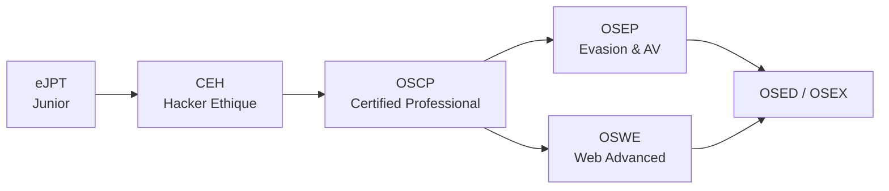

# 🎓 Ressources & Lab

> [!info] **Tout pour progresser et s'entraîner légalement.**

---

## 1. Plateformes d'entraînement

| Plateforme | Adresse | Niveau | Spécialité |
|---|---|---|---|
| **TryHackMe** | [tryhackme.com](https://tryhackme.com) | Débutant → Avancé | Guidé, très pédagogique |
| **HackTheBox** | [hackthebox.com](https://hackthebox.com) | Intermédiaire → Pro | Machines + Pro Labs AD |
| **VulnHub** | [vulnhub.com](https://vulnhub.com) | Tous | Machines à télécharger |
| **PortSwigger Academy** | [portswigger.net/web-security](https://portswigger.net/web-security) | Web | Exploitation web complète |
| **OverTheWire** | [overthewire.org](https://overthewire.org) | Débutant | Wargames CLI |
| **Crackmes.one** | [crackmes.one](https://crackmes.one) | Reverse | Crackme (RE) |
| **RingZer0** | [ringzer0ctf.com](https://ringzer0ctf.com) | Tous | CTF variés |
| **PicoCTF** | [picoctf.org](https://picoctf.org) | Débutant | CTF friendly |

---

## 2. Références indispensables

| Ressource | Adresse | Utilité |
|---|---|---|
| **GTFOBins** | [gtfobins.github.io](https://gtfobins.github.io) | Privesc Linux (binaires) |
| **LOLBAS** | [lolbas-project.github.io](https://lolbas-project.github.io) | Binaires Windows |
| **HijackLibs** | [hijacklibs.net](https://hijacklibs.net) | DLL hijacking |
| **Exploit-DB** | [exploit-db.com](https://www.exploit-db.com) | Exploits + searchsploit |
| **CVE Mitre** | [cve.mitre.org](https://cve.mitre.org) | Catalogue CVE |
| **MITRE ATT&CK** | [attack.mitre.org](https://attack.mitre.org) | Framework des techniques |
| **OWASP Top 10** | [owasp.org/www-project-top-ten](https://owasp.org/www-project-top-ten) | Vulns web |
| **PayloadsAllTheThings** | [github.com/swisskyrepo/PayloadsAllTheThings](https://github.com/swisskyrepo/PayloadsAllTheThings) | Payloads par catégorie (IMPRESSIONNANT) |
| **HackTricks** | [book.hacktricks.wiki](https://book.hacktricks.wiki) | Techniques + cheatsheets |
| **NetExec (ex-CME)** | [netexec.wiki](https://www.netexec.wiki) | Docs de l'outil AD |
| **BloodHound** | [bloodhoundhq.com](https://bloodhoundhq.com) | Cartographie AD |

---

## 3. Certifications (parcours type)



| Cert | Orientation | Prix ~ | Niveau |
|---|---|---|---|
| **eJPT** | Pentest global (pratique) | ~250€ | Débutant |
| **CEH** | Théorique | ~1000€ | Débutant |
| **OSCP** | Pentest pratique (la référence) | ~1600€ | Intermédiaire |
| **OSEP** | Evasion, AV bypass, AD avancé | ~1600€ | Avancé |
| **OSWE** | Exploitation web | ~1600€ | Avancé |
| **CRTO** | Red team / AD | ~500€ | Intermédiaire-Avancé |

> [!tip] 💡 **Conseil**
> La **pratique** compte plus que les certifs. Fais 50 machines THM/HTB avant de t'inquiéter du OSCP.

---

## 4. Monter son lab

### 4.1 Le lab de base (VM)

```
1. VirtualBox ou VMware (gratuit) ou Hyper-V
2. Kali Linux (attaquant)
3. Machines vulnérables :
   - Metasploitable 2 / 3
   - VulnHub : Kioptrix, DeRPnSti, FristiLeaks, RickdiculouslyEasy...
   - DVWA / WebGoat (web local)
4. Réseau isolé : mode "Host-only" (pas d'accès internet)
```

```bash
# Check que tout communique
ping 192.168.56.101
nmap -sV -sC 192.168.56.101
```

### 4.2 Lab AD maison (PowerShell / GoAD)

```
# GoAD (Game of Active Directory) - lab AD automatisé
# GitHub : Orange-Cyberdefense/GOAD
# Prerequis : Vagrant + VirtualBox + 8Go+ RAM
# → 3 DC, ~80 machines/services, les attaques AD à tester en réel
```

### 4.3 Lab malware / RE

```
1. VM Windows 10 isolée (snapshot avant toute exécution)
2. Flare VM (kit d'outils d'analyse) 
3. REMnux (Linux, analyse de malwares)
4. Réseau coupé ou "host-only" + capture tcpdump
```

---

## 5. Communautés & veille

- **r/cybersecurity**, **r/netsec**, **r/hacking** (Reddit)
- **The Hacker News** — news quotidiennes
- **SecurityWeek** / **BleepingComputer** — vulns récentes
- **Podcasts** : Darknet Diaries (histoires), Risky Business (technique)
- Discord francophone : **Français du Hacking** (bon point de départ)

---

## 6. Outils essentiels à connaître (top 20)

| Catégorie | Outils |
|---|---|
| **Scan** | nmap, masscan, netdiscover |
| **Web** | Burp Suite, ffuf, sqlmap, nuclei, nikto, wpscan |
| **AD** | BloodHound, netexec, impacket, kerbrute, mimikatz, Responder |
| **Cracking** | hashcat, john, hydra, medusa |
| **Pivot** | chisel, proxychains, ssh, socat |
| **C2** | Sliver (gratuit), Havoc, Metasploit, Cobalt Strike (pro) |
| **Privesc** | linpeas, winpeas, seclists |
| **RE** | Ghidra, radare2, gdb, x64dbg |
| **WiFi** | aircrack-ng, hcxtools, wifiphisher |

---

## 7. Checklist "avant de te lancer"

- [ ] Kali à jour : `apt update && apt full-upgrade`
- [ ] Wordlists décompressées : `rockyou.txt`, `SecLists`
- [ ] VPN/vmconnect pour THM/HTB fonctionnel
- [ ] Carnet de notes Obsidian prêt (cette vault !)
- [ ] Savoir ce qu'on teste **et pourquoi** (scope)

---

> [!success] 🏆 **Le message final**
> La cybersécurité offensive est un **métier de pratique**. 
> *"Try harder"* — et reste toujours dans le cadre légal. 🔒
>
> ➡️ Revenir au début : [[Cybersécurité Offensive|🗺️ Index de la base de connaissances]]
