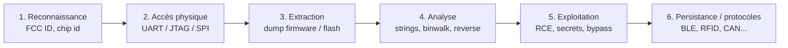

# Hardware & IoT Pentesting

> [!info] **C'est quoi ?**
> Les objets connectés (routeurs, badges RFID, montres, caméras...) sont des **ordinateurs miniaturisés** :
> firmware, puces, protocoles radios. Les attaquer = récupérer **secrets embarqués**, **codes**,
> **backdoors firmware**, ou **contourner la sécurité** physique d'un produit.

> [!warning] **Cadre légal**
> Hardware pentest = **matériel que tu possèdes** ou un **contrat de test explicite**.
> Jamais les objets d'autrui sans autorisation écrite.

---

## 1. La méthodologie globale



> [!tip] **L'ordre logique**
> Commence **toujours** par la **reconnaissance** (identifiant FCC, datasheet, photos du PCB),
> puis cherche **l'interface de debug la plus simple** : UART → JTAG → SPI (flash).

---

## 2. Reconnaissance

### 2.1 FCC ID (objets grand public)

> Tous les produits radio vendus aux USA passent par la **FCC** → photos **internes** souvent publiées !
> Ex : `FCC ID: 2AATL-PT15` → https://fccid.io

```bash
# Les photos internes révèlent : noms de puces, pinouts, points de test, UART/JTAG...
```

### 2.2 Identification des puces

> **Google le nom complet des puces** (ex : `STM32F103`, `NXP i.MX6ULL`). La datasheet donne :
> - le **pinout** (où sont TX/RX, TCK/TMS...)
> - l'**architecture** (ARM, AVR, RISC-V...)
> - les **défenses** (readout protection / lock bits)

---

## 3. Interfaces de debug (le chemin d'accès le plus simple)

### 3.1 UART — le premier truc à tester

> Fiche détaillée : [[Techniques/Hardware - UART| UART]]

> [!info] **Pourquoi en premier ?**
> UART = **console série** (bootloader + logs + souvent un **shell root**).
> Le plus simple à trouver sur un PCB (4 broches TX/RX/VCC/GND).

```bash
# Trouver les broches au multimètre / logic analyzer, puis :
screen /dev/ttyUSB0 115200
minicom -b 115200 -o -D /dev/ttyUSB0

# Baudrate inconnu ? Autodétection :
python2.7 baudrate.py -p /dev/ttyUSB0
# Baut rates communs : 9600, 19200, 38400, 57600, 115200

# Si le prompt demande un mot de passe → brute-force la console UART (scripts Python)
```

### 3.2 JTAG / SWD — le débogage complet

> Fiche détaillée : [[Techniques/Hardware - JTAG et SWD| JTAG / SWD]]

> [!info] **JTAG = contrôle TOTAL de la puce**
> Lecture/écriture mémoire, dump firmware, breakpoints. Si le JTAG n'est pas protégé, c'est game over.

```bash
# Identifier les broches JTAG (TCK/TMS/TDI/TDO) :
# - JTAGulator / JTAGenum (brute les combinaisons de broches)
# Puis dump via OpenOCD :
sudo openocd -f interface/stlink-v2-1.cfg -f target/nrf51.cfg -f dump_fw.cfg
# dump_fw.cfg : init ; reset init ; halt ; dump_image image.bin 0x0 0x40000 ; exit
```

> [!warning] **Lock bits / Readout Protection (RDP)**
> Les AVR ont des **lock bits** ; les STM32 ont des niveaux RDP (0/1/2).
> Désactiver RDP **efface souvent la flash** — teste AVANT d'avoir besoin du firmware !
> (Glitching permet parfois de contourner, voir section 6.)

### 3.3 SPI — dump direct de la flash externe

> Fiche détaillée : [[Techniques/Hardware - Dump et Analyse de Firmware| Dump de firmware]]

> La plupart des devices ont une **flash SPI NOR** (SOIC-8, marquée `25XX...` : 25Q64, 25L16...).
> La lire = **dumper le firmware entier**.

```bash
# Avec un CH341A / Bus Pirate / flashrom :
flashrom -p ch341a_spi -r dump.bin -c "MX25L6406E"
flashrom -p ft232_spi:type:232h -r spidump.bin

# Avec une clipe de test (SOIC-8 clip) sur la puce — souvent possible sans dessouder !
```

> [!tip] **L'astuce "Pin2Pwn"**
> Court-circuiter les broches de la flash SPI (ex : MOSI ↔ CS) peut faire crasher le boot → **shell
> dans le bootloader** ou **root shell** Linux embarqué. Une aiguille à coudre suffit

---

## 4. Dump & analyse du firmware

### 4.1 Dump (toutes les méthodes)

| Méthode | Outil | Quand |
|---|---|---|
| **Flash SPI** | `flashrom`, CH341A | La puce flash externe |
| **Debug port** | `avrdude`, `openocd`, `picotool` | Via le microcontrôleur |
| **Bootloader** | `esptool.py image_info` | ESP8266/ESP32 |
| **Voltage glitch** | Faultier/ChipWhisperer | Firmware protégé (RDP) |

```bash
# AVR via usbasp
avrdude -p m328p -c usbasp -P /dev/ttyUSB0 -b 9600 -U flash:r:flash_raw.bin:r

# ESP32/ESP8266
esptool.py read_flash 0x0 0x400000 firmware.bin

# ihex → binaire (fichiers .hex Arduino)
avr-objcopy -I ihex -O binary dump.hex dump.bin
```

### 4.2 Analyse statique

> Fiche détaillée : [[Techniques/Hardware - Dump et Analyse de Firmware| Dump de firmware]]

```bash
# 1. Découper les fichiers système embarqués
binwalk -Me firmware.bin                      # extraction automatique
docker run --rm ghcr.io/onekey-sec/unblob:latest /data/input/fw     # plus robuste
unsquashfs -f -d /tmp/rootfs rootfs.squashfs   # système de fichiers SquashFS
jefferson image.jffs2 -d outdir                # JFFS2

# 2. Chercher les secrets
strings -n 6 firmware.bin | grep -iE 'pass|key|secret|token|api'
strings -e l firmware.bin                     # UTF-16
binwalk -E firmware.bin                       # entropy (haut = chiffré/compressé)

# 3. Reverse engineering
radare2 -A -a arm -b 32 firmware.bin          # r2 / Ghidra / IDA (selon archi)
# Charge l'adresse de base et le point d'entrée dans IDA/Ghidra !
# ESP8266 : loader ida-xtensa ; SVD-Loader pour Ghidra (périphériques)
```

### 4.3 Types de firmware à connaître

| Format | Signature | Note |
|---|---|---|
| **SquashFS** | `sqsh`/`hsqs` | Système de fichiers Linux compressé |
| **JFFS2** | `0x72b6` | Flash NAND, journalisé |
| **UBIFS** | `0x06101831` | Successeur de JFFS2 |
| **Intel HEX** | ligne commence par `:` | Format de transfert µC |
| **SREC** | ligne commence par `S` | Motorola |
| **TI-TXT** | adresses avec `@` | MSP430 |

---

## 5. Protocoles IoT / radios

> Fiches détaillées : [[Techniques/Hardware - I2C et SPI| I2C/SPI]] · [[Techniques/Hardware - RFID et NFC| RFID/NFC]]

### 5.1 I2C / SPI (bus internes)

```bash
# I2C : scanner les adresses des composants
i2cdetect -y 1
./eeprog -x /dev/i2c-1 0x50 -16 -r 0x00:0x10    # lire l'EEPROM

# SPI : dump flash (voir 4.1)
```

### 5.2 RFID / NFC (badges, tickets)

> Fiches détaillées : [[Techniques/Hardware - RFID et NFC| RFID/NFC (hub)]] · [[Techniques/Hardware - RFID MIFARE (HF 13.56 MHz)| MIFARE]] · [[Techniques/Hardware - RFID LF (HID, EM410X, Indala, HiTag)| LF]] · [[Techniques/Hardware - Amiibo et NTAG215| Amiibo]]

| Technologie | Fréquence | Faiblesse classique |
|---|---|---|
| **MIFARE Classic** | 13.56 MHz | Crypto **cassée** (crypto1) → dump/clone via Proxmark + `mfoc` |
| **MIFARE Ultralight** | 13.56 MHz | Pas de crypto du tout |
| **MIFARE DESFire** | 13.56 MHz | Plus solide (AES), mais config souvent faible |
| **HID / EM410X / Indala** | 125 kHz | Clonage total (cartes fixes) |

```bash
# Proxmark3 — le couteau suisse RFID
hf mf autopwn                             # dump auto d'un MIFARE Classic
hf mf chk --dump                          # tester les clés connues
lf hid clone -r <raw>                     # cloner un badge HID
```

> [!danger] **Replay & relay attacks**
> - **Replay** : intercepter une transaction NFC et la **rejouer** plus tard (NFCopy85...).
> - **Relay** : MITM en temps réel entre le badge et le lecteur (2 Proxmark).

### 5.3 BLE / autres radios

```bash
# BLE : scan + GATT
gatttool -b AA:BB:CC:DD:EE:FF -I
# souvent : les services Bluetooth exposent UART (Nordic UART Service) → shell !
# Wifi IoT : les attaques WPA/PMKID habituelles s'appliquent (voir fiche WiFi)
```

### 5.4 Tous les protocoles IoT

> Fiches détaillées :
> [[Techniques/Protocole Bluetooth| Bluetooth/BLE]] · [[Techniques/Protocole Zigbee| Zigbee]] ·
> [[Techniques/Protocole LoRa| LoRa]] · [[Techniques/Protocole CAN Bus| CAN Bus]] ·
> [[Techniques/Protocole Modbus| Modbus]] · [[Techniques/Protocole MQTT| MQTT]] ·
> [[Techniques/Protocole DNP3| DNP3]] · [[Techniques/Protocole MMS| MMS]] ·
> [[Techniques/Protocole SS7| SS7]] · [[Techniques/Protocole USB| USB]] ·
> [[Techniques/Protocole UPnP| UPnP]] · [[Techniques/Protocole HTTP (IoT)| HTTP (IoT)]] ·
> [[Techniques/Protocole GPS| GPS]]

> [!tip] **Radio / RF**
> Pour les couches radio (HackRF, RTL-SDR) et les fausses BTS GSM :
> [[Techniques/Hardware - SDR| SDR]] · [[Techniques/Hardware - LimeSDR et BTS| LimeSDR & BTS]]

---

## 5bis. Les gadgets du pentester hardware

> Fiches détaillées : [[Techniques/Hardware - Flipper Zero| Flipper Zero]] ·
> [[Techniques/Hardware - Proxmark| Proxmark]] · [[Techniques/Hardware - iCopy-X| iCopy-X]] ·
> [[Techniques/Hardware - HydraBus| HydraBus]] · [[Techniques/Hardware - HydraFlash| HydraFlash]] ·
> [[Techniques/Hardware - HydraNFC| HydraNFC]] · [[Techniques/Hardware - HydraUSB3| HydraUSB3]] ·
> [[Techniques/Hardware - ESP32| ESP32]] · [[Techniques/Hardware - Raspberry Pi| Raspberry Pi]] ·
> [[Techniques/Hardware - Bus Pirate| Bus Pirate]] · [[Techniques/Hardware - CH341A| CH341A]] ·
> [[Techniques/Hardware - Logic Analyzer| Logic Analyzer]] ·
> [[Techniques/Hardware - Memory Programmer| Memory Programmer]] ·
> [[Techniques/Hardware - Arduino| Arduino]] · [[Techniques/Hardware - Pwnagotchi| Pwnagotchi]] ·
> [[Techniques/Hardware - GoodFET| GoodFET]] ·
> [[Techniques/Hardware - Bruschetta Board| Bruschetta Board]] ·
> [[Techniques/Hardware - M5Stack| M5Stack]] · [[Techniques/Hardware - microbit| micro:bit]]

> [!info] **Recon & ressources**
> [[Techniques/Hardware - Identification de puces| Identification de puces]] ·
> [[Techniques/Hardware - Recherche FCC ID| Recherche FCC ID]] ·
> [[Techniques/Hardware - Composants électroniques| Composants électroniques]] ·
> [[Techniques/Hardware - Mots de passe par défaut IoT| Mots de passe par défaut]] ·
> [[Techniques/Hardware - Secure Boot| Secure Boot]] ·
> [[Techniques/Hardware - Kits et ressources| Kits & ressources]]

---

## 6. Sécurité avancée : Fault Injection (glitching)

> Fiche détaillée : [[Techniques/Hardware - Fault Injection| Fault Injection]]

> [!info] **Le principe**
> Un **défaut contrôlé** (voltage, horloge, EM) pendant un moment précis du boot peut **sauter une
> vérification** : bypass du secure boot, du contrôle de mot de passe, de l'anti-dump (RDP)...

```bash
# Types :
# - Power/VCC glitch (crowbar) : coupe/sag le VCC au bon moment
# - Clock glitch : décale une horloge
# - EM glitch : impulsion électromagnétique (ChipSHOUTER)

# Outils : ChipWhisperer, Faultier, PicoGlitcher, HydraBus
# Exemples : Trezor bypass RDP, déblocage debug STM32, glitch memcpy → code exec
```

> [!warning] **C'est du "timing" délicat** : il faut **balayer delay/length** (paramètres)
> jusqu'à trouver la fenêtre qui fait fail la vérif. Souvent des milliers d'essais.

---

## 7. Tips & Pièges

> [!tip] **Toujours commencer par le plus simple**
> 1. **Photos FCC** → identifie les puces
> 2. **UART** → console (souvent un shell !)
> 3. **SPI flash** → dump firmware
> 4. **JTAG** → contrôle total (si pas de lock)
> 5. **Fault injection** → pour les firmwares protégés

> [!tip] **Les secrets sont PARTOUT dans le firmware**
> `strings` + grep sur : `passw`, `secret`, `apikey`, `token`, `Authorization`, mots de passe par défaut.
> Beaucoup d'IoT ont des **credentails hardcodés** (et les [[Techniques/Password Cracking|default credentials]]).

> [!warning] **Attention aux défauts physiques**
> - Connecter **VCC ↔ GND** = détruire le device (identifie TOUJOURS GND au multimètre en premier)
> - Ne pas confondre RX/TX (juste à permuter, pas grave), mais **VCC/GND = danger**.
> - **Partager la masse** (GND commun) entre le logic analyzer et le PCB.
> - Power down avant de brancher des sondes.

> [!warning] **RDP / lock bits = données perdues**
> Désactiver la protection de lecture **efface la flash** (STM32 RDP, AVR lock bits).
> **Dump d'abord**, ensuite joue avec les protections !

> [!tip] **Entropy = ta boussole**
> `binwalk -E fw` : entropie **haute** → chiffré (ou compressé) → le contenu est invisible.
> Entropie **basse** → du texte/du code lisible → analyse directe.

> [!success] **Le flow "je veux pwn un objet connecté"**
> 1. Recon (FCC, chips) → 2. UART (shell ?) → 3. Flash SPI (dump firmware)
> 4. strings/binwalk/reverse → 5. Secrets + RCE → 6. Protocoles (RFID/BLE) pour la suite.

---

> [!info] **Sources**
> - [HardwareAllTheThings — swisskyrepo](https://github.com/swisskyrepo/HardwareAllTheThings)
> - [Extracting Firmware from Embedded Devices (SPI NOR Flash)](https://www.youtube.com/watch?v=nruUuDalNR0)

Suite logique : [[09 - Reverse Engineering & Malware| Reverse Engineering]] · [[07 - Wireless, MITM & Social Engineering| Wireless]]
