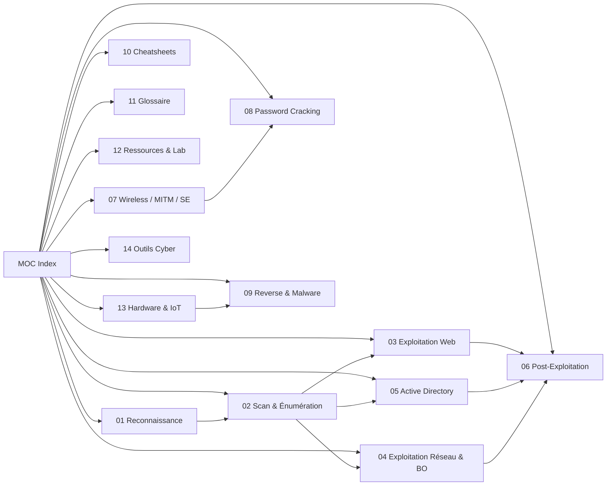
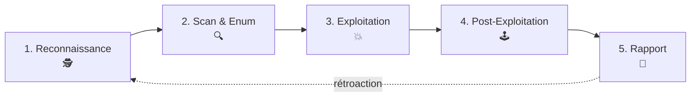

# 🛡️ Cybersécurité Offensive — Index (MOC)

> [!warning] ⚖️ **Avertissement légal**
> Tout ce qui est documenté ici doit **uniquement** être utilisé dans un cadre légal :
> machines de test (TryHackMe, HackTheBox, VulnHub), lab personnel, ou avec **autorisation écrite**.
> Accès non autorisé = délit (Code pénal, art. 323-1 à 323-7). ⚠️

---

## 🗺️ La carte de la base de connaissances



---

## 📚 Les notes

| # | Note | Contenu | Niveau |
|---|------|---------|--------|
| 01 | [[01 - Reconnaissance\|🕵️ Reconnaissance]] | OSINT, DNS, Shodan, Google dorks, GitHub dorks | Débutant → Avancé |
| 02 | [[02 - Scan & Énumération\|🔍 Scan & Énumération]] | Nmap avancé, NSE, énumération de services | Débutant → Avancé |
| 03 | [[03 - Exploitation Web\|🌍 Exploitation Web]] | SQLi, XSS, SSRF, LFI/RFI, SSTI, JWT + **62 fiches Web détaillées** | Intermédiaire → Avancé |
| 04 | [[04 - Exploitation Réseau\|💥 Exploitation Réseau]] | Metasploit, reverse shells, pivoting, Buffer Overflow | Avancé |
| 05 | [[05 - Active Directory\|👑 Active Directory]] | Kerberos, BloodHound, Kerberoasting, Golden Ticket | Avancé |
| 06 | [[06 - Post-Exploitation\|🕹️ Post-Exploitation]] | Privesc Linux/Windows, persistence, évasion | Intermédiaire → Avancé |
| 07 | [[07 - Wireless, MITM & Social Engineering\|📡 Wireless / MITM / SE]] | WiFi, aircrack-ng, MITM, phishing | Intermédiaire |
| 08 | [[08 - Password Cracking\|🔐 Password Cracking]] | Hashcat, John, règles, masques | Intermédiaire → Avancé |
| 09 | [[09 - Reverse Engineering & Malware\|🧬 Reverse Engineering]] | Static/dynamic analysis, radare2, Ghidra | Avancé |
| 10 | [[10 - Cheatsheets\|⚡ Cheatsheets]] | Toutes les commandes au même endroit | Tous |
| 11 | [[11 - Glossaire\|📖 Glossaire]] | Toutes les abréviations | Tous |
| 12 | [[12 - Ressources & Lab\|🎓 Ressources & Lab]] | Plateformes, certifications, lab | Tous |
| 13 | [[13 - Hardware & IoT\|⚙️ Hardware & IoT]] | UART/JTAG, dump firmware, RFID/NFC, glitch + **49 fiches Hardware/protocoles détaillées** | Avancé |
| 14 | [[Tools\|🧰 Outils Cyber]] | **76 fiches outils** offensifs & défensifs (connus et méconnus) | Tous |

> [!tip] 📚 **Nouveau : bibliothèque de techniques détaillées**
> Chaque attaque/concept a maintenant sa **fiche dédiée** (définition, schéma, commandes, détection, pièges) :
> ➡️ [[Cybersécurité Offensive/Techniques/Bibliothèque technique|🗂️ Bibliothèque de Techniques]] · [[Cybersécurité Offensive/Outils/Tools|🧰 Bibliothèque d'Outils]]

---

## 📊 Tableau de bord dynamique (Dataview)

> [!info] Ces compteurs et tables se mettent à jour **automatiquement** à chaque ouverture de note.

### Fiches techniques par catégorie

```dataview
TABLE WITHOUT ID
  length(rows) AS "📄 Fiches"
FROM "Cybersécurité Offensive/Techniques"
WHERE type = "technique"
GROUP BY categorie AS "Catégorie"
SORT length(rows) DESC
```

### Outils par catégorie

```dataview
TABLE WITHOUT ID
  length(rows) AS "🛠️ Outils"
FROM "Cybersécurité Offensive/Outils"
WHERE type = "outil"
GROUP BY categorie AS "Catégorie"
SORT length(rows) DESC
```

### 5 dernières fiches modifiées

```dataview
TABLE WITHOUT ID
  file.link AS "Fiche",
  dateformat(file.mtime, "yyyy-MM-dd") AS "Modifié"
FROM "Cybersécurité Offensive/Techniques"
WHERE type = "technique"
SORT file.mtime DESC
LIMIT 5
```

### 5 derniers outils ajoutés

```dataview
TABLE WITHOUT ID
  file.link AS "Outil",
  categorie AS "Catégorie"
FROM "Cybersécurité Offensive/Outils"
WHERE type = "outil"
SORT file.ctime DESC
LIMIT 5
```

---

## 💡 Où sont les Tips & Pièges ?

> [!tip] 🧠 **Chaque note technique se termine par une section `🧠 Tips & Pièges`**
> Ce sont les **réflexes**, les **pièges classiques** et les **raccourcis pro** à connaître :
>
> - [[01 - Reconnaissance#4. 🧠 Tips & Pièges|🕵️ Tips Reconnaissance]]
> - [[02 - Scan & Énumération#4. 🧠 Tips & Pièges|🔍 Tips Scan & Énum]]
> - [[03 - Exploitation Web#15. 🧠 Tips & Pièges (web)|🌍 Tips Web]] (+ vulns avancées : [[03 - Exploitation Web#14. Vulns avancées à connaître|smuggling, GraphQL, CORS...]])
> - [[04 - Exploitation Réseau#5. 🧠 Tips & Pièges|💥 Tips Réseau]]
> - [[05 - Active Directory#7. 🧠 Tips & Pièges AD|👑 Tips AD]] (+ délégations : [[Techniques/Kerberos Delegation|🧬 Delegation]], [[Techniques/Coerce - PrinterBug et PetitPotam|🧲 Coerce]])
> - [[06 - Post-Exploitation#6. 🧠 Tips & Pièges|🕹️ Tips Post-Exploit]]
> - [[07 - Wireless, MITM & Social Engineering#4. 🧠 Tips & Pièges|📡 Tips Wireless/MITM]]
> - [[08 - Password Cracking#6. 🧠 Tips & Pièges|🔐 Tips Cracking]]
> - [[09 - Reverse Engineering & Malware#7. 🧠 Tips & Pièges|🧬 Tips RE]]
> - [[13 - Hardware & IoT#7. 🧠 Tips & Pièges|⚙️ Tips Hardware]]
> - [[10 - Cheatsheets#10. Tips express (le résumé des résumés)|⚡ Tips express]]

---

## 🧭 Méthodologie globale (PTES)



> [!danger] 🚨 **Règle d'or**
> 90 % de la réussite d'un pentest = **bonne énumération**. Ne jamais sauter une phase.

---

## 🎯 Parcours d'apprentissage suggéré

1. **Bases réseau** (TCP/IP, ports, DNS, HTTP) → voir [[01 - Reconnaissance]] & [[02 - Scan & Énumération]]
2. **Web** → [[03 - Exploitation Web]] (le plus rentable pour débuter)
3. **Privesc** → [[06 - Post-Exploitation]]
4. **Réseau & Metasploit** → [[04 - Exploitation Réseau]]
5. **Active Directory** → [[05 - Active Directory]] (là où se joue le jeu réel)
6. **Spécialisation** → cracking, wireless, RE, malware

---

## ✅ Checklist avant un engagement

- [ ] Autorisation **écrite** obtenue (scope, dates, IP)
- [ ] Wordlists présentes (`/usr/share/wordlists/`)
- [ ] IP/VMs notées, lab isolé
- [ ] Outils à jour (`apt update && apt upgrade`)
- [ ] Carnet de notes pour **tout** documenter
