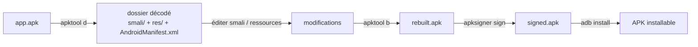

# APKTool — Mobile & Reverse Engineering

> [!info] **En 1 phrase**
> **apktool** décompile puis recompile un APK Android pour **lire le code smali, décoder les ressources
> XML** (AndroidManifest, layouts) et **modifier l'application**, avant de la re-signer.

---

## Overview

| Champ | Valeur |
|---|---|
| Nom complet | Apktool (anciennement brut.apktool, fork de iBotPeaches) |
| Description | Outil de désassemblage/reassemblage des APK Android : decode/encode du bytecode smali et des ressources binaires (XML, arsc) |
| Catégorie | Mobile & Reverse Engineering |
| Sous-catégorie | Reverse statique d'applications Android (modification de binaires) |
| Fonction principale | `apktool d` (decoder) et `apktool b` (build/reassembler) un APK |
| Type d'outil | CLI (jar Java exécutable) |
| Licence | Apache License 2.0 |
| Open source / propriétaire | Open source |
| Langage(s) de programmation | Java |
| Développeur / organisation | Connor Tumbleson (« iBotPeaches ») / communauté Apktool |
| Projet officiel | iBotPeaches/Apktool |
| Dépôt officiel | https://github.com/iBotPeaches/Apktool |
| Documentation officielle | https://apktool.org/docs |
| Date de création | 2012 (reprise du projet brut.apktool, à l'origine par brut.all) |
| État du projet | actif (releases régulières) |
| Dernière version connue | 3.0.3 (19/07/2026) |
| Systèmes compatibles | Linux (64-bit), Windows (64-bit), macOS (64-bit) — Java 17+ |

---

## Concept

Un APK Android est une archive ZIP qui contient : `classes.dex` (le bytecode Dalvik/ART), les ressources **compilées en format binaire** (`resources.arsc`, `res/*.xml` encodés en AXML binaire), les bibliothèques natives (`lib/*.so`), les assets et le manifeste (`AndroidManifest.xml`). Apktool **inverse cette compilation** : le DEX est traduit en un dossier `smali/` (bytecode assembleur lisible) via baksmali, et les ressources XML binaires sont **décodées en XML texte clair** via aapt2. On peut alors lire la logique, **patcher le smali à la main**, modifier le manifeste ou les ressources, puis **reconstruire** l'APK (`apktool b`) et le re-signer pour l'installer.

C'est l'outil de base de la **modification d'app** : il se distingue de jadx (qui produit du Java décompilé, plus lisible mais non recompilable tel quel) et de Frida (hook au runtime, sans toucher au binaire). Dans un pentest mobile, apktool sert à : contourner un contrôle de licence ou de signature, désactiver un SSL pinning statique, rendre une app debuggable, modifier des ressources (strings, endpoints, icônes), ou comprendre un loader/obfuscateur. Les applications récentes (targetSdk ≥ 30, compact entries, staged aliases, feature flags API 35/36) exigent la version 3.x qui embarque la prise en charge native d'aapt2.



---

## Concepts fondamentaux

| Concept | Explication |
|---|---|
| DEX (Dalvik Executable) | Fichier contenant le bytecode exécuté par la VM Dalvik/ART. Les apps modernes ont plusieurs DEX (`classes.dex`, `classes2.dex`…) |
| Smali | Assemblage lisible du bytecode DEX (format de baksmali) : `invoke-virtual`, `iget`, `if-eqz`… Une instruction = une ligne |
| AXML / binaire XML | Les fichiers `res/*.xml` sont encodés en binaire (hash des noms d'attributs) : apktool les décode en XML texte lisible |
| resources.arsc | Table des ressources compilées (identifiants `0x7f0x…`, valeurs, configurations). Apktool le désérialise en `res/` + `values/` |
| AndroidManifest.xml | Manifeste : composants (activity/service/receiver/provider), permissions, `application` flags. Déjà lisible après `apktool d` |
| aapt2 | Outil de compilation des ressources d'Android : apktool 3.x l'utilise en interne pour encoder/décoder (aapt1 supprimé) |
| Framework resources | Les `framework-res.apk` des fabricants (Samsung, MIUI…) fournissent des ressources non standard : à installer avec `apktool if` |
| Signature APK | V1 (JAR), V2 (APK Signature Scheme), V3 : la re-signature invalide les vérifications d'intégrité faites par l'app |
| keystore / apksigner | `keytool` génère la paire de clés, `apksigner` signe l'APK reconstruit (remplace `jarsigner` pour V2/V3) |
| ProGuard / R8 | Obfuscation du code : renommage des classes/méthodes, suppression du code mort — rend le smali plus difficile à lire |

---

## Installation

### Debian / Ubuntu / Kali Linux

```bash
sudo apt update && sudo apt install -y apktool
# version du dépôt parfois ancienne (2.x) : préférer le jar officiel pour la 3.x
```

### Windows

```powershell
# 1) Installer le JDK 17+ (Adoptium Temurin) : https://adoptium.net
# 2) Télécharger apktool_3.0.3.jar depuis les releases GitHub
# 3) Créer apktool.bat contenant :
#    java -jar "C:\apktool\apktool_3.0.3.jar" %*
```

### Docker

```bash
docker run --rm -v "$PWD":/work -w /work thibaultlaurens/apktool apktool d app.apk
```

> [!warning] Prérequis & problèmes potentiels
> - **Java 17+** requis (OpenJDK 17/21 recommandé). Sans Java, `java -jar apktool.jar` échoue.
> - **64-bit uniquement** depuis la v3.0 : plus aucun support 32-bit.
> - Sous Windows, ajouter `apktool.bat` au PATH ou lancer via `java -jar`.
> - En cas d'échec de build des ressources d'une app OEM : installer les frameworks d'abord (`apktool if`).

---

## Configuration

Apktool n'utilise pas de fichier de configuration utilisateur : tout se passe en **ligne de commande** et dans des dossiers standardisés.

| Paramètre | Rôle | Valeur possible | Impact | Exemple |
|---|---|---|---|---|
| `--frame-path <dir>` | Répertoire des frameworks installés | chemin | Évite de re-télécharger les frameworks | `apktool d -p /opt/frameworks app.apk` |
| `--frame-tag <tag>` | Nom du framework à installer/charger | tag | Isole les ressources OEM | `apktool if --frame-tag samsung framework-res.apk` |
| `--res-resolve-mode` | Mode de résolution des ressources non trouvées | `default` \| `greedy` \| `lazy` | Contrôle la reconstruction de resources.arsc | `apktool b --res-resolve-mode greedy out/` |
| `--no-debug-info` | Supprime les infos de debug du smali | flag | Smali plus lisible, plus compact | `apktool d --no-debug-info app.apk` |
| `--keep-broken-res` | Continue malgré des ressources invalides | flag | Décodage partiel d'APK cassés/corrompus | `apktool d --keep-broken-res app.apk` |
| `--match-original` | Évite les ressources dupliquées (mode legacy) | flag | Rebuild plus fidèle à l'original | `apktool d --match-original app.apk` |
| `apktool.yml` | Métadonnées générées lors du decode | généré | Contient version, sdkInfo, transformations | lecture seule en pratique |

---

## Architecture interne

- **CLI** (`brut.apktool.Main`) : parsing des arguments (commons-cli), dispatch entre les commandes `d` (decode), `b` (build), `if` (install framework), `cf` (clean frameworks).
- **ApkDecoder** : décompresse l'APK (ZIP), invoque **baksmali** pour DEX→smali, appelle **aapt2** (dans sa version `d` pour dump des ressources) ou son parser interne `BinaryResourceParser` pour décoder AXML/arsc en XML texte.
- **ApkBuilder** : compile les ressources avec **aapt2** (`aapt2 link`), réassemble le smali avec **smali**, repackage le tout en APK (ZIP aligné, `zipalign`).
- **Framework manager** : stocke les framework-res installés sous `~/.local/share/apktool/framework/` (ou `--frame-path`), les charge pour résoudre les ressources non standards.
- **Sorties decode** : `AndroidManifest.xml`, `apktool.yml`, `smali*/`, `res/`, `original/` (fichiers non touchés), `assets/`, `lib/`, `unknown/`.
- Dépendances clés : **baksmali/smali** (projet smali), **aapt2** (AOSP), Guava, commons-io, XMLUnit (tests), Gradle/Shadow (build).

---

## Commandes

### Commandes principales

| Commande | Objectif | Résultat attendu |
|---|---|---|
| `apktool d app.apk` | Décompile l'APK dans `./app` | Dossier `app/` avec smali + res + manifest |
| `apktool d app.apk -o out/` | Décompile dans un dossier précis | `out/` contenant l'APK décomposé |
| `apktool d --no-res app.apk` | Ignore les ressources (smali seul) | Pas de `res/`, decode plus rapide |
| `apktool d --no-src app.apk` | Ignore le smali (ressources seules) | `res/` + manifest décodés, pas de smali |
| `apktool d -f app.apk` | Force l'écrasement d'un dossier existant | Re-decode sans erreur |
| `apktool b out/ -o rebuilt.apk` | Recompile le dossier en APK | `rebuilt.apk` non signé |
| `apktool b out/ --debuggable` | Ajoute le flag `android:debuggable="true"` | APK attachable au debugger |
| `apktool b out/ --net-sec-conf <f>` | Injecte un network security config | Permet le cleartext/CA custom |
| `apktool b out/ --no-crunch` | Ne décompresse pas les ressources (crunch) | Build plus rapide, ressources intactes |
| `apktool if framework-res.apk` | Installe un framework | Le framework est dispo pour les prochains decode |
| `apktool cf` | Nettoie les frameworks installés | Vide `~/.local/share/apktool/framework/` |
| `apktool --version` | Affiche la version | `3.0.3` par exemple |

### Commandes avancées

```bash
# Décode complet en mode "no-debug-info" + force
apktool d -f --no-debug-info app.apk -o app_src
# Décode uniquement les sources multi-dex (toutes les classes)
apktool d -a app.apk -o app_all_src
# Build avec mode de résolution greedy + sans APK final (jar uniquement)
apktool b --res-resolve-mode greedy --no-apk out/
# Installer le framework d'un vendor avant decode
apktool if --frame-tag samsung framework-res.apk
apktool d --frame-tag samsung app_samsung.apk -o app_src
```

---

## Options et flags

| Option | Description | Exemple | Niveau |
|---|---|---|---|
| `d` | Commande decode (disassemble) | `apktool d app.apk` | Basic |
| `b` | Commande build (reassemble) | `apktool b out/ -o rebuilt.apk` | Basic |
| `if` | Install framework | `apktool if framework-res.apk` | Basic |
| `-o, --output <dir>` | Dossier de sortie | `apktool d app.apk -o src/` | Basic |
| `-f, --force` | Écrase le dossier existant | `apktool d -f app.apk` | Basic |
| `-r, --no-res` | Ne décode pas les ressources | `apktool d -r app.apk` | Basic |
| `-s, --no-src` | Ne décode pas le smali | `apktool d -s app.apk` | Basic |
| `-t, --frame-tag <tag>` | Tag de framework | `apktool d -t samsung app.apk` | Intermediate |
| `-p, --frame-path <dir>` | Dossier des frameworks | `apktool d -p ./frw app.apk` | Intermediate |
| `--no-debug-info` | Supprime les infos de debug du smali | `apktool d --no-debug-info app.apk` | Intermediate |
| `--keep-broken-res` | Poursuit le decode malgré les erreurs de ressources | `apktool d --keep-broken-res app.apk` | Intermediate |
| `-a, --all-src` | Décode toutes les classes (multi-dex complet) | `apktool d -a app.apk` | Advanced |
| `--match-original` | Évite les ressources dupliquées | `apktool d --match-original app.apk` | Advanced |
| `--res-resolve-mode` | Mode de résolution (`default`/`greedy`/`lazy`) | `apktool b --res-resolve-mode lazy out/` | Advanced |
| `--debuggable` | Force `android:debuggable="true"` au build | `apktool b --debuggable out/` | Advanced |
| `--net-sec-conf <f>` | Injecte un network_security_config | `apktool b --net-sec-conf ns.xml out/` | Advanced |
| `--no-apk` | Build sans générer l'APK (jar/classes seulement) | `apktool b --no-apk out/` | Expert |
| `--no-crunch` | Désactive le crunch des ressources | `apktool b --no-crunch out/` | Expert |
| `--aapt <binaire>` | Spécifie un binaire aapt2 custom | `apktool b --aapt /opt/aapt2 out/` | Expert |
| `cf` | Clean des frameworks | `apktool cf` | Expert |

---

## Exemples pratiques

### Beginner

```bash
# Objectif : décompiler un APK et explorer sa structure
apktool d app.apk -o app_src
ls app_src/ app_src/smali/ app_src/res/

# Objectif : lister les composants exportés dans le manifest décodé
grep -n "exported" app_src/AndroidManifest.xml
```

### Intermediate

```bash
# Objectif : recompiler puis re-signer une app modifiée
apktool b app_src -o rebuilt.apk
keytool -genkey -v -keystore test.jks -alias test -keyalg RSA -keysize 2048 -validity 10000
apksigner sign --ks test.jks --out signed.apk rebuilt.apk
adb install signed.apk
```

### Advanced

```bash
# Objectif : modifier une string de ressource (ex : endpoint) sans toucher au smali
grep -rn "https://example.com" app_src/res/
# modifier la valeur dans app_src/res/values/strings.xml puis :
apktool b app_src -o rebuilt.apk
apksigner sign --ks test.jks --out signed.apk rebuilt.apk
```

### Expert

```bash
# Objectif : forcer un flag AndroidManifest au build (debuggable + allowBackup)
apktool b --debuggable app_src -o debug.apk
aapt dump badging debug.apk | grep -E "debuggable|application-label"
# Objectif : automatiser decode → patch smali → build sur un lot d'APK
for apk in *.apk; do
    apktool d -f -o "src_$apk" "$apk"
    apktool b "src_$apk" -o "mod_$apk"
done
```

---

## Workflow complet (scénario pas à pas)

**Scénario : retirer une vérification de licence pour analyser le flux (test / CTF).**

1. **Décompiler** :
   ```bash
   apktool d app.apk -o app_src
   ```
2. **Chercher la vérification** :
   ```bash
   grep -rn "licensed\|licence\|premium" app_src/smali/
   ```
3. **Ouvrir le smali concerné** (ex. `MainActivity.smali`) et repérer le test :
   ```smali
   if-nez v0, :cond_0            ; si v0 != 0 → licence valide
   ```
4. **Patcher le flux** : inverser la condition (`if-nez` → `if-eqz`) ou forcer `const/4 v0, 0x1` avant le test.
5. **Recompiler** :
   ```bash
   apktool b app_src -o rebuilt.apk
   ```
6. **Signer et installer** :
   ```bash
   keytool -genkey -v -keystore key.jks -alias test -keyalg RSA -keysize 2048 -validity 10000
   apksigner sign --ks key.jks --out signed.apk rebuilt.apk
   adb install signed.apk
   ```

---

## Scénarios avancés

### Scénario 1 : Suppression du SSL pinning par patch smali

Désactiver la vérification du certificat pour intercepter le trafic avec Burp.

```bash
grep -rn "ssl\|TrustManager\|checkServerTrusted" app_src/smali/
# Retrouver la classe du TrustManager et patcher checkServerTrusted en NOP
# (ou injecter un network_security_config qui autorise les CA user)
apktool b app_src -o rebuilt.apk
apksigner sign --ks key.jks --out signed.apk rebuilt.apk
```

### Scénario 2 : Activer le flag debuggable et la sauvegarde des données

Modifier l'AndroidManifest pour faciliter l'analyse runtime.

```xml
<application android:debuggable="true" android:allowBackup="true" ...>
```

```bash
apktool b app_src -o rebuilt.apk
adb install rebuilt.apk
adb shell am start -D -n com.app/.MainActivity   # session attachable au debugger
```

### Scénario 3 : Désassemblage d'un multi-dex obfusqué pour comprendre un loader

```bash
apktool d -a app.apk -o app_full
# Le loader peut télécharger/chiffrer classes2.dex : suivre les appels
# à DexClassLoader / InMemoryDexClassLoader dans app_full/smali/
grep -rn "DexClassLoader\|InMemoryDexClassLoader" app_full/smali/ | head
```

---

## Cybersecurity use cases

| Phase | Utilisation |
|---|---|
| Reverse engineering statique | Lire la logique smali, décoder le manifeste et les ressources |
| Analyse de malware Android | Désassembler un loader/obfusqué, extraire les strings et les C2 (`grep` sur `smali/`) |
| Test d'intrusion mobile | Supprimer le pinning, désactiver anti-root, rendre debuggable pour l'analyse dynamique |
| Audit de ressources | Vérifier les endpoints, certificats, icônes, locales dans `res/` |
| CTF / crackme | Contourner une vérification de licence/serial en patchant le smali |

---

## MITRE ATT&CK

| Tactique | Technique / Sub-technique | ID | Raison | Détection | Mitigation |
|---|---|---|---|---|---|
| Defense Evasion | Obfuscated Files or Information | T1027 | Décompiler puis re-packer un APK modifié pour masquer le changement | Vérification de signature/checksum des classes au boot | Signature APK V2/V3, tamper detection, Play Integrity |
| Defense Evasion | Obfuscated Files or Information (Android) | T1406 | Traitement des DEX obfusqués/chargés dynamiquement | Monitoring de DexClassLoader, hash de classes.dex | Chargeur dédié, contrôle d'intégrité |
| Credential Access | Unsecured Credentials : Credentials In Files | T1552.001 | Les strings des apps analysées exposent souvent clés et secrets | Revue des secrets hardcodés | Gestion des secrets côté serveur |
| Defense Evasion | Modify Authentication Process | T1600 | Patch de la logique d'authentification/licence dans le smali | Vérification d'intégrité du code au runtime | Anti-tamper natif, attestation |
| Impact / Persistence | — | — | Apktool ne couvre pas l'impact : il prépare des binaires modifiés (à associer à T1211 si l'installation du build modifié est exploitée) | — | — |

---

## Defensive Security

### Signes observables

| Indicateur | Détail |
|---|---|
| APK re-signé | La signature diffère de celle du store : à détecter côté serveur (Play Integrity, vérification de signature) |
| `android:debuggable="true"` | Flag anormal pour une app de production : l'analyse dynamique est alors facilitée |
| checksum de `classes.dex` modifié | Après patch smali, le hash diffère : l'app peut se protéger en vérifiant son propre DEX |
| ressources modifiées | `resources.arsc`/strings différents de la version officielle |
| Présence de keystores/jars de build | `test.jks`, `apksigner`, `apktool` sur une machine d'analyse : artefacts classiques |
| Loader inhabituel | `DexClassLoader`/`InMemoryDexClassLoader` utilisé de façon anormale : possible repack |

### Règles de détection (Sigma / Suricata / Snort / YARA)

```yaml
# Sigma — Linux : exécution d'apktool (repack mobile)
title: Apktool Execution
id: 5f2b9c1e-8a4d-4e9c-9b3a-0f1d2e3c4b5a
status: test
logsource:
    category: process_creation
    product: linux
detection:
    selection:
        Image|endswith: apktool
        CommandLine|contains: 'apktool b'
    condition: selection
falsepositives:
    - Reverse engineering légitime en lab
level: medium
```

---

## Automatisation

```bash
# Bash — decode, patch récursif d'un string, build, signer
for apk in apks/*.apk; do
    name=$(basename "$apk" .apk)
    apktool d -f -o "work/$name" "$apk"
    sed -i 's|https://prod.example.com|https://lab.example.com|g' "work/$name"/res/values/strings.xml
    apktool b "work/$name" -o "out/${name}_mod.apk"
    apksigner sign --ks key.jks --out "out/${name}_signed.apk" "out/${name}_mod.apk"
done
```

```python
# Python — pipeline apktool + analyse des strings
import subprocess, os, glob

def decode_and_grep(apk: str, out: str, pattern: str) -> list[str]:
    subprocess.run(["apktool", "d", "-f", "-o", out, apk], check=True)
    hits = []
    for path in glob.glob(os.path.join(out, "smali", "**", "*.smali"), recursive=True):
        with open(path, encoding="utf-8", errors="ignore") as fh:
            for line in fh:
                if pattern in line:
                    hits.append(f"{path}: {line.strip()}")
    return hits

for hit in decode_and_grep("app.apk", "src", "checkServerTrusted"):
    print(hit)
```

---

## Output et parsing

La sortie principale d'apktool est un **dossier de fichiers** : pas de JSON/XML de rapport. Le parsing passe par `grep`/`rg` sur les fichiers smali et ressources.

```bash
# Lister les endpoints et domaines présents dans les strings décodées
grep -rEn "https?://[^\"']+" app_src/res/ | grep -oE "https?://[^\"']+" | sort -u
# Compter les classes d'un package dans le smali
find app_src/smali -name "*.smali" | grep -c "com/example/app"
# Vérifier la cohérence d'un build recompilé
aapt dump badging rebuilt.apk | grep -E "package:|sdkVersion:|targetSdkVersion:"
```

```python
# Python — extraction des méthodes d'une classe smali
def smali_methods(smali_file: str) -> list[str]:
    methods = []
    with open(smali_file, encoding="utf-8", errors="ignore") as fh:
        in_method = False
        for line in fh:
            s = line.strip()
            if s.startswith(".method"):
                in_method = True
                methods.append(s)
            elif s.startswith(".end method"):
                in_method = False
    return methods

print(smali_methods("app_src/smali/com/example/app/MainActivity.smali"))
```

---

## Intégrations

```text
jadx (lecture Java) → APKTool (patch smali) → apksigner → adb install → Frida (vérif runtime)
MobSF (scan SAST) → APKTool (verdict sur les findings) → Burp (MITM après bypass pinning)
```

- [[Tools| Outils]] global
- [[Outil - jadx| jadx]] — lecture Java lisible (complément du smali)
- [[Outil - Frida| Frida]] — hook runtime quand le patch statique casse l'anti-tamper
- [[Outil - objection| objection]] — `patchapk` injecte un gadget Frida (alternative au patch smali)
- [[Outil - MobSF| MobSF]] — rapport SAST pour confirmer les findings à patcher
- [[Outil - Burp Suite| Burp Suite]] — interception après désactivation du pinning
- [[Techniques/Insecure Deserialization| Désérialisation]] · [[Techniques/Insecure Source Code Management| SCM]]
- [[09 - Reverse Engineering & Malware| Reverse & Malware]] · [[13 - Hardware & IoT| Hardware & IoT]]

---

## Alternatives

| Outil | Avantages | Inconvénients | Cas d'usage |
|---|---|---|---|
| [[Outil - jadx|jadx]] | Java décompilé lisible, GUI, export Gradle | Pas de rebuild fiable du bytecode | Comprendre la logique rapidement |
| [[Outil - Frida|Frida]] | Aucune recompilation, hook runtime, bypass anti-tamper | Nécessite un device/émulateur, app en cours d'exécution | Analyse dynamique |
| [[Outil - objection|objection]] | Patch APK (gadget) + commandes métier prêtes | Casse la signature, gadget détectable | Instrumentation sans root |
| smali/baksmali | Contrôle total sur le bytecode, CLI fine | Pas de gestion des ressources | Patch chirurgical de DEX |
| Magisk Manager (module) | Modifie le système au lieu de l'APK | Nécessite root, plus invasif | Hook système global |

> **Quand utiliser Frida plutôt qu'APKTool ?** Dès que l'app vérifie son intégrité (anti-tamper natif dans les `.so`, checksums du DEX) : un patch smali sera détecté au runtime, alors qu'un hook Frida contourne la protection sans modifier le binaire sur disque.

---

## Performance

- Le decode d'un APK standard (10–50 Mo) prend **de quelques secondes à ~1 minute** selon le nombre de classes DEX et de ressources.
- `--no-res` accélère nettement le decode (pas d'appel à aapt2 sur les ressources) : à privilégier pour l'analyse de code pur.
- `--no-debug-info` réduit la taille du smali produit (suppression des lignes/variables de debug).
- Le build (`apktool b`) est dominé par **aapt2 link** (compilation des ressources) : plus lent sur les grosses apps, d'où l'intérêt de `--no-crunch` quand on ne touche pas aux ressources.
- Multi-DEX : les apps de 64 Ko méthodes par DEX sont éclatées en plusieurs fichiers ; apktool les gère nativement depuis 2.x (smali, smali_classes2, …).

---

## Troubleshooting

### Common problems

#### Problème : `Caused by: java.lang.IllegalStateException: Resources.installFramework`

- **Cause** : les frameworks requis (vendor/stock) ne sont pas installés, ou le dossier `--frame-path` est vide.
- **Solution** : `apktool if --frame-tag <vendor> framework-res.apk` puis re-décoder avec le même tag.
- **Vérification** : `ls ~/.local/share/apktool/framework/`.

#### Problème : le build échoue sur les ressources (`aapt2` error)

- **Cause** : ressources encodées incompatibles ou `resources.arsc` particulier (apps targetSdk ≥ 30, compact entries).
- **Solution** : `apktool b --res-resolve-mode greedy out/` ou re-décoder avec `--match-original` puis rebuilder.
- **Vérification** : relire l'erreur `aapt2` complète (fichier/ressource incriminée).

#### Problème : `adb install` renvoie `INSTALL_PARSE_FAILED_NO_CERTIFICATES`

- **Cause** : l'APK reconstruit n'a pas été re-signé.
- **Solution** : `apksigner sign --ks key.jks --out signed.apk rebuilt.apk`.
- **Vérification** : `apksigner verify --print-certs signed.apk`.

#### Problème : l'app se ferme après réinstallation (crash au démarrage)

- **Cause** : vérification d'intégrité (anti-tamper) détectant la modification, ou DEX partiellement illisible après le patch.
- **Solution** : vérifier le smali patché (`apktool d` de contrôle), préférer Frida/objection pour le runtime.
- **Vérification** : `adb logcat | grep -iE "signature|integrity|class"` au lancement.

---

## Sécurité de l'outil

- **Permission** : apktool n'exige pas root, mais **installer** un APK modifié sur un device non contrôlé peut violer les conditions d'usage de l'app : à réserver aux labs, devices d'analyse et engagements autorisés.
- **Secrets** : le dump d'un APK peut révéler des clés/endpoints sensibles — ne pas stocker les APK audités dans des dépôts partagés.
- **Malware** : analyser un échantillon malveillant avec apktool dans un environnement dédié (le DEX peut être exploitant) ; ne jamais installer le build modifié sur un device personnel.
- **Chaîne d'outils** : le jar officiel est signé et distribué sur GitHub ; télécharger uniquement depuis https://github.com/iBotPeaches/Apktool/releases.
- **Recommandations** : utiliser une VM d'analyse, isoler le device de test, et re-signer avec une keystore jetable.

---

## Limitations

- **Smali ≠ Java** : apktool produit du bytecode assembleur, pas du code source lisible — utiliser jadx pour la lecture rapide.
- **Pas de décompilation C** : le code natif (`lib/*.so`) est simplement copié dans `lib/`, jamais analysé.
- **Anti-tamper natif** : les vérifications dans les bibliothèques natives (`JNI`) ne sont pas visibles en smali pur.
- **Obfuscation R8/ProGuard** : le smali renommé (`a.a.a`) reste difficile à suivre, même si le code reste modifiable.
- **Signature invalidée** : après `apktool b`, la signature d'origine est perdue (sauf cas particuliers v2+ en mode système, non supportés).
- **Apps protégées (dex protectors)** : certains packers chiffrent `classes.dex` ; apktool ne déchiffre rien (dump mémoire requis).
- **aapt2 exclusif depuis v3** : plus de fallback aapt1 pour les très vieilles ressources.

---

## Cheatsheet

```bash
# Décompiler (réflexe de base)
apktool d app.apk -o app_src

# Décompiler sans ressources (smali seul, plus rapide)
apktool d --no-res -o app_src app.apk

# Lire le manifeste décodé
cat app_src/AndroidManifest.xml

# Chercher une classe / une méthode
grep -rn "checkServerTrusted\|isRooted" app_src/smali/

# Recompiler
apktool b app_src -o rebuilt.apk

# Recompiler avec flag debuggable
apktool b --debuggable app_src -o debug.apk

# Générer une keystore jetable puis signer
keytool -genkey -v -keystore key.jks -alias test -keyalg RSA -keysize 2048 -validity 10000
apksigner sign --ks key.jks --out signed.apk rebuilt.apk

# Installer
adb install signed.apk

# Installer un framework OEM
apktool if framework-res.apk

# Vérifier la version
apktool --version
```

---

## Quick reference

| | |
|---|---|
| **À quoi sert-il ?** | Décompiler/recompiler un APK : smali lisible, ressources XML décodées, patching statique |
| **Quand l'utiliser ?** | Modification d'app (bypass licence/pinning), analyse de malware Android, audit de ressources |
| **Commande principale** | `apktool d app.apk -o src && apktool b src -o rebuilt.apk && apksigner sign --ks key.jks --out signed.apk rebuilt.apk` |
| **Alternative principale** | [[Outil - jadx|jadx]] (lecture), [[Outil - Frida|Frida]] (runtime), [[Outil - objection|objection]] (patch gadget) |
| **Concepts importants** | smali, baksmali, AXML, aapt2, apksigner, multi-DEX, framework resources |
| **Liens associés** | [[Outil - jadx]] · [[Outil - Frida]] · [[Outil - objection]] · [[Outil - MobSF]] |

---

## Détection & Défense

| Signe | Défense |
|---|---|
| Signature APK différente du store | Vérification de signature côté serveur (Play Integrity / SafetyNet), refus d'update |
| `android:debuggable="true"` en production | Audit du manifeste avant publication, CI qui bloque ce flag |
| Hash de `classes.dex` / `resources.arsc` modifié | Contrôles d'intégrité au boot (hachage du DEX chargé) |
| Présence d'artefacts de build sur un poste | Détection `apktool`/`apksigner`/`keytool` (Sigma), surveillance des process Java |
| App installée hors store (sideload) | Politique MDM : bloquer le sideload, gérer les sources d'installation |
| Anti-tamper natif | Faire les vérifications dans le `.so` (indétectables par apktool seul) |

---

## Tips & Pièges

> [!tip] **Tips**
> - Toujours re-signer après `apktool b` : un APK recompilé a perdu sa signature, `apksigner sign` est obligatoire, sinon `adb install` échoue avec `INSTALL_PARSE_FAILED_NO_CERTIFICATES`.
> - Générer une keystore dédiée au test : `keytool -genkey -v -keystore key.jks -alias test -keyalg RSA -keysize 2048 -validity 10000`.
> - Décompiler d'abord avec jadx pour **comprendre** la logique en Java, puis localiser la classe correspondante dans `smali/` pour la **modifier** : deux fois plus rapide.
> - Garder une trace du `apktool.yml` d'origine (version, sdk) pour reconstruire un APK cohérent.

> [!warning] **Pièges**
> - Smali ≠ Java lisible : apktool produit du **bytecode assembleur**, pas du Java. Pour comprendre vite, décompile d'abord avec jadx.
> - Sur une app avec anti-tamper natif, la modification smali peut casser l'intégrité → préférer Frida/objection pour le runtime, apktool pour l'analyse statique.
> - Depuis v3.0 : plus d'option `-api/--api-level`, plus d'aapt1, plateformes 32-bit non supportées — les anciens scripts avec flags courts (`-c`, `-d`, `-n`, `-na`, `-nc`) doivent passer en flags longs.
> - Un build sans ressources (`--no-res`) puis `apktool b` peut produire un APK incomplet si le code original utilisait des ressources : re-décoder sans `-r` avant de rebuilder.

---

## References

### Official

- Documentation officielle : https://apktool.org/docs
- GitHub officiel : https://github.com/iBotPeaches/Apktool
- Releases / changelogs : https://github.com/iBotPeaches/Apktool/releases
- Wiki : https://github.com/iBotPeaches/Apktool/wiki

### Security references

- MITRE ATT&CK T1027 — Obfuscated Files or Information : https://attack.mitre.org/techniques/T1027/
- MITRE ATT&CK T1406 — Obfuscated Files or Information (Android) : https://attack.mitre.org/techniques/T1406/
- MITRE ATT&CK T1600 — Modify Authentication Process : https://attack.mitre.org/techniques/T1600/
- MITRE ATT&CK T1552.001 — Unsecured Credentials : https://attack.mitre.org/techniques/T1552/001/
- Android Developers — APK Signature Scheme : https://developer.android.com/studio/publish/app-signing

### Community

- HackTricks — APK analysis : https://book.hacktricks.xyz/mobile-pentesting/android-app-pentesting
- Mobile Security Testing Guide (OWASP MSTG) : https://mas.owasp.org/

---

**Liens :** [[Tools| Outils]] · [[Outil - jadx| jadx]] · [[Outil - MobSF| MobSF]] · [[Outil - Frida| Frida]] · [[Outil - objection| objection]] · [[Techniques/Insecure Source Code Management| SCM]] · [[Techniques/Hardware - Dump et Analyse de Firmware| Dump de firmware]]
