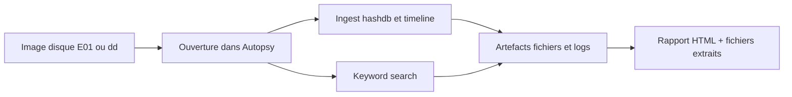

# Autopsy — Forensics, Threat Intel & Honeypots

> [!info] **En 1 phrase**
> Autopsy est l'interface graphique d'analyse forensique de disques basée sur The Sleuth Kit, qui permet d'ouvrir une image disque, d'ingérer des modules d'analyse et de reconstruire timeline, fichiers supprimés et artefacts en quelques clics.

---

## Overview

| Champ | Valeur |
|---|---|
| Nom complet | Autopsy |
| Description | Interface graphique d'analyse forensique de disques basée sur The Sleuth Kit : ingestion modulaire, timeline, carving et rapports |
| Catégorie | Forensics, Threat Intel & Honeypots |
| Sous-catégorie | Digital Forensics / Disk Analysis / Incident Response |
| Fonction principale | Analyser une image disque (E01, dd, VMDK...) : fichiers supprimés, artefacts, timeline, mots-clés, extraction de preuves |
| Type d'outil | Application de bureau + serveur web local (localhost:9999) + CLI TSK |
| Licence | Apache-2.0 (Autopsy) ; IPL-1.0/CPL (The Sleuth Kit) |
| Open source / propriétaire | Open source |
| Langage(s) de programmation | Java (interface), C (TSK), Python (modules d'ingest) |
| Développeur / organisation | Sleuth Kit Labs (Basis Technology) |
| Projet officiel | Autopsy |
| Dépôt officiel | https://github.com/sleuthkit/autopsy |
| Documentation officielle | https://sleuthkit.org/autopsy/docs.php |
| Date de création | 2009 (d'abord sous forme de plugin TSK) |
| État du projet | actif (4.23.1 courante, releases régulières) |
| Dernière version connue | 4.23.1 |
| Systèmes compatibles | Windows, Linux, macOS ; analyse NTFS, FAT, exFAT, ext2/3/4, HFS+, APFS |

> [!note] Pour vérifier / compléter
> Autopsy 4 est une application web locale (localhost:9999) : le port 9999 est réservé à la collaboration multi-postes, pas à une exposition publique. Vérifier les releases sur le site officiel pour la version exacte.

---

## Concept

Autopsy est le front-end graphique de **The Sleuth Kit (TSK)** : il expose sous forme de modules cochables l'ensemble des analyseurs de systèmes de fichiers (NTFS, FAT, EXT4, HFS+, APFS) sans taper la moindre commande. On l'utilise typiquement en **réponse à incident** : acquisition d'une preuve, ingestion automatique, extraction d'éléments et corrélation temporelle. Il se déploie aussi en mode « case server » (port 9999) pour qu'une équipe collabore sur la même affaire depuis des postes différents.

Derrière l'interface, TSK fournit l'analyse brute (`mmls`, `fls`, `icat`, `istat`) ; Autopsy ajoute l'orchestration : gestion des **cases** (dossier + base SQLite), hashing MD5/SHA-256, recherche de mots-clés (avec regex), **timeline** horodatée, carving de fichiers et un système de modules appelés **ingest modules** extensibles. C'est l'outil de référence pour une première analyse de disque par un analyste SOC ou un forensicien, même sans compétences deep filesystem.



---

## Concepts fondamentaux

| Concept | Explication |
|---|---|
| Case | Dossier d'affaire contenant la base `autopsy.db` (SQLite), les logs et les exports |
| Data source | Image disque (E01, dd, VMDK, VHD, AFF) ou disque/logique physique ajoutée à la case |
| Ingest module | Module d'analyse (hash, keyword, timeline, carve, exif...) exécuté sur chaque fichier |
| Timeline | Reconstitution chronologique des événements (création, modification, accès) |
| Carving | Récupération de fichiers dans les zones non allouées sans référence filesystem |
| Hash set | Ensemble de hash connus (NSRL, alertes, propriétaires) pour filtrer/flaguer |
| Keyword search | Recherche de chaînes/mots-clés avec expressions régulières sur fichiers et slack |
| Central Repository | Partage de hash sets et de tags entre plusieurs cases (base PostgreSQL) |
| TSK (The Sleuth Kit) | Bibliothèque et outils CLI sous-jacents (mmls, fls, icat, istat, tsk_recover) |
| Write blocker | Dispositif empêchant toute écriture sur le disque source pendant l'acquisition |
| Bodyfile / mactime | Format de données des timestamps (MACB) utilisé pour la timeline |

---

## Installation

### Debian / Ubuntu

```bash
sudo apt install autopsy
# Vérifier la version de TSK sous-jacent
autopsy --version && fls -V
```

### Docker (lab isolé)

```bash
# Case server accessible sur le port 9999 (exposition interne uniquement)
docker run -d -p 9999:9999 -v /mnt/evidence:/evidence blacktop/autopsy
```

### Windows / macOS

Sur Windows/macOS : installateur signé depuis sleuthkit.org (Java inclus). La version 4 embarque un serveur web local (localhost:9999) ; il ne faut plus lancer l'ancien mode servlet. Sur Kali, `autopsy` est déjà présent avec toute la chaîne TSK.

> [!warning] Prérequis & problèmes potentiels
> - Java 8+ est requis pour Autopsy 4 ; vérifier la version Java avant installation sur les postes à jour.
> - Le port 9999 ne doit pas être exposé publiquement : en mode collaboratif, passer par un VPN.
> - Sur les images de très gros volume, prévoir un espace de travail avec assez de place pour les fichiers extraits.

---

## Configuration

| Paramètre | Rôle | Valeur possible | Impact | Exemple |
|---|---|---|---|---|
| `Host:port` du serveur web | Interface locale | `localhost:9999` | Accès GUI | `-J-Dhttp.port=9999` (lancé par défaut) |
| Dossier de la case | Stockage SQLite + exports | chemin local | Chaîne de custody | `C:\cases\INC-2026-042\` |
| Modules d'ingest cochés | Analyses exécutées | liste de modules | Durée et profondeur de l'analyse | `Recent Activity, Timeline, Hash Lookup` |
| Hash computation | Calcul MD5/SHA-256 par fichier | activé/désactivé | Chaîne de custody | `Compute Hash` à l'ajout de la source |
| Central Repository | Base PostgreSQL partagée | URL/creds | Collaboration multi-cases | `localhost:5432/autopsy` |
| NIST NSRL | Base de hash de référence | path RDS | Écarter le bruit légitime | `hashes/NSRLFile.txt` |
| Time zone de la case | Fusion des timestamps | fuseau | Cohérence timeline | `UTC` recommandé en incident |

> [!note] À vérifier
> Les options de configuration (Central Repository, hash sets, modules) sont réglées via les menus de l'UI et les fichiers de config de l'application ; se référer à la doc officielle pour la version 4.x installée.

---

## Architecture interne

Composants et flux à l'exécution :

- **The Sleuth Kit (TSK)** : bibliothèque C fournissant l'accès bas niveau aux filesystems (NTFS, FAT, ext, HFS+, APFS) et les outils CLI (`mmls`, `fls`, `icat`, `istat`, `tsk_recover`).
- **Serveur web local (Jetty)** : Autopsy 4 tourne comme application web sur `localhost:9999` ; le navigateur affiche la GUI.
- **Base de données de la case** : `autopsy.db` (SQLite) indexe les fichiers, attributs, tags et résultats des modules ; le dossier de la case contient aussi `logs/` et `export/`.
- **Pipeline d'ingest** : chaque module d'ingest s'exécute sur les fichiers en parallèle (multithread) ; les résultats sont écrits en base et notifiés dans l'UI.
- **Modules d'ingest** : Hash Lookup, File Type Identification, Keyword Search, Timeline, Exif, Recent Activity, Interesting Files, Virtual Machine Extractor, Photo/Video Carver, Correlation Engine.
- **Analyseurs de fichiers** : parsers intégrés (registre, Prefetch, LNK, browsers, emails, MS Office, archives) alimentent les modules et la timeline.
- **Central Repository** : PostgreSQL optionnel pour partager hash sets et tags entre les cas de l'équipe.

Flux type : ajout d'une image E01 → TSK lit la table de partitions (`mmls`) → les filesystem analysés sont ingérés → modules (hash, keyword, timeline, carve) → résultats en SQLite → exploration dans l'UI (tree, timeline, exports) → rapport HTML.

---

## Commandes

### Commandes principales

```bash
# Vérifier l'installation et la version de TSK sous-jacent
autopsy --version && fls -V
# Lister les volumes d'une image avant de créer la case
mmls /mnt/evidence/incident.E01
```

| Commande | Objectif | Résultat attendu |
|---|---|---|
| `mmls <image>` | Liste la table de partitions | Volumes + offsets |
| `fls -r <image>` | Liste récursive des fichiers, supprimés inclus | Chemin + inode + `(deleted)` |
| `istat <image> <inode>` | Détaille un inode (timestamps M/A/C/B) | Métadonnées du fichier |
| `icat <image> <inode>` | Sort le contenu brut d'un fichier | Flux binaire |
| `tsk_recover -e <image> <dossier>` | Extrait les fichiers en préservant types/dates | Arborescence extraite |
| `fsstat <image>` | Statistiques du filesystem | Type, taille, clusters |
| `ffind <image> <inode>` | Trouve le chemin d'un inode | Chemin complet |

### Commandes avancées

```bash
# Exporter la timeline au format bodyfile puis la trier avec mactime
fls -r -m /mnt/evidence/incident.E01 > body.txt
mactime -b body.txt -d > timeline.csv

# Recover les fichiers supprimés de tous les volumes
tsk_recover -e /mnt/evidence/incident.E01 /sortie
```

---

## Options et flags

| Option | Description | Exemple | Niveau |
|---|---|---|---|
| `-r` | Liste récursive (fls) | `fls -r img.E01` | Basic |
| `-m <prefixe>` | Préfixe les chemins (fls, pour bodyfile) | `fls -r -m C: img.E01` | Intermediate |
| `-e` | Extraction avec préservation des dates (tsk_recover) | `tsk_recover -e img.E01 out/` | Intermediate |
| `-d` | Format délimité (mactime) | `mactime -b body.txt -d` | Intermediate |
| `-t <type>` | Type de sortie (mactime) | `mactime -b body.txt -t csv` | Advanced |
| `-o <offset>` | Offset du volume (mmls/fls/icat) | `mmls -o 2048 img.E01` | Advanced |
| `-B` | Afficher les blocs (blkls) | `blkls -A img.E01` | Expert |
| `-f <type>` | Type de filesystem forcé | `fls -f fat img.E01` | Advanced |
| `-i <format>` | Format d'image (mmmls etc.) | `fls -i vmdk img.vmdk` | Advanced |
| `-z <zone>` | Fuseau horaire | `mactime -z UTC -b body.txt` | Expert |

> [!tip] Options les plus utiles au quotidien
> `mmls` avant toute ouverture pour repérer les volumes, `fls -r` pour les fichiers supprimés, `istat`/`icat` pour un fichier précis, `tsk_recover -e` pour l'extraction de masse, et `mactime -z UTC` pour une timeline propre.

---

## Exemples pratiques

### Beginner

```bash
# Objectif : identifier la structure de l'image avant analyse
mmls /mnt/evidence/incident.E01
fsstat -o 2048 /mnt/evidence/incident.E01
```

### Intermediate

```bash
# Objectif : lister les fichiers supprimés d'un volume
fls -r -o 2048 /mnt/evidence/incident.E01 | grep deleted
# Récupérer un fichier supprimé par son inode
icat -o 2048 /mnt/evidence/incident.E01 12345 > recovered.zip
file recovered.zip
```

### Advanced

```bash
# Objectif : générer une timeline exploitable en CSV
fls -r -m /mnt/evidence/incident.E01 > body.txt
mactime -b body.txt -d > timeline.csv
head -20 timeline.csv
```

### Expert

```bash
# Objectif : extraire les fichiers préservant métadonnées, puis hasher la sortie
tsk_recover -e /mnt/evidence/incident.E01 /sortie
find /sortie -type f -exec md5sum {} + > hashs.txt
wc -l hashs.txt
```

---

## Workflow complet (scénario pas à pas)

1. Créer une case : `New Case` → nom d'affaire (ex. `INC-2026-042`) → le stockage SQLite est généré automatiquement.
2. `Add Data Source` → `Disk Image` → choisir `incident.E01`, cocher `Compute Hash` (MD5 + SHA-256) pour chaque fichier.
3. `Select Ingest Modules` : activer `Recent Activity`, `Hash Lookup` (hashdb), `Keyword Search`, `Timeline` et `Extractor`.
4. Laisser l'ingest tourner ; suivre l'avancement dans l'onglet `Ingest` (les gros disques peuvent prendre des heures, on peut continuer à naviguer).
5. `Results` → onglet `Timeline` : basculer en vue `Events` pour trier par horodatage et identifier la fenêtre de compromission (créations dans `%TEMP%`, exécutions PowerShell).
6. Clic droit sur un fichier suspect (ex. `svch0st.exe` dans le dossier de session) → `Extract File(s)` vers un répertoire propre d'exfiltration.
7. Recherche ciblée : `Keyword Search` sur `"C:\Users\admin\Desktop\backup.zip"`, puis filtre `File Types` → `Archives` pour retrouver les exfiltrations.
8. Générer le rapport : `Tools` → `Generate Report` → format HTML ou Excel, à joindre au rapport d'incident.

---

## Scénarios avancés

### Scénario 1 : Récupération par carving dans les zones non allouées

Le fichier supprimé n'est plus référencé par le filesystem : le module `Extractor` (carving) le retrouve dans les clusters libres.

```bash
# Approche CLI équivalente
fls -r /mnt/evidence/incident.E01 | grep deleted
# Pour un fichier particulier connu par son inode
icat /mnt/evidence/incident.E01 12345 > recovered.docx
file recovered.docx
```

### Scénario 2 : Reconstruction de la timeline de compromission

Corréler les événements MFT et les chaînes exfiltrées pour dater l'intrusion.

```bash
# Exporter la timeline puis trier par horodatage
tsk_recover -e /mnt/evidence/incident.E01 /sortie
# Dans l'UI : Results → Timeline → vue Events, filtrer sur
# les dossiers %TEMP%, AppData et les exécutions PowerShell de la fenêtre de compromission
```

### Scénario 3 : Chasse aux hash malveillants avec hashdb

```bash
# 1. Extraire l'ensemble des fichiers analysés
tsk_recover -e /mnt/evidence/incident.E01 /sortie
# 2. Calculer leurs empreintes
find /sortie -type f -exec sha256sum {} + > hashs.txt
# 3. Interroger VirusTotal / MISP avec la liste (script, workflow SIEM)
# Les hash tagués « alert » remontent directement dans la vue Hash Lookup de l'UI
```

### Scénario 4 : Recherche d'exfiltration par mot-clé et types de fichiers

```bash
# Dans l'UI : Keyword Search sur expressions régulières
# (?i)(backup|confidential)\d{2,5}
# Puis filtrer File Types → Archives / Images
# Corréler avec la timeline : un .zip créé à 03:12 sur Desktop
# alors que l'utilisateur est absent → artefact d'exfiltration
```

---

## Cybersecurity use cases

| Phase | Utilisation |
|---|---|
| Réponse à incident | Acquisition et analyse d'images disque d'endpoints compromis |
| Digital forensics | Analyse de preuves (filesystem, fichiers supprimés, artefacts utilisateur) |
| ediscovery | Recherche de mots-clés et extraction de documents sur des postes |
| Threat hunting | Hash lookup contre bases malwares, corrélation avec la timeline |
| Analyse de malwares | Récupération de binaires par carve, extraction de fichiers suspects |
| Litige / chaîne de custody | Rapports HTML/Excel horodatés et documentés |

---

## MITRE ATT&CK

| Tactique | Technique / Sub-technique | ID | Raison | Détection | Mitigation |
|---|---|---|---|---|---|
| Collection | Data from Local System | T1005 | Les données collectées par l'attaquant sont retrouvées dans la timeline | Analyse timeline + artefacts | Restreindre les données sensibles |
| Execution | Command and Scripting Interpreter | T1059 | Exécutions PowerShell/scripts visibles (Prefectch, logs, Prefetch) | Timeline + artefacts utilisateur | Logging des commandes, SIEM |
| Defense Evasion | Masquerading | T1036 | Binaires légitimes renommés (`svch0st.exe`) retrouvés | Hash lookup + signature | Contrôle d'intégrité, EDR |
| Discovery | File and Directory Discovery | T1083 | Exploration de fichiers par l'attaquant reconstituée | Timeline des accès | Journalisation d'accès |
| Exfiltration | Exfiltration Over Web Service | T1567 | Archives exfiltrées retrouvées par keyword search | Keyword + types de fichiers | DLP, quotas |
| Persistence | Create or Modify System Process | T1543 | Services/persistances ajoutés visibles dans le registre | Analyse du registre | Durcissement Windows |

> [!note] Ne renseigner que si l'association est réellement pertinente.
> Autopsy est un outil d'**analyse post-incident** : les mappings décrivent ce que ses artefacts permettent de mettre en évidence, pas une capacité offensive.

---

## Defensive Security

### Signes observables

| Indicateur | Détail |
|---|---|
| Images montées en écriture | Toujours ouvrir la copie (E01/dd) avec un write blocker ; ne jamais analyser le disque source |
| Hash calculés après coup | Hasher les fichiers à l'ingest (MD5/SHA-256) pour la chaîne de custody |
| Bruit légitime (milliers de fichiers système) | Charger un hashdb de référence (NSRL) pour écarter les fichiers connus |
| Carving sur disque très volumineux | Limiter les modules (désactiver Photo/Video) : un ingest complet sur 1 To peut dépasser 24 h |

### Règles de détection (Sigma / Suricata / Snort / YARA)

```yaml
# Sigma — artefact Post-Exploitation visible dans une timeline de poste
title: Suspicious PowerShell Execution Artifact (Timeline Analysis)
id: a9b8c7d6-e5f4-4a3b-8c7d-6e5f4a3b2c1d
status: experimental
logsource:
    category: process_creation
    product: windows
detection:
    selection:
        CommandLine|contains:
            - '-enc'
            - 'Invoke-Expression'
            - 'FromBase64String'
    condition: selection
falsepositives:
    - Administrateurs utilisant PowerShell de façon légitime
level: medium
```

```text
# Règle YARA — signature d'un binaire suspect renommé retrouvé par Autopsy
rule Suspicious_Renamed_Binary {
    strings:
        $mz = { 4D 5A }
        $pe = "This program cannot be run in DOS mode"
        $s1 = "svch0st" nocase
    condition:
        $mz at 0 and $pe and $s1
}
```

---

## Automatisation

```bash
# Bash — pipeline d'extraction + hashing pour une liste prête à interroger
tsk_recover -e /mnt/evidence/incident.E01 /sortie
find /sortie -type f -exec sha256sum {} + | sort > hashs.txt
grep -v "/Windows/" hashs.txt | wc -l   # fichiers hors système

# Bash — monitorer l'avancement d'un ingest (SQLite de la case)
sqlite3 "C:\cases\INC-2026-042\autopsy.db" \
  "SELECT count(*) FROM tsk_files WHERE name LIKE '%.exe';"
```

```python
# Python — interroger la base SQLite de la case pour lister les fichiers tagués
import sqlite3

conn = sqlite3.connect(r"C:\cases\INC-2026-042\autopsy.db")
cur = conn.cursor()
for row in cur.execute(
    "SELECT name, dir_path, size FROM tsk_files "
    "WHERE name LIKE '%svchost%' OR name LIKE '%.zip'"):
    print(row)
```

---

## Output et parsing

Les résultats sont stockés dans la base `autopsy.db` (SQLite) et exportés via les rapports (HTML, Excel, CSV, KML, STIX). La timeline peut être produite au format bodyfile pour `mactime`.

```bash
# Exporter la timeline en CSV exploitable
fls -r -m /mnt/evidence/incident.E01 > body.txt
mactime -b body.txt -d > timeline.csv
column -s, -t timeline.csv | head -20
```

```python
# Python — parser la timeline CSV pour les événements de la fenêtre d'intrusion
import csv

with open("timeline.csv") as f:
    for row in csv.DictReader(f):
        # Colonnes mactime : date, size, type, mode, uid, gid, meta, name
        if "TEMP" in row.get("name", "").upper() or "POWERSHELL" in row.get("name", "").upper():
            print(row.get("date"), row.get("name"))
```

---

## Intégrations

```text
Autopsy (exports) → rapports HTML/Excel → dossier d'incident / SIEM
Autopsy (hash sets) → VirusTotal, MISP, NSRL (corrélation d'empreintes)
Autopsy → TSK CLI (mmls/fls/icat/tsk_recover) → pipelines scriptés
Autopsy Central Repository → PostgreSQL → partage entre analystes
```

- [[Tools| Outils]]
- [[Outil - FTK Imager]] — acquisition d'images disque complémentaire
- [[Outil - Volatility]] — analyse mémoire (Autopsy traite le disque, Volatility la RAM)
- [[Outil - Wazuh]] — détection en amont, Autopsy en forensique post-incident
- [[Outil - Velociraptor]] — collecte de preuves à distance, Autopsy analyse locale
- [[Outil - YARA]] — signatures appliquées aux fichiers extraits
- [[Outil - MISP]] — hash sets et indicateurs croisés avec les artefacts retrouvés

---

## Alternatives

| Outil | Avantages | Inconvénients | Cas d'usage |
|---|---|---|---|
| Autopsy | Open source, modulaire, GUI complète | Moins de profondeur sur les filesystems exotiques | Analyse de disque standard |
| EnCase | Standard légal, réputation | Propriétaire, coût élevé | Entreprise / juridique |
| FTK (AccessData) | Indexation puissante | Coût, licence | Lab forensique |
| X-Ways Forensics | Rapide, léger | Windows uniquement, interface datée | Analyste expérimenté |
| Sleuth Kit CLI | Scriptable, léger | Pas de GUI, expertise requise | Pipelines automatisés |
| Volatility | Analyse mémoire dédiée | Disque uniquement (pas de filesystem) | Mémoire, malware |

> **Quand utiliser Autopsy plutôt qu'un autre outil ?** Pour une **analyse de disque open source complète** sans licence et sans expertise deep filesystem : la combinaison **ingest modulaire + timeline + rapports** en fait le choix par défaut du SOC pour la réponse à incident.

---

## Performance

- **Ingest multi-thread** : les modules d'ingest s'exécutent en parallèle sur les fichiers ; sur les gros disques (plusieurs To), la durée se compte en heures — il est possible de naviguer pendant l'ingest.
- **Hash computation coûteux** : calculer MD5 + SHA-256 sur chaque fichier double le temps de lecture ; l'activer par défaut pour la custody mais le désactiver sur les gros volumes si urgent.
- **Carving lourd** : `Photo/Video Carver` et `Extractor` parcourent les zones non allouées : à réserver aux disques où la récupération de preuves est prioritaire.
- **Base SQLite** : l'indexation (autopsy.db) grossit vite ; prévoir un disque rapide (SSD/NVMe) pour la case.
- **Central Repository** : utile en équipe mais ajoute de la latence d'écriture si mal dimensionné (PostgreSQL local).

> [!note] À vérifier
> Les performances exactes dépendent du matériel (disque source, CPU, RAM) et des modules cochés : tester sur une petite image de référence avant de lancer l'ingest complet d'un incident réel.

---

## Troubleshooting

### Common problems

#### Problème : l'UI ne s'ouvre pas sur localhost:9999

- **Cause** : port déjà occupé, Java absent, ou instance déjà lancée.
- **Solution** : vérifier `netstat -ano | findstr 9999`, installer Java 8+, fermer les doublons.
- **Vérification** : ouvrir `http://localhost:9999` dans le navigateur.

#### Problème : l'ingest échoue ou se fige

- **Cause** : base SQLite verrouillée par une autre instance, modules incompatibles.
- **Solution** : fermer les autres instances d'Autopsy sur la même case, relancer le module en échec.
- **Vérification** : consulter les logs de la case (`case\logs\`).

#### Problème : `database is locked` pendant l'ingest

- **Cause** : deux instances d'ingest sur la même case (SQLite mono-écrivain).
- **Solution** : ne lancer qu'une instance par case, ou passer en Central Repository (PostgreSQL).
- **Vérification** : fermer la seconde instance et relancer.

#### Problème : l'image n'est pas reconnue

- **Cause** : format non supporté (partition logique, volume chiffré) ou offset erroné.
- **Solution** : utiliser `mmls` pour vérifier la table, renseigner l'offset manuellement.
- **Vérification** : `mmls image.E01` puis réessayer l'ajout de la source.

#### Problème : la timeline semble incomplète

- **Cause** : fuseau horaire de la case incorrect, modules Timeline non cochés.
- **Solution** : régler la timezone sur UTC, activer `Timeline` dans les modules.
- **Vérification** : re-générer la timeline et comparer avec `mactime -z UTC`.

---

## Sécurité de l'outil

- **Intégrité de la preuve** : toujours analyser une **copie** (image E01/dd) avec un write blocker ; ne jamais laisser Autopsy écrire sur le support source.
- **Chaîne de custody** : hasher les fichiers à l'ingest (MD5/SHA-256), documenter la case (n° d'affaire, analyste, date, outil de capture).
- **Données sensibles** : les preuves contiennent des données personnelles : chiffrer le dossier de la case au repos, restreindre les accès.
- **Exposition** : le serveur web (9999) ne doit pas être accessible hors du périmètre de l'équipe ; en mode collaboratif, passer par un VPN.
- **Modules tiers** : les plugins d'ingest exécutent du code sur les fichiers analysés : ne charger que des modules de sources fiables.
- **Posture défensive** : Autopsy est un outil d'analyse, mais un attaquant peut l'utiliser pour extraire des données d'un poste compromis : limiter son installation aux postes d'analyse.

---

## Limitations

- **Pas d'analyse en direct** : conçu pour l'analyse d'images hors-ligne, pas pour le live forensics.
- **Chiffrement** : les volumes chiffrés (BitLocker, VeraCrypt) nécessitent les clés/le décryptage au préalable.
- **Profondeur TSK** : certains filesystems exotiques (ZFS, Btrfs avancés) ne sont pas couverts aussi bien que NTFS/ext4.
- **Durée d'ingest** : les disques de plusieurs To exigent des heures et beaucoup d'espace disque.
- **Compétences** : la reconstitution d'un scénario complet demande une interprétation humaine de la timeline.
- **Volume de données** : les bases SQLite et les exports peuvent saturer le stockage du poste d'analyse.

---

## Cheatsheet

```bash
# Inspection d'image
mmls /mnt/evidence/incident.E01
fsstat -o 2048 /mnt/evidence/incident.E01

# Liste des fichiers (supprimés inclus)
fls -r -o 2048 /mnt/evidence/incident.E01

# Détail et extraction d'un inode
istat -o 2048 /mnt/evidence/incident.E01 12345
icat -o 2048 /mnt/evidence/incident.E01 12345 > recovered.bin

# Extraction de masse
tsk_recover -e /mnt/evidence/incident.E01 /sortie

# Timeline (bodyfile + mactime)
fls -r -m /mnt/evidence/incident.E01 > body.txt
mactime -b body.txt -z UTC -d > timeline.csv
```

---

## Quick reference

| | |
|---|---|
| **À quoi sert-il ?** | Analyse forensique de disques : fichiers supprimés, timeline, artefacts, extraction de preuves |
| **Quand l'utiliser ?** | Réponse à incident, investigation de poste compromis, ediscovery, lab malware |
| **Commande principale** | `autopsy` (GUI) puis ingestion de l'image ; CLI : `fls -r` / `tsk_recover -e` |
| **Alternative principale** | EnCase, FTK, X-Ways, Sleuth Kit CLI |
| **Concepts importants** | Case, ingest modules, timeline, carving, hash set, write blocker, TSK |
| **Liens associés** | [[Outil - FTK Imager]] · [[Outil - Volatility]] · [[Outil - Velociraptor]] |

---

## Détection & Défense

| Signe | Défense |
|---|---|
| Binaire masqué (svch0st.exe) dans un dossier utilisateur | Hash lookup + signature, corrélation timeline |
| PowerShell lancé hors session utilisateur | Analyse des Prefetch/logs, EDR |
| Archive .zip créée de nuit sur Desktop | Keyword search + types de fichiers, DLP |
| Exécution d'un outil de dump (mimikatz) | Hash sets alertes, YARA sur fichiers extraits |
| Fichiers supprimés après l'intrusion | Carving dans les zones non allouées |

---

## Tips & Pièges

> [!tip] **Tips**
> - `Keyword Search` accepte les expressions régulières : `(?i)(backup|secret)\d{2,5}` pour une recherche insensible à la casse, plus efficace que les mots-clés simples.
> - Utilisez `tsk_recover -e` pour extraire en masse vers un dossier dédié, puis hashuez chaque fichier extrait : cela donne une liste d'empreintes prête à interroger VirusTotal / MISP.
> - Activez `Recent Activity` et `Timeline` systématiquement : ce sont eux qui reconstruisent le scénario d'incident.

> [!warning] **Pièges**
> - Autopsy écrit dans la case (SQLite) : une mauvaise manipulation sur le disque source invalide la preuve.
> - La timeline inclut les accès MFT : une simple ouverture de dossier antérieure au compromis pollue l'analyse si l'on ne filtre pas sur les événements CREATED/MODIFIED.
> - Ne lancez pas deux instances d'ingest sur la même case : les bases SQLite verrouillées provoquent des erreurs `database is locked` et des modules incomplets.

> [!warning] **Piège** : le hash est calculé pendant l'ingest, pas avant.
> Si la source est ajoutée sans `Compute Hash`, l'empreinte n'est pas disponible : la chaîne de custody devient fragile. Activer le calcul avant de lancer l'ingest.

---

## References

### Official

- Site officiel : https://www.sleuthkit.org/autopsy/
- Documentation : https://sleuthkit.org/autopsy/docs.php
- GitHub sleuthkit/autopsy : https://github.com/sleuthkit/autopsy
- Wiki Autopsy : https://github.com/sleuthkit/autopsy/wiki
- The Sleuth Kit (TSK) : https://www.sleuthkit.org/sleuthkit/

### Security references

- MITRE ATT&CK T1005 — Data from Local System : https://attack.mitre.org/techniques/T1005/
- MITRE ATT&CK T1036 — Masquerading : https://attack.mitre.org/techniques/T1036/
- MITRE ATT&CK T1059 — Command and Scripting Interpreter : https://attack.mitre.org/techniques/T1059/

### Community

- NIST NSRL (hash de référence) : https://www.nist.gov/itl/ssd/software-quality-group/national-software-reference-library
- Digital Forensics Communities : https://www.reddit.com/r/computerforensics/
- SANS DFIR blog : https://www.sans.org/blog/

---

**Liens :** [[Tools| Outils]] · [[Techniques/09 - Reverse Engineering & Malware| Reverse Engineering & Malware]] · [[Techniques/10 - Cheatsheets| Cheatsheets]] · [[Techniques/11 - Glossaire| Glossaire]]
