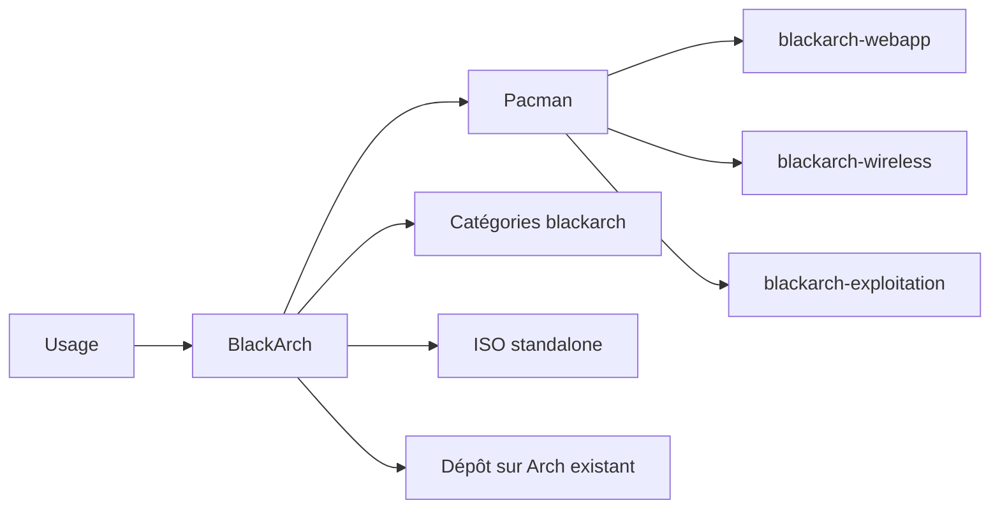

# 🖤 BlackArch — L'arsenal Arch Linux pour pentesters exigeants

> [!info] **En 1 phrase**
> BlackArch est un dépôt et une distribution basée sur Arch Linux fournissant plus de 2900 outils offensifs, pensée pour les pentesters qui veulent un système roulant, minimal et ultra-personnalisable.

---

## 🧾 Overview

| Champ | Valeur |
|---|---|
| Nom complet | BlackArch Linux |
| Description | Dépôt de paquets et distribution Arch Linux orientée pentest : 2865+ outils classés par catégories |
| Catégorie | 🐧 Distributions & Lab |
| Sous-catégorie | Distribution offensive (Arch Linux) |
| Fonction principale | Fournir un arsenal offensif complet sur une base Arch minimale et rolling |
| Type d'outil | Distribution Linux (CLI-first) + dépôt pacman |
| Licence | Distro sous BSD-3-Clause ; outils sous licences GPL/BSD/MIT diverses |
| Open source / propriétaire | Open source |
| Langage(s) | Bash, C, Python, Go, Perl, Ruby, Rust (outils du dépôt) |
| Développeur / organisation | BlackArch Linux (équipe communautaire, menée par le créateur du projet) |
| Projet officiel | BlackArch Linux |
| Dépôt officiel | https://github.com/BlackArch/blackarch |
| Documentation officielle | https://blackarch.org/guide.html |
| Date de création | ~2013 |
| État du projet | actif |
| Dernière version connue | ISO 2026.06.01 ; dépôt rolling en mise à jour continue |
| Systèmes compatibles | x86_64, armv6h, armv7h, aarch64 |

> [!note] Pour vérifier / compléter
> Le nombre exact d'outils évolue chaque semaine : ~2865 outils au moment de la rédaction (voir https://www.blackarch.org/tools.html). Les ISO sont datées (ex : 2026.06.01) : le dépôt reste la meilleure source de fraîcheur.

---

## 🎯 Concept

BlackArch n'est pas une distro « clé en main » comme Kali : c'est d'abord un **référentiel de paquets** que l'on ajoute à une **Arch Linux** existante via le script `strap.sh`, ou une **ISO standalone** pour une installation autonome. La philosophie est celle d'Arch : **rolling release**, système minimal, l'utilisateur installe exactement ce qu'il veut. Le gestionnaire `pacman` est réputé pour sa vitesse et sa simplicité.

Le dépôt est organisé en **plus de 200 catégories** nommées `blackarch-*` (recon, webapp, wireless, exploitation, cracking, reversing, stéganographie…). Plutôt que d'installer tout d'un bloc, on installe une **catégorie** (`pacman -S blackarch-webapp`) ou un **outil individuel**. Les ISO sont proposées en **Full** (système complet avec tous les outils du dépôt, plusieurs gestionnaires de fenêtres), **Slim** (Xfce avec un set d'outils courants) et **Netinstall** (installation minimale réseau).

C'est LE choix pour les pentesters qui maîtrisent Arch : une plateforme légère, à jour en continu, sans les méta-paquets imposés de Kali. L'installation du dépôt est signée GPG (via `strap.sh`), et chaque outil peut être audit'é dans les PKGBUILD. En VM de lab, BlackArch apporte la même valeur que Kali avec un contrôle total sur l'environnement.



---

## 🧠 Concepts fondamentaux

| Concept | Explication |
|---|---|
| Base Arch | Distribution source rolling : gestionnaire `pacman`, PKGBUILD, système minimal, AUR |
| Dépôt blackarch | Référentiel de paquets tiers ajouté à `/etc/pacman.conf` via `strap.sh` |
| `strap.sh` | Script officiel qui configure le dépôt et la clé GPG de signature |
| Catégories | Groupes `blackarch-*` (200+) : recon, webapp, wireless, exploitation, cracking… |
| ISO Full / Slim / Netinstall | Full = tout le dépôt + plusieurs WMs ; Slim = Xfce + outils courants ; Netinstall = minimal |
| Architectures | x86_64, armv6h (Pi 1/Zero), armv7h (Pi 2/3), aarch64 (Pi 4/5) |
| Rolling release | Mises à jour continues ; `pacman -Syu` apporte les derniers outils |
| GPG | `strap.sh` installe la clé `blackarch-keyring` pour valider les paquets |
| `blackarch-installer` | Installateur de la distro (texte/GUI) pour les ISO |
| Conflits | Certains paquets blackarch peuvent entrer en conflit avec les paquets officiels Arch (gestion via `--needed`/`--overwrite`) |

---

## 🛠️ Installation

### Option A : ajouter le dépôt à une Arch existante (recommandé)

```bash
# 1. Récupérer et exécuter strap.sh (installe le dépôt + la clé GPG)
curl -O https://blackarch.org/strap.sh
chmod +x strap.sh
sudo ./strap.sh
# 2. Synchroniser et vérifier
sudo pacman -Syyu
pacman -Sg | grep blackarch
```

### Option B : ISO standalone

```bash
# 1. Télécharger l'ISO : https://www.blackarch.org/downloads.html
#    (Full, Slim ou Netinstall selon le besoin)
# 2. Graver sur USB
sudo dd if=blackarchlinux-2026.06.01-x86_64.iso of=/dev/sdX bs=4M status=progress
sync
# 3. Démarrer : l'installateur blackarch-install (ou installer graphique) prend le relais
```

### Vérification de l'intégrité GPG

```bash
sudo pacman-key --init
sudo pacman-key --populate
sudo pacman-key --update
sudo pacman -Syyu --needed --overwrite='*'
```

> [!warning] ⚠️ Prérequis & problèmes potentiels
> - `strap.sh` exige une connexion Internet et une clé GPG valide : sans signature, pacman refuse les paquets.
> - Les ISO **Full** sont volumineuses (plusieurs dizaines de Go) et officiellement déconseillées pour une mise à jour ensuite : préférer Slim/Netinstall ou le dépôt.
> - L'ISO Slim est minimale : aucun outil supplémentaire par défaut, installation manuelle des catégories.

---

## ⚙️ Configuration

| Paramètre | Rôle | Valeur possible | Impact | Exemple |
|---|---|---|---|---|
| `/etc/pacman.conf` | Liste des dépôts | Ajouter `[blackarch]` APRÈS `[core]`/`[extra]` | Accès aux paquets blackarch | `sudo ./strap.sh` |
| `IgnorePkg` | Bloquer certains paquets | `IgnorePkg = nmap metasploit` | Évite les conflits avec les paquets officiels | éditer `/etc/pacman.conf` |
| `blackarch-keyring` | Clé de signature | Installé par strap.sh | Validation des signatures GPG | `pacman -S blackarch-keyring` |
| `pacman -Sg` | Lister les groupes | `pacman -Sg | grep blackarch` | Découvrir les catégories | `pacman -Sg \| grep blackarch` |
| `blackarch-install` | Installateur distro | Lancer depuis l'ISO | Installation disque complète | `sudo blackarch-install` |

---

## 🏗️ Architecture interne

BlackArch se compose de deux briques :

- **Le dépôt `blackarch`** : des **PKGBUILD** compilés en binaires (x86_64, armv6h, armv7h, aarch64), signés par `blackarch-keyring`, hébergés sur des miroirs. L'outil **`blackarch-toolkit`** (script Bash) automatise la recherche (`blackarch -t nmap`), l'installation de catégories (`blackarch -i webapp`) et la mise à jour de la base de données des outils (`blackarch -u`).
- **L'ISO** : un système Arch pré-configuré avec le dépôt activé, `blackarch-install`, plusieurs gestionnaires de fenêtres (dwm, fluxbox, openbox, awesome, wmii, i3, spectrwm) et, pour la Slim, le bureau **Xfce**.

Au runtime, rien ne diffère d'Arch : `pacman -Syu` met à jour noyau, outils et bibliothèques ensemble. La particularité est la **fraîcheur** : les nouveaux outils sont packagés très rapidement par l'équipe, souvent dans les jours suivant leur publication.

---

## ⌨️ Commandes

### Commandes principales

```bash
sudo pacman -Syu                    # mise à jour rolling
sudo pacman -S blackarch-webapp     # installe la catégorie complète
pacman -Ss <mot>                    # recherche dans le dépôt
pacman -Sg | grep blackarch         # liste les catégories
```

| Commande | Objectif | Résultat attendu |
|---|---|---|
| `sudo ./strap.sh` | Ajouter et signer le dépôt blackarch | Dépôt actif, clé GPG installée |
| `sudo pacman -Syu` | Mise à jour rolling complète | Système et outils à jour |
| `sudo pacman -S blackarch-<cat>` | Installer une catégorie entière | Famille d'outils installée |
| `pacman -Ss <mot>` | Rechercher un outil | Liste de paquets correspondants |
| `pacman -Sg` | Lister les groupes | Groupes `blackarch-*` |
| `pacman -Qi <paquet>` | Détails d'un paquet | Métadonnées, taille, licence |
| `blackarch -i <cat>` | Installer une catégorie via le toolkit | Outils de la catégorie installés |
| `blackarch -t <outil>` | Rechercher un outil via le toolkit | Chemins des binaires |
| `sudo pacman -S nmap metasploit` | Installer des outils individuels | Outils précis installés |
| `sudo blackarch-install` | Installer la distro depuis l'ISO | Système BlackArch sur disque |

### Commandes avancées

```bash
# Installer une catégorie sans toucher aux paquets officiels
sudo pacman -S --needed blackarch-recon blackarch-webapp
# Compter les paquets blackarch installés
pacman -Q | grep -c blackarch
# Forcer l'installation en cas de conflit (avec prudence)
sudo pacman -Syu --needed --overwrite='*'
```

---

## 🎚️ Options et flags

| Option | Description | Exemple | Niveau |
|---|---|---|---|
| `pacman -S <paquet>` | Installe un paquet | `sudo pacman -S nmap` | Basic |
| `pacman -Sy` | Synchronise la base | `sudo pacman -Sy` | Basic |
| `pacman -Syu` | Synchronise + met à jour | `sudo pacman -Syu` | Basic |
| `pacman -Ss <mot>` | Recherche | `pacman -Ss sqlmap` | Basic |
| `pacman -Sg` | Liste les groupes | `pacman -Sg` | Basic |
| `pacman -S <groupe>` | Installe un groupe | `sudo pacman -S blackarch-webapp` | Intermediate |
| `pacman -Qi` | Info paquet | `pacman -Qi recon-ng` | Intermediate |
| `pacman -Ql` | Liste les fichiers d'un paquet | `pacman -Ql nmap` | Intermediate |
| `--needed` | N'installe que ce qui manque | `sudo pacman -S --needed blackarch-webapp` | Advanced |
| `--overwrite='*'` | Force l'écrasement (risqué) | `sudo pacman -Syu --overwrite='*'` | Expert |
| `blackarch -u` | Met à jour la base d'outils | `sudo blackarch -u` | Advanced |

> [!tip] Options les plus utiles au quotidien
> `pacman -Syu` (maintenance), `pacman -Ss` (trouver un outil), `pacman -S blackarch-<cat>` (installer une famille), `--needed` (limiter les conflits), `pacman -Sg | grep blackarch` (découvrir les catégories).

---

## 🧪 Exemples pratiques

### Beginner

```bash
# Ajouter le dépôt puis installer un outil
curl -O https://blackarch.org/strap.sh
chmod +x strap.sh
sudo ./strap.sh
sudo pacman -Syu
sudo pacman -S nmap
```

### Intermediate

```bash
# Installer les catégories essentielles
sudo pacman -S --needed blackarch-recon blackarch-webapp
# Vérifier les outils
which nmap msfconsole
```

### Advanced

```bash
# Rechercher et installer un outil précis avec le toolkit
sudo blackarch -u
sudo blackarch -t hydra
sudo pacman -S hydra
```

### Expert

```bash
# VM Arm : installer les paquets blackarch pour aarch64
sudo pacman -Syu
sudo pacman -S blackarch-wireless --needed
# Créer une ISO personnalisée
git clone https://github.com/BlackArch/blackarch-iso
cd blackarch-iso
# Modifier le profil puis construire avec make (voir la doc du dépôt)
```

---

## 🧪 Workflow complet (scénario pas à pas)

1. **Ajouter le dépôt** sur une Arch propre.
   ```bash
   curl -O https://blackarch.org/strap.sh
   chmod +x strap.sh
   sudo ./strap.sh
   sudo pacman -Syyu
   ```
2. **Installer les catégories utiles** : ne prendre que ce dont on a besoin.
   ```bash
   sudo pacman -S --needed blackarch-recon blackarch-webapp blackarch-wireless
   ```
3. **Vérifier les outils installés**.
   ```bash
   which nmap msfconsole aircrack-ng
   pacman -Q | grep blackarch | wc -l
   ```
4. **Reconnaissance réseau**.
   ```bash
   sudo nmap -sS -sV -O 10.10.20.0/24
   sudo nmap -sC -p 22,80,443 10.10.20.15
   ```
5. **Exploitation web** : détecter et exploiter une vulnérabilité.
   ```bash
   sqlmap -u "http://10.10.20.15/page?id=1" --dbs --batch
   gobuster dir -u http://10.10.20.15 -w /usr/share/wordlists/dirb/common.txt
   ```

---

## 🎬 Scénarios avancés

### Scénario 1 : Utiliser BlackArch comme dépôt complémentaire sans casser Arch

```bash
# Dans /etc/pacman.conf : ne jamais placer [blackarch] au-dessus de [core]/[extra]
# Utiliser IgnorePkg pour garder les versions de base stables
# Installer uniquement des outils absents d'Arch officiel
sudo pacman -S --needed blackarch-wifite blackarch-ettercap
```

### Scénario 2 : Chaîne d'exploitation Wi-Fi sous Arch minimal

```bash
sudo pacman -S --needed blackarch-wireless
sudo airmon-ng check kill
sudo airmon-ng start wlan0
sudo airodump-ng wlan0mon
sudo aircrack-ng -w /usr/share/wordlists/rockyou.txt capture.cap
```

### Scénario 3 : Construction d'une image ARM (Raspberry Pi) de pentest

```bash
# Télécharger l'ISO aarch64 ou utiliser l'image ARM officielle
# Installer les catégories voulues dans le système ARM
sudo pacman -S --needed blackarch-mobile blackarch-fuzzing
# Synchroniser puis vérifier l'état du système
sudo pacman -Syu
```

---

## 🛡️ Cybersecurity use cases

| Phase | Utilisation |
|---|---|
| Reconnaissance | blackarch-recon : nmap, masscan, recon-ng, theHarvester |
| Énumération | blackarch-enumeration : gobuster, enum4linux, dnsrecon |
| Web | blackarch-webapp : sqlmap, nikto, wpscan, Burp Suite |
| Exploitation | blackarch-exploitation : Metasploit, SearchSploit, exploitdb |
| Post-exploitation | blackarch-pivoting, blackarch-backdoor : Impacket, Empire |
| Cracking | blackarch-cracker : hashcat, John the Ripper, hydra |
| Wi-Fi | blackarch-wireless : aircrack-ng, wifite, Kismet, mdk4 |
| Reverse | blackarch-reversing : Ghidra, radare2, gdb |
| Crypto / stégano | blackarch-crypto, blackarch-stego : zsteg, stegsolve |
| Fuzzing | blackarch-fuzzing : ffuf, wfuzz, AFL++ |

---

## 🎯 MITRE ATT&CK

| Tactique | Technique / Sub-technique | ID | Raison | Détection | Mitigation |
|---|---|---|---|---|---|
| Discovery | Network Service Discovery | T1046 | Outils blackarch-recon préinstallés à la demande | SYN rates anormaux, IDS | Segmentation, rate-limiting |
| Execution | Command and Scripting Interpreter : Unix Shell | T1059.004 | Bash utilisé par la majorité des payloads et scripts | Supervision des lignes de commande | auditd, EDR Linux |
| Credential Access | Brute Force | T1110 | blackarch-cracker regroupe hydra/hashcat/john | Logs d'échecs répétés | fail2ban, MFA |
| Initial Access | Exploit Public-Facing Application | T1190 | blackarch-webapp/exploitation ciblent les applications exposées | WAF, monitoring des exploitations connues | Patching, WAF |
| Defense Evasion | Obfuscated Files or Information | T1027 | Outils de packing/obfuscation dans le dépôt | Détection de fichiers suspects, YARA | Analyse statique, sandbox |

> [!note] Ne renseigner que si l'association est réellement pertinente.
> BlackArch fournit les outils ; les techniques MITRE dépendent de l'usage réel. Le tableau ci-dessus décrit les techniques les plus courantes *activées* par les catégories du dépôt.

---

## 🛡️ Defensive Security

### Signes observables

| Indicateur | Détail |
|---|---|
| Mises à jour pacman fréquentes | Une machine blackarch se distingue par son rolling rapide |
| Scans réseau systématiques | Patterns Nmap/masscan reconnaissables (window sizes, timing) |
| Trafic vers nœuds Tor | Si l'utilisateur couple blackarch avec Tor |
| Exécution d'outils de cracking | Processus hashcat/john, usage CPU massif |
| Session C2 sortante | Connexions vers ports élevés (Metasploit/Empire) |

### Règles de détection (Sigma / Suricata / Snort / YARA)

```yaml
# Sigma — Linux : utilisation de Metasploit/Hashcat/John sur un poste
title: BlackArch Offensive Tools Execution
id: c9d8e7f6-5a4b-4c3d-8e2f-1a2b3c4d5e6f
status: test
logsource:
    category: process_creation
    product: linux
detection:
    selection:
        Image|endswith:
            - '/msfconsole'
            - '/hashcat'
            - '/john'
            - '/sqlmap'
    condition: selection
falsepositives:
    - Authorized penetration testing
level: medium
```

```bash
# Suricata — scan SYN rapide
alert tcp any any -> any any (msg:"ET SCAN NMAP"; flags:S; threshold: type limit, track by_src, seconds 30, count 8; sid:2002001; rev:1;)
```

---

## 🤖 Automatisation

```bash
# Bash — installer plusieurs catégories en une passe
CATS="blackarch-recon blackarch-webapp blackarch-wireless blackarch-cracker"
for c in $CATS; do
    sudo pacman -S --needed --noconfirm "$c"
done
```

```python
# Python — interroger la liste des outils du dépôt
import urllib.request
data = urllib.request.urlopen("https://blackarch.org/blackarch-db.json").read().decode()
import json
tools = json.loads(data)
print(len(tools), "outils dans la base")
```

```bash
# One-liner : lister les catégories installées localement
pacman -Sg | grep '^blackarch' | sort
```

---

## 📤 Output et parsing

BlackArch ne modifie pas les sorties des outils (standards) ; il fournit surtout des **listes de paquets** manipulables.

```bash
# Compter les outils du dépôt
curl -s https://blackarch.org/tools.html | grep -c 'href=.*\.html'
# Lister les paquets blackarch installés (pour un rapport)
pacman -Q | grep blackarch
# Exporter la liste des groupes
pacman -Sg | grep '^blackarch' > categories.txt
```

```python
# Python — parsing de la base d'outils JSON
import json, urllib.request
tools = json.loads(urllib.request.urlopen("https://blackarch.org/blackarch-db.json").read().decode())
for t in tools:
    if "sqlmap" in t.get("name", "").lower():
        print(t["name"], t.get("categories"))
```

> [!note] À vérifier
> L'URL exacte de la base JSON du dépôt peut évoluer : vérifier https://blackarch.org/tools.html pour la source actuelle.

---

## 🔗 Intégrations

- [[Tools|🧰 Outils]] global
- [[Outil - Kali Linux]] — équivalent Debian (comparaison de référence)
- [[Outil - Parrot OS]] — alternative Debian + vie privée
- [[Outil - Metasploit]] — exploitation (`pacman -S metasploit`)
- [[Outil - Nmap]] — scan (`pacman -S nmap`)
- [[Outil - aircrack-ng]] / [[Outil - Wifite]] — Wi-Fi (blackarch-wireless)
- [[Outil - hashcat]] / [[Outil - John the Ripper]] — cracking
- [[Outil - Ghidra]] / [[Outil - radare2]] — reverse engineering
- [[Outil - sqlmap]] / [[Outil - gobuster]] — web
- [[Outil - Recon-ng]] / [[Outil - theHarvester]] — reconnaissance

```text
pacman -S blackarch-recon → nmap/recon-ng → sqlmap → post-exploitation
```

---

## 🔄 Alternatives

| Outil | Avantages | Inconvénients | Cas d'usage |
|---|---|---|---|
| [[Outil - Kali Linux]] | 600+ outils, méta-paquets clairs, support OffSec | Base Debian, moins personnalisable | Examens OSCP, engagements standards |
| [[Outil - Parrot OS]] | Pentest + vie privée, bureau MATE léger | Écosystème plus petit | OSINT + quotidien |
| [[Outil - Commando VM]] | Outils Windows natifs | Windows requis | Pentest AD/Windows |
| Arch Linux + AUR seul | Base propre, pas de dépôt tiers | Recherche d'outils fastidieuse | Puristes Arch |
| Kali NetHunter | Mobile (Android) | Support matériel limité | Pentest mobile |

> **Quand utiliser BlackArch plutôt que Kali ?** Si tu maîtrises Arch et veux un système **minimal, rolling et totalement maîtrisé** : le dépôt donne accès à plus de 2860 outils sans méta-paquets imposés. Pour un lab « clé en main » et documenté, Kali reste plus accessible.

---

## ⚡ Performance

- **Dépôt** : aucune surcharge (un simple ajout à `pacman.conf`) ; l'indexation `pacman -Sy` est rapide.
- **Système** : aussi léger qu'une Arch de base — quelques centaines de Mo en CLI, ~1-2 Go avec un bureau minimal.
- **ISO Slim** : ~5 Go ; **Full** : plusieurs dizaines de Go (déconseillée pour l'usage quotidien).
- **Compilation** : certains paquets non précompilés peuvent être construits depuis les PKGBUILD (long sur du petit matériel).
- **Arm** : les images ARM (Raspberry Pi) fonctionnent bien mais certaines catégories lourdes sont plus lentes.

> [!note] À vérifier
> Les tailles d'ISO changent à chaque build ; se référer à https://www.blackarch.org/downloads.html.

---

## 🛠️ Troubleshooting

### Common problems

#### Problème : « error: key could not be looked up remotely »

- **Cause** : clé `blackarch-keyring` manquante ou non importée.
- **Solution** : relancer `sudo ./strap.sh` ou `sudo pacman -S blackarch-keyring`.
- **Vérification** : `sudo pacman -Syyu` se déroule sans erreur GPG.

#### Problème : « failed to commit transaction (conflicting files) »

- **Cause** : un paquet blackarch entre en conflit avec un paquet officiel Arch.
- **Solution** : `sudo pacman -Syu --needed --overwrite='*'` (vérifier le message) ou utiliser `IgnorePkg`.
- **Vérification** : `pacman -Q <paquet>` montre la version attendue.

#### Problème : un outil de la catégorie n'est pas installé

- **Cause** : catégorie partiellement installée ou groupe absent.
- **Solution** : `sudo pacman -S blackarch-<cat>` puis vérifier avec `which <outil>`.
- **Vérification** : `pacman -Sg blackarch-<cat>` liste bien l'outil.

#### Problème : l'ISO ne démarre pas sur du vieux matériel

- **Cause** : noyau Arch trop récent pour le matériel.
- **Solution** : utiliser l'image Netinstall ou installer Arch officiel puis le dépôt blackarch.
- **Vérification** : le boot atteint GRUB puis le menu blackarch.

---

## 🔐 Sécurité de l'outil

- **Signatures GPG** : tous les paquets blackarch sont signés par `blackarch-keyring` ; ne jamais forcer sans comprendre.
- **PKGBUILD** : chaque paquet est auditable dans les dépôts GitHub (principe d'Arch).
- **Conflits** : `--overwrite='*'` peut écraser des fichiers système ; l'utiliser avec prudence (idéalement dans une VM).
- **Pas de télémétrie** : le dépôt n'ajoute aucun service ; seuls les outils installés génèrent du trafic.
- **Usage légal** : un arsenal de 2860 outils reste un arsenal : réservé aux engagements autorisés et labs.

---

## ⚠️ Limitations

- **Pas de support officiel** : communauté et wiki seulement, pas de contrat de support.
- **Pas de GUI clé en main** : la distro est minimaliste ; installer un bureau à la main est requis (niveau utilisateur).
- **Conflits possibles** avec les paquets officiels Arch (la gestion `IgnorePkg` est nécessaire).
- **ISO Full déconseillée** par le projet lui-même (problèmes de mise à jour et conflits).
- **Documentation** en anglais principalement, moins exhaustive que celle de Kali.

---

## 📋 Cheatsheet

```bash
# Ajouter le dépôt
curl -O https://blackarch.org/strap.sh
chmod +x strap.sh
sudo ./strap.sh

# Mise à jour
sudo pacman -Syyu

# Catégories
pacman -Sg | grep blackarch
sudo pacman -S --needed blackarch-recon blackarch-webapp blackarch-wireless

# Outils individuels
sudo pacman -S nmap metasploit sqlmap hydra hashcat

# Recherche
pacman -Ss <mot>

# Vérifications
pacman -Q | grep blackarch | wc -l
which nmap msfconsole
```

---

## ⚡ Quick reference

| | |
|---|---|
| **À quoi sert-il ?** | Dépôt (2865+ outils) et distribution Arch pour le pentest, rolling et minimaliste |
| **Quand l'utiliser ?** | Pentesters maîtrisant Arch, labs légers, contrôle total des paquets |
| **Commande principale** | `curl -O https://blackarch.org/strap.sh && sudo sh strap.sh && sudo pacman -Syu` |
| **Alternative principale** | [[Outil - Kali Linux]] · [[Outil - Parrot OS]] |
| **Concepts importants** | `pacman`, `blackarch-*` (catégories), `strap.sh`, `blackarch-keyring`, rolling |
| **Liens associés** | [[Outil - Metasploit]] · [[Outil - Nmap]] · [[Outil - hashcat]] · [[Outil - Ghidra]] |

---

## 🔍 Détection & Défense

| Signe | Défense |
|---|---|
| Scans réseau systématiques depuis une IP | IDS/IPS (Suricata), logs centralisés, corrélation SIEM |
| Trafic vers nœuds Tor | Filtrage egress, listes des nœuds de sortie, journalisation |
| Exécution d'outils d'exploitation | WAF, patchs à jour, supervision des connexions DB |
| Session meterpreter/C2 vers ports élevés | EDR, egress filtering, détection de command & control |
| Cracking intensif (CPU/GPU) | Supervision des ressources, alertes sur processus hashcat/john |

---

## ⚠️ Tips & Pièges

> [!tip] 💡 **Tips**
> - Installe par **catégorie** plutôt que tout d'un coup : `blackarch-webapp` est léger alors que la Full fait des dizaines de Go.
> - Utilise `pacman -Q <outil>` pour savoir si un paquet vient de blackarch et `pacman -Si <paquet>` pour ses métadonnées.
> - En VM de lab, fais des **snapshots** avant les mises à jour : le rolling Arch peut casser un paquet.
> - Utilise le **toolkit** (`blackarch -i`, `blackarch -u`) pour gérer la base d'outils plus confortablement.

> [!warning] ⚠️ **Pièges**
> - Ne **jamais** activer blackarch comme dépôt par défaut de toute la machine : conflits avec les paquets officiels ; utiliser `IgnorePkg` ou une VM dédiée.
> - L'ISO **Full** est déconseillée par le projet lui-même : préférer Slim/Netinstall ou le dépôt sur une Arch propre.
> - `strap.sh` exige une connexion Internet ; sans signature valide, pacman refuse les paquets — ne force pas aveuglément avec `--overwrite`.
> - Les outils sont **détectables** : un usage hors lab est juridiquement sensible.

---

## 📚 References

### Official

- Site officiel : https://www.blackarch.org
- Liste des outils : https://www.blackarch.org/tools.html
- Téléchargements : https://www.blackarch.org/downloads.html
- Guide officiel : https://blackarch.org/guide.html
- GitHub : https://github.com/BlackArch/blackarch
- Dépôt des ISO : https://github.com/BlackArch/blackarch-iso

### Security references

- MITRE ATT&CK T1046 — Network Service Discovery : https://attack.mitre.org/techniques/T1046/
- MITRE ATT&CK T1190 — Exploit Public-Facing Application : https://attack.mitre.org/techniques/T1190/
- Arch Wiki — pacman : https://wiki.archlinux.org/title/Pacman

### Community

- Matrix officiel : https://matrix.to/#/#blackarch:matrix.org
- IRC : #blackarch sur Libera.Chat
- Issues et demandes d'outils : https://github.com/BlackArch/blackarch/issues

---

> [!info] 📚 **Sources**
> - https://www.blackarch.org/
> - https://blackarch.org/strap.sh

➡️ **Liens :** [[Tools|🧰 Outils]] · [[Outil - Kali Linux|🐉 Kali Linux]] · [[Outil - Metasploit|🛠️ Metasploit]] · [[Outil - Parrot OS|🦜 Parrot OS]] · [[Outil - Nmap|📡 Nmap]] · [[Outil - Ghidra|🔧 Ghidra]] · [[Outil - hashcat|🐱 hashcat]]
