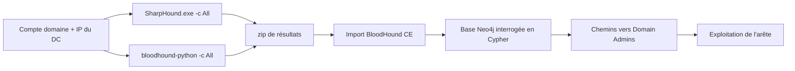

# 👑 BloodHound — Active Directory & Windows

> [!info] **En 1 phrase**
> BloodHound est un outil de **cartographie graphique d'Active Directory** : il collecte les relations entre utilisateurs, groupes, machines et GPO, puis **calcule les chemins d'attaque** vers le contrôle de domaine.

---

## 🧾 Overview

| Champ | Valeur |
|---|---|
| Nom complet | BloodHound Community Edition (CE) |
| Description | Analyse graphique d'Active Directory et d'Azure AD : collecte des relations (membres de groupes, sessions, admins locaux, GPO, ACL) et calcul des chemins d'attaque vers le contrôle du domaine |
| Catégorie | 👑 Active Directory & Windows |
| Sous-catégorie | Post-exploitation / Énumération AD |
| Type d'outil | Framework (serveur web + API REST + base de graphe) + collecteurs (SharpHound, bloodhound-python, AzureHound) |
| Licence | Apache-2.0 (BloodHound CE) ; SharpHound : Apache-2.0 ; bloodhound-python : MIT |
| Open source / propriétaire | Open source (Community Edition) ; une déclinaison commerciale existe : BloodHound Enterprise (BHE) |
| Langage(s) de programmation | Go (backend API), React/TypeScript (frontend), C# (SharpHound), Python (bloodhound-python) |
| Développeur / organisation | SpecterOps (Andy Robbins, Rohan Vazarkar, Will Schroeder pour BloodHound legacy ; CE basé sur le code de BloodHound Enterprise) |
| Projet officiel | SpecterOps BloodHound |
| Dépôt officiel | https://github.com/SpecterOps/BloodHound |
| Documentation officielle | https://bloodhound.specterops.io/docs/ |
| Date de création | 2016 (BloodHound legacy) ; refonte CE annoncée en août 2023 |
| État du projet | actif |
| Dernière version connue | BloodHound CE v9.5.1 (2026-07-29) ; SharpHound v2.13.0 (2026-05-28) |
| Systèmes compatibles | Serveur CE : Linux (Docker), macOS ; Collecteurs : Windows (SharpHound), Linux (bloodhound-python), Azure (AzureHound) |

> [!note] Pour vérifier / compléter
> - SharpHound se télécharge **sur la cible** (poste joint au domaine) ; il n'y a pas de version Linux de SharpHound : côté Linux on utilise `bloodhound-python`.
> - `pip install bloodhound` installe le collecteur **legacy** (compatible BloodHound 4.x) ; pour BloodHound CE il faut `pip install bloodhound-ce` (CLI `bloodhound-ce-python`).

---

## 🎯 Concept

BloodHound se compose d'un **collecteur** (SharpHound sur Windows, `bloodhound-python` sur Linux, AzureHound pour Azure) et d'un **serveur web** (BloodHound CE) qui stocke les résultats dans une base de graphe **Neo4j** interrogée en **Cypher**. Le collecteur interroge l'annuaire (LDAP), SMB, le registre et WinRM pour extraire : groupes et appartenances (y compris imbrications), sessions actives, administrateurs locaux, GPO, contraintes de délégation, SPN, ACL. On marque ensuite les comptes déjà compromis (`owned`) et on affiche le **plus court chemin** vers `Domain Admins` via des recherches prédéfinies (« Shortest Path from Owned Principals », « Kerberoastable Users »…) ou des requêtes Cypher libres.

C'est le compagnon indispensable de Kerberoasting, de l'analyse des délégations et des ACL : il transforme des centaines de pages d'énumération en un graphe lisible où chaque arête représente une permission exploitable (`MemberOf`, `AdminTo`, `GenericAll`, `GenericWrite`, `ForceChangePassword`, `AddMember`, `GPLink`, `AllowedToDelegate`, `AllowedToAct`…). BloodHound CE repose sur le framework **OpenGraph** de SpecterOps, qui étend l'analyse au-delà d'Active Directory (Azure, autres plateformes d'identité).



---

## 🧠 Concepts fondamentaux

| Concept | Explication |
|---|---|
| Nœuds et arêtes | Le graphe contient des nœuds (`User`, `Group`, `Computer`, `GPO`, `OU`, `Domain`) reliés par des arêtes typées qui modélisent une permission réelle |
| `MemberOf` | Appartenance à un groupe, y compris **imbriquée** (`*1..` en Cypher) : souvent la cause de chemins invisibles avec les outils classiques |
| `AdminTo` | Le nœud source a des droits d'administrateur local sur la machine cible (lecture du registre/SAM, exécution à distance possible) |
| `HasSession` | Un utilisateur a une **session active** sur la machine : si on compromet la machine, on peut voler son TGT/token |
| ACL | Arêtes issues des ACL AD (`GenericAll`, `GenericWrite`, `WriteOwner`, `WriteDACL`, `ForceChangePassword`, `AddMember`) : bases de la prise de contrôle de comptes |
| `Owned` | Marqueur posé par l'analyste pour dire « j'ai compromis ce nœud » : les chemins se recalculent depuis ce nœud |
| GPO (`GPLink`) | Un GPO appliqué à une OU donne le contrôle des objets de cette OU (tâches planifiées, droits, logiciels…) |
| `Kerberoastable` / `AS-REP Roastable` | Attributs `hasspn` / `dontreqpreauth` exposés par le collecteur pour cibler les roasts |
| Délégations | Arêtes `AllowedToDelegate`, `AllowedToAct` (RBCD), Unconstrained (voir fiches Techniques) |
| Cypher | Langage de requête de Neo4j : `MATCH`, `WHERE`, `RETURN`, `shortestPath` |
| OpenGraph | Framework de SpecterOps : schémas de graphe et analyse multi-plateformes (AD, Azure, Okta…) utilisés par CE |

---

## 🛠️ Installation

### Debian / Ubuntu / Kali Linux

```bash
# Serveur BloodHound CE (recommandé : Docker Compose)
git clone https://github.com/SpecterOps/bloodhound.git
cd bloodhound/examples/docker-compose
docker compose up -d
# Accès : http://localhost:8080 — au premier lancement, créer le compte admin

# Collecteur Python (depuis un poste Linux avec creds domaine)
pip install bloodhound-ce    # BloodHound CE (CLI : bloodhound-ce-python)
pip install bloodhound       # BloodHound legacy (CLI : bloodhound-python)

# SharpHound (collecteur Windows) : releases du repo
# https://github.com/SpecterOps/SharpHound/releases
```

### Arch Linux

```bash
# Serveur CE : pas de paquet officiel, utiliser Docker
sudo pacman -S docker docker-compose
git clone https://github.com/SpecterOps/bloodhound.git && cd bloodhound/examples/docker-compose
docker compose up -d
# Collecteur : pipx install bloodhound-ce (nécessite python-pipx)
```

### Fedora / RHEL

```bash
sudo dnf install docker docker-compose
# Serveur CE via Docker Compose (même procédure que ci-dessus)
# Collecteur : sudo dnf install python3-pip && pip3 install bloodhound-ce
```

### macOS

```bash
# Serveur CE via Docker Desktop
brew install --cask docker
git clone https://github.com/SpecterOps/bloodhound.git && cd bloodhound/examples/docker-compose
docker compose up -d
```

### Windows

```powershell
# SharpHound s'exécute sur la cible Windows (post-exploitation)
# Télécharger SharpHound.exe depuis https://github.com/SpecterOps/SharpHound/releases
.\SharpHound.exe -c All --zipfilename data.zip
# (Le serveur CE s'installe en Docker ou via les binaires officiels)
```

### Docker

```bash
cd bloodhound/examples/docker-compose
docker compose up -d
docker compose ps
```

### Compilation depuis les sources

```bash
git clone https://github.com/SpecterOps/bloodhound.git && cd bloodhound
# Backend Go + frontend React (Go >= 1.22, Node >= 18)
# Voir le Wiki : https://github.com/SpecterOps/BloodHound/wiki/Development
```

> [!warning] ⚠️ Prérequis & problèmes potentiels
> - BloodHound CE a besoin de **Docker** et de deux services backend : **Neo4j** (graphe) et **PostgreSQL** (métadonnées). Le `docker compose` du repo gère tout.
> - Le collecteur Python legacy (`bloodhound-python`) dépend d'**Impacket** ; en cas de conflit avec une version système, utiliser un venv ou pipx.
> - SharpHound a besoin d'un **compte du domaine** et, pour la collecte complète (sessions, admins locaux), de droits **d'administrateur local** sur les cibles.
> - Ports : UI CE 8080 (http) / 8443 (https optionnel) ; Neo4j interne sur 7474/7687 (conteneur uniquement).

## ⚙️ Configuration

BloodHound CE n'utilise pas de fichier de configuration unique : la configuration se fait via la **CLI du serveur** (`bloodhound-ce`), le **fichier d'environnement** du docker-compose et l'**UI**. Le collecteur se configure par **flags en ligne de commande** (SharpHound) ou par arguments (bloodhound-python).

| Paramètre | Rôle | Valeur possible | Impact | Exemple |
|---|---|---|---|---|
| `-c <collection>` | Méthodes de collecte | `All`, `Default`, `Group`, `LocalAdmin`, `Session`, `Trusts`, `ACL`, `DCOM`, `RDP`, `PSRemote`, `Container`, `GPOLocalGroup`, `LoggedOn` | Contrôle la portée et le bruit réseau | `.\SharpHound.exe -c All` |
| `--ldapusername` / `--ldappassword` | Creds pour la collecte LDAP | `DOMAIN\user` + mot de passe | Évite d'utiliser les creds de la session courante | `.\SharpHound.exe --ldapusername CORP\alice --ldappassword 'P@ss'` |
| `--domain <fqdn>` | Domaine cible | `corp.local` | Restreint la collecte au domaine | `.\SharpHound.exe -c Group --domain corp.local` |
| `--zipfilename <f>` | Nom du zip de sortie | `data.zip` | Nom du fichier à importer | `.\SharpHound.exe -c All --zipfilename data.zip` |
| `--excludecomputers` / `--excludedomaincontrollers` | Exclusion de cibles | Liste de noms | Réduit le bruit et le temps | `.\SharpHound.exe -c Session --excludecomputers 'dc02.corp.local'` |
| `-d <domaine>` / `-u` / `-p` | Creds bloodhound-python | `corp.local` + `alice` + mot de passe | Collecte depuis Linux | `bloodhound-python -d corp.local -u alice -p 'P@ss' -ns 10.10.10.5 -c All` |
| `-ns <IP>` | Serveur DNS (bloodhound-python) | IP du DNS du domaine | Résout les noms lors de la collecte | `bloodhound-python ... -ns 10.10.10.5` |
| `--use-ldaps` | Collecte via LDAPS (port 636) | on/off | Évite de déclencher certaines alertes LDAP en clair | `bloodhound-python ... --use-ldaps` |
| Variables du docker-compose | Identifiants BHE/CE | `BLOODHOUND_*` | Configure le compte admin initial du serveur | voir `examples/docker-compose/.env` |

---

## 🏗️ Architecture interne

- **Collecteurs** : SharpHound (C#, .NET, exécuté sur un poste du domaine) utilise LDAP pour les objets/ACL, SMB pour les admins locaux, NetLogon pour les sessions, et produit un **zip** (JSON + binaires). `bloodhound-python` (Python/Impacket) fait de même depuis Linux via LDAP/SMB/Kerberos. AzureHound (Go) collecte Azure AD.
- **Serveur BloodHound CE** : monolithe web — backend **Go** exposant une API REST, frontend **React** (rendu de graphe **Sigma.js**), base applicative **PostgreSQL** (métadonnées, tâches, données d'ingestion) et base de graphe **Neo4j** (nœuds/arêtes).
- **Import des données** : le zip est uploadé dans l'UI ; l'API parse les fichiers JSON et crée/merge les nœuds et arêtes dans Neo4j (opération asynchrone pour les gros jeux de données).
- **Analyse** : les recherches prédéfinies et les requêtes Cypher libres s'exécutent sur Neo4j ; la résolution des chemins utilise le calcul de plus court chemin du moteur de graphe.
- **OpenGraph** : bibliothèque Go de SpecterOps qui définit les schémas de graphe, les arêtes et les règles de calcul (utilisée par CE et BHE).
- **Flux de données** : DC/annuaire → collecteur → zip → API CE → Neo4j + PostgreSQL → UI React → requêtes Cypher.

---

## ⌨️ Commandes

### Commandes principales

```bash
# Collecte complète (Windows, sur la cible)
.\SharpHound.exe -c All --zipfilename data.zip

# Collecte ciblée avec credentials explicites
.\SharpHound.exe -c Group,LocalAdmin,Session --ldapusername CORP\user --ldappassword 'Pass'

# Collecteur Python depuis Linux
bloodhound-python -d CORP.LOCAL -u user -p 'Pass' -ns 10.10.10.5 -c All
bloodhound-ce-python -d CORP.LOCAL -u user -p 'Pass' -ns 10.10.10.5 -c All   # variante CE

# Import : via l'UI BloodHound CE (drag & drop du zip)
```

| Commande | Objectif | Résultat attendu |
|---|---|---|
| `.\SharpHound.exe -c All` | Collecte complète (LDAP, sessions, admins locaux, ACL…) | Zip avec tous les nœuds/arêtes |
| `.\SharpHound.exe -c Session` | Collecte des sessions uniquement | Zip léger, bruit réseau réduit |
| `bloodhound-python -c All -ns <IP>` | Même collecte depuis Linux | Zip exploitable par CE |
| `docker compose up -d` | Démarrer le serveur CE | UI sur http://localhost:8080 |
| Requêtes Cypher | Interroger le graphe | Chemins, nœuds, arêtes filtrés |

### Requêtes Cypher utiles

```csharp
MATCH (n) RETURN n LIMIT 25
MATCH p = shortestPath((u:User)-[:MemberOf*1..]->(g:Group))
WHERE u.name = 'HANS.DOE@CORP.LOCAL' AND g.name = 'DOMAIN ADMINS@CORP.LOCAL' RETURN p
MATCH (u:User) WHERE u.hasspn = true RETURN u.name, u.admincount
MATCH (u:User) WHERE u.dontreqpreauth = true RETURN u.name
MATCH (c:Computer)-[r:HasSession]->(u:User) RETURN c.name, u.name
MATCH (n)-[r:GenericAll]->(m) WHERE NOT n.name CONTAINS '$' RETURN n.name, m.name
MATCH (c:Computer) WHERE c.unconstraineddelegation = true RETURN c.name
```

### Commandes avancées

```bash
# SharpHound avec exclusion d'hôtes bruyants et LDAPS
.\SharpHound.exe -c All --excludecomputers 'dc02.corp.local' --use-ldaps --zipfilename quiet.zip

# bloodhound-python en Pass-the-Hash (hash NTLM)
bloodhound-python -d CORP.LOCAL -u admin -H 64f12cddaa88057e06a81b54e73b949b -ns 10.10.10.5 -c All

# Collecte via un TGT Kerberos (ccache)
export KRB5CCNAME=/tmp/user.ccache
bloodhound-python -d CORP.LOCAL -u user -k -ns 10.10.10.5 -c All
```

---

## 🎚️ Options et flags

| Option | Description | Exemple | Niveau |
|---|---|---|---|
| `-c <type>` | Type de collecte (All, Group, Session, LocalAdmin…) | `.\SharpHound.exe -c All` | Basic |
| `--zipfilename <f>` | Nom du fichier de sortie | `.\SharpHound.exe --zipfilename data.zip` | Basic |
| `--ldapusername/-p` | Creds LDAP explicites | `.\SharpHound.exe --ldapusername CORP\alice --ldappassword P@ss` | Basic |
| `--domain <fqdn>` | Domaine cible | `.\SharpHound.exe --domain corp.local` | Basic |
| `-d/-u/-p/-ns` | Options bloodhound-python (domaine, user, pass, DNS) | `bloodhound-python -d corp.local -u alice -p P@ss -ns 10.10.10.5` | Basic |
| `--excludecomputers` | Exclure des machines (bruit) | `.\SharpHound.exe -c Session --excludecomputers 'dc02'` | Intermediate |
| `--use-ldaps` | Collecte LDAP sur 636 | `.\SharpHound.exe --use-ldaps` | Intermediate |
| `--stealth` | Collecte des sessions sans SMB/RPC trop agressifs (souvent vu dans la doc) | `.\SharpHound.exe -c Session --stealth` | Intermediate |
| `-k` (bloodhound-python) | Authentification Kerberos via ccache | `bloodhound-python -k -ns 10.10.10.5` | Advanced |
| `-H <hash>` (bloodhound-python) | Pass-the-Hash NTLM | `bloodhound-python -H 64f12cdd... -c All` | Advanced |
| `--collectonly` | Collecter sans importer (SharpHound en boucle/loop) | `.\SharpHound.exe -c Session --collectonly` | Expert |
| `--loop` / `--loopduration` | Collecte périodique (sessions dans le temps) | `.\SharpHound.exe -c Session --loop --loopduration 02:00:00` | Expert |

> [!note] À vérifier
> `--stealth` et les modes `--loop*` peuvent varier selon la version de SharpHound : vérifier avec `.\SharpHound.exe --help` sur la version déployée.

> [!tip] Options les plus utiles au quotidien
> `-c All` (collecte complète), `--zipfilename` (nommer le zip), `-ns` (bloodhound-python : DNS du domaine), `-c Session` quand le bruit est un problème.

## 🧪 Exemples pratiques

### Beginner

```bash
# 1. Démarrer le serveur CE
cd bloodhound/examples/docker-compose && docker compose up -d

# 2. Collecter depuis un poste Windows du domaine
.\SharpHound.exe -c All --zipfilename data.zip

# 3. Importer le zip dans l'UI (drag & drop), puis marquer son compte comme owned
#    (clic droit sur le nœud → Mark as Owned)
```

### Intermediate

```bash
# Collecte depuis Linux avec credentials (pas de poste Windows disponible)
bloodhound-python -d CORP.LOCAL -u alice -p 'P@ssw0rd!' -ns 10.10.10.5 -c All

# Cypher : quels comptes sont Kerberoastables avec admincount ?
MATCH (u:User) WHERE u.hasspn = true AND u.admincount = true RETURN u.name
```

### Advanced

```bash
# Collecte furtive : sessions uniquement, exclusion des DC bruyants
.\SharpHound.exe -c Session --excludecomputers 'dc01.corp.local,dc02.corp.local' --zipfilename sessions.zip

# Pass-the-Hash depuis Linux avec bloodhound-python
bloodhound-python -d CORP.LOCAL -u svc_backup -H 7a3f5c... -ns 10.10.10.5 -c All
```

### Expert

```bash
# Collecte en boucle des sessions pour capturer des moments privilégiés
.\SharpHound.exe -c Session --loop --loopduration 04:00:00 --zipfilename loop.zip

# Analyse automatisée : export des chemins vers Domain Admins via l'API CE
# (ou interrogation directe Neo4j en lecture : MATCH ... shortestPath ...)
```

---

## 🧪 Workflow complet (scénario pas à pas)

**Scénario : vous avez un compte `HANS.DOE` sans privilège dans le domaine `CORP.LOCAL`.**

1. **Lancer le serveur** : `cd bloodhound/examples/docker-compose && docker compose up -d`, puis créer le compte admin sur `http://localhost:8080`.
2. **Collecter** : sur un poste Windows du domaine, `.\SharpHound.exe -c All --zipfilename data.zip` (ou `bloodhound-python -d CORP.LOCAL -u HANS.DOE -p 'Pass' -ns 10.10.10.5 -c All` depuis Linux).
3. **Importer** le zip dans BloodHound CE.
4. **Marquer** `HANS.DOE@CORP.LOCAL` comme **owned**.
5. **Lancer** la recherche prédéfinie *Shortest Path from Owned Principals*.
6. **Exploiter** la première arête du chemin (ex. `GenericAll` sur un compte de service, ou `AdminTo` sur une machine où un admin a une session).
7. **Itérer** : marquer chaque nouveau compte/machine compromis comme owned et relancer la recherche jusqu'au contrôle du domaine (`DOMAIN ADMINS`).

---

## 🎬 Scénarios avancés

### Scénario 1 : Kerberoasting ciblé depuis BloodHound

Utiliser le graphe pour lister les SPN les plus intéressants (comptes avec `admincount=true`) puis attaquer uniquement ceux-là.

```bash
# Cypher : MATCH (u:User) WHERE u.hasspn = true RETURN u.name, u.admincount
# Côté Windows :
.\Rubeus.exe kerberoast /ldapfilter:'(admincount=1)' /nowrap /outfile:hashes.txt
# Côté Linux :
GetUserSPNs.py -dc-ip 10.10.10.5 'CORP.LOCAL/alice:P@ssw0rd!' -request
# Puis cracker : hashcat -m 13100 hashes.txt rockyou.txt
```

### Scénario 2 : Escalade via les groupes imbriqués et les GPO

Identifier une chaîne d'appartenance de groupe rarement visible avec les outils classiques.

```csharp
// Cypher : shortestPath entre un groupe contrôlé et un groupe sensible
MATCH p = shortestPath((g1:Group)-[:MemberOf*1..]->(g2:Group))
WHERE g1.name = 'SERVICE ACCOUNTS@CORP.LOCAL' AND g2.name CONTAINS 'ADMINS'
RETURN p
// Exploiter ensuite une arête GPLink (GPO appliqué à une OU) ou AdminTo
```

### Scénario 3 : Exploitation d'une arête GenericAll

La permission `GenericAll` sur un utilisateur permet de réinitialiser son mot de passe (ou de modifier son `userAccountControl` pour le rendre AS-REP roastable).

```bash
# Cypher : MATCH (n)-[:GenericAll]->(m) RETURN n.name, m.name
# Réinitialisation du mot de passe du compte ciblé (en lab autorisé) :
net user svc_sql N0uv3auMdp /domain
# Ou activer DONT_REQ_PREAUTH via PowerShell (Set-ADAccountControl) puis roaster
# Marquer ensuite le compte comme owned dans BloodHound pour itérer
```

---

## 🛡️ Cybersecurity use cases

| Phase | Utilisation |
|---|---|
| Post-exploitation | Cartographie du domaine depuis un compte compromis (premier outil après le foothold) |
| Énumération | Groupes imbriqués, sessions, admins locaux, ACL, GPO, délégations |
| Privilège Escalation | Calcul des chemins vers Domain Admins (shortestPath) |
| Lateral Movement | Arêtes `AdminTo`, `HasSession` → cibler les machines où pivotent des admins |
| Préparation d'attaque | Sélection des comptes Kerberoastable / AS-REP roastable, des cibles RBCD (`AllowedToAct`) |
| Audit défensif | BloodHound est aussi utilisé côté blue team pour identifier les chemins de compromission et prioriser les correctifs |

---

## 🎯 MITRE ATT&CK

| Tactique | Technique / Sub-technique | ID | Raison | Détection | Mitigation |
|---|---|---|---|---|---|
| Discovery | Account Discovery : Domain Account | T1087.002 | BloodHound/SharpHound énumère tous les comptes du domaine via LDAP | Requêtes LDAP larges depuis une source anormale (DC), événement 4662 | Limiter les droits de lecture AD, surveiller l'énumération LDAP |
| Discovery | Permission Groups Discovery | T1069.002 | Collecte des membres de groupes et appartenances imbriquées | Événements 4662, volume d'opérations de lecture LDAP | Restreindre les comptes à privilèges, superviser les recherches |
| Discovery | Remote System Discovery | T1018 | Collecte des sessions/admins locaux sur toutes les machines (SMB, NetLogon) | Connexions SMB/RPC répétées depuis une source unique, événement 4624 Type 3 | SMB signing, restriction des admins locaux, LAPS |
| Discovery | Domain Trust Discovery | T1482 | Collecte des trusts inter-domaines | Requêtes de trusts inhabituelles | Surveiller les requêtes de confiance |
| Lateral Movement | Remote Services | T1021.002 | Exploitation des arêtes `AdminTo`/`HasSession` pour se déplacer | Logons réseau multiples 4624 Type 3 | LAPS, SMB signing, segmentation |
| Credential Access | OS Credential Dumping | T1003 | Préparation des roasts (TGS/AS-REP) et récupération de creds via les chemins | 4769/4768 anormaux, accès LSASS | Credential Guard, gMSA, AES only |

> [!note] Ne renseigner que si l'association est réellement pertinente.
> BloodHound est un outil de **Discovery** (T1087, T1069, T1018, T1482) : il ne réalise pas lui-même l'attaque mais cartographie les cibles des attaques de la phase suivante.

## 🛡️ Defensive Security

| Élément | Analyse |
|---|---|
| **Signature principale** | Énumération LDAP massive (bind + recherches de base large), requêtes répétées, `ObjectClass=*` |
| **Journal Windows** | Événements 4662 (accès à l'objet), 4624 Type 3 (logons réseau), 4768/4769 (Kerberos) |
| **Surveillance** | Corréler un flux de requêtes LDAP depuis un seul poste vers tous les DC, en dehors des heures de travail |
| **Mesures de prévention** | Restreindre les droits `GetChanges/GetChangesAll` sur les comptes non réplication (protection DCSync), limiter l'énumération AD pour les comptes standards, LAPS pour les admins locaux |
| **Réduction de la surface** | Réduire les groupes imbriqués et les ACL trop larges (`GenericAll`, `GenericWrite`, `WriteDacl`), utiliser des groupes privilégiés protégés |
| **Outils de détection** | SIEM (audit LDAP), Canary tokens dans les requêtes LDAP, surveillance de `SharpHound.exe` (détection par binaire) |

> [!tip] Bien comprendre ce que BloodHound exploite
> BloodHound exploite des **informations de lecture** : groupes, sessions, ACL. Beaucoup d'entre elles sont nécessaires pour le fonctionnement de l'AD, donc la prévention passe surtout par la **réduction des droits inutiles** plutôt que par la simple interdiction de l'énumération.

---

## 🤖 Automatisation

| Tâche | Outil | Exemple de commande / code |
|---|---|---|
| Collecte périodique des sessions | SharpHound en boucle | `.\SharpHound.exe -c Session --loop --loopduration 24:00:00` |
| Collecte automatisée depuis un pipeline | bloodhound-python | `bloodhound-python -d CORP.LOCAL -u $env:USER -p $env:PASS -ns 10.10.10.5 -c All` |
| Import automatisé des zip | API REST CE | `curl -X POST .../api/v2/file-upload --data-binary @data.zip` (à adapter selon l'API déployée) |
| Interrogation du graphe sans UI | Neo4j cypher-shell (lecture) | `cypher-shell -u neo4j -p '...' "MATCH (u:User) WHERE u.hasspn=true RETURN u.name"` |
| Ordonnancement | Cron / Task Scheduler / pipeline CI de pentest | `0 2 * * * bloodhound-python ...` |

> [!note] À vérifier
> Les routes exactes de l'API CE (upload, recherche) évoluent entre versions : se référer à la documentation de la version installée (`/api/v2/...`).

---

## 📤 Output et parsing

- **SharpHound** : génère un zip (`data_YYYYMMDD_HHMMSS.zip`) contenant des fichiers JSON (un par type de collecte : `computers.json`, `users.json`, `sessions.json`, `acls.json`, `groups.json`, …). Le zip peut être déverrouillé par mot de passe (`--zipfilepassword`).
- **bloodhound-python** : produit un dossier de fichiers JSON (`.json`) à importer, ou un zip selon la version.
- **bloodhound-ce-python** : intègre un client d'upload vers l'API CE.
- **Ingestion** : BloodHound CE lit les JSON et les mappe dans Neo4j (propriétés `name`, `hasspn`, `admincount`, `unconstraineddelegation`, …). L'upload est **asynchrone** : vérifier le statut de la tâche dans l'UI.
- **Parsing hors outil** : `jq` permet d'extraire des données des JSON (ex. lister les sessions d'un utilisateur) sans importer dans Neo4j.

```bash
# Exemple de parsing des données collectées
unzip -l data.zip
jq -r '.[].name' users.json | head
jq -r '.[] | select(.hasspn==true) | .name' users.json
```

---

## 🔗 Intégrations

| Outil | Usage dans l'écosystème BloodHound |
|---|---|
| [[Outil - CrackMapExec]] | Valider les arêtes `AdminTo`/`HasSession` découvertes (exécution, collecte d'infos) |
| [[Outil - Mimikatz]] | Exploiter un compte `GenericAll` (réinitialisation), DCSync quand l'arête mène aux droits de réplication |
| [[Outil - Impacket]] | Pass-the-Hash / Kerberoasting / AS-REP Roasting sur les cibles identifiées par le graphe |
| [[Outil - Rubeus]] | Kerberoast / AS-REP Roast ciblé, exploitation des chemins Kerberos |
| [[Outil - Evil-WinRM]] | Execution step du chemin (pivot sur une machine où l'on devient admin) |
| [[Outil - Nmap]] | Cartographie du réseau en amont, avant de cibler la collecte |
| Neo4j / cypher-shell | Interrogation directe du graphe (lecture) pour des requêtes hors UI |
| API REST CE | Automatisation de l'upload et des recherches depuis un pipeline |
| SIEM / SOAR | Import des chemins d'attaque pour alimenter la priorisation des correctifs |

---

## 🔄 Alternatives

| Alternative | Différence | Pour qui |
|---|---|---|
| **BloodHound (legacy)** | Version non CE, interface Electron (nœud local), nécessite un serveur Neo4j séparé | Anciens pentests, environnement hors CE |
| **BloodHound Enterprise** | Version commerciale SaaS avec collecte continue, API, reporting managé | Équipes blue team / audits réguliers |
| **ADRecon** | Script PowerShell, sortie en fichier (pas de graphe), léger | Énumération ponctuelle sans serveur |
| **PingCastle** | Audit orienté risques/score global, rapport HTML, focus santé de l'AD | Audit défensif complet plutôt qu'attaque |
| **adidnsdump / DnsDumpster** | Dump des enregistrements DNS | Complément d'énumération (non graphique) |

---

## ⚡ Performance

| Facteur | Impact | Optimisation |
|---|---|---|
| Taille du domaine (nb de nœuds) | Collecte et ingestion plus longues | Collecter par morceaux (`-c Session` puis `-c All`), importer en plusieurs fois |
| Collecte des sessions | Bruit réseau + temps (SMB/RPC vers toutes les machines) | `--excludecomputers`, `--stealth`, ou collecter en boucle ciblée |
| Ne pas collecter les admins locaux | Réduit fortement le temps et le bruit | Omettre `LocalAdmin` quand non nécessaire |
| Requêtes Cypher lourdes | Ralentit l'UI si le graphe est volumineux | Filtres, index Neo4j, éviter les `*` sur les gros datasets |
| Docker/Neo4j | Mémoire requise (Neo4j est gourmand) | Ajuster `dbms.memory` de Neo4j selon la taille du graphe |

---

## 🛠️ Troubleshooting

| Problème | Cause | Solution | Vérification |
|---|---|---|---|
| `SharpHound.exe` ne se lance pas | .NET manquant ou version incompatible | Installer .NET runtime requis (ex. .NET 8 pour les versions récentes) | `dotnet --list-runtimes` |
| Aucune donnée d'ACL | Droits de lecture insuffisants sur l'AD | Utiliser un compte avec droits de lecture étendus, ou `-c` avec privilèges | Vérifier les erreurs LDAP dans les logs |
| Collecte bloquée / timeout | Firewall SMB, DNS non résolu | Vérifier la résolution DNS, ouvrir 445/389, `--use-ldaps` | `nslookup`, `Test-NetConnection` |
| UI CE inaccessible | Port 8080 déjà pris, conteneurs non démarrés | `docker compose logs`, changer le port, `docker compose up -d` | `curl http://localhost:8080` |
| Import échoue | Zip corrompu ou doublons | Recollecter, vérifier l'extension du fichier (`.zip`) | Réessayer l'upload, logs API |
| Mauvaise résolution des chemins | Nœuds non marqués owned / collecte incomplète | Re-marquer les nœuds owned, relancer la collecte complète | Relancer `MATCH` de test |

---

## 🔐 Sécurité de l'outil

- **Authentification** : les credentials LDAP peuvent être passés en clair en argument → utiliser des variables d'environnement / processus en mémoire, jamais dans les logs.
- **Stockage** : les zip SharpHound contiennent des données AD sensibles (noms, ACL, sessions) → chiffrer le fichier de sortie (`--zipfilepassword`) et l'effacer après import.
- **Serveur CE** : changer le mot de passe admin initial, ne pas exposer l'UI sur le réseau public, limiter l'accès réseau.
- **Neo4j** : données de graphe sensibles, restreindre l'accès (changer le mot de passe par défaut, ne pas exposer les ports).
- **Bonnes pratiques** : ne jamais réutiliser les credentials de prod dans les tests, isoler le lab, utiliser des comptes dédiés avec le moins de privilèges nécessaires à la collecte.
- **Éviter la fuite** : vérifier que les zip ne partent pas dans un repo git / un partage public (regex `.zip` dans les pipelines).

---

## ⚠️ Limitations

- **Instantané (snapshot)** : la collecte est un point dans le temps ; les sessions changent, la vue peut être obsolète.
- **Données manquantes sans privilèges** : les ACL partielles ou l'absence de droits de lecture dégradent la qualité du graphe.
- **Pré-requis** : les admins locaux et les sessions nécessitent des accès SMB/RPC (parfois bloqués par les firewalls).
- **Performances** : sur de très gros domaines, la collecte et les requêtes peuvent être lentes sans optimisation.
- **Faux positifs / chemins théoriques** : un chemin trouvé n'est pas toujours exploitable (politiques de mot de passe, échelonnage, WAF, etc.).
- **Version CE vs legacy** : certaines fonctionnalités (collecte continue, API avancée) sont réservées à BloodHound Enterprise.

---

## 📋 Cheatsheet

```text
# Collecte
SharpHound.exe -c All                        # collecte complète
SharpHound.exe -c Session --stealth          # sessions furtives
SharpHound.exe -c Group,LocalAdmin           # ciblé
SharpHound.exe --ldapusername CORP\u --ldappassword 'P@ss'
SharpHound.exe --zipfilename data.zip --zipfilepassword 's3cret'
bloodhound-python -d CORP.LOCAL -u u -p 'P@ss' -ns 10.10.10.5 -c All
bloodhound-python -d CORP.LOCAL -u u -H <hash> -ns 10.10.10.5 -c All
bloodhound-ce-python -d CORP.LOCAL -u u -p 'P@ss' -ns 10.10.10.5 -c All
```

```cypher
// Cypher (recherches prédéfinies équivalentes dans l'UI)
MATCH (u:User) WHERE u.hasspn = true RETURN u.name
MATCH (u:User) WHERE u.dontreqpreauth = true RETURN u.name
MATCH (u:User) WHERE u.unconstraineddelegation = true RETURN u.name
MATCH (c:Computer) WHERE c.unconstraineddelegation = true RETURN c.name
MATCH (c:Computer) WHERE c.allowedtoact IS NOT NULL RETURN c.name
MATCH (n)-[r:AdminTo]->(c:Computer) RETURN n.name, c.name
MATCH (n)-[r:HasSession]->(u:User) RETURN n.name, u.name
MATCH p = shortestPath((u:User)-[:MemberOf*1..]->(g:Group))
WHERE u.name = 'HANS.DOE@CORP.LOCAL' AND g.name = 'DOMAIN ADMINS@CORP.LOCAL'
RETURN p
```

---

## ⚡ Quick reference

| Situation | Action immédiate |
|---|---|
| J'ai un compte non privilégié dans un domaine AD | `SharpHound.exe -c All` → import → `Shortest Path from Owned` |
| Je veux réduire le bruit | `-c Session` + `--excludecomputers` |
| Je n'ai que Linux | `bloodhound-python -d CORP.LOCAL -u u -p 'P@ss' -ns 10.10.10.5 -c All` |
| Les comptes Kerberoastables | `MATCH (u:User) WHERE u.hasspn=true RETURN u.name` |
| Les comptes AS-REP roastables | `MATCH (u:User) WHERE u.dontreqpreauth=true RETURN u.name` |
| Les machines à délégation non contrainte | `MATCH (c:Computer) WHERE c.unconstraineddelegation=true RETURN c.name` |
| Un chemin vers Domain Admins | Recherche prédéfinie *Shortest Path from Owned Principals* |

---

## 🔍 Détection & Défense

| Technique de détection | Indicateurs | Remédiation |
|---|---|---|
| Détection du binaire SharpHound | Hashes, signatures AV/EDR, réglages d'évasion (AMSI bypass) | EDR, restriction d'exécution d'exécutables non signés |
| Énumération LDAP anormale | Bind LDAP répétés + recherches larges depuis une source unique | Audit LDAP (événement 4662), alerting SIEM |
| Détection bloodhound-python | Trafic SMB/RPC répétitif vers de nombreuses machines, Kerberos AS-REQ anormaux | Détection réseau (bro/zeek), alerte sur volume de connexions |
| Sessions/admins locaux collectés | Événements 4624 (logons de type 3), requêtes SAM-R | SMB signing, restriction de SAM-R via GPO (Remote Security Accounts Manager) |
| Bonnes pratiques blue team | Connaître les arêtes théoriques pour prioriser | Réduire les ACL `GenericAll/WriteDacl/WriteOwner`, GPO protégées, LAPS, groupes privilégiés |

---

## ⚠️ Tips & Pièges

> [!warning] Attention
> - Ne jamais laisser traîner des zip SharpHound en clair : ils contiennent l'intégralité des données AD énumérées (chiffrer la sortie).
> - Un chemin BloodHound n'est **pas une preuve** d'exploitabilité : les politiques de mot de passe, les restrictions d'accès et les alertes peuvent bloquer l'escalade.
> - Les collectes `All` sont **bruyantes** : sur un engagement avec detection, privilégier des collectes ciblées et espacées.

> [!tip] Bon à savoir
> - Marquer régulièrement les nœuds **owned** permet à la recherche *Shortest Path from Owned* de recalculer en temps réel.
> - Pour les très gros domaines, collecter d'abord `Session` puis `LocalAdmin` séparément réduit les timeouts.
> - `bloodhound-ce-python` se connecte directement à l'API CE pour uploader le résultat : un gain de temps côté pipeline.

---

## 📚 References

- Documentation officielle : https://support.bloodhoundenterprise.io/
- Blog SpecterOps : https://specterops.io/blog/ (séries *BloodHound Ops* et *BloodHound CE*)
- GitHub BloodHound : https://github.com/SpecterOps/BloodHound
- GitHub SharpHound : https://github.com/SpecterOps/SharpHound
- GitHub bloodhound-python : https://github.com/dirkjanm/BloodHound.py
- GitHub AzureHound : https://github.com/SpecterOps/AzureHound
- Cours et articles : https://www.thehacker.recipes/ad/movement/domain-persistence/dcsync (et la catégorie AD de The Hacker Recipes)
- Portail Obsidian `Techniques` : [[DCSync]], [[Golden Ticket]], [[ACL Abuse AD]], [[ADCS et Certificats (ESC)]]

➡️ **Liens :** [[Outil - BloodHound]] | [[Outil - CrackMapExec]] | [[Outil - Impacket]] | [[Outil - Mimikatz]] | [[Outil - Rubeus]] | [[Outil - Evil-WinRM]] | [[Outil - Nmap]]


