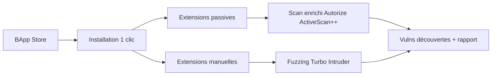

# 🔍 Burp Extensions (BApp Store) — Scan Web & Fuzzing

> [!info] **En 1 phrase**
> Le BApp Store est la boutique d'extensions officielle de Burp Suite : une galerie d'extensions Java/Python prêtes à l'emploi qui étendent les tests automatiques, le fuzzing et l'analyse (Turbo Intruder, Autorize, Collaborator Everywhere...).

---

## 🧾 Overview

| Champ | Valeur |
|---|---|
| Nom complet | BApp Store (Burp App Store) |
| Description | Catalogue d'extensions installables en 1 clic qui étendent Burp Suite : scan, fuzzing, autorisation, OAST, logging, parsers |
| Catégorie | Scan Web & Fuzzing |
| Sous-catégorie | Extensions / plugiciels de proxy d'interception |
| Fonction principale | Distribution et gestion des extensions Burp (Java/Python) |
| Type d'outil | Service intégré (galerie) + API de développement d'extensions |
| Licence | Mixte : extensions gratuites ou payantes ; API d'extension propriétaire (Burp) |
| Open source / propriétaire | Écosystème : Burp est propriétaire ; certaines extensions sont open source (licences MIT/GPL individuelles) |
| Langage(s) de programmation | Java (Montoya API), Python (via Jython pour extensions Python) |
| Développeur / organisation | PortSwigger (dépôts officiels) + contributeurs tiers (ex : assetnote, SecurityMB) |
| Projet officiel | BApp Store : https://portswigger.net/bappstore |
| Dépôt officiel | Extensions officielles : https://github.com/PortSwigger |
| Documentation officielle | https://portswigger.net/burp/documentation/extensions |
| Date de création | ~2012 (intégration du BApp Store dans Burp Suite) |
| État du projet | actif (mise à jour continue avec chaque release Burp) |
| Dernière version connue | Catalogue dynamique, lié à Burp Suite 2026.7.x |
| Systèmes compatibles | Linux / Windows / macOS (via Burp Suite, JVM 17+ recommandé) |

> [!note] Pour vérifier / compléter
> Depuis Burp 2023.x, l'onglet « Extensions » remplace l'ancien onglet « Extender ». Vérifier la compatibilité de chaque extension avec votre version de Burp avant l'installation.

---

## 🎯 Concept

Burp Suite expose une API d'extensions riche et stable, que la communauté exploite pour combler les angles morts du scanner par défaut. Le **BApp Store** est la galerie intégrée à l'outil : chaque extension s'installe en quelques clics (ou hors ligne via le portail `portswigger.net/bappstore`), puis ajoute des capacités ciblées — tests de bris d'autorisation (**Autorize**, **Auth Analyzer**), fuzzing haute performance (**Turbo Intruder**), détection d'interactions hors bande (**Collaborator Everywhere**), **HTTP Request Smuggler**, scan actif/passif enrichi (**ActiveScan++**, **HUNT**, **Burp Bounty**, **Backslash Powered Scanner**), parsing et helpers (**Copy as Python Requests**, **Logger++**, **Retire.js**).

Certaines extensions travaillent **en passif** : elles se greffent au scanner ou observent l'historique en arrière-plan sans envoyer de requêtes. D'autres s'utilisent via des **onglets dédiés** (Turbo Intruder, Logger++) ou ajoutent des menus contextuels. En pentest web, elles s'insèrent après la phase d'énumération (nmap/ffuf) pour approfondir l'autorisation, les injections et la logique métier sur les endpoints déjà cartographiés dans Burp.



---

## 🧠 Concepts fondamentaux

| Concept | Explication |
|---|---|
| Montoya API | API Java moderne de Burp (depuis 2023) pour développer des extensions : accès à HTTP, Scanner, Proxy, Project, etc. Remplace l'ancienne Extender API |
| Jython / Python | Burp embarque un interpréteur Jython : les extensions Python s'exécutent sur la JVM et accèdent à la même API que les extensions Java |
| OAST (Out-of-Band) | « Out-of-Band Application Security Testing » : détection de vulnérabilités en observant des interactions sortantes (DNS/HTTP) déclenchées par le serveur (ex : Collaborator) |
| Collaborator | Service OAST de PortSwigger : domaine unique + serveur de collecte DNS/HTTP. Disponible en Pro (publique ou privée), certaines fonctions limitées en Community |
| Broken access control | Défaut d'autorisation côté serveur : une ressource répond 200 à un compte non privilégié (IDOR, BOLA). Cible principale d'Autorize/Auth Analyzer |
| Request smuggling | Désynchronisation entre front et back proxy (CL.TE, TE.CL, TE.TE) permettant de « voler » des requêtes d'autres utilisateurs |
| Scanner checks | Checks personnalisables du scanner Burp (insertion/évidence) ; les extensions peuvent en injecter de nouveaux (Burp Bounty, ActiveScan++) |
| BChecks | Nouveau format de checks (2026.x) distribuables sans compilation, complémentaire des extensions |

---

## 🛠️ Installation

```bash
# Pas d'installation CLI : tout se fait dans l'interface Burp
# 1) Onglet Extensions -> BApp Store (ou Extender sur les versions < 2023)
# 2) Rechercher l'extension -> Install (compatible avec l'édition courante)
# 3) Chargement manuel : Extensions -> Add -> Type "Java" -> sélectionner le .jar
#    (ou Type "Python" -> script .py pour les extensions Jython)

# Téléchargement hors ligne depuis le portail (environnements air-gapped)
# https://portswigger.net/bappstore
```

```bash
# Sur Kali (extension d'exemple) : récupérer le .jar depuis GitHub puis le charger dans Burp
wget https://github.com/PortSwigger/turbo-intruder/releases/latest/download/turbo-intruder-all.jar
# Burp > Extensions > Add > Type Java > sélectionner turbo-intruder-all.jar
```

> [!warning] ⚠️ Prérequis & problèmes potentiels
> - Burp Community : le BApp Store est accessible, mais certaines extensions exigent une édition Pro (Collaborator client, scanner checks).
> - Compatibilité : une extension conçue pour une API ancienne peut échouer au chargement sur les versions récentes de Burp (erreur Java au démarrage).
> - Les extensions Python nécessitent Jython (embarqué) ; l'API Python peut être en retard sur la Montoya API Java.

---

## ⚙️ Configuration

Il n'existe pas de fichier de configuration global pour le BApp Store : chaque extension gère ses propres réglages via un **onglet dédié** ou le menu contextuel.

| Paramètre | Rôle | Valeur possible | Impact | Exemple |
|---|---|---|---|---|
| Onglet Extensions > BApp Store | Installer/désinstaller/mettre à jour les extensions | Liste du catalogue | Ajoute des onglets et des checks | Rechercher « Autorize » → Install |
| Onglet Extensions > Installed | Activer/désactiver une extension sans la désinstaller | checkbox | Réduit la charge mémoire et les erreurs | Désactiver les extensions inutilisées en fin d'engagement |
| Scope (Target > Scope) | Périmètre réseau/autorisation des extensions | `*.example.com` | Empêche les extensions passives d'analyser des hôtes tiers | Exclure les domaines hors périmètre |
| Project options > Sessions | Règles de session pour les extensions qui rejouent | Cookie / Header | Autorize rejoue les requêtes avec la bonne session | Cookie `SESSION` → compte admin |
| Turbo Intruder (template Python) | Stratégie de fuzzing (connexions, délai, requêtes) | Variables Python | Contrôle débit et charge sur la cible | `concurrentConnections=5`, `requestsPerConnection=100` |
| Logger++ (filtres) | Filtrage de ce qui est journalisé | Regex / exclusions | Réduit le volume du log | Filtrer les requêtes d'assets statiques |
| Burp Bounty (Pro) | Moteur de règles de scan personnalisées | Règles/payloads JSON | Ajoute des checks au pipeline d'active scan | Règle « XSS dans le header Referer » |

> [!note] À vérifier
> Les éditions Professional 2026.x introduisent les **BChecks**, format de checks distribuables indépendamment des extensions Java — à privilégier pour du scan custom simple.

---

## 🏗️ Architecture interne

Le BApp Store repose sur l'API d'extensibilité de Burp Suite, organisée autour de la **Montoya API** (interface `BurpExtender`, depuis Burp 2023) :

- **Chargement** : Burp démarre les extensions dans une classe `BurpExtender` (Java) ou via Jython (Python). Chaque extension enregistre des écouteurs (`HttpListener`, `ScannerCheck`, `ProxyRequestHandler`...) auprès du moteur Burp.
- **Points d'intégration** : `http` (interception/trafic), `scanner` (checks passifs/actifs), `proxy`, `repeater`, `intruder` (payload processors), `project` (données de projet), `websocket`.
- **Exécution** : les extensions tournent **dans la même JVM** que Burp → une extension instable (boucle infinie, fuite mémoire) peut figer l'outil ou provoquer un OOM.
- **Flux typique d'Autorize** : écouteur HTTP passif → copie chaque requête → remplace la session courante par une session de référence (admin) → rejoue sans privilège → compare statut/longueur → marque « accessible » / « forbidden ».
- **Collaborator Everywhere** : ajoute un header injectant un domaine Collaborator unique (`GET /?cb=xxxxx.oast.site`) ; les interactions DNS/HTTP sont collectées par le serveur PortSwigger (ou un serveur privé).

---

## ⌨️ Commandes

L'outil étant intégré à la GUI Burp, les « commandes » sont des raccourcis et des exemples d'usage des extensions.

### Commandes principales

```bash
# Vérifier que Burp et l'extension écoutent sur le proxy (ex : 127.0.0.1:8080)
curl -x http://127.0.0.1:8080 -k -v https://cible.example.com/

# Rejouer une requête interceptée hors de Burp (Copy as curl)
curl -X POST 'https://cible.example.com/login' \
  -H 'Content-Type: application/x-www-form-urlencoded' \
  --data 'user=admin&pass=FUZZ'
```

| Commande / action | Objectif | Résultat attendu |
|---|---|---|
| Extensions → BApp Store → Install | Installer une extension | Nouvel onglet ou menu contextuel disponible |
| `Ctrl+R` (Send to Repeater) | Envoyer la requête vers Repeater | Édition et rejeu manuel de la requête |
| `Ctrl+I` (Send to Intruder) | Envoyer vers Intruder (payloads natifs) | Attaque de positions `§...§` |
| Clic droit → Send to Turbo Intruder | Fuzzing haute performance scriptable | Onglet Turbo Intruder avec template Python |
| Clic droit → Copy as Python Requests | Générer le code Python de la requête | Script `requests` prêt pour l'automatisation |
| Onglet Autorize → Run | Rejouer toutes les requêtes avec session de référence | Colonnes « accessible / forbidden » par requête |
| Onglet Logger++ → Search | Rechercher dans tout l'historique HTTP | Lignes filtrées avec durée et statut |

### Commandes avancées

```bash
# Turbo Intruder : template minimal (éditer dans l'onglet dédié)
# -> script Python executé par l'extension pour envoyer des milliers de requêtes/s

# Collaborator Everywhere actif + navigation : observer les callbacks
# Onglet Collaborator -> enregistrer la sous-domaine fournie -> vérifier les interactions

# HTTP Request Smuggler : lancer les désync tests sur l'hôte en scope
# Onglet dédié -> "Launch attack" (CL.TE, TE.CL, TE.TE)
```

---

## 🎚️ Options et flags

| Option | Description | Exemple | Niveau |
|---|---|---|---|
| BApp Store → Search | Rechercher une extension par nom/description | « authorize » | Basic |
| Extensions → Installed → Enable/Disable | Activer/désactiver sans désinstaller | Désactiver Logger++ hors engagement | Basic |
| Autorize → Cookie/Session de référence | Session privilégiée à rejouer | Cookie admin dans le champ dédié | Intermediate |
| Autorize → Auto-run | Rejouer automatiquement chaque nouvelle requête | Cocher « auto » | Intermediate |
| Turbo Intruder → `time.sleep()` | Throttle entre requêtes pour rester discret | `sleepDelay(100)` | Intermediate |
| Turbo Intruder → variables de template | Contrôle connexions/requêtes par connexion | `requestsPerConnection=100` | Advanced |
| Burp Bounty → Import rules | Importer des règles de scan personnalisées | JSON de règles communauté | Advanced |
| Logger++ → Export | Exporter l'historique complet | CSV/JSON du trafic de l'engagement | Advanced |
| Montoya API → `HttpService` | Coder une extension Java maison | `BurpExtension.initialize` | Expert |
| BChecks → import | Checks distribuables sans compilation | Fichier `.bcheck` importé dans Scanner | Expert |

> [!tip] Options les plus utiles au quotidien
> Tri gagnant pour un engagement web : **Autorize** (broken access control) + **ActiveScan++** (checks récents) + **Collaborator Everywhere** (blind SSRF/XXE) + **Logger++** (traçabilité). N'active que ce dont tu as besoin pour limiter la RAM.

---

## 🧪 Exemples pratiques

### Beginner

```bash
# 1. Installer ActiveScan++ depuis le BApp Store (onglet Extensions)
# 2. Parcourir l'application : l'extension enrichit les checks passifs/actifs
# 3. Lancer un scan ciblé sur un hôte en scope -> nouveaux findings apparus

# Vérifier qu'une extension passif est bien active
# Onglet Extensions > Installed : "Loaded" à true, "Errors" à 0
```

### Intermediate

```bash
# Autorize : détecter les IDOR sur une application authentifiée
# 1. Se connecter en compte admin -> copier le cookie de session
# 2. Se connecter en compte low -> configurer Autorize avec le cookie admin
# 3. Run : toute requête verte « accessible » avec le compte low = broken access control

# Collaborator Everywhere : activer pendant une navigation complète
# -> vérifier l'onglet Collaborator pour les interactions DNS/HTTP reçues
```

### Advanced

```python
# Turbo Intruder : bruteforce de login à haut débit avec throttling
# Template python collé dans l'onglet Turbo Intruder
def queueRequests(target, wordlists):
    engine = RequestEngine(endpoint=target.endpoint,
                           concurrentConnections=5,
                           requestsPerConnection=100,
                           pipeline=False)
    for word in wordlists['passwords']:
        engine.queue(target.req, word.rstrip())
        time.sleep(0.05)  # throttle pour éviter le DoS

def handleResponse(req, interesting):
    if interesting:
        table.add(req)
```

### Expert

```java
// Extension Java (Montoya API) : logger les requêtes contenant un token
// Fichier: TokenLogger.java, compilé avec burp-api-gradle, jar chargé dans Burp
public class BurpExtender implements BurpExtension {
    @Override
    public void initialize(BurpExtensionApi api) {
        api.userInterface().registerSuiteTab("TokenLogger", new JLabel("Extension active"));
        api.http().registerHttpHandler(new HttpHandler() {
            @Override
            public void handleHttpRequest(HttpRequestToBeSent request) {
                if (request.toString().contains("token=")) {
                    api.logging().logToOutput("TOKEN: " + request.url());
                }
            }
        });
    }
}
```

---

## 🧪 Workflow complet (scénario pas à pas)

1. **Installer les extensions** — Extensions → BApp Store → Installer Autorize, Turbo Intruder, Collaborator Everywhere, ActiveScan++.
2. **Définir la portée** — Target → Scope : ajouter `*.example.com` ; tout ce qui est hors scope est ignoré par les extensions passives.
3. **Cartographier l'API** — parcourir l'application authentifiée ; l'historique alimente la base de requêtes d'Autorize.
4. **Tester l'autorisation** — configurer Autorize (session de référence admin, cookie courant user basse), lancer le replay ; collecter les endpoints verts (accessibles sans privilège).
5. **Fuzzer avec Turbo Intruder** — envoyer le POST de login dans l'onglet Turbo Intruder, configurer le template et la wordlist, lancer avec throttle.
6. **Blind via Collaborator Everywhere** — activer pendant une navigation : un callback DNS/HTTP reçu signale une interaction sortante (SSRF/XXE/IDOR blind).
7. **Analyser et rapporter** — trier les findings, rejouer manuellement chaque candidat, exporter le rapport et les captures (Logger++).

---

## 🎬 Scénarios avancés

### Scénario 1 : Broken access control sur une API (Autorize + Auth Analyzer)

Avec **Autorize** : après avoir parcouru l'API authentifiée (cookie admin), l'extension rejoue tout en mode non-privilégié. Les endpoints qui répondent en `200` au lieu de `401/403` sont les candidats IDOR/BOLA. **Auth Analyzer** affine en comparant la réponse entre rôles (guest / user / admin) et en pointant les différences de statut et de contenu.

```bash
# 1. Parcourir toutes les routes /api/... avec le compte admin
# 2. Autorize -> renseigner le cookie admin -> Run
# 3. Filtrer la colonne "access" : les lignes "accessible" avec le compte bas
# 4. Confirmer à la main : rejouer chaque endpoint avec curl -H "Cookie: session=low"
```

### Scénario 2 : Scanner custom rejouable (Burp Bounty + BChecks)

Définir des règles de scan personnalisées (payloads propriétaires, patterns métier) via Burp Bounty, puis les intégrer au pipeline d'active scan : le scanner exécute tes règles sur chaque paramètre en plus des règles de base. En 2026.x, exporter les règles en **BChecks** pour les partager sans compilation.

### Scénario 3 : Détection de SSRF blind par Collaborator

Injecter un payload Collaborator dans les champs `url`, `redirect`, `callback`, puis surveiller les interactions :

```bash
# 1. Onglet Collaborator -> copier la sous-domaine générée (ex : xxxxx.oast.site)
# 2. Repeater : GET /fetch?url=http://xxxxx.oast.site HTTP/1.1
# 3. Onglet Collaborator -> Poll : une interaction DNS/HTTP du serveur confirme le SSRF
# 4. Étendre (cadre autorisé) : http://169.254.169.254/ (métadonnées cloud)
```

---

## 🛡️ Cybersecurity use cases

| Phase | Utilisation |
|---|---|
| Reconnaissance | Cartographie des endpoints via Logger++ + Retire.js (librairies JS vulnérables) |
| Énumération | Énumération de paramètres via Turbo Intruder ; fuzzing de valeurs |
| Vulnérabilité | ActiveScan++, Burp Bounty, HUNT : checks complémentaires au scanner |
| Vulnérabilité | HTTP Request Smuggler : désynchronisation proxy |
| Vulnérabilité | Collaborator Everywhere : détection OAST (blind SSRF/XXE/RCE) |
| Exploitation | Turbo Intruder : bruteforce ciblé, exploitation assistée |
| Post-exploitation / rapport | Logger++ : preuves rejouables, export des échanges |

---

## 🎯 MITRE ATT&CK

| Tactique | Technique / Sub-technique | ID | Raison | Détection | Mitigation |
|---|---|---|---|---|---|
| Reconnaissance | Active Scanning : Vulnerability Scanning | T1595.002 | ActiveScan++ / Burp Bounty / HUNT ajoutent des checks de vulnérabilités actifs | Logs WAF/HTTP, corrélation SIEM des patterns de scan | Patching, WAF, rate-limiting |
| Reconnaissance | Active Scanning : Wordlist Scanning | T1595.003 | Turbo Intruder itère des wordlists sur chemins/paramètres | Burst de requêtes structurées sur endpoints | Rate limiting, CAPTCHA, WAF |
| Credential Access | Adversary-in-the-Middle | T1557 | Collaborator Everywhere reçoit des callbacks OAST (interactions hors bande) | Monitoring DNS sortant (oast.site), règles EDR | Filtrage DNS egress, blocage des domaines OAST |
| Initial Access | Exploit Public-Facing Application | T1190 | HTTP Request Smuggler exploite la désynchronisation HTTP | Détection des headers CL/TE anormaux, patching proxies | Patching reverse proxies, désactivation keep-alive |
| Discovery | Permission Groups Discovery (web) | T1069 | Autorize/Auth Analyzer énumèrent les ressources accessibles sans privilège | Alertes sur 200 anormaux après auth faible | Vérification d'autorisation côté serveur |

> [!note] Ne renseigner que si l'association est réellement pertinente.
> Les extensions sont des **amplificateurs** du couple T1595 (scan actif) + T1557 (OAST). L'association la plus spécifique est T1595.002/T1595.003 via Turbo Intruder et les checks de scan.

---

## 🛡️ Defensive Security

### Signes observables

| Indicateur | Détail |
|---|---|
| User-Agent `BurpSuite/...` dans les requêtes | Signature historique des requêtes Burp (désactivable dans Project options) |
| Callbacks DNS vers `*.oast.site` / `*.interactsh.com` | Trafic egress vers des services OAST = indicateur fort d'engagement actif |
| Volume massif de requêtes sur un même endpoint (Turbo Intruder) | Pic de RPS, erreurs 429, timeouts |
| Requêtes rejouées avec des sessions alternées (Autorize) | Même chemin, cookies différents, statuts variant de 200 à 403 |
| En-têtes CL/TE manipulés (smuggling) | Requêtes avec `Content-Length` et `Transfer-Encoding` simultanés |
| JAR/scripts d'extension sur les postes de test | Présence de `*.jar` (turbo-intruder, autorize), Jython |

### Règles de détection (Sigma / Suricata / Snort / YARA)

```yaml
# Sigma (pédagogique - à adapter) : accès répété à des chemins de fuzzing
title: Web Fuzzing Pattern - Repetitive 404s
status: experimental
logsource:
    category: webserver
    product: apache
detection:
    selection:
        sc-status:
            - 404
    condition: selection
    timeframe: 1m
    aggregation: count > 200
falsepositives:
    - Scanners de monitoring légitimes
level: medium
```

```bash
# Suricata/Snort (pédagogique) : haute fréquence de requêtes HTTP par source
alert tcp any any -> any 80 (msg:"High-rate web fuzzing (Burp/Turbo Intruder)"; flow:to_server,established; content:"GET"; http.method; threshold:type both, track by_src, count 300, seconds 30; classtype:attempted-recon; sid:66000001; rev:1;)
```

```yaml
# YARA : détection du jar de l'extension Autorize sur un poste
rule Burp_Extension_Autorize {
    meta:
        description = "Jar de l'extension Autorize (broken access control testing)"
        author = "Équipe SOC"
    strings:
        $a = "Autorize"
        $b = "replayAuthorization"
        $c = "Barak Tawily"
    condition:
        uint32(0) == 0x04034B50 and any of them
}
```

---

## 🤖 Automatisation

Les extensions enrichissent les pipelines automatisés de Burp (Intruder, Scanner) et s'intègrent aux scripts externes.

```bash
# Extraire les findings d'Autorize depuis l'export Logger++ puis parser en CLI
# Onglet Logger++ -> Export CSV -> traitement shell
cut -d',' -f1,7,8 autorize_export.csv | grep -iE "200|201" | sort -u
```

```python
# Python : rejouer les requêtes identifiées hors de Burp (Copy as Python Requests)
import requests

cookies = {"SESSION": "session_user_low"}
r = requests.get("https://api.example.com/users/42", cookies=cookies, verify=False)
print(r.status_code, len(r.content))  # 200 + contenu sensible = IDOR confirmé
```

```python
# Python : invoquer l'API REST de Collaborator (serveur privé) pour vérifier les callbacks
# API REST PortSwigger (collaborator) -> /interactions -> JSON
import requests
cb = requests.get("https://collab.private.example.com/register",
                  params={"community": "true"}).json()
print(cb["server"], cb["collaborator_id"])  # domaine oast à injecter dans les payloads
```

---

## 📤 Output et parsing

Les extensions produisent principalement des **onglets** et des **exports**. Les formats exploitables : CSV/JSON de Logger++, JSON des BChecks/Scanner, requêtes exportées.

```bash
# Exporter l'historique Logger++ en JSON puis filtrer les POST contenant des tokens
# (onglet Logger++ -> Export JSON)
jq '.[] | select(.method == "POST") | .url' logger_export.json | sort -u
```

```python
# Python : parser un export CSV de Logger++ pour en extraire les candidats IDOR
import csv
with open("logger_export.csv", newline="", encoding="utf-8") as f:
    for row in csv.DictReader(f):
        url = row["URL"]
        status = row["Status"]
        if "api" in url and status in {"200", "201"}:
            print(url, status)
```

> [!note] À vérifier
> Les colonnes exactes de l'export Logger++ varient selon la version de Burp : adapter les noms de champs à l'export généré.

---

## 🔗 Intégrations

```text
Navigateur -> Burp Suite (proxy 127.0.0.1:8080) -> Extensions (Autorize, Turbo Intruder, Collaborator) -> cible
Burp Suite -> Logger++ (export) -> SIEM / rapport
Turbo Intruder -> wordlist SecLists -> découverte de paramètres
```

- [[Tools|🧰 Outils]] global
- [[Outil - Burp Suite]] — outil hôte des extensions
- [[Outil - ffuf]] — fuzzing CLI complémentaire à Turbo Intruder
- [[Outil - gobuster]] / [[Outil - Feroxbuster]] — découverte de contenu en amont
- [[Outil - mitmproxy]] — alternative scriptable en Python
- [[Outil - OWASP ZAP]] — scanner open source alternatif (Marketplace add-ons)
- [[Outil - nuclei]] — validation template-based des CVEs détectées
- [[Outil - sqlmap]] — automatisation SQLi après suspicion (via Copy as curl)
- [[Techniques/IDOR]] · [[Techniques/HTTP Request Smuggling]] · [[Techniques/SSRF]] · [[Techniques/XXE]] · [[Techniques/GraphQL]]

---

## 🔄 Alternatives

| Outil | Avantages | Inconvénients | Cas d'usage |
|---|---|---|---|
| BChecks (Burp natif) | Checks YAML partageables, pas de compilation | Moins flexible qu'une extension Java | Checks custom simples |
| ZAP add-ons (Marketplace) | Open source, gros catalogue | Moins d'extensions qualité « web app » | Scanning automatisé open source |
| mitmproxy addons | Scriptabilité Python totale, gratuit | Pas de scanner intégré | Automatisation MITM/transformation de trafic |
| Caido Workflows | Automatisation visuelle, Rust, léger | Écosystème plus jeune que BApp | Alternatives légères à Burp |

> **Quand utiliser BChecks plutôt qu'une extension ?** Pour un check simple et réutilisable entre collègues, un BCheck suffit et évite la maintenance Java. Pour du fuzzing haute performance ou des manipulations d'autorisation, une extension dédiée (Turbo Intruder, Autorize) reste indispensable.

---

## ⚡ Performance

- **Turbo Intruder** : conçu pour dépasser plusieurs milliers de requêtes/s sur une seule connexion (pipelining, multiplexage HTTP/1.1), contre quelques centaines pour Intruder standard en Community (throttlé).
- **Mémoire** : chaque extension chargée consomme de la RAM dans la JVM Burp ; l'accumulation de nombreuses extensions est une cause classique d'**OutOfMemoryError**.
- **Logger++** : journalise tout l'historique en arrière-plan ; sur un engagement long avec du trafic volumineux, limiter le log aux hôtes en scope.
- **Impact côté cible** : sans throttling, Turbo Intruder peut faire tomber une application ou déclencher le WAF — toujours configurer un `sleep` ou `pause`.

> [!note] À vérifier
> Les chiffres de débit dépendent du matériel, du réseau et du template Turbo Intruder utilisé. Toujours tester en lab avant engagement.

---

## 🛠️ Troubleshooting

### Common problems

#### Problème : l'extension ne charge pas (« Unable to load extension »)

- **Cause** : API obsolète (Extender) incompatible avec les versions 2023+ de Burp.
- **Solution** : passer à la version 2023+ de l'extension (onglet Extensions) ou charger la version .jar à jour. **Vérification** : Extensions → Installed → status « Loaded ».

#### Problème : Autorize marque tout « accessible »

- **Cause** : session de référence non renseignée ou scope mal configuré.
- **Solution** : vérifier le cookie de session admin et l'URL cible dans les réglages d'Autorize. **Vérification** : relancer et comparer avec un endpoint dont l'accès doit être refusé (403 attendu).

#### Problème : Burp se fige ou plante en OOM

- **Cause** : trop d'extensions actives simultanément (fuites mémoire Jython, buffering).
- **Solution** : désactiver les extensions inutiles, augmenter la RAM de la JVM (`-Xmx4g`). **Vérification** : surveiller l'onglet Extensions (usage mémoire) et le journal.

#### Problème : Turbo Intruder ne reçoit aucune réponse

- **Cause** : la requête envoyée n'a pas de positions de fuzzing valides, ou le template ne définit pas `queueRequests`.
- **Solution** : vérifier le template Python et l'endpoint (port/proxy). **Vérification** : relancer avec `concurrentConnections=1`.

---

## 🔐 Sécurité de l'outil

- **Confiance dans les extensions** : une extension charge du code dans la même JVM que Burp → n'installer que des extensions reconnues (PortSwigger, éditeurs référencés) et auditer le `.jar` si besoin.
- **Data exfiltrée** : certaines extensions (loggers, télémétrie) peuvent capturer les requêtes de la cible, y compris les tokens. Vérifier ce que fait l'extension avant de l'utiliser sur des engagements sensibles.
- **Levier offensif** : Collaborator envoie des requêtes vers les serveurs PortSwigger ; pour les engagements isolés, préférer un **Collaborator privé**.
- **Permissions** : Burp doit pouvoir écrire les exports ; ne jamais laisser le daemon API exposé sans clé.

---

## ⚠️ Limitations

- Catalogue **verrouillé à Burp** : le BApp Store ne fonctionne pas hors de l'outil.
- **Community** : pas d'accès au scanner actif pour les extensions qui en dépendent ; Intruder est throttlé.
- **Compatibilité** : extensions anciennes (API Extender) incompatibles avec les releases récentes.
- **Consommation** : plusieurs extensions = RAM et CPU ; OOM fréquent.
- **Pas de « magic »** : Autorize/Burp Bounty génèrent des faux positifs et ratent la logique métier — le test manuel reste nécessaire.

---

## 📋 Cheatsheet

```bash
# Installer depuis le BApp Store
# Burp > Extensions > BApp Store > rechercher > Install

# Charger manuellement un .jar
# Burp > Extensions > Add > Type Java > sélectionner le fichier

# Télécharger une extension officielle hors ligne
wget https://github.com/PortSwigger/turbo-intruder/releases/latest/download/turbo-intruder-all.jar

# Tester l'interception de l'extension via le proxy Burp
curl -x http://127.0.0.1:8080 -k https://cible.example.com/robots.txt

# Vérifier les callbacks Collaborator après un scan
# Onglet Collaborator > Poll all (interactions DNS/HTTP)

# Exporter les preuves Logger++ pour le rapport
# Onglet Logger++ > Export > CSV ou JSON
```

---

## ⚡ Quick reference

| | |
|---|---|
| **À quoi sert-il ?** | Étendre Burp Suite : fuzzing, autorisation, OAST, logging, checks custom |
| **Quand l'utiliser ?** | Après l'énumération web, pour approfondir authz (Autorize), fuzzing (Turbo Intruder), blind (Collaborator) |
| **Commande principale** | Burp > Extensions > BApp Store > Install (pas de CLI) |
| **Alternative principale** | BChecks (checks natifs), ZAP add-ons, mitmproxy addons |
| **Concepts importants** | Montoya API, Jython, OAST/Collaborator, broken access control, request smuggling |
| **Liens associés** | [[Outil - Burp Suite]] · [[Outil - mitmproxy]] · [[Outil - OWASP ZAP]] · [[Techniques/IDOR]] |

---

## 🔍 Détection & Défense

| Signe | Défense |
|---|---|
| Requêtes rejouées avec des sessions différentes (Autorize) | Vérification d'autorisation **côté serveur** systématique (ne jamais faire confiance au client) |
| Volume massif de requêtes (Turbo Intruder) | Rate limiting par IP, WAF (CRS), CAPTCHA |
| Payloads Collaborator dans les requêtes | Filtrage des requêtes sortantes, blocage des lookups DNS externes |
| Patterns de fuzzing dans les logs | Honeypots, corrélation des sources, alertes sur taux d'erreur |
| Smuggling testé sur les proxies | Patching des reverse proxies, désactivation des connexions keep-alive si nécessaire |
| JAR d'extension sur poste de test | Détection EDR (YARA), inventaire logiciel |

---

## ⚠️ Tips & Pièges

> [!tip] 💡 **Tips**
> - Installe en premier le trio **Autorize + ActiveScan++ + Collaborator Everywhere** : le meilleur rapport valeur/effort pour un pentest web classique.
> - Lis toujours le README de chaque extension : plusieurs (Autorize, Turbo Intruder) ont une configuration précise (scope, marqueurs) sans laquelle elles ne font rien.
> - Vérifie la **compatibilité avec ta version de Burp** (2023+ a changé la gestion des extensions : onglet Extensions vs Extender).
> - Pense aux **BChecks** pour du scan custom simple et partageable sans compilation.

> [!warning] ⚠️ **Pièges**
> - Trop d'extensions actives = **ralentissement et OOM** de Burp : n'active que ce dont tu as besoin sur l'engagement courant.
> - **Turbo Intruder sans throttle peut DoS la cible** : configure un délai (`time.sleep`) ou `pause` pour les engagements en production.
> - Certaines extensions sont **obsolètes** et ne fonctionnent plus sur les dernières versions de Burp (erreurs Java/API) : teste-les en lab avant l'engagement.
> - Ne charge pas de `.jar` de provenance douteuse : il s'exécute dans la JVM de Burp avec tes privilèges.

---

## 📚 References

### Official

- BApp Store officiel : https://portswigger.net/bappstore
- Documentation des extensions Burp (Montoya API) : https://portswigger.net/burp/documentation/extensions
- GitHub PortSwigger (extensions officielles) : https://github.com/PortSwigger
- Documentation Collaborator : https://portswigger.net/burp/documentation/collaborator

### Security references

- MITRE ATT&CK T1595 — Active Scanning : https://attack.mitre.org/techniques/T1595/
- MITRE ATT&CK T1557 — Adversary-in-the-Middle : https://attack.mitre.org/techniques/T1557/
- MITRE ATT&CK T1190 — Exploit Public-Facing Application : https://attack.mitre.org/techniques/T1190/
- OWASP Top 10 — Broken Access Control (A01) : https://owasp.org/Top10/A01_2021-Broken_Access_Control/

### Community

- PortSwigger Research — Request Smuggling : https://portswigger.net/research/http-desync-attacks-request-smuggling-reborn
- PortSwigger Research — Backslash Powered Scanner : https://portswigger.net/research/backslash-powered-scanning-uncovering-the-unknown-web
- Turbo Intruder (blog PortSwigger) : https://portswigger.net/research/turbo-intruder-embracing-the-billion-request-attack

---

➡️ **Liens :** [[Tools|🧰 Outils]] · [[Outils/Outil - Burp Suite|Burp Suite]] · [[Techniques/HTTP Request Smuggling|HTTP Request Smuggling]] · [[Techniques/IDOR|IDOR]]
