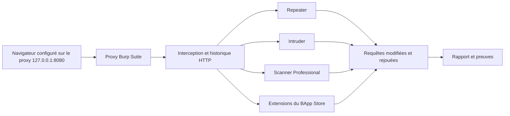

# 💥 Burp Suite — Proxy d'interception Web

> [!info] **En 1 phrase**
> Burp Suite = le proxy d'interception web de référence : on s'intercale entre le navigateur et la cible pour capturer, modifier, rejouer et fuzzer chaque requête HTTP/S.

---

## 🧾 Overview

| Champ | Valeur |
|---|---|
| Nom complet | Burp Suite (éditions Community / Professional / Enterprise) |
| Description | Plateforme intégrée de test d'applications web : proxy MITM, scanner de vulnérabilités, fuzzing, rejeu manuel et automatisation |
| Catégorie | Scan Web & Fuzzing |
| Sous-catégorie | Proxy d'interception & plateforme de pentest applicatif web |
| Fonction principale | Capturer, modifier, rejouer, fuzzer et scanner le trafic HTTP/S entre navigateur et cible |
| Type d'outil | GUI desktop (Java) + API REST (Professional) + moteur de scan serveur (Enterprise) |
| Licence | Propriétaire — Community gratuite, Professional/Enterprise commerciales |
| Open source / propriétaire | Propriétaire (le cœur de l'outil n'est pas open source ; extensions et BChecks officiels sont publiés sur GitHub) |
| Langage(s) de programmation | Java ; extensions en Java (Montoya API) ou Python (Jython) |
| Développeur / organisation | PortSwigger — créé par Dafydd Stuttard, auteur du « Web Application Hacker's Handbook » |
| Projet officiel | https://portswigger.net/burp |
| Dépôt officiel | https://github.com/PortSwigger (extensions, BChecks, exemples d'API) |
| Documentation officielle | https://portswigger.net/burp/documentation |
| Date de création | 2004 (première release « Burp ») |
| État du projet | actif (releases régulières, environ mensuelles) |
| Dernière version connue | 2026.4 (avril-mai 2026) |
| Systèmes compatibles | Linux / Windows / macOS (JAR multiplateforme + installeurs natifs ; navigateur Chromium embarqué) |

> [!note] Pour vérifier / compléter
> Le numéro de release exact le plus récent évolue chaque mois : confirmer sur https://portswigger.net/burp/releases avant rédaction d'un rapport. La version 2026.1.x (février 2026) embarque Java 25.0.1 et Chromium 145 ; la série 2026.4 intègre des fonctionnalités orientées IA (assistant, analyse de réponses).

---

## 🎯 Concept

Burp Suite, développé par **PortSwigger** depuis 2004, est un **proxy man-in-the-middle local** : le navigateur est configuré sur `127.0.0.1:8080` et un **certificat CA racine** est installé dans le navigateur pour déchiffrer le TLS. Tout le trafic HTTP/S transite alors par l'onglet **Proxy** (interception on/off, HTTP history, WebSocket history) avant d'être routé vers des outils dédiés : **Target** (sitemap + scope), **Repeater** (rejeu manuel), **Intruder** (fuzzing / brute-force), **Decoder** (encodage), **Comparer** (diff) et **Scanner** (détection automatique).

Trois éditions existent : **Community** (gratuite, outils manuels, Intruder throttlé, pas de scanner actif), **Professional** (scanner, BApp illimitées, extensions, API REST, Collaborator) et **Enterprise** (scans centralisés dans un pipeline CI/CD avec scanneur et organisation par équipe). Dafydd Stuttard a conçu l'outil autour de sa méthode « manuelle d'abord » du *Web Application Hacker's Handbook* : l'analyse guidée du trafic réel prime sur l'automatisation aveugle. Dans un pentest, Burp s'utilise **après** la découverte (nmap/ffuf/gobuster) pour approfondir l'authentification, les injections, la logique métier et le contrôle d'accès — c'est l'outil central de la phase de test applicatif.



---

## 🧠 Concepts fondamentaux

| Concept | Explication |
|---|---|
| Proxy MITM local | Serveur local qui se place entre le client (navigateur) et le serveur cible : tout le trafic passe par lui, dans les deux sens, HTTP et HTTPS |
| Interception TLS | Pour déchiffrer le HTTPS, Burp génère un certificat CA racine (« PortSwigger CA ») que le navigateur doit approuver ; les certificats de session sont signés dynamiquement par site |
| HTTP history | Journal chronologique de toutes les requêtes/réponses passées par le proxy, filtrable et exportable ; alimente le sitemap de l'onglet Target |
| Scope | Périmètre défini dans Target (hôtes/URLs inclus) : les outils et extensions n'agissent que sur ce périmètre, ce qui évite de toucher des domaines tiers |
| Sitemap / site map | Arborescence des contenus découverts (via navigation et scanner) classés par hôte et chemin |
| Intruder | Moteur de fuzzing positionnel : on marque des positions `§...§` dans une requête et on itère des payloads selon 4 attaques (Sniper, Battering ram, Pitchfork, Cluster bomb) |
| Repeater | Rejeu manuel d'une requête modifiée à la volée, idéal pour tester une hypothèse (paramètre, header, méthode) |
| Scanner (Pro) | Moteur actif/passif : envoie des payloads (SQLi, XSS, SSRF, chemin, etc.) et corrèle les réponses ; OAST (Collaborator) réduit les faux positifs |
| Collaborator (Pro) | Service OAST de PortSwigger : domaine unique + collecteur DNS/HTTP ; les interactions sortantes déclenchées par la cible confirment les vulnérabilités blind |
| Session handling | Règles (cookies, macros, HTTP auth) qui maintiennent une session valide pendant les scans et le fuzzing |
| Montoya API / BApp | API Java moderne (2023+) pour les extensions ; galerie du BApp Store pour installer des capacités supplémentaires |

---

## 🛠️ Installation

### Debian / Ubuntu / Kali Linux

```bash
# Kali fournit un paquet Burp Community (versions parfois en retard)
sudo apt update && sudo apt install -y burpsuite

# Installation officielle (toujours la dernière version) :
# 1) Télécharger l'installeur depuis https://portswigger.net/burp/releases
curl -L -o burpsuite_install.sh \
  "https://portswigger.net/burp/releases/startdownload?product=community&type=Linux"
bash burpsuite_install.sh

# Alternative JAR (nécessite un JRE 21+)
curl -L -o burpsuite_pro.jar \
  "https://portswigger.net/burp/releases/startdownload?product=pro&type=Jar"
java -jar burpsuite_pro.jar
```

### Arch Linux

```bash
# AUR (Community) : paquets communautaires non officiels
# yay -S burpsuite
```

### Fedora / RHEL

```bash
# Pas de paquet RPM officiel : utiliser l'installeur officiel
# ou le JAR avec un JRE 21+ (sudo dnf install java-21-openjdk)
java -jar burpsuite_pro.jar
```

### macOS

```bash
brew install --cask burpsuite
# ou installeur natif (Apple silicon / Intel) sur portswigger.net/burp/releases
```

### Windows

```powershell
# Installeur natif : https://portswigger.net/burp/releases
# ou via Chocolatey (Community)
choco install burp-suite-community

# Exécution du JAR directement
java -jar burpsuite_pro.jar
```

### Docker

```bash
# Aucune image officielle : utiliser une image communautaire en lab uniquement
docker pull xiv3r/burpsuite  # exemple non officiel, à vérifier
```

### Compilation depuis les sources

```bash
# Le cœur de Burp est propriétaire : pas de compilation.
# En revanche, les extensions et BChecks officiels sont open source :
git clone https://github.com/PortSwigger/turbo-intruder.git
# puis chargement du .jar dans Burp : Extensions -> Add -> Type "Java"
```

> [!warning] ⚠️ Prérequis & problèmes potentiels
> - **Java** : les installeurs 2026.x embarquent leur JRE (Java 25.0.1) ; pour lancer le `.jar` à la main, un **JDK/JRE 21+** est requis (les anciens JRE 11 peuvent échouer).
> - **Mémoire** : 4 Go de RAM minimum recommandés, davantage pour les grosses applications (configurable via `-Xmx`).
> - **Licence Pro** : sans licence valide, le scanner actif et Collaborator sont inaccessibles (Community).
> - **Antivirus/proxy d'entreprise** : certains EDR bloquent le certificat local ou l'installation du JAR.

---

## ⚙️ Configuration

| Paramètre | Rôle | Valeur possible | Impact | Exemple |
|---|---|---|---|---|
| `Proxy > Proxy listeners` | Adresse/port d'écoute du proxy | `127.0.0.1:8080` (défaut) | Adresse du proxy à pointer dans le navigateur | Changer pour `127.0.0.1:8081` en cas de conflit |
| `Project options > TLS > Certificate` | Certificat CA racine | `PortSwigger CA` (défaut) | Clé privée de déchiffrement TLS à installer dans le navigateur | Installer le cert via `http://burp/cert` |
| `Target > Scope` | Périmètre inclus/exclus | `*.example.com` (Include), exclure les CDN | Les outils (Intruder, Scanner, extensions) n'agissent que sur le scope | Exclure `*.google-analytics.com` |
| `Session handling rules` | Règles de session (cookies, macros) | Macro « login », cookie `SESSION` | Maintient une session authentifiée pendant les scans/fuzz | Rejouer automatiquement le login si 302 vers /login |
| `Match and replace` | Réécriture automatique de requêtes/réponses | Header → valeur (regex) | Transforme le trafic à la volée | Remplacer `User-Agent` |
| `User options > Memory` | RAM allouée à la JVM | `-Xmx4g` | Évite les OOM sur les gros engagements | `-Xmx8g` pour un scan lourd |
| `Settings > REST API` (Pro) | API REST de contrôle | Port + clé API | Automation externe (scripts, CI) | `--api-port=7000`, clé générée au premier lancement |
| `Update channel` | Canal de mise à jour | Stable / Early Adopter | Accès aux nouveautés avant tout le monde | Early Adopter pour tester les features 2026.x |

> [!note] À vérifier
> Le port par défaut de la REST API a changé au fil des versions (8082 historiquement, port dynamique/7000 selon les releases récentes) : vérifier dans `Settings > REST API` et dans la documentation officielle avant d'automatiser.

---

## 🏗️ Architecture interne

Burp Suite est une application **Java desktop** organisée en modules qui partagent le même moteur réseau et le même projet :

- **Moteur réseau** : chaque module (Proxy, Intruder, Repeater, Scanner, Collaborator client) établit ses propres connexions ; les options TLS (certificats, ALPN, HTTP/2) sont centralisées dans les project options.
- **Proxy** : écoute sur `127.0.0.1:8080`, déchiffre le TLS avec un certificat signé par la CA `PortSwigger CA`, puis expose le trafic dans HTTP history et WebSocket history.
- **Project model** : toutes les données (sitemap, historique, requêtes Repeater, findings du scanner, définitions Intruder) vivent dans un projet `.burp` (sur disque ou temporaire).
- **Scanner (Pro)** : processus de scan multi-thread qui injecte des payloads, observe les réponses et, pour les checks blind, enregistre des domaines Collaborator (`xxxxx.oast.site`) pour collecter les interactions DNS/HTTP sortantes.
- **Extensions** : chargées dans la **même JVM** (Java via Montoya API ou Python via Jython) ; elles enregistrent des écouteurs (`HttpHandler`, `ScannerCheck`, proxy handlers) dans le moteur.
- **REST API (Pro)** : serveur HTTP local qui expose le projet et les scans au format JSON (points `/scan`, `/project`, etc.) pour l'automatisation externe.

Flux typique : navigateur → Proxy (déchiffrement) → HTTP history → `Send to Repeater/Intruder` → réponse analysée → éventuellement `Scan` → finding stocké dans le projet → export du rapport.

---

## ⌨️ Commandes

### Commandes principales

```bash
# Lancer Burp avec un projet et une configuration précise (Pro)
burpsuite --project-file=audit_2026.burp --config-file=config.json

# Vérifier que le proxy écoute sur 8080 et route bien le trafic
curl -x http://127.0.0.1:8080 -k -v https://cible.example.com/

# Télécharger le certificat CA pour l'installer dans un navigateur
curl -k http://127.0.0.1:8080/cert -o burp-ca.der

# Exporter une requête interceptée (Copy as curl) puis la rejouer avec sqlmap
sqlmap -r request.txt --batch --level=2 --risk=2
```

| Commande / action | Objectif | Résultat attendu |
|---|---|---|
| `burpsuite --project-file=x.burp` | Charger/créer un projet sur disque | Projet restauré avec historique et findings |
| `curl -x http://127.0.0.1:8080 -k https://cible/` | Tester le proxy en CLI | Réponse visible dans HTTP history |
| `Ctrl+R` (Send to Repeater) | Envoyer une requête vers Repeater | Rejeu manuel modifiable |
| `Ctrl+I` (Send to Intruder) | Envoyer vers Intruder | Attaque positionnelle `§...§` configurable |
| Clic droit → `Copy as curl` | Exporter la requête en `curl` | Script réutilisable en CLI |
| Clic droit → `Copy as Python Requests` | Générer le code Python | Script `requests` pour l'automatisation |
| Onglet Scanner → `New scan` (Pro) | Lancer un scan actif/passif sur le scope | Liste de findings triés par gravité |

### Commandes avancées

```bash
# REST API (Pro) : lancer un scan et récupérer le résultat en JSON
curl -k -X POST "http://127.0.0.1:7000/v0.1/scan" \
  -H "Authorization: Bearer $(cat api_key)" \
  -H "Content-Type: application/json" \
  -d '{"urls":["https://cible.example.com"],"scan_configurations":[{"name":"active scan"}]}'

# Réduire la RAM allouée à la JVM au lancement
java -Xmx4g -jar burpsuite_pro.jar

# Mode headless (Pro) : lancer l'interface sans affichage (serveur d'automatisation)
# java -Djava.awt.headless=true -jar burpsuite_pro.jar
```

---

## 🎚️ Options et flags

| Option | Description | Exemple | Niveau |
|---|---|---|---|
| `--project-file=<fichier>` | Fichier projet Burp à ouvrir/créer | `burpsuite --project-file=audit.burp` | Basic |
| `--config-file=<fichier>` | Fichier de configuration (JSON) à charger | `burpsuite --config-file=config.json` | Intermediate |
| `--api-port=<port>` (Pro) | Port de la REST API | `burpsuite --api-port=7000` | Intermediate |
| `Proxy > Intercept on/off` | Bascule l'interception : fige les requêtes pour modification | Désactiver pendant une navigation passive | Basic |
| `Intruder > Attack type` | Stratégie de fuzzing : Sniper, Battering ram, Pitchfork, Cluster bomb | Sniper pour un seul paramètre | Intermediate |
| `Intruder > Payload processing` | Règles de transformation des payloads | Encode URL, prefix/suffix | Intermediate |
| `Target > Scope` | Définit le périmètre et exclut les domaines tiers | `*.example.com` | Basic |
| `Decoder > Smart decode` | Détecte et décode l'encodage (URL, base64, hex, HTML, JWT) | `%75%73%65%72` → `user` | Basic |
| `Comparer` | Compare deux requêtes/réponses | Diff entre deux sessions pour l'authz | Intermediate |
| `Sequencer` | Analyse l'entropie des jetons (CSRF, SESSION) | Sample 2000 tokens → estimateur d'entropie | Advanced |
| `Scanner > Insertion points` (Pro) | Points d'injection testés par le scan | `parameters`, `headers`, `cookies` | Advanced |
| `Session handling > Macro` | Enchaînement automatisé (login) pour maintenir la session | Macro « connexion puis navigation » | Advanced |
| `Project options > HTTP/2` | Activer HTTP/2 pour les tests avancés (smuggling) | `h2` + désync tests | Expert |
| `REST API` (Pro) | Automation complète via JSON | Script CI/CD de scan quotidien | Expert |

> [!tip] Options les plus utiles au quotidien
> **Scope** bien défini (évite les dégâts sur domaines tiers), **Ctrl+R/Ctrl+I** pour router vite vers Repeater/Intruder, **Copy as curl** pour sortir les requêtes vers sqlmap/ffuf/curl, et **Match and replace** pour normaliser le trafic (ex : forcer un User-Agent).

---

## 🧪 Exemples pratiques

### Beginner

```bash
# Objectif : voir son premier trafic dans Burp
# 1) Lancer Burp Community, créer un projet temporaire
# 2) Configurer le navigateur : proxy 127.0.0.1:8080 (FoxyProxy sur Firefox)
# 3) Installer le certificat CA : http://burp/cert
# 4) Désactiver l'interception, naviguer sur https://cible.example.com

# Vérification en CLI que le proxy fonctionne
curl -x http://127.0.0.1:8080 -k -v https://cible.example.com/robots.txt
# -> la requête apparaît dans Proxy > HTTP history
```

### Intermediate

```bash
# Objectif : intercepter et modifier le POST de login
# 1) Activer l'interception (Proxy > Intercept on)
# 2) Soumettre des identifiants bidon dans le formulaire
# 3) La requête POST se fige : modifier le champ user=admin' pour tester une injection
# 4) Forward ; une erreur 500 ou une réponse SQL différente = piste à creuser

# Fuzzing d'usernames avec Intruder (Sniper)
# Marquer la position : user=§admin§
# Charge : liste d'usernames -> Start attack -> comparer statuts/longueurs
```

### Advanced

```bash
# Objectif : énumérer les paramètres et endpoints via Intruder en Cluster bomb
# Position 1 : /§param§?value=1   Position 2 : /param?§value§=1
# Charge 1 : top-params.txt   Charge 2 : valeurs de test
# -> trier par code réponse et longueur pour isoler les paramètres traités

# Automatiser l'exploitation SQLi time-based avec sqlmap depuis une requête exportée
sqlmap -r request.txt -p id --technique=T --time-sec=2 --batch
sqlmap -r request.txt -p id --technique=T --dbs --batch
```

### Expert

```bash
# Objectif : scan headless + REST API pour un pipeline de sécurité
# 1) Démarrer Burp Pro avec l'API activée
burpsuite --project-file=ci.burp --api-port=7000 &

# 2) Lancer un scan et poller le résultat
curl -k -s -X POST "http://127.0.0.1:7000/v0.1/scan" \
  -H "Authorization: Bearer $BURP_API_KEY" \
  -H "Content-Type: application/json" \
  -d '{"urls":["https://cible.example.com/api"],"scan_configurations":[{"name":"CIS Benchmark"}]}'

# 3) Rejouer manuellement chaque finding candidat dans Repeater avant de le déclarer
```

---

## 🧪 Workflow complet (scénario pas à pas)

1. **Étape 1 — Configurer le navigateur** — pointer le proxy sur `127.0.0.1:8080` (FoxyProxy), installer le certificat CA de Burp et désactiver l'interception.
   ```bash
   curl -k http://127.0.0.1:8080/cert -o burp-ca.der
   ```
2. **Étape 2 — Définir le scope** — Target → Scope : ajouter `*.example.com`, exclure les domaines tiers (CDN, analytique).
3. **Étape 3 — Cartographier la cible** — parcourir l'application (login, panier, recherche, API) ; chaque requête s'empile dans **HTTP history** et alimente le sitemap de l'onglet **Target**.
4. **Étape 4 — Intercepter l'authentification** — activer l'interception, soumettre des identifiants bidon → le POST de login est figé et modifiable dans l'onglet Proxy.
5. **Étape 5 — Tester les injections** — **Send to Repeater**, remplacer `user=admin` par `user=admin'` → une réponse différente (erreur SQL, 500) confirme une suspicion d'injection.
6. **Étape 6 — Fuzzer les paramètres** — **Send to Intruder**, positionner `§admin§` sur l'username, attaque **Sniper** sur une liste d'usernames pour tester les énumérations/IDOR.
7. **Étape 7 — Approfondir et rapporter** — **Copy as curl** de la requête suspecte → `sqlmap -r request.txt` pour automatiser l'extraction, puis consigner les preuves dans le rapport.

---

## 🎬 Scénarios avancés

### Scénario 1 : SQLi en aveugle (time-based) via Repeater + sqlmap

Confirmer une injection sans aucune sortie visible en comparant les temps de réponse.

```bash
# Dans Repeater, sur le paramètre vulnérable :
# id=1 AND SLEEP(0)   → réponse immédiate
# id=1 AND SLEEP(5)   → réponse ~5 secondes = injection time-based confirmée

# Automatiser l'extraction de données avec sqlmap sur la requête exportée
sqlmap -r request.txt -p id --technique=T --time-sec=2 --batch
sqlmap -r request.txt -p id --technique=T --dbs --batch
```

### Scénario 2 : Détection de broken access control (IDOR) avec l'extension Autorize

Vérifier si les requêtes du compte utilisateur sont rejouées avec les droits d'un compte faible.

```bash
# 1. Installer l'extension BApp « Autorize »
# 2. Connecter deux sessions dans Burp : cookies admin (haut) + cookies user (bas)
# 3. Renseigner les deux cookies dans Autorize puis rejouer les requêtes en session basse
# 4. Toute requête marquée « accessible » (verte) sans privilège = IDOR confirmé
# 5. Corriger / documenter la liste des endpoints exposés
```

### Scénario 3 : Détection de SSRF par callback OAST contrôlé

Confirmer une Server-Side Request Forgery quand l'application fetch une URL fournie.

```bash
# 1. Dans Repeater, injecter une URL vers un domaine que l'on contrôle
#    GET /fetch?url=http://mon.domaine-oa.fr/ssrf1 HTTP/1.1

# 2. Surveiller les logs DNS/HTTP de son domaine (ou un service OAST gratuit)
#    dig mon.domaine-oa.fr
#    tail -f /var/log/nginx/access.log

# 3. Une résolution DNS depuis le serveur cible confirme le SSRF
# 4. Étendre la portée : http://169.254.169.254 (métadonnées cloud) uniquement dans un cadre autorisé
# 5. Consigner l'appel vers le domaine contrôlé comme preuve dans le rapport
```

---

## 🛡️ Cybersecurity use cases

| Phase | Utilisation |
|---|---|
| Reconnaissance | Cartographie du sitemap, découverte d'endpoints via Proxy/HTTP history, énumération de paramètres |
| Énumération | Intruder : fuzzing de chemins, paramètres, en-têtes ; énumération d'usernames |
| Vulnérabilité | Scanner actif/passif (Pro) : SQLi, XSS, SSRF, commande, désérialisation, CORS |
| Vulnérabilité | Repeater : tests manuels d'injection et de logique métier |
| Exploitation | Intruder : brute-force d'authentification, exploitation assistée de payloads |
| Post-exploitation | Collaborator (OAST) : exfiltration blind, validation RCE ; export des preuves |
| Rapport | Burp Organizer (Pro) + génération de rapports HTML/XML pour la restitution |

---

## 🎯 MITRE ATT&CK

| Tactique | Technique / Sub-technique | ID | Raison | Détection | Mitigation |
|---|---|---|---|---|---|
| Reconnaissance | Active Scanning : Vulnerability Scanning | T1595.002 | Le scanner Burp (Pro) envoie des payloads de vulnérabilités sur les endpoints | Logs WAF/HTTP, corrélation SIEM des patterns de scan | Patching, WAF, rate-limiting |
| Reconnaissance | Active Scanning : Wordlist Scanning | T1595.003 | Intruder itère des wordlists sur chemins, paramètres et usernames | Burst de requêtes structurées, 404 massifs | Rate limiting, CAPTCHA, WAF |
| Credential Access | Adversary-in-the-Middle | T1557 | Le proxy intercepte et déchiffre tout le trafic HTTP/S du navigateur | Détection de certificats non approuvés, TLS inspection | Pinning, HSTS, monitoring des CA installées |
| Credential Access | Brute Force | T1110 | Intruder brute-force des logins (Sniper/Cluster bomb) | Échecs de connexion massifs, verrouillages de compte | Politique de verrouillage, MFA, rate limiting |
| Initial Access | Exploit Public-Facing Application | T1190 | Repeater/Scanner valident l'exploitation d'une faille applicative | Alertes sur patterns d'exploitation (SQLi, path traversal) | Patching, WAF, validation d'entrée |

> [!note] Ne renseigner que si l'association est réellement pertinente.
> Le couple le plus spécifique de Burp est **T1595.002/T1595.003** (scan actif + wordlist) et **T1557** (proxy MITM). T1110 et T1190 dépendent des actions menées via Intruder/Repeater.

---

## 🛡️ Defensive Security

### Signes observables

| Indicateur | Détail |
|---|---|
| User-Agent `BurpSuite/2026.x` | Signature historique des requêtes générées par Burp (désactivable dans Project options, donc pas fiable seule) |
| Certificat `PortSwigger CA` dans les autorités racines | Installation du certificat de déchiffrement sur un poste/browser = indicateur fort |
| Requêtes répétées avec paramètres modifiés (Intruder) | Pic de requêtes, erreurs 4xx/5xx, timeouts |
| Payloads de test dans les logs (SLEEP, `' OR 1=1--`, `../../etc/passwd`) | Patterns caractéristiques du scanner et de Repeater |
| Callbacks DNS/HTTP vers `*.oast.site` / `*.interactsh.com` | Trafic egress vers des services OAST = engagement actif en cours |
| Réponses temporellement anormales | Délais de réponse stables de plusieurs secondes (SQLi time-based testée) |

### Règles de détection (Sigma / Suricata / Snort / YARA)

```yaml
# Sigma (pédagogique - à adapter) : pics de 4xx/5xx vers une même ressource
title: Web Scan Pattern - High Rate of Client Errors
status: experimental
logsource:
    category: webserver
    product: apache
detection:
    selection:
        sc-status:
            - 404
            - 500
    condition: selection
    timeframe: 1m
    aggregation: count > 150
falsepositives:
    - Crawlers de référencement
    - Monitoring de santé applicative
level: medium
```

```bash
# Suricata/Snort (pédagogique) : User-Agent Burp Suite
alert tcp any any -> any 80 (msg:"Burp Suite User-Agent detected"; flow:to_server,established; content:"User-Agent: BurpSuite/"; http_header; nocase; classtype:attempted-recon; sid:66000010; rev:1;)
```

```yaml
# YARA : présence du certificat PortSwigger CA sur un poste (détection de la clé publique)
rule PortSwigger_CA_Certificate {
    meta:
        description = "Certificat racine PortSwigger (Burp Suite) installé sur le système"
        author = "Équipe SOC"
    strings:
        $cn = "PortSwigger CA" ascii wide
        $o  = "PortSwigger Ltd" ascii wide
    condition:
        any of them
}
```

---

## 🤖 Automatisation

Burp s'automatise via sa **REST API** (Pro), les **extensions** (Montoya API/Jython) et les outils externes (curl, sqlmap, scripts).

```bash
# Lancer un scan complet via l'API REST (Pro) depuis un pipeline CI
curl -k -s -X POST "http://127.0.0.1:7000/v0.1/scan" \
  -H "Authorization: Bearer $BURP_API_KEY" \
  -H "Content-Type: application/json" \
  -d '{"urls":["https://cible.example.com"],"scan_configurations":[{"name":"active scan"}]}'

# Poller le statut du scan
curl -k -s "http://127.0.0.1:7000/v0.1/scan" \
  -H "Authorization: Bearer $BURP_API_KEY" | jq '.scans[] | {id, scan_status}'
```

```python
# Python : rejouer une requête exportée de Burp (Copy as Python Requests)
import requests

s = requests.Session()
s.proxies = {"http": "http://127.0.0.1:8080", "https": "http://127.0.0.1:8080"}
s.verify = False  # cert Burp en lab
r = s.post("https://cible.example.com/login",
           data={"user": "admin' OR 1=1--", "pass": "x"},
           headers={"Content-Type": "application/x-www-form-urlencoded"})
print(r.status_code, len(r.content))
```

```python
# Python : boucle de fuzzing type Intruder avec throttling (lab uniquement)
import requests
import time

url = "https://cible.example.com/api/user/{}/profile"
for uid in range(1, 101):
    r = requests.get(url.format(uid), verify=False)
    if r.status_code == 200 and "email" in r.text:
        print(f"IDOR candidat: id={uid} -> {r.status_code}")
    time.sleep(0.2)  # éviter le DoS
```

---

## 📤 Output et parsing

Burp produit des **rapports** (HTML/XML/JSON) et des **exports** (historique, findings, requêtes). En CLI, le plus efficace est de sortir les requêtes en `curl` puis de parser les réponses.

```bash
# Extraire toutes les URLs du sitemap via l'API REST (Pro)
curl -k -s "http://127.0.0.1:7000/v0.1/knowledge_base/issue_definitions" \
  -H "Authorization: Bearer $BURP_API_KEY" | jq -r '.[].name'

# Parser un rapport XML de scan : lister les URLs et gravités
grep -oP '<url>[^<]+</url>|<severity>[^<]+</severity>' report.xml | paste - - | sort -u
```

```python
# Python : extraire les findings d'un rapport Burp XML
import xml.etree.ElementTree as ET

tree = ET.parse("report.xml")
for issue in tree.getroot().iter("issue"):
    name = issue.findtext("name")
    sev = issue.findtext("severity")
    url = issue.findtext("url")
    if sev in {"High", "Medium"}:
        print(f"[{sev}] {name} -> {url}")
```

---

## 🔗 Intégrations

```text
Navigateur (Firefox/Chromium) -> Burp Suite (proxy 127.0.0.1:8080) -> cible
Burp Suite -> Copy as curl -> sqlmap / ffuf / nuclei -> résultats
Burp Suite -> REST API (Pro) -> pipeline CI/CD / SIEM
Burp Extensions (BApp Store) -> Autorize, Turbo Intruder, Collaborator Everywhere
```

- [[Tools|🧰 Outils]] global
- [[Outil - Burp Extensions (BApp Store)|Burp Extensions (BApp Store)]] — extensions qui étendent Burp (Autorize, Turbo Intruder, Collaborator)
- [[Outil - sqlmap]] — automatisation SQLi depuis les requêtes exportées (`-r request.txt`)
- [[Outil - ffuf]] / [[Outil - gobuster]] / [[Outil - Feroxbuster]] — découverte de contenu en amont de Burp
- [[Outil - nuclei]] — validation template-based des CVEs détectées par le scanner
- [[Outil - mitmproxy]] — alternative scriptable en Python au proxy Burp
- [[Outil - OWASP ZAP]] — scanner open source alternatif
- [[Outil - Caido]] — alternative légère moderne au proxy
- [[Techniques/Injection SQL]] · [[Techniques/SSRF]] · [[Techniques/IDOR]] · [[Techniques/HTTP Request Smuggling]] · [[Techniques/GraphQL]]

---

## 🔄 Alternatives

| Outil | Avantages | Inconvénients | Cas d'usage |
|---|---|---|---|
| OWASP ZAP | Open source, gratuit, gros catalogue d'add-ons | Moins ergonomique, scanner moins fin sur les sujets avancés | Tests automatisés open source, CI |
| mitmproxy | Scriptabilité Python totale, léger, gratuit | Pas de scanner intégré, pas de fuzzing positionnel natif | Automatisation MITM, transformation de trafic |
| Caido | Rust, très léger, interface moderne, Workflows | Écosystème et extensions plus jeunes | Engagements légers/ressources limitées |
| HTTP Toolkit | Gratuit/ouvert, UI très simple pour le dev | Peu d'outils offensifs (pas d'Intruder/Scanner) | Debug API, tests manuels rapides |
| Browser DevTools | Gratuit, intégré au navigateur | Pas de proxy partagé, pas de fuzzing | Dépannage rapide, pas de pentest |

> **Quand utiliser ZAP ou Caido plutôt que Burp ?** Quand la licence Pro est hors budget ou qu'on a besoin d'une solution open source / plus légère : ZAP pour du scan automatisé, Caido pour un poste de test léger. Burp reste imbattable sur le travail manuel fin (Repeater + Intruder + extensions) et l'écosystème BApp.

---

## ⚡ Performance

- **Mémoire** : application Java gourmande — 4 Go de RAM minimum, 8 Go+ conseillés pour scanner de grosses applications (configurable via `-Xmx`).
- **Intruder (Community)** : débit throttlé (attaque ralentie) ; en Pro, le débit dépend des threads de l'onglet Intruder.
- **Haute fréquence** : pour dépasser plusieurs milliers de requêtes/s, utiliser l'extension **Turbo Intruder** (pipelining HTTP/1.1) plutôt qu'Intruder standard.
- **Scanner (Pro)** : multi-thread, configurable par scan (nombre de threads, ressources) ; peut saturer une cible fragile → baisser les threads et restreindre le scope.
- **Extensions** : chaque BApp chargée consomme de la RAM dans la JVM ; accumulation = risque d'**OutOfMemoryError** (désactiver les extensions inutilisées).

> [!note] À vérifier
> Les chiffres de débit et de consommation dépendent du matériel, de la JVM et de la version. Toujours valider en lab avant un engagement sur une cible sensible.

---

## 🛠️ Troubleshooting

### Common problems

#### Problème : le navigateur n'intercepte pas le HTTPS

- **Cause** : certificat CA non installé ou proxy mal configuré dans le navigateur.
- **Solution** : installer le certificat via `http://burp/cert`, vérifier la configuration du proxy (hôte `127.0.0.1`, port 8080).
- **Vérification** : `curl -x http://127.0.0.1:8080 -k -v https://cible.example.com/` puis contrôle de la requête dans HTTP history.

#### Problème : rien n'apparaît dans HTTP history pendant la navigation

- **Cause** : l'interception est active (`Intercept on`) et fige les requêtes, ou le navigateur ne passe pas par le proxy.
- **Solution** : désactiver l'interception pendant une navigation passive ; vérifier FoxyProxy.
- **Vérification** : la barre d'interception doit afficher le nombre de requêtes en attente.

#### Problème : Burp plante en OutOfMemoryError sur un gros scan

- **Cause** : JVM sous-dimensionnée pour l'engagement courant.
- **Solution** : relancer avec `-Xmx8g` (ou plus), réduire les extensions actives, restreindre le scope.
- **Vérification** : surveiller l'onglet « Memory » des settings et le journal.

#### Problème : Intruder est extrêmement lent

- **Cause** : édition **Community** (throttlé) ou threads insuffisants en Pro.
- **Solution** : passer à Pro, ou utiliser **Turbo Intruder** pour les gros volumes ; en Community, réduire le nombre de payloads.
- **Vérification** : comparer le temps d'une attaque de 100 payloads sur la même cible.

#### Problème : la REST API refuse les connexions (Pro)

- **Cause** : API non activée, clé API absente ou port différent du défaut.
- **Solution** : activer la REST API dans les settings, récupérer la clé générée, spécifier le bon port (`--api-port`).
- **Vérification** : `curl -k http://127.0.0.1:7000/health -H "Authorization: Bearer $KEY"`.

---

## 🔐 Sécurité de l'outil

- **Certificat racine** : la CA `PortSwigger CA` permet de déchiffrer tout le TLS du navigateur configuré → ne pas l'installer sur des postes de production, la désinstaller après engagement.
- **Exposition réseau** : le proxy écoute par défaut sur `127.0.0.1` uniquement ; ne jamais l'exposer sur l'interface réseau sans authentification.
- **Clé API REST** : se génère au premier lancement — la garder secrète (elle donne un contrôle total sur le projet/scans).
- **Extensions** : chargées dans la JVM de Burp avec tes privilèges → n'installer que des extensions reconnues (PortSwigger, éditeurs référencés) et auditer les `.jar`.
- **Données d'engagement** : les projets `.burp` contiennent requêtes, cookies et données sensibles → chiffrer les sauvegardes, ne pas les versionner publiquement.
- **Télémétrie/mises à jour** : Burp vérifie les mises à jour et peut envoyer des données de licence ; en environnement isolé, désactiver les updates ou isoler le poste.

---

## ⚠️ Limitations

- **Propriétaire et payant** : Community est limitée (pas de scanner actif, Intruder throttlé) et Pro est un abonnement.
- **Pas de DAST natif hors navigateur** : le scan JS/SPA nécessite le navigateur embarqué ; les tests de logique métier restent manuels.
- **Faux positifs/négatifs** : le scanner ne prouve pas tout — chaque finding doit être rejoué manuellement (Repeater).
- **Ressources** : application Java gourmande (RAM, CPU), lenteur sur les très gros projets.
- **WebSockets/HTTP/2** : support présent mais tests avancés (smuggling h2) réservés aux utilisateurs avertis.
- **Dépendance à Java** : les versions récentes exigent un JRE récent ; les extensions anciennes (API Extender) sont incompatibles avec les releases 2023+.

---

## 📋 Cheatsheet

```bash
# Lancer Burp avec un projet sur disque
burpsuite --project-file=audit.burp --config-file=config.json

# Vérifier que le proxy fonctionne
curl -x http://127.0.0.1:8080 -k -v https://cible.example.com/

# Récupérer le certificat CA pour le navigateur
curl -k http://127.0.0.1:8080/cert -o burp-ca.der

# Exporter une requête (GUI) : clic droit -> Copy as curl
# Rejouer avec sqlmap
sqlmap -r request.txt -p id --technique=T --batch

# REST API (Pro) : lancer un scan
curl -k -X POST "http://127.0.0.1:7000/v0.1/scan" \
  -H "Authorization: Bearer $BURP_API_KEY" \
  -H "Content-Type: application/json" \
  -d '{"urls":["https://cible.example.com"]}'

# Allouer plus de mémoire à la JVM
java -Xmx8g -jar burpsuite_pro.jar
```

---

## ⚡ Quick reference

| | |
|---|---|
| **À quoi sert-il ?** | Proxy MITM + plateforme de test web : interception, modification, fuzzing et scan de l'application |
| **Quand l'utiliser ?** | Dès qu'on doit analyser une application web en profondeur, après la découverte (nmap/ffuf) |
| **Commande principale** | `curl -x http://127.0.0.1:8080 -k https://cible/` (test du proxy) ; GUI pour le reste |
| **Alternative principale** | OWASP ZAP (open source), mitmproxy (scriptable), Caido (léger) |
| **Concepts importants** | Proxy MITM, TLS/CA, scope, HTTP history, Intruder/Repeater, Scanner, Collaborator (OAST) |
| **Liens associés** | [[Outil - Burp Extensions (BApp Store)]] · [[Outil - OWASP ZAP]] · [[Outil - mitmproxy]] · [[Outil - sqlmap]] · [[Techniques/SSRF]] |

---

## 🔍 Détection & Défense

| Signe | Défense |
|---|---|
| User-Agent Burp (`BurpSuite/...`), trafic HTTP anormal | WAF : bloquer les User-Agents connus, rate-limiting, challenge CAPTCHA |
| Requêtes répétées vers la même URL avec paramètres modifiés (Intruder) | Rate limiting par IP + journalisation des anomalies |
| Réponses aux payloads d'injection (timing, erreurs SQL, 500) | Requêtes préparées / ORM, encodage de sortie, validation d'entrée |
| Pic d'erreurs 4xx/5xx pendant un scan | Logs web + corrélation SIEM, RASP, TLS inspection |
| Découverte de ressources hors périmètre (sitemap étendu) | Restreindre l'exposition : authentification partout, ACL réseau |
| Callbacks DNS vers `*.oast.site` | Monitoring des requêtes DNS sortantes, blocage des domaines OAST |

---

## ⚠️ Tips & Pièges

> [!tip] 💡 **Tips**
> - Définis toujours le **scope** dans Target : les outils ne touchent alors que la cible et évitent les domaines tiers.
> - Utilise **Ctrl+R / Ctrl+I** systématiquement et **Copy as curl** pour exporter les requêtes vers sqlmap, ffuf ou curl.
> - Active **ActiveScan++** et les extensions du BApp Store pour couvrir les checks récents de l'OWASP Top 10.
> - Garde **Repeater** comme outil de validation finale : un finding de scanner n'est valable qu'une fois rejoué à la main.
> - Sur les engagements longs, enregistre ton travail dans un **projet sur disque** (`.burp`) pour ne rien perdre.

> [!warning] ⚠️ **Pièges**
> - La **Community** edition n'a pas de scanner actif et limite le débit d'Intruder : le test manuel est obligatoire.
> - Sans navigateur configuré sur le proxy, l'interception « bloque » le navigateur : désactive `Intercept` quand tu ne testes pas.
> - En Pro, le scanner génère du bruit : restreins le scope et vérifie chaque finding par un rejeu manuel avant de le déclarer.
> - Le **certificat CA de Burp** installé dans le navigateur déchiffre tout : à désinstaller après l'engagement.
> - Ne jamais lancer de scan **sans scope ni throttle** sur une cible de production : risque de DoS et de faux positifs massifs.

---

## 📚 References

### Official

- Documentation officielle Burp Suite : https://portswigger.net/burp/documentation
- Releases & téléchargements : https://portswigger.net/burp/releases
- GitHub PortSwigger (extensions, BChecks, exemples) : https://github.com/PortSwigger
- BApp Store : https://portswigger.net/bappstore
- Documentation REST API (Pro) : https://portswigger.net/burp/documentation/desktop/automating-requests

### Security references

- MITRE ATT&CK T1595 — Active Scanning : https://attack.mitre.org/techniques/T1595/
- MITRE ATT&CK T1557 — Adversary-in-the-Middle : https://attack.mitre.org/techniques/T1557/
- MITRE ATT&CK T1110 — Brute Force : https://attack.mitre.org/techniques/T1110/
- OWASP Top 10 : https://owasp.org/Top10/

### Community

- PortSwigger Research (blog) : https://portswigger.net/research
- PortSwigger Web Security Academy (formations gratuites) : https://portswigger.net/web-security
- Dafydd Stuttard & Marcus Pinto — *The Web Application Hacker's Handbook* (Wiley, 2011)

---

➡️ **Liens :** [[Tools|🧰 Outils]] · [[Outil - Burp Extensions (BApp Store)|Burp Extensions (BApp Store)]] · [[Outil - sqlmap|sqlmap]] · [[Outil - OWASP ZAP|OWASP ZAP]] · [[Techniques/Injection SQL|💾 Injection SQL]] · [[Techniques/SSRF|🌐 SSRF]] · [[Techniques/IDOR|🔑 IDOR]]
