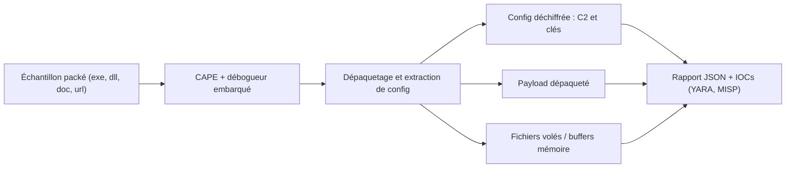

# CAPE — Extraction automatisée de configurations et de payloads

> [!info] **En 1 phrase**
> CAPE (Config And Payload Extraction) est la sandbox qui prolonge Cuckoo en dépaquetant automatiquement les malwares et en extrayant leurs configurations (C2, clés, fichiers volés) grâce à un débogueur embarqué.

---

## Overview

| Champ | Valeur |
|---|---|
| Nom complet | CAPE — Malware Configuration And Payload Extraction (CAPEv2) |
| Description | Sandbox dynamique dérivée de Cuckoo : exécution instrumentée d'échantillons, dépaquetage automatique par débogueur, extraction statique/dynamique des configurations (C2, clés, mutex, chemins de fichiers) |
| Catégorie | Malware & Sandbox |
| Sous-catégorie | Analyse dynamique automatisée — sandbox |
| Fonction principale | Exécuter un malware dans une VM jetable, dépaqueter le payload et extraire la configuration de la famille |
| Type d'outil | Framework / serveur (CLI + Web UI + API REST) |
| Licence | GPL-3.0 (à vérifier sur le dépôt) |
| Open source / propriétaire | Open source |
| Langage(s) de programmation | Python 3 (hôte et analyser), C (monitor/débogueur invité), JavaScript (UI web) |
| Développeur / organisation | Kevin O'Reilly (kevoreilly) ; contributions majeures d'Andriy Brukhovetskyy (doomedraven) et de la communauté |
| Projet officiel | kevoreilly/CAPEv2 |
| Dépôt officiel | https://github.com/kevoreilly/CAPEv2 |
| Documentation officielle | https://capev2.readthedocs.io/en/latest/ |
| Date de création | CAPE v1 : septembre 2016 (44CON) ; CAPEv2 (portage Python 3) : octobre 2019 |
| État du projet | actif |
| Dernière version connue | v2.5 (livre de documentation) ; développement continu sur la branche `master` |
| Systèmes compatibles | Hôte Linux (Ubuntu 22.04/24.04 recommandé) ; invité Windows 10 / Windows 11 23H2 |

> [!note] Pour vérifier / compléter
> CAPE hérite de Cuckoo v1 et reste compatible avec une grande partie de sa configuration. Depuis 2024, le projet **CAPEsolo** (également open source) propose une version Windows interactive sur bureau. La licence exacte (GPL-3.0) est à confirmer sur le fichier `LICENSE` du dépôt.

---

## Concept

CAPE est le **successeur maintenu de Cuckoo Sandbox** spécialisé dans l'extraction de configurations et de payloads. Là où Cuckoo se contente de décrire le comportement (appels API, fichiers, registre, réseau), CAPE exécute l'échantillon sous un **débogueur dans la VM Windows**, intercepte le saut du packer vers le code original (OEP) et extrait automatiquement : la configuration déchiffrée (URLs de C2, clés RC4/AES, mutex, noms de fichiers volés), les payloads dépaquetés et les données exfiltrées. C'est l'outil de référence du CTI pour les familles de banking trojans et de loaders (Emotet, Dridex, TrickBot, QakBot…).

Il se place **après le triage automatisé** : quand un échantillon est identifié comme malveillant, on le soumet à CAPE pour obtenir rapidement les IOCs précis (config C2, clés) sans analyse manuelle longue. Le framework conserve toute l'architecture Cuckoo (packages, signatures YARA, rapports JSON/HTML, Volatility, capture PCAP) et y ajoute le module de dépaquetage par débogueur, des scripts d'extraction par famille et une meilleure gestion des obfuscations. Côté infrastructure, CAPE s'appuie sur une pile de services : PostgreSQL (base), Elasticsearch (indexation), TCPDUMP (réseau), Suricata (optionnel), MISP (corrélation) et une VM Windows préparée avec l'agent et le débogueur. La soumission se fait par la web UI (port 8000) ou l'API REST v2 (`/apiv2`), ce qui permet de l'automatiser depuis un pipeline de triage. En 2026, CAPE ajoute le support complet de Windows 10 et de Windows 11 23H2 comme invités cibles.



---

## Concepts fondamentaux

| Concept | Explication |
|---|---|
| Sandbox (hôte / invité) | Architecture client-serveur : un hôte Linux orchestre (démon, base, web) et des VMs Windows jetables exécutent l'échantillon sous surveillance |
| Agent (agent.py) | Petit programme Python installé dans la VM Windows ; il reçoit les ordres de l'hôte, exécute l'échantillon et remonte les artefacts |
| Débogueur CAPE | Debugger embarqué dans l'invité (évite les interfaces de debugging de Microsoft pour rester discret) ; il détecte l'OEP, dépaquette et peut être piloté par des signatures YARA dynamiques |
| OEP (Original Entry Point) | Adresse où le code original reprend la main après dépaquetage ; point de dump pour reconstruire le binaire nu |
| Extraction de configuration | Modules `modules/processing/parsers/` qui déchiffrent la config (URL C2, clés AES/RC4, mutex, chemins) pour chaque famille connue |
| Packages (`exe`, `doc`, `dll`, `url`, `pdf`, `bin`, `extract`) | Wrappers Python qui déclenchent l'échantillon de la bonne manière (double-clic, ouverture dans Office, navigation) |
| Signatures | Règles YARA appliquées aux payloads dépaquetés + signatures comportementales sur les appels API + Suricata sur le PCAP |
| Capture réseau | `tcpdump` sur le réseau host-only ; le trafic sortant (DNS, HTTP) est conservé en PCAP pour analyse |
| Dump mémoire | L'image RAM de l'invité est sauvegardée et analysable avec Volatility 2/3 (processus cachés, payloads fileless) |
| API REST v2 (`/apiv2`) | Endpoints de soumission (file, URL), de listing des machines et de récupération des rapports — base de l'automatisation |
| Rooter | Service qui exécute les opérations root (règles iptables, capture) ; c'est le seul processus lancé en root |

---

## Installation

Installation sur une distribution Ubuntu/Debian **dédiée** (jamais sur une machine de production, jamais sur la machine d'analyse). Le dépôt fournit des scripts d'installation et une pile de services à démarrer :

```bash
# 0. Cloner le dépôt (récursif pour les sous-modules)
git clone --recursive https://github.com/kevoreilly/CAPEv2.git
cd CAPEv2

# 1. Services requis (PostgreSQL, Elasticsearch, capture, virtualisation)
sudo apt update
sudo apt install -y postgresql elasticsearch tcpdump suricata
sudo systemctl enable --now postgresql elasticsearch

# 2. Hyperviseur : KVM/QEMU recommandé (script fourni)
./kvm-qemu.sh

# 3. Script d'installation principal (dépendances, base, services, systemd)
./cape2.sh
```

> [!warning] Prérequis & problèmes potentiels
> - **Utilisateurs** : seul le **rooter** doit tourner en root ; tout le reste (démon, web) tourne sous l'utilisateur `cape`. Tout lancer en root casse les permissions.
> - **Guest** : installer `agent.py` (Python 3.7/3.8 **x86**) dans la VM Windows, configurer `conf/cuckoo.conf` (réseau host-only, chemin de stockage) et prendre un snapshot propre (nom exact déclaré dans `conf/virtualbox.conf` / `conf/qemu.conf`), sinon l'analyse échoue au démarrage.
> - **Isolation réseau** : la VM doit être sur un réseau host-only **sans accès Internet réel** ; les requêtes DNS sortantes faussent l'analyse.
> - **Python** : l'hôte est testé avec Python 3.10 et 3.12 ; dans l'invité, utiliser Python x86 comme indiqué dans la documentation.

### Docker

```bash
# Image communautaire (non officielle) : CAPE n'est pas conçu pour un usage
# conteneurisé simple ; privilégier l'installation sur VM dédiée.
docker pull blacktop/cape
```

### Compilation depuis les sources

```bash
# CAPE est du Python : pas de compilation. Les binaires natifs (monitor,
# débogueur) sont dans le dépôt et compilés par les scripts d'installation.
cd CAPEv2 && ls extra/
```

---

## Configuration

Toute la configuration se trouve dans le dossier `conf/` (fichiers `.conf` au format legacy INI, analogues à Cuckoo) :

| Paramètre | Rôle | Valeur possible | Impact | Exemple |
|---|---|---|---|---|
| `conf/cuckoo.conf` → `[cuckoo]` `machinery` | Moteur de virtualisation | `virtualbox`, `qemu`, `kvm` | Détermine comment les VMs sont pilotées | `machinery = kvm` |
| `conf/cuckoo.conf` → `ip` / `port` | Adresse de la web UI / API | `0.0.0.0:8000` | Expose l'interface de soumission | `ip = 0.0.0.0` |
| `conf/qemu.conf` ou `conf/virtualbox.conf` | Déclaration des VMs invitées | `label = win11`, `snapshot = clean` | Machine cible et snapshot à restaurer | `snapshot = cuckoo1` |
| `conf/auxiliary.conf` | Capteurs (tcpdump, sniffer, services) | `enabled = yes` | Active la capture réseau | `tcpdump = yes` |
| `conf/reporting.conf` | Modules de rapport (MISP, Elasticsearch, mmapped) | `enabled = yes` | Exporte les résultats | `[misp] enabled = yes` |
| `conf/processing.conf` | Modules d'analyse (virustotal, suricata, yara, cape) | `enabled = yes` | Active l'extraction CAPE | `[cape] enabled = yes` |
| `conf/routing.conf` | Routage réseau (VPN, Tor, InetSim) | `enabled = no` | Restreint/route le trafic invité | `[inetsim] enabled = yes` |
| `--options k=v` à la soumission | Options par échantillon | `unpack=1,extract=1` | Force dépaquetage et extraction | `python3 submit.py --options "unpack=1" sample.bin` |

> [!note] À vérifier
> Les noms exacts de clés varient selon les versions ; la documentation officielle (ReadTheDocs) liste chaque fichier `conf/*.conf` avec ses options. Toujours lire les fichiers de `conf/` avant de démarrer une instance.

---

## Architecture interne

CAPE reprend l'architecture de Cuckoo v1 et la prolonge. Les composants principaux :

- **`cuckoo.py`** : démon principal (orchestrateur). Il démarre le scheduler, les modules de traitement, la web UI (port 8000) et l'API REST v2.
- **`modules/processing/`** : analyse post-exécution des artefacts — signatures, network, behavior, virustotal, et surtout **`parsers/`** (extraction de config par famille de malware) et le module **`cape`** (dépaquetage).
- **`modules/reporting/`** : génération des rapports JSON/HTML, export MISP, indexation Elasticsearch.
- **`analyzer/`** : code déployé dans l'invité (analyse Windows) ; il charge l'échantillon, installe les hooks API et le débogueur.
- **`agent/agent.py`** : agent invité en Python qui dialogue avec l'hôte.
- **Débogueur CAPE** : instrumente le processus cible sans utiliser les interfaces de debug de Microsoft (Discord/Dtors via Detours remplacé par un hooking maison) ; il est programmable via des signatures YARA pour déclencher des dumps, des traces d'instructions ou des contournements d'anti-sandbox pendant la détonation.
- **Base de données** : PostgreSQL (métadonnées, tâches) ; **Elasticsearch** indexe les rapports pour la recherche.
- **Stockage** : `storage/analyses/<task_id>/` avec `files/`, `reports/`, `memory/`, `CAPE/` (artefacts extraits), `dump.pcap`.
- **Rooter** : gère les règles iptables/nftables pour l'isolation et la capture du réseau invité.

Flux d'une analyse : soumission (web/API/submit.py) → création de la tâche → restauration du snapshot VM → démarrage de l'agent → analyse instrumentée (hooks API + débogueur) → capture réseau parallèle → extraction CAPE → traitement (signatures, parsers) → rapport → nettoyage.

---

## Commandes

### Commandes principales

```bash
python3 cuckoo.py              # démarre le démon CAPE (web UI sur :8000)
python3 submit.py sample.exe   # soumission en ligne de commande
python3 submit.py -h           # aide complète des options
python3 cuckoo.py --debug      # mode verbeux pour diagnostiquer les VM
curl -s http://localhost:8000/apiv2/machines/list | jq .   # API REST : état des VM
```

| Commande | Objectif | Résultat attendu |
|---|---|---|
| `python3 cuckoo.py` | Démarrer le démon + web UI + API | Web UI sur `:8000`, files d'attente opérationnelles |
| `python3 submit.py <fichier>` | Soumettre un échantillon | Une tâche créée, numéro de task ID |
| `python3 cuckoo.py --debug` | Logs verbeux | Diagnostic des échecs de VM/agent |
| `curl .../apiv2/tasks/list` | Lister les tâches | JSON des tâches et de leur état |
| `curl .../apiv2/tasks/create/file` | Soumission via API (multipart) | JSON avec `task_id` |
| `python3 submit.py --options "extract=1" sample.bin` | Forcer l'extraction de config | Rapport enrichi de la section `CAPE` |
| `python3 cuckoo.py --clean` | Purger le stockage / BDD | Environnement reparti de zéro |

### Commandes avancées

```bash
# Soumission avec timeout, machine et package explicites
python3 submit.py --timeout 180 --machine win11 --package exe sample.bin
# Analyse d'un document Office (package doc) avec dump mémoire
python3 submit.py --package doc --options "extract=1" facture.doc
# Soumission d'une URL (package url)
python3 submit.py --package url "http://example.com/payload.bin"
# Soumission d'un script d'extraction maison pour une famille inconnue
python3 submit.py --custom /opt/parsers/mon_famille.py sample.bin
```

---

## Options et flags

| Option | Description | Exemple | Niveau |
|---|---|---|---|
| `--timeout <s>` | Durée maximale d'analyse de l'échantillon | `submit.py --timeout 120 sample.exe` | Basic |
| `--package <pack>` | Package à utiliser (`exe`, `doc`, `dll`, `url`, `pdf`, `bin`, `extract`, `jar`) | `submit.py --package doc f.xls` | Basic |
| `--options k=v` | Options passées au package (ex. `unpack=1`, `extract=1`, `null=1`) | `submit.py --options "unpack=1,extract=1" s.bin` | Basic |
| `--machine <nom>` | Choisir la VM cible | `submit.py --machine win11 s.exe` | Intermediate |
| `-d` | Traiter l'échantillon comme une DLL | `submit.py -d s.dll` | Intermediate |
| `--max <n>` | Nombre d'analyses parallèles | `submit.py --max 4 s.exe` | Intermediate |
| `--custom <script>` | Script d'extraction personnalisé pour une famille | `submit.py --custom parser.py s.exe` | Advanced |
| `--memory` | Activer la prise de dump mémoire (Volatility) | `submit.py --memory s.exe` | Advanced |
| `--free` | Soumission immédiate sans file d'attente | `submit.py --free s.exe` | Intermediate |
| `--enforce_timeout` | Forcer le timeout même si l'échantillon se termine | `submit.py --enforce_timeout s.exe` | Expert |
| `--priority <n>` | Priorité de la tâche | `submit.py --priority 1 s.exe` | Advanced |
| `--remote <api>` | Soumettre à une instance distante | `submit.py --remote http://cape:8000 s.exe` | Expert |

> [!note] À vérifier
> Les options exactes de `submit.py` peuvent varier entre versions ; la liste fiable est obtenue avec `python3 submit.py -h`. Les options d'API v2 sont documentées sur ReadTheDocs.

> [!tip] Options les plus utiles au quotidien
> `--options "unpack=1,extract=1"` (dépaquetage + extraction), `--timeout 180` (laisser le malware respirer), `--package doc/url` (bons déclencheurs), `--custom` (familles inconnues), `--memory` (payloads fileless).

---

## Exemples pratiques

### Beginner

```bash
# 1. Vérifier que le démon tourne et que les VM sont disponibles
curl -s http://localhost:8000/apiv2/machines/list | jq '.machines[] | {name, status}'
# 2. Soumettre un premier échantillon
python3 submit.py /opt/malware/sample.exe
# 3. Récupérer le rapport JSON de la dernière analyse
ls -t storage/analyses/ | head -1
jq '.cape, .network, .behavior.summary' storage/analyses/$(ls -t storage/analyses | head -1)/reports/report.json
```

### Intermediate

```bash
# Document Office : le package doc ouvre le fichier dans Word pour déclencher la macro
python3 submit.py --package doc --options "extract=1" /tmp/2026-08-facture.doc
# Analyser le PCAP capturé pour voir le C2
tcpdump -r storage/analyses/$(ls -t storage/analyses | head -1)/dump.pcap -A | grep -i "host:\|User-Agent"
```

### Advanced

```bash
# Loader packé : forcer le dépaquetage et lire la config extraite
python3 submit.py --options "unpack=1,extract=1" /opt/malware/loader.bin
cat storage/analyses/$(ls -t storage/analyses | head -1)/CAPE/*.json | jq .
# Puis re-analyse du payload nu extrait
unzip -o storage/analyses/$(ls -t storage/analyses | head -1)/CAPE/payload.zip -d /tmp/unpacked/
sha256sum /tmp/unpacked/*
```

### Expert

```bash
# Dump mémoire + analyse Volatility 3 du processus injecté
python3 submit.py --memory --options "null=1" sample.exe
MEM=storage/analyses/$(ls -t storage/analyses | head -1)/memory/memory.dmp
vol3 -f "$MEM" windows.malfind
vol3 -f "$MEM" windows.pslist | grep -i suspect
# Soumission via l'API pour la CI
TASK=$(curl -s -F "file=@sample.exe" http://localhost:8000/apiv2/tasks/create/file | jq -r .task_id)
curl -s http://localhost:8000/apiv2/tasks/get/report/$TASK | jq '.network.domains'
```

---

## Workflow complet (scénario pas à pas)

1. **Lancer la stack** — démarrer le démon et vérifier que la VM est détectée comme disponible (state « available ») dans l'UI web.

   ```bash
   python3 cuckoo.py &
   curl -s http://localhost:8000/apiv2/machines/list | jq .machines[].status
   ```

2. **Soumettre l'échantillon** — activer l'extraction de config et le dépaquetage.

   ```bash
   python3 submit.py --timeout 180 --options "unpack=1,extract=1" sample.bin
   ```

3. **Suivre l'analyse** — l'UI web montre les étapes ; CAPE annote le rapport avec les tentatives de dépaquetage et les artefacts extraits.

4. **Exploiter les extractions** — le dossier `storage/analyses/<id>/CAPE/` contient configs, payloads et fichiers volés ; les rapports JSON contiennent la section dédiée.

   ```bash
   jq '.cape' storage/analyses/$(ls -t storage/analyses | head -1)/reports/report.json
   ```

5. **Croiser le réseau** — ouvrir `dump.pcap` dans Wireshark pour valider le C2 découvert par la config.

6. **Publier les IOCs** — pousser C2, clés et hash des payloads vers MISP/OpenCTI, rédiger une règle YARA, alerter le SOC.

---

## Scénarios avancés

### Scénario 1 : Extraction de la config d'un loader

Analyser un binaire packé et récupérer directement la configuration déchiffrée (URL C2, clé de déchiffrement) :

```bash
python3 submit.py --options "unpack=1" /opt/malware/loader.bin
# lire la config extraite
cat storage/analyses/$(ls -t storage/analyses | head -1)/CAPE/*.json
# identifier la famille via les signatures
jq '.signatures[].description' storage/analyses/$(ls -t storage/analyses | head -1)/reports/report.json
```

### Scénario 2 : Re-analyse du payload dépaqueté

Après dépaquetage, le payload nu est extrait : le hasher, le soumettre à YARA/VirusTotal et le ré-analyser proprement.

```bash
python3 submit.py /opt/malware/packed.exe
unzip -o storage/analyses/*/CAPE/payload.zip -d /tmp/unpacked/
sha256sum /tmp/unpacked/*
yara /opt/rules/malware.yar /tmp/unpacked/*
python3 submit.py --options "null=1" /tmp/unpacked/*.exe
```

### Scénario 3 : Automatisation via l'API REST v2

Intégrer CAPE dans un pipeline de triage : soumission et récupération du rapport sans interface.

```bash
TASK=$(curl -s -F "file=@/opt/malware/sample.exe" http://localhost:8000/apiv2/tasks/create/file | jq -r .task_id)
sleep 300
curl -s http://localhost:8000/apiv2/tasks/get/report/$TASK | jq '.cape, .network'
```

### Scénario 4 : Étude d'un document avec dropper (package doc)

```bash
python3 submit.py --package doc --options "extract=1" /tmp/piece-jointe.doc
ID=$(ls -t storage/analyses | head -1)
ls storage/analyses/$ID/files/ | while read f; do sha256sum "storage/analyses/$ID/files/$f"; done
```

### Scénario 5 : Contournement d'anti-sandbox par YARA dynamique

CAPE peut programmer son débogueur via des signatures YARA : détecter un check d'hyperviseur et répondre à la place du malware pour poursuivre la détonation.

```yaml
rule AntiSandbox_QueryFirmwareTable {
    strings:
        $a = "QuerySystemFirmwareTable" ascii
        $b = { 4C 89 4C 24 20 } /* Signature d'appel typique */
    condition:
        $a or $b
}
```

> [!note] À vérifier
> Le mécanisme de « dynamic YARA bypass » est documenté dans la README de CAPEv2 ; la syntaxe exacte des règles pilotant le débogueur évolue et doit être validée sur la branche `master`.

---

## Cybersecurity use cases

| Phase | Utilisation |
|---|---|
| Analyse de malware (triage) | Détection automatisée de la malveillance : signatures, comportement, réseau |
| CTI / Threat Intelligence | Extraction des configurations C2, clés et IOCs par famille |
| Reverse engineering | Dépaquetage automatique avant analyse manuelle (x64dbg, Ghidra) |
| Investigation (DFIR) | Dump mémoire + Volatility pour les payloads fileless |
| Sécurité offensive (lab) | Émulation d'un environnement d'exécution pour observer des malwares ciblés |
| Corrélation (MISP/OpenCTI) | Publication automatique des IOCs extraits dans les plateformes de partage |

---

## MITRE ATT&CK

| Tactique | Technique / Sub-technique | ID | Raison | Détection | Mitigation |
|---|---|---|---|---|---|
| Execution | User Execution : Malicious File | T1204.002 | L'échantillon est exécuté dans la sandbox ; vecteur typique des campagnes | Triage e-mail, sandboxing | Contrôles d'exécution, restrictions d'accès |
| Execution | Command and Scripting Interpreter : Windows Command Shell | T1059.003 | Les loaders invoquent `cmd.exe`/`powershell.exe` ; observable dans les traces API | Sysmon EventID 1, EDR | AppLocker, AMSI, logs détaillés |
| Defense Evasion | Deobfuscate/Decode Files or Information | T1140 | Le débogueur CAPE dépaquette et déchiffre les payloads | Détection de la chaîne de dépaquetage | Analyse statique + sandbox |
| Defense Evasion | Obfuscated Files or Information | T1027 | Packers et crypters détectés lors du dépaquetage | YARA sur payloads dépaquetés | Mise à jour des signatures |
| Defense Evasion | Process Injection | T1055 | Comportement d'injection observé et tracé par les hooks API | Sysmon EventID 8/10 | Restriction des APIs d'injection |
| Execution | Native API | T1106 | Appels directs `VirtualAlloc`, `CreateRemoteThread` tracés | EDR, hooks kernel | Contrôle d'intégrité, PPL |
| Command & Control | Application Layer Protocol | T1071 | Configs extraites révèlent les canaux C2 (HTTP, HTTPS, DNS) | NDR/IPS sur le PCAP | Filtrage sortant, liste de domaines |
| Collection | Data from Local System | T1005 | Fichiers volés capturés dans l'extraction (exfiltration simulée) | Monitoring des accès fichiers | Segmentation, chiffrement |

> [!note] Ne renseigner que si l'association est réellement pertinente.
> CAPE est un **outil d'observation** : les techniques listées sont celles que la sandbox permet de détecter/étudier sur les échantillons, pas des techniques mises en œuvre par CAPE lui-même.

---

## Defensive Security

### Signes observables

| Indicateur | Détail |
|---|---|
| Config extraite avec URL/domaines de C2 | Bloquer les domaines/IP, les ajouter aux listes de menaces et les partager via MISP |
| Payload dépaqueté identifié comme famille connue (YARA) | Corréler avec le threat intel, rédiger des règles Sigma/EDR |
| Échantillon qui résiste au dépaquetage (section CAPE vide) | Passer à l'analyse manuelle (x64dbg, Ghidra) et augmenter le timeout |
| Clés ou fichiers volés récupérés dans l'extraction | Alerter les entités concernées, surveiller la fuite de données |
| Trafic DNS/HTTP sortant de la VM pendant l'analyse | Restreindre la VM sur un réseau host-only sans Internet réel |
| PCAP contenant un téléchargement de payload | Extraire le binaire, le hasher, le re-soumettre en sandbox |

### Règles de détection (Sigma / Suricata / Snort / YARA)

```yaml
# Sigma — Windows : exécution d'outils d'injection/dépaquetage dans la VM (exemple)
title: Debugger And Unpacking Tools Execution
logsource:
    category: process_creation
    product: windows
detection:
    selection:
        Image|endswith:
            - 'x64dbg.exe'
            - 'x32dbg.exe'
            - 'ollydbg.exe'
    condition: selection
level: medium
```

```bash
# Suricata/Snort — alerte sur un User-Agent de téléchargeur connu depuis la VM
alert tcp any any -> any any (msg:"Potential malware downloader from sandbox"; content:"Mozilla/5.0|20|malware-sample"; sid:9500001; rev:1;)
```

---

## Automatisation

```bash
# Bash — boucle de soumission d'un dossier d'échantillons
for f in /opt/malware/*.bin; do
    echo "== $f =="
    python3 submit.py --timeout 180 --options "unpack=1" "$f"
done
```

```python
# Python — soumission + attente du rapport via l'API REST v2
import json, time, urllib.request

API = "http://localhost:8000/apiv2"
data = {"file": open("/opt/malware/sample.exe", "rb")}

req = urllib.request.Request(f"{API}/tasks/create/file", data=..., method="POST")
# En pratique : utiliser requests avec multipart, puis poller /tasks/view
task_id = 42
while True:
    with urllib.request.urlopen(f"{API}/tasks/view/{task_id}") as r:
        status = json.load(r)["task"]["status"]
    if status == "reported":
        break
    time.sleep(10)
```

> [!note] À vérifier
> L'exemple Python est un squelette pédagogique : utiliser la bibliothèque `requests` avec un vrai multipart pour l'envoi (`files={"file": open(...)}`).

---

## Output et parsing

CAPE produit un rapport **JSON** (report.json), une version **HTML** (lisible dans la web UI) et des artefacts bruts dans `storage/analyses/<id>/` :

- `reports/report.json` — tout : behavior, network, signatures, section `cape`.
- `CAPE/` — configs extraites (JSON), payloads dépaquetés (zip), fichiers volés.
- `memory/memory.dmp` — image RAM si dump activé.
- `dump.pcap` — capture réseau complète.
- `files/` — fichiers créés/supprimés pendant l'analyse (droppers téléchargés).

```bash
# Extraire les domaines C2 depuis le rapport
jq -r '.network.domains[].domain' report.json | sort -u
# Extraire la config CAPE (C2, clés) en un seul objet
jq '.cape' report.json
# Résumer les signatures YARA déclenchées
jq '.signatures[] | select(.type=="yara") | .name' report.json
```

```python
# Python — parsing du rapport pour alimenter un SIEM
import json, hashlib

with open("report.json") as f:
    report = json.load(f)

for d in report.get("network", {}).get("domains", []):
    print("DOMAIN", d["domain"])
for sig in report.get("signatures", []):
    if sig.get("type") == "yara":
        print("YARA", sig["name"])
```

---

## Intégrations

- [[Tools| Outils]] global
- [[Outil - Cuckoo Sandbox]] — l'ancêtre dont CAPE hérite (architecture, packages, API)
- [[Outil - Volatility]] — analyse des dumps mémoire produits par CAPE
- [[Outil - YARA]] — signatures de classification des payloads dépaquetés
- [[Outil - x64dbg]] — analyse manuelle quand CAPE n'arrive pas à dépaqueter
- [[Outil - Ghidra]] — analyse statique du payload extrait
- [[Outil - MISP]] — publication automatique des IOCs extraits
- [[Outil - REMnux]] — distribution complémentaire pour l'analyse d'échantillons
- [[Outil - Wireshark]] / [[Outil - tshark]] — validation du PCAP capturé
- [[Outil - Suricata]] — analyse IDS du trafic capturé (module optionnel)
- [[09 - Reverse Engineering & Malware| Reverse Engineering & Malware]]

```text
Pipeline d'analyse → CAPE (sandbox) → config C2 + payload → YARA / VirusTotal → MISP → SOC
```

---

## Alternatives

| Outil | Avantages | Inconvénients | Cas d'usage |
|---|---|---|---|
| Cuckoo Sandbox | Historique, documentation abondante | Non maintenu (archivé), pas d'extraction de configs | Reprises pédagogiques, héritage |
| CAPEsolo | CAPE en version desktop Windows interactive | Jeune, moins d'automatisation | Analyse manuelle en VM Windows |
| Any.Run / Hybrid Analysis | Cloud, UI web, aucun déploiement | Soumission de malwares vers un tiers (confidentialité), quotas | Triage rapide ponctuel |
| Joe Sandbox | Analyse très profonde, familles nombreuses | Propriétaire, coûteux | SOCs disposant d'un budget |
| malwoverview / Viper | Légers, scripts, gestion de corpus | Pas d'exécution ni de dépaquetage | Triage statique, gestion de collection |
| DRAKVUF | In-the-wild, instrumentation virtuelle Xen | Complexe, axé Linux | Analyse de malwares Linux |

> **Quand utiliser CAPE plutôt que Cuckoo ?** Toujours : CAPE est maintenu, dépaquette et extrait les configurations — Cuckoo ne sait plus gérer les familles actuelles. Garder Cuckoo uniquement pour l'étude historique de l'architecture.

---

## Performance

- Débit limité par le nombre de VMs et la ressource hyperviseur : chaque analyse consomme une VM (2-4 Go RAM conseillés par invité Windows).
- Parallélisation : `submit.py --max N` (ou le paramètre `max_analysis_count` du scheduler) lance plusieurs analyses simultanées.
- Le dépaquetage par débogueur ajoute une surcharge CPU dans l'invité (instrumentation à chaque instruction surveillée).
- Le volume de stockage grossit vite : chaque tâche garde PCAP, fichiers et parfois dumps mémoire (plusieurs Go par analyse). Prévoir un nettoyage (`python3 cuckoo.py --clean` ou rétention sur les volumes).
- Elasticsearch indexe les rapports ; sa taille dépend du nombre de tâches conservées.

> [!note] À vérifier
> Les chiffres de capacité dépendent du matériel (CPU, RAM, disque) et de la version. Les ordres de grandeur ci-dessus sont issus de la documentation et de retours d'usage communautaires.

---

## Troubleshooting

### Common problems

#### Problème : « Timeout hit for machine to change status »

- **Cause** : la VM n'a pas atteint l'état disponible avant le délai (snapshot absent, IP non configurée).
- **Solution** : vérifier le snapshot déclaré dans `conf/qemu.conf`/`conf/virtualbox.conf`, que l'agent tourne dans l'invité et que l'IP correspond au réseau host-only.
- **Vérification** : `curl -s http://localhost:8000/apiv2/machines/list | jq .machines[]` puis relancer une analyse.

#### Problème : rapport sans section CAPE (aucune extraction)

- **Cause** : le débogueur ne tourne pas dans la VM (agent sans droits admin, Python x64 au lieu de x86) ou le packer résiste.
- **Solution** : vérifier les logs de l'analyzer dans l'UI, relancer avec `--timeout` plus long, puis passer en analyse manuelle.
- **Vérification** : `jq '.cape' report.json` doit renvoyer un objet non vide.

#### Problème : les requêtes DNS sortent vers Internet réel

- **Cause** : la VM est sur un réseau avec accès Internet ou le rooter ne filtre pas.
- **Solution** : configurer le réseau host-only sans passerelle, activer le rooter, éventuellement `conf/routing.conf` avec InetSim.
- **Vérification** : `tcpdump -i <iface_host_only>` et observation des réponses.

#### Problème : erreurs de permission « Operation not permitted »

- **Cause** : des processus CAPE tournent en root au lieu de l'utilisateur `cape`.
- **Solution** : relancer uniquement le rooter en root, le reste sous `cape` (les scripts `cape2.sh` créent les services systemd adéquats).
- **Vérification** : `systemctl status cape*` et `ps aux | grep -E "cape|cuckoo"`.

#### Problème : Elasticsearch/PostgreSQL non joignables au démarrage

- **Cause** : services non démarrés ou version incohérente.
- **Solution** : `sudo systemctl enable --now postgresql elasticsearch` puis vérifier les ports (5432, 9200).
- **Vérification** : `curl -s localhost:9200/_cat/health`.

---

## Sécurité de l'outil

- **Isolation** : CAPE exécute du code malveillant. Ne jamais installer le démon sur une machine de production ; utiliser un réseau host-only sans Internet réel.
- **Privilèges** : seul le rooter doit tourner en root. L'invité a besoin de droits admin pour l'agent, mais reste cloisonné dans la VM.
- **Accès à l'API** : la web UI/API v2 n'a pas d'authentification par défaut — ne pas l'exposer hors du réseau d'analyse, ou placer un reverse-proxy avec contrôle d'accès.
- **MISP** : la clé API MISP est stockée dans `conf/reporting.conf` ; protéger ce fichier (chmod 600, hors versionnage).
- **Échantillons sensibles** : le stockage contient des malwares vivants ; le protéger et l'isoler (volume dédié, sauvegarde chiffrée).
- **Télémétrie** : CAPE ne fait pas de phoning home, mais l'UI expose les tâches ; restreindre l'accès réseau de l'hôte lui-même.
- **Mises à jour** : tirer régulièrement `master` (dépôt actif) et relancer `cape2.sh` pour les signatures et parsers.

---

## Limitations

- CAPE n'extrait que ce qu'il arrive à dépaqueter : les packers/crypters maison ou anti-debug exigent un travail manuel sous x64dbg.
- Les parsers de configuration sont spécifiques à chaque famille et se cassent à chaque nouvelle version de malware ; il faut les maintenir.
- Un réseau mal isolé laisse le malware résoudre un vrai DNS et fausser la config extraite.
- Les invités Windows détectent la sandbox (MAC, BIOS, hostname) : de nombreux échantillons ne détonnent pas complètement.
- L'installation est lourde (VM dédiée, hyperviseur, PostgreSQL, Elasticsearch) et sensible aux erreurs de configuration.
- Le débogueur CAPE est conçu pour Windows x86/x64 ; l'analyse de malwares Linux/ARM (firmwares) sort de son périmètre.
- Analyse en profondeur du temps : un timeout trop court rate les étapes lentes (téléchargements, délais d'activation).

---

## Cheatsheet

```bash
# Démarrer le démon
python3 cuckoo.py

# Soumettre un échantillon simple
python3 submit.py sample.exe

# Soumettre avec dépaquetage + extraction de config
python3 submit.py --options "unpack=1,extract=1" sample.bin

# Soumettre un document Office
python3 submit.py --package doc /tmp/facture.doc

# Soumettre une URL
python3 submit.py --package url "http://example.com/payload"

# Soumettre une DLL
python3 submit.py -d payload.dll

# Lister les machines disponibles via l'API
curl -s http://localhost:8000/apiv2/machines/list | jq .machines[].status

# Récupérer le rapport JSON de la dernière analyse
jq '.' storage/analyses/$(ls -t storage/analyses | head -1)/reports/report.json

# Extraire la config CAPE
jq '.cape' storage/analyses/$(ls -t storage/analyses | head -1)/reports/report.json

# Re-analyser le payload dépaqueté
unzip -o storage/analyses/*/CAPE/payload.zip -d /tmp/unpacked/
sha256sum /tmp/unpacked/*

# Nettoyer les analyses terminées
python3 cuckoo.py --clean
```

---

## Quick reference

| | |
|---|---|
| **À quoi sert-il ?** | Exécuter un malware en sandbox, le dépaqueter et extraire sa configuration (C2, clés) automatiquement |
| **Quand l'utiliser ?** | Après un triage positif, pour obtenir les IOCs précis d'un échantillon malveillant |
| **Commande principale** | `python3 submit.py --options "unpack=1,extract=1" sample.bin` |
| **Alternative principale** | Any.Run / Joe Sandbox (cloud) · CAPEsolo (desktop Windows) |
| **Concepts importants** | Débogueur CAPE, OEP, packages, parsers de config, API v2, réseau host-only |
| **Liens associés** | [[Outil - Cuckoo Sandbox]] · [[Outil - Volatility]] · [[Outil - YARA]] · [[Outil - x64dbg]] |

---

## Détection & Défense

| Signe | Défense |
|---|---|
| Config extraite avec URL/domaines de C2 | Bloquer les domaines/IP, les ajouter aux listes de menaces et les partager via MISP |
| Payload dépaqueté identifié comme famille connue (YARA) | Corréler avec le threat intel, rédiger des règles Sigma/EDR |
| Échantillon qui résiste au dépaquetage (report CAPE vide) | Passer à l'analyse manuelle (x64dbg, Ghidra) et augmenter le timeout |
| Clés ou fichiers volés récupérés dans l'extraction | Alerter les entités concernées, surveiller la fuite de données |
| Trafic DNS/HTTP sortant de la VM pendant l'analyse | Restreindre la VM sur un réseau host-only sans Internet réel |

---

## Tips & Pièges

> [!tip] **Tips**
> - Gardez la VM Windows avec un snapshot propre et restaurez-le à chaque analyse : le dépaquetage par debugger laisse des traces qui faussent les analyses suivantes.
> - Écrivez des scripts d'extraction `--custom` pour les nouvelles familles : ils automatiseront la sortie des clés et C2.
> - Couplez CAPE avec un dump mémoire (`--memory`) : certains payloads chargés en mémoire ne sont visibles qu'avec Volatility.
> - Utilisez `jq` sur `report.json` dès la sortie de l'analyse : la web UI est confortable, mais le JSON est exploitable par script.
> - Vérifiez la section anti-sandbox du rapport : un échantillon qui détecte la VM produit une analyse vide sans être innocent.

> [!warning] **Pièges**
> - CAPE n'extrait que ce qu'il arrive à dépaqueter : les packers/crypters maison ou anti-debug demandent un travail manuel sous x64dbg.
> - Un réseau mal isolé laisse le malware résoudre un vrai DNS et fausser la config extraite : restez sur un réseau host-only sans Internet.
> - Si le rapport n'a pas de section CAPE, vérifiez que le debugger tourne réellement dans la VM (droits admin de l'agent) avant de conclure à une résistance du malware.
> - Ne pas exposer la web UI/API hors du réseau d'analyse : elle n'a pas d'authentification par défaut.

---

## References

### Official

- Documentation officielle (CAPE Sandbox Book) : https://capev2.readthedocs.io/en/latest/
- GitHub officiel (CAPEv2) : https://github.com/kevoreilly/CAPEv2
- README / historique du projet : https://github.com/kevoreilly/CAPEv2/blob/master/README.md
- Dépôt communautaire des signatures : https://github.com/CAPESandbox/community
- CAPEsolo (version desktop) : https://github.com/CAPESandbox/CAPEsolo

### Security references

- MITRE ATT&CK T1204 — User Execution : https://attack.mitre.org/techniques/T1204/
- MITRE ATT&CK T1059.003 — Windows Command Shell : https://attack.mitre.org/techniques/T1059/003/
- MITRE ATT&CK T1140 — Deobfuscate/Decode Files or Information : https://attack.mitre.org/techniques/T1140/
- MITRE ATT&CK T1071 — Application Layer Protocol : https://attack.mitre.org/techniques/T1071/
- CAPE Sandbox : détection/config extraction (blog Endure Secure, 2024) : https://endsec.au/blog/building-an-automated-malware-sandbox-using-cape

### Community

- Dossier Cuckoo — lien avec l'héritage : https://github.com/cuckoosandbox/cuckoo
- Article « What is CAPE Sandbox » (VirusTotal/community) : https://capev2.readthedocs.io/en/latest/introduction/what.html
- Guide d'installation pas à pas (community) : https://endsec.au/blog/building-an-automated-malware-sandbox-using-cape

---

**Liens :** [[Tools| Outils]] · [[Outils/Outil - Cuckoo Sandbox| Cuckoo Sandbox]] · [[Outils/Outil - Volatility| Volatility]] · [[Outils/Outil - YARA| YARA]] · [[Outils/Outil - x64dbg| x64dbg]] · [[Techniques/09 - Reverse Engineering & Malware| Reverse Engineering & Malware]] · [[Outil - MISP]] · [[Outil - REMnux]]
