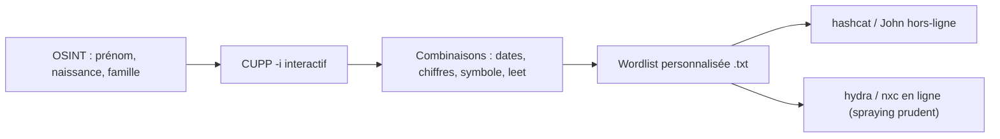

# CUPP — Profiling de mots de passe personnalisés

> [!info] **En 1 phrase**
> CUPP interroge une série de questions sur la cible (nom, naissance, enfants, animaux, ville...) et génère des milliers de mots de passe probables, personnalisés pour une victime précise.

---

## Overview

| Champ | Valeur |
|---|---|
| Nom complet | CUPP — Common User Passwords Profiler |
| Description | Générateur de wordlists personnalisées à partir du profil d'une victime (OSINT) ou d'un dictionnaire existant |
| Catégorie | Wordlists & Générateurs |
| Sous-catégorie | Profiling / social engineering d'authentification |
| Fonction principale | Combiner des informations personnelles en candidats de mots de passe probables |
| Type d'outil | CLI (script Python) |
| Licence | GPL-3.0 (ou ultérieure) |
| Open source / propriétaire | Open source |
| Langage(s) de programmation | Python 3 |
| Développeur / organisation | Muris Kurgas (aka j0rgan) — dépôt maintenu par Mebus |
| Projet officiel | https://github.com/Mebus/cupp |
| Dépôt officiel | https://github.com/Mebus/cupp |
| Documentation officielle | https://github.com/Mebus/cupp#readme |
| Date de création | ~2009 (importé sur GitHub depuis remote-exploit.org) |
| État du projet | maintenu (version 3.3.1) |
| Dernière version connue | 3.3.1 |
| Systèmes compatibles | Linux / macOS / Windows (tout système avec Python 3) |

> [!note] Pour vérifier / compléter
> Pas de version packagée officielle (apt/pip) : le projet se déploie uniquement par `git clone`.

---

## Concept

CUPP exploite un biais humain documenté depuis les années 2000 : la majorité des mots de passe sont construits à partir d'informations personnelles faciles à mémoriser — prénom, nom, surnom, date de naissance, conjoint, enfants, animal, entreprise, mot-clé. Là où une wordlist générique (rockyou, SecLists) suppose que la victime a utilisé un mot commun, CUPP suppose qu'elle a utilisé **ses propres données**. Cette hypothèse, associée à l'OSINT public (LinkedIn, réseaux sociaux, sites d'entreprise), donne un taux de succès élevé sur un petit nombre de candidats, ce qui la rend idéale pour le password spraying discret plutôt que pour du bruteforce massif.

Le script est né chez Muris Kurgas (j0rgan) sur remote-exploit.org, distribué sous forme de tarball `cupp-3.0.tar.gz`, puis importé sur GitHub par Mebus pour permettre le développement collaboratif. En mode interactif (`-i`), il pose une série de questions et construit un profil ; en mode `-w`, il améliore un dictionnaire existant en posant les mêmes questions de concaténation. Les mots inversés sont toujours générés, car inverser son mot de passe est un réflexe courant chez les utilisateurs qui veulent « le cacher ».



---

## Concepts fondamentaux

| Concept | Explication |
|---|---|
| Biais de mémorabilité | Un mot de passe fort doit être mémorisé : l'utilisateur le dérive donc d'éléments déjà connus (noms, dates), prévisible par profiling |
| OSINT | Collecte de données publiques sur la cible ; la qualité de l'OSINT détermine la qualité de la wordlist CUPP |
| Profil de victime | Ensemble des réponses : prénom, nom, surnom, naissance (DDMMYYYY), conjoint, enfant, animal, entreprise, mots-clés |
| Concaténation | Assemblage de plusieurs champs (`prenom+nom`, `prenom+annee`, `surnom_conjoint`) pour imiter les constructions usuelles |
| Années de référence | Plage d'années configurable (défaut 1990-2022) combinée aux mots (`jean1998`, `sara_2015`) |
| Nombres aléatoires | Suffixes numériques 0-100 par défaut (`jean42`, `milo07`) |
| Caractères spéciaux | Suffixes `!`, `@`, `#`, `$`, `%`, `&`, `*` — seuls, doublés ou triplés (`acme!!`, `nina$$`) |
| Leet (1337) | Substitution de lettres (`a→4`, `e→3`, `i→1`, `o→0`, `s→5`, `t→7`) appliquée en option |
| Mots inversés | Variantes `[::-1]` (prenom, surnom, conjoint, enfant) toujours incluses dans la génération |
| Filtrage de longueur | Plage wcfrom-wcto (défaut 5-12) : les candidats hors bornes sont exclus |

---

## Installation

### Debian / Ubuntu / Kali Linux

```bash
git clone https://github.com/Mebus/cupp.git
cd cupp
python3 cupp.py -h
```

### Arch Linux

```bash
git clone https://github.com/Mebus/cupp.git
cd cupp
python3 cupp.py -h
```

### Fedora / RHEL

```bash
git clone https://github.com/Mebus/cupp.git
cd cupp
python3 cupp.py -h
```

### macOS

```bash
git clone https://github.com/Mebus/cupp.git
cd cupp
python3 cupp.py -h
```

### Windows

```powershell
git clone https://github.com/Mebus/cupp.git
cd cupp
python cupp.py -i
```

### Docker

Pas d'image officielle. Alternative légère :

```bash
docker run -it --rm -v ${PWD}:/out -w /out python:3-slim \
  bash -c "git clone https://github.com/Mebus/cupp.git /tmp/cupp && python3 /tmp/cupp/cupp.py -i"
```

### Compilation depuis les sources

```bash
git clone https://github.com/Mebus/cupp.git && cd cupp
python3 cupp.py --help
```

> [!warning] Prérequis & problèmes potentiels
> Python 3 requis (le code est écrit pour Python 3, incompatible avec Python 2). Le script doit être lancé depuis le dossier du dépôt (il charge `cupp.cfg` situé à côté de `cupp.py`) — sinon erreur « Configuration file cupp.cfg not found ».

---

## Configuration

Fichier `cupp.cfg` (dans le dépôt). CUPP le lit mais ne le modifie jamais. Tous les réglages conditionnent le volume et la forme des candidats générés.

| Paramètre | Rôle | Valeur par défaut | Impact | Exemple |
|---|---|---|---|---|
| `[years] years` | Années combinées aux mots | 1990-2022 | Plus de candidats type `prenom2010` | `years = 2020,2021,2022` |
| `[leet] a/i/e/t/o/s/g/z` | Cartographie leet | `a=4 i=1 e=3 t=7 o=0 s=5 g=9 z=2` | Remplacée si leet activé | `a=@` |
| `[specialchars] chars` | Caractères ajoutés en suffixe | `! @ # $ % & *` | Suffixes de 1, 2 ou 3 caractères | `chars=!,@,#,!` |
| `[nums] from / to` | Bornes des nombres ajoutés | `0` à `100` | Nombre de variantes numériques | `from=1970 to=2024` |
| `[nums] wcfrom / wcto` | Longueur min/max des mots retenus | `5` / `12` | Filtre final de la wordlist | `wcfrom=8 wcto=15` |
| `[nums] threshold` | Taille max autorisée pour la concaténation `-w` | `200` | Limite l'explosion combinatoire | `threshold=100` |
| `[alecto] alectourl` | URL du CSV Alecto (défauts user/pass) | copie GitHub Hammer | Source de `-a` | URL du CSV gzip |
| `[downloader] dicturl` | Référentiel des wordlists `-l` | ftp.funet.fi (dictionnaires crack) | Source de `-l` | URL FTP/HTTP |

---

## Architecture interne

CUPP est un script Python unique (`cupp.py`) de moins de mille lignes, sans dépendance externe (stdlib uniquement : `argparse`, `configparser`, `csv`, `gzip`, `urllib`). Au démarrage, `read_config()` charge `cupp.cfg` dans le dictionnaire global `CONFIG`, puis `main()` affiche la bannière ASCII (la vache `cupp.py!`) sauf en mode `-q`.

Les deux moteurs de génération partagent la même logique :

- `generate_wordlist_from_profile(profile)` (mode `-i`) — assemble les champs : variantes en `title()` (première lettre majuscule), mots inversés `[::-1]`, fragmentations de dates (YY, YYY, YYYY, DD, MM, et concaténations à 2 et 3 morceaux), combinaisons `komb()` (mot + mot, mot + année, mot + date, mot + suffixe), séparateur `_`, nombres `concats()` dans `from..to`, caractères spéciaux jusqu'à 3 concaténés, puis conversion leet optionnelle.
- `improve_dictionary(fichier)` (mode `-w`) — interroge en Y/N sur concaténation de tous les mots, caractères spéciaux, nombres aléatoires et leet, puis combine le dictionnaire d'entrée de la même façon.

Dans les deux cas : tri, déduplication via `dict.fromkeys()` (préserve l'ordre), filtre de longueur `wcfrom`/`wcto`, puis écriture avec `print_to_file()` qui demande l'énigmatique « Hyperspeed Print ? » (rejeu lent de la liste). Les téléchargements (`-l`, `-a`) passent par `urllib.request` et écrivent dans `dictionaries/<catégorie>/` (pour `-l`) ou `alectodb-*.txt` (pour `-a`).

---

## Commandes

### Commandes principales

```bash
python3 cupp.py [OPTION]
```

| Commande | Objectif | Résultat attendu |
|---|---|---|
| `python3 cupp.py -i` | Profiling interactif de la victime | Fichier `<prénom>.txt` dans le dossier courant |
| `python3 cupp.py -w mots.txt` | Améliorer un dictionnaire existant | Fichier `mots.txt.cupp.txt` |
| `python3 cupp.py -l` | Télécharger des wordlists (38 catégories) | Dossier `dictionaries/<catégorie>/` |
| `python3 cupp.py -a` | Extraire les défauts usernames/passwords d'Alecto DB | `alectodb-usernames.txt` + `alectodb-passwords.txt` |
| `python3 cupp.py -v` | Afficher la version | `[ cupp.py ] 3.3.1` |
| `python3 cupp.py -q -i` | Mode silencieux (sans bannière vache) | Identique à `-i` sans le banner |

### Commandes avancées

```bash
# Automatiser le mode -w en répondant aux questions Y/N par pipe
# Questions : concaténation ? / caractères spéciaux ? / nombres ? / leet ?
printf "y\ny\ny\nn\n" | python3 cupp.py -w /usr/share/wordlists/names.txt

# Générer pour un prénom sans interaction, en imposant une longueur
# (le mode -i reste interactif : la longueur se règle dans cupp.cfg)

# Enchaîner -a puis filtrer les défauts avant usage
python3 cupp.py -a
sort -u alectodb-passwords.txt | awk 'length($0)>=6 && length($0)<=12' > defauts.txt
```

---

## Options et flags

| Option | Description | Exemple | Niveau |
|---|---|---|---|
| `-h` | Affiche l'aide | `python3 cupp.py -h` | Basic |
| `-i` / `--interactive` | Questions interactives de profiling | `python3 cupp.py -i` | Basic |
| `-w FICHIER` / `--improve` | Améliore un dictionnaire existant (interactif) | `python3 cupp.py -w names.txt` | Intermediate |
| `-l` / `--download_wordlist` | Télécharge de grosses wordlists depuis le dépôt | `python3 cupp.py -l` | Advanced |
| `-a` / `--alecto` | Parse les défauts user/pass d'Alecto DB | `python3 cupp.py -a` | Advanced |
| `-v` / `--version` | Affiche la version | `python3 cupp.py -v` | Basic |
| `-q` / `--quiet` | Supprime la bannière | `python3 cupp.py -q -i` | Intermediate |

> [!tip] Options les plus utiles au quotidien
> `-i` pour un profiling rapide d'une cible connue, `-w fichier` pour enrichir une liste de noms déjà collectée, `-q` pour rester discret dans les logs shell. Les mots-clés et le leet se règlent à la volée dans les questions interactives — pas en argument.

---

## Exemples pratiques

### Beginner

```bash
# Objectif : première wordlist personnalisée en 2 minutes
cd ~/cupp && python3 cupp.py -i
# Renseigner : prénom, nom, surnom, naissance (DDMMYYYY), conjoint(e),
# enfant(s), animal, entreprise, mots-clés, puis Y/N pour les options.
# Résultat : fichier <prenom>.txt dans le dossier courant.
ls -la *.txt
head -20 jean.txt
```

### Intermediate

```bash
# Objectif : enrichir une liste de noms d'employés récupérée en OSINT
printf "y\ny\ny\ny\n" | python3 cupp.py -w employes.txt
# (concaténation + spéciaux + nombres + leet acceptés)
# Résultat : employes.txt.cupp.txt — mots, paires, années, chiffres, leet
wc -l employes.txt.cupp.txt
awk 'length($0)>=8 && length($0)<=12' employes.txt.cupp.txt | sort -u > /tmp/wordlist_finale.txt
```

### Advanced

```bash
# Objectif : récupérer les identifiants par défaut connus (matériel, IHM)
python3 cupp.py -a
# Télécharge alectodb.csv.gz (fusion des bases Phenoelit + CIRT)
ls -la alectodb-usernames.txt alectodb-passwords.txt
```

### Expert

```bash
# Objectif : pipeline OSINT -> profiling -> cracking sans interaction
python3 cupp.py -q -i <<< $'jean\ndupont\njdupont\n15051990\nmarie\n\n\nrex\nacme\nacme,admin,juice,black\ny\ny\ny\n'
# Réponses : prénom, nom, surnom, naissance, conjoint, (vide), (vide), animal, société, mots-clés, spéciaux, nombres, leet
hashcat -m 1000 ntlm.txt jean.txt -r /usr/share/hashcat/rules/best64.rule
```

---

## Workflow complet (scénario pas à pas)

1. **Collecter l'OSINT** — LinkedIn, réseaux sociaux, site perso, annuaires : prénom, nom, surnom, date de naissance, conjoint, enfants, animal, entreprise, sport, marques.
   ```bash
   # ex. : recouper les informations sur l'employé cible
   ```
2. **Lancer le profiling interactif** :
   ```bash
   cd ~/cupp && python3 cupp.py -i
   ```
3. **Renseigner les réponses** — les champs inconnus se laissent vides (Entrée) ; le prénom est obligatoire, les dates au format `DDMMYYYY` (8 chiffres).
4. **Récupérer et filtrer la wordlist** (`<prénom>.txt` dans le dossier courant) :
   ```bash
   awk 'length($0)>=8 && length($0)<=12' jean.txt | sort -u > /tmp/final.txt
   wc -l /tmp/final.txt
   ```
5. **Tester hors-ligne** contre des hashes récupérés :
   ```bash
   hashcat -m 1000 ntlm.txt /tmp/final.txt -r /usr/share/hashcat/rules/best64.rule
   ```
6. **En ligne avec prudence** — un mot par compte, en respectant le lockout :
   ```bash
   nxc smb 10.10.20.15 -u users.txt -p /tmp/final.txt --no-bruteforce --continue-on-success
   ```

---

## Scénarios avancés

### Scénario 1 : fusionner CUPP et CeWL (cible entreprise)

Combiner les mots du site de l'entreprise avec le profil personnel, puis dédupliquer :

```bash
cewl -d 2 -m 5 -w /tmp/site.txt https://www.cible-example.com
python3 cupp.py -w /tmp/site.txt
cat /tmp/site.txt.cupp.txt | sort -u > /tmp/wordlist_entreprise.txt
```

### Scénario 2 : re-profilage après un premier échec

Si la liste initiale échoue, relancer avec des mots-clés supplémentaires (marque de voiture, hobby) et des bornes de nombres plus larges dans `cupp.cfg` :

```bash
# éditer cupp.cfg : [nums] from=1900 to=2025, puis re-générer
python3 cupp.py -q -i
```

### Scénario 3 : password spraying ciblé sur un domaine

Un seul candidat par utilisateur pour minimiser le risque de lockout :

```bash
# une candidate « plausible » par compte, avec pause entre tentatives
while read -r p; do
  nxc smb 10.10.20.15 -u users.txt -p "$p" --no-bruteforce
  sleep 30
done < /tmp/final.txt
```

---

## Cybersecurity use cases

| Phase | Utilisation |
|---|---|
| Reconnaissance | Collecte d'infos perso (T1589.003) avant le profiling |
| Préparation d'attaque | Génération de la wordlist ciblée (T1110) |
| Cracking hors-ligne | Alimentation de hashcat / John (T1110.002) |
| Accès initial en ligne | Password guessing / spraying (T1110.001 / .003) |
| Post-exploitation | Test de réutilisation des identifiants découverts (T1110.004) |

---

## MITRE ATT&CK

| Tactique | Technique / Sub-technique | ID | Raison | Détection | Mitigation |
|---|---|---|---|---|---|
| Reconnaissance | Gather Victim Identity Information: Employee Names | T1589.003 | OSINT des employés alimente le profiling | — (détection limitée, collecte passive) | Sensibilisation à la présence en ligne |
| Credential Access | Brute Force: Password Cracking | T1110.002 | Wordlists CUPP crackées hors-ligne | 4625 répétées, volume de login anormal | MFA, politiques de mot de passe, contrôles AD |
| Credential Access | Brute Force: Password Spraying | T1110.003 | Un mot par compte sur de nombreux utilisateurs | Échecs de login massifs sur comptes variés, sources IP multiples | Verrouillage progressif, alertes UEBA, MFA |
| Credential Access | Brute Force: Credential Stuffing | T1110.004 | Réutilisation de mots de passe issus de fuites | Logins réussis depuis IP/UA inhabituels | MFA, détection de réutilisation de creds |

> [!note] Ne renseigner que si l'association est réellement pertinente.

---

## Defensive Security

### Signes observables

| Indicateur | Détail |
|---|---|
| Échecs d'authentification par vagues | Plusieurs comptes visés avec 1-3 tentatives chacun (spraying) |
| Concentrations temporelles | Tentatives groupées après une phase OSINT documentée sur LinkedIn |
| Utilisation d'infos publiques | Mots de passe dérivés de noms/naissances dans les rapports de compromission |
| Traces d'outillage | Processus python (cupp.py), fichiers `<prenom>.txt`, `*.cupp.txt` sur postes d'attaque |

### Règles de détection (Sigma / Suricata / Snort / YARA)

```yaml
# Exemple Sigma — échecs de logon répartis sur de nombreux comptes
title: Password Spraying - Multiple Failed Logons on Distinct Accounts
status: experimental
logsource:
  product: windows
  service: security
detection:
  selection:
    EventID: 4625
    LogonType:
      - 3
      - 8
  timeframe: 15m
  condition:
    selection | count() by TargetUserName > 10
    and TargetUserName | count() distinct > 5
  # context: atténuer selon volume de référence
falsepositives:
  - Scripts de provisionnement avec comptes de service
level: medium
```

```bash
# Exemple Suricata — rafale d'échecs SMTP/HTTP depuis une même IP
alert tcp $EXTERNAL_NET any -> $HOME_NET any (msg:"Potential password spraying - multiple 401 from one source"; flow:to_server,established; content:"HTTP/1.1 401"; threshold:type both, track by_src, count 20, seconds 300; classtype:attempted-recon; sid:1000042; rev:1;)
```

---

## Automatisation

```bash
# Bash — générer pour chaque employé collecté, en non interactif via -w
for fichier in /tmp/osint/*.txt; do
  printf "y\ny\ny\ny\n" | python3 cupp.py -w "$fichier"
done
cat /tmp/osint/*.cupp.txt | sort -u > /tmp/wordlist_totale.txt
```

```python
# Python — piloter CUPP et fusionner avec un sous-ensemble filtré
import subprocess

candidates = ["jean", "marie", "pierre", "acme"]
for name in candidates:
    answers = f"{name}\n\ndupont\n15051990\n\n\n\n\n\nadmin,yolo,2024\ny\ny\ny\n"
    subprocess.run(["python3", "cupp.py", "-q", "-i"], input=answers, text=True)

# Regrouper tous les <prenom>.txt générés
import glob
with open("/tmp/cupp_all.txt", "w") as out:
    for f in glob.glob("*.txt"):
        with open(f) as fh:
            out.write(fh.read())
```

---

## Output et parsing

Formats : fichiers texte brut, une ligne par candidat, triés et dédupliqués.

| Mode | Fichier de sortie | Exemple |
|---|---|---|
| `-i` | `<prénom>.txt` (minuscules) | `jean.txt` |
| `-w fichier` | `fichier.cupp.txt` | `employes.txt.cupp.txt` |
| `-a` | `alectodb-usernames.txt`, `alectodb-passwords.txt` | défauts user/pass |
| `-l` | `dictionaries/<catégorie>/*.gz` | `dictionaries/french/dico.gz` |

```bash
# Filtrer par longueur et dédupliquer
awk 'length($0)>=8 && length($0)<=15' jean.txt | sort -u > /tmp/clean.txt

# Compter, vérifier les motifs dominants
wc -l /tmp/clean.txt
cut -c1-1 /tmp/clean.txt | sort | uniq -c | sort -rn | head -5
```

```python
# Python — retenir les candidats contenant un mot-clé ou un chiffre
with open("jean.txt") as f:
    mots = [l.strip() for l in f if any(c.isdigit() for c in l)]
print(f"{len(mots)} candidats avec chiffre")
```

---

## Intégrations

```text
OSINT (LinkedIn, web) → CUPP → wordlist personnalisée → hashcat / John → hydra / nxc
                                     ↑
                        CeWL / SecLists / rsmangler (-w)
```

- [[Tools| Outils]]
- [[Outil - CeWL|CeWL]] — scraping des mots du site cible avant `-w`
- [[Outil - hashcat|hashcat]] et [[Outil - John the Ripper|John the Ripper]] — cracking hors-ligne des candidates
- [[Outil - hydra|hydra]] et [[Outil - Medusa|Medusa]] — tentatives en ligne ciblées
- [[Outil - SecLists|SecLists]] et [[Outil - rsmangler|rsmangler]] — dictionnaires de base à améliorer avec `-w`
- [[Outil - Mentalist|Mentalist]] et [[Outil - pydictor|pydictor]] — alternatives GUI/automatisées du même profil
- [[Techniques/Password Cracking| Password Cracking]] et [[Techniques/Password Spraying|Password Spraying]]

---

## Alternatives

| Outil | Avantages | Inconvénients | Cas d'usage |
|---|---|---|---|
| [[Outil - Mentalist|Mentalist]] | Interface graphique, règles visuelles | Windows, dépendance .NET | Profiling assisté sans ligne de commande |
| [[Outil - pydictor|pydictor]] | Très riche (leet, dates, masques), CLI, extensible | Surface d'options plus complexe | Automatisation scriptée avancée |
| [[Outil - rsmangler|rsmangler]] | Mutation rapide d'un dictionnaire existant | Pas de questionnaire OSINT | Variations d'une liste déjà bonne |
| [[Outil - Crunch|Crunch]] | Génération exhaustive par charset/masque | Ne tient pas compte du profil humain | Bruteforce non ciblé |
| [[Outil - CeWL|CeWL]] | Mots du site web cible, custom wordlist | Ne combine pas les dates/personnes | Wordlists d'entreprise |
| WyD.pl | Précurseur cité dans le README de CUPP | Moins maintenu | Référence historique |

> **Quand utiliser CUPP plutôt que Mentalist ?** Sur Linux/Kali et en ligne de commande (SSH, CI), CUPP est plus léger ; en poste Windows avec GUI, Mentalist est plus confortable. Les deux remplacent mal Crunch : Crunch explore un espace de caractères, CUPP explore un espace de profil.

---

## Performance

CUPP est un script Python monothread : pour des profils typiques (une vingtaine de champs), la génération prend quelques secondes et produit quelques dizaines de milliers de candidats. Le point critique est l'explosion combinatoire de `-w` : la concaténation croise chaque mot avec tous les autres (N²). Le seuil `threshold` (200 par défaut) bloque ce croisement au-delà — le README du config indique que 200 mots donnent 200×200 = 40 000 nouveaux mots. Augmenter `threshold` accroît fortement la RAM (tout est maintenu en mémoire avant déduplication). Les listes géantes (`-l`) et le CSV Alecto (`-a`) téléchargent des volumes variables (le `-l` peut tirer plusieurs dizaines de Mo depuis le dépôt ftp.funet.fi). Recommandation : filtrer tôt (`wcfrom`/`wcto`) pour ne pas saturer le disque.

---

## Troubleshooting

### Common problems

#### Problème : « Configuration file cupp.cfg not found! »

- **Cause** : script lancé depuis un autre répertoire que celui du dépôt (il cherche `cupp.cfg` à côté de `cupp.py`).
- **Solution** : se placer dans le dossier du dépôt : `cd ~/cupp && python3 cupp.py -i`.
- **Vérification** : `ls cupp.cfg` doit le trouver.

#### Problème : « You must enter a name at least! »

- **Cause** : le prénom de la victime est obligatoire (le fichier de sortie porte son nom).
- **Solution** : saisir au moins le prénom ; tous les autres champs sont facultatifs.
- **Vérification** : le profil démarre une fois un prénom saisi.

#### Problème : « You must enter 8 digits for birthday! »

- **Cause** : une date de naissance doit être au format `DDMMYYYY` (8 chiffres).
- **Solution** : saisir une date complète, ou laisser vide si inconnue.
- **Vérification** : la question suivante s'affiche.

#### Problème : erreurs de syntaxe sous Python 2 (anciens tutoriels)

- **Cause** : certains blogs utilisent encore `python cupp.py` avec Python 2.
- **Solution** : utiliser `python3` (le script est incompatible Python 2).
- **Vérification** : `python3 cupp.py -v` affiche `3.3.1`.

#### Problème : « Error: file truc.txt does not exist. »

- **Cause** : `-w` reçoit un chemin invalide (ou l'ancien usage erroné `-w fichier min max`).
- **Solution** : `-w` ne prend qu'UN argument, le nom du fichier.
- **Vérification** : `python3 cupp.py -w $(pwd)/mots.txt`.

---

## Sécurité de l'outil

CUPP s'exécute localement, sans télémétrie ni appel réseau au démarrage (les seuls accès réseau sont volontaires : `-l` et `-a`). Deux points d'attention : la wordlist contient des données personnelles de la victime — la conserver hors du partage d'équipe, l'effacer après usage ; et le script fait confiance à l'entrée interactive — dans une utilisation automatisée par pipe, les réponses sont injectées telles quelles. Ne pas exécuter de wordlists CUPP en ligne sans connaître la politique de verrouillage : le risque de bloquer des comptes légitimes et d'alerter le SOC est réel. C'est un outil offensif : usage réservé aux périmètres autorisés (audit avec mandat, lab, CTF).

---

## Limitations

- **Pas de cracking intégré** : CUPP ne fait que générer des fichiers texte ; hashcat/John/hydra restent nécessaires.
- **Sortie texte brut uniquement** : pas de JSON/CSV ; parsing à faire manuellement.
- **Mode interactif non scriptable à 100 %** : seul `-w` est automatisable par pipe ; `-i` pose des questions conditionnelles.
- **Mots inversés toujours inclus** : pas d'option pour les désactiver (doublons partiels).
- **Génération non stochastique** : CUPP ne « devine » pas — il combine les champs ; sans OSINT, la liste est faible.
- **Risque combinatoire** : les concaténations croisées (`-w`) explosent en mémoire au-delà de `threshold`.
- **Pas de masques de position** : contrairement à Crunch, impossible de fixer `Mot@####`.
- **Ancienneté de l'ergonomie** : prompts en anglais, pas de progression, bannière rétro.

---

## Cheatsheet

```bash
# Aide et version
python3 cupp.py -h
python3 cupp.py -v

# Profiling interactif (cible connue)
python3 cupp.py -i

# Enrichir un dictionnaire existant (réponses Y/N via pipe)
printf "y\ny\ny\ny\n" | python3 cupp.py -w /usr/share/wordlists/names.txt

# Défauts user/pass (Alecto DB)
python3 cupp.py -a

# Télécharger des wordlists par catégorie
python3 cupp.py -l

# Mode silencieux
python3 cupp.py -q -i

# Filtrer et dédupliquer la sortie
awk 'length($0)>=8 && length($0)<=12' jean.txt | sort -u > /tmp/final.txt

# Crack hors-ligne
hashcat -m 1000 ntlm.txt /tmp/final.txt -r /usr/share/hashcat/rules/best64.rule
```

---

## Quick reference

| | |
|---|---|
| **À quoi sert-il ?** | Générer des wordlists personnalisées à partir du profil d'une victime (OSINT) |
| **Quand l'utiliser ?** | Après la recon, quand la cible humaine est identifiée (employé, admin, utilisateur AD) |
| **Commande principale** | `python3 cupp.py -i` |
| **Alternative principale** | Mentalist, pydictor (profilage) / Crunch (génération exhaustive) |
| **Concepts importants** | Profil OSINT, concaténation, années/nombres/symboles, leet, mots inversés, filtrage de longueur |
| **Liens associés** | [[Techniques/Password Spraying|Password Spraying]] · [[Techniques/Password Cracking| Password Cracking]] · [[Outil - CeWL|CeWL]] · [[Outil - hashcat|hashcat]] |

---

## Détection & Défense

| Signe | Défense |
|---|---|
| Vagues d'échecs de logon sur de nombreux comptes | Verrouillage progressif + alerting sur seuils de 4625 |
| Tentatives étalées pour éviter le lockout | Corrélation UEBA : IP, horaires, User-Agent, volume par source |
| Utilisation d'infos perso dans les mots de passe | Politique robuste (longueur, passphrases) + sensibilisation |
| Réutilisation de candidates entre comptes | MFA obligatoire sur accès sensibles, rotation après incident |
| Wordlists avec données victimes retrouvées | Chiffrement des fichiers, purge des données OSINT |

---

## Tips & Pièges

> [!tip] **Tips**
> La qualité de l'OSINT conditionne tout : LinkedIn, réseaux sociaux et site de l'entreprise avant de lancer `-i`. Filtre la sortie par longueur (`awk`) : CUPP garde par défaut 5-12 caractères, mais les politiques d'entreprise exigent souvent 8+. Associe CUPP à CeWL et rsmangler pour une wordlist « humaine » complète. Utilise `-q` dans les scripts pour rester discret. Teste d'abord hors-ligne (hashcat) avant toute tentative en ligne.

> [!warning] **Pièges**
> `-w` attend un SEUL argument (le fichier) — les anciens articles qui montrent `-w fichier min max` sont obsolètes. Ne pas confondre les options : il n'existe pas de `-k`, `-b` ou `-s` (les mots-clés s'ajoutent à la volée, les mots inversés sont toujours générés, le mode silencieux est `-q`). Le fichier de sortie s'appelle `<prénom>.txt` (minuscules), pas `cupp.txt`. En ligne, ne jamais lancer une liste CUPP entière sans connaître le lockout — tu risques de verrouiller les comptes testés.

---

## References

### Official

- Dépôt GitHub officiel : https://github.com/Mebus/cupp
- README (options, licence, historique) : https://github.com/Mebus/cupp#readme
- Site d'origine (j0rgan / remote-exploit.org) : http://www.remote-exploit.org

### Security references

- MITRE ATT&CK — Brute Force (T1110) : https://attack.mitre.org/techniques/T1110/
- MITRE ATT&CK — Password Spraying (T1110.003) : https://attack.mitre.org/techniques/T1110/003/
- MITRE ATT&CK — Gather Victim Identity Information (T1589) : https://attack.mitre.org/techniques/T1589/
- NIST SP 800-63B (politiques de mots de passe) : https://pages.nist.gov/800-63-3/sp800-63b.html

### Community

- Article original de j0rgan sur remote-exploit.org (misc research & code)
- Phénomène Alecto DB (bases Phenoelit + CIRT fusionnées et purifiées)
- Blogs de wordlist generation et password profiling (HackTricks, PortSwigger Research)

---

**Liens :** [[Tools| Outils]] · [[Outil - CeWL|CeWL]] · [[Outil - hashcat|hashcat]] · [[Techniques/Password Spraying|Password Spraying]] · [[Techniques/Password Cracking| Password Cracking]]
