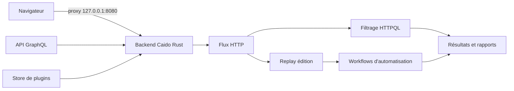

# Caido — Proxy d'interception web léger en Rust

> [!info] **En 1 phrase**
> Caido est une alternative moderne, ultra-légère et rapide à Burp Suite, écrite en Rust : proxy d'interception, replay et automatisation par Workflows, le tout dans une interface web.

---

## Overview

| Champ | Valeur |
|---|---|
| Nom complet | Caido (Caido — Web Security Auditing Toolkit) |
| Description | Proxy d'interception et boîte à outils de test d'applications web : capture/édition du trafic HTTP/S, replay, filtrage HTTPQL, automatisation par Workflows, le tout dans une interface web |
| Catégorie | Scan Web & Fuzzing |
| Sous-catégorie | Proxy d'interception / boîte à outils web |
| Fonction principale | Intercepter, modifier, rejouer et automatiser le trafic HTTP/S via une interface web |
| Type d'outil | Proxy (backend Rust + UI web), exécutable local ou serveur auto-hébergé |
| Licence | Freemium : Basic gratuit, plans payants (Individual, Team, Enterprise) |
| Open source / propriétaire | Backend propriétaire ; releases, roadmap et SDK sur GitHub (caido/caido, ~2,5k étoiles) |
| Langage(s) de programmation | Rust (backend), TypeScript/JavaScript (UI), HTTPQL (filtrage), GraphQL (API) |
| Développeur / organisation | Caido (équipe fondée par Ian Bouchard) |
| Projet officiel | https://caido.io |
| Dépôt officiel | https://github.com/caido/caido (releases, wiki, roadmap) |
| Documentation officielle | https://docs.caido.io |
| Date de création | 2022 (premières releases publiques) |
| État du projet | actif (release au moins mensuelle) |
| Dernière version connue | 0.57.1 (juillet 2026) |
| Systèmes compatibles | Linux (x86_64/AArch64) / Windows (x86_64) / macOS (Intel/Apple silicon) / Docker |

> [!note] Pour vérifier / compléter
> Les offres et leurs limites évoluent : en 2026 le plan gratuit (Basic) plafonne à 2 projets, 7 workflows, 3 plugins et 5 presets de filtres ; les plans payants (Individual, Team, Enterprise) lèvent ces limites. Un plan éducation gratuit 1 an existe pour les étudiants/enseignants. À re-confirmer sur https://caido.io.

---

## Concept

Caido se positionne comme le « nouveau Burp » : un proxy d'interception + boîte à outils pour le test d'applications web, distribué en binaire autonome (Rust) qui expose une **interface web locale**. Le backend tourne en local (ou sur un serveur auto-hébergé, consultable à distance) et l'utilisateur travaille depuis son navigateur : proxy, Replay, Automate, Workflows et Assistant dans une sidebar unifiée.

Le cœur du workflow est le triptyque classique du test manuel — **intercepter, rejouer, modifier** — complété par trois innovations : le **langage de filtrage HTTPQL** (ex : `resp.code.gte:400`), l'automatisation par **Workflows** (graphe de nœuds : envoi de requêtes, extraction, comparaison, wordlists) et une **API GraphQL** pour scripter tout l'outil. Depuis 2025-2026, Caido ajoute un **store de plugins** communautaires (58+ plugins) et des plugins **IA** fonctionnant avec le modèle LLM de son choix (Anthropic, Google, OpenAI, via OpenRouter).

Son créneau : le test manuel rapide et léger, là où Burp est lourd et coûteux. Pour le scan automatique profond et l'OAST mature (type Collaborator), Burp Pro ou ZAP restent plus complets.



---

## Concepts fondamentaux

| Concept | Explication |
|---|---|
| Proxy MITM local | Backend qui se place entre le navigateur et la cible : tout le trafic HTTP/S transite par lui, dans les deux sens |
| Certificat CA racine | Pour déchiffrer le HTTPS, Caido génère un certificat racine à installer dans le navigateur (affiché avec `--root-ca`) |
| Interface web | Caido n'a pas de GUI native : le backend sert une interface accessible dans le navigateur, utilisable en local ou à distance |
| HTTPQL | Langage de requête de filtrage : espaces de noms (`req.`, `resp.`) et opérateurs (`.eq`, `.gte`, `.contains`...) pour trier le trafic ; ex : `resp.code.gte:400` |
| Replay | Onglet de rejeu/édition : modifier méthode, paramètres, en-têtes puis renvoyer la requête et comparer les réponses |
| Workflows | Automatisation visuelle par nœuds (envoi de requêtes, extraction regex/JSON, wordlists, comparaison) créée dans l'interface, sans script à écrire |
| Projets | Chaque engagement est un projet séparé ; le plan gratuit est limité en nombre de projets |
| GraphQL API | API complète (sessions, requêtes, résultats) pour automatiser Caido depuis des scripts externes |
| Plugins | Store de plugins communautaires ; plugins IA utilisant le LLM de son choix (BYO model) |
| Invisible proxy | Interception de trafic de clients non configurés pour le proxy (transparent, sans config manuelle) |
| DNS override | Force la résolution d'un domaine vers une IP/serveur DNS donné (utile pour les vhosts et le débug) |

---

## Installation

### Debian / Ubuntu / Kali Linux

```bash
# Caido n'est PAS dans les dépôts Kali : installer les binaires officiels
# 1) Télécharger la dernière release : https://github.com/caido/caido/releases
#    (liens de la forme https://caido.download/releases/<version>/caido-cli-vX.Y.Z-linux-x86_64.tar.gz)
wget https://caido.download/releases/v0.57.1/caido-cli-v0.57.1-linux-x86_64.tar.gz
tar -xzf caido-cli-v0.57.1-linux-x86_64.tar.gz

# 2) Lancer (l'interface web s'ouvre automatiquement)
./caido --listen 127.0.0.1:8080
```

### Arch Linux

```bash
# Pas de paquet officiel : utiliser les binaires officiels (voir ci-dessus)
# ou un paquet AUR non officiel à vérifier
# yay -S caido
```

### Fedora / RHEL

```bash
# Binaires officiels uniquement (pas de RPM officiel)
# wget https://caido.download/releases/v0.57.1/caido-cli-v0.57.1-linux-x86_64.tar.gz
tar -xzf caido-cli-v0.57.1-linux-x86_64.tar.gz && ./caido
```

### macOS

```bash
# Apple silicon / Intel : .zip ou .dmg officiels
# brew install --cask caido  (si disponible, à vérifier)
```

### Windows

```powershell
# .exe officiel (desktop) depuis GitHub releases
# ou binaire CLI : https://caido.download/releases/v0.57.1/caido-cli-v0.57.1-win-x86_64.zip
```

### Docker

```bash
# Image officielle : https://hub.docker.com/r/caido/caido
docker pull caido/caido:latest
docker run -d -p 8080:8080 -v caido-data:/root/.caido caido/caido
# Interface : http://localhost:8080 (premier lancement = création du compte admin)
```

### Compilation depuis les sources

```bash
# Le dépôt github.com/caido/caido contient releases/wiki/roadmap, pas le code du backend.
# Le SDK communautaire (plugins) est séparé : https://github.com/caido/caido-sdk
git clone https://github.com/caido/caido-sdk.git
# La compilation d'un plugin se fait via le SDK (Node + TypeScript), pas du backend Rust.
```

> [!warning] Prérequis & problèmes potentiels
> - **Pas de paquet Kali/Debian officiel** : toujours passer par les binaires GitHub/caido.download.
> - **Premier lancement** : création d'un compte administrateur local (mot de passe stocké dans `~/.caido`).
> - **HTTPS** : sans installation du certificat racine, le navigateur refuse les certificats signés par Caido → l'interception HTTPS échoue silencieusement (erreur de certificat).
> - **Ressources** : très léger (binaire Rust autonome, pas de JVM), fonctionne sur des VM de faible taille.

---

## Configuration

| Paramètre | Rôle | Valeur possible | Impact | Exemple |
|---|---|---|---|---|
| `--listen <hôte>:<port>` | Adresse/port d'écoute du proxy et de l'UI | `127.0.0.1:8080` (défaut) | Point d'entrée du proxy ; ne pas exposer en public sans auth | `--listen 0.0.0.0:8080` pour un serveur d'équipe |
| `--root-ca` | Affiche le certificat CA racine | Fichier `.pem` | À installer dans le navigateur pour déchiffrer le HTTPS | `./caido --root-ca > caido-ca.pem` |
| `--no-browser` | N'ouvre pas l'interface au démarrage | flag | Utile en serveur headless | `./caido --listen 0.0.0.0:8080 --no-browser` |
| Scope | Périmètre des requêtes suivies/testées | `*.example.com` | Concentre le trafic et les workflows sur la cible | Exclure les CDN et services tiers |
| Presets HTTPQL | Requêtes de filtrage sauvegardées | `resp.code.gte:400` | Réutilisables sur tout le projet | Preset « erreurs » pour trier le trafic |
| Match & Replace | Réécriture de requêtes/réponses | Nœud/règle par champ | Transforme le trafic à la volée | Remplacer `User-Agent` |
| DNS override | Forcer la résolution d'un domaine | IP ou serveur DNS | Tester un vhost/hôte en pointant vers une IP précise | `api.example.com → 10.10.10.10` |
| Invisible proxy | Interception transparente | On/Off | Capture les clients non configurés pour le proxy | Rediriger un binaire vers le port Caido |
| Plugins | Extensions depuis le store | Plugin communautaire | Ajoute des onglets/capabilités | Plugin d'analyse JWT |
| Projets | Conteneurs d'engagement | Projet par cible | Isole historique, workflows et résultats | Projet « audit-2026-example » |

> [!note] À vérifier
> Les limites exactes du plan gratuit (nombre de projets/workflows/plugins/presets) changent avec les versions et les offres commerciales : vérifier sur https://caido.io avant de conclure sur les capacités de l'édition gratuite.

---

## Architecture interne

Caido est découpé entre un **backend Rust** et une **interface web** servie par ce backend :

- **Backend (Rust)** : binaire autonome qui écoute le proxy (défaut `127.0.0.1:8080`), sert l'interface web, exécute les workflows et expose l'API GraphQL. Aucune JVM ni runtime externe.
- **TLS** : le backend génère une CA racine locale ; chaque site est servi par un certificat signé à la volée. Sans la CA dans le navigateur, le navigateur refuse la connexion.
- **Stockage** : projets, historique, requêtes et résultats sont persistés sur disque (`~/.caido`) ; l'image Docker monte un volume pour les conserver.
- **HTTPQL** : moteur de requête sur les métadonnées (`req.host`, `resp.code`, etc.) appliqué en temps réel sur les flux ou sur l'historique du projet.
- **Workflows** : moteur de graphe orienté nœuds — requête HTTP, extraction (regex/JSONPath), itération (wordlist), comparaison, condition, loop — exécuté par le backend.
- **API GraphQL** : point d'entrée `/api/graphql` pour interroger/muter sessions, requêtes et résultats ; aussi utilisée par le Client SDK pour l'automatisation et les agents IA.
- **Plugins** : le store s'appuie sur le SDK (caido-caido-sdk) ; les plugins IA se connectent au fournisseur LLM de son choix via API (Anthropic, Google, OpenAI, OpenRouter).

Flux typique : navigateur → backend (proxy, déchiffrement) → historique HTTPQL → Replay (édition) → Workflow (automatisation) → résultats → export.

---

## Commandes

### Commandes principales

```bash
# Démarrer Caido avec l'interface web ouverte
./caido --listen 127.0.0.1:8080

# Démarrer sans ouvrir le navigateur (headless/serveur)
./caido --listen 127.0.0.1:8080 --no-browser

# Afficher le certificat racine à installer dans le navigateur
./caido --root-ca

# Vérifier que le proxy répond
curl -x http://127.0.0.1:8080 -k -v https://cible.example.com/
```

| Commande / action | Objectif | Résultat attendu |
|---|---|---|
| `./caido --listen 127.0.0.1:8080` | Lancer le proxy + UI | Interface web disponible, proxy actif |
| `./caido --root-ca` | Exporter le certificat CA | Fichier `.pem` à importer dans le navigateur |
| Onglet Proxy → HTTPQL | Filtrer le trafic capturé | Liste de requêtes correspondant au filtre |
| Onglet Replay | Rejouer/éditer une requête | Réponse affichée, modifiable et renvoyable |
| Onglet Workflows | Créer/éditer un workflow | Graphe exécutable de nœuds |
| API GraphQL | Script l'outil | Sessions/requêtes/résultats en JSON |
| `--demo` | Charger un environnement de démonstration | Projet exemple pour découvrir l'outil |

### Commandes avancées

```bash
# Tester l'interception d'un client non configuré pour le proxy (invisible proxy)
# 1) Activer l'invisible proxy dans l'UI
# 2) Rediriger le trafic du client vers le port Caido (iptables/DNAT) :
iptables -t nat -A PREROUTING -p tcp --dport 80 -j REDIRECT --to-port 8080

# Pointer un domaine vers une IP arbitraire (vhost testing)
# Onglet Settings > DNS Override : api.example.com -> 10.10.10.10
```

---

## Options et flags

| Option | Description | Exemple | Niveau |
|---|---|---|---|
| `--listen <hôte>:<port>` | Adresse/port du proxy et de l'UI | `./caido --listen 127.0.0.1:8080` | Basic |
| `--no-browser` | Ne pas ouvrir l'interface au démarrage | `./caido --no-browser` | Basic |
| `--root-ca` | Afficher le certificat CA racine | `./caido --root-ca > caido-ca.pem` | Basic |
| `--demo` | Charger un environnement de démonstration | `./caido --demo` | Intermediate |
| `--debug` | Logs de débogage verbeux | `./caido --debug` | Advanced |
| HTTPQL → `resp.code.gte:400` | Filtrer les réponses d'erreur | Saisie dans la barre de filtrage | Intermediate |
| HTTPQL → `req.host.eq:"api.example.com"` | Isoler un hôte | Preset réutilisable | Intermediate |
| Workflows → nœud Wordlist | Itérer une liste de valeurs | Fuzzing de paramètre | Advanced |
| Workflows → nœud Compare | Comparer des réponses | Identifier les réponses anormales | Advanced |
| GraphQL → mutations | Créer des sessions/requêtes | Script d'automatisation | Expert |

> [!tip] Options les plus utiles au quotidien
> `--root-ca` pour installer la CA dès le premier lancement, un **preset HTTPQL** type `resp.code.gte:400` pour ne pas se noyer dans l'historique, et un **workflow** « fuzz + compare » pour transformer un test répétitif en action rejouable.

---

## Exemples pratiques

### Beginner

```bash
# Objectif : premier trafic intercepté
# 1) Lancer Caido et installer la CA dans le navigateur
./caido --listen 127.0.0.1:8080
./caido --root-ca > caido-ca.pem   # puis importer dans le navigateur

# 2) Configurer le navigateur : proxy 127.0.0.1:8080
# 3) Naviguer sur https://cible.example.com et observer les flux dans l'onglet Proxy

# Vérification en CLI que le proxy fonctionne
curl -x http://127.0.0.1:8080 -k -v https://cible.example.com/robots.txt
```

### Intermediate

```bash
# Objectif : isoler et tester les erreurs applicatives
# 1) Filtrer avec HTTPQL : resp.code.gte:400
# 2) Envoyer une requête d'erreur dans Replay, modifier le paramètre :
#    id=1 -> id=1' (test d'injection)
# 3) Renvoyer et comparer le statut/longueur avec la réponse de base

# Objectif : tester un accès non autorisé (IDOR)
# 1) Replay sur /api/users/42 (session user basse)
# 2) Modifier l'id vers /api/users/1 (admin) sans changer la session
# 3) 200 + données = broken access control confirmé
```

### Advanced

```bash
# Objectif : fuzzing de paramètres via un Workflow
# 1) Workflows -> nouveau workflow
# 2) Nœud HTTP : GET /api/user/{param} avec la requête de base
# 3) Nœud Wordlist : top-params.txt branché sur {param}
# 4) Nœud Compare : comparer les réponses (taille, statut)
# 5) Exécuter -> les réponses anormales sont mises en évidence sans script

# Objectif : réécriture à la volée (Match & Replace)
# Onglet Settings > Match & Replace : remplacer "user-agent: chrome"
# par "user-agent: custom" pour normaliser le trafic
```

### Expert

```bash
# Objectif : automation complète via l'API GraphQL
# 1) Récupérer un token : Settings > API
# 2) Interroger l'API :
curl -s http://127.0.0.1:8080/api/graphql \
  -H 'Content-Type: application/json' \
  -H 'Authorization: Bearer <TOKEN>' \
  -d '{"query":"{ requests { host url status } }"}'
# 3) Utiliser le Client SDK (TypeScript/Python) pour brancher Caido
#    sur un pipeline d'analyse automatisée (scans quotidiens, collecte d'endpoints)
```

---

## Workflow complet (scénario pas à pas)

1. **Lancer Caido et installer le certificat racine** — configurer le proxy `127.0.0.1:8080` dans le navigateur :
   ```bash
   ./caido --listen 127.0.0.1:8080
   ./caido --root-ca
   ```
2. **Parcourir la cible** — toutes les requêtes passent dans le panneau des flux ; utiliser les filtres HTTPQL (hôte, méthode, statut) pour s'y retrouver.
3. **Replay** — envoyer une requête dans l'onglet *Replay*, modifier la méthode/les paramètres/les en-têtes et renvoyer pour observer les différences (tests IDOR, manipulation de rôles...).
4. **Créer un Workflow** — dans l'onglet *Workflows*, enchaîner : requête initiale → extraction d'une valeur de la réponse (regex/JSON) → réinjection dans une seconde requête → comparaison des réponses.
5. **Scanner (plan payant)** — lancer le scan passif/actif sur l'hôte en scope et trier les résultats dans l'onglet *Results*.
6. **Automatiser via GraphQL** — intégrer Caido dans des scripts de bug bounty ou un pipeline (collecte d'endpoints, rejeux programmés).

---

## Scénarios avancés

### Scénario 1 : Fuzzing de paramètres avec Workflow

Créer un workflow avec un nœud de liste de valeurs (wordlist) branché sur un paramètre, puis un nœud de comparaison : Caido identifie automatiquement les réponses différentes (tailles, statuts) = candidats intéressants, sans script à écrire.

```bash
# Structure du workflow (créée dans l'UI, pas en CLI) :
# HTTP (GET /api/user/§uid§) -> Wordlist (uids.txt) -> Compare (réponses)
# Résultat attendu : les IDs répondant avec un contenu différent
# de la moyenne sont les candidats IDOR/BOLA à valider en Replay.
```

### Scénario 2 : Automatisation via l'API GraphQL

Caido expose une API GraphQL : on peut scripter la création de sessions, l'injection de requêtes et la récupération des résultats :

```bash
# Lister les flux capturés
curl -s http://127.0.0.1:8080/api/graphql \
  -H 'Content-Type: application/json' \
  -d '{"query":"{ requests { host url } }"}'

# Injecter une requête arbitraire dans un projet
curl -s http://127.0.0.1:8080/api/graphql \
  -H 'Content-Type: application/json' \
  -d '{"query":"mutation { requestImport(raw: \"GET /admin HTTP/1.1\\nHost: cible.example.com\\n\\n\") { id } }"}'
```

### Scénario 3 : Interception d'un client non configuré pour le proxy (invisible proxy)

Pour tester un client qui ne gère pas la configuration proxy (script, binaire), activer l'**invisible proxy** et rediriger son trafic :

```bash
# 1) Activer l'invisible proxy dans l'UI Caido
# 2) Rediriger le port 80 de la machine vers le proxy Caido
iptables -t nat -A PREROUTING -p tcp --dport 80 -j REDIRECT --to-port 8080
# 3) Le trafic du client apparaît dans les flux, déchiffré avec la CA Caido
```

---

## Cybersecurity use cases

| Phase | Utilisation |
|---|---|
| Reconnaissance | Cartographie du trafic, filtrage HTTPQL des endpoints et paramètres |
| Énumération | Workflows de fuzzing (wordlists) sur paramètres/chemins ; DNS override pour tester des vhosts |
| Vulnérabilité | Replay manuel d'injections (SQLi, XSS, authz) ; scan actif/passif (plans payants) |
| Exploitation | Workflows de bruteforce/validation assistée ; invisible proxy pour clients exotiques |
| Post-exploitation | Extraction de données via Replay ; collecte d'endpoints via GraphQL |
| Rapport | Projets par engagement, export des requêtes/réponses comme preuves |

---

## MITRE ATT&CK

| Tactique | Technique / Sub-technique | ID | Raison | Détection | Mitigation |
|---|---|---|---|---|---|
| Reconnaissance | Active Scanning : Vulnerability Scanning | T1595.002 | Le scanner Caido (plans payants) envoie des checks de vulnérabilités | Logs WAF/HTTP, corrélation SIEM | Patching, WAF, rate-limiting |
| Reconnaissance | Active Scanning : Wordlist Scanning | T1595.003 | Les Workflows de fuzzing itèrent des wordlists sur chemins/paramètres | Burst de requêtes structurées | Rate limiting, CAPTCHA, WAF |
| Credential Access | Adversary-in-the-Middle | T1557 | Le proxy (classique ou invisible) intercepte et déchiffre le trafic | Détection de CA non approuvées, TLS pinning | Pinning, HSTS, monitoring des CA installées |
| Credential Access | Brute Force | T1110 | Workflows de bruteforce d'authentification | Échecs de connexion massifs | Verrouillage de compte, MFA, rate limiting |
| Initial Access | Exploit Public-Facing Application | T1190 | Replay/Scanner valident l'exploitation d'une faille | Alertes sur patterns d'exploitation | Patching, validation d'entrée |

> [!note] Ne renseigner que si l'association est réellement pertinente.
> Les associations les plus spécifiques : **T1595.003** (fuzzing Workflows) et **T1557** (proxy d'interception, y compris invisible).

---

## Defensive Security

### Signes observables

| Indicateur | Détail |
|---|---|
| Certificat CA « Caido » installé dans le navigateur | CA racine locale signant les certificats de session = indicateur d'interception |
| Requêtes rejouées avec des valeurs arbitraires (Replay) | Modifications anormales de paramètres/en-têtes dans les logs |
| Volume élevé de requêtes (workflows/scanner) | Pic de trafic, erreurs 4xx/5xx, timeouts |
| Trafic vers un proxy local sur un port non standard | Connexions sortantes vers le port du proxy Caido |
| Réponses anormalement différentes pour des requêtes similaires | Signe de tests de comparaison (workflows) |

### Règles de détection (Sigma / Suricata / Snort / YARA)

```yaml
# Sigma (pédagogique - à adapter) : fuzzing HTTP par une même source
title: HTTP Parameter Fuzzing - High Volume
status: experimental
logsource:
    category: webserver
    product: apache
detection:
    selection:
        sc-status:
            - 404
            - 500
    condition: selection
    timeframe: 1m
    aggregation: count > 150
falsepositives:
    - Crawlers de monitoring
level: medium
```

```bash
# Suricata/Snort (pédagogique) : boucle de fuzzing détectée par fréquence
alert tcp any any -> any 80 (msg:"High-rate web fuzzing"; flow:to_server,established; content:"GET"; http.method; threshold:type both, track by_src, count 300, seconds 30; classtype:attempted-recon; sid:66000011; rev:1;)
```

```yaml
# YARA : binaire Caido présent sur un poste
rule Caido_Binary {
    meta:
        description = "Binaire du proxy Caido"
        author = "Équipe SOC"
    strings:
        $a = "caido" ascii wide
        $b = "Caido" ascii wide
        $c = "HTTPQL" ascii wide
    condition:
        filesize > 5MB and any of them
}
```

---

## Automatisation

Caido est pensé pour l'automatisation : API GraphQL complète + Client SDK (TypeScript, Python) pour brancher l'outil sur des pipelines et des agents IA.

```bash
# Créer une session et injecter une requête via l'API GraphQL
curl -s http://127.0.0.1:8080/api/graphql \
  -H 'Content-Type: application/json' \
  -H 'Authorization: Bearer <TOKEN>' \
  -d '{"query":"{ sessions { id name } }"}'

# Lister les résultats d'un scan/workflow
curl -s http://127.0.0.1:8080/api/graphql \
  -H 'Content-Type: application/json' \
  -d '{"query":"{ requests { host url status } }"}' | jq '.data.requests[] | select(.status >= 400)'
```

```python
# Python : interroger l'API GraphQL de Caido
import requests

url = "http://127.0.0.1:8080/api/graphql"
headers = {"Content-Type": "application/json",
           "Authorization": "Bearer <TOKEN>"}
query = {"query": "{ requests { host url status } }"}
data = requests.post(url, json=query, headers=headers).json()
for r in data["data"]["requests"]:
    if r["status"] and r["status"] >= 400:
        print(r["host"], r["url"], r["status"])
```

```python
# Python : workflow de fuzzing rejouable en boucle (lab uniquement)
import requests
import time

for uid in range(1, 101):
    r = requests.get(f"https://cible.example.com/api/user/{uid}",
                     headers={"Cookie": "SESSION=low"}, verify=False)
    if r.status_code == 200 and "email" in r.text:
        print(f"IDOR candidat: {uid} -> {r.status_code}")
    time.sleep(0.2)
```

---

## Output et parsing

Caido expose tout via l'API GraphQL en **JSON** : requêtes, réponses, sessions, résultats. On parse ensuite avec `jq` ou Python.

```bash
# Extraire les requêtes à erreur depuis l'API
curl -s http://127.0.0.1:8080/api/graphql \
  -H 'Content-Type: application/json' \
  -d '{"query":"{ requests { host url status } }"}' | \
  jq -r '.data.requests[] | select(.status >= 400) | "\(.host) \(.url) \(.status)"'

# Compter les endpoints uniques découverts
curl -s http://127.0.0.1:8080/api/graphql \
  -H 'Content-Type: application/json' \
  -d '{"query":"{ requests { url } }"}' | jq -r '.data.requests[].url' | sort -u | wc -l
```

```python
# Python : parser les résultats GraphQL pour en extraire les URLs
import requests

data = requests.post("http://127.0.0.1:8080/api/graphql",
                     json={"query": "{ requests { host url } }"}).json()
urls = sorted({f"{r['host']}{r['url']}" for r in data["data"]["requests"]})
for u in urls:
    print(u)
```

---

## Intégrations

```text
Navigateur -> Caido (proxy 127.0.0.1:8080) -> cible
Caido -> API GraphQL -> scripts Python / pipelines CI / SIEM
Workflows Caido -> wordlists (SecLists) -> fuzzing -> résultats
Plugins IA Caido -> LLM (Anthropic / Google / OpenAI / OpenRouter)
```

- [[Tools| Outils]] global
- [[Outil - Burp Suite]] — alternative historique plus complète (scanner profond, BApp Store, OAST)
- [[Outil - mitmproxy]] — alternative scriptable en Python
- [[Outil - OWASP ZAP]] — scanner open source complet
- [[Outil - ffuf]] / [[Outil - gobuster]] — découverte de contenu en CLI, complément du fuzzing Workflows
- [[Outil - nuclei]] — validation template-based des CVEs
- [[Techniques/IDOR]] · [[Techniques/Virtual Hosts]] · [[Techniques/SSRF]]

---

## Alternatives

| Outil | Avantages | Inconvénients | Cas d'usage |
|---|---|---|---|
| Burp Suite | Écosystème BApp, scanner profond, OAST Collaborator | Lourd (JVM), licence Pro payante | Pentest web complet et approfondi |
| OWASP ZAP | Open source, gratuit, scanner complet | UI moins soignée, plus lent | Scan automatisé open source |
| mitmproxy | Scriptabilité Python totale, gratuit, léger | Pas de fuzzing positionnel, interface spartiate | Automatisation MITM/transformation de trafic |
| HTTP Toolkit | UI très simple pour le debug | Peu d'outils offensifs | Débug API, dev |
| Proxyman | Excellent sur macOS, UI soignée | Payant, moins orienté pentest | Tests API côté développeur |

> **Quand utiliser Caido plutôt que Burp ?** Pour le **test manuel léger** (interception, replay, filtrage HTTPQL) sur des postes à faibles ressources ou quand Burp Pro est hors budget — Caido est plus rapide et plus propre. Pour le **scan automatique profond**, l'**OAST** et le **gros écosystème d'extensions**, Burp Pro ou ZAP restent les références.

---

## Performance

- **Léger** : binaire Rust autonome, sans JVM ni runtime — démarrage quasi instantané, empreinte mémoire faible par rapport à Burp (Java).
- **Rapide** : le fuzzing via Workflows s'exécute dans le backend natif ; penser au throttling pour ne pas écraser la cible.
- **Releases mensuelles** : l'outil évolue vite (interfaces, workflows, plugins), avec des correctifs réguliers.
- **Adapté aux VM/CTF** : fonctionne confortablement sur de petites machines, ce qui en fait un bon candidat pour les environnements de lab.
- **Écosystème jeune** : moins d'extensions et de retours communautaires que Burp — certains cas (WebSockets avancés, formats exotiques) peuvent manquer.

> [!note] À vérifier
> Pas de chiffres de performance officiels publiés : valider en lab sur la configuration cible (poste, réseau, taille de l'application).

---

## Troubleshooting

### Common problems

#### Problème : le navigateur refuse le HTTPS

- **Cause** : certificat CA racine Caido non installé (ou périmé après mise à jour de la CA).
- **Solution** : `./caido --root-ca`, importer le `.pem` dans le navigateur, recharger la page.
- **Vérification** : la navigation HTTPS passe sans avertissement et les flux apparaissent déchiffrés.

#### Problème : le trafic d'un client n'apparaît pas dans les flux

- **Cause** : le client n'est pas configuré pour le proxy (script, binaire, application native).
- **Solution** : activer l'**invisible proxy** et rediriger son trafic vers le port Caido.
- **Vérification** : les requêtes du client apparaissent dans l'onglet Proxy.

#### Problème : le workflow ne retourne aucun résultat

- **Cause** : nœud wordlist vide, extraction regex/JSONPath incorrecte, ou scope excluant la cible.
- **Solution** : vérifier le chemin d'extraction dans un test unitaire Replay, contrôler la wordlist et le scope.
- **Vérification** : exécuter le workflow sur une seule valeur et comparer avec le Replay manuel.

#### Problème : l'API GraphQL refuse les requêtes

- **Cause** : token manquant/expiré ou proxy non démarré.
- **Solution** : générer un token dans Settings > API, le passer en header `Authorization: Bearer <TOKEN>`.
- **Vérification** : `curl http://127.0.0.1:8080/api/graphql -H 'Content-Type: application/json' -d '{"query":"{ __typename }"}'`.

---

## Sécurité de l'outil

- **Compte administrateur local** : le premier lancement crée un compte admin — utiliser un mot de passe fort ; les projets et requêtes y sont accessibles.
- **Exposition réseau** : par défaut Caido écoute sur `127.0.0.1`. Si on l'expose (`--listen 0.0.0.0:8080`) pour une équipe, s'assurer d'une authentification et d'un TLS (reverse proxy).
- **Certificat CA** : la CA Caido déchiffre tout le HTTPS des navigateurs configurés → ne l'installer que dans un profil de navigateur dédié au test, la retirer après engagement.
- **Token API** : équivaut à un accès complet à l'outil → à garder secret, à régénérer si exposé.
- **Plugins** : le store communautaire contient du code tiers → n'installer que des plugins reconnus et auditer ce qu'ils font (accès réseau, exfil).
- **Plugins IA** : le BYO model envoie des données d'engagement au fournisseur LLM choisi → à ne pas utiliser sur des données sensibles non autorisées.

---

## Limitations

- **Pas de package Kali/Debian officiel** : installation manuelle des binaires.
- **Scan automatique** : limité/absent dans le plan gratuit (scanner des plans payants moins profond que Burp Pro/ZAP).
- **OAST** : l'équivalent de Collaborator est moins mature — pour du blind SSRF/XXE, Burp Pro reste la référence.
- **Écosystème jeune** : moins d'extensions et de retours communautaires ; certains protocoles/format exotiques peuvent manquer.
- **Limites du plan gratuit** : projets/workflows/plugins/presets plafonnés.
- **Interface web** : dépend d'un navigateur — pas de GUI native ; nécessite un backend qui tourne.

---

## Cheatsheet

```bash
# Lancer le proxy + UI
./caido --listen 127.0.0.1:8080

# Démarrer en headless (serveur)
./caido --listen 0.0.0.0:8080 --no-browser

# Exporter le certificat CA
./caido --root-ca > caido-ca.pem

# Tester le proxy
curl -x http://127.0.0.1:8080 -k -v https://cible.example.com/

# Filtrer le trafic (HTTPQL, dans l'UI)
# resp.code.gte:400   (réponses d'erreur)
# req.host.eq:"api.example.com"

# Lister les requêtes via l'API GraphQL
curl -s http://127.0.0.1:8080/api/graphql \
  -H 'Content-Type: application/json' \
  -d '{"query":"{ requests { host url status } }"}'

# Rediriger un client non proxy-aware vers Caido (invisible proxy)
iptables -t nat -A PREROUTING -p tcp --dport 80 -j REDIRECT --to-port 8080
```

---

## Quick reference

| | |
|---|---|
| **À quoi sert-il ?** | Proxy d'interception + boîte à outils web (replay, HTTPQL, workflows) dans une interface web |
| **Quand l'utiliser ?** | Test manuel web rapide et léger, quand Burp est trop lourd ou hors budget |
| **Commande principale** | `./caido --listen 127.0.0.1:8080` |
| **Alternative principale** | Burp Suite (complet), OWASP ZAP (open source), mitmproxy (scriptable) |
| **Concepts importants** | Proxy MITM, CA racine, HTTPQL, Replay, Workflows, API GraphQL |
| **Liens associés** | [[Outil - Burp Suite]] · [[Outil - mitmproxy]] · [[Outil - OWASP ZAP]] · [[Techniques/IDOR]] |

---

## Détection & Défense

| Signe | Défense |
|---|---|
| Requêtes rejouées/modifiées avec des valeurs arbitraires | Validation stricte côté serveur (authz et contraintes métier) |
| Volume de requêtes élevé (scanner/workflows) | Rate limiting, WAF (CRS), CAPTCHA |
| Certificat racine inconnu signant le trafic | Détection de CA non autorisés, certificats épinglés (pinning) |
| Trafic automatique sans User-Agent de navigateur | Règles anti-bot, journalisation et corrélation des sources |
| Changements de taille/réponse répétés | Monitoring des anomalies de réponse applicative |

---

## Tips & Pièges

> [!tip] **Tips**
> - Installe le certificat CA dans un **profil de navigateur dédié** pour ne pas polluer ton environnement normal.
> - Utilise les **Workflows** pour transformer un test répétitif manuel en test rejouable (gain énorme sur les engagements de longue durée).
> - L'API **GraphQL** permet d'intégrer Caido dans tes propres scripts de bug bounty.
> - Maîtrise **HTTPQL** (`resp.code.gte:400`, `req.host.eq`) : c'est le moyen le plus rapide de trier un gros historique.
> - Le **DNS override** est très pratique pour tester des vhosts ou pointer une cible vers une IP de lab sans toucher au hosts.

> [!warning] **Pièges**
> - La version **gratuite ne contient pas le scanner actif** : les tests actifs restent manuels ou via Workflows.
> - Écrite en Rust et jeune, Caido a moins de retours communautaires et d'extensions que Burp : certains cas exotiques (WebSockets avancés, certains formats) peuvent manquer.
> - Pense à vérifier que le certificat racine est **correctement installé**, sinon le HTTPS sera simplement refusé par le navigateur (pas d'interception silencieuse).
> - Ne **jamais exposer l'interface à distance** sans authentification solide : elle donne accès à tous les projets et requêtes.
> - Un workflow sans **throttle** peut saturer la cible (DoS involontaire) : ajouter des délais pour les engagements de production.

---

## References

### Official

- Site officiel : https://caido.io
- Documentation : https://docs.caido.io
- GitHub (releases, wiki, roadmap) : https://github.com/caido/caido
- SDK communautaire : https://github.com/caido/caido-sdk
- Docker Hub : https://hub.docker.com/r/caido/caido

### Security references

- MITRE ATT&CK T1595 — Active Scanning : https://attack.mitre.org/techniques/T1595/
- MITRE ATT&CK T1557 — Adversary-in-the-Middle : https://attack.mitre.org/techniques/T1557/
- MITRE ATT&CK T1110 — Brute Force : https://attack.mitre.org/techniques/T1110/
- OWASP Top 10 : https://owasp.org/Top10/

### Community

- Caido blog (notes de release) : https://www.caido.io/blog
- Discord Caido (communauté) : https://links.caido.io/www-discord
- AppSec Santa — Caido Review 2026 : https://appsecsanta.com/caido

---

**Liens :** [[Tools| Outils]] · [[Outil - Burp Suite|Burp Suite]] · [[Outil - mitmproxy|mitmproxy]] · [[Outil - OWASP ZAP|OWASP ZAP]] · [[Techniques/Virtual Hosts|Virtual Hosts]] · [[Techniques/IDOR|IDOR]]
