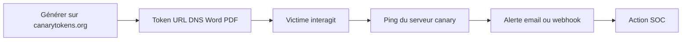

# Canarytokens — Forensics, Threat Intel & Honeypots

> [!info] **En 1 phrase**
> Canarytokens est un service de honeypot « léger » qui génère des leurres (URL, DNS, document Word/PDF, clé AWS, QR code...) qui déclenchent une alerte dès qu'ils sont ouverts ou consultés.

---

## Overview

| Champ | Valeur |
|---|---|
| Nom complet | Canarytokens |
| Description | Service de « canari » : leurres (URL, DNS, documents, clés AWS, QR codes) qui alertent dès qu'ils sont touchés |
| Catégorie | Forensics, Threat Intel & Honeypots |
| Sous-catégorie | Honeypot / Déception |
| Fonction principale | Détection précoce d'accès non autorisé via des artefacts piégés |
| Type d'outil | Service SaaS (canarytokens.org) + auto-hébergement Docker |
| Licence | BSD-3-Clause |
| Open source / propriétaire | Open source (auto-hébergement possible) |
| Langage(s) de programmation | Python, Go, JavaScript, Docker |
| Développeur / organisation | Thinkst Applied Research |
| Projet officiel | Canarytokens |
| Dépôt officiel | https://github.com/thinkst/canarytokens |
| Documentation officielle | https://docs.canary.tools/ |
| Date de création | 2014 (plateforme Canary 2013) |
| État du projet | actif (image Docker à build continu) |
| Dernière version connue | latest (image Docker `thinkst/canarytokens:latest`) |
| Systèmes compatients | Tout OS (serveur Docker) ; tokens compatibles partout |
| Domaines d'emploi | Détection d'intrusion, veille de fuite, marquage de documents |

> [!note] Pour vérifier / compléter
> Canarytokens n'a pas de release semver : suivre l'image Docker et les advisories GitHub (GHSA-6734-fqcj-x5h3, XSS PWA, corrigé en février 2026) pour l'auto-hébergement.

---

## Concept

Un canarytoken est un leurre inséré dans un objet déposé à un endroit stratégique : un lien URL dans un email, un enregistrement DNS, un document Word/PDF sur un serveur de fichiers, une clé AWS factice dans un dépôt git. Dès que la cible interagit avec le leurre (clic, ouverture, résolution DNS, usage de la clé), le service `canarytokens.org` envoie une alerte en temps réel — par **email** ou **webhook** (Slack, Teams, SIEM). C'est la version « canari » du honeypot : détection immédiate d'une intrusion sans infrastructure lourde. Deux modes d'emploi : le **service hébergé** (zéro installation) et l'**auto-hébergement Docker** pour garder le contrôle des données et des domaines. Les cas d'usage défensifs : détection précoce d'accès non autorisé (ouverture du document), piège à exfiltration (copie de dossier), veille de fuite (token cherché sur Internet), traçage de copies de documents confidentiels et détection de phishing. Complémentaire de Cowrie : là où Cowrie capture des attaques réseau, Canarytokens capte des actions ciblées sur des artefacts.



---

## Concepts fondamentaux

| Concept | Explication |
|---|---|
| Token | Leurre unique généré (URL, DNS, document, clé AWS, QR code...) |
| Canary | Métaphore du canari dans la mine : signal précoce de danger |
| Ping | Requête du token vers le serveur canary lors de l'interaction |
| Webhook | Réception de l'alerte en HTTP (Slack, Teams, SIEM) |
| `memo` | Libellé libre identifiant le placement (machine, dossier, campagne) |
| Auth token | Jeton d'historique permettant de lister ses tokens |
| Auto-hébergement | Déploiement Docker de la stack (Redis, SMTP, domaine) |
| Domaine canary | Domaine qui reçoit les pings des tokens (distingue du SaaS public) |
| Marquage | Diffusion de versions marquées distinctes pour tracer une fuite |
| Faux positif | Alerte déclenchée par un antivirus, un crawler ou un vérificateur |

---

## Installation

```bash
# Option A : service hébergé — aucune installation
#   Ouvrir https://canarytokens.org/generate et renseigner un email ou webhook

# Option B : auto-hébergement Docker (domaine, SMTP/webhook, Redis)
git clone https://github.com/thinkst/canarytokens.git
cd canarytokens && docker compose up -d

# Configuration clé (variables d'environnement / config)
# CANARY_DOMAIN : domaine qui « ping » les tokens (ex. canary.example.com)
# Redis + SMTP ou webhook vers le SIEM : recevoir les alertes
```

> [!warning] Prudence : l'auto-hébergement expose une interface web (frontend PWA) : mettre à jour régulièrement l'image Docker (advisory XSS GHSA-6734-fqcj-x5h3 de février 2026).

---

## Configuration

| Paramètre | Rôle | Exemple |
|---|---|---|
| `CANARY_DOMAIN` | Domaine qui reçoit les pings des tokens | `canary.example.com` |
| `REDIS_HOST/PORT` | Stockage des tokens et alertes | `redis:6379` |
| `SMTP_*` | Envoi des alertes email | `SMTP_HOST=smtp.local` |
| `WEBHOOK_URL` | Alerte HTTP (Slack/Teams/SIEM) | `https://hooks.slack.com/...` |
| `auth_token` | Jeton d'historique des tokens | `?auth_token=YOUR_TOKEN` |
| `webhook=` (API) | Récepteur HTTP de l'alerte | `-F "webhook=..."` |
| `memo=` (API) | Libellé du placement | `-F "memo=LAB-INC-2026-SRV-DOC"` |

| Option API | Effet |
|---|---|
| `type=url` | Token URL : alerte au clic sur le lien |
| `type=dns` | Token DNS : alerte à la résolution du sous-domaine |
| `type=doc` / `word` / `pdf` | Document leurre : alerte à l'ouverture du fichier |
| `type=aws` | Clé AWS factice : alerte à son utilisation (piège à moissonneurs de secrets) |
| `type=qrcode` | QR code imprimable : alerte au scan (présence physique) |
| `webhook=` | Adresse HTTP/S pour recevoir l'alerte (Slack, Teams, SIEM) |
| `memo=` | Libellé libre pour identifier le placement (machine, dossier, campagne) |
| `email=` | Alternative au webhook : alerte par email |
| `auth_token=` | Jeton d'historique fourni lors de la création des tokens |

---

## Architecture interne

Composants et flux :

- **Frontend web (PWA)** : interface de génération des tokens (`canarytokens.org/generate` ou auto-hébergé).
- **Serveur canary** : reçoit les pings (HTTP, DNS, SMTP selon le type), vérifie le token.
- **Redis** : stockage des tokens et de leur état (alerte déjà envoyée ou non).
- **Moteur d'alertes** : envoie l'email ou déclenche le webhook (Slack, Teams, SIEM).
- **Générateurs de tokens** : fabricants de documents (docx/pdf), QR codes, clés AWS, URL/DNS.
- **Endpoint `/history`** : liste les tokens créés pour un email via `auth_token`.

Flux type : token généré → placé par l'utilisateur → interaction cible → ping → vérification Redis → alerte email/webhook → action SOC. Les types de tokens sont hétérogènes (HTTP/DNS/SMTP) mais le mécanisme d'alerte est unique.

---

## Commandes

### Commandes principales

```bash
# Générer un token URL par API (alternative à l'interface web)
curl -X POST -H "User-Agent: Canarytokens" \
  https://canarytokens.org/generate \
  -F "type=url" -F "memo=LAB-PDF-CONFIDENTIEL" \
  -F "webhook=YOUR_SLACK_WEBHOOK"

# Générer un token DNS (sous-domaine à placer dans un document)
curl -X POST -H "User-Agent: Canarytokens" \
  https://canarytokens.org/generate \
  -F "type=dns" -F "domain=example.com" -F "subdomain=fuite" \
  -F "memo=VEILLE-FUITE-DOC"

# Consulter l'historique des tokens créés pour son adresse
curl "https://canarytokens.org/history?auth_token=YOUR_HISTORY_TOKEN"
```

| Option | Effet |
|---|---|
| `type=url` | Token URL : alerte au clic sur le lien |
| `type=dns` | Token DNS : alerte à la résolution du sous-domaine |
| `type=doc` / `word` / `pdf` | Document leurre : alerte à l'ouverture du fichier |
| `type=aws` | Clé AWS factice : alerte à son utilisation (piège à moissonneurs de secrets) |
| `type=qrcode` | QR code imprimable : alerte au scan (présence physique) |
| `webhook=` | Adresse HTTP/S pour recevoir l'alerte (Slack, Teams, SIEM) |
| `memo=` | Libellé libre pour identifier le placement (machine, dossier, campagne) |
| `email=` | Alternative au webhook : alerte par email |
| `auth_token=` | Jeton d'historique fourni lors de la création des tokens |

---

## Options et flags

| Option | Description | Exemple | Niveau |
|---|---|---|---|
| `type` | Type de token (url/dns/doc/aws/qrcode...) | `-F "type=aws"` | Basic |
| `memo` | Libellé du placement | `-F "memo=REPO-SECRET"` | Basic |
| `webhook` | Récepteur HTTP de l'alerte | `-F "webhook=https://soc.local/hooks/canary"` | Basic |
| `email` | Récepteur email de l'alerte | `-F "email=soc@example.com"` | Basic |
| `domain`/`subdomain` | Domaine pour le token DNS | `-F "domain=example.com" -F "subdomain=fuite"` | Intermediate |
| `auth_token` | Jeton d'historique | `?auth_token=TOKEN` | Intermediate |
| `User-Agent: Canarytokens` | En-tête requis par l'API | `-H "User-Agent: Canarytokens"` | Intermediate |
| `CANARY_DOMAIN` | Domaine auto-hébergé | variable d'env | Expert |

> [!tip] Options les plus utiles au quotidien
> `type` + `memo` + `webhook` couvrent 90 % des besoins ; l'`auth_token` est indispensable pour auditer ses placements.

---

## Exemples pratiques

### Beginner

```bash
# Objectif : créer un token URL qui alerte au clic
curl -X POST -H "User-Agent: Canarytokens" \
  https://canarytokens.org/generate \
  -F "type=url" -F "memo=TEST-CLIC" -F "email=soc@example.com"
```

### Intermediate

```bash
# Objectif : créer un token DNS pour marquer un document
curl -X POST -H "User-Agent: Canarytokens" \
  https://canarytokens.org/generate \
  -F "type=dns" -F "domain=example.com" -F "subdomain=fuite-doc-42" \
  -F "memo=MARKAGE-DOC-CONF"
```

### Advanced

```bash
# Objectif : piège à clés AWS dans un dépôt public
curl -X POST -H "User-Agent: Canarytokens" \
  https://canarytokens.org/generate \
  -F "type=aws" -F "memo=REPO-PUBLIC-SECRET" \
  -F "webhook=https://soc.local/hooks/canary"
```

### Expert

```bash
# Objectif : auditer tous les tokens créés pour son adresse
curl "https://canarytokens.org/history?auth_token=YOUR_HISTORY_TOKEN" | jq .
# Objectif : déployer la stack auto-hébergée
git clone https://github.com/thinkst/canarytokens.git && cd canarytokens
docker compose up -d && docker compose logs -f
```

---

## Workflow complet (scénario pas à pas)

1. **Étape 1 — Créer le token** : `canarytokens.org` → choisir `Document Word` → renseigner email/webhook et un libellé mémorisable (`LAB-INC-2026-SRV-DOC`).
2. **Étape 2 — Placer le leurre** : télécharger le document et le déposer au point stratégique (partage `\\SRV-FILES\backup\`, dossier backup, repo) sous un nom discret (`plan_reprise_activite.docx`).
3. **Étape 3 — Détecter l'intrusion** : dès qu'un attaquant ouvre le document, une alerte arrive avec l'adresse IP, l'heure et l'User-Agent.
4. **Étape 4 — Piéger l'exfiltration** : placer un token `URL` dans un dossier que l'on sait copié en masse ; l'alerte confirme la fuite.
5. **Étape 5 — Intégrer au SIEM** : configurer le webhook pour pousser les alertes vers l'outil central (Slack/Teams ou endpoint HTTP).
6. **Étape 6 — Réagir** : chaque alerte déclenche un check SOC (machine compromise ? accès interne ?), recoupé avec les logs AD/Sysmon, et alimente l'incident.

---

## Scénarios avancés

### Scénario 1 : Piège à moissonneurs de secrets (clé AWS factice)
Détecter l'exfiltration de secrets depuis un dépôt git public.
```bash
# 1. Générer une clé AWS factice via l'API
curl -X POST -H "User-Agent: Canarytokens" \
  https://canarytokens.org/generate \
  -F "type=aws" -F "memo=REPO-PUBLIC-SECRET" \
  -F "webhook=https://soc.local/hooks/canary"

# 2. Insérer la clé dans une variable d'environnement du repo public
#    echo "AWS_ACCESS_KEY_ID=AKIA_FAUX..." >> .env.example
# 3. Attendre : tout outil qui teste/consomme la clé déclenche l'alerte
# 4. Recouper l'alerte avec les logs cloud provider (source IP, User-Agent)
```

### Scénario 2 : Marquage de fuite par token DNS
Identifier la copie d'un document confidentiel, même après conversion en PDF.
```bash
# 1. Générer un token DNS unique (fuite-doc-42.example.com)
# 2. Placer le sous-domaine dans les métadonnées du document source
# 3. Diffuser des versions « marquées » distinctes à chaque équipe
# 4. Sur Google : chercher le domaine du token → toute résolution publique est une alerte
# 5. Le DNS survit à la conversion PDF et aux recopies = preuve de provenance
```

### Scénario 3 : Contrôle d'accès physique avec un QR code
Détecter une présence non autorisée à proximité d'une machine sensible.
```bash
# 1. Générer un token QR code par API
curl -X POST -H "User-Agent: Canarytokens" \
  https://canarytokens.org/generate \
  -F "type=qrcode" -F "memo=PRESENCE-SRV-FINANCE" \
  -F "email=soc@example.com"

# 2. Télécharger le QR code généré et l'imprimer sur un support discret
# 3. Le placer sous le clavier / sur l'écran d'un poste sensible
# 4. Toute personne qui le scanne avec son téléphone déclenche l'alerte
# 5. Recouper l'heure et le lieu avec les logs d'accès badge pour identifier la personne
```

### Scénario 4 : Honeypot combiné avec Cowrie
Associer un token dans un répertoire accessible par un honeypot SSH : l'attaquant qui explore la session trouve un fichier « secret » piégé.
```bash
# Cowrie expose /home/attacker ; y placer un doc token :
#  curl -X POST ... -F "type=doc" -F "memo=COWRIE-SECRET"
# Alerte dès l'ouverture + historique de session Cowrie = chaîne de preuve complète
```

---

## Cybersecurity use cases

| Phase | Utilisation |
|---|---|
| Détection précoce | Alerte immédiate sur l'ouverture d'un leurre dans le réseau |
| Exfiltration | Tokens dans les dossiers copiés en masse (fuite) |
| Veille de fuite | Token DNS cherché sur Internet / résolu publiquement |
| Marquage | Versions marquées de documents pour tracer la provenance |
| Phishing | Lien URL piégé dans des emails de surveillance |
| Physique | QR codes pour détecter une présence non autorisée |
| Cloud | Clés AWS factices pour piéger les moissonneurs de secrets |

---

## MITRE ATT&CK

| Tactique | Technique / Sub-technique | ID | Raison | Détection | Mitigation |
|---|---|---|---|---|---|
| Execution | User Execution: Malicious File | T1204.002 | Ouverture du document leurre | Alerte document token | Sensibilisation |
| Execution | User Execution: Malicious Link | T1204.001 | Clic sur le lien URL token | Alerte URL token | Filtrage |
| Exfiltration | Exfiltration Over Alternative Protocol: DNS | T1048.003 | Résolution du token DNS = fuite exfiltrée | Alerte DNS token | Contrôle DNS |
| Credential Access | Valid Accounts | T1078 | Utilisation de la clé AWS factice | Alerte AWS token | Rotation, monitoring cloud |
| Collection | Data from Local System | T1005 | Copie massive de fichiers piégés | Alerte sur partage | Contrôle des partages |
| Lateral Movement | Remote Services: SMB/Windows Admin Shares | T1021.002 | Ouverture d'un doc token sur un partage | Alerte partage | Durcissement partages |

> [!note] Ne renseigner que si l'association est réellement pertinente.
> Canarytokens est un outil **défensif** : les mappings décrivent les actions que les tokens permettent de détecter.

---

## Defensive Security

### Signes observables

| Indicateur | Détail |
|---|---|
| Token ouvert par un antivirus, un crawler ou un analyste « pour vérifier » | Croiser IP + User-Agent avant de conclure à une compromission ; documenter le registre des tokens |
| Trafic sortant vers le domaine canary (l'attaquant voit le ping) | Utiliser un domaine auto-hébergé distinct de `canarytokens.org` |
| Attaquant qui inspecte les métadonnées des fichiers | Varier les types de tokens (URL, DNS, doc) : un leurre vérifié ne l'est pas toujours le suivant |
| Alertes sans contexte dans le SIEM | Renseigner `memo` proprement et relier le token à son emplacement |
| Faux positifs massifs sur les partages | Ne placer les tokens que sur des emplacements réellement fréquentés par les attaquants |

### Règle Sigma pour corréler une alerte canarytokens

```yaml
title: Canarytoken Triggered - Document Access
id: c7d8e9f0-a1b2-4c3d-9e4f-5a6b7c8d9e0f
status: experimental
logsource:
    category: endpoint
    product: generic
detection:
    selection:
        EventID: 4663
        ObjectName|contains:
            - 'plan_reprise_activite'
            - 'canary'
            - 'confidential'
    condition: selection
falsepositives:
    - Ouverture légitime par l'équipe propriétaire
level: high
```

---

## Automatisation

```bash
# Bash — déployer une batterie de tokens sur les partages
declare -a placements=("SRV-FILES" "SRV-BACKUP" "REPO-PUBLIC")
for p in "${placements[@]}"; do
  curl -X POST -H "User-Agent: Canarytokens" \
    https://canarytokens.org/generate \
    -F "type=url" -F "memo=PARC-$p" \
    -F "webhook=https://soc.local/hooks/canary"
done
```

```python
# Python — générer des tokens et tenir un registre local
import json, requests

def gen_token(ttype, memo, webhook):
    r = requests.post("https://canarytokens.org/generate",
                      data={"type": ttype, "memo": memo, "webhook": webhook},
                      headers={"User-Agent": "Canarytokens"})
    return r.json()

registre = []
registre.append(gen_token("dns", "VEILLE-FUITE-01", "https://soc.local/hooks/canary"))
registre.append(gen_token("doc", "SRV-BACKUP-DOC", "https://soc.local/hooks/canary"))
print(json.dumps(registre, indent=2))
```

---

## Output et parsing

L'API `/history` renvoie le détail des tokens (type, memo, domaine, dates) ; les alertes arrivent dans le webhook/email avec l'adresse IP source, l'heure et le type d'interaction.

```bash
# Lire l'historique des tokens
curl "https://canarytokens.org/history?auth_token=YOUR_HISTORY_TOKEN" | jq -r '.[] | [.type, .memo] | @tsv'
# Filtrer par type
curl "https://canarytokens.org/history?auth_token=YOUR_HISTORY_TOKEN" | jq '[.[] | select(.type=="dns")]'
```

```python
# Python — parser la réponse d'une génération de token
import json, requests

r = requests.post("https://canarytokens.org/generate",
                  data={"type": "url", "memo": "TEST", "email": "soc@example.com"},
                  headers={"User-Agent": "Canarytokens"})
data = r.json()
print(data.get("token_url", data.get("download_url", data)))
```

---

## Intégrations

```text
Canarytokens → webhook → Slack / Teams / Mattermost → SOC
Canarytokens → webhook → SIEM (Wazuh, Elastic, Splunk) → corrélation
Canarytokens ↔ Cowrie (honeypot SSH complémentaire)
Canarytokens → MISP (IOC de l'alerte : IP, User-Agent)
Canarytokens → API REST (génération automatisée)
Canarytokens auto-hébergé → Redis + SMTP + domaine propre
```

- [[Tools| Outils]]
- [[Outils/Outil - Cowrie| Cowrie]] — honeypot SSH/Telnet complémentaire
- [[Outils/Outil - MISP| MISP]] — corrélation des alertes et des IOCs
- [[Outils/Outil - Wazuh| Wazuh]] — réception des webhooks dans le SIEM
- [[Outils/Outil - Elastic| Elastic]] — indexation des alertes
- [[Techniques/09 - Reverse Engineering & Malware| Reverse Engineering & Malware]]

---

## Alternatives

| Outil | Avantages | Inconvénients | Cas d'usage |
|---|---|---|---|
| Canarytokens | Léger, zéro infra, types variés | Faux positifs, dépendance service | Déception ciblée |
| Thinkst Canary (commercial) | Appliance, intégrations | Payant | Entreprise |
| Honeyd | Honeypot réseau basse interaction | Moins simple, artefacts limités | Réseau |
| Cowrie | Capture SSH/Telnet riche | Nécessite un service exposé | Serveurs |
| Modern Honey Network | Orchestration de honeypots | Complexité de déploiement | Lab |

> **Quand utiliser Canarytokens plutôt qu'un autre ?** Pour une **déception « sur artefacts »** (documents, URLs, clés) sans déployer d'infrastructure honeypot : il complète les honeypots réseau comme Cowrie.

---

## Performance

- **Coût réseau** : quasi nul (un ping par interaction), aucun impact sur la prod.
- **Latence d'alerte** : en moins de 30 secondes via webhook (email plus lent).
- **Service hébergé** : zéro maintenance, mais dépend du SaaS (disponibilité).
- **Auto-hébergement** : une VM/container Docker suffit ; Redis stocke peu de données.
- **Échelle** : des dizaines de tokens sans impact ; l'historique croît avec le parc (prévoir la rétention Redis).

> [!note] À vérifier
> L'auto-hébergement expose le frontend : surveiller la charge HTTP (pings) et les logs du conteneur.

---

## Troubleshooting

### Common problems

#### Problème : aucune alerte reçue

- **Cause** : email/webhook mal configuré, token consommé, SPAM.
- **Solution** : tester le webhook, vérifier la boîte de spam, regénérer le token.
- **Vérification** : `curl "https://canarytokens.org/history?auth_token=..."` → statut du token.

#### Problème : faux positifs en cascade

- **Cause** : antivirus/crawler/analyste qui ouvrent le leurre.
- **Solution** : croiser IP + User-Agent, documenter le registre, déplacer le token.
- **Vérification** : analyser les alertes reçues (source, agent).

#### Problème : le token AWS ne déclenche rien

- **Cause** : clé non consommée par un outil, dépôt non scanné.
- **Solution** : vérifier le format de la clé, l'emplacement (env, .env.example), attendre.
- **Vérification** : regarder l'historique et les logs cloud provider.

#### Problème : le service hébergé est bloqué par le pare-feu

- **Cause** : domaine canarytokens.org filtré, trafic sortant restreint.
- **Solution** : passer en auto-hébergement avec un domaine propre.
- **Vérification** : `dig +short token.example.com` depuis le poste.

#### Problème : l'auto-hébergement ne reçoit pas les pings

- **Cause** : DNS du `CANARY_DOMAIN` non configuré, ports fermés.
- **Solution** : pointer les sous-domaines vers le serveur, ouvrir 80/443 (et 53 si DNS).
- **Vérification** : `docker compose logs -f` lors d'un test manuel.

---

## Sécurité de l'outil

- **Domaine** : utiliser un domaine propre (auto-hébergé) pour ne pas dépendre d'un domaine public connu des attaquants.
- **`memo`** : ne jamais mettre d'information sensible dans le libellé (visible si l'attaquant inspecte l'interface).
- **Trafic** : ne jamais générer de token depuis un poste compromis (le trafic vers canarytokens.org révélerait les placements).
- **Auto-hébergement** : mettre à jour l'image Docker (advisories : XSS GHSA-6734-fqcj-x5h3 corrigé en février 2026), protéger le frontend.
- **Registre** : tenir une liste à jour des tokens placés pour éviter l'auto-alerte et pour auditer.
- **Posture** : défensif ; un attaquant peut repérer les tokens en inspectant les fichiers (métadonnées) — varier les types.

---

## Limitations

- **Faux positifs** : antivirus, crawlers, analystes « qui vérifient ».
- **Portée** : ne détecte que l'interaction avec le leurre (pas l'attaque complète).
- **Dépendance SaaS** : le service hébergé exige la confiance dans le fournisseur (auto-hébergement pour pallier).
- **Repérabilité** : un attaquant averti inspecte les métadonnées et peut reconnaître les tokens.
- **Un seul événement** : un token ne se déclenche qu'une fois (ou une fois par interaction) : à repositionner.
- **Pas d'attribution** : fournit IP/User-Agent, pas l'identité réelle.

---

## Cheatsheet

```bash
# Token URL
curl -X POST -H "User-Agent: Canarytokens" https://canarytokens.org/generate \
  -F "type=url" -F "memo=LAB-PDF-CONFIDENTIEL" -F "webhook=YOUR_SLACK_WEBHOOK"

# Token DNS
curl -X POST -H "User-Agent: Canarytokens" https://canarytokens.org/generate \
  -F "type=dns" -F "domain=example.com" -F "subdomain=fuite" -F "memo=VEILLE-FUITE"

# Token document / AWS / QR
curl -X POST -H "User-Agent: Canarytokens" https://canarytokens.org/generate \
  -F "type=doc" -F "memo=SRV-BACKUP" -F "email=soc@example.com"
curl -X POST -H "User-Agent: Canarytokens" https://canarytokens.org/generate \
  -F "type=aws" -F "memo=REPO-PUBLIC" -F "webhook=https://soc.local/hooks/canary"
curl -X POST -H "User-Agent: Canarytokens" https://canarytokens.org/generate \
  -F "type=qrcode" -F "memo=PRESENCE-SRV" -F "email=soc@example.com"

# Historique
curl "https://canarytokens.org/history?auth_token=YOUR_HISTORY_TOKEN"
```

---

## Quick reference

| | |
|---|---|
| **À quoi sert-il ?** | Détection d'accès non autorisé via des leurres (URL, DNS, docs, clés AWS, QR) |
| **Quand l'utiliser ?** | Déception, détection précoce, veille de fuite, marquage, phishing |
| **Commande principale** | `curl -X POST .../generate -F "type=url" -F "memo=..." -F "webhook=..."` |
| **Alternative principale** | Thinkst Canary, Cowrie, MHN |
| **Concepts importants** | Token, canari, ping, webhook, memo, auto-hébergement |
| **Liens associés** | [[Outils/Outil - Cowrie| Cowrie]] · [[Outils/Outil - MISP| MISP]] · [[Outils/Outil - Wazuh| Wazuh]] |

---

## Détection & Défense

| Signe | Défense |
|---|---|
| Token ouvert par un antivirus ou un crawler | Croiser IP + User-Agent, documenter le registre |
| Trafic sortant vers le domaine canary | Domaine auto-hébergé distinct de canarytokens.org |
| Attaquant qui inspecte les métadonnées | Varier les types de tokens (URL, DNS, doc) |
| Alertes sans contexte dans le SIEM | Renseigner `memo` et relier le token à son emplacement |
| Faux positifs massifs sur les partages | Ne placer les tokens que sur des emplacements fréquentés |

---

## Tips & Pièges

> [!tip] **Tips**
> - Active l'option `webhook` pour recevoir les alertes dans le canal du SOC : l'email classique se perd dans les boîtes saturées, le webhook déclenche directement le ticket.
> - Utilise les tokens `DNS` comme signature de fuite : même un document converti en PDF ou recopié conserve la référence DNS dans ses métadonnées.
> - Déploie des tokens sur les partages sensibles, les machines de domaine et les environnements de pré-production pour une couverture homogène.

> [!warning] **Pièges**
> - Un token URL ouvert par un antivirus, un crawler ou un analyste qui « vérifie » génère un faux positif : croise toujours l'alerte avec l'adresse IP et l'User-Agent.
> - Ne génère jamais de token depuis un poste compromis avec des informations sensibles dans le `memo` : le trafic vers canarytokens.org révélerait tes placements à l'attaquant.
> - Tiers fournis : le service hébergé envoie les alertes via des domaines connus ; en environnement très durci, préfère l'auto-hébergement.

---

## References

### Official

- Canarytokens — service public : https://canarytokens.org/generate
- Thinkst Canarytokens — dépôt GitHub : https://github.com/thinkst/canarytokens
- Thinkst Canary — documentation : https://docs.canary.tools/
- Image Docker : https://hub.docker.com/r/thinkst/canarytokens

### Security references

- MITRE ATT&CK T1204 — User Execution : https://attack.mitre.org/techniques/T1204/
- MITRE ATT&CK T1048.003 — Exfiltration Over DNS : https://attack.mitre.org/techniques/T1048/003/
- Advisory XSS Canarytokens (GHSA-6734-fqcj-x5h3) : https://github.com/thinkst/canarytokens/security/advisories

### Community

- Guides de déploiement Thinkst : https://github.com/thinkst/canarytokens-docker
- Blog Thinkst (pratiques de déception) : https://blog.thinkst.com/

---

**Liens :** [[Tools| Outils]] · [[Outils/Outil - Cowrie| Cowrie]] · [[Techniques/09 - Reverse Engineering & Malware| Reverse Engineering & Malware]] · [[Techniques/11 - Glossaire| Glossaire]]
