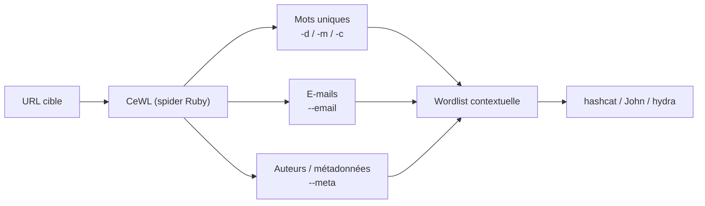

# CeWL — Wordlist sur mesure depuis un site web

> [!info] **En 1 phrase**
> CeWL spider un site web et en extrait tous les mots, e-mails et métadonnées pour créer une wordlist taillée pour la cible — des candidats réalistes, dérivés du contenu même du site.

---

## Overview

| Champ | Valeur |
|---|---|
| Nom complet | CeWL — Custom Word List Generator |
| Description | Spider un site web jusqu'à une profondeur configurable et génère une wordlist des mots uniques, des adresses e-mail et des noms d'auteurs extraits des métadonnées des documents (Office, PDF) |
| Catégorie | Wordlists & Générateurs |
| Sous-catégorie | Génération de wordlists contextuelles (web crawling / OSINT) |
| Fonction principale | Crawler un site et produire des listes de mots, e-mails et usernames utilisables par les crackers de mots de passe (hashcat, John the Ripper) ou les outils de bruteforce en ligne (hydra) |
| Type d'outil | CLI (script Ruby) |
| Licence | GPL-3.0+ (ajoutée en v5.1 pour permettre l'inclusion dans Debian) |
| Open source / propriétaire | Open source |
| Langage(s) de programmation | Ruby (gems : Spider, Nokogiri, mini_exiftool, rubyzip, public_suffix, getoptlong, mime-types) |
| Développeur / organisation | Robin Wood (digi.ninja) |
| Projet officiel | Projet personnel de Robin Wood, maintenu sur GitHub |
| Dépôt officiel | https://github.com/digininja/CeWL |
| Documentation officielle | https://digi.ninja/projects/cewl.php |
| Date de création | ~2009-2010 (inspiré de l'épisode 129 de PaulDotCom) ; dépôt GitHub créé le 22 avril 2016 |
| État du projet | actif (copyright 2026, mises à jour régulières) |
| Dernière version connue | 6.3.1 « GetOptLong Deps » (master) ; les paquets Kali/Debian peuvent embarquer la 6.2.x |
| Systèmes compatibles | Linux, macOS, BSD, Windows (via Ruby ou WSL) |

> [!note] Pour vérifier / compléter
> CeWL se prononce « cool ». Il est livré avec un outil compagnon, **FAB** (`fab.rb`), qui extrait les auteurs de fichiers déjà téléchargés. La version master affiche `6.3.1` ; le README documente la 6.2.1.

---

## Concept

CeWL est né d'une discussion sur **PaulDotCom (épisode 129)** : plutôt que d'utiliser une wordlist générique comme rockyou, Robin Wood a eu l'idée de **crawler le site de la cible** pour récupérer les mots réellement employés par l'organisation — noms de produits, slogans, marques, noms de personnes. Ces mots, combinés aux e-mails et aux métadonnées des documents publics, produisent des candidats de mots de passe infiniment plus réalistes que des listes génériques : un utilisateur tend à bâtir son mot de passe autour de son univers professionnel.

Il se place en **reconnaissance/OSINT**, avant l'étape de cracking : la chaîne typique est `CeWL → rsmangler/CUPP/Mentalist → hashcat/JtR/hydra`. Le spider suit les liens internes du domaine (hôte, port et schéma doivent correspondre, sauf option `--offsite`), jusqu'à une profondeur `-d` (défaut 2). Il ignore volontairement **robots.txt** (la classe `MySpiderInstance#allowed?` est surchargée pour retourner `true`), ce qui est légalement délicat sur une cible non autorisée mais précieux en test d'intrusion.

Historiquement : la v2 (2010) ajoute les e-mails et les métadonnées, la v3 gère les redirections JavaScript, la v4.2 remplace le parsing regex des liens par **Nokogiri**, la v5 apporte proxy et authentification, la v5.5 les groupes de mots, et les 6.x la capture de la structure URL. La v5.2 (refactorisation par @g0tmi1k) améliore la gestion des sites non-ASCII et du contenu JavaScript.



---

## Concepts fondamentaux

| Concept | Explication |
|---|---|
| Spidering / crawling | Parcours automatique des pages d'un site en suivant les liens (`<a href>`). CeWL utilise la gem Ruby `Spider` enrichie d'un parsing **Nokogiri** |
| Profondeur (`-d`) | Nombre maximum de sauts de liens à partir de la page de départ (BFS). Défaut 2 ; `-d 0` ne traite qu'une seule page ; les `mailto:` ignorent la limite de profondeur |
| Longueur minimale/maximale | `-m` (défaut 3) et `-x` filtrent les mots extraits : élimine le bruit (URLs, fragments HTML courts) |
| Wordlist contextuelle | Liste de mots tirée du contenu réel d'un site, vs listes génériques (rockyou, SecLists) : meilleur taux de réussite sur des mots de passe « maison » |
| Harvesting d'e-mails | Avec `-e`, CeWL collecte les adresses dans les liens `mailto:` et dans le corps des pages (regex) ; le préfixe local (`prenom.nom`) sert de base aux usernames |
| Métadonnées de documents | Avec `-a`, CeWL télécharge les documents (doc, docx, ppt, xls, pdf…) et passe leur contenu à **exiftool** (via la gem mini_exiftool) pour extraire auteurs et créateurs |
| robots.txt | Normalement respecté par la gem Spider, mais **désactivé** dans CeWL (surcharge `allowed?`) : tout est téléchargé |
| Groupes de mots (`-g`) | Depuis la v5.5 : regroupe jusqu'à N mots consécutifs (« passphrase » candidate type `mot1 mot2`) |

---

## Installation

```bash
# Debian / Ubuntu / Kali (paquet officiel, contient cewl.rb, fab.rb et les docs)
sudo apt update && sudo apt install -y cewl
# Arch Linux (via les sources Ruby ou AUR : cewl-git)
# Fedora / RHEL (via les sources ou gem ; le paquet n'est pas systématique)
# macOS
gem install cewl
# Windows : privilégier WSL (Linux) ou installer Ruby + gem
```

```bash
# Depuis les sources (recommandé pour avoir la dernière version)
git clone https://github.com/digininja/CeWL.git && cd CeWL
bundle install
chmod u+x ./cewl.rb
sudo ln -s $(pwd)/cewl.rb /usr/local/bin/cewl
cewl --version
```

```bash
# Docker (le dépôt fournit Dockerfile + compose.yml)
docker build -t cewl .
docker run --rm -v "$PWD:/data" cewl -d 2 -m 5 -w /data/words.txt https://example.com
```

> [!warning] Prérequis & problèmes potentiels
> - Ruby ≥ 3.0 conseillé ; les gems requises : `mime`, `mime-types`, `mini_exiftool`, `nokogiri`, `public_suffix`, `rubyzip`, `spider`, `getoptlong`. Installables via `bundle install`.
> - L'option `--meta` nécessite l'application **exiftool** (`sudo apt install exiftool`), pas seulement la gem.
> - L'authentification **digest** nécessite la gem `net-http-digest_auth` (`gem install net-http-digest_auth`).
> - Sur certains Ruby récents, un warning `mime-types` peut apparaître ; le cacher avec `ruby -W0 ./cewl.rb`.

---

## Configuration

CeWL n'a **pas de fichier de configuration** : tout se passe en ligne de commande. Les valeurs par défaut sont codées dans `cewl.rb` (profondeur 2, longueur minimale 3, répertoire temporaire `/tmp/`, port proxy 8080).

| Paramètre | Rôle | Valeur possible | Impact | Exemple |
|---|---|---|---|---|
| `-d` / `--depth` | Profondeur de spidering | Entier ≥ 0 (défaut 2) | Plus la valeur est grande, plus le crawl est large et long | `-d 3` |
| `-m` / `--min_word_length` | Longueur minimale des mots | Entier ≥ 1 (défaut 3) | Filtre le bruit des petits mots | `-m 5` |
| `-x` / `--max_word_length` | Longueur maximale | Entier ≥ 1 (défaut illimité) | Élimine les chaînes longues (URLs) | `-x 25` |
| `--meta-temp-dir` | Répertoire temporaire pour exiftool | Chemin (défaut `/tmp/`) | Doit exister et être inscriptible | `--meta-temp-dir /var/tmp` |
| `--proxy_host` / `--proxy_port` | Proxy HTTP | Hôte + port (défaut 8080) | Fait passer tout le crawl par un proxy (Burp) | `--proxy_host 127.0.0.1 --proxy_port 8080` |
| `--auth_type` | Authentification HTTP | `basic` ou `digest` | Nécessite aussi `--auth_user` et `--auth_pass` | `--auth_type basic` |
| `--header` / `-H` | En-tête HTTP additionnel | `nom:valeur` (répétable) | Cookies, tokens, en-têtes personnalisés | `-H "Cookie: session=abc"` |

> [!note] À vérifier
> `--meta-temp-dir` doit être un répertoire existant et inscriptible, sinon CeWL s'arrête avec une erreur avant même de crawler.

---

## Architecture interne

CeWL se compose de deux fichiers Ruby principaux (`cewl.rb` et `cewl_lib.rb`) plus `fab.rb` pour FAB :

- **`cewl.rb`** : parsing des options (gem `GetoptLong`), gestion des arguments, orchestration. Il définit `MySpider` (sous-classe de la gem `Spider`) et `MySpiderInstance` qui surchargent le comportement par défaut.
- **`MySpiderInstance#allowed?`** : retourne toujours `true` → **robots.txt ignoré**.
- **`get_page`** : requêtes `Net::HTTP` GET (proxy, en-têtes, auth basic/digest, redirections suivies, `SSL::VERIFY_NONE` pour HTTPS, gestion Zlib). Le User-Agent est personnalisable via `-u`.
- **`generate_next_urls`** : parsing des liens avec **Nokogiri** (`doc.css('a')`), exclusion des ancres `#`, reconstruction des URLs relatives.
- **Structure de crawl** : un **arbre BFS** (`Tree`/`TreeNode`) avec `max_depth` ; la pile `url_stack` alimente `generate_next_urls` ; les liens `mailto:` contournent la limite de profondeur (hack documenté par l'auteur).
- **Filtres d'URL** : ignore `.zip`, `.gz`, `.bz2`, `.png`, `.gif`, `.jpg` et les ancres ; les documents (Office, PDF…) sont conservés pour le mode `--meta`.
- **Traitement du contenu** : callback `:every` — suppression JS/CSS (sauf `--keep-js`/`--keep-css`), récupération du texte des attributs `alt`/`title` et des meta `description`/`keywords`, décodage des entités HTML, découpage en mots selon `-m`/`-x`, avec ou sans chiffres (`--with-numbers`), option `--lowercase` et `--convert-umlauts` (ä→ae, ö→oe, ü→ue, ß→ss).
- **Métadonnées** : les documents sont téléchargés vers `--meta-temp-dir` puis traités par `process_file` (dans `cewl_lib.rb`) via exiftool (gem mini_exiftool) ; `--keep` conserve le fichier téléchargé.

---

## Commandes

### Commandes principales

```bash
cewl [OPTIONS] ... <url>
```

| Commande | Objectif | Résultat attendu |
|---|---|---|
| `cewl http://cible.local` | Crawler la page et ses liens (profondeur 2, mots ≥ 3) | Mots uniques triés par fréquence sur stdout |
| `cewl -d 0 http://cible.local` | Ne traiter qu'une seule page | Mots de la page d'accueil uniquement |
| `cewl -d 2 -m 5 -w words.txt http://cible.local` | Crawl classique avec longueur minimale 5, écriture fichier | Fichier `words.txt` |
| `cewl --email -e` … | Voir options ; extraction des e-mails | Liste d'adresses en sortie |

### Commandes avancées

```bash
# E-mails vers un fichier dédié, mots vers un autre
cewl -e --email_file emails.txt -w words.txt -d 2 https://cible.local
# Métadonnées (auteurs) séparées
cewl -a --meta_file authors.txt -d 2 https://cible.local
# Groupes de mots (passphrases) de 3 mots
cewl -g 3 -w groups.txt -d 1 https://cible.local
# Crawl authentifié à travers un proxy (Burp)
cewl --auth_type basic --auth_user admin --auth_pass pwd --proxy_host 127.0.0.1 --proxy_port 8080 https://intranet.cible.local
```

---

## Options et flags

| Option | Description | Exemple | Niveau |
|---|---|---|---|
| `-h, --help` | Affiche l'aide | `cewl --help` | Basic |
| `-d N, --depth N` | Profondeur de spidering (défaut 2) | `cewl -d 3 URL` | Basic |
| `-m N, --min_word_length N` | Longueur minimale des mots (défaut 3) | `cewl -m 5 URL` | Basic |
| `-w F, --write F` | Écrit la wordlist dans un fichier | `cewl -w words.txt URL` | Basic |
| `-u UA, --ua UA` | User-Agent personnalisé | `cewl -u "Googlebot" URL` | Basic |
| `-v, --verbose` | Mode verbeux (URLs visitées, codes, découvertes) | `cewl -v URL` | Basic |
| `-e, --email` | Inclut les e-mails (mailto + corps de page) | `cewl -e URL` | Intermediate |
| `-E F, --email_file F` | Fichier dédié aux e-mails | `cewl -e -E emails.txt URL` | Intermediate |
| `-a, --meta` | Inclut les métadonnées des documents (exiftool) | `cewl -a URL` | Intermediate |
| `-M F, --meta_file F` | Fichier dédié aux métadonnées | `cewl -a -M authors.txt URL` | Intermediate |
| `-c, --count` | Affiche le compteur par mot (`mot, N`) | `cewl -c URL` | Intermediate |
| `-x N, --max_word_length N` | Longueur maximale des mots | `cewl -x 25 URL` | Intermediate |
| `-o, --offsite` | Autorise le suivi des liens externes | `cewl -o URL` | Intermediate |
| `-n, --no-words` | Ne sort pas la wordlist (seulement e-mails/meta) | `cewl -n -e URL` | Advanced |
| `-g N, --groups N` | Génère des groupes de N mots consécutifs | `cewl -g 3 URL` | Advanced |
| `--with-numbers` | Accepte les mots contenant des chiffres | `cewl --with-numbers URL` | Advanced |
| `--lowercase` | Convertit tous les mots en minuscules | `cewl --lowercase URL` | Advanced |
| `--convert-umlauts` | ä→ae, ö→oe, ü→ue, ß→ss | `cewl --convert-umlauts URL` | Advanced |
| `--exclude F` | Fichier de chemins à exclure du crawl | `cewl --exclude no.txt URL` | Advanced |
| `--keep-js` / `--keep-css` | Garde JS/CSS au lieu de les retirer | `cewl --keep-js URL` | Advanced |
| `--capture-url-structure` | Domaine + chemins + sous-domaines ajoutés à la wordlist | `cewl --capture-url-structure URL` | Advanced |
| `-k, --keep` | Conserve les fichiers téléchargés (mode meta) | `cewl -a -k URL` | Expert |
| `--auth_type / --auth_user / --auth_pass` | Authentification basic ou digest | `cewl --auth_type basic -U admin -P pwd URL` | Expert |
| `--proxy_host / --proxy_port` | Proxy (port défaut 8080) | `cewl --proxy_host 127.0.0.1 URL` | Expert |
| `-H H, --header H` | En-tête HTTP (répétable) | `cewl -H "Cookie: x=1" URL` | Expert |

> [!tip] Options les plus utiles au quotidien
> `-d 2 -m 5` (crawl raisonnable, mots propres), `-w fichier` (sortie exploitable), `-e` pour les usernames potentiels, `-a` pour les auteurs, `--email_file`/`--meta_file` pour séparer les flux. Penser à `--lowercase` pour dédoublonner avec une liste existante.

---

## Exemples pratiques

### Beginner

```bash
# Objectif : première wordlist rapide d'un site
cewl -d 2 -m 4 -w /tmp/mots.txt https://example.com
# Objectif : voir ce que contient le site avant d'écrire un fichier
cewl -d 1 -c https://example.com | head -30
```

Explication : la première commande crawle le site sur 2 niveaux, ne garde que les mots d'au moins 4 caractères et écrit le résultat dans `/tmp/mots.txt`. La seconde affiche les mots triés par fréquence (`-c`). Erreur possible : `Missing URL argument` si l'URL est oubliée.

### Intermediate

```bash
# Objectif : récupérer les usernames probables depuis les e-mails
cewl -e -d 2 https://example.com | sed 's/@.*//' | sort -u > /tmp/users.txt
# Objectif : wordlist + e-mails + auteurs en trois fichiers
cewl -e -a -d 2 -w /tmp/mots.txt --email_file /tmp/emails.txt --meta_file /tmp/auteurs.txt https://example.com
```

Explication : la première ligne extrait le préfixe local des adresses (le `prenom.nom` avant le `@`) pour bâtir une liste d'usernames ; la seconde sépare les trois flux de données dans des fichiers distincts.

### Advanced

```bash
# Objectif : enrichir la wordlist avec la structure du site (chemins, sous-domaines)
cewl --capture-url-structure -d 1 -m 3 -w /tmp/structure.txt https://example.com
# Objectif : mots contenant des chiffres + minuscules pour fusion avec d'autres listes
cewl --with-numbers --lowercase -d 2 -m 4 -w /tmp/final.txt https://example.com
```

### Expert

```bash
# Objectif : crawl authentifié et filtré à travers un proxy Burp, en ne suivant
# que certaines sections, avec debug pour diagnostiquer
cewl --debug --proxy_host 127.0.0.1 --proxy_port 8080 \
     --auth_type basic --auth_user tuser --auth_pass tpass \
     --allowed '/docs|/blog' --email_file /tmp/em.txt \
     -w /tmp/words.txt https://intranet.cible.local
```

---

## Workflow complet (scénario pas à pas)

1. **Cadrer le périmètre** — lister les pages pertinentes (contact, produits, blog, « notre équipe ») et vérifier qu'on a l'autorisation de crawler.
2. **Crawler le site et écrire la wordlist** :
   ```bash
   cewl -d 2 -m 5 -w /tmp/cewl.txt https://example.com
   ```
3. **Récupérer les e-mails** (usernames probables) :
   ```bash
   cewl -e -d 2 --email_file /tmp/emails.txt https://example.com
   sed 's/@.*//' /tmp/emails.txt | sort -u > /tmp/users.txt
   ```
4. **Extraire les métadonnées des documents** :
   ```bash
   cewl -a -d 2 --meta_file /tmp/auteurs.txt https://example.com
   ```
5. **Normaliser et fusionner** (minuscules, dédoublonnage) :
   ```bash
   cat /tmp/cewl.txt /tmp/auteurs.txt | tr 'A-Z' 'a-z' | sort -u > /tmp/base.txt
   ```
6. **Muter la liste** pour couvrir les variations (années, suffixes) :
   ```bash
   rsmangler --file /tmp/base.txt --output /tmp/mutes.txt
   ```
7. **Utiliser la liste** — hors-ligne avec hashcat, ou en ligne avec hydra :
   ```bash
   hashcat -m 1000 ntlm.txt /tmp/mutes.txt -r /usr/share/hashcat/rules/best64.rule
   hydra -L /tmp/users.txt -P /tmp/mutes.txt ssh://10.10.20.15 -t 4
   ```

---

## Scénarios avancés

### Scénario 1 : mot de passe d'un blog corporatif

Crawler profondément le blog (les noms de produits et expressions maison y abondent), puis muter avec rsmangler avant l'attaque SSH :

```bash
cewl -d 4 -m 4 -e -u "Mozilla/5.0 (Windows NT 10.0; Win64; x64)" -w /tmp/blog.txt https://blog.cible.local
rsmangler --file /tmp/blog.txt --output /tmp/blog_mutes.txt
hydra -L /tmp/users.txt -P /tmp/blog_mutes.txt ssh://10.10.20.15 -t 4
```

### Scénario 2 : usernames et auteurs via le domaine mail

Les métadonnées des PDF/DOCX publics contiennent souvent le créateur (« prenom.nom ») ; croiser avec le préfixe des e-mails :

```bash
cewl -a -e -d 1 --email_file /tmp/emails.txt --meta_file /tmp/auteurs.txt https://cible.local
cat /tmp/emails.txt /tmp/auteurs.txt | sed 's/@.*//' | sed 's/[^[:alpha:] .-]//g' | sort -u > /tmp/users.txt
```

### Scénario 3 : passphrases par groupes de mots

Pour les politiques exigeant des phrases de passe, générer les groupes de mots consécutifs (v5.5+) :

```bash
cewl -g 3 -d 2 -w /tmp/groups.txt https://cible.local
# ligne type : "acme security report"
wc -l /tmp/groups.txt
```

---

## Cybersecurity use cases

| Phase | Utilisation |
|---|---|
| Reconnaissance | Collecte passive de contenu, structure du site, mots-clés métier |
| OSINT | E-mails (`-e`) et auteurs de documents (`-a`) → base de usernames |
| Énumération | `--capture-*` : découverte de chemins, sous-domaines, domaine via la structure URL |
| Credential Access | Alimente le cracking hors-ligne (hashcat, John) et le bruteforce en ligne (hydra, Medusa, ncrack) |
| Password Spraying | Mots mutés (rsmangler, CUPP) fournissent des candidats plausibles par compte |
| Post-exploitation | Le compte obtenu peut être réutilisé ; les métadonnées servent au social engineering |

---

## MITRE ATT&CK

| Tactique | Technique / Sub-technique | ID | Raison | Détection | Mitigation |
|---|---|---|---|---|---|
| Reconnaissance | Gather Victim Identity Information : Email Addresses | T1589.002 | `-e` collecte les adresses mail publiques pour deviner les usernames | Corréler le volume de requêtes + robots.txt | Limiter les infos publiées, anti-scraping |
| Reconnaissance | Gather Victim Identity Information : Employee Names | T1589.003 | `-a` extrait auteurs/créateurs des documents (exiftool) | Logs des téléchargements de documents | Nettoyer les métadonnées avant publication |
| Reconnaissance | Search Open Websites/Domains : External Website | T1593.001 | CeWL cherche de l'information sur le site public de la cible | Surveillance du crawling intensif | WAF anti-bot, rate limiting |
| Credential Access | Brute Force : Password Guessing | T1110.001 | La wordlist générée sert à deviner des mots de passe sur les services | Alertes sur échecs d'authentification | MFA, verrouillage, politique de mots de passe |

> [!note] Ne renseigner que si l'association est réellement pertinente.
> CeWL est un outil de **reconnaissance active** : il n'effectue pas lui-même le brute-force mais nourrit T1110.x via les wordlists produites.

---

## Defensive Security

### Signes observables

| Indicateur | Détail |
|---|---|
| Raft de requêtes GET à profondeur croissante | Crawl BFS : plusieurs vagues de requêtes vers des pages liées |
| User-Agent anormal | Par défaut CeWL envoie un UA « Ruby Spider » ; sinon UA customisé (`-u`) |
| Téléchargement de documents en rafale | PDF/DOCX/XLS récupérés puis traités (exiftool) — révélateur du mode `-a` |
| Robots.txt contourné | Un crawler qui télécharge les pages explicitement interdites par robots.txt |
| Fréquence anormale sur les pages « Équipe » / « Contact » | Cible favorite pour la collecte de noms et e-mails |
| Processus `exiftool` ou fichiers temporaires dans `/tmp` | Marque du traitement des métadonnées (si fichiers conservés) |

### Règles de détection (Sigma / Suricata / Snort / YARA)

```yaml
# Sigma — accès web : UA de spidering suspect dans les logs du serveur
title: Suspicious Web Crawler User-Agent
id: 7f2c3a1b-4d5e-4f6a-8b7c-9d0e1f2a3b4c
status: test
logsource:
    category: webserver
    product: apache
detection:
    selection_crawler_ua:
        cs-user-agent|contains:
            - 'CeWL'
            - 'Ruby Spider'
            - 'spider'
    selection_many_requests:
        c-ip: '*'
    condition: selection_crawler_ua and selection_many_requests
falsepositives:
    - Outils de monitoring internes (UptimeRobot, SEO crawlers)
level: medium
```

```bash
# Suricata/Snort — rafale de requêtes HTTP d'un même hôte (pattern pédagogique)
alert tcp any any -> any 80 (msg:"Suspicious high-rate HTTP crawling from single host";
  flow:to_server,established; content:"GET"; http_method;
  threshold:type both, track by_src, count 200, seconds 60;
  sid:1000002; rev:1;)
```

---

## Automatisation

```bash
# Bash — générer une wordlist pour chaque sous-domaine connu (via subfinder)
for d in $(subfinder -d example.com -silent); do
    cewl -d 2 -m 5 -w "/tmp/wl_$d.txt" "https://$d" 2>/dev/null
done
cat /tmp/wl_*.txt | sort -u > /tmp/global.txt
```

```python
# Python — wrapper CeWL : crawl + mutation pour un pipeline de cracking
import subprocess, sys

url = sys.argv[1]
subprocess.run(["cewl", "-d", "2", "-m", "5", "-w", "/tmp/cewl.txt", url], check=True)
subprocess.run(["rsmangler", "--file", "/tmp/cewl.txt", "--output", "/tmp/mutes.txt"], check=True)
with open("/tmp/words.txt", "w") as out:
    with open("/tmp/mutes.txt") as f:
        for line in sorted(set(f.read().splitlines())):
            out.write(line.lower() + "\n")
print("Wordlist ready: /tmp/words.txt")
```

---

## Output et parsing

CeWL écrit sur **stdout** par défaut (un mot par ligne), ou dans des fichiers via `-w`, `--email_file`, `--meta_file`. Avec `-c`, chaque ligne devient `mot, compteur`. La wordlist est triée par fréquence décroissante.

```bash
# Dédoublonner et normaliser une wordlist
tr 'A-Z' 'a-z' < /tmp/cewl.txt | sort -u > /tmp/clean.txt
# Récupérer uniquement les e-mails depuis --email_file
grep -Eio '[a-z0-9._%+-]+@[a-z0-9.-]+\.[a-z]{2,}' /tmp/emails.txt | sort -u
# Extraire les usernames (préfixe local des e-mails)
sed 's/@.*//' /tmp/emails.txt | sort -u
```

```python
# Python — parsing de la sortie -c (mot, compteur) pour trier par pertinence
import csv
with open("/tmp/cewl.txt") as f:
    rows = [(w, int(c)) for w, c in (line.strip().split(",") for line in f if "," in line)]
for w, c in sorted(rows, key=lambda x: x[1], reverse=True)[:20]:
    print(f"{c:>6}  {w}")
```

---

## Intégrations

```text
Site web → CeWL (mots + e-mails + métadonnées) → rsmangler / CUPP / Mentalist → hashcat / John / hydra → comptes valides
```

- [[Tools| Outils]] global
- [[Outil - hashcat|hashcat]] · [[Outil - John the Ripper|John the Ripper]] — cracking hors-ligne des wordlists générées
- [[Outil - hydra|hydra]] · [[Outil - Medusa|Medusa]] · [[Outil - ncrack|ncrack]] · [[Outil - Patator|Patator]] — bruteforce en ligne
- [[Outil - rsmangler|rsmangler]] · [[Outil - CUPP|CUPP]] · [[Outil - Mentalist|Mentalist]] · [[Outil - pydictor|pydictor]] · [[Outil - Crunch|Crunch]] · [[Outil - kwprocessor|kwprocessor]] — mutation / combinaison / génération complémentaires
- [[Outil - SecLists|SecLists]] — listes pré-fabriquées à fusionner avec la wordlist contextuelle
- [[Outil - OneRuleToRuleThemAll|OneRuleToRuleThemAll]] — règles de mutation appliquées aux mots de CeWL
- [[Outil - Burp Suite|Burp Suite]] — proxy (crawl à travers Burp) et spider alternatif
- [[Outil - gobuster|gobuster]] · [[Outil - ffuf|ffuf]] · [[Outil - wfuzz|wfuzz]] · [[Outil - dirsearch|dirsearch]] — découverte de contenu web (complément du mode `--capture-paths`)
- [[Outil - subfinder|subfinder]] · [[Outil - theHarvester|theHarvester]] · [[Outil - Recon-ng|Recon-ng]] · [[Outil - spiderfoot|spiderfoot]] · [[Outil - Maltego|Maltego]] — OSINT amont (domaines, e-mails)
- [[01 - Reconnaissance| Reconnaissance]] · [[08 - Password Cracking| Password Cracking]]
- [[Techniques/Password Cracking| Password Cracking]] · [[Techniques/Password Spraying|Password Spraying]] · [[Techniques/Brute Force Rate Limit|Brute Force Rate Limit]]

---

## Alternatives

| Outil | Avantages | Inconvénients | Cas d'usage |
|---|---|---|---|
| [[Outil - Burp Suite|Burp Suite]] (spider) | Crawl intégré avec session/auth, GUI, scripts | Plus lourd, nécessite l'interception | Analyses web profondes avec authentification |
| [[Outil - CUPP|CUPP]] | Génère des mots à partir d'un profil (nom, dates) | Nécessite de connaître la cible | Wordlist personnalisée « intelligence » |
| [[Outil - rsmangler|rsmangler]] | Mutation massive d'une liste existante | Ne récolte pas le contenu du site | Enrichir la sortie de CeWL |
| [[Outil - Mentalist|Mentalist]] | GUI complète : mutation + combinaison + expansion | GUI Windows, moins scriptable | Construire des listes visuellement |
| [[Outil - pydictor|pydictor]] | Génération par masque, permutation, extension | Syntaxe complexe | Listes masquées précises |
| [[Outil - SecLists|SecLists]] | Listes prêtes à l'emploi, énorme corpus | Générique, non contextuel | Point de départ rapide |

> **Quand utiliser CeWL plutôt que Burp/SecLists ?** Quand la cible est une organisation dont le site public reflète le vocabulaire : CeWL produit du contenu contextuel que ni rockyou ni SecLists ne couvrent. Pour du contenu derrière authentification, Burp (ou CeWL avec `--auth_type`/`--header`) est plus adapté.

---

## Performance

- **Mono-thread** : la gem `Spider` de Ruby récupère les pages séquentiellement — CeWL est lent sur les gros sites (pas de parallélisation ni `--min-rate`).
- **Complexité exponentielle** : chaque niveau de profondeur multiplie le nombre d'URLs possibles. `-d 4` sur un gros site peut générer des dizaines de milliers de requêtes ; limiter avec `--allowed`/`--exclude`.
- **Taille de sortie** : typiquement de quelques centaines à quelques dizaines de milliers de mots uniques selon le site et les réglages `-m`/`-x`/`--with-numbers`.
- **Coût réseau** : la collecte d'e-mails scanne le corps de chaque page (regex) ; le mode `--meta` ajoute le téléchargement de tous les documents rencontrés.

> [!note] À vérifier
> Chiffres absents de la documentation officielle : ce sont des ordres de grandeur observés en pratique, qui dépendent du site, du réseau et du matériel.

---

## Troubleshooting

### Common problems

#### Problème : « Error: spider gem not installed »

- **Cause** : dépendances Ruby absentes.
- **Solution** : `bundle install` dans le dossier CeWL (ou `gem install spider nokogiri mime-types mini_exiftool rubyzip public_suffix getoptlong`).
- **Vérification** : `cewl --version` affiche la version.

#### Problème : « Meta data found » vide alors que le site a des documents

- **Cause** : exiftool non installé, ou `--meta-temp-dir` non inscriptible.
- **Solution** : `sudo apt install exiftool` et vérifier `--meta-temp-dir` ; tester avec `-k` puis `exiftool <fichier>` manuellement.
- **Vérification** : `which exiftool`.

#### Problème : « Failed to connect to the proxy (host:port) »

- **Cause** : proxy injoignable ou port erroné.
- **Solution** : vérifier le proxy (`--proxy_port` défaut 8080), l'ordre hôte/port, et que Burp est démarré.
- **Vérification** : `curl -x http://127.0.0.1:8080 -I https://example.com`.

#### Problème : l'interruption Ctrl-C ne garde pas les résultats

- **Cause** : la sortie intermédiaire n'est écrite qu'à la fin ; seule la v5.4+ garde les résultats déjà collectés sur SIGINT.
- **Solution** : utiliser une version récente ; sinon écrire dans `-w` et relancer avec `--debug` pour suivre.
- **Vérification** : après Ctrl-C, le fichier `-w` contient les mots collectés jusqu'à l'interruption.

---

## Sécurité de l'outil

- **robots.txt ignoré** : la surcharge `allowed?` télécharge tout, y compris ce que le site interdit. Crawler sans autorisation peut être **illicite** et déclencher des alertes — réservé aux périmètres autorisés.
- **Certificats TLS non vérifiés** : `SSL::VERIFY_NONE` expose les requêtes à un MITM (utile pour Burp, risqué hors lab).
- **Fichiers temporaires** : le mode `--meta` écrit les documents dans `--meta-temp-dir` (défaut `/tmp/`) ; `-k` les conserve — à nettoyer après usage.
- **Dépendances Ruby** : les gems sont des dépendances tierces (risque supply chain) — utiliser `bundle install` avec un Gemfile verrouillé.
- **Mot de passe en CLI** : `--auth_user`/`--auth_pass` apparaissent dans l'historique du shell (via `history` ou le process list) — prudence sur les machines partagées.

---

## Limitations

- **Pas de rendu JavaScript** : les SPA (Vue/React) ne sont pas exploitées ; CeWL ne récupère qu'une partie du contenu JS (les chaînes et les redirections `location.href`).
- **Mono-thread** : lent sur les gros sites ; pas de parallélisme ni de rate control fin.
- **robots.txt ignoré** : peut provoquer des alertes SOC et du rate limiting défensif.
- **Casse préservée** : « Product » et « product » sont deux mots distincts (choix assumé de l'auteur) — penser à `--lowercase`.
- **Mots courts = bruit** : sans `-m` raisonnable, la liste est polluée par des fragments HTML.
- **Dépendance exiftool** obligatoire pour les métadonnées.
- **Pas de cache persistant** : chaque run recrawle tout ; `-k` ne conserve que les fichiers du mode meta.

---

## Cheatsheet

```bash
# Crawl standard (profondeur 2, mots >= 5, fichier)
cewl -d 2 -m 5 -w words.txt https://example.com

# Extraction des e-mails (usernames potentiels)
cewl -e -d 2 --email_file emails.txt https://example.com

# Extraction des métadonnées des documents (auteurs)
cewl -a -d 2 --meta_file authors.txt https://example.com

# Tout en une passe, trois fichiers
cewl -e -a -d 2 -w words.txt --email_file emails.txt --meta_file authors.txt https://example.com

# Groupes de mots (passphrases) + comptage
cewl -g 3 -c https://example.com

# Structure URL : chemins, sous-domaines, domaine
cewl --capture-url-structure -d 1 -w structure.txt https://example.com

# Normalisation et fusion avec d'autres listes
cat words.txt authors.txt | tr 'A-Z' 'a-z' | sort -u > final.txt
```

---

## Quick reference

| | |
|---|---|
| **À quoi sert-il ?** | Générer une wordlist contextuelle (mots, e-mails, auteurs) en crawlant le site d'une cible |
| **Quand l'utiliser ?** | Phase de reconnaissance/OSINT, avant le cracking de mots de passe |
| **Commande principale** | `cewl -d 2 -m 5 -w words.txt https://example.com` |
| **Alternative principale** | [[Outil - CUPP|CUPP]] (profil), [[Outil - rsmangler|rsmangler]] (mutation), [[Outil - SecLists|SecLists]] (listes prêtes) |
| **Concepts importants** | Spidering BFS, profondeur, longueur min/max, e-mail harvesting, métadonnées exiftool, robots.txt ignoré |
| **Liens associés** | [[Outil - hashcat|hashcat]] · [[Outil - John the Ripper|John the Ripper]] · [[Outil - hydra|hydra]] · [[Outil - CUPP|CUPP]] · [[Outil - rsmangler|rsmangler]] |

---

## Détection & Défense

| Signe | Défense |
|---|---|
| Rafale de GET à profondeur croissante depuis une IP | Rate limiting + CAPTCHA sur les pages publiques |
| UA « Ruby Spider » / « CeWL » ou UA customisé | Détection d'UA de crawler + blocage |
| Téléchargement massif de documents (PDF/DOCX/XLS) | Limiter l'accès aux documents, surveiller les bursts |
| Contournement de robots.txt | Bloquer par IP après dépassement de seuil (fail2ban) |
| Processus exiftool ou fichiers dans /tmp | EDR : détection des outils de scraping de métadonnées |
| Accès répété aux pages « Équipe » / « Contact » | Corrélation SIEM + alertes anti-scraping |

---

## Tips & Pièges

> [!tip] **Tips**
> - Toujours combiner `-d 2 -m 5 -w fichier` : profondeur raisonnable, mots propres, sortie exploitable.
> - Utiliser `--email_file` et `--meta_file` pour séparer les flux : les usernames (préfixe local des e-mails) et les auteurs sont des candidats précieux.
> - Appliquer `--lowercase` puis `sort -u` avant de nourrir hashcat/hydra : moins de doublons, cracking plus rapide.
> - Faire suivre CeWL de [[Outil - rsmangler|rsmangler]] (mutation) et d'une règle type [[Outil - OneRuleToRuleThemAll|OneRuleToRuleThemAll]] pour couvrir les variations (année, majuscules, suffixes).
> - Penser à `--capture-url-structure` : les noms de chemins et de sous-domaines révèlent le vocabulaire technique interne.

> [!warning] **Pièges**
> - Les sites SPA (100 % JavaScript) donnent une wordlist quasi vide : vérifier avec `curl` avant d'attribuer un échec à CeWL.
> - `-d 5+` sur un gros site génère un volume de requêtes massif (et des alertes) : rester raisonnable, surtout en production.
> - robots.txt est **ignoré** : un crawl peut être illégal sur une cible non autorisée — toujours vérifier le périmètre.
> - Les mots courts (< 4 caractères) sont du bruit HTML : utiliser `-m 4` minimum.
> - `--meta` sans exiftool installé ne produit rien : vérifier `which exiftool` d'abord.

---

## References

### Official

- Documentation officielle (page projet) : https://digi.ninja/projects/cewl.php
- GitHub officiel : https://github.com/digininja/CeWL
- Changelog : https://github.com/digininja/CeWL/blob/master/changelog.md
- Code source (cewl.rb) : https://github.com/digininja/CeWL/blob/master/cewl.rb

### Security references

- MITRE ATT&CK T1589 — Gather Victim Identity Information : https://attack.mitre.org/techniques/T1589/
- MITRE ATT&CK T1593 — Search Open Websites/Domains : https://attack.mitre.org/techniques/T1593/
- MITRE ATT&CK T1110 — Brute Force : https://attack.mitre.org/techniques/T1110/

### Community

- PaulDotCom Episode 129 (discussion à l'origine de CeWL) : https://wiki.securityweekly.com/wiki/index.php/Episode129
- HackTricks — Password Cracking (wordlists) : https://book.hacktricks.wiki/en/crypto-and-stego/password-cracking.html
- Null Byte — CeWL wordlist tutorials : https://null-byte.wonderhowto.com/

---

**Liens :** [[Tools| Outils]] · [[Outil - hashcat|hashcat]] · [[Techniques/Password Cracking| Password Cracking]] · [[Outil - CUPP|CUPP]] · [[Outil - rsmangler|rsmangler]] · [[Outil - SecLists|SecLists]]
