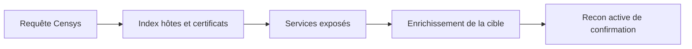

# Censys — Moteur de recherche sur l'Internet réel

> [!info] **En 1 phrase**
> Censys indexe en continu les hôtes, services, certificats et vulnérabilités du monde entier pour cartographier la surface d'attaque d'une organisation.

---

## Overview

| Champ | Valeur |
|---|---|
| Nom complet | Censys Search (plateforme) + Censys Python (CLI/bibliothèque) |
| Description | Moteur de recherche sur les hôtes Internet : services, bannières, certificats TLS, configurations et vulnérabilités indexés par scans continus |
| Catégorie | Reconnaissance & OSINT |
| Sous-catégorie | Moteurs de recherche / scan d'Internet |
| Fonction principale | Retrouver les actifs et services exposés d'une organisation sans scan direct |
| Type d'outil | Service SaaS + CLI Python + bibliothèque |
| Licence | CLI/bibliothèque : Apache 2.0 ; plateforme : propriétaire (SaaS) |
| Open source / propriétaire | CLI Python open source ; moteur d'indexation propriétaire |
| Langage(s) de programmation | Python (client), infrastructure interne en Rust/Go (Censys Search 2.0) |
| Développeur / organisation | Censys, Inc. |
| Projet officiel | Censys (censys.io) |
| Dépôt officiel | https://github.com/censys/censys-python |
| Documentation officielle | https://docs.censys.io |
| Date de création | 2015 (fondation de Censys, issues du projet ZMap de l'Université du Michigan) |
| État du projet | actif |
| Dernière version connue | censys-python v2.2.19 (2025-12-11) |
| Systèmes compatients | Linux, Windows, macOS (Python 3.8+) |

> [!note] Pour vérifier / compléter
> Censys est cité par MITRE ATT&CK comme exemple de « Scan Databases » (T1596.005). L'accès gratuit est limité (quota de recherches et de crédits) ; les données commerciales passent par un abonnement.

---

## Concept

Censys est un moteur de recherche qui scanne l'ensemble de l'Internet : chaque hôte public est interrogé, ses services (banners, versions), ses certificats TLS et ses vulnérabilités sont indexés. Pour la recon offensive : retrouver tous les assets d'une organisation via les certificats émis pour ses domaines, chercher des services exposés (RDP, SSH, bases de données), identifier une version vulnérable d'un produit, et vérifier qu'un service n'est pas déjà public avant d'attaquer.

Censys repose sur plusieurs index distincts : `hosts` (IP et leurs services), `certificates` (transparence des certificats TLS), `configs` (configurations type MQTT, Docker, Kubernetes exposées) et `vulnerabilities` (CVE associées aux versions détectées). La syntaxe de requête utilise des champs structurés (`services.service_name:HTTP`), des opérateurs logiques (`and`, `or`, `not`) et des plages. Accès web (search.censys.io), API REST et CLI Python `censys`. Position : phase de recon « moteurs de recherche », en complément de Shodan et de l'énumération DNS passive.



---

## Concepts fondamentaux

| Concept | Explication |
|---|---|
| Index `hosts` | Un hôte = une adresse IP avec ses services, ports, bannières, logiciels (versions) et géolocalisation |
| Index `certificates` | Données de Certificate Transparency : tous les certificats émis, leurs noms (`names`), organisation, dates |
| Index `configs` | Configurations exposées détectées par des scanners spécialisés : MQTT, Docker, Kubernetes, K8s… |
| Index `vulnerabilities` | CVE associées aux versions de logiciels détectées sur les hôtes |
| Query DSL | Langage de requête : `champ:valeur`, opérateurs `and/or/not`, parenthèses, plages `[a TO b]`, existance (`champ:*`) |
| Certificate Transparency (CT) | Journaux publics de certificats : interroger `names: example.com` retrouve toute l'infrastructure liée à un domaine |
| Virtual hosts | Plusieurs sites web sur la même IP : options `EXCLUDE` / `INCLUDE` / `ONLY` pour gérer les vhosts |
| API keys | Paire ID + secret (`CENSYS_API_ID`, `CENSYS_API_SECRET`) authentifiant les requêtes API/CLI |
| Résultat paginé | Les recherches retournent des pages de résultats (20 par page par défaut) : `--page-size` / `--max-pages` |

---

## Installation

### Debian / Ubuntu / Kali Linux

```bash
# via pip (Python 3.8+)
sudo apt install -y python3-pip
pip install --user censys
censys --version
```

### Arch Linux

```bash
sudo pacman -S python-pip
pip install --user censys
```

### Fedora / RHEL

```bash
sudo dnf install python3-pip
pip install --user censys
```

### macOS

```bash
pip install censys
```

### Windows

```powershell
python -m pip install censys
censys --version
```

### Docker

```bash
docker pull python:3.12-slim
docker run --rm -it -e CENSYS_API_ID="XXXX" -e CENSYS_API_SECRET="YYYY" python:3.12-slim \
  sh -c "pip install censys && censys search 'services.service_name:HTTP'"
```

### Compilation depuis les sources

```bash
git clone https://github.com/censys/censys-python.git && cd censys-python
pip install poetry
poetry install
```

> [!warning] Prérequis & problèmes potentiels
> - Compte gratuit requis sur search.censys.io pour obtenir les clés API (`censys config`).
> - Le quota gratuit est limité : surveiller les recherches pour ne pas être bloqué temporairement.
> - Python 3.8+ requis ; testé jusqu'à Python 3.10 par le projet.

---

## Configuration

### Fichier de configuration

`censys config` écrit les clés dans `~/.config/censys/censys.cfg` (Linux/macOS) ou `%USERPROFILE%\.config\censys\censys.cfg` (Windows). Variables d'environnement alternatives : `CENSYS_API_ID`, `CENSYS_API_SECRET`.

| Paramètre | Rôle | Valeur possible | Impact | Exemple |
|---|---|---|---|---|
| `CENSYS_API_ID` | Identifiant API | chaîne (API ID du compte) | Authentification obligatoire | `export CENSYS_API_ID="xxxx-xxxx"` |
| `CENSYS_API_SECRET` | Secret API | chaîne (API Secret du compte) | Authentification obligatoire | `export CENSYS_API_SECRET="yyyy"` |
| `[credentials] api_id` | ID dans `censys.cfg` | chaîne | Stockage persistant des clés | `api_id = xxxx` |
| `[credentials] api_secret` | Secret dans `censys.cfg` | chaîne | Stockage persistant des clés | `api_secret = yyyy` |
| `--index-type` | Index interrogé | `hosts` / `certificates` / `configs` / `vulnerabilities` | Nature des résultats | `--index-type hosts` |
| `--format` | Format de sortie | `json` / `csv` / `table` | Exploitabilité en pipeline | `--format json` |
| `--max-pages` | Nombre de pages max | entier | Consommation de quota | `--max-pages 5` |
| `--virtual-hosts` | Gestion des vhosts | `EXCLUDE` / `INCLUDE` / `ONLY` | Pertinence des hôtes web | `--virtual-hosts INCLUDE` |

> [!note] À vérifier
> La plateforme utilise un système de crédits (recherches, exports, données commerciales). Consulter les conditions du plan sur https://search.censys.io pour les quotas actuels.

---

## Architecture interne

- **Indexation continue** : des scanners (historiquement issus de ZMap/ZGrab de l'Université du Michigan) parcourent tout l'IPv4 (et IPv6) en interrogeant les ports TCP/UDP et en récupérant bannières, poignées de main TLS et réponses HTTP.
- **Quatre index** : `hosts`, `certificates`, `configs`, `vulnerabilities` — stockés dans un backend de recherche distribuée (Censys Search 2.0, base en Rust/Go avec index inversés).
- **API REST** : deux API distinctes — V1 (héritée, accès via index historiques) et V2 (index Censys Search actuels, endpoints `/v2/hosts/search`, `/v2/certificates/search`, `/v2/hosts/{ip}`…).
- **Client Python** : le paquet `censys` encapsule l'authentification, la pagination, la retry et le parsing ; la CLI expose `search`, `view`, `config`, `asm`, `expose`, `data`.
- **Flux CLI** : `censys config` (credentials) → `censys search QUERY --index-type hosts` → pagination API → sortie `json`/`csv`/`table` → `censys view IP` pour le détail d'un hôte.

---

## Commandes

### Commandes principales

```bash
censys search "<requête>" [--index-type <hosts|certificates>] [options]
censys view <IP>
censys config
```

| Commande | Objectif | Résultat attendu |
|---|---|---|
| `censys config` | Configurer les clés API | Écrit `censys.cfg` et valide l'accès |
| `censys search "services.service_name:HTTP"` | Rechercher des hôtes HTTP | Liste paginée d'IP |
| `censys search --index-type hosts "services.port:22 country:FR"` | Hôtes avec SSH en France | IP + ports associés |
| `censys search --index-type certificates "names: example.com"` | Certificats émis pour le domaine | Certificats + noms alternatifs |
| `censys view 203.0.113.10` | Détail complet d'un hôte | Services, bannières, versions |
| `censys search "services.http.response.body: phpMyAdmin"` | Chercher un contenu web dans les réponses | Hôtes exposant phpMyAdmin |
| `censys search --index-type hosts "services.port:3389" --fields ip,services.port --format csv --output rdp.csv` | Export CSV des RDP | Fichier CSV exploitable |

### Commandes avancées

```bash
# Recherche multi-champs avec opérateurs
censys search --index-type hosts "services.port:3389 and location.country_code: FR"
# Filtrage des champs retournés pour réduire le volume
censys search --index-type hosts "services.software.product:nginx" \
  --fields ip,services.port,services.software.version --format csv
# Export en limitant la pagination (quota)
censys search --index-type certificates "names: example.com" --max-pages 3 \
  --fields names,parsed.subject.organization --output certs.json
# Requêtes depuis un fichier (une par ligne)
censys search --from-query-file queries.txt --index-type hosts --format json
```

---

## Options et flags

| Option | Description | Exemple | Niveau |
|---|---|---|---|
| `<requête>` (positionnel) | Requête Censys Search | `censys search "services.port:22"` | Basic |
| `--index-type` | Index interrogé | `--index-type hosts` | Basic |
| `--format` | Format de sortie (`json`, `csv`, `table`) | `--format csv` | Basic |
| `--output <f>` | Fichier de sortie | `--output resultats.csv` | Basic |
| `--fields <champs>` | Champs à afficher | `--fields ip,services.port` | Intermediate |
| `--exclude-fields <champs>` | Champs à exclure | `--exclude-fields services.http` | Intermediate |
| `--page-size <n>` | Résultats par page | `--page-size 100` | Intermediate |
| `--max-pages <n>` | Nombre max de pages | `--max-pages 5` | Intermediate |
| `--virtual-hosts <mode>` | Gestion des vhosts (`EXCLUDE`/`INCLUDE`/`ONLY`) | `--virtual-hosts INCLUDE` | Advanced |
| `--from-query-file <f>` | Lit les requêtes depuis un fichier | `--from-query-file q.txt` | Advanced |
| `--search-key <clé>` | Clé d'export pour les longues recherches | `--search-key export123` | Advanced |
| `-q, --query` | Requête en paramètre (alternative au positionnel) | `censys search -q "ip:203.0.113.0/24"` | Advanced |
| `--sort <champ>` | Tri des résultats | `--sort services.port:asc` | Expert |
| `--invert` | Inverse le filtre de sélection de champs | `--invert` | Expert |
| `--agent` | User-agent HTTP personnalisé | `--agent my-agent` | Expert |
| `--verbose` / `--debug` | Logs détaillés / débogage | `censys search ... --debug` | Expert |

> [!tip] Options les plus utiles au quotidien
> `--index-type` (choisir le bon index), `--fields` (ne ramener que l'essentiel), `--format csv` + `--output` (exports pour le rapport), `--max-pages` (protéger son quota).

---

## Exemples pratiques

### Beginner

```bash
# Première recherche : hôtes avec un serveur HTTP
censys search "services.service_name:HTTP"
# Chercher un domaine dans l'index des certificats
censys search --index-type certificates "names: example.com"
```

### Intermediate

```bash
# RDP exposé en France, export CSV
censys search --index-type hosts "services.port:3389 and location.country_code: FR" \
  --fields ip,services.port --format csv --output rdp_fr.csv
# Hôtes avec nginx et la version
censys search --index-type hosts "services.software.product:nginx" \
  --fields ip,services.port,services.software.version
```

### Advanced

```bash
# Toutes les infrastructures d'un domaine via les certificats
censys search --index-type certificates "parsed.subject.organization: Example Corp" \
  --fields names,parsed.subject.organization --max-pages 5 --output org_certs.json
# Contenu web précis (titre ou body)
censys search --index-type hosts "services.http.response.html_title: phpMyAdmin" \
  --fields ip,services.port
```

### Expert

```bash
# Chaînage avec jq : extraire les IP uniques d'un export JSON
censys search --index-type hosts "services.port:22" --format json --output ssh.json
jq -r '.result.hits[].ip' ssh.json | sort -u > ips.txt
# Recherches par lots via fichier de requêtes
cat > requetes.txt <<'EOF'
services.service_name:HTTP
services.port:3306
EOF
censys search --from-query-file requetes.txt --index-type hosts --format json
```

---

## Workflow complet (scénario pas à pas)

1. **Configurer l'accès API**.
   ```bash
   censys config
   ```
2. **Cartographier les assets d'une organisation via les certificats**.
   ```bash
   censys search --index-type certificates "names: example.com" \
     --fields names,parsed.subject.organization --output certs.json
   ```
3. **Enrichir les hôtes découverts** — inspecter un hôte précis et ses services.
   ```bash
   censys view 203.0.113.10
   ```
4. **Chercher des services exposés** — RDP, bases de données, interfaces d'admin.
   ```bash
   censys search --index-type hosts "services.port:3389 or services.service_name:RDP"
   ```
5. **Croiser les résultats avec la recon active** (httpx, naabu) pour confirmation de l'état réel.

---

## Scénarios avancés

### Scénario 1 : recherche d'une version vulnérable d'un produit

```bash
censys search --index-type hosts "services.software.product:nginx and services.software.version:1.24.0" \
  --fields ip,services.port --output nginx_1.24.csv
# puis vérifier la CVE associée dans l'index des vulnérabilités
censys search --index-type vulnerabilities "cve: CVE-2024-xxxx"
```

### Scénario 2 : inventaire web d'une technologie

```bash
censys search --index-type hosts "services.http.response.html_title: phpMyAdmin" \
  --fields ip,services.port,services.http.response.body --max-pages 5
```

### Scénario 3 : contrôle de sa propre exposition

```bash
censys search --index-type hosts "autonomous_system.organization: MON_ORG" \
  --fields ip,services.port,services.service_name
# croiser avec l'index des vulnérabilités
censys search --index-type vulnerabilities "cve: CVE-2024-xxxx"
```

---

## Cybersecurity use cases

| Phase | Utilisation |
|---|---|
| Reconnaissance | Recherche d'actifs via les certificats CT (`names:`) sans connaître les IP |
| Reconnaissance | Cartographie des services exposés (RDP, SSH, SMB, BDD) |
| Énumération | Identification de versions vulnérables de logiciels |
| Vulnérabilité | Croisement avec l'index `vulnerabilities` (CVE) |
| Audit de posture | Contrôle de sa propre exposition (ASN de l'organisation) |
| Blue team | Surveillance des nouvelles expositions publiques de ses plages |

---

## MITRE ATT&CK

| Tactique | Technique / Sub-technique | ID | Raison | Détection | Mitigation |
|---|---|---|---|---|---|
| Reconnaissance | Search Open Technical Databases : Scan Databases | T1596.005 | Censys est un exemple canonique d'index de scan d'Internet (cité par ATT&CK) | Quotas et logs API chez Censys ; corrélation avec l'activité du compte | Limiter l'exposition des services, VPN pour l'administration |
| Reconnaissance | Search Open Technical Databases : SSL Certificates | T1596.006 | Interrogation de Certificate Transparency pour retrouver les assets | Surveillance des journaux CT | Certificats wildcard, contrôle des champs CSR publics |
| Reconnaissance | Search Open Technical Databases : DNS/Passive DNS | T1596.001 | Corrélation DNS passive des actifs d'une organisation | Monitoring DNS (résolveurs) | Restreindre les données DNS publiques |
| Reconnaissance | Search Open Technical Databases : CDNs | T1596.004 | Identification des infrastructures derrière des CDN | Corrélation des enregistrements | Contrôler les enregistrements publics, noyer les infos |

> [!note] Ne renseigner que si l'association est réellement pertinente.
> Censys relève principalement de T1596.005 (Scan Databases), où il est explicitement cité par MITRE ATT&CK.

---

## Defensive Security

### Signes observables

| Indicateur | Détail |
|---|---|
| Trafic de scan massif depuis les plages IP de Censys | Scanners d'indexation continus (ASN Censys) |
| Bannières et versions de services récupérées | Les réponses HTTP/TLS sont archivées publiquement |
| Données indexées persistantes | Les informations restent visibles après correction |
| Recherches API depuis des comptes | Journalisation des accès API et quotas |
| Certificats émis révélateurs | Les noms et organisations des certificats sont publics |

### Règles de détection (Sigma / Suricata / Snort / YARA)

```yaml
# Sigma — Accès à l'API Censys depuis une machine interne
# Adaptation pédagogique : journaliser les appels sortants vers l'API
title: Outbound Access To Censys API
id: 7b3f9d4e-2c1a-4e7b-9f8d-6a3b2c1e5d4f
status: test
logsource:
    category: proxy
detection:
    selection:
        destination.host|contains:
            - 'search.censys.io'
            - 'censys.io'
    condition: selection
falsepositives:
    - Legitimate vulnerability management tooling
level: low
```

```bash
# Suricata — requêtes vers les endpoints API de Censys (adaptation)
alert http any any -> any any (msg:"ET POLICY Censys API Usage"; \
  http.host; content:"censys.io"; sid:2026002; rev:1;)
```

```yaml
# YARA — détection du paquet/script d'automatisation Censys sur les endpoints
rule Censys_CLI_Detection {
    meta:
        description = "Detection of Censys CLI usage strings"
        author = "SOC"
        date = "2026-08-16"
    strings:
        $a = "censys-python"
        $b = "CENSYS_API_ID"
        $c = "search.censys.io"
    condition:
        any of them
}
```

> [!note] À vérifier
> Exemples pédagogiques : adapter les domaines, champs et seuils à votre environnement (proxy, EDR, SIEM).

---

## Automatisation

```bash
# Bash — boucle sur les IP d'un export et interrogation détaillée
while read -r ip; do
    censys view "$ip" >> details.txt
    sleep 1
done < ips.txt
```

```python
# Python — usage de la bibliothèque censys
from censys.search import CensysHosts

h = CensysHosts()
query = "services.service_name:HTTP and autonomous_system.asn: 12345"
for host in h.search(query, fields=["ip", "services.port", "services.software"], pages=2):
    print(host)
```

```python
# Python — surveillance périodique de sa propre exposition
from censys.search import CensysHosts
import time

h = CensysHosts()
query = "autonomous_system.organization: MON_ORG"
while True:
    hits = list(h.search(query, fields=["ip", "services.port"], pages=1))
    with open("exposition.txt", "w") as f:
        for hit in hits:
            f.write(f"{hit}\n")
    time.sleep(86400)  # une fois par jour
```

---

## Output et parsing

Formats : `table` (défaut), `json`, `csv`. Le format JSON est structuré (objet avec `result.hits`) et se pipe facilement.

```bash
# JSON → liste d'IP uniques
censys search --index-type hosts "services.port:22" --format json --output ssh.json
jq -r '.result.hits[].ip' ssh.json | sort -u
# JSON → services par hôte
jq -r '.result.hits[] | "\(.ip) \(.services[].port)"' ssh.json | head -20
```

```python
# Python — parsing de l'export JSON
import json
with open("ssh.json") as f:
    data = json.load(f)
for hit in data["result"]["hits"]:
    ip = hit.get("ip")
    for service in hit.get("services", []):
        print(ip, service.get("port"), service.get("service_name"))
```

---

## Intégrations

- [[Tools| Outils]] global
- [[Outil - Shodan CLI|Shodan CLI]] / [[Outil - Shodan|Shodan]] — moteurs de recherche complémentaires
- [[Outil - subfinder|subfinder]] — énumération passive des sous-domaines à confirmer via Censys
- [[Outil - Amass|Amass]] — peut utiliser Censys comme source de données
- [[Outil - httpx|httpx]] / [[Outil - naabu|naabu]] — confirmation active des hôtes et ports découverts
- [[Outil - theHarvester|theHarvester]] — collecte OSINT complémentaire
- [[Outil - nuclei|nuclei]] — scan de vulnérabilités sur les hôtes confirmés
- [[01 - Reconnaissance| Reconnaissance]]

```text
Certificats CT → Censys → IP candidates → httpx / naabu → nuclei
```

---

## Alternatives

| Outil | Avantages | Inconvénients | Cas d'usage |
|---|---|---|---|
| Shodan | Historique plus fourni, API largement intégrée | Payant à partir d'un volume, index moins orienté certs | Recherche de services et bannières |
| FOFA / ZoomEye | Couverture internationale, interface web | Syntaxe propre à chaque moteur | Recherches complémentaires |
| InternetDB (Rapid7) | Gratuit, simple (IP → ports) | Pas de recherche par contenu | Vérification rapide d'IP |
| crt.sh | Gratuit, sans clé, données CT | Pas de données d'hôtes/services | Découverte de sous-domaines par CT |
| Passive DNS (SecurityTrails, VirusTotal) | Historique DNS | Payant, pas de scan de services | Historique de résolution |

> **Quand utiliser Shodan plutôt que Censys ?** Pour des recherches orientées « service/bannière » avec un historique riche et de nombreuses intégrations. Utiliser Censys quand on travaille sur les **certificats** (index CT très complet) et les données structurées d'hôtes.

---

## Performance

- Indexation Internet complète (IPv4) renouvelée en continu : la fraîcheur dépend du cycle de scan (de quelques heures à quelques jours selon le service).
- API paginée : 20 résultats par page par défaut, exploitable en profondeur avec `--page-size`/`--max-pages`.
- Le client Python gère retries et parallélisme interne pour rester sous les quotas.
- Aucun benchmark public de la plateforme : les latences dépendent de la complexité de la requête.

> [!note] À vérifier
> La fraîcheur des données et les quotas exacts évoluent selon le plan ; consulter les statistiques de chaque index sur search.censys.io.

---

## Troubleshooting

### Common problems

#### Problème : « No credentials found » au lancement

- **Cause** : clés API absentes ou mal configurées.
- **Solution** : lancer `censys config` ou exporter `CENSYS_API_ID`/`CENSYS_API_SECRET`.
- **Vérification** : `censys view 8.8.8.8`.

#### Problème : quota dépassé (« rate limit »)

- **Cause** : trop de recherches/pages dans le plan gratuit.
- **Solution** : réduire `--max-pages`, utiliser `--fields` ciblés, attendre la remise à zéro du quota.
- **Vérification** : afficher les erreurs avec `--verbose` ; l'API renvoie le statut du quota.

#### Problème : requête retourne zéro résultat

- **Cause** : syntaxe invalide, index incorrect ou champ inexistant.
- **Solution** : tester la requête sur l'interface web (validation en direct), vérifier `--index-type`.
- **Vérification** : requête simplifiée `services.port:80` pour valider l'index.

#### Problème : les données semblent obsolètes

- **Cause** : le dernier scan de l'hôte date de plusieurs jours.
- **Solution** : confirmer l'état réel avec une recon active (naabu, httpx).
- **Vérification** : comparer la date de la donnée Censys avec le scan local.

---

## Sécurité de l'outil

- **Clés API** : stockées en clair dans `censys.cfg` → restreindre les permissions du fichier, ne pas les committer, utiliser des secrets managers en CI.
- **Données publiques** : les informations collectées (bannières, certs) sont visibles de tous — ne pas s'appuyer sur l'obscurité pour protéger son infrastructure.
- **Volumétrie** : une recon complète peut consommer rapidement le quota et générer des exports volumineux.
- **Usage légal** : les recherches se font sur des données publiques (recon passive) ; la phase d'exploitation reste soumise à autorisation.
- **Côté défensif** : les informations d'exposition publiées aident aussi les attaquants — surveiller régulièrement sa propre présence et la corriger.

---

## Limitations

- Les données **datent du dernier scan** : état non garanti en temps réel.
- Le quota gratuit est limité (recherches, pages, crédits) — les gros volumes nécessitent un abonnement.
- La syntaxe de requête est spécifique et moins documentée que celle de Shodan.
- Pas de scan actif de la cible : outil de découverte, à confirmer par une recon active.
- Certains index (`configs`, `vulnerabilities`) sont moins couverts que `hosts`/`certificates`.

---

## Cheatsheet

```bash
# Configuration initiale
censys config

# Rechercher des hôtes HTTP
censys search "services.service_name:HTTP"

# Certificats émis pour un domaine
censys search --index-type certificates "names: example.com"

# Détail d'un hôte
censys view 203.0.113.10

# Export CSV des RDP en France
censys search --index-type hosts "services.port:3389 and location.country_code: FR" \
  --fields ip,services.port --format csv --output rdp.csv

# Export JSON + extraction des IP avec jq
censys search --index-type hosts "services.software.product:nginx" --format json \
  | jq -r '.result.hits[].ip'
```

---

## Quick reference

| | |
|---|---|
| **À quoi sert-il ?** | Trouver les hôtes, services, certificats et vulnérabilités publics d'une organisation sans scan direct |
| **Quand l'utiliser ?** | Reconnaissance passive, avant toute énumération active |
| **Commande principale** | `censys search --index-type certificates "names: example.com"` |
| **Alternative principale** | Shodan / InternetDB (Rapid7) / crt.sh |
| **Concepts importants** | Index hosts/certificates/configs/vulnerabilities, CT, Query DSL, quotas |
| **Liens associés** | [[Outil - Shodan CLI]] · [[Outil - subfinder]] · [[Outil - Amass]] · [[Outil - httpx]] |

---

## Détection & Défense

| Signe | Défense |
|---|---|
| Censys scan l'Internet en continu : tes services exposés sont publics | Réduire l'exposition, placer les interfaces d'admin hors Internet (VPN) |
| Les données restent indexées après correction | Vérifier régulièrement sa propre présence et re-scanner |
| Les bannières de tes services sont visibles | Désactiver les bannières verbeuses, patcher les versions visibles |
| Les certificats émis révèlent l'infrastructure (names, organization) | Utiliser des certificats wildcard, masquer les détails org dans les CSR publics |
| Trafic de scan massif depuis les plages IP de Censys | Bloquer les ASN connus des scanners dans les WAF/firewalls de périmètre |

---

## Tips & Pièges

> [!tip] **Tips**
> - Requête par certificat (`names:`) pour retrouver toute l'infra d'une organisation sans connaître ses IPs.
> - `services.http.response.html_title` et `.body` permettent de chercher par technologie ou page.
> - L'index `vulnerabilities` liste les vulnérabilités connues des services indexés.
> - Utiliser `--fields` pour ne ramener que ce dont on a besoin : moins de quota, sorties plus légères.

> [!warning] **Pièges**
> - Le quota gratuit est limité : utilise `--max-pages` et `--page-size` pour ne pas le brûler.
> - La syntaxe de requête est spécifique (champs `:` et opérateurs) : teste-la d'abord sur l'interface web.
> - Les données datent du dernier scan : confirme toujours l'état réel (httpx, naabu).
> - Les erreurs « rate limit » sont silencieuses sans `--verbose` : activer les logs pour diagnostiquer.

---

## References

### Official

- Censys Search : https://search.censys.io
- Documentation Censys : https://docs.censys.io
- censys-python (GitHub) : https://github.com/censys/censys-python
- censys-python (ReadTheDocs) : https://censys-python.rtfd.io

### Security references

- MITRE ATT&CK T1596 — Search Open Technical Databases : https://attack.mitre.org/techniques/T1596/
- MITRE ATT&CK T1596.005 — Scan Databases (cite Censys) : https://attack.mitre.org/techniques/T1596/005/

### Community

- ZMap Project (origine technique de Censys) : https://zmap.io
- Articles et write-ups Censys (docs/blog Censys) : https://censys.io/resources/blog/

---

**Liens :** [[Tools| Outils]] · [[Outil - Shodan CLI|Shodan CLI]] · [[Outil - subfinder|subfinder]] · [[Outil - theHarvester|theHarvester]]
