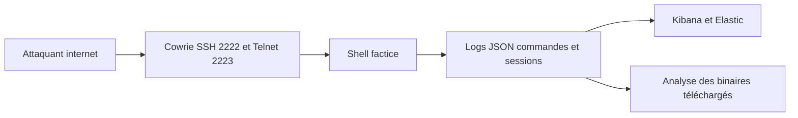

# Cowrie — Honeypot SSH/Telnet et collecte d'IOCs

> [!info] **En 1 phrase**
> Cowrie est un honeypot SSH/Telnet qui émule un shell factice : il enregistre chaque commande, session et téléchargement de fichier de l'attaquant au format JSON, et s'intègre naturellement dans la plateforme T-Pot.

---

## Overview

| Champ | Valeur |
|---|---|
| Nom complet | Cowrie (ex-Kippo) |
| Description | Honeypot SSH/Telnet à interaction moyenne/haute qui enregistre commandes, sessions et téléchargements en JSON |
| Catégorie | Forensics, Threat Intel & Honeypots |
| Sous-catégorie | Honeypot / Collecte d'IOCs |
| Fonction principale | Capturer les TTPs des attaquants qui scannent l'internet (brute force, post-exploitation) |
| Type d'outil | Daemon Python (Twisted) ; packaging Docker |
| Licence | Open source (BSD, voir LICENSE du repo) |
| Open source / propriétaire | Open source |
| Langage(s) de programmation | Python (Twisted) |
| Développeur / organisation | Michel Oosterhof, communauté cowrie/cowrie |
| Projet officiel | Cowrie |
| Dépôt officiel | https://github.com/cowrie/cowrie |
| Documentation officielle | https://docs.cowrie.org/ |
| Date de création | 2015 (fork de Kippo) |
| État du projet | actif (v3.0.5) |
| Dernière version connue | v3.0.5 (2026-06-29) |
| Systèmes compatients | Linux (Docker ou Python 3.11+) |
| Modes d'interaction | Shell simulé, proxy (haute interaction), LLM (bêta) |
| Intégrations | T-Pot, Elasticsearch, MySQL, filebeat |

> [!note] Pour vérifier / compléter
> Cowrie ajoute régulièrement des modes (LLM en bêta, proxy) : vérifier la documentation et les releases pour les dernières fonctionnalités.

---

## Concept

Cowrie est un honeypot à haute interaction : il se présente comme un vrai serveur SSH/Telnet mais exécute toutes les commandes dans un shell fictif et « factice », en les enregistrant en détail. L'attaquant croit interagir avec un serveur compromis : ses commandes, ses téléchargements (files) et ses sessions sont journalisés, puis les binaires qu'il dépose sont conservés pour analyse (via l'option de téléchargement du fichier vers l'hôte). On l'utilise pour observer les TTPs des bots et acteurs qui scannent l'internet.

L'intérêt défensif est double : alimenter la threat intelligence (quels outils, quelles commandes, quels malwares à l'heure actuelle ?) et calibrer les détections (règles Sigma, EDR). Les journaux en JSON permettent l'intégration directe dans Elasticsearch/Kibana, et Cowrie est un des composants de base de **T-Pot** (la honeypot all-in-one de Telekom, déployable en Docker sur un VPS). Le shell factice émule une vingtaine de commandes courantes (`wget`, `cat`, `cd`, `ls`, `uname`…) avec des faux fichiers, ce qui suffit à retenir l'attention des bots tout en gardant un contrôle total sur l'environnement.



---

## Concepts fondamentaux

| Concept | Explication |
|---|---|
| Honeypot | Service factice exposé pour attirer et enregistrer les attaquants |
| Interaction moyenne | Shell simulé : les commandes sont exécutées dans un environnement fictif |
| Shell factice | Émulation d'une vingtaine de commandes avec de faux fichiers/résultats |
| Session | Connexion SSH/Telnet complète (login, commandes, durée) |
| Événement (eventid) | Type de log JSON (`cowrie.login.success`, `cowrie.command.input`...) |
| Téléchargement | Fichier récupéré par l'attaquant via wget/curl, conservé dans `downloads/` |
| Mode proxy | Proxy SSH/Telnet vers un vrai serveur (interaction haute) |
| Mode LLM | Réponses dynamiques générées par un modèle de langage (bêta) |
| T-Pot | Plateforme all-in-one Telekom regroupant plusieurs honeypots |
| Credentials | Usernames et mots de passe tentés, journalisés |

---

## Installation

Deux voies : Docker (simple, recommandée pour T-Pot) ou installation Python classique :

```bash
# Docker (image officielle)
docker run -d --name cowrie -p 2222:2222 -p 2223:2223 \
  -v cowrie-logs:/cowrie/cowrie-git/var/log/cowrie cowrie/cowrie
# Installation source (Python 3.11+, Twisted)
git clone https://github.com/cowrie/cowrie.git && cd cowrie
python -m venv venv && source venv/bin/activate
pip install -r requirements.txt && bin/cowrie start
```

Configuration : copier `cowrie.cfg.dist` vers `cowrie.cfg` pour ajuster ports, plages réseau, et la désactivation de certains services. Pour T-Pot : le docker-compose officiel embarque Cowrie préconfiguré.

> [!warning] Exposition : Cowrie doit être exposé sur Internet (ports 2222/2223) mais jamais relié au réseau interne (voir Sécurité de l'outil).

---

## Configuration

| Paramètre | Rôle | Emplacement | Exemple |
|---|---|---|---|
| `ssh_port` | Port SSH du honeypot | `cowrie.cfg` | `ssh_port = 2222` |
| `telnet_port` | Port Telnet du honeypot | `cowrie.cfg` | `telnet_port = 2223` |
| `banner` | Bannière présentée | `cowrie.cfg` | `SSH-2.0-OpenSSH_8.2p1` |
| `hostname` | Nom d'hôte factice | `cowrie.cfg` | `ubuntu` |
| `download_limit_size` | Taille max des fichiers capturés | `cowrie.cfg` | `10485760` |
| `output_json` | Activation du journal JSON | `cowrie.cfg` | `[output_json] enabled = true` |
| `output_elasticsearch` | Envoi direct vers Elastic | `cowrie.cfg` | `[output_elasticsearch]` |
| `output_mysql` | Envoi vers MySQL | `cowrie.cfg` | `[output_mysql]` |
| `[shell]` | Commandes émulées, réponses | `cowrie.cfg` | `uname = Linux cowrie` |

---

## Architecture interne

Composants et flux :

- **Serveur SSH (Twisted conch)** : accepte les connexions sur `ssh_port` (2222) avec un faux `host key`.
- **Serveur Telnet** : accepte les connexions Telnet sur `telnet_port` (2223).
- **Moteur d'authentification** : valide des credentials faibles préconfigurés pour laisser passer les bots.
- **Shell factice** : interprète les commandes (environ 20 commandes courantes) et renvoie de faux résultats.
- **Journalisation** : chaque événement est écrit en JSON (`cowrie.json`) — logins, commandes, téléchargements, sessions.
- **Téléchargements** : les fichiers récupérés via `wget`/`curl` sont enregistrés dans `downloads/` (avec hash).
- **Outputs** : modules d'export (json, mysql, elasticsearch, kafka...).
- **Mode proxy / LLM** : déléguer les sessions vers un vrai serveur ou générer des réponses par IA.

Flux type : connexion sur 2222 → handshake SSH → login réussi (credentials faibles) → commandes → chaque entrée journalisée en JSON → binaires sauvés → export vers Elastic/Kibana et analyse CTI.

---

## Commandes

### Commandes principales

```bash
# Gestion du daemon
bin/cowrie start
bin/cowrie stop
bin/cowrie restart
bin/cowrie status
# Logs et suivi de l'activité
tail -f var/log/cowrie/cowrie.json
# Lister les sessions capturées (extraite des fichiers JSON)
grep '"src_ip"' var/log/cowrie/*.json | jq -r .src_ip | sort -u
# Extraire les commandes tapées
jq -r 'select(.eventid=="cowrie.command.input") | .input' var/log/cowrie/cowrie.json
```

| Commande / Fichier | Effet |
|---|---|
| `bin/cowrie start / stop` | Démarre / arrête le daemon (via systemd ou manuel) |
| `var/log/cowrie/cowrie.json` | Journal principal en JSON : chaque événement (login, commande, téléchargement) |
| `var/log/cowrie/cowrie.log` | Log texte lisible pour le débogage local |
| `var/log/cowrie/downloads/` | Binaires téléchargés par les attaquants, conservés pour analyse |
| `grep '"command"' cowrie.json` | Extrait les commandes tapées par les attaquants |
| `jq 'select(.eventid=="cowrie.session.file_download")'` | Filtre les événements de téléchargement de fichiers |
| `cowrie.cfg` | Paramètres : ports (`ssh_port`), `banner`, réseau de monitoring |

---

## Options et flags

| Option | Description | Exemple | Niveau |
|---|---|---|---|
| `start` / `stop` / `restart` | Gestion du daemon | `bin/cowrie restart` | Basic |
| `--traceback` | Affiche la trace en cas d'erreur | `bin/cowrie start --traceback` | Intermediate |
| `ssh_port` | Port SSH (cowrie.cfg) | `ssh_port = 2222` | Basic |
| `telnet_port` | Port Telnet (cowrie.cfg) | `telnet_port = 2223` | Basic |
| `download_limit_size` | Taille max d'un fichier capturé | `10485760` | Advanced |
| `-p 2222:2222` (Docker) | Publication des ports | `docker run -p 2222:2222 cowrie/cowrie` | Basic |
| `-v cowrie-logs:...` | Volume des logs | `docker run -v cowrie-logs:/.../var/log/cowrie` | Intermediate |

> [!tip] Options les plus utiles au quotidien
> `bin/cowrie restart` après chaque changement de `cowrie.cfg`, et `--traceback` pour diagnostiquer un démarrage en échec.

---

## Exemples pratiques

### Beginner

```bash
# Objectif : vérifier que le honeypot est actif
bin/cowrie status
# Objectif : tester une connexion factice
ssh -p 2222 root@127.0.0.1          # mot de passe faible : 123456
tail -n 5 var/log/cowrie/cowrie.json
```

### Intermediate

```bash
# Objectif : lister les top commandes des attaquants
jq -r 'select(.eventid=="cowrie.command.input") | .input' \
  var/log/cowrie/cowrie.json | sort | uniq -c | sort -rn | head -20
# Objectif : lister les top IP sources
jq -r '.src_ip' var/log/cowrie/cowrie.json | sort | uniq -c | sort -rn | head
```

### Advanced

```bash
# Objectif : reconstituer une chaîne d'infection par source IP
jq -c 'select(.eventid=="cowrie.command.input" or .eventid=="cowrie.session.file_download")' \
  var/log/cowrie/cowrie.json | jq -r '.timestamp + " " + .src_ip + " " + (.input // .url // "")'
```

### Expert

```bash
# Objectif : analyser les binaires capturés
ls -la var/log/cowrie/downloads/
sha256sum var/log/cowrie/downloads/* | tee hashs.txt
# Puis soumettre les hashs à la CTI (MISP) et analyser en sandbox (YARA, Volatility)
```

---

## Workflow complet (scénario pas à pas)

1. **Déployer Cowrie** sur un VPS isolé (ou dans T-Pot) et exposer les ports `2222` (SSH) et `2223` (Telnet) sur Internet.
2. **Vérifier le fonctionnement** : tester une connexion factice et contrôler l'écriture des logs.
   ```bash
   ssh -p 2222 root@<ip-du-honeypot>          # mot de passe faible connu (root:123456)
   tail -n 5 var/log/cowrie/cowrie.json       # vérifier l'événement "cowrie.login.success"
   ```
3. **Surveiller** : `tail -f var/log/cowrie/cowrie.json` → repérer les tentatives de brute force et les connexions réussies.
4. **Collecter les commandes** : extraire avec `jq` les `eventid: cowrie.command.input` pour identifier les scripts de post-exploitation.
   ```bash
   jq -r 'select(.eventid=="cowrie.command.input") | .input' var/log/cowrie/cowrie.json | sort | uniq -c | sort -rn
   ```
5. **Récupérer un binaire** : retrouver le fichier dans `var/log/cowrie/downloads/` → hash + analyse (voir fiche YARA/Volatility).
6. **Intégrer dans Elastic** : configurer le pipeline Filebeat/Logstash vers Kibana → dashboards d'attaque en temps réel.
7. **Alimenter la CTI** : pousser les IP des attaquants et les binaires collectés dans MISP/OpenCTI.
8. **Valider les détections** : rejouer les commandes capturées contre vos règles Sigma pour mesurer leur couverture.

---

## Scénarios avancés

### Scénario 1 : corréler un malware collecté avec ses commandes
Reconstituer la chaîne d'infection : du brute-force initial au téléchargement du payload.
```bash
jq -c 'select(.eventid=="cowrie.command.input" or .eventid=="cowrie.session.file_download")' \
  var/log/cowrie/cowrie.json | jq -r '.timestamp + " " + .src_ip + " " + (.input // .url // "")'
```

### Scénario 2 : dashboard Kibana des tentatives d'authentification
Alimenter Elasticsearch puis visualiser les sources, usernames et mots de passe tentés.
```bash
# Filebeat : input json sur var/log/cowrie/cowrie.json, output vers Elasticsearch
# Puis dans Kibana : agrégations sur .username, .src_ip, .password
```

### Scénario 3 : rotation et transfert automatique des logs
```bash
# Logrotate : rotation quotidienne des JSON volumineux
# /etc/logrotate.d/cowrie
/opt/cowrie/var/log/cowrie/*.json {
    daily
    rotate 30
    compress
    postrotate
        /opt/cowrie/bin/cowrie restart > /dev/null 2>&1 || true
    endscript
}
# Transfert : rsyslog ou filebeat vers le serveur de logs central
```

### Scénario 4 : veille CTI automatisée (extraction des IOCs)
```bash
# Extraire les IP, URLs et hashs capturés vers un fichier exploitable
jq -r 'select(.eventid=="cowrie.session.file_download") | .url' \
  var/log/cowrie/cowrie.json | sort -u > urls.txt
sha256sum var/log/cowrie/downloads/* | awk '{print $1}' > hashs.txt
# Pousser urls.txt + hashs.txt dans MISP/OpenCTI pour corrélation
```

---

## Cybersecurity use cases

| Phase | Utilisation |
|---|---|
| Threat intel | Collecte des TTPs, outils, malwares et IP des attaquants |
| Detection engineering | Calibrage des règles Sigma/EDR avec les commandes observées |
| Malware analysis | Récupération de binaires déposés (analyse sandbox, YARA) |
| SOC | Surveillance en temps réel des vagues de brute force |
| Compliance | Preuve d'exposition et métriques d'attaques |
| Prévention | Blacklist IP, partage d'IOCs avec les partenaires |

---

## MITRE ATT&CK

| Tactique | Technique / Sub-technique | ID | Raison | Détection | Mitigation |
|---|---|---|---|---|---|
| Initial Access | Valid Accounts: Default Accounts | T1078.001 | Login root/mot de passe faible réussi sur le honeypot | `cowrie.login.success` | Politique de mots de passe |
| Initial Access | External Remote Services | T1133 | Service SSH exposé attaqué | Logs brute force | Exposition limitée |
| Execution | Unix Shell | T1059.004 | Commandes de post-exploitation capturées | `cowrie.command.input` | Application control |
| Command and Control | Ingress Tool Transfer | T1105 | wget/curl vers des payloads | `cowrie.session.file_download` | Blocage des téléchargements |
| Discovery | System Information Discovery | T1082 | Énumération (uname, id, cat /proc) | Commandes observées | Durcissement |
| Lateral Movement | Remote Services: SSH | T1021.004 | Sessions SSH interactives (proxy/LLM) | `cowrie.session.connect` | Segregation réseau |

> [!note] Ne renseigner que si l'association est réellement pertinente.
> Cowrie est un outil **défensif** : les mappings décrivent les attaques qu'il permet d'observer et de caractériser.

---

## Defensive Security

### Signes observables

| Indicateur | Détail |
|---|---|
| Tentatives de brute-force SSH/Telnet massives depuis les mêmes IP | Blacklister les IP, partager les IOC via MISP, rate limiting |
| Commandes de post-exploitation rejouées (wget, curl, chmod) | Alimenter les règles Sigma/EDR avec les commandes observées |
| Binaires téléchargés par les attaquants | Analyser en sandbox, extraire les C2 et les clés, diffuser les signatures YARA |
| Sessions longues sur le honeypot | Limiter la durée de session dans `cowrie.cfg` |
| Nouveaux usernames/mots de passe tentés | Enrichir les listes de credential stuffing et les règles |

### Règle Sigma pour corréler une alerte Cowrie (via filebeat → Wazuh/Elastic)

```yaml
title: Cowrie - Successful Login on Honeypot
id: d8e9f0a1-b2c3-4d4e-9f5a-6b7c8d9e0f1a
status: experimental
logsource:
    category: authentication
    product: cowrie
detection:
    selection:
        eventid: cowrie.login.success
    condition: selection
falsepositives:
    - Connexions de test légitimes
level: high
```

---

## Automatisation

```bash
# Bash — extraire les top IP et les top commandes de la journée
today=$(date +%Y-%m-%d)
jq -r '.src_ip' var/log/cowrie/cowrie.json | sort | uniq -c | sort -rn > top_ip_$today.txt
jq -r 'select(.eventid=="cowrie.command.input") | .input' \
  var/log/cowrie/cowrie.json | sort | uniq -c | sort -rn > top_cmd_$today.txt
```

```python
# Python — parser les logs JSON et générer un rapport quotidien
import json

compteur = {}
with open("var/log/cowrie/cowrie.json") as f:
    for line in f:
        e = json.loads(line)
        if e.get("eventid") == "cowrie.command.input":
            cmd = e.get("input", "")
            compteur[cmd] = compteur.get(cmd, 0) + 1

for cmd, n in sorted(compteur.items(), key=lambda x: -x[1])[:20]:
    print(f"{n:5d}  {cmd}")
```

```bash
# Rotation quotidienne + transfert (logrotate déjà configuré)
# Cron : transfert des JSON vers le serveur de logs
0 2 * * * rsync -a /opt/cowrie/var/log/cowrie/ soc@logs.local:/srv/cowrie/
```

---

## Output et parsing

Le journal `cowrie.json` contient des événements JSON un par ligne. Chaque événement a un `eventid` : `cowrie.login.success/failed`, `cowrie.command.input`, `cowrie.session.file_download`, `cowrie.session.connect/disconnect`. Les champs clés : `timestamp`, `src_ip`, `src_port`, `session`, `username`, `password`, `input`, `url`, `shasum`, `message`.

```bash
# Top usernames tentés
jq -r '.username' var/log/cowrie/cowrie.json | sort | uniq -c | sort -rn | head
# Téléchargements réussis avec hash
jq -r 'select(.eventid=="cowrie.session.file_download") | .url + " " + (.shasum // "")' \
  var/log/cowrie/cowrie.json
# Statistique des logins réussis vs échecs
jq -r '.eventid' var/log/cowrie/cowrie.json | grep -c 'login.success'
jq -r '.eventid' var/log/cowrie/cowrie.json | grep -c 'login.failed'
```

```python
# Python — parser et agréger les événements
import json

ip = {}
with open("var/log/cowrie/cowrie.json") as f:
    for line in f:
        e = json.loads(line)
        ip[e.get("src_ip", "?")] = ip.get(e.get("src_ip", "?"), 0) + 1

for src, n in sorted(ip.items(), key=lambda x: -x[1])[:10]:
    print(f"{n:6d}  {src}")
```

---

## Intégrations

```text
Cowrie → Elasticsearch / filebeat → Kibana (dashboards d'attaque)
Cowrie → MySQL (output natif) → reporting
Cowrie → T-Pot (plateforme all-in-one Telekom)
Cowrie → MISP / OpenCTI (IP, hashs, URLs capturées)
Cowrie → YARA / sandbox (analyse des binaires collectés)
Cowrie → Wazuh / Elastic (corrélation SIEM des alertes)
```

- [[Tools| Outils]]
- [[Outils/Outil - Canarytokens| Canarytokens]] — déception complémentaire (artefacts)
- [[Outils/Outil - MISP| MISP]] — partage des IP et hashs collectés
- [[Outils/Outil - Elastic| Elastic]] — indexation des logs JSON (filebeat)
- [[Outils/Outil - YARA| YARA]] — signatures des binaires capturés
- [[Outils/Outil - Volatility| Volatility]] — analyse mémoire des artefacts (si nécessaire)
- [[Outils/Outil - Wazuh| Wazuh]] — corrélation des alertes honeypot
- [[Techniques/11 - Glossaire| Glossaire]]

---

## Alternatives

| Outil | Avantages | Inconvénients | Cas d'usage |
|---|---|---|---|
| Cowrie | SSH/Telnet riche, JSON, T-Pot | Interaction simulée seulement | Serveurs exposés |
| Kippo | Ancêtre simple | Non maintenu | Historique |
| Honeyd | Multi-protocoles | Moins de détails par session | Lab |
| Canarytokens | Léger, artefacts ciblés | Pas de capture de session | Déception ciblée |
| MHN | Orchestration de honeypots | Complexité | Parc complet |
| Dionaea | Emulation réseau/Shellcodes | Windows/exploits surtout | Malware capture |

> **Quand utiliser Cowrie plutôt qu'un autre ?** Pour **capturer les TTPs SSH/Telnet** (brute force, post-exploitation, binaires) avec des logs JSON exploitables : c'est le standard des honeypots shell et un composant central de T-Pot.

---

## Performance

- **Ressources** : faible (un process Python par daemon) ; quelques centaines de Mo RAM.
- **Sessions** : chaque session concurrente consomme un process Twisted ; sous forte attaque, surveiller le CPU.
- **Stockage** : les logs JSON saturent rapidement sous forte attaque (rotation + transfert obligatoires).
- **Téléchargements** : `download_limit_size` borne la taille des fichiers capturés.
- **Docker** : recommandé pour l'isolation et le déploiement T-Pot.
- **Débit** : conçu pour absorber les vagues de bots ; l'export Elastic peut devenir le goulot d'étranglement.

> [!note] À vérifier
> Le dimensionnement dépend du trafic reçu : commencer petit (un VPS), surveiller l'espace disque et la charge CPU, puis faire grandir.

---

## Troubleshooting

### Common problems

#### Problème : `bin/cowrie start` échoue (erreur traceback)

- **Cause** : dépendances manquantes, Python < 3.11, port déjà occupé.
- **Solution** : `bin/cowrie start --traceback`, vérifier `pip install -r requirements.txt`, `lsof -i :2222`.
- **Vérification** : `bin/cowrie status`.

#### Problème : aucune connexion enregistrée

- **Cause** : port non exposé, firewall, pare-feu du VPS.
- **Solution** : ouvrir 2222/2223, tester en local (`ssh -p 2222 root@127.0.0.1`).
- **Vérification** : `bin/cowrie status` + `tail -f var/log/cowrie/cowrie.json`.

#### Problème : les connexions échouent avant le login

- **Cause** : bannière suspecte, clé host factice rejetée.
- **Solution** : ajuster `banner` dans `cowrie.cfg` et laisser le handshake se terminer.
- **Vérification** : `ssh -vv -p 2222 root@127.0.0.1`.

#### Problème : logs JSON trop volumineux

- **Cause** : forte attaque, pas de rotation.
- **Solution** : configurer logrotate + transfert rsyslog/filebeat.
- **Vérification** : `du -sh var/log/cowrie/`.

#### Problème : pas de téléchargement de fichiers capturé

- **Cause** : `download_limit_size` trop petit, wget/curl avec options non émulées.
- **Solution** : augmenter la limite, vérifier le shell factice pour ces commandes.
- **Vérification** : `ls -la var/log/cowrie/downloads/`.

---

## Sécurité de l'outil

- **Isolement** : jamais de routage du honeypot vers l'interne ; firewall qui bloque toute sortie vers les réseaux internes.
- **Droits** : exécuter Cowrie dans un container ou un utilisateur dédié (jamais root).
- **Réseau** : les téléchargements réels et le trafic réseau restent des risques (Cowrie n'est pas un IDS).
- **Sessions proxy/LLM** : les modes haute interaction peuvent exfiltrer vers un vrai serveur : les limiter et les surveiller.
- **Données** : les logs contiennent des IP, credentials tentés et binaires malveillants : les protéger (chiffrement, ACL).
- **Mise à jour** : suivre les releases (v3.0.5, 2026) pour les corrections et les nouveaux modes.
- **Posture** : défensif ; un attaquant peut détecter Cowrie (bannière, comportement du shell) : varier la config.

---

## Limitations

- **Interaction simulée** : tout est factice ; un attaquant expérimenté détecte l'émulation.
- **Pas un IDS** : ne bloque rien, ne détecte pas le trafic non-SSH/Telnet.
- **Portée** : SSH/Telnet uniquement (les autres protocoles nécessitent d'autres honeypots).
- **Stockage** : les logs et fichiers peuvent saturer le disque sous attaque massive.
- **Attribution** : fournit IP et commandes, pas l'identité réelle.
- **Mode LLM/proxy** : expérimental, à valider avant production.

---

## Cheatsheet

```bash
# Gestion
bin/cowrie start
bin/cowrie stop
bin/cowrie restart --traceback

# Logs
tail -f var/log/cowrie/cowrie.json
tail -f var/log/cowrie/cowrie.log

# Analyses (jq)
jq -r '.src_ip' var/log/cowrie/cowrie.json | sort | uniq -c | sort -rn
jq -r 'select(.eventid=="cowrie.command.input") | .input' \
  var/log/cowrie/cowrie.json | sort | uniq -c | sort -rn
jq -r 'select(.eventid=="cowrie.session.file_download") | .url + " " + (.shasum // "")' \
  var/log/cowrie/cowrie.json

# Binaires capturés
ls -la var/log/cowrie/downloads/
sha256sum var/log/cowrie/downloads/*

# Test local
ssh -p 2222 root@127.0.0.1    # mot de passe faible : 123456
```

```ini
# cowrie.cfg — points clés
[ssh]
ssh_port = 2222
banner = SSH-2.0-OpenSSH_8.2p1

[telnet]
telnet_port = 2223

[shell]
uname = Linux cowrie 5.15.0 #1 SMP x86_64

[output_json]
enabled = true

[output_elasticsearch]
enabled = false
```

---

## Quick reference

| | |
|---|---|
| **À quoi sert-il ?** | Honeypot SSH/Telnet : capture des commandes, sessions et fichiers des attaquants |
| **Quand l'utiliser ?** | CTI, observation des TTPs, calibrage des détections, T-Pot |
| **Commande principale** | `bin/cowrie start` + `tail -f var/log/cowrie/cowrie.json` |
| **Alternative principale** | Kippo, Honeyd, MHN |
| **Concepts importants** | Shell factice, eventid JSON, sessions, downloads/, T-Pot |
| **Liens associés** | [[Outils/Outil - Canarytokens| Canarytokens]] · [[Outils/Outil - MISP| MISP]] · [[Outils/Outil - Elastic| Elastic]] |

---

## Détection & Défense

| Signe | Défense |
|---|---|
| Tentatives de brute-force SSH/Telnet massives depuis les mêmes IP | Blacklister les IP, partager les IOC via MISP, rate limiting |
| Commandes de post-exploitation rejouées (wget, curl, chmod) | Alimenter les règles Sigma/EDR avec les commandes observées |
| Binaires téléchargés par les attaquants | Analyser en sandbox, extraire les C2 et les clés, diffuser les signatures YARA |
| Sessions longues sur le honeypot | Limiter la durée de session dans `cowrie.cfg` |
| Nouveaux credentials tentés | Enrichir les listes de credential stuffing et les règles |

---

## Tips & Pièges

> [!tip] **Tips**
> Exposez Cowrie avec des identifiants faibles connus (ex. `root:123456`) : les bots et acteurs réussissent plus vite la connexion, ce qui augmente la capture de sessions réelles. Utilisez `jq` en cascade sur les logs JSON pour bâtir vos statistiques (top commandes, top IP) : c'est l'API de votre honeypot sans interface.

> [!warning] **Pièges**
> Cowrie n'est pas un IDS : tout ce que l'attaquant fait dans le shell est simulé, mais les téléchargements réels et le trafic réseau restent des risques. Placez-le derrière un firewall qui ne sort jamais vers l'interne. Les journaux JSON saturent rapidement le stockage sous forte attaque : prévoyez une rotation et un transfert automatique (rsyslog/filebeat) vers le serveur de logs central.

---

## References

### Official

- Cowrie — site officiel et documentation : https://www.cowrie.org/
- Dépôt GitHub cowrie/cowrie : https://github.com/cowrie/cowrie
- Documentation technique : https://docs.cowrie.org/

### Security references

- MITRE ATT&CK T1078.001 — Default Accounts : https://attack.mitre.org/techniques/T1078/001/
- MITRE ATT&CK T1059.004 — Unix Shell : https://attack.mitre.org/techniques/T1059/004/
- MITRE ATT&CK T1105 — Ingress Tool Transfer : https://attack.mitre.org/techniques/T1105/

### Community

- T-Pot — honeypot all-in-one Telekom : https://github.com/telekom-security/tpotce
- Cowrie releases : https://github.com/cowrie/cowrie/releases
- Forum communautaire : https://groups.google.com/g/cowrie

---

**Liens :** [[Tools| Outils]] · [[Outils/Outil - Canarytokens| Canarytokens]] · [[Outils/Outil - MISP| MISP]] · [[Techniques/11 - Glossaire| Glossaire]]
