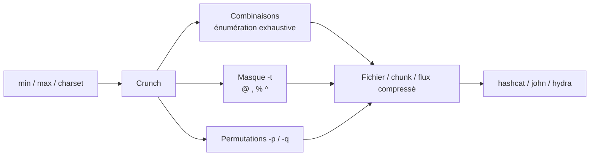

# 🔢 Crunch — Générateur de mots de passe par masque

> [!info] **En 1 phrase**
> Crunch génère toutes les combinaisons possibles à partir d'une longueur (min/max) et d'un jeu de caractères, avec des masques `-t` (majuscules, chiffres, symboles) — le générateur exhaustif par excellence.

---

## 🧾 Overview

| Champ | Valeur |
|---|---|
| Nom complet | Crunch — wordlist generator |
| Description | Génère toutes les combinaisons et permutations d'un jeu de caractères (ou d'un masque `-t`) pour des longueurs min/max données, avec compression, découpage et reprise de génération |
| Catégorie | 🔑 Wordlists & Générateurs |
| Sous-catégorie | Génération de wordlists par masque / énumération exhaustive |
| Fonction principale | Produire des listes de candidats mots de passe (stream, fichier ou fichier compressé) |
| Type d'outil | CLI (binaire C) |
| Licence | GPL-2.0 |
| Open source / propriétaire | Open source |
| Langage(s) de programmation | C |
| Développeur / organisation | bofh28 (maintient depuis v1.1) ; v1.0 par mimayin |
| Projet officiel | Projet SourceForge « crunch-wordlist » |
| Dépôt officiel | https://sourceforge.net/projects/crunch-wordlist/ (miroir GitHub : crunchsec/crunch) |
| Documentation officielle | https://manpages.org/crunch |
| Date de création | v1.0 en 2004 ; projet enregistré sur SourceForge le 15 juin 2009 |
| État du projet | maintenu (stable ; v3.6 du 17 mai 2014, toujours le paquet des distros) |
| Dernière version connue | 3.6 |
| Systèmes compatibles | Linux, macOS (brew/port), BSD ; Windows via compilation (MinGW) |

> [!note] Pour vérifier / compléter
> Crunch est **préinstallé sur Kali** (`crunch version 3.6`). Le binaire affiche « crunch version 3.6 » puis renvoie vers le man pour les exemples. Miroir GitHub non officiel : https://github.com/crunchsec/crunch.

---

## 🎯 Concept

Crunch énumère **exhaustivement** un espace de candidats : pour des longueurs min/max et un jeu de caractères donnés, il produit toutes les combinaisons (univers = |charset|^longueur). Il complète cette génération « brute » par trois grands modes : le **masque** `-t` (structure connue : `@` minuscule, `,` majuscule, `%` chiffre, `^` symbole, le reste littéral), les **permutations** de mots (`-p`, ou `-q` depuis un fichier) et les **jeux de caractères prédéfinis** (`-f /usr/share/crunch/charset.lst`).

Son atout est l'**écriture sur disque et la compression** : `-z gzip/bzip2/lzma/7z`, le découpage par taille (`-b`) ou par nombre de lignes (`-c`), et la **reprise** (`-s` position de départ, `-r`). Sa sortie peut être streamée (`|`) vers john, hashcat ou un pipe de traitement sans consommer de disque.

Sa place dans un pentest : quand on **connaît la politique** (ex : PSK WPA 100 % numérique de 8 chiffres) mais pas la valeur. Pour les univers massifs, `hashcat -a 3` (GPU) reste bien plus rapide — Crunch excelle pour des univers courts/contraints, des fichiers à archiver, ou des streams vers d'autres outils. Historique : v1.6 (permutations `-p`), v1.8 (`-z`), v2.2 (masque chiffres/symboles), v3.0 (`-l` pour littéraux, `*` remplacé par `,`), v3.1 (`-e` arrêt), v3.2 (`-d` limite de répétitions).



---

## 🧠 Concepts fondamentaux

| Concept | Explication |
|---|---|
| Combinaison (énumération) | Tous les mots de longueur L possibles sur un charset : n^L candidats (ex : 10^8 = 100 000 000 pour 8 chiffres) |
| Permutation | Réarrangements de N mots (ou caractères) : N! candidats. `-p` ignore min/max et charset (passer `0 0`) |
| Masque `-t` | Structure de mot avec classes : `@` minuscule, `,` majuscule, `%` chiffre, `^` symbole ; tout autre caractère est littéral |
| Charsets positionnels | Les jeux passés en CLI correspondent dans l'ordre aux classes @ , % ^ ; `+` sert de placeholder quand on saute une classe |
| `-l` (littéraux) | Force les caractères `@`, `,`, `%`, `^` du pattern à être interprétés comme littéraux |
| `-d N` | Interdit plus de N répétitions consécutives d'un même caractère (`-d 2` élimine `aaaa1234`) |
| Découpage | `-b taille` (avec `-o START`) : plusieurs fichiers nommés d'après leur premier/dernier mot ; `-c N` : N lignes par fichier |
| Reprise | `-s chaîne` démarre à une position (imprimée sur Ctrl-C) ; `-r` reprend en réappendant au fichier |
| charset.lst | `/usr/share/crunch/charset.lst` : presets `numeric`, `hex-lower`, `hex-upper`, `alpha`, `alpha-numeric`, `mixalpha-numeric`, `symbols14`, `symbols-all`, … |

---

## 🛠️ Installation

```bash
# Debian / Ubuntu / Kali (préinstallé sur Kali)
sudo apt update && sudo apt install -y crunch
# macOS
brew install crunch
# BSD (MacPorts / FreeBSD)
sudo port install crunch
# Fedora / Arch : pas de paquet officiel systématique — compiler depuis les sources
```

```bash
# Compilation depuis les sources (tous systèmes, dont Windows/MinGW)
wget https://sourceforge.net/projects/crunch-wordlist/files/crunch-wordlist/crunch-3.6.tgz/download -O crunch-3.6.tgz
tar xzf crunch-3.6.tgz && cd crunch-3.6
make && sudo make install
# Windows : compiler avec MinGW (gcc) puis copier crunch.exe dans le PATH
```

> [!warning] ⚠️ Prérequis & problèmes potentiels
> - Dépendance unique : libc6 (Linux). Aucun runtime tiers.
> - Le `make install` installe aussi `charset.lst` (souvent dans `/usr/share/crunch/`) et la page de man `crunch.1`.
> - Sur Kali, le fichier est `/usr/share/crunch/charset.lst` ; sur d'autres distros vérifier le chemin avec `dpkg -L crunch`.
> - Sur Windows, `-z lzma` peut nécessiter un binaire 7z dans le PATH.

---

## ⚙️ Configuration

Crunch n'a **pas de fichier de configuration** : tout est en ligne de commande. Le seul fichier de données est `charset.lst`, liste de jeux de caractères nommés utilisés avec `-f`.

| Paramètre | Rôle | Valeur possible | Impact | Exemple |
|---|---|---|---|---|
| `min` / `max` | Longueurs minimale/maximale | Entiers (obligatoires) | Taille de l'univers généré | `crunch 8 8` |
| Charset | Jeu de caractères (positionnel) | Chaîne sans espaces | Classes @ , % ^ | `crunch 6 6 abc 123` |
| `-f charset.lst nom` | Preset de jeu de caractères | `numeric`, `hex-lower`, `symbols-all`, … | Raccourci pour un charset courant | `-f /usr/share/crunch/charset.lst numeric` |
| `-t` / `-l` | Masque / littéraux | Pattern de classes | Structure précise des candidats | `-t ,%%%l` |
| `-d N` | Limite de répétitions | `N` ou `symbole@N` | Filtre les mots faibles | `-d 2` |
| `-z comp` | Compression | `gzip`, `bzip2`, `lzma`, `7z` | Réduit fortement la taille disque | `-z gzip` |
| `-s` / `-r` | Départ / reprise | Chaîne / flag | Permet de reprendre un run | `-s abcd -r` |
| `-o` / `-o START` | Fichier / base des chunks | Chemin | Sortie sur disque (nécessaire pour `-z`, `-b`, `-c`) | `-o START` |

> [!note] À vérifier
> `-p` et `-q` (permutations) ne tiennent **pas compte** de `-t`, ni de min/max (les passer à `0 0`). Ne pas les combiner avec un masque.

---

## 🏗️ Architecture interne

Crunch est un **programme C mono-fichier** (`crunch.c`, ~2 000 lignes) qui tourne sur un modèle de compteur « odomètre » :

- **Génération combinatoire** : une chaîne de longueur max est incrémentée de façon incrémentale sur le charset (chaque position « tourne » de droite à gauche). Pour chaque longueur L entre min et max, toutes les valeurs sont émises avant de passer à L+1.
- **Permutations** : fonction de permutation (algorithme de Richard Heathfield) triée par `cstring_cmp` pour un ordre lexicographique stable ; supportée avec `-t`, `-b`, `-c`, `-o`, `-z` depuis la v2.0.
- **Traitement du signal** : un handler `SIGINT` termine le mot en cours, imprime la position d'arrêt (réutilisable avec `-s`) et ferme proprement les fichiers (v2.1) — base du mode reprise `-r`.
- **Processus de progression** : un processus fils affiche le pourcentage d'avancement (fork) pendant que le parent génère.
- **Fichiers volumineux** : support des fichiers > 2 Go ; découpage par taille (`-b`) ou par nombre de lignes (`-c`) ; inversion de l'ordre avec `-i`.
- **Compression** : `-z` appelle le compresseur externe correspondant (gzip/bzip2/lzma/7z) sur le fichier de sortie.
- **Mémoire** : allocation dynamique des buffers (`calloc`), taille dépendante de la longueur max — la consommation reste modeste.

Flux : `min/max/charset/pattern → générateur odomètre (ou permute) → filtre (-d, -t) → sortie stdout / fichier / chunk / flux compressé`.

---

## ⌨️ Commandes

### Commandes principales

```bash
crunch <min> <max> [options]
```

| Commande | Objectif | Résultat attendu |
|---|---|---|
| `crunch 3 3 abc` | Toutes les combinaisons de 3 caractères sur `abc` (27 lignes) | `aaa` … `ccc` sur stdout |
| `crunch 8 8 0123456789 -o psk8.txt` | 8 chiffres vers un fichier | `psk8.txt` (100 000 000 lignes) |
| `crunch 6 8 abcdefghijklmnopqrstuvwxyz0123456789 -o list.txt` | Mots de 6 à 8 caractères, minuscules+chiffres | Fichier `list.txt` |
| `crunch 5 5 -t ,%%%l -o t.txt` | Masque : majuscule + 3 chiffres + `l` littéral | 26×10^3 candidats |
| `crunch 0 0 -p admin 2024 acme` | Permutations des 3 mots | 6 phrases ordonnées (dont « acme 2024 admin ») |
| `crunch 6 6 -f /usr/share/crunch/charset.lst hex-lower -o hex.txt` | Charset preset | 16^6 = 16 777 216 lignes |
| `crunch 6 6 0123456789 -o s.txt -z gzip` | Génération compressée | `s.txt.gz` |

### Commandes avancées

```bash
# Découpage par taille (fichiers nommés d'après premier/dernier mot)
crunch 3 3 0123456789 -b 2kb -o START
# Reprendre à partir d'une position (reprise affichée au Ctrl-C)
crunch 7 7 abcdefghijklmnopqrstuvwxyz0123456789 -s abc0000 -o reprise.txt
# Streaming direct vers john (aucun fichier écrit)
crunch 8 8 0123456789 | john --stdin wpa.hccapx
# Permutations depuis un fichier de mots (-q)
printf "acme\nsecure\n2024\n!" | crunch 0 0 -q - -o perms.txt
# Masque avec classes positionnelles (minuscules puis chiffres) et limite de répétitions
crunch 8 8 abcdefghijklmnopqrstuvwxyz 0123456789 -t @%%%%%%% -d 2 -o mix.txt
```

---

## 🎚️ Options et flags

| Option | Description | Exemple | Niveau |
|---|---|---|---|
| `min max` | Longueurs minimale et maximale (obligatoires) | `crunch 8 8` | Basic |
| `-o fichier` | Fichier de sortie | `crunch 4 4 abc -o out.txt` | Basic |
| `-t pattern` | Masque de classes (@ minuscule, , majuscule, % chiffre, ^ symbole) | `crunch 6 6 -t @@@%%%` | Basic |
| `-f charset.lst nom` | Jeu de caractères prédéfini | `-f /usr/share/crunch/charset.lst numeric` | Basic |
| `-p mots...` | Permutations des mots donnés (ignore charset, `-t` ; utiliser `0 0`) | `crunch 0 0 -p acme 2024` | Intermediate |
| `-q fichier` | Permutations des mots d'un fichier | `crunch 0 0 -q mots.txt` | Intermediate |
| `-l mot` | Force @ , % ^ du pattern en littéraux | `crunch 6 6 -t @l%%%l -l @l` | Intermediate |
| `-d N` / `-d symbole@N` | Limite les répétitions d'un caractère | `crunch 6 6 abc -d 2` | Intermediate |
| `-s chaine` | Position de départ | `crunch 6 6 abc -s aab` | Intermediate |
| `-e chaine` | Arrêt après la chaîne donnée (utile en pipe) | `crunch 6 6 abc -e zz | prog` | Intermediate |
| `-b taille[gb/mb/kb]` | Découpe en fichiers par taille (avec `-o START`) | `crunch 5 5 abc -b 2mb -o START` | Advanced |
| `-c N` | Découpe en fichiers de N lignes | `crunch 5 5 abc -c 1000 -o START` | Advanced |
| `-z gzip\|bzip2\|lzma\|7z` | Compresse la sortie (avec `-o`) | `crunch 6 6 abc -o x -z gzip` | Advanced |
| `-r` | Reprise : réappend au fichier existant | `crunch 6 6 abc -s b -r -o x` | Advanced |
| `-i` | Inverse l'ordre de génération | `crunch 4 4 abc -i` | Advanced |

> [!tip] Options les plus utiles au quotidien
> `-t` (masque), `-f charset.lst` (presets), `-z gzip` (compression), `-d 2` (éliminer les mots faibles type `aaaa1234`), et le streaming `|` pour éviter d'écrire des fichiers multi-gigaoctets.

---

## 🧪 Exemples pratiques

### Beginner

```bash
# Objectif : vérifier la mécanique avec un petit univers (3^3 = 27 lignes)
crunch 3 3 abc -o /tmp/basic.txt
# Objectif : générer les 8 chiffres d'un PSK Wi-Fi (100 000 000 lignes)
crunch 8 8 0123456789 -o /tmp/psk8.txt
```

Résultat attendu : `/tmp/basic.txt` contient `aaa` → `ccc` (27 lignes, vérifiable avec `wc -l`). Pour le PSK, Crunch affiche le nombre de lignes avant de démarrer. Erreur possible : « Illegal character set » si le charset contient des espaces ou si min/max manquent.

### Intermediate

```bash
# Objectif : masque « majuscule + 2 chiffres + 3 minuscules »
crunch 6 6 -t ,%%@@@ -o /tmp/struct.txt
# Objectif : preset de charset + compression
crunch 6 6 -f /usr/share/crunch/charset.lst mixalpha-numeric -o /tmp/mix.txt.gz -z gzip
# Objectif : éliminer les répétitions faibles (aaaa…) sur un PSK numérique
crunch 8 8 0123456789 -d 3 -o /tmp/psk_nd3.txt
```

### Advanced

```bash
# Objectif : permutations de mots-clés corporate (3 mots → 6 phrases)
crunch 0 0 -p acme secure 2024 | sort -u > /tmp/perms.txt
# Objectif : découpage en chunks de 2 Mo (fichiers nommés 000-xxx.txt, …)
crunch 5 5 0123456789 -b 2mb -o /tmp/START
# Objectif : générer en mode inversé puis reprise à partir d'un point
crunch 5 5 abc -i -s bcb -o /tmp/inv.txt
```

### Expert

```bash
# Objectif : pipeline complet sans fichier intermédiaire, avec arrêt à une borne
crunch 8 8 0123456789 -e 99999999 | hashcat -m 22000 /tmp/wpa.hc22000
# Objectif : reprise d'un run interrompu (la position est imprimée au Ctrl-C)
crunch 9 9 abcdefghijklmnopqrstuvwxyz0123456789 -s ct0000000 -r -o /tmp/reprise.txt
# Objectif : génération par bandes parallèles (partitionner avec -s et -e)
crunch 8 8 0123456789 -s 00000000 -e 33333333 -o /tmp/bande1.txt &
crunch 8 8 0123456789 -s 33333334 -e 66666666 -o /tmp/bande2.txt &
crunch 8 8 0123456789 -s 66666667 -e 99999999 -o /tmp/bande3.txt &
wait
```

---

## 🧪 Workflow complet (scénario pas à pas)

1. **Connaître les contraintes** — politique de mots de passe ou format observé (ex : PSK WPA de 8 chiffres).
2. **Estimer l'univers avant génération** :
   ```bash
   # 10^8 = 100 000 000 combinaisons (~800 Mo en texte brut)
   crunch 8 8 0123456789 | wc -l
   ```
3. **Générer dans un fichier** (ou compresser directement) :
   ```bash
   crunch 8 8 0123456789 -o /tmp/psk8.txt
   ```
4. **Affiner avec un masque** si une structure est connue (lettre + 7 chiffres, sans répétitions longues) :
   ```bash
   crunch 8 8 abcdefghijklmnopqrstuvwxyz 0123456789 -t @%%%%%%% -d 2 -o /tmp/lettre7num.txt
   ```
5. **Cracker hors-ligne** — convertir la capture WPA puis attaquer :
   ```bash
   hcxpcapngtool capture.cap -o /tmp/wpa.hc22000
   hashcat -m 22000 /tmp/wpa.hc22000 /tmp/psk8.txt
   ```
6. **Variante streaming** — sans écrire de fichier (Wi-Fi legacy) :
   ```bash
   aircrack-ng capture.cap -w <(crunch 8 8 0123456789)
   ```

---

## 🎬 Scénarios avancés

### Scénario 1 : PSK Wi-Fi 100 % numérique (WPA2)

```bash
crunch 8 8 0123456789 -d 3 -o /tmp/psk8.txt
# Puis, soit via hashcat (mode 22000), soit via aircrack-ng :
hcxpcapngtool cap.cap -o wpa.hc22000 && hashcat -m 22000 wpa.hc22000 /tmp/psk8.txt
```

La limite `-d 3` retire les PSK trop simples (`11111111`, `22222222`…) tout en couvrant l'espace réaliste.

### Scénario 2 : masque corporate « Acme2024! »

Quand le pattern est connu (marque + année + symbole) :

```bash
crunch 9 9 -t Acme2024^ -o /tmp/acme.txt
# Ici ^ = n'importe quel symbole ; le reste du masque est littéral.
# En croisant avec la casse : Acme2024@ (minuscule ajoutée) si un suffixe variable existe
crunch 10 10 -t Acme2024^@ -o /tmp/acme2.txt
```

### Scénario 3 : reprise d'une génération interrompue

Un Ctrl-C affiche la position d'arrêt ; la reprendre sans recommencer :

```bash
# (Ctrl-C pendant la génération -> "CRUNCH @ position: abc0000")
crunch 7 7 abcdefghijklmnopqrstuvwxyz0123456789 -s abc0000 -r -o /tmp/reprise.txt
```

---

## 🛡️ Cybersecurity use cases

| Phase | Utilisation |
|---|---|
| Reconnaissance | Estimer la politique de mots de passe (longueur, classes) pour borner l'univers |
| Credential Access (offline) | Fournir des candidats à hashcat / John sur hashes capturés (WPA, NTLM, MD5…) |
| Credential Access (online) | Alimenter hydra / Medusa / ncrack pour du bruteforce contraint (labels par masque) |
| Attaques WiFi | Univers numériques courts pour PSK WPA2/PMKID (via aircrack-ng, hashcat -m 22000) |
| Password Spraying | Générer un mot plausible par compte (masques `Acme2024?`) pour limiter le lockout |
| Post-exploitation | Réutilisation d'identifiants, mots de passe d'appareils (IoT) par masque |

---

## 🎯 MITRE ATT&CK

| Tactique | Technique / Sub-technique | ID | Raison | Détection | Mitigation |
|---|---|---|---|---|---|
| Credential Access | Brute Force | T1110 | Crunch fabrique les candidats utilisés par les attaques de bruteforce | Alertes sur volume d'échecs d'authentification | MFA, verrouillage, rate limiting |
| Credential Access | Brute Force : Password Guessing | T1110.001 | Masques `-t` ciblant des comptes en ligne (hydra) | Échecs d'auth répétés par compte | Politique de mots de passe, fail2ban |
| Credential Access | Brute Force : Password Cracking | T1110.002 | Les listes générées servent au cracking hors-ligne (hashcat, John) | Détection des processus de cracking (GPU/CPU) | Mots de passe forts, MFA, audit |
| Credential Access | Valid Accounts | T1078 | Un mot trouvé donne accès à un compte légitime | Usage anormal des comptes après cassage | MFA, supervision des logons |

> [!note] Ne renseigner que si l'association est réellement pertinente.
> Crunch **génère** les candidats mais ne cracke pas lui-même : il alimente T1110.x en amont de hashcat/John/hydra.

---

## 🛡️ Defensive Security

Crunch est un outil **hors-ligne** : côté serveur, rien n'est détectable tant que les listes ne sont pas utilisées contre un service. La détection porte donc sur la **machine de l'attaquant** et sur les **attaques en ligne** déclenchées ensuite.

### Signes observables

| Indicateur | Détail |
|---|---|
| Processus `crunch` en cours sur un endpoint | Génération de candidates (CPU élevé, disque en croissance) |
| Fichiers `.txt`/`.gz` volumineux dans /tmp | Wordlists (ex : 800 Mo pour 8 chiffres) |
| Disque saturé brutalement | Univers non estimé (alphanumérique 8 = exaoctets potentiels) |
| Rafale d'échecs d'authentification ensuite | La liste est utilisée contre SSH, RDP, Wi-Fi (hydra, aircrack-ng) |
| Utilisation CPU prolongée (cracking) | hashcat/John tournent sur les candidates |

### Règles de détection (Sigma / Suricata / Snort / YARA)

```yaml
# Sigma — Linux : exécution d'outils de génération/cracking de mots de passe
title: Password Generation Tools Execution
id: 9c3f5a1b-2d4e-4f6a-8b7c-9d0e1f2a3b4c
status: test
logsource:
    category: process_creation
    product: linux
detection:
    selection:
        Image|endswith:
            - '/crunch'
            - '/hashcat'
            - '/john'
            - '/maskprocessor'
    condition: selection
falsepositives:
    - Tests de sécurité internes autorisés
level: medium
```

```bash
# Suricata/Snort — bruteforce en ligne alimenté par une liste (pattern classique SSH)
alert tcp any any -> any 22 (msg:"SSH brute force from generated wordlist";
  flow:to_server,established; content:"SSH-"; nocase;
  threshold:type both, track by_src, count 10, seconds 60;
  sid:1000003; rev:1;)
```

> [!note] À vérifier
> Règles pédagogiques : le process_creation (Sigma) est le signal le plus fiable pour Crunch, car l'outil est hors-ligne. Adapter seuils et fenêtres à votre réseau pour limiter les faux positifs.

---

## 🤖 Automatisation

```bash
# Bash — générer par bandes et concaténer (parallélisation CPU)
for i in 0 3 6; do
  start=$((i * 10000000)); end=$((i * 10000000 + 33333333))
  printf -v s "%08d" "$start"; printf -v e "%08d" "$end"
  crunch 8 8 0123456789 -s "$s" -e "$e" -o "/tmp/bande$i.txt" &
done
wait
cat /tmp/bande*.txt | sort -u > /tmp/psk8.txt
```

---

## 📤 Output et parsing

Crunch sort sur **stdout** par défaut (une valeur par ligne), dans un **fichier** avec `-o`, dans des **chunks** avec `-o START` (+ `-b`/`-c`), ou **compressé** avec `-z`. Avec `-o START`, les noms de fichiers reflètent le premier et dernier mot du chunk (`000-499.txt`).

```bash
# Compter les lignes générées sans stocker
crunch 3 3 abc | wc -l
# Découper en chunks par taille et lister
crunch 3 3 0123456789 -b 2kb -o /tmp/START
ls -1 /tmp/*.txt
# Vérifier le début et la fin d'une génération
crunch 3 3 abc -o /tmp/b.txt && head -3 /tmp/b.txt && tail -3 /tmp/b.txt
```

---

## 🔗 Intégrations

```text
Contraintes/masque → Crunch (liste ou flux) → hashcat / John / aircrack-ng / hydra → comptes ou clés
```

- [[Tools|🧰 Outils]] global
- [[Outil - hashcat|hashcat]] — cracking GPU ; `-a 3` (masque) remplace Crunch sur les gros univers
- [[Outil - John the Ripper|John the Ripper]] — `--stdin` consume le flux Crunch sans fichier
- [[Outil - aircrack-ng|aircrack-ng]] — attaque de PSK WPA2 avec wordlist (ou `<(crunch …)`)
- [[Outil - Reaver|Reaver]] · [[Outil - hydra|hydra]] · [[Outil - Medusa|Medusa]] · [[Outil - ncrack|ncrack]] — bruteforce en ligne alimenté par les listes
- [[Outil - kwprocessor|kwprocessor]] — mot de passe par parcours clavier (complément masque)
- [[Outil - CeWL|CeWL]] · [[Outil - CUPP|CUPP]] · [[Outil - rsmangler|rsmangler]] · [[Outil - Mentalist|Mentalist]] · [[Outil - pydictor|pydictor]] · [[Outil - SecLists|SecLists]] — autres générateurs/collections
- [[Outil - OneRuleToRuleThemAll|OneRuleToRuleThemAll]] — règles de mutation appliquées ensuite par hashcat
- [[08 - Password Cracking|🔑 Password Cracking]] · [[07 - Wireless, MITM & Social Engineering|📡 Wireless]] · [[01 - Reconnaissance|🕵️ Reconnaissance]]
- [[Techniques/Password Cracking|🔐 Password Cracking]] · [[Techniques/Password Spraying|Password Spraying]] · [[Techniques/Attaques WiFi (WPA2 et PMKID)|Attaques WiFi (WPA2 & PMKID)]] · [[Techniques/Attaques WiFi - WPA2 PSK|WPA2 PSK]] · [[Techniques/Attaques WiFi - PMKID|PMKID]]

---

## 🔄 Alternatives

| Outil | Avantages | Inconvénients | Cas d'usage |
|---|---|---|---|
| [[Outil - hashcat|hashcat]] `-a 3` | Masques GPU massivement parallèles, pas de disque | Nécessite une carte GPU ; moins lisible en script | Univers > 10^10 |
| maskprocessor (John) | Même logique masque en C, très rapide | Peu de options de découpage/compression | Masques simples en CPU |
| [[Outil - kwprocessor|kwprocessor]] | Parcours de clavier réaliste (WPA) | Parcours spécifique, pas de masque libre | PSK tapés au clavier |
| [[Outil - pydictor|pydictor]] | Masques, règles, extensions, GUI web | Python plus lent, syntaxe complexe | Listes hybride règles+masques |
| [[Outil - Mentalist|Mentalist]] | GUI : mutation, combinaison, expansion | Windows, moins scriptable | Construire visuellement |
| [[Outil - rsmangler|rsmangler]] | Mute une liste existante (mots réels) | Ne génère pas de combinaisons brutes | Enrichir CeWL/SecLists |
| [[Outil - SecLists|SecLists]] | Listes prêtes à l'emploi | Générique, non exhaustif | Démarrage rapide |

> **Quand utiliser hashcat -a 3 plutôt que Crunch ?** Dès que l'univers dépasse quelques dizaines de millions de candidats : le GPU est des ordres de grandeur plus rapide et ne remplit pas le disque. Crunch garde l'avantage pour écrire/compresser une liste (partage, archivage) et pour streamer vers des outils qui exigent une wordlist.

---

## ⚡ Performance

- **Univers** : `n^L` pour chaque longueur L entre min et max (n = taille du charset) ; les permutations sont `N!`. Estimer **avant** de lancer.
- **Débit** : génération CPU pure, de l'ordre de plusieurs millions de lignes/min sur un processeur moderne (dépend du shell et de la longueur).
- **Disque** : 9 octets/ligne en moyenne pour un charset numérique 8 (`\n` compris) → 8 chiffres ≈ 900 Mo ; alphanumérique 8 = **2,8 × 10^14** candidats (exa-octets) — infaisable sur disque.
- **Mémoire** : faible (buffers de la longueur max), stable sur des runs longs.
- **Compression** : `-z gzip` réduit typiquement de 50-70 % la taille (les suites numériques compressent très bien).
- **Reprise/parallélisme** : `-s`/`-e` permettent de partitionner l'univers en bandes parallèles (`&` + `wait`).

> [!note] À vérifier
> Les débits chiffrés ne sont pas publiés officiellement : ordres de grandeur pratiques, à valider sur votre matériel avec un petit univers (`crunch 6 6 abc | wc -l`).

---

## 🛠️ Troubleshooting

### Common problems

#### Problème : « crunch version 3.6 » puis rien d'autre

- **Cause** : min/max manquants ou arguments invalides.
- **Solution** : respecter la syntaxe `crunch <min> <max> [options]` ; consulter le man (`man crunch`).
- **Vérification** : `crunch 3 3 abc` doit produire 27 lignes.

#### Problème : « Illegal character set » ou espaces ignorés

- **Cause** : le charset contient des espaces ou des caractères non gérés.
- **Solution** : passer par `-f charset.lst` pour les jeux avec symboles, ou échapper/retirer les espaces.
- **Vérification** : `crunch 4 4 -f /usr/share/crunch/charset.lst symbols14` fonctionne.

#### Problème : génération interrompue, tout est perdu

- **Cause** : arrêt sans sauvegarde (ancien comportement avant `-r`).
- **Solution** : relancer avec la position imprimée au Ctrl-C : `crunch 7 7 abc… -s <position> -r -o fichier`.
- **Vérification** : la reprise réappend au fichier existant sans doublon.

#### Problème : `-p` ne produit pas les permutations attendues

- **Cause** : `-p` ignore `-t`, le charset et min/max.
- **Solution** : utiliser `crunch 0 0 -p mot1 mot2 …` ; pour un fichier, `-q`.
- **Vérification** : `crunch 0 0 -p a b c` → 6 lignes.

#### Problème : disque plein pendant la génération

- **Cause** : univers sous-estimé.
- **Solution** : estimer `n^L` d'abord, compresser (`-z`), découper (`-b`) ou streamer vers le cracker sans fichier.
- **Vérification** : `crunch 8 8 0123456789 | wc -l` avant de lancer un `-o`.

#### Problème : `-z lzma`/`7z` ne fonctionne pas

- **Cause** : binaire de compression absent du PATH.
- **Solution** : installer lzma/7z (`sudo apt install xz-utils p7zip-full`) ou utiliser gzip/bzip2.
- **Vérification** : `which gzip bzip2 lzma 7z`.

---

## 🔐 Sécurité de l'outil

- **Hors-ligne** : Crunch ne contacte aucun réseau et n'envoie aucune donnée ; aucune télémétrie. L'usage est donc invisible pour la cible.
- **Usage légal** : les listes générées servent à attaquer des mots de passe — strictement réservées aux périmètres autorisés (lab, audit écrit).
- **Consommation de ressources** : un univers mal estimé peut saturer le disque ou monopoliser le CPU ; `-d`, `-e` et le découpage limitent l'impact.
- **Données sensibles** : les wordlists (contenant parfois les mots de passe de l'entreprise) doivent être chiffrées/nettoyées après l'engagement.
- **Exécution** : binaire peu audité (C monofichier ancien) ; dans un environnement sensible, l'exécuter dans un conteneur et surveiller la consommation disque.

---

## ⚠️ Limitations

- **Pas de règles de mutation** : Crunch ne fait que combiner ; les transformations (majuscules alternées, leet speak) nécessitent des règles hashcat ou [[Outil - rsmangler|rsmangler]].
- **CPU uniquement** : pour les gros univers, `hashcat -a 3` (GPU) est très supérieur.
- **Pas de regex** : le masque `-t` ne couvre qu'une structure simple, pas de contraintes de contenu (interdit tel caractère, etc.).
- **Charset sans espaces** en CLI : les jeux avec espaces passent par `charset.lst`.
- **Fichiers énormes** : univers > 2 Go gérés mais déconseillés ; préférer streaming/compression.
- **Pas d'interface** : CLI uniquement (contrairement à [[Outil - Mentalist|Mentalist]]).
- **Débit limité** par le shell/terminal quand on sort sur stdout.

---

## 📋 Cheatsheet

```bash
# Combinaisons simples (min max charset)
crunch 4 4 abc -o /tmp/c.txt

# Masque : classes de caractères
crunch 8 8 -t ,@@%%%%% -o /tmp/m.txt          # majuscule + 2 minuscules + 5 chiffres

# Charset preset
crunch 6 6 -f /usr/share/crunch/charset.lst numeric -o /tmp/n.txt

# Permutations de mots
crunch 0 0 -p acme secure 2024 ! | sort -u

# Permutations depuis un fichier
crunch 0 0 -q /tmp/mots.txt -o /tmp/perms.txt

# Limiter les répétitions
crunch 8 8 0123456789 -d 3 -o /tmp/psk.txt

# Reprise
crunch 7 7 abc… -s ab0000 -r -o /tmp/reprise.txt

# Découpage par taille
crunch 5 5 0123456789 -b 2mb -o /tmp/START

# Compression
crunch 6 6 0123456789 -o /tmp/x.txt -z gzip

# Streaming vers john
crunch 8 8 0123456789 | john --stdin wpa.hccapx
```

---

## ⚡ Quick reference

| | |
|---|---|
| **À quoi sert-il ?** | Générer exhaustivement des mots de passe par combinaisons, masques ou permutations |
| **Quand l'utiliser ?** | Quand la structure (longueur, classes) est connue mais pas la valeur (WPA, politiques, IoT) |
| **Commande principale** | `crunch 8 8 0123456789 -d 3 -o /tmp/psk8.txt` |
| **Alternative principale** | `hashcat -a 3 '?d?d?d?d?d?d?d?d'` (GPU), maskprocessor |
| **Concepts importants** | Univers n^L, masque -t (@ , % ^), -d répétitions, -s/-r reprise, -z compression, -p/-q permutations |
| **Liens associés** | [[Outil - hashcat|hashcat]] · [[Outil - John the Ripper|John the Ripper]] · [[Outil - aircrack-ng|aircrack-ng]] · [[Outil - kwprocessor|kwprocessor]] |

---

## 🔍 Détection & Défense

| Signe | Défense |
|---|---|
| Processus `crunch` sur un endpoint | EDR : détection d'outils de génération de mots de passe |
| Fichiers volumineux créés dans /tmp | Supervision du disque + alertes sur fichiers récents > 100 Mo |
| Bruteforce en ligne qui suit (SSH/RDP) | Rate limiting, verrouillage de comptes, fail2ban |
| Attaque Wi-Fi (rafale d'associations/PMKID) | Mots de passe forts (> 12 caractères mixtes), WPA3 |
| Cracking CPU/GPU prolongé | Supervision des processus hashcat/john (Sigma) |

---

## ⚠️ Tips & Pièges

> [!tip] 💡 **Tips**
> - Toujours **estimer l'univers** (`n^L`) avant `-o` : `crunch 8 8 0123456789 | wc -l` évite les surprises disque.
> - Compresser systématiquement les gros runs (`-z gzip`) et utiliser `-o START` pour découper en chunks exploitables.
> - Combiner `-d 2`/`-d 3` : les mots à répétitions (`aaaa1234`) sont les premiers tentés par tout attaquant et polluent l'espace.
> - En Wi-Fi, un PSK **numérique 8 chiffres** reste le cas d'école : `-d 3` + hashcat `-m 22000`.
> - Pour les univers massifs, basculer sur `hashcat -a 3` (GPU) : plus rapide et zéro disque.

> [!warning] ⚠️ **Pièges**
> - Ne **jamais** mélanger `-p`/`-q` avec `-t` ou un charset : les permutations les ignorent (utiliser `0 0`).
> - Sans charset ni `-f`, Crunch se contente d'afficher l'aide et s'arrête.
> - Un PSK alphanumérique 8 caractères = ~2,8×10^14 combinaisons : des décennies même en GPU — le brute-force pur n'est viable que sur des univers courts ou contraints.
> - `-z` nécessite `-o` ; `-b`/`-c` nécessitent `-o START`.
> - Sur stdout, chaque ligne paie le coût du terminal : préférer un fichier pour les gros volumes.

---

## 📚 References

### Official

- Projet SourceForge : https://sourceforge.net/projects/crunch-wordlist/
- Site du projet : https://crunch-wordlist.sourceforge.io
- Page man : https://manpages.org/crunch
- Page Kali : https://www.kali.org/tools/crunch/
- Miroir GitHub (crunchsec) : https://github.com/crunchsec/crunch

### Security references

- MITRE ATT&CK T1110 — Brute Force : https://attack.mitre.org/techniques/T1110/
- MITRE ATT&CK T1110.002 — Password Cracking : https://attack.mitre.org/techniques/T1110/002/
- MITRE ATT&CK T1078 — Valid Accounts : https://attack.mitre.org/techniques/T1078/

### Community

- GoLinuxCloud — Crunch Wordlist Generator (2022) : https://www.golinuxcloud.com/wordlist-generator/
- HackTricks — Password cracking (wordlists) : https://book.hacktricks.wiki/en/crypto-and-stego/password-cracking.html

---

➡️ **Liens :** [[Tools|🧰 Outils]] · [[Outil - hashcat|hashcat]] · [[Techniques/Attaques WiFi (WPA2 et PMKID)|Attaques WiFi]] · [[Techniques/Password Cracking|🔐 Password Cracking]] · [[Outil - aircrack-ng|aircrack-ng]] · [[Outil - John the Ripper|John the Ripper]]
