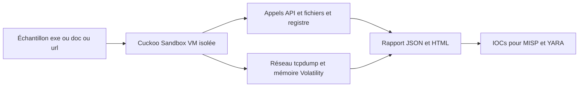
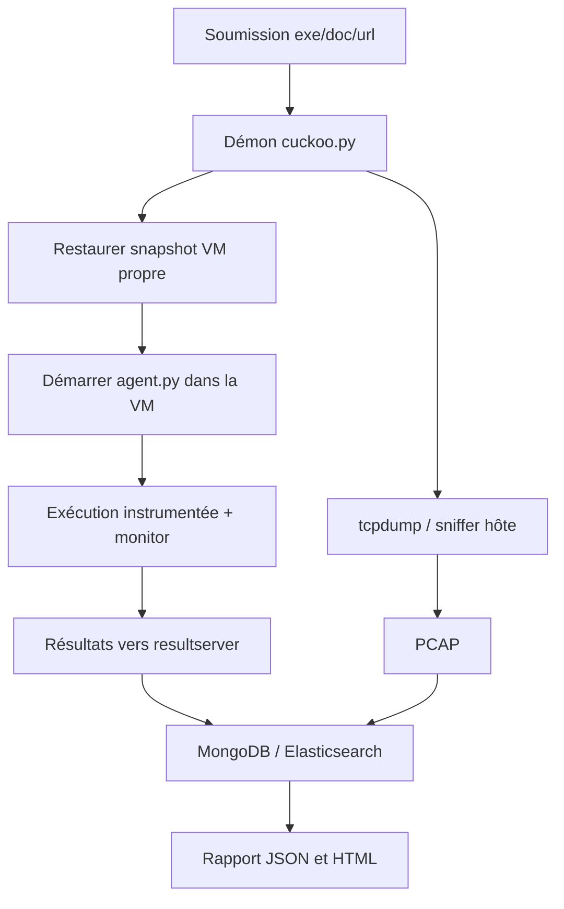

# 🧬 Cuckoo Sandbox — Analyse dynamique automatisée de malwares

> [!info] **En 1 phrase**
> Cuckoo Sandbox est le framework open-source de référence pour exécuter un malware dans un environnement isolé et produire automatiquement un rapport complet de son comportement (processus, fichiers, registre, réseau, mémoire).

---

## 🧾 Overview

| Champ | Valeur |
|---|---|
| Nom complet | Cuckoo Sandbox |
| Description | Framework open-source d'analyse dynamique automatisée : un échantillon (exe, doc, pdf, url, dll) est exécuté dans une VM jetable pendant qu'un ensemble de capteurs observe le comportement (appels API, fichiers, registre, réseau, mémoire) puis produit un rapport JSON/HTML |
| Catégorie | 🧬 Malware & Sandbox |
| Sous-catégorie | Analyse dynamique automatisée — sandbox |
| Fonction principale | Exécuter un malware dans une VM isolée et générer automatiquement un rapport comportemental exploitable pour le triage |
| Type d'outil | Framework / serveur (CLI + Web UI + API REST) |
| Licence | GPL-3.0 (à vérifier sur le dépôt) |
| Open source / propriétaire | Open source |
| Langage(s) de programmation | Python 2.7/3 (hôte), Python (agent invité), C (monitor invité), JavaScript (UI web) |
| Développeur / organisation | Claudio Guarnieri (nex) et de nombreux contributeurs ; maintenance par la communauté jusqu'en 2021 |
| Projet officiel | cuckoosandbox/cuckoo |
| Dépôt officiel | https://github.com/cuckoosandbox/cuckoo |
| Documentation officielle | https://cuckoo.readthedocs.io/en/latest/ |
| Date de création | 11 septembre 2011 (création du dépôt) |
| État du projet | **non maintenu / inactif depuis 2021** — préférer le fork CAPE |
| Dernière version connue | 2.0.7 (février 2018) |
| Systèmes compatibles | Hôte Linux (Debian/Ubuntu) ; invité Windows (XP à 10) et Linux |

> [!note] À vérifier
> Le README du dépôt `cuckoosandbox/cuckoo` déclare la branche 2.x non maintenue (unreadable depuis 2021) et annonce une réécriture sans date. Pour tout usage opérationnel, se tourner vers **CAPE**, qui conserve l'architecture et ajoute l'extraction de configurations.

---

## 🎯 Concept

Cuckoo Sandbox automatise l'analyse dynamique : un échantillon (exécutable, document, script, URL) est lancé dans une machine virtuelle Windows/Linux jetable, pendant qu'une série de capteurs observe tout ce qu'il fait — appels API, création de fichiers et de clés de registre, connexions réseau, processus enfant, dumps mémoire. À la fin, il génère un rapport JSON/HTML qui sert de triage : on décide en quelques minutes si le binaire mérite une analyse manuelle approfondie.

Il se place en début de chaîne d'analyse de malware, entre le triage automatique (hash, YARA, sandbox cloud) et l'analyse statique manuelle (Ghidra, x64dbg). Le framework est modulaire : les signatures YARA taguent les familles connues, Volatility analyse les dumps mémoire, et des « package » Python (exe, doc, pdf, url, dll, jar) gèrent les types de fichiers. Il s'intègre aussi à MISP et VirusTotal pour enrichir les indicateurs. L'architecture repose sur un hôte (démon, base MongoDB/SQLite, `tcpdump`) et une ou plusieurs VM invitées pilotées par VirtualBox/VMware/KVM, avec l'agent `agent.py` installé dans chaque invité. Note importante : Cuckoo n'est plus maintenu officiellement depuis 2021 ; son fork **CAPE** poursuit le développement et ajoute l'extraction de configurations.



---

## 🧠 Concepts fondamentaux

| Concept | Explication |
|---|---|
| Sandbox (hôte / invité) | Architecture client-serveur : un hôte Linux orchestre (démon, base de données, web) et une ou plusieurs VMs jetables exécutent l'échantillon sous surveillance |
| Agent (`agent.py`) | Petit programme Python installé dans la VM invitée ; il reçoit les ordres de l'hôte, exécute l'échantillon et remonte les artefacts |
| Monitor | Composant C injecté dans le processus analysé pour intercepter les appels API Windows et logger les opérations (fichiers, registre, processus, services) |
| Packages (`exe`, `doc`, `pdf`, `dll`, `url`, `jar`) | Wrappers Python qui déclenchent l'échantillon de la bonne manière (double-clic, ouverture dans Word/Acrobat, navigation dans IE/Chrome) |
| Signatures | Règles YARA appliquées aux fichiers/mémoire pour identifier familles et techniques ; signatures comportementales sur les appels API ; règles Suricata sur le PCAP |
| Capture réseau | `tcpdump` lancé depuis l'hôte sur le réseau host-only ; le trafic sortant (DNS, HTTP, IRC…) est conservé en PCAP pour analyse |
| Dump mémoire | L'image RAM de l'invité est sauvegardée et analysable avec Volatility 2 (processus cachés, payloads fileless, MZ en mémoire) |
| Rapport (JSON/HTML) | Structure complète du comportement : `behavior`, `network`, `signatures`, `file`, `dropped`, `memory`, `static` |
| Base de données | MongoDB (recommandé) ou SQLite stocke métadonnées, tâches et résultats ; Elasticsearch indexe les rapports pour la recherche |
| Rooter | Service qui exécute les opérations privilégiées (règles iptables, capture réseau) ; seul composant lancé en root |
| Réseau host-only | Réseau VM isolé sans Internet réel : les requêtes DNS/HTTP sont capturées mais jamais résolues réellement, pour éviter les fausses données |

---

## 🛠️ Installation

Installation sur une machine Linux dédiée (Debian/Ubuntu), jamais sur un poste de production. Le framework nécessite un hyperviseur et un réseau host-only configuré.

```bash
# 1. Dépendances système
sudo apt install -y python3 python3-pip python3-virtualenv mongodb tcpdump graphviz git

# 2. Clone du framework
git clone https://github.com/cuckoosandbox/cuckoo.git
cd cuckoo
pip install -r requirements.txt

# 3. Initialisation : config, base de données, règles YARA de base
cuckoo init

# 4. Déclaration d'une machine virtuelle cible
cuckoo machine --add win10 192.168.56.101 --platform windows --tags analysis
```

Ensuite, il faut configurer `conf/cuckoo.conf` (dossier de stockage, réseau host-only), `conf/virtualbox.conf` (ou `vmware.conf` / `kvm.conf`) avec le nom exact de la VM et de son snapshot, puis installer `agent.py` dans la VM Windows, la démarrer et prendre un snapshot propre (`clean`).

> [!warning] ⚠️ Prérequis & problèmes potentiels
> - **Hyperviseur** : Cuckoo ne fonctionne qu'avec VirtualBox, VMware ou KVM ; il ne supporte pas Hyper-V ni QEMU nu.
> - **Python** : la branche 2.x officielle est en Python 2/3 mixte ; les scripts d'installation gèrent les deux, mais l'écosystème Python 2 est obsolète — d'où la recommandation de passer à CAPE.
> - **Snapshot** : le nom du snapshot doit être exactement celui déclaré dans la config, sinon l'analyse échoue au démarrage (« Timeout hit for machine to change status »).
> - **Isolation** : la VM doit être sur un réseau host-only **sans accès Internet réel**, sinon les données réseau sont faussées.

---

## ⚙️ Configuration

Toute la configuration se trouve dans le dossier `conf/` (format legacy INI, hérité dans CAPE) :

| Paramètre | Rôle | Valeur possible | Impact | Exemple |
|---|---|---|---|---|
| `conf/cuckoo.conf` → `[cuckoo]` `machinery` | Moteur de virtualisation | `virtualbox`, `vmware`, `kvm` | Détermine comment les VMs sont pilotées | `machinery = virtualbox` |
| `conf/cuckoo.conf` → `[resultserver]` | Serveur qui reçoit les résultats | `192.168.56.1:2042` | Point de collecte des artefacts | `ip = 192.168.56.1` |
| `conf/virtualbox.conf` (ou `vmware.conf`, `kvm.conf`) | Déclaration des VMs | `label = win10`, `snapshot = clean` | Machine cible et snapshot à restaurer | `snapshot = clean` |
| `conf/auxiliary.conf` | Capteurs (tcpdump, sniffer, services) | `enabled = yes` | Active la capture réseau | `[sniffer] enabled = yes` |
| `conf/processing.conf` | Modules d'analyse (virustotal, yara, network, behavior) | `enabled = yes` | Active les traitements post-exécution | `[virustotal] enabled = yes` |
| `conf/reporting.conf` | Modules de rapport (json, html, mongodb, misp) | `enabled = yes` | Exporte les résultats | `[misp] enabled = yes` |
| `conf/routing.conf` | Routage réseau (VPN, Tor, InetSim) | `enabled = no` | Restreint/route le trafic invité | `[inetsim] enabled = yes` |

> [!note] À vérifier
> Les noms exacts des clés dépendent de la version (2.0.x) ; la documentation officielle liste chaque fichier `conf/*.conf`. Sur Cuckoo 2.0, prévoir un `conf/mongodb.conf` si MongoDB est utilisé.

---

## 🏗️ Architecture interne

- **`cuckoo.py`** : démon principal (orchestrateur). Il démarre le scheduler, les modules de traitement, la web UI (port 8000) et l'API REST.
- **`modules/processing/`** : analyse post-exécution des artefacts — `network`, `behavior`, `static`, `virustotal`, `memory`, `dropped`.
- **`modules/reporting/`** : génération des rapports JSON/HTML, export MongoDB/Elasticsearch, publication MISP.
- **`modules/auxiliary/`** : capteurs de l'hôte pendant l'exécution (sniffer `tcpdump`, `screenshots`, services réseau).
- **`analyzer/`** : code déployé dans l'invité (analyse Windows/Linux) ; il charge l'échantillon, installe les hooks API et pilote le monitor.
- **`agent/agent.py`** : agent invité en Python qui dialogue avec le `resultserver` de l'hôte.
- **Base de données** : MongoDB (métadonnées, rapports) ou SQLite ; Elasticsearch pour l'indexation.
- **Stockage** : `storage/analyses/<task_id>/` avec `files/`, `reports/`, `memory/`, `dump.pcap`, `logs/`.
- **Rooter** : gère les règles iptables/nftables pour l'isolation et la capture du réseau invité.

Flux d'une analyse : soumission (web/API/CLI) → création de la tâche → restauration du snapshot → démarrage de l'agent → exécution instrumentée de l'échantillon (monitor) → capture réseau parallèle → traitement (signatures, behavior, network) → rapport JSON/HTML → restauration du snapshot → nettoyage.



---

## ⌨️ Commandes

### Commandes principales

```bash
cuckoo                # démarre le démon d'analyse (API sur :8090, UI web sur :8000)
cuckoo web            # interface web (http://localhost:8000)
cuckoo submit /opt/malware/sample.exe
cuckoo submit --package doc --timeout 120 /tmp/malicious.doc
cuckoo clean          # purge les analyses terminées
cuckoo machine --add win10 192.168.56.101 --platform windows
cuckoo community      # télécharge signatures, monitors et packages de la communauté
```

| Commande | Objectif | Résultat attendu |
|---|---|---|
| `cuckoo` | Démarrer le démon + web UI + API | Files d'attente opérationnelles, UI sur `:8000` |
| `cuckoo web` | Lancer l'interface web | Interface de soumission et de consultation des rapports |
| `cuckoo submit <fichier>` | Soumettre un échantillon | Une tâche créée avec un ID |
| `cuckoo clean` | Purger analyses terminées et base | Environnement reparti de zéro |
| `cuckoo community` | Installer signatures/monitors communautaires | Règles YARA et packages à jour |
| `cuckoo machine --add` | Déclarer une VM cible | Machine visible dans l'UI |

### Commandes avancées

```bash
# Soumission avec timeout, machine et dump mémoire
cuckoo submit --timeout 180 --machine win10 -m sample.bin
# Analyse d'un document Office (package doc)
cuckoo submit --package doc /tmp/2026-08-facture.doc
# Soumission d'une URL
cuckoo submit --package url "http://example.com/payload.bin"
# Soumission d'une DLL (déclenchée par rundll32)
cuckoo submit -d payload.dll
```

---

## 🎚️ Options et flags

| Option | Description | Exemple | Niveau |
|---|---|---|---|
| `--package <pack>` | Package à utiliser (`exe`, `doc`, `pdf`, `dll`, `url`, `jar`) | `cuckoo submit --package doc f.xls` | Basic |
| `--timeout <s>` | Durée maximale d'analyse | `cuckoo submit --timeout 180 s.exe` | Basic |
| `--options k=v` | Options passées au package | `cuckoo submit --options "vm=0" s.exe` | Intermediate |
| `--machine <nom>` | Choisir la VM cible | `cuckoo submit --machine win10 s.exe` | Intermediate |
| `-d` | Traiter l'échantillon comme une DLL | `cuckoo submit -d s.dll` | Intermediate |
| `-m` | Activer la prise de dump mémoire | `cuckoo submit -m s.exe` | Advanced |
| `-u` | Ne soumettre que les échantillons uniques (dédup par hash) | `cuckoo submit -u s.exe` | Advanced |
| `--platform <os>` | Plateforme cible (`windows`, `linux`) | `cuckoo submit --platform linux s` | Advanced |
| `--max <n>` | Nombre maximal d'analyses simultanées | `cuckoo submit --max 4 s.exe` | Expert |
| `--priority <n>` | Priorité de la tâche | `cuckoo submit --priority 1 s.exe` | Advanced |
| `--enforce_timeout` | Forcer le timeout même si l'échantillon se termine | `cuckoo submit --enforce_timeout s.exe` | Expert |
| `--custom <script>` | Script d'analyse personnalisé | `cuckoo submit --custom mon_analyzer.py s.exe` | Expert |

> [!note] À vérifier
> Les options exactes dépendent de la version de Cuckoo (2.0.x) ; la liste fiable est obtenue avec `cuckoo submit -h`.

---

## 🧪 Exemples pratiques

### Beginner

```bash
# 1. Vérifier que le démon tourne et que les VM sont disponibles
cuckoo status
# 2. Soumettre un premier échantillon
cuckoo submit /opt/malware/sample.exe
# 3. Récupérer le rapport JSON de la dernière analyse
ID=$(ls -t storage/analyses | head -1)
jq '.network.domains, .behavior.summary' storage/analyses/$ID/reports/report.json
```

### Intermediate

```bash
# Document Office : le package doc ouvre le fichier dans Word pour déclencher la macro
cuckoo submit --package doc --timeout 180 /tmp/2026-08-facture.doc
# Analyser le PCAP capturé
tcpdump -r storage/analyses/$(ls -t storage/analyses | head -1)/dump.pcap -A | grep -i "GET \|User-Agent"
```

### Advanced

```bash
# Loader avec dump mémoire, puis analyse du dump avec Volatility 2
cuckoo submit -m /opt/malware/loader.exe
vol.py -f storage/analyses/$(ls -t storage/analyses | head -1)/memory/memory.dmp windows.malfind
```

### Expert

```bash
# Soumission d'une URL et extraction du C2 dans le rapport
cuckoo submit --package url "http://malicious.example/payload.bin"
jq -r '.network.domains[].domain' storage/analyses/$(ls -t storage/analyses | head -1)/reports/report.json
# Récupérer les fichiers téléchargés (droppers)
find storage/analyses/$(ls -t storage/analyses | head -1)/files/ -type f -exec sha256sum {} \;
```

---

## 🧪 Workflow complet (scénario pas à pas)

1. **Préparer l'environnement** — VM Windows sur un réseau host-only isolé, sans accès Internet réel ; les paquets sont capturés par `tcpdump` depuis l'hôte Cuckoo.

   ```bash
   sudo tcpdump -i vboxnet0 -w /tmp/analysis.pcap
   ```

2. **Soumettre l'échantillon** — choisir le package adapté et un timeout raisonnable.

   ```bash
   cuckoo submit --timeout 120 /opt/malware/sample.exe
   ```

3. **Attendre et suivre la progression** — l'UI web (`cuckoo web`) montre l'état : `pending` → `running` → `reported`. Chaque analyse porte un identifiant numérique.

4. **Lire le rapport** — les artefacts sont dans `storage/analyses/<id>/` ; le rapport JSON est exploitable par script, la version HTML lisible par un analyste.

   ```bash
   jq '.network.http[], .behavior.summary' storage/analyses/42/reports/report.json
   ```

5. **Extraire les IOCs** — domaines/IP de C2, fichiers créés, clés de registre touchées, hash des payloads téléchargés.

6. **Corréler les indicateurs** — hasher les payloads extraits et interroger VirusTotal, matcher les signatures YARA, publier les IOCs dans MISP.

---

## 🎬 Scénarios avancés

### Scénario 1 : Document Office malveillant avec dropper

Le package `doc` exécute le document dans Word, ce qui déclenche la macro ; le dropper téléchargé est capturé dans les fichiers analysés.

```bash
cuckoo submit --package doc --timeout 180 /tmp/2026-08-invoice.doc
ID=$(ls -t storage/analyses | head -1)
ls storage/analyses/$ID/files/ | while read f; do sha256sum "storage/analyses/$ID/files/$f"; done
```

### Scénario 2 : Analyse mémoire d'un loader fileless

Soumettre avec `-m` pour obtenir un dump RAM, puis l'analyser avec Volatility pour retrouver la charge utile qui ne touche jamais le disque.

```bash
cuckoo submit -m /opt/malware/loader.exe
ID=$(ls -t storage/analyses | head -1)
python3 vol.py -f storage/analyses/$ID/memory/memory.dmp windows.malfind
```

### Scénario 3 : Soumission d'une URL pour analyse de navigation

```bash
cuckoo submit --package url http://malicious.example/payload.bin
jq '.network.domains, .network.requests' storage/analyses/$(ls -t storage/analyses | head -1)/reports/report.json
```

### Scénario 4 : Campagne d'analyse groupée pour un corpus

```bash
for f in /opt/corpus/*.bin; do
  echo "== $f =="
  cuckoo submit --timeout 180 "$f"
done
```

---

## 🛡️ Cybersecurity use cases

| Phase | Utilisation |
|---|---|
| Analyse de malware (triage) | Détection automatisée de la malveillance : signatures, comportement, réseau |
| CTI / Threat Intelligence | Collecte d'IOCs (C2, fichiers, clés de registre) et profilage de familles |
| Investigation (DFIR) | Dump mémoire + Volatility pour les payloads fileless |
| Étude pédagogique | Framework de référence pour apprendre l'architecture des sandbox |
| Sécurité offensive (lab) | Observation d'échantillons dans un environnement d'exécution contrôlé |
| Corrélation (MISP/VirusTotal) | Publication automatique des indicateurs détectés |

---

## 🎯 MITRE ATT&CK

| Tactique | Technique / Sub-technique | ID | Raison | Détection | Mitigation |
|---|---|---|---|---|---|
| Execution | User Execution : Malicious File | T1204.002 | L'échantillon est exécuté dans la sandbox ; vecteur typique des campagnes | Triage e-mail, sandboxing | Contrôles d'exécution, restrictions d'accès |
| Execution | Command and Scripting Interpreter : Windows Command Shell | T1059.003 | Les loaders invoquent `cmd.exe`/`powershell.exe` ; observable dans les traces API | Sysmon EventID 1, EDR | AppLocker, AMSI, logs détaillés |
| Execution | Native API | T1106 | Appels directs `VirtualAlloc`, `CreateRemoteThread` tracés par le monitor | EDR, hooks kernel | Contrôle d'intégrité, PPL |
| Defense Evasion | Deobfuscate/Decode Files or Information | T1140 | Les payloads dépaquetés/déchiffrés sont visibles dans le dump | Détection de la chaîne de dépaquetage | Analyse statique + sandbox |
| Defense Evasion | Obfuscated Files or Information | T1027 | Packers et crypters détectés par les signatures | YARA sur fichiers et mémoire | Mise à jour des signatures |
| Defense Evasion | Process Injection | T1055 | Comportement d'injection observé et tracé par les hooks API | Sysmon EventID 8/10 | Restriction des APIs d'injection |
| Command & Control | Application Layer Protocol | T1071 | Domaine/IP de C2 visibles dans la section network | NDR/IPS sur le PCAP | Filtrage sortant, liste de domaines |
| Collection | Data from Local System | T1005 | Fichiers volés capturés dans `files/` et `dropped` | Monitoring des accès fichiers | Segmentation, chiffrement |

> [!note] Ne renseigner que si l'association est réellement pertinente.
> Cuckoo est un **outil d'observation** : les techniques listées sont celles que la sandbox permet de détecter/étudier sur les échantillons, pas des techniques mises en œuvre par Cuckoo lui-même.

---

## 🛡️ Defensive Security

### Signes observables

| Indicateur | Détail |
|---|---|
| Domaine/IP de C2 dans la section réseau du rapport | Bloquer les domaines/IP, les ajouter aux listes de menaces, les partager via MISP |
| Payload téléchargé capturé dans `files/` | Extraire le binaire, le hasher, le re-soumettre en sandbox |
| Clés de registre `Run` modifiées, services créés | Corréler avec Sysmon et Autoruns, détecter la persistance côté EDR |
| Échantillon qui détecte la VM (peu d'appels, sortie rapide) | Rendre la VM réaliste (MAC, BIOS, hostname) ou passer en bare-metal |
| Signatures YARA déclenchées sur une famille connue | Corréler avec le threat intel, rédiger des règles Sigma/EDR |

### Règles de détection (Sigma / Suricata / Snort / YARA)

```yaml
# Sigma — Windows : exécution d'outils de dépaquetage dans la VM (exemple)
title: Debugger And Unpacking Tools Execution
logsource:
    category: process_creation
    product: windows
detection:
    selection:
        Image|endswith:
            - 'x64dbg.exe'
            - 'x32dbg.exe'
            - 'ollydbg.exe'
    condition: selection
level: medium
```

```bash
# Suricata/Snort — alerte sur un User-Agent de téléchargeur connu depuis la VM
alert tcp any any -> any any (msg:"Potential malware downloader from sandbox"; content:"Mozilla/5.0|20|malware-sample"; sid:9500002; rev:1;)
```

---

## 🤖 Automatisation

```bash
# Bash — boucle de soumission d'un dossier d'échantillons
for f in /opt/malware/*.bin; do
    echo "== $f =="
    cuckoo submit --timeout 180 "$f"
done
```

```python
# Python — soumission via l'API REST Cuckoo
import json
import time
import urllib.parse
import urllib.request

API = "http://localhost:8090"
# En pratique : utiliser requests pour le multipart vers /tasks/create/file
task_id = 42
while True:
    with urllib.request.urlopen(f"{API}/tasks/view/{task_id}") as r:
        status = json.load(r)["task"]["status"]
    if status == "reported":
        break
    time.sleep(10)
```

> [!note] À vérifier
> L'exemple Python est un squelette pédagogique : l'envoi multipart se fait avec `requests` (`files={"file": open(...)}`). L'API Cuckoo 2.x est documentée dans la documentation officielle (`/apidocs`).

---

## 📤 Output et parsing

Cuckoo produit un rapport **JSON** (`report.json`), une version **HTML** (lisible dans la web UI) et des artefacts bruts dans `storage/analyses/<id>/` :

- `reports/report.json` — tout : behavior, network, signatures, static, dropped.
- `files/` — fichiers créés/supprimés pendant l'analyse (droppers téléchargés).
- `memory/memory.dmp` — image RAM si le dump est activé.
- `dump.pcap` — capture réseau complète.
- `logs/` — logs de l'analyzer et des packages.

```bash
# Extraire les domaines de C2 depuis le rapport
jq -r '.network.domains[].domain' report.json | sort -u
# Résumer les signatures YARA déclenchées
jq '.signatures[] | select(.name=="yara") | .name' report.json
# Afficher les mutex créés (bon indicateur de famille)
jq '.behavior.summary.mutexes[]' report.json
```

```python
# Python — parsing du rapport pour alimenter un SIEM
import json

with open("report.json") as f:
    report = json.load(f)

for d in report.get("network", {}).get("domains", []):
    print("DOMAIN", d["domain"])
for sig in report.get("signatures", []):
    if sig.get("name") == "yara":
        print("YARA", sig.get("description"))
```

---

## 🔗 Intégrations

- [[Tools|🧰 Outils]] global
- [[Outil - CAPE]] — le fork maintenu qui prolonge Cuckoo (extraction de configs)
- [[Outil - Volatility]] — analyse des dumps mémoire produits par Cuckoo
- [[Outil - YARA]] — signatures de classification des échantillons et payloads
- [[Outil - FakeNet-NG]] — simulation de services réseau pour capturer les C2 sans Internet réel
- [[Outil - MISP]] — publication automatique des IOCs détectés
- [[Outil - REMnux]] — distribution complémentaire pour l'analyse d'échantillons
- [[Outil - Wireshark]] / [[Outil - tshark]] / [[Outil - tcpdump]] — analyse du PCAP capturé
- [[Outil - Ghidra]] — analyse statique du payload extrait
- [[09 - Reverse Engineering & Malware|🔬 Reverse Engineering & Malware]]

```text
Échantillon → Cuckoo (sandbox) → rapport JSON → IOCs (YARA / VirusTotal / MISP) → SOC
```

---

## 🔄 Alternatives

| Outil | Avantages | Inconvénients | Cas d'usage |
|---|---|---|---|
| CAPE (CAPEv2) | Maintenu, dépaquetage et extraction de configs | Plus lourd à installer | Analyse opérationnelle des familles actuelles |
| CAPEsolo | CAPE en version desktop Windows interactive | Jeune, moins d'automatisation | Analyse manuelle en VM Windows |
| Any.Run / Hybrid Analysis | Cloud, UI web, aucun déploiement | Soumission de malwares vers un tiers, quotas | Triage rapide ponctuel |
| Joe Sandbox | Analyse très profonde, familles nombreuses | Propriétaire, coûteux | SOCs disposant d'un budget |
| DRAKVUF | In-the-wild, instrumentation virtuelle Xen | Complexe, axé Linux | Analyse de malwares Linux |
| malwoverview / Viper | Légers, scripts, gestion de corpus | Pas d'exécution ni de dépaquetage | Triage statique, gestion de collection |

> **Quand utiliser Cuckoo plutôt que CAPE ?** Presque jamais : CAPE est maintenu et extrait les configurations. Cuckoo garde un intérêt pédagogique et historique (architecture de référence des sandbox modernes).

---

## ⚡ Performance

- Débit limité par le nombre de VMs et les ressources de l'hyperviseur : chaque analyse consomme une VM (2-4 Go de RAM conseillés par invité Windows).
- Parallélisation : `cuckoo submit --max N` (ou le paramètre du scheduler) lance plusieurs analyses simultanées.
- La capture `tcpdump` ajoute une charge réseau mais reste légère ; le monitor instrumente chaque appel API, ce qui ralentit l'exécution de l'échantillon.
- Le volume de stockage grossit vite : chaque tâche garde PCAP, fichiers, logs et parfois dump mémoire (plusieurs Go par analyse). Prévoir une rétention (`cuckoo clean`).
- MongoDB indexe les rapports ; Elasticsearch accélère la recherche plein-texte sur les gros corpus.

> [!note] À vérifier
> Les chiffres de capacité dépendent du matériel et de la version de Cuckoo (2.x) ; les ordres de grandeur ci-dessus proviennent de la documentation et de retours communautaires.

---

## 🛠️ Troubleshooting

### Common problems

#### Problème : « Timeout hit for machine to change status »

- **Cause** : la VM n'a pas atteint l'état disponible avant le délai (snapshot absent, IP non configurée, agent non démarré).
- **Solution** : vérifier le snapshot déclaré dans `conf/virtualbox.conf`, que l'agent tourne dans l'invité et que l'IP correspond au réseau host-only.
- **Vérification** : `cuckoo status` puis relancer une analyse.

#### Problème : rapport réseau vide (aucun domaine, aucun paquet)

- **Cause** : `tcpdump` n'a pas les droits suffisants sur l'interface host-only ou le module `sniffer` est désactivé.
- **Solution** : activer `[sniffer] enabled = yes` dans `conf/auxiliary.conf` et lancer Cuckoo via le rooter.
- **Vérification** : `sudo tcpdump -i vboxnet0` et observation de paquets pendant une analyse.

#### Problème : l'échantillon produit un rapport propre mais semble malveillant

- **Cause** : anti-sandbox (détection de VM, délais, checks de registre) ; l'échantillon ne détonne pas complètement.
- **Solution** : rendre la VM réaliste (MAC, BIOS, hostname), augmenter `--timeout`, forcer `--enforce_timeout`.
- **Vérification** : inspecter la section `behavior` pour les appels anormalement courts.

#### Problème : erreurs de permission « Operation not permitted »

- **Cause** : des processus Cuckoo tournent en root au lieu d'un utilisateur dédié.
- **Solution** : relancer uniquement le rooter en root, le reste sous un utilisateur dédié.
- **Vérification** : `ps aux | grep -E "cuckoo|tcpdump"`.

#### Problème : MongoDB non joignable au démarrage

- **Cause** : service non démarré ou configuration incohérente.
- **Solution** : `sudo systemctl enable --now mongodb` puis vérifier le port 27017.
- **Vérification** : `mongosh --eval "db.runCommand({ping:1})"`.

---

## 🔐 Sécurité de l'outil

- **Isolation** : Cuckoo exécute du code malveillant. Ne jamais installer le démon sur une machine de production ; utiliser un réseau host-only sans Internet réel.
- **Privilèges** : seul le rooter doit tourner en root ; le reste sous un utilisateur dédié.
- **Accès à l'API** : l'API REST et la web UI n'ont pas d'authentification par défaut — ne pas les exposer hors du réseau d'analyse, ou placer un reverse-proxy avec contrôle d'accès.
- **Clés externes** : la clé API VirusTotal/MISP est stockée dans les fichiers `conf/` ; protéger ces fichiers (chmod 600, hors versionnage).
- **Échantillons sensibles** : le stockage contient des malwares vivants ; le protéger et l'isoler (volume dédié, sauvegarde chiffrée).
- **Escape VM** : maintenir l'hyperviseur à jour et configurer les VMs avec le minimum de droits (clipboard off, shared folders désactivés).
- **Obsolescence** : le projet étant inactif depuis 2021, les CVE connues sur les versions installées ne sont plus corrigées — d'où la recommandation de passer à CAPE.

---

## ⚠️ Limitations

- **Non maintenu depuis 2021** : aucune mise à jour des signatures, monitors ou packages ; les familles récentes ne sont plus bien couvertes.
- Pas d'extraction de configuration : contrairement à CAPE, Cuckoo décrit le comportement mais ne dépaquette pas les payloads.
- Un réseau mal isolé laisse le malware résoudre un vrai DNS et fausser les données réseau.
- Les invités Windows détectent la sandbox (MAC, BIOS, hostname) : de nombreux échantillons ne détonnent pas complètement.
- L'installation est lourde (VM dédiée, hyperviseur, base de données) et sensible aux erreurs de configuration.
- Le monitor est conçu pour Windows x86 ; l'analyse Linux est moins mature.
- Analyse en profondeur limitée par le timeout : les étapes lentes (téléchargements, activation) peuvent être manquées.

---

## 📋 Cheatsheet

```bash
# Démarrer le démon
cuckoo

# Lancer l'interface web
cuckoo web

# Soumettre un échantillon simple
cuckoo submit sample.exe

# Soumettre avec timeout et machine
cuckoo submit --timeout 180 --machine win10 sample.bin

# Soumettre un document Office
cuckoo submit --package doc /tmp/facture.doc

# Soumettre une URL
cuckoo submit --package url "http://example.com/payload"

# Soumettre une DLL
cuckoo submit -d payload.dll

# Activer le dump mémoire
cuckoo submit -m sample.bin

# Installer les règles de la communauté
cuckoo community

# Nettoyer les analyses terminées
cuckoo clean

# Récupérer le rapport JSON de la dernière analyse
ID=$(ls -t storage/analyses | head -1)
jq '.' storage/analyses/$ID/reports/report.json
```

---

## ⚡ Quick reference

| | |
|---|---|
| **À quoi sert-il ?** | Exécuter un malware en sandbox et produire un rapport comportemental complet (processus, fichiers, registre, réseau, mémoire) |
| **Quand l'utiliser ?** | Après un triage positif, pour obtenir les IOCs et le comportement d'un échantillon sans analyse manuelle |
| **Commande principale** | `cuckoo submit --timeout 120 sample.exe` |
| **Alternative principale** | CAPE (maintenu, extraction de configs) · Any.Run / Joe Sandbox (cloud) |
| **Concepts importants** | Packages, monitor, agent.py, réseau host-only, dump mémoire, signatures YARA |
| **Liens associés** | [[Outil - CAPE]] · [[Outil - Volatility]] · [[Outil - YARA]] · [[Outil - FakeNet-NG]] |

---

## 🔍 Détection & Défense

| Signe | Défense |
|---|---|
| Connexions sortantes vers des IP/domaines inconnus juste après le lancement | Bloquer le C2 (firewall/IPS), publier les IOCs dans MISP/OpenCTI |
| Clés de registre `Run` modifiées, services créés | Corréler avec Sysmon et Autoruns, détecter la persistance côté EDR |
| Fichiers créés avec extensions inhabituelles dans `AppData` | Hasher et interroger VirusTotal, matcher avec YARA |
| Échantillon qui détecte la VM (rapport anormalement vide) | Rendre la VM réaliste (MAC, BIOS, hostname) ou passer en bare-metal |
| Payload téléchargé capturé dans `files/` | Extraire, hasher, re-soumettre en sandbox et partager les IOCs |

---

## ⚠️ Tips & Pièges

> [!tip] 💡 **Tips**
> - Utilisez des VM Windows avec un snapshot propre et remettez-le systématiquement entre chaque analyse, sinon les résultats se contaminent.
> - Remplacez les artefacts VM par défaut (MAC `08:00:27:...`, BIOS VirtualBox/QEMU, nom de machine générique) : la plupart des malwares récents testent ces marqueurs.
> - Pour les URL, soumettez directement une `url` avec le package dédié : Cuckoo capture le trafic de navigation et les redirections.
> - Couplez Cuckoo avec [[Outil - FakeNet-NG]] pour simuler les services réseau et observer les C2 sans Internet réel.
> - Utilisez `jq` sur `report.json` dès la sortie de l'analyse : la web UI est confortable, mais le JSON est exploitable par script.

> [!warning] ⚠️ **Pièges**
> - Cuckoo n'est plus maintenu depuis 2021 : pour les familles récentes et l'extraction de configurations, préférez son fork **CAPE**.
> - `tcpdump` doit avoir les droits suffisants sur le réseau host-only, sinon le rapport réseau sera vide sans message d'erreur.
> - Un rapport propre ≠ malware innocent : les échantillons qui détectent l'environnement sandbox produisent des analyses vides. Vérifiez toujours la section « anti-analysis ».
> - Le nom du snapshot dans la config doit être exact, sinon l'analyse échoue avant même de démarrer.

---

## 📚 References

### Official

- Documentation officielle : https://cuckoo.readthedocs.io/en/latest/
- Dépôt GitHub officiel : https://github.com/cuckoosandbox/cuckoo
- Site officiel : https://cuckoosandbox.org/
- Guides d'installation (ReadTheDocs) : https://cuckoo.readthedocs.io/en/latest/installation/

### Security references

- MITRE ATT&CK T1204 — User Execution : https://attack.mitre.org/techniques/T1204/
- MITRE ATT&CK T1059.003 — Windows Command Shell : https://attack.mitre.org/techniques/T1059/003/
- MITRE ATT&CK T1140 — Deobfuscate/Decode Files or Information : https://attack.mitre.org/techniques/T1140/
- MITRE ATT&CK T1071 — Application Layer Protocol : https://attack.mitre.org/techniques/T1071/

### Community

- Blog « Cuckoo Sandbox Book » (appendix) : https://cuckoo.readthedocs.io/en/latest/book/
- Dépôt communautaire de signatures : https://github.com/cuckoosandbox/community
- Fork CAPE (successeur) : https://github.com/kevoreilly/CAPEv2

---

➡️ **Liens :** [[Tools|🧰 Outils]] · [[Outils/Outil - CAPE|🧬 CAPE]] · [[Outils/Outil - Volatility|🔎 Volatility]] · [[Outils/Outil - YARA|🔎 YARA]] · [[Outils/Outil - FakeNet-NG|🌐 FakeNet-NG]] · [[Techniques/09 - Reverse Engineering & Malware|🔬 Reverse Engineering & Malware]] · [[Outil - MISP]]
