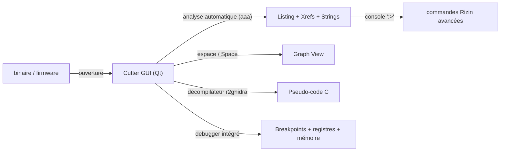

# 🧬 Cutter — Reverse engineering GUI basé sur radare2

> [!info] **En 1 phrase**
> **Cutter** est l'**interface graphique** de radare2 : désassemblage, **vue graphe**, décompilateur
> (via le plugin **r2ghidra**) et **debugger**, le tout dans une UI moderne et gratuite
> (moins connu que Ghidra).

---

## 🧾 Overview

| Champ | Valeur |
|---|---|
| Nom complet | Cutter |
| Description | Plateforme de reverse engineering graphique : désassemblage, graphe de contrôle, décompilation C, debugger, hexdump — propulsée par Rizin |
| Catégorie | 📱 Mobile & Reverse Engineering |
| Sous-catégorie | Reverse engineering interactif (GUI) |
| Fonction principale | Analyse statique et dynamique de binaires (ELF, PE, Mach-O, DEX, firmware) |
| Type d'outil | GUI desktop (Qt), avec console CLI intégrée (commandes Rizin) |
| Licence | GPL-3.0 |
| Open source / propriétaire | Open source |
| Langage(s) de programmation | C++ (Qt 6), Python (bindings `r2pipe`/`rzpipe`, plugins) |
| Développeur / organisation | Rizinorg (mainteneurs : xvilka, alvarfe, XVilka et contributeurs) |
| Projet officiel | rizinorg/cutter |
| Dépôt officiel | https://github.com/rizinorg/cutter |
| Documentation officielle | https://cutter.re/docs/ |
| Date de création | 2017 (ancien « Iaitoh », fork GUI de radare2) |
| État du projet | actif (release tous les ~5 semaines) |
| Dernière version connue | 2.5.0 (30/06/2026), Rizin 0.9.1, Qt 6.11.0 |
| Systèmes compatibles | Linux (AppImage, paquets OBS), Windows (zip, choco), macOS (dmg) |

---

## 🎯 Concept

Cutter est le **frontend graphique** du framework Rizin : il expose sous une interface Qt toutes les capacités du moteur (analyse, désassemblage, décompilation, debug, édition). On ouvre un binaire, l'analyse automatique (`aaa` lancé en arrière-plan ou via le bouton *Analyze*) reconstruit les fonctions, les xrefs et les strings ; on navigue dans le **graph view** (bascule `Space`), on lit le **pseudo-code C** grâce au décompilateur r2ghidra intégré, et on peut **déboguer** localement ou à distance (breakpoints, step, registres, mémoire).

Contrairement à IDA Pro, il est gratuit et open source ; contrairement à Ghidra (Java, lourd), il est **léger et rapide** au démarrage, avec une courbe d'apprentissage courte pour les usages standards. Il est le compagnon naturel de radare2 : la console intégrée (`:>`) accepte toutes les commandes Rizin, et l'outil peut être piloté en mode batch (`cutter -i script.rz`). L'écosystème de plugins et de scripts Python enrichit l'outil (types personnalisés, analyseurs, import/export).



---

## 🧠 Concepts fondamentaux

| Concept | Explication |
|---|---|
| Rizin (rz) | Moteur de reverse engineering (fork de radare2) : parseurs de formats, analyseurs d'architectures, ESIL, debugger |
| Analyse automatique `aaa` | Lance l'analyse profonde : fonctions, xrefs, strings, arguments, structures |
| Graph View | Représentation du graphe de flot de contrôle (CFG) : chaque bloc = séquence d'instructions, arêtes = sauts |
| r2ghidra | Décompilateur C porté depuis Ghidra (SLEIGH) : produit du pseudo-code lisible dans le panneau Decompiler |
| ESIL | Langage d'émulation d'instructions de Rizin : évalue les instructions pour du débuggage/émulation léger |
| Seek / curseur | La « position courante » dans le fichier : toutes les commandes agissent depuis le curseur (`s <addr>`) |
| Flags | Marqueurs nommés à des adresses (fonctions, strings, entrées) : base de la navigation symbolique |
| Xrefs | Références croisées : qui référence une adresse/symbole (data ou code) |
| Debugger Rizin | Support natif (Linux/macOS/Windows) + remote gdb : breakpoints, step, registres, mémoire |
| RzBin | Module d'extraction des métadonnées : imports, exports, sections, strings, entrées |

---

## 🛠️ Installation

### Debian / Ubuntu / Kali Linux

```bash
# AppImage officielle (recommandée)
wget https://github.com/rizinorg/cutter/releases/download/v2.5.0/Cutter-v2.5.0-Linux-x86_64.AppImage
chmod +x Cutter-v2.5.0-Linux-x86_64.AppImage
./Cutter-v2.5.0-Linux-x86_64.AppImage
```

### Windows

```powershell
# Télécharger Cutter-v2.5.0-Windows-x86_64.zip et extraire
# (aucune installation requise ; alternative : choco install cutter-re)
```

### Docker

```bash
# Pas d'image Docker officielle de l'UI (GUI) ; en CLI utiliser l'image rizin :
docker pull rizinorg/rizin
docker run --rm -v "$PWD":/work -w /work rizinorg/rizin rz-bin -I challenge.elf
```

### Compilation depuis les sources

```bash
git clone https://github.com/rizinorg/cutter && cd cutter
mkdir build && cd build
cmake -G Ninja -DCMAKE_BUILD_TYPE=Release ..
ninja
# Les plugins r2ghidra sont inclus dans le build officiel
```

> [!warning] ⚠️ Prérequis & problèmes potentiels
> - Cutter embarque Rizin : **pas besoin d'installer radare2/rizin séparément** pour l'usage GUI.
> - Le décompilateur r2ghidra est **intégré dans les releases officielles** (pas de Java requis).
> - Windows : la version zip nécessite les libs MSVC redistribuables à jour.
> - `choco install cutter-re` : vérifier le nom exact du paquet Chocolatey.

---

## ⚙️ Configuration

Cutter stocke la configuration par projet et globalement dans les fichiers de Rizin (`.rz/` ou `~/.config/rizin`).

| Paramètre | Rôle | Valeur possible | Impact | Exemple |
|---|---|---|---|---|
| Analyse auto au chargement | Lance `aaa` à l'ouverture | activé/désactivé | Temps de chargement vs confort | Case *Analysis* à l'ouverture |
| `e asm.arch` | Architecture à utiliser | `x86`, `arm`, `mips`, `riscv`… | Désassemblage correct | Riziñ configuration |
| `e asm.bits` | Largeur de registres | 32 / 64 | Désassemblage correct | `:> e asm.bits=64` |
| Types widget | Définition des structures C | importer .h / définir à la main | Lisibilité de la décompilation | *Window → Types* |
| Debugger profile | Registres, endianess, arch | profiles intégrés | Session de debug correcte | *Debug → Settings* |
| `RZ_LOG` / `e log.level` | Journalisation | erreurs, warnings, info | Diagnostic | `:> e log.level=5` |

---

## 🏗️ Architecture interne

- **GUI Qt** (C++17, Qt 6) : widgets Désassemblage, Decompiler, Graph, Hexdump, Strings, Imports/Exports, Functions, Types, Debugger, Console.
- **Moteur Rizin** (`librz`) : modules `core` (navigation, commandes), `bin` (parseurs de formats : ELF, PE, Mach-O, DEX…), `analysis` (architectures via plugins), `asm`, `debug` (ptrace/WinDbg, gdb remote), `search`, `esil`.
- **r2ghidra** : décompilateur C (moteur SLEIGH de Ghidra) compilé nativement — aucun runtime Java.
- **Console intégrée** : tout script Rizin (`aaa`, `afl`, `pdf`, `s`, `px`, `wa`, `wx`, `pdd`) peut être tapé préfixé de `:>`.
- **Plugins & scripts** : plugins C++ chargés au démarrage, scripts Python (via `rzpipe`/`r2pipe`) et scripts Rizin (`.rz`).
- **Projets** : sauvegarde flags, commentaires, fonctions renommées, types dans un fichier `.rzdb` (binaire) pour reprise.

---

## ⌨️ Commandes

### Commandes principales

| Action | Effet |
|---|---|
| `cutter ./binary` | Ouvre le binaire dans la GUI |
| `cutter -A ./binary` | Ouvre et lance l'analyse automatique |
| Bouton *Analyze* | Lance `aaa` si non exécutée au chargement |
| `Space` | Bascule listing ↔ graph view |
| Panneau *Decompiler* | Pseudo-code C (r2ghidra) de la fonction courante |
| `F4` / clic droit | Toggle breakpoint |
| `F8` / `F7` / `F6` | Step over / step into / step out |
| `F9` | Continue l'exécution |
| Onglet *Console* | Ligne de commande Rizin : `:> afl`, `:> s main`, `:> pdf` |
| *View → Functions* | Liste des fonctions analysées (renommage F2) |
| *Search → Strings* | Recherche de chaînes (courtes/longues) |

### Commandes avancées

```bash
# Depuis la console intégrée (préfixe ':>')
:> aaa                                # analyse profonde
:> afl                                # liste les fonctions
:> s main ; pdf                       # seek + désassemblage
:> s sym.check_password ; pdd         # pseudo-code C d'une fonction
:> iz ; izz                           # strings courtes / longues
:> axt @ sym.check                   # xrefs vers la fonction
:> px 64 @ 0x401000                   # hexdump
:> wa jne 0x4011a0                    # patch assembleur (mode -w)
:> wx 9090                            # patch bytes (NOP)
# Lancer en CLI pour scripting (mode headless)
cutter -A -i script.rz binary
```

---

## 🎚️ Options et flags

| Option | Description | Exemple | Niveau |
|---|---|---|---|
| `<fichier>` | Binaire à ouvrir | `cutter app.bin` | Basic |
| `-A` | Analyse automatique au chargement | `cutter -A app.bin` | Basic |
| `-w` | Mode écriture (patch possible) | `cutter -w app.bin` | Intermediate |
| `-a <arch>` | Forcer l'architecture | `cutter -a arm app.bin` | Intermediate |
| `-b <bits>` | Forcer la largeur (32/64) | `cutter -b 32 app.bin` | Intermediate |
| `-i <script.rz>` | Exécuter un script Rizin à l'ouverture | `cutter -i init.rz app.bin` | Advanced |
| `-p <projet>` | Charger un projet sauvegardé | `cutter -p lab.rzdb app.bin` | Advanced |
| `-S <script>` | Exécuter un script après analyse | `cutter -A -S dump.py app.bin` | Expert |

> [!tip] Options les plus utiles au quotidien
> `-A` (analyse directe), `-w` (mode écriture pour patcher), l'onglet Console (`:>`) pour tout le reste, et le panneau Decompiler pour lire le C.

---

## 🧪 Exemples pratiques

### Beginner

```bash
# Objectif : ouvrir un ELF x86-64 et retrouver main
cutter -A challenge.elf
# Dans la GUI : View → Functions → main ; Space pour le graphe
```

### Intermediate

```bash
# Objectif : lire la décompilation d'une fonction de check
# View → Functions → sym.check_password → panneau Decompiler
# La console affiche l'équivalent :
:> s sym.check_password
:> pdd
```

### Advanced

```bash
# Objectif : repérer une string sensible et remonter aux xrefs
# Search → Strings → taper "password" → double-clic
# Puis : clic droit sur la string → Show X-Refs
# Console équivalente :
:> iz | grep -i password
:> axt @ <adresse_de_la_string>
```

### Expert

```bash
# Objectif : patcher en direct puis sauvegarder
cutter -w challenge.elf
:> s main ; pdf                      # repérer le branchement
:> wa jmp 0x4011a0                   # forcer le saut vers le succès
# File → Save As → challenge_patched.elf
# Objectif : script batch (décompiler toutes les fonctions)
# Script Python via rzpipe
```

---

## 🧪 Workflow complet (scénario pas à pas)

**Scénario : débugger une fonction de vérification de mot de passe dans un ELF.**

```text
1.  cutter challenge.elf → lancer l'analyse (bouton "Analyze" après l'ouverture)
2.  View → Functions → cliquer sur main
3.  Panneau "Decompiler" : lire le pseudo-code C (appel à strcmp ?)
4.  Passer en mode Debugger : "Start Debugging" (ou Ctrl+D)
5.  Poser un breakpoint sur la fonction de vérif (clic droit → Toggle Breakpoint, F4)
6.  Exécuter (F9), entrer un mot de passe, observer registres et stack au breakpoint
7.  Récupérer la string secrète via Search → Strings, ou modifier la logique en direct
```

```bash
# En CLI depuis l'onglet "Console" (radare2 intégré) :
# (taper dans la console Cutter)  :  s main ; pdf ; pdd
```

---

## 🎬 Scénarios avancés

### Scénario 1 : patch du binaire en direct

Modifier une comparaison `jne` (saut si différent) en `je` pour forcer l'accès :

```text
# Dans la console Rizin de Cutter :
s main ; pdf                      # repérer l'instruction de branchement
s <adresse_de_l_instruction> ; wa jmp 0x<adresse_succes>
# Puis File → Save pour écrire le fichier patché
```

### Scénario 2 : analyse d'un binaire packé avec UPX

```bash
# En CLI (hors Cutter) : dépaqueter puis rouvrir
upx -d challenge_upx
cutter challenge_unpacked
# Sinon : analyser directement et laisser le loader de rizin suivre l'OEP
```

### Scénario 3 : annoter et renommer pour cartographier un crackme

```text
1.  View → Functions → renommer les fonctions clés (F2) : check_password, decrypt_flag...
2.  Clic droit sur une adresse → "Add comment" pour documenter la logique
3.  View → Hexdump : suivre les zones de données utilisées par le code
4.  Export du listing via Console : afl ; pdf @ sym.check_password
```

---

## 🛡️ Cybersecurity use cases

| Phase | Utilisation |
|---|---|
| Reverse engineering statique | Désassemblage, graphe, décompilation C de binaires inconnus (ELF/PE/Mach-O/DEX) |
| Analyse de malware | Extraction des strings/C2, compréhension du loader, unpacking UPX |
| Exploitation (préparation) | Étude du flux de contrôle, identification des checks, calcul d'offsets |
| CTF / crackme | Lecture rapide du pseudo-code C, patching en direct |
| Analyse de firmware | Ouverture de dump brut (avec `rz-bin -I` et esil) |

---

## 🎯 MITRE ATT&CK

| Tactique | Technique / Sub-technique | ID | Raison | Détection | Mitigation |
|---|---|---|---|---|---|
| Execution | Native API | T1106 | Analyse des appels API natifs pour comprendre le comportement du binaire | — | — |
| Defense Evasion | Debugger Evasion | T1622 | Le debugger de Cutter aide à contourner les checks anti-debug (ptrace, TracerPid) | Détection des ptrace répétés, `TracerPid` non nul | Anti-debug renforcé, monitoring |
| Defense Evasion | Obfuscated Files or Information : Software Packing | T1027.002 | Unpacking de binaires packés (UPX/Themida) en vue de l'analyse | Checksum des sections modifiées | Obfuscation/virtualisation |
| Discovery | System Information Discovery | T1082 | Extraction des métadonnées du binaire (arch, imports, sections) via RzBin | — | — |
| Credential Access | Unsecured Credentials : Credentials In Files | T1552.001 | Extraction de secrets hardcodés dans les strings du binaire | Revue des secrets en clair | Gestion des secrets |

---

## 🛡️ Defensive Security

### Signes observables

| Indicateur | Détail |
|---|---|
| Anti-debug | Les checks `ptrace(PTRACE_TRACEME)` et `TracerPid` fonctionnent contre le debugger Rizin |
| Binaire packé | UPX/Packer : analyser d'abord le stub, unpacker, puis rouvrir l'image décompressée |
| Obfuscation de flux | Le pseudo-code r2ghidra est dégradé sur du flux obfusqué (opaque predicates, VMProtect) |
| Binaires énormes | Gros BSS/DATA → chargement lent : cibler les imports et les sections |
| Anti-tamper | Vérification de checksums si le binaire se modifie lui-même : le patch sera détecté |

### Règles de détection (Sigma / Suricata / Snort / YARA)

```yaml
# Sigma — Windows : exécution de Cutter / outils Rizin
title: Cutter or Rizin Tools Execution
id: 7c1e2f3a-9b4d-4e8f-8a2c-1d3e4f5a6b7c
status: test
logsource:
    category: process_creation
    product: windows
detection:
    selection:
        Image|endswith:
            - '\cutter.exe'
            - '\rz-bin.exe'
            - '\rz-asm.exe'
    condition: selection
falsepositives:
    - Reverse engineering légitime en lab
level: medium
```

---

## 🤖 Automatisation

```bash
# Bash — décompiler toutes les fonctions d'un binaire via la CLI
for fn in $(rz-bin -I challenge.elf | grep -i "arch"); do
    echo "$fn"
done
# Décompilation en script Rizin : le même langage qu'en GUI
cat <<'EOF' > dump.rz
aaa
s main
pdd
EOF
cutter -A -i dump.rz challenge.elf
```

```python
# Python — piloter Cutter via rzpipe (API du moteur Rizin)
import rzpipe

rz = rzpipe.open("./challenge.elf", ["-2"])
rz.cmd("aaa")
for line in rz.cmd("afl").splitlines():
    parts = line.split()
    if len(parts) >= 3:
        addr, name = parts[0], parts[2]
        print(addr, name)
rz.quit()
```

---

## 📤 Output et parsing

Les sorties de Rizin sont textuelles, et la plupart des commandes acceptent un suffixe **`j` pour le JSON** (facilement parsable).

```bash
# Listing JSON des fonctions
:> aflj | head -c 500
# Pseudo-code C d'une fonction
:> pdd @ main
# Métadonnées du binaire (hors GUI)
rz-bin -I challenge.elf
rz-bin -s challenge.elf | grep -i "http"
```

```python
# Python — parsing JSON de aflj
import rzpipe, json

rz = rzpipe.open("./challenge.elf", ["-2"])
rz.cmd("aaa")
funcs = json.loads(rz.cmd("aflj"))
for f in funcs:
    print(f"{f['name']:40s} @ {hex(f['offset'])}  nbblk={f.get('nbbs', '?')}")
rz.quit()
```

---

## 🔗 Intégrations

```text
Cutter (GUI) → Rizin (moteur) → rz-bin (métadonnées) → r2ghidra (décompilateur) → scripts Python/rzpipe
Cutter → gdb remote (debug à distance) → QEMU user mode
```

- [[Tools|🧰 Outils]] global
- [[Outil - radare2|🧬 radare2]] — la CLI du même moteur (Cutter utilise Rizin, mais la syntaxe est identique)
- [[Outil - Ghidra|🧬 Ghidra]] — décompilateur comparable, analyse en profondeur, mode headless
- [[Outil - gdb-peda|🐛 gdb-peda]] — debugger ligne de commande pour la phase d'exploitation
- [[Outil - pwntools|🧩 pwntools]] — exploitation automatisée après la compréhension du binaire
- [[Outil - ROPgadget|🧱 ROPgadget]] — construction des chaînes ROP après identification des gadgets
- [[Outil - x64dbg|🖥️ x64dbg]] — équivalent Windows pour l'analyse dynamique native
- [[Techniques/Buffer Overflow|📚 Buffer Overflow]] · [[Techniques/Hardware - Logic Analyzer|📐 Logic Analyzer]]
- [[09 - Reverse Engineering & Malware|🧬 Reverse & Malware]]

---

## 🔄 Alternatives

| Outil | Avantages | Inconvénients | Cas d'usage |
|---|---|---|---|
| [[Outil - Ghidra|Ghidra]] | Décompilateur de référence, BSim, scripts Java/Python, analyseur le plus complet | Lourd (Java), RAM importante, lancement lent | Gros binaires, équipe collaborative |
| [[Outil - radare2|radare2]] | 100% CLI, scriptable, léger, rapide en SSH | Courbe d'apprentissage raide, pas de GUI | CTF, serveurs, automation |
| IDA Pro | Analyseur le plus mature, Decompiler Hex-Rays, écosystème | Payant (très cher) | Reverse professionnel |
| x64dbg | Debugger Windows moderne et ergonomique | Windows uniquement, moins orienté statique | Débug Windows natif |
| Binary Ninja | Léger, API Python moderne, MLIL | Payant (licence) | Reverse pro en Python |

> **Quand utiliser Cutter plutôt que Ghidra ?** Pour une analyse **interactive rapide** d'un binaire de taille moyenne : Cutter démarre en secondes, son graphe et son décompilateur sont immédiats, et la console Rizin permet d'enchaîner les commandes. Ghidra reste supérieur pour les gros projets, le travail d'équipe (BSim) et l'analyse de firmware massif.

---

## ⚡ Performance

- Démarrage rapide : Cutter ouvre un binaire et lance `aaa` en **quelques secondes** (contre des dizaines pour Ghidra).
- L'analyse `aaa` est dominée par la phase de reconstruction des fonctions : sur des binaires de plusieurs dizaines de Mo, préférer une analyse ciblée (`aa`, `aafl` sur les zones utiles).
- Le décompilateur r2ghidra est **à la demande** : le panneau Decompiler ne travaille que sur la fonction affichée.
- Le debugger Rizin est plus léger qu'un VM debugger : utiliser QEMU (user/system mode) pour l'émulation d'architectures étrangères.
- Limites connues : graphes de très grosses fonctions (milliers de blocs) peuvent ralentir l'UI ; `aaa` sur du code très obfusqué coûte du temps CPU.

---

## 🛠️ Troubleshooting

### Common problems

#### Problème : le panneau Decompiler est vide

- **Cause** : le plugin r2ghidra n'est pas chargé/activé.
- **Solution** : vérifier *Edit → Settings → Plugins* et redémarrer Cutter ; utiliser la release officielle (r2ghidra inclus).
- **Vérification** : `:> pdd` doit produire du C, sinon `:> e plugins` affiche les plugins chargés.

#### Problème : le débogage ne démarre pas

- **Cause** : permissions ptrace (Linux) ou architecture non native.
- **Solution** : `echo 0 | sudo tee /proc/sys/kernel/yama/ptrace_scope` (lab) ; pour ARM sur x86, passer par gdb remote/QEMU.
- **Vérification** : `:> dko` (kill all) puis relancer *Debug → Start*.

#### Problème : le désassemblage semble faux (opcodes bizarres)

- **Cause** : mauvaise architecture/bits détectée (firmware brut, binaire strippé).
- **Solution** : forcer `:> e asm.arch=x86` / `e asm.bits=32`, ou ré-importer avec `cutter -a arm -b 32`.
- **Vérification** : `:> iI` affiche les infos du binaire détectées.

#### Problème : le patch n'est pas sauvegardé

- **Cause** : ouverture en lecture seule (pas de `-w`) et/ou sortie sans Save.
- **Solution** : rouvrir avec `cutter -w fichier`, patcher, puis *File → Save* (ou `:> wf`).
- **Vérification** : vérifier les octets modifiés avec `px 16 @ <adresse>`.

---

## 🔐 Sécurité de l'outil

- **Permission** : analyser des binaires tiers (malware) dans un environnement isolé — Cutter exécute des parseurs de format potentiellement buggés.
- **Debug** : lancer un malware sous le debugger Rizin peut déclencher du code malveillant : utiliser une VM et désactiver le réseau.
- **Plugins** : ne charger que des plugins de sources fiables (r2ghidra officiel, scripts vérifiés).
- **Projets** : les fichiers `.rzdb` peuvent contenir des chemins de fichiers sensibles : ne pas les partager publiquement.
- **Exfil de données** : l'analyse de firmware/produits propriétaires doit respecter le périmètre de l'engagement.

---

## ⚠️ Limitations

- Pas de décompilateur aussi complet que celui de Ghidra pour les architectures exotiques (il s'en approche néanmoins via r2ghidra).
- Le debugger natif ne couvre que l'hôte : pour émuler une autre architecture, passer par gdb remote/QEMU.
- Les très gros binaires (firmware complets de plusieurs centaines de Mo) sont plus lents à analyser que sous Ghidra headless.
- L'UI est en anglais ; la documentation communautaire est moins fournie que celle d'IDA/Ghidra.
- Le plugin r2ghidra n'est pas aussi finement contrôlable que le décompilateur Ghidra natif (options limitées).

---

## 📋 Cheatsheet

```bash
# Ouverture avec analyse
cutter -A challenge.elf

# Navigation
Space                  # graph ↔ listing
F2                     # renommer une fonction
Ctrl+G                 # aller à une adresse

# Console Rizin (préfixe ':>')
aaa                    # analyse profonde
afl                    # liste des fonctions
s main ; pdf           # seek + désassemblage
pdd                    # pseudo-code C (r2ghidra)
iz ; izz               # strings
axt @ <sym>            # xrefs vers un symbole
px 64 @ 0x401000       # hexdump

# Debugger
F4                     # toggle breakpoint
F8 / F7 / F6           # step over / into / out
F9                     # continue

# Patching
wa jne 0x4011a0        # patch assembleur
wx 9090                # patch octets (NOP)
File → Save            # écrire le fichier modifié
```

---

## ⚡ Quick reference

| | |
|---|---|
| **À quoi sert-il ?** | Reverse engineering graphique : désassemblage, graphe, décompilation C, debug |
| **Quand l'utiliser ?** | Analyse interactive rapide d'un binaire, crackme, malware, firmware |
| **Commande principale** | `cutter -A challenge.elf` puis `Space`, panneau Decompiler, console `:>` |
| **Alternative principale** | [[Outil - Ghidra|Ghidra]] (profondeur), [[Outil - radare2|radare2]] (CLI) |
| **Concepts importants** | Rizin, r2ghidra, graph view, flags, xrefs, ESIL |
| **Liens associés** | [[Outil - radare2]] · [[Outil - Ghidra]] · [[Outil - x64dbg]] |

---

## 🔍 Détection & Défense

| Signe | Défense |
|---|---|
| Exécution de `cutter`/`rz-bin` sur un endpoint | Détection EDR (Sigma), restriction des postes d'analyse |
| Processus attachés (ptrace) | Monitoring des ptrace/`TracerPid` dans les apps protégées |
| Binaire dumpé/dépacké en mémoire | Vérifier l'intégrité des sections et la signature du binaire |
| Présence de fichiers `.rzdb` | Artefact de projet RE : à surveiller dans les shares |
| Analyse réseau active | Isoler la machine d'analyse (pas de réseau ou firewall strict) |

---

## ⚠️ Tips & Pièges

> [!tip] 💡 **Le graphe est le plus rapide**
> Bascule avec `Space` en suivant un `strcmp` : voir les deux branches dans le graph est bien plus rapide que de lire du listing.

> [!tip] 💡 **La console Rizin est toujours là**
> Les commandes Rizin (`afl`, `px`, `s`, `pdd`) fonctionnent dans l'onglet Console (préfixe `:>`) : combine GUI et CLI pour aller vite.

> [!tip] 💡 **Les suffixes `j` = JSON**
> `aflj`, `pxj`, `izj` produisent du JSON : idéal pour exporter les résultats d'analyse vers un script Python.

> [!warning] ⚠️ **Le plugin r2ghidra doit être activé**
> Sans le plugin, pas de décompilateur C : vérifie dans Settings → Plugins que r2ghidra est cochée, sinon le panneau "Decompiler" reste vide.

> [!warning] ⚠️ **Debugger natif uniquement**
> Cutter débogue **via Rizin** (pas de QEMU complet) : sur une archi non-native ou un firmware, préfère Ghidra pour l'analyse statique pure.

> [!warning] ⚠️ **`-A` OU `aaa`, pas les deux**
> `cutter -A` lance déjà l'analyse : lancer `aaa` en console derrière est inutile et ralentit.

---

## 📚 References

### Official

- Documentation officielle : https://cutter.re/docs/
- GitHub officiel : https://github.com/rizinorg/cutter
- Releases : https://github.com/rizinorg/cutter/releases
- Rizin (moteur) : https://github.com/rizinorg/rizin
- r2ghidra : https://github.com/rizinorg/r2ghidra

### Security references

- MITRE ATT&CK T1106 — Native API : https://attack.mitre.org/techniques/T1106/
- MITRE ATT&CK T1622 — Debugger Evasion : https://attack.mitre.org/techniques/T1622/
- MITRE ATT&CK T1027.002 — Software Packing : https://attack.mitre.org/techniques/T1027/002/
- MITRE ATT&CK T1552.001 — Unsecured Credentials : https://attack.mitre.org/techniques/T1552/001/

### Community

- Rizin Book (référence des commandes) : https://book.rizin.re/
- radare2 Book (commandes similaires) : https://book.rada.re/

---

➡️ **Liens :** [[Tools|🧰 Outils]] · [[Outil - radare2|🧬 radare2]] · [[Outil - Ghidra|🧬 Ghidra]] · [[Outil - x64dbg|🖥️ x64dbg]] · [[Techniques/Buffer Overflow|📚 Buffer Overflow]] · [[Techniques/Hardware - Logic Analyzer|📐 Logic Analyzer]]
