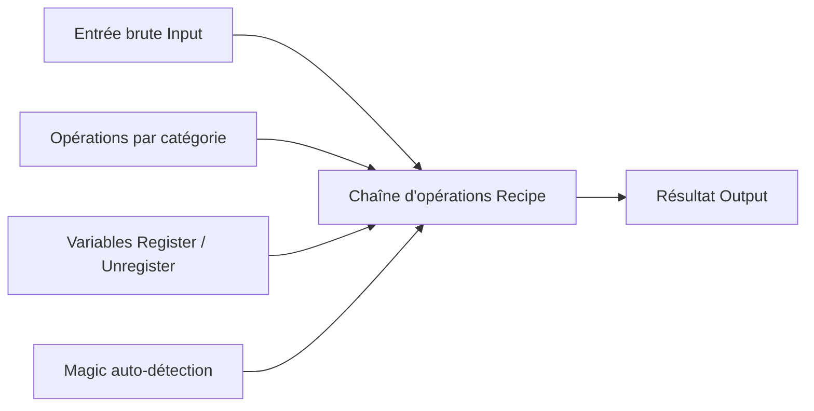

# CyberChef — Le couteau suisse de l'encodage

> [!info] **En 1 phrase**
> La « Cyber Cheesecake Factory » : un outil web pour chaîner décodages, encodages, transformations et crypto en un simple glisser-déposer.

---

## Overview

| Champ | Valeur |
|---|---|
| Nom complet | CyberChef |
| Description | Application web de transformation de données : encodage/décodage, hashing, compression, crypto, extraction d'indicateurs, regex, JSON — via des « recettes » visuelles |
| Catégorie | CTF & Développement |
| Sous-catégorie | Analyse de données / Défanging / Crypto |
| Fonction principale | Enchaîner des opérations de transformation sur une entrée pour produire une sortie |
| Type d'outil | Web app (aussi paquet npm `cyberchef`, Docker, build local) |
| Licence | Apache-2.0 |
| Open source / propriétaire | Open source |
| Langage(s) de programmation | JavaScript / TypeScript (frontend) + Node.js (backend CLI) |
| Développeur / organisation | GCHQ (agence de renseignement britannique) |
| Projet officiel | gchq/CyberChef |
| Dépôt officiel | https://github.com/gchq/CyberChef |
| Documentation officielle | https://github.com/gchq/CyberChef/wiki |
| Date de création | Juillet 2016 (première release npm 2016-11-28) |
| État du projet | actif (releases fréquentes) |
| Dernière version connue | 11.3.0 (24 juillet 2026) |
| Systèmes compatibles | Tous navigateurs modernes ; build Node.js local ; Docker |

> [!note] Pour vérifier / compléter
> Toutes les opérations s'exécutent **dans le navigateur** : aucune donnée n'est envoyée au serveur. Le paquet npm `cyberchef` permet l'usage en CLI (Node.js) pour l'automatisation.

---

## Concept

CyberChef est un utilitaire web développé par le **GCHQ** permettant de transformer des données via un **workflow visuel d'opérations chaînées** : les « recettes » (*recipes*). Chaque étape (From Base64, From Hex, XOR, ROT13, Gunzip…) est une opération appliquée séquentiellement sur l'entrée pour produire la sortie. Tout le traitement se fait **côté client** (dans le navigateur), ce qui permet de traiter des données sensibles ou classifiées sans les exposer, et de fonctionner hors-ligne via le build local.

Il se place à trois endroits dans un engagement : (1) en **CTF / red team** pour résoudre les chaînes d'encodage imbriquées (ex. base64 → hex → XOR → ROT) sans écrire de code ; (2) en **défense / SOC** pour défanger des URLs malveillantes, décoder des indicateurs issus de logs, pièces jointes ou rapports ; (3) en **analyse de malwares** pour décoder un config extrait (C2, clé XOR, URL de dropper) depuis un binaire ou un document Office. Le mode **Magic** propose une recette complète par auto-détection du format d'entrée.



---

## Concepts fondamentaux

| Concept | Explication |
|---|---|
| Recette (recipe) | Suite ordonnée d'opérations appliquées l'une après l'autre sur l'entrée ; chaque opération reçoit la sortie de la précédente |
| Opération | Fonction de transformation élémentaire (decode, encode, hash, regex, compression, crypto…) |
| Bake | Action de lancer le calcul de la recette (bouton « Bake! ») ; l'auto-bake recalcule à chaque modification |
| Magic | Module d'auto-détection qui analyse l'entrée et propose la recette la plus plausible |
| Input / Output | Champs d'entrée et de sortie ; le résultat final s'affiche en bas de la chaîne |
| Fork | Duplique le flux en N branches exécutées en parallèle (ex. chaque ligne) |
| Merge | Recompose les flux sortant d'un Fork |
| Register / Unregister | Variables nommées dans un flux (ex. `$key`) pour des workflows complexes |
| Conditional jumps | Branches conditionnelles (depuis v10) : la recette peut prendre des chemins différents selon la donnée |
| Recipes partagées | Une recette peut être enregistrée dans l'URL (paramètre `recipe`) pour la partager |
| Exécution locale | Le JS des opérations tourne dans le navigateur (WASM/JS) : aucun transfert réseau |

---

## Installation

### Debian / Ubuntu / Kali Linux

```bash
# Usage web : aucune installation
# Raccourci : ouvrir https://gchq.github.io/CyberChef/
```

### Arch Linux

```bash
# Paquet AUR
sudo pacman -S cyberchef
```

### Fedora / RHEL

```bash
# Via npm (Node.js) ou directement en ligne
```

### macOS

```bash
brew install --cask cyberchef
# ou clone + npm install
```

### Windows

```powershell
# Navigation vers la version en ligne, ou build local :
git clone https://github.com/gchq/CyberChef.git
cd CyberChef
npm install
npm start
```

### Docker

```bash
docker run -d -p 8080:8080 ghcr.io/gchq/cyberchef:latest
# puis http://localhost:8080
```

### Compilation depuis les sources

```bash
git clone https://github.com/gchq/CyberChef.git && cd CyberChef
npm install
npm start        # serveur de dev
npm run build    # build de production (CyberChef_vX.Y.Z.zip)
```

> [!warning] Prérequis & problèmes potentiels
> - Node.js version exigée selon la release (Node 18+/20+ recommandés) — vérifier le README pour la version exacte.
> - Le build complet nécessite plusieurs Go ; prévoir de la RAM et du temps.
> - En usage web en ligne, seuls les navigateurs modernes sont supportés (pas de traitement serveur).

---

## Configuration

CyberChef se configure essentiellement **dans l'interface** : options d'affichage, profils d'opérations masquées, thème, et URL de partage des recettes.

| Paramètre | Rôle | Valeur possible | Impact | Exemple |
|---|---|---|---|---|
| Auto Bake | Recalcul automatique à chaque modification | On / Off | Productivité vs performances | Désactiver sur gros inputs |
| Max File Size | Limite d'upload/input | 1 MB par défaut | Empêche les DoS navigateur | Augmenter pour les gros fichiers |
| Theme | Apparence | Auto / Light / Dark | Confort visuel | Dark en soirée |
| Opérations masquées | Désactiver des opérations dans les menus | Liste d'opérations | Simplifier l'interface | Masquer les opérations rarement utilisées |
| Paramètre `recipe` dans l'URL | Partager une recette encodée | JSON encodé en URL | Reproductibilité des analyses | Copier le lien « Bake » |
| `$input` / `$output` | Variables spéciales d'entrée/sortie | Chaînes | Workflows avec Register | `From Base64 ($input)` |

> [!note] À vérifier
> Les noms exacts des réglages (onglet « Options ») varient légèrement entre les versions ; vérifier l'interface de la release utilisée.

---

## Architecture interne

- **Frontend** : application **Vue.js** (Single Page Application) ; l'interface est une colonne Input, une colonne Recipe (drag & drop d'opérations), une colonne Output.
- **Moteur d'opérations** : chaque opération est une classe JavaScript (héritant de `Operation`) avec un `run(input, args)` ; le moteur exécute la chaîne séquentiellement, gère le découpage d'entrée, les branches (Fork/Merge), les variables (Register/Unregister) et les sauts conditionnels (v10+).
- **Bundler** : Webpack assemble l'app et l'ensemble des opérations en un seul fichier HTML/JS téléchargeable (zip de build) — d'où le fonctionnement 100 % local possible.
- **CLI Node** : le paquet npm `cyberchef` expose `node node_modules/cyberchef/src/node/index.mjs` pour exécuter des recettes depuis la ligne de commande (utile en automatisation).
- **Recettes partagées** : encodage JSON de la recette dans l'URL (`recipe` + `input`) ; un « lien de recette » permet de rejouer exactement une analyse.
- **Magic** : heuristique qui teste l'entrée contre un ensemble de transformations candidates et score les sorties lisibles pour proposer la meilleure recette.

---

## Commandes

### Commandes principales

CyberChef étant une interface graphique, les « commandes » sont des opérations glissées dans la colonne « Recipe » :

```text
From Base64 -> From Hex -> XOR -> ROT13 -> Gunzip -> Output
```

| Opération | Objectif | Résultat attendu |
|---|---|---|
| `From Base64` | Décode un flux base64 | Texte/octets en clair |
| `From Hex` | Décode une chaîne hexadécimale | Octets bruts |
| `From Binary` | Décode du binaire 0/1 | Octets/texte |
| `XOR` | XOR avec clé (bruteforce 1 octet dispo) | Données démasquées |
| `ROT13` / `ROT8000` | Rotation de caractères | Texte latin / CJK |
| `Gunzip` / `Gzip` | Décompression / compression | Flux décompressé |
| `Magic` | Auto-détection du format | Recette complète proposée |
| `AES Decrypt` | Déchiffrement AES (CBC/CTR/GCM…) | Clair si clé + mode connus |
| `RSA Decrypt` | Déchiffrement RSA (n, d, c) | Message clair |
| `Extract URLs` | Extrait les URLs d'un texte | Liste d'URLs |
| `Defang URL` | Neutralise URLs/emails | URLs non cliquables |
| `JWT Decode` | Décode un JWT sans bibliothèque | Header/payload en clair |
| `Extract Hash` | Repère les hashs connus | Hashs + type probable |
| `Entropy` | Mesure d'entropie d'une zone | Détection chiffrement/compression |
| `Generate all hashes` | Calcule MD5/SHA-1/SHA-256/… | Table des hashs |

### Commandes avancées

```bash
# CLI Node.js (paquet cyberchef) — exemple de recette fromBase64
node node_modules/cyberchef/src/node/index.mjs \
  "ZmxhZ3tDOGJlcl8wTkV9" -- 'From Base64' 2>/dev/null
```

---

## Options et flags

| Option | Description | Exemple | Niveau |
|---|---|---|---|
| `Auto Bake` | Recalcul automatique | Cocher/décocher | Basic |
| `Fork` | Brancher le flux (par ligne, par délimiteur) | `Fork ('\n')` | Intermediate |
| `Merge` | Recomposer les branches | Après un Fork | Intermediate |
| `Register` | Définir une variable `$key` | `Register 'key'` | Advanced |
| `Unregister` | Libérer une variable | `Unregister 'key'` | Advanced |
| `Conditional Jump` | Saut conditionnel dans la recette | `Conditional Jump ('if', 'contains')` | Expert |
| `Split` / `Merge` | Découpage et recomposition | `Split by delimiter` | Advanced |
| `Magic (Intensive)` | Auto-détection étendue | 1000 tentatives | Advanced |
| `Highlight` | Surligner les octets identiques | `Find / Replace` + color | Intermediate |
| `Print` | Afficher la valeur courante à une étape | Ajouter en milieu de chaîne | Basic |

> [!tip] Options les plus utiles au quotidien
> **Magic** (auto-détection), **XOR Brute Force** (clés 1 octet), **Fork/Merge** (traitement par lots), **Register/Unregister** (workflows complexes), et le lien **Bake** pour documenter une analyse.

---

## Exemples pratiques

### Beginner

```text
# Objectif : décoder une chaîne base64
Input : ZmxhZ3tDMHliZXIwTkV9
Recipe : From Base64
Output : flag{C0yber0NE}
```

```text
# Objectif : hex -> ASCII
Input : 666c61677b73696d706c657d
Recipe : From Hex
Output : flag{simple}
```

### Intermediate

```text
# Encodage imbriqué : hex -> base64 -> ROT13
Input : 0x66 0x6c ...
Recipe : From Hex -> From Base64 -> ROT13
# Identifier les couches : activer Magic d'abord
```

### Advanced

```bash
# Brute force XOR 1 octet
# Recipe : XOR (Brute Force) -> Magic
# Le flag apparaît parmi les 256 sorties candidate
```

### Expert

```text
# Workflow conditionnel avec variables
Recipe : Register 'key' -> From Base64 -> XOR ($key) -> Unregister 'key'
# ou découper un grand input en blocs : Fork + traitement + Merge
```

---

## Workflow complet (scénario pas à pas)

1. **Étape 1 — Coller la donnée brute** dans le champ « Input » :
   ```text
   ZmxhZ3tDMHliZXIwTkV9
   ```
2. **Étape 2 — Ajouter l'opération** : glisser `From Base64` dans la colonne Recipe. Le flag apparaît dans « Output » :
   ```text
   flag{C0yber0NE}
   ```
3. **Étape 3 — Résoudre un encodage imbriqué** : activer **Magic** (ou enchaîner `From Hex → XOR → From Base64`) pour dérouler les couches successives.
4. **Étape 4 — Valider la recette** : générer un échantillon de test avec le pipeline inversé, ou utiliser le découpage d'entrée, pour éviter les faux positifs.
5. **Étape 5 — Documenter** : copier le lien de recette « bake » dans le write-up/rapport pour rejouer exactement l'analyse.
6. **Étape 6 — Automatiser** : pour les volumes importants, exporter la recette via le paquet `cyberchef` (CLI Node) dans un script de traitement par lots.

---

## Scénarios avancés

### Scénario 1 : déchiffrer un AES-ECB avec clé connue

```text
Recipe : From Base64 -> AES Decrypt
# Mode : ECB, Key : <clé hex>, Input : Raw
# Output : le flag en clair
```

### Scénario 2 : bruteforcer un XOR 1 octet

```text
Recipe : XOR -> Magic
# XOR : « Brute Force » (toutes les clés 1 octet)
# Magic repère le texte clair parmi les 256 sorties
```

### Scénario 3 : extraire des indicateurs depuis un e-mail de phishing

```text
Recipe : Defang URL -> Extract URLs -> From HTML Entity
# Défange les liens malveillants, extrait les domaines, décode les entités HTML
```

### Scénario 4 : décoder un JWT sans bibliothèque

```text
Recipe : Regex ('\.[^.]*\.') -> From Base64 (URL-safe)
# Ou plus simple : Split by '.' -> From Base64 sur la partie centrale
# Le payload du JWT apparaît en clair sans dépendance externe
```

### Scénario 5 : analyser un payload C2 (config de malware)

```text
Input : blob config binaire extrait
Recipe : Find / Replace -> XOR (clé trouvée) -> Gunzip
# On obtient URL C2, clés, seed de chiffrement
```

---

## Cybersecurity use cases

| Phase | Utilisation |
|---|---|
| Reconnaissance | Décoder les indicateurs récoltés (base64/hex) dans les OSINT |
| Énumération | Extraire et décoder les tokens, cookies, paramètres cachés |
| Vulnérabilité | Préparer des payloads encodés (SQLi, XSS, SSTI) pour tests |
| Exploitation | Décoder des données exfiltrées, préparer des encodages de contournement |
| Post-exploitation | Déchiffrer des configs, transformer des données exfiltrées |
| Défense / SOC | Defang, extraction d'IOCs, neutralisation d'URLs, décodage de logs |
| CTF | Résolution de chaînes d'encodage et de crypto « maison » |

---

## MITRE ATT&CK

| Tactique | Technique / Sub-technique | ID | Raison | Détection | Mitigation |
|---|---|---|---|---|---|
| Defense Evasion | Deobfuscate/Decode Files or Information | T1140 | Décode et démasque des données obfusquées (base64, hex, XOR) issues d'attaques | Supervision des scripts/outils de décodage | EDR, contrôle des exécutions de scripts |
| Defense Evasion | Obfuscated Files or Information | T1027 | Préparation d'encodages malveillants (payloads encodés) | Détection d'encodages répétés dans le trafic | WAF, validation des entrées |
| Execution | Command and Scripting Interpreter : Python | T1059.006 | Automatisation via le paquet `cyberchef` en CLI Python/Node | Détection d'exécutions Node/Python anormales | Restriction des interpréteurs |
| Collection | Data from Local System | T1005 | Analyse locale de fichiers sensibles pour en extraire des secrets | Monitoring des lectures de fichiers | Moindre privilège, DLP |

> [!note] Ne renseigner que si l'association est réellement pertinente.
> CyberChef est surtout un outil de **transformation de données** : côté attaquant T1140/T1027 (décodage/préparation), côté défense c'est un outil d'analyse quotidien du SOC.

---

## Defensive Security

### Signes observables

| Indicateur | Détail |
|---|---|
| Paquet `cyberchef` installé sur un endpoint | Usage automatisé d'encodage/décodage (légitime ou suspect) |
| Sessions répétées vers gchq.github.io/CyberChef | Analyse de données (SOC) ou préparation de payloads |
| Scripts Node.js inattendus exécutant des recettes | Automatisation d'obfuscation |
| Données encodées répétées dans les logs web | Tentative d'évasion des WAF/IDS |

### Règles de détection (Sigma / Suricata / Snort / YARA)

```yaml
# Sigma — exécution d'outils de transformation/décodage (Node)
title: CyberChef Node CLI Execution
id: a1b2c3d4-e5f6-4a7b-8c9d-0e1f2a3b4c5d
status: experimental
logsource:
    category: process_creation
    product: linux
detection:
    selection:
        Image|endswith:
            - '/node'
            - '/cyberchef'
    condition: selection
falsepositives:
    - Legitimate data analysis by SOC/DFIR teams
level: low
```

```bash
# Suricata — détection d'encodages répétés dans le corps HTTP
alert http any any -> any any (msg:"Suspicious repeated base64 in URI"; uricontent:"base64"; content:"ZmxhZ3"; classtype:attempted-obfuscation; sid:5000401; rev:1;)
```

> [!note] À vérifier
> Règles pédagogiques à adapter (seuils, FQDN internes). Les motifs d'encodage ne sont que des indicateurs de suspicion.

---

## Automatisation

```bash
# Bash — défanger un lot de fichiers IOCs via l'interface d'URL
# (la recette peut être encodée dans l'URL) :
echo "hxxp://example.com/evil" | sed 's/hxxp/http/'
```

```python
# Python — décoder une chaîne base64 imbriquée (équivalent d'une recette)
import base64, binascii

data = b"ZmxhZ3tDMHliZXIwTkV9"
decoded = base64.b64decode(data)
print(decoded)  # flag{C0yber0NE}
```

```javascript
// Node.js — API du paquet cyberchef (exemple conceptuel)
// const chef = require("cyberchef");
// chef.run("From Base64", Buffer.from("ZmxhZ3...")).then(console.log);
```

---

## Output et parsing

La sortie dépend de l'opération : texte, hex, binaire ou fichier téléchargé. Pour les pipelines, CyberChef est souvent remplacé par des équivalents CLI, mais ses **recettes** servent de spécification exacte du traitement.

```bash
# Équivalent CLI d'une recette simple (base64 -> hex)
echo -n "ZmxhZw==" | base64 -d | xxd -p
# 666c6167
```

```python
# Python — parsing d'un fichier de logs pour extraire et décoder des blobs
import base64, re
blobs = re.findall(rb"[A-Za-z0-9+/]{40,}={0,2}", open("logs.txt","rb").read())
for b in blobs:
    try:
        print(base64.b64decode(b))
    except Exception:
        pass
```

---

## Intégrations

```text
Logs / captures → CyberChef (defang + extraction) → rapport SOC
Blob C2 → CyberChef (XOR + Gunzip) → analyse statique
```

- [[Tools| Outils]]
- [[Outil - RsaCtfTool]] — crypto RSA complémentaire (CyberChef gère les cas simples)
- [[Outil - exiftool]] — métadonnées des fichiers avant analyse
- [[Outil - binwalk]] — extraction des blobs avant transformation
- [[Outil - zsteg]] / [[Outil - stegsolve]] — stéganographie d'images à décoder ensuite
- [[Outil - Ghidra]] — reverse des binaires dont on a décodé le config
- [[Outil - hashcat]] / [[Outil - John the Ripper]] — cracking des hashs extraits
- [[10 - Cheatsheets| Cheatsheets]]

---

## Alternatives

| Outil | Avantages | Inconvénients | Cas d'usage |
|---|---|---|---|
| base64 / xxd / openssl (CLI) | Simple, scriptable, présent partout | Une opération à la fois | Automatisation simple |
| CyberChef (web) | Workflow visuel, Magic, centaines d'opérations | Pas de scripting natif complexe | Analyse interactive |
| Python / Node | Contrôle total, logique métier | Code à écrire | Pipelines complexes |
| burp Decoder / Repeater | Intégré au proxy d'interception | Moins d'opérations | Tests web |
| CyberChef CLI (npm) | Même moteur en CLI | Configuration Node requise | Automatisation des recettes |
| PowerShell / CyberChef en URL | Défanging rapide dans les rapports | Limité | Rapports SOC |

> **Quand utiliser Python plutôt que CyberChef ?** Pour traiter des milliers de fichiers avec logique conditionnelle et erreurs gérées : un script est réexécutable et versionnable. CyberChef reste imbattable pour l'exploration interactive d'une chaîne inconnue (Magic).

---

## Performance

- **Côté navigateur** : toute la charge CPU est locale ; les grosses entrées (centaines de Mo) peuvent geler l'onglet — réduire la taille d'input et désactiver Auto Bake.
- **Magic** : l'auto-détection lance de nombreuses transformations ; mode « intensive » très gourmand → l'utiliser seulement sur de petits inputs.
- **Fork** : le parallélisme est limité par le moteur JS ; traiter par lots raisonnables (milliers de lignes).
- **CLI Node** : exécution de recettes sans surcharge navigateur, plus rapide pour des volumes importants.
- **Limite d'upload** : paramétrable dans Options (défaut ~1 MB).

> [!note] À vérifier
> Les performances dépendent du navigateur, du matériel et de la taille des données ; pas de benchmark officiel publié.

---

## Troubleshooting

### Common problems

#### Problème : Magic ne trouve pas la bonne recette

- **Cause** : entrée trop courte, encodage exotique, ou texte court ambigu.
- **Solution** : forcer les étapes manuellement (From Hex, XOR avec clé connue…) et tester `Magic (Intensive)`. **Vérif** : ajouter `Print` en milieu de chaîne.

#### Problème : AES Decrypt donne un résultat illisible

- **Cause** : mauvais mode (ECB/CBC/GCM), IV manquant, ou padding différent.
- **Solution** : vérifier le mode et l'IV dans l'énoncé ; tester sans padding (Raw). **Vérif** : décrypter un échantillon connu.

#### Problème : la recette partagée ne recharge pas

- **Cause** : URL trop longue ou paramètre `recipe` tronqué.
- **Solution** : re-encoder la recette via le bouton « Bake », ou sauvegarder en fichier texte. **Vérif** : ouvrir le lien dans un autre navigateur.

#### Problème : l'onglet freeze sur un gros input

- **Cause** : entrée volumineuse avec Auto Bake actif.
- **Solution** : désactiver Auto Bake, découper l'entrée (Fork par lignes). **Vérif** : relancer avec une portion.

---

## Sécurité de l'outil

- **Confidentialité** : le traitement est local (navigateur) — vérifier toutefois qu'aucune extension ou proxy n'intercepte ; en environnement classifié, utiliser le build local ou Docker.
- **Mises à jour** : le build web hébergé (`gchq.github.io`) est mis à jour régulièrement ; pour l'air-gap, builder depuis le dépôt.
- **Phishing** : une recette partagée peut contenir des données malveillantes ; ne pas exécuter de recettes de sources non fiables sans comprendre les opérations.
- **Dépendances npm** : en build local, auditer les dépendances (`npm audit`) — la surface est large.

---

## Limitations

- **Pas un interpréteur** : logique de programmation limitée (les Conditional Jumps v10+ restent basiques).
- **Crypto** : CyberChef déchiffre avec des clés connues ; il ne **casse pas** les algorithmes (aucune attaque RSA/factorisation — voir [[Outil - RsaCtfTool]]).
- **Format** : certaines opérations (AES, RSA) exigent des formats de clé précis ; pas de gestion PKCS#11/HSM.
- **Volume** : pas conçu pour le big data ; limites d'input navigateur.
- **Magic** : heuristique, peut proposer de fausses recettes sur des données courtes ou ambigües.
- **Hors-ligne** : la version web nécessite le build local/Docker pour un usage sans réseau.

---

## Cheatsheet

```text
# Décode un base64
From Base64
# Décode hexadécimal
From Hex
# XOR avec clé (ou bruteforce 1 octet)
XOR (Brute Force)
# Décompression
Gunzip / Zlib Inflate / Bzip2 Decompress
# Auto-détection
Magic / Magic (Intensive)
# Extraction d'IOCs
Extract URLs -> Extract IP addresses -> Defang URL
# Crypto symétrique
AES Decrypt (CBC/GCM/CTR) — fournir clé + IV
# Crypto RSA simple
RSA Decrypt (n, e, d, c)
# Hashing
Generate all hashes
# JWT
JWT Decode (Split by '.' -> From Base64 URL-safe)
```

---

## Quick reference

| | |
|---|---|
| **À quoi sert-il ?** | Transformer des données : encodages, crypto, compression, extraction d'IOCs |
| **Quand l'utiliser ?** | Dès qu'une chaîne encodée doit être décodée ou un IOC neutralisé |
| **Commande principale** | Recette `From Base64` sur l'entrée (ou Magic) |
| **Alternative principale** | CLI (`base64`, `xxd`, `openssl`), Python, CyberChef npm |
| **Concepts importants** | Recette, opération, Magic, Fork/Merge, Register/Unregister, Bake |
| **Liens associés** | [[Outil - RsaCtfTool]] · [[Outil - exiftool]] · [[Outil - binwalk]] · [[Outil - hashcat]] |

---

## Détection & Défense

| Signe | Défense |
|---|---|
| Chaîne `flag{...}` en clair dans un trafic réseau | Chiffrer les canaux (TLS), valider les entrées |
| Données base64/hex répétées dans les logs | Ne pas logger de secrets en clair, hasher les tokens |
| XOR/encodage exotique sur endpoints publics | WAF + validation stricte des entrées, rate limiting |
| Pièces jointes avec entités HTML échappées ou macros | Sandbox d'analyse des pièces jointes, filtrage des extensions |
| Paquet cyberchef sur un endpoint | Règle Sigma (process creation), whitelist |

---

## Tips & Pièges

> [!tip] **Tips**
> - Active **Magic** en premier : il détecte souvent l'encodage et propose la recette complète automatiquement.
> - Utilise **Extract Hash** / **Strings** pour fouiller un binaire ou un firmware directement dans le workflow.
> - La barre « Bake » (%) sauvegarde votre recette : très utile pour documenter un write-up.
> - **Fork + Merge** permettent de traiter un fichier ligne par ligne sans sortir de CyberChef.
> - Le générateur « Generate all hashes » est pratique pour identifier un hash inconnu en CTF.

> [!warning] **Pièges**
> - Ne pas confondre `From Base64` (décode) et `To Base64` (encode) : l'ordre des opérations compte.
> - XOR « Brute Force » ne trouve pas les clés multi-octets : il faut connaître la clé ou tester manuellement.
> - Le déchiffrement AES nécessite de connaître le **mode** et l'IV ; se tromper donne un output illisible.
> - Le mode « Magic » peut proposer des recettes fausses sur des données courtes : valide toujours avec un échantillon connu.
> - Une recette partagée exécute des opérations sur vos données : vérifiez-la avant de l'appliquer.

---

## References

### Official

- Application en ligne : https://gchq.github.io/CyberChef/
- Dépôt officiel : https://github.com/gchq/CyberChef
- Wiki officiel : https://github.com/gchq/CyberChef/wiki
- Paquet npm `cyberchef` : https://www.npmjs.com/package/cyberchef
- Releases : https://github.com/gchq/CyberChef/releases

### Security references

- MITRE ATT&CK T1140 — Deobfuscate/Decode Files or Information : https://attack.mitre.org/techniques/T1140/
- MITRE ATT&CK T1027 — Obfuscated Files or Information : https://attack.mitre.org/techniques/T1027/
- MITRE ATT&CK T1059.006 — Python : https://attack.mitre.org/techniques/T1059/006/

### Community

- HackTricks — encodages et transformations : https://book.hacktricks.xyz/crypto-and-stego
- Wiki bi0s.in — encoding & crypto : https://wiki.bi0s.in/cryptography/
- Blog GCHQ (annonce CyberChef) : https://www.gchq.gov.uk/news/cyber-chef

---

**Liens :** [[Tools| Outils]] · [[Outil - RsaCtfTool| RsaCtfTool]] · [[Outil - pwntools| pwntools]] · [[Outil - stegsolve| stegsolve]] · [[Outil - exiftool| ExifTool]] · [[Outil - binwalk| binwalk]] · [[Outil - zsteg| zsteg]] · [[Outil - hashcat| hashcat]] · [[Outil - John the Ripper| John the Ripper]]
