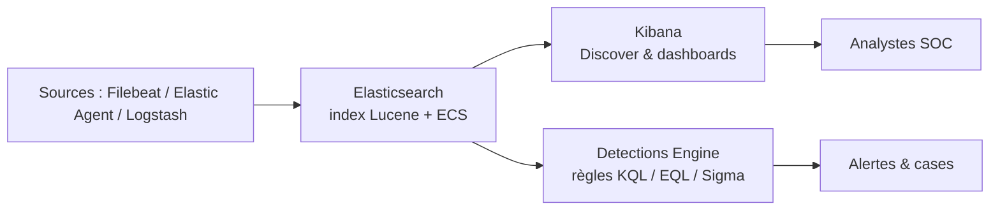

# Elastic — Défense & SIEM

> [!info] **En 1 phrase**
> Elastic Stack (ELK) — **Elasticsearch, Logstash, Kibana, Filebeat** — est la plateforme
> **open source** d'analyse de logs qui se pilote en **Detections Engine** (règles SIEM) depuis
> Kibana, avec Elastic Agent en collecteur.

---

## Overview

| Champ | Valeur |
|---|---|
| Nom complet | Elastic Stack (anciennement ELK Stack : Elasticsearch, Logstash, Kibana + Beats) |
| Description | Plateforme de recherche, indexation et analyse de logs avec détection SIEM (Elastic Security) |
| Catégorie | IDS / SIEM / EDR |
| Sous-catégorie | SIEM / Log management / Endpoint Detection & Response |
| Fonction principale | Collecter, normaliser (ECS), indexer, corréler et alerter sur des événements de sécurité |
| Type d'outil | Suite de services serveur + agents (framework) |
| Licence | Elastic License 2.0 (source-available) ; certaines parties sous AGPLv3 / Apache 2.0 |
| Open source / propriétaire | Source-available (free tier généreux), fork libre OpenSearch depuis 2021 |
| Langage(s) | Java (Elasticsearch), Go (Beats), Ruby (Logstash), TypeScript (Kibana) |
| Développeur / organisation | Elastic NV |
| Projet officiel | Elastic Stack (Elasticsearch Platform) |
| Dépôt officiel | https://github.com/elastic/elasticsearch |
| Documentation officielle | https://www.elastic.co/guide/index.html |
| Date de création | 2010 (Elasticsearch), stack complet 2011 |
| État du projet | actif (version 9.5.1 publiée le 2026-08-11) |
| Dernière version connue | Elastic Stack 9.5.1 (Elasticsearch 9.5.1, Kibana 9.5.1) |
| Systèmes compatibles | Linux, Windows, macOS, conteneurs, cloud managé (Elastic Cloud) |

> [!note] Pour vérifier / compléter
> La branche 8.19 reste supportée (8.19.20, 2026-08-11) en parallèle de la branche 9.x. Le paquet Debian `/packages/9.x/apt` est désormais utilisé pour la série 9.

---

## Concept

Le **Elastic Stack** centralise les logs : **Filebeat** (ou **Elastic Agent**) collecte et pousse, **Logstash** transforme et enrichit, **Elasticsearch** indexe et stocke (full-text Lucene), **Kibana** visualise (Discover, dashboards, **Detections Engine**). La Detections Engine (module Elastic Security, ex-SIEM) exécute des **règles de corrélation** (KQL, EQL, ESQL, règles importées au format Sigma) sur les événements indexés pour générer des **alertes** et des **cases d'investigation**. Alternative self-hosted à Splunk, la pile intègre la normalisation **ECS** (Event Common Schema), la gestion à distance des collecteurs via **Fleet** et la détection d'endpoints via l'intégration **EDR** (Elastic Defend).

Il se place dans la phase **défense / SOC** d'un engagement ou d'une infrastructure : il agrège les logs d'authentification (Windows 4624/4625, SSH), les événements de processus (Sysmon), les logs réseau (Suricata, Zeek) et les alertes EDR dans un flux unique. Les analystes construisent des règles de détection taggées MITRE ATT&CK, des dashboards de surveillance et des cas d'investigation sans dépendre d'un fournisseur propriétaire.

La valeur du stack vient de sa **normalisation ECS** : chaque événement, quelle que soit sa source, expose les mêmes champs (`event.category`, `process.executable`, `user.name`, `source.ip`...). Une règle de détection écrite pour un logon Windows fonctionne telle quelle sur un logon SSH, et les dashboards restent valides quand la source de données change. C'est ce qui rend la Detections Engine exploitable à grande échelle par une équipe réduite.



---

## Concepts fondamentaux

| Concept | Explication |
|---|---|
| Elasticsearch | Moteur de recherche/indexation distribuée basé sur Apache Lucene, exposé en REST sur le port 9200 |
| Index | Unité logique de stockage (analogue à une « base ») : `filebeat-*`, `logs-windows.security-*`, `metrics-*` |
| Shard | Partition physique d'un index (1 shard ≈ 30-50 Go), répliquée pour la haute disponibilité |
| Document | Unité JSON indexée, plat (pas de schéma imposé) mais normalisé par ECS |
| ECS | Event Common Schema : nomenclature de champs partagée (`event.action`, `process.name`, `user.name`) |
| Kibana | UI web (port 5601) : Discover, dashboards, Security, Fleet, management |
| Logstash | Pipeline de traitement (inputs → filters → outputs) pour transform/e-enrichir (grok, geoip) |
| Beats | Agents légers mono-usage : Filebeat (logs), Metricbeat (métriques), Winlogbeat (Windows EventLog), Auditbeat |
| Elastic Agent | Collecteur unifié (remplace les Beats à terme), piloté par Fleet depuis Kibana |
| Detections Engine | Moteur de règles SIEM : recherche planifiée, corrélation, suppression par exception, cases |
| EQL / KQL / ESQL | Langages de requête : EQL (événements séquencés), KQL (recherche Kibana), ESQL (SQL-like récent) |
| ILM | Index Lifecycle Management : politiques hot/warm/cold/delete pour la rétention |
| Elastic Defend | Intégration EDR : collecte des processus, réseau, registre et protection préventive sur les endpoints |

---

## Installation

### Debian / Ubuntu / Kali Linux

```bash
curl -fsSL https://artifacts.elastic.co/GPG-KEY-elasticsearch | sudo gpg --dearmor -o /usr/share/keyrings/elastic-keyring.gpg
echo "deb [signed-by=/usr/share/keyrings/elastic-keyring.gpg] https://artifacts.elastic.co/packages/9.x/apt stable main" | sudo tee /etc/apt/sources.list.d/elastic-9.x.list
sudo apt update && sudo apt install -y elasticsearch kibana
```

### Docker

```bash
# Lancer un Elasticsearch de lab en réseau local avec sécurité auto-générée
docker network create elastic
docker run --name es01 --net elastic -p 9200:9200 -m 4GB -e "discovery.type=single-node" \
  -e "xpack.security.enabled=true" -e "ELASTIC_PASSWORD=changeme" docker.elastic.co/elasticsearch/elasticsearch:9.5.1
docker run --name kib01 --net elastic -p 5601:5601 -e "ELASTICSEARCH_HOSTS=http://es01:9200" \
  docker.elastic.co/kibana/kibana:9.5.1
```

### Windows

```powershell
# Installeur officiel MSI, puis services Windows Elasticsearch / Kibana
# https://www.elastic.co/downloads/elasticsearch
```

### Agent (collecteur) sur Linux / Windows

```bash
# Enrôlement via Fleet : le serveur Fleet (dans Kibana) génère la commande d'installation
curl -fsSL https://artifacts.elastic.co/downloads/beats/elastic-agent/elastic-agent-9.5.1-linux-x86_64.tar.gz -o agent.tar.gz
# Puis : sudo ./elastic-agent install --url=https://fleet-server.example.com:8220 --enrollment-token=<TOKEN>
```

> [!warning] Prérequis & problèmes potentiels
> - Elasticsearch consomme ~50 % de la RAM disponible dans son heap Java par défaut (`ES_JAVA_OPTS=-Xms4g -Xmx4g` en lab).
> - `vm.max_map_count` doit être ≥ 262144 sous Linux (`sudo sysctl -w vm.max_map_count=262144`).
> - La sécurité (TLS + mots de passe) est activée par défaut depuis la 8.x : noter le mot de passe `elastic` et le fingerprint HTTP CA générés à l'installation.

---

## Configuration

| Paramètre | Rôle | Valeur possible | Impact | Exemple |
|---|---|---|---|---|
| `network.host` | Interface d'écoute d'Elasticsearch | `127.0.0.1`, `0.0.0.0` | Exposition du port 9200 à ne jamais mettre sur Internet | `network.host: 0.0.0.0` |
| `discovery.type` | Mode nœud unique (lab) | `single-node` | Évite le bootstrap multi-nœuds | `-e discovery.type=single-node` |
| `xpack.security.enabled` | Active la sécurité TLS/API keys | `true` / `false` | Obligatoire en production | `true` |
| `ES_JAVA_OPTS` | Taille du heap | `-Xms4g -Xmx4g` | Performance recherches vs mémoire dispo | `-Xms8g -Xmx8g` |
| `server.host` | Interface d'écoute de Kibana | `localhost`, `0.0.0.0` | Accès à la console web (5601) | `server.host: 0.0.0.0` |
| `output.elasticsearch` (filebeat) | Destination des événements | `hosts`, `username`, `password` | Routage des logs collectés | `hosts: ["https://es:9200"]` |
| `setup.kibana.host` | Kibana pour le setup des dashboards | URL | Nécessaire à `filebeat setup` | `http://kibana:5601` |
| `elastic-agent.yml` / Fleet policy | Réglages de l'agent (collecte, intégrations) | YAML / UI Fleet | Centralisation des politiques | intégration `system`, `endpoint` |

> [!note] À vérifier
> Le chemin exact des fichiers de config : `/etc/elasticsearch/elasticsearch.yml`, `/etc/kibana/kibana.yml`, `/etc/filebeat/filebeat.yml`. En 9.x, Elastic Agent + Fleet est la voie recommandée au détriment des Beats standalone.

---

## Architecture interne

Composants et flux de données à l'exécution :

- **Elasticsearch** : cluster de nœuds (master, data, coordinating, ingest) ; chaque document JSON est analysé par Lucene (analyzer standard), stocké dans un shard (avec mapping de champs `text` / `keyword` / `date`) et répliqué. API REST : `_search`, `_cat/indices`, `_bulk`, `_ilm/policy`.
- **Kibana** : reverse-proxy vers Elasticsearch, modules (Discover, Dashboards, Security, Fleet, Management), API interne `/api/security/detection_rules`.
- **Logstash** : pipeline `input { } filter { } output { }` ; plugins grok/geoip/useragent, file de sortie vers Elasticsearch (bulk).
- **Beats / Elastic Agent** : bibliothèque `libbeat` (Go) ; chaque agent applique des modules (ex. `system`, `winlogbeat`), écrit dans des spoolers et pousse en TLS avec retries/backoff.
- **Detections Engine** : le plug-in Kibana « Security » planifie l'exécution des règles (`interval: 5m`), passe la requête à Elasticsearch, applique les exceptions, puis indexe les alertes dans `.alerts-security.alerts-default` et crée des cases.

Flux type : événement réseau (Suricata) → Filebeat `eve.json` → index `logs-suricata.eve-*` (ECS) → règle KQL `event.module:suricata and suricata.eve.alert.severity:1` → alerte → case d'investigation.

---

## Commandes

### Commandes principales

```bash
sudo systemctl start elasticsearch kibana
curl -k -u elastic:CHANGEME https://localhost:9200/_cat/indices?v
curl -k -u elastic:CHANGEME "https://localhost:9200/_search?q=event.category:authentication"
sudo filebeat modules enable system
sudo filebeat setup
sudo systemctl start filebeat
```

| Commande | Objectif | Résultat attendu |
|---|---|---|
| `systemctl start elasticsearch` | Démarre le moteur | API 9200 répondante |
| `curl .../_cat/indices?v` | Liste les index et leur taille | Santé `green`, volumes indexés |
| `curl .../_cluster/health` | État du cluster | `status: green` / `yellow` / `red` |
| `filebeat modules enable system` | Active la collecte auth/syslog | Nouveaux datasets configurés |
| `filebeat setup` | Crée index/ILM/dashboards | Dashboards Kibana importés |
| `elastic-agent install` | Enrôle le collecteur unifié | Agent « Healthy » dans Fleet |
| `curl .../_search?q=...` | Interroge en REST | Documents matchant la requête |
| `curl .../_ilm/policy/<name>` | Vérifie une politique ILM | Phase hot/warm/cold/delete |

### Commandes avancées

```bash
# Supprimer un index devenu volumineux (à faire avec précaution)
curl -k -u elastic:CHANGEME -X DELETE "https://localhost:9200/logstash-debug-*"
# Exporter la liste des règles de détection (API)
curl -k -u elastic:CHANGEME -X POST "https://localhost:5601/api/detection_engine/rules/_find?per_page=100"
# Forcer une exécution immédiate d'une règle
curl -k -u elastic:CHANGEME -X POST "https://localhost:5601/api/detection_engine/rules/_execute"
```

---

## Options et flags

| Option | Description | Exemple | Niveau |
|---|---|---|---|
| `event.category` | Champ ECS de catégorisation | `event.category:authentication` | Basic |
| `process.executable` | Chemin du processus | `process.executable:C:\\Windows\\system32\\cmd.exe` | Basic |
| `winlog.event_id` | ID d'événement Windows (module Winlogbeat) | `winlog.event_id:4625` | Basic |
| `kql` | Kibana Query Language pour Discover/règles | `user.name:"svc_backup" and event.outcome:failure` | Basic |
| `EQL sequence` | Corrélation d'événements ordonnés | `sequence with maxspan=5m [...]` | Advanced |
| `ESQL` | Langage de requête déclaratif (type SQL) | `FROM logs-* | WHERE event.category=="authentication"` | Advanced |
| `_source.excludes` | Masque des champs sensibles à l'indexation | `/_bulk` avec `_source.excludes:["password"]` | Advanced |
| `ILM rollover` | Rotation automatique des index | `policy: 30GB / 1d` | Expert |
| `alert.suppression` | Suppression des alertes par doublon | `suppress for 24h per source.ip` | Expert |
| `ECS pipeline` | Pipeline d'ingestion de normalisation | `add_fields: ecs.version` | Expert |

> [!tip] Options les plus utiles au quotidien
> `event.category`, `process.executable`, `winlog.event_id`, `source.ip` sont les champs ECS à utiliser en priorité. Prévoir `elastic-agent` + Fleet plutôt que des Beats manuels, et `_cat/indices` pour surveiller la santé du stockage.

---

## Exemples pratiques

### Beginner

```bash
# Trouver les échecs de connexion SSH dans les 24 dernières heures
curl -k -u elastic:CHANGEME -X GET "https://localhost:9200/logs-system.auth-*/_search" \
  -H "Content-Type: application/json" -d '{"query":{"match":{"message":"Failed password"}},"size":5}'
```

### Intermediate

```bash
# Règle KQL dans Discover : processus PowerShell suspects
process.executable : (*\\powershell.exe or *\\pwsh.exe)
and process.args : ("-enc*", "-e*", "*DownloadString*", "*IEX(*")
and not user.name : ("SYSTEM", "NETWORK SERVICE")
```

### Advanced

```bash
# Règle EQL : bruteforce suivi d'un succès sur la même machine et la même source
sequence with maxspan=5m
  [any where event.category == "authentication" and event.outcome == "failure"]
  [any where event.category == "authentication" and event.outcome == "success"]
```

### Expert

```text
# Règle de détection « nouveau processus lancé depuis un dossier temporaire »
# (tags MITRE ATT&CK T1059.001 PowerShell + T1204 User Execution)
- Créer la règle dans Security > Detections > New Rule (query KQL).
- Associer une action de notification (email, webhook) et un score de menace ATT&CK.
- Activer la règle, tester avec un événement de lab (PowerShell -enc), vérifier l'alerte dans Alerts.
```

---

## Workflow complet (scénario pas à pas)

1. **Installer et démarrer** Elasticsearch + Kibana, noter le mot de passe `elastic` et le **fingerprint** TLS générés à l'installation.
2. **Configurer Filebeat** : `sudo filebeat modules enable system`, renseigner `output.elasticsearch` et `setup.kibana.host` dans `/etc/filebeat/filebeat.yml`, puis `sudo filebeat setup` et `sudo systemctl start filebeat`.
3. **Explorer les données** : dans Kibana → *Discover*, index `filebeat-*`, chercher `event.module: system AND process.name: sshd AND system.auth.ssh.event: "Failed password"`.
4. **Créer une règle de détection** : *Security → Detections → New rule* (requête KQL) : `winlog.event_id: 4625 AND winlog.keywords: "Audit Failure"` pour les échecs de logon Windows.
5. **Activer l'alerte** : définir sévérité, période, **threat index** (MITRE ATT&CK), action (email / connector).
6. **Visualiser** : créer un dashboard *Login failures* (`timechart count by source.ip`) et le partager aux analystes.
   ```text
   # Requête Lens/Vega du dashboard
   timechart count by source.ip over 24h filter event.category == "authentication" and event.outcome == "failure"
   ```

---

## Scénarios avancés

### Scénario 1 : Détection de bruteforce RDP avec une règle EQL

```text
sequence with maxspan=5m
  [any where event.category == "authentication"
    and event.outcome == "failure" and winlog.event_id == 4625]
  [any where event.category == "authentication"
    and event.outcome == "success" and winlog.event_id == 4624]
# Corrèle un pic d'échecs suivi d'un succès sur la même machine et la même source.
```

### Scénario 2 : Investigation d'une alerte avec Timeline et cases

```text
1. Ouvrir la case depuis l'alerte (Security > Alerts).
2. Pousser l'événement dans Timeline, tracer le processus parent (process.parent.name).
3. Chercher les IOC (hashes, IP, domaines) dans Discover.
4. Ajouter un commentaire et définir le statut (Open / Acknowledged / Closed).
```

### Scénario 3 : Déploiement d'agents par Fleet

```text
1. Kibana > Fleet > Add agent : choisir l'integration Windows ou Linux.
2. Copier la commande d'enrôlement (curl ou powershell) et l'exécuter sur les hôtes.
3. Vérifier le statut des agents dans Fleet (Healthy / Offline).
4. Centraliser les politiques : données, logs, intégration EDR (Elastic Defend) en un seul endroit.
```

### Scénario 4 : Détection des nouveaux exécutables lancés

```text
# Règle KQL : processus récents dans les chemins d'installation classiques
process.executable : ("C:\\Users\\*\\AppData\\*", "C:\\ProgramData\\*", "C:\\temp\\*")
and event.category : "process"
and not process.executable : ("*.dll", "C:\\Windows\\*")
# Associée à un tag MITRE T1204 (User Execution) pour le scoring ATT&CK.
```

---

## Cybersecurity use cases

| Phase | Utilisation |
|---|---|
| Détection (SOC) | Detections Engine : règles KQL/EQL/Sigma, corrélation, alertes temps réel |
| Investigation | Cases, Timeline, recherche ECS dans Discover |
| Endpoint | Elastic Defend (EDR) : processus, registre, réseau, protection préventive |
| Threat hunting | Chasse KQL/ESQL sur les événements historiques, réservoir MITRE ATT&CK |
| Défense réseau | Corrélation des logs Suricata/Zeek ingérés en ECS |
| Conformité | Collecte 4624/4625, audit Windows, dashboards de preuve |

---

## MITRE ATT&CK

| Tactique | Technique / Sub-technique | ID | Raison | Détection | Mitigation |
|---|---|---|---|---|---|
| Credential Access | OS Credential Dumping (LSASS) | T1003.001 | Règles Elastic Detect sur l'accès à lsass.exe via l'agent endpoint | Règle `lsass.exe` + accessors, corrélation événements | Credential Guard, LSA Protection |
| Execution | Command and Scripting Interpreter: PowerShell | T1059.001 | `powershell -enc`, DownloadString détectables en KQL | Script Block Logging, AMSI, règle `powershell` | Restreindre PowerShell, AMSI |
| Persistence | Boot or Logon Autostart | T1547 | Run keys, Startup folders surveillés par FIM/EDR | Règle `registry` Run key + alertes | Restreindre les clés Run |
| Exfiltration | Exfiltration Over Web Service | T1567 | Trafic sortant anormal vers domaines d'upload | Corrélation `source.ip`/`destination.domain` | Egress filtering, proxy |
| Discovery | File and Directory Discovery | T1083 | Énumération de fichiers via processus (cmd, powershell) | Règle `process` sur `dir`/`Get-ChildItem` | Audits, durcissement |

> [!note] Ne renseigner que si l'association est réellement pertinente.
> Elastic Security embarque la matrice ATT&CK et des centaines de règles pré-packagées taggées MITRE : les activer par défaut puis les adapter au contexte.

---

## Defensive Security

### Signes observables

| Indicateur | Détail |
|---|---|
| Pics d'échecs d'authentification (4625) suivis d'un succès (4624) | Corrélation EQL, verrouillage de compte, MFA obligatoire |
| Exécution de `powershell -enc` ou scripts chargés en mémoire | AMSI + script block logging, corrélation avec les Event 4104 |
| Nouveaux exécutables dans `AppData`, `ProgramData` ou `Temp` | Règle KQL sur `process.executable`, tags MITRE ATT&CK |
| Données sortantes vers IP/domaines inconnus | Détection d'exfiltration, egress filtering |
| Agents Fleet « Offline » ou absence de heartbeat | Supervision de la couverture de collecte |

### Règles de détection (Sigma / Suricata / Snort / YARA)

```yaml
# Sigma — échecs de logon répétés (bruteforce) via Winlogbeat
title: Multiple Failed Logons From Single Source
id: 7f8f8f6e-3d3e-4e3d-9d1c-0a0a0a0a0a0a
status: experimental
logsource:
    product: windows
    service: security
detection:
    selection:
        EventID: 4625
        LogonType: [2, 3, 10]
    condition: selection
    timeframe: 5m
falsepositives:
    - Monitoring software and services
level: medium
```

```bash
# Suricata — complément réseau au SIEM Elastic
alert tcp $EXTERNAL_NET any -> $HOME_NET 3389 (msg:"ET POLICY Possible RDP bruteforce"; \
  flow:established,to_server; content:"|03 00 00 13 0e e0 00 00 00 00 00|"; \
  threshold:type both, track by_src, count 50, seconds 60; sid:1000001; rev:1;)
```

---

## Automatisation

```bash
# Bash — vérification de santé du cluster en boucle
for i in 1 2 3 4 5; do
  curl -sk -u elastic:CHANGEME https://localhost:9200/_cluster/health \
    | jq -r '.status'
  sleep 10
done
```

```python
# Python — API officielle elasticsearch-py : recherche + agrégation
from elasticsearch import Elasticsearch

es = Elasticsearch("https://localhost:9200", basic_auth=("elastic", "CHANGEME"), verify_certs=False)
resp = es.search(index="logs-*", size=0, query={"match": {"event.category": "authentication"}},
                 aggs={"by_source": {"terms": {"field": "source.ip", "size": 10}}})
for bucket in resp["aggregations"]["by_source"]["buckets"]:
    print(bucket["key"], bucket["doc_count"])
```

```python
# Python — créer une règle de détection via l'API Kibana (prototype)
import requests, json

payload = {
    "rule_id": "rule_failed_logon_lab",
    "name": "Failed Logons (Lab)",
    "query": "winlog.event_id: 4625",
    "interval": "5m",
    "severity": "medium",
    "enabled": True,
    "type": "query"
}
r = requests.post("https://localhost:5601/api/detection_engine/rules", json=payload,
                  auth=("elastic", "CHANGEME"), verify=False)
print(r.status_code, r.json().get("name"))
```

---

## Output et parsing

Elasticsearch renvoie du **JSON** sur toutes ses API (`_search`, `_bulk`, `_cat`). Les logs Filebeat sont des documents JSON indexés ; le fichier `eve.json` de Suricata est ingéré tel quel et normalisé en ECS.

```bash
# Parser l'API de recherche avec jq
curl -sk -u elastic:CHANGEME "https://localhost:9200/logs-*/_search?size=5" \
  | jq '.hits.hits[] | {ts: ._source."@timestamp", user: ._source.user.name, event: ._source.event.action}'
```

```python
# Python — récupérer les alertes de la Detections Engine
import requests, json

alerts = requests.get(
    "https://localhost:5601/api/detection_engine/signals/search?index=.alerts-security.alerts-default",
    auth=("elastic", "CHANGEME"), verify=False,
    json={"query": {"range": {"@timestamp": {"gte": "now-24h"}}}}).json()
for hit in alerts.get("hits", {}).get("hits", []):
    print(hit["_source"]["kibana"]["alert"]["rule"]["name"], hit["_source"]["@timestamp"])
```

---

## Intégrations

```text
Suricata / Zeek → Filebeat → Elasticsearch → Detections Engine → Cases
Wazuh → (webhook/connector) → Kibana Alerts
Velociraptor (collecte) → téléversement → analyse croisée dans Discover
```

- [[Tools| Outils]]
- [[Outil - Suricata]] — logs `eve.json` ingérés par Filebeat, corrélation SIEM
- [[Outil - Zeek]] — journaux `*.log` ingérés (module Zeek de Filebeat)
- [[Outil - Wazuh]] — alertes envoyées vers Elastic via connector ou API
- [[Outil - osquery]] — résultats de requêtes alimentant les index `logs-osquery-*`
- [[Outil - Graylog]] — alternative à Elasticsearch pour l'indexation
- [[Outil - Splunk]] — SIEM concurrent, migration possible des règles Sigma
- [[Outil - YARA]] — scans de fichiers complétés par Elastic Defend
- [[Outil - Velociraptor]] — investigations DFIR approfondies depuis une alerte
- [[Outil - Sigma]] — règles converties pour le backend Elasticsearch (`sigma convert -t elasticsearch -p ecs_windows`)

---

## Alternatives

| Outil | Avantages | Inconvénients | Cas d'usage |
|---|---|---|---|
| Splunk | Richesse SPL, écosystème apps, support commercial | Propriétaire, coût par volume | Grands SOC entreprise |
| Graylog | Léger, gratuit, pipeline rules, UI simple | Moins de fonctions SIEM/EDR | Log management PME |
| Wazuh | XDR complet avec agents, FIM, vulnérabilités | Dashboard moins riche que Kibana | SOC open source consolidé |
| OpenSearch | Fork Apache 2.0 d'Elasticsearch | Sans la Detections Engine Elastic | Conformité Apache, forking |
| QRadar | Corrélation native, intégrations IBM | Coût, complexité | Entreprises IBM |
| Loki (Grafana) | Léger, indexation labels, intégré Grafana | Recherche pleine texte limitée | Logs légers + Prometheus |

> **Quand utiliser Wazuh plutôt que Elastic ?** Si le besoin est un SOC XDR « tout-en-un » avec agents FIM/EDR intégrés sans assemblage. Elastic reste plus souple et plus puissant sur la recherche et les règles de détection custom.

---

## Performance

- 1 shard primaire conseillé par 30-50 Go de données pour un volume raisonnable de requêtes.
- Heap Java : ~50 % de la RAM du serveur par défaut, à borner avec `ES_JAVA_OPTS` (4-8 Go en lab, 50 % max en prod).
- Elasticsearch parallélise les recherches sur les shards et les répliques ; le `_cluster/health` doit rester `green`.
- Filebeat est léger (~10-30 Mo RAM par module) ; Elastic Agent embarque plus de fonctions (défense, event collection).
- Un lab fonctionnel : 8 Go RAM + 2 vCPU minimum pour Elasticsearch + Kibana ; en dessous, il « semble vide ».

> [!note] À vérifier
> Les ordres de grandeur d'indexation varient fortement selon le matériel : ~10-30 k documents/s par nœud en bulk sur du matériel récent (chiffres non contractuels).

---

## Troubleshooting

### Common problems

#### Problème : l'index passe en `red` ou Kibana est lent

- **Cause** : stockage saturé, shards mal répartis, heap trop petit.
- **Solution** : libérer de l'espace, supprimer/fusionner des index (`_forcemerge`), augmenter `-Xmx`.
- **Vérification** : `curl .../_cat/allocation?v` et `.../_cluster/health`.

#### Problème : Filebeat envoie mais rien n'apparaît dans Discover

- **Cause** : index pattern non créé ou mauvais `output.elasticsearch`.
- **Solution** : relancer `filebeat setup`, vérifier `sudo filebeat test output` et le pattern `filebeat-*`.
- **Vérification** : `sudo tail -f /var/log/filebeat/filebeat.log`.

#### Problème : règle de détection « muette »

- **Cause** : champ absent ou non normalisé ECS dans l'événement.
- **Solution** : vérifier dans Discover que `event.category`, `process.executable` existent ; utiliser la **Preview** de la règle.
- **Vérification** : générer un événement de test correspondant à la signature.

#### Problème : Elasticsearch refuse de démarrer (mémoire mmap)

- **Cause** : `vm.max_map_count` trop bas sous Linux.
- **Solution** : `sudo sysctl -w vm.max_map_count=262144` (permanent dans `/etc/sysctl.conf`).
- **Vérification** : `sysctl vm.max_map_count`.

---

## Sécurité de l'outil

- **TLS partout** : activer `xpack.security.enabled` et certifier les transports (9200, 5601, Fleet 8220) — jamais de connexion HTTP nu depuis la 8.x.
- **Moindre privilège** : rôles Kibana (analyste, admin, ingest), API keys dédiées par service au lieu du compte `elastic`.
- **Secrets** : mots de passe et tokens en secret manager, rotation régulière des clés d'enrôlement Fleet.
- **Exposition réseau** : ne jamais exposer le port 9200 sur Internet ; Kibana derrière un reverse-proxy SSO.
- **Risque offensif** : un adversaire avec un accès Kibana peut lire les logs (secrets exposés), modifier ou supprimer des règles ; auditer `index=_internal` équivalent (`kibana_task_manager`, `.kibana_*`).

---

## Limitations

- Elasticsearch est **source-available** (Elastic License 2.0) : certaines fonctions avancées (SIEM, ML) sont payantes — pas une licence OSI.
- La Detections Engine ne remplace pas un EDR : la couverture endpoint dépend de l'intégration Elastic Defend.
- La corrélation multi-événements (EQL) est limitée à des séquences courtes ; les corrélations complexes demandent Logstash ou des règles dédiées.
- La normalisation ECS doit être maintenue : un champ non mappé rend les règles muettes.
- Coût ressources non négligeable : le stack complet (ES + Kibana + agents) est lourd pour un petit SOC.
- Une mauvaise configuration des index (pas d'ILM) sature le disque et fait passer le cluster en `red`.

---

## Cheatsheet

```bash
# Santé du cluster et liste des index
curl -k -u elastic:CHANGEME https://localhost:9200/_cluster/health
curl -k -u elastic:CHANGEME https://localhost:9200/_cat/indices?v

# Recherche simple
curl -k -u elastic:CHANGEME "https://localhost:9200/logs-*/_search?q=event.category:authentication&size=5"

# Setup Filebeat + démarrage
sudo filebeat modules enable system
sudo filebeat setup && sudo systemctl start filebeat

# Vérifier la connectivité Filebeat → ES
sudo filebeat test output

# Agent unifié
sudo ./elastic-agent install --url=https://fleet.example.com:8220 --enrollment-token=TOKEN

# Dashboard d'échecs d'authentification (KQL Discover)
event.category : "authentication" and event.outcome : "failure"

# Règle EQL : bruteforce suivi de succès (Security > Detections)
sequence with maxspan=5m [any where event.outcome=="failure"] [any where event.outcome=="success"]
```

---

## Quick reference

| | |
|---|---|
| **À quoi sert-il ?** | Plateforme de log management + SIEM/EDR : collecte, indexation, corrélation, alertes |
| **Quand l'utiliser ?** | Dès qu'il faut centraliser des logs hétérogènes et détecter des patterns de compromission |
| **Commande principale** | `curl -k -u elastic:CHANGEME https://localhost:9200/_cat/indices?v` |
| **Alternative principale** | Splunk (commercial), Wazuh (XDR intégré), Graylog (léger) |
| **Concepts importants** | ECS, index/shards, ILM, Detections Engine, EQL/KQL/ESQL, Fleet |
| **Liens associés** | [[Outil - Splunk]] · [[Outil - Wazuh]] · [[Outil - Suricata]] · [[Outil - Graylog]] |

---

## Détection & Défense

| Signe | Défense |
|---|---|
| Pics d'échecs d'authentification (4625) suivis d'un succès (4624) | Règle EQL de corrélation, verrouillage de compte, MFA obligatoire |
| Exécution de `powershell -enc` ou scripts chargés en mémoire | AMSI + script block logging, corrélation avec les Event 4104 |
| Nouveaux exécutables dans `AppData`, `ProgramData` ou `Temp` | Règle KQL sur `process.executable`, tags MITRE ATT&CK |
| Données sortantes vers IP/domaines inconnus | Détection d'exfiltration, egress filtering |
| Agents Fleet hors ligne / silence des flux | Alertes de couverture, heartbeat des collecteurs |

---

## Tips & Pièges

> [!tip] **Pense « données d'abord »**
> Le succès du Detections Engine dépend des **champs normalisés ECS** : vérifie qu'un événement arrive bien avec `event.category`, `process.executable`, `user.name` avant d'écrire une règle. Une règle parfaite sur un champ vide ne détectera jamais rien.

> [!tip] **Testing des règles**
> Avant de publier une règle, créez un événement de test (ex. `Winlogbeat` sur un poste de lab) qui correspond à votre signature : la détection doit déclencher dans les 1-2 minutes. Utilisez le bouton *Preview* de la règle pour valider sur l'historique avant activation.

> [!warning] **Piège** : ELK consomme beaucoup. Par défaut Elasticsearch alloue la moitié de la RAM du serveur à son heap Java. Sans `-Xmx` ni sharding adapté, les recherches deviennent lentes et l'index tombe en `red`. Un lab = 4-8 Go dédiés, sinon Kibana semble « vide ».

> [!warning] **Piège** : ne pas confondre les branches 8.x et 9.x pour les paquets APT (`/packages/8.x/apt` vs `/packages/9.x/apt`) et les images Docker : mélanger les versions ES/Kibana provoque des incompatibilités de mapping.

---

## References

### Official

- Documentation Elasticsearch : https://www.elastic.co/guide/en/elasticsearch/reference/current/index.html
- Documentation Elastic Security (Detections Engine) : https://www.elastic.co/guide/en/security/current/index.html
- Guide Kibana : https://www.elastic.co/guide/en/kibana/current/index.html
- GitHub detection-rules : https://github.com/elastic/detection-rules
- Référence ECS : https://www.elastic.co/guide/en/ecs/current/index.html

### Security references

- MITRE ATT&CK T1059.001 — PowerShell : https://attack.mitre.org/techniques/T1059/001/
- MITRE ATT&CK T1003.001 — LSASS : https://attack.mitre.org/techniques/T1003/001/
- Elastic Security Labs (publications) : https://www.elastic.co/security-labs

### Community

- Blog Elastic (9.5) : https://www.elastic.co/blog/whats-new-elastic-9-5-0
- Docs Elastic 9.5 release notes : https://www.elastic.co/docs/release-notes
- Beta de la branch osquery + Elastic Agent : https://www.elastic.co/blog

---

**Liens :** [[Tools| Outils]] · [[Techniques/Reverse Shells| Reverse Shells]] · [[Techniques/Injection de commandes| Injection de commandes]] · [[Techniques/Privilege Escalation Windows| Privesc Windows]] · [[Outil - Splunk]] · [[Outil - Wazuh]] · [[Outil - Suricata]] · [[Outil - osquery]] · [[Outil - Sigma]]
