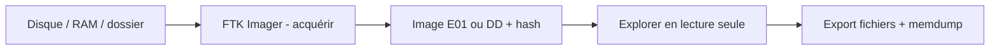

# FTK Imager — Forensics, Threat Intel & Honeypots

> [!info] **En 1 phrase**
> FTK Imager est l'outil gratuit d'AccessData (Exterro) pour créer des images forensiques de disques et capturer la mémoire vive, avec visualisation et exportation de fichiers en lecture seule.

---

## Overview

| Champ | Valeur |
|---|---|
| Nom complet | FTK Imager |
| Description | Outil d'imagerie et de visualisation forensique : acquisition E01/DD, capture mémoire, exploration en lecture seule |
| Catégorie | Forensics, Threat Intel & Honeypots |
| Sous-catégorie | Digital Forensics / Acquisition & Triage |
| Fonction principale | Créer des images forensiques de disques, capturer la RAM, monter et exporter des preuves sans écrire sur la source |
| Type d'outil | Application Windows (GUI) + CLI limitée |
| Licence | Gratuit (freeware Exterro/AccessData) |
| Open source / propriétaire | Propriétaire gratuit |
| Langage(s) de programmation | C++ (application) |
| Développeur / organisation | Exterro (ex-AccessData) |
| Projet officiel | FTK Imager |
| Dépôt officiel | Aucun (produit commercial gratuit) |
| Documentation officielle | https://accessdata.com/product-download/ftk-imager-version-4-7-0-0 |
| Date de création | 2004 (famille FTK) |
| État du projet | actif (mise à jour régulière, 4.7.x) |
| Dernière version connue | 4.7.x (à vérifier sur la page officielle) |
| Systèmes compatibles | Windows (7→11, x86/x64) ; macOS (version dédiée) ; utilisation Linux via Wine en lab |

> [!note] Pour vérifier / compléter
> La version exacte évolue régulièrement (actuellement 4.7.x) : vérifier la page de téléchargement officielle Exterro avant de documenter une chaîne de custody.

---

## Concept

FTK Imager est un outil d'imagerie et de visualisation : il crée des images forensiques (DD, E01) de disques, partitions ou répertoires, capture la mémoire vive (RAM dump) et permet d'explorer un disque ou une image sans écrire un octet sur la source. C'est l'outil standard en premier intervenant (premier respondant) : il est gratuit, Windows/macOS, et s'installe en quelques minutes sur une machine « forensic » configurée avec un write blocker.

Sa force : la simplicité. On monte une image en lecture seule (`Mount Image`), on parcourt les fichiers comme un explorateur, on extrait une pièce à conviction avec `Export Files`, ou on capture le RAM d'un poste compromis pour une analyse mémoire ultérieure (voir Volatility). Il complète Autopsy : FTK Imager pour l'acquisition, Autopsy pour l'analyse approfondie.

Dans une réponse à incident, FTK Imager se place dans la **phase de triage et d'acquisition** : on fige l'état du support dans l'ordre de volatilité (RAM → caches → disque) pour garantir l'intégrité de la preuve, puis on analyse exclusivement la copie. Les formats E01 intègrent métadonnées (numéro de cas, analyste, dates) et segments compressés, tandis que le format brut DD reste universellement exploitable par les outils d'analyse. L'outil sert autant à l'acquisition qu'au quotidien de l'analyse : `Add Evidence Item` permet de monter n'importe quelle source (disque physique, volume logique, image existante) dans la même arborescence.



---

## Concepts fondamentaux

| Concept | Explication |
|---|---|
| Acquisition physique | Copie bit à bit du disque entier (y compris l'espace non alloué) |
| Acquisition logique | Copie d'un volume/partition (rate l'espace non alloué et les fichiers supprimés) |
| E01 | Expert Witness Format : métadonnées, compression, segmentation (2 Go par segment) |
| DD (image brute) | Copie bit à bit sans métadonnées, universellement lisible |
| Write blocker | Dispositif bloquant toute écriture sur le support source pendant l'acquisition |
| Capture Memory | Dump de la RAM (`.mem`) pour analyse ultérieure avec Volatility |
| Mount Image | Montage d'une image en lecture seule (lecteur virtuel) |
| Export Files | Extraction des fichiers sélectionnés vers un dossier cible |
| Export File Hash List | Génération d'un CSV des hash MD5/SHA-1/SHA-256 |
| Chaîne de custody | Traçabilité de la preuve : qui, quand, comment, vérification des hash |
| Ordre de volatilité | RAM → pagefile/caches → disque : acquérir du plus volatil au moins volatil |
| Custom Content Image | Acquisition ciblée de fichiers/dossiers précis (pas le disque entier) |

---

## Installation

Téléchargement depuis le site officiel Exterro/AccessData (gratuit, compte requis) :

```bash
# Sous Windows, via winget (paquet communautaire) ou installeur officiel
winget install AccessData.FTKImager
# Kali / Debian : pas de paquet natif, utiliser Wine ou la VM Windows de lab
```

```bash
# Vérifier l'installation
& "C:\Program Files\Exterro\FTK Imager\FTK Imager.exe" --help
```

Alternative en ligne de commande pour l'acquisition mémoire Linux : utiliser LiME ou `fmem`, tandis que FTK Imager reste la référence sur postes Windows.

> [!warning] Prérequis & problèmes potentiels
> - L'installation se fait sur une **machine d'analyse** (jamais sur le poste compromis) ; l'acquisition se fait via write blocker.
> - Le `Capture Memory` requiert les privilèges administrateur.
> - La version Windows est la plus complète ; la version macOS est plus limitée (acquisition mémoire moins fiable).

---

## Configuration

| Paramètre / Action | Rôle | Valeur possible | Impact | Exemple |
|---|---|---|---|---|
| Format d'image | Format de l'acquisition | E01 / DD / AFF / SMART | Compatibilité, taille, métadonnées | `E01` (compressé, segmenté) |
| Taille de segment | Découpage E01 | 2 Go par défaut (ou 650 Mo/4,7 Go) | Facilité de stockage | `2048 Mo` |
| Compression | Niveau de compression E01 | `Impossible` → `Recovery` (6 niveaux) | Taille vs vitesse | `Standard` |
| Verify images after creation | Vérification des hash | activé/désactivé | Intégrité de la preuve | Toujours activé |
| N° de cas / analyste | Métadonnées E01 | texte libre | Chaîne de custody | `INC-2026-042 / analyste` |
| Mount Image | Montage en lecture seule | `Read Only` | Protection de la preuve | Toujours cocher Read Only |
| Evidence item | Source à monter | Physical/Logical drive, image, dossier | Périmètre d'analyse | Image E01 créée |

> [!note] À vérifier
> Les réglages (compression, segments, vérification) sont définis dans l'assistant `Create Disk Image` ; la syntaxe des options CLI est très limitée — privilégier l'interface graphique pour les acquisitions critiques.

---

## Architecture interne

Composants et flux à l'exécution :

- **Acquisition** : lecture bit à bit via les API Windows (ou le driver de write blocker) ; écriture de l'image au format choisi avec vérification de hash en parallèle.
- **Formats de sortie** : E01 (libEWF/EWF, segments compressés), DD (brut), AFF (Advanced Forensic Format), SMART (legacy).
- **Visualisation** : l'explorateur d'arborescence liste volumes, dossiers et fichiers (y compris supprimés via les métadonnées du filesystem) ; vue hexadécimale pour inspection.
- **Capture mémoire** : lecture de la mémoire physique (même technique que les dumps .mem), écriture en format brut ou en format image.
- **Montage** : `Mount Image` crée un lecteur virtuel en lecture seule sur l'image (E01 ou DD) pour navigation comme un lecteur classique.
- **Exports** : `Export Files` (fichiers sélectionnés), `Export File Hash List` (CSV d'empreintes), `Export Directory Listing` (liste de l'arborescence), `Export Disk Image` (conversion de format).

Flux type : support source sur write blocker → `Create Disk Image` (E01 + hash avant/après) → `Add Evidence Item` (image) → navigation → `Export Files` + `Export File Hash List` → vérification du hash final → archivage.

---

## Commandes

### Commandes principales

```bash
# Pas de CLI native : tout se pilote par l'interface graphique
# Chemin d'accès : C:\Program Files\Exterro\FTK Imager\FTK Imager.exe
ftkimager.exe --help   # options limitées à l'interface
```

| Action | Effet |
|---|---|
| `File → Create Disk Image` | Crée une image E01/DD/AFF d'un disque, volume ou dossier |
| `File → Capture Memory` | Dump de la RAM (fichier `.mem`) pour analyse Volatility |
| `File → Mount Image` | Monte une image en lecture seule (lecteur virtuel) |
| `File → Export Disk Image` | Convertit une image au format E01 ou DD |
| `File → Add Evidence Item` | Ajoute un disque physique, une image ou un répertoire à l'arborescence |
| Clic droit → `Export Files` | Extrait les fichiers sélectionnés vers un dossier cible |
| Clic droit → `Export File Hash List` | Génère un CSV des hash MD5/SHA-1/SHA-256 |
| Clic droit → `Export Directory Listing` | Liste l'arborescence en texte |
| `View → Properties` | Affiche la table de partition et les métadonnées du support |

### Commandes avancées

```bash
# Vérifier l'intégrité d'une image E01 côté Linux (toolkit ewftools)
ewfinfo -i incident.E01
ewfverify incident.E01

# Monter une image DD en lecture seule sous Linux
sudo mount -o loop,ro cle_usb.dd /mnt/analyse
```

---

## Options et flags

| Option | Description | Exemple | Niveau |
|---|---|---|---|
| Format E01 / DD | Type d'image de sortie | `E01` (compressé) / `DD` (brut) | Basic |
| `Verify images after they are created` | Hash avant/après comparé | Cocher systématiquement | Basic |
| Segmentation | Taille des segments E01 | `2048 Mo` | Intermediate |
| Compression | Niveau de compression | `Standard` / `Maximum` | Intermediate |
| `Custom Content Image` | Acquisition ciblée de fichiers/dossiers | Sélection dans l'assistant | Advanced |
| `Read Only` au montage | Protection de la source | Cocher `Read Only` | Basic |
| `Capture Memory` | Dump RAM (options : format brut/image) | `.mem` brut | Intermediate |
| `Export File Hash List` | CSV MD5/SHA-1/SHA-256 | Fichier CSV | Basic |
| `Export Disk Image` | Conversion E01 → DD (et inversement) | Format cible | Advanced |
| `Properties` | Détails du support (table de partition) | Lecture seule | Basic |

> [!tip] Options les plus utiles au quotidien
> `Create Disk Image` (E01 + vérification) pour l'acquisition, `Capture Memory` avant extinction, `Mount Image` en lecture seule pour l'analyse, `Export Files` + `Export File Hash List` pour documenter la preuve.

---

## Exemples pratiques

### Beginner

```text
# Objectif : créer une image simple d'une clé USB
1. Brancher la clé avec un write blocker
2. File → Create Disk Image → Physical Drive → sélectionner la clé
3. Destination : format E01, vérification activée, remplir n° de cas
4. Fin d'acquisition : noter le hash affiché dans le rapport
```

### Intermediate

```bash
# Objectif : vérifier l'image créée après copie
# PowerShell — comparer le hash de l'image avec celui noté en fin d'acquisition
Get-FileHash incident.E01 -Algorithm SHA256
# Linux — montage en lecture seule d'une image DD
sudo mount -o loop,ro cle_usb.dd /mnt/analyse
```

### Advanced

```text
# Objectif : acquisition ciblée (Custom Content Image)
1. File → Create Disk Image → Custom Content Image
2. Sélectionner C:\Users\admin\Desktop et C:\Users\admin\Documents
3. Format E01 + vérification → acquisition partielle rapide
```

### Expert

```bash
# Objectif : chaîne de custody complète après capture mémoire
# 1. Capture Memory → C:\Triage\memory.mem (poste encore allumé)
# 2. Analyser le dump avec Volatility 3
python vol.py -f memory.mem windows.pslist
python vol.py -f memory.mem windows.cmdline
# 3. Vérifier l'intégrité du dump
Get-FileHash C:\Triage\memory.mem -Algorithm SHA256
```

---

## Workflow complet (scénario pas à pas)

1. **Préparer la machine forensique** — brancher le disque suspect via un write blocker USB/SATA, lancer FTK Imager en administrateur.
   ```bash
   # Vérifier que le disque est détecté en lecture seule (Write Blocker ON)
   # Lancer : C:\Program Files\Exterro\FTK Imager\FTK Imager.exe
   ```
2. **Créer l'image du disque** — `File → Create Disk Image` → `Physical Drive` (ou `Logical Drive` pour une seule partition) → sélectionner le disque.
3. **Configurer la destination** — `Add Image Destination` → format `E01` (compressé + segmenté), saisir le n° de cas et l'analyste, puis cocher `Verify images after they are created` : le hash MD5/SHA-256 est calculé avant et après acquisition et comparé.
4. **Capturer la mémoire avant l'extinction** — `File → Capture Memory` sur le poste compromis si accessible.
   ```bash
   # Le dump .mem s'analyse ensuite avec Volatility :
   vol.py -f physicalmemory.mem imageinfo
   ```
5. **Analyser l'image sans l'altérer** — `File → Add Evidence Item` → ouvrir l'image créée, naviguer dans l'arborescence, puis `Export Files` sur les pièces à conviction.
6. **Clôturer la chaîne de custody** — comparer le hash affiché en fin d'acquisition avec celui recalculé après copie du fichier image (`Get-FileHash` ou `sha256sum`).

---

## Scénarios avancés

### Scénario 1 : acquisition logique d'une clé USB suspecte

Acquisition rapide d'un support amovible de petite capacité.

```bash
# 1. Brancher la clé avec un write blocker
# 2. File → Create Disk Image → Logical Drive → lettre de la clé
# 3. Choisir le format DD (brut) : pas de compression, compatibilité maximale
# 4. Cocher la vérification de hash, conserver .dd + hash dans le dossier de preuve
```

Le format brut DD est ici préférable : il s'ouvre directement dans Autopsy, se monte avec `mount -o loop,ro` sous Linux et ne dépend d'aucun format propriétaire.

```bash
# Vérifier l'intégrité de l'acquisition côté Linux (la clé est montée en RO)
sha256sum cle_usb.dd
# Monter l'image en lecture seule pour l'analyse
sudo mount -o loop,ro cle_usb.dd /mnt/analyse
```

### Scénario 2 : triage d'un poste Windows compromis (RAM + artefacts)

Prélever la mémoire puis les éléments volatils d'un poste encore allumé.

```bash
# 1. File → Capture Memory → destination C:\Triage\memory.mem
# 2. File → Add Evidence Item → Physical Drive → C:  (lecture seule)
# 3. Naviguer vers C:\Users\<user>\AppData\Roaming\Microsoft\Windows\Recent
# 4. Clic droit → Export Files → sauvegarder Recent + le dump mémoire
```

Le dump contient fréquemment les clés de chiffrement (BitLocker), des identifiants en clair et l'état des processus ; les artefacts utilisateur appuient l'investigation avant la mise hors ligne du poste. Complétez la collecte par les fichiers de pagination (pagefile.sys, hiberfil.sys) si l'entreprise l'autorise : ils contiennent des restes de données volatiles non capturées par le dump RAM.

### Scénario 3 : conversion de format et archivage (E01 → DD)

```text
# 1. File → Add Evidence Item → Image File → incident.E01
# 2. Clic droit sur la source → Export Disk Image
# 3. Choisir DD (brut) pour compatibilité universelle, cocher la vérification
# 4. Archiver E01 (compressé) pour la conservation, DD pour l'analyse
```

### Scénario 4 : acquisition d'une partition chiffrée (BitLocker) avec la clé en mémoire

```text
# 1. Capture Memory d'abord (les clés BitLocker sont souvent en clair dans la RAM)
# 2. Analyser le dump avec Volatility (module BitLocker/keyscan)
# 3. Déverrouiller la partition via la clé extraite, puis acquérir en E01
# 4. Si la clé n'est pas récupérable, acquérir la partition chiffrée telle quelle
#    et noter la limite dans le rapport de custody
```

---

## Cybersecurity use cases

| Phase | Utilisation |
|---|---|
| Acquisition | Création d'images E01/DD de disques et partitions (preuve complète) |
| Triage IR | Capture de la RAM et des artefacts volatils avant extinction |
| Analyse légère | Navigation et export de fichiers depuis une image (sans Autopsy) |
| Écart de sécurité | Acquisition ciblée (Custom Content Image) pour un périmètre précis |
| Chaîne de custody | Hash avant/après, métadonnées E01, rapports d'acquisition |
| Conversion | Export Disk Image entre formats (E01 ↔ DD) pour interopérabilité |

---

## MITRE ATT&CK

| Tactique | Technique / Sub-technique | ID | Raison | Détection | Mitigation |
|---|---|---|---|---|---|
| Collection | Data from Local System | T1005 | L'acquisition collecte l'intégralité des données locales | Supervision des branchements | Write blocker + station isolée |
| Collection | Data Staged | T1074 | Les preuves sont agrégées sur la machine d'analyse | Contrôle des partages | Chiffrement, ACL |
| Credential Access | OS Credential Dumping | T1003 | Le dump RAM contient hashs et clés (BitLocker, LSASS) | Analyse Volatility | Credential Guard, EDR |
| Discovery | File and Directory Discovery | T1083 | Navigation/export des fichiers lors de l'analyse | Journalisation des accès | Least privilege |
| Defense Evasion | Indicator Removal on Host | T1070 | Un attaquant peut utiliser l'imagerie pour altérer les traces | Surveillance des outils d'imagerie | Allow-list, Sysmon |

> [!note] Ne renseigner que si l'association est réellement pertinente.
> FTK Imager est un outil **défensif** (acquisition) mais peut être détourné pour la collecte/altération : surveiller son exécution hors des postes d'analyse autorisés.

---

## Defensive Security

### Signes observables

| Indicateur | Détail |
|---|---|
| Accès à un disque en lecture seule depuis une station d'analyse | Journaliser les branchements de supports externes (gestion des périphériques, contrôle par la DSI) |
| Présence de `FTK Imager.exe` sur un poste non forensique | Liste blanche d'applications, surveillance des processus (Sysmon Event ID 1) |
| Dump mémoire volumineux transféré sur le réseau | DLP, contrôle des exports, chiffrement des partages d'analyse |
| Ouverture accidentelle d'un fichier depuis l'original (écriture sur la preuve) | Règle d'or : travailler uniquement sur la copie montée en lecture seule |
| Image non vérifiée (hashs absents du rapport) | Imposer la vérification systématique des images et la conservation des rapports de hash |

### Règles de détection (Sigma / Suricata / Snort / YARA)

```yaml
# Sigma — exécution de FTK Imager sur un poste non autorisé
title: Suspicious FTK Imager Execution Outside Forensic Station
id: c1d2e3f4-5a6b-4c7d-8e9f-0a1b2c3d4e5f
status: experimental
logsource:
    category: process_creation
    product: windows
detection:
    selection:
        Image|endswith:
            - '\FTK Imager.exe'
            - '\FTK Imager CLI.exe'
    filter_known:
        ParentCommandLine|contains: 'forensic'
    condition: selection and not filter_known
falsepositives:
    - Installation légitime de l'équipe forensique
level: medium
```

```text
# Règle YARA — signature d'un outil d'imagerie renommé (collecte par un attaquant)
rule Suspicious_Imaging_Tool {
    strings:
        $mz = { 4D 5A }
        $e01 = "EWF" ascii
        $ftk = "FTK Imager" ascii wide
    condition:
        $mz at 0 and ($e01 or $ftk)
}
```

---

## Automatisation

```bash
# PowerShell — vérification de hash après acquisition (chaîne de custody)
Get-FileHash incident.E01 -Algorithm SHA256 | Out-File -Append custody.log

# PowerShell — répertoire de triage standardisé
$triage = "C:\Triage\INC-2026-042"
New-Item -ItemType Directory -Path "$triage\Memory","$triage\Disk","$triage\Artefacts" -Force
```

```python
# Python — parser la liste de hash exportée (Export File Hash List)
import csv

with open("hash_list.csv") as f:
    for row in csv.DictReader(f):
        print(row.get("SHA256"), row.get("File Name"))
```

---

## Output et parsing

Les sorties principales sont les **fichiers image** (E01 segmentés `*.E01`, `*.E02...`, DD `.dd`) et les **exports** (fichiers extraits, listes de hash CSV, listes d'arborescence).

```bash
# Vérifier une image E01 avec les outils ewf
ewfinfo -i incident.E01        # métadonnées et segments
ewfverify incident.E01         # vérifie l'intégrité

# Comparer un hash depuis la liste exportée
sha256sum cle_usb.dd           # doit correspondre à la ligne .dd du CSV
```

```python
# Python — reconstruire la liste des hash exportés depuis un CSV
import csv

with open("hash_list.csv") as f:
    rows = list(csv.DictReader(f))
print(f"{len(rows)} fichiers documentés")
for r in rows[:5]:
    print(r.get("MD5"), r.get("File Name"))
```

---

## Intégrations

```text
FTK Imager (acquisition) → E01/DD → Autopsy (analyse approfondie)
FTK Imager (Capture Memory) → .mem → Volatility (analyse mémoire)
FTK Imager (Export File Hash List) → CSV → hashdb Autopsy / MISP / VirusTotal
FTK Imager (image) → Arsenal Image Mounter / mount -o loop,ro (exploitation)
```

- [[Tools| Outils]]
- [[Outils/Outil - Autopsy| Autopsy]] — analyse des images acquises avec FTK Imager
- [[Outils/Outil - Volatility| Volatility]] — analyse des dumps mémoire
- [[Outil - Velociraptor]] — collecte de preuves à distance, complément local
- [[Outil - MISP]] — corrélation des hash exportés avec les indicateurs
- [[Outil - YARA]] — scan des fichiers extraits

---

## Alternatives

| Outil | Avantages | Inconvénients | Cas d'usage |
|---|---|---|---|
| FTK Imager | Gratuit, simple, standard IR | Windows surtout, pas d'analyse poussée | Acquisition et triage |
| dd / dcfldd | Universel, scriptable, Linux | Pas de GUI, pas de métadonnées | Acquisition Linux |
| Guymager | GUI Linux, libre | Linux seulement | Acquisition sous Linux |
| LiME | Acquisition mémoire Linux (kernel) | Nécessite compilation | RAM Linux |
| WinPmem / MemProcFS | Acquisition mémoire Windows/analyse | Windows, moindre support | RAM Windows |
| EnCase Imager | Standard légal | Coût, lourd | Entreprise / juridique |

> **Quand utiliser FTK Imager plutôt qu'un autre ?** Pour une **acquisition standard de premier intervenant** sous Windows, gratuit et fiable. Pour des parcs Linux massifs, `dd`/Guymager ; pour la RAM Linux, LiME.

---

## Performance

- **E01 compressé** : plus lent en écriture mais segments plus petits (2 Go) ; la vérification des hash double le temps d'acquisition.
- **DD brut** : acquisition plus rapide, fichiers très volumineux (taille du disque).
- **Capture mémoire** : dépend de la RAM installée (plusieurs Go en quelques minutes) ; écriture sur disque rapide recommandée.
- **Exploration** : navigation fluide sur E01/DD ; le montage d'images multi-segments peut être plus lent.
- **Machines lentes / USB 2.0** : l'acquisition d'un disque de 1 To peut prendre plusieurs heures — prévoir le temps et le stockage de destination avant de lancer.

> [!note] À vérifier
> Les temps exacts dépendent du support (USB2/USB3/SATA), de la compression et de la vérification : faire un test sur un support de référence pour calibrer les délais d'un incident réel.

---

## Troubleshooting

### Common problems

#### Problème : `Mount Image` échoue sur l'image

- **Cause** : format exotique, volume chiffré, ou segments incomplets.
- **Solution** : vérifier l'intégrité (ewfverify), utiliser `Export Files` à la place du montage.
- **Vérification** : `ewfinfo -i incident.E01`.

#### Problème : le disque source n'apparaît pas

- **Cause** : write blocker non détecté, driver manquant, privilèges insuffisants.
- **Solution** : relancer en administrateur, vérifier le write blocker, mettre à jour les drivers.
- **Vérification** : `File → Add Evidence Item → Physical Drive` doit lister le disque.

#### Problème : le hash en fin d'acquisition diffère du hash attendu

- **Cause** : écriture sur la source pendant l'acquisition, ou lecture/écriture non bloquées.
- **Solution** : refaire l'acquisition avec write blocker vérifié ; documenter l'écart.
- **Vérification** : comparer `ewfverify` avec la valeur attendue.

#### Problème : l'analyse mémoire échoue dans Volatility

- **Cause** : dump incomplet ou architecture mal identifiée (x86/x64).
- **Solution** : re-capturer la mémoire proprement, vérifier l'architecture du poste.
- **Vérification** : `vol.py -f memory.mem windows.info`.

#### Problème : l'acquisition d'un gros disque s'éternise

- **Cause** : compression maximum, vérification activée, support lent.
- **Solution** : réduire la compression, prévoir le temps, vérifier l'espace disque de destination.
- **Vérification** : surveiller l'avancement affiché dans l'UI.

---

## Sécurité de l'outil

- **Write blocker obligatoire** : l'acquisition physique se fait uniquement via un bloqueur d'écriture ; ne jamais laisser FTK Imager accéder au disque source sans lui.
- **Analyse sur copie** : ne travailler que sur l'image (E01/DD) montée en lecture seule, jamais sur l'original.
- **Données sensibles** : les images contiennent tout le contenu du disque (mots de passe, mails, données perso) : chiffrer le stockage, restreindre les accès.
- **Poste d'analyse isolé** : utiliser une machine dédiée hors du réseau de production ; éviter d'exécuter des fichiers suspects extraits.
- **Outils détournés** : un attaquant peut utiliser FTK Imager (ou équivalents) pour collecter des données : surveiller son exécution (Sysmon) et autoriser l'installation.
- **Chaîne de custody** : documenter analyste, date, numéro de série, hash avant/après — sans cela, la preuve est fragile devant un tribunal.

---

## Limitations

- **Windows avant tout** : la version Windows est la plus complète ; macOS plus limité, pas de support natif Linux.
- **Pas d'analyse poussée** : FTK Imager est un outil d'acquisition/visualisation, pas un analyseur (registre, timeline, carving avancé) — pour cela, Autopsy.
- **Écriture limitée** : pas de montage en écriture (voulu) ; l'édition de preuves n'est pas un cas d'usage.
- **CLI quasi inexistante** : l'automatisation passe par l'UI ou des outils annexes.
- **Chiffrement** : les volumes chiffrés doivent être déverrouillés avant acquisition (clés récupérables via la RAM).
- **Dépendance au driver/matériel** : la qualité de l'acquisition dépend du write blocker et de l'interface de branchement.

---

## Cheatsheet

```text
# Acquisition
File → Create Disk Image → Physical/Logical Drive → E01 + vérification

# Capture mémoire
File → Capture Memory → C:\Triage\memory.mem

# Montage lecture seule
File → Mount Image → cocher Read Only

# Export
Clic droit → Export Files / Export File Hash List / Export Directory Listing

# Conversion
Clic droit → Export Disk Image → DD ou E01
```

```bash
# Vérifications (Linux/Windows)
ewfinfo -i incident.E01          # métadonnées E01
ewfverify incident.E01           # intégrité
Get-FileHash incident.E01 -Algorithm SHA256
sudo mount -o loop,ro cle_usb.dd /mnt/analyse
```

---

## Quick reference

| | |
|---|---|
| **À quoi sert-il ?** | Acquisition d'images forensiques (E01/DD), capture mémoire, visualisation en lecture seule |
| **Quand l'utiliser ?** | Premier intervenant : figer l'état du support, triage, export de preuves |
| **Commande principale** | `File → Create Disk Image` / `File → Capture Memory` |
| **Alternative principale** | dd/dcfldd (Linux), Guymager, LiME (RAM Linux) |
| **Concepts importants** | E01, DD, write blocker, capture mémoire, chaîne de custody, Custom Content Image |
| **Liens associés** | [[Outils/Outil - Autopsy| Autopsy]] · [[Outils/Outil - Volatility| Volatility]] |

---

## Détection & Défense

| Signe | Défense |
|---|---|
| Outil d'imagerie lancé sur un poste non autorisé | Sysmon Event ID 1, allow-list d'applications |
| Branchement de supports externes pendant l'incident | Gestion des périphériques, journalisation USB |
| Transfert volumineux vers une machine d'analyse | DLP, chiffrement des partages, supervision réseau |
| Hash non vérifiés dans le rapport | Procédure obligatoire : vérification + conservation des rapports |
| Dump RAM exfiltré sur le réseau | Détection de volumes mémoire (trame d'exfiltration), contrôle egress |

---

## Tips & Pièges

> [!tip] **Tips**
> - Avant de couper une machine suspecte, capturez d'abord la mémoire (`Capture Memory`) : les données volatiles (processus, clés, clés de chiffrement en clair) ne survivent pas à l'extinction.
> - Utilisez `Export File Hash List` pour produire un CSV des empreintes : ce fichier s'importe directement dans un hashdb (pour Autopsy) ou dans MISP.
> - Privilégiez E01 pour les gros disques : compression et segmentation en fichiers de 2 Go facilitent stockage et échange.
> - Pour la mémoire, vérifiez que le dump `.mem` est bien cohérent avec l'architecture du poste (x86/x64) avant de le charger dans Volatility, sinon l'analyse `imageinfo` échoue.

> [!warning] **Pièges**
> - Le `Capture Memory` de FTK Imager requiert les privilèges administrateur ; sur un poste compromis, l'acteur peut détecter ce dump. Utilisez une machine d'analyse isolée et documentez chaque étape.
> - Ne jamais utiliser FTK Imager pour modifier un fichier sur le support source : toute écriture (y compris un double-clic qui ouvre un fichier) casse l'intégrité de la preuve. Le `Mount Image` en lecture seule est la seule voie sûre.
> - `Mount Image` peut échouer sur certains systèmes de fichiers exotiques ou volumes chiffrés : préférez alors exporter les fichiers un par un avec `Export Files`.
> - Le piège du « `Logical Drive` vs `Physical Drive` » : une acquisition logique rate l'espace non alloué et les artefacts supprimés — pour une preuve complète, préférez toujours l'acquisition physique du disque entier.

---

## References

### Official

- FTK Imager — page officielle Exterro : https://www.exterro.com/ftk-imager
- Documentation et téléchargement AccessData : https://accessdata.com/product-download/ftk-imager-version-4-7-0-0
- Guides Exterro (Digital Forensics) : https://www.exterro.com/resources

### Security references

- MITRE ATT&CK T1005 — Data from Local System : https://attack.mitre.org/techniques/T1005/
- MITRE ATT&CK T1003 — OS Credential Dumping : https://attack.mitre.org/techniques/T1003/
- MITRE ATT&CK T1074 — Data Staged : https://attack.mitre.org/techniques/T1074/

### Community

- Forensic Focus (forum DFIR) : https://www.forensicfocus.com
- Digital Forensics Communities : https://www.reddit.com/r/computerforensics/
- SANS DFIR blog : https://www.sans.org/blog/

---

**Liens :** [[Tools| Outils]] · [[Outils/Outil - Autopsy| Autopsy]] · [[Outils/Outil - Volatility| Volatility]] · [[Techniques/09 - Reverse Engineering & Malware| Reverse Engineering & Malware]]
