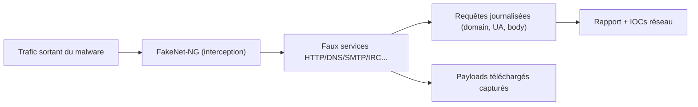
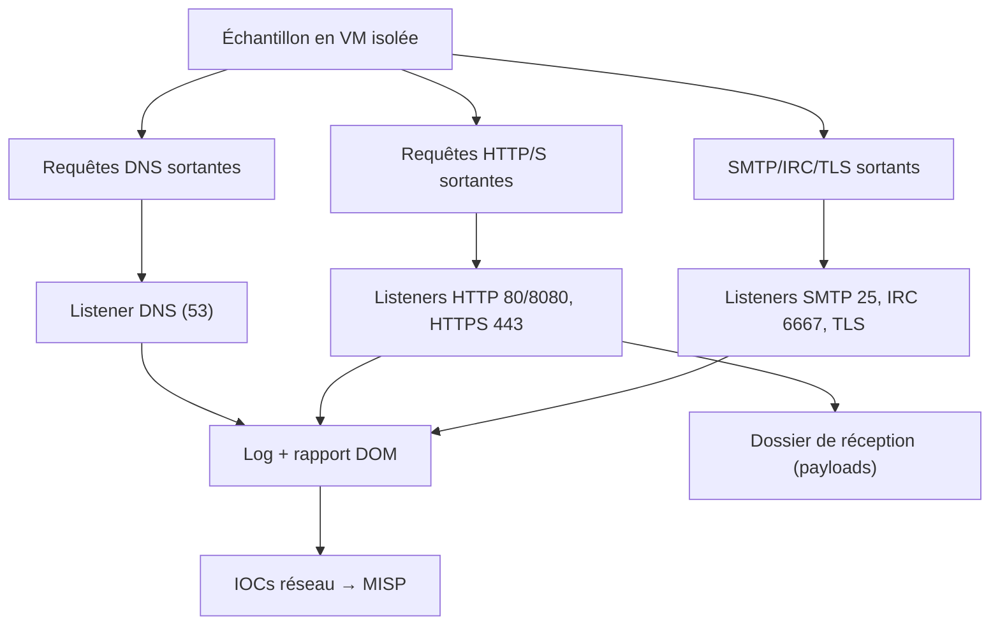

# FakeNet-NG — Simulation de services réseau pour piéger les malwares

> [!info] **En 1 phrase**
> FakeNet-NG (FireEye/Mandiant) redirige tout le trafic réseau d'un malware vers de faux services locaux (HTTP, DNS, SMTP, IRC, TLS…) pour capturer ses communications C2 et ses payloads sans jamais laisser le moindre octet sortir du labo.

---

## Overview

| Champ | Valeur |
|---|---|
| Nom complet | FakeNet-NG (Next Generation) |
| Description | Intercepteur/simulateur de services réseau : toute requête sortante d'un échantillon est répondue par un faux service local (HTTP/S, DNS, SMTP, POP3, IMAP, IRC, TLS…) qui journalise la requête et capture les payloads |
| Catégorie | Malware & Sandbox |
| Sous-catégorie | Analyse dynamique — réseau (network simulation) |
| Fonction principale | Capturer les communications C2 et les payloads d'un malware sans aucun accès Internet réel |
| Type d'outil | Framework réseau en ligne de commande (Windows et Linux) |
| Licence | Apache-2.0 (à vérifier sur le dépôt) |
| Open source / propriétaire | Open source (Mandiant/FLARE, open-sourcé en 2016) |
| Langage(s) de programmation | Python (services simulés, interception), libs C optimisées pour la capture |
| Développeur / organisation | Michael Bailey, Pedro Bueno, équipe FLARE de Mandiant |
| Projet officiel | mandiant/flare-fakenet-ng |
| Dépôt officiel | https://github.com/mandiant/flare-fakenet-ng |
| Documentation officielle | https://github.com/mandiant/flare-fakenet-ng/blob/master/README.md |
| Date de création | version originale FakeNet (Google, 2013) ; NG open-sourcé en 2016 |
| État du projet | actif (maintenance ponctuelle) |
| Dernière version connue | 3.5 |
| Systèmes compatibles | Windows (administrateur) et Linux (root) ; convient pour les VM d'analyse |

> [!note] À vérifier
> La version exacte et le détail des releases se confirment sur la page Releases du dépôt. FakeNet-NG s'installe via `pip install flare-fakenet-ng` ou depuis le clone du dépôt.

---

## Concept

FakeNet-NG est un outil d'analyse réseau dynamique : sur une machine isolée (ou via redirection `hosts`/iptables), il intercepte l'ensemble des requêtes sortantes du malware et répond à la place des vrais serveurs. Chaque protocole simulé (HTTP/S, DNS, SMTP, POP3, IMAP, IRC, TLS…) journalise les requêtes : domaines résolus, User-Agent, corps HTTP, paramètres exfiltrés. Le malware « croit » parler à son C2, mais tout est consigné et les payloads téléchargés sont récupérés dans un dossier de réception.

Il se place dans l'analyse dynamique, en complément d'une sandbox (Cuckoo/CAPE) ou en laboratoire manuel : il permet de comprendre le protocole de C2, de capturer la configuration téléchargée par le dropper, et d'identifier les indicateurs réseau d'une famille sans aucun accès Internet réel. C'est l'outil standard des analystes malware réseau, souvent couplé à Wireshark/tshark pour la capture brute des paquets.

Architecturalement, FakeNet-NG fournit un service par port simulé (par exemple HTTP sur 80/8080, HTTPS sur 443, DNS sur 53, SMTP sur 25, IRC sur 6667) et répond avec des payloads génériques suffisamment crédibles. Le fichier de configuration permet d'activer/désactiver des protocoles, de définir les pages HTTP servies et de personnaliser les réponses — essentiel quand un malware vérifie la validité d'une réponse avant d'aller plus loin.

Le rapport généré suit une structure DOM : domaines résolus, requêtes HTTP (méthode, chemin, headers, corps), sessions TLS et données SMTP/IRC. Cette sortie lisible par machine permet d'automatiser la transformation en IOCs (domaines, URLs, User-Agents) directement dans MISP ou OpenCTI.



---

## Concepts fondamentaux

| Concept | Explication |
|---|---|
| Interception | FakeNet-NG écoute tous les ports sortants de l'interface et répond à chaque requête : le malware ne peut pas « sortir » vers le vrai Internet |
| Services simulés | Un listener par protocole (HTTP 80/8080, HTTPS 443, DNS 53, SMTP 25, POP3 110, IMAP 143, IRC 6667, TLS 443/8443) |
| Fichier de configuration (`config.txt`) | Active/désactive les services, définit les pages HTTP, les réponses, le dossier de réception des payloads |
| Dossier de réception | Répertoire où FakeNet sauvegarde les fichiers téléchargés par le malware (payloads, modules, configs) |
| Rapport (DOM) | Sortie XML/DOM : domaines, requêtes HTTP (méthode, chemin, headers, corps), sessions TLS, données SMTP/IRC |
| Mode no-TLS | Désactive le TLS simulé pour les échantillons qui refusent les certificats auto-signés |
| Redirection `hosts` | Sur Windows, modification du fichier `hosts` pour pointer les domaines du malware vers 127.0.0.1 |
| Redirection iptables | Sur Linux, règles NAT pour rediriger le trafic sortant vers FakeNet |
| Jitter / crédibilité | Réponses trop régulières ou trop « propres » trahissent la simulation ; il faut diversifier tailles et timings |
| Intégration sandbox | Cuckoo/CAPE déclarent FakeNet en module `routing`/`auxiliary` pour simuler le réseau pendant l'analyse |

---

## Installation

Installation depuis le dépôt (Linux ou Windows) :

```bash
git clone https://github.com/mandiant/flare-fakenet-ng.git
cd flare-fakenet-ng
pip install -r requirements.txt
# Ou installation du paquet pip
pip install flare-fakenet-ng
```

Sur la VM d'analyse, il faut lancer en administrateur (Windows) ou root (Linux), avec l'interface réseau correcte. Sur Windows, désactiver le pare-feu sur l'interface d'analyse et vérifier que le service DNS ne capture pas les requêtes avant FakeNet. Sur Linux, désactiver le DNS système (systemd-resolved) pour que les requêtes tombent bien sur le faux serveur.

> [!warning] Prérequis & problèmes potentiels
> - **Réseau** : la machine d'analyse doit être sur un réseau host-only **sans accès Internet réel**.
> - **Privilèges** : Windows (administrateur) ou Linux (root) sont requis pour écouter sur les ports < 1024 et intercepter.
> - **DNS système** : sur Linux, `systemd-resolved` peut répondre avant FakeNet — le désactiver sur l'interface d'analyse.
> - **Pare-feu** : sur Windows, autoriser les sockets d'écoute de FakeNet sur l'interface d'analyse.

---

## Configuration

Le fichier `config.txt` (au format ini) contrôle les services simulés :

| Paramètre | Rôle | Valeur possible | Impact | Exemple |
|---|---|---|---|---|
| `[HTTP]` `enabled` | Active/désactive le service HTTP | `on` / `off` | Simule les réponses HTTP 80/8080 | `enabled = on` |
| `[HTTP]` `serve-local` | Sert les fichiers d'un dossier local | chemin | Répond avec des pages réalistes | `serve-local = /tmp/www` |
| `[DNS]` `enabled` | Simule les résolutions DNS | `on` / `off` | Capture tous les domaines consultés | `enabled = on` |
| `[SMTP]` / `[IRC]` `enabled` | Protocoles de C2/exfiltration | `on` / `off` | Journalise les échanges | `enabled = on` |
| `[TLS]` `enabled` | Simule des connexions TLS | `on` / `off` | Évite les erreurs de certif (ou `--no-tls`) | `enabled = on` |
| `[Generic]` `download-directory` | Dossier de réception des payloads | chemin | Où sont sauvegardés les fichiers téléchargés | `download-directory = /tmp/fakenet-downloads` |
| `[Generic]` `report` | Chemin du rapport | chemin | Sortie DOM des requêtes | `report = /tmp/report.txt` |

> [!note] À vérifier
> La syntaxe exacte des clés de `config.txt` varie selon les versions (3.x) ; le README et le fichier d'exemple `config.txt` fourni dans le dépôt restent la référence fiable.

---

## Architecture interne

- **Serveurs simulés** : un module Python par protocole (HTTP/S, DNS, SMTP, POP3, IMAP, IRC, TLS, générique). Chaque module écoute sur ses ports et répond avec des réponses génériques.
- **Interception Windows** : modifie le fichier `hosts` et utilise les API réseau pour capturer le trafic (mode administrateur).
- **Interception Linux** : règles iptables/NAT pour rediriger le trafic sortant vers les listeners locaux (mode root).
- **Journalisation** : chaque requête/réponse est logguée dans le log complet (`-l`) et structurée dans le rapport DOM (`-r`).
- **Dossier de réception** : les payloads téléchargés sont écrits sur disque pour re-analyse (hash, YARA, sandbox).
- **Capture brute** : FakeNet ne remplace pas Wireshark ; on couple les deux pour garder le PCAP brut.



---

## Commandes

### Commandes principales

```bash
sudo python3 fakeNet.py -i eth0 -l /tmp/fakenet.log -r /tmp/report.txt
sudo fakenetng -i eth0 -l /tmp/fakenet.log -r /tmp/report.txt
```

| Option | Effet |
|---|---|
| `-i, --interface <if>` | Interface réseau à écouter (ex. `eth0`, `lo0`) |
| `-l, --log <fichier>` | Log complet de tous les paquets et réponses |
| `-r, --report <fichier>` | Rapport résumé : requêtes, domaines, payloads |
| `-c, --config <fichier>` | Fichier de configuration des services simulés |
| `-h, --help` | Aide et liste des options |
| `-v, --version` | Version de FakeNet-NG |

### Commandes avancées

```bash
# Config personnalisée + dossier de réception dédié
sudo python3 fakeNet.py -i eth0 -c config.txt -l /tmp/f.log -r /tmp/f.txt
# Mode no-TLS pour les échantillons exigeants sur les certificats
sudo python3 fakeNet.py --no-tls -i eth0 -l /tmp/f.log -r /tmp/f.txt
# Sur Windows, lancer en tant qu'administrateur (ou via une console élevée)
fakenetng.exe -i "Ethernet" -l C:\analysis\fakenet.log -r C:\analysis\report.txt
```

---

## Options et flags

| Option | Description | Exemple | Niveau |
|---|---|---|---|
| `-i, --interface` | Interface à écouter | `fakeNet.py -i eth0` | Basic |
| `-l, --log` | Fichier de log complet | `fakeNet.py -l /tmp/f.log` | Basic |
| `-r, --report` | Fichier de rapport résumé | `fakeNet.py -r /tmp/f.txt` | Basic |
| `-c, --config` | Config des services simulés | `fakeNet.py -c config.txt` | Intermediate |
| `--no-tls` | Désactiver la simulation TLS | `fakeNet.py --no-tls` | Intermediate |
| `--ssl-certs` | Chemin des certificats pour HTTPS simulé | `fakeNet.py --ssl-certs ./certs` | Advanced |
| `-d, --dont-capture` | Ne pas capturer certains ports | `fakeNet.py -d 22` | Expert |
| `-v, --version` | Afficher la version | `fakeNet.py -v` | Basic |

> [!tip] Options les plus utiles au quotidien
> `-c config.txt` (ne garder que les services utiles), `--no-tls` (échantillons qui refusent les certifs auto-signés), `-r` (rapport exploitable par script).

---

## Exemples pratiques

### Beginner

```bash
# 1. Lancer l'interception sur l'interface de la VM
sudo python3 fakeNet.py -i eth0 -l /tmp/f.log -r /tmp/report.txt
# 2. Exécuter l'échantillon dans une autre session
# 3. Lire le rapport : domaines, User-Agents, chemins
cat /tmp/report.txt
```

### Intermediate

```bash
# Capture brute parallèle avec tshark
sudo tshark -i eth0 -w /tmp/capture.pcap &
sudo python3 fakeNet.py -i eth0 -l /tmp/f.log -r /tmp/report.txt
# Rejouer la capture dans Wireshark après l'analyse
```

### Advanced

```bash
# Config personnalisée pour un protocole C2 non standard
sudo python3 fakeNet.py -i eth0 -c config.txt -l /tmp/f.log -r /tmp/report.txt
# Récupérer et hasher les payloads téléchargés
sha256sum /tmp/fakenet-downloads/* | tee payloads_hashes.txt
```

### Expert

```bash
# Identifier un protocole de C2 inconnu sur un port non simulé
sudo tshark -i eth0 -Y "tcp.port == 8088" -T fields -e tcp.payload -x | head -40
# Ajouter un listener dédié dans config.txt pour ce port et rejouer
```

---

## Workflow complet (scénario pas à pas)

1. **Isoler le réseau** — mettre la VM d'analyse sur un réseau host-only sans accès Internet réel.

2. **Lancer FakeNet-NG** — démarrer l'interception sur l'interface de la VM.

   ```bash
   sudo python3 fakeNet.py -i eth0 -l /tmp/fakenet.log -r /tmp/report.txt
   ```

3. **Soumettre le malware** — exécuter l'échantillon ; ses requêtes DNS, HTTP et autres sont interceptées et journalisées.

4. **Analyser le rapport** — lire `/tmp/report.txt` : domaines C2, User-Agents, chemins HTTP, corps de requête.

   ```bash
   cat /tmp/report.txt
   grep -iE "domain|host|url" /tmp/report.txt
   ```

5. **Récupérer les payloads** — les fichiers téléchargés sont sauvegardés dans le dossier de réception de FakeNet pour être hasher et re-analysés.

   ```bash
   sha256sum /tmp/fakenet-downloads/* | tee payloads_hashes.txt
   file /tmp/fakenet-downloads/*
   ```

6. **Publier les IOCs** — domaines, IP simulées et payloads vers MISP/OpenCTI, rédaction de règles YARA.

---

## Scénarios avancés

### Scénario 1 : Capturer un C2 HTTP et son payload

Le dropper télécharge son module : FakeNet répond au serveur simulé et sauvegarde le binaire téléchargé.

```bash
grep -A20 "HTTP" /tmp/report.txt
# payload récupéré dans le dossier de réception
sha256sum /tmp/fakenet-downloads/* ; yara /opt/rules/malware.yar /tmp/fakenet-downloads/*
```

### Scénario 2 : Protocole C2 personnalisé (SMTP/IRC)

Configurer un service sur mesure via le fichier de config pour répondre exactement comme le vrai C2 et capturer les données exfiltrées.

```bash
# config.txt : activer SMTP/IRC avec des réponses réalistes
sudo python3 fakeNet.py -i eth0 -c config.txt -l /tmp/smtp.log -r /tmp/smtp_report.txt
```

### Scénario 3 : Capture brute parallèle avec tshark

Coupler FakeNet avec une capture paquets pour conserver la trace brute en complément du rapport applicatif.

```bash
sudo tshark -i eth0 -w /tmp/capture.pcap &
sudo python3 fakeNet.py -i eth0 -l /tmp/fakenet.log -r /tmp/report.txt
# Rejouer la capture dans Wireshark après l'analyse.
```

### Scénario 4 : analyse des requêtes DNS du malware

```bash
grep -iE "DNS|domain" /tmp/report.txt | sort -u > dns_iocs.txt
# Le DNS simulé révèle tous les domaines consultés, y compris ceux
# qui échouent côté HTTP : idéal pour étoffer la liste des IOCs.
```

### Scénario 5 : détection d'un protocole de C2 non standard

```bash
# En cas de trafic vers un port non simulé, identifier le protocole :
sudo tshark -i eth0 -Y "tcp.port == 8088" -T fields -e tcp.payload -x | head -40
# Puis ajouter un listener dédié dans config.txt pour ce port et rejouer.
```

---

## Cybersecurity use cases

| Phase | Utilisation |
|---|---|
| Analyse de malware (réseau) | Capture des communications C2 et des payloads |
| CTI / Threat Intelligence | Collecte de domaines, URLs, User-Agents comme IOCs |
| Investigation (DFIR) | Compréhension du protocole de C2 d'une famille |
| Sécurité offensive (lab) | Émulation de services pour faire détonner des échantillons exigeants |
| Éducation | Apprentissage des protocoles de commande & control |
| Corrélation (MISP/OpenCTI) | Alimentation automatique des plateformes de partage d'IOCs |

---

## MITRE ATT&CK

| Tactique | Technique / Sub-technique | ID | Raison | Détection | Mitigation |
|---|---|---|---|---|---|
| Command & Control | Application Layer Protocol | T1071 | Les protocoles de C2 (HTTP, HTTPS, DNS) sont simulés et journalisés | NDR/IPS sur le PCAP | Filtrage sortant, liste de domaines |
| Command & Control | DNS | T1071.004 | Toutes les résolutions DNS du malware sont capturées | Logs DNS, NDR | Contrôle des requêtes DNS sortantes |
| Command & Control | Web Protocols | T1071.001 | Requêtes HTTP/S interceptées : méthodes, headers, corps | Proxy/NDR | Décryptage TLS, contrôles applicatifs |
| Command & Control | Exfiltration Over C2 Channel | T1041 | Les données exfiltrées transitent par le faux canal C2 | DLP, NDR | Segmentation, chiffrement |
| Collection | Data from Local System | T1005 | Fichiers exfiltrés capturés dans le dossier de réception | Monitoring des accès fichiers | Segmentation, chiffrement |
| Command & Control | Encrypted Channel | T1573 | Sessions TLS simulées observées avec certificats auto-signés | Décryptage contrôlé en labo | Filtrage des certifs inconnus |

> [!note] Ne renseigner que si l'association est réellement pertinente.
> FakeNet-NG est un **outil d'observation** : les techniques listées sont celles que la simulation permet de capturer sur les échantillons, pas des techniques mises en œuvre par l'outil.

---

## Defensive Security

### Signes observables

| Indicateur | Détail |
|---|---|
| Domaines de C2 résolus par le DNS simulé | Bloquer les domaines au DNS, enrichir les IOCs (MISP) |
| Payloads téléchargés depuis le faux serveur | Extraire et hasher les payloads, re-analyse YARA/VirusTotal |
| Malware qui détecte les réponses artificielles | Améliorer la config (timeouts, certificats TLS), croiser avec tshark |
| Trafic exfiltré vers des protocoles non simulés | Activer les listeners correspondants ou identifier le protocole manuellement |
| Réponses FakeNet trop régulières (mêmes tailles, mêmes timings) | Diversifier les réponses, ajouter du jitter dans la config |
| Connexions TLS vers un faux serveur sans certif valide | Fournir des certificats auto-signés et observer la suite TLS choisie |

### Règles de détection (Sigma / Suricata / Snort / YARA)

```yaml
# Sigma — Windows : FakeNet-NG en cours d'exécution sur une machine (exemple)
title: FakeNet-NG Process Execution
logsource:
    category: process_creation
    product: windows
detection:
    selection:
        Image|endswith:
            - 'fakeNet.py'
            - 'fakenetng.exe'
    condition: selection
level: informational
```

```bash
# Suricata/Snort — alerte sur un User-Agent de dropper connu capturé par FakeNet
alert tcp any any -> any any (msg:"Suspicious downloader UA observed"; content:"User-Agent: Mozilla/5.0|20|malware-sample"; sid:9500003; rev:1;)
```

---

## Automatisation

```bash
# Bash — lancer FakeNet, détonner un corpus, puis collecter les IOCs
for f in /opt/corpus/*.exe; do
    echo "== $f =="
    sudo python3 fakeNet.py -i eth0 -l /tmp/f.log -r /tmp/f.txt &
    FPID=$!
    wine "$f"   # ou exécution directe dans la VM
    sleep 30
    kill $FPID
    grep -iE "domain|url" /tmp/f.txt >> /opt/iocs/network.txt
done
sort -u /opt/iocs/network.txt -o /opt/iocs/network.txt
```

```python
# Python — parsing du rapport DOM en IOCs
import re
import xml.etree.ElementTree as ET

tree = ET.parse("/tmp/report.txt")
iocs = set()
for el in tree.iter():
    if el.tag in ("Domain", "Host", "URL", "UserAgent"):
        value = (el.text or "").strip()
        if value:
            iocs.add(f"{el.tag}:{value}")
for line in sorted(iocs):
    print(line)
```

> [!note] À vérifier
> La structure exacte du rapport DOM dépend de la version de FakeNet-NG ; l'exemple Python est un squelette à adapter à la sortie réelle.

---

## Output et parsing

- **Log complet** (`-l`) : tous les paquets et réponses, horodatés.
- **Rapport résumé** (`-r`) : structure DOM lisible par machine — domaines, requêtes HTTP (méthode, chemin, headers, corps), sessions TLS, données SMTP/IRC.
- **Dossier de réception** : fichiers téléchargés par le malware (payloads, configs, modules).

```bash
# Extraire les domaines résolus
grep -iE "domain" /tmp/report.txt | sort -u
# Extraire les URLs et User-Agents HTTP
grep -iE "http|User-Agent" /tmp/report.txt | sort -u
# Hasher les payloads téléchargés
sha256sum /tmp/fakenet-downloads/*
```

```python
# Python — conversion du rapport en liste d'IOCs pour MISP
import re

PATTERN = re.compile(r"<(Domain|Host|URL|UserAgent)>(.*?)</\1>")
with open("/tmp/report.txt") as f:
    data = f.read()
for tag, value in PATTERN.findall(data):
    print(f"{tag}:{value.strip()}")
```

---

## Intégrations

- [[Tools| Outils]] global
- [[Outil - Cuckoo Sandbox]] — module `auxiliary`/`routing` pour simuler le réseau en sandbox
- [[Outil - CAPE]] — idem sur le fork maintenu (routage InetSim/FakeNet)
- [[Outil - Wireshark]] — analyse du PCAP brut en complément du rapport
- [[Outil - tshark]] — capture en ligne de commande, filtrage et extraction
- [[Outil - tcpdump]] — capture légère pendant la détonation
- [[Outil - YARA]] — signatures sur les payloads capturés
- [[Outil - MISP]] — publication des IOCs réseau collectés
- [[Outil - REMnux]] — distribution contenant FakeNet-NG et les outils d'analyse
- [[09 - Reverse Engineering & Malware| Reverse Engineering & Malware]]

```text
Échantillon → FakeNet-NG (interception) → payloads + IOCs réseau → YARA + MISP → SOC
```

---

## Alternatives

| Outil | Avantages | Inconvénients | Cas d'usage |
|---|---|---|---|
| InetSim | Services simulés multi-protocoles, mature | GUI/scripting moins riche, pas de mode Windows natif | Sandbox réseau Linux |
| SinkHole (dns sinkhole maison) | Simple, ne capture que le DNS | Ne simule pas HTTP/SMTP/IRC | Filtrage DNS rapide |
| netcat / socat listeners | Ultra-flexible, aucun setup | Manuels, pas de journalisation applicative | Protocoles ponctuels |
| Wireshark seul | Capture brute complète | Ne répond pas aux requêtes (pas d'interception) | Analyse passive |
| ServerEmulator (palantir) | Spécialisé HTTPS/HTTP | Moins de protocoles couverts | C2 HTTPS |

> **Quand utiliser FakeNet-NG plutôt que Wireshark seul ?** Dès qu'il faut *répondre* aux requêtes pour faire avancer la détonation (téléchargement de modules, handshakes) : Wireshark observe, FakeNet répond.

---

## Performance

- Surcharge CPU très faible : chaque listener répond avec des payloads courts.
- Le rapport DOM grossit avec le trafic : pour les campagnes massives, le filtrer par domaine/protocole.
- Le dossier de réception peut se remplir vite (payloads, modules) : prévoir l'espace disque et nettoyer entre les détonations.
- La capture brute parallèle (tshark) ajoute une charge modérée ; limiter à l'interface d'analyse.
- Sur Linux, les règles iptables de redirection ont un coût négligeable.

---

## Troubleshooting

### Common problems

#### Problème : aucune requête capturée

- **Cause** : mauvaise interface (`-i`) ou DNS système qui répond avant FakeNet (Linux).
- **Solution** : vérifier l'interface (`ip addr`), désactiver `systemd-resolved` sur l'interface d'analyse.
- **Vérification** : `sudo tshark -i eth0` pour confirmer le trafic visible.

#### Problème : le malware détecte la simulation et ne détonne pas

- **Cause** : réponses trop « propres » (tailles, timings, certificats TLS invalides).
- **Solution** : personnaliser `config.txt` (pages HTTP, délais), utiliser `--no-tls`, servir des pages réelles (`serve-local`).
- **Vérification** : relancer avec un log et comparer les timings des réponses.

#### Problème : le payload n'apparaît pas dans le dossier de réception

- **Cause** : protocole non simulé (port inconnu) ou réponse rejetée par le malware.
- **Solution** : identifier le port avec tshark, ajouter un listener dans `config.txt`.
- **Vérification** : `sudo tshark -i eth0 -Y "tcp.port == <port>"` pendant la détonation.

#### Problème : sur Windows, le service DNS répond avant FakeNet

- **Cause** : le service client DNS Windows capture les requêtes.
- **Solution** : désactiver le service DNS sur l'interface d'analyse ou utiliser la redirection `hosts`.
- **Vérification** : `ipconfig /displaydns` pour voir si les résolutions passent par le cache système.

#### Problème : « Permission denied » à l'écoute des ports < 1024

- **Cause** : non lancé en root/administrateur.
- **Solution** : `sudo python3 fakeNet.py -i eth0 ...` (Linux) ou console élevée (Windows).
- **Vérification** : `sudo -i` puis relancer la commande.

---

## Sécurité de l'outil

- **Isolation stricte** : FakeNet ne doit JAMAIS être connecté à un réseau réel : un malware pourrait atteindre son vrai C2.
- **Détonation** : exécuter uniquement dans une VM jetable, jamais sur un poste de production.
- **Payloads** : les fichiers téléchargés sont des malwares ; les hasher et les conserver dans un emplacement contrôlé.
- **Certificats** : les certificats TLS auto-signés générés pour la simulation ne doivent pas fuiter vers d'autres systèmes.
- **Logs** : les logs contiennent des données exfiltrées potentiellement sensibles (credentials) — les protéger.

---

## Limitations

- FakeNet répond à toutes les requêtes : des malwares avancés détectent les réponses « trop propres » et changent de comportement.
- Les protocoles complexes (TLS, SMTP avancé, protocoles propriétaires) nécessitent une personnalisation fine de la config.
- Pas de rejeu de capture : il faut redétonner l'échantillon pour modifier les réponses.
- La couverture des protocoles dépend de la version (3.x) ; certains ports ne sont pas simulés par défaut.
- Sur Windows, la manipulation du fichier `hosts` peut être détectée par des anti-sandbox.

---

## Cheatsheet

```bash
# Lancer l'interception (Linux, root)
sudo python3 fakeNet.py -i eth0 -l /tmp/f.log -r /tmp/report.txt

# Lancer avec une config personnalisée
sudo python3 fakeNet.py -i eth0 -c config.txt -l /tmp/f.log -r /tmp/report.txt

# Lancer sans simulation TLS (échantillons exigeants)
sudo python3 fakeNet.py --no-tls -i eth0 -l /tmp/f.log -r /tmp/report.txt

# Capture brute parallèle
sudo tshark -i eth0 -w /tmp/capture.pcap &

# Lire le rapport
cat /tmp/report.txt

# Extraire les domaines
grep -iE "domain" /tmp/report.txt | sort -u

# Hasher les payloads capturés
sha256sum /tmp/fakenet-downloads/*

# Identifier un protocole inconnu
sudo tshark -i eth0 -Y "tcp.port == 8088" -T fields -e tcp.payload -x | head -40
```

---

## Quick reference

| | |
|---|---|
| **À quoi sert-il ?** | Simuler les services réseau (HTTP, DNS, SMTP, IRC, TLS) pour capturer les C2 et payloads sans Internet réel |
| **Quand l'utiliser ?** | Analyse dynamique en VM isolée, en complément d'une sandbox ou pour comprendre un protocole de C2 |
| **Commande principale** | `sudo python3 fakeNet.py -i eth0 -l /tmp/f.log -r /tmp/report.txt` |
| **Alternative principale** | InetSim (Linux) · Wireshark seul (observation passive) |
| **Concepts importants** | Interception, services simulés, config.txt, dossier de réception, rapport DOM |
| **Liens associés** | [[Outil - Cuckoo Sandbox]] · [[Outil - CAPE]] · [[Outil - Wireshark]] · [[Outil - tshark]] |

---

## Détection & Défense

| Signe | Défense |
|---|---|
| Domaines de C2 résolus par le DNS simulé | Bloquer les domaines au DNS, enrichir les IOCs (MISP) |
| Payloads téléchargés depuis le faux serveur | Extraire et hasher les payloads, re-analyse YARA/VirusTotal |
| Malware qui détecte les réponses artificielles | Améliorer la config (timeouts, certificats TLS), croiser avec tshark |
| Trafic exfiltré vers des protocoles non simulés | Activer les listeners correspondants ou identifier le protocole manuellement |
| Réponses FakeNet trop régulières (mêmes tailles, mêmes timings) | Diversifier les réponses, ajouter du jitter dans la config |
| Connexions TLS vers un faux serveur sans certif valide | Fournir des certificats auto-signés et observer la suite TLS choisie |

---

## Tips & Pièges

> [!tip] **Tips**
> - Lancez toujours FakeNet-NG sur un réseau strictement isolé (host-only) : il ne doit jamais voir de trafic réel, sinon les logs se polluent.
> - Personnalisez `config.txt` pour ne garder que les services utiles (désactivez ceux qui font crasher le malware).
> - Couplez-le systématiquement avec Wireshark/tshark pour garder la capture brute des paquets en complément du log applicatif.
> - Rejouez plusieurs fois l'échantillon : un malware peut contacter plusieurs C2 successifs, chacun à révéler.
> - Utilisez le mode no-TLS (`--no-tls`) pour les échantillons qui refusent les certificats auto-signés.

> [!warning] **Pièges**
> - FakeNet répond à TOUTES les requêtes : des malwares avancés détectent les réponses trop « propres » et changent de comportement.
> - Sur Windows, vérifiez que l'interface sélectionnée est la bonne (loopback vs ethernet) et que le processus tourne en administrateur.
> - Ne connectez JAMAIS l'interface d'écoute à un réseau réel : le trafic simulé pourrait s'échapper vers les vrais serveurs.
> - Le DNS système peut répondre avant FakeNet sur Linux (systemd-resolved) : désactivez-le pour une interception complète.

---

## References

### Official

- Dépôt GitHub officiel : https://github.com/mandiant/flare-fakenet-ng
- README / documentation : https://github.com/mandiant/flare-fakenet-ng/blob/master/README.md
- Blog Mandiant « FakeNet-NG now open source » : https://www.mandiant.com/resources/blog/fakenet-ng-now-open-source

### Security references

- MITRE ATT&CK T1071 — Application Layer Protocol : https://attack.mitre.org/techniques/T1071/
- MITRE ATT&CK T1041 — Exfiltration Over C2 Channel : https://attack.mitre.org/techniques/T1041/
- MITRE ATT&CK T1573 — Encrypted Channel : https://attack.mitre.org/techniques/T1573/

### Community

- InetSim (alternative Linux) : https://github.com/InetSim/InetSim
- FLARE VM (distribution incluant FakeNet-NG) : https://github.com/mandiant/flare-vm

---

**Liens :** [[Tools| Outils]] · [[Outils/Outil - Cuckoo Sandbox| Cuckoo Sandbox]] · [[Outils/Outil - CAPE| CAPE]] · [[Outils/Outil - Wireshark|Wireshark]] · [[Outils/Outil - tshark|tshark]] · [[Outils/Outil - YARA| YARA]] · [[Techniques/09 - Reverse Engineering & Malware| Reverse Engineering & Malware]]
