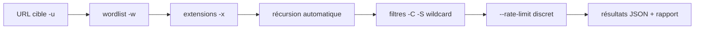

# 🔍 Feroxbuster — Brute-forcer de répertoires web en Rust

> [!info] **En 1 phrase**
> Feroxbuster est un brute-forcer de répertoires écrit en Rust, très rapide, avec récursion automatique et filtrage fin des statuts.

---

## 🧾 Overview

| Champ | Valeur |
|---|---|
| Nom complet | Feroxbuster (ferox = « féroce ») |
| Description | Outil de découverte de contenu web (forced browsing) en Rust : récursion automatique, filtrage fin, proxy, link extraction |
| Catégorie | Scan Web & Fuzzing |
| Sous-catégorie | Découverte de contenu / web content discovery |
| Fonction principale | Énumérer les répertoires et fichiers cachés d'une application web en bruteforçant une wordlist |
| Type d'outil | CLI (binaire Rust autonome) |
| Licence | MIT |
| Open source / propriétaire | Open source (édition commerciale « Feroxbuster Pro » séparée) |
| Langage(s) de programmation | Rust |
| Développeur / organisation | epi052 (Ben) + contributeurs |
| Projet officiel | https://github.com/epi052/feroxbuster |
| Dépôt officiel | https://github.com/epi052/feroxbuster |
| Documentation officielle | https://epi052.github.io/feroxbuster-docs/ |
| Date de création | 2020 |
| État du projet | actif (releases régulières, ~7,5k étoiles) |
| Dernière version connue | 2.13.1 |
| Systèmes compatibles | Linux / Windows / macOS (x86_64 + ARM ; Docker ; Android via Termux) |

> [!note] Pour vérifier / compléter
> ⚠️ **Alerte d'usurpation** : le domaine **feroxbuster.com n'est PAS affilié** au projet. Les téléchargements officiels ne passent que par GitHub releases, feroxbuster.pro (édition commerciale) et les dépôts de paquets listés dans la documentation. Ne jamais installer un binaire provenant d'une autre source.

---

## 🎯 Concept

Feroxbuster (ferox = féroce) est un scanner de répertoires et fichiers en Rust pensé pour la vitesse : il gère le multiplexage HTTP et continue automatiquement dans les répertoires trouvés (**récursion**). Sa syntaxe proche de gobuster le rend facile à prendre en main.

Il excelle sur les grandes wordlists et les cibles qui renvoient beaucoup de réponses, grâce à son filtrage par statut (`-C`), taille (`-S`) ou expressions régulières (`-B`). L'option moins connue `--rate-limit` permet de fixer un quota de requêtes par seconde pour rester discret. Il se place dans la phase de **découverte de contenu web** d'un pentest, juste après la détection de la techno (WordPress, API, J2EE…) : ses résultats alimentent la recherche de fichiers exposés, de zones d'upload ou d'endpoints cachés.

Feroxbuster se distingue aussi par sa sortie en temps réel, son **auto-filter des réponses wildcard** (il détecte et filtre automatiquement les réponses 404/200 uniformes), et son option de filtrage inversé (`--invert-filter`). L'outil gère les cookies de session (`-c`), les en-têtes personnalisés (`-H`), les certificats SSL invalides (`-k`), le passage par un proxy (`-x`, y compris SOCKS), l'**extraction de liens** depuis les réponses (`-e`), la **pause/reprise** (touche ENTER) et la mise à jour auto (`--update`). Il dispose d'une version commerciale **Feroxbuster Pro** (auto-tune, wordlists dynamiques, recette d'endpoints plus fins).



---

## 🧠 Concepts fondamentaux

| Concept | Explication |
|---|---|
| Forced browsing | Requêter systématiquement des chemins probables (wordlist) pour découvrir des ressources non liées dans le site |
| Récursion automatique | Chaque répertoire trouvé devient une nouvelle base de scan, jusqu'à la profondeur `-d` (défaut 4, `-d 0` = infini) |
| Filtre wildcard | Détection automatique des réponses « fourre-tout » (ex : 200 ou 404 sur des chemins aléatoires) et exclusion ; désactivable avec `-D` |
| Auto-tune | `--auto-tune` ajuste automatiquement les paramètres (threads, timeout...) selon la cible |
| Link extraction | `-e` extrait les liens des réponses (HTML, JS) et re-scanne les URLs découvertes |
| Pause/reprise | La touche ENTER met en pause le scan, qui reprend ensuite (état sauvegardé) |
| Rate-limit | `--rate-limit` borne les requêtes/seconde pour rester discret ou protéger la cible |
| Proxy | `--proxy` relaye tout le trafic (HTTP, HTTPS, SOCKS5) vers Burp/mitmproxy/Tor |
| Statuts par défaut | `200 204 301 302 307 308 401 403 405` (liste d'inclusion par défaut) |
| Configuration | `ferox-config.toml` (global `/etc/feroxbuster/`, per-user, ou à côté du binaire) surcharge les défauts |

---

## 🛠️ Installation

### Debian / Ubuntu / Kali Linux

```bash
sudo apt update && sudo apt install -y feroxbuster

# ou .deb des releases GitHub (toujours dernière version)
wget https://github.com/epi052/feroxbuster/releases/latest/download/feroxbuster_amd64.deb.zip
unzip feroxbuster_amd64.deb.zip
sudo apt install ./feroxbuster_amd64.deb

# ou script officiel (installe dans le répertoire courant)
curl -sL https://raw.githubusercontent.com/epi052/feroxbuster/main/install-nix.sh | bash
```

### Arch Linux

```bash
yay -S feroxbuster-git   # AUR (non officiel)
# ou cargo install feroxbuster
```

### Fedora / RHEL

```bash
# binaires des releases GitHub ou cargo
cargo install feroxbuster
```

### macOS

```bash
brew install feroxbuster
# ou script officiel install-nix.sh
```

### Windows

```powershell
winget install epi052.feroxbuster

# ou via Chocolatey
choco install feroxbuster

# ou binaire des releases GitHub
Invoke-WebRequest https://github.com/epi052/feroxbuster/releases/latest/download/x86_64-windows-feroxbuster.exe.zip -OutFile feroxbuster.zip
Expand-Archive .\feroxbuster.zip
.\feroxbuster\feroxbuster.exe -V
```

### Docker

```bash
# Pas d'image officielle : construire depuis le repo
git clone https://github.com/epi052/feroxbuster.git
cd feroxbuster
sudo docker build -t feroxbuster .
sudo docker run --init -it feroxbuster -u http://example.com -x js,html
```

### Compilation depuis les sources

```bash
# Cargo (Rust requis)
cargo install feroxbuster

# ou build manuel
git clone https://github.com/epi052/feroxbuster.git
cd feroxbuster
cargo build --release
./target/release/feroxbuster --help
```

### Mise à jour (depuis v2.9.1)

```bash
./feroxbuster --update
```

> [!warning] ⚠️ Prérequis & problèmes potentiels
> - **Sources officielles uniquement** : GitHub releases, feroxbuster.pro (Pro), dépôts de paquets listés dans la doc. Méfiance vis-à-vis de `feroxbuster.com` (non affilié).
> - **Docker** : pas d'image officielle pré-construite, il faut construire l'image soi-même.
> - **Erreur « No file descriptors available »** : limite de descripteurs de fichiers du système atteinte (threads + connexions) — réduire `-t` ou augmenter `ulimit -n`.
> - `--update` nécessite que le binaire soit exécutable et dans un répertoire accessible en écriture.

---

## ⚙️ Configuration

| Paramètre | Rôle | Valeur possible | Impact | Exemple |
|---|---|---|---|---|
| `ferox-config.toml` | Surcharge des valeurs par défaut (global/per-user/local) | Fichier TOML | Applique une config réutilisable sans flags | Fixer `threads = 20`, `rate_limit = 10` |
| `-w <wordlist>` | Wordlist de chemins | Fichier (défaut : raft-medium-directories) | Couverture du scan | `-w seclists/.../directory-list-2.3-medium.txt` |
| `-x <exts>` | Extensions testées | `php,html,txt,bak` | Fichiers par type | `-x php,txt` |
| `-d <n>` | Profondeur de récursion | `4` (défaut), `0` = infini | Coût total du scan | `-d 2` |
| `-t <n>` | Threads | `50` (défaut) | Vitesse vs charge | `-t 20` |
| `--rate-limit <n>` | Requêtes max/seconde | nombre entier | Discrétion + protection cible | `--rate-limit 15` |
| `-C / -S / -B` | Exclure statuts / tailles / regex | valeurs | Réduit le bruit | `-C 403,404` |
| `-s <codes>` | Statuts inclus | `200 204 301...` (défaut) | Ne garde que certains codes | `-s 200,302` |
| `--auto-filter / -D` | Filtrage wildcard on/off | booléen | Élimine les réponses uniformes | `-D` pour désactiver |
| `-k` | Ignorer les certificats TLS invalides | flag | Cibles auto-signées | `-k` |
| `--proxy <url>` | Proxy HTTP/HTTPS/SOCKS5 | `http://127.0.0.1:8080`, `socks5://127.0.0.1:9050` | Relai et inspection | Burp sur 8080 |
| `-a <ua>` | User-Agent | chaîne (défaut `feroxbuster/VERSION`) | Discrétion / compatibilité | `-a "Mozilla/5.0 ..."` |
| `--response-size-limit` | Limite la taille des corps lus | octets | Évite l'épuisement mémoire | `--response-size-limit 500000` |

> [!note] À vérifier
> Le fichier de config est `ferox-config.toml` (les anciennes versions utilisaient `ferox-config.yaml`). Vérifier le nom et le format selon la version installée.

---

## 🏗️ Architecture interne

- **Cœur Rust asynchrone** : feroxbuster repose sur l'écosystème async Rust (tokio/reqwest) pour le multiplexage des requêtes HTTP — d'où sa vitesse par rapport aux scanners threadés simples.
- **Scan management** : plusieurs scans peuvent tourner en parallèle (récursion) ; `--scan-limit` borne le nombre de scans concurrents ; le menu interactif permet pause (touche ENTER), reprise et re-filtrage à chaud.
- **Filtrage** : chaque réponse est évaluée contre une chaîne de filtres (statuts, tailles, regex, wordlist wildcard) avant affichage/export ; l'auto-filter apprend les réponses « fourre-tout » en envoyant des chemins aléatoires de contrôle.
- **Récursion** : les répertoires validés (statut inclus) sont réinjectés comme nouvelles bases de scan, avec une profondeur bornée par `-d`.
- **États** : un fichier d'état (contrôlable via la variable `STATE_FILENAME`) permet la pause/reprise et la reprise après interruption.
- **Réseau** : gestion des cookies de session, en-têtes custom, requêtes de fichier (`--request-file`), schéma forcé (`--protocol`), suivi des redirections (`-r`), proxy HTTP/HTTPS/SOCKS5.
- **Sortie** : console en temps réel, logs, `--json` structuré, rapport (optionnel) ; `--quiet` ne montre que les URLs.

Flux type : wordlist → threads async → requêtes → filtres → affichage/JSON → récursion sur les répertoires validés.

---

## ⌨️ Commandes

### Commandes principales

```bash
# Scan classique avec extensions
feroxbuster -u http://10.10.10.10 -w /usr/share/seclists/Discovery/Web-Content/directory-list-2.3-medium.txt --extensions php,html,txt,bak

# Scan discret avec rate-limit et profondeur bornée
feroxbuster -u http://10.10.10.10 -w wordlist.txt -C 403,404 --rate-limit 20 -d 1

# Sortie JSON pour traitement automatique
feroxbuster -u http://10.10.10.10 -w wordlist.txt --json -o ferox.json

# Lire les URLs depuis stdin
cat urls.txt | feroxbuster --stdin --json
```

| Commande | Objectif | Résultat attendu |
|---|---|---|
| `-u <url>` | URL(s) cible(s) | Scan de la cible |
| `-w <wordlist>` | Wordlist de chemins | Bruteforce des chemins |
| `-x <exts>` | Extensions | Scan fichiers par extension |
| `-d <n>` | Profondeur de récursion | Récursion bornée |
| `-t <n>` | Threads | Vitesse réglée |
| `--rate-limit <n>` | Quota requêtes/s | Scan discret |
| `-C <codes>` | Exclure statuts | Bruit réduit |
| `--json -o <f>` | Export JSON | Trace exploitable |
| `--stdin` | Lire les cibles depuis stdin | Scan en pipeline |

### Commandes avancées

```bash
# Extraction de liens depuis les réponses (nouveaux endpoints)
feroxbuster -u http://10.10.10.10 -w wordlist.txt -x php -e

# Proxy SOCKS (Tor) pour l'anonymisation
feroxbuster -u http://10.10.10.10 -w wordlist.txt --proxy socks5://127.0.0.1:9050

# Pause/reprise à la volée (touche ENTER), puis reprise du scan
# (le menu interactif affiche aussi le temps restant estimé)

# Auto-tune des paramètres selon la cible
feroxbuster -u http://10.10.10.10 -w wordlist.txt --auto-tune

# Request file : scanner une requête HTTP brute (méthode/headers personnalisés)
feroxbuster --request-file request.txt -w wordlist.txt
```

---

## 🎚️ Options et flags

| Option | Description | Exemple | Niveau |
|---|---|---|---|
| `-u <url>` | URL(s) cible(s) | `-u http://10.10.10.10` | Basic |
| `-w <wordlist>` | Wordlist | `-w wordlist.txt` | Basic |
| `-x <exts>` | Extensions | `-x php,txt,bak` | Basic |
| `-t <n>` | Threads (défaut 50) | `-t 20` | Basic |
| `-d <n>` | Profondeur de récursion (défaut 4) | `-d 2` | Basic |
| `-C <codes>` | Exclure statuts | `-C 403,404` | Basic |
| `-s <codes>` | Statuts inclus | `-s 200,302,401` | Intermediate |
| `-S <tailles>` | Exclure tailles de réponse | `-S 0B,5KB` | Intermediate |
| `-B <regex>` | Exclure par regex | `-B "Page not found"` | Intermediate |
| `--rate-limit <n>` | Requêtes max/seconde | `--rate-limit 15` | Intermediate |
| `--json -o <f>` | Sortie JSON | `--json -o ferox.json` | Intermediate |
| `-k` | Ignorer TLS invalide | `-k` | Intermediate |
| `--proxy <url>` | Proxy HTTP/HTTPS/SOCKS5 | `--proxy http://127.0.0.1:8080` | Intermediate |
| `-H <header>` | En-tête custom | `-H "Authorization: Bearer x"` | Intermediate |
| `-c <cookie>` | Cookie de session | `-c PHPSESSID=abc` | Intermediate |
| `-e` | Extraction de liens | `-e` | Advanced |
| `--auto-tune` | Ajustement automatique | `--auto-tune` | Advanced |
| `--scan-limit <n>` | Bornage des scans concurrents | `--scan-limit 2` | Advanced |
| `--invert-filter` | Inverse la logique de filtrage | `--invert-filter` | Advanced |
| `--request-file <f>` | Scanner une requête brute | `--request-file req.txt` | Advanced |
| `--protocol <p>` | Forcer le schéma | `--protocol https` | Advanced |
| `--response-size-limit <n>` | Limiter la taille des corps | `--response-size-limit 500000` | Expert |
| `--update` | Mise à jour automatique | `./feroxbuster --update` | Expert |

> [!tip] Options les plus utiles au quotidien
> `-C 403,404` pour filtrer le bruit, `--rate-limit` pour la discrétion, `--json -o out.json` pour une trace exploitable, `-d 2` pour borner la récursion, et `-e` (extraction de liens) pour découvrir des endpoints non wordlistés.

---

## 🧪 Exemples pratiques

### Beginner

```bash
# Objectif : premier scan d'une cible
feroxbuster -u http://10.10.10.10 -w /usr/share/wordlists/dirb/common.txt -x php,txt,bak

# Objectif : réduire le bruit en filtrant
feroxbuster -u http://10.10.10.10 -w wordlist.txt -C 403,404,500

# Résultat attendu : répertoires/fichiers avec statut et taille, récursion automatique
```

### Intermediate

```bash
# Objectif : scan discret avec rate-limiting
feroxbuster -u http://10.10.10.10 -w wordlist.txt --rate-limit 15 -d 1

# Objectif : zone authentifiée avec cookies de session
feroxbuster -u http://10.10.10.10/private -w wordlist.txt -c PHPSESSID=abc123 \
  -C 403,404 --rate-limit 10 --json -o private_scan.json

# Objectif : relai via Burp pour inspection
feroxbuster -u http://10.10.10.10 -w wordlist.txt --proxy http://127.0.0.1:8080
```

### Advanced

```bash
# Objectif : scan d'une API avec endpoints cachés
feroxbuster -u http://10.10.10.10/api -w api-endpoints.txt -x json -C 404 \
  -x http://127.0.0.1:8080 --json -o api_scan.json

# Objectif : chasse aux fichiers de sauvegarde
feroxbuster -u http://10.10.10.10 -w /usr/share/seclists/Discovery/Web-Content/backup-files.txt \
  -x bak,zip,sql -S 0B -C 403,404 --invert-filter

# Objectif : scan derrière un WAF / auth HTTP de base
feroxbuster -u https://10.10.10.10 -w wordlist.txt -k --proxy http://127.0.0.1:8080 \
  -H "Authorization: Basic $(echo -n admin:pass | base64)" -C 403,404
```

### Expert

```bash
# Objectif : scan en pipeline depuis stdin avec sortie JSON
cat sous-domaines.txt | feroxbuster --stdin --json -o scan_all.json

# Objectif : extraction de liens et nouvelle passe de scan
feroxbuster -u http://10.10.10.10 -w wordlist.txt -x php -e -d 3

# Objectif : pause/reprise + traitement du JSON
feroxbuster -u http://10.10.10.10 -w wordlist.txt --json -o ferox.json
# (touche ENTER pour pause/reprise)
jq -r '.[] | select(.status == 200) | .url' ferox.json > urls_200.txt
```

---

## 🧪 Workflow complet (scénario pas à pas)

1. **Lancer un premier scan large** :
   ```bash
   feroxbuster -u http://10.10.10.10 -w /usr/share/wordlists/dirb/common.txt --extensions php,txt,bak
   ```
2. **Analyser les résultats** : les `200` sont à visiter, les `301` à suivre, les `403` à retester à la main. Vérifier d'abord `robots.txt` et `sitemap.xml` pour orienter la wordlist.
3. **Réduire le bruit en filtrant** :
   ```bash
   feroxbuster -u http://10.10.10.10 -w wordlist.txt -C 403,404,500
   ```
4. **Rester discret avec le rate-limiting** :
   ```bash
   feroxbuster -u http://10.10.10.10 -w wordlist.txt --rate-limit 15 -d 1
   ```
5. **Suivre la récursion automatique** dans les répertoires trouvés (`/admin/`, `/backup/`), en bornant la profondeur avec `-d 2`.
6. **Conserver un rapport exploitable** :
   ```bash
   feroxbuster -u http://10.10.10.10 -w wordlist.txt --json -o ferox.json
   jq -r '.[] | select(.status == 200) | .url' ferox.json > urls_200.txt
   ```
   Puis intégrer les URLs confirmées au rapport d'engagement.

---

## 🎬 Scénarios avancés

### Scénario 1 : scan ciblé WordPress avec extensions pertinentes

```bash
feroxbuster -u http://10.10.10.10 -w /usr/share/seclists/Discovery/Web-Content/raft-small-words.txt \
  --extensions php,txt,bak --status-codes 200,301,302,401 -d 2 -t 20
# Filtre sur les statuts utiles et limite la récursion pour un CMS.
```

### Scénario 2 : test d'une API et de ses endpoints cachés

```bash
feroxbuster -u http://10.10.10.10/api -w api-endpoints.txt --extensions json -C 404 \
  -x http://127.0.0.1:8080 --json -o api_scan.json
# Relaie par Burp pour inspecter chaque réponse et garde une trace JSON.
```

### Scénario 3 : chasse aux fichiers de sauvegarde avec filtres par taille

```bash
feroxbuster -u http://10.10.10.10 -w /usr/share/seclists/Discovery/Web-Content/backup-files.txt \
  --extensions bak,zip,sql -S 0B -C 403,404 --invert-filter
# -S exclut les réponses vides ; --invert-filter inverse la logique pour ne garder que les surprises.
```

### Scénario 4 : scan d'une zone authentifiée

```bash
feroxbuster -u http://10.10.10.10/private -w wordlist.txt -c PHPSESSID=abc123 \
  -C 403,404 --rate-limit 10 --json -o private_scan.json
# Explore une zone protégée avec les cookies de la session préalablement obtenue.
```

### Scénario 5 : scan derrière un WAF ou une authentification HTTP

```bash
feroxbuster -u https://10.10.10.10 -w wordlist.txt -k -x http://127.0.0.1:8080 \
  -H "Authorization: Basic $(echo -n admin:pass | base64)" -C 403,404
# -k tolère les certificats auto-signés ; le proxy Burp permet de régler les règles WAF.
```

---

## 🛡️ Cybersecurity use cases

| Phase | Utilisation |
|---|---|
| Reconnaissance | Découverte de répertoires/fichiers cachés après identification des technos |
| Énumération | Fichiers de backup, endpoints API, zones d'upload, fichiers de config |
| Vulnérabilité | Les ressources trouvées alimentent les tests (fichiers sensibles, `.git`, expositions) |
| Exploitation | Récupération de fichiers sensibles (backup, `.env`) menant à un accès |
| Post-exploitation | Re-scan de zones authentifiées avec cookies/session obtenus |
| Rapport | Sortie JSON structurée, tri des URLs par statut pour le rapport |

---

## 🎯 MITRE ATT&CK

| Tactique | Technique / Sub-technique | ID | Raison | Détection | Mitigation |
|---|---|---|---|---|---|
| Reconnaissance | Active Scanning : Wordlist Scanning | T1595.003 | Bruteforce de chemins avec wordlist (forced browsing) | Burst de GET sur chemins inconnus | Rate limiting, WAF, CAPTCHA |
| Discovery | File and Directory Discovery | T1083 | Découverte de répertoires/fichiers de l'application | Logs + corrélation des patterns de fuzzing | Restreindre l'exposition, auth |
| Initial Access | Exploit Public-Facing Application | T1190 | Les fichiers trouvés peuvent mener à une exploitation | Alertes sur accès aux fichiers sensibles | Retirer les fichiers sensibles du webroot |
| Credential Access | Brute Force (web) | T1110 | Intrusions sur zones authentifiées (cookies) | Échecs de connexion massifs | Verrouillage, MFA, rate limiting |

> [!note] Ne renseigner que si l'association est réellement pertinente.
> L'association la plus spécifique est **T1595.003** (Wordlist Scanning). T1083/T1190 dépendent de l'usage fait des résultats.

---

## 🛡️ Defensive Security

### Signes observables

| Indicateur | Détail |
|---|---|
| Vague de GET vers des chemins variés, souvent en parallèle | Journaliser les logs HTTP et corréler les patterns de fuzzing (SIEM) |
| Réponses 429 ou timeouts signalant une limitation active | Rate limiting applicatif (nginx `limit_req`, WAF) |
| Pattern de brute-force bloqué après un seuil de requêtes | Règles WAF sur les chemins inexistants et extensions sensibles |
| Un 403 sur `/admin` peut cacher une vraie ressource protégée | Honeypots web et contrôles d'accès redondants sur les zones sensibles |
| Honeypots renvoient des tailles uniques faciles à confondre | Servir des réponses factices sur des chemins pièges, alerting à la visite |
| User-Agent `feroxbuster` par défaut dans les logs | Bloquer les UA de scanners (WAF), alerting SIEM |
| Accès massif aux extensions `.bak`, `.zip`, `.sql` | Surveiller et interdire le téléchargement des fichiers sensibles |

### Règles de détection (Sigma / Suricata / Snort / YARA)

```yaml
# Sigma (pédagogique - à adapter) : burst de requêtes typique d'un brute-forcer
title: Feroxbuster-like Web Path Brute-Force
status: experimental
logsource:
    category: webserver
    product: apache
detection:
    selection:
        sc-status:
            - 404
    condition: selection
    timeframe: 1m
    aggregation: count > 250
falsepositives:
    - Crawlers de monitoring
level: medium
```

```bash
# Suricata/Snort (pédagogique) : User-Agent feroxbuster
alert tcp any any -> any 80 (msg:"Feroxbuster User-Agent detected"; flow:to_server,established; content:"User-Agent: feroxbuster"; http_header; nocase; classtype:attempted-recon; sid:66000013; rev:1;)
```

```yaml
# YARA : binaire feroxbuster présent sur un poste
rule Feroxbuster_Binary {
    meta:
        description = "Binaire feroxbuster"
        author = "Équipe SOC"
    strings:
        $a = "feroxbuster" ascii wide
        $b = "forced browsing" ascii wide
    condition:
        filesize > 2MB and any of them
}
```

---

## 🤖 Automatisation

```bash
# Scan en pipeline de toute une liste de sous-domaines, sortie JSON agrégée
cat sous-domaines.txt | feroxbuster --stdin --json -o scan_all.json
jq -s 'add' scan_all.json | jq -r '.[] | select(.status == 200) | .url' > urls_200.txt

# Rejouer les découvertes avec curl
while read url; do
  code=$(curl -s -o /dev/null -w "%{http_code}" "$url")
  echo "$code $url"
done < urls_200.txt
```

```python
# Python : lancer feroxbuster et parser la sortie JSON
import json
import subprocess

subprocess.run([
    "feroxbuster", "-u", "http://10.10.10.10", "-w", "wordlist.txt",
    "-x", "php,txt", "--json", "-o", "scan.json", "-q"
], check=True)

with open("scan.json") as f:
    for entry in json.load(f):
        if entry.get("status") == 200:
            print(entry["url"], entry.get("size"))
```

```python
# Python : confirmer les fichiers sensibles trouvés
import json
import requests

with open("scan.json") as f:
    data = json.load(f)
for e in data:
    url = e.get("url", "")
    if any(url.endswith(ext) for ext in (".bak", ".sql", ".zip", ".tar.gz", ".git")):
        try:
            r = requests.get(url, timeout=10, verify=False)
            print(f"[{r.status_code}] {url} ({len(r.content)} octets)")
        except requests.RequestException as ex:
            print(f"[ERR] {url}: {ex}")
```

---

## 📤 Output et parsing

Feroxbuster affiche les résultats en temps réel et peut exporter en **JSON** (`--json`) ou en rapport. `--quiet` ne montre que les URLs.

```bash
# Export JSON puis filtrage
feroxbuster -u http://10.10.10.10 -w wordlist.txt --json -o ferox.json -q
jq -r '.[] | select(.status == 200) | .url' ferox.json

# Statistiques par statut
jq -r '.[].status' ferox.json | sort | uniq -c

# URLs contenant "admin" ou "api"
jq -r '.[] | select(.url | test("admin|api")) | .url' ferox.json
```

```python
# Python : parser l'export JSON de feroxbuster
import json
with open("ferox.json") as f:
    data = json.load(f)
for e in data:
    if e.get("status") in (200, 301, 302):
        print(e["url"], e["status"], e.get("size"))
```

> [!note] À vérifier
> La structure exacte du JSON (liste d'objets avec `url`, `status`, `size`) a évolué entre versions : inspecter le fichier exporté une fois pour adapter le parsing.

---

## 🔗 Intégrations

```text
feroxbuster -> wordlist SecLists -> cible web -> résultats JSON
feroxbuster -> proxy Burp (--proxy 127.0.0.1:8080) -> inspection des réponses
feroxbuster -> jq / Python -> tri des URLs -> rapport d'engagement
```

- [[Tools|🧰 Outils]] global
- [[Outil - dirsearch]] — alternative Python (plus lente mais API importable, exports variés)
- [[Outil - gobuster]] / [[Outil - ffuf]] — alternatives Go (fuzzing universel, vhosts)
- [[Outil - Burp Suite]] — relaye/inspecte les requêtes via `--proxy`
- [[Outil - nuclei]] — validation template-based des ressources découvertes
- [[Outil - httpx]] — probing des hôtes avant scan
- [[Techniques/03 - Exploitation Web|Exploitation Web]] · [[Techniques/Path Traversal|Path Traversal]] · [[Techniques/Brute Force Rate Limit|Brute Force Rate Limit]]

---

## 🔄 Alternatives

| Outil | Avantages | Inconvénients | Cas d'usage |
|---|---|---|---|
| dirsearch | Python pur, exports multiples (JSON/CSV/SQLite), API importable | Plus lent | Postes avec Python uniquement |
| gobuster (dir) | Rapide, simple, natif sur Kali | Filtrage basique, pas de récursion riche | Scans rapides ponctuels |
| ffuf | Fuzzing universel (chemins, params, vhosts, POST) | Nécessite de connaître matcher/filter | Fuzzing avancé et vhosts |
| dirb | Très simple | Lent, obsolète | Dépannage rapide |
| wfuzz | Payloads flexibles, multi-position | UX datée, moins rapide | Fuzzing multi-position |

> **Quand utiliser feroxbuster plutôt que dirsearch/gobuster ?** Pour des **gros scans rapides** avec **récursion automatique** et **filtrage wildcard** efficace — c'est le meilleur rapport vitesse/commodité de la catégorie sur un poste de test classique. On garde dirsearch quand seul Python est disponible, et ffuf pour le fuzzing hors chemins (paramètres, vhosts, POST).

---

## ⚡ Performance

- **Vitesse** : l'un des scanners les plus rapides grâce au runtime Rust async ; il dépasse typiquement dirsearch et gobuster sur les grandes wordlists.
- **Multiplexage** : threads (`-t`, défaut 50) + connexions HTTP parallèles ; le **rate-limit** permet de calibrer la discrétion.
- **Mémoire** : l'`--auto-tune` et le `--response-size-limit` (v2.12+) évitent l'épuisement mémoire sur les réponses énormes.
- **Récursion** : la profondeur par défaut (4) peut générer énormément de requêtes — toujours borner avec `-d` sur les gros sites.
- **État** : pause/reprise et reprise après interruption via le fichier d'état (pas de scan à refaire entièrement).
- **Limites système** : sur Linux, « No file descriptors available » si `ulimit -n` est dépassé — réduire `-t` ou augmenter la limite.

> [!note] À vérifier
> Pas de benchmark officiel publié : les performances dépendent de la cible, du réseau, de la wordlist et des threads. Toujours tester en lab.

---

## 🛠️ Troubleshooting

### Common problems

#### Problème : « No file descriptors available »

- **Cause** : limite de descripteurs de fichiers du système atteinte (threads + sockets).
- **Solution** : réduire `-t`, ou augmenter `ulimit -n` (`ulimit -n 65535`).
- **Vérification** : relancer le scan avec `-t 20` et observer la stabilité.

#### Problème : le scan ignore des résultats (tout est filtré)

- **Cause** : l'auto-filter wildcard élimine par erreur de vraies réponses, ou `-C`/`-S` trop agressifs.
- **Solution** : désactiver l'auto-filter (`-D`), relancer sans filtres sur un petit échantillon.
- **Vérification** : comparer le nombre de résultats entre les deux exécutions.

#### Problème : « No valid wordlist » / wordlist introuvable

- **Cause** : chemin de wordlist erroné ou non accessible.
- **Solution** : vérifier le chemin (`-w /usr/share/seclists/...`) et les permissions.
- **Vérification** : `ls -la <wordlist>` avant de relancer.

#### Problème : les requêtes HTTPS échouent (certificat)

- **Cause** : certificat auto-signé/invalide sur la cible.
- **Solution** : utiliser `-k` (insecure) en lab.
- **Vérification** : la cible répond en `curl -k`.

#### Problème : `--update` ne fonctionne pas

- **Cause** : binaire non exécutable ou répertoire non accessible en écriture.
- **Solution** : relancer avec les bons droits, ou réinstaller via l'installeur officiel.
- **Vérification** : `./feroxbuster --version` après mise à jour.

---

## 🔐 Sécurité de l'outil

- **Fausses sources** : **feroxbuster.com n'est pas affilié** au projet — télécharger uniquement depuis GitHub releases, feroxbuster.pro (Pro) ou les dépôts listés dans la doc. Un binaire compromis pourrait exfiltrer ou implanter du code.
- **Volumétrie** : un scan sans rate-limit est un **mini-DoS** — adapter `--rate-limit` et `-t` à la cible autorisée.
- **Credentials** : les cookies/en-têtes d'authentification passés en CLI apparaissent dans l'historique du shell (préférer les variables d'environnement ou le fichier de config).
- **Proxy** : relayer via Burp/mitmproxy expose les requêtes à l'outil intermédiaire — normal en lab, à surveiller sur des données sensibles.
- **Ressources** : binaire sans privilège requis ; l'éviter en root pour limiter l'impact en cas de compromission du poste.

---

## ⚠️ Limitations

- **Fuzz de chemins uniquement** : pour le fuzzing de paramètres/vhosts/POST, utiliser ffuf.
- **Faux positifs** : les réponses uniformes (pages d'erreur custom, SPA) nécessitent l'auto-filter ou une calibration manuelle.
- **Récursion explosive** : sans `-d` borné, un faux répertoire 301 déclenche des milliers de requêtes supplémentaires.
- **Wordlist par défaut** limitée (`raft-medium-directories`) : prévoir des wordlists SecLists adaptées à la techno.
- **Édition Pro** : certaines features (auto-tune avancé, wordlists dynamiques) sont réservées à la version commerciale.

---

## 📋 Cheatsheet

```bash
# Scan de base
feroxbuster -u http://10.10.10.10 -w wordlist.txt -x php,txt,bak

# Scan propre avec filtres et rate-limit
feroxbuster -u http://10.10.10.10 -w wordlist.txt -C 403,404 --rate-limit 15 -d 2

# Sortie JSON pour le rapport
feroxbuster -u http://10.10.10.10 -w wordlist.txt --json -o ferox.json
jq -r '.[] | select(.status == 200) | .url' ferox.json > urls_200.txt

# Relai via Burp
feroxbuster -u http://10.10.10.10 -w wordlist.txt --proxy http://127.0.0.1:8080

# Scan authentifié
feroxbuster -u http://10.10.10.10/private -w wordlist.txt -c PHPSESSID=abc -C 403,404

# Extraction de liens depuis les réponses
feroxbuster -u http://10.10.10.10 -w wordlist.txt -x php -e

# Mise à jour
./feroxbuster --update
```

---

## ⚡ Quick reference

| | |
|---|---|
| **À quoi sert-il ?** | Bruteforce de répertoires/fichiers web (découverte de contenu) |
| **Quand l'utiliser ?** | Découverte de contenu après identification de la techno, sur de grosses wordlists |
| **Commande principale** | `feroxbuster -u http://10.10.10.10 -w wordlist.txt -C 403,404` |
| **Alternative principale** | dirsearch (Python), gobuster (Go), ffuf (fuzzing universel) |
| **Concepts importants** | Récursion auto, filtres wildcard, rate-limit, link extraction, auto-tune |
| **Liens associés** | [[Outil - dirsearch]] · [[Outil - gobuster]] · [[Outil - ffuf]] · [[Outil - Burp Suite]] |

---

## 🔍 Détection & Défense

| Signe | Défense |
|---|---|
| Vague de GET vers des chemins variés, souvent en parallèle | Journaliser les logs HTTP et corréler les patterns de fuzzing (SIEM) |
| Réponses 429 ou timeouts signalant une limitation active | Rate limiting applicatif (nginx `limit_req`, WAF) |
| Pattern de brute-force bloqué après un seuil de requêtes | Règles WAF sur les chemins inexistants et extensions sensibles |
| Un 403 sur `/admin` peut cacher une vraie ressource protégée | Honeypots web et contrôles d'accès redondants sur les zones sensibles |
| Honeypots renvoient des tailles uniques faciles à confondre | Servir des réponses factices sur des chemins pièges, alerting à la visite |
| User-Agent `feroxbuster` par défaut dans les logs | Bloquer les UA de scanners (WAF), alerting SIEM |
| Accès massif aux extensions `.bak`, `.zip`, `.sql` | Surveiller et interdire le téléchargement des fichiers sensibles |

---

## ⚠️ Tips & Pièges

> [!tip] 💡 **Tips**
> - `--rate-limit` est ton meilleur allié en test autorisé discret : 10 à 20 requêtes/seconde suffisent souvent pour passer sous les radars tout en scannant vite.
> - Combinez `--quiet` + `--json -o result.json` pour un scan propre avec une trace exploitable.
> - Utilise `-e` (extraction de liens) pour découvrir des endpoints jamais wordlistés.
> - Calibre les filtres sur un **petit scan** avant le scan complet (statuts, tailles, wildcard).
> - Toujours télécharger depuis **GitHub releases** — jamais depuis des sites tiers non affiliés.

> [!warning] ⚠️ **Pièges**
> - Avec la récursion auto, un seul faux répertoire 301 peut déclencher des milliers de requêtes supplémentaires ; borne toujours `-d` et filtre `-C 403,404`.
> - Un `-t` élevé sans rate-limit peut **saturer une cible fragile** et fausser les résultats (mini-DoS).
> - L'auto-filter wildcard peut masquer de vraies réponses : vérifie avec `-D` si des résultats manquent.
> - Les cookies/en-têtes passés en CLI traînent dans l'historique du shell — gère les secrets proprement.

---

## 📚 References

### Official

- GitHub officiel : https://github.com/epi052/feroxbuster
- Documentation (GitHub Pages) : https://epi052.github.io/feroxbuster-docs/
- Releases : https://github.com/epi052/feroxbuster/releases
- Feroxbuster Pro (commercial) : https://www.feroxbuster.pro

### Security references

- MITRE ATT&CK T1595 — Active Scanning : https://attack.mitre.org/techniques/T1595/
- MITRE ATT&CK T1083 — File and Directory Discovery : https://attack.mitre.org/techniques/T1083/
- OWASP Testing Guide — Content Discovery : https://owasp.org/www-project-web-security-testing-guide/

### Community

- Docs examples (auto-tune, config) : https://epi052.github.io/feroxbuster-docs/examples/auto-tune/
- Discussions GitHub : https://github.com/epi052/feroxbuster/discussions

---

➡️ **Liens :** [[Tools|🧰 Outils]] · [[Outil - dirsearch|dirsearch]] · [[Outil - gobuster|gobuster]] · [[Outil - ffuf|ffuf]] · [[Techniques/03 - Exploitation Web|Exploitation Web]] · [[Techniques/Path Traversal|Path Traversal]] · [[Techniques/Brute Force Rate Limit|Brute Force Rate Limit]]
