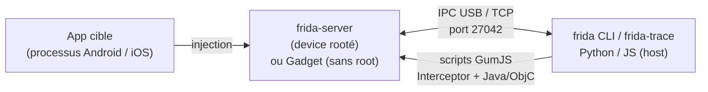

# Frida — Mobile & Reverse Engineering

> [!info] **En 1 phrase**
> Frida est la **boîte à outils d'instrumentation dynamique** de référence : il injecte du **JavaScript**
> dans une app mobile en cours d'exécution pour **intercepter des fonctions, contourner des protections**
> (root, SSL pinning) et observer le comportement, **sans recompiler l'APK**.

---

## Overview

| Champ | Valeur |
|---|---|
| Nom complet | Frida (framework d'instrumentation dynamique) |
| Description | Injection de JavaScript dans des processus (Android, iOS, Windows, macOS, Linux) pour hooker des fonctions, tracer les appels, lire/modifier la mémoire, contourner les protections |
| Catégorie | Mobile & Reverse Engineering |
| Sous-catégorie | Instrumentation dynamique (hook runtime) |
| Fonction principale | `frida-server` (device) + scripts JS injectés dans le processus cible |
| Type d'outil | Framework (bibliothèques C/JS/Python) + CLI (`frida`, `frida-trace`, `frida-ps`) |
| Licence | wxWindows Library Licence v3.1 (basée sur la LGPL) |
| Open source / propriétaire | Open source |
| Langage(s) de programmation | C, JavaScript (GumJS), Python, Swift/Objective-C (bindings), Rust |
| Développeur / organisation | Ole André Vadla Ravnås (oleavr) / Frida team (NowSecure) |
| Projet officiel | frida/frida |
| Dépôt officiel | https://github.com/frida/frida |
| Documentation officielle | https://frida.re/docs/ |
| Date de création | 2012 (premier commit public) |
| État du projet | actif (releases très fréquentes) |
| Dernière version connue | 17.17.0 (05/08/2026) |
| Systèmes compatibles | Android, iOS (jailbreak), Windows, macOS, Linux, QNX — plus barebone (kernel Linux/XNU) |

---

## Concept

Frida fonctionne en deux temps : un **agent** (moteur d'instrumentation) est injecté dans le processus cible, et un **client** (Python/CLI) communique avec lui par IPC (USB ou réseau). L'injection se fait soit via un **serveur privilégié** (`frida-server` sur device rooté/jailbreaké), soit via un **gadget** embarqué dans l'application elle-même (patched APK, sans root), soit via l'injection dynamique sur le host (Linux/macOS/Windows). Une fois l'agent en place, le moteur **GumJS** exécute du JavaScript dans le processus cible : `Interceptor.attach()` patche l'entrée d'une fonction pour appeler du code JS à l'aller (`onEnter`) et au retour (`onLeave`), `Java.use()` manipule les classes Java (Android), `ObjC.classes` les classes Objective-C (iOS).

Dans un engagement mobile, Frida permet de **neutraliser à chaud** les garde-fous : anti-root, anti-debug, anti-émulateur, SSL pinning — sans jamais toucher au binaire sur disque. Il se combine avec Burp (MITM après bypass du pinning), objection (surcouche de commandes métier), MobSF (analyse dynamique automatisée) et jadx/APKTool (analyse statique préalable pour cibler les classes à hooker). C'est aussi un outil standard d'analyse de malware : tracer les appels réseau, déchiffrer les strings en mémoire, dumper les classes et les objets.



---

## Concepts fondamentaux

| Concept | Explication |
|---|---|
| GumJS | Moteur JavaScript de Frida : exécute les scripts dans le processus cible (basé sur QuickJS/V8 suivant la plateforme) |
| Interceptor | Hook au niveau natif : `Interceptor.attach(target, { onEnter, onLeave })` remplace le prologue de la fonction |
| Java.use / Java.perform | Manipulation du runtime ART : instancier/replacer des méthodes Java (Android) |
| ObjC.classes | Accès aux classes Objective-C (iOS) : `ObjC.classes.NSURLSession` |
| `impl`.implementation | Remplacement d'une méthode par une implémentation JS : lecture des arguments, modification du retour |
| spawn vs attach | `-f` spawn : relance l'app en pause (hooks avant l'init) ; `-n` attach : s'attache à un processus en cours |
| frida-server | Démon qui tourne sur le device, écoute sur le port **27042** (27043 pour les traces) |
| Frida Gadget | Bibliothèque injectable dans une app (via `objection patchapk`) pour instrumenter sans root |
| Script RPC | Exposition de fonctions du script appelables depuis le host (Python ↔ JS) |
| Stalker | Traceur d'instructions : suit l'exécution instruction par instruction (coûteux) |
| Détection Frida | L'app peut scanner `/proc/self/maps` (strings `frida`, `gum-js-loop`, `gmain`) et tester le port 27042 |

---

## Installation

### Debian / Ubuntu / Kali Linux

```bash
pip3 install frida-tools frida
frida --version        # doit correspondre à la version du frida-server du device
```

### Windows

```powershell
pip install frida-tools frida
# Les binaires Windows de frida-server sont dans les releases GitHub
```

### Android (device rooté)

```bash
# Télécharger frida-server-<version>-android-<arch>.xz (arm64 pour la plupart des devices)
# depuis https://github.com/frida/frida/releases
adb push frida-server /data/local/tmp/
adb shell "chmod +x /data/local/tmp/frida-server"
adb shell "/data/local/tmp/frida-server &"     # écoute sur 27042
adb forward tcp:27042 tcp:27042
```

### iOS (jailbreak)

```bash
# Installer « Frida » depuis Cydia/Sileo → /usr/sbin/frida-server
# Puis : ssh root@<ip> ; frida-server &
```

> [!warning] Prérequis & problèmes potentiels
> - **Même version** entre `frida` (pip), `frida-tools` et `frida-server` : tout écart provoque `unable to connect to device` ou des crashs.
> - Sur device **non rooté**, `frida-server` ne peut pas injecter dans d'autres apps → utiliser le **Frida Gadget** (via `objection patchapk`).
> - Android 7+ : installer `frida-server` dans `/data/local/tmp` (exécutable) et non dans un dossier noexec.
> - iOS : nécessite un jailbreak (ou Corellium pour le cloud).
> - `pip3 install frida` fournit la bibliothèque Python ; `frida-tools` fournit les binaires CLI (`frida`, `frida-ps`, `frida-trace`…).

---

## Configuration

Frida n'a pas de gros fichier de configuration : la configuration passe par les **options CLI** et les **variables du device**.

| Paramètre | Rôle | Valeur possible | Impact | Exemple |
|---|---|---|---|---|
| `-U, --usb` | Device connecté en USB | flag | Cible le device USB | `frida -U -f com.example.app` |
| `-D, --device <id>` | Device par identifiant | `local`, `usb`, `remote`, `socket` | Sélection précise | `frida -D remote -f com.example.app` |
| `-H, --host <h:p>` | Connexion TCP à frida-server | `10.10.20.15:27042` | Device distant (réseau/pivot) | `frida -H 10.10.20.15:27042 -f com.example.app` |
| `-f, --file <pkg>` | Spawn de l'app (pause avant init) | package | Hooks précoces | `frida -U -f com.example.app` |
| `-n, --attach-name <nom>` | Attache à un processus par nom | nom du process | Attache à un process en cours | `frida -U -n MyApp` |
| `-l, --load <script>` | Charge un script JS au lancement | chemin .js | Hooks personnalisés | `frida -U -l hook.js -f com.example.app` |
| `--no-pause` | Ne pas mettre en pause après spawn | flag | Démarrage direct | `frida -U -f pkg --no-pause` |
| `-o, --output <f>` | Log du script dans un fichier | chemin | Journalisation | `frida -U -l hook.js -o log.txt -f pkg` |
| `-q, --quiet` | Mode silencieux | flag | Pas de banner | `frida -U -q -l hook.js -f pkg` |

---

## Architecture interne

- **frida-core** : cœur de Frida (C) — gestion des devices, injection, session, message passing.
- **Gum** : moteur d'instrumentation bas niveau (patching, inline hooks, Interceptor, Stalker).
- **GumJS** : moteur JavaScript (QuickJS) exécuté dans le processus cible, exposant les API (`Java`, `ObjC`, `Interceptor`, `Module`, `Memory`, `Process`).
- **frida-server** : démon côté device, écoute sur 27042 (27043 pour la trace), accepte les connexions du client, injecte l'agent dans les processus cibles.
- **frida-gadget** : bibliothèque statique/dynamique intégrée à l'app (APK patché) : modes `listen` (écoute), `connect` (client actif), `script` (script embarqué).
- **frida-tools** : CLI Python — `frida` (REPL), `frida-ps` (liste process), `frida-trace` (trace automatique), `frida-ls-devices`, `frida-kill`, `frida-discover` (discovery des imports), `frida-join`.
- **Transport** : protocole binaire maison sur TCP/Unix socket ; RPC entre le script JS et le host.
- **Barebone (17.17+)** : agent Rust + GumJS exécutable en module noyau Linux (`.ko`), transport `/dev/frida`.

---

## Commandes

### Commandes principales

| Commande | Objectif | Résultat attendu |
|---|---|---|
| `frida-ps -U` | Liste les processus du device | Noms + PID |
| `frida-ps -Ua` | Liste les apps installées | Packages Android |
| `frida-ls-devices` | Liste les devices (USB, local, remote) | IDs + types |
| `frida -U -f pkg` | Spawn (pause avant init) + attache | Shell interactif |
| `frida -U -n nom` | Attache à un processus en cours | Shell interactif |
| `frida -U -l script.js` | Exécute un script JS | Logs du script dans le terminal |
| `frida-trace -U -i "func"` | Trace tous les appels à `func` | Logs `onEnter`/`onLeave` automatiques |
| `frida-trace -U -m "+[NSURLSession *]"` | Trace des méthodes ObjC (iOS) | Logs des appels |
| `frida-discover -U -n MyApp` | Découvre les fonctions utilisées | Arborescence des imports |
| `frida-kill -U <pid>` | Tue un processus | Process terminé |

---

## Options et flags

| Option | Description | Exemple | Niveau |
|---|---|---|---|
| `-U` | Device USB | `frida -U -f pkg` | Basic |
| `-f <pkg>` | Spawn de l'app (pause) | `frida -U -f com.example.app` | Basic |
| `-n <nom>` | Attache à un process | `frida -U -n com.example.app` | Basic |
| `-l <script>` | Charge un script JS | `frida -U -l hook.js -f pkg` | Basic |
| `--no-pause` | Pas de pause après spawn | `frida -U -f pkg --no-pause` | Intermediate |
| `-o <fichier>` | Log dans un fichier | `frida -U -l hook.js -o log.txt -f pkg` | Intermediate |
| `-H <h:p>` | Host TCP (device distant) | `frida -H 10.10.20.15:27042 -f pkg` | Advanced |
| `-D <id>` | Device par ID | `frida -D remote -f pkg` | Advanced |
| `-q` | Quiet (pas de banner) | `frida -U -q -l hook.js -f pkg` | Advanced |
| `--runtime` | Moteur JS (quickjs/v8) | `frida -U --runtime=v8 -f pkg` | Expert |
| `-t <seconds>` | Durée de la session (frida-trace) | `frida-trace -U -f pkg -i "open" -t 60` | Expert |
| `--depth <n>` | Profondeur de la trace (frida-trace) | `frida-trace -U -f pkg -i "recv" --depth 3` | Expert |

---

## Exemples pratiques

### Beginner

```bash
# Objectif : vérifier la connexion au device et lister les apps
frida-ps -Ua
# Objectif : lancer l'app en pause et se connecter
frida -U -f com.example.app
```

### Intermediate

```js
// hook_root.js — Objectif : contourner une détection de root simple
Java.perform(function () {
    var RootCheck = Java.use("com.example.app.security.RootCheck");
    RootCheck.isRooted.implementation = function () {
        console.log("[+] isRooted() interceptée → false");
        return false;
    };
});
```

```bash
frida -U -l hook_root.js -f com.example.app
```

### Advanced

```js
// hook_login.js — Objectif : intercepter les identifiants du login
Java.perform(function () {
    var Login = Java.use("com.example.app.ui.LoginActivity");
    Login.login.implementation = function (user, pass) {
        console.log("[+] login(" + user + ", " + pass + ")");
        return this.login(user, pass);
    };
});
```

```bash
frida -U -l hook_login.js -f com.example.app
# Tester le login dans l'app : les identifiants apparaissent dans le terminal
```

### Expert

```js
// rpc_hooks.js — Objectif : exposer des fonctions via RPC pour piloter depuis le host
rpc.exports = {
    getLogin: function (user) {
        return new Promise(function (resolve) {
            Java.perform(function () {
                var Login = Java.use("com.example.app.ui.LoginActivity");
                resolve(Login.lastPass.value);
            });
        });
    }
};
```

```bash
frida -U -l rpc_hooks.js -f com.example.app
# Depuis le shell interactif : rpc.exports.getLogin("admin")
```

---

## Workflow complet (scénario pas à pas)

**Scénario : contourner la détection de root et intercepter la fonction de login.**

1. Lancer `frida-server` sur le device, puis vérifier :
   ```bash
   adb forward tcp:27042 tcp:27042
   frida-ps -U
   ```
2. Lister les packages : `frida-ps -Ua`.
3. Écrire le script `hook_root.js` :
   ```js
   Java.perform(function () {
       // 1. Contourner la détection de root (classe fictive de l'app)
       var RootCheck = Java.use("com.example.app.security.RootCheck");
       RootCheck.isRooted.implementation = function () {
           console.log("[+] isRooted() interceptée → false");
           return false;
       };
       // 2. Intercepter le login et logger les credentials
       var Login = Java.use("com.example.app.ui.LoginActivity");
       Login.login.implementation = function (user, pass) {
           console.log("[+] login(" + user + ", " + pass + ")");
           return this.login(user, pass);
       };
   });
   ```
4. Lancer l'app avec le script :
   ```bash
   frida -U -l hook_root.js -f com.example.app
   ```
5. Tester un login → les identifiants apparaissent dans le terminal.
6. Sans script, tracer les appels : `frida-trace -U -f com.example.app -i "login"`.

---

## Scénarios avancés

### Scénario 1 : bypass SSL Pinning d'un binaire natif

```js
Java.perform(function () {
    var m = Java.use("javax.net.ssl.HttpsURLConnection");
    m.setDefaultHostnameVerifier.implementation = function () {
        return Java.use("org.apache.http.conn.ssl.AllowAllHostnameVerifier").$new();
    };
    // Pinning natif : hooker les API OpenSSL/BoringSSL utilisées par le .so
    var ssl = Module.findExportByName("libssl.so", "SSL_set_verify");
    if (ssl) Interceptor.replace(ssl, new NativeCallback(function (ssl, mode) {
        console.log("[+] SSL_set_verify(" + ssl + ", " + mode + ") → 0");
        return 0;
    }, "int", ["pointer", "int"]));
});
// Couplé à un proxy (Burp/mitmproxy) pour intercepter le trafic HTTPS.
```

### Scénario 2 : extraction de clés API et secrets en runtime

```js
Java.perform(function () {
    var Crypt = Java.use("com.example.app.CryptoHelper");
    Crypt.decrypt.implementation = function (data) {
        var result = this.decrypt(data);
        console.log("[+] plaintext : " + result);
        return result;
    };
    // Dumper les strings chargées en mémoire
    Process.enumerateModules().forEach(function (m) {
        console.log(m.name + " @ " + m.base + " (" + m.size + ")");
    });
});
// Journalise les données déchiffrées pour retrouver clés et tokens.
```

### Scénario 3 : contournement anti-émulateur

```js
Java.perform(function () {
    var Build = Java.use("android.os.Build");
    Build.MODEL.value = "Pixel 5";
    Build.MANUFACTURER.value = "Google";
    Build.HARDWARE.value = "redfin";
    Build.FINGERPRINT.value = "google/redfin/redfin:15/A3B4C5/12345678:user/release-keys";
});
// Masque l'émulateur pour les apps qui bloquent l'analyse en lab.
```

---

## Cybersecurity use cases

| Phase | Utilisation |
|---|---|
| Reverse engineering dynamique | Hook des fonctions clés (crypto, réseau), lecture des arguments/résultats |
| Test d'intrusion mobile | Bypass SSL pinning, anti-root, anti-émulateur ; MITM via Burp |
| Analyse de malware | Tracer les appels réseau/API, déchiffrer les strings en mémoire, dump d'objets |
| Extraction de secrets | Récupération de clés API, tokens, identifiants au runtime |
| Post-exploitation mobile | Hooks persistants (gadget), persistence d'instrumentation sur app patched |

---

## MITRE ATT&CK

| Tactique | Technique / Sub-technique | ID | Raison | Détection | Mitigation |
|---|---|---|---|---|---|
| Defense Evasion | Process Injection | T1055 | Le Gadget/agent Frida est injecté dans le processus cible | Scan `/proc/self/maps` (gadget, frida, gum-js-loop), hooks inline repérés | Anti-instrumentation, attestation |
| Defense Evasion | Debugger Evasion | T1622 | Bypass des checks anti-debug/anti-root pour poursuivre l'analyse | Détection des artefacts Frida (port 27042, fichiers /data/local/tmp) | Renforcer anti-tamper |
| Defense Evasion | Virtualization/Sandbox Evasion : System Checks | T1497.001 | Contournement de la détection d'émulateur (Build.* patchés) | Heuristiques d'émulation + cohérence des propriétés | Attestation matérielle (Play Integrity) |
| Credential Access | Credentials from Password Stores | T1555 | Extraction de clés/tokens via dump mémoire et hook des APIs crypto | Monitoring des accès anormaux au keystore | Hardware keystore / StrongBox |
| Credential Access | Unsecured Credentials : Credentials In Files | T1552.001 | Récupération de secrets hardcodés au runtime | Revue des secrets | Gestion des secrets côté serveur |
| Collection | Data from Local System | T1005 | Dump du tas et des fichiers locaux de l'app | Surveillance des accès aux fichiers de l'app | Sandbox, chiffrement des données au repos |

---

## Defensive Security

### Signes observables

| Indicateur | Détail |
|---|---|
| Artefacts Frida dans `/proc/self/maps` | Libs `frida-gadget`, `gum-js-loop`, `gmain`, `gum` — la détection classique |
| Port 27042/27043 ouvert sur le device | `frida-server` écoute : scanner le port en interne |
| Processus anormaux (`frida-server`) | Processus inattendu dans `/data/local/tmp` |
| Fichiers suspects | `/data/local/tmp/frida-server`, `libfrida-gadget.so`, `agent.js` |
| Délais anormaux / hooks détectés | `TracerPid` non nul, exécution ralentie (instrumentation) |
| Réseau | Connexions USB/ADB répétées, proxy MITM positionné |

### Règles de détection (Sigma / Suricata / Snort / YARA)

```yaml
# Sigma — Android : présence de frida-server
title: Frida Server Running on Android
id: 9a3c5d7e-1b2c-4d3e-8f4a-5b6c7d8e9f01
status: test
logsource:
    category: process_creation
    product: android
detection:
    selection:
        CommandLine|contains:
            - 'frida-server'
            - '/data/local/tmp/frida'
    condition: selection
falsepositives:
    - Reverse engineering légitime en lab
level: high
```

---

## Automatisation

```bash
# Bash — déployer frida-server sur un device et vérifier la version
VERSION=17.17.0
adb push frida-server-$VERSION-android-arm64 /data/local/tmp/frida-server
adb shell "chmod +x /data/local/tmp/frida-server"
adb shell "nohup /data/local/tmp/frida-server &"
adb forward tcp:27042 tcp:27042
frida-ps -U
```

```python
# Python — hook automatisé via l'API Python de Frida
import frida

def on_message(message, data):
    print("[message]", message)

device = frida.get_usb_device()
pid = device.spawn(["com.example.app"])
session = device.attach(pid)
script = session.create_script("""
Java.perform(function () {
    var RootCheck = Java.use("com.example.app.security.RootCheck");
    RootCheck.isRooted.implementation = function () { return false; };
});
""")
script.on("message", on_message)
script.load()
device.resume(pid)
input()  # attendre, puis Ctrl+C
```

---

## Output et parsing

Frida ne produit pas de format de rapport structuré : la sortie est le **log des scripts** (stdout) et les traces de `frida-trace`. Les données utiles s'extraient via le script JS lui-même (JSON.stringify, envoi de messages structurés).

```js
// Script : envoyer des messages JSON structurés au host
Java.perform(function () {
    var Login = Java.use("com.example.app.ui.LoginActivity");
    Login.login.implementation = function (u, p) {
        send({ type: "creds", user: u, pass: p });
        return this.login(u, p);
    };
});
```

```python
# Python : collecter les messages JSON
import frida, json, sys

def on_message(msg, data):
    if msg.get("type") == "send":
        payload = msg.get("payload")
        if isinstance(payload, dict) and payload.get("type") == "creds":
            json.dump(payload, sys.stdout)
            print()
```

---

## Intégrations

```text
jadx (statique : classes à hooker) → Frida (hooks JS) → Burp Suite (MITM) → objection (commandes métier)
MobSF (analyse dynamique) → utilise Frida en interne (instrument, api_monitor)
```

- [[Tools| Outils]] global
- [[Outil - objection| objection]] — surcouche Frida : commandes clic-bouton, `patchapk`
- [[Outil - jadx| jadx]] — localiser les classes/méthodes à hooker en statique
- [[Outil - APKTool| APKTool]] — repackage/analyse statique complémentaire
- [[Outil - MobSF| MobSF]] — intégration Frida pour l'analyse dynamique automatisée
- [[Outil - Burp Suite| Burp Suite]] — interception après bypass du pinning
- [[Techniques/Insecure Deserialization| Désérialisation]] · [[Techniques/Password Cracking| Cracking]]
- [[09 - Reverse Engineering & Malware| Reverse & Malware]]

---

## Alternatives

| Outil | Avantages | Inconvénients | Cas d'usage |
|---|---|---|---|
| [[Outil - objection|objection]] | Commandes métier prêtes (sslpinning disable, dump heap) | Moins flexible que des scripts Frida bruts | Audit rapide clic-bouton |
| Xposed/LSPosed | Hooks persistants système (framework) | Root + module, moins portable | Modding, persistence |
| Substrate | Hooks natifs/Java historiques | Moins maintenu, moins riche | Anciennes apps |
| r2frida | Frida via radare2 : analyse + instrumentation | Courbe d'apprentissage r2 | Analyse hybride statique/dynamique |
| Drozer | Interactions avec les composants Android | Pas d'instrumentation de code | Test des composants exposés |

---

## Performance

- L'injection d'un script Frida ajoute **quelques dizaines de ms** au démarrage de l'app en spawn.
- `Interceptor.attach` sur une fonction chaude (appelée très souvent) ralentit l'exécution : privilégier des hooks ciblés.
- Le **Stalker** (trace instruction par instruction) est **très coûteux** : à réserver aux analyses ponctuelles.
- `frida-trace` est raisonnable pour des fonctions peu appelées ; les traces massives génèrent de gros volumes de logs.
- Mémoire : chaque script JS injecté consomme une partie du tas du processus cible (à surveiller sur les apps gourmandes).

---

## Troubleshooting

### Common problems

#### Problème : `unable to connect to device`

- **Cause** : `frida-server` ne tourne pas, version incompatible, ou ADB non forwardé.
- **Solution** : `adb forward tcp:27042 tcp:27042`, lancer `frida-server` (sans `&` pour voir les logs), vérifier `frida --version` == version server.
- **Vérification** : `frida-ls-devices` doit lister le device USB.

#### Problème : l'app détecte Frida et se ferme

- **Cause** : detection par maps/port/strings.
- **Solution** : renommer les artefacts (`frida-server-17.17.0` → autre nom), patch du fichier, hooker la fonction de détection, ou utiliser le gadget en mode `script` embarqué.
- **Vérification** : relancer l'app et observer le logcat.

#### Problème : crash du process au chargement du script

- **Cause** : signature de méthode erronée, hook sur une classe inexistante, runtime JS trop récent/vieux.
- **Solution** : simplifier le script, valider chaque étape (`Module.findExportByName` retourne null ?), tester avec `--runtime=quickjs`.
- **Vérification** : logs du script (`console.log`) pas à pas.

---

## Sécurité de l'outil

- **Permission** : `frida-server` nécessite root (Android/iOS) — installer uniquement sur des devices d'analyse dédiés.
- **Secrets** : les scripts qui loggent des credentials doivent être effacés après l'engagement (fichiers en clair, historique shell).
- **Malware** : instrumenter un malware réel sur un device réel expose le système : utiliser un émulateur/VM isolé.
- **Risque d'exécution** : Frida exécute du code dans le processus cible : un hook mal écrit peut corrompre l'app et les données.

---

## Limitations

- Nécessite un **device rooté/jailbreaké** pour instrumenter d'autres apps (sinon gadget intégré à l'app, signature cassée).
- Les **apps durcies** (obfuscation native, vérification de stack, anti-Frida avancé) compliquent l'instrumentation.
- Le **Stalker** est très lent sur du code volumineux.
- Frida ne remplace pas l'**analyse statique** : il faut d'abord comprendre le code (jadx/Ghidra) pour cibler les hooks.
- Les versions changent vite : un script écrit pour la 16.x peut casser sur la 17.x (API GumJS).

---

## Cheatsheet

```bash
# Déploiement frida-server (Android)
adb push frida-server /data/local/tmp/
adb shell "chmod +x /data/local/tmp/frida-server"
adb shell "/data/local/tmp/frida-server &"
adb forward tcp:27042 tcp:27042

# Connexion
frida-ps -Ua                          # lister les apps
frida -U -f com.example.app           # spawn (pause avant init)
frida -U -n ProcessName               # attach
frida -U -l hook.js -f com.example.app  # charger un script

# Trace rapide
frida-trace -U -f com.example.app -i "strcmp" -i "open"

# Device distant
frida -H 10.10.20.15:27042 -f com.example.app -l hook.js
```

---

## Quick reference

| | |
|---|---|
| **À quoi sert-il ?** | Instrumentation dynamique : hook de fonctions, bypass de protections, trace, dump mémoire |
| **Quand l'utiliser ?** | Audit mobile : SSL pinning, anti-root, analyse de secrets, analyse de malware |
| **Commande principale** | `frida -U -l hook.js -f com.example.app` |
| **Alternative principale** | [[Outil - objection|objection]] (commandes prêtes), Xposed (persistance) |
| **Concepts importants** | frida-server, Gadget, Interceptor, Java.use, spawn/attach, GumJS |
| **Liens associés** | [[Outil - objection]] · [[Outil - jadx]] · [[Outil - MobSF]] · [[Outil - Burp Suite]] |

---

## Détection & Défense

| Signe | Défense |
|---|---|
| Artefacts Frida dans `/proc/self/maps` | Scan des maps pour `frida`, `gum-js-loop`, `gmain` |
| Port 27042/27043 ouvert | Scanner le device en interne, blocage réseau du port |
| Fichier `frida-server` dans `/data/local/tmp` | Détection de fichier + checksum |
| Comportement anormal de l'app (hooks) | Vérification de l'intégrité des fonctions natives, anti-tamper |
| MITM (proxy Burp) en place | Pinning natif dans le `.so` + vérification du hostname |
| `TracerPid` non nul dans `/proc/self/status` | Alerte sur processus tracé |

---

## Tips & Pièges

> [!tip] **Spawn plutôt qu'attacher**
> `frida -U -f pkg` exécute l'app en pause : les checks anti-Frida faits à l'init n'ont pas encore tourné. Pour les hooks précoces, c'est la seule méthode fiable.

> [!warning] **Hook sur une classe inexistante**
> Une signature erronée fait échouer le script en silence. Vérifie le chemin exact des classes avec `objection android hooking list classes` ou `frida-trace -U -f pkg -i "isRooted"`.

> [!warning] **La détection Frida est courante**
> Les apps durcies scannent les maps et le port 27042 : prévoir de renommer les artefacts et de hooker les fonctions de détection.

---

## References

### Official

- Documentation officielle : https://frida.re/docs/
- GitHub officiel (core) : https://github.com/frida/frida
- GitHub frida-tools : https://github.com/frida/frida-tools
- Référence JavaScript (GumJS) : https://frida.re/docs/javascript-api/

### Security references

- MITRE ATT&CK T1055 — Process Injection : https://attack.mitre.org/techniques/T1055/
- MITRE ATT&CK T1622 — Debugger Evasion : https://attack.mitre.org/techniques/T1622/
- MITRE ATT&CK T1497 — Virtualization/Sandbox Evasion : https://attack.mitre.org/techniques/T1497/
- MITRE ATT&CK T1555 — Credentials from Password Stores : https://attack.mitre.org/techniques/T1555/

### Community

- Mobile Security Testing Guide (OWASP) : https://mas.owasp.org/
- HackTricks — Frida cheatsheet : https://book.hacktricks.xyz/mobile-pentesting/android-app-pentesting/frida-tutorial

---

**Liens :** [[Tools| Outils]] · [[Outil - objection| objection]] · [[Outil - jadx| jadx]] · [[Outil - APKTool| APKTool]] · [[Outil - MobSF| MobSF]] · [[Outil - Burp Suite| Burp Suite]] · [[Techniques/Hardware - Dump et Analyse de Firmware| Dump de firmware]] · [[Techniques/Insecure Deserialization| Désérialisation]]
