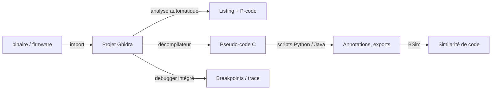

# 🧬 Ghidra — Mobile & Reverse Engineering

> [!info] **En 1 phrase**
> **Ghidra** est le framework de **reverse engineering** open-source de la NSA : analyseur de binaires,
> **décompilateur C** de très haute qualité, GUI Java, gestion de projets et plugins extensibles.

---

## 🧾 Overview

| Champ | Valeur |
|---|---|
| Nom complet | Ghidra (Software Reverse Engineering framework) |
| Description | Suite complète de reverse : import de binaires (ELF, PE, Mach-O, DEX, firmware), désassemblage, décompilation C, debugger, scripting, version tracking |
| Catégorie | 📱 Mobile & Reverse Engineering |
| Sous-catégorie | Reverse engineering statique + dynamique (debugger) |
| Fonction principale | Analyse de binaires avec décompilation C (moteur P-code/SLEIGH) |
| Type d'outil | GUI desktop (Java/Swing) + CLI headless (`analyzeHeadless`) |
| Licence | Apache License 2.0 |
| Open source / propriétaire | Open source |
| Langage(s) de programmation | Java (86%), C++ (décompilateur), Python (Jython, PyGhidra) |
| Développeur / organisation | National Security Agency (NSA) |
| Projet officiel | NationalSecurityAgency/ghidra |
| Dépôt officiel | https://github.com/NationalSecurityAgency/ghidra |
| Documentation officielle | https://ghidra-sre.org/ + wiki GitHub |
| Date de création | Première release publique le 5 mars 2019 (RSA Conference) ; développement interne depuis ~2003 |
| État du projet | actif |
| Dernière version connue | 12.1.2 (05/06/2026) |
| Systèmes compatibles | Linux, Windows, macOS (x64 + Apple Silicon) — requiert JDK 21 64-bit |

---

## 🎯 Concept

Ghidra importe presque tout (PE, ELF, Mach-O, dex, java class, firmware brut, microcontrôleurs) et reconstruit automatiquement les fonctions, les structures et le **pseudo-code C**. Contrairement à IDA, il est gratuit, multi-plateforme et **scriptable en Python (Jython)** et Java. On l'utilise pour comprendre un binaire, retrouver un algorithme, décoder un protocole ou préparer un exploit. Le travail se fait dans un **projet** : on importe des fichiers, on lance l'analyse, on annote et on exporte.

Dans un workflow de reverse engineering, Ghidra couvre toute la chaîne : **analyse statique** (désassemblage, décompilation, structures), **annotation** (renommage, types, commentaires) et **automation** (scripts Jython, analyse headless en CI). Son atout différenciant est le **P-code** : un langage intermédiaire indépendant de l'architecture sur lequel s'appuient tous les plugins et analyses, ce qui permet d'écrire une analyse une seule fois pour toutes les architectures supportées. Il se positionne face à radare2/Cutter (scriptable mais moins assisté) et à IDA (payant mais plus mature sur le tri automatique).

L'écosystème de plugins est vaste : `GhidraJupyter` (analyse interactive en notebook), `GhidraGhidra` (décompilation dans les tests), les scripts `DecompileAll.java` fournis pour la décompilation en masse, ou les plugins d'obfuscation/deobfuscation. Pour le mobile, Ghidra lit les `.dex` et reconstruit les classes, mais jadx reste plus confortable pour naviguer le Java ; Ghidra excelle sur les binaires natifs. Enfin, le mode **headless** (`analyzeHeadless`) permet d'intégrer l'analyse dans un pipeline CI et de traiter de gros lots d'échantillons (malware) sans ouvrir la GUI.



---

## 🧠 Concepts fondamentaux

| Concept | Explication |
|---|---|
| Projet Ghidra | Conteneur de fichiers importés + métadonnées d'analyse ; le code analysé n'est pas modifié sur disque |
| P-code | Langage intermédiaire de Ghidra (SLEIGH) : chaque instruction assembleur est traduite en micro-opérations indépendantes de l'architecture |
| SLEIGH | Langage de description des jeux d'instructions : définit l'encodage binaire → P-code pour chaque architecture |
| Décompilateur | Reconstruit du pseudo-C depuis le P-code (DLL/processus `decompile` en C++) |
| Listing | Vue désassemblée annotée : adresses, opcodes, commentaires, xrefs |
| Xrefs (X) | Références vers/depuis une adresse : remonter d'une string à son code d'usage |
| GhidraScript | API Java (`import ghidra.app.script.*`) ; scripts exécutables dans la GUI ou headless |
| Jython | Interpréteur Python 2 embarqué (historique) ; **PyGhidra** (Python 3) en option depuis 11.x |
| BSim | Base de signatures de code : recherche de similarités entre fonctions (malware vs référentiel) |
| Debugger | Depuis Ghidra 10 : debug local (ptrace/WinDbg) et remote (GDB, WinDbg), breakpoints, trace |
| analyzeHeadless | Mode CLI : import + scripts sans GUI, pour CI et batch |

---

## 🛠️ Installation

### Debian / Ubuntu / Kali Linux

```bash
# Prérequis : JDK 21 64-bit
sudo apt install -y openjdk-21-jdk
# Télécharger ghidra_12.1.2_PUBLIC_*.zip depuis https://ghidra-sre.org/
unzip ghidra_*_PUBLIC_*.zip -d /opt/
/opt/ghidra_*/ghidraRun
```

### Windows

```powershell
# 1) Installer le JDK 21 (Adoptium Temurin) : https://adoptium.net
# 2) Télécharger ghidra_12.1.2_PUBLIC_*.zip
# 3) Extraire puis lancer ghidraRun.bat
```

### Docker

```bash
docker pull blacktop/ghidra   # image communautaire
docker run --rm -v "$PWD":/work blacktop/ghidra analyzeHeadless /work p -import /work/app.bin
```

### Compilation depuis les sources

```bash
git clone https://github.com/NationalSecurityAgency/ghidra && cd ghidra
gradle -I gradle/support/fetchDependencies.gradle init
gradle buildGhidra
# gradle.buildGhidra.sh (Linux/macOS) ou gradle.bat (Windows)
```

> [!warning] ⚠️ Prérequis & problèmes potentiels
> - **JDK 21** obligatoire (les anciens JDK 11/17 font échouer le lancement).
> - L'archive zip doit être extraite avec un outil qui préserve les permissions (Linux/macOS : `unzip`).
> - RAM : compter **4 Go minimum**, 16+ Go recommandés pour les gros firmwares.
> - Windows : installer via le zip (pas de msi officiel) ; penser à définir `JAVA_HOME`.

---

## ⚙️ Configuration

| Paramètre | Rôle | Valeur possible | Impact | Exemple |
|---|---|---|---|---|
| `JAVA_HOME` | JDK utilisé par Ghidra | chemin du JDK 21 | Lancement de l'outil | `export JAVA_HOME=/usr/lib/jvm/java-21-openjdk` |
| `GHIDRA_INSTALL_DIR` | Répertoire d'installation (scripts/API) | chemin | Scripts externes (PyGhidra) | `export GHIDRA_INSTALL_DIR=/opt/ghidra_12.1.2_PUBLIC` |
| Options d'analyse | Analysers activés au lancement | cases à cocher | Qualité/vitesse de l'analyse | décocher DWARF si pas de debug info |
| Fichiers de pré-script | Scripts à lancer avant analyse | `.java` | Préparation du binaire | `-preScript PreProcess.java` |
| Fichiers de post-script | Scripts après analyse | `.java` | Export/annotation | `-postScript DecompileAll.java` |
| PDB/DWARF | Import des symboles de debug | chemin | Noms de fonctions réels | activer dans les options du binaire |

---

## 🏗️ Architecture interne

- **Fondations** : `GhidraFramework` (Java), `db` (base de données de programme), `util` (modèle de données), `project` (gestion de projets).
- **Décompilateur** : processus séparé en C++ (`decompile`) qui lit le P-code et produit le pseudo-C ; interface JNI avec la GUI.
- **SLEIGH** : compilateur de jeux d'instructions → P-code ; modules par architecture (x86, ARM, MIPS, PPC, RISC-V, AVR, MSP430…).
- **Analyzers** : analyseurs Java exécutés après l'import (recherche de fonctions, strings, types, SSA, propagation symbolique…).
- **Debugger** : depuis Ghidra 10, module de debug avec backends GDB/WinDbg et modèle de trace.
- **Scripting** : Jython (Python 2, embarqué) et PyGhidra (Python 3, installation séparée) ; GhidraScript Java.
- **BSim** : calcul de signatures de fonctions, stockées dans une base PostgreSQL/Elasticsearch pour recherche de similarité.
- **Outils** : `ghidraRun`, `analyzeHeadless`, `svrAdmin` (serveur), `PyGhidra`, `Ghidra Server` (collaboration).

---

## ⌨️ Commandes

### Commandes principales

| Commande | Objectif | Résultat attendu |
|---|---|---|
| `ghidraRun` | Ouvre la GUI (Project Manager + CodeBrowser) | GUI prête à importer |
| `analyzeHeadless <dir> <proj> -import <f>` | Analyse en CLI d'un fichier | Projet + analyse faits sans GUI |
| `-import <répertoire>` | Importe tout un dossier | Analyse récursive avec `-recursive` |
| `-process <nom>` | Analyse un fichier déjà importé | Reprocess sans ré-import |
| `-analysisTimeoutPerFile <s>` | Timeout d'analyse par fichier | Évite les blocages sur gros binaires |
| `-preScript / -postScript` | Scripts avant/après analyse | Automation (export, annotation) |
| `-scriptPath <dir>` | Répertoires de scripts supplémentaires | Scripts custom chargés |
| `-deleteProject` | Supprime le projet après analyse | Nettoyage CI |
| `-noanalysis` | Importe sans analyser | Import brut rapide |
| `-log <f>` | Log dans un fichier | Diagnostic batch |

### Commandes avancées

```bash
# Batch sur un dossier de malwares, avec timeout et export
/opt/ghidra_*/support/analyzeHeadless /tmp/ana batch -import ./samples/ \
  -recursive -analysisTimeoutPerFile 600 \
  -postScript DecompileAll.java -scriptPath /opt/ghidra_*/Ghidra/Features/Decompiler/ghidra_scripts/
# Reprocess d'un fichier déjà dans le projet
/opt/ghidra_*/support/analyzeHeadless /tmp/ana p -process app.bin \
  -postScript ExportFunctions.java -scriptPath ./scripts
```

---

## 🎚️ Options et flags

| Option | Description | Exemple | Niveau |
|---|---|---|---|
| `-import <f>` | Fichier ou dossier à importer | `-import app.bin` | Basic |
| `-recursive` | Import récursif d'un dossier | `-import samples/ -recursive` | Basic |
| `-analysisTimeoutPerFile <s>` | Timeout par fichier | `-analysisTimeoutPerFile 600` | Intermediate |
| `-preScript <s>` | Script avant analyse | `-preScript PreAnalyze.java` | Intermediate |
| `-postScript <s>` | Script après analyse | `-postScript DecompileAll.java` | Intermediate |
| `-scriptPath <dir>` | Répertoire de scripts | `-scriptPath ./ghidra_scripts` | Intermediate |
| `-process <nom>` | Analyser un fichier du projet | `-process sample_1.bin` | Advanced |
| `-deleteProject` | Supprimer le projet en fin de batch | `-deleteProject` | Advanced |
| `-noanalysis` | Importer sans analyser | `-noanalysis` | Advanced |
| `-overwrite` | Écraser un fichier déjà importé | `-overwrite` | Advanced |
| `-log <f>` | Fichier de log | `-log batch.log` | Advanced |
| `-scriptlog <f>` | Log des scripts | `-scriptlog script.log` | Expert |
| `-project <chemin>` | Chemin du projet partagé | `-project gh idra://server/rep` | Expert |

> [!tip] Options les plus utiles au quotidien
> `-analysisTimeoutPerFile` (éviter les blocages), `-postScript DecompileAll.java` (export en masse), `-recursive` (lots), `-deleteProject` (CI propre).

---

## 🧪 Exemples pratiques

### Beginner

```bash
# Objectif : ouvrir un ELF et lire sa décompilation
ghidraRun
# File → New Project → importer le binaire → Auto Analysis
# G → main ; onglet Decompiler ; X sur un symbole pour les xrefs
```

### Intermediate

```bash
# Objectif : décompiler toutes les fonctions en headless
/opt/ghidra_*/support/analyzeHeadless /tmp/p test -import app.bin \
  -postScript DecompileAll.java -scriptPath /opt/ghidra_*/Ghidra/Features/Decompiler/ghidra_scripts/
# Résultat : app.c à côté du binaire
```

### Advanced

```bash
# Objectif : décompilation en masse d'un répertoire de malwares
/opt/ghidra_*/support/analyzeHeadless /tmp/analyses batch -import ./malware/ \
  -recursive -analysisTimeoutPerFile 600 -postScript DecompileAll.java \
  -scriptPath /opt/ghidra_*/Ghidra/Features/Decompiler/ghidra_scripts/
# Puis grep sur les appels API (CreateRemoteThread, VirtualAlloc...)
grep -rE "CreateRemoteThread|VirtualAlloc" /tmp/analyses/batch/*.c
```

### Expert

```bash
# Objectif : analyse headless avec script Python PyGhidra
ghidra.app.util.python.PyGhidra -i /opt/ghidra_* # install PyGhidra
python3 -m pip install pyghidra
python3 -c "
import pyghidra
pyghidra.start()
with pyghidra.open_program('/tmp/app.bin') as flat:
    api = flat.flat_api
    for fn in api.listFunctions():
        print(fn.getName())
"
```

---

## 🧪 Workflow complet (scénario pas à pas)

**Scénario : comprendre la fonction `main` d'un ELF et extraire son pseudo-code.**

1. **Créer le projet** : `ghidraRun` → `File → New Project` → importer le binaire (ELF x86-64).
2. **Lancer l'analyse automatique** : bouton *Auto Analysis* (options par défaut).
3. **Naviguer vers main** : dans le listing, `G → main` (ou `G → 0x401000`).
4. **Lire la décompilation** : onglet *Decompiler* → le pseudo-code C de `main` apparaît.
5. **Annoter** : renommer les variables (`L` = local, `M` = paramètre) pour rendre le code lisible.
6. **Rechercher les strings** : `Ctrl+Maj+F` → "flag", "password" → navigation directe, puis suivre les xrefs.
7. **Exporter** : `File → Export` → C/C++ (ou via script Python).

```bash
# Décompilation headless de toutes les fonctions d'un binaire :
/opt/ghidra_*/support/analyzeHeadless /tmp/p project -import app.bin \
  -postScript DecompileAll.java -scriptPath /opt/ghidra_*/Ghidra/Features/Decompiler/ghidra_scripts/
# (DecompileAll.java est fourni avec Ghidra → produit app.c)
```

---

## 🎬 Scénarios avancés

### Scénario 1 : décompilation en masse d'un échantillon de malwares

```bash
# Batch sur un répertoire de binaires suspects, avec timeout par fichier
/opt/ghidra_*/support/analyzeHeadless /tmp/analyses batch -import ./malware/ \
  -recursive -analysisTimeoutPerFile 600 -postScript DecompileAll.java \
  -scriptPath /opt/ghidra_*/Ghidra/Features/Decompiler/ghidra_scripts/
```
Résultat : un `.c` par binaire, puis `grep` sur les appels API (CreateRemoteThread, VirtualAlloc...) pour trier les échantillons.

### Scénario 2 : tracer un appel système vers sa fonction dans un firmware

```bash
# Dans la GUI :  Window → Decompiler → clic droit sur l'appel système
# References → Find References To → suivre les xrefs (X) vers le code qui l'utilise
# Puis Search → For Strings... pour ancrer le contexte (noms de protocole, magics)
```

### Scénario 3 : analyse collaborative avec BSim (similarité de code)

```bash
# 1) Créer une base BSim : svrAdmin or GUI → File → New BSim Database
# 2) Après analyse : Window → BSim → Search For Similar Functions
# Résultat : retrouve des fonctions connues (ex : libc, plugins) dans le binaire analysé
```

---

## 🛡️ Cybersecurity use cases

| Phase | Utilisation |
|---|---|
| Reverse engineering statique | Désassemblage + décompilation C de binaires natifs |
| Analyse de malware | Batch headless, extraction des C2 et APIs, similarité BSim |
| Préparation d'exploit | Compréhension du flux, identification des checks, offsets |
| Analyse de firmware | Import de dump brut, architectures embarquées (ARM, MIPS, AVR) |
| Analyse mobile | Lecture des `.dex`/`.so` (natif) ; jadx reste meilleur pour le Java pur |
| CTF | Découverte de flags/algo depuis le pseudo-code C |

---

## 🎯 MITRE ATT&CK

| Tactique | Technique / Sub-technique | ID | Raison | Détection | Mitigation |
|---|---|---|---|---|---|
| Execution | Native API | T1106 | Analyse des appels aux API natives pour comprendre le comportement | — | — |
| Defense Evasion | Obfuscated Files or Information | T1027 | Décompilation de code obfusqué/packé en vue de l'analyse | — | Renforcer l'obfuscation |
| Defense Evasion | Debugger Evasion | T1622 | Le debugger de Ghidra contourne les checks anti-debug (ptrace, timing) | `TracerPid`, checks de timing | Anti-debug + monitoring |
| Discovery | Software Discovery : Security Software Discovery | T1518.001 | Analyse des imports pour identifier les libs/protections | — | — |
| Collection | Data from Local System | T1005 | Extraction de données/secrets depuis le binaire analysé | — | Gestion des secrets |

---

## 🛡️ Defensive Security

### Signes observables

| Indicateur | Détail |
|---|---|
| Binaire avec flux simple, adresses en clair | Obfuscation de flux (LLVM Obfuscator, opaque predicates) → décompilateur dégradé |
| Code exécutable non virtualisé | Virtualisation (VMProtect/Themida) → le code n'existe pas en clair |
| Listing exploitable sans patch | Anti-disassembly : bytecode invalide, jump tables → listing trompeur |
| Firmware accessible en clair | Compression/chiffrement du firmware → dump d'abord, unpack ensuite |
| Debug sans résistance | Anti-debug : checks ptrace / timing → patcher le binaire avant analyse |

### Règles de détection (Sigma / Suricata / Snort / YARA)

```yaml
# Sigma — Windows : exécution de Ghidra (analyzeHeadless / ghidraRun)
title: Ghidra Execution
id: 3d9e4f8a-2b1c-4e5d-9a6f-7b8c9d0e1f2a
status: test
logsource:
    category: process_creation
    product: windows
detection:
    selection:
        Image|endswith:
            - '\ghidraRun.bat'
            - '\analyzeHeadless.bat'
        CommandLine|contains: 'ghidra'
    condition: selection
falsepositives:
    - Reverse engineering légitime en lab
level: medium
```

---

## 🤖 Automatisation

```bash
# Bash — boucle d'analyse headless sur plusieurs binaires avec exports
for f in samples/*.bin; do
    name=$(basename "$f")
    /opt/ghidra_*/support/analyzeHeadless /tmp/proj "${name}_proj" \
      -import "$f" -analysisTimeoutPerFile 300 \
      -postScript DecompileAll.java \
      -scriptPath /opt/ghidra_*/Ghidra/Features/Decompiler/ghidra_scripts/ \
      -deleteProject
done
```

```python
# Python — PyGhidra : décompiler une fonction et exporter
import pyghidra

pyghidra.start()
with pyghidra.open_program("/tmp/app.bin") as flat:
    api = flat.flat_api
    func = api.getFunction("main")
    if func is not None:
        # décompilation via le décompilateur headless
        print(flat.decompileFunction(func, 60, flat.monitor).getDecompiledFunction().getC())
```

---

## 📤 Output et parsing

Ghidra exporte en C/C++, texte, XML (program files) et binaire (projets). En headless, les scripts produisent des fichiers texte/JSON parsables.

```bash
# Export C d'un programme via la GUI
File → Export → C/C++
# Headless : le script DecompileAll.java produit fichier.c
# Parsing des fonctions exportées
grep -nE "^[a-zA-Z_].*\(.*\)$" app.c | head -40
```

```python
# Python — analyser la sortie de DecompileAll.java
import re, glob

calls = {}
for path in glob.glob("/tmp/ana/**/*.c", recursive=True):
    with open(path, encoding="utf-8", errors="ignore") as fh:
        for line in fh:
            for m in re.findall(r"\b([A-Za-z_]\w*)\s*\(", line):
                calls[m] = calls.get(m, 0) + 1
for name, n in sorted(calls.items(), key=lambda x: -x[1])[:20]:
    print(f"{n:5d}  {name}")
```

---

## 🔗 Intégrations

```text
Ghidra (analyse) → Python/PyGhidra (automation) → BSim (similarité) → rapports
Ghidra (décompilateur) → Cutter/radare2 (plugin r2ghidra) → exploitation (pwntools)
```

- [[Tools|🧰 Outils]] global
- [[Outil - radare2|🧬 radare2]] — alternative CLI ; `pdd` utilise le même décompilateur (r2ghidra)
- [[Outil - Cutter|🧬 Cutter]] — GUI légère embarquant r2ghidra
- [[Outil - jadx|📱 jadx]] — meilleur pour le Java décompilé (dex) ; Ghidra pour le natif
- [[Outil - pwntools|🧩 pwntools]] — exploitation après la compréhension du binaire
- [[Outil - ROPgadget|🧱 ROPgadget]] — gadgets pour chaînes ROP
- [[Outil - x64dbg|🖥️ x64dbg]] — debug Windows complémentaire
- [[Techniques/Buffer Overflow|📚 Buffer Overflow]] · [[Techniques/Hardware - Dump et Analyse de Firmware|💾 Dump de firmware]]
- [[09 - Reverse Engineering & Malware|🧬 Reverse & Malware]] · [[13 - Hardware & IoT|💾 Hardware & IoT]]

---

## 🔄 Alternatives

| Outil | Avantages | Inconvénients | Cas d'usage |
|---|---|---|---|
| IDA Pro | Décompilateur Hex-Rays mature, écosystème immense | Payant (très cher) | Reverse professionnel |
| [[Outil - radare2|radare2]] / [[Outil - Cutter|Cutter]] | CLI/GUI légère, rapide, open source | Décompilateur moins complet hors r2ghidra | CTF, automation |
| Binary Ninja | API Python moderne, MLIL | Payant (licence) | Reverse pro en Python |
| jadx | Java décompilé très lisible | Pas de natif, pas de décompilateur C | Android (dex) |
| dnSpy (NET) | Décompilation .NET intégrée | .NET uniquement | C#/.NET |
| x64dbg | Debug Windows moderne | Statique limitée | Débug dynamique Windows |

> **Quand utiliser Ghidra plutôt que radare2/Cutter ?** Pour une analyse **approfondie** d'un gros binaire ou d'un firmware : le décompilateur Ghidra est le plus complet du monde open source, l'analyse automatique est plus agressive (structures, types), et BSim permet la recherche de similarité de code — indispensable sur du malware.

---

## ⚡ Performance

- L'analyse d'un ELF standard (1–5 Mo) prend de **quelques secondes à ~1 minute** ; un gros firmware peut prendre des heures.
- `analyzeHeadless -analysisTimeoutPerFile` limite le temps par fichier (utile en batch).
- Le décompilateur est **à la demande** : ne décompile que la fonction affichée.
- RAM : Java + modèle de programme → prévoir 4 Go minimum ; les binaires énormes (firmware > 100 Mo) peuvent nécessiter 16+ Go.
- Parallelisme : les jobs headless sont sérialisés par projet ; lancer plusieurs projets en parallèle pour scaler.
- BSim : le calcul de signatures ajoute du temps mais l'indexation est une seule fois par fonction.

---

## 🛠️ Troubleshooting

### Common problems

#### Problème : `Java Runtime not found` au lancement

- **Cause** : JDK manquant ou version < 21.
- **Solution** : installer un JDK 21 64-bit et positionner `JAVA_HOME` / le PATH.
- **Vérification** : `java -version` doit afficher la 21+ ; relancer `ghidraRun`.

#### Problème : l'analyse d'un gros binaire ne finit jamais

- **Cause** : analyseurs trop agressifs sur des zones non codées (BSS énorme, données aléatoires).
- **Solution** : headless avec `-analysisTimeoutPerFile`, ou décocher certains analyseurs à l'import.
- **Vérification** : `Window → Scripts`/log d'analyse pour identifier l'analyseur bloquant.

#### Problème : le décompilateur ne produit rien (fonction inconnue)

- **Cause** : la zone n'est pas analysée comme code (données), ou l'architecture est mal détectée.
- **Solution** : `L`/`D` pour définir le code manuellement (`Create → Instruction`), vérifier `analyze` sur la fonction.
- **Vérification** : le listing doit afficher des instructions désassemblées avant la décompilation.

#### Problème : erreurs de scripts `DecompileAll.java` en headless

- **Cause** : chemin de `-scriptPath` incorrect ou script non trouvé.
- **Solution** : pointer vers `Ghidra/Features/Decompiler/ghidra_scripts/` de l'installation.
- **Vérification** : `-scriptlog` affiche les erreurs d'import de script.

---

## 🔐 Sécurité de l'outil

- **Permission** : analyser des binaires tiers (malware) dans un environnement isolé — les parseurs de format peuvent contenir des bugs.
- **Debug** : lancer un malware sous le debugger Ghidra peut déclencher du code : utiliser une VM sans réseau.
- **Plugins/scripts** : n'exécuter que des scripts de sources fiables (grep du code avant import).
- **Serveur Ghidra / BSim** : authentifier l'accès aux dépôts partagés (données d'analyse sensibles).
- **Exfiltration** : ne pas publier de projets `.rep` contenant des données clients/firmwares propriétaires.

---

## ⚠️ Limitations

- Pas de décompilateur aussi fiable que Hex-Rays sur du code optimisé agressif.
- Le code très obfusqué/virtualisé (VMProtect, Themida) dégrade fortement la décompilation.
- Java : lancement plus lent et consommation mémoire plus élevée que Cutter/radare2.
- Jython historique = Python 2 ; PyGhidra (Python 3) nécessite une installation séparée.
- Le debugger est moins mature que GDB/IDA debugger pour certaines plateformes.
- Sur DEX, la navigation Java est moins confortable que jadx (utiliser Ghidra pour le natif).

---

## 📋 Cheatsheet

```bash
# Lancement
ghidraRun
/opt/ghidra_*/support/analyzeHeadless /tmp/p test -import app.bin

# Batch malware avec export
/opt/ghidra_*/support/analyzeHeadless /tmp/ana batch -import ./malware/ \
  -recursive -analysisTimeoutPerFile 600 \
  -postScript DecompileAll.java \
  -scriptPath /opt/ghidra_*/Ghidra/Features/Decompiler/ghidra_scripts/

# Reprocess
/opt/ghidra_*/support/analyzeHeadless /tmp/p test -process app.bin \
  -postScript ExportFunctions.java
```

```text
# Raccourcis GUI
G              # aller à (adresse / symbole)
Ctrl+Shift+F   # recherche de strings
X              # xrefs d'un symbole
L              # renommer une variable locale
M              # renommer un paramètre
;              # ajouter un commentaire
Ctrl+L         # fonctions appelées
```

---

## ⚡ Quick reference

| | |
|---|---|
| **À quoi sert-il ?** | Reverse engineering complet : désassemblage, décompilation C, debug, scripting, BSim |
| **Quand l'utiliser ?** | Analyse approfondie de binaires, malware, firmware, préparation d'exploit |
| **Commande principale** | `ghidraRun` ou `analyzeHeadless <dir> <proj> -import app.bin` |
| **Alternative principale** | [[Outil - Cutter|Cutter]] / [[Outil - radare2|radare2]] (légers), IDA Pro (commercial) |
| **Concepts importants** | P-code, SLEIGH, projets, analyseurs, scripts Jython/PyGhidra, BSim, headless |
| **Liens associés** | [[Outil - radare2]] · [[Outil - Cutter]] · [[Outil - jadx]] · [[Outil - pwntools]] |

---

## 🔍 Détection & Défense

| Signe | Défense |
|---|---|
| Binaire « propre », flux simple | Obfuscation de flux (LLVM Obfuscator, opaque predicates) |
| Pas de virtualisation | Virtualiser le code (VMProtect/Themida) → pas de code clair |
| Listing sans anti-disassembly | Bytecode invalide, jump tables trompeuses |
| Firmware lisible | Compresser/chiffrer le firmware avant distribution |
| Debug non protégé | Anti-debug (ptrace, timing), checks d'intégrité |
| Exécution de Ghidra sur un poste | Détection EDR (Sigma), restriction des postes d'analyse |

---

## ⚠️ Tips & Pièges

> [!tip] 💡 **Le P-code, langue universelle**
> Le **P-code** de Ghidra est indépendant de l'architecture : écris tes plugins/analyses dessus plutôt que sur le listing brut.

> [!tip] 💡 **Scripts en Jython / PyGhidra**
> Ghidra embarque Jython : parcourir les fonctions et dumper les strings est trivial (`listing.getFunctionManager().getFunctions(true)`). Pour le Python 3, installer **PyGhidra**.

> [!tip] 💡 **Raccourcis utiles**
> `Ctrl+Maj+F` : recherche de strings ; `X` sur un symbole : affiche les xrefs ; `Ctrl+L` sur une fonction : liste les fonctions qui l'appellent. C'est le trio gagnant pour remonter d'une string sensible jusqu'à l'algorithme qui l'utilise.

> [!warning] ⚠️ **Analyse longue = temps CPU**
> Sur un gros firmware, l'analyse peut prendre des heures : utilise `analyzeHeadless` avec `-analysisTimeoutPerFile` et lance-le la nuit.

> [!warning] ⚠️ **JDK 21 obligatoire**
> Les versions 12.x exigent JDK 21 (64-bit) : une Java 11/17 fait échouer le lancement.

> [!warning] ⚠️ **Decompiler vs smali**
> Sur un dex, Ghidra gère les classes mais jadx reste plus confortable pour le Java. Ghidra excelle sur les binaires natifs (ELF / PE / firmware).

---

## 📚 References

### Official

- Site officiel (releases) : https://ghidra-sre.org/
- GitHub officiel : https://github.com/NationalSecurityAgency/ghidra
- Wiki officiel : https://github.com/NationalSecurityAgency/ghidra/wiki
- Getting Started : https://github.com/NationalSecurityAgency/ghidra/blob/master/GhidraDocs/GettingStarted.md
- API / GhidraScript : https://ghidra.re/ghidra_docs/api/

### Security references

- MITRE ATT&CK T1106 — Native API : https://attack.mitre.org/techniques/T1106/
- MITRE ATT&CK T1027 — Obfuscated Files or Information : https://attack.mitre.org/techniques/T1027/
- MITRE ATT&CK T1622 — Debugger Evasion : https://attack.mitre.org/techniques/T1622/
- OWASP Mobile Security Testing Guide : https://mas.owasp.org/

### Community

- Ghidra training (mandiant) : https://www.mandiant.com/resources/blog/ghidra-training

---

➡️ **Liens :** [[Tools|🧰 Outils]] · [[Outil - radare2|🧬 radare2]] · [[Outil - Cutter|🧬 Cutter]] · [[Outil - jadx|📱 jadx]] · [[Techniques/Buffer Overflow|📚 Buffer Overflow]] · [[Techniques/Hardware - Dump et Analyse de Firmware|💾 Dump de firmware]]
