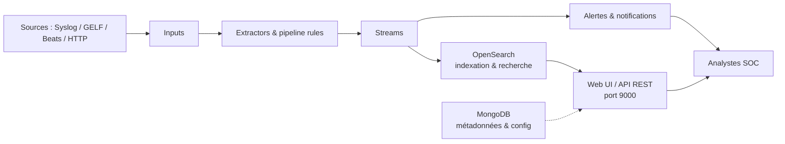

# Graylog — Défense & SIEM

> [!info] **En 1 phrase**
> Graylog est un **remplaçant open source de Splunk** : il ingère les logs (GELF, Syslog...),
> les traite avec des **extractors**, les **streame** par règles, et produit **dashboards et
> alertes** — sans licence ni coût par volume.

---

## Overview

| Champ | Valeur |
|---|---|
| Nom complet | Graylog (plateforme de log management centralisée) |
| Description | Plateforme open source de centralisation, normalisation, recherche et alerte sur les logs (SIEM léger) |
| Catégorie | IDS / SIEM / EDR |
| Sous-catégorie | Log management / SIEM / Corrélation d'événements |
| Fonction principale | Ingérer les logs (GELF, Syslog, Beats...), les transformer (extractors, pipeline rules), les router (streams), les rechercher et alerter |
| Type d'outil | Service serveur (backend + web UI + API REST) |
| Licence | SSPL 1.0 (Server Side Public License, depuis la 4.1) |
| Open source / propriétaire | Open source (modèle open core : Graylog Open / Enterprise / Security) |
| Langage(s) de programmation | Java (serveur), TypeScript/Vue.js (web), Go (sidecar) |
| Développeur / organisation | Graylog, Inc. |
| Projet officiel | Graylog Open |
| Dépôt officiel | https://github.com/Graylog2/graylog2-server |
| Documentation officielle | https://go2docs.graylog.org |
| Date de création | 2009 (projet initié), première release open source 2013 |
| État du projet | actif (Graylog 7.1.7 publiée le 2026-08-05) |
| Dernière version connue | Graylog 7.1.7 (ligne 7.1.x) |
| Systèmes compatibles | Linux (Debian/Ubuntu/RHEL/CentOS), Docker, tarball JVM ; UI accessible depuis n'importe quel navigateur |

> [!note] Pour vérifier / compléter
> Graylog 7.1.x nécessite **MongoDB 7.x à 8.2.x** et un backend de recherche **OpenSearch 1.1.x à 2.19.5** (ou le **Data Node** intégré, méthode recommandée). OpenSearch 3.0+ n'est **pas** supporté : ne pas l'installer.

---

## Concept

Graylog centralise les logs avec une architecture **messages → extraction → streams** : les messages entrent par des **inputs** (GELF, Syslog, Beats, HTTP...), les **extractors** et **pipeline rules** transforment et enrichissent les champs, puis les **streams** routent les messages vers l'indexation, les alertes et les notifications. C'est le concurrent direct de Splunk en open source : mêmes concepts (recherche plein texte, dashboards, alertes, pipeline de traitement) mais **gratuit, self-hosted et sans licence par volume**. Moins médiatisé que l'ELK Stack, il est populaire dans les PME/ESN pour la gestion centralisée des logs avec un effort d'administration réduit.

Depuis la 6.x, Graylog s'est affranchi d'Elasticsearch : le backend de recherche est **OpenSearch** (fork open source de la dernière version Apache d'Elasticsearch 7.x), et le **Data Node** embarqué simplifie l'installation (OpenSearch optimisé et piloté par Graylog). Le serveur reste articulé autour de **MongoDB** pour les métadonnées (configs, users, streams, dashboards) et d'OpenSearch pour les messages indexés.

Dans un SOC, Graylog sert de **plateforme de corrélation** : on y centralise les logs d'authentification (SSH, Windows), les pare-feux, les proxys et les applications ; les **streams** isolent les signaux et déclenchent des alertes ; les **dashboards** donnent la vue d'ensemble. La recherche (`source:firewall AND message:"drop"`), la syntaxe Lucene et l'API REST automatisent détection et reporting. Plus léger qu'un SIEM complet (Splunk, QRadar), il se positionne sur la gestion de logs centralisée à coût maîtrisé.



---

## Concepts fondamentaux

| Concept | Explication |
|---|---|
| Input | Point d'entrée réseau d'un type de logs (Syslog UDP 514, GELF TCP/UDP/HTTP, Beats, JSON Path, Raw TCP...) |
| Message | Unité de base : document JSON normalisé avec champs obligatoires `message`, `source`, `timestamp`, `streams` |
| Extractor | Transformateur appliqué sur un champ d'entrée : regex, grok, JSON, CSV, split & index, key=value, copie |
| Pipeline rule | Règle de traitement écrite en langage Graylog (`rule "nom" when ... then ... end`), plus maintenable que les extractors |
| Pipeline | Ensemble ordonné de pipeline rules appliqué aux messages (stage 0, 1, 2...) |
| Stream | Filtre (règles de correspondance sur champs) qui route les messages vers des sorties, alertes et index sets |
| Event definition | Règle d'événements (filtre ou agrégation type `count > X`) qui génère des events et peut déclencher des alertes |
| Notification | Moyen d'alerte : email, Slack, webhook HTTP, PagerDuty, ServiceNow, Teams |
| Index set | Paramétrage de stockage d'un groupe de streams : préfixe d'index, rotation (temps/taille), rétention (delete/close) |
| OpenSearch | Backend de recherche : stocke les messages indexés (Lucene), interrogeable par l'API de recherche |
| Data Node | OpenSearch embarqué et géré par Graylog (méthode d'installation recommandée en 7.x) |
| MongoDB | Base de métadonnées : utilisateurs, rôles, streams, dashboards, configs, alertes |
| Sidecar | Collecteur unifié (Go) qui pilote filebeat/winlogbeat/collecteurs depuis l'UI, via configurations et tags |
| GELF | Graylog Extended Log Format : format JSON structuré (host, short_message, level, champs custom `_xxx`) |
| Message journal | Journal disque (Linux) qui garantit la durabilité des messages avant indexation |

---

## Installation

### Debian / Ubuntu / Kali Linux

```bash
# 1. Ajouter le dépôt Graylog 7.1 et installer le serveur + le Data Node
wget https://packages.graylog2.org/repo/packages/graylog-7.1-repository_latest.deb
sudo dpkg -i graylog-7.1-repository_latest.deb
sudo apt-get update
sudo apt-get install -y graylog-server graylog-datanode

# 2. Configurer MongoDB (déjà fourni sur Debian/Ubuntu)
sudo apt-get install -y mongodb-org  # ou mongodb local (mongod)

# 3. Configurer les secrets dans /etc/graylog/server/server.conf
#    password_secret = <64+ caractères aléatoires>
#    root_password_sha2 = $(echo -n 'admin' | sha256sum)

# 4. Démarrer le Data Node puis le serveur
sudo systemctl enable --now graylog-datanode
sudo systemctl enable --now graylog-server
```

### Docker

```bash
# Stack officielle : MongoDB + OpenSearch + Graylog + Data Node (docker-compose)
docker compose up -d
# L'UI est sur http://localhost:9000 (admin / admin par défaut, à changer)
```

### RHEL / CentOS / Fedora

```bash
sudo rpm -Uvh https://packages.graylog2.org/repo/packages/graylog-7.1-repository_latest.rpm
sudo dnf install -y graylog-server graylog-datanode
# Puis config identique : server.conf + datanode.yml
```

### Windows

```powershell
# Pas de binaire Windows : Graylog s'exécute sous Linux ou via Docker Desktop
# Le collecteur sidecar (go) existe en .exe : piloté depuis l'UI Graylog
```

### Sidecar (collecteur côté endpoints)

```bash
wget https://packages.graylog2.org/repo/packages/graylog-sidecar_1.5.0-1_all.deb
sudo dpkg -i graylog-sidecar_1.5.0-1_all.deb
# Config : /etc/graylog/sidecar.yml (server_url, api_token, tags)
sudo graylog-sidecar service install
```

> [!warning] Prérequis & problèmes potentiels
> - **OpenSearch 3.0+ n'est PAS supporté** : rester en 2.19.5 maximum (ou utiliser le Data Node).
> - MongoDB 7.x–8.2.x requis pour Graylog 7.1.x ; les versions plus anciennes ne sont pas acceptées.
> - `password_secret` doit faire **au moins 64 caractères**, sinon le serveur ne démarre pas.
> - `root_password_sha2` = SHA-256 du mot de passe admin initial : à définir **avant** le premier démarrage.
> - Penser au TLS sur les inputs réseau et au firewall (ports 9000 UI/API, 5044 Beats, 514/1514 syslog).

---

## Configuration

| Paramètre | Rôle | Valeur possible | Impact | Exemple |
|---|---|---|---|---|
| `password_secret` | Secret de chiffrement des données internes (server.conf) | ≥ 64 caractères | Obligatoire : empêche le démarrage s'il est trop court | `password_secret = 8G4vL...` (128 chars) |
| `root_password_sha2` | Hash SHA-256 du mot de passe admin initial | hash hexadécimal | Authentification initiale de l'UI/API | `$(echo -n 'admin' | sha256sum)` |
| `http_bind_address` | Adresse d'écoute de l'UI/API | `127.0.0.1`, `0.0.0.0` | Exposition du port 9000 : ne jamais l'exposer publiquement | `http_bind_address = 10.10.20.15:9000` |
| `http_port` | Port de l'UI/API | 9000 (défaut) | Port d'accès web et REST | `http_port = 9000` |
| `elasticsearch_hosts` | URL du backend OpenSearch (si self-managed) | liste d'URI | Backend de recherche ; inutile avec le Data Node | `elasticsearch_hosts = http://localhost:9200` |
| `message_journal_max_size` | Taille max du journal disque | ex. `5gb` | Durabilité des messages avant indexation | `message_journal_max_size = 5gb` |
| `transport_email_*` | Paramètres SMTP pour les notifications email | host, port, auth | Envoi des alertes par courrier | `transport_email_hostname = smtp.example.com` |
| `trusted_proxies` | Reverse-proxys autorisés (headers X-Forwarded-*) | liste IP/CIDR | Fiable derrière NGINX/HAPROXY | `trusted_proxies = 10.10.20.0/24` |
| `datanode.yml` (node_name, opensearch_data_dir) | Config du Data Node | chemins, node name | Data Node embarqué (OpenSearch géré) | `node_name = "dn-lab-01"` |
| `sidecar.yml` (server_url, api_token, tags) | Connexion du collecteur à Graylog | URL, token, tags | Endpoints enrôlés dans l'UI | `server_url = "http://10.10.20.15:9000/api"` |

> [!note] À vérifier
> Chemins : `/etc/graylog/server/server.conf`, `/etc/graylog/datanode/datanode.yml`, `/etc/graylog/sidecar.yml`. En cluster multi-nœuds, mêmes secrets sur tous les serveurs et tous les endpoints API dans l'UI.

---

## Architecture interne

Composants et flux de données à l'exécution :

- **Graylog Server (Java)** : reçoit les messages via les inputs, les pousse dans le **message journal** (disque, durabilité), puis dans les **pipeline stages** (extractors puis pipeline rules), les fait passer dans les **streams**, les **indexe** dans OpenSearch et gère les **event definitions / alertes**. Expose l'**API REST** (port 9000) et la **web UI**.
- **MongoDB** : stocke uniquement les métadonnées — utilisateurs, rôles, streams, dashboards, index sets, configurations, notifications. Aucun message de log n'y est stocké.
- **OpenSearch** (ou Data Node) : reçoit les messages indexés (format Lucene), répond aux recherches plein texte (syntaxe Graylog Query Language) et aux agrégations des dashboards.
- **Sidecar** : processus Go sur les endpoints ; il télécharge les configurations (filebeat.yml, winlogbeat.yml) définies dans l'UI et gère le cycle de vie des collecteurs. Les beats poussent les logs vers l'input Beats (port 5044) en JSON.
- **Inputs** : Syslog UDP/TCP/TLS (514/1514), GELF UDP/TCP/TLS/HTTP, Beats (5044), JSON Path HTTP, Raw/Plaintext TCP, AMQP, Kafka — chaque input parse le flux selon son type et produit des messages JSON normalisés.

Flux type : événement SSH → rsyslog → input Syslog UDP 514 → extractor `key=value` (parse `Failed password for user`) → pipeline rule `ssh_failed` (set `auth_event=ssh_failed`) → stream « Echecs SSH » → index set `echecs-ssh` + alerte `message_count` → notification email/Slack + widget dashboard.

---

## Commandes

### Commandes principales

```bash
# Santé du serveur et de l'indexation
curl -u admin:CHANGEME -X GET "http://10.10.20.15:9000/api/system/health"

# Recherche sur les 60 dernières minutes
curl -u admin:CHANGEME -X GET "http://10.10.20.15:9000/api/search/relative?query=*&range=600"

# Envoi d'un message GELF manuel pour tester un input
curl -u admin:CHANGEME -H "Content-Type: application/json" -X POST \
  http://10.10.20.15:9000/api/sendgelf \
  -d '{"short_message":"Test GELF","host":"lab","level":3,"facility":"cli","_from":"opencode"}'

# Gestion des streams via l'API
curl -u admin:CHANGEME -X GET "http://10.10.20.15:9000/api/streams"
```

| Commande | Objectif | Résultat attendu |
|---|---|---|
| `GET /api/system/health` | État du serveur | `{"status":"healthy"}` ou `overloaded` |
| `GET /api/search/relative?query=*&range=600` | Recherche sur les N dernières secondes | JSON `messages` + `total_results` |
| `POST /api/sendgelf` | Injecte un message GELF de test | Le message apparaît dans Search |
| `GET /api/streams` | Liste des streams et leurs règles | JSON des streams |
| `GET /api/cluster` | Vue des nœuds du cluster | Nœuds + statut de recherche |
| `GET /api/system/indices/index_sets` | Vue des index sets | Prefixes, rotation, rétention |
| `GET /api/system/sidecars` | Liste des sidecars enregistrés | Endpoints + statut collecteurs |

### Commandes avancées

```bash
# Créer un token d'API pour un utilisateur (automatisation)
curl -u admin:CHANGEME -H "Content-Type: application/json" -X POST \
  http://10.10.20.15:9000/api/users/admin/tokens \
  -d '{"name":"automatisation"}'

# Test de la config du sidecar
sudo graylog-sidecar -c /etc/graylog/sidecar.yml -t
```

---

## Options et flags

| Option | Description | Exemple | Niveau |
|---|---|---|---|
| `query` | Requête de recherche (syntaxe Lucene) | `query=source:firewall AND message:"drop"` | Basic |
| `range` | Fenêtre temporelle en secondes | `range=3600` | Basic |
| `from` / `to` | Bornes de recherche absolues | `from=2026-08-15T00:00:00Z&to=now` | Basic |
| `fields` | Champs à retourner dans les résultats | `fields=message,source,level` | Basic |
| `limit` | Nombre max de messages retournés | `limit=100` | Basic |
| `offset` | Pagination des résultats | `offset=100` | Intermediate |
| `sort` | Tri des résultats | `sort=timestamp:desc` | Intermediate |
| `filter` | Filtre pré-appliqué (streams, etc.) | `filter=streams:<id>` | Advanced |
| `timezone` | Fuseau pour la recherche | `timezone=Europe/Paris` | Advanced |
| `buckets` / `aggs` | Agrégations type dashboard via API | `aggs=term(source.ip,10)` | Advanced |
| `highlight` | Mise en évidence des matchs | `highlight=true` | Expert |

> [!tip] Options les plus utiles au quotidien
> `query` + `range` couvrent 90 % des besoins ; `sort=timestamp:desc` et `fields=message,source` pour de l'analyse rapide ; l'UI Search a des filtres équivalents (opérateurs `AND`, `OR`, `NOT`, guillemets, parenthèses, `field:[from TO to]`).

---

## Exemples pratiques

### Beginner

```bash
# Objectif : vérifier qu'un input reçoit bien des messages
curl -u admin:CHANGEME -X POST http://10.10.20.15:9000/api/sendgelf \
  -H "Content-Type: application/json" \
  -d '{"short_message":"Hello from CLI","host":"lab-client","level":6}'
# Puis dans l'UI : Search → query "Hello from CLI" → le message apparaît en < 5 s
```

### Intermediate

```bash
# Objectif : envoyer les logs d'un serveur Linux via rsyslog vers Graylog
echo '*.* @@10.10.20.15:514' | sudo tee -a /etc/rsyslog.conf
sudo systemctl restart rsyslog
# Vérifier : GET /api/search/relative?query=source:10.10.20.16&range=300
```

### Advanced

```text
# Objectif : extraire l'utilisateur et l'IP des échecs SSH avec un extractor grok
# Pattern : Failed password for %{USERNAME:user} from %{IP:source_ip} port %{INT:source_port}
# Règle de stream : source_ip MATCHES regex "10\.10\.20\." → stream "Scan interne"
```

### Expert

```text
# Objectif : corrélation multi-sources via pipeline rules
# Rule "auth_anomaly" : si un même source_ip produit des échecs ET un succès, le marquer
rule "ssh_anomaly_lab"
when
  has_field("auth_event") &&
  ($message.message contains "Failed password" or $message.message contains "Accepted")
then
  set_field("correlated", "ssh");
  route_to_stream("Investigation");
end
```
Les alertes d'agrégation (`count > X` en 5 min) se créent dans System → Alerts → Event definitions (voir Workflow complet), sans curl.

---

## Workflow complet (scénario pas à pas)

1. **Installer** le serveur, le Data Node et MongoDB ; définir `password_secret` et `root_password_sha2`, démarrer `graylog-datanode` puis `graylog-server`.
2. **Créer un input** *System → Inputs* : `Syslog UDP` port **514** pour centraliser les logs Linux ; noter l'ID généré (nécessaire pour les streams et l'API).
3. **Brancher un endpoint** : envoyer les logs de `10.10.20.16` via rsyslog (`echo '*.* @@10.10.20.15:514' >> /etc/rsyslog.conf` puis `systemctl restart rsyslog`).
4. **Extraire les champs** : dans *Search*, ouvrir un message syslog, *Extractor* — grok `Failed password for %{USERNAME:user} from %{IP:source_ip} port %{INT:source_port}` pour obtenir `user` et `source_ip`.
5. **Router via un stream** : *Streams → New stream* `Echecs SSH`, règle `message CONTAINS "Failed password"`, puis *Manage*.
6. **Créer une alerte** : sur le stream, *Alerts → Event definitions* — agrégation `count` > 5 échecs en 5 min → notification **email** et **webhook**.
7. **Construire un dashboard** : *Dashboards → Create* `SSH Lab` avec widgets : top `source_ip`, top `user`, série temporelle des échecs sur 24 h.

---

## Scénarios avancés

### Scénario 1 : corrélation de bruteforce SSH en pipeline rule

```text
rule "ssh_failed_alert"
when
  has_field("facility") && contains(to_string($message.message), "Failed password")
then
  set_field("auth_event", "ssh_failed");
  route_to_stream("Echecs SSH");
end
# Appliquer la règle au pipeline "auth" puis l'activer (System → Pipelines)
```
Les pipeline rules remplacent les extractors pour la production : plus lisibles, versionnables et applicables en masse à plusieurs inputs à la fois.

### Scénario 2 : collecte Windows / Linux centralisée avec le sidecar

```bash
# Sur chaque endpoint : installer le sidecar, renseigner server_url + api_token
sudo graylog-sidecar -c /etc/graylog/sidecar.yml -t    # test de la config
sudo graylog-sidecar service install
# UI : System → Sidecars → configuration "filebeat-windows" (filebeat.yml,
# input Security/System/Application, tags "windows") → le sidecar télécharge
# la config, lance filebeat, et les événements 4624/4625 arrivent dans Graylog.
```

### Scénario 3 : multi-nœud et haute disponibilité

```bash
# Serveur 1 : http_bind_address 10.10.20.15:9000
# Serveur 2 : http_bind_address 10.10.20.16:9000 (mêmes password_secret/root_password_sha2)
# MongoDB en replica set ; OpenSearch multi-nœuds ; les inputs peuvent pointer sur les 2 serveurs.
curl -u admin:CHANGEME http://10.10.20.15:9000/api/cluster   # 2 nœuds visibles
```

---

## Cybersecurity use cases

| Phase | Utilisation |
|---|---|
| Détection (SOC) | Corrélation d'échecs d'authentification, alertes temps réel sur streams |
| Log management | Centralisation Syslog/GELF/Beats : pare-feux, serveurs, applications |
| Investigation | Recherche plein texte + timeline, dashboards de synthèse par incident |
| Threat hunting | Chasse sur les logs historiques : patterns inhabituels, IP anormales |
| Conformité | Rétention d'index par index set, reporting réglementaire automatisé via API |
| Audit | Traçabilité des connexions admin (sessions API, accès UI) |

---

## MITRE ATT&CK

| Tactique | Technique / Sub-technique | ID | Raison | Détection | Mitigation |
|---|---|---|---|---|---|
| Credential Access | Brute Force | T1110 | Échecs de connexion répétés (SSH, RDP, AD) corrélables dans les logs | Stream `message contains "Failed password"` + alerte `count > 5/5min` | Verrouillage de comptes, MFA, rate limiting |
| Initial Access | Valid Accounts | T1078 | Utilisation de comptes compromis ou comptes admin connus | Alerte sur les logons admin hors horaires/IP connus | MFA, privilèges minimaux, revue des comptes |
| Lateral Movement | Remote Desktop Protocol | T1021.001 | Logons RDP 4624 LogonType 10 anormaux | Stream `LogonType=10` + corrélation source/destination | Network segmentation, bastion |
| Command and Control | Application Layer Protocol | T1071 | Trafic C2 sur protocoles applicatifs visibles dans les logs proxy/DNS | Corrélation domaines suspectés + volume sortant | Egress filtering, inspection TLS |
| Exfiltration | Exfiltration Over Web Service | T1567 | Upload vers services web (pastebin, storage) | Recherche `destination_domain` + alerte volume | Proxy filter, Data Loss Prevention |

> [!note] Ne renseigner que si l'association est réellement pertinente.
> Graylog ne fait pas de détection endpoint : associer les alertes à un EDR/AV (Exemple : [[Outil - Wazuh]]) pour couvrir la matrice complète.

---

## Defensive Security

### Signes observables

| Indicateur | Détail |
|---|---|
| Pics d'échecs SSH/RDP suivis d'un succès | Corrélation streams + alerte, verrouillage de comptes, MFA |
| Accès UI/API depuis des IP inconnues | Sessions API, `trusted_proxies`, alerte sur logons admin |
| Suppression/fermeture d'index inexpliquée | Audit des actions via l'API et les logs d'audit Graylog |
| Inputs silencieux (collecteur arrêté) | Alerte sur l'absence de messages (beacon de logs) |
| Messages non parsés (champs vides) | Modéliser extractors/pipeline rules avant de brancher les flux |
| Tokens API créés sans justification | Revue périodique des tokens dans System → Users |

### Règles de détection (Sigma / Suricata / Snort / YARA)

```yaml
# Sigma — échecs SSH répétés depuis la même source (données Graylog via Winlogbeat/Filebeat)
title: Multiple SSH Failures From Single Source
id: 9f2c3d1e-4a5b-4c6d-8e7f-0a1b2c3d4e5f
status: experimental
logsource:
    product: linux
    service: auth
detection:
    selection:
        message: "Failed password"
    condition: selection
    timeframe: 5m
falsepositives:
    - Scripts d'administration (ansible, monitoring)
level: medium
```

---

## Automatisation

```bash
# Bash — surveillance de santé + envoi GELF si problème
while true; do
  status=$(curl -s -u admin:CHANGEME http://10.10.20.15:9000/api/system/health | jq -r '.status')
  [ "$status" != "healthy" ] && curl -u admin:CHANGEME -H "Content-Type: application/json" -X POST \
    http://10.10.20.15:9000/api/sendgelf \
    -d '{"short_message":"Graylog NOT healthy","host":"monitor","level":1}'
  sleep 30
done
```

```python
# Python — recherche et agrégation via l'API REST
import requests

BASE = "http://10.10.20.15:9000/api"
auth = ("admin", "CHANGEME")

r = requests.get(f"{BASE}/search/relative",
                 params={"query": 'message:"Failed password"', "range": 3600},
                 auth=auth)
data = r.json()
print("total:", data["total_results"])
for m in data["messages"][:5]:
    print(m["message"].get("source"), m["message"].get("source_ip"), m["message"].get("user"))
```

---

## Output et parsing

L'API REST renvoie du **JSON** (recherche, streams, événements, index sets). La sortie de recherche expose `total_results`, `messages[]` (chacun avec `message`, `index`, `decoration_stats`) et `fields`. Les messages sont des objets plats avec champs normalisés (`timestamp`, `source`, `level`, plus champs custom `_*` ou extractés).

```bash
# Extraire les IP sources des 100 premiers messages
curl -s -u admin:CHANGEME -X GET \
  "http://10.10.20.15:9000/api/search/relative?query=*&range=600&fields=source_ip,user,message&limit=100" \
  | jq -r '.messages[].message.source_ip' | sort | uniq -c | sort -rn
```

---

## Intégrations

```text
rsyslog / Syslog-ng → Graylog (input Syslog UDP 514)
Filebeat / Winlogbeat → Graylog (input Beats 5044) via sidecar
Suricata → Filebeat eve.json → Graylog (streams détection réseau)
Graylog → webhook HTTP → Slack / PagerDuty / Teams
Graylog API → scripts d'orchestration (playbooks d'investigation)
```

- [[Tools| Outils]]
- [[Outil - Splunk]] — SIEM concurrent commercial, migration possible des recherches
- [[Outil - Elastic]] — stack alternative : même concept de centralisation, plus SIEM/EDR
- [[Outil - Wazuh]] — XDR open source : aliments en parallèle pour la couverture endpoint
- [[Outil - Suricata]] — alertes réseau ingérées et corrélées dans les streams
- [[Outil - osquery]] — requêtes système poussées vers Graylog pour la posture
- [[Outil - Velociraptor]] — investigations DFIR déclenchées depuis une alerte Graylog
- [[Outil - Sigma]] — règles converties/portées en recherches ou event definitions

---

## Alternatives

| Outil | Avantages | Inconvénients | Cas d'usage |
|---|---|---|---|
| Splunk | SPL puissant, écosystème apps, support commercial | Propriétaire, coût par volume | Grands SOC entreprise |
| Elastic Stack | Recherche/agrégations très riches, Detections Engine, EDR | Plus lourd à administrer, RAM élevée | SOC + détection complète |
| Loki (Grafana) | Léger, indexation par labels, intégré Grafana | Recherche plein texte limitée, pas de vrai SIEM | Logs légers + Prometheus |
| Wazuh | XDR complet avec agents, FIM, vulnérabilités | Dashboard moins orienté recherche | SOC open source consolidé |
| Security Onion | Distribution complète (Suricata+Zeek+Elastic) | Moins souple sur la collecte custom | SOC réseau clé en main |

> **Quand utiliser Elastic plutôt que Graylog ?** Si la priorité est la **détection** (règles SIEM, EDR, corrélation avancée) et des **agrégations lourdes**. Graylog reste gagnant pour une **centralisation de logs simple à administrer**, à coût maîtrisé et avec une UI intuitive.

---

## Performance

- Architecture à 3 rôles : Graylog Server (Java, CPU/IO), MongoDB (métadonnées légères), OpenSearch (indexation) — dimensionner OpenSearch sur le volume de messages.
- Le **message journal** (Linux) garantit la durabilité mais consomme du disque : borner avec `message_journal_max_size` (5-10 Go par nœud en lab).
- Indexation en **bulk** : en dessous de quelques milliers de messages/s, un serveur 4 vCPU/8 Go suffit pour un lab/PME ; dimensionner OpenSearch selon le volume de messages.
- La **rétention** est paramétrable par index set (rotation temps/taille, fermeture/suppression) : ne pas la laisser illimitée.
- Les **pipeline rules** et extractors gourmands (regex complexes sur chaque message) ralentissent l'ingestion : tester en simulation (System → Pipelines → Simulation).

---

## Troubleshooting

### Common problems

#### Problème : le serveur ne démarre pas (erreur password_secret)

- **Cause** : `password_secret` inférieur à 64 caractères dans `server.conf`.
- **Solution** : générer un secret long (`head -c 96 /dev/urandom | base64`) et reconfigurer.
- **Vérification** : `sudo systemctl status graylog-server` et `journalctl -u graylog-server`.

#### Problème : l'UI tourne mais aucun message n'est indexé

- **Cause** : input absent ou mal configuré, ou backend de recherche inaccessible.
- **Solution** : vérifier l'input (System → Inputs, statut « Running »), la connectivité OpenSearch (`GET /api/system/health`) et envoyer un GELF de test.
- **Vérification** : `curl -u admin:CHANGEME http://10.10.20.15:9000/api/system/health`.

#### Problème : les messages arrivent mais les champs ne sont pas extraits

- **Cause** : extractor/pipeline rule non appliqués ou mal positionnés (stages).
- **Solution** : tester la pipeline rule en **simulation** (System → Pipelines) et vérifier l'ordre des stages ; rappel : les extractors ne sont **pas rétroactifs**.
- **Vérification** : dans Search, ouvrir un message récent et regarder les champs disponibles.

#### Problème : alertes qui ne se déclenchent pas

- **Cause** : event definition mal configurée, stream vide ou notification invalide.
- **Solution** : tester la recherche de l'event definition dans Search, vérifier que le stream route bien les messages, puis le webhook.
- **Vérification** : onglet Alerts de l'UI + logs du serveur.

---

## Sécurité de l'outil

- **Accès UI/API** : ne jamais exposer le port 9000 sur Internet ; derrière un reverse-proxy (NGINX) avec TLS et SSO si possible ; paramétrer `trusted_proxies`.
- **Mots de passe** : `root_password_sha2` défini avant le premier démarrage, rotation périodique ; utilisateurs à rôles minimaux (Admin/Manager/Reader).
- **Tokens API** : utiliser des tokens dédiés (et non le mot de passe admin) pour l'automatisation ; les révoquer en cas de départ ou d'incident.
- **Inputs réseau** : activer TLS sur les inputs Syslog/GELF quand le canal le permet ; filtrer les ports (514, 1514, 5044) par firewall.
- **Backend** : MongoDB et OpenSearch en TLS, mots de passe uniques, sauvegardes régulières des index sets (les alertes/streams se reconstruisent, les messages non).
- **Risque offensif** : un adversaire ayant accès à l'UI peut lire les logs (secrets exposés), modifier les streams/alertes pour masquer ses traces ou supprimer des index — auditer les sessions API et les journaux d'audit de l'instance.

---

## Limitations

- Pas d'EDR : la détection endpoint relève des agents externes (Wazuh, Elastic Defend, AV).
- OpenSearch 3.0+ non supporté : la mise à niveau du backend de recherche est un point de blocage à anticiper.
- Le **parsing** nécessite un travail de modélisation (extractors/pipeline rules) qui n'est pas rétroactif : un flux mal modélisé reste inexploitable.
- La corrélation multi-événements reste plus simple que dans un vrai SIEM (pas de langage d'événements séquencés type EQL).
- SSPL 1.0 : licence forte (cloud SaaS du code nécessite la publication des sources), à vérifier selon l'usage.
- Ressources : Java + MongoDB + OpenSearch sont lourds pour un très petit environnement ; un lab minimal demande ~4 Go RAM.

---

## Cheatsheet

```bash
# Santé et statut
curl -u admin:CHANGEME http://10.10.20.15:9000/api/system/health

# Recherche (60 dernières minutes)
curl -u admin:CHANGEME "http://10.10.20.15:9000/api/search/relative?query=*&range=600"

# Test d'input avec un message GELF manuel
curl -u admin:CHANGEME -H "Content-Type: application/json" -X POST \
  http://10.10.20.15:9000/api/sendgelf \
  -d '{"short_message":"Test","host":"lab","level":6}'

# Liste des streams / index sets
curl -u admin:CHANGEME http://10.10.20.15:9000/api/streams
curl -u admin:CHANGEME http://10.10.20.15:9000/api/system/indices/index_sets

# Recherche des échecs SSH avec jq (top IP)
curl -s -u admin:CHANGEME "http://10.10.20.15:9000/api/search/relative?query=message:%22Failed%20password%22&range=86400&fields=source_ip&limit=1000" \
  | jq -r '.messages[].message.source_ip' | sort | uniq -c | sort -rn

# Pipeline rule basique (dans System → Pipelines)
# rule "ssh_failed" when has_field("facility") && contains(to_string($message.message), "Failed password") then set_field("auth_event", "ssh_failed"); route_to_stream("Echecs SSH"); end
```

---

## Quick reference

| | |
|---|---|
| **À quoi sert-il ?** | Centralisation, normalisation, recherche et alerte sur les logs (SIEM open source) |
| **Quand l'utiliser ?** | Dès qu'il faut un log management centralisé à coût maîtrisé sans licence par volume |
| **Commande principale** | `curl -u admin:CHANGEME http://<serveur>:9000/api/system/health` |
| **Alternative principale** | Splunk (commercial), Elastic Stack (SIEM/EDR), Loki (léger) |
| **Concepts importants** | Inputs, extractors, pipeline rules, streams, event definitions, index sets, Data Node/OpenSearch, MongoDB, sidecar |
| **Liens associés** | [[Outil - Splunk]] · [[Outil - Elastic]] · [[Outil - Wazuh]] · [[Outil - osquery]] |

---

## Détection & Défense

| Signe | Défense |
|---|---|
| Volume anormal d'échecs d'authentification | Streams + alertes `count > X` sur les échecs, verrouillage de comptes |
| Connexions admin hors horaires ou hors IP connues | Streams dédiés admin, alertes temps réel, MFA |
| Inputs silencieux (collecteur arrêté) | Alerte sur l'absence de messages (beacon de logs) |
| Champs non parsés (message brut inexploitable) | Modéliser extractors/pipeline rules avant de brancher les flux |
| Suppression/fermeture d'index inexpliquée | Audit des actions API, alertes sur les changements de config |

---

## Tips & Pièges

> [!tip] **Teste chaque input avant déploiement**
> Un input qui reçoit mal les logs = silencieux et inutile. Envoie un message GELF de test (`sendgelf`), vérifie qu'il apparaît dans *Search* puis dans le bon **stream**. Chaque silence sur un flux critique doit être considéré comme une alerte.

> [!tip] **Pipeline rules avant extractors**
> Pour la production, écrire des **pipeline rules** (versionnables, testables en simulation) plutôt que des extractors un à un par input : la maintenance est nettement plus simple à grande échelle.

> [!tip] **Un dashboard = un état du SIEM**
> Créer un dashboard « SOC » de référence (top sources, top événements, volume par source, alertes actives) : c'est la première chose à regarder lors d'un incident.

> [!warning] **Piège** : les **extractors** sont appliqués à la volée et non rétroactifs.
> Un extractor créé après ingestion ne corrige pas les messages déjà indexés : pense la modélisation (champs, streams) **avant** de brancher les flux, sinon les recherches historiques seront incohérentes.

> [!warning] **Piège** : OpenSearch 3.0+ n'est pas supporté.
> Lors d'une mise à jour du backend, bloquer la version (apt hold / verrou de paquet) pour rester ≤ 2.19.5, sinon l'instance casse.

> [!warning] **Piège** : ne pas confondre message, stream et index set.
> Le stream route (filtre), l'index set stocke (rotation/rétention). Deux streams peuvent partager un index set ; un stream sans index set défini peut ne pas être indexé correctement.

---

## References

### Official

- Site officiel : https://www.graylog.org
- Documentation officielle : https://go2docs.graylog.org
- GitHub Graylog Server : https://github.com/Graylog2/graylog2-server
- Annonce Graylog 7.1.0 : https://graylog.org/post/announcing-graylog-7-1-0/
- Upgrade vers Graylog 7.1 : https://go2docs.graylog.org/current/upgrading_graylog/upgrade_to_graylog_7.1.htm

### Security references

- MITRE ATT&CK T1110 — Brute Force : https://attack.mitre.org/techniques/T1110/
- MITRE ATT&CK T1078 — Valid Accounts : https://attack.mitre.org/techniques/T1078/
- Graylog Security (offre) : https://www.graylog.org/products/graylog-security

### Community

- Docs installation Ubuntu + OpenSearch self-managed : https://go2docs.graylog.org/current/downloading_and_installing_graylog/ubuntu_installation_os.html
- Compatibilité des versions : https://go2docs.graylog.org/current/downloading_and_installing_graylog/compatibility_matrix.htm
- Forum communautaire : https://community.graylog.org

---

**Liens :** [[Tools| Outils]] · [[Techniques/Reverse Shells| Reverse Shells]] · [[Techniques/Pivoting et Tunneling| Pivoting / Tunneling]] · [[Techniques/LLMNR-NBT-NS Poisoning| LLMNR/NBT-NS Poisoning]] · [[Outil - Splunk]] · [[Outil - Elastic]] · [[Outil - Wazuh]] · [[Outil - osquery]] · [[Outil - Sigma]]
